# 多波束测线布设

## 摘 要

多波束测深系统是由单波束测深发展而来的水深测量系统，研究多波束测线布设对于海洋测绘具有重要意义。本文建立测线优化模型，运用各类几何方法、向量分析、最小二乘法、贪心算法、模拟退火等方法研究多波束测深的覆盖宽度、相邻条带之间的重叠率以及测线布设问题。

针对问题一：首先简要介绍多波束测量仪的工作原理，以海域中心点为坐标原点建立合适的坐标系。其次利用相似三角形原理计算海水深度，并通过几何知识推导关键角的关系式，然后基于正弦定理计算覆盖宽度。接着利用几何知识推导重叠率的计算公式并代入变量计算。最后得到特定位置处的指标，存放在 result1.xlsx 中。同时进行结果分析，并利用控制变量法探究覆盖宽度、重叠率随各参数的变化。

针对问题二：以海域坡面中心为坐标原点建立三维空间坐标系，参考问题一，首先利用向量分析，根据向量叉乘得到测线方向与其在水平面上的投影组成的平面和海底坡面的交线的点向式方程，代入相应坐标求得海水深度。其次，利用线面角计算公式求得水平面与覆盖宽度所在直线的夹角。然后根据问题一建立的模型求解得到特定位置处的覆盖宽度，存放在 result2.xlsx 中。最后进行结果分析以及原因分析。

针对问题三：对于一个具体的矩形海域，首先利用数学证明得到平行等深线走向进行测线布设是最佳方案。其次建立以测线总长度最短为目标，以测线完全覆盖海域、相邻条带之间的重叠率的取值范围为约束条件，建立单目标优化模型。然后基于贪心算法的循环遍历法，确定最优测线布设为34条，得到测线总长度为125936 。最后利用模拟退火对测线布设仿真检验，发现两种方法计算得到的误差很小，由此验证了模型的可靠性，并对开角、坡度进行灵敏度分析。

针对问题四：首先利用单波束测量数据确定海域初貌，发现其地形起伏大，难以求解测线布设。其次参考问题三，利用等深线图对该海域进行初步划分。基于最小二乘法将各划分区域拟合成便于求解的坡面方程，通过粒子群算法求解得到坡面方程，并对拟合效果不佳的区域进行进一步划分。然后仍以测线的总长度最小为优化目标，修正问题三的约束条件，建立单目标优化模型。仍采用贪心算法求解各区域测线布设，得到测线的总长度、漏测海区占总待测海域面积的百分比、叠率超过 部分的总长度分别为622海里、3.48%、30海里。最后进行结果分析和原因分析。

文章的最后，对本文建立的模型进行评价，并在考虑检查线的情况对模型进行一定程度的改进。

关键词：多波束测线布设、目标优化模型、最小二乘法、贪心算法、模拟退火仿真

## 一、 问题重述

多波束测深系统是由单波束测深发展而来的水深测量系统，近年来得到广泛应用。与单束测深仪相比，多束波测深系统能够同时获取多个相邻窄波束，获取条带式的海底地形数据，实现从“点到线”测量到“线到面”的跨越，具有分辨率高、精度高、效率高、覆盖范围大、自动化成图等优势。<sup>[1-2]</sup>

了解多波束测量的工作原理，建立数学模型解决以下问题。

问题一：已知海底的坡度为 ，测线方向垂直于坡面所在的竖直平面，建立多波束测深时覆盖宽度及相邻条带之间重叠率的数学模型，在多波束换能器的开角为 ，坡度为 ，海域中心海水深度为 时应用该模型，计算海水深度、覆盖率重叠率等指标值。

问题二：在一个矩形待测海域中，已知海底坡面法向在水平面上的投影与测线方向的夹角为 ，建立多波束测深覆盖宽度的数学模型。在开角、坡度、海域中心处海水深度确定时，应用该模型计算某些位置、特定 的覆盖宽度。

问题三：在一个长 2海里、宽4海里的矩形海域中，海域中心处海水深度、坡度、开角均已知，在满足完全覆盖、重叠率 10%\~20%的前提下，为该海域设计一组长度最短的测线。

问题四：已知一个确定海域的单波束测量数据，据此设计多波束测量船的测线。为保证测量效果和效率，测线条带要尽可能地完全覆盖整个海域；且相邻条带之间的重叠率尽量小于20%；测线总长度要尽量短。在设计出具体地测线后，从测线的总长度、漏测海域占比、重叠率超过 20%的总长度分析该测线的实施效果。

## 二、 问题分析

## 2.1 问题一的分析

在问题一中，要求在海底坡度为 的情况下建立多波束测深的覆盖宽度和相邻条带之间重叠率的数学模型，并在多波束换能器开角、坡度、海域中心处海水深度等具体参数值下求解海水深度、覆盖宽度和重叠率。首先，以海域中心为坐标原点建立三维空间直角坐标系，由几何知识推导出海水深度的计算公式，在此基础上利用正弦定理得到覆盖宽度的表达式。对于重叠率的计算，根据题目给出海底地形平坦的计算公式推导出重叠率的一般定义式，据此得到重叠率的计算公式。至此，模型建立完成，将具体参数值带入我们的模型中，即可分别得到海水深度、覆盖宽度和重叠率的求解结果。

## 2.2 问题二的分析

在问题二中，已知一个矩形海域，其测线方向与海底坡面的法向在水平面的投影的夹角为 ，要求我们建立覆盖宽度的数学模型，再代入具体参数求解不同位置、不同测线方向夹角的覆盖宽度。由问题一的模型，只要已知水平面与覆盖宽度所在直线的夹角、该位置处的海水深度，就可以求解覆盖宽度，因此我们需要利用立体几何知识建立数学模型得到这两个参数的计算公式，再利用问题一的模型，即可得到问题二覆盖宽度的求解模型，代入具体参数求解即可。

## 2.3 问题三的分析

在问题三中，给出一个具体的矩形海域，要求我们为该海域设计一组测线，满足测量长度最短、可完全覆盖整片待测海域、相邻条带之间的重叠率在 等限制条件。对于多波束测深的测线布设，需要从测线方向和测线间距两个方面考虑，根据国家明确规定，测线方向平行等深线方向最佳，我们对此进行了证明；对于测线间距建立单目标优化模型，在求解时，首先考虑边界覆盖情况，确定东海岸第一条测线，然后基于贪心算法逐步优化求解第二、第三条测线……从而得到最优测线布设。最后，采用模拟退火对求解结果进行仿真验证。

## 2.4 问题四的分析

在问题四中，基于某海域的单波束测量数据，为多波束测量提供测线布设方案。为保证测量的完整性和效率，测线扫描形成的条带要尽量覆盖整片海域；相邻条带重叠率在20%以下为宜；测线长度应尽量短。由于海底地形起伏较大，整片海域直接测量，效果不佳，因此需要根据等深线对海域进行划分，对不同区域分别进行测线布设。根据已知海水深度数据基于最小二乘法确定坡面方程，将各海域地形转化为坡面，利用问题三建立的优化模型确定最优布设方案。

## 三、 模型假设

1. 假设不考虑探测船的垂荡纵摇等运动对测深作业造成的影响。  
2. 假设进行测深作业时，海面上没有漂浮海冰等障碍物影响测线方向的布设。  
3. 假设声波在海水中作匀速直线传播，不会在中途遇到小颗粒等发生折射现象。  
4. 假设单波束测量的海水深度数据较为准确，基本符合该海域的地形，可以为多波束测线布设提供正确参考。

## 四、 符号说明

<table><tr><td>符号</td><td>说明</td><td>单位</td></tr><tr><td>W</td><td>多波束测量覆盖宽度</td><td>m</td></tr><tr><td>θ</td><td>多波束换能器开角</td><td>°</td></tr><tr><td>α</td><td>海底坡度</td><td>°</td></tr><tr><td>D</td><td>海水深度</td><td>m</td></tr><tr><td>η</td><td>相邻条带之间重叠率</td><td>%</td></tr><tr><td> $D_0$ </td><td>问题一海域中心处海水深度</td><td>m</td></tr><tr><td>β</td><td>测线方向与海底坡面的法向在水平面上投影的夹角</td><td>°</td></tr><tr><td>δ</td><td>问题二水平面与覆盖宽度所在直线的夹角</td><td>°</td></tr><tr><td> $H_0$ </td><td>问题二海域中心处海水深度</td><td>m</td></tr><tr><td>L</td><td>问题二测量船距海域中心处的距离</td><td>m</td></tr><tr><td> $l_1$ </td><td>矩形海域南北长度</td><td>m</td></tr><tr><td> $l_2$ </td><td>矩形海域东西宽度</td><td>m</td></tr></table>

## 五、 模型的建立与求解

## 5.1 问题一：多波束测深的覆盖宽度及重叠率的数学模型

在问题一中，要求在海底坡度为 的情况下建立多波束测深的覆盖宽度和相邻条带之间重叠率的数学模型，并在具体参数值下求解海水深度、覆盖宽度和重叠率。首先，我们建立三维直角坐标系，然后由平面几何知识、正弦定理建立模型，得到海水深度、覆盖宽度和重叠率的计算公式，代入具体参数值得到求解结果，具体操作如下。

## 5.1.1 多波束测深的覆盖宽度及重叠率模型的建立

## ◼ 多波束测深原理

为了保证模型的建立符合实际情况，首先对多波束测量仪的工作原理进行简要说明。

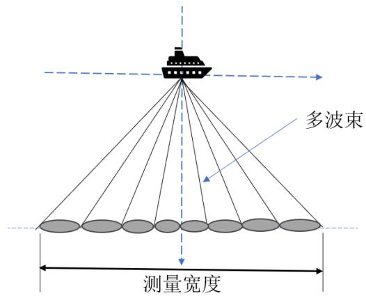

<details>
<summary>text_image</summary>

多波束
测量宽度
</details>

图 1：多波束测深原理图

与单波束测量不同，多波束系统工作时换能器同时发射多束声波（如左图），在垂直于航向方向上形成一个发射波束扇形声波传播区 ，从而得到一个条带覆盖区域内多个测点的海底深度值，实现对海底的条带式测量。<sup>[3]</sup>

## ◼ 三维空间直角坐标系的建立

根据测量船的运动情况，以海域中心点为坐标原点 ，以测量船的行驶方向（测线方向）为 轴，以测线间距的分布方向为 轴，以海水深度方向为 轴，建立三维空间直角坐标系 $O ( x , y , z )$ 如下，问题一建模都在此坐标系中进行。

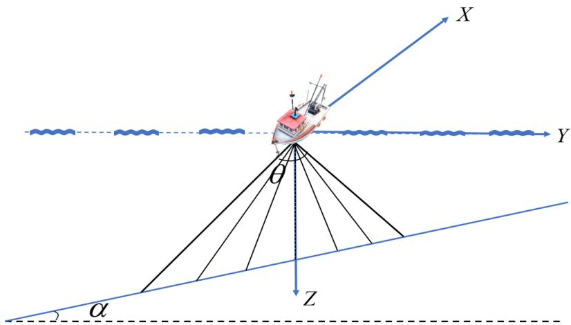

<details>
<summary>text_image</summary>

X
Y
θ
α
Z
</details>

图 2：多波束测量坐标系的建立

## ◼ 多波束测深覆盖宽度及重叠率的计算

## 1) 计算海水深度

如图所示，多波束测深条带的覆盖宽度 与换能器开角 、海水深度 有关。因此，计算多波束在某位置下的覆盖宽度的前提是海水深度已知。我们通过以下步骤计算测线距中心点不同距离下的海水深度。

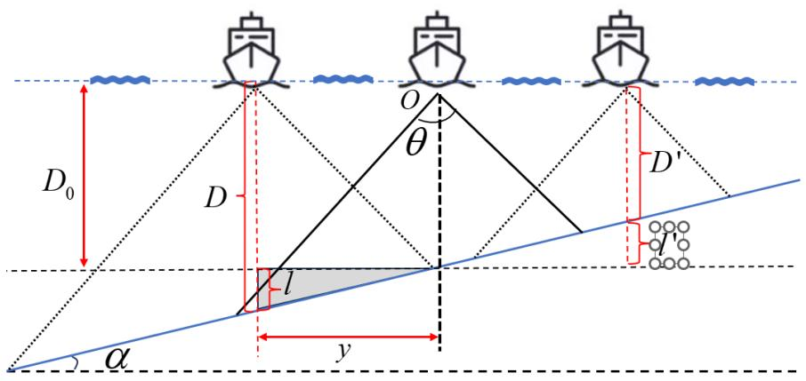

<details>
<summary>text_image</summary>

D₀
D
l
α
y
O
θ
D'
l'
</details>

图 3：不同测线的海水深度

由上图分析可知，测量船在坐标原点 O 处的海水深度为 $D _ { 0 }$ ，测量船在不同位置的海水深度 可由海域中心处的海水深度 $D _ { 0 }$ 和该位置据海域中心的距离 表示。

当测量船在 Y 轴负方向时，海水深度 $D = D _ { 0 } + l$ ，由相似三角形原理，在阴影部分三角形中， $l = y \tan \alpha$ 。当测量船在 Y 轴正方向时，海水深度 $D ^ { \prime } { = } D _ { 0 } { - } l ^ { \prime }$ ，同理，$l ^ { \prime } = y \tan \alpha$

在上文建立的坐标系中，上图中左方为 Y轴负方向，y取负值；右方为 Y轴正方向，y取正值，因此不同位置的海水深度可以统一为下式：

$$
D (y) = D _ {0} - y \tan \alpha \tag {1}
$$

## 2) 基于正弦定理计算覆盖宽度

由式（1）我们已经得到了海水深度的计算方式，在此基础上，通过增添辅助线，结合平面几何知识和正弦定理可以给出覆盖宽度的计算公式，具体操作如下。

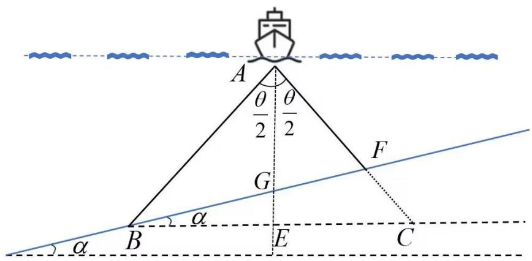

<details>
<summary>text_image</summary>

A
θ/2 θ/2
F
G
α
B
E
C
α
</details>

图 4：覆盖宽度计算

在上图中，过点 作垂线 $A E \bot B C$ ，垂足为 ，交海底坡面 于点G。通过查阅资料，多波束测深系统发射出的波束总是左右对称的，若波束数为奇数，多波换能器左右发射的波束数相等且沿中央波束对称；若波束数为偶数，多波束换能器左右发射的波束数相等且按换能器垂线方向对称。<sup>[4]</sup>即 $\triangle A B C$ 为始终为等腰三角形， $A B = A C$ 。

由几何关系可知，在 $\triangle A B C$ 中， $A B = A C$ 且 $A E \bot B C$ 则易得 平分 $\angle B A C$ ，即$\angle B A E = \angle C A E = \frac { \theta } { 2 }$ 。在 $\triangle A B G$ 和 $\triangle A B F$ 中，由三角形内角和为 ，易得 $\angle A B G =$ $\frac { \pi } { 2 } - \frac { \theta } { 2 } - \alpha$ $\angle A F G = \frac { \pi } { 2 } - \frac { \theta } { 2 } + \alpha$ 。至此，已知相关各角度，下面通过正弦定理将角与边的联系起来，从而求覆盖宽度 $B F$

正弦定理是三角学中的一个基本定理，它指出：在任意一个平面三角形中，各边和它所对角的正弦值的比相等且等于外接圆的直径。在 $\triangle A B G$ $\triangle A F G ^ { \textsf { L } }$ 中，应用正弦定理得：

$$
\begin{array}{l} \frac {B G}{\sin \angle B A G} = \frac {A G}{\sin \angle A B G} \\ \frac {F G}{\sin \angle F A G} = \frac {A G}{\sin \angle A F G} \end{array} \quad \Longrightarrow \quad \begin{array}{l} B G = \frac {A G}{\sin \angle A B G} \cdot \sin \angle B A G \\ F G = \frac {A G}{\sin \angle A F G} \cdot \sin \angle F A G \end{array} \tag {2}
$$

其中，AG即为测量处的海水深度 ， 为多波束测深条带的左覆盖宽度，为多波束测深条带的右覆盖宽度。由 、 可得该处的条带覆盖宽度 为

$$
W = B G + F G = \frac {D (y)}{\sin (\frac {\pi}{2} - \frac {\theta}{2} - \alpha)} \cdot \sin \frac {\theta}{2} + \frac {D (y)}{\sin (\frac {\pi}{2} - \frac {\theta}{2} + \alpha)} \cdot \sin \frac {\theta}{2} \tag {3}
$$

上式中， $D ( y )$ 表示距离海域中心 处的海水深度； 表示多波束换能器开角；表示海底坡度。

## 3) 计算相邻条带之间重叠率

在多波束测量的过程中，为了实现全覆盖测量，保证数据的完整性，相邻测线测量的相邻条带之间应有一定程度的重叠。兼顾测量的便利性和效率，重叠率的最佳值介于 $1 0 \% { \sim } 2 0 \%$ 之间。

由题目可知，在测线相互平行且海底地形平坦的情况下，相邻条带之间重叠率的定义为：

$$
\eta = 1 - \frac {d}{W} = \frac {W - d}{W}
$$

由几何关系易得， $W { - } d$ 表示相邻条带的重叠长度，则根据上式，我们得到相邻条带重叠率的一般定义如下：

$$
\eta = \frac {\text {相邻条带的重叠区域长度}}{\text {该条带的覆盖宽度}}
$$

据此一般定义，可以在问题一中测线相互平行且海底地形为坡面的情况下计算相邻条带之间的重叠率。

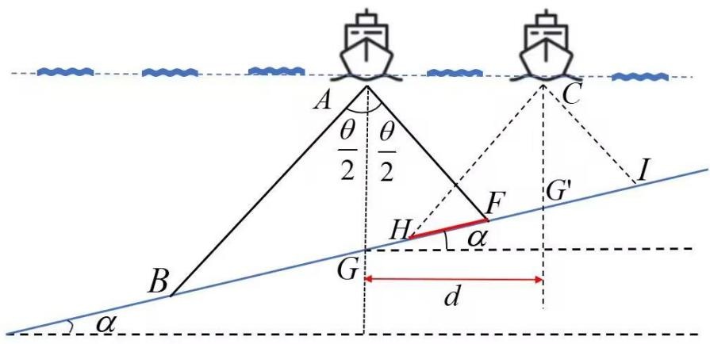

<details>
<summary>text_image</summary>

A
θ/2 θ/2
C
I
F
G'
H
α
G
d
B
α
</details>

图 5：相邻条带之间的重叠

如上图所示，假设距海域中心点 处的测线的覆盖宽度为 $H I$ ，该测线与相邻测线条带的重叠区域为 ，则该测量条带与上一条测线的重叠率 $\eta$ 为：

$$
\eta = \frac {H F}{H I}
$$

距中心点任意处 的测线的覆盖宽度 ，即 $W$ ，在上文中已经求得，关键是求出该测线与其相邻条带的重叠区域 。 $G "$ 四点共线，根据几何关系得：

$$
H F = G G ^ {\prime} - G H - F G ^ {\prime} = G G ^ {\prime} - \left(G G ^ {\prime} - H G ^ {\prime}\right) - \left(G G ^ {\prime} - G F\right) = H G ^ {\prime} + G F - G G ^ {\prime}
$$

其中 $H G "$ 为该测线的测深条带左覆盖宽度， 为相邻于该测线的测线条带右覆盖宽度，在上文中均已给计算表达式（2）。 $G G "$ 是相邻测线的波束打到海底坡面的距离，已知相邻测线之间的间距为 $d$ ，由几何关系得， $G G ^ { \prime } { = } { \frac { d } { \cos \alpha } }$ o

由此可得，距海域中心点 处的测线与相邻测线条带的重叠区域为 $H F$ ：

$$
H F = \frac {D (y)}{\sin (\frac {\pi}{2} - \frac {\theta}{2} - \alpha)} \cdot \sin \frac {\theta}{2} + \frac {D (y - d)}{\sin (\frac {\pi}{2} - \frac {\theta}{2} + \alpha)} \cdot \sin \frac {\theta}{2} - \frac {d}{\cos \alpha}
$$

其中， $D ( y )$ 为距海域中心点 处的海水深度， $d$ 为测线间距， $\theta$ 为多波束换能器的开角， $\alpha$ 为海底坡度。

综上，得到距海域中心点 $y$ 处的测线与其相邻测线条带的重叠率 $\eta$ 为：

$$
\eta = \frac {\frac {D (y)}{\sin (\frac {\pi}{2} - \frac {\theta}{2} - \alpha)} \cdot \sin \frac {\theta}{2} + \frac {D (y - d)}{\sin (\frac {\pi}{2} - \frac {\theta}{2} + \alpha)} \cdot \sin \frac {\theta}{2} - \frac {d}{\cos \alpha}}{W} \tag {4}
$$

➢ 至此，综合式（1）、（3）、（4），可以得到多波束测深的覆盖宽度及重叠率的数学模型为：

$$
\left\{ \begin{array}{l} D (y) = D _ {0} - y \tan \alpha \\ W = \frac {D (y)}{\sin \left(\frac {\pi}{2} - \frac {\theta}{2} - \alpha\right)} \cdot \sin \frac {\theta}{2} + \frac {D (y)}{\sin \left(\frac {\pi}{2} - \frac {\theta}{2} + \alpha\right)} \cdot \sin \frac {\theta}{2} \\ \frac {D (y)}{\sin \left(\frac {\pi}{2} - \frac {\theta}{2} - \alpha\right)} \cdot \sin \frac {\theta}{2} + \frac {D (y - d)}{\sin \left(\frac {\pi}{2} - \frac {\theta}{2} + \alpha\right)} \cdot \sin \frac {\theta}{2} - \frac {d}{\cos \alpha} \\ \eta = \frac {}{W} \end{array} \right. \tag {5}
$$

## 5.1.2 海水深度、覆盖宽度、重叠率的求解

根据上述建立的模型（5），将多波束换能器的开角 $\theta = 1 2 0 ^ { \circ }$ ，坡度 $\alpha { = } 1 . 5 ^ { \circ }$ 海域中心点处的海水深度 $D _ { 0 } = 7 0 m$ ，测线间距 $d = 2 0 0 m$ 等参数值代入我们的模型，利用 MATLAB 编写程序求解，即可得到特定位置处的海水深度、覆盖宽度以及与前一条测线的重叠率，所得结果如下表所示。

表 1 问题一的计算结果

<table><tr><td>测线距中心点处的距离/m</td><td>-800</td><td>-600</td><td>-400</td><td>-200</td><td>0</td><td>200</td><td>400</td><td>600</td><td>800</td></tr><tr><td>海水深度/m</td><td>90.95</td><td>85.71</td><td>80.47</td><td>75.24</td><td>70.00</td><td>64.76</td><td>59.53</td><td>54.29</td><td>49.05</td></tr><tr><td>覆盖宽度/m</td><td>315.81</td><td>297.63</td><td>279.44</td><td>261.26</td><td>243.07</td><td>224.88</td><td>206.70</td><td>188.51</td><td>170.33</td></tr><tr><td>与前一条测线的重叠率/%</td><td>—</td><td>35.70</td><td>31.51</td><td>26.74</td><td>21.26</td><td>14.89</td><td>7.41</td><td>-1.53</td><td>-12.36</td></tr></table>

##  结果分析

① 海水深度：不同位置的海水深度随着测线距中心点处的距离增大而减小，减小幅度为tan，与海底的坡高沿 Y 轴方向增大相符。海水深度只与海域中心处的海水深度和海底坡度 有关。  
② 覆盖宽度：多波束测量的覆盖宽度与海水深度的变化趋势一致，随着海水深度的减小而减小，说明在测线间距、换能器开角一定时，多波束测量仪在浅水区的覆盖宽度更小。  
③ 重叠率：分析上表可知，在海水深度较大处相邻条带之间重叠率较大，能够实现全覆盖，但影响效率；在海水深度较小处相邻条带之间的重叠率较小甚至小于 0，出现漏测现象。因此，在深水区可以增大测线间距，从而提高测量效率；相应地，在浅水区应增加测线布设数量，从而实现全覆盖。

## 5.1.3 控制变量法探究覆盖宽度、重叠率随各参数的变化规律

根据上述的结果分析，为了深入探究覆盖宽度、重叠率随各参数的变化规律，我们利用控制变量法，分别探究多波束换能器的开角 对条带的覆盖宽度 和重叠率的影响以及测线间距 对相邻条带的重叠率的影响。

##  多波束换能器的开角对覆盖宽度的影响

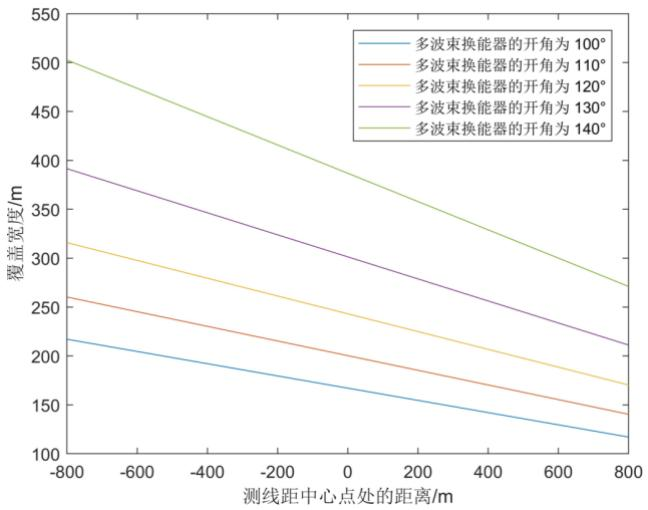

<details>
<summary>line</summary>

| 测线距中心点处的距离/m | 多波束换能器的开角为 \(100{}^{\circ}\) (m) | 多波束换能器的开角为 \(110{}^{\circ}\) (m) | 多波束换能器的开角为 \(120{}^{\circ}\) (m) | 多波束换能器的开角为 \(130{}^{\circ}\) (m) | 多波束换能器的开角为 \(140{}^{\circ}\) (m) |
| --- | --- | --- | --- | --- | --- |
| -800 | ~218 | ~260 | ~315 | ~390 | ~502 |
| 800 | ~118 | ~142 | ~172 | ~212 | ~272 |
</details>

图 6：覆盖宽度随开角的变化

左图为覆盖宽度随换能器的开角 的变化曲线。保持测线间距不变，多次改变多波束换能器的开角 ，可以发现开角越大，距中心点不同距离测量的覆盖宽度越大。此外，对于固定一开角 对应的曲线，覆盖宽度会随着测线距中心点处的距离增大而减小，即海水深度越小，测量的覆盖宽度越小。从数值结果上来看，减少的量满足等差数列，即该线实际上是一条直线。

##  多波束换能器的开角对重叠率的影响

右图为重叠率随换能器的开角的变化曲线。保持测线间距 不变，多次改变多波束换能器的开角，可以发现开角越大，相邻条带之间的重叠率越大。这导致了不同开角下重叠率在 10%\~20%范围的差异较大，即开角越大，满足重叠率范围条件的测线距中心点处距离越大。此外，对于固定一开角 对应的曲线，重叠率会沿 Y轴方向不断减小至小于 0，又海水深度随 Y 轴递减，说明浅水区会出现漏测现象。

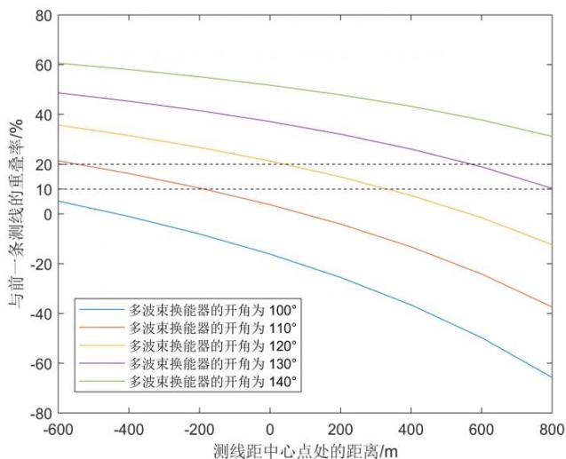

<details>
<summary>line</summary>

| 测线距中心点处的距离/m | \(多波束换能器的开角为100{}^{\circ}\) (%) | \(多波束换能器的开角为110{}^{\circ}\) (%) | \(多波束换能器的开角为120{}^{\circ}\) (%) | \(多波束换能器的开角为130{}^{\circ}\) (%) | \(多波束换能器的开角为140{}^{\circ}\) (%) |
| --- | --- | --- | --- | --- | --- |
| -600 | ~5 | ~21 | ~36 | ~49 | ~61 |
| 800 | ~-65 | ~-37 | ~-13 | ~10 | ~32 |
</details>

图 7：重叠率随开角的变化

##  测线间距对重叠率的影响

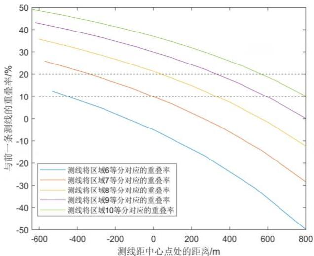

<details>
<summary>line</summary>

| 测线距中心点处的距离/m | 测线将区域6等分对应的重叠率/% | 测线将区域7等分对应的重叠率/% | 测线将区域8等分对应的重叠率/% | 测线将区域9等分对应的重叠率/% | 测线将区域10等分对应的重叠率/% |
| --- | --- | --- | --- | --- | --- |
| -600 | ~13 | ~26 | ~36 | ~43 | ~50 |
| 0 | ~-5 | ~10 | ~20 | ~30 | ~38 |
| 400 | ~-22 | ~-5 | ~8 | ~18 | ~25 |
| 800 | ~-49 | ~-28 | ~-12 | ~0 | ~10 |
</details>

图 8：重叠率随测线间距的变化

左图为重叠率随测线间距的变化曲线。保持换能器的开角不变，将进行 等分，从而改变测线间距 ， $d = { \frac { 1 6 0 0 } { n } }$ 。随测线间距的变小，相邻条带的重叠率增大。此外，对于固定的测线间距，重叠率会沿 Y轴方向不断减小至小于 0，又海水深度随Y轴递减，说明浅水区会出现漏测现象。重叠率越小就说明与前一条测线的漏测范围在逐渐变大。

## 5.2 问题二：多波束测深覆盖宽度的数学模型

在问题二中，已知一个矩形海域，坡度为 ，且测线方向与海底坡面的法向在水平面的投影的夹角为 ，在此前提下建立覆盖宽度的数学模型。由问题一知，只要已知水平面与覆盖宽度所在直线的夹角、该位置处的海水深度，就可以求解覆盖宽度，因此我们需建立数学模型得到这两个参数的计算公式，再利用问题一模型求解即可。问题二的建模思路如下图所示。

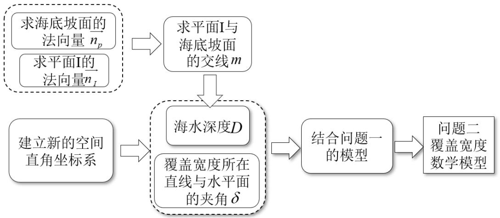

<details>
<summary>flowchart</summary>

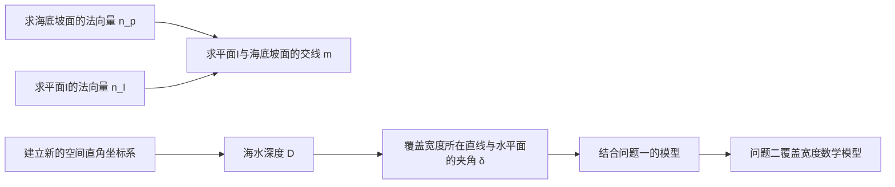
```mermaid
graph LR
  A["求海底坡面的法向量 n_p"] --> B["求平面I与海底坡面的交线 m"]
  C["求平面I的法向量 n_I"] --> B
  D["建立新的空间直角坐标系"] --> E["海水深度 D"]
  E --> F["覆盖宽度所在直线与水平面的夹角 δ"]
  F --> G["结合问题一的模型"]
  G --> H["问题二覆盖宽度数学模型"]
```
</details>

图 9：问题二求解流程

## 5.2.1 多波束测深覆盖宽度模型的建立

## ◼ 建立三维空间直角坐标系

以海底坡面的中心为坐标原点 $O ^ { \prime }$ ，水平向右为 轴正方向，垂直向上为 轴正方向，海水深度为 轴建立新的三维直角坐标系 $O ^ { \prime } ( X ^ { \prime } , Y ^ { \prime } , Z ^ { \prime } )$ ，坐标系满足右手定则。如图所示：

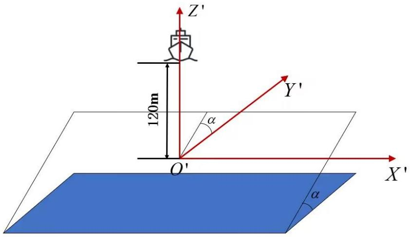

<details>
<summary>text_image</summary>

Z'
120m
Y'
O'
X'
α
α
</details>

图 10：问题二坐标系

## ◼ 覆盖宽度的数学模型

根据问题一建立的模型（5），只要已知水平面与覆盖宽度所在直线的夹角 、该位置处的海水深度 ，即可通过正弦定理求得多波束测深的覆盖宽度。所以问题二的重点是求沿测线方向的海水深度 和夹角 。

## 1) 计算海水深度

为了让模型的建立过程更加直观易懂，我们记测线方向与其在 $X O ^ { \prime } Y ^ { \prime }$ 面上投影组成的平面为面I，海底坡面为面 II。记海底坡面法向量为 $\overrightarrow { n _ { p } }$ ，平面I 的法向量为 $n _ { \scriptscriptstyle I }$ ，如下图所示。

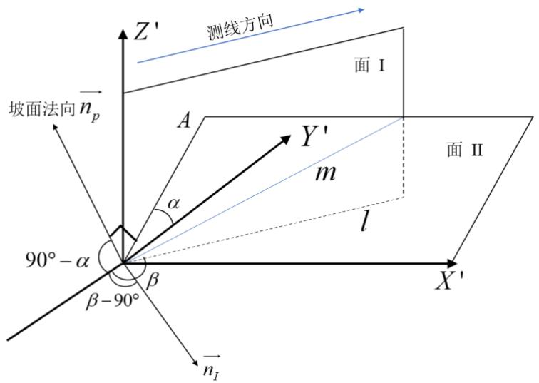

<details>
<summary>text_image</summary>

测线方向
Z'
面Ⅰ
坡面法向 np
A
Y'
m
面Ⅱ
l
90° - α
β
β - 90°
X'
nI
</details>

图 11：问题二几何关系分析

① 求海底坡面的法向量 $\widehat { n _ { p } }$

如上图所示，为了方便表示，将坡面法向量作在坐标原点处，坡面法向量 ${ \vec { n } _ { p } }$ 上面II， $O ^ { \prime } A \subseteq$ 面 II，所以 $\overrightarrow { n _ { p } } \perp O ^ { \prime } A$ 。在 $Y ' O '$ 面上，坡面法向量 $\overrightarrow { n _ { p } }$ 与 $Y ^ { \prime }$ 轴负方向的夹角为 ${ \frac { \pi } { 2 } } - \alpha$ ，又因为 $\overrightarrow { n _ { p } }$ 过原点 $O ^ { \prime }$ ，则 $\overbrace { n _ { p } } ^ { \ d } = ( 0 , - \cos ( \frac { \pi } { 2 } - \alpha ) , \sin ( \frac { \pi } { 2 } - \alpha ) ) = ( 0 , - \sin \alpha , \cos \alpha )$ 。

② 求测线方向与其在 $X O ^ { \prime } Y ^ { \prime }$ 面上投影组成的平面（面 I）的法向量 $\overrightarrow { n _ { \scriptscriptstyle I } }$

记测线方向 $X O ^ { \prime } Y ^ { \prime }$ 面（水平面）上的投影为直线 ，而因为坡面法向量 $\overline { { n _ { p } } }$ 在$Y ' O '$ 面内，则 $\overrightarrow { n _ { p } }$ 在 $X ' O '$ 面上的投影在 轴负方向上。由题可知，测线方向与海底坡面的法向在水平面上的投影的夹角为 $\beta$ ，即直线 与 轴负方向的夹角为 $\beta$ 。

设 $\overrightarrow { n _ { \scriptscriptstyle I } }$ 为平面 I 的法向量，由于直线l在平面 I 上，即 $l \in$ 平面 I，所以 $\overrightarrow { n _ { I } }$ 。由平面 几 何 知 识 可 得 ， $n _ { { \scriptscriptstyle I } }$ 与 $Y ^ { \prime }$ 轴 负 方 向 的 夹 角 为 $\beta - \frac { \pi } { 2 }$ 。 由 此 得 到 向 量$\overrightarrow { n _ { I } } = ( \sin ( \beta - \frac { \pi } { 2 } ) , - \cos ( \beta - \frac { \pi } { 2 } ) , 0 ) = ( - \cos \beta , - \sin \beta , 0 )$

③ 求平面 I与海底坡面的交线

平面 I 与平面 II 相交，记交线为直线 $m$ ，交线 $m$ 与海平面之间的距离即为海水深度。由于已知平面I与平面II的法向量分别为 $\overline { { n _ { p } } }$ 、 $\overrightarrow { n _ { { _ I } } }$ ，则面 I与面II的交线 的方向向量可利用二者叉乘来表示。根据 $m \perp \overline { { n _ { p } } } \setminus m \perp \overrightarrow { n _ { I } }$ ，得到交线 的方向向量表达式为：

$$
\overrightarrow {m} = \overrightarrow {n _ {p}} \times \overrightarrow {n _ {I}} = \left| \begin{array}{c c c} i & j & k \\ 0 & - \sin \alpha & \cos \alpha \\ - \cos \beta & - \sin \beta & 0 \end{array} \right| = (\sin \beta \cos \alpha , - \cos \beta \cos \alpha , - \cos \beta \sin \alpha)
$$

因为平面 I 与平面 II 均过原点 $O ^ { \prime }$ ，则二者的交线 $m$ 也过原点 $O ^ { \prime }$ 。由此得到空间直线 $m$ 的点向式方程为：

$$
\frac {x}{\sin \beta \cos \alpha} = \frac {y}{- \cos \beta \cos \alpha} = \frac {z}{- \cos \beta \sin \alpha}
$$

## ④ 根据交线 求海水深度

设测量船距海域中心点处的距离为 ，在此处向下引垂线，作 $M H \perp$ 面 $X O ^ { \prime } Y ^ { \prime }$ 垂足为H。由几何关系易知，垂足 H在直线 上，且 交直线 $m$ 于点 ，如下图所示。

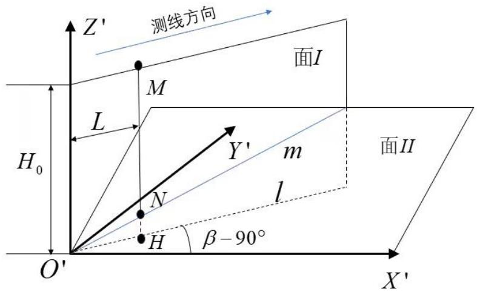

<details>
<summary>text_image</summary>

测线方向
Z'
面I
M
L
H₀
Y'
m
N
l
面II
β-90°
H
O'
X'
</details>

图 12：海水深度计算

由几何关系可知，点 H的坐标可以表示为 $H = ( L \cos ( \beta - \frac { \pi } { 2 } ) , L \sin ( \beta - \frac { \pi } { 2 } ) , 0 )$ 。由于点 N 与点 H 的 $X ^ { \prime } , Y ^ { \prime }$ 坐标相同且位于直线 $m$ 上，因此将 的 $X ^ { \prime }$ 、Y'的坐标代入直线的点向式方程，即可得到点 的 $Z ^ { \prime }$ 轴方向的坐标值为：

$$
z ^ {\prime} = - L \frac {\cos \beta \sin \alpha}{\cos \alpha} = - L \tan \alpha \cos \beta
$$

据此，直线 $m$ 到海平面的距离MN即海水深度 的数学表达式为：

$$
D = H _ {0} - z ^ {\prime} = H _ {0} + L \tan \alpha \cos \beta \tag {6}
$$

其中 $H _ { 0 }$ 为海域中心点处的海水深度，L为测量船距海域中心点的距离，单位为 $m$ ，1 海里 $: = 1 8 5 2 \mathrm { m }$ 。 $\alpha$ 为海底坡度， $\beta$ 为测线方向与海底坡面的法向在水平面上投影的夹角。

## 2) 计算水平面与覆盖宽度所在直线的夹角 $\delta$

为了使建模过程更加直观，做如下空间三维图和平面二维图，将多波束的扫射平面提取出来，从而将问题二与问题一相联系。在上述过程中，我们已经得到了海水深度的表达式，只需再给出水平面与覆盖宽度所在直线的夹角 $\delta$ 的计算公式，即可利用问题一中的模型求解覆盖宽度 $W$

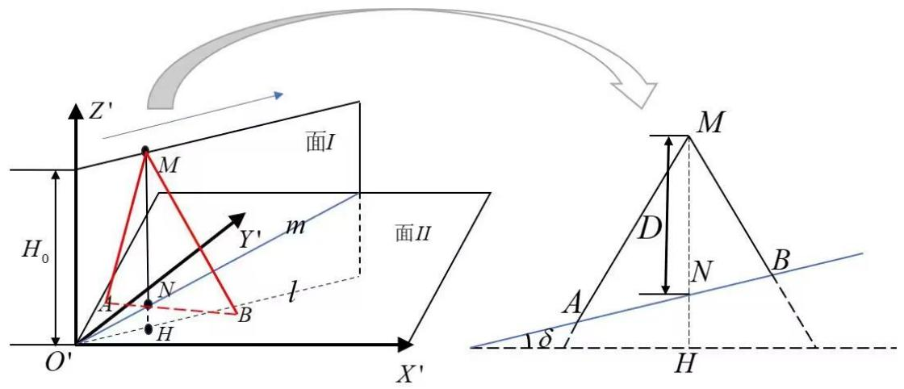

<details>
<summary>text_image</summary>

Z'
面I
H₀
M
Y'
m
面II
A
N
B
l
O'
X'
D
M
N
B
A
δ
H
</details>

图 13：三维空间到二维空间的转化

从上图可以直观地看出，测量船沿着测线方向行进，在距海域中心点 处时发射多波束，波束打到海底坡面最远处的点为 ，图中 即为波束范围，AB 即多波束测深条带的覆盖宽度。

为了计算出线段 AB 的长度，我们还需要知道直线 AB 与水平面的夹角 $\delta$ 。由几何关系可知，测线方向向量 $\overrightarrow { n _ { c } } \perp A B$ 。因为 AB 在海底坡面上，则海底坡面法向量${ \widehat { n _ { p } } } \bot A B$ 。根据 $\overrightarrow { n _ { c } } \perp A B \ 、 \overrightarrow { n _ { p } } \perp A B$ ，直线AB 的方向向量可利用二者叉乘来表示，即直线AB 的方向向量表达式为：

$$
\overrightarrow {A B} = \overrightarrow {n _ {p}} \times \overrightarrow {n _ {c}} = \left| \begin{array}{c c c} i & j & k \\ 0 & - \sin \alpha & \cos \alpha \\ \sin \beta & - \cos \beta & 0 \end{array} \right| = (\cos \beta \cos \alpha , \sin \beta \cos \alpha , \sin \beta \sin \alpha)
$$

又因为水平面的法向量 $\stackrel {  } { n } = ( 0 , 0 , 1 )$ ，由线面角的计算公式，得

$$
\sin \delta = \cos <   \overrightarrow {A B}, \vec {n} > = \frac {| \overrightarrow {A B} \cdot \vec {n} |}{| \overrightarrow {A B} | | \vec {n} |} = \frac {| \sin \beta \sin \alpha |}{\sqrt {\cos^ {2} \beta \cos^ {2} \alpha + \sin^ {2} \beta}}
$$

则直线AB 与水平面的夹角

$$
\delta = \arcsin \frac {| \sin \beta \sin \alpha |}{\sqrt {\cos^ {2} \beta \cos^ {2} \alpha + \sin^ {2} \beta}} \tag {7}
$$

➢ 综上，我们已经分别得到了海水深度和覆盖宽度所在直线与水平面的夹角的计算公式（6）、（7），结合问题一的模型，可以得到问题二覆盖宽度的数学模型为：

$$
\left\{ \begin{array}{l} W = \frac {D}{\sin (\frac {\pi}{2} - \frac {\theta}{2} - \delta)} \cdot \sin \frac {\theta}{2} + \frac {D}{\sin (\frac {\pi}{2} - \frac {\theta}{2} + \delta)} \cdot \sin \frac {\theta}{2} \\ D = H _ {0} + L \tan \alpha \cos \beta \\ \delta = \arcsin \frac {| \sin \beta \sin \alpha |}{\sqrt {\cos^ {2} \beta \cos^ {2} \alpha + \sin^ {2} \beta}} \end{array} \right. \tag {8}
$$

## 5.2.2 覆盖宽度的求解

根据上述建立的模型（8），将多波束换能器的开角 $\theta = 1 2 0 ^ { \circ }$ ，坡度 $\alpha { = } 1 . 5 ^ { \circ }$ 海域中心点处的海水深度 $H _ { 0 } = 1 2 0 m$ 等参数值代入我们的模型，利用 MATLAB 编写程序求解，即可得到特定位置处的覆盖宽度，所得结果如下表所示。

表 2 问题二的计算结果

<table><tr><td rowspan="2" colspan="2">覆盖宽度/m</td><td colspan="8">测量船距海域中心点处的距离/海里</td></tr><tr><td>0</td><td>0.3</td><td>0.6</td><td>0.9</td><td>1.2</td><td>1.5</td><td>1.8</td><td>2.1</td></tr><tr><td rowspan="8">测线方向夹角/°</td><td>0</td><td>415.69</td><td>466.09</td><td>516.49</td><td>566.89</td><td>617.29</td><td>667.69</td><td>718.09</td><td>768.48</td></tr><tr><td>45</td><td>416.19</td><td>451.87</td><td>487.55</td><td>523.23</td><td>558.91</td><td>594.59</td><td>630.27</td><td>665.95</td></tr><tr><td>90</td><td>416.69</td><td>416.69</td><td>416.69</td><td>416.69</td><td>416.69</td><td>416.69</td><td>416.69</td><td>416.69</td></tr><tr><td>135</td><td>416.19</td><td>380.51</td><td>344.83</td><td>309.15</td><td>273.47</td><td>237.79</td><td>202.11</td><td>166.43</td></tr><tr><td>180</td><td>415.69</td><td>365.29</td><td>314.89</td><td>264.50</td><td>214.10</td><td>163.70</td><td>113.30</td><td>62.90</td></tr><tr><td>225</td><td>416.19</td><td>380.51</td><td>344.83</td><td>309.15</td><td>273.47</td><td>237.79</td><td>202.11</td><td>166.43</td></tr><tr><td>270</td><td>416.69</td><td>416.69</td><td>416.69</td><td>416.69</td><td>416.69</td><td>416.69</td><td>416.69</td><td>416.69</td></tr><tr><td>315</td><td>416.19</td><td>451.87</td><td>487.55</td><td>523.23</td><td>558.91</td><td>594.59</td><td>630.27</td><td>665.95</td></tr></table>

##  结果分析

分析上表结果可知，测线方向的夹角对测量覆盖宽度有一定程度的影响。

① 当测量船在距海域中心较近的范围内工作时，多波束的覆盖宽度变化较小，在海域中心处这一点表现尤为明显，覆盖深度几乎不随测线方向夹角变化。  
② 当测量船在远离海域中心处作业时，多波束随测线方向夹角变化较为明显，随着测线方向夹角的增大，覆盖宽度先减小后又增加，且都在测线方向夹角为 时覆盖宽度达到最小值。  
③ 当测线夹角方向为90和 $2 7 0 ^ { \circ }$ 时，条带的覆盖宽度始终为 416.69m，并不随测量船距海域中心处的距离改变而变化。  
④ 横向来看，多波束的覆盖宽度随着测量船距海中心点处距离的增大而逐渐增大。  
⑤ 纵向来看，每组数据中测线方向夹角为 $0 ^ { \circ }$ （等深线走向）时，条带的覆盖宽度达到最大值。

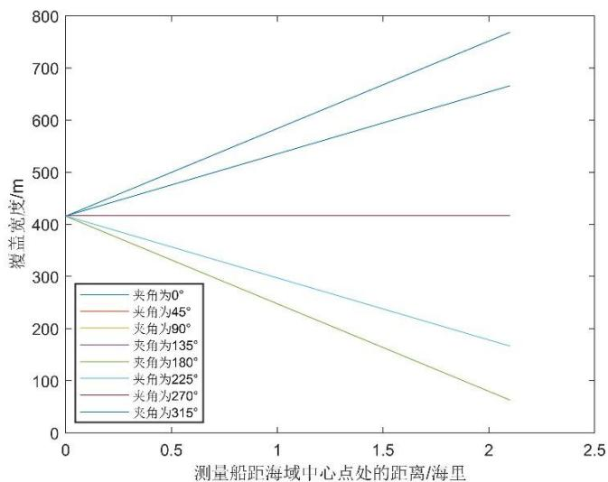

<details>
<summary>line</summary>

| 海理距离 (m) | 夹角为\(0{}^{\circ}\) (m) | 夹角为\(45{}^{\circ}\) (m) | 夹角为\(90{}^{\circ}\) (m) | 夹角为\(135{}^{\circ}\) (m) | 夹角为\(180{}^{\circ}\) (m) | 夹角为\(225{}^{\circ}\) (m) | 夹角为\(270{}^{\circ}\) (m) | 夹角为\(315{}^{\circ}\) (m) |
| --- | --- | --- | --- | --- | --- | --- | --- | --- |
| 0 | 420 | 420 | 420 | 420 | 420 | 420 | 420 | 420 |
| 2.1 | ~770 | ~670 | ~670 | ~670 | ~670 | ~170 | ~420 | ~420 |
</details>

图 14：不同 角对覆盖宽度的影响

从左图可以直观看出， $4 5 ^ { \circ }$ 与315°、90°与、 与 分别重合，测线方向的夹角对测量覆盖宽度有显著影响。

根本原因是海水深度沿不同测线方向夹角的变化率不同。下面将从 的不同取值区间探讨测量船的作业所处位置。

① 当测线方向夹角 $\beta$ 在 、 时，测量船实际上是在往海底坡面的底

部前进，越往底部则海水深度越深，则多波束测深条带的覆盖宽度越大。

② 当测线方向夹角等于 $0 ^ { \circ }$ 或 $3 6 0 ^ { \circ }$ 时，测线刚好沿着坡面底部向下，海水深度的变化率最大。因此随着测量船距海域中心点处的距离越远，覆盖宽度的增加幅度最大。纵向观察图表即可看出，在距海域中心点距离相同时，该角度下的覆盖宽度最大。  
③ 当测线方向夹角在 时，测量船实际上是在往海底坡面的顶部前进，越往顶部则海水深度越浅，则多波束测深条带的覆盖宽度越小。  
④ 当测线方向夹角等于 $2 7 0 ^ { \circ }$ 时，测线刚好沿着坡面顶部向上，海水深度的变化量最大。因此，随着测量船在距海域中心点处的距离越远，覆盖宽度的减小幅度越大。纵向观察图表即可看出，在距海域中心点距离相同时，该角度下的覆盖宽度最小。  
⑤ 当测线方向夹角等于 $9 0 ^ { \circ }$ 或 $2 7 0 ^ { \circ }$ 时，测线刚好沿着等深线，海水深度并不随着测量船在距海域中心点处的距离变化而变化，因此覆盖宽度不变。

## 5.3 问题三：矩形海域测线布设

在问题三中，我们对于一个具体的矩形海域，为其设计一组测线，使其测量长度最短、可完全覆盖整个待测海域、相邻条带之间的重叠率在 之间。对于测线布设，我们从测线方向和测线间距两个方面考虑，通过证明得到测线方向平行等深线方向最佳；对于测线间距，建立单目标优化模型求解，从而确定最优测线布设方案。

## 5.3.1 测线布设模型的建立

## ◼ 证明测线平行等深线方向是最佳方向

对于多波束系统作业的测线布设，要根据任务要求和测区条件来确定。根据国土资源部发布的《海洋多波束水深测量规程》要求规范<sup>[5]</sup>，主测线一般采用平行等深线走向布设。这样就可以最大限度地增加海域探测覆盖率，提高工作效率。出于建模的严谨性，我们在下文将证明对于具体的矩形海域，测线采用平行等深线布设是最佳的方向。

【命题】: 平行等深线走向进行测线布设是最佳方案。

【证明】: 为了证明测线沿着海水等深线方向是最佳方向，只需要证明该测线所对应的覆盖面积大于等于其他方向测线对应的覆盖面积。

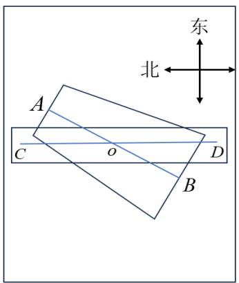

<details>
<summary>text_image</summary>

东
北
A
C o D
B
</details>

如左图所示，在海底坡面上任取一段长度为 的测线AB，其中A在坡面上部，B 在坡面下部，点o为AB 的中点。过o点作一条平行于等深线且与AB等长的测线CD。

因为该海域西深东浅，则测线 AB 上的每一个点的海水深度都不同，且海水深度是由 到 一次函数递增的。根据覆盖宽度计算公式可得，覆盖宽度也是由 A 到 B 一次函数递增。因此，测线 AB 构成的扫测面实际上是一个等腰梯形。因为测线 CD 平行于等深线，则 CD 上的任意一点的海水深度一样，对应的条纹覆盖宽度也一样。因此，测线 构成的扫测面是一个矩形。

图 15：待测矩形海域

由问题二建立的模型（6）可知，海底坡面任意一处的海水深度是可以计算的。记A 点的海水深度为 $H _ { 1 }$ ，B 点的海水深度为 $H _ { \sb 2 }$ ，o 点的海水深度为 $H _ { 3 }$ ，根据中点得$H _ { 3 } = ( H _ { 1 } + H _ { 2 } ) / 2$ 。记 A、B、O点的覆盖宽度分别为 $\begin{array} { r } { W _ { 1 } , \ W _ { 2 } , \ W _ { 3 } } \end{array}$ ，则测线 AB 构成的等腰梯形面积为 $S _ { 1 } = ( W _ { 1 } + W _ { 2 } ) i / 2$ ，测线 CD 构成的矩形面积为 $S _ { 2 } = W _ { 3 } \cdot i$ 。比较 $S _ { 1 }$ 和

$S _ { 2 }$ 的大小只需要比较 $( W _ { 1 } + W _ { 2 } ) / 2$ 和 $W _ { 3 }$ 的大小，由问题一中覆盖宽度的计算公式（8）可得

$$
\begin{array}{l} \frac {W _ {1} + W _ {2}}{2} = \frac {1}{2} (\frac {H _ {1} + H _ {2}}{\sin (\frac {\pi}{2} - \frac {\theta}{2} - \alpha^ {\prime})} + \frac {H _ {1} + H _ {2}}{\sin (\frac {\pi}{2} - \frac {\theta}{2} + \alpha^ {\prime})}) \sin \frac {\theta}{2} \\ W _ {3} = \frac {1}{2} (\frac {H _ {1} + H _ {2}}{\sin (\frac {\pi}{2} - \frac {\theta}{2} - \alpha)} + \frac {H _ {1} + H _ {2}}{\sin (\frac {\pi}{2} - \frac {\theta}{2} + \alpha)}) \sin \frac {\theta}{2} \\ \end{array}
$$

对比两式，可以发现 $( W _ { 1 } + W _ { 2 } ) / 2$ 和 $W _ { 3 }$ 的大小完全由 $\alpha ^ { \prime }$ 和 $\alpha$ 的大小决定。对于测线CD，因为其平行于等深线，由几何关系可得 $\alpha$ 即为海底坡度， $\alpha { = } 1 . 5 ^ { \circ }$ ，而对于任意测线CD，由几何关系可得 $\alpha ^ { \prime } \leq 1 . 5 ^ { \circ }$ 。因此，我们根据表达式得到 $( W _ { 1 } + W _ { 2 } ) / 2 \le W _ { 3 }$ 所以 $S _ { 1 } \leq S _ { 2 }$

➢ 综上，平行于等深线的测线所对应的覆盖面积最大，即命题测线沿着海水等深线方向为最佳布设方向得证。

## ◼ 基于单目标优化确定测线位置

测线布设包括测线方向和测线间距两方面内容<sup>[6]</sup>。在上述过程中，我们已经证明了测线布设的最佳方向为平行等深线走向，这一点在问题二的求解结果中也得到了验证。在接下来的过程中，我们将采用目标优化的思想确定最佳测线位置。

## ⚫ 决策变量

测线的条数n和相邻测线之间的间距，其中测线间距可以转化为不同测线的位置，以东海岸为始边， $y _ { i }$ 表示测线与东海岸之间的距离，如下图所示。

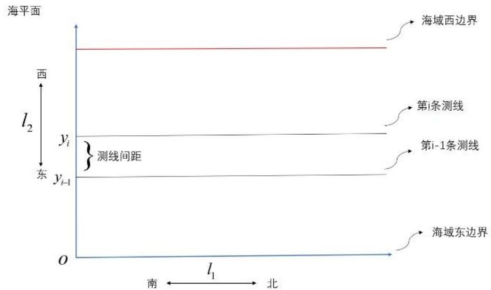

<details>
<summary>line</summary>

| Category | 海平面 |
| --- | --- |
| 海域西边界 | High |
| 第i条测线 | Medium |
| 第i-1条测线 | Low |
| 海域东边界 | Low |
</details>

图 16：矩形海域测线设计

## ⚫ 目标函数

在设计多波束测深的测线时，为了保证工作效率，希望测线总长度最短。上文已经确定测线平行等深线方向，即南北走向，则每条测线的长度已经确定，即该海域的南北长度 $l _ { 1 } = 2$ 海里 $= 3 7 0 4 m$ 。因此，总测量长度由测线的条数决定，设测线条数为 ，则优化目标可表示为

$$
\min n l _ {1}
$$

## ⚫ 约束条件

## 1) 完全覆盖整个待测海域

在《国际海道测量标准》中明确规定 基于多波束对海水深度的测量 首先必须保证全覆盖测量<sup>[7]</sup>。根据题目要求，需要设计一组可以覆盖整个待测海域的测线，从而实现对该海域的全方位探测。全覆盖可以理解为所有测线的覆盖宽度之和大于等于该海域东西宽度，由于相邻条带之间有重叠，重叠部分需要减去，即全覆盖测量的约束条件为：

$$
\sum_ {i = 1} ^ {n} W _ {i} - \sum_ {i = 1} ^ {n - 1} W _ {i} \eta_ {i} \geq \frac {l _ {2}}{\cos \alpha}
$$

上式中， $W _ { i }$ 表示第i条测线的扫测条带宽度； $\eta _ { i }$ 表示第 条测线的扫测条带与上一个条带的重叠率； $l _ { 2 }$ 表示矩形海域东西宽度 $l _ { 2 } = 4$ 海里 $= 6 8 1 4 m$ C

## 2) 相邻条带之间的重叠率满足要求

为保证测量的完整性，不同测线形成的扫射条带之间应有一定的重叠率；同时，为保证探测的效率，相邻条带之间的重叠率不能太大。适宜的重叠率应该在 10%\~20%区间内，该值过大会导致探测工作量增加，降低工作效率；该值过小会导致测量不完整，出现漏测现象。因此，对于相邻条带之间重叠率的约束为

$$
10\% \leq \eta_i \leq 20\%
$$

在问题一中，我们已经给出重叠率的一般定义，在此结合测线位置将重叠率更新为下式：

$$
\eta_ {i} = \frac {(p _ {i} + W _ {i w}) - (p _ {i + 1} - W _ {i e})}{W _ {i}}
$$

其中， $p _ { i }$ 表示沿海底坡度方向的位置，海底坡面与矩形海域水平面的夹角为海底坡度 $\alpha$ ，由几何关系得：

$$
y _ {i} = p _ {i} \cos \alpha
$$

$W _ { i w }$ 表示第 个扫测条带的西覆盖宽度； $W _ { i e }$ 表示第 个扫测条带的东覆盖宽度，二者的计算方法在问题一的模型中已给出。但在问题三中，坐标原点发生变化，坐标原点位于矩形海域东南角，海水深度的计算公式变为：

$$
D = h _ {0} + (l _ {2} - y _ {i}) \tan \alpha
$$

其中， $h _ { 0 }$ 为矩形海域最东边的海水深度，由式（1）计算可得 $h _ { 0 } = 1 3 . 0 1 m$ 。确定D后我们可以得到第i条测线西覆盖宽度 $W _ { i w }$ 、东覆盖宽度 $W _ { i e }$ 、覆盖宽度 $W _ { i }$ 的表达式：

$$
W _ {i w} = \frac {D}{\sin (\frac {\pi}{2} - \frac {\theta}{2} - \alpha)} \cdot \sin \frac {\theta}{2}, W _ {i e} = \frac {D}{\sin (\frac {\pi}{2} - \frac {\theta}{2} + \alpha)} \cdot \sin \frac {\theta}{2}
$$

$$
W _ {i} = W _ {i w} + W _ {i e}
$$

➢ 综上，确定测线位置的单目标优化模型为：

$$
\begin{array}{l} \min n l _ {1} \\ s. t. \left\{ \begin{array}{l} \sum_ {i = 1} ^ {n} W _ {i} - \sum_ {i = 1} ^ {n - 1} W _ {i} \eta_ {i} \geq \frac {l _ {2}}{\cos \alpha} \\ 1 0 \% \leq \eta_ {i} \leq 2 0 \% \\ \eta_ {i} = \frac {\left(p _ {i} + W _ {i w}\right) - \left(p _ {i + 1} - W _ {i e}\right)}{W _ {i}} \\ D = h _ {0} + (l _ {2} - y _ {i}) \tan \alpha \\ W _ {i w} = \frac {D}{\sin (\frac {\pi}{2} - \frac {\theta}{2} - \alpha)} \cdot \sin \frac {\theta}{2} \\ W _ {i e} = \frac {D}{\sin (\frac {\pi}{2} - \frac {\theta}{2} + \alpha)} \cdot \sin \frac {\theta}{2} \\ W _ {i} = W _ {i w} + W _ {i e} \\ y _ {i} = p _ {i} \cos \alpha \end{array} \right. \end{array} \tag {9}
$$

## 5.3.2 基于贪心算法循环遍历确定最优测线布设

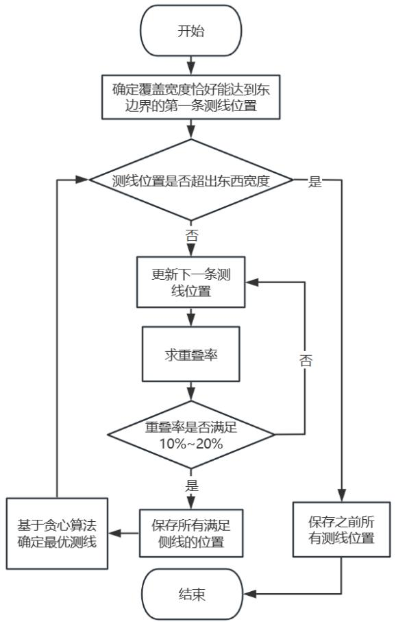

<details>
<summary>flowchart</summary>

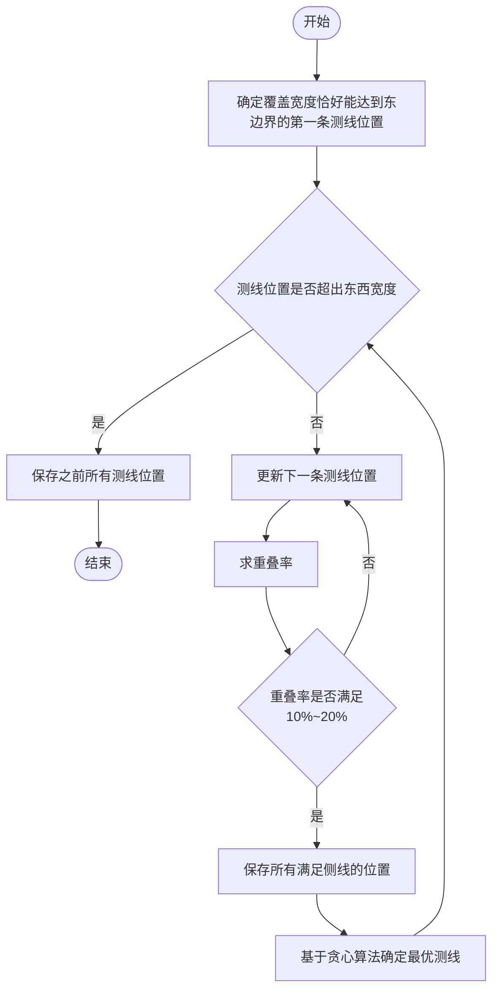
```mermaid
graph TD
  Start(["开始"]) --> A["确定覆盖宽度恰好能达到东边界的第一条测线位置"]
  A --> B{"测线位置是否超出东西宽度"}
  B -->|是| C["保存之前所有测线位置"]
  B -->|否| D["更新下一条测线位置"]
  D --> E["求重叠率"]
  E --> F{"重叠率是否满足\n10%~20%"}
  F -->|否| D
  F -->|是| G["保存所有满足侧线的位置"]
  G --> H["基于贪心算法确定最优测线"]
  H --> B
  C --> End(["结束"])
```
</details>

图 17：最优测线布设求解流程

对于上述过程建立的确定测线位置的单目标优化模型，我们基于贪心算法的思想逐步优化求解。

Step 1 以矩形海域的东边界为始边，以覆盖宽度恰好能达到东边界确定出第一条测线的位置。

Step 2 从第一条测线的位置开始，以1m 为步长逐步向后遍历确定下一条测线的位置，求该测线覆盖宽度与前一条测线的重叠率，将重叠率满足 10%\~20%的测线位置都保存起来，利用贪心算法优先选择重叠率为 10%的测线，从而确定第二条测线的最优位置，以此类推确定第三条、第四条……测线的位置。

Step 3 依次遍历直到最新一条测线位置超出海域东西宽度，结束循环，保存该测线之前的确定的所有测线位置。

根据上述求解流程，将矩形海域的长宽、海域中心处的海水深度、海底坡度、多波束换能器开角等具体参数值代入模型（9），采用 MATLAB 编程求解。最终得到需要沿着东西方向布设共 34 条相互平行且间距不等的测线，根据优化目标可得最小总测量长度为 ，具体测线位置如下表所示。

表 3 测线位置

<table><tr><td>测线编号i</td><td>1</td><td>2</td><td>3</td><td>4</td><td>5</td><td>6</td><td>7</td></tr><tr><td>测线位置 $y_i/m$ </td><td>22.99</td><td>66.71</td><td>114.50</td><td>166.57</td><td>223.10</td><td>284.32</td><td>350.45</td></tr><tr><td>测线编号i</td><td>8</td><td>9</td><td>10</td><td>11</td><td>12</td><td>13</td><td>14</td></tr><tr><td>测线位置 $y_i/m$ </td><td>422.72</td><td>500.43</td><td>584.82</td><td>677.23</td><td>777.03</td><td>885.56</td><td>1003.26</td></tr><tr><td>测线编号i</td><td>15</td><td>16</td><td>17</td><td>18</td><td>19</td><td>20</td><td>21</td></tr><tr><td>测线位置 $y_i/m$ </td><td>1131.54</td><td>1269.93</td><td>1420.88</td><td>1584.01</td><td>1761.89</td><td>1954.22</td><td>2163.68</td></tr><tr><td>测线编号i</td><td>22</td><td>23</td><td>24</td><td>25</td><td>26</td><td>27</td><td>28</td></tr><tr><td>测线位置 $y_i/m$ </td><td>2391.10</td><td>2637.32</td><td>2905.24</td><td>3195.89</td><td>3511.35</td><td>3853.80</td><td>4225.51</td></tr><tr><td>测线编号i</td><td>29</td><td>30</td><td>31</td><td>32</td><td>33</td><td>34</td><td></td></tr><tr><td>测线位置 $y_i/m$ </td><td>4628.89</td><td>5066.43</td><td>5541.76</td><td>6057.67</td><td>6618.09</td><td>7226.14</td><td></td></tr></table>

已知测线方向和所有测线的具体位置，据此就能够得到该矩形海域的测线布设方案。如下图所示，图中纵坐标零点为东海岸线，红色直线为西海岸线。

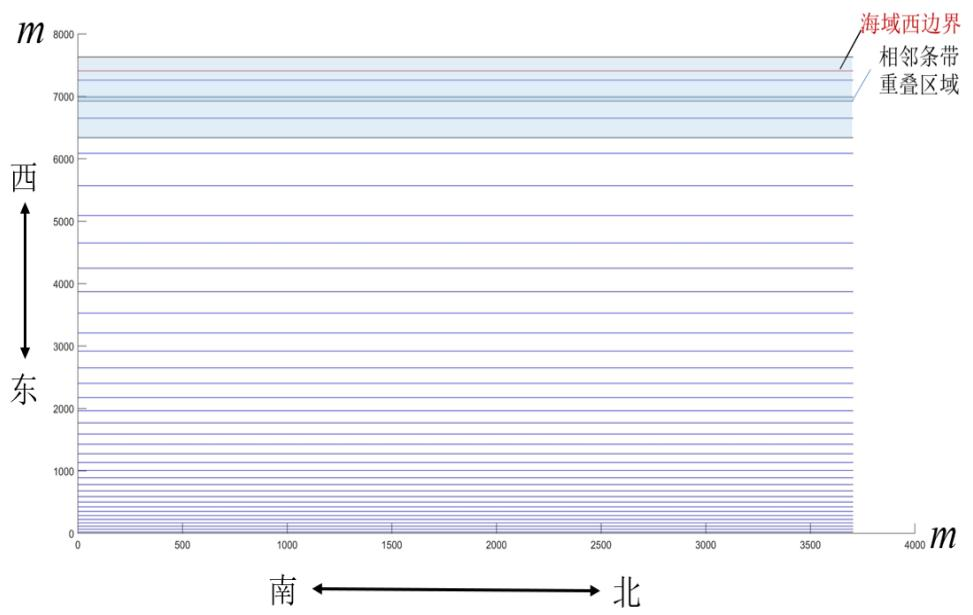

<details>
<summary>contour</summary>

| Category | Description |
| --- | --- |
| Left Axis | 南 (North) |
| Right Axis | 北 (North-Southwest) |
| Horizontal Range | 0~3750 m |
| Vertical Range | 0~8000 m |
</details>

图 18：最优测线布设

上图为该矩形待测海域的最优测线布设方案，图中给出了最西边两条测线的条带宽度以及二者之间的重叠区域，可以发现最西边的测线条带宽度已经超出西海岸线，满足全覆盖测量要求。分析该图可知，测线间距从东海岸到西海岸逐渐增大，这是因为待测海域西深东浅，由问题一的结论可知，在浅水区多波束测量的覆盖宽度较小，因此测线较密以防止漏测；在深水区多波束测量的覆盖宽度较大，可以适当增大测线间距以防止重叠率过大，增加探测工作量。

## 5.3.3 模拟退火对测线布设仿真检验

为了验证所求单目标优化结果的准确性，将模拟退火仿真得到的最优解与上文基于贪心算法循环遍历所求得的测线布设进行比较。模拟退火算法是基于蒙特卡洛迭代求解策略的一种随机寻优算法，该算法在搜索过程中引入随机变量，并以一定概率接受一个比当前解差的解，因此可以有效避免陷入局部最优解，找到全局最优解，该算法的具体操作流程如下。

Step 1：初始化参数：退火初始温度 $T _ { 0 } = 9 0 ^ { \circ } \mathrm { C }$ ，温度下降系数 ，结束温度$T _ { 1 } { = } 8 8 ^ { \circ } \mathrm { C }$ 、退火次数 $r = 1 0 0 0 0$ 等。

Step2：生成新解：当前解为 $\eta ( Y _ { c u r r e n t } )$ ，表示当前所有测线坐标下的平均重叠率，在合理范围内对每一个测线坐标 $Y _ { i }$ 产生随机扰动，生成新的测线坐标 $Y _ { n e w }$ ，则产生新解$\eta ( Y _ { n e w } )$ ，表示新的平均重叠率。退火温度 $T _ { i }$ 降温。

Step 3：检验新解：判断 $\eta ( Y _ { n e w } )$ 是否满足目标优化方程的约束条件，若满足则根据Metropolis 准则，确定接受新解 $\eta ( Y _ { n e w } )$ 的概率 $p$ ，若不满足则重新产生随机扰动。概率 $p$ 的公式如下：

$$
p = \left\{ \begin{array}{l l} 1 & , \eta (Y _ {\text {new}}) \leq \eta (Y _ {\text {current}}) \\ e ^ {- \frac {\eta (Y _ {\text {new}}) - \eta (Y _ {\text {current}})}{T _ {i}}} & , \eta (Y _ {\text {new}}) > \eta (Y _ {\text {current}}) \end{array} \right.
$$

Step 4：判断温度 $T _ { i }$ 是否达到结束温度，若达到则输出最优解 $\eta ( Y _ { b e s t } )$ ，否则重复上述2、3步骤至迭代结束。

根据上述模拟退火算法流程，可以仿真得到新的测线布设方案，测线具体位置的结果见附录，下面将仿真结果与贪心算法逐步优化的求解结果进行比较，如下表。

表 4 两种方法的误差

<table><tr><td>求解方法</td><td>第一条测线位置</td><td>第二条测线位置</td><td>......</td><td>平均重叠率</td></tr><tr><td>贪心算法逐步优化</td><td>22.99</td><td>66.71</td><td>......</td><td>10.35</td></tr><tr><td>模拟退火仿真</td><td>22.90</td><td>66.44</td><td>......</td><td>10.48</td></tr><tr><td>绝对误差</td><td>0.09</td><td>0.27</td><td>......</td><td>0.13</td></tr><tr><td>相对误差</td><td>0.39%</td><td>0.40%</td><td>......</td><td>1.25%</td></tr></table>

上表中，限于篇幅，仅列举出前两条测线的位置的误差，我们计算了两种方法求解的34条测线的误差，得到位置的平均相对误差为 ，这对于该南北长 2 海里、东西宽 4 海里的矩形海域来说，误差很小。经过一番分析，不管是测线位置还是平均重叠率，仿真结果与求解结果的相对误差和绝对误差很小，这也证明了我们模型的可靠性以及求解结果的精确性。

## 5.3.4 开角、坡度的灵敏度分析

基于单目标优化模型确定测线位置会受到多波束换能器的开角 $\theta$ 、海底坡度 $\alpha$ 的影响。我们通过上下调整多波束换能器的开角和海底坡度，对比改变前后所需要的测线数量以及对应的 轴坐标。如下左图即为改变多波束换能器的开角对应的图像，右图为改变坡度对应的图像。

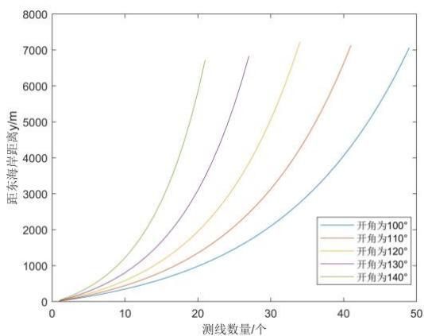

<details>
<summary>line</summary>

| 测线数量/个 | 开角为 \(100{}^{\circ}\) (y/m) | 开角为 \(110{}^{\circ}\) (y/m) | 开角为 \(120{}^{\circ}\) (y/m) | 开角为 \(130{}^{\circ}\) (y/m) | 开角为 \(140{}^{\circ}\) (y/m) |
| --- | --- | --- | --- | --- | --- |
| 0 | 0 | 0 | 0 | 0 | 0 |
| 10 | ~350 | ~600 | ~800 | ~1100 | ~1500 |
| 20 | ~900 | ~1400 | ~2000 | ~2800 | ~4500 |
| 30 | ~2200 | ~3200 | ~4500 | — | — |
| 40 | ~4500 | ~6500 | — | — | — |
| 50 | ~7100 | — | — | — | — |
</details>

图 19：开角灵敏度分析

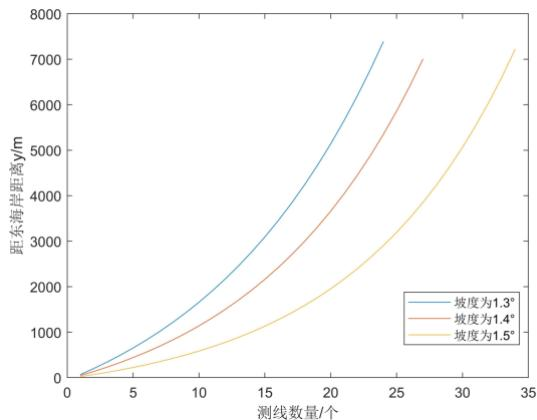

<details>
<summary>line</summary>

| 测线数量/个 | 坡度为 \(1.3{}^{\circ}\) (y/m) | 坡度为 \(1.4{}^{\circ}\) (y/m) | 坡度为 \(1.5{}^{\circ}\) (y/m) |
| --- | --- | --- | --- |
| 0 | 0 | 0 | 0 |
| 5 | ~800 | ~600 | ~200 |
| 10 | ~1800 | ~1300 | ~600 |
| 15 | ~3200 | ~2300 | ~1200 |
| 20 | ~5000 | ~3800 | ~2100 |
| 25 | ~7400 | ~6000 | ~3500 |
| 30 | — | — | ~5500 |
| 34 | — | — | ~7300 |
</details>

图 20：坡度灵敏度分析

左图中，横轴代表可完全覆盖整个待测海域的测线的个数，纵轴代表每个测线的距东海岸距离。可以看出，随着开角的增大，所需要的测线个数会减少，对应最后一个测线距东海岸的距离也会减小，且变化幅度明显。因此测线的位置和数量对多波束换能器的开角的变化较为敏感。

右图中，横纵轴所表示的含义与左图相同。可以看出，随着坡度减少，所需要的测线个数会减少，对应最后一个测线距东海岸的距离变化程度不大。因此测线的位置和数量对坡度的变化较为敏感。

## 5.4 问题四：基于单波束测深数据设计多波束测深测线

在问题四中，基于某海域的单波束测量数据，需要我们为多波束测量提供测线布设方案。为保证测量的完整性和效率，测线扫描形成的条带要尽量覆盖整片海域；相邻条带重叠率在 20%以下为宜；测线长度应尽量短。由于该海域的地形起伏较大，需要分区设计测线。

## 5.4.1 利用单波束测量数据得到海域初貌

以自西向东为 轴正方向，由南向北为 为正方向，海水深度方向为 轴建立三维直角坐标系。根据所给的单波束测量的海水深度数据，对其进行取负数操作，利用MATLAB 绘制该待测海域的海底三维图和等深线图。

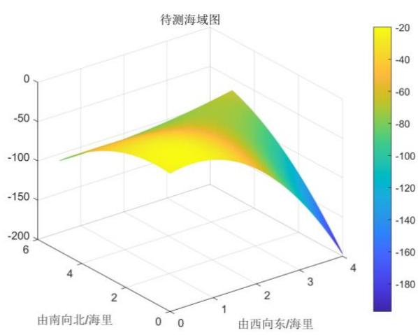

<details>
<summary>surface_3d</summary>

| 由南向北/海里 | 由西向东/海里 | Value |
| --- | --- | --- |
| 0~6 | 0~4 | -20~-180 |
</details>

图 21:海底地貌

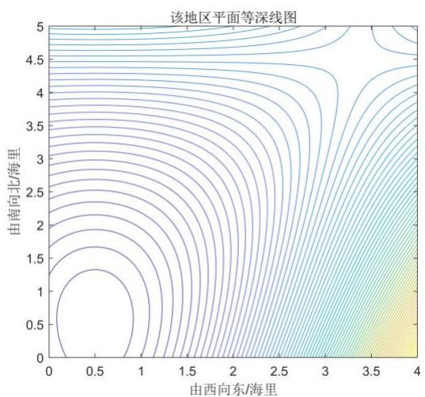

<details>
<summary>contour</summary>

| 由南向北/海里 | 由西向东/海里 (X) | 由西向东/海里 (Y) |
| --- | --- | --- |
| 0~1.5 | 0~2.5 | 0~1.5 |
| 1.5~3.5 | 0~3.5 | 0~2.5 |
| 3.5~5 | 0~4 | 0~3.5 |
</details>

图 22：海域等深线

分析海底地貌图和海域等深线图可知，该海域海底的地形起伏较大，整体呈现为一个凸包。其中，可以明显看出海域东南角等深线密集，海底地形陡峭；东北角等深线较为稀疏，地形较为平坦；西南角地势呈现出一个小突起；西北角的地形大致为一个坡面，与问题一、二地形相似。

## 5.4.2 测线布设模型的建立

## ⚫ 海域初步划分

对于问题四中的真实的海域地形，起伏变化较大，在布设测线时，若采用该海域的平均水深，在海水深度较小处会出现漏测现象，降低探测质量；在海水深度较大处会导致相邻条带之间重叠率过大，降低探测效率。为了尽可能地覆盖整个待测海域，且测量效率较高，选择合理的测线间隔至关重要。受到问题三模型的启发，我们人为地将该海域划分为 4 个矩形小海域，划分的依据是矩形的一边应尽可能的与所围等深线平行。划分结果如右图所示，对于海域的测线布设也将分区域进行，分别计算漏测区域和重叠率超过 20%的情况。

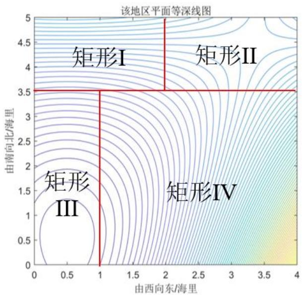

<details>
<summary>contour</summary>

| 区域 | 由西向东/海里 (范围) | 由南向北/海里 (范围) |
| --- | --- | --- |
| 矩形I | 0~2 | 3.5~5 |
| 矩形II | 2~4 | 3.5~5 |
| 矩形III | 0~1 | 0~1.5 |
| 矩形IV | 1~4 | 0~3.5 |
</details>

图 23：待测海域初步划分

## ⚫ 基于最小二乘法确定坡面方程

由前面的三个问题，我们已经知道海底地形为一个坡面时覆盖宽度、重叠率的计算方式以及布设方案的确定模型。因此，在本问中，我们也希望将海底地形拟合成一个坡面以利用前文模型求解。在三维坐标系中，设海底矩形平面的方程为$z = A x + B y + C$ ，采用最小二乘法，通过附件所给的海水深度数据，对坡面方程的参数A、B、C进行估计。下面我们通过建立最小二乘法的目标规划模型来确定参数的最佳值。

$$
\begin{array}{l} \min \quad \frac {\sum_ {i = 1} ^ {n} (z - z _ {\text {测}}) ^ {2}}{n} \\ s. t \left\{ \begin{array}{l} A \in [ - 1 0 0, 1 0 0 ] \\ B \in [ - 1 0 0, 1 0 0 ] \\ C \in [ - 1 0 0, 1 0 0 ] \end{array} \right. \tag {10} \\ \end{array}
$$

## ⚫ 基于单目标优化的测线位置确定模型

对于每片小海域的测线设计，我们可以参考第三问的建模思想，以测线的总长度最小为优化目标，将相邻条带之间的重叠率尽量控制在 20%以下和沿测线形成的条带尽可能覆盖整个待测海域为约束条件，建立单目标优化模型进行求解。

约束条件修正：优化目标与问题三相同，约束条件中仅重叠率存在不同的要求，对重叠率的约束修正为 $\eta _ { i } \leq 2 0 \%$ 。因此，有如下规划方程：

$$
\min n l _ {1}
$$

$$
s. t. \left\{ \begin{array}{l} \sum_ {i = 1} ^ {n} W _ {i} - \sum_ {i = 1} ^ {n - 1} W _ {i} \eta_ {i} \geq \frac {l _ {2}}{\cos \alpha} \\ \eta_ {i} \leq 20 \% \end{array} \right. \tag {11}
$$

## 5.4.3 求解最佳测线布设方案

## ⚫ 各划分区域坡面方程的确定

对于目标规划模型（10）的求解，由于确定坡面方程需要求解 A、B、C 三个未知量，且三者的范围都较大，所以模型的计算复杂度较高。若采用循环遍历法分别遍历搜索3个变量的值，将大大增加运行时间成本。因此选择粒子群优化算法对目标规划模型进行求解，可以在较短时间内得到较为精确的结果。该算法具体流程如下。

Step1 初始化粒子群体：设定粒子群的规模为 100，迭代次数为1000 ， 生 成 随 机 粒 子 群$x _ { _ { A i } } = r a n d ( A ) \quad , \quad x _ { _ { B i } } = r a n d ( B )$ $x _ { c i } = r a n d ( C )$

Step2 计算适应度：即计算每个粒子对应的目标函数值。

Step3 计算各体和全局最优解：首先将每个粒子的适应值 $f u n ( x _ { i } )$ 与其经历过的最好位置的适应值$b e s t _ { i d } ^ { k - 1 }$ 比较，若 $f u n ( x _ { i } ) > b e s t _ { i d } ^ { k - 1 }$ ，则将其更新为每个粒子的最优解，即$B e s t _ { i d } ^ { k } = f u n ( x _ { i } )$ ，再将每个粒子的适应值 $B e s t _ { i d } ^ { k }$ 与全局最好位置的适应值 $B e s t _ { g d } ^ { k - 1 }$ 比较，若 $B e s t _ { i d } ^ { k } > B e s t _ { g d } ^ { k - 1 }$ ，则将其更新为全局最优解 $B e s t _ { g d } ^ { k }$ 。

Step4 判断程序是否结束：重复上述步骤直至达到迭代最大次数，停止算法，否则继续迭代。

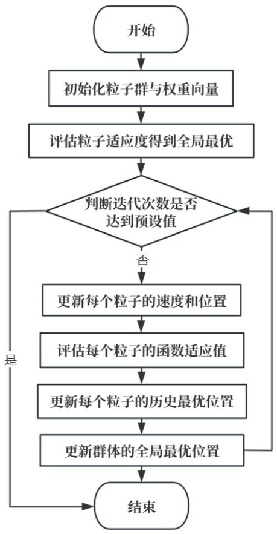

<details>
<summary>flowchart</summary>

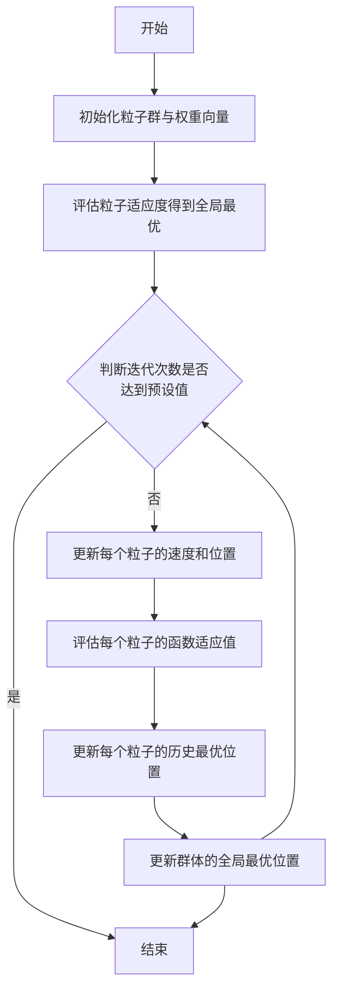
```mermaid
graph TD
  A["开始"] --> B["初始化粒子群与权重向量"]
  B --> C["评估粒子适应度得到全局最优"]
  C --> D{"判断迭代次数是否\n达到预设值"}
  D -->|是| E["结束"]
  D -->|否| F["更新每个粒子的速度和位置"]
  F --> G["评估每个粒子的函数适应值"]
  G --> H["更新每个粒子的历史最优位置"]
  H --> I["更新群体的全局最优位置"]
  I --> D
  I --> E
```
</details>

图 24：粒子群算法流程

## ⚫ 确定最优测线布设

根据上述海域的初步划分结果，下面分区域分析，在初步划分的基础上进行再划分，最终划分为6个矩形区域，分别为其设计测线。

① 对于矩形 I，该情形与问题三的矩形海域基本一致，我们可以按照问题三方法求解模型（11）来确定该区域的测线布设。首先，基于规划模型（10），我们可以得到矩形 I 的坡面方程，利用几何知识可得矩形 I 平面与水平面的夹角 $\alpha$ 。据此求解模型（11），利用贪心思想逐步优化，就可以求得矩形 I内最佳的测线位置，且不会出现漏测现象。  
② 对于矩形 II，因为该面内的等深线与该矩形的边基本不平行。考虑到减轻实际测

深工作量，我们仍沿用矩形 I的最佳测线间隔，即沿东西延长测线对 II区进行布设。对于该不规则海域，我们利用附件中海水深度的下降梯度计算该矩形与水平面的夹角 。由于矩形 II区域海水深度较浅，预计会出现漏测现象。

③ 对于矩形 III，采用最小二乘目标函数时其均方误差过大，拟合效果不好。经过数据分析之后，我们选择将区域 III 划分为新的两个区域 III、V，以得到更好的拟合效果。  
④ 对于矩形 IV，遇到了与矩形III相同的情况，同样对矩形IV进行再分，划分为矩形 IV和 VI，再分别求其坡面方程。

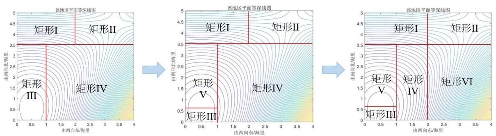

<details>
<summary>text_image</summary>

该地区平面等深线图
矩形Ⅰ
矩形Ⅱ
矩形Ⅲ
矩形Ⅳ
矩形Ⅴ
矩形Ⅵ
矩形Ⅶ
矩形Ⅷ
矩形Ⅸ
矩形Ⅹ
矩形Ⅺ
矩形Ⅵ
矩形Ⅶ
矩形Ⅷ
矩形Ⅸ
矩形Ⅹ
矩形Ⅺ
矩形Ⅵ
矩形Ⅶ
矩形Ⅷ
矩形Ⅸ
矩形Ⅹ
矩形Ⅺ
矩形Ⅵ
矩形Ⅶ
矩形Ⅷ
矩形Ⅸ
矩形Ⅹ
矩形Ⅺ
矩形Ⅵ
矩形ⅷ
由西向东/海里
由南向北/海里
由西向东/海里
由南向北/海里
由西向东/海里
</details>

图 25：海域逐步划分过程

根据最终的区域划分结果，通过粒子群算法求解坡面方程、贪心算法循环遍历求解模型（11），得到各个划分区域的测线位置、测线条数、与水平面的夹角 、重叠率超过 20%的长度、漏测面积。因此可以计算出该海域测线总长度、总漏测面积、漏测海区占总待测海域面积的百分比等结果。限于篇幅，以上求得的所有指标均放在支撑材料“题 ”中。在此给出该海域的测线布设图和部分结果表并进行结果分析。

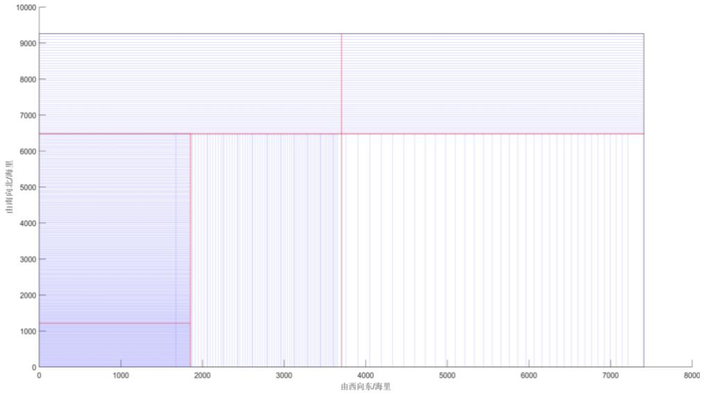

<details>
<summary>heatmap</summary>

| X (由西向东/海里) | Y (由南向北/海里) | Value |
| --- | --- | --- |
| 0~1800 | 1250~6500 | High (Blue) |
| 1800~7400 | 6500~9300 | Low (White) |
</details>

图 26：多波束测线布设

由上图可以看出，不同区域测线的布设方向不同，这是由等深线的大致走向决定的。同时，海域西南角的测线布设相对密集；东南角的测线布设相对稀疏，这与海底地形相互印证。在海域西南角，海底地势呈现出一个凸包，地势较高，海水深度较浅，由问题一的分析可知，多波束测深的覆盖宽度在浅水区较小，因此需要增加测线数量以防止漏测。在海域东南角，海底地势陡峭，起伏较大，海水深度较大，多波束测深的覆盖宽度较大，可以适当增大测线间距，避免过度重叠降低测量效率。

表 5 测线布设参数

<table><tr><td>区域</td><td>测线数量</td><td>测线总长度/海里</td><td>漏测面积/ $m^{2}$ </td><td>漏测面积占总面积的百分比/%</td><td>重叠率超过20%的长度/m</td><td>夹角</td></tr><tr><td>区域I、II</td><td>46</td><td>184</td><td>2390200</td><td>3.48</td><td>55560</td><td>87.41°</td></tr><tr><td>区域III</td><td>83</td><td>83</td><td>0</td><td>0</td><td>0</td><td>53.78°</td></tr><tr><td>区域IV</td><td>65</td><td>65</td><td>0</td><td>0</td><td>0</td><td>84.19°</td></tr><tr><td>区域V</td><td>196</td><td>196</td><td>0</td><td>0</td><td>0</td><td>86.78°</td></tr><tr><td>区域VI</td><td>47</td><td>94</td><td>0</td><td>0</td><td>0</td><td>89.29°</td></tr><tr><td>总海域</td><td>437</td><td>622</td><td>2390200</td><td>3.48</td><td>55560</td><td></td></tr></table>

由上表可得，该海域的测线总长度为 622 海里，漏测海区占总待测海域面积的百分比为 3.48%。在重叠区域中，重叠率超过 20%部分的总长度为 55560m，即 30 海里。

##  结果分析

① 区域 V 的测线极多。这是因为区域 V 与水平面的夹角很大，即区域V很陡（如右图所示），使得多波束打到区域 V底面的波束宽度很小。又因为区域 V 的范围较大，这就需要布设许多测线才能使得沿测线扫描形成的条带尽可能地覆盖整个区域V。

② 区域 II 出现大量漏测，这是因为该区域的海底地形较为复杂，等深线方向极为不一致，为了降低测量工作难度，我们采用区域I的测线延伸线作为该区域的测线。区域 I相比，该区域海水较浅，故出现漏测的情况。

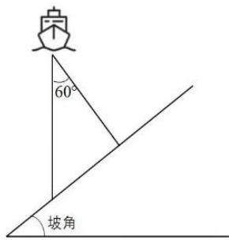

<details>
<summary>text_image</summary>

60°
坡角
</details>

图 27：多波束测深

③ 区域 III、IV、V、VI并没有出现漏测区域。这是因为对于划分的矩形区域，我们是基于贪心算法循环遍历求解测线间距的，该算法会始终让沿测线扫描形成的条带覆盖整个矩形区域。

## 六、 模型的评价与改进

## 6.1 模型的优点

☺ 全文的建模始终基于数学理性思维，利用平面几何知识、立体几何知识、线性代数、数学证明、优化方程等数学理论建立模型，并且进行了结论分析、原因探究、灵敏度分析等，模型建立、结果分析严谨全面。  
☺ 在问题三求解最优测线距离布设时，我们先基于贪心思想循环遍历，逐步求解最佳测线间距。然后利用模拟退火算法对求解结果进行仿真验证，通过误差分析说明了我们模型求解的正确性与可靠性。  
☺ 选择粒子群优化算法对基于最小二乘法的目标规划模型进行求解，可以在较短时间内得到较为精确的结果，大大减少了运行时间成本。

## 6.2 模型的缺点

 对于问题四中测线布设方案的设计，为了简化模型，我们人为对海域进行了划分，且将各区域地形拟合为坡面，从而导致求解结果不精确；对于一些小区域没有沿

其等深线方向布设，可能导致较多漏测。

 我们的模型忽视了测量船行进过程的横摇和纵摇误差，而这种误差现实中是难以消除的，因此我们得到的求解结果可能会与现实存在偏差。

## 6.3 模型的改进

对于测线布设方案，我们的模型只考虑了主测线间隔和布设方向，而未考虑检查线的布设和实施方案。事实上，布设检查线可以有效地增大测量质量和测量效率。根据《海道测量规范》规定，检查线应分布均匀且尽可能与主测线垂直，这样能普遍检查主测线<sup>[8]</sup> 增大测量效率。因此，我们可以将检查线也考虑进模型中，所得的结果能与现实情况更加吻合。

## 七、 参考文献

[1] 季刚. 条带约束的多波束空间标定算法研究[D]. 山东科技大学 2020.  
[2] 余启义. 基于多波束测深技术的海底地形测量[J]. 测绘与空间地理信息 202245(09): 262-264.  
[3] 丁继胜 周兴华 刘忠臣 张卫红. 多波束测深声纳系统的工作原理[J]. 海洋测绘1999 (03): 15-22.  
[4] 成芳 胡迺成. 多波束测量测线布设优化方法研究[J]. 海洋技术学报 2016 35(02):87-91.  
[5] 高慎明 王晓云. 广西某海底管道项目的测线布设方法与优化[A]. 中国石油学会石油工程专业委员会、中国石油学会石油工程建设专业标准委员会. 中国石油石化工程建设创新发展大会--石油天然气勘察技术第二十六次技术交流研讨会论文集[C]. 中国石油学会石油工程专业委员会、中国石油学会石油工程建设专业标准委员会: 中国建筑学会工程勘察分会 2018: 4.  
[6] 夏伟 刘雁春 边刚 崔杨. 基于海底地貌表示法确定主测深线间隔和测图比例尺[J]. 测绘通报 2004 (03): 24-27.  
[7] 国家质量技术监督局. GB 12327-1998. 海道测量规范[S]. 北京: 中国标准出版社1999.  
[8] 柴进柱. 水深测量作业中的测线布设与实施策略研究[J]. 海洋测绘 2013 33(03):43-46.  
[9] 姜启源 谢金星 叶俊.数学模型[M].4版. 北京：高等教育出版社. 2011 1.  
[10]司守奎 孙兆亮. 数学建模算法与应用[M]. 2版. 北京：国防工业出版社. 2017

## 附录

第一部分：支撑材料

<table><tr><td colspan="2">支撑材料</td></tr><tr><td>源代码</td><td>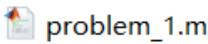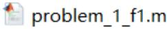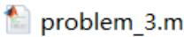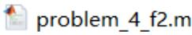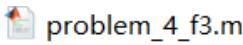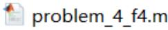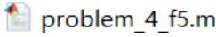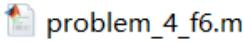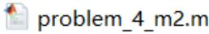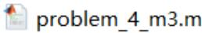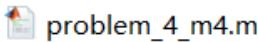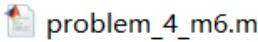</td></tr><tr><td>数据</td><td></td></tr><tr><td>图片</td><td></td></tr><tr><td>文献</td><td></td></tr></table>

第二部分：代码  
```matlab
代码 1: 求解第一问中的计算结果
%求解第一问中的计算结果
H=zeros(1,9);%H 为测线距中心处的不同距离对应的海水深度
for i=-800:200:800
    H((i+1000)/200)=70-i*tan(1.5/180*pi);
end
l1=zeros(1,9);%l1 表示左半边覆盖宽度
l2=zeros(1,9);%l2 表示右半边覆盖宽度
l=zeros(1,9);%l 表示覆盖宽度
for i=1:9
    a1=90-1.5-120/2;
    l1(i)=H(i)/sin(a1/180*pi)*sin(120/360*pi);
    a2=90+1.5-120/2;
    l2(i)=H(i)/sin(a2/180*pi)*sin(120/360*pi);
end
l=l1+l2;
yita=zeros(1,8); %yita 表示重叠率
for j=1:8
    yita(j)=(200/cos(1.5/180*pi)-(200/cos(1.5/180*pi)-l2(j))-(200/cos(1.5/180*pi)-l1(j+1)))/l(j+1)*100;
end
% jud=zeros(1,8); %jud 表示判断测线之前是否重叠
% for k=1:8
%     if (k-1)*200/cos(1.5/180*pi)+l2(k)<k*200/cos(1.5/180*pi)-l1(k+1)
%         jud(k)=0;
%         yita(1,k)=0;
%     end
% end
y=zeros(3,9);
y(1,:)=H(1,:);
y(2,:)=l(1,:);
y(3,2:9)=yita(1,:);
y
```

代码2：将坡度、开角代入到该函数中得到问题一中要求的计算结果

<div class="mineru-algorithm" style="white-space: pre-wrap; font-family:monospace;">
function y=problem_1_f(alaha,theta)
%该函数的作用是将坡度、开角代入到函数中得到问题一中要求的计算结果
H=zeros(1,9);%H 为测线距中心处的不同距离对应的海水深度
for i=-800:200:800
    H((i+1000)/200)=70-i*tan(1.5/180*pi);
end
l1=zeros(1,9);%l1 表示左半边覆盖宽度
l2=zeros(1,9);%l2 表示右半边覆盖宽度
l=zeros(1,9);%l 表示覆盖宽度
for i=1:9
    a1=90-alaha-theta/2;
    l1(i)=H(i)/sin(a1/180*pi)*sin(theta/360*pi);
    a2=90+alaha-theta/2;
    l2(i)=H(i)/sin(a2/180*pi)*sin(theta/360*pi);
end
l=l1+l2;
yita=zeros(1,8);%yita 表示重叠率
for j=1:8
    yita(j)=(200/cos(alaha/180*pi)-(200/cos(alaha/180*pi)-l2(j))-(200/cos(alaha/180*pi)-l1(j+1)))/l(j+1)*100;
end

y=zeros(3,9);
y(1,:)=H(1,:);
y(2,:)=l(1,:);
y(3,2:9)=yita(1,:);
end
</div>

代码3：将坡度、开角、测线距中心点的距离代入到该函数中得到问题一的计算结果

<div class="mineru-algorithm" style="white-space: pre-wrap; font-family:monospace;">
function y=problem_1_f1(alaha,theta,deta)
%该函数的作用是将坡度、开角、测线距中心点的距离代入到函数中得到问题一中要求的计算结果
H=zeros(1,1600/deta+1);%H 为测线距中心处的不同距离对应的海水深度
for i=-800:deta:800
    H(int8((i+800+deta)/deta))=70-i*tan(1.5/180*pi);
end
l1=zeros(1,1600/deta+1);%l1 表示左半边覆盖宽度
l2=zeros(1,1600/deta+1);%l2 表示右半边覆盖宽度
l=zeros(1,1600/deta+1);%l 表示覆盖宽度
for i=1:1600/deta+1
</div>

```matlab
a1=90-alaha-theta/2;
l1(i)=H(i)/sin(a1/180*pi)*sin(theta/360*pi);
a2=90+alaha-theta/2;
l2(i)=H(i)/sin(a2/180*pi)*sin(theta/360*pi);
end
l=11+l2;
yita=zeros(1, 1600/deta);%yita 表示重叠率
for j=1:1600/deta
    yita(j)=(deta/cos(alaha/180*pi)-(deta/cos(alaha/180*pi)-l2(j))-(deta/cos(alaha/180*pi)-l1(j+1)))/l(j+1)*100;
end

y=zeros(3,1600/deta+1);
y(1,:)=H(1,:);
y(2,:)=l(1,:);
y(3,2: 1600/deta+1)=yita(1,:);
end
```

```matlab
代码 4: 绘制不同多波束换能器的开角情况下, 覆盖宽度随测线距中心点处的距离变化的图像
%绘图函数
%绘制不同多波束换能器的开角情况下, 覆盖宽度随测线距中心点处的距离变化的图像
w=zeros(5,9);
for i=100:10:140
    temp=problem_1_f1(1.5,i,200);
    w((i-90)/10,:)=temp(2,:);
end
figure(1);
x=-800:200:800;
for j=1:5
plot(x,w(j,:));
hold on
end
xlabel('测线距中心点处的距离/m');
ylabel('覆盖宽度/m');
legend('多波束换能器的开角为 100°,'多波束换能器的开角为 110°,'多波束换能器的开角为 120°,...
'多波束换能器的开角为 130°,'多波束换能器的开角为 140°);
```

%绘制不同多波束换能器的开角情况下，与前一条测线的重叠率随测线距中心点处的距离变化的图像

```matlab
yita=zeros(5,8);

for i=100:10:140
    temp=problem_1_f1(1.5,i,200);
    yita((i-90)/10,:)=temp(3,2:9);
end
```

```matlab
figure(2);
x2=-600:200:800;
for j=1:5
plot(x2,yita(j,:));
hold on
end
xlabel('测线距中心点处的距离/m');
ylabel('与前一条测线的重叠率/%');
line([-600,800],[20,20],'linestyle','--','color','k');
line([-600,800],[10,10],'linestyle','--','color','k');
```

legend('多波束换能器的开角为 100°' '多波束换能器的开角为 110°' '多波束换能器的开角为 120°' ...

'多波束换能器的开角为 130°' '多波束换能器的开角为 140°');

```matlab
figure(3);
y1=problem_1_f1(1.5,120,1600/6);
y2=problem_1_f1(1.5,120,1600/7);
y3=problem_1_f1(1.5,120,200);
y4=problem_1_f1(1.5,120,1600/9);
y5=problem_1_f1(1.5,120,160);
```

```matlab
x1=-800+1600/6:1600/6:800;
x2=-800+1600/7:1600/7:800;
x3=-600:200:800;
x4=-800+1600/9:1600/9:800;
x5=-800+160:1600/10:800;
plot(x1,y1(3,2:7));
hold on
plot(x2,y2(3,2:8));
hold on
plot(x3,y3(3,2:9));
hold on
plot(x4,y4(3,2:10));
hold on
```

```matlab
plot(x5,y5(3,2:11));
set(gca,'xlim',[-640,800]);

xlabel('测线距中心点处的距离/m');
ylabel('与前一条测线的重叠率/%');

line([-600,800],[20,20],'linestyle','--','color','k');
line([-600,800],[10,10],'linestyle','--','color','k');
legend('测线将区域 6 等分对应的重叠率','测线将区域 7 等分对应的重叠率','测线将区域 8 等分对应的重叠率',...
'测线将区域 9 等分对应的重叠率','测线将区域 10 等分对应的重叠率');
```

代码5：将标线方向所在的面对应的法向量、坡面法向量代入求解覆盖宽度  
```matlab
function f=problem_2_f(beta)
%fa1 表示坡面法向量 fa2 表示标线方向所在的面对应的法向量
fa1=[0,-cos((90-1.5)/180*pi),sin((90-1.5)/180*pi)];
fa2=[sin((beta-90)/180*pi),-cos((beta-90)/180*pi),0];
C=cross(fa1,fa2);%C 表示上述两个面交线的方向向量
qie1=[cos((beta-90)/180*pi),sin((beta-90)/180*pi),0];%qie1 表示标线的方向向量

l=0:0.3:2.1;
l=l*1852;
x=l*cos((beta-90)/180*pi);
y=l*sin((beta-90)/180*pi);
%上述表示不同位置对应的坐标
w=cross(qie1,fa1);%表示与测线垂直平面交线的方向向量
h=zeros(1,8);%表示不同位置下的水深
for i=1:8
    h(i)=120-(C(3)/C(2)*y(i));
end
if beta==90
    h(1,:)=120;
end
alaha1=abs(asin(w(3)/(w(1).^2+w(2).^2+w(3).^2).^0.5)*180/pi);%alaha 表示对应的测线垂直平面交线与水平面的夹角
l1=zeros(1,8);%l1 表示左半边覆盖宽度
l2=zeros(1,8);%l2 表示右半边覆盖宽度
for i=1:8
    a1=90-alaha1-120/2;
    l1(i)=h(i)/sin(a1/180*pi)*sin(120/360*pi);
    a2=90+alaha1-120/2;
```

```matlab
l2(i)=h(i)/sin(a2/180*pi)*sin(120/360*pi);
end
f=11+12;
end
```

代码6：对不同夹角下的覆盖宽度进行绘图  
```matlab
x=0:0.3:2.1;
y1=[415.69 466.09 516.49 566.89 617.29 667.69 718.09 768.48];
y2=[416.19 451.87 487.55 523.23 558.91 594.59 630.27 665.95];
y3=[416.69 416.69 416.69 416.69 416.69 416.69 416.69 416.69];
y4=[416.19 380.51 344.83 309.15 273.47 237.79 202.11 166.43];
y5=[415.69 365.29 314.89 264.5 214.1 163.7 113.3 62.9];
y6=[416.19 380.51 344.83 309.15 273.47 237.79 202.11 166.43];
y7=[416.69 416.69 416.69 416.69 416.69 416.69 416.69 416.69];
y8=[416.19 451.87 487.55 523.23 558.91 594.59 630.27 665.95];
plot(x,y1)
hold on
plot(x,y2)
hold on
plot(x,y3)
hold on
plot(x,y4)
hold on
plot(x,y5)
hold on
plot(x,y6)
hold on
plot(x,y7)
hold on
plot(x,y8)
legend('夹角为 0°','夹角为 45°','夹角为 90°','夹角为 135°','夹角为 180°','夹角为 225°','夹角为 270°','夹角为 315°')
xlabel('测量船距海域中心点处的距离/海里')
ylabel('覆盖宽度/m')
```

代码7：求解问题二中要求的结果  
```matlab
w=zeros(8,8);
for i=0:45:315
w(i/45+1,:)=problem_2_f(i);
end
```

代码8：基于贪心算法循环遍历求解规划方程最优解并绘图

<div class="mineru-algorithm" style="white-space: pre-wrap; font-family:monospace;">
clear
%本函数基于贪心算法求解规划方程最优解并绘图
%neta 表示与上一条测线所测量宽度的重叠率
Y=zeros(10000,1);
%Y 表示求解测线的位置
j=1;
k=1;
a2=90+1.5-120/2;
a1=90-1.5-120/2;
%首先确定第一条线的位置
for i=1:1852
    y=4*1852/cos(1.5/180*pi)-i;
    h=207-sin(1.5/180*pi)*y;
    a2=90+1.5-120/2;
    l2=round(h/sin(a2/180*pi)*sin(120/360*pi));
    if l2==i
        Y(j)=i;
        j=j+1;
    end
end
x1=Y(1);
h=207-sin(1.5/180*pi)*(4*1852/cos(1.5/180*pi)-x1);
l1=h/sin(a1/180*pi)*sin(120/360*pi);
lb=l1+x1;
low=lb*0.8;
high=lb*0.9;
j=1;

%上述用来求解第一条曲线的最右侧位置 lb 以及其第二条曲线最左侧所处位置下限 low 上限 high
for i=lb:4*lb
    %求解满足条件的第二条曲线的测线位置
    y=4*1852/cos(1.5/180*pi)-i;
    h=207-sin(1.5/180*pi)*y;
    a2=90+1.5-120/2;
    l2=h/sin(a2/180*pi)*sin(120/360*pi);
    if (i-l2)&gt;=low&amp;&amp;(i-l2)&lt;=high
        temp(j)=i;
        j=j+1;
    end
</div>

```matlab
end
x1=max(temp);
while(x1<4*1852/cos(1.5/180*pi))
    %求解后续测线的位置

k=k+1;
Y(k)=x1;
h=207-sin(1.5/180*pi)*(4*1852/cos(1.5/180*pi)-x1);
l1=h/sin(a1/180*pi)*sin(120/360*pi);
l2=round(h/sin(a2/180*pi)*sin(120/360*pi));
lb=l1+x1;
low=lb-(l1+l2)*0.2;
high=lb-(l1+l2)*0.1;
j=1;
for i=lb:4*lb

    y=4*1852/cos(1.5/180*pi)-i;
    h=207-sin(1.5/180*pi)*y;
    a2=90+1.5-120/2;
    l2=h/sin(a2/180*pi)*sin(120/360*pi);
    if (i-l2)>=low&&(i-l2)<=high
        temp(j)=i;
        j=j+1;
    end
    x1=max(temp);
end
end
Y=Y*cos(1.5/180*pi);
%求解重叠率
a2=90+1.5-120/2;
a1=90-1.5-120/2;
for i=1:34
    y=4*1852/cos(1.5/180*pi)-Y(i);
    h=207-sin(1.5/180*pi)*y;
    l1(i)=h/sin(a1/180*pi)*sin(120/360*pi);
    l2(i)=h/sin(a2/180*pi)*sin(120/360*pi);
end
neta=zeros(1,33);
for i=1:33
neta(i)=((Y(i)+l1(i))-(Y(i+1)-l2(i+1)))/(l1(i)+l2(i))*100;
if neta(i)<10||neta(i)>20
    neta(i)=inf;
end
end
```

```matlab
%以下用来绘制测线位置图片
a2=90+1.5-120/2;
a1=90-1.5-120/2;
%求解测线测量宽度
for i=1:35
    y=4*1852-Y(i);
    h=207-sin(1.5/180*pi)*y;
    l1(i)=h/sin(a1/180*pi)*sin(120/360*pi);
    l2(i)=h/sin(a2/180*pi)*sin(120/360*pi);
end
%绘制测线所在的位置图
for i=1:34
    line([0,1852*2],[Y(i),Y(i)],'linestyle','-','color','b');

end
%绘制测线测量区域所在的部分直线
for i=33:34
    line([0,1852*2],[Y(i),Y(i)],'linestyle','-','color','b');
    line([0,1852*2],[Y(i)+l1(i),Y(i)+l1(i)],'linestyle','-','color','black');
    line([0,1852*2],[Y(i)-l2(i),Y(i)-l2(i)],'linestyle','-','color','black');
end

line([0,1852*2],[4*1852/cos(1.5/180*pi),4*1852/cos(1.5/180*pi)],'linestyle','-,'color','red');
```

代码9：将第三问中的测线位置代入到该函数得到平均重叠率  
```matlab
function f=problem_3_f(Y)
%本函数是求解平均重叠率
a2=90+1.5-120/2;
a1=90-1.5-120/2;
for i=1:34
    y=4*1852/cos(1.5/180*pi)-Y(i);
    h=207-sin(1.5/180*pi)*y;
    l1(i)=h/sin(a1/180*pi)*sin(120/360*pi);
    l2(i)=h/sin(a2/180*pi)*sin(120/360*pi);
end
neta=zeros(1,33);
for i=1:33
neta(i)=((Y(i)+l1(i))-(Y(i+1)-l2(i+1)))/(l1(i)+l2(i));
if neta(i)<0.1||neta(i)>0.2
    neta(i)=inf;
```

```matlab
end
end

f=mean(neta)*100;
end
```

代码10：进行开角灵敏度分析的函数  
```matlab
function problem_3_KaiJiaoLingmindu(alaha)
% alaha=120; % 换能器开角
%本函数基于贪心算法求解规划方程最优解并绘图
%neta 表示与上一条测线所测量宽度的重叠率
Y=zeros(10000,1);
%Y 表示求解测线的位置
j=1;
k=1;
a2=90+1.5-alaha/2;
a1=90-1.5-alaha/2;
%首先确定第一条线的位置
for i=1:1852
    y=4*1852/cos(1.5/180*pi)-i;
    h=207-sin(1.5/180*pi)*y;
    a2=90+1.5-alaha/2;
    l2=round(h/sin(a2/180*pi)*sin(alaha/360*pi));
    if l2==i
        Y(j)=i;
        j=j+1;
    end
end
x1=Y(1);
h=207-sin(1.5/180*pi)*(4*1852/cos(1.5/180*pi)-x1);
l1=h/sin(a1/180*pi)*sin(alaha/360*pi);
lb=l1+x1;
low=lb*0.8;
high=lb*0.9;
j=1;

%上述用来求解第一条曲线的最右侧位置 lb 以及其第二条曲线最左侧所处位置下限 low 上限 high
for i=lb:4*lb
    %求解满足条件的第二条曲线的测线位置
    y=4*1852/cos(1.5/180*pi)-i;
    h=207-sin(1.5/180*pi)*y;
```

```matlab
a2=90+1.5-alaha/2;
l2=h/sin(a2/180*pi)*sin(alaha/360*pi);
if (i-l2)>=low&&(i-l2)<=high
    temp(j)=i;
    j=j+1;
end
end
x1=max(temp);
while(x1<4*1852/cos(1.5/180*pi))
    %求解后续测线的位置

k=k+1;
Y(k)=x1;
h=207-sin(1.5/180*pi)*(4*1852/cos(1.5/180*pi)-x1);
l1=h/sin(a1/180*pi)*sin(alaha/360*pi);
l2=round(h/sin(a2/180*pi)*sin(alaha/360*pi));
lb=l1+x1;
low=lb-(l1+l2)*0.2;
high=lb-(l1+l2)*0.1;
j=1;
for i=lb:4*lb

    y=4*1852/cos(1.5/180*pi)-i;
    h=207-sin(1.5/180*pi)*y;
    a2=90+1.5-alaha/2;
    l2=h/sin(a2/180*pi)*sin(alaha/360*pi);
    if (i-l2)>=low&&(i-l2)<=high
        temp(j)=i;
        j=j+1;
    end
    x1=max(temp);
end
end
Y=Y*cos(1.5/180*pi);
%求解重叠率
a2=90+1.5-alaha/2;
a1=90-1.5-alaha/2;
for i=1:34
    y=4*1852/cos(1.5/180*pi)-Y(i);
    h=207-sin(1.5/180*pi)*y;
    l1(i)=h/sin(a1/180*pi)*sin(alaha/360*pi);
    l2(i)=h/sin(a2/180*pi)*sin(alaha/360*pi);
end
neta=zeros(1,33);
```

```matlab
for i=1:33
neta(i)=((Y(i)+l1(i))-(Y(i+1)-l2(i+1)))/(l1(i)+l2(i))*100;
if neta(i)<10||neta(i)>20
    neta(i)=inf;
end
end

P=find(Y>0);
plot(1:length(P),Y(1:length(P),1));
```

代码 11：灵敏度分析绘图  
```matlab
%% 对换能器开角进行灵敏度分析
problem_3_KaiJiaoLingmindu(100)
hold on
problem_3_KaiJiaoLingmindu(110)
hold on
problem_3_KaiJiaoLingmindu(120)
hold on
problem_3_KaiJiaoLingmindu(130)
hold on
problem_3_KaiJiaoLingmindu(140)
legend('开角为 100°','开角为 110°','开角为 120°','开角为 130°','开角为 140°');
xlabel('测线数量/个')
ylabel('距东海岸距离 y/m')
%% 对海底坡度进行灵敏度分析
figure(2)
problem_3_PoDuLingmindu(1.3)
hold on
problem_3_PoDuLingmindu(1.4)
hold on
problem_3_PoDuLingmindu(1.5)
hold on
legend('坡度为 1.3°','坡度为 1.4°','坡度为 1.5°');
xlabel('测线数量/个')
ylabel('距东海岸距离 y/m')
```

代码12：进行坡度灵敏度分析的函数  
```matlab
function problem_3_PoDuLingmindu(Podu)
% 输入坡度角 Podu
```

%本函数基于贪心算法求解规划方程最优解并绘图

%neta表示与上一条测线所测量宽度的重叠率

Y=zeros(10000 1);

%Y表示求解测线的位置

j=1;

k=1;

a2=90+Podu-120/2;

a1=90-Podu-120/2;

%首先确定第一条线的位置

for i=1:1852

y=4\*1852/cos(Podu/180\*pi)-i;

h=207-sin(Podu/180\*pi)\*y;

a2=90+Podu-120/2;

l2=round(h/sin(a2/180\*pi)\*sin(120/360\*pi));

if l2==i

Y(j)=i;

j=j+1;

end

end

x1=Y(1);

h=207-sin(Podu/180\*pi)\*(4\*1852/cos(Podu/180\*pi)-x1);

l1=h/sin(a1/180\*pi)\*sin(120/360\*pi);

lb=l1+x1;

low=lb\*0.8;

high=lb\*0.9;

j=1;

%上述用来求解第一条曲线的最右侧位置 lb 以及其第二条曲线最左侧所处位置下限 low 上限 high

for i=lb:4\*lb

%求解满足条件的第二条曲线的测线位置

y=4\*1852/cos(Podu/180\*pi)-i;

h=207-sin(Podu/180\*pi)\*y;

a2=90+Podu-120/2;

l2=h/sin(a2/180\*pi)\*sin(120/360\*pi);

if (i-l2)>=low&&(i-l2)<=high

temp(j)=i;

j=j+1;

end

end

x1=max(temp);

while(x1<4\*1852/cos(Podu/180\*pi))

%求解后续测线的位置

```matlab
k=k+1;
Y(k)=x1;
h=207-sin(Podu/180*pi)*(4*1852/cos(Podu/180*pi)-x1);
l1=h/sin(a1/180*pi)*sin(120/360*pi);
l2=round(h/sin(a2/180*pi)*sin(120/360*pi));
lb=l1+x1;
low=lb-(l1+l2)*0.2;
high=lb-(l1+l2)*0.1;
j=1;
for i=lb:4*lb

    y=4*1852/cos(Podu/180*pi)-i;
    h=207-sin(Podu/180*pi)*y;
    a2=90+Podu-120/2;
    l2=h/sin(a2/180*pi)*sin(120/360*pi);
    if (i-l2)>=low&&(i-l2)<=high
        temp(j)=i;
        j=j+1;
    end
    x1=max(temp);
end
end
Y=Y*cos(Podu/180*pi);
%求解重叠率
a2=90+Podu-120/2;
a1=90-Podu-120/2;
for i=1:34
    y=4*1852/cos(Podu/180*pi)-Y(i);
    h=207-sin(Podu/180*pi)*y;
    l1(i)=h/sin(a1/180*pi)*sin(120/360*pi);
    l2(i)=h/sin(a2/180*pi)*sin(120/360*pi);
end
neta=zeros(1,33);
for i=1:33
neta(i)=((Y(i)+l1(i))-(Y(i+1)-l2(i+1)))/(l1(i)+l2(i))*100;
if neta(i)<10||neta(i)>20
    neta(i)=inf;
end
end

P=find(Y>0);
plot(1:length(P),Y(1:length(P),1));
end
```

代码13：模拟退火进行仿真验证

<div class="mineru-algorithm" style="white-space: pre-wrap; font-family:monospace;">
%% 模拟退火模拟仿真
clear all
%% 初始化每个测线的 y 坐标
Y_new=zeros(1,34);
Y_current=zeros(1,34);
Y_best=zeros(1,34)
data=[21.84251255 63.3782222 108.779458 158.2377151 211.9457432
270.1054499 332.9283351 401.5859473 475.4054956 555.5822245
643.3681649 738.1748317 841.2857811953.095551 1074.967424
1206.429453 1349.837267 1504.808413 1673.792268 1856.504577
2055.497583 2271.544783 2505.456427 2759.981256 3036.098608
3335.784347 3661.108212 4014.238275 4397.445613 4813.109204
5264.67105 5754.786683 6287.187803 6864.8334
];
Limit=[24.1417244 70.04961401 120.2299273 174.8943167
234.2558215 298.5376025 367.973423 443.8581523 525.4481794
614.064564 711.0911296815.8774456 929.8421791 1053.421398
1188.12189 1333.422027 1491.9254 1663.209299 1849.980928
2051.9261122271.865749 2510.65476 2769.188682 3050.505599
3355.687935 3686.919542 4046.488024 4436.789672 4860.334625
5319.752278 5818.846949 6360.553703 6948.997046 7587.447442];
b=0.954;
answer_current=inf; %当前情况下的平均重叠率
answer_best=inf; % 保存下来的最佳重叠率
rand('state',sum(clock)); %初始化随机数发生器
T_begin=90; %初始温度
T_end=88; %结束温度
a = 0.99; %下降温度
Y_new=data/b;
Y_current=data;
Y_best=data;
    %% 求解算法
while T_begin&gt;=T_end % 结束条件
    for r=1:10000 %退火次数
        %生成新解
        Y_new=Y_new+rand*0.01;
        flag=0;
    %% 范围约束条件
    for i=1:34
        if Y_new(i)&gt;Limit(i)
            flag=1;
            continue;
</div>

```matlab
end
end
if flag==1
    continue;
end

% %% 全覆盖限制条件
%     a1=90-1.5-120/2;
%     y=4*1852-Y_new(34);
%     h=207-sin(1.5/180*pi)*y;
%     l1=h/sin(a1/180*pi)*sin(120/360*pi);
%     if Y_new(34)+l1<4*1852
%         continue;
%     end

%% 退火过程
answer_new=problem_3_f(Y_new); % 目标函数,求最小的 answer_new
if answer_new<answer_current   % 新解小于目前解, 接受准则
    answer_current=answer_new; % 目前解更新
    Y_current=Y_new;
    if answer_new<answer_best   % 新解比保存的最大解都小
        % 把冷却过程中最好的解保存下来
    answer_best=answer_new;
    Y_best=Y_new;
    end
else
if rand<exp(-(answer_new-answer_current)/T_begin)% 代价函数差
answer_current=answer_new; % 目前解更新
Y_current=Y_new;          % 更新相关变量
else
Y_new=Y_current;
end
end
plot(r,answer_best,'*');
hold on
end
T_begin=T_begin*a;% 降温
end

disp('最优平均重叠率为: ')
disp(answer_best)
disp('对应的参数为: ')
Y_best
```

代码14：代入最小二乘求解区域 I的参数求解均方误差的函数  
```matlab
function f=problem_4_f(a)
%代入最小二乘求解区域 I 的参数求解均方误差
load m1_shendu.mat;
z=zeros(76,101);
for x=0:0.02:2
    for y=3.5:0.02:5
        z(int8((y-3.48)/0.02),int8((x+0.02)/0.02))=a(1)*x+a(2)*y+a(3);
    end
end

f=(sum(sum((z-s).^2)))/76/101;
end
```

代码15：代入方程参数基于贪心思想循环遍历求解坡面方程  
```matlab
function y=problem_4_f2(k)
%代入方程参数基于贪心思想循环遍历求解
alaha=abs(atan(k(2))/pi*180);
y(1)=0;
x1=84/sin(117/180*pi)*sin(60/180*pi);
n=2;
y(n)=x1*sin(87/180*pi);

while((1.5-y(n)/1852)>0)
h=(5-y(n)/1852)*22.11+k(3);
x1=h/sin(117/180*pi)*sin(60/180*pi);
n=n+1;
y(n)=y(n-1)+x1*sin(87/180*pi);
end

end
```

代码16：代入最小二乘求解区域 III的参数求解均方误差的函数  
```matlab
function f=problem_4_f3(a)
%代入最小二乘求解区域 III 的参数求解均方误差
load m3_shendu.mat;
[m,n]=size(m3);
z=zeros(m,n);
```

```matlab
for x=0:0.02:n*0.02-0.02
    for y=0:0.02:m*0.02-0.02
        z(int16((y+0.02)/0.02),int16((x+0.02)/0.02))=a(1)*x+a(2)*y+a(3);
    end
end

f=(sum(sum((z-m3).^2)))/m/n;
end
```

代码17：代入最小二乘求解区域 IV的参数求解均方误差的函数  
```matlab
function f=problem_4_f4(a)
%代入最小二乘求解区域 IV 的参数求解均方误差
load m5_shendu.mat;
[m,n]=size(m5);
z=zeros(m,n);
for x=0:0.02:n*0.02-0.02
    for y=0:0.02:m*0.02-0.02
        z(int16((y+0.02)/0.02),int16((x+0.02)/0.02))=a(1)*x+a(2)*y+a(3);
    end
end

f=(sum(sum((z-m5).^2)))/m/n;
end
```

代码18：代入最小二乘求解区域 V的参数求解均方误差的函数  
```matlab
function f=problem_4_f5(a)
%代入最小二乘求解区域 V 的参数求解均方误差
load m4_shendu.mat;
[m,n]=size(d);
z=zeros(m,n);
for x=0:0.02:n*0.02-0.02
    for y=0:0.02:m*0.02-0.02
        z(int16((y+0.02)/0.02),int16((x+0.02)/0.02))=a(1)*x+a(2)*y+a(3);
    end
end

f=(sum(sum((z-d).^2)))/m/n;
end
```

代码19：代入最小二乘求解区域 IV的参数求解均方误差的函数  
```matlab
function f=problem_4_f6(a)
%代入最小二乘求解区域 IV 的参数求解均方误差
load m6_shendu.mat;
[m,n]=size(m6);
z=zeros(m,n);
for x=0:0.02:n*0.02-0.02
    for y=0:0.02:m*0.02-0.02
        z(int16((y+0.02)/0.02),int16((x+0.02)/0.02))=a(1)*x+a(2)*y+a(3);
    end
end

f=(sum(sum((z-m6).^2)))/276/100;
end
```

代码20：使用粒子群算法，求解最优参数 然后通过代入最优参数求解区域一的测线位置以及区域二的重叠率和未侧面积  
```matlab
% 使用粒子群算法, 求解最优参数 然后通过代入最优参数求解区域一的测线位置以及区域二的重叠率和未侧面积
%y 代表其第一区域的位置坐标
%lsum 表示重叠率超过 20%的长度 sum1 表示漏测海区的面积
clear; clc;
bianliangshu = 3;
lb1 = [-100,-100,-100]; ub1 = [100,100,100];
[k, fval] = particleswarm(@problem_4_f,bianliangshu,lb1,ub1)
alaha=abs(atan(k(2))/pi*180);
y=problem_4_f2(k);
Y=y;
load m2_shendu;
[n,m]=find(Y>=0);
Y=round(Y/1852,2);
xiabiao=find(mod(Y*100,2)==1);
Y(1,xiabiao)=Y(1,xiabiao)+0.01;
i=1;
u=m2;
% yy(1,1)=0;
% yy(1,2:34)=y;
    for j=1:length(n)-1
        deta=y(j+1)-y(j);
        w1=u(int16(Y(j)/0.02)+1,1)/sin(117/180*pi)*sin(60/180*pi);
        w2=u(int16(Y(j)/0.02)+1,100)/sin(117/180*pi)*sin(60/180*pi);
        s1(i)=(deta-w1+deta-w2)*2*1852/2;
```

```matlab
i=i+1;
end
mianji=find(s1>0);
sum1=sum(s1(1,mianji));
i=1;
for j=14:45
    deta=y(j+1)-y(j);
    w1=u(int16(Y(j)/0.02)+1,1)/sin(117/180*pi)*sin(60/180*pi);
    neta(i)=(w1-deta)/w1;
    i=i+1;
end
netar=find(neta>0.2);
num=length(netar);
o=1;
for j=14:30
for i=1:100
    deta=y(j+1)-y(j);
    w1=u(int16(Y(j)/0.02)+1,i)/sin(117/180*pi)*sin(60/180*pi);
    neta=(w1-deta)/w1;
    if(neta>0.2)
        temp(o)=i;
        i=100;
        o=o+1;
    end
end
end
%temp 表示前 15 条超过重叠率 20%的测线所处的位置由于不存在 temp 所以前 15 条并未超过 20%
lsum=num*2*1852;
y=5*1852-y;
```

```matlab
代码 21: 使用粒子群算法, 求解最优参数 然后通过代入最优参数求解区域三的测线位置
% 使用粒子群算法, 求解最优参数 然后通过代入最优参数求解区域三的测线位置
%y 代表其第三区域的位置坐标
clear; clc;
bianliangshu = 3;
lb1 = [-100,-100,-100]; ub1 = [100,100,100];
[k, fval] = particleswarm(@problem_4_f3,bianliangshu,lb1,ub1)
y=problem_4_f3(k)
```

```matlab
alaha=abs(atan(k(2))/pi*180);
y(1)=0;
x1=24.4/sin(83/180*pi)*sin(60/180*pi);
n=2;
y(n)=x1*sin(53/180*pi);

while((y(n)/1852)<0.66)
h=(y(n)/1852)*k(2)+k(3);
x1=h/sin(83/180*pi)*sin(60/180*pi);
n=n+1;
y(n)=y(n-1)+x1*sin(53/180*pi);
end
```

```matlab
代码 22: 使用粒子群算法, 求解最优参数 然后通过代入最优参数求解区域四的测线位置
% 使用粒子群算法, 求解最优参数 然后通过代入最优参数求解区域四的测线位置
%x 代表其第四区域的位置坐标
clear; clc;
bianliangshu = 3;
lb1 = [-100,-100,-100]; ub1 = [100,100,100];
[k, fval] = particleswarm(@problem_4_f4,bianliangshu,lb1,ub1)
x=problem_4_f4(k);
alaha=abs(atan(k(1))/pi*180);
x(1)=0;
x1=53/sin((30+alaha)/180*pi)*sin(60/180*pi);
n=2;
x(n)=x1*sin(alaha/180*pi);

while((2-x(n)/1852)>1.02)
h=(x(n)/1852)*k(1)+k(3);
x1=h/sin((30+alaha)/180*pi)*sin(60/180*pi);
n=n+1;
x(n)=x(n-1)+x1*sin(alaha/180*pi);
end
x=2*1852-x;
```

```matlab
代码 23: 使用粒子群算法, 求解最优参数 然后通过代入最优参数求解区域五的测线位置
bianliangshu = 3;
% 使用粒子群算法, 求解最优参数 然后通过代入最优参数求解区域五的测线位置
%y 代表其第五区域的位置坐标
clear; clc;
lb1 = [-100,-100,-100]; ub1 = [100,100,100];
[k, fval] = particleswarm(@problem_4_f5,bianliangshu,lb1,ub1)
y=problem_4_f5(k)
alaha=abs(atan(k(2))/pi*180);
y(1)=0;
x1=24.4/sin((30+alaha)/180*pi)*sin(60/180*pi);
n=2;
y(n)=x1*sin(alaha/180*pi);

while((y(n)/1852)<3.5-0.66)
h=(y(n)/1852)*k(2)+k(3);
x1=h/sin((30+alaha)/180*pi)*sin(60/180*pi);
n=n+1;
y(n)=y(n-1)+x1*sin(alaha/180*pi);
end
y=0.66*1852+y;
```

```matlab
代码 24: 使用粒子群算法, 求解最优参数 然后通过代入最优参数求解区域六的测线位置
% 使用粒子群算法, 求解最优参数 然后通过代入最优参数求解区域六的测线位置
%x 代表其第六区域的位置坐标
clear; clc;
bianliangshu = 3;
lb1 = [-100,-100,-100]; ub1 = [100,100,100];
[k, fval] = particleswarm(@problem_4_f6,bianliangshu,lb1,ub1)
x=problem_4_f6(k);
alaha=abs(acos(1/(k(1).^2+k(2).^2+k(3).^2).^0.5)/pi*180);
x(1)=0;
x1=197/sin((30+alaha)/180*pi)*sin(60/180*pi);
n=2;
x(n)=x1*sin(alaha/180*pi);
```

```matlab
while((4-x(n)/1852)>1)
h=(x(n)/1852)*k(1)+k(3);
x1=h/sin((30+alaha)/180*pi)*sin(60/180*pi);
n=n+1;
x(n)=x(n-1)+x1*sin(alaha/180*pi);
end
x=4*1852-x;
```

代码25：问题四中的绘图函数  
```matlab
rectangle('Position',[0,0,4*1852,5*1852]);
line([0,1852],[0.66*1852,0.66*1852],'Color','r');
line([0,4*1852],[3.5*1852,3.5*1852],'Color','r');
line([1852,1852],[0,3.5*1852],'Color','r');
line([2*1852,2*1852],[0,5*1852],'Color','r');
load m_picture
shumu=find(picture(1,:)>0);
for i=1:length(shumu)
    line([0,4*1852],[picture(1,i),picture(1,i)],'Color','b','LineWidth',0.01);
end
shumu=find(picture(2,:)>0);
for i=1:length(shumu)
    line([0,1852],[picture(2,i),picture(2,i)],'Color','b','LineWidth',0.01);
end
shumu=find(picture(4,:)>0);
for i=1:length(shumu)
    line([0,1852],[picture(4,i),picture(4,i)],'Color','b','LineWidth',0.01);
end
shumu=find(picture(3,:)>0);
for i=1:length(shumu)
    line([picture(3,i),picture(3,i)],[0,3.5*1852],'Color','b','LineWidth',0.01);
end
shumu=find(picture(5,:)>0);
for i=1:length(shumu)
    line([picture(5,i),picture(5,i)],[0,3.5*1852],'Color','b','LineWidth',0.01);
end

xlabel('由西向东/海里');
ylabel('由南向北/海里');

figure(2)
x=0:0.02:4;
```

```matlab
y=0:0.02:5;
load('shendu.mat');
image1=mesh(x,y,-zz);
image1.FaceAlpha=0.5;
colorbar;
title('待测海域图');
xlabel('由西向东/海里');
ylabel('由南向北/海里');

% 平面等高线图
figure(3)
image2=contour(x,y,zz,80);
%image2=contour(x,y,zz,80)
colorbar;
title('该地区平面等深线图');
xlabel('由西向东/海里');
ylabel('由南向北/海里');
```

第三部分：表格  
模拟退火仿真测线位置的结果

<table><tr><td>测线编号i</td><td>1</td><td>2</td><td>3</td><td>4</td><td>5</td><td>6</td><td>7</td></tr><tr><td>测线位置 $y_i$ </td><td>22.90</td><td>66.44</td><td>114.03</td><td>165.87</td><td>222.17</td><td>283.13</td><td>348.98</td></tr><tr><td>测线编号i</td><td>8</td><td>9</td><td>10</td><td>11</td><td>12</td><td>13</td><td>14</td></tr><tr><td>测线位置 $y_i$ </td><td>420.95</td><td>498.33</td><td>582.37</td><td>674.39</td><td>773.77</td><td>881.85</td><td>999.05</td></tr><tr><td>测线编号i</td><td>15</td><td>16</td><td>17</td><td>18</td><td>19</td><td>20</td><td>21</td></tr><tr><td>测线位置 $y_i$ </td><td>1126.80</td><td>1264.60</td><td>1414.93</td><td>1577.37</td><td>1754.50</td><td>1946.02</td><td>2154.61</td></tr><tr><td>测线编号i</td><td>22</td><td>23</td><td>24</td><td>25</td><td>26</td><td>27</td><td>28</td></tr><tr><td>测线位置 $y_i$ </td><td>2381.08</td><td>2626.27</td><td>2893.06</td><td>3182.50</td><td>3496.63</td><td>3837.64</td><td>4207.80</td></tr><tr><td>测线编号i</td><td>29</td><td>30</td><td>31</td><td>32</td><td>33</td><td>34</td><td></td></tr><tr><td>测线位置 $y_i$ </td><td>4609.48</td><td>5045.19</td><td>5518.53</td><td>6032.27</td><td>6590.35</td><td>7195.84</td><td></td></tr></table>