# 基于主要目标法的测线设计问题

## 摘要

针对问题1，运用几何分析和正弦定理，求解海水深度D关于测线距中心点距离 x 的函数关系式，以及条带覆盖宽度W 的函数表达式；得到海水深度$D = D ^ { \prime } - x \tan \alpha$ ，覆盖宽度

$$
W = \frac {\left(D ^ {\prime} - x \tan \alpha\right) \sin \theta \cos \alpha}{\left(\cos \frac {\theta}{2} \cos \alpha\right) ^ {2} - \left(\sin \frac {\theta}{2} \sin \alpha\right) ^ {2}} 。
$$

对于斜坡上重叠率<sub></sub>计算，本文依据两种重叠率定义，分别构建两种重叠率模型。

利用 Matlab 计算海水深度D、覆盖宽度W和两种不同定义重叠率<sub></sub>四者的结果。

利用 CAD作图，直观比较两种重叠率模型的优劣，选择更贴合本题的模型二，舍去重叠率模型一的结果，明确斜坡重叠率的定义。

针对问题2，根据问题2的具体要求，对问题1 的覆盖宽度W模型进行改进推广，以构建贴合问题 2的模型。引入变量，测线在坡面上的投影与海平面的夹角ν，来计算任意点的海水深度D：用覆盖宽度与水平面形成的线面角ε代替问题1 中W模型的坡度 $\alpha$ 。使得问题 2 的 $W$ 模型可以适用测线沿坡面任意方向延伸的情况。本文先对坡面上任意直线与水平面形成的线面角 $\gamma$ 与坡度 $\alpha$ 关系式进行推导，再根据 $\beta$ 将 $\nu , \varepsilon$ 用含有 $\alpha , \beta$ 的关系式表达出来，最后带入问题1中的表达式进行求解。

针对问题3，首先明确测线延伸方向。对问题 2进行结果分析，推断平行测线应该沿等深线方向延伸。文献资料《海道测量规范》(GB12327-2022)的规定为该判断提供佐证和支撑。接着计算测线分布位置。先构建待测海域最西侧的测线位置的表达式，运用 Python 计算，得出结果。再控制条带重叠率为最小临界值$\eta = 1 0 \%$ ，依靠Matlab，用递推法依次求出待测海域内的所有测线分布，经过检验处理最终确定该组测线的设计，利用 Matlab 绘制测线在待测海域上的分布图。该组测线方向均沿等深线延伸，共34条，总长度为68海里。

针对问题4，本文将待测海域依据等高线将海底地形划分为三块测区。根据问题 3将测线延伸方向定为等深线方向。对于题目中给出的多目标规划，本文采用主要目标法，选择漏测率最少作为主要目标，将重叠率作为约束条件，每个测区以一条等高线作为基准，找出下一条登高线深度与上一条的递推函数关系，利用Matlab 画出航线图。并计算出测线总长度为 466394.4m，漏测率2.3%。

关键词：解三角形，类比法，递推法，多目标规划主要目标法

## 一、 问题重述

多波束测深系统广泛地运用于海洋测绘。它一次能在与航迹垂直的平面内发射大量声波束来测量水体深度。该系统能够在海底形成有一定覆盖宽度的测量条带。若两条侧线间距较近，测量条带将会重叠。

1.1问题 1：测量船在海平面上以与海底坡向垂直的方向航行，构造函数表达多波束测深的覆盖宽度和相邻条带重叠率二者之间的数学关系。并在题目规定的换能器开角、坡度、水深的具体情境下应用求解。并将结果填入表格  
1.2问题 2：该问是在问题1 的基础上进行推广，由二维平面推广至三维的立体空间，变量由单一的水深变化转向水深和测线方向同时改变。在变量增加的情况下构造多波束测深覆盖宽度的关于位置的数学表达式。根据题目所给数据计算出结果并填入表格。  
1.3问题 3：本题给出了待测海域的具体条件和多波束换能器的开角，要求设计一组测线可覆盖整个待测海域，并满足总长度最短且相邻条带间的重叠率在10%\~ 20%之间的条件。  
1.4问题 4：根据题目所给海域的单波束测深数据，设计该海域运用多波束测深系统测量的测线。要求测深条带尽可能覆盖整个待测海域，相邻条带重叠率尽可能不大于 20％，测线总长度尽可能短。测线设计完后，计算测线总长度。并求出漏测海区占比和重叠率过大部分的总长度。

## 二、 问题分析

## 2.1问题1的分析

针对问题1，对于覆盖宽度的求解，首先要求出海水深度关于测线距中心点处距离的函数表达式，再根据三角函数和正弦定理求出覆盖宽度与换能器开角、海底坡度及水深之间的函数关系式，进行联立求解，将它们之间的几何关系用代数形式表达。

因为对斜坡上重叠率的定义不明朗，为精准描述相邻条带重叠率 ，本文依据重叠率的不同定义，分别构建了两个模型。两种模型都依据题目所给海底平坦条件下的重叠率公式，来推测海底坡度下的重叠率公式，但对重叠率公式中d和W的定义和取值有所不同，再次利用正弦定理，分别求出所需要的重叠条带宽度。综上即可构造关于覆盖宽度和测线间距的重叠率表达式。利用 Matlab 将其在题目给出的换能器开角、海底坡度和中心水深的条件下运用求解。

利用 CAD作图，对重叠率为临界值0时的测线距中心的距离进行检验，根据检验结果，对两种模型进行比较，选择更优的重叠率模型。将较优的模型的求解结果表格作为本题的最终结果。

## 2.2问题2的分析

针对问题2，本文首先分析本题和问题1 的联系与区别，发现当 $\beta = 9 0 ^ { \circ }$ 时，与问题1 相同，于是，本文决定沿用问题 1的大致函数模型，对其中不同的部分，即此时的底角不再是 $\alpha$ ，深度D的直接变量也改变了，于是我们希望找出变化后的底角 $\varepsilon$ 等关于α，β的表达式，从而修改原函数。本文首先利用三角函数求出不与坡底线垂直的坡面上的任意一条线与地面形成的线面角 和坡度<sub></sub>及测线方向β的关系，利用此关系可以求出测线与底面形成的线面角ν以及条带宽度线与底面形成的线面角ε。再利用ν求出水深D，联立ε和D的关系式，求出覆盖宽度W。最后利用五个特殊情况下的覆盖宽度W随x的变化进行分析，检验结果的合理性。

## 2.3问题3的分析

针对问题3，对于测线的设计主要针对两个方面，测线的延伸方向和相邻测线间距。

对于测线的延伸方向：通过对问题2 结果的分析，可以发现当测线沿等深线方向延伸时，测线沿线的条带覆盖宽度不会发生变化，这也为定量控制重叠率提供了条件；反之，即使海底坡度很小，在辽阔的海域空间内，测线沿线的覆盖宽度也会发生比较大的变化。故选择测线方向沿等深线延伸。通过查阅资料进一步佐证本文选择的合理性。

对于相邻测线的间距：在控制条带重叠率为最小临界值10% 的条件下，已知一条测线距海域中心点的方向和距离，即可递推所有测线距海域中心点的方向和距离，从而确定一组测线在待测海域的位置分布。为了不浪费条带的覆盖宽度，第一条条带的西边界应该与待测海域的西部边界重合。利用 Matlab 和 Python推算出海域内所有测线。

验证海域东部边界是否被海域内最东侧测线覆盖。若覆盖，则本题测线设计完毕；若未覆盖，则还需增加一条测线，并调整相邻条带重叠率，使得测线的覆盖面积等于或略大于待测海域面积，且保证所有测线均位于待测海域内。

测线设计完成后，利用 Matlab 绘制测线设计图，直观展示测线分布。最后计算所有测线的总长度之和。

## 2.4问题4的分析

针对问题4，对于测线的设计在问题3 的基础上进行了推广，第一个方面是将坡线由直线换成曲线，第二个方面是将测线由直线换成曲线。根据问题3，我们可以得出，测线设计的基本思路是沿等深线的方向，那么，本问题要找出使覆盖面积S尽量大，总长度尽量短，漏测区域尽量小，重叠率 大于20%区域面积尽量小，其本质上属于多目标优化问题。对于此问题，本文采用的是主要目标法进行设计，将覆盖面积S作为最主要目标，以重叠率为约束条件，作为临界值进行计算，确定测线之间的高度差h。依据海底地貌的差异，本文可将整个待测海域进行分区。当测量船沿等深线航行时，若在两条等深线间水平距离最大处满足全覆盖，则两等深线间的所有区域均可实现全覆盖。由一条已知水深的测线，可推得下一条测线的深度，递推后即可推算出该部分测区的所有测线。由此，在确定高度差之后，利用Matlab 画出所有测线，并计算测线总长度等所需结果。

## 三、 模型假设

1、假设测量船航行平稳，多波束换能器的横摇角度和纵倾角度均为0。  
2、假设测量船换能器发射的声波束可以被接收换能器全部接收。  
3、忽略噪音对多波束测深系统的影响。  
4、假设接收换能器收到的声波信号均到达海底并返回，没有被鱼虾等异物遮挡或干扰。  
5、假设海水平面恒定，测量船没有起伏高度的变化。

6、假设海底地形没有剧烈起伏，如出现海沟、海岭等高差变化大的地貌。  
7，假设多波束换能器开角始终为120。

四、 符号说明

<table><tr><td>符号</td><td>说明</td></tr><tr><td>W</td><td>多波束测深条带的覆盖宽度</td></tr><tr><td>θ</td><td>多波束换能器的开角</td></tr><tr><td>D</td><td>海水深度</td></tr><tr><td>D&#x27;</td><td>海域中心点深度</td></tr><tr><td>α</td><td>海底坡面与水平面的夹角</td></tr><tr><td>η</td><td>相邻条带之间的重叠率</td></tr><tr><td>x</td><td>中心处到测线的距离</td></tr><tr><td>y</td><td>测量船到中心处的距离</td></tr><tr><td>ν</td><td>测线与水平面形成的线面角</td></tr><tr><td>ε</td><td>覆盖宽度与水平面形成的线面角</td></tr><tr><td>β</td><td>测线方向与海底坡面法向在水平面上投影夹角</td></tr><tr><td>C</td><td>测线总长度</td></tr><tr><td>S</td><td>覆盖区域总面积</td></tr><tr><td>h</td><td>测线对应的高度差</td></tr></table>

## 五、 模型的建立与求解

## 5.1问题1模型的建立与求解

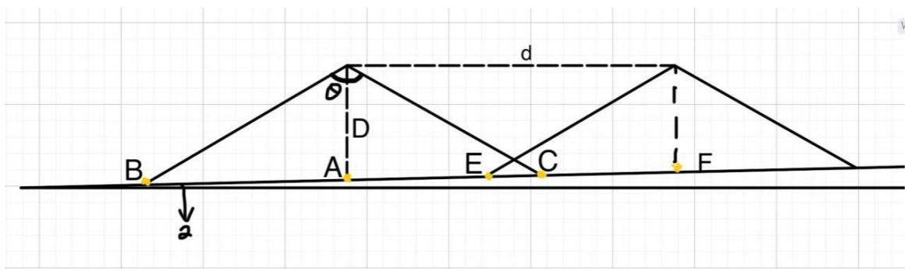

<details>
<summary>text_image</summary>

B
A
D
θ
d
E
C
F
a
</details>

图 1 问题 1 的示意图

本图运用CAD绘制。图中D为海水深度，α为海底坡面与水平面的夹角，θ为多波束换能器开角，直线BC为多波束测深条带的覆盖宽度。

对于覆盖宽度，本文首先构建测深条带的覆盖宽度W的数学表达式。根据三角函数和正弦定理，可得

$$
\frac {A B}{\sin \frac {\theta}{2}} = \frac {D}{\sin \left(\frac {\pi}{2} - \frac {\theta}{2} - \alpha\right)} \tag {1}
$$

经过化简，得测线的左半侧条带宽度为

$$
A B = \frac {D \sin \frac {\theta}{2}}{\cos \left(\frac {\theta}{2} + \alpha\right)} \tag {2}
$$

同理可得测线的右半侧条带宽度为

$$
A C = \frac {D \sin \frac {\theta}{2}}{\cos \left(\frac {\theta}{2} - \alpha\right)} \tag {3}
$$

设海域中 $\therefore L ^ { \prime }$ 点海水深度为 $D ^ { \prime }$ ,测线距中 $\therefore L ^ { \prime }$ 点距离为x，则测量船所在海水深度为

$$
D = D ^ {\prime} - x \tan \alpha \tag {4}
$$

由于条带的覆盖宽度 $W = A B + A C$ ,将式(2)(3)(4) 带入，可得条带覆盖宽度的数学表达式为

$$
W = \frac {\left(D ^ {\prime} - x \tan \alpha\right) \sin \theta \cos \alpha}{\left(\cos \frac {\theta}{2} \cos \alpha\right) ^ {2} - \left(\sin \frac {\theta}{2} \sin \alpha\right) ^ {2}} \tag {5}
$$

在海底平坦的海域内，相邻两条测线间距 $d$ 与 $d$ 在海底面上的投影BE长度相等，平坦海底重叠率题目定义为

$$
\eta = 1 - \frac {d}{W} \tag {6}
$$

容易推得其实式(6)是用测线间距 $d$ 的长度表示 $d$ 在平坦海底的投影BE长度。由于本题中海底存在一定坡度，所以相邻两条条带覆盖宽度并不一致。由正弦定理可求得本文所需要的d在海底坡面上的投影BE长度的表达式为

$$
B E = \frac {d \cos \frac {\theta}{2}}{\cos \left(\frac {\theta}{2} + \alpha\right)} \tag {7}
$$

针对重叠率，本文建立了两种不同的模型

模型一，用BE代替式(6)中的 $d$ ，规定本文中的重叠率公式中的 $W$ 指较早测量的条带覆盖宽度。联立式(5)(6)(7)，可以求出在海底坡度不为0时的条带重叠率 $\eta$ 数学表达式为

$$
\eta = 1 - \frac {x \cos \frac {\theta}{2} \left[ \left(\cos \frac {\theta}{2} \cos \alpha\right) ^ {2} - \left(\sin \frac {\theta}{2} \sin \alpha\right) ^ {2} \right]}{\cos \left(\frac {\theta}{2} + \alpha\right) \left(D ^ {\prime} - d \tan \alpha\right) \sin \theta \cos \alpha} \tag {8}
$$

将题目所设定的条件开角 $\theta = 1 2 0 ^ { \circ }$ ，坡度 $\alpha = 1 . 5 ^ { \circ }$ ，海域中心点水深 $D ^ { \prime } { = } 7 0 m$ 和测线距中心点距离 $x = - 8 0 0 , - 6 0 0 , - 4 0 0 , - 2 0 0 , 0 , 2 0 0 , 4 0 0 , 6 0 0 , 8 0 0$ 带入式(8)中，利用Matlab 计算求出问题1的解，并通过Excel保留两位小数，结果如表1所示。

表 1 问题 1 利用模型一的计算结果

<table><tr><td>测线距中心点处的距离/m</td><td>-800</td><td>-600</td><td>-400</td><td>-200</td><td>0</td><td>200</td><td>400</td><td>600</td><td>800</td></tr><tr><td>海水深度/m</td><td>90.95</td><td>85.71</td><td>80.47</td><td>75.24</td><td>70.00</td><td>64.76</td><td>59.53</td><td>54.29</td><td>49.05</td></tr><tr><td>覆盖宽度/m</td><td>315.81</td><td>297.63</td><td>279.44</td><td>261.26</td><td>243.07</td><td>224.88</td><td>206.70</td><td>188.51</td><td>170.33</td></tr><tr><td>与前一条测线的重叠率/%</td><td>-</td><td>29.59</td><td>25.00</td><td>19.78</td><td>13.78</td><td>6.81</td><td>-1.39</td><td>-11.17</td><td>-23.04</td></tr></table>

模型二，因为海底坡度 $\alpha = 1 . 5 ^ { \circ }$ ，坡度极小。，测线间距 $d$ 与它在海底坡面上的投影极为接近，故认为测线间距恒为 $d = 2 0 0$ 。规定重叠率公式中的 $W$ 是前一个条带的后半段与后一个条带的前半段之和，即 $W = A C + E F$ ，以此为基础进行求解。

$$
\eta = 1 - \frac {2 0 0}{A C + E F} \tag {9}
$$

$$
A C = \frac {\left[ D ^ {\prime} - (x - 2 0 0) \tan \alpha \right] \sin \frac {\theta}{2}}{\cos (\frac {\theta}{2} - \alpha)} \tag {10}
$$

$$
E F = \frac {\left(D ^ {\prime} - x \tan \alpha\right) \sin \frac {\theta}{2}}{\cos (\frac {\theta}{2} + \alpha)} \tag {11}
$$

根据式(9)(10)(11)即可求出重叠率η的值。利用Matlab 计算出在题目给定条件下的问题 1的解，通过Excel 保留两位小数，最终结果如表2 所示

表 2 问题 1 利用模型二的计算结果

<table><tr><td>测线距中心点处的距离/m</td><td>-800</td><td>-600</td><td>-400</td><td>-200</td><td>0</td><td>200</td><td>400</td><td>600</td><td>800</td></tr><tr><td>海水深度/m</td><td>90.95</td><td>85.71</td><td>80.47</td><td>75.24</td><td>70.00</td><td>64.76</td><td>59.53</td><td>54.29</td><td>49.05</td></tr><tr><td>覆盖宽度/m</td><td>315.81</td><td>297.63</td><td>279.44</td><td>261.26</td><td>243.07</td><td>224.88</td><td>206.70</td><td>188.51</td><td>170.33</td></tr><tr><td>与前一条测线的重叠率/%</td><td>38.37</td><td>34.71</td><td>30.59</td><td>25.91</td><td>20.56</td><td>14.37</td><td>7.14</td><td>-1.42</td><td>-11.73</td></tr></table>

本文需要对两种模型的优劣进行比较。运用CAD 绘制多条测线在海域上测深情况如图 2所示

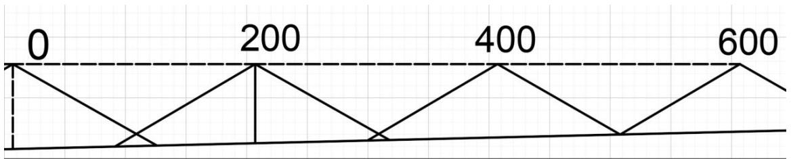

<details>
<summary>text_image</summary>

0
200
400
600
</details>

图 2 多条测线测深情况

利用 CAD 作图可以直观看出，距海域中心点距离为400m的测线仍然与前一条测线的条带存在重叠，故模型二比模型一更贴合本题。故采用模型二的求解结果。最终本题的计算结果如表3所示。

表 3 问题 1 的计算结果

<table><tr><td>测线距中心点处的距离/m</td><td>-800</td><td>-600</td><td>-400</td><td>-200</td><td>0</td><td>200</td><td>400</td><td>600</td><td>800</td></tr><tr><td>海水深度/m</td><td>90.95</td><td>85.71</td><td>80.47</td><td>75.24</td><td>70.00</td><td>64.76</td><td>59.53</td><td>54.29</td><td>49.05</td></tr><tr><td>覆盖宽度/m</td><td>315.81</td><td>297.63</td><td>279.44</td><td>261.26</td><td>243.07</td><td>224.88</td><td>206.70</td><td>188.51</td><td>170.33</td></tr><tr><td>与前一条测线的重叠率/%</td><td>-</td><td>34.71</td><td>30.59</td><td>25.91</td><td>20.56</td><td>14.37</td><td>7.14</td><td>-1.42</td><td>-11.73</td></tr></table>

## 5.2问题2模型的建立与求解

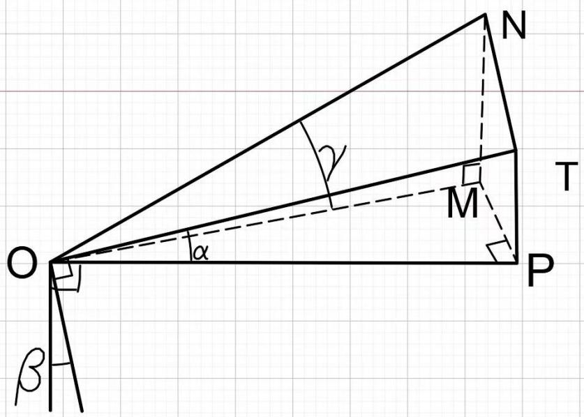

<details>
<summary>text_image</summary>

N
γ
M
T
O
α
P
β
</details>

图 3 关于非斜坡角的线面角的示意图

图中平面OTN为底角为的斜坡，类似于海底斜坡。平面OMP为水平面。

直线ON类似于任意方向测线海底坡面上的投影，直线OM 类似于测线水平面$O M P$ 的投影。设 OM 长度为 a , OM,MP,MN 两两垂直且 $M N = T P$ , 则$O P = a \cos \beta$ $M P = a \sin \beta$ $T P = a \cos \beta \tan \alpha = M N$ ，联立可推出任意方向测线

$$
\tan \gamma = \frac {M N}{O M} = \cos \beta \tan \alpha \tag {12}
$$

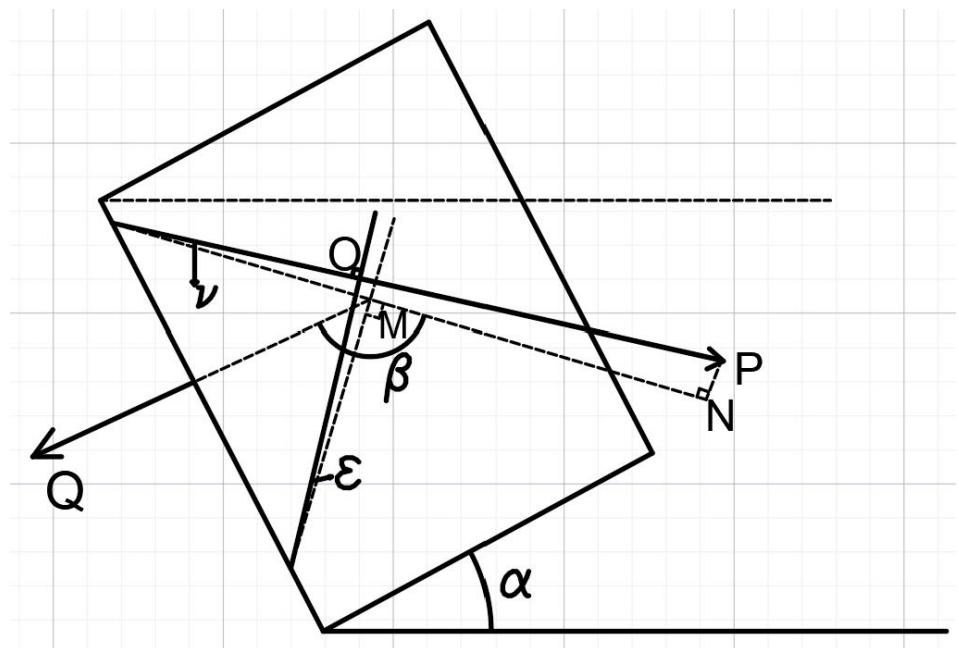

<details>
<summary>text_image</summary>

Q
O
M
β
ε
α
P
N
Q
</details>

图 4 问题 2 的示意图

图中 $O P$ 为测线方向在斜坡上的投影，MN为测线在水平面上的投影，MQ为斜坡法线在水平面上的投影，线面角<sub></sub>为 $O P$ 和水平面形成的线面角，线面角 $\varepsilon$ 为覆盖宽度与水平面形成的线面角， $\beta , \ \alpha$ 如图所示，根据式(12)的推导，可推出

$$
\tan \nu = \cos (\pi - \beta) \tan \alpha = - \cos \beta \tan \alpha \tag {13}
$$

$$
\tan \varepsilon = \cos \left(\beta - \frac {\pi}{2}\right) \tan \alpha = \sin \beta \tan \alpha \tag {14}
$$

在本题中测量船距海域中心点处得距离设为y，此时，水深 $D = D ^ { \prime } - x \tan \gamma$ ，再将tanv, tan ε 带入(5)可得

$$
W = \frac {\left(D ^ {\prime} + y \cos \beta \tan \alpha\right) \sin \theta \cos \varepsilon}{\left(\cos \frac {\theta}{2} \cos \varepsilon\right) ^ {2} - \left(\sin \frac {\theta}{2} \sin \varepsilon\right) ^ {2}} \tag {15}
$$

带入题目中给的数据，得到如下结果

表 4 问题 2 的计算结果

<table><tr><td rowspan="2" colspan="2">覆盖宽度/m</td><td colspan="8">测量船距海域中心点处的距离/海里</td></tr><tr><td>0</td><td>0.3</td><td>0.6</td><td>0.9</td><td>1.2</td><td>1.5</td><td>1.8</td><td>2.1</td></tr><tr><td rowspan="8">测线方向夹角/°</td><td>0</td><td>415.69</td><td>466.09</td><td>516.49</td><td>566.89</td><td>617.29</td><td>667.69</td><td>718.09</td><td>768.48</td></tr><tr><td>45</td><td>416.19</td><td>451.87</td><td>487.55</td><td>523.23</td><td>558.91</td><td>594.59</td><td>630.27</td><td>665.95</td></tr><tr><td>90</td><td>416.69</td><td>416.69</td><td>416.69</td><td>416.69</td><td>416.69</td><td>416.69</td><td>416.69</td><td>416.69</td></tr><tr><td>135</td><td>416.19</td><td>380.51</td><td>344.83</td><td>309.15</td><td>273.47</td><td>237.79</td><td>202.11</td><td>166.43</td></tr><tr><td>180</td><td>415.69</td><td>365.29</td><td>314.89</td><td>264.50</td><td>214.10</td><td>163.70</td><td>113.30</td><td>62.90</td></tr><tr><td>225</td><td>416.19</td><td>380.51</td><td>344.83</td><td>309.15</td><td>273.47</td><td>237.79</td><td>202.11</td><td>166.43</td></tr><tr><td>270</td><td>416.69</td><td>416.69</td><td>416.69</td><td>416.69</td><td>416.69</td><td>416.69</td><td>416.69</td><td>416.69</td></tr><tr><td>315</td><td>416.19</td><td>451.87</td><td>487.55</td><td>523.23</td><td>558.91</td><td>594.59</td><td>630.27</td><td>665.95</td></tr></table>

对于上述结果进行检验，根据图像我们可以得出，W的值应当关于 $\beta = 1 8 0 ^ { \circ }$

对称，即测线关于坡度线对称时，覆盖宽度相等，满足条件；其次当 $\beta \in \left( \frac { \pi } { 2 } , \frac { 3 \pi } { 2 } \right)$ 时，W应随x的变大而变大，反之变小，满足条件；再次，当 $\beta = 9 0 ^ { \circ } , 2 7 0 ^ { \circ }$ 时，测量船沿着坡面的等深线航行，所以覆盖宽度不变，满足条件；最后，当 $\beta = 1 8 0 ^ { \circ }$ 时，由于条带宽度线在同一高度上，且 $\theta = 1 2 0 ^ { \circ }$ ，所以 $W = 2 \sqrt { 3 } D$ ，经过计算验证，误差不超过0.001，满足条件。综上所述，本文得出的结果可信度高。

## 5.3问题3模型的建立与求解

在问题3的矩形海域内，等深线沿正南正北方向延伸，与矩形海域的东西两侧边界平行。当覆盖面积一定时，相邻条带间的重叠率越小，测线的长度越短。由问题2 的计算结果可以看出，在均匀坡度的海底地形上，当测线沿等深线测深时，测线上的测量条带覆盖宽度不会发生变化。在此条件下，当两条平行于等深线的测线其间距d一定时，重叠率也将确定。故本文可以通过调节相邻测线间距$d$ 的大小，来定量控制条带间重叠率为最小临界值10%，尽可能缩短测线的长度。

由问题2可知，虽然海底坡度 角度极小，但是较大的测量长度下，条带的覆盖宽度也会出现明显变化。在2 海里的测量长度下，条带的覆盖宽度可变化二三百米。本题所给的海域面积较大，而若平行测线不沿等深线延伸，始末端的测深条带宽度极差较大。在满足条带重叠率在10%\~20%之间的情况下，平行测线始末端所符合的相邻间距范围可能不重叠；即使范围存在重叠部分，在满足测线上水深最浅处条带覆盖率为10%，深水区域的条带覆盖率必然高于10%，不能控制每个部分的条带重叠率为最小临界值10%。相比之下，设计沿等深线方向延伸的测线具有很大的优势。

经查阅资料，在《海道测量规范》(GB12327-2022)中明确规定，使用多波束测探仪时，测线的方向布设应平行于等深线总方向。佐证了前文的判断，所以本文选择平行于等深线的方向设计测线。

本题在测线沿等深线延伸的条件下，通过确定条带重叠率和其中一条测线距海域中心点的东西向坐标，即可确定另一条测线的位置。

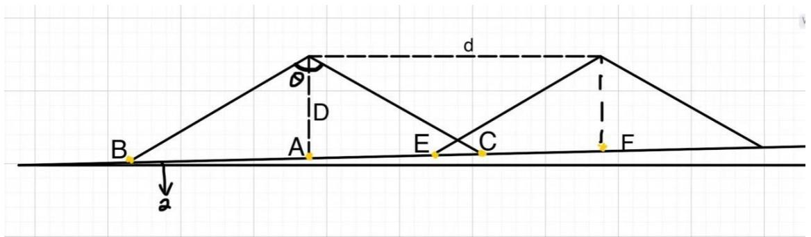

<details>
<summary>text_image</summary>

B
A
D
θ
d
E
C
F
a
</details>

图 5 相邻测线测深示意图

本图与图 1完全一致，为方便读者的阅读与理解，将本图放于问题3的求解过程中，方便对照。

规定向西为正方向，确定第一条测线的位置。第一条测线的西侧条带边界与待测海域的西侧边界重合。这样既不浪费测深条带的覆盖宽度，也不会出现漏测的情况。设待测海域的南北长为a，东西长为b， $x _ { n }$ 为自西向东第n条测线与海域中心点的距离，所以

$$
\frac {b}{2} - x _ {1} = A B = \frac {D \sin \frac {\theta}{2}}{\cos \left(\frac {\theta}{2} + \alpha\right)} \tag {16}
$$

海水深度D的值

$$
D = D ^ {\prime} + x \tan \alpha \tag {17}
$$

其中海域中心点处的海水深度 $D ^ { \prime } { = } 1 1 0 m$ 。通过式(16)(17)，即可求出第一条测线与海域中心点的距离 $x _ { 1 }$ 。

为了使测线的长度最短，本文先设条带间的重叠率为最小临界值 $\eta = 1 0 \%$ 对平坦条件下的重叠率 $\eta$ ，即本文中的式(6) 进一步化简得

$$
\eta = \frac {E C}{W} \tag {18}
$$

可以发现重叠率 $\eta$ 其实是重叠宽度:覆盖宽度的比值。根据问题1，重叠率公式中的W为前一个条带的后半段与后一个条带的前半段之和，故本题的重叠率<sub></sub>为

$$
\eta = \frac {B C - B E}{A C + E F} \tag {19}
$$

其中

$$
A C + E F = \frac {\left[ D ^ {\prime} + x _ {1} \tan \alpha \right] \sin \frac {\theta}{2}}{\cos (\frac {\theta}{2} - \alpha)} + \frac {\left(D ^ {\prime} + x _ {2} \tan \alpha\right) \sin \frac {\theta}{2}}{\cos (\frac {\theta}{2} + \alpha)} \tag {20}
$$

$$
B C - B E = \frac {\left(D ^ {\prime} + x _ {1} \tan \alpha\right) \sin \theta \cos \alpha}{\left(\cos \frac {\theta}{2} \cos \alpha\right) ^ {2} - \left(\sin \frac {\theta}{2} \sin \alpha\right) ^ {2}} - \frac {(x _ {1} - x _ {2}) \cos \frac {\theta}{2}}{\cos \left(\frac {\theta}{2} + \alpha\right)} \tag {21}
$$

在重叠率 $\eta$ 和 $x _ { 1 }$ 确定的情况下，联立式(19)(20)(21)，即可求出 $x _ { 2 }$ 的值，以此类推，$x _ { 3 } , x _ { 4 } , \cdots , x _ { n }$ 都可以被依次求出，当 $x _ { n } \leq 3 7 0 4 m$ 时，停止往后求解 $x _ { n }$ 。

利用 Matlab 和 Python 对 $x _ { n }$ 进行求解，求解结果如表5 所示

表 5 测线 $x _ { n }$ 与海域中心点的距离表

<table><tr><td>测线</td><td>距离/m</td><td>测线</td><td>距离/m</td></tr><tr><td> $x_1$ </td><td>3345.4</td><td> $x_{21}$ </td><td>-2728.2</td></tr><tr><td> $x_2$ </td><td>2753.3</td><td> $x_{22}$ </td><td>-2843.7</td></tr><tr><td> $x_3$ </td><td>2207.8</td><td> $x_{23}$ </td><td>-2950.2</td></tr><tr><td> $x_4$ </td><td>1705.0</td><td> $x_{24}$ </td><td>-3048.3</td></tr><tr><td> $x_5$ </td><td>1241.7</td><td> $x_{25}$ </td><td>-3138.7</td></tr><tr><td> $x_6$ </td><td>814.7</td><td> $x_{26}$ </td><td>-3222.0</td></tr><tr><td> $x_7$ </td><td>421.2</td><td> $x_{27}$ </td><td>-3298.8</td></tr><tr><td> $x_8$ </td><td>58.6</td><td> $x_{28}$ </td><td>-3369.6</td></tr><tr><td> $x_9$ </td><td>-275.5</td><td> $x_{29}$ </td><td>-3434.8</td></tr><tr><td> $x_{10}$ </td><td>-583.5</td><td> $x_{30}$ </td><td>-3494.9</td></tr><tr><td> $x_{11}$ </td><td>-867.3</td><td> $x_{31}$ </td><td>-3550.2</td></tr><tr><td> $x_{12}$ </td><td>-1128.8</td><td> $x_{32}$ </td><td>-3601.3</td></tr><tr><td> $x_{13}$ </td><td>-1369.8</td><td> $x_{33}$ </td><td>-3648.3</td></tr><tr><td> $x_{14}$ </td><td>-1591.9</td><td> $x_{34}$ </td><td>-3691.6</td></tr><tr><td> $x_{15}$ </td><td>-1796.6</td><td> $x_{35}$ </td><td>-3731.6</td></tr><tr><td> $x_{16}$ </td><td>-1985.2</td><td></td><td></td></tr><tr><td> $x_{17}$ </td><td>-2159.0</td><td></td><td></td></tr><tr><td> $x_{18}$ </td><td>-2319.2</td><td></td><td></td></tr><tr><td> $x_{19}$ </td><td>-2466.8</td><td></td><td></td></tr><tr><td> $x_{20}$ </td><td>-2602.8</td><td></td><td></td></tr></table>

计算第34条测线 $x _ { 3 4 }$ 的条带东侧边界，联立式(3)(17)并带入数据，可得第34条测线东侧条带宽 $A C _ { 3 4 } = 2 2 . 1 m$ ，故 $\left| x _ { 3 4 } \right| + A C _ { 3 4 } = 3 7 1 3 . 7 > 3 7 0 4 m$ ，第 34条测线的东侧条带已经覆盖了待测海域的东侧边界。故不需要第35条测线，舍去 $x _ { 3 5 }$ 。$x _ { 1 } \sim x _ { 3 4 }$ 为本文所设计的测线，可以将待测海域完全覆盖。

以向东为正方向绘制本文所设计的测线示意图

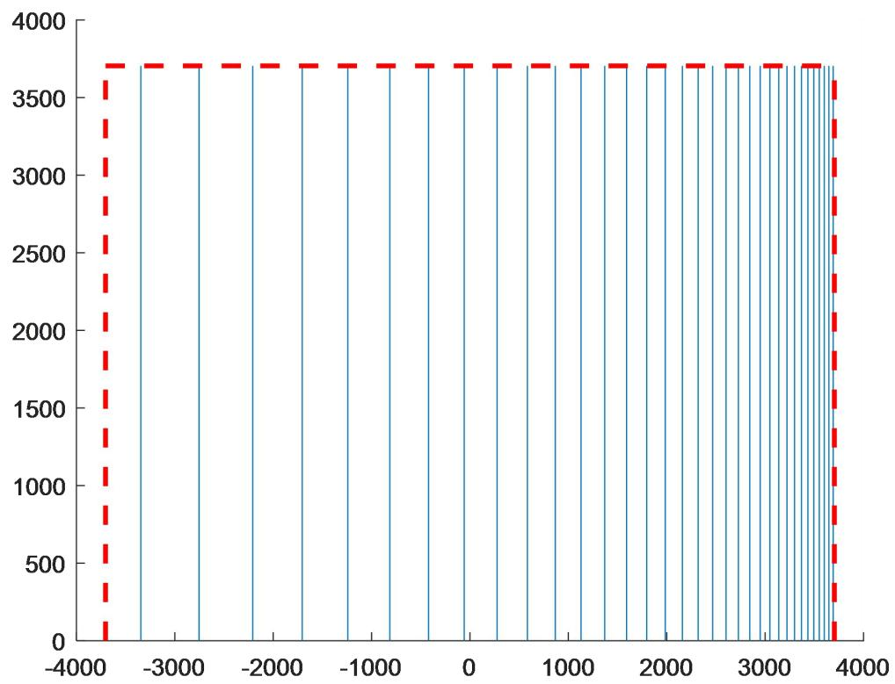

<details>
<summary>bar</summary>

| X | Value |
| --- | --- |
| ~-3700 | ~3700 |
| ~-2800 | ~3700 |
| ~-2100 | ~3700 |
| ~-1600 | ~3700 |
| ~-1100 | ~3700 |
| ~-600 | ~3700 |
| ~-100 | ~3700 |
| ~300 | ~3700 |
| ~600 | ~3700 |
| ~900 | ~3700 |
| ~1200 | ~3700 |
| ~1500 | ~3700 |
| ~1800 | ~3700 |
| ~2100 | ~3700 |
| ~2400 | ~3700 |
| ~2700 | ~3700 |
| ~3000 | ~3700 |
| ~3300 | ~3700 |
| ~3600 | ~3700 |
</details>

图 6 问题 3 测线设计图

图6中坐标横轴与红色虚线所围成部分为待测海域，蓝线为测线，测线横坐标的绝对值表示该测线距海域中心点的距离，正负号代表方向。

本文所设计的测线总长度C为34a，即 68 海里；可完全覆盖待测海域；所有测线条带的重叠率均为10%。贴合题目要求。测线的方向布设平行于等深线延伸方向，符合《海道测量规范》(GB12327-2022)中的规定。

## 5.4问题4模型的建立与求解

本文将附件中的地形数据导入Matlab中，并将海水深度的值取负值，利用Matlab画出海底地形图以及等高线，梯度线。为了方便观察，本文对梯度线进行了删减，并依据等高线对地形进行分区，方便后续测线设计。

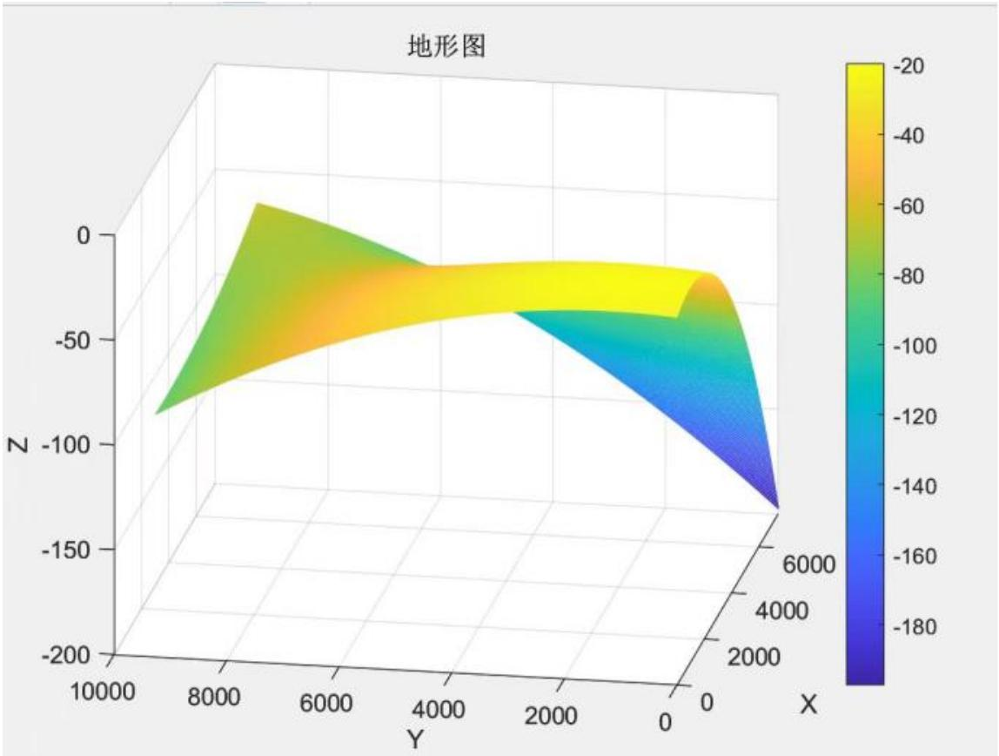

<details>
<summary>surface_3d</summary>

| X | Y | Z |
| --- | --- | --- |
| 0~6000 | 0~10000 | ~-20 ~-180 |
</details>

图 7 待测海底地形图  
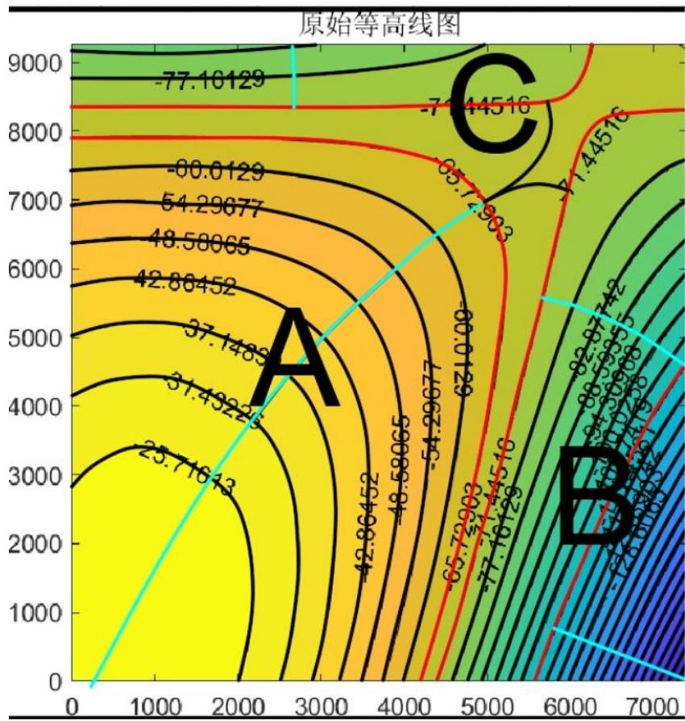

<details>
<summary>contour</summary>

| 区域 | 数值 |
| --- | --- |
| A | 23.71643 |
| B | 82.9742 |
| C | -71.44516 |
</details>

图 8 等高线与梯度线图

图8中标数值的为等高线，浅蓝色线为梯度线，垂直于等高线的方向为梯度方向，梯度所跨区域为本文对待测海域的分区。

模型建立：在本文中存在多个目标值，在本文的多目标优化问题中，经查阅资料发现，对测区实施全覆盖是测线设计中最重要的考虑因素，于是我们采用主要目标法，将对测区的覆盖率作为第一优先级进行考虑。在两条相邻的等高线上，等高线距离远的地方，地形更平坦；反之，地形会更加陡峭。所以只要满足等高线沿梯度方向距离最远的地方达到全覆盖，其余处也必将实现全覆盖。确定测区方向后，在梯度方向上设计相邻测线的等高距需要考虑到测线总长度最短。根据问题 3可知，当重叠率最小时，测线总长度最短，即本题中需要求出等高线最宽处重叠率恰好为零时的等高距，以某一条线开始，第一条线和第二条测线的等高距，以此类推，直到覆盖整个区域面积。

以下是公式

$$
D _ {x + 1} = \frac {D _ {x} \left[ \frac {\sin \frac {\theta}{2}}{\cos \left(\frac {\theta}{2} - \alpha\right)} + \frac {1}{\sin \alpha} \right]}{\left[ \frac {1}{\sin \alpha} - \frac {\sin \frac {\theta}{2}}{\cos \left(\frac {\theta}{2} + \alpha\right)} \right]} \tag {22}
$$

模型求解：利用Matlab 计算并分别绘制三个区域的测线设计图。

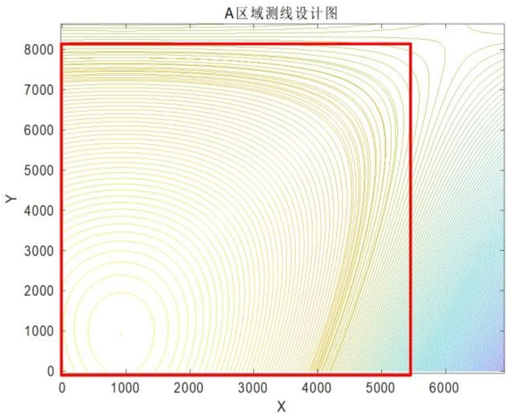

<details>
<summary>contour</summary>

| X (range) | Y (range) |
| --- | --- |
| 0~5500 | 0~8200 |
</details>

图 9 A 区域测线设计图

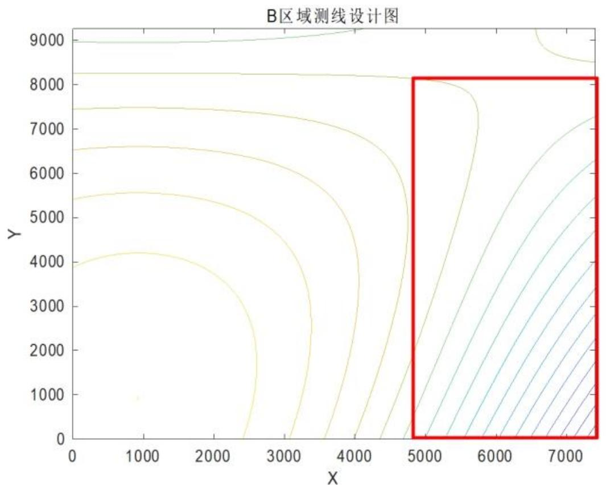

<details>
<summary>contour</summary>

| Y | X (range) |
| --- | --- |
| 0~9000 | 0~7500 |
</details>

图 10 B 区域测线设计图

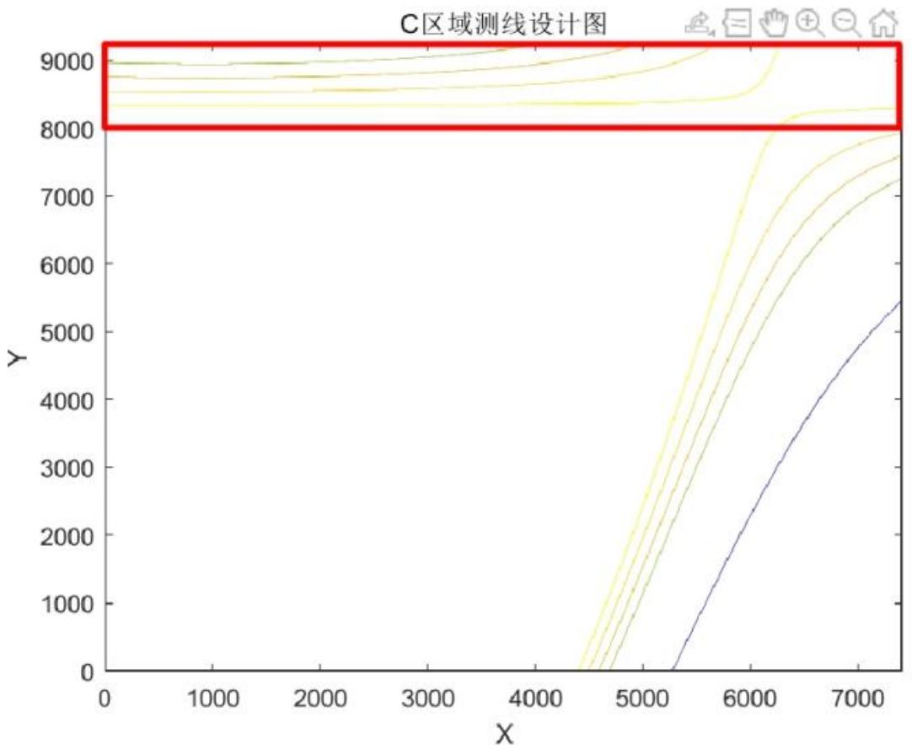  
图 11 C 区域测线设计图

利用 Matlab 将等高线进行微元划分，通过欧几里得距离累计相加，可以计算出，C 区域的等高线总长度为 1333.4m，B区域的等高线总长度为31388.5m，A区域的等高线总长度为 433672.5m，总测线长度为 466394.4m。由于本文将漏测率放在优先级，本文最终得出漏测率为2.3%

结果验证：由前面的问题可以得出，在平坦的地方，开角相同时，需要的测线更多，所以，在地形图中越平坦时，航线越密集，越稀疏，符合本文给出的结果，所以，本文测线设计具有较高的合理性。

## 六、 模型的评价与推广

## 6.1模型的优点

1.本文对于重叠率，条带宽度的计算，根据题目中所给出的公式进行推广并且得出了符合实际的结果，定义，推广模型合理准确。  
2.本文对于几个问题的模型建立具有可传递性，从问题1到问题4是对模型的层层递进，通过增加变量和增加复杂程度来使模型由特殊到一般，使模型更加有层次。  
3.本文在建立模型时将复杂问题转化为可以直观呈现出的几何问题，将多目标优化提取主要目标，减少目标，化繁为简是本文模型的一大特点。  
4.本文在建立模型时都对结果进行了合理性、准确性验证，通过文献等进行佐证，保证了结果的科学性，可行性。

## 6.2模型的缺点

1.本文在坡面上设计测线时仅考虑了直线，未考虑曲线，且仅考虑测线平行排列的设计方式。  
2.本文在问题4多目标优化时选择了主要目标法。从一定程度上来说，没有对各个目标综合考量。

## 6.2模型的推广

1.本文中对覆盖宽度，重叠率的计算模型，对测线的设计模型可以推广使用到实际生活中的多波束测量中去，尤其可以根据实际情况修正后应用到海洋测绘领域中。  
2.本文中的模型可以应用到之后关于多波束测深系统的科学研究中。

## 七、 参考文献

[1]杨柳,王超,吴忠明.多波束测深系统与单波束测深仪在长江河道测量应用中的比较与分析[J].水利水电快报, 2021,42(05): 23-25+29. DOI:10.15974/ j.cnki.slsdkb. 2021.05.006.  
[2]高君,肖付民,裴文斌等.多波束测深仪扫幅宽度评估方法[J].测绘科学技术学报,2013,30(01):28-32.  
[3]成芳,胡迺成.多波束测量测线布设优化方法研究[J].海洋技术学报,2016,35(02):87-91.  
[4]丁继胜,周兴华,刘忠臣等.多波束测深声纳系统的工作原理[J].海洋测绘,1999(03):15-22.

## 附录

## 问题 1：

## Matlab 代码

模型一

$$
\mathrm{a=pi/120}
$$

$$
\mathrm{b} = 2 ^ {*} \mathrm{pi} / 3
$$

$$
\text {for} \mathrm{d} = - 8 0 0: 2 0 0: 8 0 0
$$

$$
\mathrm{D} = 7 0 - \mathrm{d} ^ {*} \tan (\mathrm{a})
$$

$$
\mathrm{w} = ((7 0 - \mathrm{d} ^ {*} \tan (\mathrm{a})) ^ {*} \sin (\mathrm{b}) ^ {*} \cos (\mathrm{a})) / ((\cos (\mathrm{b} / 2) ^ {*} \cos (\mathrm{a})) ^ {\wedge} 2 - (\sin (\mathrm{b} / 2) ^ {*} \sin (\mathrm{a})) ^ {\wedge} 2)
$$

$$
\mathrm{n} = 1 - (2 0 0 ^ {*} \cos (\mathrm{b} / 2) ^ {*} ((\cos (\mathrm{b} / 2) ^ {*} \cos (\mathrm{a})) ^ {\wedge} 2 - (\sin (\mathrm{b} / 2) ^ {*} \sin (\mathrm{a})) ^ {\wedge} 2) / (\cos (\mathrm{a} + \mathrm{b} / 2) ^ {*} (7 0 - \mathrm{d} ^ {*} \tan (\mathrm{a})) ^ {\wedge} 2)
$$

$$
\text {)} ^ {*} \sin (\mathrm{b}) ^ {*} \cos (\mathrm{a}))
$$

$$
\text {end}
$$

模型二

$$
\text {clear}
$$

$$
\mathrm{a=pi/120}
$$

$$
\mathrm{b} = 2 ^ {*} \mathrm{pi} / 3
$$

$$
\text {for} \mathrm{d} = - 8 0 0: 2 0 0: 8 0 0
$$

$$
\mathrm{x} 2 = (7 0 - (\mathrm{d} - 2 0 0) ^ {*} \tan (\mathrm{a})) ^ {*} \sin (\mathrm{b} / 2) / \cos (\mathrm{b} / 2 - \mathrm{a})
$$

$$
\mathrm{x} 1 = (7 0 - \mathrm{d} ^ {*} \tan (\mathrm{a})) ^ {*} \sin (\mathrm{b} / 2) / \cos (\mathrm{b} / 2 + \mathrm{a})
$$

$$
\mathrm{n} = 1 - 2 0 0 / (\mathrm{x} 2 + \mathrm{x} 1)
$$

$$
\text {End}
$$

$$
\mathrm{a=pi/120}
$$

$$
\mathrm{b} = 2 ^ {*} \mathrm{pi} / 3
$$

$$
\text {for} \mathrm{d} = - 8 0 0: 2 0 0: 8 0 0
$$

$$
\mathrm{D} = 7 0 - \mathrm{d} ^ {*} \tan (\mathrm{a})
$$

$$
\mathrm{w} = ((7 0 - \mathrm{d} ^ {*} \tan (\mathrm{a})) ^ {*} \sin (\mathrm{b}) ^ {*} \cos (\mathrm{a})) / ((\cos (\mathrm{b} / 2) ^ {*} \cos (\mathrm{a})) ^ {\wedge} 2 - (\sin (\mathrm{b} / 2) ^ {*} \sin (\mathrm{a})) ^ {\wedge} 2)
$$

$$
\text {end}
$$

问题 1 的计算结果

<table><tr><td>测线距中心点处的距离/m</td><td>-800</td><td>-600</td><td>-400</td><td>-200</td><td>0</td><td>200</td><td>400</td><td>600</td><td>800</td></tr><tr><td>海水深度/m</td><td>90.95</td><td>85.71</td><td>80.47</td><td>75.24</td><td>70.00</td><td>64.76</td><td>59.53</td><td>54.29</td><td>49.05</td></tr><tr><td>覆盖宽度/m</td><td>315.81</td><td>297.63</td><td>279.44</td><td>261.26</td><td>243.07</td><td>224.88</td><td>206.70</td><td>188.51</td><td>170.33</td></tr><tr><td>与前一条测线的重叠率/%</td><td>-</td><td>34.71</td><td>30.59</td><td>25.91</td><td>20.56</td><td>14.37</td><td>7.14</td><td>-1.42</td><td>-11.73</td></tr></table>

## 问题 2：

## Matlab 代码

$$
\text {clear}
$$

$$
\mathrm{a=pi/120}
$$

```julia
b=2*pi/3
for i=0:0.3:2.1
y=i*1852
degrees = 0
radians = deg2rad(degrees)
v=atan(sin(radians)*tan(a))
w=((120+y*cos(radians)*tan(a))*sin(b)*cos(v))/((cos(b/2)*cos(v))^2-(sin(b/2)*sin(v))
^2)
end
```

问题 2 的计算结果

<table><tr><td rowspan="2" colspan="2">覆盖宽度/m</td><td colspan="8">测量船距海域中心点处的距离/海里</td></tr><tr><td>0</td><td>0.3</td><td>0.6</td><td>0.9</td><td>1.2</td><td>1.5</td><td>1.8</td><td>2.1</td></tr><tr><td rowspan="8">测线方向夹角/°</td><td>0</td><td>415.69</td><td>466.09</td><td>516.49</td><td>566.89</td><td>617.29</td><td>667.69</td><td>718.09</td><td>768.48</td></tr><tr><td>45</td><td>416.19</td><td>451.87</td><td>487.55</td><td>523.23</td><td>558.91</td><td>594.59</td><td>630.27</td><td>665.95</td></tr><tr><td>90</td><td>416.69</td><td>416.69</td><td>416.69</td><td>416.69</td><td>416.69</td><td>416.69</td><td>416.69</td><td>416.69</td></tr><tr><td>135</td><td>416.19</td><td>380.51</td><td>344.83</td><td>309.15</td><td>273.47</td><td>237.79</td><td>202.11</td><td>166.43</td></tr><tr><td>180</td><td>415.69</td><td>365.29</td><td>314.89</td><td>264.50</td><td>214.10</td><td>163.70</td><td>113.30</td><td>62.90</td></tr><tr><td>225</td><td>416.19</td><td>380.51</td><td>344.83</td><td>309.15</td><td>273.47</td><td>237.79</td><td>202.11</td><td>166.43</td></tr><tr><td>270</td><td>416.69</td><td>416.69</td><td>416.69</td><td>416.69</td><td>416.69</td><td>416.69</td><td>416.69</td><td>416.69</td></tr><tr><td>315</td><td>416.19</td><td>451.87</td><td>487.55</td><td>523.23</td><td>558.91</td><td>594.59</td><td>630.27</td><td>665.95</td></tr></table>

## 问题 3：

Python 代码确定 <sub>1</sub>x

import numpy as np

from scipy.optimize import fsolve

\# 定义方程

def equation(x):

a = np.pi/120

m = 2\*np.pi/3

b = 4\*1852

return (110 + x \* np.tan(a)) \* np.sin(m/2) / np.cos(m/2 + a) - b/2 + x

\# 使用fsolve函数求解方程

x\_solution = fsolve(equation, 0) # 假设 x 的初始值为 0

```txt
print("Solution for x:", x_solution)
```

输出结果 Solution for x: [3345.36088471]

Matlab 代码递推测线

<div class="mineru-algorithm" style="white-space: pre-wrap; font-family:monospace;">
clear;
clc;
n = 0.1
syms x2 % 定义 x2 为符号变量
x1 = 3345.36088471
a = pi/120;
b = 2*pi/3;
m = (110 + x1*tan(a))*sin(b/2)/(cos(b/2-a)) + (110 + x2*tan(a))*sin(b/2)/cos(b/2+a);
k = (110 + x1*tan(a))*sin(b)*cos(a)/((cos(b/2)*cos(a))^2 - (sin(b/2)*sin(a))^2) - (x1 - x2)*cos(b/2)/cos(b/2+a);
eqn = k/m == n; % 设置方程 k/m=0.1
sol = solve(eqn, x2); % 求解方程，得到 x2 的解
x2_value=double(sol); % 将 x2 转化为浮点数
disp(x2_value); % 显示 x2 的解
</div>

<div class="mineru-algorithm" style="white-space: pre-wrap; font-family:monospace;">
syms x3 % 定义 x3 为符号变量
x2 = x2_value
a = pi/120;
b = 2*pi/3;
m = (110 + x2*tan(a))*sin(b/2)/(cos(b/2-a)) + (110 + x3*tan(a))*sin(b/2)/cos(b/2+a);
k = (110 + x2*tan(a))*sin(b)*cos(a)/((cos(b/2)*cos(a))^2 - (sin(b/2)*sin(a))^2) - (x2 - x3)*cos(b/2)/cos(b/2+a);
eqn = k/m == n; % 设置方程 k/m=0.1
sol = solve(eqn, x3); % 求解方程，得到 x3 的解
x3_value=double(sol); % 将 x3 转化为浮点数
disp(x3_value); % 显示 x3 的解
</div>

<div class="mineru-algorithm" style="white-space: pre-wrap; font-family:monospace;">
syms x4 % 定义 x4 为符号变量
x3 = x3_value
a = pi/120;
b = 2*pi/3;
m = (110 + x3*tan(a))*sin(b/2)/(cos(b/2-a)) + (110 + x4*tan(a))*sin(b/2)/cos(b/2+a);
k = (110 + x3*tan(a))*sin(b)*cos(a)/((cos(b/2)*cos(a))^2 - (sin(b/2)*sin(a))^2) - (x3 - x4)*cos(b/2)/cos(b/2+a);
eqn = k/m == n; % 设置方程 k/m=0.1
sol = solve(eqn, x4); % 求解方程，得到 x4 的解
x4_value=double(sol); % 将 x4 转化为浮点数
disp(x4_value); % 显示 x4 的解
</div>

```matlab
syms x5 % 定义 x5 为符号变量
x4 = x4_value
a = pi/120;
b = 2*pi/3;
m = (110 + x4*tan(a))*sin(b/2)/(cos(b/2-a)) + (110 + x5*tan(a))*sin(b/2)/cos(b/2+a);
k = (110 + x4*tan(a))*sin(b)*cos(a)/((cos(b/2)*cos(a))^2 - (sin(b/2)*sin(a))^2) - (x4 - x5)*cos(b/2)/cos(b/2+a);
eqn = k/m == n; % 设置方程 k/m=0.1
sol = solve(eqn, x5); % 求解方程，得到 x5 的解
x5_value=double(sol); % 将 x5 转化为浮点数
disp(x5_value); % 显示 x5 的解
```

```matlab
syms x6 % 定义 x6 为符号变量
x5 = x5_value
a = pi/120;
b = 2*pi/3;
m = (110 + x5*tan(a))*sin(b/2)/(cos(b/2-a)) + (110 + x6*tan(a))*sin(b/2)/cos(b/2+a);
k = (110 + x5*tan(a))*sin(b)*cos(a)/((cos(b/2)*cos(a))^2 - (sin(b/2)*sin(a))^2) - (x5 - x6)*cos(b/2)/cos(b/2+a);
eqn = k/m == n; % 设置方程 k/m=0.1
sol = solve(eqn, x6); % 求解方程，得到 x6 的解
x6_value=double(sol); % 将 x6 转化为浮点数
disp(x6_value); % 显示 x6 的解
```

```matlab
syms x7 % 定义 x7 为符号变量
x6 = x6_value
a = pi/120;
b = 2*pi/3;
m = (110 + x6*tan(a))*sin(b/2)/(cos(b/2-a)) + (110 + x7*tan(a))*sin(b/2)/cos(b/2+a);
k = (110 + x6*tan(a))*sin(b)*cos(a)/((cos(b/2)*cos(a))^2 - (sin(b/2)*sin(a))^2) - (x6 - x7)*cos(b/2)/cos(b/2+a);
eqn = k/m == n; % 设置方程 k/m=0.1
sol = solve(eqn, x7); % 求解方程，得到 x7 的解
x7_value=double(sol); % 将 x7 转化为浮点数
disp(x7_value); % 显示 x7 的解
```

```matlab
syms x8 % 定义 x8 为符号变量
x7 = x7_value
a = pi/120;
b = 2*pi/3;
m = (110 + x7*tan(a))*sin(b/2)/(cos(b/2-a)) + (110 + x8*tan(a))*sin(b/2)/cos(b/2+a);
k = (110 + x7*tan(a))*sin(b)*cos(a)/((cos(b/2)*cos(a))^2 - (sin(b/2)*sin(a))^2) - (x7 - x8)*cos(b/2)/cos(b/2+a);
eqn = k/m == n; % 设置方程 k/m=0.1
```

sol = solve(eqn, x8); % 求解方程，得到 x8 的解

x8\_value=double(sol); % 将 x8 转化为浮点数

disp(x8\_value); % 显示 x8 的解

syms x9 % 定义 x9 为符号变量

$$
\mathrm{x8} = \mathrm{x8} \text { value }
$$

$$
\mathrm{a} = \mathrm{pi/120};
$$

$$
\mathrm{b} = 2 ^ {*} \mathrm{pi} / 3;
$$

$$
\mathrm{m} = (1 1 0 + \mathrm{x} 8 ^ {*} \tan (\mathrm{a})) ^ {*} \sin (\mathrm{b} / 2) / (\cos (\mathrm{b} / 2 - \mathrm{a})) + (1 1 0 + \mathrm{x} 9 ^ {*} \tan (\mathrm{a})) ^ {*} \sin (\mathrm{b} / 2) / \cos (\mathrm{b} / 2 + \mathrm{a});
$$

$$
\mathrm{k} = (1 1 0 + \mathrm{x} 8 ^ {*} \tan (\mathrm{a})) ^ {*} \sin (\mathrm{b}) ^ {*} \cos (\mathrm{a}) / ((\cos (\mathrm{b} / 2) ^ {*} \cos (\mathrm{a})) ^ {\wedge} 2 - (\sin (\mathrm{b} / 2) ^ {*} \sin (\mathrm{a})) ^ {\wedge} 2) - (\mathrm{x} 8 -
$$

$$
\mathrm{x} 9) ^ {*} \cos (\mathrm{b} / 2) / \cos (\mathrm{b} / 2 + \mathrm{a});
$$

$$
\mathrm{eqn} = \mathrm{k} / \mathrm{m} = = \mathrm{n}; \% \text {设置方程} \mathrm{k} / \mathrm{m} = 0.1
$$

$$
\mathrm{sol} = \text {solve(eqn, x9)}; \% \text {求解方程，得到x9的解}
$$

$$
\mathrm{x} 9 \text {value} = \text {double(sol)}; \% \text {将} \mathrm{x} 9 \text {转化为浮点数}
$$

$$
\mathrm{disp} (\mathrm{x} 9 \_ \text {value}); \% \text {显示} \mathrm{x} 9 \text {的解}
$$

$$
\text {syms } \times 1 0
$$

$$
\mathrm{x} 9 = \mathrm{x} 9 \_ \text {value}
$$

$$
\mathrm{a} = \mathrm{pi/120};
$$

$$
\mathrm{b} = 2 ^ {*} \mathrm{pi} / 3;
$$

$$
\mathrm{m} = (1 1 0 + \mathrm{x} 9 ^ {*} \tan (\mathrm{a})) ^ {*} \sin (\mathrm{b} / 2) / (\cos (\mathrm{b} / 2 - \mathrm{a})) + (1 1 0 + \mathrm{x} 1 0 ^ {*} \tan (\mathrm{a})) ^ {*} \sin (\mathrm{b} / 2) / \cos (\mathrm{b} / 2 + \mathrm{a});
$$

$$
\mathrm{k} = (1 1 0 + \mathrm{x} 9 ^ {*} \tan (\mathrm{a})) ^ {*} \sin (\mathrm{b}) ^ {*} \cos (\mathrm{a}) / ((\cos (\mathrm{b} / 2) ^ {*} \cos (\mathrm{a})) ^ {\wedge} 2 - (\sin (\mathrm{b} / 2) ^ {*} \sin (\mathrm{a})) ^ {\wedge} 2) - (\mathrm{x} 9 -
$$

$$
\mathrm{x} 1 0) ^ {*} \cos (\mathrm{b} / 2) / \cos (\mathrm{b} / 2 + \mathrm{a});
$$

$$
\mathrm{eqn} = \mathrm{k/m} = = \mathrm{n};
$$

$$
\mathrm{sol} = \text {solve} (\mathrm{eqn}, \mathrm{x10});
$$

$$
\mathrm{x} 1 0 \_ \text {value} = \text {double} (\text {sol});
$$

$$
\mathrm{disp} (\mathrm{x} 1 0 \_ \text {value});
$$

$$
\text {syms x11}
$$

$$
\mathrm{x} 1 0 = \mathrm{x} 1 0 \_ \text {value}
$$

$$
\mathrm{a} = \mathrm{pi/120};
$$

$$
\mathrm{b} = 2 ^ {*} \mathrm{pi} / 3;
$$

$$
\mathrm{m} \quad = \quad (1 1 0 \quad + \quad \mathrm{x} 1 0 ^ {*} \tan (\mathrm{a})) ^ {*} \sin (\mathrm{b} / 2) / (\cos (\mathrm{b} / 2 - \mathrm{a})) \quad + \quad (1 1 0 \quad +
$$

$$
\mathrm{x} 1 1 ^ {*} \tan (\mathrm{a})) ^ {*} \sin (\mathrm{b} / 2) / \cos (\mathrm{b} / 2 + \mathrm{a});
$$

$$
\mathrm{k} = (1 1 0 + \mathrm{x} 1 0 ^ {*} \tan (\mathrm{a})) ^ {*} \sin (\mathrm{b}) ^ {*} \cos (\mathrm{a}) / ((\cos (\mathrm{b} / 2) ^ {*} \cos (\mathrm{a})) ^ {\wedge} 2 - (\sin (\mathrm{b} / 2) ^ {*} \sin (\mathrm{a})) ^ {\wedge} 2) -
$$

$$
(x 1 0 - x 1 1) ^ {*} \cos (b / 2) / \cos (b / 2 + a);
$$

$$
\mathrm{eqn} = \mathrm{k/m} = = \mathrm{n};
$$

$$
\mathrm{sol} = \text {solve} (\mathrm{eqn}, \mathrm{x11});
$$

$$
\mathrm {x11\_value = double(sol)};
$$

$$
\mathrm{disp} (\mathrm{x} 1 1 \_ \text {value});
$$

$$
\text {syms x12}
$$

$$
\mathrm{x} 1 1 = \mathrm{x} 1 1 \_ \text {value}
$$

$$
\mathrm{a} = \mathrm{pi/120};
$$

```matlab
b = 2*pi/3;
m     =   (110   +   x11*tan(a))*sin(b/2)/(cos(b/2-a))   +   (110   +
x12*tan(a))*sin(b/2)/cos(b/2+a);
k = (110 + x11*tan(a))*sin(b)*cos(a)/((cos(b/2)*cos(a))^2 - (sin(b/2)*sin(a))^2) -
(x11 - x12)*cos(b/2)/cos(b/2+a);
eqn = k/m == n;
sol = solve(eqn, x12);
x12_value=double(sol);
disp(x12_value);

syms x13
x12 = x12_value
a = pi/120;
b = 2*pi/3;
m     =   (110   +   x12*tan(a))*sin(b/2)/(cos(b/2-a))   +   (110   +
x13*tan(a))*sin(b/2)/cos(b/2+a);
k = (110 + x12*tan(a))*sin(b)*cos(a)/((cos(b/2)*cos(a))^2 - (sin(b/2)*sin(a))^2) -
(x12 - x13)*cos(b/2)/cos(b/2+a);
eqn = k/m == n;
sol = solve(eqn, x13);
x13_value=double(sol);
disp(x13_value);

syms x14
x13 = x13_value
a = pi/120;
b = 2*pi/3;
m     =   (110   +   x13*tan(a))*sin(b/2)/(cos(b/2-a))   +   (110   +
x14*tan(a))*sin(b/2)/cos(b/2+a);
k = (110 + x13*tan(a))*sin(b)*cos(a)/((cos(b/2)*cos(a))^2 - (sin(b/2)*sin(a))^2) -
(x13 - x14)*cos(b/2)/cos(b/2+a);
eqn = k/m == n;
sol = solve(eqn, x14);
x14_value=double(sol);
disp(x14_value);

syms x15
x14 = x14_value
a = pi/120;
b = 2*pi/3;
m     =   (110   +   x14*tan(a))*sin(b/2)/(cos(b/2-a))   +   (110   +
x15*tan(a))*sin(b/2)/cos(b/2+a);
k = (110 + x14*tan(a))*sin(b)*cos(a)/((cos(b/2)*cos(a))^2 - (sin(b/2)*sin(a))^2) -
(x14 - x15)*cos(b/2)/cos(b/2+a);
```

```txt
eqn = k/m == n;
sol = solve(eqn, x15);
x15_value=double(sol);
disp(x15_value);

syms x16
x15 = x15_value
a = pi/120;
b = 2*pi/3;
m     =   (110   +   x15*tan(a))*sin(b/2)/(cos(b/2-a))   +   (110   +
x16*tan(a))*sin(b/2)/cos(b/2+a);
k = (110 + x15*tan(a))*sin(b)*cos(a)/((cos(b/2)*cos(a))^2 - (sin(b/2)*sin(a))^2) -
(x15 - x16)*cos(b/2)/cos(b/2+a);
eqn = k/m == n;
sol = solve(eqn, x16);
x16_value=double(sol);
disp(x16_value);

syms x17
x16 = x16_value
a = pi/120;
b = 2*pi/3;
m     =   (110   +   x16*tan(a))*sin(b/2)/(cos(b/2-a))   +   (110   +
x17*tan(a))*sin(b/2)/cos(b/2+a);
k = (110 + x16*tan(a))*sin(b)*cos(a)/((cos(b/2)*cos(a))^2 - (sin(b/2)*sin(a))^2) -
(x16 - x17)*cos(b/2)/cos(b/2+a);
eqn = k/m == n;
sol = solve(eqn, x17);
x17_value=double(sol);
disp(x17_value);

syms x18
x17 = x17_value
a = pi/120;
b = 2*pi/3;
m     =   (110   +   x17*tan(a))*sin(b/2)/(cos(b/2-a))   +   (110   +
x18*tan(a))*sin(b/2)/cos(b/2+a);
k = (110 + x17*tan(a))*sin(b)*cos(a)/((cos(b/2)*cos(a))^2 - (sin(b/2)*sin(a))^2) -
(x17 - x18)*cos(b/2)/cos(b/2+a);
eqn = k/m == n;
sol = solve(eqn, x18);
x18_value=double(sol);
disp(x18_value);
```

```matlab
syms x19
x18 = x18_value
a = pi/120;
b = 2*pi/3;
m     =   (110   +   x18*tan(a))*sin(b/2)/(cos(b/2-a))    +   (110   +
x19*tan(a))*sin(b/2)/cos(b/2+a);
k = (110 + x18*tan(a))*sin(b)*cos(a)/((cos(b/2)*cos(a))^2 - (sin(b/2)*sin(a))^2) -
(x18 - x19)*cos(b/2)/cos(b/2+a);
eqn = k/m == n;
sol = solve(eqn, x19);
x19_value=double(sol);
disp(x19_value);

syms x20
x19 = x19_value
a = pi/120;
b = 2*pi/3;
m     =   (110   +   x19*tan(a))*sin(b/2)/(cos(b/2-a))    +   (110   +
x20*tan(a))*sin(b/2)/cos(b/2+a);
k = (110 + x19*tan(a))*sin(b)*cos(a)/((cos(b/2)*cos(a))^2 - (sin(b/2)*sin(a))^2) -
(x19 - x20)*cos(b/2)/cos(b/2+a);
eqn = k/m == n;
sol = solve(eqn, x20);
x20_value=double(sol);
disp(x20_value);

syms x21
x20 = x20_value
a = pi/120;
b = 2*pi/3;
m     =   (110   +   x20*tan(a))*sin(b/2)/(cos(b/2-a))    +   (110   +
x21*tan(a))*sin(b/2)/cos(b/2+a);
k = (110 + x20*tan(a))*sin(b)*cos(a)/((cos(b/2)*cos(a))^2 - (sin(b/2)*sin(a))^2) -
(x20 - x21)*cos(b/2)/cos(b/2+a);
eqn = k/m == n;
sol = solve(eqn, x21);
x21_value=double(sol);
disp(x21_value);

syms x22
x21 = x21_value
a = pi/120;
b = 2*pi/3;
m     =   (110   +   x21*tan(a))*sin(b/2)/(cos(b/2-a))    +   (110   +
```

```txt
x22*tan(a))*sin(b/2)/cos(b/2+a);
k = (110 + x21*tan(a))*sin(b)*cos(a)/((cos(b/2)*cos(a))^2 - (sin(b/2)*sin(a))^2) - (x21 - x22)*cos(b/2)/cos(b/2+a);
eqn = k/m == n;
sol = solve(eqn, x22);
x22_value=double(sol);
disp(x22_value);

syms x23
x22 = x22_value
a = pi/120;
b = 2*pi/3;
m = (110 + x22*tan(a))*sin(b/2)/(cos(b/2-a)) + (110 + x23*tan(a))*sin(b/2)/cos(b/2+a);
k = (110 + x22*tan(a))*sin(b)*cos(a)/((cos(b/2)*cos(a))^2 - (sin(b/2)*sin(a))^2) - (x22 - x23)*cos(b/2)/cos(b/2+a);
eqn = k/m == n;
sol = solve(eqn, x23);
x23_value=double(sol);
disp(x23_value);

syms x24
x23 = x23_value
a = pi/120;
b = 2*pi/3;
m = (110 + x23*tan(a))*sin(b/2)/(cos(b/2-a)) + (110 + x24*tan(a))*sin(b/2)/cos(b/2+a);
k = (110 + x23*tan(a))*sin(b)*cos(a)/((cos(b/2)*cos(a))^2 - (sin(b/2)*sin(a))^2) - (x23 - x24)*cos(b/2)/cos(b/2+a);
eqn = k/m == n;
sol = solve(eqn, x24);
x24_value=double(sol);
disp(x24_value);

syms x25
x24 = x24_value
a = pi/120;
b = 2*pi/3;
m = (110 + x24*tan(a))*sin(b/2)/(cos(b/2-a)) + (110 + x25*tan(a))*sin(b/2)/cos(b/2+a);
k = (110 + x24*tan(a))*sin(b)*cos(a)/((cos(b/2)*cos(a))^2 - (sin(b/2)*sin(a))^2) - (x24 - x25)*cos(b/2)/cos(b/2+a);
eqn = k/m == n;
sol = solve(eqn, x25);
```

```matlab
x25_value=double(sol);
disp(x25_value);

syms x26
x25 = x25_value
a = pi/120;
b = 2*pi/3;
m     =   (110   +   x25*tan(a))*sin(b/2)/(cos(b/2-a))   +   (110   +
x26*tan(a))*sin(b/2)/cos(b/2+a);
k = (110 + x25*tan(a))*sin(b)*cos(a)/((cos(b/2)*cos(a))^2 - (sin(b/2)*sin(a))^2) -
(x25 - x26)*cos(b/2)/cos(b/2+a);
eqn = k/m == n;
sol = solve(eqn, x26);
x26_value=double(sol);
disp(x26_value);

syms x27
x26 = x26_value
a = pi/120;
b = 2*pi/3;
m     =   (110   +   x26*tan(a))*sin(b/2)/(cos(b/2-a))   +   (110   +
x27*tan(a))*sin(b/2)/cos(b/2+a);
k = (110 + x26*tan(a))*sin(b)*cos(a)/((cos(b/2)*cos(a))^2 - (sin(b/2)*sin(a))^2) -
(x26 - x27)*cos(b/2)/cos(b/2+a);
eqn = k/m == n;
sol = solve(eqn, x27);
x27_value=double(sol);
disp(x27_value);

syms x28
x27 = x27_value
a = pi/120;
b = 2*pi/3;
m     =   (110   +   x27*tan(a))*sin(b/2)/(cos(b/2-a))   +   (110   +
x28*tan(a))*sin(b/2)/cos(b/2+a);
k = (110 + x27*tan(a))*sin(b)*cos(a)/((cos(b/2)*cos(a))^2 - (sin(b/2)*sin(a))^2) -
(x27 - x28)*cos(b/2)/cos(b/2+a);
eqn = k/m == n;
sol = solve(eqn, x28);
x28_value=double(sol);
disp(x28_value);

syms x29
x28 = x28_value
```

```matlab
a = pi/120;
b = 2*pi/3;
m     =   (110   +   x28*tan(a))*sin(b/2)/(cos(b/2-a))   +   (110   +
x29*tan(a))*sin(b/2)/cos(b/2+a);
k = (110 + x28*tan(a))*sin(b)*cos(a)/((cos(b/2)*cos(a))^2 - (sin(b/2)*sin(a))^2) -
(x28 - x29)*cos(b/2)/cos(b/2+a);
eqn = k/m == n;
sol = solve(eqn, x29);
x29_value=double(sol);
disp(x29_value);

syms x30
x29 = x29_value
a = pi/120;
b = 2*pi/3;
m     =   (110   +   x29*tan(a))*sin(b/2)/(cos(b/2-a))   +   (110   +
x30*tan(a))*sin(b/2)/cos(b/2+a);
k = (110 + x29*tan(a))*sin(b)*cos(a)/((cos(b/2)*cos(a))^2 - (sin(b/2)*sin(a))^2) -
(x29 - x30)*cos(b/2)/cos(b/2+a);
eqn = k/m == n;
sol = solve(eqn, x30);
x30_value=double(sol);
disp(x30_value);

syms x31
x30 = x30_value
a = pi/120;
b = 2*pi/3;
m     =   (110   +   x30*tan(a))*sin(b/2)/(cos(b/2-a))   +   (110   +
x31*tan(a))*sin(b/2)/cos(b/2+a);
k = (110 + x30*tan(a))*sin(b)*cos(a)/((cos(b/2)*cos(a))^2 - (sin(b/2)*sin(a))^2) -
(x30 - x31)*cos(b/2)/cos(b/2+a);
eqn = k/m == n;
sol = solve(eqn, x31);
x31_value=double(sol);
disp(x31_value);

syms x32
x31 = x31_value
a = pi/120;
b = 2*pi/3;
m     =   (110   +   x31*tan(a))*sin(b/2)/(cos(b/2-a))   +   (110   +
x32*tan(a))*sin(b/2)/cos(b/2+a);
k = (110 + x31*tan(a))*sin(b)*cos(a)/((cos(b/2)*cos(a))^2 - (sin(b/2)*sin(a))^2) -
```

```matlab
(x31 - x32)*cos(b/2)/cos(b/2+a);
eqn = k/m == n;
sol = solve(eqn, x32);
x32_value=double(sol);
disp(x32_value);

syms x33
x32 = x32_value
a = pi/120;
b = 2*pi/3;
m     =   (110   +   x32*tan(a))*sin(b/2)/(cos(b/2-a))   +   (110   +
x33*tan(a))*sin(b/2)/cos(b/2+a);
k = (110 + x32*tan(a))*sin(b)*cos(a)/((cos(b/2)*cos(a))^2 - (sin(b/2)*sin(a))^2) -
(x32 - x33)*cos(b/2)/cos(b/2+a);
eqn = k/m == n;
sol = solve(eqn, x33);
x33_value=double(sol);
disp(x33_value);

syms x34
x33 = x33_value
a = pi/120;
b = 2*pi/3;
m     =   (110   +   x33*tan(a))*sin(b/2)/(cos(b/2-a))   +   (110   +
x34*tan(a))*sin(b/2)/cos(b/2+a);
k = (110 + x33*tan(a))*sin(b)*cos(a)/((cos(b/2)*cos(a))^2 - (sin(b/2)*sin(a))^2) -
(x33 - x34)*cos(b/2)/cos(b/2+a);
eqn = k/m == n;
sol = solve(eqn, x34);
x34_value=double(sol);
disp(x34_value);

syms x35
x34 = x34_value
a = pi/120;
b = 2*pi/3;
m     =   (110   +   x34*tan(a))*sin(b/2)/(cos(b/2-a))   +   (110   +
x35*tan(a))*sin(b/2)/cos(b/2+a);
k = (110 + x34*tan(a))*sin(b)*cos(a)/((cos(b/2)*cos(a))^2 - (sin(b/2)*sin(a))^2) -
(x34 - x35)*cos(b/2)/cos(b/2+a);
eqn = k/m == n;
sol = solve(eqn, x35);
x35_value=double(sol);
disp(x35_value)
```

```matlab
syms J %J 为 x35 东侧宽度
a = pi/120;
b = 2*pi/3;
x35 = abs(x35_value)
l = 110-x35*tan(a);
h35 = J/tan(b/2)+J*tan(a); %h35 为第 35 个测点距离海水深度
eqn = h35 == l;
sol = solve(eqn,J);
J_value = double(sol);
disp(J_value)

Q=x1+x35+358.64+J_value
x=[x1,x2,x3,x4,x5,x6,x7,x8,x9,x10,x11,x12,x13,x14,x15,x16,x17,x18,x19,x20,x21,x22,x23,x24,x25,x26,x27,x28,x29,x30,x31,x32,x33,x34_value];
for i = 1:numel(x)
    value = -1*x(i);
    line([value value],[0 2*1852]);
    disp(value)
end
hold on;
line([-2*1852 -2*1852],[0 2*1852],'linestyle','--', 'Color','r', 'LineWidth', 2);
line([2*1852 2*1852],[0 2*1852],'linestyle','--', 'Color','r', 'LineWidth', 2);
line([-2*1852 2*1852],[2*1852 2*1852],'linestyle','--', 'Color','r', 'LineWidth', 2);
```

## 问题 4代码：

```matlab
clear
data = xlsread('fujian.xlsx');
firstRow = data(1,:);
firstColumn = data(:,1);
otherData = data(2:end, 2:end);
constant = 1852
r1=firstRow*constant
r2=firstColumn*constant
x = r1(2:end)
y = r2(2:end)
```

## % 创建网格

[X, Y] = meshgrid(x, y);

## % 计算Z 坐标（地形高度）

z = otherData\*(-1)

```txt
subplot(1,2,2)
[N,h]=contourf(X,Y,z,30)
clabel(N,h)
title("原始等高线图")
```

%第一测区测线  
```matlab
data = xlsread('fujian.xlsx');
firstRow = data(1,:);
firstColumn = data(:,1);
otherData = data(2:end, 2:end);
constant = 1852
r1=firstRow*constant
r2=firstColumn*constant
x = r1(2:end)
y = r2(2:end)
z = otherData*(-1)
% 已知的等高线数值
contourValues = [-65.72903 -49.4457 -37.3434 -30.2511 -27.2568 -24.3514 -21.2279];
```

% 其他等高线间距  
```txt
contourSpacing = 100;
```

% 绘制等高线图  
```matlab
figure;
contour(x, y, z, contourValues);
hold on;
contour(x, y, z, 'LevelStep', contourSpacing);
hold off;
```

% 设置坐标轴标签和标题  
```javascript
xlabel('X');
ylabel('Y');
title('已知数值和其他间距的等高线图');
```

```matlab
x=[5000.4 3555.84 2740.96 2296.48 2111.28 1926.08];
y=[6963.52 5444.88 4370.72 3407.68 2778 2185.36];
% Plot the point
hold on;
plot(x, y, 'ro'); % 'ro' represents a red circle marker
hold off;
```

C 区代码  
```matlab
data = xlsread('C:\Users\16925\Desktop\附件.xlsx');
firstRow = data(1,:);
firstColumn = data(:,1);
otherData = data(2:end, 2:end);
constant = 1852
r1=firstRow*constant
r2=firstColumn*constant
x = r1(2:end)
y = r2(2:end)
z = otherData*(-1)
% 已知的等高线数值
contourValues = [];
```

% 其他等高线间距  
```txt
contourSpacing = 10;
```

% 绘制等高线图  
```matlab
figure;
contour(x, y, z, contourValues);
hold on;
contour(x, y, z, 'LevelStep', contourSpacing);
hold off;
```

% 设置坐标轴标签和标题  
```txt
xlabel('X');
ylabel('Y');
title('B 区域测线设计图');
```

B区代码  
```matlab
data = xlsread('C:\Users\16925\Desktop\附件.xlsx');
firstRow = data(1,:);
firstColumn = data(:,1);
otherData = data(2:end, 2:end);
constant = 1852
r1=firstRow*constant
r2=firstColumn*constant
x = r1(2:end)
y = r2(2:end)
z = otherData*(-1)
% 已知的等高线数值
contourValues = [];
```  
% 其他等高线间距

```txt
contourSpacing = 10;
```

% 绘制等高线图

figure;

contour(x, y, z, contourValues);

hold on;

contour(x, y, z, 'LevelStep', contourSpacing);

hold off;

% 设置坐标轴标签和标题

xlabel('X');

A区代码

data = xlsread('C:\Users\16925\Desktop\附件.xlsx');

firstRow = data(1,:);

firstColumn = data(:,1);

otherData = data(2:end, 2:end);

constant = 1852

r1=firstRow\*constant

r2=firstColumn\*constant

x = r1(2:end)

y = r2(2:end)

z = otherData\*(-1)

% 已知的等高线数值

contourValues = [-65.73 -63.9327 -62.2061 -60.6101 -59.7760 -58.6273 4011];

% 其他等高线间距

contourSpacing = 1;

% 绘制等高线图

figure;

contour(x, y, z, contourValues);

hold on;

contour(x, y, z, 'LevelStep', contourSpacing);

hold off;

% 设置坐标轴标签和标题

xlabel('X');

ylabel('Y');

title('已知数值和其他间距的等高线图');

x=[4074.4 4037.36 4000.32 3963.28 3963.28 3926.24];

y=[7667.28 7445.04 7222.8 7000.56 6889.44 6704.24];

% Plot the point

hold on;

plot(x, y, 'ro'); % 'ro' represents a red circle marker

hold off;