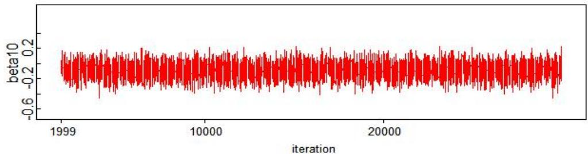
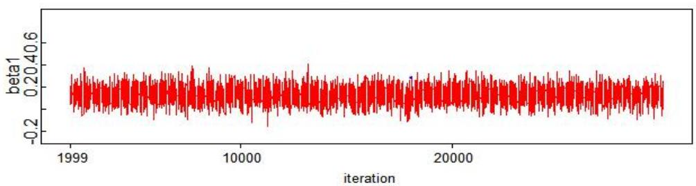
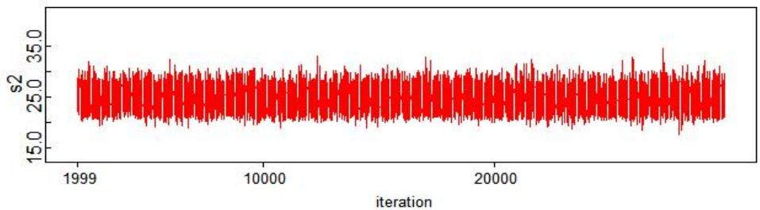
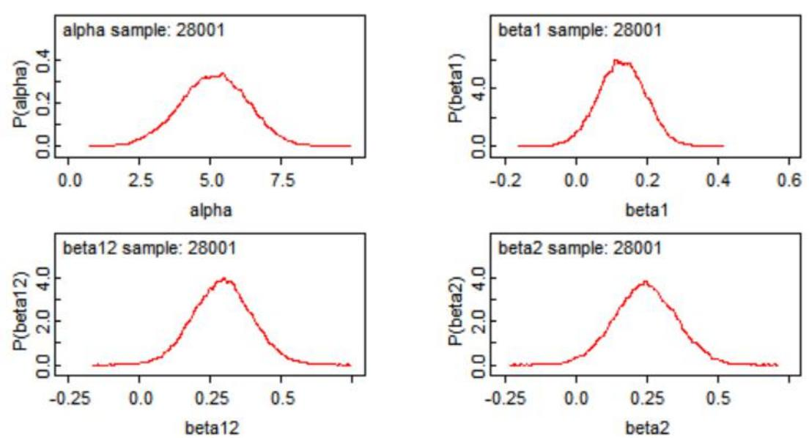
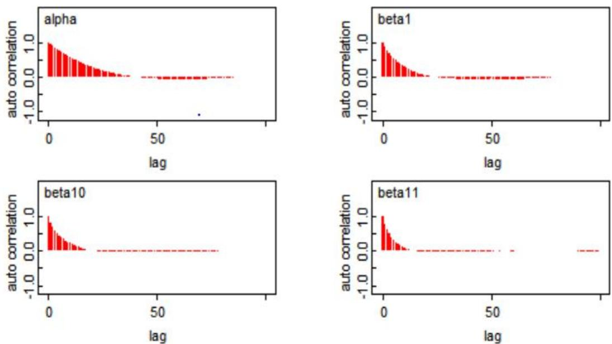
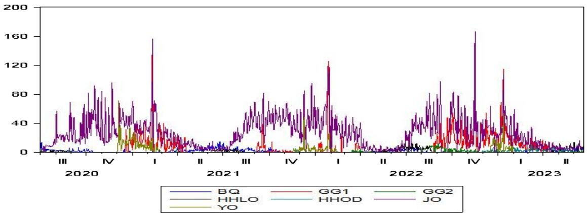
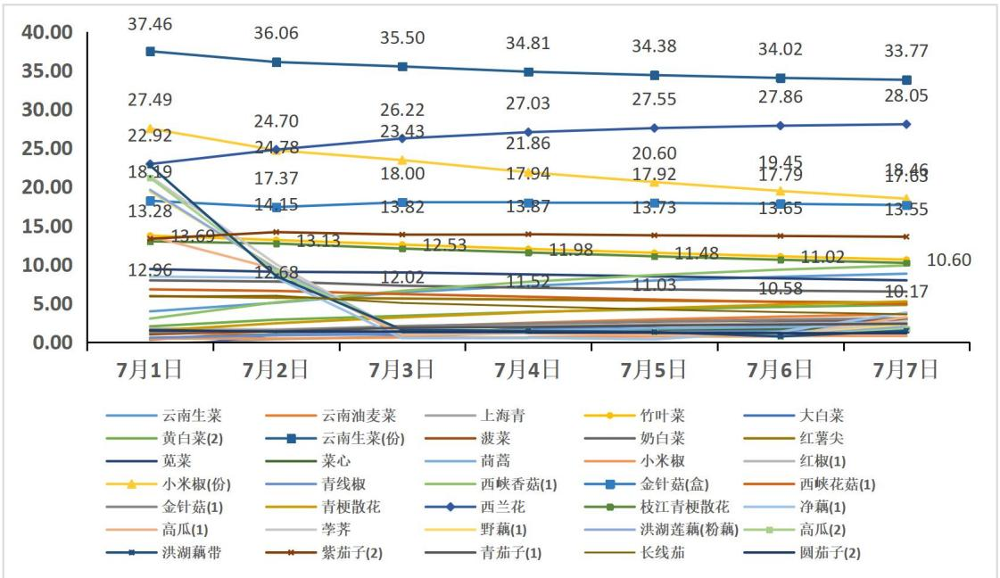
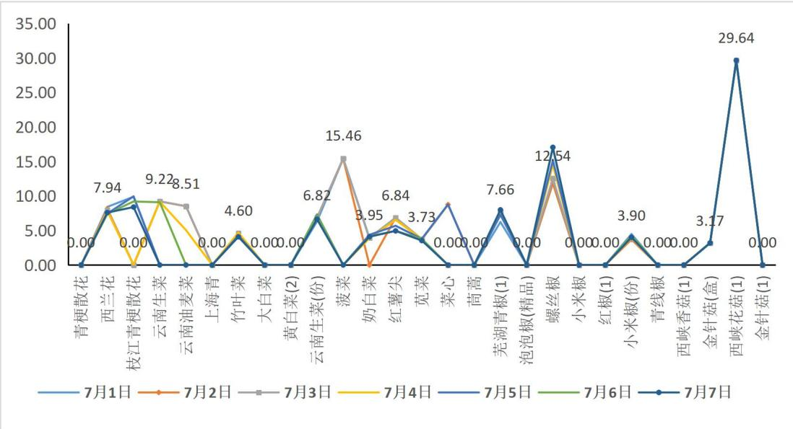

# 商超蔬菜销售数据的统计分析及建模

## 摘 要

根据商超实际购物篮销售数据，将该数据以单品编码为关键字，通过数据透视形成新的销售数据集，即日销售数据，计 1084 个样本。通过对蔬菜日销售量数据进行相关分析，发现同一品种的蔬菜销量具有较强的相关性，构造直观的评判矩阵，用含“T”“F”的元素字符串，表示“是”“否”相关。对销量数据进行 shapiro-wilks 正态性检验，结果表明销量数据不服从正态分布，用传统的回归分析将导致精度下降，且日销量数据含大量的0，属零膨胀数据，建模较难。为避开零膨胀数据建模的困难，同时降低 WinBUGS 运行 MCMC 的运算压力，用同期平均法将三年数据进行转化，形成一年的数据，对该数据建立 Bayesian销量模型及补货量模型，进行 30000次迭代计算，燃烧 3000 次后，用收敛于后验分布的参数 MC 链，完成参数的后验估计，根据动态轨迹图及 MC 误差对模型进行评价，模型表现优良，客观表达了单品销售的分布规律及数据间的相互关系，解决了问题1。

利用销售量、损耗率、销售次数等是时间序列的特点，按照蔬菜销售“当日未售，隔日大部分无法再售”的原则，确定 VAR 模型的阶，建立 VAR（2）模型，完成了未来一周（2023年7 月1-7 日）补货量预测、销售量预测，为问题 2及3的求解铺平道路，也完成了分类补货总量的填写。利用 VAR模型的结果实现了单品总量控制数为 29个菜品，同时用频率方法再次确定控制菜品数量，二者结果一致。在VAR预测结果基础上，建立收益最大化的目标函数和满足问题2及3 的约束条件的优化模型，完成所有问题的求解。结合商超蔬菜销售实际情况，提出合理的建议，及未来进一步优化补货方法及定价策略的设想。

关键词：Bayesian 模型；MC链收敛性；VAR模型；优化模型；同期平均

## 一、问题重述

在生鲜商超日常运营中，蔬菜类商品始终是一个备受关注的焦点。蔬菜保鲜期短，品质容易受时间影响，这意味着商超必须面对迅速变化的市场需求，在不确定的情况下及时做出补货和定价决策。不具备一定的专业知识及数据分析能力，是无法高精度预测各种蔬菜的销量和销售价格。因为蔬菜品种众多、产地不同，而进货交易时间通常在凌晨，大多数商家在几乎不了解具体单品和市场需求的情况下，粗略地做出当日的补货计划，造成大量积压及损耗。为解决这个现实问题，商超需要依赖数据分析和数学建模，制定最佳的销售策略，最大程度地减少损耗，提高经济效益，并满足不断变化的市场需求<sup>[1]</sup>。这个问题涉及到如何优化补货计划、定价策略，以及如何处理销售数据间的潜在关联性，为商超提供更可持续的生鲜蔬菜经营策略。

C 题中的附件1包含了6个蔬菜品类的商品信息，附件2和附件3包含了商超从 2020 年7 月1 日到 2023年 6月 30日的商品销售明细和批发价格信息，而附件 4包含了这些商品的最近损耗率信息。

本文基于这些上述数据，通过统计分析及优化建模，从不同角度解决题中提出的各个问题：

问题 1：要求分析蔬菜类商品的销售情况，包括各个品类和单品之间的销售量分布规律以及它们之间存在的相互关系。帮助商超了解哪些蔬菜品类或单品通常一起销售或者被替代销售，以便更好地制定商品陈列和促销策略。

问题 2：分析各蔬菜品类的销售总量与成本加成定价之间的关系，在收益最大化的前提下，提供一个未来一周的日补货总量和定价策略。为商超确定合适的定价策略提供参考。

问题 3：在确保各单品的陈列量不低于 2.5千克的前提下及收益最大化的条件下，重新设计补货总量和定价策略。帮助商超在有限的销售空间内，满足市场对各品类蔬菜商品的需求。

问题 4：为商超提出建议，还需要收集哪些数据，以更好地制定蔬菜商品的补货和定价决策？

## 二、模型假设

1. 假设商超每天营业时间从上午9:00到22:00，即每天营业13 个小时。  
2. 假设商超对每个顾客的服务平等，计量工具合格，所陈列的商品顾客能直接做出自已的判断。

## 三、符号说明

表 1 符号说明（该符号主要用于数学味道较重的优化模型）

<table><tr><td>符号</td><td>含义</td></tr><tr><td> $a_{it}$ </td><td>第i个品种第t天的销售量</td></tr><tr><td> $p_{it}$ </td><td>第i个品种第t天的零售价</td></tr><tr><td> $x_{it}$ </td><td>第i个品种第t天的进货量</td></tr><tr><td> $b_{it}$ </td><td>第i个品种第t天损耗率</td></tr><tr><td> $c_{it}$ </td><td>第i个品种第t天的批发价</td></tr><tr><td> $d_i$ </td><td>第i个品种的销量</td></tr><tr><td>f</td><td>2023年7月1日成本利润率</td></tr><tr><td> $e_{it}$ </td><td>第i个品种第t天退货量</td></tr><tr><td> $f_{it}$ </td><td>第i个品种第t天成本利润率</td></tr><tr><td> $y_i$ </td><td>第i个品种2023年7月1日补货量</td></tr></table>

## 四、模型建立与求解

## 4.1 问题一

## 4.1.1 相关性分析

对于 6个类别蔬菜中，半小时销售次数超过 0.7次的蔬菜进行shapiro-wilks正态性检验后发现，这些蔬菜销量的分布均不服从正态分布，p 在小数点后第16位才不为 0。进一步计算相关系数阵，发现这些蔬菜销售量之间有较强的相关性。

以花叶类蔬菜中半小时销售次数超过 0.7 次的 13 种蔬菜为例进行说明，首先编写 R 代码（代码见附件），分别进行 shapiro-wilks 正态性检验（H<sub>0</sub>：总体具有正态分布）<sup>[2]</sup>，检验结果表明，数据不服从正态分布，销量相关系数绝对值大于 0.4 的蔬菜品种较大，结果见矩阵。

<table><tr><td></td><td>ynsc</td><td>ynymc</td><td>shq</td><td>zyc</td><td>dbc</td><td>hbc2</td><td>ynscf</td><td>bc</td><td>nbc</td><td>hsj</td><td>yc</td><td>cx</td><td>th</td></tr><tr><td>ynsc</td><td>T</td><td>T</td><td>T</td><td>F</td><td>F</td><td>T</td><td>T</td><td>F</td><td>F</td><td>T</td><td>F</td><td>T</td><td>F</td></tr><tr><td>ynymc</td><td>T</td><td>T</td><td>T</td><td>F</td><td>F</td><td>T</td><td>T</td><td>F</td><td>F</td><td>F</td><td>F</td><td>T</td><td>F</td></tr><tr><td>shq</td><td>T</td><td>T</td><td>T</td><td>F</td><td>F</td><td>T</td><td>T</td><td>F</td><td>F</td><td>F</td><td>F</td><td>T</td><td>F</td></tr><tr><td>zyc</td><td>F</td><td>F</td><td>F</td><td>T</td><td>F</td><td>F</td><td>F</td><td>F</td><td>F</td><td>T</td><td>T</td><td>F</td><td>T</td></tr><tr><td>dbc</td><td>F</td><td>F</td><td>F</td><td>F</td><td>T</td><td>F</td><td>F</td><td>F</td><td>F</td><td>F</td><td>F</td><td>F</td><td>F</td></tr><tr><td>hbc2</td><td>T</td><td>T</td><td>T</td><td>F</td><td>F</td><td>T</td><td>F</td><td>F</td><td>F</td><td>T</td><td>F</td><td>T</td><td>F</td></tr><tr><td>ynscf</td><td>T</td><td>T</td><td>T</td><td>F</td><td>F</td><td>F</td><td>T</td><td>F</td><td>F</td><td>F</td><td>F</td><td>F</td><td>F</td></tr><tr><td>bc</td><td>F</td><td>F</td><td>F</td><td>F</td><td>F</td><td>F</td><td>F</td><td>T</td><td>F</td><td>F</td><td>F</td><td>F</td><td>F</td></tr><tr><td>nbc</td><td>F</td><td>F</td><td>F</td><td>F</td><td>F</td><td>F</td><td>F</td><td>F</td><td>T</td><td>F</td><td>F</td><td>F</td><td>F</td></tr><tr><td>hsj</td><td>T</td><td>F</td><td>F</td><td>T</td><td>F</td><td>T</td><td>F</td><td>F</td><td>F</td><td>T</td><td>T</td><td>T</td><td>F</td></tr><tr><td>yc</td><td>F</td><td>F</td><td>F</td><td>T</td><td>F</td><td>F</td><td>F</td><td>F</td><td>F</td><td>T</td><td>T</td><td>F</td><td>T</td></tr><tr><td>cx</td><td>T</td><td>T</td><td>T</td><td>F</td><td>F</td><td>T</td><td>F</td><td>F</td><td>F</td><td>T</td><td>F</td><td>T</td><td>F</td></tr><tr><td>th</td><td>F</td><td>F</td><td>F</td><td>T</td><td>F</td><td>F</td><td>F</td><td>F</td><td>F</td><td>F</td><td>T</td><td>F</td><td>T</td></tr></table>

注：1.蔬菜单品的名称采用汉语拼音首字母组成，比如：ynsc=‘云南生菜’，hbc2＝‘黄白菜（2）’，文中统计分析中的大量变量的命名均采用此方法。

2.“T”表示 TURE，即对应的两种花叶类蔬菜销量相关系数大于 0.4，双侧检验显著；“F”表示 FALSE，即应的两种花叶类蔬菜销量相关系数小于 0.4，不显著。

由于常见蔬菜销量数据不来自正态分布，因此采用常见的回归分析销量数据之间的关系会导致参数估计误差较大，为了解决这一问题，采用 Bayesian 框架下的正态模型来刻划这些关系。

这里仍然以花叶类 13 种蔬菜销量之间的相关关系较突出，这里用以此为例来说明Bayesian 模型的建立过程。

## 4.2 蔬菜销量的 Bayesian 模型

## 4.2.1 数据处理

为了完成 Bayesian 模型的建立，按下列方法进行蔬菜销量数据和处理，这里以花叶类蔬菜为例进行说明：

（1）商超蔬菜销售数据按日汇总数据，有大量的销售数据为 0，属于 ZIP（零膨胀数据）中的一种，文献资料显示，该类数据在处理时难度较大，远超本科生水平，短时间内无法完成，为此需要销除一部份 0，同期平均方法[3]是一个较好的方法。  
（2）数据显示，有一些蔬菜受生产季节的影响，销售有一定的季节性，形成大量的 0，另一些蔬菜刚好相反，比如：竹叶菜（zyc），红\`薯尖（hsj），苋菜（yc）及茼蒿（th）等。即使按同期平均方法处理，仍然有大量的0出现。  
（3）为了降低计算机运行 OPenBUGS（版本 3.2..3）MCMC 算法的压力，按同期平均方法[4]完成数据汇总，形成一个年度销量数据（2022年7月1日－2023年6月3 日），再建立Bayesian 销量模型，虽然每天的销量数据（1084个数据）整体看成一个样本，由前述该样本不服个正态分布，但每天的一个观测可视为来自一个正态总本，可建立Bayesian 销量模型，下同。

## 4.2.2 模型设定

以销量最大的云南生菜的日销量为响应变量，其他花叶类蔬菜销量为解释变量的 Bayesian 销量模型为：

$$
\begin{array}{l} y n s c _ {t} \sim N (\mu_ {t}, \tau); \sigma^ {2} = \frac {1}{\tau} \\ \mu_ {t} = \alpha + \beta_ {1} y m y m c _ {t} + \beta_ {2} s h q _ {t} + \beta_ {3} z y c _ {t} + \beta_ {4} d b c _ {t} + \beta_ {5} h b c 2 _ {t} + \beta_ {6} y n s c f _ {t} \tag {1} \\ + \beta_ {7} b c _ {t} + \beta_ {8} n b c _ {t} + \beta_ {9} h s j _ {t} + \beta_ {1 0} y c _ {t} + \beta_ {1 1} c x _ {t} + \beta_ {1 2} t h _ {t} \\ \end{array}
$$

参数的选验分布选大方差的正态分布 N(0,0.01) ，精度参数选分布gamma(0.01,0.01) 为其先验分布<sup>[7-8]</sup>，方差先验为逆 gamma 分布，设定各参数的初始值为 1，进行30000次迭代运算，燃烧期为2000，通过MC 算法得到各参数的后验估计（见表）

表 2 花叶类Bayesian 模型的参数估计

<table><tr><td></td><td>mean</td><td>sd</td><td>MC_error</td><td>val2.5pc</td><td>median</td><td>val97.5pc</td><td>start</td><td>sample</td></tr><tr><td>alpha</td><td>5.129</td><td>1.196</td><td>0.03422</td><td>2.754</td><td>5.141</td><td>7.427</td><td>2000</td><td>28001</td></tr><tr><td>beta1</td><td>0.1298</td><td>0.06686</td><td>0.001307</td><td>-0.001687</td><td>0.1297</td><td>0.2585</td><td>2000</td><td>28001</td></tr><tr><td>beta2</td><td>0.2455</td><td>0.1082</td><td>0.002365</td><td>0.03329</td><td>0.2452</td><td>0.4583</td><td>2000</td><td>28001</td></tr><tr><td>beta3</td><td>-0.05981</td><td>0.07778</td><td>0.001745</td><td>-0.2112</td><td>-0.05989</td><td>0.09237</td><td>2000</td><td>28001</td></tr><tr><td>beta4</td><td>-0.05823</td><td>0.02519</td><td>4.66E-04</td><td>-0.1074</td><td>-0.05839</td><td>-0.008176</td><td>2000</td><td>28001</td></tr><tr><td>beta5</td><td>0.2971</td><td>0.05493</td><td>9.18E-04</td><td>0.1901</td><td>0.2965</td><td>0.4054</td><td>2000</td><td>28001</td></tr><tr><td>beta6</td><td>-0.1255</td><td>0.03283</td><td>5.39E-04</td><td>-0.1891</td><td>-0.1257</td><td>-0.06052</td><td>2000</td><td>28001</td></tr><tr><td>beta7</td><td>0.05292</td><td>0.09947</td><td>0.001479</td><td>-0.138</td><td>0.05183</td><td>0.2502</td><td>2000</td><td>28001</td></tr><tr><td>beta8</td><td>0.1979</td><td>0.1033</td><td>0.001947</td><td>-0.003743</td><td>0.1967</td><td>0.4</td><td>2000</td><td>28001</td></tr><tr><td>beta9</td><td>0.6288</td><td>0.09062</td><td>0.001853</td><td>0.4491</td><td>0.6299</td><td>0.8043</td><td>2000</td><td>28001</td></tr><tr><td>beta10</td><td>-0.09277</td><td>0.08947</td><td>0.001759</td><td>-0.2697</td><td>-0.09182</td><td>0.08222</td><td>2000</td><td>28001</td></tr><tr><td>beta11</td><td>0.6585</td><td>0.1107</td><td>0.001602</td><td>0.4452</td><td>0.6577</td><td>0.8774</td><td>2000</td><td>28001</td></tr><tr><td>beta12</td><td>0.2935</td><td>0.1042</td><td>0.001772</td><td>0.0906</td><td>0.2934</td><td>0.5007</td><td>2000</td><td>28001</td></tr><tr><td>s2</td><td>24.66</td><td>1.857</td><td>0.01287</td><td>21.26</td><td>24.56</td><td>28.53</td><td>2000</td><td>28001</td></tr></table>

## 4.2.3 模型检验

（1）各参数的历史轨迹图表明，各条MC 链的分布收敛于各自的后验分布。



<details>
<summary>line</summary>

| iteration | beta10 |
| --- | --- |
| 1999 | ~-0.2 |
| 10000 | ~-0.2 |
| 20000 | ~-0.2 |
| 25000 | ~-0.2 |
</details>

图 1alpha 的动态轨迹图



<details>
<summary>line</summary>

| iteration | beta1 |
| --- | --- |
| 1999 | ~0.2 |
| 10000 | ~0.2 |
| 20000 | ~0.2 |
| 25000 | ~0.2 |
</details>

图 2beta1 的动态轨迹图  


<details>
<summary>line</summary>

| iteration | s2 |
| --- | --- |
| 1999 | ~28.0 |
| 10000 | ~28.0 |
| 20000 | ~28.0 |
| 25000 | ~28.0 |
</details>

图 3 方差动态 $\sigma ^ { 2 }$ 轨迹图

（2）核密度估计曲线呈现单峰对称性分布，这里只给出部分参数（alpha,beta1,beta12,beta2）的核密度估计图，其他详见附件。

  
图 4 参数 alpha,beta1,beta12,beta2 的核密度估计曲线  
（3）MC链有一定的自相关性，但滞后10期后，自相关性消退为0。

  
图 5 参数 alpha,beta1,beta12,beta2 的 MC 链自相关图

（4）参数估计的最大MC误差为 alpha 的MC误差0.03422，最大的标准差为 sigmma 方的标准差 1.857，模型表现较好，可以通过其他花叶类蔬菜的销量完成云南生菜的预测。

## 4.2.4 模型的表达式

将参数的后验估计代入模型表达式得到最终的Bayesian 销量模型

$$
\begin{array}{l} y n s c _ {t} \sim N (\mu_ {t}, \tau); \sigma^ {2} = \frac {1}{\tau} \\ \mu_ {t} = 5. 1 2 9 + 0. 1 2 9 8 y m y m c _ {t} + 0. 2 4 5 5 s h q _ {t} - 0. 0 5 9 8 1 z y c _ {t} - 0. 0 0 5 8 2 3 d b c _ {t} \tag {2} \\ + 0. 2 9 7 1 h b c 2 _ {t} - 0. 1 2 5 5 y n s c f _ {t} + 0. 0 5 2 9 2 b c _ {t} + 0. 1 9 7 9 n b c _ {t} + 0. 6 2 8 8 h s j _ {t} \\ - 0. 0 9 2 7 7 y c _ {t} + 0. 6 5 8 5 c x _ {t} + 0. 2 9 3 5 t h _ {t} \\ \end{array}
$$

结果显示：

（1）云南油麦菜（ynync），上海青(shq)，黄白菜(2)(hbc），奶白菜(nbc)，红薯尖(hsj，苋菜(yc)，菜心(cx)，茼蒿(th)的销量对云南生菜(ynac)的销量的产生正的影响较大，正影响最大的是菜心，影响最小的是奶白菜。  
（2）竹叶菜(zyc)，大白菜(dbc)，云南生菜(份)(ynscf)，苋菜(yc)的销量对云南生菜(ynac)的销量的产生较小的负影响，其中负影响最大的是云南生菜(份)。

## 4.3各类别蔬菜品种销量指标的 Bayesian模型

为了完成Bayesian 模型的建立，按下列方法进行蔬菜销量数据和处理，这里以花菜类蔬菜为例进行说明：

## 4.3.1 模型设定

（1）以花菜类三个品种的日销量(首两字母加c)为响应变量，销售次数（首两字母加 c），批发价c），批发价（首两字母加p），退货次数（首两字母加 t），损耗（首两字母加 s）为解释变量的 Bayesian 销量模型为：（如 qgx=“青梗散花每日销量”，下同）

$$
\begin{array}{l} q g x _ {t} \sim N (\mu_ {t}, \sigma^ {2}) \\ \sigma^ {2} = \frac {1}{\tau}; \mu_ {t} = \alpha + \beta_ {1} q g c _ {t} + \beta_ {2} q g p _ {t} + \beta_ {3} q g t _ {t} + \beta_ {4} q g s _ {t} + \beta_ {5} q g j _ {t} \end{array} \tag {3}
$$

$$
\begin{array}{l} \log (x l x _ {t}) \sim N (\mu_ {t}, \sigma^ {2}) \\ \sigma^ {2} = \frac {1}{\tau}; \mu_ {t} = \alpha + \beta_ {1} x l c _ {t} + \beta_ {2} x l p _ {t} + \beta_ {3} x l t _ {t} + \beta_ {4} x l s _ {t} + \beta_ {5} x l j _ {t} \end{array} \tag {4}
$$

$$
\begin{array}{l} z j x _ {t} \sim N (\mu_ {t}, \sigma^ {2}) \\ \sigma^ {2} = \frac {1}{\tau}; \mu_ {t} = \alpha + \beta_ {1} z j c _ {t} + \beta_ {2} z j p _ {t} + \beta_ {3} z j t _ {t} + \beta_ {4} z j s _ {t} + \beta_ {5} z j j _ {t} \end{array} \tag {5}
$$

（2）各参数的先验分布设定，迭代次数及燃烧期设定同前，初始值设定见附件。西兰花销量（xlx）模型设定为对数正态模型的目的是和其他两个模型作对比。

## 4.3.2 模型求解

（1）三个模型的模型检验、参数后验样本的动态轨迹图、核密度估计图因篇幅限制，不在赘述，全部放在支撑材料，这里只给出三个模型的 Bayesian 参数估计表。

表 3 青工梗散花模型参数Bayesain 估计汇总表

<table><tr><td></td><td>mean</td><td>sd</td><td>MC_error</td><td>val2.5pc</td><td>median</td><td>val97.5pc</td><td>start</td><td>sample</td></tr><tr><td>alpha</td><td>0.982</td><td>1.548</td><td>0.1162</td><td>-1.881</td><td>0.9159</td><td>3.98</td><td>2000</td><td>28001</td></tr><tr><td>beta1</td><td>0.5567</td><td>0.00635</td><td>9.77E-05</td><td>0.5443</td><td>0.5567</td><td>0.5692</td><td>2000</td><td>28001</td></tr><tr><td>beta2</td><td>-0.2598</td><td>0.06072</td><td>0.00113</td><td>-0.3778</td><td>-0.2597</td><td>-0.1403</td><td>2000</td><td>28001</td></tr><tr><td>beta3</td><td>-1.789</td><td>9.038</td><td>0.679</td><td>-19.14</td><td>-1.394</td><td>14.84</td><td>2000</td><td>28001</td></tr><tr><td>beta4</td><td>-0.1076</td><td>0.05629</td><td>0.001594</td><td>-0.2179</td><td>-0.1083</td><td>0.001831</td><td>2000</td><td>28001</td></tr><tr><td>s2</td><td>0.885</td><td>0.06918</td><td>4.17E-04</td><td>0.7613</td><td>0.8813</td><td>1.03</td><td>2000</td><td>28001</td></tr></table>

表 4 枝江青梗散花模型参数Bayesain 估计汇总表

<table><tr><td></td><td>mean</td><td>sd</td><td>MC_error</td><td>val2.5pc</td><td>median</td><td>val97.5pc</td><td>start</td><td>sample</td></tr><tr><td>alpha</td><td>-55.78</td><td>18.57</td><td>1.439</td><td>-95.08</td><td>-50.48</td><td>-28.42</td><td>2000</td><td>28001</td></tr><tr><td>beta1</td><td>0.4435</td><td>0.006855</td><td>9.02E-05</td><td>0.43</td><td>0.4435</td><td>0.4569</td><td>2000</td><td>28001</td></tr><tr><td>beta2</td><td>0.08408</td><td>0.07086</td><td>0.001555</td><td>-0.05538</td><td>0.08389</td><td>0.2213</td><td>2000</td><td>28001</td></tr><tr><td>beta3</td><td>-0.4839</td><td>0.8619</td><td>0.005684</td><td>-2.165</td><td>-0.487</td><td>1.204</td><td>2000</td><td>28001</td></tr><tr><td>beta4</td><td>59.21</td><td>19.76</td><td>1.531</td><td>30.04</td><td>53.56</td><td>100.9</td><td>2000</td><td>28001</td></tr><tr><td>beta5</td><td>0.1225</td><td>0.05628</td><td>0.001323</td><td>0.01312</td><td>0.1221</td><td>0.2351</td><td>2000</td><td>28001</td></tr><tr><td>s2</td><td>1.018</td><td>0.07677</td><td>4.94E-04</td><td>0.877</td><td>1.015</td><td>1.179</td><td>2000</td><td>28001</td></tr></table>

表 5 西兰花模型参数Bayesain 估计汇总表

<table><tr><td></td><td>mean</td><td>sd</td><td>MC_error</td><td>val2.5pc</td><td>median</td><td>val97.5pc</td><td>start</td><td>sample</td></tr><tr><td>alpha</td><td>-217.2</td><td>10.03</td><td>0.7776</td><td>-225.5</td><td>-218.8</td><td>-182.6</td><td>2000</td><td>28001</td></tr><tr><td>beta1</td><td>0.01893</td><td>0.00139</td><td>1.03E-04</td><td>0.01782</td><td>0.01852</td><td>0.02361</td><td>2000</td><td>28001</td></tr><tr><td>beta2</td><td>0.1094</td><td>0.2682</td><td>0.0208</td><td>-0.02156</td><td>0.005937</td><td>1.08</td><td>2000</td><td>28001</td></tr><tr><td>beta3</td><td>0.04799</td><td>0.08003</td><td>0.003263</td><td>-0.0649</td><td>0.03865</td><td>0.2481</td><td>2000</td><td>28001</td></tr><tr><td>beta4</td><td>23.7</td><td>1.093</td><td>0.08478</td><td>19.91</td><td>23.87</td><td>24.6</td><td>2000</td><td>28001</td></tr><tr><td>beta5</td><td>-0.08622</td><td>0.1756</td><td>0.01361</td><td>-0.7168</td><td>-0.01819</td><td>-1.56E-05</td><td>2000</td><td>28001</td></tr><tr><td>s2</td><td>0.02526</td><td>0.04594</td><td>0.003546</td><td>0.01117</td><td>0.01311</td><td>0.1875</td><td>2000</td><td>28001</td></tr></table>

（2）青梗散花最后的Bayesain 模型为：

$$
\begin{array}{l} q g x _ {t} \sim N (\mu_ {t}, \sigma^ {2}) \\ \sigma^ {2} = \frac {1}{\tau}; \mu_ {t} = 0. 9 8 2 + 0. 5 5 6 7 q g c _ {t} - 0. 2 5 9 8 q g p _ {t} - 1. 7 8 9 q g s _ {t} \tag {6} \\ - 0. 1 0 7 6 q g j _ {t} \hat {\sigma} ^ {2} = 0. 8 8 5 \\ \end{array}
$$

结果表明：对于青梗散花正态模型，销售次数对销售量产生正向影响，原因在于货量流转量（销售次数）越大，利润越高，蔬菜的批发价、损耗和零售价产生反向影响，利润较低。且在 2022 年6月后，它被枝江青梗散花代替，停止了销售。

（3）西兰花最后的对数正态Bayesain 模型为：

$$
\begin{array}{l} \log (x l x _ {t}) \sim N (\mu_ {t}, \sigma^ {2}) \\ \sigma^ {2} = \frac {1}{\tau}; \mu_ {t} = - 2 1 7. 2 0 + 0. 0 1 8 9 3. x l c _ {t} + 0. 1 0 9 4 x l p _ {t} + 0. 0 4 7 9 9 x l t _ {t} \tag {7} \\ + 2 3. 7 0 x l s _ {t} - 0. 0 8 6 2 2 x l j _ {t} \hat {\sigma} ^ {2} = 0. 0 2 5 2 6 \\ \end{array}
$$

结果表明：对于西兰花对数正态模型，销售次数、批发价、退货及损耗对销售量产生正向影响，原因在于货量流转量（销售次数）越大，利润越高，同时蔬菜的损耗主要来源于放置时间，所以去除不好的及退换不新鲜的，有助于提高销量。同时西兰花是三种蔬菜中售价最高的一种，价格对销量产生反向影响，西兰花也是商超该类蔬菜利润的主要来源。

（4）枝江青梗散花最后的对数正态Bayesain 模型为：

$$
\begin{array}{l} z j x _ {t} \sim N (\mu_ {t}, \sigma^ {2}) \\ \sigma^ {2} = \frac {1}{\tau}; \mu_ {t} = - 5 5. 7 8 + 0. 4 4 3 5 z j c _ {t} + 0. 0 8 4 0 8 z j p _ {t} - 0. 4 8 3 9 z j t _ {t} \tag {8} \\ + 5 9. 2 1 z j s _ {t} + 0. 1 2 2 5 q g j _ {t} \hat {\sigma} ^ {2} = 1. 0 1 8 \\ \end{array}
$$

结果表明：对于枝江青梗散花正态模型，销售次数、批发价损耗和零售价对销售量产生正向影响，原因在于货量流转量（销售次数）越大，利润越高，蔬菜的批发价、损耗和零售价也产生正向影响，说明该产品进价和定价合理，有助于销量的产生。且在 2022 年 6 月后，它代替青梗散花进行销售。对于其他剩余 5种类别的蔬菜品种，类似地同样可以将每个不同单品销量建立单品销量的正态模型，因时间关系，无法在较短的时间完成。

## 4.4 问题二

问题 2中需要对未来一周（2023年7月1－7日）的补货总量和进行预测，且要求商超收益最大，为此需要建立多变量VAR时序模型及优化模型进行求解。

分成两步完成此问题：

（1）由公式：进货量＝（销售量+退货量）/(1-损耗率/100)[9]采用附件1－4的销售数据，可计算2022年7月日至2023年6月30日的进货量，进一步用VAR模型完成未来一周的补货量及销售时进行预测。

VAR模型数学表达式为： $y _ { t } = A _ { 1 } y _ { t - 1 } + A _ { 2 } y _ { t - 2 } + \varepsilon _ { t }$

其中： $y _ { t }$ 是n 维同期变量向量， $y _ { t - 1 }$ 是n 维滞后 1 期变量向量， $y _ { t - 2 }$ 是n维滞后 2期变量向量， $A _ { 1 }$ $A _ { 2 }$ 是待估计的矩阵， $\mathcal { E } _ { t }$ 为随机的扰动项<sup>[10]</sup>。

（2）由公式：产品价格＝产品成本×（1+成本利润率）[9]，其中：成本利润率＝（净利润/总成本） $\times 1 0 0 \%$ ，只要计算出成本利润率，就可以完成未来一周蔬菜销售定价策略。

## 4.4.1 多变量时间序列 VAR模型的建立

## （1）数据处理及描述

花叶类蔬菜有 13个品种，参数估计后有两个13×13的参数估计矩阵，不便正文排版，为此，改用7种水生根茎蔬菜为例说明建模过程：

首先附件 1－4 的水生根茎蔬菜销售数据，按日进行汇总处理，得到 7种水生根茎类蔬菜的日销售数据，按由公式进货量＝（销售量+退货量）/(1-损耗率/100)，采用可计算2022年7月日至2023 年6 月30 日的常见 7种水生根茎类蔬菜的日进货量，在此基础上建立VAR模型完成未来一周的销售量及进货量预测。

通常商超在周末会迎来各种商品包括蔬菜的销售高峰，呈现周末销量突增的周期性特征，因此用 EVIEWS8.0 版，将日销售数据转化为以 7天一周的时序进行分析，首先按公式：进货量＝（销售量+退货量）/(1-损耗率 $/ 1 0 0 ) ^ { [ 9 ] }$ 计算出7 种水生根茎蔬菜进货量，并作图。



<details>
<summary>line</summary>

| Category | BQ | GG1 | GG2 | HHLO | HHOD | JO |
| --- | --- | --- | --- | --- | --- | --- |
| 2020 III | ~10 | ~5 | ~5 | ~5 | ~5 | ~5 |
| 2020 IV | ~10 | ~5 | ~5 | ~5 | ~5 | ~60 |
| 2021 I | ~10 | ~130 | ~10 | ~10 | ~10 | ~155 |
| 2021 II | ~10 | ~5 | ~5 | ~5 | ~5 | ~10 |
| 2021 III | ~10 | ~5 | ~5 | ~5 | ~5 | ~40 |
| 2021 IV | ~10 | ~5 | ~5 | ~5 | ~5 | ~80 |
| 2022 I | ~10 | ~120 | ~10 | ~10 | ~10 | ~125 |
| 2022 II | ~10 | ~5 | ~5 | ~5 | ~5 | ~10 |
| 2022 III | ~10 | ~5 | ~5 | ~5 | ~5 | ~40 |
| 2022 IV | ~10 | ~160 | ~10 | ~10 | ~10 | ~165 |
| 2023 I | ~10 | ~110 | ~10 | ~10 | ~10 | ~110 |
| 2023 II | ~10 | ~5 | ~5 | ~5 | ~5 | ~10 |
</details>

图 6 种水生根茎类蔬菜进货量点线图

## （2）VAR模型的建立

问题 2中指出：“当日未售出，隔日绝大多数蔬菜无法再售”。为此确定滞后期为 2期，表明今天销售的蔬菜最多是今天凌晨 3－4 点进的货，也就是在商超陈列2 天，即售卖2 天，从而确定VAR模型的阶数为2。

将处理好的数据导入EVIEWS建立VAR模型，模型参数估计及统计量见表。

表 6 水生根茎类蔬菜VAR（2）模型参数估计及统计量汇总表

<table><tr><td></td><td>JO</td><td>GG1</td><td>BQ</td><td>YO</td><td>HHLO</td><td>GG2</td><td>HHOD</td></tr><tr><td>JO(-1)</td><td>0.421583(0.03171)[ 13.2948]</td><td>-0.050794(0.01954)[-2.59889]</td><td>-0.003402(0.00297)[-1.14364]</td><td>-0.006586(0.00815)[-0.80854]</td><td>-0.002970(0.00275)[-1.08088]</td><td>-0.000605(0.00187)[-0.32326]</td><td>-0.005162(0.00194)[-2.66723]</td></tr><tr><td>JO(-2)</td><td>0.266407(0.03194)[ 8.33997]</td><td>0.043688(0.01969)[ 2.21899]</td><td>-0.007760(0.00300)[-2.58971]</td><td>0.006695(0.00821)[ 0.81593]</td><td>-0.003340(0.00277)[-1.20676]</td><td>0.002218(0.00189)[ 1.17656]</td><td>-0.000462(0.00195)-0.23714</td></tr><tr><td>GG1(-1)</td><td>0.195312(0.05411)[ 3.60939]</td><td>0.738824(0.03335)[ 22.1526]</td><td>-0.001792(0.00508)[-0.35306]</td><td>0.070410(0.01390)[ 5.06549]</td><td>-0.001919(0.00469)[-0.40915]</td><td>0.000646(0.00319)[ 0.20234]</td><td>0.004613(0.00330)[ 1.39658]</td></tr><tr><td>GG1(-2)</td><td>-0.252647(0.05423)[-4.65849]</td><td>-0.052326(0.03343)[ -1.56541]</td><td>0.001678(0.00509)[ 0.32986]</td><td>-0.066450(0.01393)[-4.76987]</td><td>-0.000237(0.00470)[-0.05038]</td><td>0.001066(0.00320)[ 0.33316]</td><td>0.000359(0.00331)[ 0.10852]</td></tr><tr><td>BQ(-1)</td><td>-0.160066(0.31560)[-0.50718]</td><td>-0.157147(0.19452)[-0.80787]</td><td>0.464075(0.02961)[ 15.6755]</td><td>-0.089277(0.08107)[-1.10124]</td><td>0.051375(0.02735)[ 1.87848]</td><td>-0.032348(0.01863)[-1.73657]</td><td>0.010315(0.01926)[ 0.53548]</td></tr><tr><td>BQ(-2)</td><td>-0.818140(0.31397)[-2.60582]</td><td>-0.299411(0.19351)[-1.54725]</td><td>0.257451(0.02945)[ 8.74149]</td><td>-0.088269(0.08065)[-1.09447]</td><td>-0.042834(0.02721)[-1.57434]</td><td>0.003022(0.01853)[ 0.16307]</td><td>-0.020530(0.01916)[-1.07129]</td></tr><tr><td>YO(-1)</td><td>0.013051(0.11651)[ 0.11202]</td><td>0.005563(0.07181)[ 0.07746]</td><td>-0.006207(0.01093)[-0.56793]</td><td>0.336302(0.02993)[ 11.2365]</td><td>-0.000952(0.01010)[-0.09433]</td><td>-0.006147(0.00688)[-0.89389]</td><td>-0.000336(0.00711)-0.04724]</td></tr><tr><td>YO(-2)</td><td>0.094179(0.11645)[ 0.80872]</td><td>0.054926(0.07178)[ 0.76526]</td><td>-0.008727(0.01092)[-0.79892]</td><td>0.371211(0.02991)[ 12.4094]</td><td>-0.000916(0.01009)[-0.09080]</td><td>-0.002276(0.00687)[-0.33111]</td><td>-0.001117(0.00711)-0.15720]</td></tr><tr><td>HHLO(-1)</td><td>-0.029800(0.34404)[-0.08662]</td><td>-0.110933(0.21205)[-0.52315]</td><td>0.112237(0.03227)[ 3.47773]</td><td>-0.017237(0.08838)[-0.19505]</td><td>0.547755(0.02981)[ 18.3725]</td><td>0.013999(0.02031)[ 0.68939]</td><td>0.007247(0.02100)[ 0.34512]</td></tr><tr><td>HHLO(-2)</td><td>-0.312279(0.34624)[-0.90191]</td><td>-0.171491(0.21340)[-0.80360]</td><td>-0.058944(0.03248)[-1.81482]</td><td>-0.011376(0.08894)[-0.12791]</td><td>0.257224(0.03000)[ 8.57284]</td><td>0.027593(0.02044)[ 1.35021]</td><td>-0.025706(0.02113)-1.21638]</td></tr><tr><td>GG2(-1)</td><td>-0.977043(0.47702)[-2.04822]</td><td>-0.250004(0.29401)[-0.85033]</td><td>-0.015438(0.04475)[-0.34500]</td><td>-0.098603(0.12253)[-0.80470]</td><td>0.057391(0.04134)[ 1.38836]</td><td>0.419599(0.02815)[ 14.9032]</td><td>0.009117(0.02912)[ 0.31312]</td></tr><tr><td>GG2(-2)</td><td>1.151753(0.47610)[ 2.41915]</td><td>0.648913(0.29344)[ 2.21140]</td><td>-0.057686(0.04466)[-1.29167]</td><td>-0.032400(0.12230)[-0.26493]</td><td>-0.052854(0.04126)[-1.28107]</td><td>0.406079(0.02810)[ 14.4510]</td><td>-0.023075(0.02906)-0.79406]</td></tr><tr><td>HHOD(-1)</td><td>0.266347(0.49078)[ 0.54270]</td><td>-0.019307(0.30249)[-0.06383]</td><td>0.031008(0.04604)[ 0.67354]</td><td>0.072395(0.12607)[ 0.57425]</td><td>0.016936(0.04253)[ 0.39822]</td><td>0.000149(0.02897)[ 0.00514]</td><td>0.532064(0.02996)[ 17.7617]</td></tr><tr><td>HHOD(-2)</td><td>-1.211467(0.48894)[-2.47774]</td><td>0.240690(0.30136)[ 0.79869]</td><td>-0.022574(0.04587)[-0.49218]</td><td>-0.070290(0.12560)[-0.55966]</td><td>-0.056439(0.04237)[-1.33205]</td><td>-0.006386(0.02886)[-0.22130]</td><td>0.207382(0.02984)[ 6.94899]</td></tr><tr><td>C</td><td>10.60838(1.08406)[ 9.78579]</td><td>2.739230(0.66815)[ 4.09971]</td><td>0.727166(0.10169)[ 7.15078]</td><td>0.835386(0.27847)[ 2.99996]</td><td>0.367220(0.09394)[ 3.90901]</td><td>0.052580(0.06398)[ 0.82177]</td><td>0.275764(0.06617)[ 4.16765]</td></tr><tr><td>R-squared</td><td>0.489646</td><td>0.543156</td><td>0.579672</td><td>0.451220</td><td>0.615681</td><td>0.632556</td><td>0.512787</td></tr><tr><td>Adj. R-squared</td><td>0.482956</td><td>0.537168</td><td>0.574162</td><td>0.444026</td><td>0.610643</td><td>0.627739</td><td>0.506401</td></tr><tr><td>Sum sa. resids</td><td>256143.8</td><td>97303.73</td><td>2253.914</td><td>16901.30</td><td>1923.521</td><td>892.3132</td><td>954.2724</td></tr><tr><td>S.E. equation</td><td>15.48661</td><td>9.545070</td><td>1.452724</td><td>3.978088</td><td>1.342032</td><td>0.914056</td><td>0.945258</td></tr><tr><td>F-statistic</td><td>73.19029</td><td>90.69861</td><td>105.2050</td><td>62.72391</td><td>122.2099</td><td>131.3259</td><td>80.29008</td></tr><tr><td>Log likelihood</td><td>-4496.552</td><td>-3972.433</td><td>-1933.594</td><td>-3024.566</td><td>-1847.760</td><td>-1431.836</td><td>-1468.188</td></tr><tr><td>Akaike AIC</td><td>8.331582</td><td>7.363680</td><td>3.598511</td><td>5.613234</td><td>3.440000</td><td>2.671905</td><td>2.739037</td></tr><tr><td>Schwarz SC</td><td>8.400661</td><td>7.432759</td><td>3.667590</td><td>5.682312</td><td>3.509079</td><td>2.740984</td><td>2.808116</td></tr><tr><td>Mean dependent</td><td>26.52201</td><td>6.329195</td><td>1.526686</td><td>1.733855</td><td>0.903935</td><td>0.458228</td><td>0.449456</td></tr><tr><td>S.D. dependent</td><td>21.53736</td><td>14.03031</td><td>2.226182</td><td>5.335158</td><td>2.150744</td><td>1.498129</td><td>1.345437</td></tr><tr><td colspan="2">Determinant resid covariance (dof adi....</td><td>756495.9</td><td></td><td></td><td></td><td></td><td></td></tr><tr><td colspan="2">Determinant resid covariance</td><td>686129.6</td><td></td><td></td><td></td><td></td><td></td></tr><tr><td colspan="2">Log likelihood</td><td>-18034.10</td><td></td><td></td><td></td><td></td><td></td></tr><tr><td colspan="2">Akaike information criterion</td><td>33.49787</td><td></td><td></td><td></td><td></td><td></td></tr><tr><td colspan="2">Schwarz criterion</td><td>33.98142</td><td></td><td></td><td></td><td></td><td></td></tr></table>

## （3）模型评价和检验

模型参数估计中第一行为最小二乘估计的系数，第二行为系数估数标准差，第三行为 t检验统计量，绝大多数系数统计检验显著。

模型 7个水生根茎类蔬菜进货量变量的AIC 值分别为：8.332，7.364，3.599，

5.613,3.440,2.672,2.739。SC 的值分别是 8.401，7.433，3.668，5.682，3.509，2.741，2.808值较小，且两个值较接近，因此模型表现较好。

R-squre 的值为 0.490，0.543，0.580，0.451，0.616，0.633，0.513 有两个超过 0.6，F 值为 73.190，90.700，105.205，62.724，122.210，131.326，80.290 较大，模型整体显著。

综合起来，模型可用于对未来一周的进货量进行预测。

## （4）VAR模型的求解结果

水生根茎类（ssgj）蔬菜的最终预测模型为：

$$
s s g j _ {t} = A _ {1} s s g j _ {t - 1} + A _ {2} s s g j _ {t - 2} + \varepsilon_ {t} \tag {9}
$$

其中： $s s g j _ { t } = ( \ j o _ { t } \ , g g 1 _ { t } \ , b q _ { t } \ , y o _ { t } \ , h h l o _ { t } \ , g g 2 _ { t } \ , h h o d _ { t } \ ) ^ { T }$

$$
\mathrm{ssgj} _ {\mathrm{t-1}} = \left(j o _ {\mathrm{t-1}}, g g 1 _ {\mathrm{t-1}}, b q _ {\mathrm{t-1}}, y o _ {\mathrm{t-1}}, h h l o _ {\mathrm{t-1}}, g g 2 _ {\mathrm{t-1}}, \mathrm{hhod} _ {\mathrm{t-1}}\right) ^ {T}
$$

$$
\mathrm{ssgj} _ {\mathrm{t-2}} = \left(j o _ {\mathrm{t-2}}, g g 1 _ {\mathrm{t-2}}, b q _ {\mathrm{t-2}}, y o _ {\mathrm{t-2}}, h h l o _ {\mathrm{t-2}}, g g 2 _ {\mathrm{t-2}}, \mathrm{hhod} _ {\mathrm{t-2}}\right) ^ {T}
$$

$$
\varepsilon_ {t} = \left(1 0. 6 0 8 3 8, 2. 7 3 9 2 3, 0. 7 2 7 1 6 6, 0. 8 3 5 3 8 6, 0. 3 6 7 2 2, 0. 0 5 2 8 5, 0. 2 7 5 7 6 4\right)
$$

$$
A _ {1} = \left[ \begin{array}{c c c c c c c} 0. 4 2 1 5 8 & 0. 1 9 5 3 1 2 & - 0. 1 6 0 0 6 6 & 0. 0 1 3 0 5 1 & - 0. 0 2 9 8 & - 0. 9 7 7 0 4 & 0. 2 6 6 3 4 7 \\ - 0. 0 5 0 7 9 4 & 0. 7 3 8 8 2 4 & - 0. 1 5 7 1 4 7 & 0. 0 0 5 5 6 3 & - 0. 1 1 0 9 3 3 & - 0. 2 5 0 0 0 4 & - 0. 0 1 9 3 0 7 \\ - 0. 0 0 3 4 0 2 & - 0. 0 0 1 7 9 2 & 0. 4 6 4 0 7 5 & - 0. 0 0 6 2 0 7 & 0. 1 1 2 2 3 7 & - 0. 0 1 5 4 3 8 & 0. 0 3 1 0 0 8 \\ - 0. 0 0 6 5 8 6 & 0. 0 7 0 4 1 & - 0. 0 8 9 2 7 7 & 0. 3 3 6 3 0 2 & - 0. 0 1 7 2 3 7 & - 0. 0 9 8 6 0 3 & 0. 0 7 2 3 9 5 \\ - 0. 0 0 6 5 8 6 & 0. 0 7 0 4 1 & - 0. 0 8 9 2 7 7 & 0. 3 3 6 3 0 2 & - 0. 0 1 7 2 3 7 & - 0. 0 9 8 6 0 3 & \text {   } \text {   } \text {   } \text {   } \text {   } \text {   } \text {   } \text {   } \text {   } \text {   } \text {   } \text {   } \text {   } \text {   } \text {   } \text {   } \text {   } \text {   } \text {   } \text {   } \text {   }\end{array} \right]
$$

$$
\mathrm{A} _ {2} = \left[ \begin{array}{c c c c c c c} 0. 2 6 6 4 0 7 & - 0. 2 5 2 6 4 7 & - 0. 8 1 8 1 4 & 0. 0 9 4 1 7 9 & - 0. 3 1 2 2 7 9 & 1. 1 5 1 7 5 3 & - 1. 2 1 1 4 6 7 \\ 0. 0 4 3 6 8 8 & - 0. 0 5 2 3 2 6 & - 0. 2 9 9 4 1 1 & 0. 0 5 4 9 2 6 & - 0. 1 7 1 4 9 1 & 0. 6 4 8 9 1 3 & 0. 2 4 0 6 9 \\ - 0. 0 0 7 7 6 & 0. 0 0 1 6 7 8 & 0. 2 5 7 4 5 1 & - 0. 0 0 8 7 2 7 & - 0. 0 5 8 9 4 4 & - 0. 0 5 7 6 8 6 & - 0. 0 2 2 5 7 4 \\ 0. 0 0 6 6 9 5 & - 0. 0 6 6 4 5 & - 0. 0 8 8 2 6 9 & 0. 3 7 1 2 1 1 & - 0. 0 1 1 3 7 6 & - 0. 0 3 2 4 & - 0. 0 7 0 2 9 \\ - 0. 0 0 3 3 4 & - 0. 0 0 0 2 3 7 & - 0. 0 4 2 8 3 4 & - 0. 0 0 0 9 1 6 & 0. 2 5 7 2 2 4 & - 0. 0 5 2 8 5 4 & - 0. 0 5 6 4 3 9 \\ 0. 0 0 2 2 1 8 & 0. 0 0 1 0 6 6 & \text {   } \text {   } \text {   } \text {   } \text {   } \text {   } \text {   } \text {   } \text {   } \text {   } \text {   } \text {   } \text {   } \text {   } \text {   } \text {   } \text {   } \text {   } \text {   } \text {   } \text {   }\end{array} \right]
$$

同理可以完成花菜类（hc）的VAR模型的求解，具体的预测模型为：

$$
h c _ {t} = A _ {1} h c _ {t - 1} + A _ {2} h c _ {t - 2} + \varepsilon_ {t},
$$

其中： $h c _ { t } = ( \ q g s h \ , x l h \ , z j q h s h \ ) ^ { T } \ , h c _ { t - l } = ( \ q g s h _ { t - l } \ , x l h _ { t - l } \ , z j q h s h _ { t - l } \ ) ^ { T }$

$$
h c _ {t - 2} = (q g s h _ {t - 2}, x l h _ {t - 2}, z j q h s h _ {t - 2}) ^ {T}, \quad \varepsilon_ {t} = (2. 8 0 6 8 5 2, 1 0. 9 8 0 3 9, 1. 2 0 6 6 7 5) ^ {T}
$$

$$
A _ {1} = \left[ \begin{array}{c c c} 0. 6 5 6 6 9 7 & 0. 0 3 5 4 1 7 & - 0. 0 4 9 8 5 1 \\ 0. 1 2 2 8 6 7 & 0. 5 0 2 6 7 1 & 0. 1 5 1 9 6 5 \\ - 0. 0 2 3 7 7 3 & 0. 0 2 3 1 3 4 & 0. 6 2 0 4 8 8 \end{array} \right], A _ {2} = \left[ \begin{array}{c c c} 0. 1 4 2 7 2 4 & - 0. 0 5 0 4 1 5 & - 0. 0 3 9 7 0 5 \\ - 0. 1 1 4 5 5 & 0. 0 9 2 6 2 6 & - 0. 1 0 8 0 3 5 \\ - 0. 0 1 8 7 6 & - 0. 0 1 8 1 9 2 & 0. 2 2 2 3 1 3 \end{array} \right]
$$

用6 个时序 VAR模型完成 6 类蔬菜未来一周补货总量及各个单品补货量预测，计算结果汇总见表，排除不补货的单品蔬菜5个，首次确定最终需要补货的品种有34个品种。

表 7 未来一周各天各个单品补货

<table><tr><td>种类</td><td>单品名称</td><td>单品编码</td><td>7月1日</td><td>7月2日</td><td>7月3日</td><td>7月4日</td><td>7月5日</td><td>7月6日</td><td>7月7日</td></tr><tr><td rowspan="13">花叶类</td><td>云南生菜</td><td>102900005115779</td><td>3.93</td><td>5.04</td><td>6.39</td><td>7.22</td><td>7.90</td><td>8.39</td><td>8.79</td></tr><tr><td>云南油麦菜</td><td>102900005115984</td><td>0.27</td><td>1.48</td><td>1.94</td><td>2.45</td><td>2.89</td><td>3.25</td><td>3.58</td></tr><tr><td>上海青</td><td>102900005115823</td><td>-0.31</td><td>0.36</td><td>0.69</td><td>1.18</td><td>1.55</td><td>1.90</td><td>2.20</td></tr><tr><td>竹叶菜</td><td>102900005115786</td><td>13.69</td><td>13.13</td><td>12.53</td><td>11.98</td><td>11.48</td><td>11.02</td><td>10.60</td></tr><tr><td>大白菜</td><td>102900005115960</td><td>-0.92</td><td>0.95</td><td>0.96</td><td>1.73</td><td>2.07</td><td>2.50</td><td>2.86</td></tr><tr><td>黄白菜(2)</td><td>102900051010455</td><td>2.00</td><td>2.86</td><td>3.36</td><td>3.86</td><td>4.19</td><td>4.51</td><td>4.76</td></tr><tr><td>云南生菜(份)</td><td>102900011030059</td><td>37.46</td><td>36.06</td><td>35.50</td><td>34.81</td><td>34.38</td><td>34.02</td><td>33.77</td></tr><tr><td>菠菜</td><td>102900005118817</td><td>0.97</td><td>1.46</td><td>2.00</td><td>2.33</td><td>2.59</td><td>2.79</td><td>2.94</td></tr><tr><td>奶白菜</td><td>102900011008164</td><td>7.93</td><td>7.77</td><td>7.24</td><td>6.98</td><td>6.76</td><td>6.60</td><td>6.47</td></tr><tr><td>红薯尖</td><td>102900005119975</td><td>5.91</td><td>5.70</td><td>5.59</td><td>5.44</td><td>5.32</td><td>5.18</td><td>5.06</td></tr><tr><td>苋菜</td><td>102900005115762</td><td>9.38</td><td>9.03</td><td>8.95</td><td>8.69</td><td>8.44</td><td>8.18</td><td>7.93</td></tr><tr><td>菜心</td><td>102900005115908</td><td>0.46</td><td>0.98</td><td>1.13</td><td>1.36</td><td>1.50</td><td>1.64</td><td>1.76</td></tr><tr><td>茼蒿</td><td>102900005115878</td><td>0.39</td><td>0.89</td><td>1.19</td><td>1.50</td><td>1.72</td><td>1.91</td><td>2.07</td></tr><tr><td rowspan="7">辣椒类</td><td>芜湖青椒(1)</td><td>102900011016701</td><td>-2.99</td><td>-3.69</td><td>-4.21</td><td>-4.59</td><td>-4.91</td><td>-5.18</td><td>-5.41</td></tr><tr><td>泡泡椒(精品)</td><td>102900005117056</td><td>-1.27</td><td>2.74</td><td>-1.79</td><td>-7.23</td><td>-10.49</td><td>-13.73</td><td>-16.53</td></tr><tr><td>螺丝椒</td><td>102900011000328</td><td>-0.54</td><td>-0.57</td><td>-0.71</td><td>-0.94</td><td>-1.15</td><td>-1.34</td><td>-1.51</td></tr><tr><td>小米椒</td><td>102900005125808</td><td>0.44</td><td>0.42</td><td>0.55</td><td>0.62</td><td>0.70</td><td>0.76</td><td>0.83</td></tr><tr><td>红椒(1)</td><td>102900005116233</td><td>1.73</td><td>1.60</td><td>1.97</td><td>2.09</td><td>2.25</td><td>2.37</td><td>2.47</td></tr><tr><td>小米椒(份)</td><td>102900011031100</td><td>27.49</td><td>24.70</td><td>23.43</td><td>21.86</td><td>20.60</td><td>19.45</td><td>18.46</td></tr><tr><td>青线椒</td><td>102900051004294</td><td>0.54</td><td>0.84</td><td>1.02</td><td>1.16</td><td>1.28</td><td>1.37</td><td>1.46</td></tr><tr><td rowspan="4">食用菌类</td><td>西峡香菇(1)</td><td>102900005116530</td><td>3.00</td><td>5.10</td><td>6.58</td><td>7.74</td><td>8.62</td><td>9.31</td><td>9.85</td></tr><tr><td>金针菇(盒)</td><td>106949711300259</td><td>18.19</td><td>17.37</td><td>18.00</td><td>17.94</td><td>17.92</td><td>17.79</td><td>17.63</td></tr><tr><td>西峡花菇(1)</td><td>102900005115250</td><td>6.76</td><td>6.57</td><td>6.15</td><td>5.81</td><td>5.45</td><td>5.14</td><td>4.85</td></tr><tr><td>金针菇(1)</td><td>102900005116547</td><td>1.22</td><td>1.51</td><td>2.04</td><td>2.35</td><td>2.64</td><td>2.87</td><td>3.07</td></tr><tr><td rowspan="2">花菜</td><td>青梗散花</td><td>102900011009970</td><td>1.44</td><td>2.40</td><td>3.16</td><td>3.80</td><td>4.34</td><td>4.81</td><td>5.21</td></tr><tr><td>西兰花</td><td>102900005116714</td><td>22.92</td><td>24.78</td><td>26.22</td><td>27.03</td><td>27.55</td><td>27.86</td><td>28.05</td></tr><tr><td>类</td><td>枝江青梗散花</td><td>102900011034026</td><td>12.96</td><td>12.68</td><td>12.02</td><td>11.52</td><td>11.03</td><td>10.58</td><td>10.17</td></tr><tr><td rowspan="7">水生根茎类</td><td>净藕(1)</td><td>102900005116899</td><td>8.42</td><td>8.26</td><td>0.48</td><td>0.53</td><td>0.34</td><td>1.31</td><td>3.79</td></tr><tr><td>高瓜(1)</td><td>102900005118824</td><td>13.62</td><td>9.36</td><td>0.87</td><td>1.11</td><td>0.87</td><td>0.79</td><td>3.19</td></tr><tr><td>荸荠</td><td>102900011009277</td><td>21.33</td><td>10.01</td><td>1.13</td><td>1.19</td><td>1.12</td><td>0.90</td><td>2.71</td></tr><tr><td>野藕(1)</td><td>102900011010891</td><td>19.36</td><td>9.51</td><td>1.31</td><td>1.33</td><td>1.23</td><td>0.76</td><td>2.28</td></tr><tr><td>洪湖莲藕(粉藕)</td><td>102900011021842</td><td>19.59</td><td>9.39</td><td>1.39</td><td>1.36</td><td>1.27</td><td>0.77</td><td>1.94</td></tr><tr><td>高瓜(2)</td><td>102900011032732</td><td>21.15</td><td>8.96</td><td>1.49</td><td>1.42</td><td>1.30</td><td>0.72</td><td>1.67</td></tr><tr><td>洪湖藕带</td><td>102900051000944</td><td>22.73</td><td>8.48</td><td>1.56</td><td>1.41</td><td>1.28</td><td>0.70</td><td>1.44</td></tr><tr><td rowspan="5">茄类</td><td>紫茄子(2)</td><td>102900005116257</td><td>13.28</td><td>14.15</td><td>13.82</td><td>13.87</td><td>13.73</td><td>13.65</td><td>13.55</td></tr><tr><td>青茄子(1)</td><td>102900005116509</td><td>1.54</td><td>1.33</td><td>1.82</td><td>1.92</td><td>2.12</td><td>2.23</td><td>2.34</td></tr><tr><td>长线茄</td><td>102900011022764</td><td>5.84</td><td>5.95</td><td>5.01</td><td>4.60</td><td>4.17</td><td>3.84</td><td>3.56</td></tr><tr><td>大龙茄子</td><td>102900011009444</td><td>0.02</td><td>-0.21</td><td>-0.13</td><td>-0.16</td><td>-0.09</td><td>-0.04</td><td>0.03</td></tr><tr><td>圆茄子(2)</td><td>102900051000463</td><td>1.46</td><td>1.33</td><td>1.26</td><td>1.20</td><td>1.15</td><td>1.12</td><td>1.09</td></tr></table>

注：负数表示该品种当天未完全卖完，也未退贷，第二天可打折销售的产品量，同时也表明当天该品种不需要补货。

（5）结果分析  


<details>
<summary>line</summary>

| 7月2日 | 14.15 | 12.68 | ~1.5 | 24.70 | ~1.5 | ~1.5 | 36.06 | ~1.5 | ~1.5 | ~1.5 | ~1.5 | ~1.5 | ~1.5 | ~1.5 | ~1.5 | 24.78 | ~13.13 | ~1.5 | ~1.5 | ~1.5 | ~1.5 | ~1.5 | ~1.5 | ~1.5 | ~1.5 | ~1.5 | ~1.5 | ~1.5 | ~1.5 | ~1.5 |
| --- | --- | --- | --- | --- | --- | --- | --- | --- | --- | --- | --- | --- | --- | --- | --- | --- | --- | --- | --- | --- | --- | --- | --- | --- | --- | --- | --- | --- | --- | --- |
| 7月3日 | 13.82 | 12.02 | ~1.5 | 26.22 | ~1.5 | ~1.5 | 35.50 | ~1.5 | ~1.5 | ~1.5 | ~1.5 | ~1.5 | ~1.5 | ~1.5 | ~1.5 | 23.43 | 12.53 | ~1.5 | ~1.5 | ~1.5 | ~1.5 | ~1.5 | ~1.5 | ~1.5 | ~1.5 | ~1.5 | ~1.5 | ~1.5 | ~1.5 | ~1.5 |
</details>

图 7 未来一周各天各个单品补货对比图

## （6）结果表明：

未来一周，云南生菜补货量排名居第1位，西兰花居第2位，小米椒（份）居第 3 位，金针菇（盒）居 4位，紫茄子（2）居第 5位，竹叶菜居 6 位，枝江青梗散花居第7位。

三个品种（洪湖藕带，野藕（1），高瓜（1），高瓜（2））呈现出快速下降并趋于零的趋势，将这几个品种排除，最后剩下 29个，分别是：云南生菜、云南油麦菜、竹叶菜、大白菜、黄白菜（2）、云南生菜（份）、菠菜、奶白菜、红薯尖、苋菜、菜心、茼蒿、小米椒、红椒（1）、小米椒（份）、青线椒、西峡香菇（1）、金针菇（盒）、西峡花菇（1）、金针菇（1）、青梗散花、西兰花、枝江青梗散花、净藕（1）、荸荠、洪湖莲藕（粉藕）、紫茄子（2）、青茄子（1）、长线茄。除了云南生菜及小米椒（份）补货量略有下除外，其他菜品呈稳定略有上升的态势。

综合起来，各蔬菜品类未来一周（2023年7 月1-7日）的日补货总量是：

花叶类未来一周（2023 年 7 月 1-7 日）的日补货总量：81.4513、85.3473、86.7773、88.3452、89.2398、89.9931、90.6048，辣椒类未来一周（2023 年 7 月1-7 日）的日补货总量：30.1984、27.5652、26.9727、25.7342、24.8277、23.9539、23.2130，食用菌类未来一周（2023 年 7 月 1-7 日）的日补货总量：29.1749、30.5565、32.7689、33.8375、34.6317、35.1066、35.4033，花菜类未来一周（2023 年 7 月1-7 日）的日补货总量：37.3203、39.8560、41.4045、42.3502、42.9172、43.2481、43.4332，

水生根茎类未来一周（2023年 7月 1-7 日）的日补货总量：49.3441、27.6608、3.0066、3.0777、2.7360、2.9864、8.4441，茄类类未来一周（2023 年 7 月 1-7 日）的日补货总量：20.6610、21.4225、20.6580、20.6580、20.3960、20.0122、19.7191、19.4550.

## 4.5优化模型求解成本利润率完成定价策略

本节用优化模型完成本利润率的计算，数学味道较重，符号采用正文开始时的约定的符号构建优化模型，并用Lingo18.0×64 完成模型的求解[11]。

## 4.5.1 模型建立

## （1）目标函数的确定。

由实际含义可得，利润=销售总价-成本总价，销售总价为蔬菜销售量 $( \boldsymbol { a } _ { i t } ^ { \phantom { } } )$ 与产品定价（ $p _ { i t } = c _ { i t } ( 1 + f _ { i t } ) \ \mathrm { ~ , ~ }$ ）的乘积构成，其中： $c _ { i t }$ 为蔬菜成本价， $f _ { i t }$ 为蔬菜的成本利润率。成本总价为蔬菜成本价乘以蔬菜进货量（ $x _ { i t } )$ ）的积，再乘以 $1 + \boldsymbol { b } _ { i t }$ 其中 $b _ { i t }$ 为蔬菜损耗率，n为某蔬菜类所含蔬菜单品的数目，m为时段所含天数。对于花菜类来讲： $n = 3 , m = 7$ ，其他依次类推。从而得到目标函数。

$$
\text {Max} \sum_ {i = 1} ^ {n} \sum_ {t = 1} ^ {m} [ a _ {i t} c _ {i t} (1 + f _ {i t}) - c _ {i t} x _ {i t} (1 + b _ {i t}) ] \tag {10}
$$

## （2）约束条件

商超经营过程中，成本利润率和损耗率有关，通常损耗率越高，成本利润率越低，损耗率越低，成本利润率越高。结合题目要求，因本题所有单品中损耗率最高为29.25%，以损耗率的区间[0,0.3]为基础，将其均等划分为4 个子区间，并对成本利润率进行了不等式约束。结合进货量、销量、损耗量和退货量间的关系，建立等式约束。综合起来最终的约束条件为：

$$
\left\{ \begin{array}{c c} x _ {i t} = a _ {i t} + e _ {i t} + b _ {i t} x _ {i t} & i = 1, 2, \dots , n t = 1, 2, \dots , m \\ 0 \leq f _ {i t} \leq 0. 3 & 0. 2 2 5 \leq b _ {i t} \leq 0. 3 \\ 0. 3 \leq f _ {i t} \leq 0. 6 & 0. 1 5 \leq b _ {i t} \leq 0. 2 2 5 \\ 0. 6 \leq f _ {i t} \leq 0. 9 & 0. 0 7 5 \leq b _ {i t} \leq 0. 1 5 \\ 0. 9 \leq f _ {i t} \leq 1. 2 & 0 \leq b _ {i t} \leq 0. 0 7 5 \\ a _ {i t}, c _ {i t}, f _ {i t}, b _ {i t}, e _ {i t} \geq 0 & i = 1, 2, \dots , n t = 1, 2, \dots , m \end{array} \right. \tag {11}
$$

## （3）模型的求解

目前大多数优化模型均只能解决截面数据相关问题的优化问题，尚不能通过下标的变换实现纵向数据优化问题，本例中涉及到未来一周的补货及定价问题，所以模型（10）（11）中销售量及补货量用VAR模型中的预测值替代，就可用Lingo18.0×64完成模型的求解。求解得到的成本利润率表，最终定价策略见图，详细结果见附件。

表 8 成优化模型下的成本利润率表

<table><tr><td>种类</td><td>单品名称</td><td>7月1日</td><td>7月2日</td><td>7月3日</td><td>7月4日</td><td>7月5日</td><td>7月6日</td><td>7月7日</td></tr><tr><td rowspan="3">花菜类</td><td>青梗散花</td><td>0.6</td><td>0.6</td><td>0.6</td><td>0.6</td><td>0.6</td><td>0.6</td><td>0.6</td></tr><tr><td>西兰花</td><td>0.9</td><td>0.9</td><td>0.9</td><td>0.9</td><td>0.9</td><td>0.9</td><td>0.9</td></tr><tr><td>枝江青梗散花</td><td>0.9</td><td>0.6</td><td>0.6</td><td>0.6</td><td>0.9</td><td>0.9</td><td>0.9</td></tr><tr><td rowspan="13">花叶类</td><td>云南生菜</td><td>0.3</td><td>0.6</td><td>0.6</td><td>0.6</td><td>0.3</td><td>0.6</td><td>0.3</td></tr><tr><td>云南油麦菜</td><td>0.6</td><td>0.9</td><td>0.9</td><td>0.9</td><td>0.6</td><td>0.6</td><td>0.6</td></tr><tr><td>上海青</td><td>0.6</td><td>0.6</td><td>0.6</td><td>0.6</td><td>0.6</td><td>0.6</td><td>0.6</td></tr><tr><td>竹叶菜</td><td>0.9</td><td>0.9</td><td>0.9</td><td>0.9</td><td>0.9</td><td>0.9</td><td>0.9</td></tr><tr><td>大白菜</td><td>0.3</td><td>0.3</td><td>0.3</td><td>0.3</td><td>0.3</td><td>0.3</td><td>0.3</td></tr><tr><td>黄白菜(2)</td><td>0.3</td><td>0.3</td><td>0.3</td><td>0.3</td><td>0.3</td><td>0.3</td><td>0.3</td></tr><tr><td>云南生菜(份)</td><td>0.9</td><td>0.9</td><td>0.9</td><td>0.9</td><td>0.9</td><td>0.9</td><td>0.9</td></tr><tr><td>菠菜</td><td>0.6</td><td>0.6</td><td>0.6</td><td>0.3</td><td>0.3</td><td>0.3</td><td>0.3</td></tr><tr><td>奶白菜</td><td>0.6</td><td>0.3</td><td>0.6</td><td>0.6</td><td>0.6</td><td>0.6</td><td>0.6</td></tr><tr><td>红薯尖</td><td>0.9</td><td>0.9</td><td>0.9</td><td>0.9</td><td>0.9</td><td>0.9</td><td>0.9</td></tr><tr><td>苋菜</td><td>0.6</td><td>0.6</td><td>0.6</td><td>0.6</td><td>0.6</td><td>0.6</td><td>0.6</td></tr><tr><td>菜心</td><td>0.9</td><td>0.9</td><td>0.6</td><td>0.9</td><td>0.9</td><td>0.6</td><td>0.6</td></tr><tr><td>茼蒿</td><td>0.9</td><td>0.9</td><td>0.9</td><td>0.9</td><td>0.9</td><td>0.9</td><td>0.9</td></tr><tr><td rowspan="7">辣椒类</td><td>芜湖青椒(1)</td><td>1.2</td><td>1.2</td><td>1.2</td><td>1.2</td><td>1.2</td><td>1.2</td><td>1.2</td></tr><tr><td>泡泡椒(精品)</td><td>0.9</td><td>0.9</td><td>0.9</td><td>0.9</td><td>0.9</td><td>0.9</td><td>0.9</td></tr><tr><td>螺丝椒</td><td>0.9</td><td>0.9</td><td>0.9</td><td>0.9</td><td>0.9</td><td>0.9</td><td>0.9</td></tr><tr><td>小米椒</td><td>0.9</td><td>0.9</td><td>0.9</td><td>0.9</td><td>0.9</td><td>0.9</td><td>0.9</td></tr><tr><td>红椒(1)</td><td>0.6</td><td>0.6</td><td>0.6</td><td>0.6</td><td>0.6</td><td>0.6</td><td>0.6</td></tr><tr><td>小米椒(份)</td><td>0.9</td><td>0.9</td><td>0.9</td><td>0.9</td><td>0.9</td><td>0.9</td><td>0.9</td></tr><tr><td>青线椒</td><td>0.6</td><td>0.6</td><td>0.6</td><td>0.6</td><td>0.6</td><td>0.6</td><td>0.6</td></tr><tr><td rowspan="3">食用菌</td><td>西峡香菇(1)</td><td>0.6</td><td>0.6</td><td>0.6</td><td>0.6</td><td>0.6</td><td>0.6</td><td>0.6</td></tr><tr><td>金针菇(盒)</td><td>1.2</td><td>1.2</td><td>1.2</td><td>1.2</td><td>1.2</td><td>1.2</td><td>1.2</td></tr><tr><td>西峡花菇(1)</td><td>0.9</td><td>0.9</td><td>0.9</td><td>0.9</td><td>0.9</td><td>0.9</td><td>0.9</td></tr></table>



<details>
<summary>line</summary>

| Category | 7月1日 | 7月2日 | 7月3日 | 7月4日 | 7月5日 | 7月6日 | 7月7日 |
| --- | --- | --- | --- | --- | --- | --- | --- |
| 青梗散花 | 0.00 | 0.00 | 0.00 | 0.00 | 0.00 | 0.00 | 0.00 |
| 西兰花 | ~8.0 | ~8.0 | ~8.0 | ~8.0 | ~8.0 | ~8.0 | ~8.0 |
| 枝江青梗散花 | ~9.5 | ~9.5 | ~9.5 | ~9.5 | ~9.5 | ~9.5 | ~9.5 |
| 云南生菜 | 0.00 | 0.00 | 9.22 | 9.22 | 9.22 | 9.22 | 9.22 |
| 云南油麦菜 | 0.00 | 0.00 | 8.51 | 8.51 | 8.51 | 8.51 | 8.51 |
| 上海青 | 0.00 | 0.00 | 0.00 | 0.00 | 0.00 | 0.00 | 0.00 |
| 竹叶菜 | ~4.5 | ~4.5 | ~4.5 | ~4.5 | ~4.5 | ~4.5 | ~4.5 |
| 大白菜 | 0.00 | 0.00 | 0.00 | 0.00 | 0.00 | 0.00 | 0.00 |
| 黄白菜(2) | 0.00 | 0.00 | 0.00 | 0.00 | 0.00 | 0.00 | 0.00 |
| 云南生菜(份) | ~6.82 | ~6.82 | ~6.82 | ~6.82 | ~6.82 | ~6.82 | ~6.82 |
| 菠菜 | ~15.46 | ~15.46 | ~15.46 | ~15.46 | ~15.46 | ~15.46 | ~15.46 |
| 奶白菜 | ~3.95 | ~3.95 | ~3.95 | ~3.95 | ~3.95 | ~3.95 | ~3.95 |
| 红薯尖 | ~6.84 | ~6.84 | ~6.84 | ~6.84 | ~6.84 | ~6.84 | ~6.84 |
| 茸菜 | ~3.73 | ~3.73 | ~3.73 | ~3.73 | ~3.73 | ~3.73 | ~3.73 |
| 菜心 | 0.00 | 0.00 | 0.00 | 0.00 | 8.91 | 8.91 | 8.91 |
| 荷蒿 | 0.00 | 0.00 | 0.00 | 0.00 | 8.66 | 8.66 | 8.66 |
| 芜湖青椒(1) | ~7.66 | ~7.66 | ~7.66 | ~7.66 | ~7.66 | ~7.66 | ~7.66 |
| 泡泡椒(精品) | 0.00 | 0.00 | 0.00 | 0.00 | 12.54 | 12.54 | 12.54 |
| 螺丝椒 | ~12.54 | ~12.54 | ~12.54 | ~12.54 | ~12.54 | ~12.54 | ~12.54 |
| 小米椒 (1) | 0.00 | 0.00 | 0.00 | 0.00 | 3.90 | 3.90 | 3.90 |
| 红椒(1) (1) | 0.00 | 0.00 | 0.00 | 0.00 | 3.90 | 3.90 | 3.90 |
</details>

图 8 29种蔬菜未来一周售卖价格策略（只标出部分蔬菜品种的未来价格）  
注：数值 0 表示该产品不再售卖，或者暂时不进货，如青梗散花后期被枝江青梗散花替代不售卖

## 4.6问题三求解

## 4.6.1 对于问题三，可售单品控制策略：

## （1）商超可售单品的再次确定

商超早8点到22点除去准备营业及闭门整理时间外，预计13 个小时的正常营业时间，蔬菜销售数据附件 1－4中含有各个菜品近三年的销售频次信息，该信息表明各个菜品的流量，流量越大，销量越大，周转越快，因此用该信息结合时点，可计算出各个菜品半小时周转次数。因频率稳定于概率，若某单品半小时销售次数超过 0.7次，则在半小时内该单品被购买的可能性为 0.7，以此为标准从另外一方面进行筛选最终筛选出29个品种，和VAR模型预测结果作为标准筛选得的品种几乎一致，数量也是29 个品种，这29个品种能满足大部分的市场需求，也是大多数商超中售卖的蔬菜品种，说明 VAR模型预测结果具有一定的代表性和准确性。

## （2）销售空间约束的优化模型

问题切入

在销售空间约束在单品订购满足最小陈列量2.5 千克的条件，说明陈列的货品应该包括两部分：今天凌晨补的货品，昨天未售出今天品像可以，还可销售的货品（如藕、辣椒等），问题要求用 2023 年 6 月 24－30 日的可售品种，完成2023 年 7 月 1 日的补货策略，且满足市场需求（备足合适的货品），使收益最大化，同样只能用优化模型来完成该问题的求解。

## （3）进货模型建立

由实际含义可得，利润=销售总价-成本总价，销售总价为蔬菜销售量（ $\cdot \ : a _ { i t } \ : )$ 与产品价格 $( \mathbf { \nabla } p _ { i t } )$ 的乘积构成，由于用到的数据是2023 年6月 24－30日的数据，这两个指标的数据是已知的，同时，批发价 $c _ { i t }$ 及损耗率 $b _ { i t }$ 指标的数据也是已知的，可完全依靠优化模型求解，完成这几天的补货数量。相应的约束条件类似处理。n为某蔬菜类所含蔬菜单品的数目， $m { = } 7$ （2023 年 6 月 24－30 日）。从而建立优化模型：

$$
M a x \sum_ {i = 1} ^ {n} \sum_ {t = 1} ^ {7} [ a _ {i t} p _ {i t} - c _ {i t} x _ {i t} (1 + b _ {i t}) ]
$$

$$
\left\{ \begin{array}{l l} x _ {i t} = a _ {i t} + e _ {i t} + b _ {i t} x _ {i t} & i = 1, 2, \dots , n t = 1, 2, \dots , 7 \\ a _ {i t}, p _ {i t}, c _ {i t}, x _ {i t}, b _ {i t}, e _ {i t} \geq 0 \end{array} \right. \tag {12}
$$

## （4）补货及定价模型的建立

通过进货模型（a）可以由真实销售数据在收益最大的条件下求解出 7 天（2023 年 6 月 24－30 日）的进货量 $\left( \begin{array} { l } { x _ { i t } } \end{array} \right)$ ）根据 7 天的进货量，计算平均值$\overline { { x } } _ { i } = \frac { 1 } { 7 } \sum _ { t = 1 } ^ { 7 } x _ { i t }$ 作为 2023年 7月1 日的计划进货量，在 7 月1日销售过程中的补货量为 $y _ { i }$ ，成本利润率为f，批发价为 $c _ { i }$ ，损耗率为 $y _ { i }$ ，6月30日的进货量为 $x _ { i }$ ，销量 $a _ { i }$ ，退货量为 $e _ { i }$ ，则 $x _ { i } - e _ { i } - a _ { i }$ 为6月30日剩余可卖的货品，将陈列在货台上，构成销售空间约束： $\overline { { x } } _ { i } + x _ { i } - e _ { i } - a _ { i } + y _ { i } \geq 2 . 5$ ，其他约束条件类似，构成优化补货及定价模型。

$$
\text {Max} \sum_ {i = 1} ^ {m} [ d _ {i} c _ {i} (1 + f) - (1 + b _ {i}) c _ {i} (\bar {x} _ {i} + y _ {i}) ]
$$

$$
\left\{ \begin{array}{l l} \bar {x} _ {i} + x _ {i} - e _ {i} - a _ {i} + y _ {i} \geq 2. 5 & i = 1, 2, \dots , n \\ d _ {i} = \bar {x} _ {i} + y _ {i} + e _ {i} + (\bar {x} _ {i} + y _ {i}) b _ {i} & i = 1, 2, \dots , n \\ d _ {i}, c _ {i}, f d _ {i}, b _ {i}, \bar {x} _ {i}, y _ {i}, x j _ {i}, e _ {i} \geq 0 \end{array} \right. \tag {13}
$$

## （5）模型求解

根据模型的表达式在Lingo18.0×64中编写代码求解，得到2023年7月1 日补货量，成本利润率及销售量，见表9。

表 92023年7月1日销售量、当填补货量及定价表

<table><tr><td>种类</td><td>单品名称</td><td>销量d</td><td>价格波动水平f(%)</td><td>补货量y</td><td>定价</td></tr><tr><td rowspan="3">花菜类</td><td>青梗散花</td><td>40.74</td><td>100.00</td><td>11.16</td><td>8.26</td></tr><tr><td>西兰花</td><td>34.17</td><td>100.00</td><td>5.94</td><td>16.64</td></tr><tr><td>枝江青梗散花</td><td>40.60</td><td>100.00</td><td>11.81</td><td>5.67</td></tr><tr><td rowspan="4">花叶类</td><td>云南生菜</td><td>32.41</td><td>100.00</td><td>24.70</td><td>6.55</td></tr><tr><td>云南油麦菜</td><td>29.75</td><td>100.00</td><td>24.89</td><td>3.32</td></tr><tr><td>上海青</td><td>28.61</td><td>100.00</td><td>25.00</td><td>4.84</td></tr><tr><td>竹叶菜</td><td>39.86</td><td>100.00</td><td>7.99</td><td>4.64</td></tr><tr><td rowspan="9"></td><td>大白菜</td><td>30.57</td><td>100.00</td><td>25.00</td><td>1.68</td></tr><tr><td>黄白菜(2)</td><td>28.90</td><td>100.00</td><td>25.00</td><td>6.68</td></tr><tr><td>云南生菜(份)</td><td>71.29</td><td>100.00</td><td>0.00</td><td>7.21</td></tr><tr><td>菠菜</td><td>31.76</td><td>100.00</td><td>24.78</td><td>8.26</td></tr><tr><td>奶白菜</td><td>30.36</td><td>100.00</td><td>13.08</td><td>4.33</td></tr><tr><td>红薯尖</td><td>29.54</td><td>100.00</td><td>18.17</td><td>6.41</td></tr><tr><td>苋菜</td><td>39.34</td><td>100.00</td><td>14.72</td><td>4.65</td></tr><tr><td>菜心</td><td>31.14</td><td>100.00</td><td>24.80</td><td>5.27</td></tr><tr><td>茼蒿</td><td>26.57</td><td>100.00</td><td>25.00</td><td>5.22</td></tr><tr><td rowspan="7">辣椒类</td><td>芜湖青椒(1)</td><td>37.89</td><td>100.00</td><td>7.28</td><td>6.77</td></tr><tr><td>泡泡椒(精品)</td><td>26.77</td><td>100.00</td><td>25.00</td><td>3.08</td></tr><tr><td>螺丝椒</td><td>31.54</td><td>100.00</td><td>14.79</td><td>15.03</td></tr><tr><td>小米椒</td><td>26.47</td><td>100.00</td><td>25.00</td><td>17.98</td></tr><tr><td>红椒(1)</td><td>27.94</td><td>100.00</td><td>25.00</td><td>12.74</td></tr><tr><td>小米椒(份)</td><td>47.32</td><td>100.00</td><td>0.00</td><td>4.27</td></tr><tr><td>青线椒</td><td>26.95</td><td>100.00</td><td>25.00</td><td>12.04</td></tr><tr><td rowspan="4">食用菌</td><td>西峡香菇(1)</td><td>28.46</td><td>100.00</td><td>25.00</td><td>18.33</td></tr><tr><td>金针菇(盒)</td><td>41.20</td><td>100.00</td><td>8.73</td><td>2.91</td></tr><tr><td>西峡花菇(1)</td><td>31.44</td><td>100.00</td><td>19.02</td><td>31.20</td></tr><tr><td>金针菇(1)</td><td>25.86</td><td>100.00</td><td>25.00</td><td>3.71</td></tr></table>

## 4.7 问题四

## 4.7.1 建议

1.为了更好地制定蔬菜商品的补货及定价决策，还需要蔬菜批发商提供批发量，和进货量数据，批发利润率数据，目的在于构造一个蔬菜批发季节指数，对正文中的 VAR模型及优化模型进行适当的调整，提高模型对现实商超数据的拟合优度。  
2.商超需要在适当时机（每个季节）设计调整问卷。在蔬菜售卖过程中，收集顾客对商超蔬菜售卖服务质量的满意度调查。根据顾客对商超服务的评价，在价格、蔬菜质量，品种上适当作优化，进一步提高顾客的忠诚度。从而提高销售量及蔬菜的周转率，间接提升商超的收益率。

## （二）展望

1.因为时间有限，只针对花叶类的13个品种建立的Bayesian 销量预测模型，对花菜类三个品种建立了 Bayesian 补货量预测模型，给出了WinBUGS 代码，其他蔬菜品种类的 Bayesian 销量及补货量预测模型只要参考相应代码即可完成，因时间关系，暂时未完成。  
2.时间序列模型的建立虽然为问题2的求解铺平道路，如果能在Bayesian 框架下完成结果会更理想，有待同行进一步探讨。  
3.商超蔬菜销售数据属于复杂数据范畴，用机器学习方法也可以完成大量的问题，但数据处理仍是一个值得探讨的问题，有待同行进一步研究。  
4.商超蔬菜销售数据内含大量的缺失值及零数据，本文采用同期平均法解决了一部分缺失值及零数据，原始数据集为零膨胀数据集，采用零膨胀数据建模也

是一种值得推荐的方法，也希望同行共同商讨。

## 五、参考文献

[1] 王旭光. “双赢”坚定企业科创信心[N]. 国际商报,2022-11-18(005).DOI:  
[2] 10.28270/n.cnki.ngjsb.2022.005104.  
[3] 朱洪文.应用统计[M].北京:高等教育出版社.2004,7,1:205-235.  
[4] Estrada G,Elizabeth,Villaseñor, et al. Shapiro-Wilk test for multivariate skew-normality[J]. Computational Statistics,2022(prepublish).  
[5] 薛毅.统计建模与 R 软件（第 1 版）[M].北京:清华大学出版社.2007,4:402-418  
[6] 朱洪文.应用统计[M].北京:高等教育出版社.2004,7,1:205-235.  
[7] Radford M. Neal. Suppressing Random Walks in Markov Chain Monte Carlo Using Ordered Overrelaxation[M].Learning in Graphical Models. Springer Netherlands, 1998. 205-230.  
[8] Lunn D, Jackson Christopher, et al. A Practical Introduction to Bayesian Analysis[M].CRC Press,2013.  
[9] 赵阳阳. 信息对称/不对称条件下二级供应链协调方法及系统实现[D].哈尔滨工业大学,2016. 32.  
[10]易丹辉. 数据分析与 EViews 应用[M].中国统计出版社,2002.10.166-179.  
[11]袁新生、邵大宏、郁时炼. LINGO 和Excel 在数学建模中的应用[M].科学出版社,2007.32

## 附录

## 一、支撑材料

## 1.数据：

花菜类销量分布.csV  
花叶类销量分布.cSV  
辣椒类销量分布.cSV  
茄子类销量分布.csV  
食用菌类销量分布.csV  
水生根类销量分布.csV  
Eviews 8 VAR模型进货量预测汇总绘图数据.xlsx  
Eviews 8 VAR模型进货量预测数据汇总.xlsx  
Eviews 8 VAR模型销售量预测数据汇总.xlsx  
各类蔬菜平均每小时销量大于0.7汇总.xlsx  
各品类未来一周的补货总量.xlsx  
各蔬菜日平均销量大于1汇总.xlsx  
花菜类Bayesain模型.xlsx  
花菜类概率.xlsx  
花菜类时序分析.xlsx  
花菜类相关系数.xlsx  
六个类别别24-30可售品种.xlsx  
数据预处理中间体数据.xlsx  
问题3Llingo步骤1计算结果预测进货量.xlsx  
问题3结果定价策略汇总.xlsx

## 2.图：

图1 alpha的动态轨迹图.jpg  
图2 beta1的动态轨迹图.jpg  
图3方差动态轨迹图.jpg  
图4参数alpha,beta1,beta12,beta2的核密度估计曲线.jpg  
图5参数alpha,beta1,beta12,beta2的MC链自相关图.jpg  
图6种水生根茎类蔬菜进货量点线图.jpg  
图7未来一周各天各个单品补货对比图.jpg

图8 29种蔬菜未来一周售卖价格策略（只标出部分蔬菜品种的未来价格）.jpg  
参数alpha的动态轨迹图.jpg  
参数beta1的动态轨迹图.jpg  
参数beta1的核密度估计图.jpg  
参数beta3的动态轨迹图.jpg  
参数beta3的核估计图.jpg  
参数beta4的动态轨迹图.jpg  
花菜类Bayesain模型运行结果收敛图表.docx  
花菜类Bayesain模型运行结果销量图表.doc  
花菜类Eviews 8进货量预测模型分析图表.docx  
花叶类Eviews8进货量预测模型分析图表.docx  
辣椒类Eviews 8进货量预测模型分析图表.docx  
茄类Eviews8进货量预测模型分析图表.docx  
食用菌Eviews8进货量预测模型分析图表.docx  
水生根茎类Eviews 8进货量预测模型分析图表.docx

## 3.代码文件

问题2花菜类.Ig4

问题2花菜类运行结果.Igr

问题2花叶类.lg4

问题2花叶类运行结果.Igr

问题2辣椒类.lg4

问题2辣椒类运行结果.lgr

问题2食用菌.Ig4

问题2食用菌类运行结果.Igr

花菜类问题3步骤1.lg4  
花菜类问题3步骤1运算结果.Igr  
花菜类问题3步骤2.Ig4  
花菜类问题3步骤2运算结果.Igr  
花叶类问题3步骤1.lg4  
花叶类问题3步骤1运算结果.Igr  
花叶类问题3步骤2.lg4  
花叶类问题3步骤2运算结果.Igr  
辣椒类问题3步骤1.lg4  
辣椒类问题3步骤1运算结果.Igr  
辣椒类问题3步骤2.lg4  
辣椒类问题3步骤2运算结果.Igr  
食用菌问题3步骤1.lg4  
食用菌问题3步骤1运算结果.Igr  
食用菌问题3步骤2.Ig4  
食用菌问题3步骤2运算结果.Igr  
R shaprio正态检验.R  
花菜类销量.odc  
青梗散花正态模型代码.odc  
西兰花对数正态模型代码.odc  
孜江青梗散花代码.odc

## 5.Eviews 文件

花菜类Eviews8进货量预测模型.wf1  
花菜类Eviews 8销售量预测模型.wf1  
花叶类Eviews 8进货量预测模型.wf1  
花叶类Eviews 8销售量预测模型.wf1

辣椒类Eviews 8进货量预测模型.wf1  
辣椒类Eviews 8销售量预测模型.wf1  
茄类Eviews 8进货量预测模型.wf1  
茄类Eviews 8销售量预测模型.wf1  
食用菌Eviews 8进货量预测模型.wf1  
食用菌Eviews 8销售量预测模型.wf1  
水生根茎类Eviews 8销售量预测模型.wf1  
水生根类Eviews 8进货量预测模型.wf1

## 二、代码

一、云南生菜销量和其他花叶量销量的贝叶斯模型BUGS 代码  
```txt
model{
    for(i in 1:n){
        ynsc[i]~dnorm(mu[i],tau)
        mu[i]<-alpha+beta1*ynymc[i]+beta2*shq[i]+beta3*zyc[i]
        +beta4*dbc[i]+beta5*hbc2[i]+beta6*ynscf[i]+beta7*bc[i]+beta8*nbc[i]+beta9*hsj[i]
        +beta10*yc[i]+beta11*cx[i]+beta12*th[i]
    }
    s2<-1/tau
    tau~dgamma(0.01,0.01)
    alpha~dnorm(0,0.01)
    beta1~dnorm(0,0.01)
    beta2~dnorm(0,0.01)
    beta3~dnorm(0,0.01)
    beta4~dnorm(0,0.01)
    beta5~dnorm(0,0.01)
    beta6~dnorm(0,0.01)
    beta7~dnorm(0,0.01)
    beta8~dnorm(0,0.01)
    beta9~dnorm(0,0.01)
    beta10~dnorm(0,0.01)
    beta11~dnorm(0,0.01)
    beta12~dnorm(0,0.01)
}
```

data

<table><tr><td colspan="14">list(n=365)</td><td></td></tr><tr><td>ynsc[]</td><td>ynymc[]</td><td>shq[]</td><td>zyc[]</td><td>dbc[]</td><td>hbc2[]</td><td>ynscf[]</td><td>bc[]</td><td>nbc[]</td><td>hsj[]</td><td>yc[]</td><td>cx[]</td><td>th[]</td><td></td><td></td></tr><tr><td>33.52</td><td>17.38</td><td>8.10</td><td>18.95</td><td>8.22</td><td>5.13</td><td>0.67</td><td>4.64</td><td>4.56</td><td>14.79</td><td>6.22</td><td>12.08</td><td>0.00</td><td></td><td></td></tr><tr><td>33.62</td><td>18.69</td><td>6.42</td><td>15.79</td><td>6.26</td><td>11.78</td><td>0.67</td><td>4.29</td><td>4.29</td><td>18.86</td><td>8.50</td><td>12.05</td><td>0.00</td><td></td><td></td></tr><tr><td>32.58</td><td>21.58</td><td>8.63</td><td>14.80</td><td>9.68</td><td>12.04</td><td>0.00</td><td>5.21</td><td>7.00</td><td>20.11</td><td>8.43</td><td>10.18</td><td>0.00</td><td></td><td></td></tr><tr><td>38.46</td><td>18.11</td><td>14.97</td><td>14.61</td><td>10.52</td><td>13.87</td><td>0.00</td><td>3.22</td><td>5.88</td><td>11.96</td><td>4.66</td><td>9.79</td><td></td><td></td><td></td></tr><tr><td>0.00</td><td></td><td></td><td></td><td></td><td></td><td></td><td></td><td></td><td></td><td></td><td></td><td></td><td></td><td></td></tr><tr><td>28.94</td><td>15.98</td><td>7.52</td><td>19.65</td><td>9.11</td><td>11.16</td><td>0.00</td><td>2.90</td><td>9.94</td><td>25.23</td><td>5.85</td><td>9.12</td><td>0.00</td><td></td><td></td></tr><tr><td>32.04</td><td>13.14</td><td>8.58</td><td>16.59</td><td>10.30</td><td>10.53</td><td>0.00</td><td>4.95</td><td>3.23</td><td>13.63</td><td>5.55</td><td>8.55</td><td>0.00</td><td></td><td></td></tr><tr><td>26.28</td><td>21.08</td><td>8.46</td><td>12.59</td><td>9.97</td><td>8.76</td><td>0.00</td><td>1.99</td><td>2.89</td><td>10.78</td><td>5.96</td><td>8.70</td><td>0.00</td><td></td><td></td></tr><tr><td>25.67</td><td>10.02</td><td>7.73</td><td>9.40</td><td>9.40</td><td>9.81</td><td>0.00</td><td>2.60</td><td>3.39</td><td>11.76</td><td>6.71</td><td>7.95</td><td>0.00</td><td></td><td></td></tr><tr><td>28.77</td><td>15.32</td><td>8.79</td><td>15.92</td><td>10.05</td><td>11.10</td><td>0.00</td><td>5.21</td><td>3.06</td><td>9.22</td><td>8.96</td><td>7.50</td><td>0.00</td><td></td><td></td></tr><tr><td>21.85</td><td>21.20</td><td>11.18</td><td>22.63</td><td>12.54</td><td>11.11</td><td>0.00</td><td>4.42</td><td>5.09</td><td>15.47</td><td>6.02</td><td>9.43</td><td></td><td></td><td></td></tr><tr><td>0.00</td><td></td><td></td><td></td><td></td><td></td><td></td><td></td><td></td><td></td><td></td><td></td><td></td><td></td><td></td></tr><tr><td>37.10</td><td>21.10</td><td>11.51</td><td>18.71</td><td>9.00</td><td>22.10</td><td>0.00</td><td>4.77</td><td>3.97</td><td>13.74</td><td>8.44</td><td>7.91</td><td>0.00</td><td></td><td></td></tr><tr><td>29.19</td><td>28.84</td><td>5.96</td><td>19.36</td><td>8.17</td><td>19.43</td><td>0.00</td><td>2.74</td><td>2.17</td><td>11.80</td><td>8.26</td><td>9.96</td><td>0.00</td><td></td><td></td></tr><tr><td>29.76</td><td>12.57</td><td>9.54</td><td>11.98</td><td>8.39</td><td>14.24</td><td>0.00</td><td>4.24</td><td>4.80</td><td>13.75</td><td>2.17</td><td>8.42</td><td>0.00</td><td></td><td></td></tr><tr><td>28.98</td><td>19.26</td><td>8.86</td><td>15.22</td><td>10.40</td><td>10.98</td><td>0.00</td><td>4.01</td><td>4.16</td><td>20.79</td><td>2.92</td><td>5.76</td><td>0.00</td><td></td><td></td></tr><tr><td>25.91</td><td>20.97</td><td>8.75</td><td>14.29</td><td>15.36</td><td>14.43</td><td>0.00</td><td>2.97</td><td>4.83</td><td>12.01</td><td>3.86</td><td>6.18</td><td>0.00</td><td></td><td></td></tr><tr><td>33.29</td><td>27.19</td><td>15.26</td><td>23.36</td><td>15.59</td><td>16.25</td><td>0.00</td><td>5.95</td><td>6.01</td><td>16.04</td><td>6.73</td><td>5.83</td><td></td><td></td><td></td></tr><tr><td>0.00</td><td></td><td></td><td></td><td></td><td></td><td></td><td></td><td></td><td></td><td></td><td></td><td></td><td></td><td></td></tr><tr><td>36.45</td><td>23.88</td><td>9.09</td><td>18.99</td><td>15.58</td><td>13.48</td><td>0.00</td><td>5.64</td><td>4.02</td><td>16.37</td><td>10.17</td><td>9.96</td><td></td><td></td><td></td></tr><tr><td>0.00</td><td></td><td></td><td></td><td></td><td></td><td></td><td></td><td></td><td></td><td></td><td></td><td></td><td></td><td></td></tr><tr><td>35.32</td><td>26.00</td><td>14.34</td><td>12.19</td><td>12.74</td><td>20.46</td><td>0.00</td><td>2.67</td><td>3.25</td><td>22.02</td><td>6.90</td><td>11.42</td><td></td><td></td><td></td></tr><tr><td>0.00</td><td></td><td></td><td></td><td></td><td></td><td></td><td></td><td></td><td></td><td></td><td></td><td></td><td></td><td></td></tr><tr><td>31.89</td><td>33.70</td><td>15.95</td><td>16.82</td><td>11.85</td><td>17.44</td><td>0.00</td><td>3.38</td><td>4.65</td><td>13.17</td><td>3.56</td><td>9.09</td><td></td><td></td><td></td></tr><tr><td>0.00</td><td></td><td></td><td></td><td></td><td></td><td></td><td></td><td></td><td></td><td></td><td></td><td></td><td></td><td></td></tr><tr><td>34.96</td><td>8.71</td><td>8.08</td><td>13.01</td><td>13.61</td><td>12.65</td><td>0.00</td><td>3.47</td><td>4.14</td><td>21.69</td><td>7.46</td><td>8.52</td><td>0.00</td><td></td><td></td></tr><tr><td>34.39</td><td>15.06</td><td>7.52</td><td>12.50</td><td>13.06</td><td>15.52</td><td>0.00</td><td>3.68</td><td>3.48</td><td>12.60</td><td>7.31</td><td>5.79</td><td>0.00</td><td></td><td></td></tr><tr><td>35.40</td><td>9.54</td><td>9.54</td><td>14.71</td><td>12.91</td><td>16.00</td><td>0.00</td><td>1.92</td><td>3.49</td><td>20.12</td><td>3.44</td><td>5.62</td><td>0.00</td><td></td><td></td></tr><tr><td>35.36</td><td>12.38</td><td>7.18</td><td>14.96</td><td>8.57</td><td>13.74</td><td>0.00</td><td>2.92</td><td>4.28</td><td>20.58</td><td>8.75</td><td>5.78</td><td>0.00</td><td></td><td></td></tr><tr><td>36.57</td><td>20.19</td><td>10.20</td><td>13.56</td><td>6.63</td><td>16.07</td><td>0.00</td><td>4.09</td><td>6.83</td><td>18.59</td><td>8.90</td><td>6.74</td><td>0.00</td><td></td><td></td></tr><tr><td>43.65</td><td>17.98</td><td>15.15</td><td>15.93</td><td>14.49</td><td>16.12</td><td>0.00</td><td>4.30</td><td>4.42</td><td>14.45</td><td>8.22</td><td>10.48</td><td></td><td></td><td></td></tr><tr><td>0.00</td><td></td><td></td><td></td><td></td><td></td><td></td><td></td><td></td><td></td><td></td><td></td><td></td><td></td><td></td></tr><tr><td>42.28</td><td>18.95</td><td>8.81</td><td>10.82</td><td>5.22</td><td>19.41</td><td>0.00</td><td>1.81</td><td>6.37</td><td>14.52</td><td>6.68</td><td>11.06</td><td>0.00</td><td></td><td></td></tr><tr><td>28.37</td><td>19.35</td><td>12.31</td><td>18.01</td><td>7.38</td><td>12.45</td><td>0.00</td><td>2.93</td><td>3.28</td><td>14.63</td><td>8.76</td><td>6.62</td><td>0.00</td><td></td><td></td></tr><tr><td>32.56</td><td>18.37</td><td>11.63</td><td>13.24</td><td>12.22</td><td>16.05</td><td>0.00</td><td>3.11</td><td>3.66</td><td>10.29</td><td>11.13</td><td></td><td></td><td></td><td></td></tr><tr><td>8.71</td><td>0.00</td><td></td><td></td><td></td><td></td><td></td><td></td><td></td><td></td><td></td><td></td><td></td><td></td><td></td></tr><tr><td>24.25</td><td>13.78</td><td>8.41</td><td>11.95</td><td>7.64</td><td>17.46</td><td>24.67</td><td>0.94</td><td>3.06</td><td>6.34</td><td>5.03</td><td>9.49</td><td>0.00</td><td></td><td></td></tr></table>

<table><tr><td>28.49</td><td>7.35</td><td>6.73</td><td>7.74</td><td>11.21</td><td>15.45</td><td>22.67</td><td>3.23</td><td>5.02</td><td>13.49</td><td>5.43</td><td>6.86</td><td>0.00</td><td></td></tr><tr><td>28.75</td><td colspan="2">13.24</td><td>10.83</td><td>9.01</td><td>16.13</td><td>19.93</td><td colspan="2">19.33</td><td>3.53</td><td>1.26</td><td>9.11</td><td>10.67</td><td>14.54</td></tr><tr><td>0.00</td><td></td><td></td><td></td><td></td><td></td><td></td><td></td><td></td><td></td><td></td><td></td><td></td><td></td></tr><tr><td>26.89</td><td colspan="2">14.84</td><td>18.43</td><td>8.93</td><td>14.18</td><td>16.91</td><td colspan="2">18.33</td><td>2.59</td><td>2.98</td><td>9.97</td><td>10.97</td><td>15.67</td></tr><tr><td>0.00</td><td></td><td></td><td></td><td></td><td></td><td></td><td></td><td></td><td></td><td></td><td></td><td></td><td></td></tr><tr><td>32.89</td><td colspan="2">16.88</td><td>15.06</td><td>7.86</td><td>14.11</td><td>17.11</td><td colspan="2">18.00</td><td>2.77</td><td>3.98</td><td>9.14</td><td>7.97</td><td>19.14</td></tr><tr><td>0.00</td><td></td><td></td><td></td><td></td><td></td><td></td><td></td><td></td><td></td><td></td><td></td><td></td><td></td></tr><tr><td>4.71</td><td>24.39</td><td>8.86</td><td>10.15</td><td>12.23</td><td>20.10</td><td>20.67</td><td colspan="2">5.88</td><td>3.81</td><td>19.21</td><td>8.88</td><td>4.34</td><td>0.00</td></tr><tr><td>23.62</td><td colspan="2">21.34</td><td>15.31</td><td>10.71</td><td>13.04</td><td>17.93</td><td colspan="2">22.67</td><td>1.34</td><td>6.17</td><td>15.52</td><td>3.23</td><td></td></tr><tr><td>7.12</td><td>0.00</td><td></td><td></td><td></td><td></td><td></td><td></td><td></td><td></td><td></td><td></td><td></td><td></td></tr><tr><td>22.16</td><td colspan="2">16.16</td><td>11.00</td><td>16.01</td><td>16.45</td><td>20.11</td><td colspan="2">20.33</td><td>3.26</td><td>1.05</td><td>13.06</td><td>8.38</td><td></td></tr><tr><td>15.22</td><td>0.00</td><td></td><td></td><td></td><td></td><td></td><td></td><td></td><td></td><td></td><td></td><td></td><td></td></tr><tr><td>17.04</td><td colspan="2">20.05</td><td>9.38</td><td>9.23</td><td>15.72</td><td>13.00</td><td colspan="2">20.67</td><td>0.72</td><td>3.07</td><td>8.18</td><td>5.57</td><td>13.46</td></tr><tr><td>21.93</td><td colspan="2">18.67</td><td>9.38</td><td>7.48</td><td>18.07</td><td>21.88</td><td colspan="2">23.00</td><td>4.63</td><td>4.13</td><td>12.43</td><td>4.19</td><td>6.66</td></tr><tr><td>27.16</td><td colspan="2">23.36</td><td>17.61</td><td>6.51</td><td>12.93</td><td>27.90</td><td colspan="2">20.33</td><td>2.59</td><td>1.57</td><td>13.02</td><td>6.59</td><td>10.15</td></tr><tr><td>0.00</td><td></td><td></td><td></td><td></td><td></td><td></td><td></td><td></td><td></td><td></td><td></td><td></td><td></td></tr><tr><td>9.93</td><td>17.80</td><td>17.99</td><td>6.48</td><td>11.42</td><td>29.04</td><td>19.67</td><td colspan="2">3.07</td><td>3.62</td><td>6.88</td><td>5.73</td><td>8.79</td><td>0.00</td></tr><tr><td>18.79</td><td colspan="2">15.47</td><td>8.92</td><td>9.99</td><td>5.49</td><td>18.28</td><td>14.00</td><td>1.71</td><td>3.10</td><td>8.98</td><td>6.46</td><td>10.33</td><td>0.00</td></tr><tr><td>13.34</td><td colspan="2">16.24</td><td>20.24</td><td>8.98</td><td>7.22</td><td>21.67</td><td colspan="2">18.33</td><td>0.00</td><td>3.14</td><td>6.63</td><td>5.39</td><td>9.77</td></tr><tr><td>16.09</td><td colspan="2">27.03</td><td>15.96</td><td>9.59</td><td>15.16</td><td>20.67</td><td colspan="2">19.33</td><td>2.15</td><td>2.11</td><td>8.39</td><td>2.23</td><td>7.85</td></tr><tr><td>27.32</td><td colspan="2">13.99</td><td>9.33</td><td>9.94</td><td>10.79</td><td>20.64</td><td colspan="2">23.00</td><td>2.56</td><td>9.92</td><td>8.44</td><td>7.21</td><td>12.14</td></tr><tr><td>29.88</td><td colspan="2">14.36</td><td>10.34</td><td>6.32</td><td>13.19</td><td>18.93</td><td colspan="2">18.00</td><td>2.67</td><td>6.09</td><td>17.56</td><td>4.17</td><td>9.76</td></tr><tr><td>0.00</td><td></td><td></td><td></td><td></td><td></td><td></td><td></td><td></td><td></td><td></td><td></td><td></td><td></td></tr><tr><td>29.03</td><td colspan="2">23.28</td><td>14.43</td><td>6.89</td><td>12.89</td><td>23.57</td><td colspan="2">17.00</td><td>2.89</td><td>6.11</td><td>8.30</td><td>3.34</td><td>8.74</td></tr><tr><td>14.25</td><td colspan="2">22.35</td><td>13.82</td><td>8.32</td><td>7.38</td><td>21.17</td><td colspan="2">21.33</td><td>1.96</td><td>5.48</td><td>7.68</td><td>6.41</td><td>6.44</td></tr><tr><td>28.67</td><td colspan="2">15.78</td><td>8.44</td><td>3.25</td><td>9.16</td><td>10.03</td><td>25.33</td><td>2.43</td><td>3.42</td><td>20.65</td><td>3.14</td><td>6.35</td><td>0.00</td></tr><tr><td>19.91</td><td colspan="2">18.50</td><td>11.41</td><td>7.55</td><td>9.29</td><td>23.25</td><td>21.00</td><td>5.20</td><td>3.14</td><td>9.33</td><td>4.70</td><td>9.62</td><td>0.00</td></tr><tr><td>41.87</td><td colspan="2">10.07</td><td>10.87</td><td>5.82</td><td>11.21</td><td>19.63</td><td>0.00</td><td>2.33</td><td>2.98</td><td>6.24</td><td>5.43</td><td>4.20</td><td>0.00</td></tr><tr><td>22.45</td><td colspan="2">14.68</td><td>11.42</td><td>5.46</td><td>12.48</td><td>24.59</td><td colspan="2">39.00</td><td>2.03</td><td>2.87</td><td>7.94</td><td>5.36</td><td>13.86</td></tr><tr><td>0.00</td><td></td><td></td><td></td><td></td><td></td><td></td><td></td><td></td><td></td><td></td><td></td><td></td><td></td></tr><tr><td>22.84</td><td colspan="2">16.90</td><td>14.82</td><td>5.28</td><td>13.63</td><td>22.37</td><td colspan="2">35.33</td><td>3.00</td><td>4.35</td><td>9.92</td><td>6.88</td><td>10.22</td></tr><tr><td>0.00</td><td></td><td></td><td></td><td></td><td></td><td></td><td></td><td></td><td></td><td></td><td></td><td></td><td></td></tr><tr><td>23.44</td><td colspan="2">26.27</td><td>16.21</td><td>9.55</td><td>12.88</td><td>27.98</td><td colspan="2">20.33</td><td>2.57</td><td>3.86</td><td>7.79</td><td>9.67</td><td>8.12</td></tr><tr><td>15.77</td><td colspan="2">19.10</td><td>17.15</td><td>7.73</td><td>8.78</td><td>25.07</td><td colspan="2">16.33</td><td>1.70</td><td>2.05</td><td>6.67</td><td>7.75</td><td>6.63</td></tr><tr><td>15.62</td><td colspan="2">13.70</td><td>16.76</td><td>5.40</td><td>4.50</td><td>28.29</td><td colspan="2">15.00</td><td>1.58</td><td>5.93</td><td>7.02</td><td>4.02</td><td>4.03</td></tr><tr><td>24.13</td><td colspan="2">13.90</td><td>10.93</td><td>11.08</td><td>4.51</td><td>67.80</td><td colspan="2">8.00</td><td>1.99</td><td>2.24</td><td>5.54</td><td>5.41</td><td>4.12</td></tr><tr><td>33.69</td><td colspan="2">17.69</td><td>10.17</td><td>13.87</td><td>16.77</td><td>20.48</td><td colspan="2">4.00</td><td>2.38</td><td>2.07</td><td>18.60</td><td>4.75</td><td>5.70</td></tr><tr><td>0.00</td><td></td><td></td><td></td><td></td><td></td><td></td><td></td><td></td><td></td><td></td><td></td><td></td><td></td></tr><tr><td>27.81</td><td colspan="2">23.75</td><td>13.66</td><td>7.15</td><td>12.17</td><td>16.43</td><td colspan="2">7.33</td><td>4.00</td><td>8.70</td><td>6.26</td><td>4.99</td><td>6.56</td></tr><tr><td>17.54</td><td colspan="2">30.97</td><td>12.23</td><td>5.30</td><td>12.14</td><td>21.52</td><td colspan="2">20.67</td><td>2.52</td><td>6.72</td><td>5.90</td><td>3.93</td><td>5.38</td></tr><tr><td>29.46</td><td colspan="2">16.32</td><td>18.08</td><td>5.54</td><td>11.19</td><td>25.94</td><td colspan="2">17.67</td><td>2.37</td><td>4.59</td><td>6.76</td><td>4.93</td><td>6.42</td></tr><tr><td>27.15</td><td>15.29</td><td>14.44</td><td>7.76</td><td>7.21</td><td>21.92</td><td>19.00</td><td>1.92</td><td>5.84</td><td>5.61</td><td>3.09</td><td>0.54</td><td>0.00</td><td></td></tr><tr><td>29.34</td><td>8.74</td><td>8.55</td><td>9.25</td><td>10.23</td><td>17.30</td><td>17.33</td><td>1.37</td><td>4.64</td><td>4.73</td><td>2.47</td><td>4.09</td><td>0.00</td><td></td></tr><tr><td>23.87</td><td>9.73</td><td>11.52</td><td>7.50</td><td>9.02</td><td>19.13</td><td>16.33</td><td>1.28</td><td>2.72</td><td>6.39</td><td>3.07</td><td>5.56</td><td>0.00</td><td></td></tr><tr><td>17.40</td><td>9.22</td><td>10.55</td><td>5.60</td><td>10.34</td><td>17.68</td><td>22.67</td><td>1.85</td><td>4.03</td><td>4.84</td><td>4.67</td><td>3.57</td><td>0.00</td><td></td></tr><tr><td>15.99</td><td>8.79</td><td>5.56</td><td>5.12</td><td>11.85</td><td>13.40</td><td>34.33</td><td>1.65</td><td>4.31</td><td>10.90</td><td>3.78</td><td>5.18</td><td>0.00</td><td></td></tr><tr><td>21.24</td><td>11.32</td><td>9.10</td><td>4.54</td><td>16.20</td><td>18.72</td><td>34.67</td><td>3.08</td><td>9.62</td><td>6.29</td><td>3.58</td><td>3.98</td><td>0.00</td><td></td></tr><tr><td>22.93</td><td>15.43</td><td>14.13</td><td>4.55</td><td>18.80</td><td>21.34</td><td>22.00</td><td>2.09</td><td>9.12</td><td>7.17</td><td>6.08</td><td>8.89</td><td>0.00</td><td></td></tr><tr><td>30.94</td><td>8.77</td><td>9.58</td><td>4.18</td><td>17.51</td><td>14.60</td><td>16.33</td><td>2.86</td><td>7.71</td><td>7.51</td><td>3.89</td><td>11.20</td><td>0.00</td><td></td></tr><tr><td>15.78</td><td>6.96</td><td>9.12</td><td>1.86</td><td>5.47</td><td>16.14</td><td>12.67</td><td>1.57</td><td>5.24</td><td>6.88</td><td>2.49</td><td>4.44</td><td>0.00</td><td></td></tr><tr><td>18.04</td><td>9.05</td><td>8.26</td><td>0.75</td><td>11.50</td><td>15.63</td><td>4.00</td><td>1.21</td><td>5.13</td><td>7.35</td><td>2.75</td><td>3.39</td><td>0.00</td><td></td></tr><tr><td>12.17</td><td>10.73</td><td>8.85</td><td>4.80</td><td>7.34</td><td>11.40</td><td>26.33</td><td>0.72</td><td>4.17</td><td>5.75</td><td>3.11</td><td>2.61</td><td>0.00</td><td></td></tr><tr><td>14.13</td><td>7.69</td><td>6.73</td><td>9.63</td><td>8.60</td><td>18.81</td><td>21.00</td><td>2.24</td><td>9.60</td><td>6.00</td><td>3.23</td><td>2.97</td><td>0.00</td><td></td></tr><tr><td>29.20</td><td>8.66</td><td>6.56</td><td>8.09</td><td>20.95</td><td>14.95</td><td>23.67</td><td>2.86</td><td>8.10</td><td>7.83</td><td>5.68</td><td>4.02</td><td>0.00</td><td></td></tr><tr><td>33.14</td><td>15.14</td><td>8.17</td><td>13.77</td><td>13.64</td><td>21.96</td><td>23.33</td><td>2.94</td><td>8.45</td><td>4.54</td><td>4.13</td><td>6.62</td><td>0.00</td><td></td></tr><tr><td>19.90</td><td>6.63</td><td>6.93</td><td>7.12</td><td>23.92</td><td>11.93</td><td>13.67</td><td>2.00</td><td>10.85</td><td>7.56</td><td>3.75</td><td>4.33</td><td>0.00</td><td></td></tr><tr><td>18.50</td><td>6.42</td><td>6.59</td><td>8.56</td><td>15.94</td><td>9.99</td><td>13.33</td><td>2.25</td><td>8.97</td><td>5.26</td><td>3.65</td><td>2.58</td><td>0.00</td><td></td></tr><tr><td>19.30</td><td>6.24</td><td>9.36</td><td>6.13</td><td>12.12</td><td>10.63</td><td>16.00</td><td>1.88</td><td>8.22</td><td>5.02</td><td>2.82</td><td>2.60</td><td>0.00</td><td></td></tr><tr><td>12.16</td><td>9.83</td><td>5.05</td><td>6.62</td><td>6.10</td><td>7.20</td><td>13.67</td><td>1.73</td><td>5.40</td><td>6.70</td><td>1.97</td><td>1.70</td><td>4.71</td><td></td></tr><tr><td>15.01</td><td>3.54</td><td>9.25</td><td>6.30</td><td>4.63</td><td>8.39</td><td>31.33</td><td>1.80</td><td>6.11</td><td>5.45</td><td>3.55</td><td>4.61</td><td>5.20</td><td></td></tr><tr><td>11.32</td><td>6.01</td><td>12.02</td><td>9.10</td><td>2.66</td><td>14.03</td><td>28.33</td><td>0.19</td><td>4.04</td><td>5.39</td><td>4.68</td><td>4.09</td><td>3.22</td><td></td></tr><tr><td>21.88</td><td>10.88</td><td>14.11</td><td>9.54</td><td>9.52</td><td>18.68</td><td>12.33</td><td>2.74</td><td>6.31</td><td>8.41</td><td>4.05</td><td>6.35</td><td>4.75</td><td></td></tr><tr><td>37.03</td><td>16.05</td><td>6.94</td><td>5.34</td><td>11.79</td><td>26.60</td><td>16.33</td><td>3.27</td><td>6.07</td><td>6.01</td><td>7.59</td><td>18.98</td><td>3.67</td><td></td></tr><tr><td>14.85</td><td>14.92</td><td>14.31</td><td>13.30</td><td>7.60</td><td>18.35</td><td>15.33</td><td>2.26</td><td>14.84</td><td>4.94</td><td>4.16</td><td>15.05</td><td></td><td></td></tr><tr><td>4.22</td><td></td><td></td><td></td><td></td><td></td><td></td><td></td><td></td><td></td><td></td><td></td><td></td><td></td></tr><tr><td>20.70</td><td>8.43</td><td>13.30</td><td>6.76</td><td>8.48</td><td>9.32</td><td>14.33</td><td>2.24</td><td>6.58</td><td>5.29</td><td>1.57</td><td>6.36</td><td>5.02</td><td></td></tr><tr><td>14.98</td><td>4.83</td><td>8.00</td><td>7.88</td><td>7.85</td><td>12.14</td><td>12.67</td><td>1.72</td><td>5.84</td><td>4.50</td><td>2.79</td><td>4.76</td><td>5.00</td><td></td></tr><tr><td>22.69</td><td>4.59</td><td>3.17</td><td>7.28</td><td>6.41</td><td>9.03</td><td>26.00</td><td>1.66</td><td>5.83</td><td>4.50</td><td>2.12</td><td>4.32</td><td>6.43</td><td></td></tr><tr><td>26.42</td><td>5.79</td><td>4.34</td><td>9.22</td><td>10.44</td><td>9.91</td><td>17.67</td><td>6.54</td><td>5.96</td><td>5.01</td><td>1.70</td><td>5.42</td><td>3.60</td><td></td></tr><tr><td>26.67</td><td>9.57</td><td>6.29</td><td>5.50</td><td>13.04</td><td>10.20</td><td>13.67</td><td>4.80</td><td>5.96</td><td>5.26</td><td>2.60</td><td>5.00</td><td>5.23</td><td></td></tr><tr><td>17.33</td><td>5.19</td><td>4.98</td><td>7.88</td><td>16.31</td><td>6.17</td><td>16.67</td><td>4.48</td><td>4.66</td><td>1.19</td><td>0.63</td><td>9.54</td><td>5.67</td><td></td></tr><tr><td>8.30</td><td>5.66</td><td>5.21</td><td>4.39</td><td>6.90</td><td>4.69</td><td>12.67</td><td>6.15</td><td>5.46</td><td>2.19</td><td>1.81</td><td>1.63</td><td>5.56</td><td></td></tr><tr><td>17.33</td><td>7.82</td><td>2.52</td><td>5.62</td><td>3.74</td><td>11.36</td><td>13.33</td><td>4.26</td><td>5.15</td><td>2.01</td><td>3.23</td><td>5.22</td><td>6.01</td><td></td></tr><tr><td>13.55</td><td>7.20</td><td>5.38</td><td>5.35</td><td>9.00</td><td>7.74</td><td>11.00</td><td>6.86</td><td>9.87</td><td>3.18</td><td>1.43</td><td>7.25</td><td>6.67</td><td></td></tr><tr><td>29.80</td><td>14.54</td><td>8.64</td><td>11.76</td><td>10.22</td><td>10.79</td><td>30.00</td><td>11.99</td><td>13.39</td><td>3.05</td><td>2.60</td><td></td><td></td><td></td></tr><tr><td>14.06</td><td>7.68</td><td></td><td></td><td></td><td></td><td></td><td></td><td></td><td></td><td></td><td></td><td></td><td></td></tr><tr><td>19.58</td><td>13.98</td><td>8.88</td><td>10.27</td><td>10.82</td><td>14.51</td><td>26.33</td><td>12.96</td><td>4.95</td><td>3.59</td><td>1.80</td><td>6.08</td><td></td><td></td></tr><tr><td>6.18</td><td></td><td></td><td></td><td></td><td></td><td></td><td></td><td></td><td></td><td></td><td></td><td></td><td></td></tr><tr><td>12.06</td><td>15.29</td><td>12.79</td><td>7.12</td><td>18.08</td><td>13.75</td><td>14.67</td><td>11.89</td><td>6.06</td><td>2.74</td><td>1.54</td><td>7.01</td><td></td><td></td></tr><tr><td>5.81</td><td></td><td></td><td></td><td></td><td></td><td></td><td></td><td></td><td></td><td></td><td></td><td></td><td></td></tr><tr><td>14.48</td><td>10.97</td><td>9.06</td><td>9.37</td><td>16.06</td><td>17.36</td><td>21.33</td><td>11.02</td><td>6.44</td><td>3.53</td><td>2.88</td><td>2.69</td><td>8.29</td><td></td></tr><tr><td>27.19</td><td>9.58</td><td>12.66</td><td>5.78</td><td>30.25</td><td>22.77</td><td>20.33</td><td>6.00</td><td>5.94</td><td>3.16</td><td>2.69</td><td>2.95</td><td>5.87</td><td></td></tr></table>

<table><tr><td>25.48</td><td>10.04</td><td>6.87</td><td>4.80</td><td>36.76</td><td>16.67</td><td>29.67</td><td>12.41</td><td>8.55</td><td>5.09</td><td>1.60</td><td>3.58</td><td>10.82</td></tr><tr><td>20.12</td><td>12.24</td><td>4.41</td><td>4.52</td><td>28.83</td><td>7.13</td><td>35.00</td><td>4.76</td><td>8.05</td><td>3.04</td><td>1.29</td><td>2.97</td><td>8.77</td></tr><tr><td>17.77</td><td>6.16</td><td>4.65</td><td>4.51</td><td>22.52</td><td>2.98</td><td>23.00</td><td>4.29</td><td>7.46</td><td>2.25</td><td>0.84</td><td>4.59</td><td>8.86</td></tr><tr><td>13.92</td><td>8.60</td><td>3.35</td><td>2.23</td><td>14.60</td><td>2.96</td><td>29.67</td><td>4.09</td><td>5.10</td><td>2.42</td><td>0.65</td><td>2.89</td><td>11.70</td></tr><tr><td>29.02</td><td>16.84</td><td>4.03</td><td>6.55</td><td>18.26</td><td>2.01</td><td>17.67</td><td>5.67</td><td>8.37</td><td>2.37</td><td>1.17</td><td>6.14</td><td>11.51</td></tr><tr><td>17.69</td><td>7.57</td><td>3.60</td><td>2.29</td><td>17.99</td><td>2.76</td><td>18.67</td><td>9.81</td><td>5.03</td><td>0.80</td><td>0.79</td><td>3.47</td><td>10.76</td></tr><tr><td>12.79</td><td>3.91</td><td>2.61</td><td>2.49</td><td>12.47</td><td>3.54</td><td>17.67</td><td>8.10</td><td>4.26</td><td>1.20</td><td>0.69</td><td>3.11</td><td>10.22</td></tr><tr><td>10.79</td><td>5.14</td><td>2.59</td><td>1.20</td><td>12.00</td><td>3.53</td><td>10.67</td><td>5.36</td><td>6.57</td><td>3.43</td><td>0.78</td><td>1.65</td><td>7.79</td></tr><tr><td>16.29</td><td>4.64</td><td>2.42</td><td>0.72</td><td>12.52</td><td>4.74</td><td>17.33</td><td>10.60</td><td>3.85</td><td>1.14</td><td>0.47</td><td>1.53</td><td>5.08</td></tr><tr><td>22.97</td><td>7.72</td><td>3.08</td><td>0.56</td><td>13.89</td><td>5.14</td><td>31.67</td><td>8.62</td><td>5.92</td><td>1.83</td><td>0.48</td><td>6.60</td><td>12.96</td></tr><tr><td>26.01</td><td>9.69</td><td>8.04</td><td>0.72</td><td>12.07</td><td>4.89</td><td>37.00</td><td>7.42</td><td>5.94</td><td>2.35</td><td>1.50</td><td>3.27</td><td>10.41</td></tr><tr><td>15.02</td><td>10.15</td><td>5.48</td><td>0.95</td><td>18.79</td><td>4.67</td><td>17.67</td><td>13.06</td><td>7.83</td><td>2.28</td><td>1.44</td><td>4.44</td><td>9.46</td></tr><tr><td>17.91</td><td>7.61</td><td>4.58</td><td>0.00</td><td>14.42</td><td>5.74</td><td>20.67</td><td>6.27</td><td>4.65</td><td>1.34</td><td>0.17</td><td>3.04</td><td>8.57</td></tr><tr><td>11.20</td><td>1.93</td><td>3.38</td><td>0.00</td><td>13.00</td><td>4.27</td><td>16.67</td><td>4.75</td><td>3.44</td><td>1.73</td><td>0.97</td><td>10.24</td><td>8.39</td></tr><tr><td>14.97</td><td>5.60</td><td>5.28</td><td>0.00</td><td>8.80</td><td>5.71</td><td>16.33</td><td>4.35</td><td>3.65</td><td>1.75</td><td>0.28</td><td>4.25</td><td>8.93</td></tr><tr><td>12.10</td><td>4.15</td><td>3.80</td><td>0.00</td><td>11.54</td><td>4.14</td><td>42.33</td><td>4.53</td><td>3.61</td><td>1.55</td><td>0.65</td><td>3.93</td><td>6.37</td></tr><tr><td>14.01</td><td>2.23</td><td>4.32</td><td>0.00</td><td>8.80</td><td>1.48</td><td>14.67</td><td>3.63</td><td>3.24</td><td>0.98</td><td>1.24</td><td>4.02</td><td>8.77</td></tr><tr><td>12.41</td><td>5.21</td><td>3.22</td><td>0.00</td><td>24.68</td><td>2.32</td><td>16.33</td><td>4.09</td><td>5.29</td><td>1.25</td><td>0.83</td><td>8.20</td><td>10.95</td></tr><tr><td>17.45</td><td>6.04</td><td>4.31</td><td>0.00</td><td>24.50</td><td>1.51</td><td>12.00</td><td>11.14</td><td>7.71</td><td>0.71</td><td>1.30</td><td>7.75</td><td>9.14</td></tr><tr><td>14.74</td><td>4.72</td><td>2.95</td><td>0.00</td><td>18.23</td><td>1.27</td><td>12.00</td><td>13.04</td><td>3.10</td><td>1.04</td><td>0.44</td><td>3.52</td><td>7.36</td></tr><tr><td>11.19</td><td>3.74</td><td>2.55</td><td>0.00</td><td>14.50</td><td>1.00</td><td>14.33</td><td>3.43</td><td>3.29</td><td>1.36</td><td>0.50</td><td>3.17</td><td>8.81</td></tr><tr><td>9.95</td><td>5.72</td><td>1.70</td><td>0.00</td><td>19.83</td><td>1.36</td><td>11.00</td><td>3.46</td><td>3.73</td><td>1.36</td><td>0.64</td><td>2.72</td><td>8.32</td></tr><tr><td>6.85</td><td>2.67</td><td>1.96</td><td>0.00</td><td>17.53</td><td>2.09</td><td>16.33</td><td>6.33</td><td>2.78</td><td>0.88</td><td>0.81</td><td>3.07</td><td>8.18</td></tr><tr><td>9.96</td><td>2.49</td><td>2.25</td><td>0.00</td><td>11.47</td><td>2.34</td><td>33.33</td><td>5.92</td><td>3.65</td><td>0.30</td><td>0.88</td><td>2.54</td><td>14.53</td></tr><tr><td>21.88</td><td>4.33</td><td>6.82</td><td>0.00</td><td>15.24</td><td>2.46</td><td>1.00</td><td>4.79</td><td>8.66</td><td>0.80</td><td>1.16</td><td>3.32</td><td>11.53</td></tr><tr><td>19.42</td><td>16.81</td><td>4.75</td><td>0.00</td><td>21.10</td><td>5.03</td><td>0.00</td><td>6.27</td><td>8.02</td><td>0.67</td><td>0.68</td><td>5.80</td><td>10.65</td></tr><tr><td>11.97</td><td>12.38</td><td>2.61</td><td>0.00</td><td>20.02</td><td>1.68</td><td>0.00</td><td>6.09</td><td>7.63</td><td>0.28</td><td>0.45</td><td>5.10</td><td>8.30</td></tr><tr><td>8.32</td><td>4.72</td><td>5.14</td><td>0.00</td><td>25.23</td><td>1.00</td><td>0.00</td><td>4.89</td><td>8.66</td><td>0.82</td><td>0.51</td><td>5.31</td><td>12.79</td></tr><tr><td>7.73</td><td>3.40</td><td>2.88</td><td>0.41</td><td>12.80</td><td>0.89</td><td>0.00</td><td>6.26</td><td>9.29</td><td>0.24</td><td>1.04</td><td>2.84</td><td>7.44</td></tr><tr><td>7.79</td><td>8.00</td><td>2.88</td><td>0.00</td><td>23.67</td><td>1.01</td><td>0.00</td><td>4.11</td><td>3.40</td><td>1.04</td><td>0.00</td><td>2.72</td><td>9.11</td></tr><tr><td>16.56</td><td>5.07</td><td>3.72</td><td>0.00</td><td>13.54</td><td>1.08</td><td>0.00</td><td>6.99</td><td>14.68</td><td>0.61</td><td>0.00</td><td>4.37</td><td>15.78</td></tr><tr><td>15.76</td><td>6.83</td><td>2.83</td><td>0.37</td><td>14.18</td><td>2.40</td><td>0.00</td><td>11.83</td><td>9.63</td><td>1.34</td><td>0.00</td><td>5.56</td><td>11.47</td></tr><tr><td>15.11</td><td>8.22</td><td>8.82</td><td>0.27</td><td>14.75</td><td>3.67</td><td>0.00</td><td>9.64</td><td>9.36</td><td>0.00</td><td>0.00</td><td>5.08</td><td>16.44</td></tr><tr><td>15.26</td><td>4.94</td><td>4.93</td><td>0.50</td><td>23.66</td><td>2.72</td><td>0.00</td><td>3.63</td><td>6.61</td><td>0.40</td><td>0.00</td><td>2.19</td><td>9.63</td></tr><tr><td>6.77</td><td>5.03</td><td>2.46</td><td>0.00</td><td>14.53</td><td>1.28</td><td>11.00</td><td>1.95</td><td>3.05</td><td>0.12</td><td>0.00</td><td>5.84</td><td>6.96</td></tr><tr><td>4.57</td><td>4.56</td><td>2.81</td><td>0.13</td><td>19.57</td><td>0.49</td><td>7.33</td><td>3.83</td><td>1.11</td><td>0.22</td><td>0.00</td><td>7.06</td><td>8.85</td></tr><tr><td>4.95</td><td>3.21</td><td>2.56</td><td>0.30</td><td>16.74</td><td>0.90</td><td>15.00</td><td>2.70</td><td>7.79</td><td>0.14</td><td>0.00</td><td>2.09</td><td>6.90</td></tr><tr><td>3.56</td><td>5.63</td><td>4.01</td><td>0.00</td><td>17.95</td><td>0.97</td><td>24.33</td><td>2.98</td><td>5.61</td><td>0.00</td><td>0.00</td><td>5.32</td><td>9.54</td></tr><tr><td>5.01</td><td>6.43</td><td>2.49</td><td>0.13</td><td>19.98</td><td>1.20</td><td>22.67</td><td>6.19</td><td>1.93</td><td>0.00</td><td>0.00</td><td>3.74</td><td>11.46</td></tr><tr><td>11.46</td><td>4.14</td><td>2.27</td><td>0.00</td><td>24.71</td><td>2.14</td><td>12.67</td><td>7.21</td><td>4.34</td><td>0.00</td><td>0.00</td><td>3.40</td><td>12.00</td></tr><tr><td>9.42</td><td>5.64</td><td>3.45</td><td>0.00</td><td>23.74</td><td>2.40</td><td>13.67</td><td>3.98</td><td>4.75</td><td>0.00</td><td>0.00</td><td>3.33</td><td>7.25</td></tr></table>

<table><tr><td>6.31</td><td>5.06</td><td>2.36</td><td>0.00</td><td>12.10</td><td>3.08</td><td>9.00</td><td>3.90</td><td>0.53</td><td>0.00</td><td>0.00</td><td>3.71</td><td>6.92</td><td></td><td></td></tr><tr><td>4.49</td><td>7.79</td><td>2.75</td><td>0.00</td><td>28.42</td><td>1.57</td><td>10.00</td><td></td><td>10.22</td><td></td><td>3.94</td><td>0.00</td><td>0.00</td><td>3.55</td><td>9.62</td></tr><tr><td>4.88</td><td>2.98</td><td>2.47</td><td>0.00</td><td>12.09</td><td>2.00</td><td>23.67</td><td></td><td>3.76</td><td>3.47</td><td>0.00</td><td>0.00</td><td>4.66</td><td>10.37</td><td></td></tr><tr><td>6.67</td><td>5.95</td><td>2.52</td><td>0.00</td><td>31.50</td><td>1.61</td><td>50.33</td><td></td><td>4.16</td><td>2.57</td><td>0.00</td><td>0.00</td><td>2.02</td><td>16.66</td><td></td></tr><tr><td>9.01</td><td>4.62</td><td>3.29</td><td>0.00</td><td>39.99</td><td>2.90</td><td>4.00</td><td>7.51</td><td>3.77</td><td>0.00</td><td>0.00</td><td>2.73</td><td>10.70</td><td></td><td></td></tr><tr><td>13.30</td><td></td><td>11.11</td><td></td><td>2.68</td><td>0.00</td><td>74.07</td><td></td><td>3.58</td><td>7.00</td><td>22.54</td><td></td><td>14.56</td><td></td><td>0.00</td></tr><tr><td>11.30</td><td></td><td>8.02</td><td>4.54</td><td>0.00</td><td>59.42</td><td></td><td>3.95</td><td>8.00</td><td>3.41</td><td>3.31</td><td>0.00</td><td>0.00</td><td>4.20</td><td>11.73</td></tr><tr><td>11.01</td><td></td><td>1.81</td><td>1.76</td><td>0.00</td><td>42.81</td><td></td><td>6.00</td><td>11.33</td><td></td><td>0.63</td><td>4.05</td><td>0.00</td><td>0.00</td><td>2.60</td></tr><tr><td>3.98</td><td>2.30</td><td>2.44</td><td>0.00</td><td>22.49</td><td></td><td>0.85</td><td>12.67</td><td></td><td>8.66</td><td>2.67</td><td>0.00</td><td>0.00</td><td>1.87</td><td>12.13</td></tr><tr><td>7.54</td><td>1.73</td><td>3.16</td><td>0.00</td><td>31.67</td><td></td><td>0.16</td><td>8.33</td><td>10.82</td><td></td><td>7.45</td><td>0.00</td><td>0.00</td><td>1.67</td><td>5.22</td></tr><tr><td>6.12</td><td>4.04</td><td>1.44</td><td>0.00</td><td>58.20</td><td></td><td>2.38</td><td>22.00</td><td></td><td>5.83</td><td>3.52</td><td>0.00</td><td>0.00</td><td>1.21</td><td>12.03</td></tr><tr><td>9.60</td><td>4.61</td><td>1.05</td><td>0.00</td><td>38.58</td><td></td><td>2.60</td><td>2.67</td><td>5.03</td><td>1.83</td><td>0.00</td><td>0.00</td><td>2.38</td><td>6.53</td><td></td></tr><tr><td>9.25</td><td>6.57</td><td>2.76</td><td>0.00</td><td>81.47</td><td></td><td>1.73</td><td>1.67</td><td>5.59</td><td>5.29</td><td>0.00</td><td>0.00</td><td>2.52</td><td>13.96</td><td></td></tr><tr><td>4.95</td><td>16.50</td><td></td><td>1.70</td><td>0.00</td><td>45.85</td><td></td><td>2.57</td><td>0.00</td><td>2.31</td><td>1.87</td><td>0.00</td><td>0.00</td><td>1.58</td><td>8.37</td></tr><tr><td>8.13</td><td>3.91</td><td>2.93</td><td>0.00</td><td>48.98</td><td></td><td>4.61</td><td>0.00</td><td>10.83</td><td></td><td>3.16</td><td>0.00</td><td>0.00</td><td>1.31</td><td>7.58</td></tr><tr><td>10.00</td><td></td><td>6.34</td><td>3.41</td><td>0.00</td><td>77.71</td><td></td><td>10.14</td><td></td><td>0.00</td><td>6.00</td><td>4.14</td><td>0.00</td><td>0.00</td><td>2.80</td></tr><tr><td>8.11</td><td>3.78</td><td>2.38</td><td>0.00</td><td>56.99</td><td></td><td>2.92</td><td>0.00</td><td>8.02</td><td>4.36</td><td>0.00</td><td>0.00</td><td>3.29</td><td>8.03</td><td></td></tr><tr><td>9.92</td><td>3.61</td><td>1.54</td><td>0.00</td><td>83.63</td><td></td><td>1.50</td><td>0.00</td><td>2.65</td><td>2.52</td><td>0.00</td><td>0.00</td><td>3.25</td><td>5.00</td><td></td></tr><tr><td>4.68</td><td>10.83</td><td></td><td>1.44</td><td>0.00</td><td>38.64</td><td></td><td>1.23</td><td>4.67</td><td>11.27</td><td></td><td>4.03</td><td>0.00</td><td>0.00</td><td>1.43</td></tr><tr><td>5.50</td><td>4.22</td><td>2.33</td><td>0.00</td><td>58.51</td><td></td><td>1.71</td><td>2.33</td><td>14.25</td><td></td><td>4.54</td><td>0.00</td><td>0.00</td><td>1.83</td><td>13.96</td></tr><tr><td>10.78</td><td></td><td>3.84</td><td>2.03</td><td>0.00</td><td>76.30</td><td></td><td>3.33</td><td>9.33</td><td>6.49</td><td>1.62</td><td>0.00</td><td>0.00</td><td>1.97</td><td>16.59</td></tr><tr><td>3.63</td><td>7.71</td><td>2.39</td><td>0.00</td><td>35.55</td><td></td><td>1.58</td><td>16.33</td><td></td><td>5.54</td><td>1.87</td><td>0.00</td><td>0.00</td><td>0.86</td><td>7.54</td></tr><tr><td>5.04</td><td>3.82</td><td>2.89</td><td>0.00</td><td>29.66</td><td></td><td>1.45</td><td>11.33</td><td></td><td>5.49</td><td>1.91</td><td>0.00</td><td>0.00</td><td>1.62</td><td>4.79</td></tr><tr><td>3.45</td><td>6.31</td><td>1.28</td><td>0.00</td><td>31.26</td><td></td><td>2.14</td><td>12.00</td><td></td><td>9.31</td><td>3.10</td><td>0.00</td><td>0.00</td><td>0.48</td><td>6.96</td></tr><tr><td>3.83</td><td>9.31</td><td>1.77</td><td>0.00</td><td>28.54</td><td></td><td>1.26</td><td>15.00</td><td></td><td>9.60</td><td>2.97</td><td>0.00</td><td>0.00</td><td>1.42</td><td>6.27</td></tr><tr><td>10.41</td><td></td><td>8.42</td><td>3.39</td><td>0.00</td><td>39.42</td><td></td><td>1.98</td><td>9.67</td><td>10.66</td><td></td><td>4.28</td><td>0.00</td><td>0.00</td><td>2.41</td></tr><tr><td>6.21</td><td>6.42</td><td>3.47</td><td>0.00</td><td>52.28</td><td></td><td>1.20</td><td>6.67</td><td>11.76</td><td></td><td>2.97</td><td>0.00</td><td>0.00</td><td>1.65</td><td>12.76</td></tr><tr><td>6.42</td><td>6.96</td><td>4.10</td><td>0.00</td><td>73.85</td><td></td><td>1.78</td><td>12.00</td><td></td><td>11.93</td><td></td><td>3.24</td><td>0.00</td><td>0.00</td><td>2.17</td></tr><tr><td>7.21</td><td>6.83</td><td>1.52</td><td>0.00</td><td>34.56</td><td></td><td>3.41</td><td>8.33</td><td>4.59</td><td>1.11</td><td>0.00</td><td>0.00</td><td>1.32</td><td>6.10</td><td></td></tr><tr><td>6.83</td><td>10.63</td><td></td><td>2.34</td><td>0.00</td><td>34.02</td><td></td><td>1.66</td><td>13.67</td><td></td><td>3.69</td><td>1.17</td><td>0.00</td><td>0.00</td><td>1.54</td></tr><tr><td>3.23</td><td>2.72</td><td>1.75</td><td>0.00</td><td>25.21</td><td></td><td>0.74</td><td>4.67</td><td>8.38</td><td>1.48</td><td>0.00</td><td>0.00</td><td>0.88</td><td>6.89</td><td></td></tr><tr><td>4.32</td><td>3.09</td><td>2.59</td><td>0.00</td><td>29.12</td><td></td><td>1.42</td><td>1.33</td><td>7.83</td><td>7.98</td><td>0.00</td><td>0.00</td><td>1.16</td><td>10.62</td><td></td></tr><tr><td>7.96</td><td>2.78</td><td>3.82</td><td>0.00</td><td>21.29</td><td></td><td>1.69</td><td>0.00</td><td>6.73</td><td>8.25</td><td>0.00</td><td>0.00</td><td>3.13</td><td>6.83</td><td></td></tr><tr><td>13.22</td><td></td><td>9.18</td><td>5.11</td><td>0.00</td><td>44.73</td><td></td><td>1.55</td><td>0.33</td><td>10.90</td><td></td><td>3.99</td><td>0.00</td><td>0.00</td><td>3.00</td></tr><tr><td>4.17</td><td>6.87</td><td>3.37</td><td>0.00</td><td>47.28</td><td></td><td>2.52</td><td>1.67</td><td>12.28</td><td></td><td>4.21</td><td>0.00</td><td>0.00</td><td>1.47</td><td>6.36</td></tr><tr><td>6.91</td><td>6.33</td><td>2.60</td><td>0.00</td><td>19.66</td><td></td><td>2.26</td><td>15.67</td><td></td><td>5.85</td><td>1.69</td><td>0.00</td><td>0.00</td><td>2.29</td><td>4.70</td></tr><tr><td>6.47</td><td>4.49</td><td>3.49</td><td>0.00</td><td>23.71</td><td></td><td>2.28</td><td>8.67</td><td>7.42</td><td>0.60</td><td>0.00</td><td>0.00</td><td>2.10</td><td>2.13</td><td></td></tr><tr><td>5.01</td><td>6.94</td><td>2.31</td><td>0.00</td><td>20.71</td><td></td><td>1.70</td><td>11.67</td><td></td><td>11.14</td><td></td><td>1.48</td><td>0.00</td><td>0.00</td><td>0.81</td></tr><tr><td>5.46</td><td>4.62</td><td>4.29</td><td>0.48</td><td>43.57</td><td></td><td>1.16</td><td>20.00</td><td></td><td>8.87</td><td>1.45</td><td>0.00</td><td>0.00</td><td>1.59</td><td>4.44</td></tr><tr><td>10.19</td><td></td><td>6.40</td><td>2.03</td><td>0.48</td><td>21.70</td><td></td><td>1.16</td><td>23.33</td><td></td><td>14.57</td><td></td><td>4.28</td><td>0.00</td><td>0.99</td></tr><tr><td>9.83</td><td>9.06</td><td>2.15</td><td>0.00</td><td>56.87</td><td></td><td>2.70</td><td>16.00</td><td></td><td>17.21</td><td></td><td>7.15</td><td>0.00</td><td>0.00</td><td>3.45</td></tr><tr><td>4.78</td><td>5.05</td><td>3.42</td><td>0.00</td><td>60.58</td><td>1.64</td><td>12.33</td><td>7.97</td><td>1.96</td><td>0.00</td><td>0.00</td><td>2.05</td><td>3.39</td><td></td><td></td></tr><tr><td>2.89</td><td>8.66</td><td>2.16</td><td>0.00</td><td>46.04</td><td>2.91</td><td>17.67</td><td>5.52</td><td>2.93</td><td>0.00</td><td>0.00</td><td>1.32</td><td>5.32</td><td></td><td></td></tr><tr><td>6.15</td><td>2.84</td><td>2.95</td><td>0.00</td><td>48.17</td><td>1.48</td><td>13.67</td><td>4.44</td><td>0.49</td><td>0.00</td><td>0.00</td><td>2.89</td><td>7.75</td><td></td><td></td></tr><tr><td>3.85</td><td>2.51</td><td>1.91</td><td>0.00</td><td>25.94</td><td>1.35</td><td>14.00</td><td>5.16</td><td>0.18</td><td>0.00</td><td>0.00</td><td>1.66</td><td>5.29</td><td></td><td></td></tr><tr><td>9.73</td><td>5.81</td><td>3.52</td><td>0.00</td><td>24.34</td><td>1.15</td><td>20.67</td><td>9.18</td><td>1.14</td><td>0.00</td><td>0.00</td><td>3.62</td><td>7.56</td><td></td><td></td></tr><tr><td>9.56</td><td>8.62</td><td>2.92</td><td>0.00</td><td>25.46</td><td>2.24</td><td>20.67</td><td>10.93</td><td></td><td>1.08</td><td>0.00</td><td>0.00</td><td>2.15</td><td>7.48</td><td></td></tr><tr><td>8.07</td><td>6.04</td><td>2.75</td><td>0.00</td><td>28.82</td><td>2.95</td><td>14.33</td><td>8.67</td><td>0.61</td><td>0.00</td><td>0.00</td><td>1.90</td><td>4.65</td><td></td><td></td></tr><tr><td>9.99</td><td>4.79</td><td>4.27</td><td>0.00</td><td>33.63</td><td>2.32</td><td>14.67</td><td>4.63</td><td>0.25</td><td>0.00</td><td>0.00</td><td>1.45</td><td>5.08</td><td></td><td></td></tr><tr><td>4.64</td><td>3.21</td><td>4.86</td><td>0.00</td><td>25.15</td><td>2.21</td><td>13.00</td><td>6.10</td><td>0.29</td><td>0.00</td><td>0.00</td><td>1.77</td><td>3.82</td><td></td><td></td></tr><tr><td>4.55</td><td>6.65</td><td>2.12</td><td>0.00</td><td>20.46</td><td>1.26</td><td>9.33</td><td>5.71</td><td>1.54</td><td>0.00</td><td>0.00</td><td>0.93</td><td>2.81</td><td></td><td></td></tr><tr><td>3.79</td><td>2.95</td><td>3.22</td><td>0.00</td><td>28.19</td><td>1.60</td><td>14.00</td><td>3.98</td><td>1.90</td><td>0.00</td><td>0.00</td><td>1.29</td><td>3.37</td><td></td><td></td></tr><tr><td>5.47</td><td>6.64</td><td>5.37</td><td>0.00</td><td>18.84</td><td>2.70</td><td>10.00</td><td>4.67</td><td>3.36</td><td>0.00</td><td>0.00</td><td>0.76</td><td>4.86</td><td></td><td></td></tr><tr><td>9.38</td><td>10.83</td><td></td><td>4.29</td><td>0.00</td><td>37.85</td><td>2.81</td><td>16.00</td><td></td><td>5.26</td><td>4.05</td><td>0.00</td><td>1.76</td><td>5.40</td><td></td></tr><tr><td>15.00</td><td></td><td>4.10</td><td>2.89</td><td>0.00</td><td>32.64</td><td>1.04</td><td>13.33</td><td></td><td>6.27</td><td>2.21</td><td>0.00</td><td>0.00</td><td>2.03</td><td>6.54</td></tr><tr><td>7.59</td><td>8.47</td><td>3.96</td><td>0.00</td><td>42.49</td><td>3.39</td><td>11.33</td><td>4.82</td><td>1.72</td><td>0.00</td><td>0.00</td><td>1.22</td><td>6.01</td><td></td><td></td></tr><tr><td>4.34</td><td>6.83</td><td>2.76</td><td>0.00</td><td>30.80</td><td>1.48</td><td>7.00</td><td>5.04</td><td>1.33</td><td>0.00</td><td>0.00</td><td>1.17</td><td>3.66</td><td></td><td></td></tr><tr><td>3.82</td><td>5.71</td><td>2.00</td><td>0.00</td><td>32.80</td><td>0.21</td><td>12.00</td><td>4.88</td><td>1.43</td><td>0.00</td><td>0.00</td><td>1.65</td><td>3.25</td><td></td><td></td></tr><tr><td>4.20</td><td>3.31</td><td>3.05</td><td>0.00</td><td>30.19</td><td>2.45</td><td>15.67</td><td>4.45</td><td>6.29</td><td>0.00</td><td>0.00</td><td>1.39</td><td>4.01</td><td></td><td></td></tr><tr><td>6.67</td><td>3.01</td><td>5.38</td><td>0.00</td><td>25.44</td><td>1.89</td><td>28.00</td><td>5.84</td><td>2.82</td><td>0.00</td><td>0.00</td><td>1.93</td><td>6.99</td><td></td><td></td></tr><tr><td>9.98</td><td>2.53</td><td>6.50</td><td>0.00</td><td>31.06</td><td>0.87</td><td>19.33</td><td>7.81</td><td>4.87</td><td>0.00</td><td>0.00</td><td>2.36</td><td>6.29</td><td></td><td></td></tr><tr><td>10.25</td><td></td><td>7.81</td><td>4.69</td><td>0.00</td><td>40.93</td><td>5.23</td><td>16.00</td><td></td><td>10.24</td><td></td><td>4.72</td><td>0.00</td><td>0.00</td><td>2.20</td></tr><tr><td>6.14</td><td>7.38</td><td>5.75</td><td>0.00</td><td>40.14</td><td>3.66</td><td>12.33</td><td>4.84</td><td>5.96</td><td>0.00</td><td>0.00</td><td>2.88</td><td>5.34</td><td></td><td></td></tr><tr><td>5.80</td><td>4.58</td><td>3.41</td><td>0.82</td><td>23.00</td><td>1.83</td><td>16.67</td><td>7.16</td><td>4.48</td><td>0.00</td><td>0.67</td><td>2.04</td><td>5.71</td><td></td><td></td></tr><tr><td>5.55</td><td>4.55</td><td>3.36</td><td>1.05</td><td>43.24</td><td>1.22</td><td>21.33</td><td>10.10</td><td></td><td>7.79</td><td>0.00</td><td>0.16</td><td>1.18</td><td>6.84</td><td></td></tr><tr><td>12.62</td><td></td><td>12.32</td><td></td><td>2.87</td><td>0.64</td><td>28.29</td><td>1.39</td><td>40.67</td><td></td><td>22.08</td><td></td><td>11.91</td><td></td><td>0.00</td></tr><tr><td>8.58</td><td>5.35</td><td>4.27</td><td>0.95</td><td>51.42</td><td>4.70</td><td>2.50</td><td>9.56</td><td>5.90</td><td>0.00</td><td>0.00</td><td>2.37</td><td>9.54</td><td></td><td></td></tr><tr><td>13.37</td><td></td><td>14.66</td><td></td><td>6.26</td><td>0.71</td><td>31.48</td><td>3.10</td><td>16.00</td><td></td><td>13.83</td><td></td><td>7.67</td><td>0.00</td><td>1.37</td></tr><tr><td>11.18</td><td></td><td>7.18</td><td>10.03</td><td></td><td>0.25</td><td>37.53</td><td>3.68</td><td>22.67</td><td></td><td>9.91</td><td>4.16</td><td>0.00</td><td>0.00</td><td>5.51</td></tr><tr><td>11.08</td><td></td><td>10.81</td><td></td><td>3.33</td><td>2.28</td><td>48.79</td><td>2.38</td><td>4.67</td><td>8.83</td><td>4.13</td><td>0.00</td><td>0.00</td><td>4.79</td><td>4.90</td></tr><tr><td>15.74</td><td></td><td>5.03</td><td>9.67</td><td>1.10</td><td>34.71</td><td>4.85</td><td>2.33</td><td>10.02</td><td></td><td>6.43</td><td>0.00</td><td>0.53</td><td>2.44</td><td>4.84</td></tr><tr><td>7.43</td><td>10.86</td><td></td><td>10.15</td><td></td><td>0.94</td><td>30.16</td><td>1.88</td><td>17.33</td><td></td><td>20.33</td><td></td><td>2.41</td><td>0.00</td><td>0.23</td></tr><tr><td>6.76</td><td>6.42</td><td>6.12</td><td>1.14</td><td>16.15</td><td>2.37</td><td>5.00</td><td>13.59</td><td></td><td>14.80</td><td></td><td>0.00</td><td>0.00</td><td>2.38</td><td>7.38</td></tr><tr><td>12.47</td><td></td><td>6.96</td><td>7.10</td><td>0.75</td><td>21.20</td><td>2.79</td><td>3.33</td><td>11.40</td><td></td><td>6.06</td><td>0.00</td><td>0.00</td><td>1.59</td><td>5.44</td></tr><tr><td>18.02</td><td></td><td>10.65</td><td></td><td>11.76</td><td>1.36</td><td>21.85</td><td>4.45</td><td>3.33</td><td>8.64</td><td>5.89</td><td>0.00</td><td>0.90</td><td>2.90</td><td>4.07</td></tr><tr><td>14.53</td><td></td><td>13.52</td><td></td><td>9.46</td><td>1.14</td><td>23.49</td><td>2.25</td><td>12.00</td><td></td><td>13.91</td><td></td><td>4.58</td><td>0.00</td><td>1.64</td></tr><tr><td>8.39</td><td>12.90</td><td></td><td>5.96</td><td>2.21</td><td>41.07</td><td>4.38</td><td>12.50</td><td></td><td>6.55</td><td>4.20</td><td>0.00</td><td>0.53</td><td>7.07</td><td>6.78</td></tr><tr><td>7.82</td><td>3.73</td><td>4.81</td><td>1.49</td><td>14.58</td><td>2.64</td><td>11.00</td><td>8.67</td><td>4.17</td><td>0.00</td><td>0.90</td><td>2.54</td><td>4.16</td><td></td><td></td></tr><tr><td>4.13</td><td>12.98</td><td></td><td>6.56</td><td>0.94</td><td>31.00</td><td>3.15</td><td>8.67</td><td>7.20</td><td>4.95</td><td>0.00</td><td>0.88</td><td>3.78</td><td>3.45</td><td></td></tr><tr><td>2.11</td><td>18.92</td><td></td><td>9.52</td><td>0.10</td><td>38.47</td><td>2.26</td><td>11.00</td><td></td><td>5.27</td><td>4.66</td><td>0.00</td><td>0.00</td><td>6.58</td><td>3.37</td></tr><tr><td>14.44</td><td></td><td>23.20</td><td></td><td>8.33</td><td>3.23</td><td>33.35</td><td>1.89</td><td>19.67</td><td></td><td>12.25</td><td></td><td>8.54</td><td>0.00</td><td>2.58</td></tr><tr><td>13.04</td><td></td><td>10.05</td><td></td><td>8.52</td><td>2.43</td><td>24.78</td><td>2.61</td><td>26.33</td><td></td><td>11.18</td><td></td><td>3.16</td><td>0.00</td><td>1.58</td></tr></table>

<table><tr><td>14.57</td><td></td><td>10.74</td><td></td><td>7.13</td><td>0.42</td><td>32.48</td><td></td><td>4.36</td><td>13.00</td><td></td><td>12.10</td><td></td><td>3.30</td><td>0.00</td><td>0.41</td><td>4.72</td><td>2.61</td></tr><tr><td>3.23</td><td>3.41</td><td>6.59</td><td>0.68</td><td>31.92</td><td></td><td>1.57</td><td>10.67</td><td></td><td>6.85</td><td>3.48</td><td>0.00</td><td>0.68</td><td>2.25</td><td>2.12</td><td></td><td></td><td></td></tr><tr><td>9.26</td><td>6.19</td><td>6.78</td><td>1.57</td><td>26.62</td><td></td><td>3.80</td><td>10.33</td><td></td><td>8.46</td><td>2.96</td><td>0.00</td><td>0.21</td><td>3.91</td><td>3.18</td><td></td><td></td><td></td></tr><tr><td>10.01</td><td></td><td>10.25</td><td></td><td>10.56</td><td></td><td>1.57</td><td>19.07</td><td></td><td>3.45</td><td>12.67</td><td></td><td>7.90</td><td>3.01</td><td>0.00</td><td>1.54</td><td>3.45</td><td>6.90</td></tr><tr><td>19.50</td><td></td><td>17.86</td><td></td><td>16.35</td><td></td><td>1.74</td><td>39.96</td><td></td><td>3.76</td><td>12.67</td><td></td><td>8.40</td><td>4.80</td><td>0.00</td><td>1.27</td><td>7.85</td><td>14.42</td></tr><tr><td>4.82</td><td>8.03</td><td>4.72</td><td>2.26</td><td>0.00</td><td>0.71</td><td>24.50</td><td></td><td>4.04</td><td>3.66</td><td>0.00</td><td>2.17</td><td>1.65</td><td>0.00</td><td></td><td></td><td></td><td></td></tr><tr><td>5.73</td><td>9.15</td><td>2.81</td><td>2.04</td><td>0.00</td><td>0.75</td><td>27.50</td><td></td><td>7.23</td><td>2.96</td><td>0.00</td><td>0.00</td><td>3.11</td><td>0.00</td><td></td><td></td><td></td><td></td></tr><tr><td>13.55</td><td></td><td>21.05</td><td></td><td>7.37</td><td>4.34</td><td>17.29</td><td></td><td>6.90</td><td>16.33</td><td></td><td>6.06</td><td>2.90</td><td>0.10</td><td>1.07</td><td>3.05</td><td>0.00</td><td></td></tr><tr><td>10.34</td><td></td><td>12.51</td><td></td><td>9.82</td><td>0.86</td><td>17.86</td><td></td><td>2.15</td><td>19.33</td><td></td><td>4.22</td><td>5.15</td><td>0.04</td><td>0.48</td><td>3.85</td><td>2.44</td><td></td></tr><tr><td>15.66</td><td></td><td>21.31</td><td></td><td>11.35</td><td></td><td>0.99</td><td>31.83</td><td></td><td>4.03</td><td>12.33</td><td></td><td>8.32</td><td>3.17</td><td>0.00</td><td>0.41</td><td>5.91</td><td>12.41</td></tr><tr><td>15.17</td><td></td><td>12.48</td><td></td><td>9.13</td><td>0.67</td><td>29.09</td><td></td><td>1.44</td><td>7.33</td><td>2.21</td><td>4.98</td><td>0.00</td><td>0.52</td><td>4.42</td><td>2.63</td><td></td><td></td></tr><tr><td>5.55</td><td>12.97</td><td></td><td>5.20</td><td>0.66</td><td>25.93</td><td></td><td>2.92</td><td>8.67</td><td>3.05</td><td>2.43</td><td>0.00</td><td>0.23</td><td>1.91</td><td>5.48</td><td></td><td></td><td></td></tr><tr><td>10.95</td><td></td><td>17.73</td><td></td><td>7.68</td><td>2.51</td><td>31.31</td><td></td><td>2.05</td><td>15.67</td><td></td><td>2.22</td><td>2.14</td><td>0.00</td><td>1.39</td><td>2.43</td><td>7.51</td><td></td></tr><tr><td>13.13</td><td></td><td>9.59</td><td>8.42</td><td>1.15</td><td>16.58</td><td></td><td>3.39</td><td>10.67</td><td></td><td>3.07</td><td>2.65</td><td>0.09</td><td>1.23</td><td>2.64</td><td>5.98</td><td></td><td></td></tr><tr><td>14.42</td><td></td><td>9.25</td><td>9.08</td><td>1.39</td><td>17.11</td><td></td><td>3.74</td><td>7.00</td><td>4.85</td><td>2.57</td><td>0.08</td><td>0.72</td><td>1.29</td><td>7.20</td><td></td><td></td><td></td></tr><tr><td>11.03</td><td></td><td>9.31</td><td>8.57</td><td>0.22</td><td>14.08</td><td></td><td>1.42</td><td>7.00</td><td>1.60</td><td>2.94</td><td>0.10</td><td>1.83</td><td>1.86</td><td>4.34</td><td></td><td></td><td></td></tr><tr><td>8.05</td><td>12.95</td><td></td><td>8.19</td><td>0.98</td><td>16.07</td><td></td><td>0.39</td><td>7.33</td><td>2.24</td><td>3.66</td><td>0.00</td><td>0.38</td><td>1.14</td><td>2.53</td><td></td><td></td><td></td></tr><tr><td>7.16</td><td>14.23</td><td></td><td>8.39</td><td>0.80</td><td>16.86</td><td></td><td>1.18</td><td>9.67</td><td>0.31</td><td>0.87</td><td>0.00</td><td>0.25</td><td>1.94</td><td>5.00</td><td></td><td></td><td></td></tr><tr><td>10.52</td><td></td><td>12.16</td><td></td><td>8.15</td><td>0.75</td><td>24.92</td><td></td><td>2.38</td><td>8.33</td><td>2.30</td><td>1.25</td><td>0.40</td><td>0.00</td><td>2.17</td><td>3.64</td><td></td><td></td></tr><tr><td>6.95</td><td>11.36</td><td></td><td>10.64</td><td></td><td>1.24</td><td>12.10</td><td></td><td>2.10</td><td>11.00</td><td></td><td>5.31</td><td>0.48</td><td>0.50</td><td>0.99</td><td>3.45</td><td>2.53</td><td></td></tr><tr><td>18.62</td><td></td><td>23.98</td><td></td><td>19.59</td><td></td><td>0.00</td><td>33.61</td><td></td><td>3.67</td><td>16.00</td><td></td><td>4.59</td><td>4.77</td><td>0.00</td><td>0.22</td><td>4.61</td><td>2.84</td></tr><tr><td>10.95</td><td></td><td>19.92</td><td></td><td>10.48</td><td></td><td>0.75</td><td>30.00</td><td></td><td>0.97</td><td>7.00</td><td>1.89</td><td>4.18</td><td>0.00</td><td>0.35</td><td>1.37</td><td>3.36</td><td></td></tr><tr><td>12.22</td><td></td><td>23.60</td><td></td><td>11.92</td><td></td><td>1.45</td><td>41.02</td><td></td><td>2.37</td><td>6.33</td><td>3.89</td><td>2.53</td><td>0.00</td><td>2.43</td><td>1.66</td><td>4.61</td><td></td></tr><tr><td>22.19</td><td></td><td>12.36</td><td></td><td>7.23</td><td>1.33</td><td>26.59</td><td></td><td>1.52</td><td>10.67</td><td></td><td>4.42</td><td>2.10</td><td>0.00</td><td>1.43</td><td>2.26</td><td>3.84</td><td></td></tr><tr><td>8.41</td><td>10.22</td><td></td><td>8.93</td><td>0.16</td><td>16.31</td><td></td><td>6.47</td><td>11.33</td><td></td><td>3.26</td><td>1.55</td><td>0.00</td><td>0.68</td><td>2.00</td><td>2.32</td><td></td><td></td></tr><tr><td>14.31</td><td></td><td>9.73</td><td>5.70</td><td>1.94</td><td>20.04</td><td></td><td>2.62</td><td>9.33</td><td>3.38</td><td>2.31</td><td>0.00</td><td>0.00</td><td>1.60</td><td>2.53</td><td></td><td></td><td></td></tr><tr><td>9.21</td><td>8.44</td><td>6.21</td><td>0.26</td><td>16.53</td><td></td><td>2.18</td><td>10.67</td><td></td><td>3.04</td><td>1.84</td><td>0.00</td><td>2.53</td><td>1.27</td><td>0.00</td><td></td><td></td><td></td></tr><tr><td>11.29</td><td></td><td>12.20</td><td></td><td>5.41</td><td>1.25</td><td>26.00</td><td></td><td>2.69</td><td>10.67</td><td></td><td>3.02</td><td>3.87</td><td>0.00</td><td>2.37</td><td>2.16</td><td>3.57</td><td></td></tr><tr><td>9.71</td><td>22.05</td><td></td><td>13.29</td><td></td><td>1.92</td><td>26.33</td><td></td><td>3.09</td><td>6.33</td><td>7.23</td><td>3.30</td><td>0.00</td><td>2.89</td><td>1.79</td><td>5.78</td><td></td><td></td></tr><tr><td>4.71</td><td>16.64</td><td></td><td>7.28</td><td>0.77</td><td>24.88</td><td></td><td>3.59</td><td>8.00</td><td>5.52</td><td>0.73</td><td>0.00</td><td>1.18</td><td>1.68</td><td>3.66</td><td></td><td></td><td></td></tr><tr><td>11.09</td><td></td><td>8.54</td><td>8.27</td><td>1.74</td><td>23.81</td><td></td><td>1.70</td><td>11.33</td><td></td><td>4.68</td><td>2.80</td><td>0.00</td><td>2.57</td><td>2.24</td><td>2.20</td><td></td><td></td></tr><tr><td>10.34</td><td></td><td>7.45</td><td>4.43</td><td>0.67</td><td>14.46</td><td></td><td>2.36</td><td>7.67</td><td>3.02</td><td>3.18</td><td>0.00</td><td>0.49</td><td>1.59</td><td>3.71</td><td></td><td></td><td></td></tr><tr><td>8.52</td><td>8.25</td><td>6.48</td><td>0.33</td><td>6.85</td><td>2.13</td><td>11.33</td><td></td><td>1.48</td><td>4.27</td><td>0.00</td><td>0.81</td><td>1.24</td><td>2.08</td><td></td><td></td><td></td><td></td></tr><tr><td>13.96</td><td></td><td>8.50</td><td>9.38</td><td>0.97</td><td>13.54</td><td></td><td>2.56</td><td>22.33</td><td></td><td>1.44</td><td>3.37</td><td>1.06</td><td>0.84</td><td>1.31</td><td>3.13</td><td></td><td></td></tr><tr><td>18.18</td><td></td><td>10.13</td><td></td><td>9.06</td><td>2.37</td><td>11.69</td><td></td><td>3.62</td><td>15.67</td><td></td><td>2.10</td><td>2.03</td><td>1.65</td><td>3.36</td><td>1.23</td><td>2.84</td><td></td></tr><tr><td>11.27</td><td></td><td>10.97</td><td></td><td>6.96</td><td>1.73</td><td>5.98</td><td>1.75</td><td>9.67</td><td>4.29</td><td>5.26</td><td>1.07</td><td>2.48</td><td>1.17</td><td>0.52</td><td></td><td></td><td></td></tr><tr><td>13.98</td><td></td><td>8.59</td><td>6.75</td><td>1.19</td><td>5.00</td><td>2.12</td><td>13.67</td><td></td><td>1.52</td><td>8.09</td><td>0.97</td><td>5.04</td><td>0.67</td><td>6.12</td><td></td><td></td><td></td></tr><tr><td>7.77</td><td>5.06</td><td>4.50</td><td>1.05</td><td>4.45</td><td>2.30</td><td>16.67</td><td></td><td>1.99</td><td>2.37</td><td>0.90</td><td>2.85</td><td>0.09</td><td>4.67</td><td></td><td></td><td></td><td></td></tr><tr><td>5.44</td><td>5.96</td><td>3.40</td><td>1.84</td><td>5.10</td><td>1.42</td><td>24.67</td><td></td><td>1.25</td><td>5.16</td><td>0.43</td><td>5.86</td><td>1.61</td><td>7.27</td><td></td><td></td><td></td><td></td></tr><tr><td>4.98</td><td>4.57</td><td>4.98</td><td>1.23</td><td>3.97</td><td>1.27</td><td>23.00</td><td></td><td>1.65</td><td>1.29</td><td>0.21</td><td>8.55</td><td>1.61</td><td>6.92</td><td></td><td></td><td></td><td></td></tr><tr><td>4.92</td><td>6.85</td><td>4.54</td><td>1.60</td><td>8.27</td><td>2.89</td><td>20.00</td><td></td><td>3.89</td><td>1.31</td><td>0.43</td><td>6.71</td><td>0.87</td><td>8.15</td><td></td><td></td><td></td><td></td></tr></table>

<table><tr><td>13.65</td><td></td><td>7.90</td><td>7.87</td><td>0.44</td><td>4.59</td><td>2.62</td><td>24.67</td><td></td><td>2.46</td><td>4.80</td><td>1.84</td><td>15.41</td><td></td><td>1.78</td><td>10.97</td><td></td><td></td><td></td></tr><tr><td>20.43</td><td></td><td>19.83</td><td></td><td>6.73</td><td>7.12</td><td>10.39</td><td></td><td>10.06</td><td></td><td>16.67</td><td></td><td>6.06</td><td>6.05</td><td>0.72</td><td>11.74</td><td></td><td>3.89</td><td>5.13</td></tr><tr><td>12.73</td><td></td><td>13.31</td><td></td><td>9.55</td><td>1.39</td><td>15.49</td><td></td><td>2.81</td><td>25.33</td><td></td><td>3.09</td><td>6.03</td><td>2.00</td><td>6.38</td><td>1.17</td><td>5.26</td><td></td><td></td></tr><tr><td>9.91</td><td>5.90</td><td>8.63</td><td>1.71</td><td>5.91</td><td>2.34</td><td>15.67</td><td></td><td>4.43</td><td>3.90</td><td>2.31</td><td>5.66</td><td>1.50</td><td>3.01</td><td></td><td></td><td></td><td></td><td></td></tr><tr><td>11.23</td><td></td><td>10.00</td><td></td><td>8.88</td><td>0.26</td><td>11.10</td><td></td><td>3.79</td><td>11.33</td><td></td><td>0.30</td><td>4.68</td><td>1.23</td><td>4.24</td><td>0.14</td><td>1.96</td><td></td><td></td></tr><tr><td>7.17</td><td>4.20</td><td>4.77</td><td>0.34</td><td>6.04</td><td>2.76</td><td>18.67</td><td></td><td>1.87</td><td>3.16</td><td>2.20</td><td>4.06</td><td>1.38</td><td>3.70</td><td></td><td></td><td></td><td></td><td></td></tr><tr><td>8.22</td><td>2.68</td><td>5.37</td><td>0.95</td><td>0.89</td><td>0.94</td><td>30.00</td><td></td><td>2.10</td><td>4.92</td><td>2.27</td><td>7.17</td><td>0.94</td><td>4.33</td><td></td><td></td><td></td><td></td><td></td></tr><tr><td>13.34</td><td></td><td>11.12</td><td></td><td>7.85</td><td>1.74</td><td>5.59</td><td>3.68</td><td>19.00</td><td></td><td>3.11</td><td>7.16</td><td>4.44</td><td>11.77</td><td></td><td>2.33</td><td>2.69</td><td></td><td></td></tr><tr><td>16.96</td><td></td><td>7.82</td><td>5.58</td><td>0.48</td><td>7.02</td><td>5.43</td><td>15.67</td><td></td><td>4.62</td><td>11.81</td><td></td><td>2.41</td><td>10.16</td><td></td><td>4.68</td><td>1.80</td><td></td><td></td></tr><tr><td>10.34</td><td></td><td>7.00</td><td>5.47</td><td>2.78</td><td>9.99</td><td>3.79</td><td>15.67</td><td></td><td>0.00</td><td>0.93</td><td>1.72</td><td>5.17</td><td>2.43</td><td>3.60</td><td></td><td></td><td></td><td></td></tr><tr><td>5.78</td><td>8.63</td><td>5.69</td><td>1.48</td><td>3.29</td><td>1.06</td><td>11.00</td><td></td><td>3.04</td><td>3.28</td><td>2.12</td><td>7.59</td><td>2.23</td><td>1.66</td><td></td><td></td><td></td><td></td><td></td></tr><tr><td>9.16</td><td>7.96</td><td>4.91</td><td>0.84</td><td>9.33</td><td>1.82</td><td>13.33</td><td></td><td>3.07</td><td>4.99</td><td>2.58</td><td>9.98</td><td>1.24</td><td>1.41</td><td></td><td></td><td></td><td></td><td></td></tr><tr><td>7.81</td><td>6.74</td><td>7.49</td><td>2.84</td><td>14.38</td><td></td><td>2.74</td><td>13.67</td><td></td><td>0.44</td><td>0.79</td><td>2.08</td><td>7.83</td><td>1.85</td><td>2.23</td><td></td><td></td><td></td><td></td></tr><tr><td>10.60</td><td></td><td>9.86</td><td>6.07</td><td>3.39</td><td>9.39</td><td>3.61</td><td>16.33</td><td></td><td>4.23</td><td>8.09</td><td>1.53</td><td>11.36</td><td></td><td>3.31</td><td>3.01</td><td></td><td></td><td></td></tr><tr><td>15.20</td><td></td><td>8.41</td><td>7.79</td><td>6.34</td><td>9.06</td><td>3.50</td><td>10.67</td><td></td><td>4.81</td><td>14.58</td><td></td><td>1.48</td><td>11.92</td><td></td><td>2.27</td><td>3.87</td><td></td><td></td></tr><tr><td>14.71</td><td></td><td>4.80</td><td>6.50</td><td>6.22</td><td>8.71</td><td>3.98</td><td>16.67</td><td></td><td>5.37</td><td>8.30</td><td>1.66</td><td>9.67</td><td>3.64</td><td>2.28</td><td></td><td></td><td></td><td></td></tr><tr><td>14.15</td><td></td><td>5.23</td><td>6.39</td><td>4.56</td><td>13.58</td><td></td><td>5.29</td><td>13.00</td><td></td><td>2.65</td><td>5.60</td><td>1.56</td><td>14.36</td><td></td><td>2.89</td><td>2.53</td><td></td><td></td></tr><tr><td>8.41</td><td>8.82</td><td>9.16</td><td>2.98</td><td>10.00</td><td></td><td>4.12</td><td>19.33</td><td></td><td>3.66</td><td>9.93</td><td>2.19</td><td>19.43</td><td></td><td>2.03</td><td>1.81</td><td></td><td></td><td></td></tr><tr><td>3.00</td><td>1.48</td><td>2.67</td><td>3.83</td><td>6.27</td><td>0.75</td><td>13.67</td><td></td><td>1.46</td><td>2.58</td><td>0.49</td><td>7.95</td><td>1.58</td><td>1.71</td><td></td><td></td><td></td><td></td><td></td></tr><tr><td>10.41</td><td></td><td>3.98</td><td>9.79</td><td>5.88</td><td>15.27</td><td></td><td>3.94</td><td>11.00</td><td></td><td>0.62</td><td>2.66</td><td>2.26</td><td>9.29</td><td>3.76</td><td>0.58</td><td></td><td></td><td></td></tr><tr><td>4.13</td><td>5.17</td><td>5.23</td><td>4.80</td><td>13.35</td><td></td><td>2.85</td><td>18.00</td><td></td><td>3.20</td><td>5.21</td><td>0.56</td><td>11.17</td><td></td><td>0.36</td><td>1.70</td><td></td><td></td><td></td></tr><tr><td>10.90</td><td></td><td>4.16</td><td>4.48</td><td>4.98</td><td>9.08</td><td>3.92</td><td>13.33</td><td></td><td>4.14</td><td>4.32</td><td>2.78</td><td>16.68</td><td></td><td>2.70</td><td>2.91</td><td></td><td></td><td></td></tr><tr><td>11.20</td><td></td><td>9.02</td><td>15.69</td><td></td><td>5.55</td><td>15.09</td><td></td><td>11.10</td><td></td><td>17.33</td><td></td><td>4.16</td><td>2.93</td><td>1.55</td><td>12.35</td><td></td><td>1.06</td><td>0.67</td></tr><tr><td>9.29</td><td>3.87</td><td>10.83</td><td></td><td>4.58</td><td>14.14</td><td></td><td>8.68</td><td>17.67</td><td></td><td>3.86</td><td>3.06</td><td>2.77</td><td>11.68</td><td></td><td>1.32</td><td>1.71</td><td></td><td></td></tr><tr><td>10.01</td><td></td><td>6.02</td><td>8.04</td><td>5.06</td><td>14.55</td><td></td><td>2.51</td><td>9.67</td><td>2.87</td><td>4.08</td><td>2.43</td><td>11.77</td><td></td><td>1.38</td><td>0.77</td><td></td><td></td><td></td></tr><tr><td>6.30</td><td>3.36</td><td>5.72</td><td>4.98</td><td>7.73</td><td>3.37</td><td>8.33</td><td>3.57</td><td>3.08</td><td>1.91</td><td>13.96</td><td></td><td>0.00</td><td>1.19</td><td></td><td></td><td></td><td></td><td></td></tr><tr><td>7.85</td><td>2.85</td><td>4.98</td><td>6.48</td><td>16.37</td><td></td><td>4.90</td><td>12.33</td><td></td><td>4.04</td><td>4.33</td><td>2.41</td><td>10.82</td><td></td><td>1.36</td><td>0.00</td><td></td><td></td><td></td></tr><tr><td>8.77</td><td>4.45</td><td>8.70</td><td>2.96</td><td>12.43</td><td></td><td>4.85</td><td>17.67</td><td></td><td>3.62</td><td>3.86</td><td>1.53</td><td>14.05</td><td></td><td>1.05</td><td>0.00</td><td></td><td></td><td></td></tr><tr><td>9.97</td><td>2.90</td><td>4.38</td><td>8.94</td><td>12.51</td><td></td><td>4.92</td><td>15.67</td><td></td><td>1.45</td><td>4.00</td><td>1.12</td><td>13.66</td><td></td><td>1.22</td><td>3.00</td><td></td><td></td><td></td></tr><tr><td>15.56</td><td></td><td>5.44</td><td>8.82</td><td>9.85</td><td>13.88</td><td></td><td>7.48</td><td>8.33</td><td>3.28</td><td>3.86</td><td>1.64</td><td>11.72</td><td></td><td>1.70</td><td>0.00</td><td></td><td></td><td></td></tr><tr><td>12.37</td><td></td><td>7.07</td><td>3.71</td><td>7.54</td><td>10.53</td><td></td><td>4.38</td><td>15.33</td><td></td><td>1.43</td><td>4.83</td><td>2.42</td><td>8.63</td><td>2.41</td><td>0.00</td><td></td><td></td><td></td></tr><tr><td>10.20</td><td></td><td>3.71</td><td>5.15</td><td>3.75</td><td>8.02</td><td>2.49</td><td>11.67</td><td></td><td>2.49</td><td>3.62</td><td>1.15</td><td>7.98</td><td>1.59</td><td>2.64</td><td></td><td></td><td></td><td></td></tr><tr><td>8.70</td><td>3.41</td><td>2.65</td><td>11.07</td><td></td><td>6.97</td><td>3.83</td><td>10.67</td><td></td><td>1.61</td><td>8.24</td><td>2.96</td><td>11.21</td><td></td><td>2.50</td><td>0.70</td><td></td><td></td><td></td></tr><tr><td>9.76</td><td>4.53</td><td>3.89</td><td>6.39</td><td>13.75</td><td></td><td>5.01</td><td>16.33</td><td></td><td>2.97</td><td>6.51</td><td>0.75</td><td>10.47</td><td></td><td>1.38</td><td>1.24</td><td></td><td></td><td></td></tr><tr><td>8.80</td><td>4.29</td><td>3.44</td><td>15.18</td><td></td><td>6.84</td><td>3.81</td><td>15.67</td><td></td><td>2.45</td><td>7.38</td><td>3.14</td><td>15.41</td><td></td><td>0.87</td><td>3.74</td><td></td><td></td><td></td></tr><tr><td>10.52</td><td></td><td>2.89</td><td>2.97</td><td>16.04</td><td></td><td>8.91</td><td>2.38</td><td>21.00</td><td></td><td>4.13</td><td>14.13</td><td></td><td>4.69</td><td>10.73</td><td></td><td>1.98</td><td>1.59</td><td></td></tr><tr><td>10.49</td><td></td><td>4.91</td><td>3.28</td><td>13.43</td><td></td><td>11.70</td><td></td><td>3.62</td><td>13.00</td><td></td><td>6.31</td><td>7.09</td><td>3.69</td><td>19.87</td><td></td><td>3.60</td><td>2.49</td><td></td></tr><tr><td>11.04</td><td></td><td>4.02</td><td>4.75</td><td>13.83</td><td></td><td>16.29</td><td></td><td>4.05</td><td>12.33</td><td></td><td>3.10</td><td>5.80</td><td>3.01</td><td>15.38</td><td></td><td>3.13</td><td>0.86</td><td></td></tr><tr><td>9.08</td><td>3.26</td><td>5.39</td><td>13.90</td><td></td><td>7.17</td><td>3.79</td><td>11.00</td><td></td><td>1.58</td><td>4.85</td><td>2.42</td><td>9.43</td><td>1.40</td><td>0.88</td><td></td><td></td><td></td><td></td></tr><tr><td>8.14</td><td>4.27</td><td>1.80</td><td>9.42</td><td>11.99</td><td></td><td>3.89</td><td>9.00</td><td>2.62</td><td>4.40</td><td>1.89</td><td>8.78</td><td>3.04</td><td>0.00</td><td></td><td></td><td></td><td></td><td></td></tr><tr><td>7.93</td><td>4.80</td><td>1.85</td><td>10.86</td><td></td><td>7.70</td><td>2.29</td><td>12.00</td><td></td><td>2.80</td><td>5.29</td><td>2.59</td><td>9.87</td><td>3.30</td><td>0.00</td><td></td><td></td><td></td><td></td></tr></table>

<table><tr><td>11.46</td><td>2.97</td><td>0.82</td><td>6.04</td><td>9.33</td><td>3.35</td><td>12.67</td><td>2.04</td><td>4.86</td><td>3.68</td><td>10.34</td><td>3.20</td><td>1.82</td><td></td><td></td></tr><tr><td>15.47</td><td>4.03</td><td>4.03</td><td>11.30</td><td>5.89</td><td>5.27</td><td>5.67</td><td>3.20</td><td>9.36</td><td>5.78</td><td>9.17</td><td>3.11</td><td>2.44</td><td></td><td></td></tr><tr><td>16.88</td><td>8.50</td><td>1.76</td><td>14.70</td><td>7.34</td><td>4.79</td><td>16.67</td><td>3.56</td><td>7.18</td><td>5.59</td><td>13.87</td><td>1.39</td><td>2.56</td><td></td><td></td></tr><tr><td>12.38</td><td>9.74</td><td>5.51</td><td>18.32</td><td>11.14</td><td>5.67</td><td>12.00</td><td>2.33</td><td>6.01</td><td>3.93</td><td>11.64</td><td>4.44</td><td>1.72</td><td></td><td></td></tr><tr><td>19.45</td><td>8.32</td><td>5.01</td><td>16.00</td><td>13.33</td><td>8.45</td><td>8.67</td><td>4.29</td><td>8.42</td><td>5.09</td><td>9.56</td><td>1.57</td><td>3.42</td><td></td><td></td></tr><tr><td>15.29</td><td>8.82</td><td>5.61</td><td>13.90</td><td>9.68</td><td>5.13</td><td>2.00</td><td>4.11</td><td>5.71</td><td>9.14</td><td>8.07</td><td>1.39</td><td>2.65</td><td></td><td></td></tr><tr><td>9.33</td><td>6.89</td><td>7.12</td><td>13.18</td><td>7.83</td><td>5.17</td><td>5.67</td><td>4.56</td><td>4.81</td><td>5.71</td><td>15.65</td><td>2.35</td><td>1.49</td><td></td><td></td></tr><tr><td>8.27</td><td>3.52</td><td>6.69</td><td>13.36</td><td>5.21</td><td>3.42</td><td>9.67</td><td>4.23</td><td>5.11</td><td>7.32</td><td>10.66</td><td>3.55</td><td>2.56</td><td></td><td></td></tr><tr><td>9.62</td><td>10.05</td><td>3.29</td><td>15.62</td><td>7.64</td><td>5.24</td><td>13.33</td><td>3.35</td><td>5.34</td><td>5.90</td><td>12.27</td><td>1.76</td><td>0.00</td><td></td><td></td></tr><tr><td>13.35</td><td>5.74</td><td>5.27</td><td>18.07</td><td>6.86</td><td>4.64</td><td>9.67</td><td>2.33</td><td>4.56</td><td>6.15</td><td>12.39</td><td>4.57</td><td>0.00</td><td></td><td></td></tr><tr><td>12.82</td><td>9.20</td><td>4.64</td><td>12.06</td><td>7.70</td><td>7.25</td><td>7.00</td><td>4.45</td><td>5.64</td><td>5.67</td><td>15.31</td><td>3.74</td><td>0.00</td><td></td><td></td></tr><tr><td>12.35</td><td>5.09</td><td>3.71</td><td>10.91</td><td>6.58</td><td>3.40</td><td>13.00</td><td>1.80</td><td>5.85</td><td>8.91</td><td>9.35</td><td>0.87</td><td>0.00</td><td></td><td></td></tr><tr><td>9.90</td><td>4.53</td><td>3.18</td><td>15.62</td><td>10.87</td><td>4.80</td><td>9.33</td><td>2.54</td><td>9.87</td><td>10.04</td><td>8.94</td><td>4.11</td><td>0.00</td><td></td><td></td></tr><tr><td>9.99</td><td>4.81</td><td>1.54</td><td>17.12</td><td>6.84</td><td>3.62</td><td>15.00</td><td>2.34</td><td>7.76</td><td>5.31</td><td>7.26</td><td>4.08</td><td>0.00</td><td></td><td></td></tr><tr><td>10.00</td><td>4.01</td><td>3.54</td><td>23.99</td><td>4.88</td><td>2.62</td><td>13.33</td><td>1.94</td><td>10.69</td><td>5.27</td><td>12.58</td><td>3.31</td><td>0.00</td><td></td><td></td></tr><tr><td>16.08</td><td>7.97</td><td>7.77</td><td>23.51</td><td>7.15</td><td>6.01</td><td>11.67</td><td>5.26</td><td>8.20</td><td>8.23</td><td>9.59</td><td>5.33</td><td>0.00</td><td></td><td></td></tr><tr><td>23.47</td><td>8.76</td><td>1.62</td><td>18.43</td><td>18.00</td><td>9.05</td><td>16.00</td><td>3.20</td><td>12.09</td><td>8.61</td><td>10.86</td><td>6.15</td><td>0.00</td><td></td><td></td></tr><tr><td>14.76</td><td>12.00</td><td>3.92</td><td>10.58</td><td>14.59</td><td>6.72</td><td>18.00</td><td>1.08</td><td>10.93</td><td>8.26</td><td>8.41</td><td>3.57</td><td>0.00</td><td></td><td></td></tr><tr><td>11.11</td><td>3.47</td><td>1.52</td><td>13.82</td><td>10.77</td><td>3.41</td><td>8.67</td><td>4.33</td><td>7.00</td><td>5.11</td><td>7.31</td><td>1.41</td><td>0.00</td><td></td><td></td></tr><tr><td>8.42</td><td>4.19</td><td>2.08</td><td>13.35</td><td>7.17</td><td>3.45</td><td>8.67</td><td>3.19</td><td>9.20</td><td>5.99</td><td>8.52</td><td>2.03</td><td>0.00</td><td></td><td></td></tr><tr><td>7.91</td><td>4.14</td><td>2.74</td><td>13.44</td><td>8.67</td><td>3.49</td><td>13.00</td><td>2.24</td><td>6.08</td><td>6.49</td><td>10.05</td><td>1.27</td><td>0.00</td><td></td><td></td></tr><tr><td>9.97</td><td>4.76</td><td>3.10</td><td>19.51</td><td>8.04</td><td>2.66</td><td>13.67</td><td>1.94</td><td>8.39</td><td>8.30</td><td>10.16</td><td>0.72</td><td>0.00</td><td></td><td></td></tr><tr><td>13.11</td><td>6.67</td><td>2.79</td><td>16.64</td><td>4.71</td><td>5.10</td><td>12.33</td><td>2.63</td><td>9.66</td><td>12.72</td><td>10.48</td><td>1.84</td><td>0.00</td><td></td><td></td></tr><tr><td>13.90</td><td>11.66</td><td>6.11</td><td>18.79</td><td>7.38</td><td>12.04</td><td>9.33</td><td>4.07</td><td>8.81</td><td>8.64</td><td>11.32</td><td>1.39</td><td>0.00</td><td></td><td></td></tr><tr><td>18.64</td><td>9.99</td><td>7.46</td><td>11.58</td><td>8.71</td><td>10.15</td><td>10.33</td><td>1.72</td><td>9.46</td><td>4.25</td><td>7.65</td><td>3.25</td><td>0.00</td><td></td><td></td></tr><tr><td>15.44</td><td>8.77</td><td>5.31</td><td>19.21</td><td>6.39</td><td>1.11</td><td>12.33</td><td>4.39</td><td>7.50</td><td>8.18</td><td>9.49</td><td>2.35</td><td>0.00</td><td></td><td></td></tr><tr><td>9.05</td><td>5.96</td><td>4.87</td><td>10.54</td><td>2.88</td><td>3.88</td><td>9.67</td><td>1.06</td><td>8.45</td><td>7.61</td><td>11.39</td><td>4.62</td><td>0.00</td><td></td><td></td></tr><tr><td>10.76</td><td>7.04</td><td>1.89</td><td>8.60</td><td>6.31</td><td>5.19</td><td>7.67</td><td>5.30</td><td>11.64</td><td>8.04</td><td>13.60</td><td>3.95</td><td>0.00</td><td></td><td></td></tr><tr><td>6.05</td><td>5.10</td><td>2.89</td><td>11.91</td><td>7.49</td><td>3.53</td><td>16.00</td><td>3.49</td><td>10.47</td><td>9.68</td><td>15.09</td><td>5.30</td><td>0.00</td><td></td><td></td></tr><tr><td>7.30</td><td>6.35</td><td>5.50</td><td>33.90</td><td>4.78</td><td>4.95</td><td>18.67</td><td>2.74</td><td>12.30</td><td>12.12</td><td>12.01</td><td>4.12</td><td>0.00</td><td></td><td></td></tr><tr><td>7.11</td><td>16.30</td><td>7.13</td><td>24.99</td><td>8.74</td><td>3.73</td><td>8.67</td><td>3.51</td><td>7.70</td><td>8.70</td><td>13.63</td><td>2.38</td><td>0.00</td><td></td><td></td></tr><tr><td>9.45</td><td>11.97</td><td>4.76</td><td>14.23</td><td>10.47</td><td>4.62</td><td>13.00</td><td>3.93</td><td>9.77</td><td>7.44</td><td>12.52</td><td>5.02</td><td>0.00</td><td></td><td></td></tr><tr><td>14.57</td><td>9.54</td><td>2.53</td><td>17.22</td><td>7.80</td><td>3.97</td><td>10.67</td><td>3.59</td><td>7.90</td><td>7.72</td><td>6.53</td><td>1.38</td><td>0.00</td><td></td><td></td></tr><tr><td>9.98</td><td>7.62</td><td>2.18</td><td>18.54</td><td>4.02</td><td>2.54</td><td>9.67</td><td>3.86</td><td>9.88</td><td>6.12</td><td>11.77</td><td>3.36</td><td>0.00</td><td></td><td></td></tr><tr><td>14.45</td><td>6.85</td><td>3.79</td><td>25.54</td><td>7.46</td><td>3.87</td><td>12.00</td><td>2.55</td><td>11.27</td><td>9.98</td><td>12.10</td><td>2.66</td><td>0.00</td><td></td><td></td></tr><tr><td>13.75</td><td>5.90</td><td>3.75</td><td>26.79</td><td>5.83</td><td>4.60</td><td>15.00</td><td>3.50</td><td>11.39</td><td>18.69</td><td>17.81</td><td>2.80</td><td>0.00</td><td></td><td></td></tr><tr><td>13.39</td><td>3.63</td><td>3.00</td><td>13.07</td><td>3.28</td><td>3.15</td><td>23.67</td><td>3.37</td><td>13.08</td><td>11.81</td><td>8.88</td><td>2.75</td><td>0.00</td><td></td><td></td></tr><tr><td>24.27</td><td>7.08</td><td>2.01</td><td>19.07</td><td>4.60</td><td>3.26</td><td>4.00</td><td>4.13</td><td>7.57</td><td>15.08</td><td>14.17</td><td>2.50</td><td>0.00</td><td></td><td></td></tr><tr><td>12.94</td><td>10.41</td><td>5.99</td><td>21.10</td><td>11.50</td><td>6.18</td><td>11.00</td><td>3.12</td><td>7.29</td><td>11.41</td><td>10.58</td><td>4.44</td><td></td><td></td><td></td></tr><tr><td>0.00</td><td></td><td></td><td></td><td></td><td></td><td></td><td></td><td></td><td></td><td></td><td></td><td></td><td></td><td></td></tr><tr><td>13.49</td><td>8.46</td><td>4.43</td><td>15.01</td><td>7.44</td><td>4.10</td><td>10.67</td><td>3.76</td><td>10.03</td><td>8.27</td><td>7.11</td><td>2.11</td><td>0.00</td><td></td><td></td></tr></table>

<table><tr><td>13.84</td><td>6.22</td><td>4.94</td><td>15.77</td><td>3.62</td><td>4.92</td><td>10.00</td><td>2.84</td><td>10.55</td><td>5.50</td><td>7.33</td><td>3.27</td><td>0.00</td><td></td></tr><tr><td>12.00</td><td>3.10</td><td>5.68</td><td>19.85</td><td>2.82</td><td>2.51</td><td>11.00</td><td>2.51</td><td>10.78</td><td>13.48</td><td>9.60</td><td>2.58</td><td>0.00</td><td></td></tr><tr><td>10.76</td><td>4.59</td><td>3.25</td><td>21.12</td><td>3.40</td><td>2.98</td><td>25.00</td><td>2.49</td><td>11.87</td><td>14.96</td><td>10.26</td><td>2.11</td><td>0.00</td><td></td></tr><tr><td>15.70</td><td>3.74</td><td>4.44</td><td>31.94</td><td>4.20</td><td>5.46</td><td>18.00</td><td>4.71</td><td>13.32</td><td>15.92</td><td>12.32</td><td>3.48</td><td>0.00</td><td></td></tr><tr><td>19.91</td><td>9.00</td><td>6.23</td><td>25.30</td><td>9.74</td><td>3.81</td><td>10.67</td><td>5.14</td><td>11.68</td><td>14.40</td><td>9.14</td><td>3.00</td><td>0.00</td><td></td></tr><tr><td>14.85</td><td>6.03</td><td>5.04</td><td>21.86</td><td>7.27</td><td>7.07</td><td>9.67</td><td>5.33</td><td>6.83</td><td>11.95</td><td>7.76</td><td>3.11</td><td>0.00</td><td></td></tr><tr><td>15.18</td><td>6.71</td><td>2.94</td><td>20.12</td><td>6.67</td><td>7.11</td><td>8.67</td><td>0.85</td><td>6.10</td><td>11.15</td><td>8.84</td><td>4.93</td><td>0.00</td><td></td></tr><tr><td>10.89</td><td>4.10</td><td>2.58</td><td>13.87</td><td>5.50</td><td>3.49</td><td>11.00</td><td>2.58</td><td>8.53</td><td>12.63</td><td>8.89</td><td>1.93</td><td>0.00</td><td></td></tr><tr><td>10.88</td><td>3.40</td><td>3.14</td><td>14.61</td><td>2.85</td><td>3.76</td><td>12.00</td><td>2.76</td><td>6.52</td><td>11.07</td><td>8.35</td><td>2.19</td><td>0.00</td><td></td></tr><tr><td>14.67</td><td>4.10</td><td>2.65</td><td>25.25</td><td>5.19</td><td>2.17</td><td>8.00</td><td>2.49</td><td>10.06</td><td>12.05</td><td>12.15</td><td>3.28</td><td>0.00</td><td></td></tr><tr><td>17.79</td><td>7.20</td><td>5.38</td><td>25.16</td><td>8.35</td><td>7.36</td><td>21.00</td><td>3.10</td><td>14.44</td><td>14.68</td><td>10.58</td><td>4.05</td><td>0.00</td><td></td></tr><tr><td>22.79</td><td>11.53</td><td>4.59</td><td>26.49</td><td>9.07</td><td>5.19</td><td>8.00</td><td>3.03</td><td>10.73</td><td>17.20</td><td>11.02</td><td>3.67</td><td>0.00</td><td></td></tr><tr><td>12.17</td><td>11.94</td><td>4.06</td><td>20.46</td><td>8.04</td><td>6.50</td><td>12.33</td><td>3.22</td><td>7.71</td><td>17.37</td><td>8.36</td><td>3.03</td><td>0.00</td><td></td></tr><tr><td>14.32</td><td>5.68</td><td>3.57</td><td>17.09</td><td>4.55</td><td>4.42</td><td>12.00</td><td>3.54</td><td>8.06</td><td>10.87</td><td>10.37</td><td>6.80</td><td>0.00</td><td></td></tr><tr><td>13.77</td><td>4.94</td><td>2.93</td><td>18.49</td><td>2.91</td><td>4.12</td><td>11.33</td><td>2.54</td><td>7.23</td><td>14.65</td><td>10.48</td><td>4.80</td><td>0.00</td><td></td></tr><tr><td>9.83</td><td>2.98</td><td>3.69</td><td>16.49</td><td>3.55</td><td>6.21</td><td>18.33</td><td>1.51</td><td>9.13</td><td>12.99</td><td>7.53</td><td>1.09</td><td>0.00</td><td></td></tr><tr><td>11.36</td><td>6.54</td><td>2.01</td><td>17.27</td><td>5.02</td><td>2.27</td><td>19.33</td><td>4.01</td><td>8.04</td><td>10.42</td><td>8.74</td><td>6.19</td><td>0.00</td><td></td></tr><tr><td>18.12</td><td>7.34</td><td>4.14</td><td>16.41</td><td>5.36</td><td>6.62</td><td>12.33</td><td>3.80</td><td>5.75</td><td>14.90</td><td>9.06</td><td>6.29</td><td>0.00</td><td></td></tr><tr><td>24.52</td><td>12.13</td><td>7.16</td><td>17.91</td><td>8.97</td><td>9.57</td><td>1.33</td><td>3.80</td><td>7.43</td><td>10.86</td><td>10.55</td><td>8.75</td><td>0.00</td><td></td></tr><tr><td>18.44</td><td>8.49</td><td>5.48</td><td>15.27</td><td>10.96</td><td>6.13</td><td>7.67</td><td>3.14</td><td>7.11</td><td>14.69</td><td>8.27</td><td>6.96</td><td>0.00</td><td></td></tr><tr><td>13.92</td><td>4.74</td><td>3.47</td><td>16.16</td><td>3.64</td><td>6.18</td><td>11.00</td><td>4.03</td><td>7.36</td><td>12.42</td><td>9.03</td><td>5.70</td><td>0.00</td><td></td></tr><tr><td>17.06</td><td>5.21</td><td>2.34</td><td>15.33</td><td>4.60</td><td>4.16</td><td>11.67</td><td>1.55</td><td>5.97</td><td>13.02</td><td>7.29</td><td>6.07</td><td>0.00</td><td></td></tr><tr><td>14.95</td><td>4.66</td><td>3.47</td><td>12.37</td><td>1.67</td><td>9.54</td><td>12.67</td><td>2.89</td><td>7.58</td><td>13.04</td><td>7.78</td><td>6.12</td><td>0.00</td><td></td></tr><tr><td>END</td><td></td><td></td><td></td><td></td><td></td><td></td><td></td><td></td><td></td><td></td><td></td><td></td><td></td></tr></table>

```txt
init
    list(alpha=1,beta1=1,beta2=1,beta3=1,beta4=1,beta5=1,beta6=1,beta7=1,beta8=1,beta9=1,beta10=1,beta11=1,beta12=1,tau=1)
```

## 二、青梗散花贝叶斯模型BUGS 代码

```txt
model{
  for(i in 1:n){
    qgx[i]~dnorm(mu[i],tau)
    mu[i]<-alpha+beta1*qgc[i]+beta2*qgp[i]+beta3*qgs[i]+beta4*qgj[i]
  }
s2<-1/tau
tau~dgamma(0.01,0.01)
beta1~dnorm(0,0.01)
beta2~dnorm(0,0.01)
beta3~dnorm(0,0.01)
```

```txt
beta4~dnorm(0,0.01)
alpha~dnorm(0,0.01)
}
```

list(n=335)

<table><tr><td>qgx[]</td><td>qgc[]</td><td>qgp[]</td><td>qgs[]</td><td>qgj[]</td></tr><tr><td>8.35</td><td>14.67</td><td>3.54</td><td>0.17</td><td>2.40</td></tr><tr><td>6.62</td><td>13.00</td><td>3.33</td><td>0.17</td><td>2.67</td></tr><tr><td>9.95</td><td>19.00</td><td>3.09</td><td>0.17</td><td>2.67</td></tr><tr><td>15.20</td><td>25.67</td><td>2.82</td><td>0.17</td><td>2.67</td></tr><tr><td>10.68</td><td>19.67</td><td>3.05</td><td>0.17</td><td>2.67</td></tr><tr><td>12.34</td><td>25.67</td><td>2.99</td><td>0.17</td><td>2.67</td></tr><tr><td>18.06</td><td>29.00</td><td>2.93</td><td>0.17</td><td>2.67</td></tr><tr><td>18.63</td><td>35.67</td><td>2.71</td><td>0.17</td><td>2.67</td></tr><tr><td>28.68</td><td>53.67</td><td>2.80</td><td>0.17</td><td>2.67</td></tr><tr><td>10.81</td><td>22.00</td><td>2.76</td><td>0.17</td><td>2.67</td></tr><tr><td>9.30</td><td>19.00</td><td>2.71</td><td>0.17</td><td>2.67</td></tr><tr><td>20.32</td><td>34.67</td><td>2.45</td><td>0.17</td><td>2.67</td></tr><tr><td>13.57</td><td>25.00</td><td>2.35</td><td>0.17</td><td>2.67</td></tr><tr><td>14.59</td><td>23.33</td><td>3.78</td><td>0.17</td><td>2.67</td></tr><tr><td>14.31</td><td>25.67</td><td>3.78</td><td>0.17</td><td>2.67</td></tr><tr><td>12.42</td><td>20.67</td><td>3.78</td><td>0.17</td><td>3.33</td></tr><tr><td>11.19</td><td>18.33</td><td>3.66</td><td>0.17</td><td>3.33</td></tr><tr><td>9.18</td><td>17.00</td><td>3.39</td><td>0.17</td><td>3.33</td></tr><tr><td>11.53</td><td>21.67</td><td>3.28</td><td>0.17</td><td>3.33</td></tr><tr><td>10.73</td><td>19.33</td><td>3.29</td><td>0.17</td><td>3.33</td></tr><tr><td>8.19</td><td>17.33</td><td>1.69</td><td>0.17</td><td>3.33</td></tr><tr><td>7.36</td><td>15.00</td><td>1.78</td><td>0.17</td><td>3.33</td></tr><tr><td>7.32</td><td>14.33</td><td>3.49</td><td>0.17</td><td>3.33</td></tr><tr><td>7.86</td><td>15.33</td><td>3.39</td><td>0.17</td><td>3.33</td></tr><tr><td>10.67</td><td>22.67</td><td>3.39</td><td>0.17</td><td>2.93</td></tr><tr><td>10.58</td><td>19.33</td><td>3.34</td><td>0.17</td><td>2.93</td></tr><tr><td>6.95</td><td>14.00</td><td>1.59</td><td>0.17</td><td>2.93</td></tr><tr><td>10.80</td><td>20.67</td><td>1.52</td><td>0.17</td><td>2.93</td></tr><tr><td>6.28</td><td>12.33</td><td>1.47</td><td>0.17</td><td>2.93</td></tr><tr><td>7.92</td><td>16.67</td><td>3.31</td><td>0.17</td><td>2.93</td></tr><tr><td>9.64</td><td>21.33</td><td>1.42</td><td>0.17</td><td>2.93</td></tr><tr><td>11.26</td><td>20.67</td><td>3.32</td><td>0.17</td><td>2.93</td></tr><tr><td>8.15</td><td>18.33</td><td>1.71</td><td>0.17</td><td>2.93</td></tr><tr><td>10.87</td><td>23.67</td><td>1.49</td><td>0.17</td><td>2.93</td></tr><tr><td>23.41</td><td>49.33</td><td>1.55</td><td>0.17</td><td>2.93</td></tr><tr><td>9.39</td><td>18.00</td><td>1.55</td><td>0.17</td><td>2.93</td></tr><tr><td>9.17</td><td>19.67</td><td>1.51</td><td>0.17</td><td>2.93</td></tr><tr><td>10.47</td><td>21.67</td><td>3.57</td><td>0.17</td><td>2.93</td></tr><tr><td>8.22</td><td>16.00</td><td>1.42</td><td>0.17</td><td>2.93</td></tr><tr><td>25.12</td><td>48.67</td><td>3.59</td><td>0.17</td><td>2.93</td></tr><tr><td>17.28</td><td>32.33</td><td>3.60</td><td>0.17</td><td>2.93</td></tr><tr><td>8.91</td><td>19.33</td><td>1.48</td><td>0.17</td><td>2.93</td></tr><tr><td>10.33</td><td>20.33</td><td>1.47</td><td>0.17</td><td>2.93</td></tr><tr><td>6.93</td><td>14.33</td><td>1.70</td><td>0.17</td><td>2.93</td></tr><tr><td>8.03</td><td>16.33</td><td>3.79</td><td>0.17</td><td>2.93</td></tr><tr><td>8.15</td><td>17.67</td><td>3.69</td><td>0.17</td><td>2.93</td></tr><tr><td>12.26</td><td>22.33</td><td>3.59</td><td>0.17</td><td>2.93</td></tr><tr><td>14.12</td><td>28.00</td><td>3.63</td><td>0.17</td><td>2.93</td></tr><tr><td>22.36</td><td>40.33</td><td>3.61</td><td>0.17</td><td>2.93</td></tr><tr><td>26.37</td><td>49.00</td><td>3.63</td><td>0.17</td><td>4.00</td></tr><tr><td>23.06</td><td>42.67</td><td>3.63</td><td>0.17</td><td>4.67</td></tr><tr><td>8.64</td><td>17.67</td><td>1.83</td><td>0.17</td><td>4.67</td></tr><tr><td>5.89</td><td>12.67</td><td>1.78</td><td>0.17</td><td>4.67</td></tr><tr><td>6.70</td><td>13.00</td><td>1.71</td><td>0.17</td><td>4.67</td></tr><tr><td>8.27</td><td>16.00</td><td>1.62</td><td>0.17</td><td>4.67</td></tr><tr><td>9.54</td><td>19.00</td><td>3.82</td><td>0.17</td><td>4.67</td></tr><tr><td>7.68</td><td>17.67</td><td>1.60</td><td>0.17</td><td>4.67</td></tr><tr><td>10.41</td><td>20.33</td><td>4.59</td><td>0.17</td><td>4.67</td></tr><tr><td>5.24</td><td>11.00</td><td>4.70</td><td>0.17</td><td>4.67</td></tr><tr><td>5.07</td><td>9.67</td><td>3.96</td><td>0.17</td><td>4.67</td></tr><tr><td>2.79</td><td>5.33</td><td>2.06</td><td>0.17</td><td>4.67</td></tr><tr><td>7.47</td><td>14.67</td><td>4.20</td><td>0.17</td><td>4.67</td></tr><tr><td>4.20</td><td>8.33</td><td>2.05</td><td>0.17</td><td>4.67</td></tr><tr><td>4.33</td><td>8.67</td><td>2.10</td><td>0.17</td><td>4.67</td></tr><tr><td>4.93</td><td>9.00</td><td>1.79</td><td>0.17</td><td>4.67</td></tr><tr><td>3.80</td><td>7.00</td><td>1.80</td><td>0.17</td><td>4.67</td></tr><tr><td>4.50</td><td>7.67</td><td>1.79</td><td>0.17</td><td>3.67</td></tr><tr><td>4.62</td><td>9.33</td><td>1.81</td><td>0.17</td><td>3.67</td></tr><tr><td>4.17</td><td>8.00</td><td>1.79</td><td>0.17</td><td>3.67</td></tr><tr><td>8.56</td><td>15.33</td><td>1.73</td><td>0.17</td><td>3.67</td></tr><tr><td>10.92</td><td>17.00</td><td>2.76</td><td>0.17</td><td>3.33</td></tr><tr><td>6.91</td><td>12.00</td><td>1.34</td><td>0.17</td><td>3.07</td></tr><tr><td>4.80</td><td>8.00</td><td>1.47</td><td>0.17</td><td>3.07</td></tr><tr><td>4.61</td><td>8.00</td><td>1.51</td><td>0.17</td><td>3.07</td></tr><tr><td>5.44</td><td>10.00</td><td>2.23</td><td>0.17</td><td>3.07</td></tr><tr><td>3.02</td><td>6.33</td><td>2.23</td><td>0.17</td><td>3.07</td></tr><tr><td>11.50</td><td>22.00</td><td>2.01</td><td>0.17</td><td>3.07</td></tr><tr><td>6.93</td><td>14.00</td><td>2.02</td><td>0.17</td><td>3.07</td></tr><tr><td>4.16</td><td>7.67</td><td>2.95</td><td>0.17</td><td>3.07</td></tr><tr><td>4.33</td><td>7.67</td><td>1.97</td><td>0.17</td><td>3.07</td></tr><tr><td>6.91</td><td>10.67</td><td>1.86</td><td>0.17</td><td>3.07</td></tr><tr><td>9.29</td><td>16.00</td><td>1.85</td><td>0.17</td><td>3.07</td></tr><tr><td>6.91</td><td>10.67</td><td>1.64</td><td>0.17</td><td>3.07</td></tr><tr><td>5.10</td><td>10.67</td><td>1.58</td><td>0.17</td><td>3.07</td></tr><tr><td>4.77</td><td>7.00</td><td>1.38</td><td>0.17</td><td>3.07</td></tr><tr><td>17.49</td><td>29.00</td><td>1.38</td><td>0.17</td><td>1.53</td></tr><tr><td>29.50</td><td>48.33</td><td>1.22</td><td>0.17</td><td>3.07</td></tr><tr><td>9.24</td><td>16.00</td><td>1.23</td><td>0.17</td><td>3.07</td></tr><tr><td>9.92</td><td>14.67</td><td>1.33</td><td>0.17</td><td>3.07</td></tr><tr><td>6.25</td><td>10.00</td><td>1.33</td><td>0.17</td><td>3.07</td></tr><tr><td>6.82</td><td>9.33</td><td>1.33</td><td>0.17</td><td>3.07</td></tr><tr><td>8.08</td><td>14.00</td><td>1.33</td><td>0.17</td><td>3.07</td></tr><tr><td>7.17</td><td>13.33</td><td>1.33</td><td>0.17</td><td>3.07</td></tr><tr><td>9.98</td><td>18.67</td><td>1.20</td><td>0.17</td><td>3.07</td></tr><tr><td>8.03</td><td>13.00</td><td>1.08</td><td>0.17</td><td>3.07</td></tr><tr><td>10.02</td><td>14.67</td><td>2.95</td><td>0.17</td><td>3.07</td></tr><tr><td>14.51</td><td>22.67</td><td>1.19</td><td>0.17</td><td>3.07</td></tr><tr><td>8.76</td><td>14.33</td><td>1.25</td><td>0.17</td><td>3.07</td></tr><tr><td>8.14</td><td>14.33</td><td>1.23</td><td>0.17</td><td>3.07</td></tr><tr><td>6.98</td><td>13.33</td><td>1.20</td><td>0.17</td><td>3.07</td></tr><tr><td>5.55</td><td>11.00</td><td>1.28</td><td>0.17</td><td>3.07</td></tr><tr><td>5.40</td><td>10.33</td><td>1.34</td><td>0.17</td><td>3.07</td></tr><tr><td>4.29</td><td>7.00</td><td>1.50</td><td>0.17</td><td>3.07</td></tr><tr><td>3.41</td><td>7.33</td><td>1.50</td><td>0.17</td><td>3.07</td></tr><tr><td>5.33</td><td>10.00</td><td>1.46</td><td>0.17</td><td>3.07</td></tr><tr><td>7.56</td><td>13.00</td><td>1.41</td><td>0.17</td><td>3.07</td></tr><tr><td>2.73</td><td>5.00</td><td>1.46</td><td>0.17</td><td>3.07</td></tr><tr><td>0.46</td><td>1.00</td><td>1.46</td><td>0.17</td><td>2.33</td></tr><tr><td>4.77</td><td>7.67</td><td>1.42</td><td>0.17</td><td>2.33</td></tr><tr><td>3.67</td><td>5.67</td><td>1.42</td><td>0.17</td><td>2.33</td></tr><tr><td>3.50</td><td>6.67</td><td>1.58</td><td>0.17</td><td>2.33</td></tr><tr><td>7.32</td><td>14.67</td><td>1.58</td><td>0.17</td><td>1.93</td></tr><tr><td>5.05</td><td>8.67</td><td>1.44</td><td>0.17</td><td>1.93</td></tr><tr><td>3.92</td><td>6.67</td><td>0.97</td><td>0.17</td><td>1.93</td></tr><tr><td>4.76</td><td>8.67</td><td>3.18</td><td>0.17</td><td>1.93</td></tr><tr><td>24.52</td><td>42.00</td><td>0.92</td><td>0.17</td><td>1.60</td></tr><tr><td>20.30</td><td>38.00</td><td>0.90</td><td>0.17</td><td>1.60</td></tr><tr><td>19.31</td><td>32.00</td><td>0.89</td><td>0.17</td><td>1.60</td></tr><tr><td>5.99</td><td>10.67</td><td>0.89</td><td>0.17</td><td>1.60</td></tr><tr><td>5.04</td><td>8.67</td><td>0.89</td><td>0.17</td><td>1.60</td></tr><tr><td>2.54</td><td>4.33</td><td>0.91</td><td>0.17</td><td>1.60</td></tr><tr><td>0.44</td><td>1.00</td><td>0.97</td><td>0.17</td><td>1.60</td></tr><tr><td>4.88</td><td>5.67</td><td>0.94</td><td>0.17</td><td>1.60</td></tr><tr><td>2.71</td><td>4.33</td><td>0.89</td><td>0.17</td><td>1.60</td></tr><tr><td>2.58</td><td>3.33</td><td>0.95</td><td>0.17</td><td>1.60</td></tr><tr><td>2.43</td><td>4.00</td><td>0.95</td><td>0.17</td><td>1.60</td></tr><tr><td>1.18</td><td>2.00</td><td>0.97</td><td>0.17</td><td>1.60</td></tr><tr><td>3.82</td><td>6.67</td><td>0.97</td><td>0.17</td><td>1.60</td></tr><tr><td>5.61</td><td>10.00</td><td>1.00</td><td>0.17</td><td>1.60</td></tr><tr><td>4.97</td><td>10.00</td><td>1.03</td><td>0.17</td><td>1.60</td></tr><tr><td>13.75</td><td>24.00</td><td>0.96</td><td>0.17</td><td>1.60</td></tr><tr><td>12.48</td><td>20.33</td><td>0.56</td><td>0.17</td><td>1.60</td></tr><tr><td>9.47</td><td>14.33</td><td>0.53</td><td>0.17</td><td>1.60</td></tr><tr><td>8.13</td><td>14.00</td><td>0.62</td><td>0.17</td><td>1.60</td></tr><tr><td>7.32</td><td>12.67</td><td>0.66</td><td>0.17</td><td>1.60</td></tr><tr><td>4.82</td><td>7.33</td><td>0.68</td><td>0.17</td><td>1.60</td></tr><tr><td>4.82</td><td>7.33</td><td>0.68</td><td>0.17</td><td>1.60</td></tr><tr><td>7.93</td><td>15.00</td><td>0.77</td><td>0.17</td><td>1.60</td></tr><tr><td>6.82</td><td>12.00</td><td>0.77</td><td>0.17</td><td>1.60</td></tr><tr><td>3.86</td><td>7.00</td><td>1.15</td><td>0.17</td><td>1.60</td></tr><tr><td>5.67</td><td>10.33</td><td>1.22</td><td>0.17</td><td>1.60</td></tr><tr><td>9.49</td><td>15.00</td><td>1.26</td><td>0.17</td><td>1.60</td></tr><tr><td>5.86</td><td>10.00</td><td>1.37</td><td>0.17</td><td>0.80</td></tr><tr><td>4.35</td><td>7.00</td><td>1.42</td><td>0.17</td><td>1.60</td></tr><tr><td>3.33</td><td>5.67</td><td>1.47</td><td>0.17</td><td>0.80</td></tr><tr><td>4.30</td><td>8.33</td><td>1.47</td><td>0.17</td><td>1.60</td></tr><tr><td>4.11</td><td>7.00</td><td>1.47</td><td>0.17</td><td>1.60</td></tr><tr><td>6.87</td><td>11.33</td><td>1.48</td><td>0.17</td><td>0.97</td></tr><tr><td>16.58</td><td>27.33</td><td>3.77</td><td>0.17</td><td>1.60</td></tr><tr><td>6.42</td><td>11.67</td><td>1.33</td><td>0.17</td><td>1.60</td></tr><tr><td>7.34</td><td>13.33</td><td>1.37</td><td>0.17</td><td>1.60</td></tr><tr><td>3.06</td><td>5.00</td><td>1.29</td><td>0.17</td><td>1.60</td></tr><tr><td>6.62</td><td>11.00</td><td>1.29</td><td>0.17</td><td>1.60</td></tr><tr><td>4.20</td><td>6.67</td><td>1.38</td><td>0.17</td><td>1.60</td></tr><tr><td>8.29</td><td>14.33</td><td>1.38</td><td>0.17</td><td>1.60</td></tr><tr><td>11.65</td><td>23.33</td><td>1.29</td><td>0.17</td><td>1.60</td></tr><tr><td>5.15</td><td>9.00</td><td>1.30</td><td>0.17</td><td>1.60</td></tr><tr><td>3.24</td><td>5.67</td><td>1.35</td><td>0.17</td><td>1.60</td></tr><tr><td>2.92</td><td>4.33</td><td>2.39</td><td>0.17</td><td>1.60</td></tr><tr><td>8.51</td><td>16.00</td><td>1.60</td><td>0.17</td><td>1.60</td></tr><tr><td>5.46</td><td>12.00</td><td>1.64</td><td>0.17</td><td>1.60</td></tr><tr><td>9.71</td><td>17.33</td><td>1.63</td><td>0.17</td><td>1.60</td></tr><tr><td>8.90</td><td>14.33</td><td>1.66</td><td>0.17</td><td>1.60</td></tr><tr><td>6.86</td><td>13.33</td><td>1.62</td><td>0.17</td><td>1.60</td></tr><tr><td>5.29</td><td>10.00</td><td>1.62</td><td>0.17</td><td>1.73</td></tr><tr><td>5.67</td><td>10.00</td><td>1.63</td><td>0.17</td><td>1.73</td></tr><tr><td>17.24</td><td>24.00</td><td>2.63</td><td>0.17</td><td>1.73</td></tr><tr><td>9.42</td><td>15.67</td><td>1.62</td><td>0.17</td><td>1.73</td></tr><tr><td>7.20</td><td>12.00</td><td>1.67</td><td>0.17</td><td>1.73</td></tr><tr><td>6.15</td><td>11.33</td><td>1.70</td><td>0.17</td><td>3.07</td></tr><tr><td>3.89</td><td>7.67</td><td>1.73</td><td>0.17</td><td>3.07</td></tr><tr><td>8.90</td><td>17.33</td><td>1.72</td><td>0.17</td><td>1.83</td></tr><tr><td>7.78</td><td>15.67</td><td>1.77</td><td>0.17</td><td>3.07</td></tr><tr><td>7.44</td><td>14.00</td><td>1.76</td><td>0.17</td><td>3.07</td></tr><tr><td>6.60</td><td>13.00</td><td>1.84</td><td>0.17</td><td>3.07</td></tr><tr><td>6.90</td><td>14.67</td><td>2.77</td><td>0.17</td><td>3.07</td></tr><tr><td>7.10</td><td>14.00</td><td>2.08</td><td>0.17</td><td>3.07</td></tr><tr><td>6.03</td><td>11.33</td><td>2.17</td><td>0.17</td><td>3.07</td></tr><tr><td>3.04</td><td>7.00</td><td>2.21</td><td>0.17</td><td>3.07</td></tr><tr><td>2.62</td><td>6.00</td><td>2.29</td><td>0.17</td><td>3.07</td></tr><tr><td>3.63</td><td>8.67</td><td>2.82</td><td>0.17</td><td>3.07</td></tr><tr><td>5.36</td><td>10.33</td><td>2.85</td><td>0.17</td><td>3.07</td></tr><tr><td>6.83</td><td>14.33</td><td>2.96</td><td>0.17</td><td>3.07</td></tr><tr><td>8.08</td><td>16.33</td><td>2.98</td><td>0.17</td><td>3.07</td></tr><tr><td>8.05</td><td>16.33</td><td>4.71</td><td>0.17</td><td>3.07</td></tr><tr><td>9.69</td><td>16.00</td><td>4.71</td><td>0.17</td><td>3.07</td></tr><tr><td>6.42</td><td>13.00</td><td>4.71</td><td>0.17</td><td>3.07</td></tr><tr><td>5.00</td><td>10.00</td><td>3.02</td><td>0.17</td><td>3.07</td></tr><tr><td>4.64</td><td>10.33</td><td>3.84</td><td>0.17</td><td>3.07</td></tr><tr><td>9.08</td><td>22.33</td><td>3.04</td><td>0.17</td><td>3.07</td></tr><tr><td>12.85</td><td>21.33</td><td>4.65</td><td>0.17</td><td>3.07</td></tr><tr><td>8.65</td><td>16.67</td><td>4.16</td><td>0.17</td><td>3.07</td></tr><tr><td>18.63</td><td>38.67</td><td>4.19</td><td>0.17</td><td>3.07</td></tr><tr><td>7.37</td><td>15.67</td><td>2.32</td><td>0.17</td><td>3.07</td></tr><tr><td>6.15</td><td>13.00</td><td>2.95</td><td>0.17</td><td>3.07</td></tr><tr><td>10.34</td><td>23.00</td><td>3.11</td><td>0.17</td><td>4.60</td></tr><tr><td>3.84</td><td>7.67</td><td>2.08</td><td>0.17</td><td>3.07</td></tr><tr><td>6.71</td><td>14.00</td><td>2.08</td><td>0.17</td><td>3.07</td></tr><tr><td>7.00</td><td>16.33</td><td>2.07</td><td>0.17</td><td>3.07</td></tr><tr><td>7.00</td><td>14.67</td><td>1.61</td><td>0.17</td><td>3.60</td></tr><tr><td>5.83</td><td>12.33</td><td>1.65</td><td>0.17</td><td>3.60</td></tr><tr><td>9.26</td><td>19.33</td><td>1.62</td><td>0.17</td><td>3.60</td></tr><tr><td>6.66</td><td>15.33</td><td>1.62</td><td>0.17</td><td>3.60</td></tr><tr><td>26.24</td><td>43.33</td><td>2.37</td><td>0.17</td><td>3.60</td></tr><tr><td>27.10</td><td>44.33</td><td>1.24</td><td>0.17</td><td>3.60</td></tr><tr><td>27.05</td><td>40.33</td><td>1.29</td><td>0.17</td><td>3.60</td></tr><tr><td>0.00</td><td>0.00</td><td>0.00</td><td>0.17</td><td>5.00</td></tr><tr><td>0.00</td><td>0.00</td><td>0.00</td><td>0.17</td><td>5.00</td></tr><tr><td>7.59</td><td>13.00</td><td>1.40</td><td>0.17</td><td>3.33</td></tr><tr><td>1.99</td><td>3.67</td><td>1.40</td><td>0.17</td><td>3.33</td></tr><tr><td>7.05</td><td>11.67</td><td>1.40</td><td>0.17</td><td>3.33</td></tr><tr><td>3.01</td><td>6.00</td><td>1.40</td><td>0.17</td><td>3.33</td></tr><tr><td>3.99</td><td>7.67</td><td>2.77</td><td>0.17</td><td>3.33</td></tr><tr><td>8.42</td><td>16.33</td><td>1.40</td><td>0.17</td><td>3.33</td></tr><tr><td>7.53</td><td>16.00</td><td>1.40</td><td>0.17</td><td>2.00</td></tr><tr><td>5.53</td><td>9.67</td><td>2.53</td><td>0.17</td><td>3.33</td></tr><tr><td>4.07</td><td>9.00</td><td>2.78</td><td>0.17</td><td>2.67</td></tr><tr><td>4.39</td><td>9.00</td><td>1.47</td><td>0.17</td><td>2.67</td></tr><tr><td>7.86</td><td>13.67</td><td>2.84</td><td>0.17</td><td>2.67</td></tr><tr><td>5.34</td><td>9.00</td><td>1.12</td><td>0.17</td><td>2.67</td></tr><tr><td>4.53</td><td>7.67</td><td>1.33</td><td>0.17</td><td>2.67</td></tr><tr><td>11.64</td><td>22.67</td><td>1.36</td><td>0.17</td><td>2.67</td></tr><tr><td>7.66</td><td>11.67</td><td>1.33</td><td>0.17</td><td>2.67</td></tr><tr><td>4.63</td><td>7.00</td><td>1.33</td><td>0.17</td><td>2.67</td></tr><tr><td>3.92</td><td>5.67</td><td>1.33</td><td>0.17</td><td>2.67</td></tr><tr><td>3.14</td><td>4.67</td><td>1.27</td><td>0.17</td><td>2.93</td></tr><tr><td>3.17</td><td>4.67</td><td>1.27</td><td>0.17</td><td>2.93</td></tr><tr><td>7.48</td><td>13.00</td><td>1.31</td><td>0.17</td><td>2.93</td></tr><tr><td>11.81</td><td>18.67</td><td>2.67</td><td>0.17</td><td>2.93</td></tr><tr><td>16.71</td><td>27.33</td><td>1.23</td><td>0.17</td><td>2.93</td></tr><tr><td>10.63</td><td>21.33</td><td>1.09</td><td>0.17</td><td>2.93</td></tr><tr><td>7.23</td><td>10.67</td><td>1.18</td><td>0.17</td><td>2.93</td></tr><tr><td>4.77</td><td>8.67</td><td>1.22</td><td>0.17</td><td>2.93</td></tr><tr><td>6.30</td><td>11.33</td><td>1.30</td><td>0.17</td><td>2.93</td></tr><tr><td>4.64</td><td>7.67</td><td>1.34</td><td>0.17</td><td>2.93</td></tr><tr><td>8.18</td><td>14.33</td><td>1.47</td><td>0.17</td><td>2.93</td></tr><tr><td>5.82</td><td>9.00</td><td>1.79</td><td>0.17</td><td>2.93</td></tr><tr><td>4.05</td><td>7.00</td><td>1.81</td><td>0.17</td><td>2.93</td></tr><tr><td>2.98</td><td>6.00</td><td>1.81</td><td>0.17</td><td>2.93</td></tr><tr><td>2.90</td><td>5.67</td><td>1.84</td><td>0.17</td><td>2.93</td></tr><tr><td>5.68</td><td>10.67</td><td>1.81</td><td>0.17</td><td>2.93</td></tr><tr><td>9.44</td><td>16.33</td><td>1.44</td><td>0.17</td><td>2.93</td></tr><tr><td>4.52</td><td>8.00</td><td>1.45</td><td>0.17</td><td>2.93</td></tr><tr><td>11.70</td><td>21.00</td><td>1.28</td><td>0.17</td><td>2.93</td></tr><tr><td>5.58</td><td>10.00</td><td>1.28</td><td>0.17</td><td>3.60</td></tr><tr><td>4.62</td><td>9.33</td><td>1.78</td><td>0.17</td><td>2.50</td></tr><tr><td>5.55</td><td>10.67</td><td>1.83</td><td>0.17</td><td>3.60</td></tr><tr><td>5.08</td><td>10.33</td><td>2.85</td><td>0.17</td><td>3.60</td></tr><tr><td>9.43</td><td>20.33</td><td>1.85</td><td>0.17</td><td>3.60</td></tr><tr><td>8.45</td><td>16.33</td><td>1.82</td><td>0.17</td><td>3.60</td></tr><tr><td>7.67</td><td>13.00</td><td>1.89</td><td>0.17</td><td>3.60</td></tr><tr><td>17.53</td><td>31.00</td><td>2.85</td><td>0.17</td><td>5.40</td></tr><tr><td>3.03</td><td>5.67</td><td>1.67</td><td>0.17</td><td>3.60</td></tr><tr><td>4.77</td><td>9.33</td><td>1.67</td><td>0.17</td><td>3.60</td></tr><tr><td>6.77</td><td>13.00</td><td>1.67</td><td>0.17</td><td>3.60</td></tr><tr><td>16.74</td><td>30.67</td><td>1.87</td><td>0.17</td><td>3.60</td></tr><tr><td>9.98</td><td>17.67</td><td>1.59</td><td>0.17</td><td>3.60</td></tr><tr><td>12.42</td><td>23.33</td><td>1.49</td><td>0.17</td><td>3.60</td></tr><tr><td>8.86</td><td>15.67</td><td>1.49</td><td>0.17</td><td>3.60</td></tr><tr><td>4.61</td><td>9.33</td><td>2.72</td><td>0.17</td><td>4.67</td></tr><tr><td>3.78</td><td>6.67</td><td>1.53</td><td>0.17</td><td>4.67</td></tr><tr><td>2.74</td><td>5.33</td><td>1.53</td><td>0.17</td><td>4.67</td></tr><tr><td>5.55</td><td>10.67</td><td>1.55</td><td>0.17</td><td>3.67</td></tr><tr><td>7.25</td><td>14.67</td><td>1.59</td><td>0.17</td><td>3.67</td></tr><tr><td>8.58</td><td>16.00</td><td>1.49</td><td>0.17</td><td>3.67</td></tr><tr><td>5.22</td><td>9.33</td><td>1.40</td><td>0.17</td><td>3.67</td></tr><tr><td>4.13</td><td>9.67</td><td>0.92</td><td>0.17</td><td>3.67</td></tr><tr><td>4.04</td><td>8.00</td><td>0.81</td><td>0.17</td><td>3.67</td></tr><tr><td>4.41</td><td>8.67</td><td>0.70</td><td>0.17</td><td>2.67</td></tr><tr><td>8.90</td><td>14.67</td><td>0.71</td><td>0.17</td><td>2.67</td></tr><tr><td>14.01</td><td>23.67</td><td>0.71</td><td>0.17</td><td>2.67</td></tr><tr><td>8.32</td><td>13.33</td><td>0.66</td><td>0.17</td><td>2.67</td></tr><tr><td>5.03</td><td>7.00</td><td>0.66</td><td>0.17</td><td>2.67</td></tr><tr><td>4.56</td><td>7.67</td><td>0.57</td><td>0.17</td><td>2.67</td></tr><tr><td>10.12</td><td>16.67</td><td>0.50</td><td>0.17</td><td>2.67</td></tr><tr><td>7.51</td><td>13.00</td><td>0.52</td><td>0.17</td><td>2.67</td></tr><tr><td>8.49</td><td>15.33</td><td>2.03</td><td>0.17</td><td>2.40</td></tr><tr><td>11.64</td><td>17.33</td><td>0.54</td><td>0.17</td><td>2.40</td></tr><tr><td>9.55</td><td>16.00</td><td>0.52</td><td>0.17</td><td>2.40</td></tr><tr><td>5.09</td><td>7.33</td><td>1.43</td><td>0.17</td><td>2.40</td></tr><tr><td>2.17</td><td>4.33</td><td>0.54</td><td>0.17</td><td>2.40</td></tr><tr><td>4.84</td><td>6.67</td><td>0.55</td><td>0.17</td><td>2.67</td></tr><tr><td>5.88</td><td>9.00</td><td>0.69</td><td>0.17</td><td>2.67</td></tr><tr><td>5.59</td><td>9.00</td><td>0.73</td><td>0.17</td><td>3.00</td></tr><tr><td>7.39</td><td>9.67</td><td>0.68</td><td>0.17</td><td>3.00</td></tr><tr><td>3.72</td><td>7.00</td><td>0.44</td><td>0.17</td><td>3.00</td></tr><tr><td>3.74</td><td>6.00</td><td>0.49</td><td>0.17</td><td>3.00</td></tr><tr><td>6.21</td><td>11.67</td><td>0.58</td><td>0.17</td><td>3.00</td></tr><tr><td>5.31</td><td>12.00</td><td>0.78</td><td>0.17</td><td>3.00</td></tr><tr><td>0.26</td><td>0.67</td><td>1.06</td><td>0.17</td><td>3.00</td></tr><tr><td>3.78</td><td>6.67</td><td>1.08</td><td>0.17</td><td>3.00</td></tr><tr><td>4.49</td><td>9.33</td><td>0.93</td><td>0.17</td><td>2.40</td></tr><tr><td>5.14</td><td>9.00</td><td>0.93</td><td>0.17</td><td>2.40</td></tr><tr><td>5.09</td><td>8.33</td><td>0.93</td><td>0.17</td><td>2.40</td></tr><tr><td>4.08</td><td>7.67</td><td>0.93</td><td>0.17</td><td>2.40</td></tr><tr><td>2.27</td><td>4.67</td><td>0.93</td><td>0.17</td><td>2.40</td></tr><tr><td>2.03</td><td>4.00</td><td>0.93</td><td>0.17</td><td>2.40</td></tr><tr><td>6.81</td><td>13.33</td><td>0.92</td><td>0.17</td><td>2.40</td></tr><tr><td>4.53</td><td>8.33</td><td>0.93</td><td>0.17</td><td>2.40</td></tr><tr><td>7.02</td><td>12.67</td><td>0.94</td><td>0.17</td><td>2.40</td></tr><tr><td>5.08</td><td>9.33</td><td>0.93</td><td>0.17</td><td>2.40</td></tr><tr><td>3.19</td><td>4.67</td><td>0.93</td><td>0.17</td><td>2.40</td></tr><tr><td>3.58</td><td>6.67</td><td>0.93</td><td>0.17</td><td>2.40</td></tr><tr><td>3.01</td><td>5.67</td><td>0.93</td><td>0.17</td><td>2.40</td></tr><tr><td>3.72</td><td>6.00</td><td>0.93</td><td>0.17</td><td>2.67</td></tr><tr><td>2.32</td><td>3.33</td><td>0.93</td><td>0.17</td><td>2.67</td></tr><tr><td>6.18</td><td>9.33</td><td>1.02</td><td>0.17</td><td>2.67</td></tr><tr><td>8.21</td><td>15.67</td><td>1.44</td><td>0.17</td><td>2.67</td></tr><tr><td>3.90</td><td>7.33</td><td>1.35</td><td>0.17</td><td>2.33</td></tr><tr><td>8.25</td><td>18.33</td><td>1.28</td><td>0.17</td><td>2.33</td></tr><tr><td>5.40</td><td>10.00</td><td>1.28</td><td>0.17</td><td>2.33</td></tr><tr><td>4.62</td><td>8.00</td><td>1.38</td><td>0.17</td><td>2.67</td></tr><tr><td>4.33</td><td>7.67</td><td>1.41</td><td>0.17</td><td>4.33</td></tr><tr><td>4.48</td><td>6.67</td><td>1.35</td><td>0.17</td><td>4.33</td></tr><tr><td>4.16</td><td>6.67</td><td>1.34</td><td>0.17</td><td>4.33</td></tr><tr><td>5.17</td><td>8.33</td><td>1.27</td><td>0.17</td><td>4.33</td></tr><tr><td>8.47</td><td>15.33</td><td>1.10</td><td>0.17</td><td>4.33</td></tr><tr><td>4.69</td><td>8.33</td><td>1.08</td><td>0.17</td><td>4.33</td></tr><tr><td>3.69</td><td>7.00</td><td>1.15</td><td>0.17</td><td>4.33</td></tr><tr><td>6.02</td><td>11.00</td><td>0.91</td><td>0.17</td><td>4.33</td></tr><tr><td>5.81</td><td>10.00</td><td>1.00</td><td>0.17</td><td>4.33</td></tr><tr><td>4.48</td><td>7.33</td><td>1.15</td><td>0.17</td><td>4.33</td></tr><tr><td>3.64</td><td>6.33</td><td>1.24</td><td>0.17</td><td>4.33</td></tr><tr><td>3.51</td><td>6.67</td><td>1.32</td><td>0.17</td><td>4.33</td></tr><tr><td>3.80</td><td>6.00</td><td>1.36</td><td>0.17</td><td>4.33</td></tr><tr><td>5.25</td><td>8.00</td><td>1.41</td><td>0.17</td><td>4.33</td></tr><tr><td>6.20</td><td>10.67</td><td>1.12</td><td>0.17</td><td>4.33</td></tr><tr><td>6.12</td><td>11.67</td><td>1.15</td><td>0.17</td><td>4.33</td></tr><tr><td>3.93</td><td>7.33</td><td>3.53</td><td>0.17</td><td>4.33</td></tr><tr><td>5.77</td><td>8.33</td><td>1.22</td><td>0.17</td><td>4.67</td></tr><tr><td>6.80</td><td>9.00</td><td>1.29</td><td>0.17</td><td>4.67</td></tr><tr><td>5.84</td><td>11.00</td><td>1.73</td><td>0.17</td><td>4.67</td></tr><tr><td>4.90</td><td>10.33</td><td>1.53</td><td>0.17</td><td>4.67</td></tr><tr><td>3.88</td><td>7.00</td><td>1.53</td><td>0.17</td><td>7.07</td></tr><tr><td>3.54</td><td>6.33</td><td>1.53</td><td>0.17</td><td>6.73</td></tr><tr><td>END</td><td></td><td></td><td></td><td></td></tr></table>

```txt
inite
list(tau=1,alpha=0.1,beta1=0.21,beta2=0.1,beta3=0.1,beta4=0.1)
```  
三、西兰花贝叶斯模型BUGS 代码

```txt
model{
  for(i in 1:n){
    y[i]<-log(xlx[i])
    y[i]~dnorm(mu[i],tau)
      mu[i]<-alpha+beta1*xlc[i]+beta2*xlp[i]+beta3*xlt[i]+beta4*xls[i]+beta5*xlj[i]
  }
s2<-1/tau
tau~dgamma(0.01,0.01)
beta1~dnorm(0,0.01)
beta2~dnorm(0,0.01)
beta3~dnorm(0,0.01)
beta4~dnorm(0,0.01)
beta5~dnorm(0,0.01)
alpha~dnorm(0,0.01)
}
```

<table><tr><td colspan="6">list(n=365)</td></tr><tr><td>xlc[]</td><td>xlx[]</td><td>xlp[]</td><td colspan="2">xlt[]xls[]</td><td>xlj[]</td></tr><tr><td>57.33</td><td>26.13</td><td>7.20</td><td>0.33</td><td>9.26</td><td>11.07</td></tr><tr><td>63.00</td><td>28.75</td><td>6.92</td><td>0.00</td><td>9.26</td><td>11.07</td></tr><tr><td>69.67</td><td>32.36</td><td>6.99</td><td>0.33</td><td>9.26</td><td>11.33</td></tr><tr><td>71.67</td><td>33.89</td><td>7.08</td><td>0.00</td><td>9.26</td><td>11.33</td></tr><tr><td>68.33</td><td>33.16</td><td>7.19</td><td>0.00</td><td>9.26</td><td>11.33</td></tr><tr><td>54.00</td><td>23.62</td><td>7.22</td><td>0.00</td><td>9.26</td><td>11.33</td></tr><tr><td>56.33</td><td>26.95</td><td>6.95</td><td>0.00</td><td>9.26</td><td>10.67</td></tr><tr><td>66.00</td><td>27.92</td><td>6.83</td><td>0.00</td><td>9.26</td><td>10.67</td></tr><tr><td>70.33</td><td>28.85</td><td>6.76</td><td>0.00</td><td>9.26</td><td>10.67</td></tr><tr><td>95.67</td><td>40.05</td><td>6.68</td><td>0.00</td><td>9.26</td><td>10.67</td></tr><tr><td>67.67</td><td>29.79</td><td>6.78</td><td>0.00</td><td>9.26</td><td>10.00</td></tr><tr><td>77.00</td><td>32.67</td><td>6.69</td><td>0.00</td><td>9.26</td><td>10.00</td></tr><tr><td>65.00</td><td>28.87</td><td>6.63</td><td>0.00</td><td>9.26</td><td>10.00</td></tr><tr><td>62.00</td><td>26.51</td><td>6.46</td><td>0.00</td><td>9.26</td><td>10.67</td></tr><tr><td>47.00</td><td>21.80</td><td>6.44</td><td>0.00</td><td>9.26</td><td>10.67</td></tr><tr><td>82.67</td><td>35.87</td><td>6.40</td><td>0.00</td><td>9.26</td><td>10.67</td></tr><tr><td>86.67</td><td>38.56</td><td>6.40</td><td>0.00</td><td>9.26</td><td>10.67</td></tr><tr><td>78.00</td><td>37.17</td><td>6.24</td><td>0.00</td><td>9.26</td><td>10.67</td></tr><tr><td>79.33</td><td>34.42</td><td>6.22</td><td>0.00</td><td>9.26</td><td>10.67</td></tr><tr><td>76.67</td><td>32.92</td><td>6.29</td><td>0.00</td><td>9.26</td><td>10.40</td></tr><tr><td>75.00</td><td>33.84</td><td>6.56</td><td>0.00</td><td>9.26</td><td>10.40</td></tr><tr><td>67.33</td><td>29.16</td><td>6.61</td><td>0.00</td><td>9.26</td><td>10.40</td></tr><tr><td>66.67</td><td>27.62</td><td>6.76</td><td>0.00</td><td>9.26</td><td>10.73</td></tr><tr><td>74.00</td><td>31.32</td><td>6.86</td><td>0.33</td><td>9.26</td><td>11.07</td></tr><tr><td>92.67</td><td>40.04</td><td>7.33</td><td>0.00</td><td>9.26</td><td>11.07</td></tr><tr><td>72.00</td><td>31.03</td><td>7.35</td><td>0.33</td><td>9.26</td><td>11.07</td></tr><tr><td>73.67</td><td>32.18</td><td>7.35</td><td>0.00</td><td>9.26</td><td>11.07</td></tr><tr><td>74.00</td><td>33.91</td><td>7.34</td><td>0.00</td><td>9.26</td><td>11.07</td></tr><tr><td>60.00</td><td>26.09</td><td>7.37</td><td>0.00</td><td>9.26</td><td>11.07</td></tr><tr><td>69.67</td><td>30.46</td><td>7.19</td><td>0.00</td><td>9.26</td><td>11.07</td></tr><tr><td>74.67</td><td>33.86</td><td>7.10</td><td>0.00</td><td>9.26</td><td>11.07</td></tr><tr><td>116.67</td><td>53.43</td><td>7.07</td><td>0.00</td><td>9.26</td><td>10.33</td></tr><tr><td>70.00</td><td>33.65</td><td>6.87</td><td>0.00</td><td>9.26</td><td>10.33</td></tr><tr><td>68.33</td><td>29.78</td><td>7.05</td><td>0.00</td><td>9.26</td><td>10.00</td></tr><tr><td>57.67</td><td>27.33</td><td>6.59</td><td>0.00</td><td>9.26</td><td>10.00</td></tr><tr><td>67.33</td><td>29.15</td><td>6.63</td><td>0.00</td><td>9.26</td><td>10.00</td></tr><tr><td>80.00</td><td>35.75</td><td>6.73</td><td>0.00</td><td>9.26</td><td>10.33</td></tr><tr><td>93.33</td><td>42.38</td><td>6.71</td><td>0.00</td><td>9.26</td><td>10.33</td></tr><tr><td>101.33</td><td>43.86</td><td>6.80</td><td>0.00</td><td>9.26</td><td>10.33</td></tr><tr><td>115.00</td><td>49.20</td><td>7.26</td><td>0.00</td><td>9.26</td><td>10.33</td></tr><tr><td>69.00</td><td>30.46</td><td>7.41</td><td>0.00</td><td>9.26</td><td>10.33</td></tr><tr><td>64.67</td><td>27.29</td><td>7.19</td><td>0.00</td><td>9.26</td><td>10.33</td></tr><tr><td>62.00</td><td>28.20</td><td>6.93</td><td>0.00</td><td>9.26</td><td>10.33</td></tr><tr><td>76.67</td><td>33.04</td><td>6.87</td><td>0.00</td><td>9.26</td><td>10.00</td></tr><tr><td>87.33</td><td>40.90</td><td>6.72</td><td>0.00</td><td>9.26</td><td>10.00</td></tr><tr><td>53.33</td><td>24.03</td><td>6.80</td><td>0.00</td><td>9.26</td><td>10.00</td></tr><tr><td>67.00</td><td>30.50</td><td>6.87</td><td>0.00</td><td>9.26</td><td>10.00</td></tr><tr><td>68.00</td><td>30.76</td><td>6.75</td><td>0.00</td><td>9.26</td><td>10.00</td></tr><tr><td>82.33</td><td>36.98</td><td>6.76</td><td>0.00</td><td>9.26</td><td>9.67</td></tr><tr><td>127.33</td><td>66.82</td><td>6.69</td><td>0.00</td><td>9.26</td><td>9.33</td></tr><tr><td>83.33</td><td>39.96</td><td>6.71</td><td>0.00</td><td>9.26</td><td>9.33</td></tr><tr><td>57.67</td><td>27.33</td><td>6.63</td><td>0.00</td><td>9.26</td><td>10.00</td></tr><tr><td>43.67</td><td>18.44</td><td>6.66</td><td>0.00</td><td>9.26</td><td>10.40</td></tr><tr><td>55.00</td><td>24.61</td><td>6.64</td><td>0.00</td><td>9.26</td><td>10.73</td></tr><tr><td>28.00</td><td>14.62</td><td>6.94</td><td>0.00</td><td>9.26</td><td>10.73</td></tr><tr><td>46.33</td><td>19.69</td><td>6.96</td><td>0.00</td><td>9.26</td><td>10.73</td></tr><tr><td>64.33</td><td>30.67</td><td>7.18</td><td>0.00</td><td>9.26</td><td>10.73</td></tr><tr><td>87.67</td><td>40.36</td><td>7.25</td><td>0.00</td><td>9.26</td><td>10.67</td></tr><tr><td>59.00</td><td>30.95</td><td>7.48</td><td>0.00</td><td>9.26</td><td>10.67</td></tr><tr><td>55.33</td><td>27.59</td><td>7.75</td><td>0.00</td><td>9.26</td><td>10.40</td></tr><tr><td>59.00</td><td>26.14</td><td>7.87</td><td>0.00</td><td>9.26</td><td>11.33</td></tr><tr><td>32.00</td><td>14.63</td><td>7.72</td><td>0.00</td><td>9.26</td><td>11.33</td></tr><tr><td>46.67</td><td>22.07</td><td>8.04</td><td>0.00</td><td>9.26</td><td>11.33</td></tr><tr><td>61.00</td><td>24.08</td><td>8.04</td><td>0.00</td><td>9.26</td><td>12.00</td></tr><tr><td>62.00</td><td>25.47</td><td>7.99</td><td>0.00</td><td>9.26</td><td>12.00</td></tr><tr><td>69.67</td><td>28.71</td><td>8.04</td><td>0.00</td><td>9.26</td><td>12.00</td></tr><tr><td>80.00</td><td>35.39</td><td>8.17</td><td>0.00</td><td>9.26</td><td>12.00</td></tr><tr><td>67.67</td><td>28.52</td><td>7.98</td><td>0.00</td><td>9.26</td><td>11.33</td></tr><tr><td>42.67</td><td>17.30</td><td>7.96</td><td>0.00</td><td>9.26</td><td>12.67</td></tr><tr><td>44.00</td><td>17.27</td><td>8.02</td><td>0.00</td><td>9.26</td><td>12.00</td></tr><tr><td>48.33</td><td>20.00</td><td>8.08</td><td>0.00</td><td>9.26</td><td>12.00</td></tr><tr><td>92.33</td><td>39.48</td><td>8.19</td><td>0.00</td><td>9.26</td><td>12.00</td></tr><tr><td>39.33</td><td>18.76</td><td>8.05</td><td>0.00</td><td>9.26</td><td>11.33</td></tr><tr><td>56.00</td><td>31.90</td><td>7.78</td><td>0.00</td><td>9.26</td><td>11.00</td></tr><tr><td>50.00</td><td>20.97</td><td>7.49</td><td>0.00</td><td>9.26</td><td>11.67</td></tr><tr><td>63.33</td><td>26.91</td><td>7.74</td><td>0.00</td><td>9.26</td><td>11.67</td></tr><tr><td>38.33</td><td>15.68</td><td>7.60</td><td>0.00</td><td>9.26</td><td>11.67</td></tr><tr><td>58.67</td><td>25.16</td><td>7.64</td><td>0.00</td><td>9.26</td><td>11.67</td></tr><tr><td>55.33</td><td>23.43</td><td>7.41</td><td>0.00</td><td>9.26</td><td>11.67</td></tr><tr><td>61.33</td><td>28.15</td><td>7.00</td><td>0.00</td><td>9.26</td><td>11.67</td></tr><tr><td>89.67</td><td>43.60</td><td>6.77</td><td>0.00</td><td>9.26</td><td>11.00</td></tr><tr><td>73.67</td><td>36.52</td><td>6.62</td><td>0.67</td><td>9.26</td><td>11.33</td></tr><tr><td>68.67</td><td>30.80</td><td>6.98</td><td>0.00</td><td>9.26</td><td>11.33</td></tr><tr><td>65.67</td><td>29.19</td><td>6.86</td><td>0.33</td><td>9.26</td><td>11.33</td></tr><tr><td>53.33</td><td>21.45</td><td>7.17</td><td>0.33</td><td>9.26</td><td>11.33</td></tr><tr><td>42.00</td><td>19.74</td><td>7.35</td><td>0.00</td><td>9.26</td><td>11.33</td></tr><tr><td>59.67</td><td>36.93</td><td>7.27</td><td>0.67</td><td>9.26</td><td>11.33</td></tr><tr><td>50.67</td><td>24.47</td><td>7.28</td><td>0.00</td><td>9.26</td><td>11.20</td></tr><tr><td>22.67</td><td>9.65</td><td>7.23</td><td>0.00</td><td>9.26</td><td>11.20</td></tr><tr><td>31.33</td><td>13.15</td><td>7.48</td><td>0.00</td><td>9.26</td><td>11.87</td></tr><tr><td>36.67</td><td>15.77</td><td>7.44</td><td>0.00</td><td>9.26</td><td>11.87</td></tr><tr><td>66.00</td><td>30.52</td><td>7.52</td><td>0.00</td><td>9.26</td><td>12.00</td></tr><tr><td>112.67</td><td>53.19</td><td>7.59</td><td>0.33</td><td>9.26</td><td>11.67</td></tr><tr><td>84.33</td><td>36.95</td><td>7.97</td><td>0.33</td><td>9.26</td><td>11.67</td></tr><tr><td>69.67</td><td>29.52</td><td>7.97</td><td>0.33</td><td>9.26</td><td>11.67</td></tr><tr><td>73.67</td><td>30.13</td><td>7.41</td><td>0.67</td><td>9.26</td><td>12.00</td></tr><tr><td>103.33</td><td>43.62</td><td>7.50</td><td>0.67</td><td>9.26</td><td>12.00</td></tr><tr><td>72.00</td><td>32.62</td><td>7.56</td><td>0.33</td><td>9.26</td><td>12.00</td></tr><tr><td>73.00</td><td>32.32</td><td>7.67</td><td>0.00</td><td>9.26</td><td>12.00</td></tr><tr><td>52.00</td><td>21.28</td><td>7.87</td><td>0.00</td><td>9.26</td><td>12.67</td></tr><tr><td>64.33</td><td>28.70</td><td>7.99</td><td>0.00</td><td>9.26</td><td>12.67</td></tr><tr><td>61.67</td><td>27.13</td><td>8.14</td><td>1.00</td><td>9.26</td><td>12.67</td></tr><tr><td>44.67</td><td>18.90</td><td>8.23</td><td>0.00</td><td>9.26</td><td>12.00</td></tr><tr><td>37.33</td><td>15.64</td><td>8.26</td><td>0.33</td><td>9.26</td><td>12.67</td></tr><tr><td>42.00</td><td>16.72</td><td>8.18</td><td>0.00</td><td>9.26</td><td>12.67</td></tr><tr><td>36.33</td><td>15.17</td><td>8.05</td><td>0.00</td><td>9.26</td><td>12.00</td></tr><tr><td>74.00</td><td>30.15</td><td>7.93</td><td>0.00</td><td>9.26</td><td>11.73</td></tr><tr><td>90.67</td><td>38.10</td><td>7.89</td><td>0.00</td><td>9.26</td><td>12.00</td></tr><tr><td>89.67</td><td>41.95</td><td>7.88</td><td>0.00</td><td>9.26</td><td>12.00</td></tr><tr><td>78.00</td><td>36.14</td><td>8.05</td><td>0.00</td><td>9.26</td><td>12.00</td></tr><tr><td>56.00</td><td>26.41</td><td>8.23</td><td>0.00</td><td>9.26</td><td>12.00</td></tr><tr><td>46.33</td><td>19.80</td><td>8.45</td><td>0.00</td><td>9.26</td><td>12.00</td></tr><tr><td>59.00</td><td>29.93</td><td>8.43</td><td>0.00</td><td>9.26</td><td>13.33</td></tr><tr><td>39.67</td><td>17.81</td><td>8.61</td><td>0.00</td><td>9.26</td><td>13.33</td></tr><tr><td>40.33</td><td>17.39</td><td>8.80</td><td>0.00</td><td>9.26</td><td>14.27</td></tr><tr><td>29.67</td><td>12.88</td><td>9.06</td><td>0.00</td><td>9.26</td><td>14.27</td></tr><tr><td>34.67</td><td>15.52</td><td>9.65</td><td>0.00</td><td>9.26</td><td>14.27</td></tr><tr><td>27.67</td><td>11.90</td><td>9.70</td><td>0.00</td><td>9.26</td><td>14.27</td></tr><tr><td>40.33</td><td>18.42</td><td>9.63</td><td>0.00</td><td>9.26</td><td>13.93</td></tr><tr><td>32.00</td><td>15.78</td><td>9.55</td><td>0.00</td><td>9.26</td><td>13.27</td></tr><tr><td>44.67</td><td>22.43</td><td>9.50</td><td>0.33</td><td>9.26</td><td>12.40</td></tr><tr><td>52.00</td><td>25.41</td><td>8.78</td><td>0.00</td><td>9.26</td><td>10.80</td></tr><tr><td>80.67</td><td>36.84</td><td>7.29</td><td>0.00</td><td>9.26</td><td>10.80</td></tr><tr><td>71.67</td><td>35.67</td><td>6.99</td><td>0.00</td><td>9.26</td><td>10.27</td></tr><tr><td>50.50</td><td>23.32</td><td>7.57</td><td>0.00</td><td>9.26</td><td>10.80</td></tr><tr><td>67.33</td><td>33.28</td><td>6.66</td><td>0.33</td><td>9.26</td><td>9.73</td></tr><tr><td>73.50</td><td>38.29</td><td>6.94</td><td>0.00</td><td>9.26</td><td>9.80</td></tr><tr><td>77.67</td><td>41.33</td><td>6.27</td><td>0.00</td><td>9.26</td><td>9.20</td></tr><tr><td>61.67</td><td>32.26</td><td>5.69</td><td>0.67</td><td>9.26</td><td>8.53</td></tr><tr><td>79.00</td><td>39.57</td><td>6.35</td><td>0.00</td><td>9.26</td><td>9.20</td></tr><tr><td>77.67</td><td>38.41</td><td>6.59</td><td>0.00</td><td>9.26</td><td>8.33</td></tr><tr><td>60.33</td><td>27.96</td><td>6.55</td><td>0.33</td><td>9.26</td><td>9.00</td></tr><tr><td>40.67</td><td>19.75</td><td>6.19</td><td>0.00</td><td>9.26</td><td>8.67</td></tr><tr><td>64.33</td><td>30.55</td><td>6.14</td><td>0.00</td><td>9.26</td><td>9.33</td></tr><tr><td>49.33</td><td>21.13</td><td>5.84</td><td>0.00</td><td>9.26</td><td>9.33</td></tr><tr><td>63.00</td><td>30.77</td><td>5.97</td><td>0.00</td><td>9.26</td><td>9.33</td></tr><tr><td>86.33</td><td>40.98</td><td>6.02</td><td>0.00</td><td>9.26</td><td>9.20</td></tr><tr><td>75.67</td><td>35.51</td><td>5.98</td><td>0.00</td><td>9.26</td><td>8.87</td></tr><tr><td>47.67</td><td>22.46</td><td>5.86</td><td>0.00</td><td>9.26</td><td>8.87</td></tr><tr><td>47.00</td><td>22.69</td><td>5.85</td><td>0.00</td><td>9.26</td><td>8.87</td></tr><tr><td>54.67</td><td>26.57</td><td>5.85</td><td>0.00</td><td>9.26</td><td>8.67</td></tr><tr><td>103.00</td><td>53.69</td><td>5.74</td><td>0.33</td><td>9.26</td><td>8.67</td></tr><tr><td>68.67</td><td>34.25</td><td>5.76</td><td>0.00</td><td>9.26</td><td>9.53</td></tr><tr><td>122.67</td><td>64.19</td><td>5.53</td><td>0.00</td><td>9.26</td><td>9.33</td></tr><tr><td>66.33</td><td>34.43</td><td>5.32</td><td>0.00</td><td>9.26</td><td>8.67</td></tr><tr><td>43.67</td><td>24.36</td><td>5.71</td><td>0.00</td><td>9.26</td><td>8.67</td></tr><tr><td>33.00</td><td>22.14</td><td>5.73</td><td>0.00</td><td>9.26</td><td>8.87</td></tr><tr><td>31.33</td><td>16.81</td><td>6.58</td><td>0.00</td><td>9.26</td><td>9.00</td></tr><tr><td>36.33</td><td>18.39</td><td>4.03</td><td>0.00</td><td>9.26</td><td>8.33</td></tr><tr><td>27.00</td><td>12.53</td><td>4.13</td><td>0.00</td><td>9.26</td><td>6.00</td></tr><tr><td>49.00</td><td>26.52</td><td>5.48</td><td>0.00</td><td>9.26</td><td>8.33</td></tr><tr><td>44.67</td><td>22.58</td><td>5.59</td><td>0.00</td><td>9.26</td><td>8.33</td></tr><tr><td>47.50</td><td>22.94</td><td>6.34</td><td>0.00</td><td>9.26</td><td>8.00</td></tr><tr><td>34.00</td><td>15.45</td><td>5.87</td><td>0.50</td><td>9.26</td><td>8.50</td></tr><tr><td>36.00</td><td>15.24</td><td>5.80</td><td>0.00</td><td>9.26</td><td>8.50</td></tr><tr><td>36.50</td><td>18.01</td><td>6.23</td><td>0.00</td><td>9.26</td><td>9.50</td></tr><tr><td>28.00</td><td>13.89</td><td>5.86</td><td>0.00</td><td>9.26</td><td>9.33</td></tr><tr><td>54.00</td><td>26.97</td><td>4.55</td><td>0.00</td><td>9.26</td><td>6.67</td></tr><tr><td>58.33</td><td>27.55</td><td>6.08</td><td>0.00</td><td>9.26</td><td>9.00</td></tr><tr><td>38.67</td><td>17.37</td><td>6.24</td><td>0.00</td><td>9.26</td><td>9.00</td></tr><tr><td>40.67</td><td>19.85</td><td>6.51</td><td>0.00</td><td>9.26</td><td>9.53</td></tr><tr><td>28.67</td><td>12.79</td><td>6.50</td><td>0.00</td><td>9.26</td><td>9.53</td></tr><tr><td>38.67</td><td>18.49</td><td>6.52</td><td>0.00</td><td>9.26</td><td>9.33</td></tr><tr><td>52.00</td><td>24.36</td><td>6.55</td><td>0.00</td><td>9.26</td><td>9.33</td></tr><tr><td>52.33</td><td>21.98</td><td>6.53</td><td>0.33</td><td>9.26</td><td>8.67</td></tr><tr><td>57.67</td><td>27.51</td><td>6.44</td><td>0.00</td><td>9.26</td><td>9.33</td></tr><tr><td>35.33</td><td>17.42</td><td>6.16</td><td>0.00</td><td>9.26</td><td>9.67</td></tr><tr><td>36.33</td><td>18.34</td><td>6.03</td><td>0.00</td><td>9.26</td><td>9.00</td></tr><tr><td>44.00</td><td>22.64</td><td>5.88</td><td>0.00</td><td>9.26</td><td>7.67</td></tr><tr><td>55.67</td><td>29.62</td><td>5.75</td><td>0.00</td><td>9.26</td><td>7.67</td></tr><tr><td>59.67</td><td>29.87</td><td>5.76</td><td>0.00</td><td>9.26</td><td>7.67</td></tr><tr><td>75.00</td><td>34.52</td><td>5.65</td><td>0.00</td><td>9.26</td><td>7.67</td></tr><tr><td>72.67</td><td>34.57</td><td>5.19</td><td>0.33</td><td>9.26</td><td>8.00</td></tr><tr><td>45.33</td><td>22.84</td><td>5.49</td><td>0.00</td><td>9.26</td><td>8.00</td></tr><tr><td>32.67</td><td>16.12</td><td>5.62</td><td>0.00</td><td>9.26</td><td>8.00</td></tr><tr><td>47.33</td><td>22.99</td><td>5.70</td><td>0.00</td><td>9.26</td><td>8.00</td></tr><tr><td>48.00</td><td>22.11</td><td>5.96</td><td>0.00</td><td>9.26</td><td>8.73</td></tr><tr><td>55.00</td><td>24.50</td><td>6.20</td><td>0.00</td><td>9.26</td><td>8.73</td></tr><tr><td>53.00</td><td>24.81</td><td>6.50</td><td>0.00</td><td>9.26</td><td>9.40</td></tr><tr><td>40.33</td><td>19.55</td><td>6.66</td><td>0.00</td><td>9.26</td><td>9.40</td></tr><tr><td>38.33</td><td>19.40</td><td>6.65</td><td>0.00</td><td>9.26</td><td>9.40</td></tr><tr><td>37.67</td><td>18.79</td><td>6.58</td><td>0.00</td><td>9.26</td><td>9.07</td></tr><tr><td>30.67</td><td>14.69</td><td>6.40</td><td>0.00</td><td>9.26</td><td>9.07</td></tr><tr><td>45.00</td><td>21.78</td><td>6.37</td><td>0.00</td><td>9.26</td><td>9.33</td></tr><tr><td>53.00</td><td>28.42</td><td>6.44</td><td>0.00</td><td>9.26</td><td>9.33</td></tr><tr><td>34.33</td><td>17.45</td><td>6.60</td><td>0.00</td><td>9.26</td><td>9.33</td></tr><tr><td>55.33</td><td>28.51</td><td>6.68</td><td>0.00</td><td>9.26</td><td>9.33</td></tr><tr><td>47.00</td><td>23.87</td><td>6.70</td><td>0.00</td><td>9.26</td><td>9.33</td></tr><tr><td>54.00</td><td>24.76</td><td>6.73</td><td>0.00</td><td>9.26</td><td>9.33</td></tr><tr><td>55.33</td><td>26.48</td><td>6.71</td><td>0.00</td><td>9.26</td><td>9.33</td></tr><tr><td>46.67</td><td>22.33</td><td>6.70</td><td>0.00</td><td>9.26</td><td>10.00</td></tr><tr><td>53.67</td><td>25.56</td><td>6.89</td><td>0.00</td><td>9.26</td><td>10.33</td></tr><tr><td>105.00</td><td>53.47</td><td>6.61</td><td>0.00</td><td>9.26</td><td>10.00</td></tr><tr><td>53.33</td><td>27.07</td><td>6.67</td><td>0.00</td><td>9.26</td><td>10.00</td></tr><tr><td>50.67</td><td>27.03</td><td>6.81</td><td>0.00</td><td>9.26</td><td>10.33</td></tr><tr><td>42.33</td><td>21.36</td><td>6.77</td><td>0.00</td><td>9.26</td><td>10.33</td></tr><tr><td>38.67</td><td>16.82</td><td>6.86</td><td>0.00</td><td>9.26</td><td>8.60</td></tr><tr><td>46.67</td><td>24.49</td><td>6.83</td><td>0.00</td><td>9.26</td><td>9.00</td></tr><tr><td>53.33</td><td>25.20</td><td>6.53</td><td>0.00</td><td>9.26</td><td>9.00</td></tr><tr><td>60.33</td><td>34.45</td><td>6.50</td><td>0.00</td><td>9.26</td><td>9.67</td></tr><tr><td>38.33</td><td>18.72</td><td>6.51</td><td>0.00</td><td>9.26</td><td>10.00</td></tr><tr><td>39.33</td><td>21.06</td><td>6.55</td><td>0.00</td><td>9.26</td><td>10.33</td></tr><tr><td>60.67</td><td>33.08</td><td>6.24</td><td>0.00</td><td>9.26</td><td>10.33</td></tr><tr><td>92.67</td><td>49.77</td><td>6.33</td><td>0.33</td><td>9.26</td><td>10.33</td></tr><tr><td>51.50</td><td>22.52</td><td>6.18</td><td>0.00</td><td>9.26</td><td>9.50</td></tr><tr><td>67.00</td><td>34.43</td><td>6.49</td><td>0.00</td><td>9.26</td><td>10.67</td></tr><tr><td>96.33</td><td>49.77</td><td>6.70</td><td>0.00</td><td>9.26</td><td>10.67</td></tr><tr><td>73.67</td><td>38.56</td><td>6.88</td><td>0.00</td><td>9.26</td><td>11.00</td></tr><tr><td>90.00</td><td>50.14</td><td>7.01</td><td>0.00</td><td>9.26</td><td>11.20</td></tr><tr><td>58.00</td><td>28.49</td><td>7.08</td><td>0.00</td><td>9.26</td><td>11.20</td></tr><tr><td>69.00</td><td>40.14</td><td>6.96</td><td>0.00</td><td>9.26</td><td>11.20</td></tr><tr><td>79.67</td><td>47.42</td><td>6.82</td><td>0.00</td><td>9.26</td><td>10.67</td></tr><tr><td>82.67</td><td>49.46</td><td>6.70</td><td>0.00</td><td>9.26</td><td>10.67</td></tr><tr><td>100.67</td><td>56.44</td><td>6.63</td><td>0.00</td><td>9.26</td><td>10.00</td></tr><tr><td>43.50</td><td>19.74</td><td>6.85</td><td>0.00</td><td>9.26</td><td>10.00</td></tr><tr><td>29.33</td><td>16.12</td><td>6.60</td><td>0.00</td><td>9.26</td><td>10.00</td></tr><tr><td>57.67</td><td>29.00</td><td>6.75</td><td>0.00</td><td>9.26</td><td>10.00</td></tr><tr><td>80.00</td><td>41.15</td><td>6.29</td><td>0.00</td><td>9.26</td><td>9.33</td></tr><tr><td>86.33</td><td>42.36</td><td>6.00</td><td>0.00</td><td>9.26</td><td>9.33</td></tr><tr><td>76.67</td><td>38.92</td><td>5.61</td><td>0.00</td><td>9.26</td><td>9.00</td></tr><tr><td>83.33</td><td>41.10</td><td>5.73</td><td>0.00</td><td>9.26</td><td>9.00</td></tr><tr><td>68.67</td><td>32.23</td><td>5.90</td><td>0.00</td><td>9.26</td><td>10.00</td></tr><tr><td>67.00</td><td>35.48</td><td>6.18</td><td>0.00</td><td>9.26</td><td>10.33</td></tr><tr><td>64.33</td><td>32.01</td><td>6.14</td><td>0.00</td><td>9.26</td><td>10.33</td></tr><tr><td>77.67</td><td>43.31</td><td>6.06</td><td>0.00</td><td>9.26</td><td>10.00</td></tr><tr><td>63.00</td><td>30.79</td><td>6.10</td><td>0.00</td><td>9.26</td><td>9.00</td></tr><tr><td>71.50</td><td>32.96</td><td>6.18</td><td>0.00</td><td>9.26</td><td>9.00</td></tr><tr><td>38.67</td><td>18.31</td><td>4.15</td><td>0.00</td><td>9.26</td><td>5.73</td></tr><tr><td>51.00</td><td>23.00</td><td>5.96</td><td>0.00</td><td>9.26</td><td>8.73</td></tr><tr><td>51.67</td><td>23.52</td><td>5.66</td><td>0.00</td><td>9.26</td><td>8.73</td></tr><tr><td>53.67</td><td>25.84</td><td>5.72</td><td>0.00</td><td>9.26</td><td>8.73</td></tr><tr><td>48.67</td><td>22.41</td><td>5.82</td><td>0.00</td><td>9.26</td><td>8.73</td></tr><tr><td>64.00</td><td>30.43</td><td>5.81</td><td>0.00</td><td>9.26</td><td>8.07</td></tr><tr><td>68.00</td><td>33.80</td><td>5.61</td><td>0.00</td><td>9.26</td><td>8.07</td></tr><tr><td>53.33</td><td>26.13</td><td>5.29</td><td>0.00</td><td>9.26</td><td>8.07</td></tr><tr><td>51.00</td><td>23.03</td><td>5.46</td><td>0.00</td><td>9.26</td><td>8.40</td></tr><tr><td>38.67</td><td>18.24</td><td>5.50</td><td>0.00</td><td>9.26</td><td>8.40</td></tr><tr><td>46.33</td><td>19.79</td><td>5.53</td><td>0.00</td><td>9.26</td><td>8.40</td></tr><tr><td>53.33</td><td>25.59</td><td>5.41</td><td>0.00</td><td>9.26</td><td>7.73</td></tr><tr><td>55.33</td><td>26.21</td><td>5.42</td><td>0.00</td><td>9.26</td><td>7.73</td></tr><tr><td>67.00</td><td>31.43</td><td>5.84</td><td>0.00</td><td>9.26</td><td>9.07</td></tr><tr><td>67.00</td><td>30.07</td><td>6.14</td><td>0.00</td><td>9.26</td><td>9.40</td></tr><tr><td>48.67</td><td>22.46</td><td>6.20</td><td>0.33</td><td>9.26</td><td>9.27</td></tr><tr><td>38.67</td><td>17.31</td><td>6.22</td><td>0.00</td><td>9.26</td><td>9.73</td></tr><tr><td>49.33</td><td>21.53</td><td>6.32</td><td>0.00</td><td>9.26</td><td>9.40</td></tr><tr><td>41.33</td><td>18.87</td><td>6.32</td><td>0.00</td><td>9.26</td><td>9.60</td></tr><tr><td>37.67</td><td>17.03</td><td>6.34</td><td>0.00</td><td>9.26</td><td>9.60</td></tr><tr><td>59.33</td><td>27.09</td><td>6.39</td><td>0.00</td><td>9.26</td><td>9.60</td></tr><tr><td>54.67</td><td>24.34</td><td>6.42</td><td>0.00</td><td>9.26</td><td>9.60</td></tr><tr><td>45.33</td><td>18.84</td><td>6.34</td><td>0.00</td><td>9.26</td><td>9.60</td></tr><tr><td>29.67</td><td>12.28</td><td>5.75</td><td>0.00</td><td>9.26</td><td>8.93</td></tr><tr><td>31.33</td><td>13.40</td><td>5.73</td><td>0.00</td><td>9.26</td><td>8.73</td></tr><tr><td>24.67</td><td>9.93</td><td>5.63</td><td>0.00</td><td>9.26</td><td>8.73</td></tr><tr><td>26.33</td><td>10.29</td><td>3.19</td><td>0.00</td><td>9.26</td><td>6.33</td></tr><tr><td>33.67</td><td>14.79</td><td>3.99</td><td>0.00</td><td>9.26</td><td>5.67</td></tr><tr><td>36.67</td><td>16.29</td><td>4.29</td><td>0.00</td><td>9.26</td><td>6.00</td></tr><tr><td>25.33</td><td>10.93</td><td>4.47</td><td>0.00</td><td>9.26</td><td>6.67</td></tr><tr><td>17.00</td><td>8.05</td><td>4.36</td><td>0.00</td><td>9.26</td><td>6.67</td></tr><tr><td>30.00</td><td>13.57</td><td>7.07</td><td>0.00</td><td>9.26</td><td>9.73</td></tr><tr><td>45.67</td><td>20.42</td><td>7.16</td><td>0.00</td><td>9.26</td><td>10.00</td></tr><tr><td>51.67</td><td>22.09</td><td>7.04</td><td>0.00</td><td>9.26</td><td>10.67</td></tr><tr><td>55.00</td><td>25.08</td><td>7.11</td><td>0.00</td><td>9.26</td><td>10.67</td></tr><tr><td>45.33</td><td>19.62</td><td>7.17</td><td>0.00</td><td>9.26</td><td>10.67</td></tr><tr><td>32.00</td><td>14.94</td><td>7.10</td><td>0.00</td><td>9.26</td><td>10.67</td></tr><tr><td>31.67</td><td>14.69</td><td>7.10</td><td>0.00</td><td>9.26</td><td>10.67</td></tr><tr><td>28.67</td><td>13.43</td><td>7.09</td><td>0.00</td><td>9.26</td><td>11.00</td></tr><tr><td>27.00</td><td>11.56</td><td>7.07</td><td>0.00</td><td>9.26</td><td>11.00</td></tr><tr><td>31.33</td><td>13.36</td><td>7.12</td><td>0.00</td><td>9.26</td><td>11.00</td></tr><tr><td>38.67</td><td>18.67</td><td>7.41</td><td>0.00</td><td>9.26</td><td>10.67</td></tr><tr><td>34.00</td><td>16.50</td><td>7.53</td><td>0.00</td><td>9.26</td><td>10.33</td></tr><tr><td>27.67</td><td>12.50</td><td>7.31</td><td>0.00</td><td>9.26</td><td>10.67</td></tr><tr><td>43.50</td><td>20.06</td><td>7.60</td><td>0.00</td><td>9.26</td><td>11.00</td></tr><tr><td>42.33</td><td>21.13</td><td>7.32</td><td>0.67</td><td>9.26</td><td>10.00</td></tr><tr><td>38.00</td><td>18.26</td><td>7.32</td><td>0.00</td><td>9.26</td><td>10.00</td></tr><tr><td>44.33</td><td>22.38</td><td>7.50</td><td>0.33</td><td>9.26</td><td>9.67</td></tr><tr><td>48.00</td><td>23.16</td><td>7.40</td><td>0.00</td><td>9.26</td><td>9.67</td></tr><tr><td>45.67</td><td>22.81</td><td>7.40</td><td>0.00</td><td>9.26</td><td>9.67</td></tr><tr><td>52.00</td><td>23.51</td><td>7.41</td><td>0.00</td><td>9.26</td><td>11.00</td></tr><tr><td>67.33</td><td>31.14</td><td>7.45</td><td>0.00</td><td>9.26</td><td>11.00</td></tr><tr><td>21.00</td><td>9.58</td><td>7.45</td><td>0.00</td><td>9.26</td><td>11.00</td></tr><tr><td>33.33</td><td>15.33</td><td>7.46</td><td>0.00</td><td>9.26</td><td>11.00</td></tr><tr><td>36.67</td><td>16.85</td><td>7.47</td><td>0.00</td><td>9.26</td><td>11.00</td></tr><tr><td>46.67</td><td>22.59</td><td>7.52</td><td>0.00</td><td>9.26</td><td>11.00</td></tr><tr><td>33.67</td><td>16.04</td><td>7.42</td><td>0.00</td><td>9.26</td><td>10.67</td></tr><tr><td>28.00</td><td>12.52</td><td>7.42</td><td>0.00</td><td>9.26</td><td>10.00</td></tr><tr><td>26.33</td><td>11.95</td><td>7.42</td><td>0.00</td><td>9.26</td><td>11.33</td></tr><tr><td>27.67</td><td>12.83</td><td>7.25</td><td>0.00</td><td>9.26</td><td>11.00</td></tr><tr><td>27.67</td><td>12.76</td><td>7.21</td><td>0.00</td><td>9.26</td><td>11.67</td></tr><tr><td>29.33</td><td>13.28</td><td>7.48</td><td>0.00</td><td>9.26</td><td>11.67</td></tr><tr><td>31.00</td><td>13.35</td><td>7.40</td><td>0.00</td><td>9.26</td><td>11.67</td></tr><tr><td>51.67</td><td>22.10</td><td>7.43</td><td>0.00</td><td>9.26</td><td>11.67</td></tr><tr><td>37.67</td><td>15.52</td><td>7.49</td><td>0.00</td><td>9.26</td><td>11.67</td></tr><tr><td>24.67</td><td>10.42</td><td>7.48</td><td>0.00</td><td>9.26</td><td>11.67</td></tr><tr><td>28.67</td><td>12.94</td><td>7.84</td><td>0.00</td><td>9.26</td><td>11.33</td></tr><tr><td>33.33</td><td>14.69</td><td>7.82</td><td>0.00</td><td>9.26</td><td>11.33</td></tr><tr><td>42.00</td><td>18.00</td><td>7.71</td><td>0.00</td><td>9.26</td><td>11.33</td></tr><tr><td>43.00</td><td>20.58</td><td>7.58</td><td>0.00</td><td>9.26</td><td>10.67</td></tr><tr><td>55.67</td><td>33.23</td><td>6.93</td><td>0.00</td><td>9.26</td><td>9.93</td></tr><tr><td>61.00</td><td>30.52</td><td>6.37</td><td>0.00</td><td>9.26</td><td>9.27</td></tr><tr><td>30.00</td><td>16.13</td><td>6.45</td><td>0.00</td><td>9.26</td><td>9.33</td></tr><tr><td>28.33</td><td>12.67</td><td>6.23</td><td>0.00</td><td>9.26</td><td>9.33</td></tr><tr><td>30.33</td><td>12.63</td><td>6.28</td><td>0.00</td><td>9.26</td><td>9.87</td></tr><tr><td>35.33</td><td>16.29</td><td>6.44</td><td>0.00</td><td>9.26</td><td>9.87</td></tr><tr><td>44.67</td><td>19.91</td><td>6.48</td><td>0.00</td><td>9.26</td><td>9.00</td></tr><tr><td>50.67</td><td>22.73</td><td>5.97</td><td>0.00</td><td>9.26</td><td>9.33</td></tr><tr><td>35.33</td><td>16.66</td><td>5.92</td><td>0.00</td><td>9.26</td><td>9.33</td></tr><tr><td>52.33</td><td>22.97</td><td>5.83</td><td>0.00</td><td>9.26</td><td>8.67</td></tr><tr><td>46.67</td><td>19.73</td><td>6.16</td><td>0.00</td><td>9.26</td><td>8.67</td></tr><tr><td>41.67</td><td>16.62</td><td>6.39</td><td>0.00</td><td>9.26</td><td>8.67</td></tr><tr><td>41.33</td><td>16.86</td><td>5.47</td><td>0.00</td><td>9.26</td><td>8.67</td></tr><tr><td>44.33</td><td>21.87</td><td>5.32</td><td>0.00</td><td>9.26</td><td>8.00</td></tr><tr><td>40.33</td><td>24.21</td><td>5.53</td><td>0.00</td><td>9.26</td><td>8.00</td></tr><tr><td>49.00</td><td>22.05</td><td>5.97</td><td>0.00</td><td>9.26</td><td>8.67</td></tr><tr><td>41.00</td><td>17.88</td><td>5.46</td><td>0.00</td><td>9.26</td><td>8.67</td></tr><tr><td>37.33</td><td>15.97</td><td>5.70</td><td>0.00</td><td>9.26</td><td>8.67</td></tr><tr><td>41.67</td><td>17.80</td><td>5.80</td><td>0.00</td><td>9.26</td><td>8.00</td></tr><tr><td>46.67</td><td>21.77</td><td>5.80</td><td>0.00</td><td>9.26</td><td>8.33</td></tr><tr><td>67.00</td><td>30.20</td><td>6.13</td><td>0.00</td><td>9.26</td><td>8.33</td></tr><tr><td>63.00</td><td>28.10</td><td>6.26</td><td>0.00</td><td>9.26</td><td>9.00</td></tr><tr><td>51.33</td><td>24.48</td><td>6.44</td><td>0.00</td><td>9.26</td><td>9.33</td></tr><tr><td>31.67</td><td>13.64</td><td>6.46</td><td>0.00</td><td>9.26</td><td>9.33</td></tr><tr><td>39.33</td><td>19.28</td><td>6.41</td><td>0.00</td><td>9.26</td><td>9.33</td></tr><tr><td>36.33</td><td>17.64</td><td>6.36</td><td>0.00</td><td>9.26</td><td>9.00</td></tr><tr><td>29.00</td><td>13.06</td><td>6.48</td><td>0.00</td><td>9.26</td><td>9.73</td></tr><tr><td>44.67</td><td>21.90</td><td>6.64</td><td>0.00</td><td>9.26</td><td>9.73</td></tr><tr><td>48.33</td><td>20.65</td><td>6.82</td><td>0.00</td><td>9.26</td><td>9.73</td></tr><tr><td>55.00</td><td>25.07</td><td>7.04</td><td>0.00</td><td>9.26</td><td>9.73</td></tr><tr><td>41.33</td><td>18.93</td><td>6.86</td><td>0.00</td><td>9.26</td><td>9.33</td></tr><tr><td>33.67</td><td>14.53</td><td>6.82</td><td>0.00</td><td>9.26</td><td>9.33</td></tr><tr><td>45.67</td><td>20.08</td><td>7.22</td><td>0.00</td><td>9.26</td><td>9.73</td></tr><tr><td>47.33</td><td>22.99</td><td>7.25</td><td>0.00</td><td>9.26</td><td>9.73</td></tr><tr><td>62.00</td><td>28.36</td><td>7.08</td><td>0.00</td><td>9.26</td><td>9.73</td></tr><tr><td>65.67</td><td>31.12</td><td>7.03</td><td>0.00</td><td>9.26</td><td>9.07</td></tr><tr><td>31.00</td><td>14.54</td><td>7.21</td><td>0.00</td><td>9.26</td><td>9.33</td></tr><tr><td>37.33</td><td>17.84</td><td>7.17</td><td>0.00</td><td>9.26</td><td>9.67</td></tr><tr><td>48.67</td><td>20.56</td><td>7.22</td><td>0.00</td><td>9.26</td><td>10.00</td></tr><tr><td>39.33</td><td>17.14</td><td>7.24</td><td>0.00</td><td>9.26</td><td>10.00</td></tr><tr><td>58.33</td><td>25.56</td><td>7.15</td><td>0.00</td><td>9.26</td><td>10.40</td></tr><tr><td>47.00</td><td>18.23</td><td>7.23</td><td>0.00</td><td>9.26</td><td>10.73</td></tr><tr><td>56.33</td><td>26.89</td><td>7.31</td><td>0.00</td><td>9.26</td><td>11.00</td></tr><tr><td>52.67</td><td>22.75</td><td>7.39</td><td>0.00</td><td>9.26</td><td>10.40</td></tr><tr><td>36.67</td><td>16.26</td><td>7.37</td><td>0.00</td><td>9.26</td><td>11.13</td></tr><tr><td>31.67</td><td>14.30</td><td>7.56</td><td>0.00</td><td>9.26</td><td>11.13</td></tr><tr><td>35.33</td><td>16.36</td><td>7.70</td><td>0.00</td><td>9.26</td><td>11.13</td></tr><tr><td>28.00</td><td>12.20</td><td>7.56</td><td>0.00</td><td>9.26</td><td>11.40</td></tr><tr><td>49.33</td><td>20.40</td><td>7.50</td><td>0.00</td><td>9.26</td><td>11.73</td></tr><tr><td>56.67</td><td>24.36</td><td>7.66</td><td>0.00</td><td>9.26</td><td>11.07</td></tr><tr><td>59.67</td><td>28.42</td><td>7.70</td><td>0.00</td><td>9.26</td><td>11.07</td></tr><tr><td>58.67</td><td>28.97</td><td>7.71</td><td>0.00</td><td>9.26</td><td>11.07</td></tr><tr><td>37.33</td><td>18.26</td><td>7.67</td><td>0.00</td><td>9.26</td><td>11.73</td></tr><tr><td>23.67</td><td>12.17</td><td>7.68</td><td>0.00</td><td>9.26</td><td>11.73</td></tr><tr><td>65.00</td><td>30.67</td><td>7.56</td><td>0.00</td><td>9.26</td><td>11.73</td></tr><tr><td>50.67</td><td>22.74</td><td>7.52</td><td>0.00</td><td>9.26</td><td>11.73</td></tr><tr><td>48.00</td><td>23.75</td><td>7.36</td><td>0.00</td><td>9.26</td><td>11.47</td></tr><tr><td>40.33</td><td>20.49</td><td>7.34</td><td>0.00</td><td>9.26</td><td>11.47</td></tr><tr><td>50.00</td><td>22.83</td><td>7.22</td><td>0.00</td><td>9.26</td><td>10.13</td></tr><tr><td>39.33</td><td>18.18</td><td>7.24</td><td>0.00</td><td>9.26</td><td>10.40</td></tr><tr><td>37.33</td><td>16.31</td><td>7.25</td><td>0.00</td><td>9.26</td><td>10.40</td></tr><tr><td>29.67</td><td>14.80</td><td>6.69</td><td>0.00</td><td>9.26</td><td>11.07</td></tr><tr><td>37.33</td><td>17.36</td><td>6.66</td><td>0.00</td><td>9.26</td><td>10.67</td></tr><tr><td>73.67</td><td>32.30</td><td>6.46</td><td>0.00</td><td>9.26</td><td>10.40</td></tr><tr><td>53.00</td><td>23.94</td><td>6.36</td><td>0.00</td><td>9.26</td><td>9.73</td></tr><tr><td>44.00</td><td>19.26</td><td>6.53</td><td>0.00</td><td>9.26</td><td>10.00</td></tr><tr><td>45.00</td><td>19.67</td><td>6.50</td><td>0.00</td><td>9.26</td><td>9.73</td></tr><tr><td>42.67</td><td>20.28</td><td>6.55</td><td>0.00</td><td>9.26</td><td>9.73</td></tr><tr><td>END</td><td></td><td></td><td></td><td></td><td></td></tr></table>

```txt
inite
list(tau=1,alpha=1,beta1=1,beta2=1,beta3=1,beta4=1,beta5=1)
四、枝江青梗散花贝叶斯模型 BUGS 代码
model{
for(i in 1:n){
zjx[i]~dnorm(mu[i],tau)
mu[i]<-alpha+beta1*zjc[i]+beta2*zjp[i]+beta3*zjt[i]+beta4*zjs[i]+beta5*zjj[i]
```

```txt
}
s2<-1/tau
tau~dgamma(0.01,0.01)
alpha~dnorm(0,0.01)
beta1~dnorm(0,0.01)
beta2~dnorm(0,0.01)
beta3~dnorm(0,0.01)
beta4~dnorm(0,0.01)
beta5~dnorm(0,0.01)
}
```

data list(n=365)

<table><tr><td>zjx[]</td><td>zjc[]</td><td>zjp[]</td><td>zjt[]</td><td>zjs[]</td><td>zjj[]</td></tr><tr><td>1.94</td><td>2.33</td><td>1.71</td><td>0.00</td><td>0.94</td><td>1.43</td></tr><tr><td>6.22</td><td>8.00</td><td>1.52</td><td>0.00</td><td>0.94</td><td>1.60</td></tr><tr><td>3.87</td><td>5.33</td><td>1.56</td><td>0.00</td><td>0.94</td><td>2.67</td></tr><tr><td>0.00</td><td>0.00</td><td>0.00</td><td>0.00</td><td>0.94</td><td>2.67</td></tr><tr><td>6.46</td><td>8.67</td><td>1.57</td><td>0.00</td><td>0.94</td><td>2.67</td></tr><tr><td>5.31</td><td>7.33</td><td>1.58</td><td>0.00</td><td>0.94</td><td>1.60</td></tr><tr><td>6.44</td><td>8.00</td><td>1.59</td><td>0.00</td><td>0.94</td><td>2.67</td></tr><tr><td>5.74</td><td>8.33</td><td>1.62</td><td>0.00</td><td>0.94</td><td>2.67</td></tr><tr><td>0.00</td><td>0.00</td><td>0.00</td><td>0.00</td><td>0.94</td><td>2.67</td></tr><tr><td>8.12</td><td>12.67</td><td>1.62</td><td>0.00</td><td>0.94</td><td>1.60</td></tr><tr><td>0.35</td><td>0.67</td><td>1.62</td><td>0.00</td><td>0.94</td><td>2.67</td></tr><tr><td>10.08</td><td>16.33</td><td>1.56</td><td>0.00</td><td>0.94</td><td>2.67</td></tr><tr><td>3.74</td><td>6.67</td><td>1.72</td><td>0.00</td><td>0.94</td><td>1.60</td></tr><tr><td>0.00</td><td>0.00</td><td>0.00</td><td>0.00</td><td>0.94</td><td>1.60</td></tr><tr><td>0.00</td><td>0.00</td><td>0.00</td><td>0.00</td><td>0.94</td><td>1.60</td></tr><tr><td>0.00</td><td>0.00</td><td>0.00</td><td>0.00</td><td>0.94</td><td>1.60</td></tr><tr><td>0.21</td><td>0.33</td><td>1.92</td><td>0.00</td><td>0.94</td><td>2.67</td></tr><tr><td>0.00</td><td>0.00</td><td>0.00</td><td>0.00</td><td>0.94</td><td>2.67</td></tr><tr><td>0.23</td><td>0.33</td><td>1.92</td><td>0.00</td><td>0.94</td><td>2.67</td></tr><tr><td>0.00</td><td>0.00</td><td>0.00</td><td>0.00</td><td>0.94</td><td>2.67</td></tr><tr><td>0.00</td><td>0.00</td><td>0.00</td><td>0.00</td><td>0.94</td><td>2.67</td></tr><tr><td>0.00</td><td>0.00</td><td>0.00</td><td>0.00</td><td>0.94</td><td>2.67</td></tr><tr><td>0.00</td><td>0.00</td><td>0.00</td><td>0.94</td><td>2.67</td><td></td></tr><tr><td>11.11</td><td>27.00</td><td>2.15</td><td>0.00</td><td>0.94</td><td>1.60</td></tr><tr><td>9.04</td><td>17.00</td><td>2.06</td><td>0.00</td><td>0.94</td><td>2.67</td></tr><tr><td>10.08</td><td>21.00</td><td>2.06</td><td>0.00</td><td>0.94</td><td>3.33</td></tr><tr><td>6.23</td><td>11.33</td><td>1.97</td><td>0.00</td><td>0.94</td><td>3.33</td></tr><tr><td>10.67</td><td>17.33</td><td>1.78</td><td>0.00</td><td>0.94</td><td>1.33</td></tr><tr><td>5.90</td><td>12.67</td><td>1.67</td><td>0.00</td><td>0.94</td><td>2.00</td></tr><tr><td>0.29</td><td>0.67</td><td>1.67</td><td>0.00</td><td>0.94</td><td>3.33</td></tr><tr><td>6.19</td><td>12.67</td><td>1.67</td><td>0.00</td><td>0.94</td><td>3.33</td></tr><tr><td>10.28</td><td>23.00</td><td>1.70</td><td>0.00</td><td>0.94</td><td>1.67</td></tr><tr><td>7.40</td><td>18.67</td><td>1.80</td><td>0.00</td><td>0.94</td><td>3.33</td></tr><tr><td>6.13</td><td>14.00</td><td>1.66</td><td>0.00</td><td>0.94</td><td>3.33</td></tr><tr><td>7.87</td><td>16.00</td><td>1.60</td><td>0.00</td><td>0.94</td><td>1.77</td></tr><tr><td>8.96</td><td>21.00</td><td>1.42</td><td>0.00</td><td>0.94</td><td>2.93</td></tr><tr><td>6.56</td><td>12.67</td><td>1.39</td><td>0.00</td><td>0.94</td><td>1.77</td></tr><tr><td>7.09</td><td>15.33</td><td>1.46</td><td>0.00</td><td>0.94</td><td>2.93</td></tr><tr><td>6.78</td><td>12.00</td><td>1.36</td><td>0.00</td><td>0.94</td><td>2.93</td></tr><tr><td>5.77</td><td>10.00</td><td>1.28</td><td>0.33</td><td>0.94</td><td>2.93</td></tr><tr><td>6.53</td><td>8.33</td><td>1.28</td><td>0.00</td><td>0.94</td><td>2.93</td></tr><tr><td>6.49</td><td>11.00</td><td>1.27</td><td>0.00</td><td>0.94</td><td>2.93</td></tr><tr><td>10.00</td><td>15.33</td><td>1.27</td><td>0.00</td><td>0.94</td><td>1.77</td></tr><tr><td>13.57</td><td>21.33</td><td>1.10</td><td>0.00</td><td>0.94</td><td>1.77</td></tr><tr><td>10.19</td><td>17.67</td><td>1.19</td><td>0.00</td><td>0.94</td><td>1.77</td></tr><tr><td>9.28</td><td>19.33</td><td>1.22</td><td>0.00</td><td>0.94</td><td>2.93</td></tr><tr><td>9.70</td><td>15.67</td><td>1.19</td><td>0.00</td><td>0.94</td><td>2.93</td></tr><tr><td>14.64</td><td>26.00</td><td>1.20</td><td>0.00</td><td>0.94</td><td>2.93</td></tr><tr><td>11.34</td><td>23.33</td><td>1.29</td><td>0.00</td><td>0.94</td><td>2.93</td></tr><tr><td>14.92</td><td>20.00</td><td>1.26</td><td>0.00</td><td>0.94</td><td>2.93</td></tr><tr><td>11.11</td><td>15.67</td><td>1.26</td><td>0.00</td><td>0.94</td><td>2.93</td></tr><tr><td>6.87</td><td>11.00</td><td>1.25</td><td>0.00</td><td>0.94</td><td>2.93</td></tr><tr><td>4.76</td><td>8.00</td><td>1.25</td><td>0.00</td><td>0.94</td><td>2.93</td></tr><tr><td>11.10</td><td>17.00</td><td>1.25</td><td>0.00</td><td>0.94</td><td>2.93</td></tr><tr><td>10.20</td><td>18.33</td><td>1.30</td><td>0.00</td><td>0.94</td><td>2.93</td></tr><tr><td>6.54</td><td>9.67</td><td>1.48</td><td>0.00</td><td>0.94</td><td>1.77</td></tr><tr><td>4.08</td><td>6.33</td><td>1.48</td><td>0.00</td><td>0.94</td><td>2.93</td></tr><tr><td>9.57</td><td>19.00</td><td>1.48</td><td>0.00</td><td>0.94</td><td>2.93</td></tr><tr><td>2.96</td><td>6.00</td><td>1.74</td><td>0.00</td><td>0.94</td><td>1.77</td></tr><tr><td>12.76</td><td>30.33</td><td>2.01</td><td>0.00</td><td>0.94</td><td>4.00</td></tr><tr><td>6.60</td><td>13.67</td><td>2.40</td><td>0.00</td><td>0.94</td><td>4.67</td></tr><tr><td>6.42</td><td>12.33</td><td>2.40</td><td>0.00</td><td>0.94</td><td>4.67</td></tr><tr><td>6.37</td><td>11.67</td><td>2.53</td><td>0.00</td><td>0.94</td><td>4.67</td></tr><tr><td>7.00</td><td>12.33</td><td>2.56</td><td>0.00</td><td>0.94</td><td>2.80</td></tr><tr><td>10.37</td><td>19.33</td><td>2.50</td><td>0.00</td><td>0.94</td><td>4.67</td></tr><tr><td>9.10</td><td>17.00</td><td>2.73</td><td>0.00</td><td>0.94</td><td>2.80</td></tr><tr><td>6.16</td><td>11.33</td><td>2.73</td><td>0.00</td><td>0.94</td><td>2.80</td></tr><tr><td>2.10</td><td>3.33</td><td>2.73</td><td>0.00</td><td>0.94</td><td>2.80</td></tr><tr><td>7.81</td><td>19.00</td><td>2.68</td><td>0.33</td><td>0.94</td><td>4.67</td></tr><tr><td>12.91</td><td>30.33</td><td>2.68</td><td>0.33</td><td>0.94</td><td>4.67</td></tr><tr><td>9.15</td><td>22.67</td><td>2.92</td><td>0.00</td><td>0.94</td><td>4.67</td></tr><tr><td>11.37</td><td>23.33</td><td>3.31</td><td>0.00</td><td>0.94</td><td>2.80</td></tr><tr><td>12.90</td><td>29.00</td><td>3.21</td><td>0.00</td><td>0.94</td><td>4.67</td></tr><tr><td>8.10</td><td>18.67</td><td>2.64</td><td>0.00</td><td>0.94</td><td>3.27</td></tr><tr><td>7.12</td><td>16.67</td><td>2.64</td><td>0.00</td><td>0.94</td><td>4.67</td></tr><tr><td>3.86</td><td>10.00</td><td>2.69</td><td>0.00</td><td>0.94</td><td>2.80</td></tr><tr><td>7.01</td><td>14.33</td><td>2.71</td><td>0.00</td><td>0.94</td><td>3.67</td></tr><tr><td>10.42</td><td>23.67</td><td>2.53</td><td>0.00</td><td>0.94</td><td>3.67</td></tr><tr><td>7.94</td><td>19.00</td><td>2.19</td><td>0.00</td><td>0.94</td><td>3.67</td></tr><tr><td>5.58</td><td>13.00</td><td>1.75</td><td>0.00</td><td>0.94</td><td>2.20</td></tr><tr><td>7.66</td><td>17.33</td><td>1.67</td><td>0.00</td><td>0.94</td><td>3.33</td></tr><tr><td>4.81</td><td>9.67</td><td>1.74</td><td>0.00</td><td>0.94</td><td>3.07</td></tr><tr><td>9.43</td><td>21.00</td><td>1.74</td><td>0.00</td><td>0.94</td><td>3.07</td></tr><tr><td>15.10</td><td>32.00</td><td>1.74</td><td>0.67</td><td>0.94</td><td>1.83</td></tr><tr><td>15.87</td><td>31.00</td><td>1.74</td><td>0.00</td><td>0.94</td><td>1.83</td></tr><tr><td>7.70</td><td>15.33</td><td>1.74</td><td>0.00</td><td>0.94</td><td>1.53</td></tr><tr><td>3.93</td><td>7.67</td><td>1.74</td><td>0.00</td><td>0.94</td><td>1.83</td></tr><tr><td>6.82</td><td>16.33</td><td>1.73</td><td>0.00</td><td>0.94</td><td>1.83</td></tr><tr><td>5.99</td><td>14.00</td><td>1.75</td><td>0.00</td><td>0.94</td><td>1.53</td></tr><tr><td>7.68</td><td>17.33</td><td>1.74</td><td>0.00</td><td>0.94</td><td>1.83</td></tr><tr><td>12.11</td><td>26.67</td><td>1.70</td><td>0.00</td><td>0.94</td><td>1.53</td></tr><tr><td>13.37</td><td>25.33</td><td>1.72</td><td>0.00</td><td>0.94</td><td>1.83</td></tr><tr><td>12.62</td><td>23.00</td><td>1.74</td><td>0.00</td><td>0.94</td><td>3.07</td></tr><tr><td>13.82</td><td>26.33</td><td>1.65</td><td>0.00</td><td>0.94</td><td>1.83</td></tr><tr><td>6.53</td><td>13.67</td><td>1.47</td><td>0.00</td><td>0.94</td><td>1.23</td></tr><tr><td>0.28</td><td>0.33</td><td>1.73</td><td>0.00</td><td>0.94</td><td>1.53</td></tr><tr><td>11.65</td><td>22.67</td><td>1.52</td><td>0.00</td><td>0.94</td><td>3.07</td></tr><tr><td>14.09</td><td>30.00</td><td>1.75</td><td>0.33</td><td>0.94</td><td>1.83</td></tr><tr><td>4.54</td><td>8.00</td><td>1.71</td><td>0.00</td><td>0.94</td><td>1.83</td></tr><tr><td>8.75</td><td>15.33</td><td>1.66</td><td>0.00</td><td>0.94</td><td>1.83</td></tr><tr><td>7.63</td><td>15.00</td><td>1.62</td><td>0.00</td><td>0.94</td><td>1.83</td></tr><tr><td>4.54</td><td>9.33</td><td>1.74</td><td>0.00</td><td>0.94</td><td>1.83</td></tr><tr><td>4.68</td><td>10.00</td><td>1.77</td><td>0.00</td><td>0.94</td><td>1.83</td></tr><tr><td>4.79</td><td>11.00</td><td>1.84</td><td>0.00</td><td>0.94</td><td>3.07</td></tr><tr><td>1.70</td><td>3.67</td><td>1.91</td><td>0.00</td><td>0.94</td><td>1.83</td></tr><tr><td>8.02</td><td>15.67</td><td>1.90</td><td>0.00</td><td>0.94</td><td>1.53</td></tr><tr><td>9.85</td><td>16.67</td><td>1.87</td><td>0.00</td><td>0.94</td><td>1.53</td></tr><tr><td>6.42</td><td>13.67</td><td>1.87</td><td>0.00</td><td>0.94</td><td>1.53</td></tr><tr><td>11.58</td><td>26.67</td><td>1.87</td><td>0.00</td><td>0.94</td><td>0.93</td></tr><tr><td>2.42</td><td>2.67</td><td>1.78</td><td>0.00</td><td>0.94</td><td>1.23</td></tr><tr><td>3.46</td><td>7.67</td><td>1.61</td><td>0.00</td><td>0.94</td><td>3.07</td></tr><tr><td>13.91</td><td>34.00</td><td>1.57</td><td>0.00</td><td>0.94</td><td>3.07</td></tr><tr><td>10.92</td><td>26.67</td><td>1.56</td><td>0.00</td><td>0.94</td><td>3.07</td></tr><tr><td>6.16</td><td>15.67</td><td>1.56</td><td>0.00</td><td>0.94</td><td>3.07</td></tr><tr><td>5.32</td><td>14.00</td><td>1.70</td><td>0.00</td><td>0.94</td><td>1.83</td></tr><tr><td>6.38</td><td>17.00</td><td>1.75</td><td>0.00</td><td>0.94</td><td>1.83</td></tr><tr><td>9.56</td><td>25.00</td><td>1.75</td><td>0.00</td><td>0.94</td><td>1.83</td></tr><tr><td>4.54</td><td>13.00</td><td>1.75</td><td>0.00</td><td>0.94</td><td>1.17</td></tr><tr><td>5.32</td><td>14.00</td><td>1.38</td><td>0.00</td><td>0.94</td><td>0.70</td></tr><tr><td>8.07</td><td>21.33</td><td>1.10</td><td>0.00</td><td>0.94</td><td>2.33</td></tr><tr><td>12.10</td><td>32.00</td><td>1.01</td><td>0.00</td><td>0.94</td><td>2.33</td></tr><tr><td>8.80</td><td>20.00</td><td>1.03</td><td>0.00</td><td>0.94</td><td>1.93</td></tr><tr><td>4.25</td><td>12.00</td><td>0.99</td><td>0.00</td><td>0.94</td><td>1.17</td></tr><tr><td>0.00</td><td>0.00</td><td>0.00</td><td>0.00</td><td>0.94</td><td>0.00</td></tr><tr><td>10.67</td><td>30.33</td><td>0.89</td><td>0.00</td><td>0.94</td><td>1.93</td></tr><tr><td>0.00</td><td>0.00</td><td>0.00</td><td>0.00</td><td>0.94</td><td>0.00</td></tr><tr><td>10.03</td><td>25.33</td><td>0.80</td><td>0.00</td><td>0.94</td><td>1.17</td></tr><tr><td>9.14</td><td>19.00</td><td>0.80</td><td>0.00</td><td>0.94</td><td>1.60</td></tr><tr><td>8.23</td><td>17.67</td><td>0.74</td><td>0.00</td><td>0.94</td><td>1.60</td></tr><tr><td>7.27</td><td>15.67</td><td>0.73</td><td>0.00</td><td>0.94</td><td>1.60</td></tr><tr><td>6.11</td><td>13.33</td><td>0.68</td><td>0.00</td><td>0.94</td><td>0.97</td></tr><tr><td>6.25</td><td>14.67</td><td>0.68</td><td>0.00</td><td>0.94</td><td>0.97</td></tr><tr><td>7.39</td><td>16.67</td><td>0.69</td><td>0.00</td><td>0.94</td><td>1.60</td></tr><tr><td>8.02</td><td>18.33</td><td>0.74</td><td>0.00</td><td>0.94</td><td>1.60</td></tr><tr><td>8.02</td><td>18.33</td><td>0.84</td><td>0.00</td><td>0.94</td><td>1.60</td></tr><tr><td>7.27</td><td>16.33</td><td>0.80</td><td>0.00</td><td>0.94</td><td>0.97</td></tr><tr><td>5.05</td><td>12.67</td><td>0.77</td><td>0.00</td><td>0.94</td><td>1.60</td></tr><tr><td>1.74</td><td>4.67</td><td>0.77</td><td>0.00</td><td>0.94</td><td>1.60</td></tr><tr><td>8.86</td><td>18.67</td><td>0.66</td><td>0.00</td><td>0.94</td><td>1.60</td></tr><tr><td>11.24</td><td>25.00</td><td>0.60</td><td>0.00</td><td>0.94</td><td>1.60</td></tr><tr><td>10.07</td><td>25.33</td><td>0.47</td><td>0.00</td><td>0.94</td><td>1.60</td></tr><tr><td>15.81</td><td>35.67</td><td>0.70</td><td>0.00</td><td>0.94</td><td>1.60</td></tr><tr><td>10.73</td><td>25.00</td><td>0.67</td><td>0.00</td><td>0.94</td><td>1.60</td></tr><tr><td>8.53</td><td>17.00</td><td>0.75</td><td>0.00</td><td>0.94</td><td>1.60</td></tr><tr><td>4.82</td><td>11.00</td><td>0.71</td><td>0.00</td><td>0.94</td><td>1.60</td></tr><tr><td>4.61</td><td>11.00</td><td>0.68</td><td>0.00</td><td>0.94</td><td>1.60</td></tr><tr><td>7.14</td><td>17.00</td><td>0.59</td><td>0.00</td><td>0.94</td><td>1.60</td></tr><tr><td>10.02</td><td>23.00</td><td>0.72</td><td>0.00</td><td>0.94</td><td>1.60</td></tr><tr><td>1.06</td><td>2.33</td><td>0.49</td><td>0.00</td><td>0.94</td><td>1.60</td></tr><tr><td>2.87</td><td>6.67</td><td>0.49</td><td>0.00</td><td>0.94</td><td>1.60</td></tr><tr><td>1.98</td><td>4.33</td><td>0.52</td><td>0.00</td><td>0.94</td><td>1.60</td></tr><tr><td>0.00</td><td>0.00</td><td>0.00</td><td>0.00</td><td>0.94</td><td>0.00</td></tr><tr><td>0.00</td><td>0.00</td><td>0.00</td><td>0.00</td><td>0.94</td><td>0.00</td></tr><tr><td>0.00</td><td>0.00</td><td>0.00</td><td>0.00</td><td>0.94</td><td>0.00</td></tr><tr><td>0.00</td><td>0.00</td><td>0.00</td><td>0.00</td><td>0.94</td><td>0.00</td></tr><tr><td colspan="6"></td></tr><tr><td>7.27</td><td>16.00</td><td>0.45</td><td>0.00</td><td>0.94</td><td>1.60</td></tr><tr><td>10.09</td><td>23.67</td><td>0.49</td><td>0.00</td><td>0.94</td><td>1.60</td></tr><tr><td>3.28</td><td>9.00</td><td>0.51</td><td>0.00</td><td>0.94</td><td>0.80</td></tr><tr><td>0.53</td><td>1.67</td><td>0.54</td><td>0.00</td><td>0.94</td><td>0.80</td></tr><tr><td>6.17</td><td>14.33</td><td>0.54</td><td>0.00</td><td>0.94</td><td>1.60</td></tr><tr><td>8.66</td><td>20.67</td><td>0.58</td><td>0.00</td><td>0.94</td><td>1.60</td></tr><tr><td>7.11</td><td>16.67</td><td>0.55</td><td>0.00</td><td>0.94</td><td>1.60</td></tr><tr><td>12.74</td><td>28.33</td><td>0.56</td><td>0.00</td><td>0.94</td><td>1.60</td></tr><tr><td>7.46</td><td>18.33</td><td>0.63</td><td>0.00</td><td>0.94</td><td>0.97</td></tr><tr><td>4.07</td><td>10.00</td><td>0.63</td><td>0.00</td><td>0.94</td><td>1.60</td></tr><tr><td>5.23</td><td>12.67</td><td>0.64</td><td>0.00</td><td>0.94</td><td>1.60</td></tr><tr><td>6.48</td><td>16.67</td><td>0.67</td><td>0.00</td><td>0.94</td><td>1.60</td></tr><tr><td>0.95</td><td>2.67</td><td>0.66</td><td>0.00</td><td>0.94</td><td>1.60</td></tr><tr><td>0.20</td><td>0.67</td><td>0.80</td><td>0.00</td><td>0.94</td><td>1.60</td></tr><tr><td>11.82</td><td>27.67</td><td>0.81</td><td>0.00</td><td>0.94</td><td>1.60</td></tr><tr><td>10.14</td><td>23.67</td><td>0.90</td><td>0.00</td><td>0.94</td><td>1.60</td></tr><tr><td>7.20</td><td>18.67</td><td>0.93</td><td>0.00</td><td>0.94</td><td>1.60</td></tr><tr><td>15.88</td><td>42.67</td><td>0.94</td><td>0.00</td><td>0.94</td><td>0.97</td></tr><tr><td>5.80</td><td>13.33</td><td>0.93</td><td>0.00</td><td>0.94</td><td>1.60</td></tr><tr><td>5.22</td><td>11.67</td><td>0.92</td><td>0.00</td><td>0.94</td><td>1.60</td></tr><tr><td>8.28</td><td>21.00</td><td>0.93</td><td>0.00</td><td>0.94</td><td>1.60</td></tr><tr><td>9.65</td><td>24.67</td><td>0.95</td><td>0.00</td><td>0.94</td><td>1.60</td></tr><tr><td>5.17</td><td>14.33</td><td>0.96</td><td>0.00</td><td>0.94</td><td>0.97</td></tr><tr><td>6.83</td><td>18.00</td><td>0.92</td><td>0.00</td><td>0.94</td><td>1.60</td></tr><tr><td>5.12</td><td>13.00</td><td>0.92</td><td>0.00</td><td>0.94</td><td>1.60</td></tr><tr><td>4.05</td><td>11.00</td><td>0.96</td><td>0.00</td><td>0.94</td><td>1.03</td></tr><tr><td>6.59</td><td>18.33</td><td>0.98</td><td>0.00</td><td>0.94</td><td>1.73</td></tr><tr><td>5.13</td><td>13.67</td><td>1.03</td><td>0.00</td><td>0.94</td><td>1.03</td></tr><tr><td>6.71</td><td>18.33</td><td>1.04</td><td>0.00</td><td>0.94</td><td>1.73</td></tr><tr><td>6.89</td><td>18.33</td><td>1.06</td><td>0.00</td><td>0.94</td><td>1.73</td></tr><tr><td>4.93</td><td>10.67</td><td>1.09</td><td>0.00</td><td>0.94</td><td>3.07</td></tr><tr><td>4.84</td><td>10.67</td><td>1.28</td><td>0.00</td><td>0.94</td><td>1.83</td></tr><tr><td>4.48</td><td>9.33</td><td>1.38</td><td>0.00</td><td>0.94</td><td>3.07</td></tr><tr><td>3.96</td><td>10.00</td><td>1.56</td><td>0.00</td><td>0.94</td><td>3.07</td></tr><tr><td>3.18</td><td>7.67</td><td>1.66</td><td>0.00</td><td>0.94</td><td>3.07</td></tr><tr><td>3.65</td><td>8.33</td><td>1.71</td><td>0.00</td><td>0.94</td><td>1.83</td></tr><tr><td>3.90</td><td>8.33</td><td>1.71</td><td>0.00</td><td>0.94</td><td>3.07</td></tr><tr><td>1.89</td><td>4.33</td><td>1.71</td><td>0.00</td><td>0.94</td><td>3.07</td></tr><tr><td>5.11</td><td>11.33</td><td>1.80</td><td>0.00</td><td>0.94</td><td>3.07</td></tr><tr><td>2.85</td><td>5.67</td><td>1.82</td><td>0.00</td><td>0.94</td><td>3.07</td></tr><tr><td>6.18</td><td>12.67</td><td>1.67</td><td>0.00</td><td>0.94</td><td>3.07</td></tr><tr><td>9.43</td><td>21.00</td><td>1.63</td><td>0.00</td><td>0.94</td><td>1.83</td></tr><tr><td>12.81</td><td>28.00</td><td>1.68</td><td>0.00</td><td>0.94</td><td>2.13</td></tr><tr><td>8.83</td><td>20.67</td><td>1.65</td><td>0.00</td><td>0.94</td><td>1.53</td></tr><tr><td>5.03</td><td>12.67</td><td>1.64</td><td>0.00</td><td>0.94</td><td>1.83</td></tr><tr><td>4.49</td><td>11.67</td><td>1.71</td><td>0.00</td><td>0.94</td><td>1.83</td></tr><tr><td>8.17</td><td>15.33</td><td>1.73</td><td>0.00</td><td>0.94</td><td>3.07</td></tr><tr><td>11.56</td><td>21.00</td><td>1.76</td><td>0.00</td><td>0.94</td><td>3.07</td></tr><tr><td>0.00</td><td>0.00</td><td>0.00</td><td>0.00</td><td>0.94</td><td>0.00</td></tr><tr><td>4.34</td><td>4.67</td><td>1.73</td><td>0.00</td><td>0.94</td><td>3.07</td></tr><tr><td>7.90</td><td>11.33</td><td>1.74</td><td>0.00</td><td>0.94</td><td>3.07</td></tr><tr><td>7.73</td><td>13.33</td><td>0.31</td><td>0.00</td><td>0.94</td><td>3.07</td></tr><tr><td>2.94</td><td>6.67</td><td>0.10</td><td>0.00</td><td>0.94</td><td>3.07</td></tr><tr><td>5.74</td><td>10.00</td><td>1.73</td><td>0.00</td><td>0.94</td><td>3.07</td></tr><tr><td>0.22</td><td>0.33</td><td>1.73</td><td>0.00</td><td>0.94</td><td>3.07</td></tr><tr><td>0.00</td><td>0.00</td><td>0.00</td><td>0.00</td><td>0.94</td><td>3.07</td></tr><tr><td>5.55</td><td>13.33</td><td>1.99</td><td>0.00</td><td>0.94</td><td>3.07</td></tr><tr><td>6.73</td><td>14.00</td><td>2.00</td><td>0.00</td><td>0.94</td><td>3.07</td></tr><tr><td>7.62</td><td>16.00</td><td>3.03</td><td>0.00</td><td>0.94</td><td>2.30</td></tr><tr><td>4.18</td><td>7.33</td><td>2.06</td><td>0.00</td><td>0.94</td><td>1.83</td></tr><tr><td>4.89</td><td>11.33</td><td>2.07</td><td>0.00</td><td>0.94</td><td>1.83</td></tr><tr><td>6.56</td><td>14.33</td><td>2.07</td><td>0.00</td><td>0.94</td><td>3.07</td></tr><tr><td>3.29</td><td>7.67</td><td>2.08</td><td>0.00</td><td>0.94</td><td>2.17</td></tr><tr><td>3.05</td><td>7.33</td><td>2.10</td><td>0.00</td><td>0.94</td><td>1.80</td></tr><tr><td>3.95</td><td>9.67</td><td>2.13</td><td>0.00</td><td>0.94</td><td>3.60</td></tr><tr><td>4.66</td><td>11.00</td><td>2.17</td><td>0.00</td><td>0.94</td><td>3.60</td></tr><tr><td>5.87</td><td>14.67</td><td>2.20</td><td>0.00</td><td>0.94</td><td>2.17</td></tr><tr><td>5.45</td><td>13.67</td><td>2.30</td><td>0.00</td><td>0.94</td><td>2.17</td></tr><tr><td>3.68</td><td>9.33</td><td>2.32</td><td>0.00</td><td>0.94</td><td>2.17</td></tr><tr><td>8.41</td><td>19.00</td><td>3.34</td><td>0.00</td><td>0.94</td><td>5.00</td></tr><tr><td>9.19</td><td>21.00</td><td>3.20</td><td>0.00</td><td>0.94</td><td>3.00</td></tr><tr><td>5.52</td><td>11.67</td><td>1.88</td><td>0.00</td><td>0.94</td><td>3.33</td></tr><tr><td>4.98</td><td>11.00</td><td>1.90</td><td>0.00</td><td>0.94</td><td>3.33</td></tr><tr><td>3.77</td><td>7.67</td><td>1.83</td><td>0.00</td><td>0.94</td><td>2.00</td></tr><tr><td>3.32</td><td>8.00</td><td>1.79</td><td>0.00</td><td>0.94</td><td>2.00</td></tr><tr><td>4.54</td><td>11.33</td><td>1.69</td><td>0.00</td><td>0.94</td><td>2.00</td></tr><tr><td>4.12</td><td>10.67</td><td>1.50</td><td>0.00</td><td>0.94</td><td>3.33</td></tr><tr><td>6.23</td><td>16.00</td><td>1.53</td><td>0.00</td><td>0.94</td><td>1.67</td></tr><tr><td>3.43</td><td>7.33</td><td>1.53</td><td>0.00</td><td>0.94</td><td>2.00</td></tr><tr><td>3.82</td><td>9.67</td><td>1.47</td><td>0.00</td><td>0.94</td><td>1.33</td></tr><tr><td>4.65</td><td>11.00</td><td>1.37</td><td>0.00</td><td>0.94</td><td>1.60</td></tr><tr><td>1.19</td><td>2.67</td><td>1.45</td><td>0.00</td><td>0.94</td><td>1.60</td></tr><tr><td>3.47</td><td>7.67</td><td>1.48</td><td>0.00</td><td>0.94</td><td>1.60</td></tr><tr><td>6.11</td><td>14.33</td><td>1.50</td><td>0.00</td><td>0.94</td><td>1.33</td></tr><tr><td>5.83</td><td>13.33</td><td>1.53</td><td>0.00</td><td>0.94</td><td>1.60</td></tr><tr><td>0.00</td><td>0.00</td><td>0.00</td><td>0.00</td><td>0.94</td><td>1.60</td></tr><tr><td>4.57</td><td>9.33</td><td>1.66</td><td>0.00</td><td>0.94</td><td>1.60</td></tr><tr><td>3.23</td><td>7.00</td><td>1.73</td><td>0.00</td><td>0.94</td><td>1.60</td></tr><tr><td>3.77</td><td>7.67</td><td>1.75</td><td>0.00</td><td>0.94</td><td>1.60</td></tr><tr><td>4.26</td><td>9.67</td><td>1.89</td><td>0.00</td><td>0.94</td><td>1.77</td></tr><tr><td>4.08</td><td>9.00</td><td>2.00</td><td>0.00</td><td>0.94</td><td>1.77</td></tr><tr><td>5.07</td><td>10.67</td><td>1.95</td><td>0.00</td><td>0.94</td><td>1.77</td></tr><tr><td>3.48</td><td>7.33</td><td>1.85</td><td>0.00</td><td>0.94</td><td>1.77</td></tr><tr><td>3.26</td><td>7.00</td><td>1.81</td><td>0.00</td><td>0.94</td><td>1.77</td></tr><tr><td>4.69</td><td>9.67</td><td>1.72</td><td>0.00</td><td>0.94</td><td>1.77</td></tr><tr><td>3.18</td><td>6.67</td><td>1.61</td><td>0.00</td><td>0.94</td><td>1.77</td></tr><tr><td>3.47</td><td>7.67</td><td>1.62</td><td>0.00</td><td>0.94</td><td>1.77</td></tr><tr><td>5.27</td><td>11.67</td><td>1.67</td><td>0.00</td><td>0.94</td><td>1.47</td></tr><tr><td>6.51</td><td>16.00</td><td>1.68</td><td>0.00</td><td>0.94</td><td>1.47</td></tr><tr><td>3.53</td><td>8.00</td><td>1.65</td><td>0.00</td><td>0.94</td><td>1.77</td></tr><tr><td>3.03</td><td>6.67</td><td>1.35</td><td>0.00</td><td>0.94</td><td>2.93</td></tr><tr><td>3.23</td><td>7.00</td><td>1.52</td><td>0.00</td><td>0.94</td><td>1.77</td></tr><tr><td>4.47</td><td>9.33</td><td>1.52</td><td>0.00</td><td>0.94</td><td>1.47</td></tr><tr><td>6.75</td><td>16.67</td><td>1.79</td><td>0.33</td><td>0.94</td><td>2.93</td></tr><tr><td>6.49</td><td>12.67</td><td>1.83</td><td>0.00</td><td>0.94</td><td>2.93</td></tr><tr><td>4.35</td><td>9.00</td><td>1.95</td><td>0.00</td><td>0.94</td><td>2.93</td></tr><tr><td>5.42</td><td>12.67</td><td>1.99</td><td>0.00</td><td>0.94</td><td>2.93</td></tr><tr><td>6.97</td><td>16.33</td><td>2.56</td><td>0.67</td><td>0.94</td><td>2.93</td></tr><tr><td>4.48</td><td>9.67</td><td>2.77</td><td>0.00</td><td>0.94</td><td>3.60</td></tr><tr><td>3.87</td><td>9.00</td><td>2.99</td><td>0.00</td><td>0.94</td><td>1.80</td></tr><tr><td>5.67</td><td>11.00</td><td>3.26</td><td>0.00</td><td>0.94</td><td>2.17</td></tr><tr><td>4.29</td><td>8.00</td><td>2.70</td><td>0.00</td><td>0.94</td><td>2.17</td></tr><tr><td>10.01</td><td>19.33</td><td>2.50</td><td>0.00</td><td>0.94</td><td>3.60</td></tr><tr><td>3.03</td><td>6.67</td><td>2.52</td><td>0.00</td><td>0.94</td><td>2.17</td></tr><tr><td>3.41</td><td>7.33</td><td>2.52</td><td>0.00</td><td>0.94</td><td>2.17</td></tr><tr><td>5.86</td><td>12.00</td><td>3.78</td><td>0.00</td><td>0.94</td><td>5.40</td></tr><tr><td>3.56</td><td>8.00</td><td>2.58</td><td>0.00</td><td>0.94</td><td>3.60</td></tr><tr><td>6.45</td><td>14.67</td><td>2.58</td><td>0.00</td><td>0.94</td><td>3.60</td></tr><tr><td>4.15</td><td>9.33</td><td>2.57</td><td>0.00</td><td>0.94</td><td>2.17</td></tr><tr><td>5.13</td><td>10.67</td><td>3.05</td><td>0.00</td><td>0.94</td><td>2.17</td></tr><tr><td>1.04</td><td>2.33</td><td>3.27</td><td>0.00</td><td>0.94</td><td>2.17</td></tr><tr><td>1.97</td><td>4.33</td><td>3.42</td><td>0.00</td><td>0.94</td><td>3.60</td></tr><tr><td>7.79</td><td>17.33</td><td>3.43</td><td>0.00</td><td>0.94</td><td>2.17</td></tr><tr><td>3.70</td><td>7.67</td><td>3.17</td><td>0.00</td><td>0.94</td><td>2.80</td></tr><tr><td>4.00</td><td>8.33</td><td>2.76</td><td>0.00</td><td>0.94</td><td>4.67</td></tr><tr><td>3.28</td><td>7.67</td><td>2.65</td><td>0.00</td><td>0.94</td><td>4.67</td></tr><tr><td>4.56</td><td>10.00</td><td>2.53</td><td>0.00</td><td>0.94</td><td>1.83</td></tr><tr><td>2.14</td><td>4.67</td><td>2.39</td><td>0.00</td><td>0.94</td><td>1.83</td></tr><tr><td>2.00</td><td>4.33</td><td>2.37</td><td>0.00</td><td>0.94</td><td>3.67</td></tr><tr><td>1.39</td><td>2.67</td><td>2.20</td><td>0.00</td><td>0.94</td><td>3.67</td></tr><tr><td>2.43</td><td>5.33</td><td>2.11</td><td>0.00</td><td>0.94</td><td>3.67</td></tr><tr><td>1.32</td><td>2.67</td><td>2.01</td><td>0.00</td><td>0.94</td><td>1.83</td></tr><tr><td>1.86</td><td>3.67</td><td>2.08</td><td>0.00</td><td>0.94</td><td>2.67</td></tr><tr><td>3.20</td><td>7.00</td><td>1.95</td><td>0.00</td><td>0.94</td><td>2.67</td></tr><tr><td>1.35</td><td>2.67</td><td>1.70</td><td>0.00</td><td>0.94</td><td>2.67</td></tr><tr><td>1.88</td><td>4.00</td><td>1.65</td><td>0.00</td><td>0.94</td><td>2.67</td></tr><tr><td>1.91</td><td>3.67</td><td>1.66</td><td>0.00</td><td>0.94</td><td>2.67</td></tr><tr><td>3.02</td><td>6.33</td><td>1.67</td><td>0.00</td><td>0.94</td><td>2.67</td></tr><tr><td>3.28</td><td>6.33</td><td>1.67</td><td>0.00</td><td>0.94</td><td>1.60</td></tr><tr><td>5.61</td><td>10.67</td><td>1.66</td><td>0.00</td><td>0.94</td><td>2.67</td></tr><tr><td>0.64</td><td>1.33</td><td>1.63</td><td>0.00</td><td>0.94</td><td>0.97</td></tr><tr><td>2.05</td><td>5.00</td><td>1.52</td><td>0.00</td><td>0.94</td><td>0.97</td></tr><tr><td>2.26</td><td>5.00</td><td>1.49</td><td>0.00</td><td>0.94</td><td>2.40</td></tr><tr><td>3.55</td><td>8.33</td><td>1.73</td><td>0.00</td><td>0.94</td><td>2.40</td></tr><tr><td>1.78</td><td>4.67</td><td>1.82</td><td>0.00</td><td>0.94</td><td>2.40</td></tr><tr><td>3.67</td><td>8.00</td><td>2.14</td><td>0.00</td><td>0.94</td><td>2.67</td></tr><tr><td>5.35</td><td>13.00</td><td>2.33</td><td>0.00</td><td>0.94</td><td>2.67</td></tr><tr><td>5.14</td><td>9.33</td><td>2.47</td><td>0.00</td><td>0.94</td><td>3.00</td></tr><tr><td>6.59</td><td>13.33</td><td>2.51</td><td>0.00</td><td>0.94</td><td>3.00</td></tr><tr><td>3.81</td><td>7.00</td><td>2.18</td><td>0.00</td><td>0.94</td><td>1.80</td></tr><tr><td>5.83</td><td>10.33</td><td>1.79</td><td>0.00</td><td>0.94</td><td>3.00</td></tr><tr><td>6.28</td><td>12.00</td><td>1.78</td><td>0.00</td><td>0.94</td><td>3.00</td></tr><tr><td>5.28</td><td>8.33</td><td>1.77</td><td>0.00</td><td>0.94</td><td>3.00</td></tr><tr><td>8.14</td><td>14.00</td><td>1.64</td><td>0.00</td><td>0.94</td><td>3.00</td></tr><tr><td>8.88</td><td>15.67</td><td>1.43</td><td>0.00</td><td>0.94</td><td>3.00</td></tr><tr><td>0.83</td><td>1.33</td><td>1.20</td><td>0.00</td><td>0.94</td><td>2.40</td></tr><tr><td>3.59</td><td>8.00</td><td>1.39</td><td>0.00</td><td>0.94</td><td>2.40</td></tr><tr><td>3.67</td><td>6.67</td><td>1.39</td><td>0.00</td><td>0.94</td><td>2.40</td></tr><tr><td>3.39</td><td>6.33</td><td>1.40</td><td>0.00</td><td>0.94</td><td>2.40</td></tr><tr><td>1.72</td><td>3.00</td><td>1.41</td><td>0.00</td><td>0.94</td><td>2.40</td></tr><tr><td>6.60</td><td>12.00</td><td>1.39</td><td>0.00</td><td>0.94</td><td>2.40</td></tr><tr><td>7.38</td><td>12.67</td><td>1.32</td><td>0.00</td><td>0.94</td><td>2.40</td></tr><tr><td>3.67</td><td>6.33</td><td>1.33</td><td>0.00</td><td>0.94</td><td>1.43</td></tr><tr><td>2.51</td><td>5.33</td><td>1.34</td><td>0.00</td><td>0.94</td><td>2.40</td></tr><tr><td>2.17</td><td>4.33</td><td>1.33</td><td>0.00</td><td>0.94</td><td>2.40</td></tr><tr><td>2.20</td><td>4.33</td><td>1.32</td><td>0.00</td><td>0.94</td><td>1.43</td></tr><tr><td>2.66</td><td>5.33</td><td>1.35</td><td>0.00</td><td>0.94</td><td>1.43</td></tr><tr><td>3.38</td><td>7.33</td><td>1.41</td><td>0.00</td><td>0.94</td><td>2.40</td></tr><tr><td>4.25</td><td>9.33</td><td>1.86</td><td>0.00</td><td>0.94</td><td>2.67</td></tr><tr><td>1.57</td><td>3.67</td><td>1.95</td><td>0.00</td><td>0.94</td><td>1.33</td></tr><tr><td>2.01</td><td>4.00</td><td>1.92</td><td>0.00</td><td>0.94</td><td>1.60</td></tr><tr><td>1.02</td><td>2.00</td><td>1.93</td><td>0.00</td><td>0.94</td><td>2.67</td></tr><tr><td>2.80</td><td>5.67</td><td>2.33</td><td>0.00</td><td>0.94</td><td>2.33</td></tr><tr><td>3.60</td><td>7.67</td><td>2.33</td><td>0.00</td><td>0.94</td><td>2.33</td></tr><tr><td>6.21</td><td>13.00</td><td>2.30</td><td>0.00</td><td>0.94</td><td>2.33</td></tr><tr><td>5.12</td><td>11.00</td><td>2.24</td><td>0.00</td><td>0.94</td><td>1.60</td></tr><tr><td>1.72</td><td>4.33</td><td>2.24</td><td>0.00</td><td>0.94</td><td>4.33</td></tr><tr><td>1.07</td><td>2.67</td><td>2.83</td><td>0.00</td><td>0.94</td><td>4.33</td></tr><tr><td>1.91</td><td>4.67</td><td>2.97</td><td>0.00</td><td>0.94</td><td>4.33</td></tr><tr><td>2.00</td><td>4.67</td><td>2.97</td><td>0.00</td><td>0.94</td><td>4.33</td></tr><tr><td>1.13</td><td>2.67</td><td>3.00</td><td>0.00</td><td>0.94</td><td>4.33</td></tr><tr><td>2.75</td><td>5.00</td><td>2.96</td><td>0.00</td><td>0.94</td><td>4.33</td></tr><tr><td>1.56</td><td>2.00</td><td>2.89</td><td>0.00</td><td>0.94</td><td>4.33</td></tr><tr><td>2.43</td><td>4.67</td><td>2.72</td><td>0.00</td><td>0.94</td><td>4.33</td></tr><tr><td>0.38</td><td>0.67</td><td>2.70</td><td>0.00</td><td>0.94</td><td>4.33</td></tr><tr><td>0.00</td><td>0.00</td><td>0.00</td><td>0.00</td><td>0.94</td><td>4.33</td></tr><tr><td>0.42</td><td>0.67</td><td>2.83</td><td>0.00</td><td>0.94</td><td>4.33</td></tr><tr><td>0.69</td><td>1.33</td><td>3.15</td><td>0.00</td><td>0.94</td><td>4.33</td></tr><tr><td>2.19</td><td>5.33</td><td>3.13</td><td>0.00</td><td>0.94</td><td>2.60</td></tr><tr><td>2.87</td><td>6.33</td><td>3.11</td><td>0.00</td><td>0.94</td><td>2.60</td></tr><tr><td>3.50</td><td>7.33</td><td>2.84</td><td>0.00</td><td>0.94</td><td>4.33</td></tr><tr><td>0.00</td><td>0.00</td><td>0.00</td><td>0.00</td><td>0.94</td><td>4.33</td></tr><tr><td>0.09</td><td>0.33</td><td>3.16</td><td>0.00</td><td>0.94</td><td>4.33</td></tr><tr><td>0.31</td><td>0.67</td><td>3.17</td><td>0.00</td><td>0.94</td><td>4.33</td></tr><tr><td>1.82</td><td>3.33</td><td>3.18</td><td>0.00</td><td>0.94</td><td>4.33</td></tr><tr><td>0.00</td><td>0.00</td><td>0.00</td><td>0.00</td><td>0.94</td><td>4.33</td></tr><tr><td>0.79</td><td>1.33</td><td>3.20</td><td>0.00</td><td>0.94</td><td>4.67</td></tr><tr><td>0.00</td><td>0.00</td><td>0.00</td><td>0.00</td><td>0.94</td><td>4.67</td></tr><tr><td>0.57</td><td>1.00</td><td>3.23</td><td>0.00</td><td>0.94</td><td>4.67</td></tr><tr><td>0.00</td><td>0.00</td><td>0.00</td><td>0.00</td><td>0.94</td><td>4.67</td></tr><tr><td>0.00</td><td>0.00</td><td>0.00</td><td>0.00</td><td>0.94</td><td>4.67</td></tr><tr><td>0.00</td><td>0.00</td><td>0.00</td><td>0.00</td><td>0.94</td><td>4.67</td></tr><tr><td>0.72</td><td>1.33</td><td>3.30</td><td>0.00</td><td>0.94</td><td>4.67</td></tr><tr><td>0.00</td><td>0.00</td><td>0.00</td><td>0.00</td><td>0.94</td><td>4.67</td></tr><tr><td>0.00</td><td>0.00</td><td>0.00</td><td>0.00</td><td>0.94</td><td>4.67</td></tr><tr><td>0.00</td><td>0.00</td><td>0.00</td><td>0.00</td><td>0.94</td><td>4.67</td></tr><tr><td>0.89</td><td>1.67</td><td>3.31</td><td>0.00</td><td>0.94</td><td>4.67</td></tr><tr><td>9.51</td><td>14.33</td><td>4.61</td><td>0.00</td><td>0.94</td><td>6.10</td></tr><tr><td>10.41</td><td>17.33</td><td>4.47</td><td>0.00</td><td>0.94</td><td>5.77</td></tr><tr><td colspan="6">END</td></tr></table>

list(tau=0.1,alpha=1,beta2=1,beta3=1,beta4=1,beta5=1)

## shapirio 正态性检验（R语言）：

#####################半小时购买次数超过 0.7 次的花叶类蔬菜的相关性

```r
setwd('E:/cumcm_R')
getwd()
hy<-read.csv('花叶类销量分布.csv')
r<-cor(hy)
(abs(r)>=0.4)
shapiro.test(hy$ynsc)
shapiro.test(hy$ynymc)
shapiro.test(hy$shq)
shapiro.test(hy$zyc)
shapiro.test(hy$dbc)
shapiro.test(hy$hbc2)
shapiro.test(hy$ynscf)
shapiro.test(hy$bc)
shapiro.test(hy$nbc)
shapiro.test(hy$hsj)
shapiro.test(hy$yc)
shapiro.test(hy$cx)
shapiro.test(hy$th)
#######13 种花叶菜销量全不服从正态分布
#######3 种花菜类的相关性
hc<-read.csv('花菜类销量分布.csv')
r<-cor(hc)
(abs(r)>=0.2)
shapiro.test(hc$qg)
```

```txt
shapiro.test(hc\$xlh)
shapiro.test(hc\$zjqg)
######3 种花菜类销量不服从正态分布
lj<-read.csv('辣椒类销量分布.csv')
r<-cor(lj)
(abs(r)>=0.4)
shapiro.test(lj\$fhqj)
shapiro.test(lj\$ppj)
shapiro.test(lj\$xmj)
shapiro.test(lj\$hj1)
shapiro.test(lj\$xmj1)
shapiro.test(lj\$qxj)
######6 种辣椒类销量不服从正态分布
qz<-read.csv('茄子类销量分布.csv')
shapiro.test(qz\$zqz2)
######紫茄子 2 销量不服从正态分布
ssg<-read.csv('水生根类销量分布.csv')
shapiro.test(ssg\$jo1)
######净藕 1 销量不服从正态分布
syj<-read.csv('食用菌类销量分布.csv')
r<-cor(syj)
(abs(r)>=0.25)
shapiro.test(syj\$xxxg1)
shapiro.test(syj\$jzgh)
shapiro.test(syj\$xxhg1)
shapiro.test(syj\$jzg1)
######食用菌类销量不服从正态分布
```

## Lingo 代码

问题 2 LINGO 18.0 x64 代码

花菜类：

model:

sets:

factory /1..3/ : g;

plant /1..7/ : d;

Cooperation(factory,plant) : a,c,b,x,e,f;

endsets

data:

```julia
a=1.64773358,2.741464683,3.615466702,4.29831386,4.847336334,5.293120474,
5.659795854
20.11546576,22.14428791,23.40479613,24.20580402,24.70422188,25.01312136,
25.20132055
14.99855092,15.11172446,14.98070585,14.78418163,14.54691887,14.30438189,
14.07009828;
c=1.73,1.74,1.73,1.60,1.53,1.53,1.53
6.69,6.66,6.46,6.36,6.53,6.50,6.55
3.3,0,0,0,3.31,4.61,4.47;
b=0.1706,0.1706,0.1706,0.1706,0.1706,0.1706,
0.0926,0.0926,0.0926,0.0926,0.0926,0.0926,
0.0943,0.0943,0.0943,0.0943,0.0943,0.0943,
e=0,0,0,0,0,0,
0,0,0,0,0,0,
0,0,0,0,0,0;
enddata
max = @sum( factory(i) :@sum(plant(t):a(i,t)*(c(i,t)*(1+f(i,t)))-
(1+b(i,t))*c(i,t)*x(i,t)));
@for(factory(i) : @for(plant(t)|b(i,t) #le# 0.075:@bnd(0.9, f(i,t), 1.2)));
@for(factory(i) : @for(plant(t)|b(i,t) #le# 0.15 #and# b(i,t)#ge# 0.075 :
@bnd(0.6, f(i,t), 0.9)));
@for(factory(i) : @for(plant(t)|b(i,t) #le# 0.225 #and# b(i,t)#ge# 0.15:
@bnd(0.3, f(i,t), 0.6)));
@for(factory(i) : @for(plant(t)|b(i,t) #le# 0.3 #and# b(i,t)#ge# 0.225:
@bnd(0, f(i,t), 0.3)));
end
```

花叶类

model:

sets:

factory /1..13/ : g;

plant /1..7/ : d;

Cooperation(factory,plant) : a,c,b,x,e,f;

endsets

data:

a=3.334292903,4.195600716,5.105037846,5.648428279,6.230678203,

6.712376957,7.202229163

0.452504631,0.916061822,1.748154256,2.265418589,2.857064859,

3.341355767,3.835626058

-0.263344304,0.480282095,0.991834049,1.589588699,2.009890718,

2.358802195,2.628191681

9.297499411,6.970562981,5.920699537,5.241634553,4.957030539,

4.816298939,4.829054878

-0.716166036,1.114076344,1.359555911,2.31919627,2.979955471,

3.746423631,4.461378978

1.687966199,2.557475705,2.907961558,3.078626964,3.198417336,

3.343791924,3.473871875

34.00342341,32.17150378,30.80029762,29.44438306,28.25136009,

27.16735264,26.19631146

1.647886819,2.424845275,3.078785455,3.410463134,3.655995931,

3.820194493,3.95803761

6.68278856,6.552816106,6.019348634,5.793166388,5.598947251,

5.47369204,5.391557579

4.473973852,3.567982395,3.032897319,2.747734455,2.579704583,

2.5127818,2.503087487

7.645287587,7.156399534,6.880934188,6.528230219,6.217110446,

5.954094564,5.727002203

0.392767335,0.544459066,0.36813938,0.418170093,0.424243673,

0.503792016,0.573231286

0.359757988,0.98921013,1.374606341,1.751494886,2.051811025,

2.309092259,2.531055023;

c=0,5.76,5.76,5.74,0,5.68,0

0,4.48,4.48,2.66,0,0,0

0,0,0,0,0,0,0

2.41,2.37,2.42,2.47,2.25,2.16,2.15

0,0,0,0,0,0,0

0,0,0,0,0,0,0

3.32,3.59,3.59,3.58,3.85,3.81,3.49

9.63,9.63,9.66,0,0,0,0

2.4,0,2.47,2.42,2.73,2.59,2.56

3.6,3.6,3.6,3.44,2.99,2.6,2.6

2.31,2.34,2.33,2.34,2.37,2.37,2.21

4.6,4.6,0,4.61,4.62,0,0

0,0,0,0,0,0,0;

b=0.1525,0.1525,0.1525,0.1525,0.1525,0.1525,0.1525

0.1281,0.1281,0.1281,0.1281,0.1281,0.1281,0.1281

0.1443,0.1443,0.1443,0.1443,0.1443,0.1443,0.1443

0.1362,0.1362,0.1362,0.1362,0.1362,0.1362,0.1362

0.2227,0.2227,0.2227,0.2227,0.2227,0.2227,0.2227

0.1561,0.1561,0.1561,0.1561,0.1561,0.1561,0.1561

0.0943,0.0943,0.0943,0.0943,0.0943,0.0943,0.0943

0.1851,0.1851,0.1851,0.1851,0.1851,0.1851,0.1851

```julia
0.1568,0.1568,0.1568,0.1568,0.1568,0.1568,0.1568
0.0842,0.0842,0.0842,0.0842,0.0842,0.0842,0.0842
0.1852,0.1852,0.1852,0.1852,0.1852,0.1852,0.1852
0.137,0.137,0.137,0.137,0.137,0.137,0.137
0.0627,0.0627,0.0627,0.0627,0.0627,0.0627,0.0627;
e=0,0,0,0,0,0,0
0,0,0,0,0,0,0
0,0,0,0,0,0,0
0,0,0,0,0,0,0
0,0,0,0,0,0,0
0,0,0,0,0,0,0
0,0,0,0,0,0,0
0,0,0,0,0,0,0
0,,for(factory(i) : @for(plant(t)|b(i,t) #le# 0.15 #and# b(i,t)#ge# 0.15 : @bnd(0.6,
f(i,t), 0.9)));
@for(factory(i) : @for(plant(t)|b(i,t) #le# 0.225 #and# b(i,t)#ge# 0.15: @bnd(0.3,
f(i,t), 0.6)));
@for(factory(i) : @for(plant(t)|b(i,t) #le# 0.3 #and# b(i,t)#ge# 0.225: @bnd(0, f(i,t),
f(i,t), 0.3)));
end
```

辣椒类：

model:

sets:

factory /1..7/ : g;

plant /1..7/ : d;

Cooperation(factory,plant) : a,c,b,x,e,f;

endsets

data:

a=23.63641739,24.91283069,26.45779859,27.19114567,27.77363597,

28.08561978,28.25970964

```txt
0.730955764,1.381219775,1.829368424,2.225532846,2.552001667,
2.835304367,3.085827892
7.540208886,7.022068245,6.602855743,6.327239003,6.170336508,
6.067630061,6.018109823
0.47290958,0.4898049,0.582781029,0.631731691,0.694823333,
0.740559057,0.78247237
1.811810742,1.6077392,1.809573606,1.911313458,2.055308277,
2.138974268,2.20493232
24.85654079,21.8299718,20.49332711,18.93052956,17.81984114,
16.84781008,16.06306041
0.737127998,1.063607347,1.16550679,1.254359016,1.31164236,
1.357346719,1.394342251;
c=2.83,3.46,3.48,3.4,3.3,3.59,3.63
0,0,0,0,0,0
6.24,6.24,6.6,7.64,7.97,8.95,8.97
0,0,0,0,0,0
0,0,0,0,0,0
2.36,1.94,2.05,2.07,2.17,2.25,2.11
0,0,0,0,0,0;
b=0.057,0.057,0.057,0.057,0.057,0.057
0.0708,0.0708,0.0708,0.0708,0.0708,0.0708
0.1018,0.1018,0.1018,0.1018,0.1018,0.1018
0.0586,0.0586,0.0586,0.0586,0.0586,0.0586
0.1176,0.1176,0.1176,0.1176,0.1176,0.1176
0.0943,0.0943,0.0943,0.0943,0.0943,0.0943
0.078,0.078,0.078,0.078,0.078,0.078,
e=0,0,0,0,0,0
o,o,o,o,o,o
o,o,o,o,o,o
o,o,o,o,o,o
o,o,o,o,o,o
o,o,o,o,o,o
o,o,o,o,o,o
o,o,o,o,o,o
o,o,o,o,o,O;
enddata
max = @sum( factory(i) :@sum(plant(t):a(i,t)*(c(i,t)*(1+f(i,t)))- (l+b(i,t))*c(i,t)*x(i,t)));
@for(factory(i) : @for(plant(t)|b(i,t) #le# 0.075:
@bnd(0.9,f(i,t), 1.2)));
@for(factory(i) : @for(plant(t)|b(i,t) #le# 0.15 #and# b(i,t)#ge# 0.075 :
@bnd(0.6,f(i,t), 0.9)));
@for(factory(i) : @for(plant(t)|b(i,t) #le# 0.225 #and# b(i,t)#ge# 0.15: @bnd(0.3,
@bnd(1.f(i,t), 1.f(i,t)), 1.f(i,t)));
@for(factory(i) : @for(plant(t)|b(i,t) #le# 2.bnd# b(i,t)#ge# 2.bnd(1.f(i,t)), 2.bnd(1.f(i,t)), 2.bnd(1.f(i,t)));
```

```matlab
f(i,t), 0.6)));
    @for(factory(i) : @for(plant(t)|b(i,t) #le# 0.3 #and# b(i,t)#ge# 0.225: @bnd(0, f(i,t), 0.3)));
    end
```

食用菌类：  
```julia
model:
sets:
factory /1..4/ : g;
plant /1..7/ : d;
Cooperation(factory,plant) : a,c,b,x,e,f;
endsets
data:
a=2.587185972,4.397725786,5.695370534,6.706276231,7.472516738,
8.078029385,8.558385115
18.09943869,17.29673248,17.92441459,17.84464327,17.80129486,
17.63815971,17.44426215
6.028128414,5.862298521,5.508185051,5.201698249,4.885341215,
4.596934978,4.331614088
1.176565122,1.62548955,2.212588448,2.613641324,2.976586489,
3.265736917,3.508537034;
c=0,0,0,0,0,0,0
1.45,1.46,1.44,1.46,1.45,1.46,1.45
15.6,15.6,15.6,15.6,15.6,15.6,15.6
0,0,0,0,0,0;
b=0.1382,0.1382,0.1382,0.1382,0.1382,0.1382
0.0045,0.0045,0.0045,0.0045,0.0045,0.0045
0.108,0.108,0.108,0.108,0.108,0.108,0.108
0.0343,0.0343,0.0343,0.0343,0.0343,0.0343,0.0343;
e=0,0,0,0,0,0,
0,0,0,0,0,0,
0,0,0,0,0,0,
0,0,0,0,0,0;
enddata
max = @sum( factory(i) :@sum(plant(t):a(i,t)*(c(i,t)*(1+f(i,t)))-(1+b(i,t))*c(i,t)*x(i,t)));
@for( factory(i): @for(plant(t):x(i,t)= a(i,t)+e(i,t)+b(i,t)*x(i,t)));
@for(factory(i) : @for(plant(t)|b(i,t) #le# 0.075:@bnd(0.9, f(i,t), 1.2)));
@for(factory(i) : @for(plant(t)|b(i,t) #le# 0.15 #and# b(i,t)#ge# 0.075 : @bnd(0.6,f(i,t), 0.9)));
@for(factory(i) : @for(plant(t)|b(i,t) #le# 0.225 #and# b(i,t)#ge# 0.15: @bnd(0.3,
```

```matlab
f(i,t), 0.6)));
    @for(factory(i) : @for(plant(t)|b(i,t) #le# 0.3 #and# b(i,t)#ge# 0.225: @bnd(0, f(i,t), 0.3)));
    end
```

问题三：

花菜类：

步骤 1：

```matlab
model:
sets:
factory /1..3/ : g;
plant /1..7/ : d;
Cooperation(factory,plant) : a,p,b,x,c,e;
endsets
data:
a=0,0,0,0,0,0,0
9.387,10.681,8.083,14.272,13.401,15.18,16.9
2.161,0,0,0,2.668,9.187,11.187;
p=14,0,0,0,14,14,13
14,0,0,0,14,14,13
14,14,14,14,14,14,13;
c=0,0,0,0,0,0,
8.42,8.15,7.94,7.8,7.45,7.42,7.59
9.89,0,0,0,9.94,9.2,8.39;
b=0.1706,0.1706,0.1706,0.1706,0.1706,0.1706,0.1706
0.0926,0.0926,0.0926,0.0926,0.0926,0.0926
0.0943,0.0943,0.0943,0.0943,0.0943,0.0943,0.0943;
e=0,0,0,0,0,0,
0,0,0,0,0,0,
0,0,0,0,0,0,
enddata
max = @sum( factory(i) :@sum(plant(t):a(i,t)*p(i,t)- (1+b(i,t))*c(i,t)*x(i,t)));
@for( factory(i): @for(plant(t):x(i,t)= a(i,t)+e(i,t)+b(i,t)*x(i,t)));
End
```

步骤 2：

```prolog
model:
sets:
hc/1..3/ : d,c,fd,b,y,x,e,a,xj;
endsets
```

```matlab
data:
x=13.83922557,13.83922557,13.83922557;
e=0,0,0;
b=0.1706,0.0926,0.0943;
c=0,8.318571429,2.832857143;
a=0,13.401,13.00186316;
xj=0,18.62464,12.35177;
enddata
max = @sum( hc(i) :(c(i)+fd(i))- (1+b(i)*c(i)*(x(i)+y(i))));
@for( hc(i) :x(i)+xj(i)-e(i)-a(i)+y(i)>=25);
@for( hc(i) :@bnd(0,fd(i),1));
@for( hc(i) :d(i)=x(i)+y(i)+e(i)+(x(i)+y(i)*b(i)));
end
```

花叶类：

步骤 1：

model:

sets:

factory /1..13/ : g;

plant /1..7/ : d;

Cooperation(factory,plant) : a,p,b,x,c,e;

endsets

data:

a=0,0.557,7.971,0.251,0,2.904,0

0,4.232,0.573,0.293,0,0,0

0,0,0,0,0,0,0

16.569,13.941,12.022,14.095,13.151,10.415,12.884

0,0,0,0,0,0,0

0,0,0,0,0,0,0

58,37,4,23,33,35,36

3.252,2.293,1.275,0,0,0,0

6.609,0,7.636,6.842,8.488,6.34,9.044

4.011,3.087,3.49,7.056,2.436,5.586,5.88

14.396,9.824,7.777,11.061,3.809,8.868,6.726

4.112,1.242,0,0.822,2.701,0,0

0,0,0,0,0,0,0;

p=0,9.2,9.2,9.2,0,9.2,0

0,7.2,7.2,7.2,0,0,0

0,0,0,0,0,0,0

4,4,4,4,3.4,3.4,3.4

0,0,0,0,0,0,0

```csv
0,0,0,0,0,0,0
4.282758621,3.964864865,3.6,4.460869565,4.5,4.037142857,5.733333333
14,14,14,0,0,0,0
5.2,0,5.2,5.2,5.2,4,4
6,6,6,5.2,4.8,4.8,4.8
4,4,4,4,3.4,3.4,3.4
6,6,0,6,6,0,0
0,0,0,0,0,0,0;
c=0,5.76,5.76,5.74,0,5.68,0
0,4.48,4.48,2.66,0,0,0
0,0,0,0,0,0,0
2.41,2.37,2.42,2.47,2.25,2.16,2.15
0,0,0,0,0,0,0
0,0,0,0,0,0,0
3.32,3.59,3.59,3.58,3.85,3.81,3.49
9.63,9.63,9.66,0,0,0,0
2.4,0,2.47,2.42,2.73,2.59,2.56
3.6,3.6,3.6,3.44,2.99,2.6,2.6
2.31,2.34,2.33,2.34,2.37,2.37,2.21
4.6,4.6,0,4.61,4.62,0,0
0,0,0,0,0,0; b=0.1525,0.1525,0.1525,0.1525,0.1525,0.1525,
0.1281,0.1281,0.1281,0.1281,0.1281,
0.1443,0.1443,0.1443,
0.1362,0.1362,
0.1362,
0.1362,
0.1362,
0.1362,
0.1362,
0.1362,
0.1362,
0.1561,
0.1561,
0.1561,
0.1561,
0.1561,
0.1561,
0.1561,
0.1561,
0.1561,
0.1561,
0.1561,
0.1561,
0.1561,
0.1561,
0.1561,
e=0,0,0,0,0,
0,,o,,o,,o,,o,
o,,o,,o,,o,,o,
o,,o,,o,,o,,o,
o,,o,,o,,o,,o,
o,,o,,o,,o,,o,
o,,o,,o,,o,,o,
o,,o,,o,,o,,o,
o,,o,,o,,o,,o,
o,,o,,o,,o,,o,
o,,o,,o,,o,,o,
e=0,,o,,o,,o,,o,
e=0,,o,,o,,o,,o,
e=0,,o,,o,,o,,o,
e=0,,o,,o,,o,,o,
e=0,,o,,o,,o,,o,
e=0,,o,,o,,o,,o,
e=0,,o,,o,,o,,o,
e=0,,o,,o,,o,,o,
e=0,,o,,i
e=0,,i
e=0,,i
e=0,,i
e=0,,i
e=0,,i
e=0,,i
e=0,,i
e=0,,i
e=0,,i
e=0,,i
e=0,,i
e=0,,i
e=0,,i
e=0,,i
e=0,,i
e=0,,i
e=0,,i
a=0.,i
e=0.,i
e=0.,i
e=0.,i
e=0.,i
e=0.,i
e=0.,i
e=0.,i
e=0.,i
e=0.,i
e=0.,i
e=0.,i
e=0.,i
e=0.,i
e=0.,i
e=0.,i
e=0.,i
e=0.,ii
e=0.,ii
e=0.,ii
e=0.,ii
e=0.,ii
e=0.,ii
e=0.,ii
e=0.,ii
e=0.,ii
e=0.,ii
e=0.,ii
e=0.,ii
e=0.,ii
e=0.,ii
e=0.,ii
e=0.,ii
e=0.,ii
e=  o =  o =  o =  o =  o =  o =  o =  o =  o =  o =  o =  o =  o =  o =  o =  o =  o =  o =  o =  o =  o =  o =  o =  o =  o =  o =  o =  o =  o =  o =  o =  o =  o =  o = 
b=  i =  i =  i =  i =  i =  i =  i =  i =  i =  i =  i =  i =  i =  i =  i =  i =  i =  i =  i =  i =  i =  i =  i =  i =  i =  i =  i =  i =  i =  i =  i =  i =  i =  i = 
b- e - e - e - e - e - e - e - e - e - e - e - e - e - e - e - e - e - e - e - e - e - e - e - e - e - e - e - e - e - e - e - e - e - e - e - e - e - e - e - e - e - e - e - e - e - e - e - e - e - e - e 
b- e - e - e - e - e - e - e - e - e - e - e - e - e - e - e - e - e - e - e - e - e - e - e - e - e - e - e - e - e - e - e 
b- e - e - e - e - e - e - e - e - e - e - e - e - e - e - e - e - e - e 
b- e - e - e - e - e - e - e - e - e - e - e 
b- e - e - e - e - e - e - e 
b- e - e - e - e - e 
b- e - e - e - e 
b- e - e - e 
b- e - e 
b- e - e 
b- e 
b- e 
b- e 
b- e 
b- e 
b- e 
b- e 
b- e 
b- e 
b-   ( ) 
b-   ( ) 
b-   ( ) 
b-   ( ) 
b-   ( ) 
b-   ( ) 
b-   ( ) 
b-   ( ) 
b-   ( ) 
b-   ( ) 
b-   ( ) 
b-   ( ) 
b-   ( ) 
b-   ( ) 
b-   ( ) 
b-   ( ) 
b-   ( ) 
b-    ( ) 
b-    ( ) 
b-    ( ) 
b-    ( ) 
b-    ( ) 
b-    ( ) 
b-    ( ) 
b-    ( ) 
b-    ( ) 
b-    ( ) 
b-    ( ) 
b-    ( ) 
b-    ( ) 
b-    ( ) 
b-    ( ) 
b-    ( ) 
b-    ( ) 
 b-   ( ) 
b-   ( ) 
b-   ( ) 
b-   ( ) 
b-   ( ) 
b-   ( ) 
b-   ( ) 
b-   ( ) 
b-   ( ) 
b-   ( ) 
b-   ( ) 
b-   ( ) 
b-   ( ) 
b-   ( ) 
b-   ( ) 
b-   ( ) 
b-   ()
```

```julia
0,0,0,0,0,0,0
0,0,0,0,0,0,0
0,0,0,0,0,0,0
0,0,0,0,0,0,0
0,0,0,0,0,0,0
0,0,0,0,0,0,0;
enddata
max = @sum( factory(i) :@sum(plant(t):a(i,t)*p(i,t)- (1+b(i,t))*c(i,t)*x(i,t)));
@for( factory(i): @for(plant(t):x(i,t)= a(i,t)+e(i,t)+b(i,t)*x(i,t)));
end

步骤 2:
model:
sets:
hy/1..13/ : d,c,fd,b,y,x,e,a,xj;
endsets
data:
x=1.969321614,0.835285886,0,15.39327714,0,0,35.647249,1.195589286,
7.617070857,4.920912143,10.95115386,1.469458757,0;
e=0,0,0,0,0,0,0,0,0,0,0;
b=0.1525,0.1281,0.1443,0.1362,0.2227,0.1561,0.0943,0.1851,0.1568,
0.0842,0.1852,0.137,0.0627;
c=3.277142857,1.66,0,2.318571429,0,0,3.604285714,4.131428571,
2.167142857,3.204285714,2.324285714,2.632857143,0;
a=1.669,0.728285714,0,13.29671429,0,0,32.28571429,0.974285714,
6.422714286,4.506571429,8.923,1.268142857,0;
xj=0,0,0,14.91549,0,0,39.74826,0,10.72581,6.420616,8.254786,0,0;
enddata
max = @sum( hy(i) :(c(i)+fd(i))- (1+b(i)*c(i)*(x(i)+y(i))));
@for( hy(i) :x(i)+xj(i)-e(i)-a(i)+y(i)>=25);
@for( hy(i) :@bnd(0,fd(i),1));
@for( hy(i) :d(i)=x(i)+y(i)+e(i)+(x(i)+y(i)*b(i)));
end
```

辣椒类：

步骤 1：

model:

sets:

factory /1..7/ : g;

plant /1..7/ : d;

```csv
Cooperation(factory,plant) : a,p,b,x,c,e;
endsets
data:
a=17.986,11.883,10.334,17.095,11.342,15.098,15.896
0,0,0,0,0,0,0
9.3,5.332,6.44,4.324,6.339,7.692,8.47
0,0,0,0,0,0,0
0,0,0,0,0,0,0
20,17,20,19,18,33,23
0,0,0,0,0,0,0;
p=5.2,5.2,5.2,5.2,5.2,5.2,5.2
0,0,0,0,0,0,0
10,10,12,12,12,12,12
0,0,0,0,0,0,0
0,0,0,0,0,0,0
5.8,5.8,5.685,5.8,5.8,5.8,5.7
0,0,0,0,0,0,0;
c=2.83,3.46,3.48,3.4,3.3,3.59,3.63
0,0,0,0,0,0,
6.24,6.24,6.6,7.64,7.97,8.95,8.97
0,0,0,0,0,0,
0,0,0,0,0,0,
2.36,1.94,2.05,2.07,2.17,2.25,2.11
0,0,0,0,0,0,
b=0.057,0.057,0.057,0.057,0.057,0.057,
0.0708,0.0708,0.0708,0.0708,0.0708,0.0708,
0.1018,0.1018,0.1018,0.1018,0.1018,
0.0586,0.0586,0.0586,0.0586,0.0586,
0.1176,0.1176,0.1176,0.1176,
0.1176,
e=0.,o,o,o,o,o,o
e=o,o,o,o,o,o,o
e=o,o,o,o,o,o
e=o,o,o,o,o,o
e=o,o,o,o,o,o
e=o,o,o,o,o,o
e=o,o,o,o,o,o
e=o,o,o,o,o,o
e=o,o,o,o,o,o
e=o,o,o,o,o,o
e=o,o,o,o,o,o
e=o,o,o,o,o,o
e=o,o,o,o,o,o
e=o,r,s,s,s,s,s,s,s,s,s,s,s,s,s,s,s,s,s,s,s,s,s,s,s,s,s,s,s,s,s,s,s,s,s,s,s,s,s,s,s,s,s,s,s,s,s,s,s,s,s,s,s,s,s,s,s,s,s,s,s,s,s,s,s,s,s,s,s,s,s,s,s,s,s,s,s,s,s,s,s,s,s,s,s,s,s,s,s,s,s,s,s,s,r,r,r,r,r,r,r,r,r,r,r,r,r,r,r,r,r,r,r,r,r,r,r,r,r,r,r,r,r,r,r,r,r,r,r,r,r,r,r,r,r,r,r,r,r,r,r,r,r,r,r,r,r,r,r,r,r,r,r,r,r,r,r,r,r,r,r,r,r,r,r,r,r,r,r,r,r,r,r,r,r,r,r,r,r,r,r,r,r,r,r,r,r,r,r,r,r,r,r,r-r
e=o Sum( factory(i) :@sum(plant(t):a(i,t)*p(i,t)-(1+b(i,t))*c(i,t)*x(i,t)));
enddata
```

```matlab
@for( factory(i): @for(plant(t):x(i,t)= a(i,t)+e(i,t)+b(i,t)*x(i,t)));
end
```

步骤 2：  
```matlab
model:
sets:
lj/1..7/ : d,c,fd,b,y,x,e,a,xj;
endsets
data:
x=15.09377143,0,7.617934,0,0,23.65968,0;
e=0,0,0,0,0,0,0;
b=0.057,0.0708,0.1018,0.0586,0.1176,0.0943,0.078;
c=3.384285714,0,7.515714286,0,0,2.135714286,0;
a=14.23342857,0,6.842428571,0,0,21.42857143,0;
xj=16.85684,0,9.429971,0,0,25.39472,0;
enddata
max = @sum( lj(i) :(c(i)+fd(i))- (1+b(i)*c(i)*(x(i)+y(i))));
@for( lj(i) :x(i)+xj(i)-e(i)-a(i)+y(i)>=25);
@for( lj(i) :@bnd(0,fd(i),1));
@for( lj(i) :d(i)=x(i)+y(i)+e(i)+(x(i)+y(i)*b(i)));
end
```

食用菌类：  
```csv
步骤: 1
model:
sets:
factory /1..4/ : g;
plant /1..7/ : d;
Cooperation(factory,plant) : a,p,b,x,c,e;
endsets
data:
a=0,0,0,0,0,0,0
18,11,9,12,26,24,13
6.18,4.271,3.582,3.708,3.742,4.314,6.572
0,0,0,0,0,0,0;
p=0,0,0,0,0,0,0
1.777777778,2,1.911111111,1.466666667,2,1.933333333,1.938461538
24,24,24,24,24,24,24,24
0,0,0,0,0,0,0;
c=0,0,0,0,0,0,0
1.45,1.46,1.44,1.46,1.45,1.46,1.45
```

```matlab
15.6,15.6,15.6,15.6,15.6,15.6,15.6
0,0,0,0,0,0,0;
b=0.1382,0.1382,0.1382,0.1382,0.1382,0.1382,0.1382
0.0045,0.0045,0.0045,0.0045,0.0045,0.0045,0.0045
0.108,0.108,0.108,0.108,0.108,0.108,0.108
0.0343,0.0343,0.0343,0.0343,0.0343,0.0343,0.0343;
e=0,0,0,0,0,0,
0,0,0,0,0,0,
0,0,0,0,0,0,
0,0,0,0,0,0;
enddata
max = @sum( factory(i) :@sum(plant(t):a(i,t)*p(i,t)- (1+b(i,t))*c(i,t)*x(i,t)));
@for( factory(i): @for(plant(t):x(i,t)= a(i,t)+e(i,t)+b(i,t)*x(i,t)));
end
```

步骤 2：

model:

sets:

syj/1..4/ : d,c,fd,b,y,x,e,a,xj;

endsets

data:

x=0,16.21582757,5.184016714,0;

e=0,0,0,0;

b=0.1382,0.0045,0.108,0.0343;

c=0,1.452857143,15.6,0;

a=0,13,6.572,0;

xj=0,13.05876,7.367713,0;

enddata

max = @sum( syj(i) :(c(i)+fd(i))-(1+b(i)\*c(i)\*(x(i)+y(i))));

@for( syj(i) :x(i)+xj(i)-e(i)-a(i)+y(i)>=25);

@for( syj(i) :@bnd(0,fd(i),1));

@for( syj(i) :d(i)=x(i)+y(i)+e(i)+(x(i)+y(i)\*b(i)));

end