# 基于价格弹性的蔬菜类商品自动定价与补货决策

## 摘要

首先，基于数据高维、庞杂的特征对其进行整合、分析与清洗。对多个附件自然连接（NJ）、对不同变量进行 One-hot 编码与时间序列处理、将进货销货信息按日/周/月/年聚合；对整合完成的数据挖掘更多信息，实现供应时间、同货异源、折扣退货的分析，并完成蔬菜单品的常年性、季节性、时令性分类。为保证后续求解的准确性，我们设定规则对利润异常值与滞销类无关单品进行清洗。

对于问题一，为更好地分析，本文将问题聚焦为探究销售量的时间分布规律、销售分布规律以及相关关系，并从多个时间颗粒维度分析总体、类别、个体的综合信息。其一，我们使用 ACF 自相关函数与时间序列分解，发现了各销量在各时间颗粒维度上的波动规律和趋势，并结合生活与经济学理论完成了解释和检验。其二，分析销售规律时，发现单品销量呈现长尾分布、各品类销量比以及各单品在品类中的占比差异大、少部分单品有多量少笔或少量多笔的销售特征。其三，采用偏相关性分析发现类别间的替代与互补关系，采用 FP-Growt 关联度分析发现部分单品的强相关性。

对于问题二，为探究销量与成本加成定价的关系，本文选取经济学指标构建双对数需求模型对价格弹性进行估计，结果发现六种品类的销量与定价均呈现出或大或小的负相关性。为提供定价与补货的方案，我们先采用 LSTM 模型对未来七天各品类的成本与销量进行预测，平均 R 方均达到 0.8 以上，并设定价格弹性修正函数融入定价的影响。为求解连续型优化问题，本文使用 GBest-PSO 算法并对其改进引入先验知识，得到决策方案 (具体见附录 H) 后与平均情况对比，发现收益有明显提升，。

对于问题三，本文对确定的可售单品进行滞销过滤、并以单品销量与销售次数为依据采用VIKOR评价方法确定其需求值，初步确定了40个预选目标。为解决混合多目标非线性规划问题，本文选用NSGA-II非支配排序遗传算法，对其改进引入先验知识、采用BG-RI混合编码，建立多重CV约束，确定双优化目标为：最大化收益与最大化市场需求。最终，在Pareto前沿解中确定了最优值,决策方案见附录D。同样与一般收益情况进行对比，发现双效益提升。

对于问题四，本文参照在预测与分析中出现的问题、实际经验认知、经济学领域相关文献，从定价方法的角度提出三点兼顾成本、竞争与需求的数据采集建议。其一，收集市场平均定价及主要竞争对手的定价数据以平衡经济效益与竞争优势；其二，收集消费者的预期价格及价格敏感程度以直观了解目标消费群体的满意度；其三，了解当地居民收入及人均消费水平数据，了解居民的整体消费能力与消费意愿。

关键词：ACF 自相关函数 FP-Growt 关联度分析 LSTM 模型 VIKOR 评价 NSGA-II 算法

## 一、问题重述

## 1.1 问题背景

在生鲜商超中，蔬菜类商品保鲜要求严格，隔日产品无法继续销售，因此商家需要每日在凌晨3:00至4:00之间进行补货。在单品种类与进价未知的情况下，如何根据历史销售需求和供应情况作出补货和定价决策使利润达到最大化尤为重要。

## 1.2 题目信息

- 一般而言，商家对蔬菜定价采用”成本加成定价“方法；  
- 蔬菜商品运送过程中会产生损耗，商家会对运损严重的品质较差的商品进行打折；  
- 蔬菜类商品的需求量、供给量与时间存在关联关系，在4月至10月供给量较为丰富；  
- 商超销售空间有限制，只能进货一定数量的蔬菜种类;  
- 附件中给出某商超经销的蔬菜品类与单品信息、2020年7月1日至2023年6月30日各商品的销售明细与批发价、商品近期损耗率。

## 1.3 待求解问题

问题一：分析数据，找出各蔬菜品类及单品销售量的分布规律与相互关系；

问题二：分析各蔬菜品类的销售总量与成本加成定价的关系，并以商超利润最大为目标。给出各蔬菜品类未来一周的日补货总量与定价策略；

问题三：根据过去一周的可售品种，在满足单品数在 27 到 33 的范围、且各单品订购量大于 2.5 千克的条件下，给出 7 月 1 日单品补货量和定价策略；

问题四：分析可能影响蔬菜补货与定价决策效果的其他因素，对上述问题进行改进说明。

## 二、模型的假设

- 假设短期内商超的进货与售价不会对顾客忠诚度造成影响；  
- 假设短期内，历史售价等客观因素不会对顾客当日需求量造成影响；  
- 假设商超在这三年中的补货与定价策略已经一定程度上考虑了顾客消费需求；  
- 该商超附近无其他竞争对手，不存在由恶意竞争引起的销量波动

## 三、问题分析

本题主要分为基于数据分析的生鲜商超销售量影响因素及呈现规律探究问题、生鲜商超销售量的预测问题、以及基于对销售量的认知为生鲜商超的定价与补货提供决策方案的最优化问题。

分析题目中所给的信息以及附件数据，发现附件数据较为零散，因此首先需要对数据进行整合；其次对信息进行初步分析，对变量进行分类，便于更直观的把握数据的特征；最后大量的数据意味着数据质量可能难以保证，需要对异常值与无关数据进行处理保证后文模型的效果。

## 3.1 问题一的分析

问题一主要要求我们分析数据，探究各个品类及单品销售量存在的规律与关系。但是由于题目未明确给出具体的探究方向，因此需要先考虑从哪几个角度入手。考虑到销售量的分布规律可分为随时间的分布规律、随每个订单的分布规律、随每个品类的分布规律三个角度；相互关系也可分为品类间的相互关系以及单品间的相互关系，从这几个角度出发即可以较为完整并且清晰地刻画销售量地分布规律与相互关系。同时为了了解分析结果的准确性与其背后的影响因素，可以结合生活实际经验以及经济学理论对其进行解释验证。

## 3.2 问题二的分析

问题二可以分为三步进行逐一求解。首先分析销售总量与成本加成定价的关系；其次对蔬菜各品类未来一周的销售水平、批发价格进行预测；最后综合销售总量与定价的关系分析结果以及未来一周的预测结果，构建收益最大化决策模型进行求解。其中需要注意的是，销量总量与成本加成定价可能受多种因素的影响，需要建立合适的模型刻画定价与销量的关系。

## 3.3 问题三的分析

问题三是混合多目标规划问题。尽管题中要求在满足需求量的前提下进行最大收益优化，但是由于单品数量的限制，无法完全满足顾客的购买需求，因此本题应为一个多目标优化类问题，应对顾客需求满足程度与收益情况进行综合优化。但其中需要注意的是顾客的需求度并不能完全简单地与销售量对等，需寻找评价指标综合销量与销售次数等其他因素，得到需求度。此外需要选择合适的优化算法方能求解。

## 3.4 问题四的分析

问题四是一个较为开放的问题，可以根据前三问数据分析结果、处理信息时遇到的难点、实际生活经验并结合相关专业领域文献寻找对商超决策有利的其他数据。

## 四、符号说明

<table><tr><td>符号</td><td>意义</td><td>符号</td><td>意义</td></tr><tr><td> $Q_i$ </td><td>品类i的总销量</td><td> $Q_{ij}$ </td><td>品类i中单品j的销量</td></tr><tr><td> $P_i$ </td><td>品类i的平均定价</td><td> $P_{ij}$ </td><td>品类i中单品j的定价</td></tr><tr><td> $L_i$ </td><td>品类i的平均损耗</td><td> $L_{ij}$ </td><td>品类i中单品j的损耗</td></tr><tr><td> $B_i$ </td><td>品类i的总补货量</td><td> $B_{ij}$ </td><td>品类i中单品j的补货量</td></tr><tr><td> $C_i$ </td><td>品类i的补货成本</td><td> $C_{ij}$ </td><td>品类i中单品j的成本</td></tr><tr><td> $w_i$ </td><td>品类i的平均加成率</td><td> $w_{ij}$ </td><td>品类i中单品j的加成率</td></tr><tr><td>M</td><td>总销售额</td><td>T</td><td>总成本</td></tr><tr><td> $w_i$ </td><td>品类i定价的加成率</td><td> $w_{ij}$ </td><td>品类i中单价j的加成率</td></tr><tr><td>k</td><td>损耗折扣率</td><td> $D_j$ </td><td>需求度</td></tr><tr><td> $E_p$ </td><td>需求价格弹性</td><td> $E_c$ </td><td>交叉弹性弹性</td></tr><tr><td> $E_v$ </td><td>价格预期弹性</td><td> $E_V$ </td><td>交叉弹性弹性</td></tr></table>

## 五、数据预处理

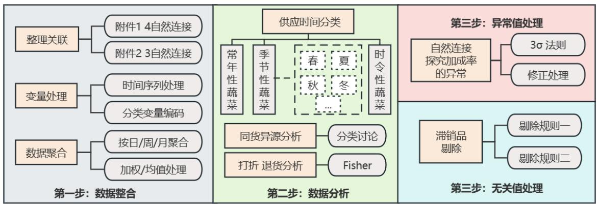

<details>
<summary>flowchart</summary>

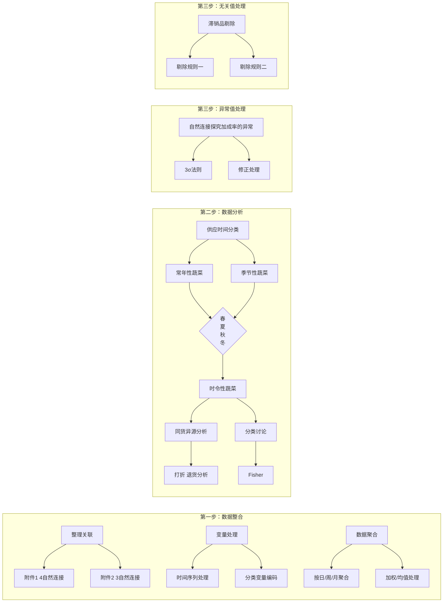
```mermaid
graph LR
  subgraph Step1["第一步：数据整合"]
  A["整理关联"] --> B["附件1 4自然连接"]
  A --> C["附件2 3自然连接"]
  D["变量处理"] --> E["时间序列处理"]
  D --> F["分类变量编码"]
  G["数据聚合"] --> H["按日/周/月聚合"]
  G --> I["加权/均值处理"]
  end

  subgraph Step2["第二步：数据分析"]
  J["供应时间分类"] --> K["常年性蔬菜"]
  J --> L["季节性蔬菜"]
  K --> M{"春\n夏\n秋\n冬"}
  L --> M
  M --> N["时令性蔬菜"]
  N --> O["同货异源分析"]
  N --> P["分类讨论"]
  O --> Q["打折 退货分析"]
  P --> R["Fisher"]
  end

  subgraph Step3["第三步：异常值处理"]
  S["自然连接探究加成率的异常"] --> T["3σ法则"]
  S --> U["修正处理"]
  end

  subgraph Step4["第三步：无关值处理"]
  V["滞销品剔除"] --> W["剔除规则一"]
  V --> X["剔除规则二"]
  end
```
</details>

## 5.1 数据整合

概览题设所给出的附件信息，可以发现其数据量庞大、信息冗杂琐碎，是典型的实际生活数据。对其进行整理关联、变量处理、数据聚合等初步工作能有效帮助后续数据的处理、分析与预测。

\- 整理关联：附件一、四共同描述了单品的编号、分类、近期损耗率信息，而附件二、三共同描述了单品的销售、进购信息，通过 Python 编程以实现表格间自然连接（NJ）。

- 变量处理：将附件中的列“销售日期”与“销售时间”处理为时间序列、“销售类型”与“是否打折销售”one-hot编码处理为分类变量。  
- 数据聚合：由于蔬菜单品的销售信息琐碎，故将其以单品和品类两种形式按日、周、月、年进行数据聚合，以品类的日聚合为例介绍聚合规则如下：

(a) 对于日销售量:

$$
Q _ {i} = \sum_ {j} Q _ {i j} \tag {1}
$$

其中 $O_{k}$ 表示每个订单的单品编号, $A_{i}$ 表示品类 i 中的单品集合, $Q_{ij}$ 表示品类 i 中的单品 j 的销量, $Q_{i}$ 表示品类 i 的总销量

(b) 对于日销售单价、进价、加成率:

$$
X _ {i} = \frac {\sum_ {j} Q _ {i j} \times x _ {i}}{Q _ {i}} \tag {2}
$$

其含义可以理解为以销量为权重进行加权求均值，其中加成率的计算公式如下：

$$
\text {加成率} = \frac {\text {定价} - \text {成本}}{\text {成本}} \tag {3}
$$

## 5.2 数据分析

## (a) 单品按时间供应分类

对蔬菜的进货信息分析，发现蔬菜的供应季节、周期、时间存在明显差异，查阅相关资料后，本文将从供应时间的角度将蔬菜单品分为以下三类：

- 常年性蔬菜：这些产品可以在不同的地区或国家生产, 几乎整年都可以获得。  
- 季节性蔬菜：受气候和地理条件影响，该类产品只在特定的季节内生长与销售。  
- 时令性蔬菜：该类产品仅在某些特定的节日、假期、节气等短期时间销售。

结合题设信息，本文设定如下分类规则：

规则 1：三年中某一年可供天数大于 300 天，划分为常年性蔬菜；

规则 2：每年最大可供天数小于 15 天，划分为时令性蔬菜；

经过规则一处理了 30 个单品、经过规则二处理了 70 个单品，剩余单品划分为季节性蔬菜，对季节性蔬菜进行季节分析进一步统计其所出现的季节，发现如下信息：

\* 若某单品每年可供天数虽不超过 300 天，但是在各季节均可供，应属于常年性蔬菜；  
\* 若某单品在某些季节可供，但可供天数极少，为异常数据，不能视为该季节蔬菜；  
\* 若某单品在某季节集中供应且其余季节无供应，则属于典型该季节蔬菜。

基于以上信息，增加如下规则：

规则 3：四季都可供，且各季节三年可供天数均大于 20 天，划分为常年性蔬菜；

规则 4：各个季节三年共计可供天数均小于 20 天，划分为时令性蔬菜；

经过规则 3、规则 4 修正，分别处理了 46 个单品、12 个单品，余下的 90 种蔬菜均划为季节性蔬菜，具体分类结果见支持材料，占比情况和部分结果如下：

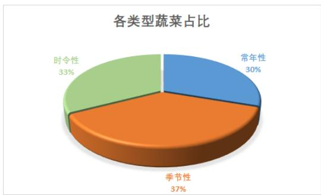

<details>
<summary>pie</summary>

| 蔬菜类型 | 占比 |
| --- | --- |
| 常年性 | 30% |
| 季节性 | 37% |
| 时令性 | 33% |
</details>

图 1 各类型蔬菜占比

表 1 各类型蔬菜举例

<table><tr><td>蔬菜类型</td><td>举例</td></tr><tr><td>常年性 30%</td><td>大白菜、胡萝卜、土豆</td></tr><tr><td>季节性 37%</td><td>槐花、野藕、薄荷叶</td></tr><tr><td>时令性 33%</td><td>莲藕、蒲公英、荸荠</td></tr></table>

进一步，我们根据各季节性蔬菜在进货信息中常出现的月份，推测各个季节性蔬菜其所属的季节，具体结果见支撑材料。查阅相关资料，我们发现分类的结果十分贴合生活常识，验证了分类的精确性。这为之后蔬菜的分析提供可靠的参考。如“四川红香椿”，统计分析其为春季蔬菜，查阅资料后发现其3月末到4月初为采摘和食用的黄金时间。

## (b) 同货异源类蔬菜的分析

题目给出的数据中包含不同供应地的同种蔬菜，为避免其对后续建模造成影响，进行其统计分析，发现主要可以分为两种类型：

- 销量均衡类：如黄心菜(1)与黄心菜(2)，销量分别为 $2911kg$ 与 $1882kg$ , 共计6种  
- 销量失衡类：如紫茄子(1)与紫茄子(2)，销量分别为 $279\mathrm{kg}$ 与 $13602\mathrm{kg}$ , 共计13种

但是由于同货异源类蔬菜的进价和售价并不相同，故不能将其合并，应当视作两种不同的蔬菜，故本文不对其做过多处理。

## (c) 打折单品与退货单品分析

应当注意到，少量（5.39%）蔬菜由于品相等原因打折销售，极少量（5‰）订单由于未知因素被退货。前者因为打折而导致销售单价及销量发生改变、后者因为销售单价为负与正常项不同，但经过数据按时间聚合后，两类数据均不会对结果造成影响。

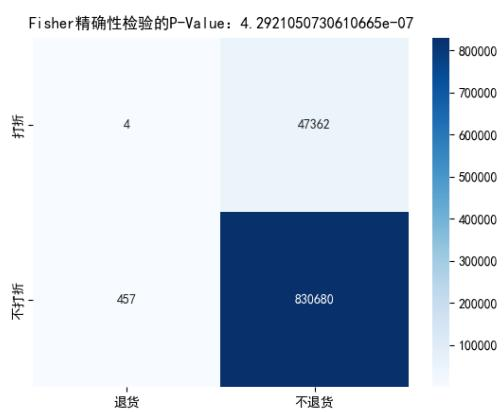

<details>
<summary>heatmap</summary>

| Category | 退货 | 不退货 |
| --- | --- | --- |
| 打折 | 4 | 47362 |
| 不打折 | 457 | 830680 |
</details>

图 2 打折与退货的关系

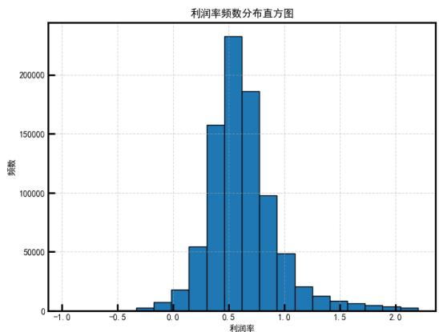

<details>
<summary>histogram</summary>

| 利润率 (Bin) | 频数 |
| --- | --- |
| -0.3~-0.2 | ~2000 |
| -0.2~-0.1 | ~8000 |
| -0.1~0.0 | ~18000 |
| 0.0~0.1 | ~54000 |
| 0.1~0.2 | ~158000 |
| 0.2~0.3 | ~235000 |
| 0.3~0.4 | ~186000 |
| 0.4~0.5 | ~98000 |
| 0.5~0.6 | ~49000 |
| 0.6~0.7 | ~21000 |
| 0.7~0.8 | ~13000 |
| 0.8~0.9 | ~9000 |
| 0.9~1.0 | ~7000 |
| 1.0~1.1 | ~5000 |
| 1.1~1.2 | ~3500 |
| 1.2~1.3 | ~2500 |
</details>

图 3 商品加成率分布图

如图2, 对两者进行 Fisher 精确性检验可以发现 p 值小于 0.05，说明两者存在相关关系，具体来说即，当打折销售时退货的概率会降低。

## 5.3 异常数据处理

将附件自然连接之后能发现不易被发现的异常数据，如加成率（利润率）。大部分单品的加成率为 0.5 左右，然而存在部分单品加成率高达 200，显然不符合蔬菜一般定价规律。本文对附件二中的 87 余条销售记录进行如下处理：

- $3\sigma$ 法则：剔除利润率偏差极大的数值  
- 修正处理：将利润率大于2的销售记录剔除

经过处理之后，删去 16430 条销售记录，对商品加成率画出分布图如图3所示。

## 5.4 无关数据处理

观察蔬菜销售数据发现，部分蔬菜在供应上未呈现周期规律性，并且供应天数极少销售量同样极少。本文认为该类蔬菜可能为某段时间突然出现的特殊品种蔬菜，存在供应链不稳定，或者市场需求量极少的情况，并不存在稳定销售以及供应规律，在数据分析中属于无关数据，对蔬菜总销量以及未来预测无有利贡献，因此本文不予进行考虑。本文对无关数据进行如下处理：

- 剔除完全没有销量数据的蔬菜单品，共计 5 个；  
- 剔除销售天数小于 10，销售量小于 $3 \text{‰}$ ，且无年周期规律的蔬菜单品，共计 48 个。

## 六、问题一的模型建立与求解

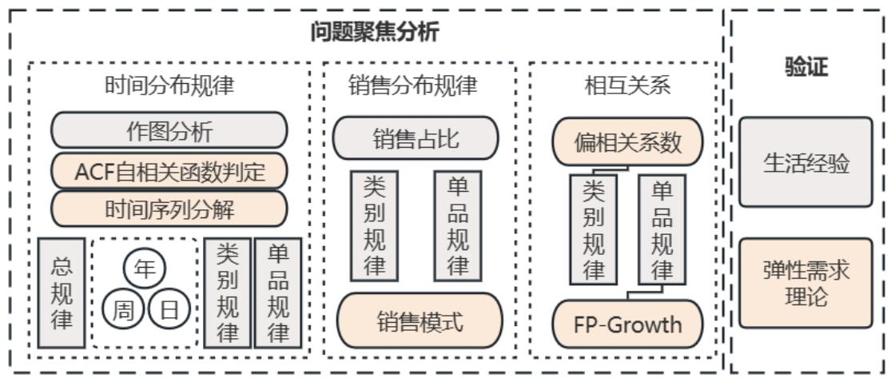

<details>
<summary>flowchart</summary>

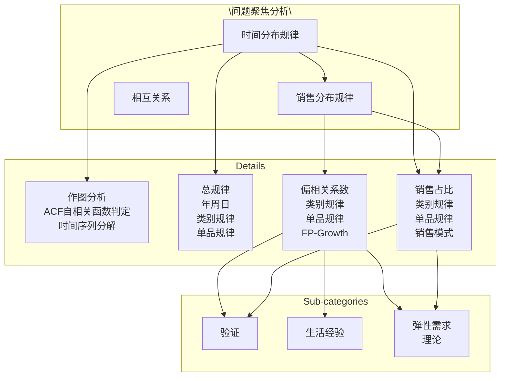
```mermaid
graph TD
  subgraph sg["\"问题聚焦分析\""]
    A["时间分布规律"]
    B["销售分布规律"]
    C["相互关系"]
  end

  subgraph Details
    D["作图分析\nACF自相关函数判定\n时间序列分解"]
    E["总规律\n年周日\n类别规律\n单品规律"]
    F["销售占比\n类别规律\n单品规律\n销售模式"]
    G["偏相关系数\n类别规律\n单品规律\nFP-Growth"]
  end

  subgraph Sub_categories["Sub-categories"]
    H["验证"]
    I["生活经验"]
    J["弹性需求\n理论"]
  end

  A --> D
  A --> B
  A --> E
  A --> F
  B --> F
  B --> G
  G --> H
  G --> I
  G --> J
  F --> H
  F --> J
```
</details>

## 6.1 问题聚焦

问题一要求探究各个品类及单品的蔬菜销售量的分布规律以及相互关系。由于能够考虑的方面很多，我们将问题聚焦为探究以下三个部分：

## (a) 分布规律之时间：

题中所给的蔬菜销售数据，存在长期变化趋势和周期变化规律，并且受到购买蔬菜的顾客生活习惯、工作时间以及气候等因素的影响。这些因素对于大部分单品与品类产生的影响是同向性的，能体现外部经济、环境因素的作用。

- 首先，对销售总量进行时间上的分布规律分析，观察外部因素对总体销售量的影响；  
- 其次，对各品类不同时间维度上的销量分布分析，发掘人们对各个品类的不同需求；  
- 最后，基于单品的时间分类对各单品探究其时间分布规律。

## (b) 分布规律之销售：

商品销售模式根据其单笔平均销量以及出售次数的情况可以分为三种：多量少笔、少量多笔、以及零散销售。对每种单品以及品类的总销售量在每笔销售量上的分布情况分析，可以得到蔬菜销售分布规律。

## (c) 相互关系:

探究品类、单品销售量的相互关系时需要注意去除外界因素的干扰，剔除经济、社会、生活习惯对每个品类、单品的影响。本文认为经济生活状况对各种品类销量的影响主要体现在总销量的变化，因此本文采用偏相关性分析剔除其他因素的影响。

## 6.2 时间分布规律的探究

为确定蔬菜总销售量在三年中的变化是否含有周期性的规律变化, 本文通过以下三个步骤进行分析:

步骤一：作图分析：绘制时间序列图，观察曲线趋势，初步分析可能存在的趋势、周期。

步骤二：周期性判定：本文采用自相关函数（ACF）图进行时间序列的周期判定。

步骤三：时间序列分解：判定周期性后，仍不能确定一个周期内的变化规律，因此本文采用时间序列分解，分离时间序列的总体趋势，周期规律。

## 6.2.1 基于自相关函数 ACF 的时间序列分解的模型建立

## 自相关函数 ACF:

一个时间序列在不同时间点的值之间可能存在相关性。自相关性通过计算时间序列在不同滞后阶段之间的相关系数来衡量这种相关性。如果在某个滞后阶段存在显著的相关性，那么可以认为时间序列在该阶段具有自相关性。可以按照如下步骤操作：

1. ACF 的计算：自相关系数计算公式为：

$$
\rho_ {k} = \frac {\operatorname{Cov} (X _ {t} , X _ {t - k})}{\operatorname{Var} (X _ {t})}
$$

其中， $X_{t}$ 是时间序列在时间点 t 的值， $X_{t-k}$ 是在 t 时刻滞后 k 期的值，Cov 表示协方差，Var 表示方差。

2. ACF 图的绘制：将计算得到的自相关系数绘制成 ACF 图。横轴表示滞后阶段（lag），纵轴表示自相关系数的值。  
3. ACF 图的解释：相关系数在滞后阶段 0 处为 1，因为时间序列与自身在同一时间点的相关性始终是 1。其他滞后阶段的相关系数将在 ACF 图中显示。

- 若 ACF 图在之后的滞后阶段上有正相关性，可能表示存在季节性模式。  
- 若 ACF 图在之后的滞后阶段上有负相关性，可能表示存在反向的季节性模式。  
- 若 ACF 图在之后的滞后阶段上都接近零，可能表示时间序列随机，无自相关性。  
- 若 ACF 图在某个滞后阶段上出现显著的峰值，相关性系数高于显著性阈值，则表示存在周期性或趋势。

## 乘法时间序列分解

乘法分解假定时间序列是由趋势、季节性、周期性和噪声等组成部分相乘而成的，通常表示为：

$$
Y _ {t} = T _ {t} \cdot S _ {t} \cdot C _ {t} \cdot E _ {t}
$$

其中 $Y_{t}$ 为观测值， $T_{t}$ 表示趋势成分， $Q_{t}$ 表示季节性成分， $C_{t}$ 表示周期性成分， $E_{t}$ 表示随机噪音。

## 6.2.2 时间分布规律的求解结果

## (a) 总销量的分布规律

总销量在三年间的变化曲线如图4所示，总体销量在 2021.2-2022.5 年间处于低迷状态，并于 2023 年明显提高。

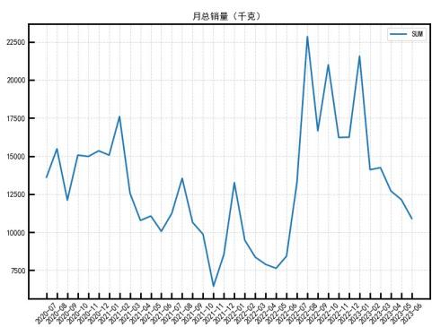

<details>
<summary>line</summary>

| Category | SUM (千克) |
| --- | --- |
| 2020-07 | ~13500 |
| 2020-08 | ~15500 |
| 2020-09 | ~12000 |
| 2020-10 | ~15000 |
| 2020-11 | ~15000 |
| 2020-12 | ~15500 |
| 2021-01 | ~15000 |
| 2021-02 | ~17500 |
| 2021-03 | ~12500 |
| 2021-04 | ~11000 |
| 2021-05 | ~11000 |
| 2021-06 | ~10000 |
| 2021-07 | ~11000 |
| 2021-08 | ~13500 |
| 2021-09 | ~11000 |
| 2021-10 | ~10000 |
| 2021-11 | ~6500 |
| 2021-12 | ~8500 |
| 2022-01 | ~13500 |
| 2022-02 | ~9500 |
| 2022-03 | ~8500 |
| 2022-04 | ~8000 |
| 2022-05 | ~7500 |
| 2022-06 | ~8500 |
| 2022-07 | ~13500 |
| 2022-08 | ~23500 |
| 2022-09 | ~16500 |
| 2022-10 | ~21500 |
| 2022-11 | ~16500 |
| 2022-12 | ~16500 |
| 2023-01 | ~21500 |
| 2023-02 | ~14500 |
| 2023-03 | ~14500 |
| 2023-04 | ~13500 |
| 2023-05 | ~13500 |
| 2023-06 | ~11500 |
</details>

图 4 三年间蔬菜总销量曲线图

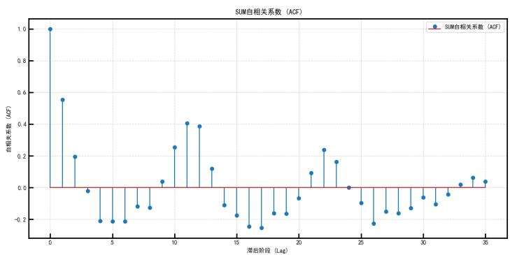

<details>
<summary>stem</summary>

| 滞后阶段 (Lag) | SUM自相关系数 (ACF) |
| --- | --- |
| 0 | 1.0 |
| 1 | ~0.55 |
| 2 | ~0.2 |
| 3 | ~-0.02 |
| 4 | ~-0.21 |
| 5 | ~-0.21 |
| 6 | ~-0.21 |
| 7 | ~-0.12 |
| 8 | ~-0.12 |
| 9 | ~0.04 |
| 10 | ~0.25 |
| 11 | ~0.4 |
| 12 | ~0.38 |
| 13 | ~0.12 |
| 14 | ~-0.11 |
| 15 | ~-0.17 |
| 16 | ~-0.25 |
| 17 | ~-0.26 |
| 18 | ~-0.16 |
| 19 | ~-0.16 |
| 20 | ~-0.06 |
| 21 | ~0.09 |
| 22 | ~0.24 |
| 23 | ~0.16 |
| 24 | 0.0 |
| 25 | ~-0.09 |
| 26 | ~-0.23 |
| 27 | ~-0.15 |
| 28 | ~-0.16 |
| 29 | ~-0.13 |
| 30 | ~-0.06 |
| 31 | ~-0.1 |
| 32 | ~-0.04 |
| 33 | ~0.02 |
| 34 | ~0.07 |
| 35 | ~0.04 |
</details>

图 5 月总销售量自相关函数图

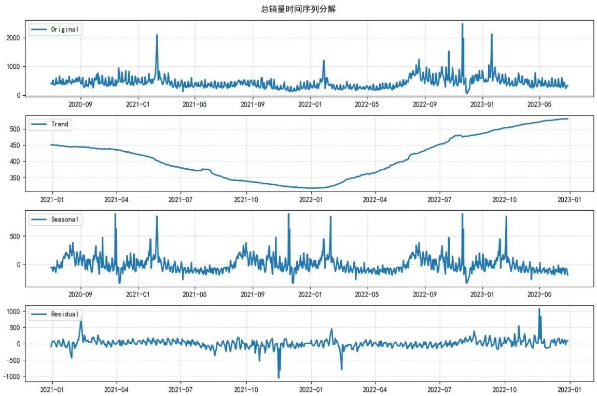

<details>
<summary>line</summary>

| 时间 | Original | Trend | Seasonal | Residual |
| --- | --- | --- | --- | --- |
| 2020-09 | ~500 | ~450 | ~0 | ~0 |
| 2021-01 | ~500 | ~430 | ~0 | ~0 |
| 2021-04 | ~500 | ~420 | ~0 | ~0 |
| 2021-07 | ~500 | ~380 | ~0 | ~0 |
| 2021-10 | ~500 | ~340 | ~0 | ~0 |
| 2022-01 | ~500 | ~320 | ~0 | ~0 |
| 2022-04 | ~500 | ~360 | ~0 | ~0 |
| 2022-07 | ~500 | ~450 | ~0 | ~0 |
| 2022-10 | ~500 | ~500 | ~0 | ~0 |
| 2023-01 | ~500 | ~550 | ~0 | ~0 |
</details>

图 6 年时间序列分解

## 时间分布规律之年规律：

考虑到蔬菜的生长周期以及气候变化往往以年为周期进行变化, 因此以月为最小单位对总销售量进行整合, 分析总销售量是否存在一年的周期关系。

绘出自相关函数 ACF 图，如图5所示：结果发现，在与滞后阶段 0 相差 12 个月处自相关性达到峰值，并且超出置信区间，说明时间序列以年存在周期。观察时间序列按年进行分解得到的结果，如图6所示，分析发现其总销量在秋季和春节期间会有大幅度增长。这可以解释为秋季的大丰收和春节的年货采办会促使蔬菜销量增加。

## 时间分布规律之周规律：

考虑到人们的工作往往是以周为单位的，因此一周之内人们购买蔬菜情况可能随工作情况变化。因此取一天的总销量，分析总销售量是否存在一周的周期关系。

绘出自相关函数 ACF 图，如图7(a)所示：结果发现，在与滞后阶段 0 相差 7 天处自相关性达到峰值，并且超出置信区间，说明时间序列以周存在周期。时间序列分解情况如图7(b)所示，分析其季节性部分发现，周期波动情况恰好为 7 天，这与自相关系数相互印证。对照日历可以得到，每周的周一销量达到谷值，周六销量达到峰值。这可能是由于周末为人们休息与购物的日子，人们倾向于把一周需要采购的蔬菜都采购完，而在工作日中由于工作较为繁忙，蔬菜的销售量在较低范围内波动。

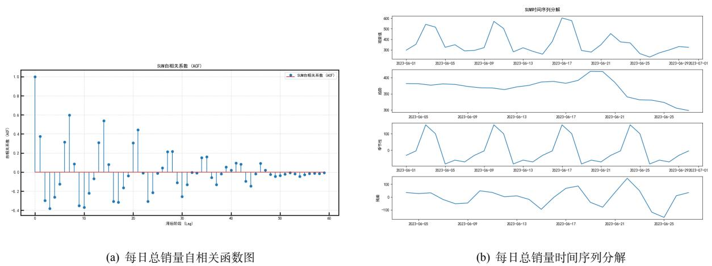  
图 7 周总销售量周期性分析

## 时间分布规律之日规律：

考虑到人们在一天中可能会存在某种购菜规律，因此一天之内人们蔬菜的销售量可能并不平均。因此以一小时为单位，分析总销售量是否存在一天内的分布规律。

绘出自相关函数 ACF 图，如图8(a)，我们发现在与滞后阶段 0 相差 13 处自相关性达到峰值，而这恰好为一天中存在销量的小时数，这说明时间序列以天存在稳定规律。时间序列分解情况如图8(b)所示，在上午 9 点与下午 17 至 19 点时，销售量较多，这可能是因为人们倾向于在上午或者下午下班后前往超市购物。

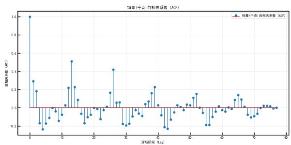

<details>
<summary>line</summary>

| 滞后阶数 (Lag) | 销量 (千克) 自相关系数 (AICF) |
| --- | --- |
| 0 | 1.0 |
| 2 | ~0.3 |
| 3 | ~0.18 |
| 4 | ~-0.17 |
| 5 | ~-0.24 |
| 6 | ~-0.18 |
| 7 | ~-0.12 |
| 8 | ~-0.01 |
| 9 | ~-0.03 |
| 10 | ~-0.14 |
| 11 | ~-0.08 |
| 12 | ~0.03 |
| 13 | ~0.22 |
| 14 | ~0.51 |
| 15 | ~0.23 |
| 16 | ~0.09 |
| 17 | ~-0.07 |
| 18 | ~-0.17 |
| 19 | ~-0.08 |
| 20 | ~-0.09 |
| 21 | ~-0.01 |
| 22 | ~-0.01 |
| 23 | ~-0.13 |
| 24 | ~-0.02 |
| 25 | ~0.01 |
| 26 | ~0.17 |
| 27 | ~0.42 |
| 28 | ~0.06 |
| 29 | ~0.06 |
| 30 | ~-0.18 |
| 31 | ~-0.19 |
| 32 | ~-0.15 |
| 33 | ~-0.08 |
| 34 | ~-0.03 |
| 35 | ~-0.08 |
| 36 | ~-0.08 |
| 37 | ~0.06 |
| 38 | ~0.17 |
| 39 | ~0.23 |
| 40 | ~0.03 |
| 41 | ~-0.08 |
| 42 | ~-0.22 |
| 43 | ~-0.24 |
| 44 | ~-0.15 |
| 45 | ~-0.05 |
| 46 | ~-0.04 |
| 47 | ~0.03 |
| 48 | ~-0.02 |
| 49 | ~0.03 |
| 50 | ~0.11 |
| 51 | ~0.16 |
| 52 | ~-0.05 |
| 53 | ~-0.19 |
| 54 | ~-0.19 |
| 55 | ~-0.11 |
| 56 | ~-0.05 |
| 57 | ~-0.02 |
| 58 | ~-0.04 |
| 59 | ~-0.03 |
| 60 | ~-0.01 |
| 61 | ~-0.01 |
| 62 | ~-0.01 |
| 63 | ~0.1 |
| 64 | ~0.14 |
| 65 | ~0.09 |
| 66 | ~-0.08 |
| 67 | ~-0.11 |
| 68 | ~-0.12 |
| 69 | ~-0.11 |
| 70 | ~-0.08 |
| 71 | ~-0.07 |
| 72 | ~-0.02 |
| 73 | ~-0.02 |
| 74 | ~-0.02 |
| 75 | ~-0.02 |
| 76 | ~-0.02 |
| 77 | ~-0.02 |
| 78 | ~-0.02 |
</details>

(a) 时总销量自相关函数图

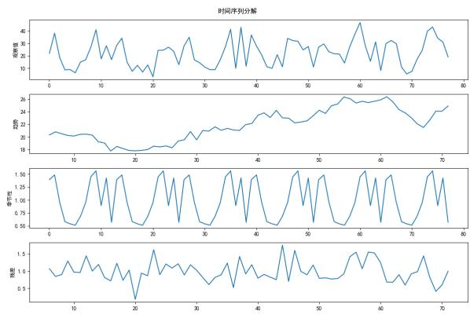

<details>
<summary>line</summary>

| X | 能量 | 功耗 | 季节性 | 和差 |
| --- | --- | --- | --- | --- |
| 0 | ~23 | ~20.5 | ~1.45 | ~1.1 |
| 5 | ~38 | ~20.8 | ~1.45 | ~1.2 |
| 10 | ~10 | ~20.5 | ~0.6 | ~1.0 |
| 15 | ~17 | ~19.5 | ~1.55 | ~1.2 |
| 20 | ~10 | ~18.0 | ~0.6 | ~0.2 |
| 25 | ~23 | ~18.5 | ~1.55 | ~1.6 |
| 30 | ~15 | ~20.5 | ~0.6 | ~1.1 |
| 35 | ~25 | ~21.5 | ~1.55 | ~0.9 |
| 40 | ~35 | ~23.5 | ~0.6 | ~1.7 |
| 45 | ~28 | ~23.0 | ~1.55 | ~1.6 |
| 50 | ~28 | ~23.5 | ~0.6 | ~0.8 |
| 55 | ~22 | ~24.5 | ~0.6 | ~0.8 |
| 60 | ~45 | ~25.5 | ~1.55 | ~1.5 |
| 65 | ~28 | ~24.0 | ~0.6 | ~0.7 |
| 70 | ~18 | ~22.0 | ~1.55 | ~0.4 |
| 75 | ~38 | ~24.5 | ~0.6 | ~1.0 |
| 80 | — | — | — | — |
</details>

(b) 时总销量时间序列分解  
图 8 日总销售量周期性分析

## 销售量的变化趋势：

在 2020.7 至 2023.7 这段时间中，受到经济发展、疫情影响，人们的购物习惯可能会发生显著的变化，因此本文对时间序列随总体时间变化的影星趋势进行分析。对时间序列进行分解，观察其在三年内的变化趋势，如图9所示，结果发现

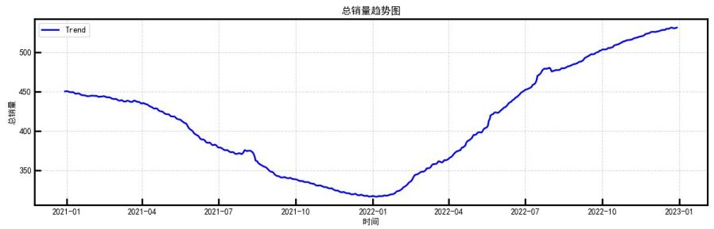

<details>
<summary>line</summary>

| 时间 | 总销量 |
| --- | --- |
| 2021-01 | ~450 |
| 2021-04 | ~435 |
| 2021-07 | ~380 |
| 2021-10 | ~340 |
| 2022-01 | ~320 |
| 2022-04 | ~360 |
| 2022-07 | ~450 |
| 2022-10 | ~500 |
| 2023-01 | ~530 |
</details>

图 9 三年间总销量趋势图

2020 年新冠疫情的爆发,给各行业包括蔬菜产业都带来了极大的冲击。

## (b) 各品类销量的分布规律

绘出在 2020.7 到 2023.7 这段时间中六个品类的总销的变化曲线如图10所示

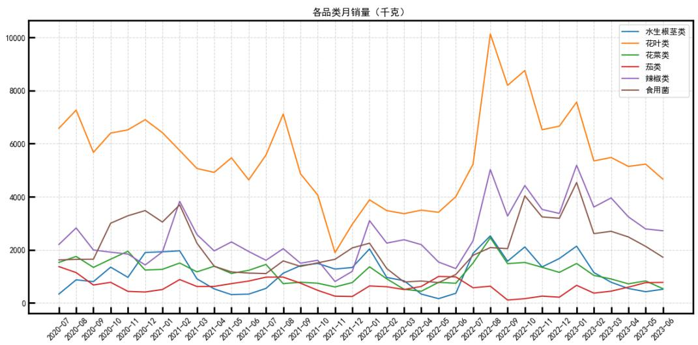

<details>
<summary>line</summary>

| 2021-06 | ~455 | ~4750 | ~1355 | ~955 | ~1955 |
| --- | --- | --- | --- | --- | --- |
| 2021-07 | ~655 | ~5655 | ~1555 | ~1155 | ~1755 |
| 2021-08 | ~1355 | ~7155 | ~855 | ~955 | ~2155 |
| 2021-09 | ~1655 | ~4955 | ~855 | ~855 | ~1655 |
| 2021-10 | ~1455 | ~4155 | ~855 | ~655 | ~1655 |
| 2021-11 | ~1355 | ~1955 | ~755 | ~355 | ~955 |
| 2021-12 | ~1355 | ~3355 | ~855 | ~355 | ~1655 |
| 2022-01 | ~2155 | ~3955 | ~1455 | ~755 | ~3155 |
| 2022-02 | ~955 | ~3655 | ~955 | ~755 | ~2355 |
| 2022-03 | ~655 | ~3455 | ~655 | ~655 | ~2455 |
| 2022-04 | ~455 | ~3655 | ~655 | ~755 | ~2255 |
| 2022-05 | ~355 | ~3455 | ~855 | ~1155 | ~1655 |
| 2022-06 | ~455 | ~4155 | ~855 | ~955 | ~1355 |
| 2022-07 | ~1855 | ~7355 | ~1855 | ~655 | ~2455 |
| 2022-08 | ~2655 | ~10155 | ~2655 | ~755 | ~4955 |
| 2022-09 | ~1655 | ~8255 | ~1655 | ~1655 | ~3355 |
| 2022-10 | ~2155 | ~8755 | ~1655 | ~1655 | ~4455 |
</details>

图 10 三年间各品类销量变化图

观察图片发现各个品类均会在某一相同的节点出现尖峰或低谷，其中花叶类的波动幅度最大，同时与总销售量曲线相似度最高，而茄类较为平稳，在较低销售量水平波动不明显。这与顾客的需求弹性有关，分析数据，发现花叶类中含有单品种类丰富，除了小白菜、小青菜这种常见食用单品，还有白蒿、鱼腥草等药用单品以及洪山菜薹珍品手提袋、洪山菜薹莲藕拼装礼盒等礼品类单品。对于常见食用单品，作为生活刚需，需求弹性往往较低，但是对于药用类以及礼品类商品，需求弹性往往较高，顾客购买量往往随外部因素影响变化较大。

## (c) 各单品销量的分布规律

做出全年供应的蔬菜、季节性蔬菜以及时令性蔬菜总销量在 2020.7 至 2023.7 的变化曲线，如图11

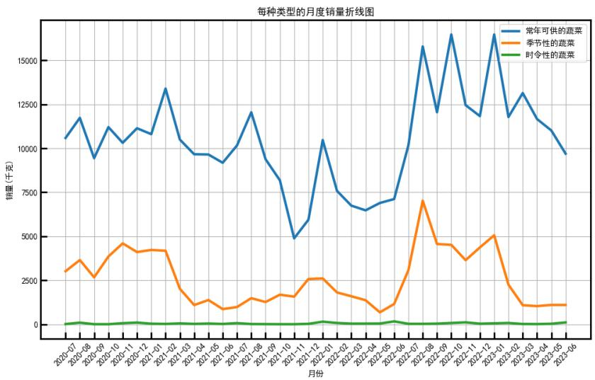

<details>
<summary>line</summary>

| 月份 | 常年可供的蔬菜 (千克) | 季节性的蔬菜 (千克) | 时令性的蔬菜 (千克) |
| :--- | :--- | :--- | :--- |
| 2020-07 | ~10600 | ~3000 | ~50 |
| 2020-08 | ~11800 | ~3600 | ~150 |
| 2020-09 | ~9500 | ~2600 | ~50 |
| 2020-10 | ~11300 | ~3800 | ~50 |
| 2020-11 | ~10400 | ~4500 | ~150 |
| 2020-12 | ~11200 | ~4100 | ~150 |
| 2021-01 | ~10900 | ~4200 | ~50 |
| 2021-02 | ~13400 | ~4200 | ~50 |
| 2021-03 | ~10500 | ~2100 | ~50 |
| 2021-04 | ~9700 | ~1150 | ~50 |
| 2021-05 | ~9700 | ~1450 | ~50 |
| 2021-06 | ~9200 | ~950 | ~50 |
| 2021-07 | ~10200 | ~1150 | ~50 |
| 2021-08 | ~12100 | ~1550 | ~50 |
| 2021-09 | ~9400 | ~1350 | ~50 |
| 2021-10 | ~8200 | ~1750 | ~50 |
| 2021-11 | ~4950 | ~1750 | ~50 |
| 2021-12 | ~6050 | ~2650 | ~50 |
| 2022-01 | ~10500 | ~2650 | ~150 |
| 2022-02 | ~7650 | ~1850 | ~50 |
| 2022-03 | ~6850 | ~1650 | ~50 |
| 2022-04 | ~6550 | ~1450 | ~50 |
| 2022-05 | ~6950 | ~850 | ~50 |
| 2022-06 | ~7150 | ~1150 | ~150 |
| 2022-07 | ~11850 | ~3350 | ~50 |
| 2022-08 | ~16350 | ~7150 | ~50 |
| 2022-09 | ~12150 | ~4650 | ~50 |
| 2022-10 | ~16950 | ~4650 | ~50 |
| 2022-11 | ~14350 | ~3750 | ~150 |
| 2022-12 | ~12450 | ~4350 | ~50 |
| 2023-01 | ~16650 | ~5150 | ~50 |
| 2023-02 | ~11850 | ~2350 | ~50 |
| 2023-03 | ~13350 | ~1150 | ~50 |
| 2023-04 | ~11750 | ~1185 | ~50 |
| 2023-05 | ~11150 | ~1235 | ~50 |
| 2023-06 | ~9750 | ~1235 | ~150 |
</details>

图 11 三年间各类单品总销量曲线图

结果发现，全年可提供的蔬菜总销量随时间变化的趋势与总销量变化相似度最高，季节性蔬菜销量变化总体趋势也与总销量相似，而时令性蔬菜销量总体波动幅度最小几乎只在0附近变化。概括而言有如下规律：

1 对于全年可供的蔬菜而言,由于其销售量最高,其变化状态最能影响总体销售量,因此其变化趋势与总销售量极为相似;  
2 季节性蔬菜在不同季节中均有不同单品存在销量，因此在全年整体呈现出相似的状态，各单品也只在自身供应的季节存在销量分布；  
3 时令性蔬菜往往出现时间较短，每种单品销量仅分布在一年中的某几天，整体综合销量较低，随时间变化不明显。

## 6.3 销量分布规律的探究

## 6.3.1 销量占比

绘出蔬菜每种单品总销量的的直方图以及累计销量图，如图13所示，结果发现蔬菜高销售额商品只占少部分，而大部分商品的销量相对较低，前30%的蔬菜单品总销售量贡献率达到90%，呈现出明显的长尾分布。

各品类销量占比差异同样较大，花叶类品类销量占比最大，其次为辣椒类与食用菌类，茄类销量占比最少。观察各品类中单品数量，发现其与单品种类数相吻合，花叶类中的单品种类较多，并且存在许多常见食用蔬菜，如小白菜小青菜等，茄类与花菜类单品种类较少，销量也会受到影响。

在每种品类中，某些品类中单品销售量差异明显，有些差异较小。下图所示：

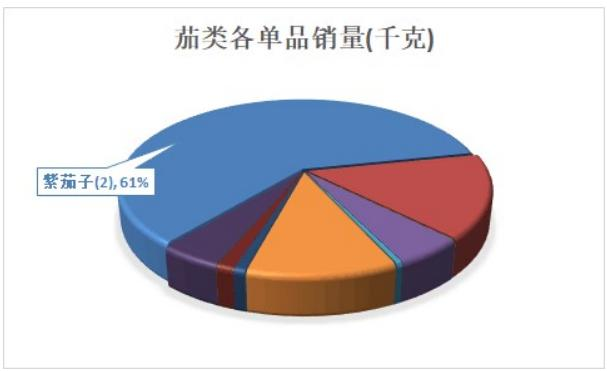

<details>
<summary>pie</summary>

| Category | Value (%) |
| --- | --- |
| 紫茄子(2) | 61 |
</details>

(a) 茄类各单品销量占比

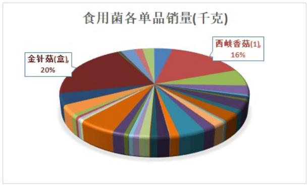

<details>
<summary>pie</summary>

| Category | Value (%) |
| --- | --- |
| 金针菇(盒) | 20 |
| 西峡香菇(1) | 16 |
</details>

(b) 食用菌各单品销量占比  
图 12 典型品类单品销量占比

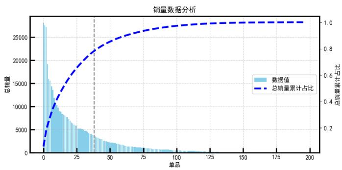

<details>
<summary>bar</summary>

| 单品 | 总销量 | 总销量累计占比 |
| --- | --- | --- |
| 0 | ~28000 | ~0.15 |
| 5 | ~16000 | ~0.35 |
| 10 | ~10000 | ~0.50 |
| 25 | ~5000 | ~0.75 |
| 50 | ~2000 | ~0.90 |
| 75 | ~1000 | ~0.95 |
| 100 | ~500 | ~0.98 |
| 125 | ~200 | ~0.99 |
| 150 | ~100 | ~1.00 |
| 175 | ~50 | ~1.00 |
| 200 | ~20 | ~1.00 |
</details>

图 13 各单品总销量与累计销量占比分析

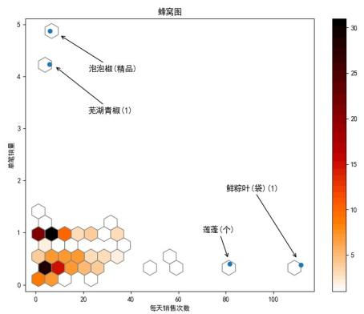

<details>
<summary>bubble</summary>

| Category | 每天销售次数 (X) | 单氮限量 (Y) |
| --- | --- | --- |
| 泡泡椒 (精品) | ~5 | ~4.9 |
| 芜湖青椒 (1) | ~8 | ~4.2 |
| 蓄莲 (个) | ~82 | ~0.4 |
| 鲜粽叶 (袋) (1) | ~108 | ~0.4 |
</details>

图 14 单笔销量与日销售数蜂窝图

## 6.3.2 销售模式规律

商品的销售模式根据其单笔销售量与销售次数的关系可以划分为三种形式，少量多笔、多量少笔以及零散销售。由于每种商品出现天数不同，因此计算每种单品的单笔销量与每日平均销售次数，绘出每种单品的单笔销量与销售次数的蜂窝图图，如图14所示，结果发现大部分单品每日平均销售次数集中在0-20之间，单笔销售量集中在0-0.7之间，部分商品以袋或份的方式进行销售，单笔销售量恒定为1。大部分商品呈现出零散销售的趋势，少部分商品呈现出明显多量少笔与少量多笔的销售模式，其中鲜肉粽与莲蓬呈现出明显的少量多笔特征，泡泡椒与芜湖青椒呈现出明显的多笔少量特征。

## 6.4 相互关系的探究

由于各品类销售量的数据为时间序列，直接进行相关性计算容易受时间上的宏观因素影响，并不能判断两种单品之间销量的关系。因此本文选择偏相关性分析确定两种品类之间的相互关系。

## 6.4.1 偏相关性分析模型

偏相关性分析可以在控制若干个对相关性分析结果造成影响的变量的情况下，检验两个变量之间的内在相关关系。

确定检验的假设如下所示，以花叶类与茄类为例：

原假设 $H_0$ ：在去除市场总销售额影响的情况下，花叶类与茄类不存在显著的偏相关性。备择假设 $H_{1}$ ：在去除市场总销售额影响的情况下，花叶类与茄类存在显著的偏相关性。

## 6.4.2 FP-Growth 关联分析模型

FP-growth 是一种经典的频繁项集和关联规则的挖掘算法，相较于 Apriori 算法而言其更适合在大规模的数据集上挖掘商品之间的关联规则。假定商家先前选定当日可售单品时综合考虑了销量因素，那么则可以用 FP-growth 挖掘单品之间的相关规则。模型建立具体步骤如下：

- 构建 FP 树：创建项头表：扫描整个数据集，统计每个项的频度，并将它们存储在一个项头表中，按照频度从高到低排序。  
- 构建 FP 树：对于每个事务（交易），根据项头表顺序，构建一颗 FP 树。  
- 构建条件模式基：对于每个频繁项头表中的项，构建其对应的条件模式基。  
- 递归挖掘 FP 树: 对于每个频繁项头表中的项，递归地构建条件 FP 树，并找出条件 FP 树中的频繁项集。  
- 构建关联规则：使用找到的频繁项集，生成关联规则。

## 6.4.3 相互关系的探究结果

## (a) 品类之间:

采用总销售量进刻画市场总销售额的变化, 对六种品类的销售量与总销售量做偏相关性分析, 结果如图15所示:

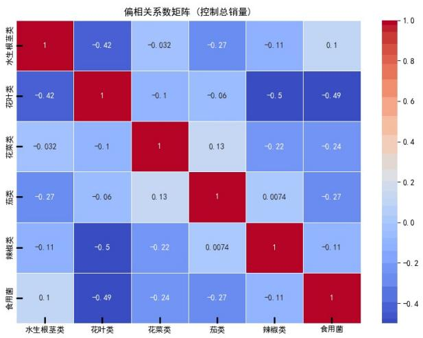

<details>
<summary>heatmap</summary>

| Category | 水生根茎类 | 花叶类 | 花菜类 | 菹类 | 辣椒类 | 食用菌 |
| --- | --- | --- | --- | --- | --- | --- |
| 水生根茎类 | 1 | -0.42 | -0.032 | -0.27 | -0.11 | 0.1 |
| 花叶类 | -0.42 | 1 | -0.1 | -0.06 | -0.5 | -0.49 |
| 花菜类 | -0.032 | -0.1 | 1 | 0.13 | -0.22 | -0.24 |
| 菹类 | -0.27 | -0.06 | 0.13 | 1 | 0.0074 | -0.27 |
| 辣椒类 | -0.11 | -0.5 | -0.22 | 0.0074 | 1 | -0.11 |
| 食用菌 | 0.1 | -0.49 | -0.24 | -0.27 | -0.11 | 1 |
</details>

图 15 各品类销售总量的偏相关性分析

结果发现花叶类与水生根茎类、花叶类与辣椒类、花叶类与食用菌类有相对较强的负相关性、说明花叶类销量的提高能够对水生根茎类、辣椒类、食用菌类的总销量产生一定程度的挤占，说明花叶类与这些类别互为互补品。而其他品类之间存在的正负偏向关系均不明显，这与蔬菜本身作为必需品的特征有关，与实际销售规律较为吻合。

## (b) 单品之间:

以每日出现的单品种类作为项集，通过模型求解构建出单品之间关联规则，部分列举如下，其余放置附录 F。观察数据可以看出支持度大于 0.8，置信度大于 0.9，可以说明两项之间存在强相关关系，其中一个销售时，另一个往往也会随之销售。

表 2 FP-Growth 部分求解结果

<table><tr><td>前项</td><td>后项</td><td>支持度</td><td>置信度</td></tr><tr><td>(102900005115823.0)</td><td>(102900005116257.0)</td><td>0.843</td><td>0.996</td></tr><tr><td>(102900005116714.0, 102900005115823.0)</td><td>(102900005116257.0)</td><td>0.837</td><td>0.996</td></tr><tr><td>(102900005116899.0, 102900005115823.0)</td><td>(102900005116257.0)</td><td>0.833</td><td>0.996</td></tr></table>

## 七、问题二的模型建立与求解

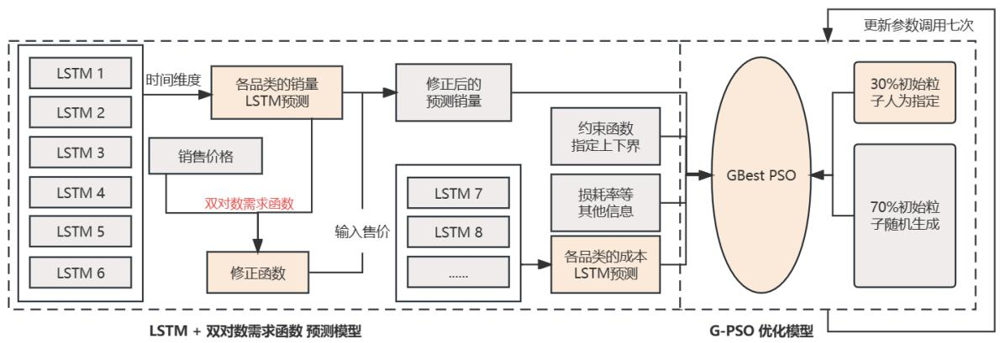

<details>
<summary>flowchart</summary>

This flowchart illustrates a two-stage model for generating and optimizing Gaussian PSO (G-PSO) optimization. It details the process from LSTM model initialization through scaling, error correction, and final optimization steps.
</details>

图 16 问题二主体思路

## 7.1 销量与成本加成定价的关系探究

由于题中所给的三年销量为时间序列数据，其变化随时间、社会经济等因素变化程度十分明显，直接对销量与定价的关系进行相关性分析难以得出正确的结论。

根据经济学理论，价格弹性指的是市场需求量随价格变动的变化程度，价格弹性可分为需求价格弹性、供给价格弹性、交叉价格弹性、预期价格弹性等类型。本题所要求探究各品类蔬菜的销售量与其定价的关系，即为需求弹性：

$$
E _ {p} = \frac {d Q / Q}{d P / P}
$$

参考相关文献 [3]，本文选用双对数需求模型对价格弹性进行估计。双对数需求函数是使用最为广泛的需求函数式，其最大的优点是能直接估计价格弹性, 基本形式如下:

$$
\ln Q _ {i} = \alpha_ {i} + \sum_ {k} e _ {i k} \ln P _ {k} + e _ {i} \ln x + \varepsilon_ {i} \tag {4}
$$

其中 $q_{i}$ 表示每个品类的销售量， $p_{k}$ 表示每个品类的平均销售价格， $x = \sum_{i} Q_{i} \times P_{i}$ 为总销售金额。 $\alpha_{i}$ 为常量参数， $e_{ik}$ 为价格弹性即为 $E_{p}$ ， $e_{i}$ 为支出弹性。

## 7.1.1 Double-log 模型求解结果

采用 spsspro 平台采用最小二乘法 OLS 对双对数需求模型参数进行估计，对六种品类的估计结果，其参数取值以及显著性水平如下表所示：

表 3 双对数需求模型回归结果

<table><tr><td></td><td>lnQ1</td><td>lnQ2</td><td>lnQ3</td><td>lnQ4</td><td>lnQ5</td><td>lnQ6</td></tr><tr><td>lnP1</td><td>-0.186***</td><td>-0.08***</td><td>-0.058***</td><td>0.035***</td><td>-0.103***</td><td>-0.088***</td></tr><tr><td>lnP2</td><td>0.044</td><td>-0.076***</td><td>-0.241***</td><td>-0.397***</td><td>-0.661***</td><td>-0.032</td></tr><tr><td>lnP3</td><td>0.03**</td><td>-0.217***</td><td>-0.221***</td><td>-0.074***</td><td>-0.108**</td><td>-0.012</td></tr><tr><td>lnP4</td><td>0.193***</td><td>0</td><td>-0.075***</td><td>-0.168***</td><td>-0.072***</td><td>-0.07***</td></tr><tr><td>lnP5</td><td>-0.007</td><td>-0.159***</td><td>-0.036**</td><td>0.139***</td><td>-0.43***</td><td>-0.272***</td></tr><tr><td>lnP6</td><td>0.023</td><td>-0.433***</td><td>-0.078***</td><td>-0.142***</td><td>-0.042***</td><td>-0.381***</td></tr><tr><td>PQ</td><td>-0.032</td><td>0.956***</td><td>0.678***</td><td>0.605***</td><td>1..441***</td><td>0.951***</td></tr><tr><td>F显著性水平</td><td>***</td><td>***</td><td>***</td><td>***</td><td>***</td><td>***</td></tr></table>

1、\*\*\*、\*\*分别表示1%，5%的显著性水平  
2、1 至 6 分别为：水生根茎类、花叶类、花菜类、茄类、辣椒类、食用菌

根据对模型的 F 检验结果分析可以得到，六种品类销量的回归结果显著性 P 值均为 0.000，水平上呈现显著性，模型基本满足要求。同时其 VIF 全部小于 10，模型构造良好，没有多重共线性问题。

分析结果发现，六种品类的需求量的需求价格弹性均在 1% 的显著性水平下显著，说明顾客对这六种品类的消费受到这六种品类价格影响显著，且为负，及品类价格越高、其销售量越低，符合一般性需求定律。

同时六种单品的销售量随总销售金额关系的支出弹性除了水生根茎类不显著外，其余五种均为显著，并且均为正数，属于正常品。其中花叶类、花菜类、茄类、食用菌的支出弹性小于 1 说明销量随总体支出水平变化不明显，属于必需品；而辣椒类的支出弹性大于 1，相对而言属于非必需品。

## 7.2 未来 7 天相关数据确定

为了更好的对未来七天的定价以及补货情况进行决策，需要对未来七天的销量、品类平均成本、品类平均损耗率、损耗折扣进行确定。

## 7.2.1 损耗折扣与损耗率的确定

分析一天中同个单品打折与不打折的出售价格之比，进行加权平均，确定损耗折扣率 k 为 0.7。

$$
k = \frac {\sum Q _ {\text {打折}} \times P _ {\text {折扣}}}{\sum Q _ {\text {打折}}} \tag {5}
$$

根据附件四中的单品损耗率对其加权平均，得到一种品类的损耗率 $L_{i}$ :

$$
L _ {i} = \frac {\sum_ {j} Q _ {i j} \times L _ {i}}{Q _ {i}} \tag {6}
$$

## 7.2.2 时间序列预测

基于问题一的分析可知题中所给的数据为一组时间序列，具有明显的周期性与趋势性，因此普通的回归模型较难良好的进行拟合预测。因此本文采用时间序列预测模型，首先采用 ARIMA、岭回归、灰色预测模型等统计时间序列模型进行预测，结果发现效果较差。因此本文采用 LSTM 长短时记忆网络模型进行预测。

## LSTM 模型基本介绍:

LSTM 通过细胞状态和门控机制来管理控制信息的流动，使其能够有效地捕捉时间序列数据中的长期依赖关系，是一种强大的时间序列预测工具。主要优点可以概括为：

- 长期记忆能力：引入“细胞状态”内部状态，捕捉和保留序列中的长期依赖关系；  
- 门控机制：遗忘门、输入门和输出门这些门控单元通过学习来控制信息的流动，有效地管理细胞状态的更新和选择性遗忘；  
- 反向传播稳定性：由于 LSTM 的门控机制，它在反向传播时通常不会出现梯度消失或爆炸的问题，训练更加容易。

## 模型评价指标的选择：

由于均方误差、均方根误差、平均绝对误差的范围与数据本身大小密切相关无法直观的了解模型的效果，因此本文主要考虑 R 方作为评价指标，同时参考 MSE、RMSE、MAE 综合评估。

## 7.2.3 LSTM 模型预测结果

搭建 LSTM 模型对销售量及成本进行预测，LSTM 模型参数如下：

表 4 LSTM 模型参数

<table><tr><td>单层 LSTM 单元数</td><td>6</td><td>损失函数</td><td>均方误差</td></tr><tr><td>全连接层神经元数</td><td>7</td><td>优化器</td><td>Adam 梯度下降算法</td></tr><tr><td>迭代次数</td><td>400</td><td>样本批量</td><td>1</td></tr></table>

六种品类补货成本和销售量的预测结果见附录 B 和附录 C。

表 5 LSTM 对进价预测效果

<table><tr><td>指标</td><td>花叶类</td><td>花菜类</td><td>水生根茎类</td><td>茄类</td><td>辣椒类</td><td>食用菌</td></tr><tr><td>R方</td><td>0.88</td><td>0.91</td><td>0.73</td><td>0.91</td><td>0.96</td><td>0.62</td></tr><tr><td>MSE</td><td>0.10</td><td>0.27</td><td>1.47</td><td>0.27</td><td>0.35</td><td>0.82</td></tr><tr><td>RMSE</td><td>0.32</td><td>0.52</td><td>1.21</td><td>0.52</td><td>0.59</td><td>0.91</td></tr><tr><td>MAE</td><td>0.24</td><td>0.39</td><td>0.66</td><td>0.38</td><td>0.42</td><td>0.67</td></tr></table>

观察上表发现进价预测效果 R 方达到 0.6 以上，最高达到 0.96 较为接近 1；同时 RMSE 与 MAE 的值相对于预测结果小一个数量级，因此本文认为该模型结果较好。

表 6 LSTM 对销量预测效果

<table><tr><td>指标</td><td>花叶类</td><td>花菜类</td><td>水生根茎类</td><td>茄类</td><td>辣椒类</td><td>食用菌</td></tr><tr><td>R2</td><td>0.81</td><td>0.75</td><td>0.85</td><td>0.79</td><td>0.85</td><td>0.86</td></tr><tr><td>MSE</td><td>1129.01</td><td>130.29</td><td>148.95</td><td>31.38</td><td>314.18</td><td>318.71</td></tr><tr><td>RMSE</td><td>33.60</td><td>11.41</td><td>12.20</td><td>5.60</td><td>17.73</td><td>17.85</td></tr><tr><td>MAE</td><td>23.92</td><td>8.84</td><td>8.80</td><td>4.18</td><td>12.74</td><td>12.21</td></tr></table>

观察上表发现各品类的进价预测效果 R 方达到 0.75 以上；同时 RMSE 与 MAE 的值相对于预测结果小一个数量级，因此本文认为该模型结果较好。

为直观体现模型的可靠性，以花叶类销量预测为例展示如下，其余可见附录 G:

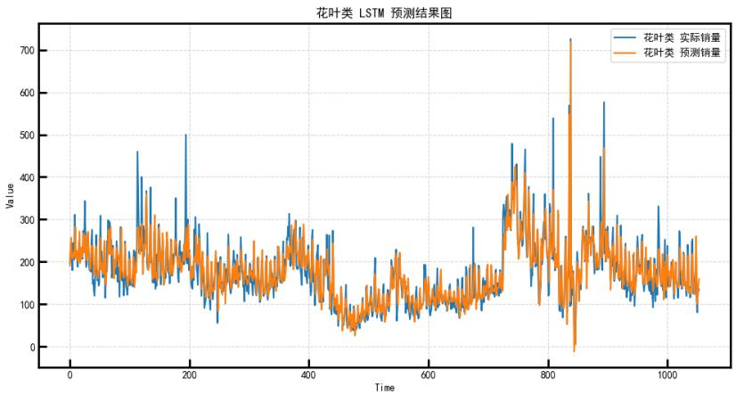

<details>
<summary>line</summary>

| Time | 花叶类 实际销量 | 花叶类 预测销量 |
| --- | --- | --- |
| 0 | ~220 | ~210 |
| 100 | ~250 | ~240 |
| 200 | ~280 | ~270 |
| 300 | ~180 | ~170 |
| 400 | ~200 | ~190 |
| 500 | ~120 | ~110 |
| 600 | ~150 | ~140 |
| 700 | ~180 | ~170 |
| 800 | ~350 | ~340 |
| 900 | ~250 | ~240 |
| 1000 | ~180 | ~170 |
</details>

图 17 花叶类预测

## 7.3 商超补货与定价策略研究

由于蔬菜类商品的进货量与销售量仅受当天商超定价策略以及消费者需求量的影响，并且消费者需求同样仅受当日客观因素的影响，因此可以认为每日销售量与盈利均为独立变量，不会产生相互影响。基于此，可将对7.1-至7.7的定价策略进行单独考虑，分别确定每日的定价与补货策略。

## 7.3.1 与定价相关的销售量修正函数确定

由 Double-log 模型回归结果可知定价对销售量会产生负相关性的影响，因此本文对 LSTM 预测出未来七天的销售量做一个修正，根据需求价格弹性的含义可知，价格变化率与销售量变化率的比值为需求价格弹性系数，因此本文参照双对数需求模型建立以下销量-定价函数：

$$
\ln Q = \ln Q _ {\text {预测值}} + E _ {p} \ln \frac {P}{P _ {\text {预测}}} \tag {7}
$$

引入定价作为外生变量后，结合 LSTM 时间序列以求得的模型对真实销量进行拟合，发现加入变量定价后，模型拟合效果较优，说明本文建立的价格弹性修正函数与求得需求价格弹性参数可靠，各品类需求弹性价格参数如下所示：

表 7 品类需求弹性参数

<table><tr><td>花叶类</td><td>花菜类</td><td>茄类</td><td>辣椒类</td><td>食用菌类</td><td>水生根茎类</td></tr><tr><td>-1.92</td><td>-0.26</td><td>-0.07</td><td>-0.029</td><td>-0.51</td><td>-0.03</td></tr></table>

## 7.3.2 收益最大的最优化模型建立

## 决策变量:

本问需要确立六种品类的定价方案以及补货量，根据成本加成定价法，只需确定六

种品类的加成率即可确定最终售价，因此确定决策变量为：

$$
\text {加成率:} w _ {i}, \quad (1 \leq i \leq 6) \tag {8}
$$

补货量： $B_{i},\quad(1\leq i\leq6)$

因此某品类的定价为:

$$
P _ {i} = (1 + w _ {i}) \times C _ {i} \tag {9}
$$

约束条件:

由于销量不可能大于进货量，因此确定约束条件：

$$
Q _ {i} \leq B _ {i} \tag {10}
$$

目标函数:

在此基础上计算该超商一天的销售金额 $M$ ，以及总成本 $T$ 为：

$$
M = \sum_ {i = 1} ^ {6} Q _ {i} \times L _ {i} \times P _ {i} \times k + Q _ {i} \times \left(1 - L _ {i}\right) \times P _ {i} \tag {11}
$$

$$
T = \sum_ {i = 1} ^ {6} B _ {I} \times C _ {i}
$$

为使商超利润最大，则目标函数为：

$$
f = M - T \tag {12}
$$

连续最优化模型

$$
m a x \quad f = M - T \tag {13}
$$

$$
\text {s.t.} \left\{ \begin{array}{l} B _ {i}, w _ {i} \quad (1 \leq i \leq 6) \\ P _ {i} = \left(1 + w _ {i}\right) \times C _ {i} \\ \ln Q = \ln Q _ {\text {预测值}} + E _ {p} \ln \frac {P}{P _ {\text {预测}}} \\ Q _ {i} \leq B _ {i} \\ M = \sum_ {i = 1} ^ {6} k Q _ {i} L _ {i} P _ {i} + \left(1 - L _ {i}\right) Q _ {i} P _ {i} \\ T = \sum_ {i = 1} ^ {6} B _ {I} \times C _ {i} \end{array} \right. \tag {14}
$$

## 7.3.3 基于改进版全局粒子群算法求解模型构建

本文采用 GBest PSO 对优化模型进行求解。GBest PSO 是标准粒子群优化算法的一种变体改进 [2]，它在全局最佳位置的概念上进行了改进，以提高算法的性能。通过调整惯性权重的值，平衡粒子的全局搜索和局部搜索能力；引入了约束因子来控制粒子速度的更新，确保粒子在搜索空间中的稳定性，减少震荡，提高收敛速度。

## 两重改进：

(a) 引入先验知识，设定 30% 的初始粒子为人为设定，70% 粒子随机生成，使得粒子群算法能够更快的收敛。  
(b) 为了在 PSO 模型中添加约束条件，本文引入罚函数：

$$
F = \left\{ \begin{array}{l l} 2 0 \times (Q _ {i} - B _ {i}), & i f \quad Q _ {i} > B _ {i} \\ 0, & i f \quad Q _ {i} \leq B _ {i} \end{array} \right. \tag {15}
$$

由于粒子群算法寻找最优解为函数最小值，因此需要对目标函数进行处理，修正后的目标函数为：

$$
f = - (M - T) + F \tag {16}
$$

## 7.4 决策模型求解结果

经过粒子群 7 轮 300 次迭代得到 7.1 至 7.7 每日收益的最大值，结果如下表：

表 8 七日收益最大值

<table><tr><td>日期</td><td>7.10</td><td>7.20</td><td>7.30</td><td>7.40</td><td>7.50</td><td>7.60</td><td>7.70</td></tr><tr><td>收益</td><td>1810.02</td><td>1802.87</td><td>1745.22</td><td>1758.42</td><td>1790.44</td><td>1794.12</td><td>1799.79</td></tr></table>

未来能够好的了解收益最大优化模型的决策效果，本文对过去三年间商超每日的收益进行分析，结果如图18所示。结果发现生鲜商超的日利润基本集中在500至2000的单位内，只有在少数情况出现极高的峰值。分析峰值出现的日期发现，利润的峰值基本集中在每年的二月份，因此可以合理推测此时为农历新年时间，受大型节日的影响，生鲜商超出现利润与销量的波动符合实际情况。

对收益数据的波动情况进行进一步的观察发现，生鲜商超的每日收益在每年的六月于十二月出会出现一个相对平缓的谷值，根据2023年六月末的数据以及往年变化趋势合理推测在一般情况下该生鲜商超在七月初的收益额约在1000至1500间波动，而采用本文中确定的补货定价方案均大于1740元，最大可达1810元，可以对收益额产生一个明显的提升效果。

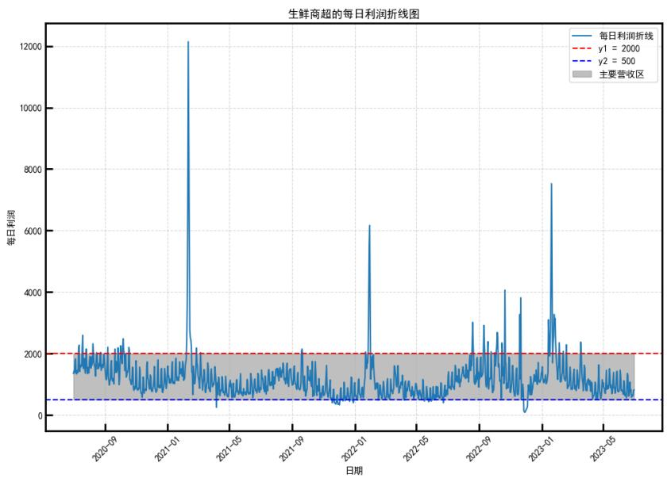

<details>
<summary>line</summary>

| 日期 | 每日利润折线 |
| --- | --- |
| 2020-09 | ~1500 |
| 2021-01 | ~12000 |
| 2021-05 | ~1000 |
| 2021-09 | ~1500 |
| 2022-01 | ~6000 |
| 2022-05 | ~1000 |
| 2022-09 | ~3000 |
| 2023-01 | ~7500 |
| 2023-05 | ~1000 |
</details>

图 18 生鲜商超每日收益折线图

商超决策结果如下所示，以 7.1 为例（详见附录 H）：

表 9 7 月 1 日商超最优决策方案

<table><tr><td></td><td>花叶类</td><td>花菜类</td><td>水生根茎类</td><td>茄类</td><td>辣椒类</td><td>食用菌</td></tr><tr><td>进货量(决策)</td><td>189.81</td><td>23.37</td><td>24.56</td><td>33.38</td><td>103.91</td><td>55.13</td></tr><tr><td>利润率(决策)</td><td>1.20</td><td>0.98</td><td>0.80</td><td>0.88</td><td>1.20</td><td>1.00</td></tr><tr><td>销售价格</td><td>7.23</td><td>15.30</td><td>21.60</td><td>8.58</td><td>8.15</td><td>8.02</td></tr><tr><td>修正之后的销量</td><td>186.49</td><td>24.14</td><td>24.53</td><td>33.08</td><td>103.43</td><td>55.10</td></tr></table>

分析结果发现相比于预测销量数据花叶类、花菜类、水生根茎类、食用菌类的销量有所降低，而茄类与辣椒类销量与预测销量相比提高的幅度较小，这恰好与茄类和辣椒类的需求价格弹性相关系数的特征相吻合，验证了模型的准确性。在六个品类中茄类与辣椒类的价格需求弹性相关系数明显低于其他品类，销量随价格的变化程度不明显。

## 八、问题三模型的建立与求解

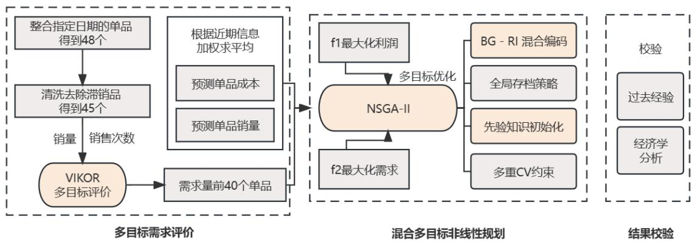

<details>
<summary>flowchart</summary>

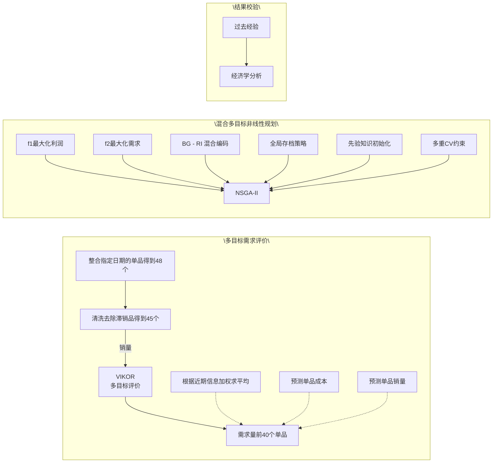
```mermaid
graph LR
  subgraph sg["\"多目标需求评价\""]
  A["整合指定日期的单品得到48个"] --> B["清洗去除滞销品得到45个"]
  B -->|"销量"| C["VIKOR\n多目标评价"]
  C --> D["需求量前40个单品"]
    E["根据近期信息加权求平均"] -.-> D
    F["预测单品成本"] -.-> D
    G["预测单品销量"] -.-> D
  end

  subgraph sg_2["\"混合多目标非线性规划\""]
  H["f1最大化利润"] --> I["NSGA-II"]
  J["f2最大化需求"] --> I
  K["BG - RI 混合编码"] --> I
  L["全局存档策略"] --> I
  M["先验知识初始化"] --> I
  N["多重CV约束"] --> I
  end

  subgraph sg_3["\"结果校验\""]
  O["过去经验"] --> P["经济学分析"]
  end
```
</details>

问题三同样是一道最优化问题，需要给出商超的补货与定价策略。但与问题二不同的是商超补货决策受到销售单品总数与最小陈列量的限制，同时需要满足保障消费者需求与提高商超收益，因此本问需要重新对每种单品的销售量与成本损耗进行预测。此外，问题二的决策变量为连续型，而问题三的决策变量为离散型 + 连续型（混合型），两问需要选择不同的优化算法求解。

## 8.1 未来 1 天相关数据的确定

## 8.1.1 单品种类的确定

根据题目要求，参照 2023 年 6 月 24 日至 6 月 30 日的可售单品确定 7 月 1 日补货单品的范围。对 6 月 24 日至 6 月 30 日有出现的单品进行整合，得到 48 个单品种类，去除七天内单品总销量小于 2.5kg 的单品，选出 45 个进行后续预测与处理。

## 8.1.2 各单品销量及成本的确定

观察最近筛选出的 45 种单品的销量，发现均存在不同程度的缺失，采用时间序列模型难以预测出良好的结果。由于单品在短时间内的销量与成本的变化无明显趋势，且无明显的变化规律，数据波动呈现随机性的特征，因此本问直接通过加权平均作为各单品在 7 月 1 日的销量与成本预测结果。

对于与定价相关的销量修正函数本问同样采用问题二中的公式7建立销量-定价函数进行拟合求参。

## 8.1.3 各单品需求度的确定

由于各单品本身特性不同，单纯从购买销量角度衡量顾客对单品的需求度可能会忽视单笔销量质量较小，但是订单购买次数较多的单品。因此本文综合考虑单品销量以及单品销售次数，采用综合评价指标评价单品的需求度。

本文采用多准则妥协解排序（VIKOR）方法对需求度进行评价：

VIKOR 方法易于实施，能够同时考虑群体效用最大化和个体遗憾最小化，具有更高的排序稳定性和可信度，设满意度为 D, 其计算过程如下所示：

\- 针对指标归一化矩阵，计算带权值的范数为 1 与范数为无穷大闵可夫斯基距离

$$
\text {群体效用:} S _ {i} = \sum_ {j = 1} ^ {m} \omega_ {j} \left(\frac {\operatorname{Max} (n _ {j}) - n _ {i j}}{\operatorname{Max} (n _ {j}) - \operatorname{Min} (n _ {j})}\right)
$$

$$
\text {个体遗憾值}: R _ {i} = \max _ {j = 1} \left(\omega_ {j} \left(\frac {\operatorname{Max} \left(n _ {j}\right) - n _ {i j}}{\operatorname{Max} \left(n _ {j}\right) - \operatorname{Min} \left(n _ {j}\right)}\right)\right)
$$

\- 计算折中指标值

$$
D _ {i} = \frac {\nu \left(S _ {i} - S ^ {*}\right)}{S ^ {-} - S ^ {*}} + \frac {(1 - \nu) \left(R _ {i} - R ^ {*}\right)}{R ^ {-} - R ^ {*}}
$$

$$
\text {其中,} \quad S ^ {*} = \min _ {1 \leq i \leq m} S _ {i}, \quad S ^ {-} = \max _ {1 \leq i \leq m} S _ {i}, \quad R ^ {*} = \min _ {1 \leq i \leq m} R _ {i}, \quad R ^ {*} = \max _ {1 \leq i \leq m} R _ {i};
$$

需求度判定结果详见支撑材料。

为了减少数据维度，同时降低明显不符合要求的单品对模型求解的干扰，本文根据需求度去除需求度排在后五位的单品，最终得到四十种单品进行决策。

## 8.2 商超补货与定价策略研究

## 8.2.1 双优化目标的决策模型建立

## 决策变量

不同于以品类为单位进行补货，筛选出的 40 种单品并不能全部进行补货，因此在第二问决策变量的基础上，还需要加入 01 变量描述单品是否有进行补货，假设 j 个单品的进货标志为 $z_{j}$ 、加成率为 $w_{j}$ 、补货量为 $B_{j}$ ：

$$
\text {进货标志:} z _ {j}, \quad (z _ {i} j \in [ 0, 1 ] \quad 1 \leq j \leq 4 0)
$$

$$
\text {加成率:} w _ {j}, \quad (1 \leq j \leq 4 0) \tag {17}
$$

$$
\text {补货量:} B _ {j}, \quad (1 \leq j \leq 4 0)
$$

## 约束条件

由于销售空间的限制，商超补货的单品数限制在 27 至 33 之间，且补货单品的最小陈列量为 2.5kg，同时总销量不能高于补货量，因此约束 1、2 为：

$$
2 7 \leq \sum_ {j = 1} ^ {4 0} z _ {j} \leq 3 3 \tag {18}
$$

$$
2. 5 \leq z _ {j} \times B _ {j} \leq Q _ {j} \tag {19}
$$

## 优化目标

计算该超商一天的销售金额 M，以及总成本 T 为：

$$
M = \sum_ {j = 1} ^ {4 0} Q _ {j} \times L _ {j} \times P _ {j} \times k + Q _ {j} \times (1 - L _ {j}) \times P _ {j} \tag {20}
$$

$$
T = \sum_ {j = 1} ^ {4 0} B _ {I} \times C _ {j}
$$

本问要求在尽量满足市场对各单品需求，并且使商超收益尽可能地大，目标函数为：

$$
\begin{array}{l} f _ {1} = M - T \\ f _ {2} = \frac {\sum_ {j = 1} ^ {4 0} z _ {j} \times D _ {J}}{\sum_ {j = 1} ^ {4 0} D _ {j}} \tag {21} \\ \end{array}
$$

混合非线性双目标优化模型总结

$$
m a x \quad f _ {1} = M - T \tag {22}
$$

$$
\text {max} \quad f _ {2} = \frac {\sum_ {j = 1} ^ {4 0} z _ {j} \times D _ {J}}{\sum_ {j = 1} ^ {4 0} D _ {j}} \tag {23}
$$

$$
\text {s.t.} \left\{ \begin{array}{l} z _ {j}, \quad \left(b _ {i} j \in [ 0, 1 ] \quad 1 \leq j \leq 4 0\right) \\ w _ {j}, B _ {j} \quad (1 \leq j \leq 4 0) \\ 2 7 \leq \sum_ {j = 1} ^ {4 0} z _ {j} \leq 3 3 \\ 2. 5 \leq z _ {j} \times B _ {j} \leq Q _ {j} \\ \ln Q = \ln Q _ {\text {预测值}} + E _ {p} \ln \frac {P}{P _ {\text {预测}}} \\ M = \sum_ {i = 1} ^ {6} k Q _ {i} L _ {i} P _ {i} + (1 - L _ {i}) Q _ {i} P _ {i} \\ T = \sum_ {j = 1} ^ {4 0} B _ {I} \times C _ {j} \end{array} \right. \tag {24}
$$

## 8.2.2 基于多目标遗传算法的最优化求解模型构建

由于本问决策变量中既含有 0-1 变量又含有连续变量，粒子群算法和传统遗传算法的性能较差，需要使用混合编码和多目标规划的优化算法。本文采用多目标遗传算法 NSGA-II，并对其加以改进。相对于传统的多目标遗传算法，NSGA-II 引入了非支配排序技术，能够将个体按照非支配性进行分级，保留多个非支配解，找到更多的高质量解；同时引入了克努森分配距离，确保前沿中的个体分布更加均匀，提高了解的多样性 [1]。算法改进说明：

- 混合编码：采用 BG 编码与 RI 编码混合编码以适应本问决策变量既有 01 变量又有连续变量的情况。  
- 先验知识：融入先验知识，指定部分初始值，加快模型收敛。  
- 全局存档：引入全局存档，保留全局最优解，避免优良种群丢失。

## 8.3 决策模型求解结果

经过 400 次迭代遗传算法输出结果如图19所示, 观察结果选取最优解为:

$$
f 1 = 1 6 6 8 6, \quad f 2 = 0. 9 6 6 7
$$

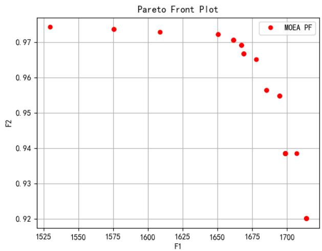

<details>
<summary>scatter</summary>

| F1 | F2 |
| --- | --- |
| ~1530 | ~0.974 |
| ~1575 | ~0.974 |
| ~1610 | ~0.973 |
| ~1650 | ~0.972 |
| ~1665 | ~0.970 |
| ~1670 | ~0.969 |
| ~1675 | ~0.967 |
| ~1680 | ~0.965 |
| ~1685 | ~0.956 |
| ~1695 | ~0.955 |
| ~1700 | ~0.938 |
| ~1705 | ~0.938 |
| ~1715 | 0.920 |
</details>

图 19 NSGA2 求解结果

此时商超选择进货的部分单品（只列出每个品类的两件单品，全部进货情况见附录D）补货量及定价策略为：

表 10 部分单品补货量及定价策略

<table><tr><td>单品名称</td><td>分类名称</td><td>利润率</td><td>进货量</td></tr><tr><td>净藕(1)</td><td>水生根茎类</td><td>1.19999825</td><td>4.46848427</td></tr><tr><td>洪湖藕带</td><td>水生根茎类</td><td>1.19375576</td><td>2.7224025</td></tr><tr><td>金针菇(盒)</td><td>食用菌</td><td>1.19406515</td><td>9.02246278</td></tr><tr><td>西峡花菇(1)</td><td>食用菌</td><td>1.19999996</td><td>3.58719345</td></tr><tr><td>紫茄子(2)</td><td>茄类</td><td>1.19065746</td><td>4.09742674</td></tr><tr><td>长线茄</td><td>茄类</td><td>0.75652509</td><td>6.43350562</td></tr><tr><td>芜湖青椒(1)</td><td>辣椒类</td><td>1.15731386</td><td>10.4345508</td></tr><tr><td>小米椒(份)</td><td>辣椒类</td><td>1.19984241</td><td>17.1600476</td></tr><tr><td>云南生菜(份)</td><td>花叶类</td><td>1.19899223</td><td>4.1002955</td></tr><tr><td>云南油麦菜(份)</td><td>花叶类</td><td>1.19946604</td><td>14.2922507</td></tr></table>

## 九、问题四模型的建立与求解

分析相关文献 [4] 可知，当前产品常用的定价方法有：成本导向定价法、竞争导向定价法、需求导向定价法。本文主要采用成本导向定价法，以商超获得经济效益最大为目标确定定价策略。尽管成本导向型定价策略最为直观便捷，但是其只从内部条件出发考虑经济效益，并不能很好适应现实的销售环境。在现实生活中与其他生鲜商超的竞争关系、消费者对商品定价的感知情况及社会经济发展水平，均会产生长远影响。因此本文兼顾成本、竞争与需求这三个重要因素给出商超制定补货和定价决策提出三点建议。

## 9.1 市场定价数据及主要竞争对手定价

在上述问题的研究中可得消费者的消费需求与某种单品的价格存在反相关。本文采用需求价格弹性刻画价格与销量的关系，但是这种函数关系建立在该商超无其他竞争对手的情况。现实生活中消费者往往会对各个生鲜商超的价格进行对比做出选择，因此某一个商超的消费需求还与市场上其他商朝的价格水平有关。

根据弹性理论可知, 交叉弹性可以衡量一种商品的需求量对另一种商品价格变化的反应程度的指标, 例如商品 y 的价格变化时, 商品 x 的需求量会产生相应的变化, 商品 x 的需求的交叉价格弧弹性公式为:

$$
E _ {c} = \frac {d Q _ {x} / Q _ {x}}{d P _ {y} / P _ {y}}
$$

当商品互为替代品时交叉弹性为正值，即一种商品的价格相对于其替代品增高时，该商品销售量会减小，在存在竞争关系的社会中，问题二中公式7还需要加上交叉弹性的影响。商超与互为竞争对手的企业所销售的产品相似，互为替代品。因此当商超需要确定定价预测销售量达到利润最大值时，还需要考虑其价格与竞争者商品的差距，以及该品类对价格变化的敏感性，对价格弹性高单品进行灵活定价，吸引更多的顾客。从而更准确的预测对销售量的影响，扩大顾客群体，寻找利润的最大值。

## 9.2 消费者的预期价格以及价格敏感度

对于消费者而言，对于一种商品价格直观的认知会对消费意愿产生更为直接的影响。部分消费者并不能完全了解市场与同类产品的定价情况，消费者对某个单品的价格预期与实际定价可能会在某些程度上更真实的反应消费意愿。

同时当一件单品价格上涨时, 通过分析计算价格预期弹性可以了解消费者对该商品价格变化的敏感度, 价格预期弹性的计算公式为:

$$
E _ {v} = \frac {d F / F}{d C / C}
$$

式中，F 表示购买者预期未来某种商品的价格，C 表示及期未来某种商品的价格。若价格预期弹性大于 1，则表明购买者预期价格提高幅度比现实大，消费者的消费意愿下降幅度可能会增大。

同时通过了解消费者的预期价格价格和对价格敏感度可以深入了解消费者的满意程度。了解消费者是否认为价格公平合理，是否愿意为产品或服务支付特定价格，分析顾客流失量与保留率。对商超长时间的销售量产生重要影响。

## 9.3 居民收入变化以及人均消费 Pchc 变化

居民粮食消费行为受到价格、预期、收入、环境的影响，其中收入是影响其消费需求的关键因素。了解本生鲜商超所在地的居民收入变化数据可以更加准确的预估总体销售量的变化情况。马歇尔函数在一定程度上表现了需求量与人均收入的关系：

$$
\begin{array}{l} \max \quad u = (x _ {1} ^ {\rho} + x _ {2} ^ {\rho}) ^ {1 / \rho} \\ \text {s.t.} Y = p 1 \times x 1 + p 2 \times x 2 \\ \end{array}
$$

x 表示商品的需求量，p 表示商品的价格，对于给定价格与收入等外部条件的情况下,Y 为一个定值。Y 随收入成上升趋势，根据函数求解结果可知，当 Y 上升时商品需求量也能呈现不同程度的上升。当人均收入增加时，消费者的购买力增强，他们更有可能购买更多的商品。

同样人均居民消费 Pchc 变化会反应居民整体的消费意愿，是居民人均收入在消费水平上更直观的体现。商超在对销售量预测时，为了能更加准确的做出决策，需要考虑居民收入对以及人均居民消费 Pchc 的整体影响。

## 十、模型鲁棒性检验

鲁棒性检验是评估模型在面对不同干扰或噪声情况下的性能稳定性和可靠性的过程。对深度学习模型而言鲁棒性检验可以帮助确定模型在输入数据变化、噪声干扰或其他不确定性因素引入时的表现。稳定的模型在不同情况下能够产生一致的结果。

为分析 LSTM 时间序列模型预测的鲁棒性，给输入时间序列一个正态分布的微小扰动，重复输出结果如下图所示

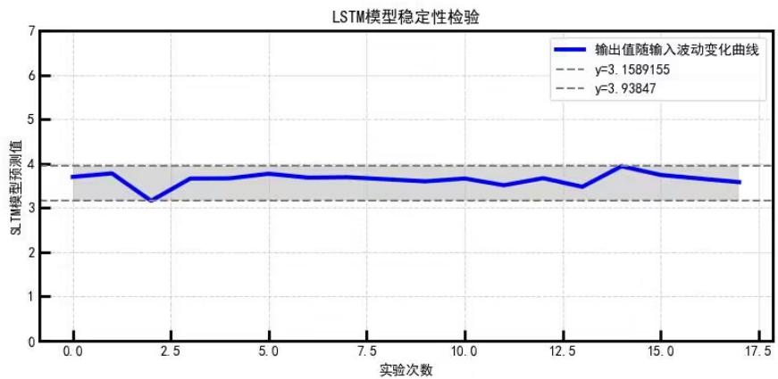

<details>
<summary>line</summary>

| 实验次数 | 输出值 (SLTM模型预测值) |
| --- | --- |
| 0.0 | ~3.7 |
| 1.25 | ~3.8 |
| 2.0 | ~3.1 |
| 3.0 | ~3.6 |
| 4.0 | ~3.6 |
| 5.0 | ~3.7 |
| 6.0 | ~3.6 |
| 7.0 | ~3.6 |
| 8.0 | ~3.6 |
| 9.0 | ~3.5 |
| 10.0 | ~3.6 |
| 11.0 | ~3.4 |
| 12.0 | ~3.6 |
| 13.0 | ~3.4 |
| 14.0 | ~3.9 |
| 15.0 | ~3.7 |
| 17.0 | ~3.5 |
</details>

图 20 LSTM 模型稳定性检验（以辣椒的成本为例）

在以往的数据中辣椒的成本范围在 2 到 18 元左右，当加入微小扰动后，输出范围在 3.16 至 3.93 元之间，波动幅度在 5% 以内，可以认为本文搭建的 LSTM 模型具有一定的鲁棒性，对干扰变化并不明显。

## 十一、优缺点分析

## 11.1 模型优点

1. 在问题一中对数据出现的信息与规律进行现实意义的解释说明，对数据进行更本质的分析；  
2. 参考大量相关领域的文献，选取恰当的经济学模型对数据进行分析预测，引入外生变量对时间序列预测进行优化，采用双对数需求模型对预测销量进行修正；  
3. 基于数据特征选择合适的优化模型，建立改进版全局粒子群算法求解模型以及多目标遗传算法求解模型，时先进的算法技术更好的贴合题目信息；  
4. 问题四不局限于关注商超内部因素对自身发展的影响，而是基于商超与社会、与竞争对手、与顾客之间的关系对商朝的长期发展提供有效的建议。

## 11.2 模型缺点

1. 问题二预测销量时，仅考虑自身价格变动对销量产生的影响，未考虑其替代品与互补品价格变动产生的影响，应同时考虑商品销量的交叉价格弹性；

## 参考文献

[1] Kalyanmoy Deb, Samir Agrawal, Amrit Pratap, and et al. A fast and elitist multiobjective genetic algorithm: Nsga-ii. IEEE Transactions on Evolutionary Computation, 6(2), 2002.  
[2] J. Kennedy and R.C. Eberhart. Particle swarm optimization. In Proceedings of the IEEE International Joint Conference on Neural Networks, pages 1942–1948, 1995.  
[3] 姚志 and 何蒲明. 中国农村居民粮食消费需求及弹性测算. 统计与决策, 36(03):52-56, 2020.  
[4] 毛莉莎. 供应链视角下蔬菜批发市场定价策略及产销模式研究. 2023.

附录 A 支撑材料文件列表

<table><tr><td>文件名</td><td>类型</td><td>简介</td></tr><tr><td>data_class.py</td><td>python 代码文件</td><td>蔬菜分类代码</td></tr><tr><td>data_clean.py</td><td>python 代码文件</td><td>数据清洗代码</td></tr><tr><td>data_select.py</td><td>python 代码文件</td><td>数据筛选代码</td></tr><tr><td>description.py</td><td>python 代码文件</td><td>描述性统计代码</td></tr><tr><td>double_log.py</td><td>python 代码文件</td><td>双对数模型回归代码</td></tr><tr><td>find_price_seal.py</td><td>python 代码文件</td><td>数据探索性分析代码</td></tr><tr><td>lstm.py</td><td>python 代码文件</td><td>LSTM 模型实现代码</td></tr><tr><td>main.py</td><td>python 代码文件</td><td>数据探索性分析及描述代码</td></tr><tr><td>nsga_ii.py</td><td>python 代码文件</td><td>NSGAII 优化算法实现代码</td></tr><tr><td>question3.py</td><td>python 代码文件</td><td>问题三数据整理代码</td></tr><tr><td>single_ana.py</td><td>python 代码文件</td><td>单品销售量的分布规律及相互关系探究代码</td></tr><tr><td>spo.py</td><td>python 代码文件</td><td>粒子群优化算法实现代码</td></tr><tr><td>strmatch.py</td><td>python 代码文件</td><td>单品名称字符串匹配代码</td></tr><tr><td>time_series.py</td><td>python 代码文件</td><td>时间序列分解实现代码</td></tr><tr><td>关联分析.docx</td><td>SPSSPRO 输出文件</td><td>关联分析输出结果</td></tr><tr><td>线性回归(1).docx</td><td>SPSSPRO 输出文件</td><td>双对数模型回归结果</td></tr><tr><td>线性回归(2).docx</td><td>SPSSPRO 输出文件</td><td>双对数模型回归结果</td></tr><tr><td>线性回归(3).docx</td><td>SPSSPRO 输出文件</td><td>双对数模型回归结果</td></tr><tr><td>线性回归(4).docx</td><td>SPSSPRO 输出文件</td><td>双对数模型回归结果</td></tr><tr><td>线性回归(5).docx</td><td>SPSSPRO 输出文件</td><td>双对数模型回归结果</td></tr><tr><td>线性回归(6).docx</td><td>SPSSPRO 输出文件</td><td>双对数模型回归结果</td></tr><tr><td>问题三备选单品.xlsx</td><td>数据预处理文件</td><td>问题三中决策的备选单品数据</td></tr><tr><td>数据探索性分析.xlsx</td><td>数据预处理文件</td><td>原始数据的探索性分析</td></tr><tr><td>单品分类结果.xlsx</td><td>数据分析结果文件</td><td>单品分类结果</td></tr></table>

附录 B LSTM 对成本预测结果

<table><tr><td>日期</td><td>7.1</td><td>7.2</td><td>7.3</td><td>7.4</td><td>7.5</td><td>7.6</td><td>7.7</td></tr><tr><td>花叶类</td><td>3.29</td><td>3.29</td><td>3.29</td><td>3.29</td><td>3.29</td><td>3.30</td><td>3.29</td></tr><tr><td>花菜类</td><td>7.74</td><td>7.76</td><td>7.81</td><td>7.79</td><td>7.75</td><td>7.81</td><td>7.76</td></tr><tr><td>水生根茎类</td><td>12.02</td><td>11.91</td><td>12.03</td><td>11.94</td><td>11.92</td><td>12.12</td><td>11.97</td></tr><tr><td>茄类</td><td>4.56</td><td>4.60</td><td>4.55</td><td>4.55</td><td>4.53</td><td>4.54</td><td>4.60</td></tr><tr><td>辣椒类</td><td>3.71</td><td>3.66</td><td>3.66</td><td>3.68</td><td>3.67</td><td>3.68</td><td>3.65</td></tr><tr><td>食用菌</td><td>4.02</td><td>4.08</td><td>4.03</td><td>4.08</td><td>4.04</td><td>4.02</td><td>4.06</td></tr></table>

附录 C LSTM 对销量预测结果

<table><tr><td>日期</td><td>7.1</td><td>7.2</td><td>7.3</td><td>7.4</td><td>7.5</td><td>7.6</td><td>7.7</td></tr><tr><td>花叶类</td><td>190.76</td><td>189.94</td><td>189.23</td><td>190.35</td><td>189.09</td><td>188.56</td><td>190.11</td></tr><tr><td>花菜类</td><td>28.62</td><td>28.87</td><td>28.87</td><td>28.74</td><td>28.78</td><td>28.87</td><td>28.66</td></tr><tr><td>水生根茎类</td><td>26.96</td><td>27.81</td><td>27.65</td><td>27.21</td><td>27.88</td><td>27.76</td><td>27.24</td></tr><tr><td>茄类</td><td>32.30</td><td>31.80</td><td>32.43</td><td>31.65</td><td>31.68</td><td>31.38</td><td>31.97</td></tr><tr><td>辣椒类</td><td>102.15</td><td>101.68</td><td>102.02</td><td>102.56</td><td>102.08</td><td>102.73</td><td>4.06</td></tr><tr><td>食用菌</td><td>56.31</td><td>57.40</td><td>58.13</td><td>56.81</td><td>56.46</td><td>57.19</td><td>57.95</td></tr></table>

附录 D 7 月 1 日单品补货量及定价策略

<table><tr><td>单品名称</td><td>分类名称</td><td>利润率</td><td>进货量</td></tr><tr><td>净藕(1)</td><td>水生根茎类</td><td>1.1999983</td><td>4.4684843</td></tr><tr><td>洪湖藕带</td><td>水生根茎类</td><td>1.1937558</td><td>2.7224025</td></tr><tr><td>高瓜(1)</td><td>水生根茎类</td><td>1.1969269</td><td>2.5694186</td></tr><tr><td>高瓜(2)</td><td>水生根茎类</td><td>1.1989785</td><td>3.3118241</td></tr><tr><td>金针菇(盒)</td><td>食用菌</td><td>1.1940652</td><td>9.0224628</td></tr><tr><td>西峡花菇(1)</td><td>食用菌</td><td>1.2</td><td>3.5871935</td></tr><tr><td>双孢菇(盒)</td><td>食用菌</td><td>1.1950486</td><td>7.1308823</td></tr></table>

Continued on next page

<table><tr><td>单品名称</td><td>分类名称</td><td>利润率</td><td>进货量</td></tr><tr><td>海鲜菇(包)</td><td>食用菌</td><td>0.9100539</td><td>4.01525</td></tr><tr><td>紫茄子(2)</td><td>茄类</td><td>1.1906575</td><td>4.0974267</td></tr><tr><td>长线茄</td><td>茄类</td><td>0.7565251</td><td>6.4335056</td></tr><tr><td>芜湖青椒(1)</td><td>辣椒类</td><td>1.1573139</td><td>10.434551</td></tr><tr><td>小米椒(份)</td><td>辣椒类</td><td>1.1998424</td><td>17.160048</td></tr><tr><td>螺丝椒(份)</td><td>辣椒类</td><td>1.1822684</td><td>5.0326392</td></tr><tr><td>小皱皮(份)</td><td>辣椒类</td><td>1.0736568</td><td>6.0000298</td></tr><tr><td>螺丝椒</td><td>辣椒类</td><td>1.1757303</td><td>4.3256812</td></tr><tr><td>姜蒜小米椒组合装(小份)</td><td>辣椒类</td><td>1.1314702</td><td>5.603787</td></tr><tr><td>红椒(2)</td><td>辣椒类</td><td>1.1767554</td><td>2.5761036</td></tr><tr><td>七彩椒(2)</td><td>辣椒类</td><td>1.1811276</td><td>2.5473168</td></tr><tr><td>云南生菜(份)</td><td>花叶类</td><td>1.1989922</td><td>4.1002955</td></tr><tr><td>云南油麦菜(份)</td><td>花叶类</td><td>1.199466</td><td>14.292251</td></tr><tr><td>竹叶菜</td><td>花叶类</td><td>0.6886801</td><td>10.51447</td></tr><tr><td>苋菜</td><td>花叶类</td><td>1.0366075</td><td>4.0608702</td></tr><tr><td>娃娃菜</td><td>花叶类</td><td>1.1919795</td><td>3.0106372</td></tr><tr><td>奶白菜</td><td>花叶类</td><td>1.1954072</td><td>6.9103183</td></tr><tr><td>木耳菜</td><td>花叶类</td><td>0.9852141</td><td>4.1342185</td></tr><tr><td>小青菜(1)</td><td>花叶类</td><td>1.1798374</td><td>6.0965642</td></tr><tr><td>菠菜(份)</td><td>花叶类</td><td>1.1999989</td><td>2.6720992</td></tr><tr><td>红薯尖</td><td>花叶类</td><td>0.6411419</td><td>3.5567912</td></tr><tr><td>上海青</td><td>花叶类</td><td>1.179598</td><td>2.9094884</td></tr><tr><td>云南生菜</td><td>花叶类</td><td>1.1999292</td><td>2.8542299</td></tr><tr><td>菠菜</td><td>花叶类</td><td>1.1564346</td><td>2.8045198</td></tr><tr><td>西兰花</td><td>花菜类</td><td>1.1833879</td><td>8.1387696</td></tr><tr><td>枝江青梗散花</td><td>花菜类</td><td>1.1815719</td><td>2.5205245</td></tr></table>

附录 E 频繁项集

<table><tr><td>项名</td><td>支持度</td><td>项的长度</td></tr><tr><td>(102900005116714.0)</td><td>0.992</td><td>1</td></tr><tr><td>(102900005116899.0)</td><td>0.974</td><td>1</td></tr><tr><td>(102900005116714.0、102900005116899.0)</td><td>0.967</td><td>2</td></tr><tr><td>(102900005116257.0)</td><td>0.942</td><td>1</td></tr><tr><td>(102900005116257.0、102900005116714.0)</td><td>0.935</td><td>2</td></tr><tr><td>(102900005116257.0、102900005116899.0)</td><td>0.927</td><td>2</td></tr><tr><td>(102900005116257.0、102900005116714.0、102900005116899.0)</td><td>0.921</td><td>3</td></tr><tr><td>(102900005115823.0)</td><td>0.847</td><td>1</td></tr><tr><td>(102900005116257.0、102900005115823.0)</td><td>0.843</td><td>2</td></tr><tr><td>(102900005116714.0、102900005115823.0)</td><td>0.841</td><td>2</td></tr><tr><td>(102900005116899.0、102900005115823.0)</td><td>0.837</td><td>2</td></tr><tr><td>(102900005116257.0、102900005116714.0、102900005115823.0)</td><td>0.837</td><td>3</td></tr><tr><td>(102900051010455.0)</td><td>0.833</td><td>1</td></tr><tr><td>(102900005116257.0、102900005116899.0、102900005115823.0)</td><td>0.833</td><td>3</td></tr><tr><td>(102900005116714.0、102900005116899.0、102900005115823.0)</td><td>0.831</td><td>3</td></tr></table>

附录 F 关联规则

<table><tr><td>前项</td><td>后项</td><td>前项支持者</td><td>后项支持者</td><td>总支持者</td><td>置信度</td></tr><tr><td>(102900005115823.0)</td><td>(102900005116257.0)</td><td>0.847</td><td>0.942</td><td>0.843</td><td>0.996</td></tr><tr><td>(102900005116714.0、102900005115823.0)</td><td>(102900005116257.0)</td><td>0.841</td><td>0.942</td><td>0.837</td><td>0.996</td></tr><tr><td>(102900005116899.0、102900005115823.0)</td><td>(102900005116257.0)</td><td>0.837</td><td>0.942</td><td>0.833</td><td>0.996</td></tr><tr><td>(102900005116714.0、102900005116899.0、102900005115823.0)</td><td>(102900005116257.0)</td><td>0.831</td><td>0.942</td><td>0.828</td><td>0.996</td></tr><tr><td>(102900005116899.0、102900005115823.0)</td><td>(102900005116714.0)</td><td>0.837</td><td>0.992</td><td>0.831</td><td>0.993</td></tr></table>

Continued on next page

<table><tr><td>前项</td><td>后项</td><td>前项支持者</td><td>后项支持者</td><td>总支持者</td><td>置信度</td></tr><tr><td>(102900005116257.0、102900005116899.0、102900005115823.0)</td><td>(102900005116714.0)</td><td>0.833</td><td>0.992</td><td>0.828</td><td>0.993</td></tr><tr><td>(102900005116899.0、102900051010455.0)</td><td>(102900005116714.0)</td><td>0.812</td><td>0.992</td><td>0.806</td><td>0.993</td></tr><tr><td>(102900005116257.0、102900005116899.0)</td><td>(102900005116714.0)</td><td>0.927</td><td>0.992</td><td>0.921</td><td>0.993</td></tr><tr><td>(102900005116899.0)</td><td>(102900005116714.0)</td><td>0.974</td><td>0.992</td><td>0.967</td><td>0.992</td></tr><tr><td>(102900005115823.0)</td><td>(102900005116714.0)</td><td>0.847</td><td>0.992</td><td>0.841</td><td>0.992</td></tr><tr><td>(102900005116257.0、102900005115823.0)</td><td>(102900005116714.0)</td><td>0.843</td><td>0.992</td><td>0.837</td><td>0.992</td></tr><tr><td>(102900051010455.0)</td><td>(102900005116714.0)</td><td>0.833</td><td>0.992</td><td>0.827</td><td>0.992</td></tr><tr><td>(102900005116257.0)</td><td>(102900005116714.0)</td><td>0.942</td><td>0.992</td><td>0.935</td><td>0.992</td></tr><tr><td>(102900005116714.0、102900005115823.0)</td><td>(102900005116899.0)</td><td>0.841</td><td>0.974</td><td>0.831</td><td>0.989</td></tr><tr><td>(102900005116257.0、102900005116714.0、102900005115823.0)</td><td>(102900005116899.0)</td><td>0.837</td><td>0.974</td><td>0.828</td><td>0.989</td></tr><tr><td>(102900005115823.0)</td><td>(102900005116899.0)</td><td>0.847</td><td>0.974</td><td>0.837</td><td>0.988</td></tr><tr><td>(102900005116257.0、102900005115823.0)</td><td>(102900005116899.0)</td><td>0.843</td><td>0.974</td><td>0.833</td><td>0.988</td></tr><tr><td>(102900005116257.0、102900005116714.0)</td><td>(102900005116899.0)</td><td>0.935</td><td>0.974</td><td>0.921</td><td>0.985</td></tr><tr><td>(102900005116257.0)</td><td>(102900005116899.0)</td><td>0.942</td><td>0.974</td><td>0.927</td><td>0.984</td></tr><tr><td>(102900005116714.0、102900051010455.0)</td><td>(102900005116899.0)</td><td>0.827</td><td>0.974</td><td>0.806</td><td>0.975</td></tr><tr><td>(102900005116714.0)</td><td>(102900005116899.0)</td><td>0.992</td><td>0.974</td><td>0.967</td><td>0.975</td></tr><tr><td>(102900051010455.0)</td><td>(102900005116899.0)</td><td>0.833</td><td>0.974</td><td>0.812</td><td>0.975</td></tr></table>

## 附录 G LSTM 预测各品类销量结果


<details>
<summary>line</summary>

| Time | 花叶类 实际销量 | 花叶类 预测销量 |
| --- | --- | --- |
| 0 | ~200 | ~200 |
| 100 | ~250 | ~250 |
| 200 | ~250 | ~250 |
| 300 | ~150 | ~150 |
| 400 | ~200 | ~200 |
| 500 | ~100 | ~100 |
| 600 | ~150 | ~150 |
| 700 | ~250 | ~250 |
| 800 | ~350 | ~350 |
| 900 | ~250 | ~250 |
| 1000 | ~200 | ~200 |
</details>

图 21 花叶类 LSTM

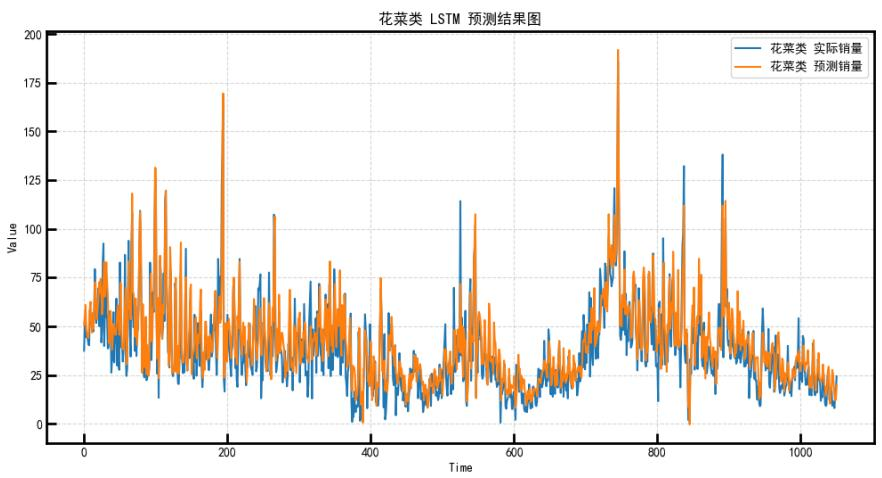

<details>
<summary>line</summary>

| Time | 花菜类 实际销量 | 花菜类 预测销量 |
| --- | --- | --- |
| 0 | ~45 | ~60 |
| 200 | ~85 | ~170 |
| 400 | ~10 | ~10 |
| 600 | ~10 | ~15 |
| 800 | ~95 | ~110 |
| 1000 | ~20 | ~25 |
</details>

图 22 花菜类 LSTM

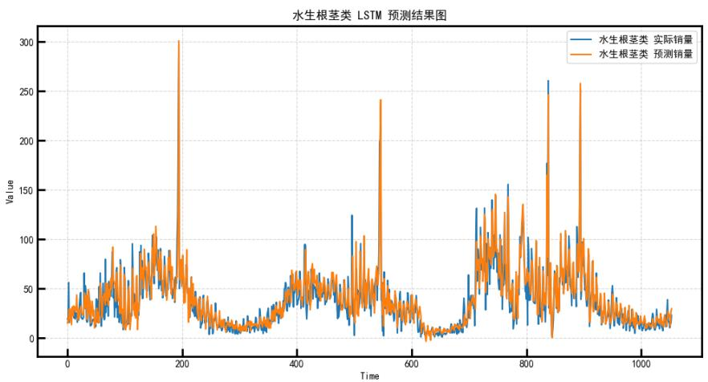

<details>
<summary>line</summary>

| Time | 水生根茎类 实际销量 | 水生根茎类 预测销量 |
| --- | --- | --- |
| 0 | ~25 | ~20 |
| 200 | ~80 | ~300 |
| 400 | ~60 | ~60 |
| 600 | ~10 | ~10 |
| 800 | ~100 | ~100 |
| 1000 | ~20 | ~20 |
</details>

图 23 水生根茎类 LSTM

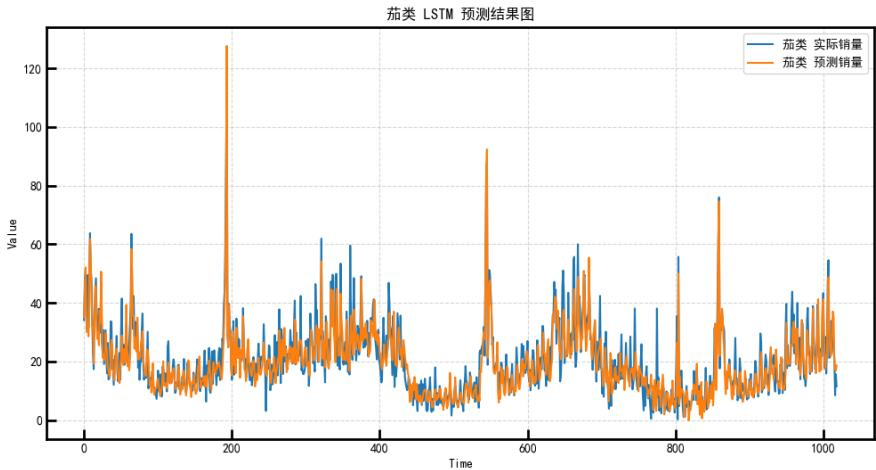

<details>
<summary>line</summary>

| Time | 茄类 实际销量 | 茄类 预测销量 |
| --- | --- | --- |
| 0 | ~35 | ~35 |
| 200 | ~25 | ~130 |
| 400 | ~30 | ~30 |
| 550 | ~25 | ~92 |
| 600 | ~20 | ~20 |
| 800 | ~10 | ~10 |
| 850 | ~75 | ~75 |
| 1000 | ~10 | ~10 |
</details>

图 24 茄类 LSTM

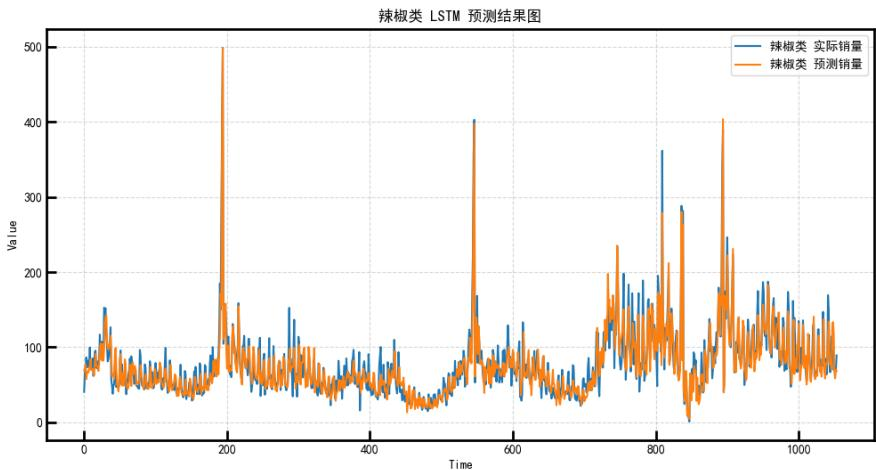

<details>
<summary>line</summary>

| Time | 辣椒类 实际销量 | 辣椒类 预测销量 |
| --- | --- | --- |
| 0 | ~70 | ~70 |
| 200 | ~180 | ~500 |
| 400 | ~60 | ~60 |
| 550 | ~170 | ~400 |
| 800 | ~360 | ~280 |
| 900 | ~250 | ~400 |
| 1000 | ~170 | ~170 |
</details>

图 25 辣椒类 LSTM

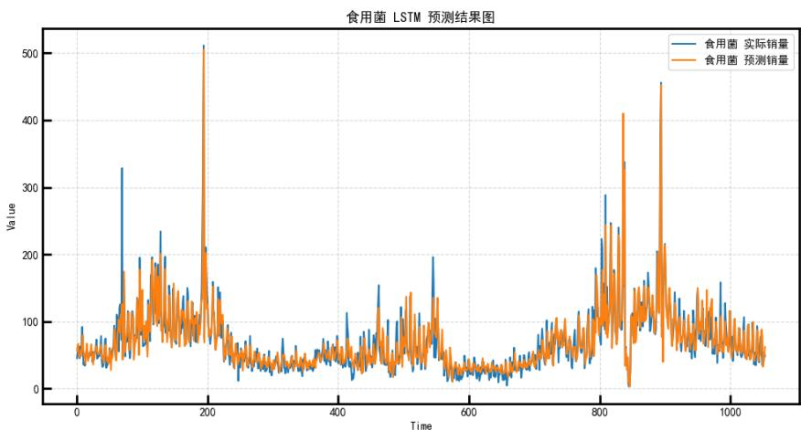

<details>
<summary>line</summary>

| Time | 食用菌 实际销量 | 食用菌 预测销量 |
| --- | --- | --- |
| 0 | ~50 | ~60 |
| 100 | ~330 | ~180 |
| 200 | ~510 | ~510 |
| 400 | ~50 | ~50 |
| 600 | ~20 | ~30 |
| 800 | ~290 | ~250 |
| 900 | ~460 | ~460 |
| 1000 | ~160 | ~150 |
</details>

图 26 食用菌 LSTM

## 附录 H 第二题定价和补货策略

表 14 7 月 1 日定价与补货策略

<table><tr><td>指标</td><td>花叶类</td><td>花菜类</td><td>根茎类</td><td>茄类</td><td>辣椒类</td><td>食用菌</td></tr><tr><td>进货量(变量)</td><td>189.81</td><td>23.37</td><td>24.56</td><td>33.38</td><td>103.91</td><td>55.13</td></tr><tr><td>利润率(变量)</td><td>1.20</td><td>0.98</td><td>0.80</td><td>0.88</td><td>1.20</td><td>1.00</td></tr></table>

表 15 7 月 2 日定价与补货策略

<table><tr><td>指标</td><td>花叶类</td><td>花菜类</td><td>根茎类</td><td>茄类</td><td>辣椒类</td><td>食用菌</td></tr><tr><td>进货量(变量)</td><td>186.08</td><td>24.03</td><td>25.50</td><td>34.46</td><td>106.21</td><td>56.37</td></tr><tr><td>利润率(变量)</td><td>1.20</td><td>0.97</td><td>0.80</td><td>0.85</td><td>1.20</td><td>0.99</td></tr></table>

表 16 7 月 3 日定价与补货策略

<table><tr><td>指标</td><td>花叶类</td><td>花菜类</td><td>根茎类</td><td>茄类</td><td>辣椒类</td><td>食用菌</td></tr><tr><td>进货量(变量)</td><td>185.61</td><td>24.35</td><td>22.16</td><td>43.30</td><td>103.70</td><td>57.76</td></tr><tr><td>利润率(变量)</td><td>1.20</td><td>0.97</td><td>0.80</td><td>0.77</td><td>1.20</td><td>1.00</td></tr></table>

表 17 7 月 4 日定价与补货策略

<table><tr><td>指标</td><td>花叶类</td><td>花菜类</td><td>根茎类</td><td>茄类</td><td>辣椒类</td><td>食用菌</td></tr><tr><td>进货量(变量)</td><td>186.78</td><td>24.31</td><td>25.09</td><td>45.03</td><td>103.77</td><td>55.78</td></tr><tr><td>利润率(变量)</td><td>1.20</td><td>0.94</td><td>0.78</td><td>0.89</td><td>1.20</td><td>0.99</td></tr></table>

表 18 7 月 5 日定价与补货策略

<table><tr><td>指标</td><td>花叶类</td><td>花菜类</td><td>根茎类</td><td>茄类</td><td>辣椒类</td><td>食用菌</td></tr><tr><td>进货量(变量)</td><td>185.97</td><td>25.97</td><td>24.77</td><td>32.30</td><td>103.44</td><td>55.75</td></tr><tr><td>利润率(变量)</td><td>1.20</td><td>0.98</td><td>0.78</td><td>0.87</td><td>1.20</td><td>0.98</td></tr></table>

表 19 7 月 6 日定价与补货策略

<table><tr><td>指标</td><td>花叶类</td><td>花菜类</td><td>根茎类</td><td>茄类</td><td>辣椒类</td><td>食用菌</td></tr><tr><td>进货量(变量)</td><td>184.73</td><td>23.97</td><td>25.24</td><td>32.81</td><td>105.30</td><td>61.69</td></tr><tr><td>利润率(变量)</td><td>1.20</td><td>0.97</td><td>0.79</td><td>0.90</td><td>1.20</td><td>0.98</td></tr></table>

表 20 7 月 7 日定价与补货策略

<table><tr><td>指标</td><td>花叶类</td><td>花菜类</td><td>根茎类</td><td>茄类</td><td>辣椒类</td><td>食用菌</td></tr><tr><td>进货量(变量)</td><td>187.51</td><td>24.31</td><td>24.81</td><td>35.24</td><td>103.97</td><td>58.03</td></tr><tr><td>利润率(变量)</td><td>1.20</td><td>0.97</td><td>0.80</td><td>0.81</td><td>1.20</td><td>1.00</td></tr></table>

表 21 每日总利润

<table><tr><td>日期</td><td>总利润</td></tr><tr><td>7月1日</td><td>1810.0229504449542</td></tr><tr><td>7月2日</td><td>1802.8689165370076</td></tr><tr><td>7月3日</td><td>1745.2188075578458</td></tr><tr><td>7月4日</td><td>1758.4150069946324</td></tr><tr><td>7月5日</td><td>1790.4355304439705</td></tr><tr><td>7月6日</td><td>1794.1248918808792</td></tr><tr><td>7月7日</td><td>1799.794480480253</td></tr></table>

## 附录Ⅰ蔬菜分类代码

```python
""""
该程序用于蔬菜水果的分类（按照时间）
分类数据来源：进货数据
类别：
- 常年可供应的蔬菜和水果：这些产品几乎整年都可以获得
判断标准：一年中销售天数大于 300 天 共计 30 个
- 季节性蔬菜和水果：这些产品在特定的季节内生长和销售，受气候和地理条件的影响。
判断标准：其他 共计 151 个
- 时令蔬菜和水果：这些产品在某些特定的节日或假期季节内销售。
判断标准：一年中销售天数小于 15 天 共计 70 个
""""

#################### 季节性蔬菜和水果 统计 #########
import pandas as pd
import matplotlib.pyplot as plt
plt.rcParams['font.sans-serif'] = [u'simHei']
plt.rcParams['axes.unicode_minus'] = False

csv_file = 'data/附件 1.csv'
df_1 = pd.read_csv(csv_file)
```

```python
csv_file = 'data/附件 3.csv'
df = pd.read_csv(csv_file)

df['日期'] = pd.to_datetime(df['日期'])
df['月份'] = df['日期'].dt.month
# 分品类
mapping_dict = df_1.set_index('单品编码')['分类名称'].to_dict()
df['品类'] = df['单品编码'].map(mapping_dict)
print(df.head(5))

grouped = df.groupby('单品编码')
result = {}

for name, group in grouped:
    unique_months = group['月份'].unique()
    total_months = len(unique_months)
    season = []
    season_list = [0]*4
    if 3 in unique_months or 4 in unique_months or 5 in unique_months:
        season.append(" 春季")
        season_list[0] = 1
    if 6 in unique_months or 7 in unique_months or 8 in unique_months:
        season.append(" 夏季")
        season_list[1] = 1
    if 9 in unique_months or 10 in unique_months or 11 in unique_months:
        season.append(" 秋季")
        season_list[2] = 1
    if 12 in unique_months or 1 in unique_months or 2 in unique_months:
        season.append(" 冬季")
        season_list[3] = 1
    result[name] = {
        '出现的月份': unique_months,
        '总共出现的月份数': total_months,
        '出现的季节': season,
        " 季节数": len(season),
        " 季节列表": season_list
    }

count_all = 0
count_all_list = []
for key, value in result.items():
    if value['季节数'] == 4:
        count_all += 1
        count_all_list.append(key)
    # print(f" 单品编码 {key} 出现在以下月份: {'', '.join(map(str, value['出现的月份']))}, 总共
    ↦ 出现的月份数: {value['总共出现的月份数']}, 出现在 {value['出现的季节']}")
```

```python
print(count_all)
print(count_all_list)

####################### 常年可供应的蔬菜和水果 时令蔬菜和水果 统计 ##########
df['年份'] = df['日期'].dt.year

result = df.groupby(['单品编码', '年份']).agg({'日期': 'nunique'}).reset_index()
result.rename(columns={'日期': '天数'}, inplace=True)

#print(result)

max_days = result.groupby('单品编码')['天数'].max().reset_index()
# print(max_days)
plt.hist(max_days['天数'], bins=35, edgecolor='k')  # 可自行调整 bins 参数来设置柱子数量
plt.xlabel('天数')
plt.ylabel('频数')
plt.title('天数分布直方图')
plt.show()
filtered_df = max_days[max_days['天数'] <= 15]
cnt = 0
cnt_list = []
for index, row in filtered_df.iterrows():
    cnt_list.append(row['单品编码'])
    print(f" 单品编码: {row['单品编码']}, 一年最多出现{row['天数']}天")
    cnt += 1
print(cnt)
```

## 附录 J 数据清洗代码

""

该程序用于数据的预处理中的数据清洗工作：

1: 没有销量的单品不予分析

总计：251 剔除：5 剩余：246

2: 销售天数少（阈值 1）且 销量低（阈值 2）的单品不予分析

阈值 1: 少于或等于 10 天

阈值 2: 销量占比低于万分之 0.3

总计：246 剔除：48 剩余：198

"""

import pandas as pd

import matplotlib.pyplot as plt

plt.rcParams['font.sans-serif'] = [u'simHei']

```python
plt.rcParams['axes.unicode_minus'] = False

# 数据读入
csv_file = 'data/附件 1.csv'
df_1 = pd.read_csv(csv_file)
csv_file = 'data/附件 2.csv'
df = pd.read_csv(csv_file)

# 将指定列转换为时间序列
df['销售日期'] = pd.to_datetime(df['销售日期'])
df['扫码销售时间'] = pd.to_datetime(df['销售日期'].astype(str) + ' ' + df['扫码销售时
↔ 间'],errors='coerce',format='%Y-%m-%d %H:%M:%S.%f')
# 计算销售金额
df['销售金额'] = df['销量 (千克)'] * df['销售单价 (元/千克)'
# 分品类
mapping_dict = df_1.set_index('单品编码')['分类名称'].to_dict()
df['品类'] = df['单品编码'].map(mapping_dict)
print(df.head(5))

####### 第一步: 处理没有销量的数据  ###
unique_values_df = df['单品编码'].unique()
unique_values_df_1 = df_1['单品编码'].unique()
values_only_in_df_1 = set(unique_values_df_1) - set(unique_values_df)
count_values_only_in_df_1 = len(values_only_in_df_1)

print("df 列'单品编码'的唯一值个数: ", len(unique_values_df))
print("df_1 列'单品编码'的唯一值个数: ", len(unique_values_df_1))
print("df_1 中有但是 df 中没有的值: ", values_only_in_df_1)
print(" 这些值的个数: ", count_values_only_in_df_1)  # 5

####### 第二步: 销售天数少 (阈值 1) 的单品找出来  ###
threshold_1 = 10

import numpy as np
from matplotlib.cm import ScalarMappable

result = df.groupby('单品编码')['销售日期'].nunique().reset_index()
result.rename(columns={'销售日期': '销售天数'}, inplace=True)

hist, bins = np.histogram(result['销售天数'], bins=10)
bin_centers = 0.5 * (bins[:-1] + bins[1:])
cmap = plt.cm.coolwarm
norm = plt.Normalize(vmin=min(hist), vmax=max(hist))
```

```python
colors = cmap(norm(hist))
plt.figure(figsize=(8,6))
bars = plt.bar(bin_centers, hist, width=bins[1] - bins[0], color=colors, edgecolor='k',
    alpha=0.7)

for i, count in enumerate(hist):
    plt.text(bin_centers[i], count + 5, str(count), ha='center', va='bottom')

plt.xlabel('销售天数')
plt.ylabel('单品数')
plt.title('销售天数分布直方图')
plt.grid(True)

sm = ScalarMappable(cmap=cmap, norm=norm)
sm.set_array([])
cbar = plt.colorbar(sm, ax=plt.gca(), orientation='vertical')
cbar.set_label('计数', rotation=90, labelpad=15)
plt.show()

# for index, row in result.iterrows():
#     print(f'{index} 单品编码: {row[" 单品编码"]}, 销售天数: {row[" 销售天数"]}')
filtered_result = result[result['销售天数'] <= threshold_1]
count = filtered_result.shape[0]
#print(f" 销售天数小于等于 {threshold_1} 的单品编码和数量:")
list_1 = []
for index, row in filtered_result.iterrows():
    if row[" 销售天数"] <= threshold_1:
        list_1.append(row[" 单品编码"])
print(f'\n阈值为{threshold_1}时被筛除的单品数量: {count}')
print(" 分别是:")
print(list_1)

threshold_2 = 0.00003

####### 第三步: 销量低 (阈值 2) 的单品找出来  ###
grouped = df.groupby('单品编码')['销量 (千克)'].sum().reset_index()
print(len(grouped))
total_sales = grouped['销量 (千克)'].sum()
grouped['销量占比'] = grouped['销量 (千克)'] / total_sales
low_percentage_groups = grouped[grouped['销量占比'] < threshold_2]['单品编码']

list_2 = low_percentage_groups.to_list()
print("\n所有组的销量总和:", total_sales)
print(f" 销量占比低于{threshold_2}的组的单品编码:")
print(list_2)
```

```python
print(f" 总数是: {len(low_percentage_groups)}")

data_g = []
for i in grouped['销量占比']:
    if i <= threshold_2:
        data_g.append(i)

bins = 10
n, bins, patches = plt.hist(data_g, bins=bins, edgecolor='k')
plt.xlabel('销量占比')
plt.ylabel('频数')
plt.title('销量占比直方图')
plt.grid()
for i, rect in enumerate(patches):
    height = rect.get_height()
    plt.annotate(f'{height}', xy=(rect.get_x() + rect.get_width() / 2, height),
            xytext=(0, 5), textcoords='offset points',
            ha='center', va='bottom')
plt.show()

####################### 第四步: 取交集 ##########
# 将列表转换为集合, 然后取交集
intersection = list(set(list_1) & set(list_2))
print(f"\n交集数量为: {len(intersection)}")
print(intersection)

####################### 第五步: 查看 #######
# 选择特定的单品编码
target_item = intersection[1]
grouped = df.groupby(['单品编码', '销售日期'])['销量 (千克)'].sum().reset_index()
filtered_df = grouped[grouped['单品编码'] == target_item]
print(filtered_df)

# 绘制折线图
plt.figure(figsize=(10, 6))
plt.plot(filtered_df['销售日期'], filtered_df['销量 (千克)'], marker='o', linestyle='-')
plt.title(f'单品编码 {target_item} 的销售日期和销量折线图')
plt.xlabel('销售日期')
plt.ylabel('销售金额')
plt.grid(True)

# 显示折线图
plt.show()
```

附录 K 数据筛选代码  
```python
"""
    本程序用于筛选出可以进货的单品
        及其销量的预测值
"""
from tool import *
csv_file = 'data/附件 3.csv'
csv_file_1 = 'data/type.csv'
df = pd.read_csv(csv_file)
df_1 = pd.read_csv(csv_file_1,encoding='GBK')
print(df.head(5))

df['日期'] = pd.to_datetime(df['日期'])
start_date = pd.to_datetime('2023-06-24')
end_date = pd.to_datetime('2023-06-30')
filtered_df = df[(df['日期'] >= start_date) & (df['日期'] <= end_date)]

unique_product_codes = filtered_df['单品编码'].unique()
unique_product_codes_list = unique_product_codes.tolist()

print(f" 可进货的单品 (2023-06-24 到 2023-06-30): \n {unique_product_codes_list}")
print(f" 总计单品类型: {len(unique_product_codes_list)}")

# 使用 isin() 方法检查每行中的单品编码是否包含在列表中
matching_rows = df_1[df_1['单品编码'].isin(unique_product_codes_list)]
matched_product_names = matching_rows['单品名称']
matched_product_names_list = matched_product_names.tolist()

print(matched_product_names_list)

################### 处理附件二 ##########
csv_file_2 = 'data/filtered_2_with_all_no_deleted.csv'
data = pd.read_csv(csv_file_2)
print(data.columns)
print(len(data))
mask = data['单品编码'].isin(unique_product_codes_list)
filtered_data = data[mask]
print(len(filtered_data))
print(filtered_data['单品编码'])
```

附录 L 描述性统计代码  
```python
"""
数据的统计性描述
"""

import pandas as pd
from scipy.stats import fisher_exact
from fuzzywuzzy import fuzz
from fuzzywuzzy import process
import re

# 数据读取和连接
# 单品编码 单品名称 分类编码 分类名称
# 销售日期 扫码销售时间 单品编码 销量（千克）销售单价（元/千克）销售类型 是否打折销售
base_info = pd.read_csv("./data/附件 1.csv", encoding="utf-8", index_col=0)
sale_info = pd.read_csv("./data/附件 2.csv", encoding="utf-8")
sale_info['销售日期'] = pd.to_datetime(sale_info['销售日期'])

data = sale_info.join(base_info, on=" 单品编码")
# data = data["" 销售日期", " 单品名称", " 分类名称", " 销量（千克)”, " 销售单价（元/千克)”, " 
↔ 销售类型"]
data[" 销售额（元)"] = data["" 销量（千克)"] * data["" 销售单价（元/千克)"]

print("--------------------------------------------------")
print(" 统计打折销售情况")
print(data[" 是否打折销售"].groupby([data[" " 是否打折销售"], data["" 分类名称"]]).count())

print("--------------------------------------------------")
print(" 统计退货情况")
print(data[" " 销售类型"].groupby([data[" " 销售类型"], data["" 分类名称"])).count())

print("--------------------------------------------------")
print(" 执行 Fisher 精确性检验")
print(data[" " 销售类型"].groupby([data[" " 销售类型"], data["" 是否打折销售"])).count())
table = [[457, 4], [830680, 47362]]
result = fisher_exact(table, alternative='two-sided')
print("Fisher 精确性检验结果： ")
print("p-value:", result.pvalue)
print("statistic:", result.statistic)

print("--------------------------------------------------")
print(" 执行 Fisher 精确性检验")
names = base_info[" " 单品名称"].tolist()
print(names)
```

```python
print("------------------------------------------------")
print(" 执行字符串匹配")
strings = names
threshold = 80  # 设置相似性的阈值
similar_strings = {}
for string in strings:
    # print(string)
    # 使用 process.extractOne 查找与当前字符串最相似的字符串
    best_match = process.extractOne(
        string,
        [s for s in strings if s not in [string]],
        scorer=fuzz.ratio)
    # 如果相似性得分高于阈值，并且不是自身，则将其添加到 similar_strings 字典中
    if best_match[1] >= threshold and best_match[0] != string and best_match[0][:2] ==
    string[:2]:
        if re.search(r'\(\d+\)\)', best_match[0]) and re.search(r'\(\d+\)\)', string):
            similar_strings[string] = best_match[0]
            # strings = [s for s in strings if s not in [string]]
# 输出主要相同的字符串对
for original, similar in similar_strings.items():
    print(f" '{original}' 和 '{similar}'")
```

## 附录M双对数模型回归代码

```python
"""
双对数模型拟合
"""

import pandas as pd
import numpy as np
from scipy.optimize import minimize
from sklearn.metrics import mean_squared_error, r2_score, mean_absolute_error
from matplotlib import pyplot as plt
plt.rcParams['font.sans-serif'] = ['SimHei']
plt.rcParams['axes.unicode_minus'] = False

data = pd.read_csv("./out/result.csv")
grouped = data.groupby(" 品类")
sale_num = pd.DataFrame()
price = pd.DataFrame()

for group_name, group_data in grouped:
    print(group_name)
    group_data = group_data[[' 销售日期", " 销量 (千克)", " 销售单价 (元/千克)"]
```

```python
group_data[" 销售日期"] = pd.to_datetime(group_data[" 销售日期"])
group_data = group_data.set_index(" 销售日期")

if group_name == " 水生根茎类":
    sale_num.index = group_data.index
    price.index = group_data.index
sale_num = sale_num.join(group_data[" 销量 (千克)"].rename(group_name), on=" 销售日期",
    how="left")
price = price.join(group_data[" 销售单价 (元/千克)"].rename(group_name), on=" 销售日期",
    how="left")
sale_num.fillna(0)
price.fillna(0)

data = pd.read_excel("./double/double_log.xlsx")
data = data.fillna(0)

y = data.iloc[:, 1]
x = data.iloc[:, -7:]
# 定义多元线性回归的目标函数 (最小二乘法)
def objective(params, x, y):
    a = params[:-1]  # 前 7 个参数是自变量的系数
    b = params[-1]  # 最后一个参数是截距
    y_pred = np.dot(x, a) + b
    return np.sum((y_pred - y) ** 2)  # 最小化误差的平方和

# 定义约束条件，例如 a1 + a2 + a3 + a4 + a5 + a6 + a7 = 1
constraints = ({'type': 'eq', 'fun': lambda params: np.sum(params[:-1]) - 1})
# 初始参数猜测
initial_guess = np.random.rand(8)
# 最小化目标函数
result = minimize(objective, initial_guess, args=(x, y), constraints=constraints)
# 获取带约束条件的多元线性回归结果
coefficients = result.x[:-1]  # 前 7 个参数是自变量的系数
intercept = result.x[-1]  # 最后一个参数是截距
# 输出多元线性回归结果
print(f"Coefficients (系数): {coefficients}")
print(f"Intercept (截距): {intercept}")
# 使用模型进行预测
y_pred = np.dot(x, coefficients) + intercept
# 计算均方误差 (MSE)
mse = mean_squared_error(y, y_pred)
# 计算 R 平方 (R-squared)
r2 = r2_score(y, y_pred)
# 计算平均绝对误差 (MAE)
mae = mean_absolute_error(y, y_pred)
# 输出模型评估结果
```

```lua
print(f" 均方误差 (MSE): {mse}")
print(f"R 平方 (R-squared): {r2}")
print(f" 平均绝对误差 (MAE): {mae}")
```

附录 N 数据探索性分析代码  
```python
"""
    探究一下销量和
        定价
        利润率
        成本
    的关系

"""
from tool import  *

file_path = r'D:\桌面\Project\data\result.csv'
df = pd.read_csv(file_path)
# 提取一个类别
df['销售日期'] = pd.to_datetime(df['销售日期'])
print(df.head(5))
# 品类列表 []
list_test = ['花叶类', '花菜类', '水生根茎类', '茄类', '辣椒类', '食用菌']
def plot_category(df,i):
    data = df[df['品类'] == list_test[i]]
    print(data.head(5))
    fig, ax = plt.subplots(figsize=(12,10))

    x = data['销售日期']
    y1 = data['销售单价 (元/千克)']
    y1 = standar(y1)
    y2 = data['批发价格 (元/千克)']
    y2 = standar(y2)
    y3 = data['销量 (千克)']
    y3 = standar(y3)

    ax.plot(x, y1, label='销售单价', linestyle='-',linewidth = 2)
    # ax.plot(x, y2, label='批发价格', linestyle='-',linewidth = 2)
    ax.plot(x, y3, label='销量', linestyle='-',linewidth = 2)
    ax.legend()
    ax.set_title(f'{list_test[i]}销售数据 (按周统计) ')
    ax.set_xlabel('销售日期')
    ax.set_ylabel('标准化后的 Y')
```

```python
plt.xticks(x[:5], x[:5])
plt.xticks(rotation=45)
beautiful(ax)
plt.show()

# 按周处理一下

df['销售日期'] = df['销售日期'].dt.to_period('W')
grouped = df.groupby(['销售日期', '品类'])
aggregation = {
    '销量 (千克)': 'sum',
    '利润率': lambda x: (x * df.loc[x.index, '销量 (千克)']).sum() / df.loc[x.index, '销量 (千克)'].sum(),
    '销售单价 (元/千克)': lambda x: (x * df.loc[x.index, '销量 (千克)']).sum() /
    df.loc[x.index, '销量 (千克)'].sum(),
    '批发价格 (元/千克)': lambda x: (x * df.loc[x.index, '销量 (千克)']).sum() /
    df.loc[x.index, '销量 (千克)'].sum()
}

# 进行聚合并重置索引
result = groupedcdot( aggregation).reset_index()
result['销售日期'] = result['销售日期'].astype(str)
result['销售日期'] = result['销售日期'].str.split(/').str[1]
result.to_csv('result_weekly.csv', index=False)
print(result)

def Correlation_analysis(df,i):
    data = df[df['品类'] == list_test[i]]
    y1 = data['销售单价 (元/千克)']
    y1 = standar(y1)
    y2 = data['批发价格 (元/千克)']
    y2 = standar(y2)
    y3 = data['利润率']
    y3 = standar(y3)
    y4 = data['销量 (千克)']
    y4 = standar(y4)

    data = pd.DataFrame({
        '销售单价': y1,
        '批发价格': y2,
        '利润率': y3,
        '销量': y4
    })
    correlation_matrix = data.corr(method='spearman')
    plt.figure(figsize=(8, 6))
    sns Papua(correlation_matrix, annot=True, cmap='coolwarm', fmt=".2f", linewidths=.5)
```

```python
plt.title(f"{list_test[i]} Spearman 相关性分析")
plt.show()

for i in range(6):
    Correlation_analysis(result,i)
```  
附录 O LSTM 模型实现代码

```python
"""
LSTM 预测模型
"""

import pandas as pd
import numpy as np
from keras.models import Sequential
from keras.layers import LSTM, Dense
from sklearn.preprocessing import MinMaxScaler
from sklearn.metrics import mean_squared_error, mean_absolute_error, r2_score
from math import sqrt
import matplotlib.pyplot as plt
plt.rcParams['font.sans-serif'] = ['SimHei']
plt.rcParams['axes.unicode_minus'] = False

file_path = "./out/result.csv"
df = pd.read_csv(file_path)
print(df.head(5))
df['销售日期'] = pd.to_datetime(df['销售日期'])
df.set_index('销售日期', inplace=True)
list_test = ['花叶类', '花菜类', '水生根茎类', '茄类', '辣椒类', '食用菌']

i = 4
print(i)
df = df[df['品类'] == list_test[i]]
# 数据归一化
scaler = MinMaxScaler(feature_range=(0, 1))
scaled_data = scaler.fit_transform(df['批发价格 (元/千克)'].values.reshape(-1, 1))
train_size = int(len(scaled_data) * 1)
train = scaled_data[0:train_size, :]

# 转换数据格式为符合 LSTM 输入要求
def create_dataset(dataset, look_back=1):
    dataX, dataY = [], []
    for i in range(len(dataset) - look_back - 1):
```

```python
a = dataset[i:(i + look_back), 0]
dataX.append(a)
dataY.append(dataset[i + look_back, 0])
return np.array(dataX), np.array(dataY)

look_back = 30
trainX, trainY = create_dataset(train, look_back)
pre_X = train[-30:]
pre_X = [item for sublist in pre_X for item in sublist]
pre_X = np.array([[pre_X]])
trainX = np.reshape(trainX, (trainX.shape[0], 1, trainX.shape[1]))

# 构建 LSTM 模型
model = Sequential()
model.add(LSTM(6, input_shape=(1, look_back)))
model.add(Dense(7))
model.compile(loss='mean_squared_error', optimizer='adam')
history = model.fit(trainX, trainY, epochs=50, batch_size=1, verbose=2)

trainPredict = model.predict(trainX)
trainPredict = scaler.inverse_transform(trainPredict)
trainY = scaler.inverse_transform([trainY])

pre_Y = model.predict(pre_X)
pre_Y = scaler.inverse_transform(pre_Y)
```

# 计算 R 方、MSE、RMSE 和 MAE  
```python
mse = mean_squared_error(trainY[0], trainPredict[:, 0])
rmse = sqrt(mse)
mae = mean_absolute_error(trainY[0], trainPredict[:, 0])
r2 = r2_score(trainY[0], trainPredict[:, 0])
print(f'R2: {r2}, MSE: {mse}, RMSE: {rmse}, MAE: {mae}')
print(f" 预测未来七天{list_test[i]}的销量: {pre_Y[0, :]}")
```

# 创建一个 figure 和 axes 对象  
```python
fig, ax = plt.subplots(figsize=(12, 6))
ax.plot(trainY[0], label=f'{list_test[i]} 实际进价')
ax.plot(trainPredict[:, 0], label=f'{list_test[i]} 实际进价')
ax.set_xlabel('Time')
ax.set_ylabel('Value')
ax.legend()
ax.set_title(f'{list_test[i]} LSTM 预测结果图')
ax.grid()
beautiful(ax)
```

```python
fig.savefig(f"./rst2/{list_test[i]}Loss.png")
fig.show()

# 创建一个新的 figure 和 axes 对象
fig, ax = plt.subplots(figsize=(12, 6))
loss_history = history.history['loss']
ax.plot(loss_history, label='Loss')
ax.set_xlabel('Epoch')
ax.set_ylabel('Loss')
ax.legend()
ax.set_title('Loss Over Training Epochs')
ax.grid()
beautiful(ax)
fig.savefig(f"./rst2/{list_test[i]}LSTM 预测结果图.png")
fig.show()
```  
附录P数据探索性分析及描述代码

```python
"""
计算 Hurst 指数
计算自相关函数 ACF
时间序列分解
平稳性检验
相关性检验
"""

import matplotlib.pyplot as plt
from Tools import *

kg_per_date = pd.read_csv("./out/kg_per_date.csv", index_col=0)
kg_per_date["SUM"] = kg_per_date.sum(axis=1)
kg_per_date.index = pd.to_datetime(kg_per_date.index)

kg_per_month = kg_per_date.resample('M').sum()
print(kg_per_date)

##################
##################
# 按照天进行的处理，计算 hurst 指数
print("-------------------")
print(" 各品类 hurst 指数：(按天)")
for colname in kg_per_date:
    hurst_val = hurst(kg_per_date[colname].to_list())
    print(colname, hurst_val)
```

```python
# 按照天进行的处理，计算自相关函数
print("-------------------")
print(" 各品类自相关函数 (ACF)(按天): ")
for colname in kg_per_date:
    acf(kg_per_date[colname].tail(60), f"./fig/ACF/{colname}.png")

print("-------------------")
print(" 各品类时间序列分解：(按天)")
for column_name in kg_per_date:
    val = kg_per_date[column_name].tail(30)
    time_series(val, period=7, out_fig=f"./fig/时间序列分解/{column_name}.png")

print("-------------------")
print(" 平稳性检验 (按天): ")
for column_name in kg_per_date:
    print(column_name)
    adf(kg_per_date[column_name])

print("-------------------")
print(" 协整性检验 (按天): ")
johansen(kg_per_date.iloc[:, :6])

print("-------------------")
print(" 相关性检验 (按天): ")
correlation_matrix = kg_per_date.corr()
print(correlation_matrix)
plt.figure(figsize=(8, 6))  # 设置图形大小
sns.heatmap(correlation_matrix, annot=True, cmap='coolwarm', fmt=".2f")
plt.title('相关性矩阵热力图')
plt.tight_layout()
plt.savefig("./fig/相关性矩阵热力图.png")
plt.show()

print("-------------------")
print(" 滑动窗口相关性检验 (按天): ")
window_size = 365
step = 365
category1 = '水生根茎类'
category2 = '花叶类'
correlation_results = []
for i in range(0, len(kg_per_date) - window_size + 1, step):
    window_data = kg_per_date.iloc[i:i + window_size]
    correlation = window_data[category1].corr(window_data[category2])
    correlation_results.append(correlation)
```

```python
plt.plot(
    range(len(correlation_results)),
    correlation_results,
    marker='o',
    linestyle='-')
plt.xlabel('Window Index')
plt.ylabel('Correlation')
plt.title('Sliding Window Correlation Analysis')
plt.show()

###################
###################
# 按照每月进行处理，绘制变化曲线
print("----------------")
print(" 绘制变化曲线（按月）：")
fig, ax = plt.subplots(figsize=(12, 6))
for colname in kg_per_month.iloc[:, :6]:
    val = kg_per_month[colname].to_list()
    ax.plot(val, label=colname)

ax.set_title(" 各品类月销量（千克） ")
date_num = range(36)
month_string = [ts.strftime('%Y-%m') for ts in kg_per_month.index.to_list()]
ax.set_xticks(date_num, month_string, rotation=45)
beautiful(ax)
ax.legend(loc="upper right")
fig.tight_layout()
fig.savefig("./fig/各品类月销量（千克）.png")
fig.show()

# 按照每月进行处理
fig, ax = plt.subplots(figsize=(8, 6))
for colname in kg_per_month.iloc[:, -1:]:
    val = kg_per_month[colname].to_list()
    ax.plot(val, label=colname, linewidth=2)

ax.set_title(" 月总销量（千克） ")
month_string = [ts.strftime('%Y-%m') for ts in kg_per_month.index.to_list()]
ax.set_xticks(range(36), month_string, rotation=45)
beautiful(ax)
ax.legend(loc="upper right")
fig.tight_layout()
fig.savefig("./fig/月总销量（千克）.png")
fig.show()
```

```python
# 按照每月进行处理，计算自相关函数
print("--------------------------------------------------")
print(" 各品类自相关函数 (ACF)(按月): ")
for colname in kg_per_month:
    acf(kg_per_month[colname], f "./fig/ACF 月/{colname}")

print("--------------------------------------------------")
print(" 各品类时间序列分解 (按月): ")
for column_name in kg_per_month:
    val = kg_per_month[column_name]
    time_series(val, out_fig=f "./fig/时间序列分解月/{column_name}.png")

print("--------------------------------------------------")
print(" 各品类 hurst 指数: (按月)")
for colname in kg_per_month:
    hurst_val = hurst(kg_per_month[colname].to_list())
    print(colname, hurst_val)
```

## 附录 Q NSGAII 优化算法实现代码

```python
import numpy as np
import pandas as pd
from tool import *
"""
    该程序用于第三问的优化求解:
        主要算法方法: NSGA-II (Non-dominated Sorting Genetic Algorithm II)
            该算法主要用于多目标规划
        改进之处:
            1 融入初始值、引入全局存档加快模型收敛
            2 引入了混合编码 ('BG' 编码-解决离散的, 'RI' 编码-解决连续的)
"""
address = r'data/q3.csv'
data = pd.read_csv(address)
data_40_rows = data.head(40)

cost_pre = data_40_rows['批发价格 (元/千克)'].tolist() # 预测成本
sale_pre = data_40_rows['平均销量'].tolist() # 预测销量
for i in range(40):
    if sale_pre[i] <= 2.5:
        sale_pre[i] = 2.5
mean_sale = data_40_rows['平均单价']
alph = [0.1]* 40 # 损耗率
discount = [0.8]* 40 # 打折
ini_data = np.array([1]*30 + [0]*10 + [0.7]*40 + sale_pre) # 初始值
need_list = data_40_rows['Q'].tolist()
```

```python
weight = [0.5] * 40

def Modify(sale_price):
    sale = []
    for i in range(40):
        ss = ( 1 - (sale_price[i] - mean_sale[i])/(mean_sale[i]) * weight[i] ) + sale_pre[i]
        sale.append(ss)
    return sale

def Obj_fuction(X):
    Objv= []
    Cv = []
    for i in range(len(X)):
        x = X[i]
        # 目标一: 最大化利润
        decide = x[:40]
        profit = x[40:80]
        nums = x[80:120]
        # 计算成本
        cost = []
        for i in range(len(cost_pre)):
            cost.append(decide[i] * cost_pre[i])
        # 计算售价
        sale_price = []
        for i in range(len(cost_pre)):
            s = cost[i] * (1 + profit[i])
            sale_price.append(s)
        # 计算销量
        sale_modify = Modify(sale_price)
        # 计算总销售额
        w1 = []
        for i in range(len(sale_modify)):
            bad = (sale_modify[i] * alph[i]) * ( discount[i] * sale_price[i] )
            good = (sale_modify[i] * (1 - alph[i])) *(sale_price[i])
            w1.append(bad + good)
        sum_sale = sum(w1)
        # 计算总成本
        w2 = []
        for i in range(len(cost)):
            w2.append(nums[i] * cost[i])
        sum_cost = sum(w2)
        penalty = 0
        for i in range(40):
            if nums[i] < 2.5:
                penalty -= 200
        f1 = sum_sale - sum_cost + penalty
```

```python
# 目标二：最大化需求
    satif_need = []
    for i in range(len(decide)):
        satif_need.append(decide[i] * need_list[i])
    f2 = sum(satif_need) / sum(need_list)

    # 确定评价函数值
    x_Objv = np.hstack([f1,f2])
    # 定义约束
    list_cv = [sum(decide) - 33, 27 - sum(decide)]
    # for i in range(40):
        #     list_cv.append( 2.5- nums[i] )
    x_Cv = np.array(list_cv)
    Objv.append(x_Objv)
    Cv.append(x_Cv)
    Objv = np.array(Objv)
    Cv = np.array(Cv)
    return Objv, Cv

problem = ea.Problem(
    name='NSGAII_for_q3',
    M = 2,
    maxormins = [-1,-1],
    Dim = 120,
    varTypes=[1] * 40 + [0] * 80,
    lb=[0] * 40 + [0] * 40 + data_40_rows['最小销量'].tolist(),
    ub=[1] * 40 + [1.2] * 40 + data_40_rows['最大销量'].tolist(),
    evalVars=Obj_fuction
)

# 混合编码
Encodings=['BG','RI']
Field1 = ea.crtfld( Encodings[0], problem.varTypes[:40], ranges=np.array( [problem.lb[:40],
        problem.ub[:40]] ) )
Field2 = ea.crtfld( Encodings[1], problem.varTypes[40:], ranges=np.array( [problem.lb[40:],
        problem.ub[40:]] ) )
Fields = [Field1, Field2]
population = ea.PsyPopulation(Encodings=Encodings, Fields=Fields, NIND=100)

algorithm = ea.moea_psy_NSGA2_archive_templet(
    problem,
    population,
    MAXGEN=300,
    logTras=20,
```

```python
prophetPop=ini_data,
maxTrappedCount=20,
)

res = ea.optimize(algorithm, seed=1, verbose=True , drawing=1,
        outputMsg=True, drawLog = True )

print(f" 最优解是: {res['Vars'][0]}")
print(f" 最优解值是: {res['ObjV'][0]}")
print(f"hv 结果为: {res['hv']}")
print(f"spacing 结果为: {res['spacing']}")
```

## 附录 R 问题三数据整理代码

```python
"""
问题三数据预处理
"""

import numpy as np
import pandas as pd
import matplotlib.pyplot as plt
from sklearn.preprocessing import StandardScaler

plt.rcParams['font.sans-serif'] = ['SimHei']
plt.rcParams['axes.unicode_minus'] = False

sale_data = pd.read_csv("./data/附件 2.csv")
sale_data[" 销售日期"] = pd.to_datetime(sale_data[" 销售日期"])
sale_data = sale_data[[' 销售日期", " 单品编码", " 销量 (千克)", " 销售单价 (元/千克)"]]
sale_data = sale_data[sale_data[" 销售日期"] >= "2023-6-24"]
sale_sum = sale_data[[' 单品编码", " 销量 (千克)"]].groupby(" 单品编码").sum()
# sale_sum[" 单品编码"] = sale_sum.index
sale_sum = sale_sum.sort_values(" 销量 (千克)", ascending=False)
# sale_sum.index = range(1, len(sale_sum) + 1)
# print(sale_data)

buy_data = pd.read_csv("./data/附件 3.csv")
buy_data[" 日期"] = pd.to_datetime(buy_data[" 日期"])
buy_data = buy_data[buy_data[" 日期"] >= "2023-6-24"]
buy_data = buy_data[[' 单品编码", " 批发价格 (元/千克)"]].groupby(" 单品编码").count()
buy_data[" 单品编码"] = buy_data.index
buy_data = buy_data[[' 单品编码"]]
```

```txt
buy_data.index = range(1, len(buy_data) + 1)
# print(buy_data)

data = buy_data.merge(sale_sum, on='单品编码', how="left")
data.dropna(inplace=True)
data = data.sort_values(" 销量 (千克)", ascending=False)
data.index = range(1, len(data) + 1)
data = data[data[" 销量 (千克)"] >= 2.5]

base_info = pd.read_csv("./data/附件 1.csv")[[" 单品编码", " 分类名称", " 单品名称"]]
data = data.merge(base_info, on=" 单品编码", how="left")

sale_data[" 总售价"] = sale_data[" 销量 (千克)"] * sale_data[" 销售单价 (元/千克)"]
sale_money = sale_data[[' 单品编码", " 总售价']].groupby(" 单品编码").sum()
sale_num = sale_data.groupby(" 单品编码").count().iloc[:, 1]
sale_num.name = " 单数"
# print(sale_num)

data = data.merge(sale_money, on=" 单品编码", how="left")
data["" 平均单价"] = data["" 总售价"] / data["" 销量 (千克)"]

data = data.merge(sale_num, on=" 单品编码", how="left")

##################
# VIKOR 法

# 对 'Feature2' 列进行标准化
data['Feature1'] = StandardScaler().fit_transform(data[['销量 (千克)]])
data['Feature2'] = StandardScaler().fit_transform(data[['单数]])

data['F1'] = (max(data['Feature1']) - data['Feature1']) / (max(data['Feature1']) -
↔ min(data['Feature1'])) )
data['F2'] = (max(data['Feature2']) - data['Feature2']) / (max(data['Feature2']) -
↔ min(data['Feature2'])) )

data['S'] = data['F1'] + data['F2']
data['R'] = np.maximum(data['F1'], data['F2'])

v = 0.5
data['Q'] = (v * (data['S'] - max(data['S']) / (min(data['S']) - max(data['S'])) ) +
(1 - v) * (data['R'] - max(data['R']) / (min(data['R']) - max(data['R']))))

data = data.drop(['Feature1', 'Feature2', 'F1', 'F2', 'S', 'R'], axis=1)
data = data.sort_values("Q", ascending=True)
data['Q'] = (max(data['Q']) - data['Q']) / (max(data['Q']) - min(data['Q']))
```

```python
buy_data = pd.read_csv("./data/附件 3.csv")
buy_data[" 日期"] = pd.to_datetime(buy_data[" 日期"])
buy_data = buy_data[buy_data[" 日期"] >= "2023-6-24"]
buy_data = buy_data[['批发价格（元/千克)', '单品编码']].groupby(" 单品编码").mean()
data = data.merge(buy_data, on=" 单品编码", how="left")
# print(buy_data)

print(sale_data)
grouped = sale_data.groupby(" 单品编码")
result_df = pd.DataFrame(columns=['单品编码', '最大销量', '最小销量', '平均销量'])
for group_name, group_data in grouped:
    max_sale = group_data.groupby(" 销售日期").sum()[' 销量（千克)"].max()
    min_sale = group_data.groupby(" 销售日期").sum()[' 销量（千克)"].min()
    mean_sale = group_data.groupby(" 销售日期").sum()[' 销量（千克)"].mean()
    result_df = pd.concat(
        [result_df,
            pd.DataFrame({'单品编码': [group_name],
                    '最大销量': [max_sale],
                    '最小销量': [min_sale],
                    '平均销量': [mean_sale]})],
        ignore_index=True)
data = data.merge(result_df, on=" 单品编码", how="left")

loss_data = pd.read_csv("./data/附件 4.csv")
data = data.merge(loss_data, on=" 单品编码", how="left")
data[" 损耗率 (%)"] = data[" 损耗率 (%)"] / 100

##################
# 平均销量修正
data[" 平均销量"] = data[" 平均销量"] / (1 - data[" 损耗率 (%")])

# plt.plot(data[" 销量（千克)"])
# plt.plot(data[" 销量（千克)"].cumsum())
# plt.show()

print(data)
data.to_csv("./q3.csv")
# print(data.groupby(" 分类名称").count().iloc[:, 1])
```

## 附录 S 单品销售量的分布规律及相互关系探究代码

"""

该程序用于单品销售量的分布规律及相互关系探究

1: 去除滞销品（剩余 198 个单品）

```python
(非本程序内容) 2: 分布规律之 少量多笔、多量少笔、零散销售
2: 分布规律之 常年可供的蔬菜 的 月份规律和季节规律
3: 分布规律之 季节性的蔬菜 的 月份规律
4: 分布规律之
"""
list_1 = [102900011023648, 102900011011782, 102900005116776, 102900005116042,
    102900011032145]
list_2 = [102900011030400, 102900011010563, 102900011021699, 102900011033999,
    102900011000335, 102900011030417, 102900011029275, 102900011027615, 102900011030561,
    102900011031841, 106971563780002, 102900011036068, 106931885000356, 102900011034538,
    102900005128748, 102900011031858, 102900011029299, 102900011032114, 102900011029688,
    102900011033913, 102900011026618, 102900011033531, 102900011035962, 102900051000890,
    102900011031742, 106973223300667, 102900011008577, 102900011026502, 102900011034316,
    102900011031759, 102900011034705, 102900011034323, 102900011030615, 102900011033562,
    102900011030622, 102900011015391, 102900011023075, 10693188500035, 10290005116905,
    102900011026793, 102900011021675, 102900011008492, 10290OOLIIOO8772, 1OENOLIIOO8772,
    1OENOLIIOO8772,
    1OENOLIIOO8772,
    1OENOLIIOO8772,
    1OENOLIIOO8772,
    1OENOLIIOO8772,
    1OENOLIIOO8772,
    1OENOLIIOO8772,
    4
import pandas as pd
import matplotlib.pyplot as plt
plt.rcParams['font.sans-serif'] = [u'simHei']
plt.rcParams['axes.unicode_minus'] = False

# 数据读入
csv_file = 'data/type.csv'
df_1 = pd.read_csv(csv_file,encoding='GBK')
csv_file = 'data/附件 2.csv'
df = pd.read_csv(csv_file)

# 将指定列转换为时间序列
df['销售日期'] = pd.to_datetime(df['销售日期'])
df['扫码销售时间'] = pd.to_datetime(df['销售日期'].astype(str) + ' ' + df['扫码销售时
间'],errors='coerce',format='%Y-%m-%d %H:%M:%S.%f')
# 计算销售金额
df['销售金额'] = df['销量 (千克)'] * df['销售单价 (元/千克)')
# 分品类
mapping_dict = df_1.set_index('单品编码')['分类名称'].to_dict()
df['品类'] = df['单品编码'].map(mapping_dict)
# 分类别
mapping_dict = df_1.set_index('单品编码')['类型'].to_dict()
df['类型'] = df['单品编码'].map(mapping_dict)
print(df.head(5))
```

```python
################## 第一步：去滞销产品 ###################
df = df[~df['单品编码'].isin(list_dead_stock)]
print(len(df['单品编码'].unique()))
################## 第三步：单品类型销量的占比规律 ###################
df['月份'] = df['销售日期'].dt.strftime('%Y-%m')
# 使用 groupby 方法按照"月份"和"类型"进行分组，并计算每组的"销量（千克）"的总和
grouped = df.groupby(['月份', '类型'])['销量（千克)]'.sum().reset_index()
# 创建一个包含多个子图的图表
fig, ax = plt.subplots(figsize=(12, 7))
types = grouped['类型'].unique()

for type_name in types:
    type_data = grouped[grouped['类型'] == type_name]
    plt.plot(type_data['月份'], type_data['销量（千克)]', label=type_name,linewidth = 3)
ax.set_xlabel('月份')
ax.set_ylabel('销量（千克)')
ax.set_title('每种类型的月度销量折线图')
ax.legend(['常年可供的蔬菜", "季节性的蔬菜", "时令性的蔬菜"])
ax.grid(True)

ax.spines['left'].set_linewidth(2) # 左边框
ax.spines['bottom'].set_linewidth(2) # 底边框
ax.spines['right'].set_linewidth(2) # 右边框
ax.spines['top'].set_linewidth(2) # 顶边框

ax.tick_params(axis='both', direction='in', which='both') # 刻度朝向
ax.tick_params(axis='both', which='major', width=2, length=8) # 主刻度
ax.tick_params(axis='both', which='minor', width=1, length=4) # 次刻度

# 将 x 轴标签倾斜 45 度
ax.set_xticklabels(ax.get_xticklabels(), rotation=45)
plt.show()
```

## 附录 T 粒子群优化算法实现代码

"""

该程序为粒子群算法求解第二问（连续型非线性规划）

主要改进：

1 GBest PSO (Global Best Particle Swarm Optimization)

```python
GBest PSO 是 PSO 的一种变体，其中包括全局最优粒子（Global Best Particle）
    2 融入先验知识： 30% 的初始粒子人为指定 70% 粒子随机生成（可以帮助收敛）
    3 根据历史信息限定决策变量范围（上下界）

"""
from tool import *
list_1 = ['花叶类', '花菜类', '水生根茎类', '茄类', '辣椒类', '食用菌' ]

predit_buy = [
    [3.285864, 3.2921748, 3.2889733, 3.285188, 3.2851105, 3.2964268, 3.2876368] ,
    [7.7414317, 7.763459, 7.814592, 7.794937, 7.747068, 7.810813, 7.7633805] ,
    [12.018651, 11.912668, 12.027704, 11.941088, 11.92054, 12.118359, 11.972251] ,
    [4.5562034, 4.601929, 4.5483465, 4.549116, 4.532483, 4.539543, 4.601603] ,
    [3.7067149, 3.65774, 3.6644902, 3.6755412, 3.6658049, 3.6834998, 3.6471841] ,
    [4.015016, 4.075036, 4.025253, 4.0783653, 4.0397897, 4.0211616, 4.0569587] ]# 预测进价
predit_sale = [
    [190.75572, 189.94437 ,189.2342 , 190.34938 ,189.08669, 188.56415 ,190.10588],
    [28.618061, 28.872581, 28.873682 ,28.74203 , 28.776909, 28.86964 ,28.661997],
    [26.962397, 27.805391, 27.65219, 27.210875, 27.88252, 27.764929, 27.24346 ],
    [32.29913, 31.795496 ,32.425,   31.649815, 31.683603 ,31.381622, 31.967655],
    [102.14867, 101.67641, 102.01936, 102.55891 ,102.07538 ,102.73362 ,102.2766 ],
    [56.307552, 57.39569 , 58.130955, 56.80816, 56.4629,   57.186737, 57.953686] ]# 预测销
    → 量
predit_omega =[0.7]*6    # 折扣
predit_gama = [0.1283, 0.1551, 0.1365, 0.0668, 0.0924, 0.0945] # 损耗率

day = 6

ini_pos = [0.6, 0.4, 0.3, 0.6, 0.9, 0.6,150, 30, 20, 20, 100, 60]
ini_pos = np.array(ini_pos)
n_particles = 1000
n_dimensions = 12
lower_bound = np.array( [0.3, 0.2, 0.2, 0.3, 0.3, 0.3, 10, 0, 0, 10, 10, 20] )
upper_bound = np.array( [1.2, 0.98, 0.8, 0.9, 1.2, 1.0, 450, 90, 75, 60, 300, 250] )
bounds = (lower_bound, upper_bound)

weight_ini = 0.3 # 给定的初始值占总粒子的比例
pos_given = np.random.uniform(
    low=lower_bound, high=upper_bound, size=(int(n_particles * weight_ini) , n_dimensions)
)
pos_given = 0.8 * pos_given + 0.2 * ini_pos
pos_given = np.clip(pos_given,lower_bound,upper_bound)
pos_random = np.random.uniform(
    low=lower_bound, high=upper_bound, size=(int(n_particles * (1-weight_ini)), n_dimensions)
)
Initial_pos = np.vstack((pos_given, pos_random))
```

```python
def modify(y,x,idx):

    if idx ==0 :
        sale = -1.91 * x + 1.03 * y + 3.82
        if sale < 0:
            return 0
        else:
            return sale
    if idx ==1 :
        sale = -0.25 * x + 0.94 * y + 1.07
        if sale < 0:
            return 0
        else:
            return sale
    if idx ==2 :
        sale = -0.03 * x + 0.97 * y + -0.98
        if sale < 0:
            return 0
        else:
            return sale
    if idx ==3 :
        sale = -0.07 * x + 0.99 * y + 1.70
        if sale < 0:
            return 0
        else:
            return sale
    if idx ==4 :
        sale = -0.029 * x + 0.99 * y + 2.54
        if sale < 0:
            return 0
        else:
            return sale
    if idx ==5 :
        sale = -0.51 * x + 1.01 * y + 2.32
        if sale < 0:
            return 0
        else:
            return sale
```

# 目标函数  
```python
def Objective_function(x):
    """
        目标函数
        :param buy: 进价
        :param sale_lstm: 销售量 (lstm 预测结果)
```

```python
:param alpha: 加成率（利润率）（变量）
:param beta: 进货量（变量）
:param gama: 损耗率
:param omega: 折扣
:return: 收益
"""
profit_list = []
for i in range(n_particles) :
    x_new = x[i]
    profit = 0
    for idx in range(6):
        alpha = x_new[idx]  # 利润率
        beta = x_new[idx + 6]  # 进货量

        buy = predit_buy[idx][day]  # 预测进价
        sale_lstm = predit_sale[idx][day]  # 预测销量
        omega = predit_omega[idx]  # 折扣
        gama = predit_gama[idx]  # 损耗率

        sale_price_normal = buy * (1 + alpha) # 好货的售价
        sale_price_discount = buy * (1 + alpha) * omega # 差货的售价

        good = beta * (1 - gama) # 好的进货量
        bad = beta * gama # 差的进货量

        sale_modify = modify(sale_lstm, sale_price_normal,idx) # 预测的销量

        w1 = sale_modify * (1 - gama) * sale_price_normal \
            + sale_modify * gama * sale_price_discount
        w2 = beta * buy

        if beta <= sale_modify:
            profit += (w1-w2) - (sale_modify - beta) * 20
        else:
            profit += (w1 - w2)

        profit_list.append(-profit)

return profit_list

options = {'c1': 0.5, 'c2': 0.5, 'w': 0.6}  # 个人 社会 继承
optimizer = ps.single.GlobalBestPSO(n_particles=n_particles, dimensions=n_dimensions
                , options=options , bounds=bounds
                ,init_pos=Initial_pos)
```

```python
best_position, best_cost = optimizer.optimize(Objective_function, iters=300, verbose= True)
fig, ax = plt.subplots(figsize=(8,6))
beautiful(ax)
plot_cost_history(cost_history=optimizer.cost_history,title=" 目标函数 (-利润) 变化曲线",ax=ax)
plt.show()

def pre_sale_mount (x1,x2):
    # x1 是销售价格
    # x2 是 LSTM 预测的销量
    list_sale = []
    for idx in range(6):
        x = x1[idx]
        y = x2[idx]
        sale = modify(y,x,idx)
        list_sale.append(sale)

    return list_sale

def count_how_much(x,y):
    # x 是利润率
    # y 是进价
    list_how_much = []
    for i in range(6):
        list_how_much.append((x[i] +1) * y[i])

    return list_how_much

print(" 最大利润: ", -(best_position))

print(" 进货量 (变量): ", best_cost[-6:].tolist())

print("\n预测进价: ",[row[day] for row in predit_buy])
sale_price = count_how_much(best_cost[:6].tolist(),[row[day] for row in predit_buy] )
print(" 销售价格: ",sale_price)
print(" 利润率 (变量): ", best_cost[:6].tolist())

# print("\nLSTM 预测销量: ",[row[day] for row in predit_sale] )
print(" 修正之后的销量: ",pre_sale_mount(sale_price, [row[day] for row in predit_sale] ))
```

## 附录 U 单品名称字符串匹配代码

""

单品名称字符串匹配

"""

import pandas as pd

from fuzzywuzzy import fuzz

from fuzzywuzzy import process

import re

info\_data = pd.read\_csv("./data/附件 1.csv")

sale\_data = pd.read\_csv("./data/附件 2.csv")

buy\_data = pd.read\_csv("./data/附件 3.csv")

loss\_data = pd.read\_csv("./data/附件 4.csv")

\# 单品编码 单品名称 分类编码 分类名称

销售日期 扫码销售时间 单品编码 销量（千克）销售单价（元/千克）销售类型 是否打折销售

\# 日期 单品编码 批发价格（元/千克）

\# 单品编码 单品名称 损耗率 (%)

data = pd.merge(buy\_data, info\_data, on="单品编码", how="left")

data = data[[" 日期", " 单品名称"]]

data[" 日期"] = pd.to\_datetime(data[" 日期"])

data = data.set\_index(" 日期")

grouped = data.groupby(" 日期")

for group\_name, group\_data in grouped:

\# print(group\_name)

\# print(group\_data["单品名称"].to\_list())

strings = group\_data[" 单品名称"].to\_list()

threshold = 80 # 设置相似性的阈值，可以根据需要调整

similar\_strings = {}

for string in strings:

\# print(string)

\# 使用 process.extractOne 查找与当前字符串最相似的字符串

best\_match = process.extractOne(

string,

[s for s in strings if s not in [string]],

scorer=fuzz.ratio)

\# 如果相似性得分高于阈值，并且不是自身，则将其添加到 similar\_strings 字典中

if best\_match[1] >= threshold and best\_match[0] != string and best\_match[0][:2] ==

→ string[:2]:

if re.search(r'\\d+\)', best\_match[0]) and re.search(r'\\d+\)', string):

```python
similar_strings[string] = best_match[0]
    strings = [s for s in strings if s not in [string]]

if bool(similar_strings):
    print(group_name)
# 输出主要相同的字符串对
for original, similar in similar_strings.items():
    print(f" 主要相同的字符串: '{original}' 和 '{similar}'")

print(data.info)
```

## 附录V时间序列分解实现代码

```python
"""
时间序列分析
"""

import matplotlib.pyplot as plt
import pandas as pd
from statsmodels.tsa.seasonal import seasonal_decompose

plt.rcParams['font.sans-serif'] = ['SimHei']
plt.rcParams['axes.unicode_minus'] = False

def time_series_3d(pd_list: list, name):
    num_plots = 4  # 原始、趋势、季节性和残差

    # 创建一个新的绘图窗口
    plt.figure(figsize=(8, 6))

    # 创建一个空的 DataFrame 来存储趋势数据
    trend_df = pd.DataFrame()

    for df in pd_list:
        # 进行时间序列分解
        result = seasonal_decompose(df, model='additive', period=365)
        # 绘制分解结果的不同部分
        for i in range(num_plots):
            if i == 1:
                plt.plot(result.trend, label='Trend')
                plt.legend(loc='upper left')
```

```python
trend_df[df.name] = result.trend

trend_df.dropna(inplace=True)
trend_df.to_csv(f"./trend/{name}.csv", encoding="GBK")
print(trend_df)
plt.title(name, fontsize=16)
plt.tight_layout()
plt.show()

###################
# 读取数据

info_data = pd.read_csv("./data/附件 1.csv")
sale_data = pd.read_csv("./data/附件 2.csv")
buy_data = pd.read_csv("./data/附件 3.csv")
loss_data = pd.read_csv("./data/附件 4.csv")

print(sale_data)
sale_data[" 销售日期"] = pd.to_datetime(sale_data[" 销售日期"])

rst_data = pd.read_csv("./out/result.csv")

###################
# 处理

grouped = rst_data.groupby(" 品类")
for group_name, group_data in grouped:
    # print(group_name)
    # print(group_data.info())
    group_data[" 销售日期"] = pd.to_datetime(group_data[" 销售日期"])
    group_data = group_data.set_index(" 销售日期")

    time_series_3d(
        [group_data[" 销量 (千克)"], group_data[" 利润率"], group_data[" 批发价格 (元/千克)"],
        group_data[" 销售单价 (元/千克)"], name=group_name)
```