# 基于历史数据的蔬菜类商品定价与补货决策模型

## 摘要

农业是国民经济的重要支柱,农产品市场的稳定是国家经济平稳健康运行的有力支撑。蔬菜类农产品作为农产品一大类别，对其商品定价和补货决策问题的研究具有十分重要的意义。本文针对以上问题，根据蔬菜销售、进价和定价等数据，并基于 K-S 检验、ARIMA 模型和 Prophet 模型等研究方法，对蔬菜销量的分布规律进行了详细分析，建立基于历史数据的蔬菜类商品定价与补货决策的模型，并使用模拟退火算法、遗传算法等对该模型进行了求解。

针对问题一，首先进行数据预处理，针对蔬菜销量流水的缺失值和异常值等进行了相应的处理操作，并对数据分类汇总以获得各单品或品类不同维度的销量数据。之后，首先先从总体的角度去分析不同品类蔬菜的分布规律及相互关系。分别使用 K-S 检验、皮尔逊相关系数矩阵、ARIMA 时间序列分析等方法，对销量数据从不同的维度进行整体分析；之后认为再从周、月、年等多个维度，利用可视化分析和相关系数矩阵等方法，详细分析不同品类蔬菜的分布规律及相互关系。

针对问题二，本文首先单品数据合并为品类数据，并编制能够反映品类价格特点的量化指标。使用以销售价格为外生变量的 Prophet 模型，分离出品类销售总额数据的趋势项、季节项、节假日项，通过调整后的线性回归模型在小区间内建立了成本加成定价与销售总额的关联。最后将 Prophet 模型结合模拟退火的启发式算法，优化 7 月 1 日至 7 月 7 日的自动定价策略与补货方案。

针对问题三，首先根据 2023 年 6 月 24-30 日的市场批发价情况筛选出可以 7 月 1 日可以从供应商处批发获得的蔬菜单品。之后，结合实际情况和历史数据，预测出当天各单品蔬菜的市场需求量与进货价格。此外，结合问题二的 Prophet 模型，建立出各单品蔬菜销量与其定价之间的线性关系。基于上述分析，构建出混合整数二次规划，并结合遗传算法，获得相应的最优解，提供 7 月 1 日的自动定价与补货方案。

针对问题四，结合前三个问题的分析和建模过程，提出获取疫情封控状态等数据以补足完善之前的补货和定价模型；此外，针对前文利用不足的折扣率、损耗率等数据，提出获取库存最大容量、隔天库存损耗率等数据，以更好地利用和分析这些数据，并建立相应的动态规划模型，作为补货和定价模型的补充。

关键词： ARIMA Prophet 模型 模拟退火 遗传算法

## 一、问题重述

## 1.1 问题背景

在生鲜商超中，由于蔬菜类商品保质期较短，商超会每天进行补货。由于蔬菜每日的进货交易时间在凌晨，因此商家并不确切知道具体单品和进货价格，而只能根据各商品的历史销售和需求情况进行每日的补货决策。另外，蔬菜的定价采用“成本加成定价法”，对运损或品相变差的商品通常打折销售处理。

因此，需要对市场需求和供给进行合理分析，从而进行补货和定价决策。从需求侧看，蔬菜类商品的需求在时间上存在周期性，其销售量与时间存在一定的关联性；从供给侧来看，蔬菜的供应品种在4月到10月较为丰富，商超销售空间的限制使得合理的销售组合变得极为重要；结合需求侧和供给侧，可以分析各蔬菜品类的销售总量与成本定价之间的关系，从而进行合理的优化决策。

## 1.2 问题提出

问题是层层递进，并且服务于同一主题的——如何通过分析蔬菜的已有成本、定价和销量等历史数据，从而制定出合理的补货和定价决策，实现商超利润最大化：

问题一：根据附件 1 和附件 2，按照周、月、年等不同的分析维度，分析蔬菜各品类及单品销售量的分布关系，以及其相互关系；

问题二：在对各蔬菜品类与单品销量分析的基础上，进一步分析决定各蔬菜品类市场需求的可能因素，从而确定不同的成本加成定价水平对市场需求的影响，并给出各蔬菜品类2023年7月1-7日的日补货总量和定价策略，使商超利益最大化；

问题三：在可售单品总数控制在 27-33 个，且各单品订购量满足最小陈列量 2.5 千克的前提下，尽量满足市场对各品类蔬菜商品的需求，同时根据 2023 年 6 月 24-30 日的可售单品，给出 7 月 1 日的单品补货量和定价策略。

问题四：结合以上问题的分析和建模过程，希望商家继续采集哪些相关数据，从而可以完善模型并更好地制定蔬菜商品的定价和补货决策。

## 二、问题分析

问题一：研究对象为蔬菜各单品和品类的销售量，而附件2仅提供了三年内各单品蔬菜的销售流水数据，因此要先对该数据进行预处理。首先需要观察分析原始数据，检查是否有缺失值、异常值等，并进行相应的处理。其次，需要将附件1和附件2的表格进行匹配，对数据进行加总，分别获得各单品和各品类蔬菜的日销售量、周销售量等数据。之后，才能对蔬菜各单品、品类的销售分布和相互关系进行分析。

针对不同品类蔬菜的总体分布规律及相互关系，可以首先从总体的角度把握数据，如进行假设检验、模拟拟合和可视化分析等操作；之后再从周销量、月销量和年销量的角度分别详细分析其分布规律及相关系数。

问题二：在探讨成本加成定价水平与市场需求的关联时，需要先剔除由季节性、趋势性、特定时间段带来的影响。从供给端看，蔬菜市场受季节、年景等因素影响较大，不同季节上市的蔬菜单品组合亦有显著差异；从需求端看，消费者在周末、特定节假日期间会加大对蔬菜的购买力度；同时由于可供选择的蔬菜品类较多，市场需求存在显著的替代效应，因此需要编制合适的量化指标来概括品类的价格表现。由于消费者的行为直接取决于蔬菜的绝对价格，间接受到成本利润率的影响，需要先关注蔬菜销售价格与市场需求的关联，再由销售价格和批发价格反推出成本加成定价的加成比率。解决该问题首先要建立合适的预测模型，预测各蔬菜品类在2023年7月1日至2023年7月7日的市场需求，再使用优化模型建立合理的补货策略和自动定价策略（即成本加成比率）以最大化商超收益。

问题三：本问题是一个混合线性优化问题需要结合问题二中分析出的销售价格与进货量的关系，作为变量间的条件。同时，题目中要求的尽量满足品类的需求也需要结合实际的利润情况、季节性、噪点等情况，截取合适时间段内的销售记录进行分析，之后，进一步结合题目要求确定约束条件。由于变量数较多，使用启发式算法中的遗传算法进行求解。求解后需要进一步分析约束的实际满足情况，以确定是否能够在满足品类需求的同时，控制进货量保证能够符合模型假设。

问题四：应当结合前三个问题的分析和建模过程。结合问题一对销量分布规律和相互关系的分析，可以联想找出影响销量的潜在因素，从而更好地分析销量的规律；结合问题二和问题三，可以寻找出定价和补货模型中缺少的数据和信息。此外，可以从之前模型中利用不足的数据切入，例如折扣率、退货率等，思考利用可以如何分析利用这些数据，并据此补足缺乏的数据，从而更好地构造模型。

## 三、模型假设与符号说明

## 3.1 模型基本假设

(1) 商超的客群基本稳定，消费者行为在短期内可以预测；  
(2) 可供选择的蔬菜单品已经全部给出，不考虑新增的蔬菜单品；  
(3) 市场环境在预测期内不会发生巨大改变，经营可以保持连续稳定。

## 3.2 符号说明

表1 符号说明

<table><tr><td>符号</td><td>含义</td></tr><tr><td> $D_i(t)$ </td><td>市场对品类i的需求</td></tr><tr><td>g(t)</td><td>Prophet模型的趋势项</td></tr><tr><td> $s_i(t)$ </td><td>Prophet模型的周期项</td></tr><tr><td> $h_i(t)$ </td><td>Prophet模型的节假日项</td></tr><tr><td> $f(P_i(t))$ </td><td>价格对需求的影响函数</td></tr><tr><td> $\varepsilon_i$ </td><td>Prophet模型的残差</td></tr><tr><td> $p_j(t)$ </td><td>单品j的销售价格</td></tr><tr><td> $q_j(t)$ </td><td>单品j的销量</td></tr><tr><td> $c_j(t)$ </td><td>单品j的批发价格</td></tr><tr><td> $P_i(t)$ </td><td>品类i的销售价格指数</td></tr><tr><td> $Q_i(t)$ </td><td>品类i的总销量</td></tr><tr><td> $C_i(t)$ </td><td>品类i的批发价格指数</td></tr><tr><td> $l_i$ </td><td>品类i的平均损耗率</td></tr><tr><td> $d_i$ </td><td>品类i的平均折扣率</td></tr></table>

## 四、问题一模型建立与求解

## 4.1 问题一求解思路

首先，通过代码观察分析四个附件，发现没有直观意义上的缺失值。但是，对于单个单品而言，必定有一些日期没有销售记录，甚至由于蔬菜的季节特殊性，许多单品会出现很长时间的没有销售记录。

因此，针对三年来总销量很少的单品，在计算单品间相关系数的环节，删去了总销量后25%的单品，一方面因为缺失值过多的单品之间往往无法找到相同的时间点进行销量对比，另一方面缺失值过多也会对于相关系数的计算产生偏高或者偏低的影响。而对于留下的单品，没有销售记录的日期用0来填充销量。

另外，对于分布规律的比较，由于不同的品类及不同的单品之间存在着较大的销量绝对值差异，因此按照一定时间范围内的销量比例来计算，比如计算月销量规律时，将每个品类或单品的每个月销量除以总销量，以得到月销量比例其他时间维度同理，方便不同品类或单品之间的比较。

此外，由于日常中偶然性因素，比如疫情封控、极端天气等情况，各单品蔬菜的日销量会出现部分异常的极端值。这些极端值可能会对后续分析造成不良影响，因此，借鉴箱线图的定义，记各单品蔬菜的上四分位点、中位数、下四分位点为 $Q_{3}$ 、 $Q_{2}$ 和 $Q_{1}$ ，记四分位距 $IQR=Q_{3}-Q_{1}$ 。获取各单品蔬菜中超出正常分布区间的异常值，其中正常分布区间为：

$$
\left[ Q _ {1} - 1. 5 \times I Q R, Q _ {3} + 1. 5 \times I Q R \right]
$$

之后，求得去除异常值之后日销量的平均值，并用该平均值替换异常值，从而获得异常值处理之后的单品蔬菜日销量数据。可以从花叶类蔬菜周销量随时间变化的图中，看出替换异常值前后的效果变化。如下图所示，用黑色线条来描绘替换异常值之前的数据，用绿色线条来描绘替换异常值之后的数据。可以发现替换异常值之后，周销量数据明显变得更加平滑。

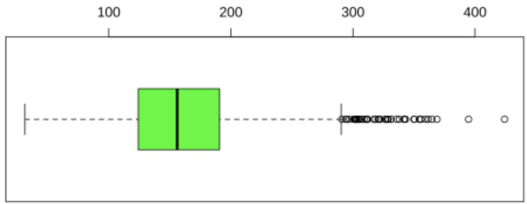

<details>
<summary>boxplot</summary>

| Metric | Value |
| --- | --- |
| Q1 | ~135 |
| Q2 (Median) | ~160 |
| Q3 | ~195 |
| Outliers | >400, ~420 |
</details>

图1 花叶类蔬菜日销量箱线图

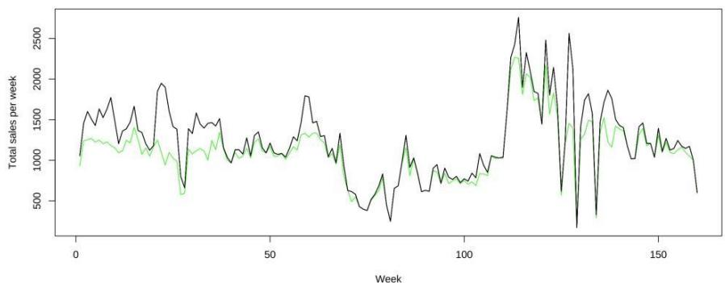

<details>
<summary>line</summary>

| Week | Black Line (Total sales per week) | Green Line (Total sales per week) |
| --- | --- | --- |
| 0 | ~1050 | ~950 |
| 25 | ~1950 | ~1100 |
| 30 | ~650 | ~600 |
| 60 | ~1800 | ~1350 |
| 75 | ~250 | ~450 |
| 115 | ~2750 | ~2250 |
| 130 | ~2550 | ~1450 |
| 135 | ~200 | ~300 |
| 160 | ~600 | ~1100 |
</details>

图2 数据预处理前后花叶类蔬菜周销量时间序列对比图

## 4.2 蔬菜类商品不同品类的分布规律及相互关系

本部分将先从总体的角度去分析不同品类蔬菜的分布规律及相互关系，之后认为再从周、月、年等多个维度详细分析不同品类蔬菜的分布规律及相互关系。

## 4.3 不同品类蔬菜的总体分布规律及相互关系

本节使用三种方法分析不同品类蔬菜的总体分布规律及相互关系。首先，从 K-S 检验的角度分析不同品类蔬菜的销量是否属于同一分布；之后，使用皮尔逊系数矩阵分析不同品类蔬菜的销量之间的相关性；最后，从 ARIMA 模型的角度分析单一品类蔬菜的历史销量的分布规律。

## 4.3.1 K-S 检验

使用 K-S 检验的方法分别检验各蔬菜品类两两之间的销量是否属于同一分布。本节从日销量和月销量的角度，分析了各品类蔬菜销量分布之间的关系。首先，将各蔬菜品类每日的销售流水加总，获得各蔬菜品类每日的销售总量，之后分别两两组合进行 K-S 检验，共进行 15 次检验。

检验步骤如下（以花叶类蔬菜与水生根茎类蔬菜的日销量分布为例）：

Step1）提出假设

原假设 $H_{0}$ : 花叶类蔬菜与水生根茎类蔬菜的日销量样本来自于同一分布。

被择假设 $H_{1}$ : 花叶类蔬菜与水生根茎类蔬菜的日销量样本来自于不同分布。

Step2）构造检验统计量

$$
D _ {n} = \max f _ {n} (x) - g _ {n} (x) \tag {1}
$$

其中， $f_{n}(x)$ 为花叶类蔬菜日销量的观察样本序列值， $g_{n}(x)$ 为水生根茎类蔬菜日销量的观察样本序列值。

Step3）计算并分析结果

通过 R 语言代码，得到以下结果:

如图所示，K-S 检验的 p-value 小于 0.001，因此有充足的把握拒绝原假设 $H_{0}$ : 花叶类蔬菜与水生根茎类蔬菜的日销量样本来自于同一分布。

Step4）对其他组合进行检验

对于其他品类蔬菜的组合，观察结果可以发现，K-S 检验的 p-value 均小于 0.001，因此有充足的把握拒绝各蔬菜品类之间的日销售量属于同一分布。

由于日销量存在较大的随机性，而月销量则相对消除了一定的偶然因素影响，因此针对各品类蔬菜的月销量进行了 K-S 检验。结果显示，花菜类与水生根茎类的月销量之间 K-S 检验的 p-value 为 0.2106，没有充足的把握拒绝其月销量属于同一分布；除该组合之外，各品类蔬菜的月销量两两之间均不属于同一分布。

Asymptotic two-sample Kolmogorov-Smirnov test

```txt
data: bbb$花叶类 and bbb$水生根茎类
D = 0.88479, p-value < 2.2e-16
alternative hypothesis: two-sided
```  
图3 花菜类蔬菜与水生根茎类蔬菜的月销量样本 K-S 检验结果

## 4.3.2 皮尔逊相关系数

使用皮尔逊相关系数来判断各蔬菜品类销量之间的相关性，并使用热力图将其可视化。同样，本段从日销量和月销量的角度，分析各品类蔬菜销量之间的相关系数。步骤如下：

Step1）获得日销量和月销量

将各蔬菜品类的每日销量流水加总获得日销量。由于日销量具有一定的随机性，因此又选取了月销量作为研究对象。此外，部分蔬菜品类缺少部分日销量数据，认为这是因为当日该品类蔬菜没有售出，因此用0代替。

## Step2）计算皮尔逊相关系数

皮尔逊相关系数可以用来度量两个变量之间的相关程度，其计算公式为：

$$
\rho (x, y) = \frac {\sum_ {i = 1} ^ {n} (X _ {i} - \bar {X}) (Y _ {i} - \bar {Y})}{\sqrt {\sum_ {i = 1} ^ {n} (X _ {i} - \bar {X}) ^ {2}} \sqrt {\sum_ {i = 1} ^ {n} (Y _ {i} - \bar {Y}) ^ {2}}} \tag {2}
$$

其中， $X_{i}$ 和 $Y_{i}$ 分别表示两个蔬菜品类的日（月）销量样本序列值，而 $\mathbf{X}^{-}$ 和 $\mathbf{Y}^{-}$ 则表示对应序列的样本均值。

通过 R 语言代码，得到以下结果:

<table><tr><td colspan="7">&gt; cor(bbb)</td></tr><tr><td></td><td>花叶类</td><td>花菜类</td><td>水生根茎类</td><td>茄类</td><td>辣椒类</td><td>食用菌</td></tr><tr><td>花叶类</td><td>1.00000000</td><td>0.4857846</td><td>0.4544344</td><td>0.07626991</td><td>0.65973275</td><td>0.5229822</td></tr><tr><td>花菜类</td><td>0.48578460</td><td>1.0000000</td><td>0.3567919</td><td>0.13746712</td><td>0.30900707</td><td>0.3422176</td></tr><tr><td>水生根茎类</td><td>0.45443436</td><td>0.3567919</td><td>1.0000000</td><td>-0.15653677</td><td>0.40009216</td><td>0.5178830</td></tr><tr><td>茄类</td><td>0.07626991</td><td>0.1374671</td><td>-0.1565368</td><td>1.00000000</td><td>-0.06519402</td><td>-0.1136746</td></tr><tr><td>辣椒类</td><td>0.65973275</td><td>0.3090071</td><td>0.4000922</td><td>-0.06519402</td><td>1.00000000</td><td>0.6124831</td></tr><tr><td>食用菌</td><td>0.52298222</td><td>0.3422176</td><td>0.5178830</td><td>-0.11367457</td><td>0.61248306</td><td>1.0000000</td></tr></table>

图4 各品类蔬菜日总销量相关系数矩阵

<table><tr><td colspan="7">&gt; cor(bbbb)</td></tr><tr><td></td><td>花叶类</td><td>花菜类</td><td>水生根茎类</td><td>茄类</td><td>辣椒类</td><td>食用菌</td></tr><tr><td>花叶类</td><td>1.0000000</td><td>0.7030460</td><td>0.4441639</td><td>-0.1023648</td><td>0.7331329</td><td>0.5249422</td></tr><tr><td>花菜类</td><td>0.7030460</td><td>1.0000000</td><td>0.3801513</td><td>-0.0375461</td><td>0.3382776</td><td>0.3843337</td></tr><tr><td>水生根茎类</td><td>0.4441639</td><td>0.3801513</td><td>1.0000000</td><td>-0.5195798</td><td>0.3538130</td><td>0.5723913</td></tr><tr><td>茄类</td><td>-0.1023648</td><td>-0.0375461</td><td>-0.5195798</td><td>1.0000000</td><td>-0.3169146</td><td>-0.4692417</td></tr><tr><td>辣椒类</td><td>0.7331329</td><td>0.3382776</td><td>0.3538130</td><td>-0.3169146</td><td>1.0000000</td><td>0.6247392</td></tr><tr><td>食用菌</td><td>0.5249422</td><td>0.3843337</td><td>0.5723913</td><td>-0.4692417</td><td>0.6247392</td><td>1.0000000</td></tr></table>

图5 各品类蔬菜月总销量相关系数矩阵

## Step3）画出相关系数热力图

通过 R 语言代码，将相关系数矩阵以热力图的方式进行可视化：

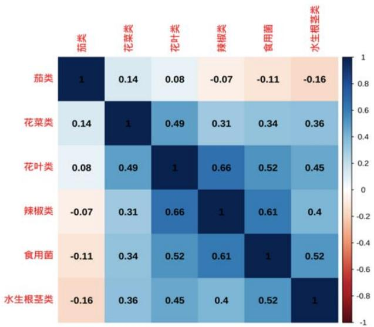

<details>
<summary>heatmap</summary>

| Category | 茄类 | 花菜类 | 花叶类 | 辣椒类 | 食用菌 | 水生根茎类 |
| :--- | :--- | :--- | :--- | :--- | :--- | :--- |
| 茄类 | 1 | 0.14 | 0.08 | -0.07 | -0.11 | -0.16 |
| 花菜类 | 0.14 | 1 | 0.49 | 0.31 | 0.34 | 0.36 |
| 花叶类 | 0.08 | 0.49 | 1 | 0.66 | 0.52 | 0.45 |
| 辣椒类 | -0.07 | 0.31 | 0.66 | 1 | 0.61 | 0.4 |
| 食用菌 | -0.11 | 0.34 | 0.52 | 0.61 | 1 | 0.52 |
| 水生根茎类 | -0.16 | 0.36 | 0.45 | 0.4 | 0.52 | 1 |
</details>

图6 各品类蔬菜日总销量相关系数热力图

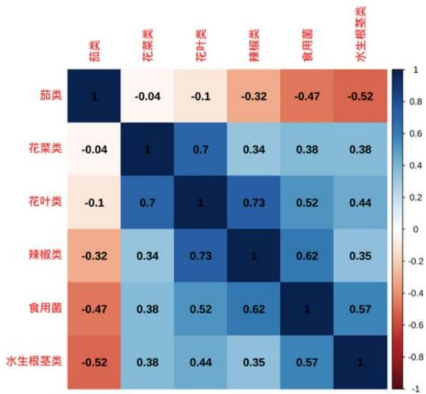

<details>
<summary>heatmap</summary>

| Category | 茄类 | 花菜类 | 花叶类 | 辣椒类 | 食用菌 | 水生根茎类 |
| :--- | :--- | :--- | :--- | :--- | :--- | :--- |
| 茄类 | 1 | -0.04 | -0.1 | -0.32 | -0.47 | -0.52 |
| 花菜类 | -0.04 | 1 | 0.7 | 0.34 | 0.38 | 0.38 |
| 花叶类 | -0.1 | 0.7 | 1 | 0.73 | 0.52 | 0.44 |
| 辣椒类 | -0.32 | 0.34 | 0.73 | 1 | 0.62 | 0.35 |
| 食用菌 | -0.47 | 0.38 | 0.52 | 0.62 | 1 | 0.57 |
| 水生根茎类 | -0.52 | 0.38 | 0.44 | 0.35 | 0.57 | 1 |
</details>

图7 各品类蔬菜月总销量相关系数热力图

结合两图发现, 花叶类与辣椒类、辣椒类与食用菌类之间的相关系数的绝对值较大, 具有较强的相关性; 除此之外, 其余蔬菜品类间的相关性并不明显。

## 4.3.3 ARIMA 时间序列分析

对于蔬菜类商品同一品类内部的销量分布规律，使用 ARIMA 模型进行时间序列分析。ARIMA 模型的基本思想是利用数据本身的历史信息来预测未来，主要由三部分构成，分别为自回归模型（AR）、差分过程（I）和移动平均模型（MA）。对于 ARIMA(p,d,q) 模型中的三个参数，其中：

p 表示自回归模型部分，描述了模型中使用观测值的滞后值，即认为观测值是它前面的 p 个观测值的线性组合；  
q 表示移动平均模型部分，描述了模型中使用的错误项的滞后值，即认为观测值是它前面的 q 个白噪声的线性组合；

d 表示差分过程部分，描述了差分的阶数，即将进行 d 阶差分之后的时间序列数据代入 ARMA 模型进行拟合。当 d=0 时，其数学表达式为：

$$
y _ {t} = \mathrm{c} + \varphi_ {1} y _ {(t - 1)} + \varphi_ {2} y _ {(t - 2)} + \dots + \varphi_ {p} y _ {(t - p)} + \theta_ {1} \varepsilon_ {(t - 1)} + \theta_ {2} \varepsilon_ {(t - 2)} + \dots + \theta_ {q} \varepsilon_ {(t - q)} + \varepsilon_ {t} \tag {3}
$$

本节中对各品类蔬菜的周销量进行 ARIMA 时间序列分析的步骤如下:

## Step1）获得周销量

由于日销售量具有较大的偶然性，因此将各品类蔬菜的周销量作为研究对象。将各品类蔬菜每周的销售流水加总，获得各品类蔬菜的周销量。

## Step2）根据图像分析

以水生根茎类蔬菜为例：首先，将水生根茎类蔬菜每周的销量流水加总，获得该品类蔬菜的周销量，并画出其时间序列图像。从时间序列图像中可以看出，水生根茎类蔬菜售量的变化具有一定的季节性。结合生活经验，以一年为周期，并作出其 ACF 图像、PACF 图像等以观察 ARIMA 模型的参数特征与拟合效果。可以发现，PACF 图像呈现较好的截尾状态，但 ACF 并没有随滞后阶数增大而逐渐接近于 0；因此用 ARIMA 模型并不能较好地拟合该时间序列。

## Step3）获得数学表达式

之后，使用 R 语言程序自动确定 ARIMA 模型的相关参数，可以获得 ARIMA(0,0,1)(0,1,1)[52]模型。读取代码结果，可以分析出水生根茎类蔬菜周销量的数学表达式为：

$$
y _ {t} - y _ {(t - 5 2)} = 0. 6 5 8 1 + 1. 5 6 8 4 \varepsilon_ {t} - 0. 4 4 8 9 \varepsilon_ {(t - 1)} \tag {4}
$$

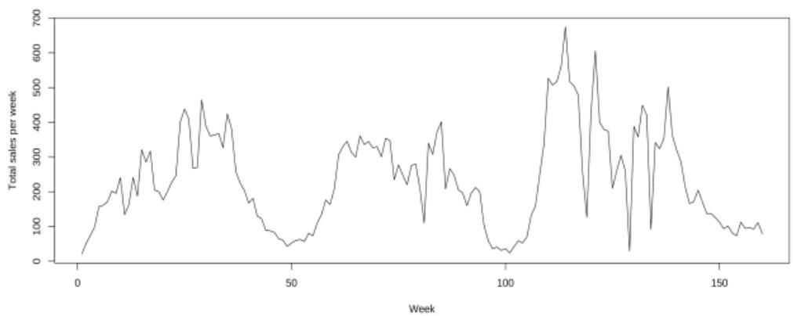

<details>
<summary>line</summary>

| Week | Total sales per week |
| --- | --- |
| 0 | ~25 |
| 10 | ~160 |
| 20 | ~240 |
| 30 | ~460 |
| 40 | ~250 |
| 50 | ~50 |
| 60 | ~170 |
| 70 | ~340 |
| 80 | ~280 |
| 90 | ~210 |
| 100 | ~40 |
| 110 | ~520 |
| 120 | ~680 |
| 130 | ~380 |
| 140 | ~330 |
| 150 | ~100 |
| 160 | ~80 |
</details>

图8 水生根茎类蔬菜周销量的时间序列图像

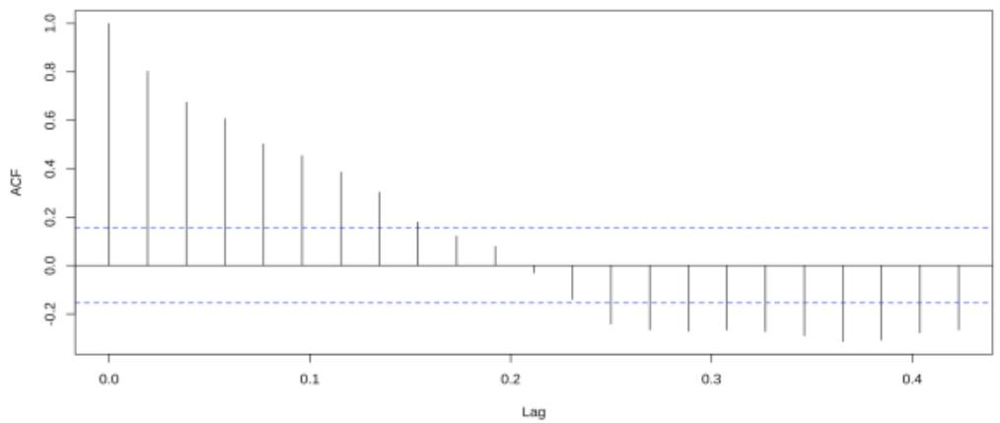

<details>
<summary>bar</summary>

| Lag | ACF |
| --- | --- |
| 0.00 | 1.0 |
| 0.02 | ~0.8 |
| 0.04 | ~0.67 |
| 0.06 | ~0.61 |
| 0.08 | ~0.5 |
| 0.10 | ~0.45 |
| 0.12 | ~0.39 |
| 0.14 | ~0.31 |
| 0.16 | ~0.18 |
| 0.18 | ~0.13 |
| 0.20 | ~0.08 |
| 0.22 | ~-0.03 |
| 0.24 | ~-0.15 |
| 0.26 | ~-0.24 |
| 0.28 | ~-0.27 |
| 0.30 | ~-0.28 |
| 0.32 | ~-0.27 |
| 0.34 | ~-0.29 |
| 0.36 | ~-0.31 |
| 0.38 | ~-0.31 |
| 0.40 | ~-0.28 |
| 0.42 | ~-0.27 |
</details>

图9 水生根茎类蔬菜周销量的时间序列图像

## Step4）模型评价与检验

可以从 R 语言程序代码结果中获取对于该模型拟合效果的评价指标, 如该模型的赤池信息准则 AIC 为 1322.4, 而该因素可以衡量 ARIMA 模型的拟合优度和复杂度。一般而言, 比较不同的模型, AIC 值越小, 其模型效果越好。此外, 还有 BIC、对数似然值等信息去评价该模型。综合这些数据, 认为 ARIMA 模型并不能较好的反映水生根茎类蔬菜的周销量分布规律。

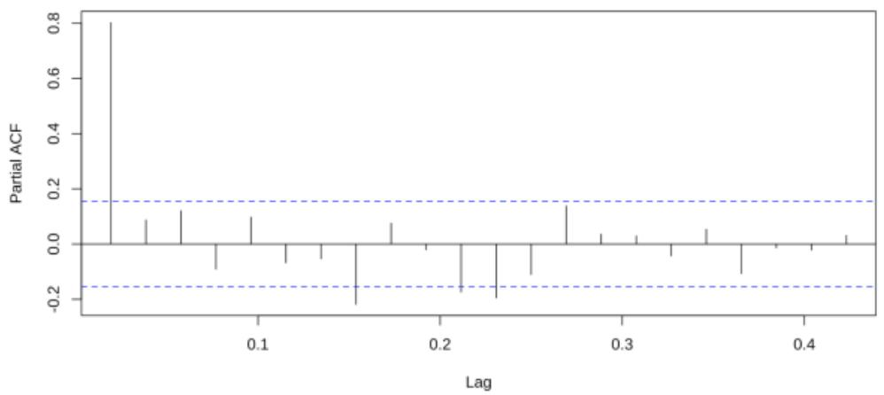

<details>
<summary>stem</summary>

| Lag | Partial ACF |
| --- | --- |
| ~0.01 | 0.8 |
| ~0.03 | ~0.09 |
| ~0.05 | ~0.12 |
| ~0.07 | ~-0.1 |
| ~0.09 | ~0.1 |
| ~0.11 | ~-0.07 |
| ~0.13 | ~-0.06 |
| ~0.15 | ~-0.22 |
| ~0.17 | ~0.08 |
| ~0.19 | ~-0.02 |
| ~0.21 | ~-0.18 |
| ~0.23 | ~-0.2 |
| ~0.25 | ~-0.12 |
| ~0.27 | ~0.14 |
| ~0.29 | ~0.04 |
| ~0.31 | ~0.03 |
| ~0.33 | ~-0.05 |
| ~0.35 | ~0.06 |
| ~0.37 | ~-0.12 |
| ~0.39 | ~-0.02 |
| ~0.41 | ~-0.03 |
| ~0.43 | ~0.03 |
</details>

图10 水生根茎类蔬菜周销量的 PACF 图像

```txt
Series: myts
ARIMA(0,0,1)(0,1,1)[52] with drift

Coefficients:
        ma1     sma1  drift
    0.5684 -0.4489 0.6581
s.e.  0.0931   0.2320  0.2485

sigma^2 = 10472:  log likelihood = -657.42
AIC=1322.84   AICc=1323.23   BIC=1333.57

Training set error measures:
                ME      RMSE      MAE      MPE      MAPE      MASE      ACF1
Training set -1.835973 82.89928 48.78366 -18.15743 30.44954 0.5228485 0.06482157
```  
图11 水生根茎类蔬菜周销量 ARIMA 模型结果

## Step5）对其他品类蔬菜的拟合

对其他五个品类的蔬菜，分别使用季节性 ARIMA 模型进行拟合。但总体而言模型拟合效果并不完美。例如，花叶类蔬菜周销量并没有呈现明显的季节性特征。一方面，这可能是因为三年的历史数据所覆盖的周期数较小，且 22 年销量受疫情干扰影响较大，不能很好地进行拟合；另一方面，销量可能与售价、进价等其他因素相关，而不仅仅受到时间因素的影响，因此需要对销量与成本加成定价的关系进一步分析。相应后续分析在第二问的求解中有较为详细的阐述。

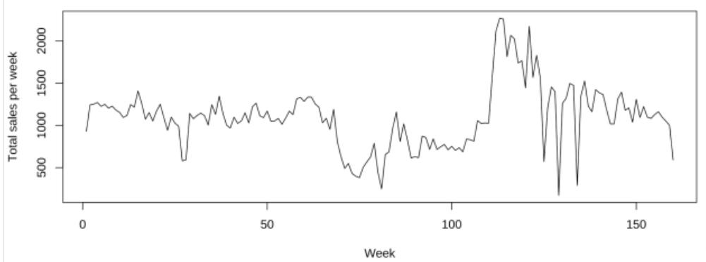

<details>
<summary>line</summary>

| Week | Total sales per week |
| --- | --- |
| 0 | ~950 |
| 25 | ~600 |
| 75 | ~300 |
| 115 | ~2250 |
| 125 | ~200 |
| 135 | ~300 |
| 160 | ~600 |
</details>

图12 花叶类蔬菜周销量的时间序列图像

```txt
Series: myts
ARIMA(3,0,2) with non-zero mean

Coefficients:
        ar1      ar2      ar3      ma1      ma2      mean
       0.0580 0.7218 0.0402 0.5298 -0.4324 1077.0929
s.e.  0.1769 0.0675 0.1384 0.1611  0.1586 108.5372

sigma^2 = 58233:  log likelihood = -1102.7
AIC=2219.4   AICc=2220.14   BIC=2240.93

Training set error measures:
                ME     RMSE      MAE      MPE    MAPE      MASE      ACF1
Training set 0.5730349 236.7477 159.0224 -9.600707 21.54293 0.3625045 0.003521624
```  
图13 花叶类蔬菜周销量的时间序列图像

## 4.4 不同品类蔬菜的周维度分布规律及相互关系

考虑到人们在工作日和休息日的消费习惯有些不同，认为有必要观察一个星期内的销量分布规律。

将三年中所有的星期一，二，…，日的数据汇总，计算 $S_{(w,i)}/\left(\sum(i=1)^{7}S_{(w,i)}\right)(i=1,2,\ldots,7)$ （比如 $S_{(w,1)}$ 表示3年所有的星期一的总销量），观察不同品类的在一个星期内的销量分布。

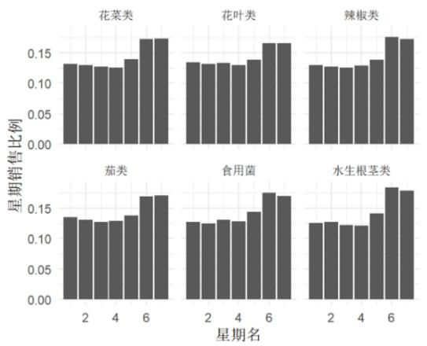

<details>
<summary>bar</summary>

| Category | 星期名 | 销售比例 |
| :--- | :--- | :--- |
| 花菜类 | 2 | ~0.135 |
| 花菜类 | 3 | ~0.132 |
| 花菜类 | 4 | ~0.128 |
| 花菜类 | 5 | ~0.127 |
| 花菜类 | 6 | ~0.142 |
| 花菜类 | 7 | ~0.175 |
| 花菜类 | 8 | ~0.176 |
| 花叶类 | 2 | ~0.136 |
| 花叶类 | 3 | ~0.134 |
| 花叶类 | 4 | ~0.135 |
| 花叶类 | 5 | ~0.131 |
| 花叶类 | 6 | ~0.141 |
| 花叶类 | 7 | ~0.168 |
| 花叶类 | 8 | ~0.169 |
| 辣椒类 | 2 | ~0.132 |
| 辣椒类 | 3 | ~0.129 |
| 辣椒类 | 4 | ~0.127 |
| 辣椒类 | 5 | ~0.131 |
| 辣椒类 | 6 | ~0.141 |
| 辣椒类 | 7 | ~0.178 |
| 辣椒类 | 8 | ~0.174 |
| 茄类 | 2 | ~0.138 |
| 茄类 | 3 | ~0.133 |
| 茄类 | 4 | ~0.129 |
| 茄类 | 5 | ~0.131 |
| 茄类 | 6 | ~0.140 |
| 茄类 | 7 | ~0.168 |
| 茄类 | 8 | ~0.172 |
| 食用菌 | 2 | ~0.129 |
| 食用菌 | 3 | ~0.126 |
| 食用菌 | 4 | ~0.133 |
| 食用菌 | 5 | ~0.130 |
| 食用菌 | 6 | ~0.147 |
| 食用菌 | 7 | ~0.175 |
| 食用菌 | 8 | ~0.169 |
| 水生根茎类 | 2 | ~0.128 |
| 水生根茎类 | 3 | ~0.130 |
| 水生根茎类 | 4 | ~0.124 |
| 水生根茎类 | 5 | ~0.123 |
| 水生根茎类 | 6 | ~0.144 |
| 水生根茎类 | 7 | ~0.182 |
| 水生根茎类 | 8 | ~0.176 |
</details>

周一到周日的销量比例柱状图

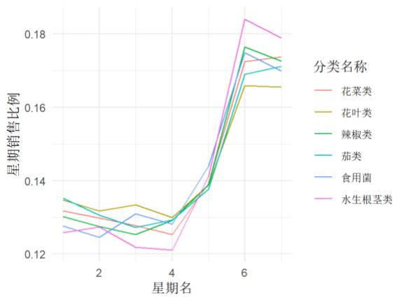

<details>
<summary>line</summary>

| 星期名 | 花菜类 | 花叶类 | 辣椒类 | 茄类 | 食用菌 | 水生根茎类 |
| --- | --- | --- | --- | --- | --- | --- |
| 1 | ~0.131 | ~0.135 | ~0.130 | ~0.128 | ~0.127 | ~0.126 |
| 2 | ~0.129 | ~0.132 | ~0.127 | ~0.125 | ~0.124 | ~0.127 |
| 3 | ~0.127 | ~0.133 | ~0.125 | ~0.131 | ~0.128 | ~0.122 |
| 4 | ~0.126 | ~0.130 | ~0.129 | ~0.129 | ~0.129 | ~0.121 |
| 5 | ~0.138 | ~0.138 | ~0.138 | ~0.138 | ~0.145 | ~0.145 |
| 6 | ~0.172 | ~0.166 | ~0.176 | ~0.169 | ~0.175 | ~0.184 |
| 7 | ~0.173 | ~0.166 | ~0.173 | ~0.170 | ~0.172 | ~0.179 |
</details>

周一到周日的销量比例折线图

通过绘制星期销售比例的折线图，发现不同品类每个星期的分布规律非常一致。星期一到星期四占比较低，平均在 $13\%$ 左右，星期五占比开始提高，约 $14\%$ ，休息日的占比最高，大多在 $17\%$ 以上。由于数据量较少无法分析其服从何种分布，仅给出折线图。

## 4.5 不同品类蔬菜的月维度分布规律及相关关系

由于销量数据的信噪比较大，时间颗粒度过细的数据有较大的偶然性，无法很好地分析不同品类的相关性，切分成以月为单位的维度可以在保留季节性规律的同时，平滑偶然性的日销量数据，因此提出月维度的分析角度。但是本分析维度由于数据点较少，难以支撑除了皮尔逊相关系数以外的的定量分析，因此主要从描述性统计的角度出发分析。

观察各品类 2020.7-2023.6 的月销量分布，发现难以判断不同品类的月销量比例分布 $S_{(m,i)}/\sum(i=1)^{3}6(S_{(m,i)})(i=1,2,\ldots,36)$ 是否有显著的相关性。

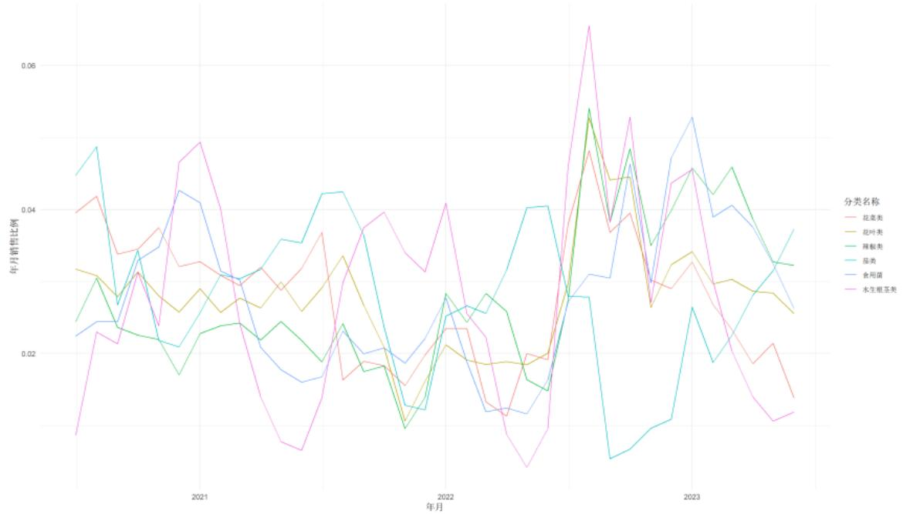

<details>
<summary>line</summary>

| 年月 | 花菜类 | 茄叶类 | 裸根类 | 藕类 | 食用菌 | 水生根茎类 |
| --- | --- | --- | --- | --- | --- | --- |
| 2021-01 | ~0.040 | ~0.032 | ~0.025 | ~0.045 | ~0.023 | ~0.012 |
| 2021-02 | ~0.042 | ~0.031 | ~0.031 | ~0.050 | ~0.025 | ~0.023 |
| 2021-03 | ~0.033 | ~0.028 | ~0.024 | ~0.027 | ~0.026 | ~0.022 |
| 2021-04 | ~0.034 | ~0.031 | ~0.023 | ~0.034 | ~0.034 | ~0.031 |
| 2021-05 | ~0.037 | ~0.029 | ~0.023 | ~0.024 | ~0.043 | ~0.047 |
| 2021-06 | ~0.031 | ~0.027 | ~0.024 | ~0.021 | ~0.041 | ~0.051 |
| 2021-07 | ~0.032 | ~0.031 | ~0.025 | ~0.028 | ~0.031 | ~0.041 |
| 2021-08 | ~0.031 | ~0.027 | ~0.025 | ~0.031 | ~0.031 | ~0.031 |
| 2021-09 | ~0.031 | ~0.028 | ~0.023 | ~0.035 | ~0.025 | ~0.018 |
| 2021-10 | ~0.031 | ~0.027 | ~0.025 | ~0.036 | ~0.019 | ~0.014 |
| 2021-11 | ~0.033 | ~0.031 | ~0.024 | ~0.043 | ~0.017 | ~0.013 |
| 2021-12 | ~0.037 | ~0.034 | ~0.019 | ~0.043 | ~0.016 | ~0.016 |
| 2022-01 | ~0.016 | ~0.018 | ~0.025 | ~0.037 | ~0.024 | ~0.038 |
| 2022-02 | ~0.019 | ~0.018 | ~0.018 | ~0.039 | ~0.021 | ~0.041 |
| 2022-03 | ~0.015 | ~0.014 | ~0.016 | ~0.034 | ~0.019 | ~0.034 |
| 2022-04 | ~0.018 | ~0.019 | ~0.018 | ~0.031 | ~0.024 | ~0.031 |
| 2022-05 | ~0.024 | ~0.021 | ~0.029 | ~0.036 | ~0.027 | ~0.041 |
| 2022-06 | ~0.024 | ~0.019 | ~0.031 | ~0.035 | ~0.028 | ~0.035 |
| 2022-07 | ~0.015 | ~0.019 | ~0.034 | ~0.041 | ~0.015 | ~0.033 |
| 2022-08 | ~0.014 | ~0.019 | ~0.035 | ~0.041 | ~0.014 | ~0.035 |
| 2022-09 | ~0.019 | ~0.019 | ~0.036 | ~0.046 | ~0.016 | ~- |
| 2022-10 | ~- | ~- | ~- | ~- | ~- | - |
| 2022-11 | - | - | - | - | - | - |
| 2022-12 | - | - | - | - | - | - |
| 2023-01 | - | - | - | - | - | - |
| 2023-02 | - | - | - | - | - | - |
| 2023-03 | - | - | - | - | - | - |
| 2023-04 | - | - | - | - | - | - |
| 2023-05 | - | - | - | - | - | - |
| 2023-06 | - | - | - | - | - | - |
| 2023-07 | - | - | - | - | - | - |
| 2023-08 | - | - | - | - | - | - |
| 2023-09 | - | - | - | - | - | - |
| 2023-10 | - | - | - | - | - | - |
| 2023-11 | - | - | - | - | - | - |
| 2023-12 | - | - | - | - | - | - |
</details>

图14 不同品类蔬菜的月销量比例分布图

探究其原因后发现，可能是由于一年中只有部分时间存在品类月销量比例分布的相关性，以及不同年份的总销量 $\sum(i=1)^{1}2S_{(m,i)}$ ， $\sum(i=13)^{2}4S_{(m,i)}$ ， $\sum(i=25)^{3}6S_{(m,i)}$ 存在较大差异，导致单月销量占三年总销量的比例无法直观反映不同品类之间月销售比例的分布相关性。

因此将 2020.7-2021.6，2021.7-2022.6，2022.7-2023.6 分割为 3 年，以单月销量占三年的总销量比例，观察相关性，发现不同品类的月销量比例呈现出了相当明显的分布相关性。

2022.7-2023.6 花菜类、花叶类、水生根茎类的月销量比例非常相似，计算其相关系数后发现，彼此间相关系数基本达到 0.8 以上，验证了三品类的月销量比例相似性。

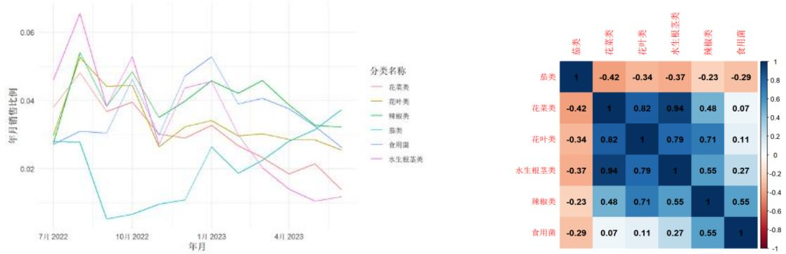  
图15 2022.7-2023.6 不同品类蔬菜的月销量比例分布图

2021.7-2022.6 仅有水生根茎类与食用菌、茄类和花叶类呈现出彼此间较高的相关系数，研究曲线后发现是因为多数品类只呈现出部分月份的相关性，比如 2021.9-2022.2 的范围里各品类之间的相关性。

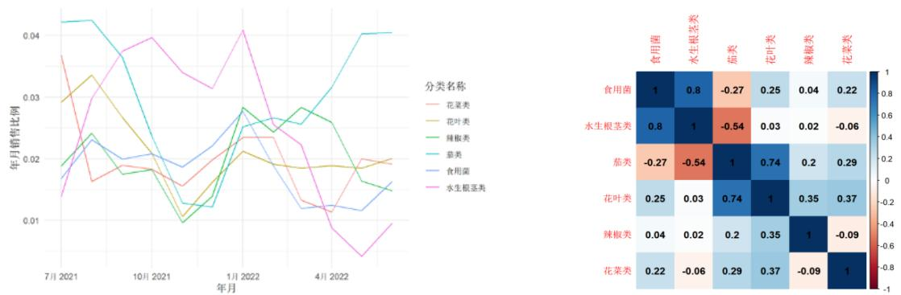  
图16 2021.7-2022.6 不同品类蔬菜的月销量比例分布图

2020.7-2021.6 仅有水生根茎类与食用菌、茄类和辣椒类呈现出彼此间较高的相关系数，且不存在部分月份之间的相关性。

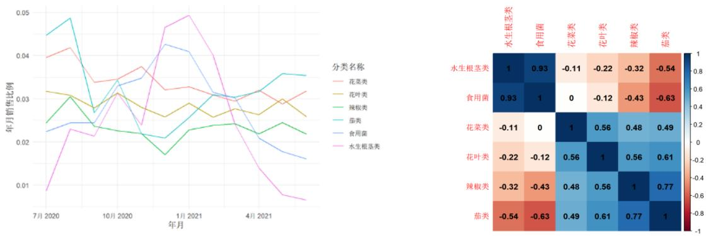  
图17 2020.7-2021.6 不同品类蔬菜的月销量比例分布图

综上，发现不同品类之间几乎不存在稳定的相关性，且有部分品类的相关性只存在与几个月的时间范围里。

## 4.6 不同品类蔬菜的年维度分布规律及相互关系

由于不同品类在不同年份里可能有销量上的显著差别，因此提出年维度 $S_{(y,i)}/\left(\sum(i=1)^{3}S_{(y,i)}\right)(i=1,2,3)$ 的分析角度。

发现花菜类、花叶类、辣椒类、食用菌在年销量间呈现出非常一致的规律，都在21-22年（指2021.7-2022.7，下同）呈现出异常低值（相较于20-21和22-23），可以推测出是由于疫情封控导致线下超市长时间无法营业导致。

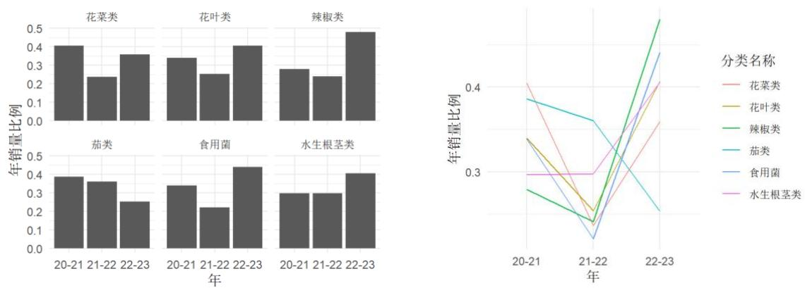  
不同品类蔬菜的年销量比例分布图

## 4.7 蔬菜类商品不同单品的分布规律

与品类类似，对单品进行月维度分析与年维度的分析，由于单品较多，折线图无法良好呈现，因此将属于同一品类的单品放一起观察。发现月维度上与年维度均有少量单品呈现出较高的相关性，但仍然由于单品数量过多而无法精确分析。

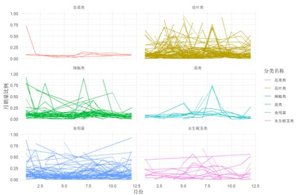

<details>
<summary>line</summary>

| Category | 月份 | 月销量比例 |
| :--- | :--- | :--- |
| 花菜类 | 1 | ~0.75 |
| 花菜类 | 2~12 | ~0.05 ~0.15 |
| 花叶类 | 1~12 | ~0.05 ~0.95 |
| 辅酸类 | 1~12 | ~0.05 ~0.95 |
| 茄类 | 1~12 | ~0.05 ~0.75 |
| 食用菌 | 1~12 | ~0.05 ~0.95 |
| 水生根茎类 | 1~12 | ~0.05 ~0.60 |
</details>

图18 不同品类下单品的月销量比例分布图

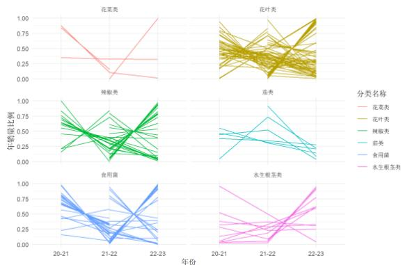

<details>
<summary>line</summary>

| Category | 20-21 | 21-22 | 22-23 |
| :--- | :--- | :--- | :--- |
| 花菜类 | ~0.85 | ~0.10 | ~0.00 |
| 花叶类 | ~0.90 | ~0.40 | ~0.95 |
| 鞍酸类 | ~0.75 | ~0.15 | ~0.95 |
| 菹类 | ~0.55 | ~0.50 | ~0.25 |
| 食用菌 | ~0.95 | ~0.05 | ~0.95 |
| 水生根茎类 | ~0.95 | ~0.30 | ~0.95 |
</details>

图19 不同品类下单品的年销量比例分布图

因此，仅取总销量占比在 1% 的单品，发现一共有 31 个单品，且这 31 个单品已占总销量的 70.82%，是销量研究维度的主要研究对象。

绘制 31 个单品之间的相关系数热力图，可以直观发现许多互补（强正相关）与替代（强负相关）关系的单品，比如“泡泡椒(精品)”和“芜湖青椒(1)”之间的互补关系，“红薯尖”和“竹叶菜”之间的替代关系。

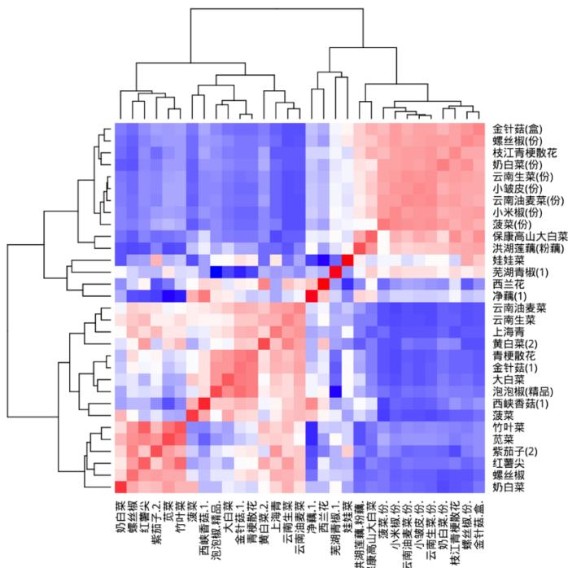

<details>
<summary>heatmap</summary>

| Plant Species | Sample 1 (Cluster) | Sample 2 (Cluster) | Sample 3 (Cluster) | Sample 4 (Cluster) |
| :--- | :--- | :--- | :--- | :--- |
| 金针菇(盒) | High | Low | High | High |
| 螺丝椒(份) | High | Low | High | High |
| 枝江青梗散花 | High | Low | High | High |
| 奶白菜 | High | Low | High | High |
| 云南生菜(份) | High | Low | High | High |
| 小皱皮(份) | High | Low | High | High |
| 云南油麦菜(份) | High | Low | High | High |
| 小米椒(份) | High | Low | High | High |
| 菠菜(份) | High | Low | High | High |
| 保康高山大白菜 | High | Low | High | High |
| 洪湖莲藕(粉藕) | High | Low | High | High |
| 娃桂菜 | High | Low | High | High |
| 芜湖青椒(1) | High | Low | High | High |
| 西兰花 | High | Low | High | High |
| 净藕(1) | High | Low | High | High |
| 云南油麦菜 | High | Low | High | High |
| 云南生菜 | High | Low | High | High |
| 上海青 | High | Low | High | High |
| 黄白菜(2) | High | Low | High | High |
| 青梗散花 | High | Low | High | High |
| 金针菇(1) | High | Low | High | High |
| 大白菜 | High | Low | High | High |
| 泡泡椒(精品) | High | Low | High | High |
| 西峡香菇(1) | High | Low | High | High |
| 菠菜 | High | Low | High | High |
| 竹叶菜 | High | Low | High | High |
| 菟菜 | High | Low | High | High |
| 紫茄子(2) | High | Low | High | High |
| 红薯尖 | High | Low | High | High |
| 螺丝椒 | High | Low | High | High |
| 奶白菜 | High | Low | High | High |

Values are qualitative estimates based on the color gradient relative to the provided legend.
</details>

图20 不同单品月销量相关系数热力图及聚类分析

并且，考虑到该数据异常数据多等特点，使用 CURE 层次聚类的方法对 31 种单品进行划分，并叠加在热力图上。

收缩因子：CURE 算法以选择基于质心和基于代表对象之间的中间策略，从每个类中抽取固定数量、分布较好的点作为此类的代表点，并将这些代表点乘以一个适当的收缩因子，使它们更加靠近类中心点。收缩因子的使用可以减少噪音对聚类的影响。

代表点计算公式:

$$
w _ {r e p} = p + \alpha * (w _ {m e a n} - p)
$$

其中： $w_{mean}$ 是中心点

p 是从聚类簇 u 或 v 中选择的点，用来表示整个簇的特征，

α 是收缩因子。

CURE 算法分两个阶段消除异常值的影响:

Stage1）在聚类算法执行到某一阶段（或称当前的簇总数减小到某个值）时，根据簇的增长速度和簇的大小对离群点进行一次识别。由于异常值同其他对象的距离更大，所以其所在类中对象数目的增大就会非常缓慢，甚至不增长，将聚类过程中类成员增长非常缓慢的类作为异常值剔除；

但是当随机采样到的离群点分布的比较近时（即使可能性比较小），这些点会被合并为一个簇，而导致无法将他们识别出来，这时就需要第二阶段的来进行处理。

Stage2）在聚类的最后阶段，将非常小的簇删除。由于离群点占的比重很小，而在层次聚类的最后几步中，每个正常簇的粒度都是非常高的，因此很容易将他们识别出来，一般当簇的总数缩减到大约为 k （规定簇数）时，进行第二阶段的识别。

通过聚类后发现，可将不同的单品划分为 3 个大簇，分别是互补关系、替代关系、无关系，每个组内还有细分小簇，更准确地展现了某几个单品之间体现出的更强烈的关系。

## 五、问题二模型建立与求解

## 5.1 问题二求解思路

问题二在问题一对各蔬菜品类与单品销量分析的基础上，需要进一步分析决定各蔬菜品类市场需求的可能因素，从而确定不同的成本加成定价水平对市场需求的影响。从供给端看，蔬菜市场受季节、年景等因素影响较大，不同季节上市的蔬菜单品组合亦有显著差异；从需求端看，消费者在周末、特定节假日期间会加大对蔬菜的购买力度；同时由于可供选择的蔬菜品类较多，市场需求存在显著的替代效应。本文在探讨成本加成定价水平与市场需求的关联时，剔除了由季节性、趋势性、特定时间段带来的影响。考虑到消费者的消费行为直接取决于蔬菜的绝对价格，间接受到成本利润率的影响，因此本文着重分析了蔬菜价格与市场需求的关联。最后基于以上分析，预测各蔬菜品类在2023年7月1日至2023年7月7日的市场需求，构建单一目标优化模型，建立合理的补货策略和自动定价策略以最大化商超收益。

## 5.2 问题二的数据预处理

本题附件 2 提供了商超近三年的销售订单数据，首先使用 Python 将附件 2 中的订单按单品分日期进行加总，再单品的时间序列数据按品类进行加总，得到按品类划分的销量及销售价格的时间序列数据。

考虑到随着时间变化，各品类内部的销量结构和比例均会发生变化，如果直接将单品价格的平均值作为描述品类价格的指标就难以体现出这种结构上的改变，单品从市场中的进入和退出也会对价格指标产生较大的影响。由于商超采用成本加成定价，在商超管理者的视角成本加成比率较实际的价格具有更重要的意义，因此本文在数据处理中编制了用于反映品类价格的指标，销售价格和批发价格分别由下式确定：

$$
P _ {i} (t) = \frac {\sum p _ {j} (t) \cdot q _ {j} (t)}{\sum q _ {j} (t)}, j \in \text {品类} i \tag {5}
$$

$$
C _ {i} (t) = \frac {\sum c _ {j} (t) \cdot q _ {j} (t)}{\sum q _ {j} (t)}, j \in \text {品类} i \tag {6}
$$

从附件 4 中获取各单品损耗率，按品类划分并计算平均值，得到按品类划分的平均损耗率数据：

表2 各品类平均损耗率

<table><tr><td>品类名称</td><td>损耗率</td></tr><tr><td>花叶类</td><td>11.16%</td></tr><tr><td>花菜类</td><td>9.17%</td></tr><tr><td>辣椒类</td><td>8.00%</td></tr><tr><td>食用菌</td><td>8.30%</td></tr><tr><td>水生根茎类</td><td>9.44%</td></tr><tr><td>茄类</td><td>6.75%</td></tr></table>

## 5.3 问题二的 Prophet 预测模型建立

在探讨成本加成定价水平与市场需求的关联时，需要剔除由季节性、趋势性、特定时间段带来的影响。预测蔬菜销量的相关学术论文采用的主要算法为 LSTM、BP 神经网络、ARIMA 等算法，但此前的研究重点在于预测，并没有对定价和销量的关系进行研究。分别来看：采用神经网络方法易出现过拟合现象，而商超的蔬菜销量受各种潜在因素影响，较某一城市或地区的需求量变化存在更加明显的噪声项，直接采用神经网络模型对规律的解释力度十分有限。采用 ARMIA 等单一传统算法容易受到蔬菜时间序列数据非平稳性质的影响，需进行平稳化处理，并且受缺失值影响较大。

考虑到本问题的目标是剔除季节性等因素以分析成本加成定价和销量的关联，应当采用可解释性更强的模型，因此本文使用带有外生回归项的 Prophet 模型刻画决定市场需求的主要因素。Prophet 模型在可解释性上较 LSTM、BP 神经网络等算法更强，同时较 ARIMA 等较为传统的算法有更强的稳健性与更加完善的性质。该模型由下式给出：

$$
D _ {i} (t) = g _ {i} (t) + s _ {i} (t) + h _ {i} (t) + f (P _ {i} (t)) + \varepsilon \tag {7}
$$

其中 $D_{i}(t)$ 表示蔬菜品类 $i$ 的市场需求，在数据中体现为商超的销量。 $g(t)$ 表示市场需求的整体增长变化趋势，在Prophet模型中往往用分段线性函数或分段逻辑斯蒂增长函数表示。 $s_{i}(t)$ 表示周期性趋势项，通过以下形式的傅里叶级数可拟合市场需求周期为日、周、年的变化趋势， $T$ 为季节性的周期，通过改变该周期的长度可分别挖掘出市场需求随日、周、年的变动。尽管Prophet模型的一大优势是擅长处理细粒度的海量数据，并且附件2中给出了流水成交的具体时间，但本文认为日内具体的成交时点不在模型重点关注的范围之列，同时容易加大随机扰动对模型分析的影响，故建模时仅考虑了周度（即周末是否会对需求产生影响）和年度（即不同月份是否会对需求产生影响）两类周期，降低了模型的噪声且提高了模型的描述能力。

$$
s (t) = \sum_ {n = 1} ^ {N} (a _ {n} \cos (\frac {2 \pi n t}{T}) + b _ {n} \sin (\frac {2 \pi n t}{T})) \tag {8}
$$

$h_{i}(t)$ 表示节假日对市场需求的作用。考虑到消费者在节假日时会改变具体消费方式，例如春节、国庆等长假期间的蔬菜消费量会显著受到消费人群流动的影响，本文将中国的节日（元宵节、重阳节等没有假期的节日也在考虑范围内）与法定假日纳入模型考量当中，并设定一段时间的窗口期，表明节假日会对其前后一段时间产生影响。 $h_{i}(t)$ 的具体数学形式如下：

$$
h (t) = \sum_ {i = 1} ^ {K} k _ {i} \times I _ {i} (t \in \mathrm{holiday} _ {i}) \tag {9}
$$

其中 $k_{i}$ 项表示节假日 $holiday_{i}$ 对市场需求的影响效果， $I_{i}$ 为指示函数，在 $holiday_{i}$ 期间取值为 1，其他时间取值为 0。

$f(P_{i}(t))$ 表示成本加成定价法确定的价格对市场需求的影响函数。成本加成定价指的是在成本价的基础上，通过增加一定的成本利润率确定价格的方法，如下式所示：

$$
P _ {i} (t) = (1 + \alpha_ {i} (t)) \cdot \frac {1}{1 - l _ {i}} \cdot C _ {i} (t) \tag {10}
$$

成本利润率 $\alpha_{i}(t)$ 由商超控制，反映了该类蔬菜的盈利能力。成本包含两方面内容，一是蔬菜的批发价格 $C_{i}(t)$ ，二是运输过程中造成的损耗，这部分损耗对成本的增加是通过批发价格前的扩大因子来描述的。由于运输、品相变坏的商品商超仍能通过打折等方式进行销售，这一部分成本在预测模型中可暂不考虑，简化后的定价规则如下：

$$
P _ {i} (t) = (1 + \alpha_ {i} (t)) \cdot C _ {i} (t) \tag {11}
$$

影响函数 $f(P_{i}(t))$ 的形式在合理价格区间内可认为是随品类 $i$ 价格 $P_{i}(t)$ 线性变化的形式。根据 Prophet 模型的定义，影响函数 $f(P_{i}(t))$ 可在 Prophet 拟合完成后由下式确定：

$$
\begin{array}{l} f \left(P _ {i} (t)\right) = \left(g _ {i} (t) + s _ {i} (t) + h _ {i} (t) + f \left(P _ {i} (t)\right)\right) - \left(g _ {i} (t) + s _ {i} (t) + h _ {i} (t)\right) \tag {12} \\ = \hat {y} _ {i} (t) - g _ {i} (t) - s _ {i} (t) - h _ {i} (t) \\ \end{array}
$$

其中 $\hat{y}_{i}(t)$ 为 Prophet 模型对销量数据的估计值。

## 5.4 问题二的 Prophet 预测模型的求解和分析

对各品类蔬菜的 Prophet 预测模型进行回归求解，结果如下。

表3 各品类蔬菜的 Prophet 模型拟合水平

<table><tr><td>品类名称</td><td>R2</td><td>MAE</td><td>RMSE</td></tr><tr><td>水生根茎类</td><td>0.51</td><td>13.04</td><td>22.14</td></tr><tr><td>花叶类</td><td>0.55</td><td>33.83</td><td>58.16</td></tr><tr><td>花菜类</td><td>0.45</td><td>11.46</td><td>16.90</td></tr><tr><td>茄类</td><td>0.49</td><td>6.10</td><td>9.38</td></tr><tr><td>辣椒类</td><td>0.47</td><td>21.76</td><td>38.66</td></tr><tr><td>食用菌</td><td>0.50</td><td>19.20</td><td>34.30</td></tr></table>

下面以花叶类蔬菜为例，分析 Prophet 回归的拟合结果与各成分对花叶类蔬菜销售总量的影响。

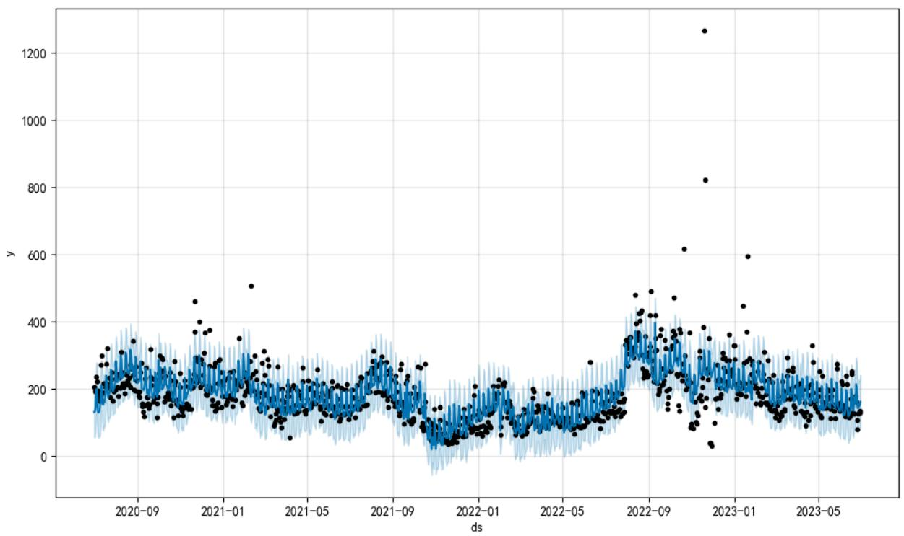

<details>
<summary>scatter</summary>

| ds | y |
| --- | --- |
| ~2020-09 | ~200 |
| ~2021-01 | ~500 |
| ~2021-05 | ~150 |
| ~2021-09 | ~250 |
| ~2022-01 | ~100 |
| ~2022-05 | ~150 |
| ~2022-09 | ~480 |
| ~2023-01 | ~600 |
| ~2023-05 | ~150 |
</details>

图21 花叶类蔬菜 Prophet 回归结果

花叶类蔬菜 Prophet 回归结果如上图所示，可以看出 Prophet 回归有效忽略了离群值与缺失值的影响，在周度、年度均展现出明显的周期性，对数据点的拟合非常良好。下图给出了回归中的各成分项结果，由上至下依次为趋势项、节假日项、周度周期项、年度周期项、外生变量项（即 $f(P_{i}(t))$ ）。

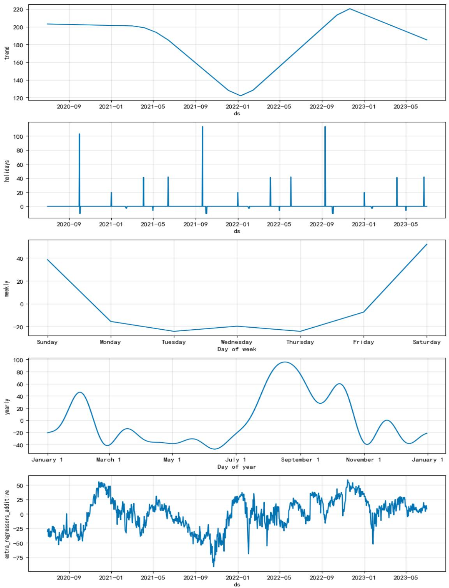  
图22 花叶类蔬菜 Prophet 回归成分项结果

从趋势项上看，2022年1月份花叶类蔬菜消费出现低谷，2022年10月份出现小高峰，但整体来看没有明显的增长趋势。

从节假日项上看，每年国庆节期间花叶类蔬菜消费迎来高峰，清明、端午等小长假期间也有消费的小高峰，部分单品（如水生根茎类的鲜粽子叶）销售额在特定时间会出现显著增长，但是在春节期间花叶类蔬菜消费反而较平时略有下降，推测春节期间消费者较平时消费更多肉类，对花叶类蔬菜的消费产生了轻微的压缩。

从周度周期项上看，周末的花叶类蔬菜消费显著高于工作日。一方面考虑到工作日期间部分消费者会在外用餐，如单位食堂，购买蔬菜做饭的频次下降，导致商超花叶类蔬菜的销量下降；另一方面部分消费者会选择在周末提前采购好下一周所需的蔬菜，故周末商超花叶类蔬菜的销量上升。

从年度周期项上面看,7-8月为年度销量的高峰,对应花叶类蔬菜集中上市的时间。

结合以上分析，各因素的表现都与日常生活实际十分吻合，因此本文认为使用Prophet模型进行预测和去季节性是十分合理的。同时，外生变量项在回归模型中占据较大比例，可以认为成本加成定价水平及批发价格水平对花叶类蔬菜的销售总量具有较为显著的影响。

在分别剔除周期性与节假日的影响后，先进行线性回归，结果如下：

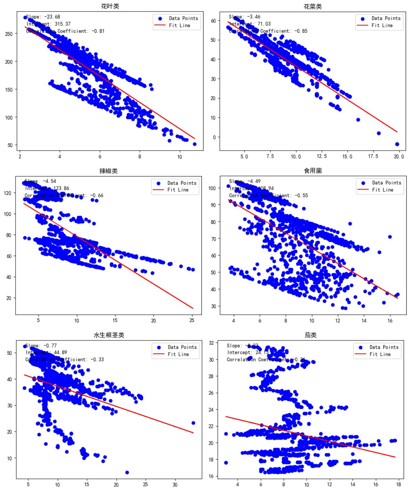  
图23 各品类影响函数拟合结果（横轴为价格，纵轴为销量）

可以看出该模型对花叶类、花菜类的拟合效果较为理想，对辣椒类、食用菌、水生根茎的拟合效果一般，对茄类拟合效果较差，主要受限于 Prophet 模型对噪声的识别能力，同一价格在 Prophet 模型未识别的噪声影响下对应较宽的销量区间。但是，各品类拟合线斜率项均对应负值，且结合图像可见明显趋势。为得到成本加成定价与蔬菜品类总销售量的关系，本文采用如下的处理办法以进一步刻画这种趋势：对任意数据点对应的价格，考虑其邻域内的所有数据点（价格差距 0.1 元以内），取这些数据点的中值进行拟合。对比可见拟合效果较处理前显著提升，成本加成定价确定的价格水平对销量的偏效应由表。

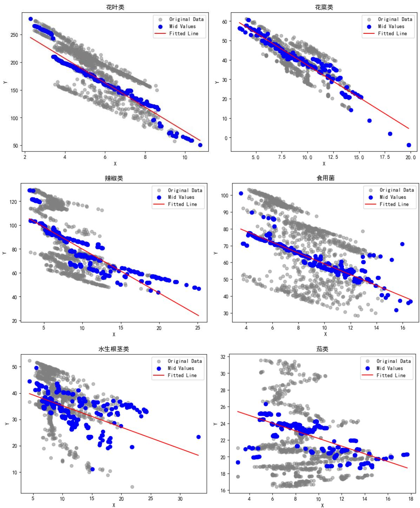  
图24 各品类影响函数取中值拟合结果（横轴为价格，纵轴为销量）

表4 各品类影响函数拟合结果

<table><tr><td>品类名称</td><td>价格对销量的偏效应</td><td>相关系数</td></tr><tr><td>花叶类</td><td>-21.910</td><td>-0.965</td></tr><tr><td>花菜类</td><td>-3.327</td><td>-0.966</td></tr><tr><td>辣椒类</td><td>-3.694</td><td>-0.881</td></tr><tr><td>食用菌</td><td>-3.215</td><td>-0.914</td></tr><tr><td>水生根茎类</td><td>-0.815</td><td>-0.565</td></tr><tr><td>茄类</td><td>-0.459</td><td>-0.687</td></tr></table>

## 5.5 问题二基于 Prophet 预测和模拟退火算法的优化模型建立

最优的补货与定价策略可以由下式确定:

$$
\left. \underset {P _ {i} (t), Q _ {i} (t)} {\operatorname{argmax}} \left\{\sum_ {i} \left[ P _ {i} (t) - C _ {i} (t) \right] \cdot Q _ {i} (t) \left(1 - l _ {i}\right) + \left[ d _ {i} \cdot P _ {i} (t) - C _ {i} (t) \right] \cdot Q _ {i} (t) \cdot l _ {i} \right\} \right. \tag {13}
$$

其中 $P_{i}(t)$ 表示蔬菜品类 $i$ 的价格， $C_i(t)$ 表示该蔬菜品类的批发价格， $Q_i(t)$ 表示该蔬菜品类的销售总量，以上三个参量为模型的核心参数，也是后续时间序列分析预测的主要指标。批发价格 $C_i(t)$ 不由商超决定，主要受季节性因素及市场整体趋势的影响，可以不添加外生变量的 Prophet 模型直接进行预测。 $d_i(t)$ 蔬菜品类 $i$ 进行打折销售时的平均折扣率， $l_i(t)$ 蔬菜品类 $i$ 的平均损耗率（包括滞销导致的品相变差、运损）。

由于蔬菜类商品必须当天售卖，不存在存货，因此最优的销售总量应当与市场需求持平，即满足：

$$
Q _ {i} (t) = D _ {i} (t) \tag {14}
$$

考虑到包含外生变量的 Prophet 模型在给定外生变量未来值的前提下能进行较为准确预测，本文将优化模型的变量设置为价格，基于设定的价格使用 Prophet 模型对蔬菜需求量进行预测，计算出利润作为优化的目标函数。由于需要预测 2023 年 7 月 1 日至 7 月 7 日的价格，在每一天预测结束后，将该日最优价格与成交量作为预测下一日时可使用的历史价格与成交量数据，使用 Prophet 模型进行回归。

由于使用了 Prophet 模型，使用常规优化算法计算全局最优解难度较大。本文采用模拟退火算法，以 2023 年 6 月 30 日的定价方案为初始价格，寻找局部最优解。模拟退火算法是一种模拟自然界固体降温的启发式算法，在高温时定价策略可以在较大范围内波动，若新定价策略较原有定价策略能够产生更高的利润则选择使用新定价策略，若利润较原有定价策略更低也有一定概率接受新定价策略。随着温度的逐渐降低，定价策略波动范围逐渐下降，最终达到局部最优解。

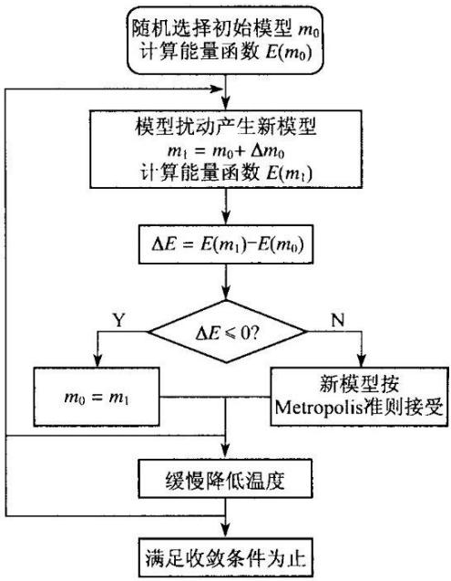

<details>
<summary>flowchart</summary>

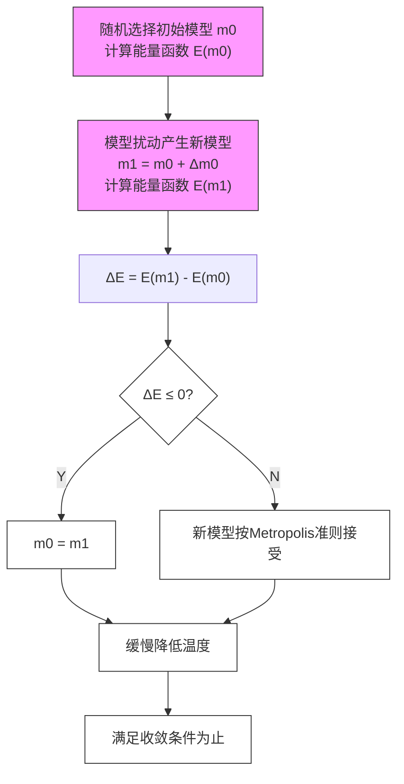
```mermaid
graph TD
  A["随机选择初始模型 m0\n计算能量函数 E(m0)"] --> B["模型扰动产生新模型\nm1 = m0 + Δm0\n计算能量函数 E(m1)"]
  B --> C["ΔE = E(m1) - E(m0)"]
  C --> D{"ΔE ≤ 0?"}
  D -->|Y| E["m0 = m1"]
  D -->|N| F["新模型按Metropolis准则接受"]
  E --> G["缓慢降低温度"]
  F --> G
  G --> H["满足收敛条件为止"]
  style A fill:#f9f,stroke:#333
  style B fill:#f9f,stroke:#333
  style D fill:#fff,stroke:#333
  style E fill:#fff,stroke:#333
  style F fill:#fff,stroke:#333
  style G fill:#fff,stroke:#333
  style H fill:#fff,stroke:#333
```
</details>

图25 模拟退火流程图[1]

值得关注的是，本文已经假设了需求函数只有在较小的价格波动范围内才具有有效性，因此距离初始定价方案较远的全局最优解反而并不具备实际意义，模型的目标是寻找位于上一日定价附近的局部最优解；另外 Prophet 模型虽然较神经网络等算法具有较高的效率，但是在优化过程中需要反复调用，会消耗大量的时间，实际执行时需要兼顾算法的运行时长。因此该模拟退火模型较传统的模拟退火模型调整了相关参数，采用较小的随机波动范围、较低初始温度以实现局部最优解的快速查找。

## 5.6 问题二模型求解与分析

基于 Prophet 模型，首先预测出 2023 年 7 月 1 日至 2023 年 7 月 7 日的各品类蔬菜进货价格数据。

表5 2023.7.1-2023.7.7 各品类批发价格预测数据（单位：元/千克）

<table><tr><td>日期</td><td>水生根茎类</td><td>花叶类</td><td>花菜类</td><td>茄类</td><td>辣椒类</td><td>食用菌</td></tr><tr><td>2023/7/1</td><td>9.40</td><td>3.60</td><td>8.82</td><td>3.83</td><td>4.57</td><td>3.91</td></tr><tr><td>2023/7/2</td><td>9.25</td><td>3.60</td><td>8.79</td><td>3.85</td><td>4.64</td><td>3.91</td></tr><tr><td>2023/7/3</td><td>8.96</td><td>3.58</td><td>8.74</td><td>3.73</td><td>4.69</td><td>3.91</td></tr><tr><td>2023/7/4</td><td>8.80</td><td>3.59</td><td>8.73</td><td>3.63</td><td>4.89</td><td>4.02</td></tr><tr><td>2023/7/5</td><td>8.67</td><td>3.62</td><td>8.82</td><td>3.64</td><td>5.08</td><td>3.88</td></tr><tr><td>2023/7/6</td><td>8.32</td><td>3.65</td><td>8.81</td><td>3.59</td><td>5.13</td><td>3.82</td></tr></table>

将这一部分数据作为模型的已知参量，结合已经处理好的蔬菜品类平均折扣率与平均损耗率数据，使用模拟退火算法迭代求解，得到的日补货总量和定价策略如下：

表6 2023.7.1-2023.7.7 各品类日补货总量预测数据（单位：千克）

<table><tr><td>日期</td><td>水生根茎类</td><td>花叶类</td><td>花菜类</td><td>茄类</td><td>辣椒类</td><td>食用菌</td></tr><tr><td>2023/7/1</td><td>31.3</td><td>208.9</td><td>42.5</td><td>29.2</td><td>107.7</td><td>88.4</td></tr><tr><td>2023/7/2</td><td>28.4</td><td>189.6</td><td>42.8</td><td>29.2</td><td>100.7</td><td>83.4</td></tr><tr><td>2023/7/3</td><td>14.9</td><td>137.0</td><td>29.2</td><td>22.2</td><td>72.3</td><td>58.1</td></tr><tr><td>2023/7/4</td><td>14.5</td><td>129.7</td><td>28.8</td><td>20.8</td><td>68.6</td><td>54.1</td></tr><tr><td>2023/7/5</td><td>15.7</td><td>135.5</td><td>30.3</td><td>20.8</td><td>69.9</td><td>60.7</td></tr><tr><td>2023/7/6</td><td>15.1</td><td>123.2</td><td>29.7</td><td>20.6</td><td>69.4</td><td>59.2</td></tr></table>

表7 2023.7.1-2023.7.7 各品类定价策略（单位：元）

<table><tr><td>日期</td><td>水生根茎类</td><td>花叶类</td><td>花菜类</td><td>茄类</td><td>辣椒类</td><td>食用菌</td></tr><tr><td>2023/7/1</td><td>14.56</td><td>5.92</td><td>11.58</td><td>8.31</td><td>6.10</td><td>7.00</td></tr><tr><td>2023/7/2</td><td>14.94</td><td>6.32</td><td>11.58</td><td>8.54</td><td>6.81</td><td>7.00</td></tr><tr><td>2023/7/3</td><td>14.70</td><td>6.32</td><td>11.58</td><td>8.54</td><td>7.30</td><td>7.16</td></tr><tr><td>2023/7/4</td><td>14.87</td><td>6.32</td><td>11.58</td><td>8.93</td><td>8.39</td><td>7.65</td></tr><tr><td>2023/7/5</td><td>14.87</td><td>6.32</td><td>11.58</td><td>8.93</td><td>8.39</td><td>7.65</td></tr><tr><td>2023/7/6</td><td>14.87</td><td>6.84</td><td>11.58</td><td>8.93</td><td>8.90</td><td>7.84</td></tr></table>

表8 2023.7.1-2023.7.7 各品类加成比率

<table><tr><td>日期</td><td>水生根茎类</td><td>花叶类</td><td>花菜类</td><td>茄类</td><td>辣椒类</td><td>食用菌</td></tr><tr><td>2023/7/1</td><td>54.8%</td><td>64.2%</td><td>31.3%</td><td>117.2%</td><td>33.5%</td><td>78.9%</td></tr><tr><td>2023/7/2</td><td>61.6%</td><td>75.5%</td><td>31.7%</td><td>122.0%</td><td>46.6%</td><td>79.0%</td></tr><tr><td>2023/7/3</td><td>64.1%</td><td>76.6%</td><td>32.5%</td><td>129.3%</td><td>55.6%</td><td>83.0%</td></tr><tr><td>2023/7/4</td><td>69.0%</td><td>76.0%</td><td>32.6%</td><td>146.1%</td><td>71.7%</td><td>90.4%</td></tr><tr><td>2023/7/5</td><td>71.6%</td><td>74.7%</td><td>31.2%</td><td>145.0%</td><td>65.3%</td><td>97.2%</td></tr><tr><td>2023/7/6</td><td>78.8%</td><td>87.6%</td><td>31.5%</td><td>148.9%</td><td>73.5%</td><td>105.4%</td></tr></table>

## 六、问题三模型建立与求解

## 6.1 问题三求解思路

问题三需要基于问题二中获得的销售量与成本加价定价的关系，进一步探究7月1日各单品蔬菜的进货量与定价策略，以获得最大的利润。此外，商超需要进一步制定单品的补货价格，因此增加了限制条件：即可售单品总数控制在27-33个，而各单品定购量均至少为2.5千克的要求。首先，本节筛选得到2023年6月24-30日的可售蔬菜单品。之后，结合问题二所建立的Prophet预测模型，本节建立了各单品蔬菜售价与销量之间的关系。考虑到大部分品类的蔬菜若当日未售出，则隔日就无法再售，因此忽略已有库存；此外，由于商超希望利润最大，假定当日商超从供应商处批发得到的所有蔬菜（去除运输损耗之后）均于当日售出。最后，根据已有条件构造混合整数二次规划（MIQP），并使用遗传算法进行求解。

## 6.2 问题三模型建立

## 6.2.1 模型假定和预处理

首先，认为 2023 年 6 月 24-30 日的可售品种即 2023 年 6 月 24-30 日范围内有批发价格的单品，经过 R 语言代码分析后，筛选出 61 种蔬菜单品。

其次，为了使商超利润最大化，假定当日商超从供应商处批发得到的所有蔬菜（去除运输损耗 $c_{i}$ 之后）均于当日售出，而不至于等到隔日丢弃或打折销售。

之后，进行了需求分析：

Step1) 认为打折商品不是本问题该考虑的市场需求，因此只将非打折商品作为需求。这是因为：第一，打折商品源于超市过量的进货行为，在本问题精确控制进货量的情况下不应该使任何商品变成打折商品；第二，打折商品的利润率低，而本问题追求最大利润，因此不应该考虑打折商品。

Step2）认为非打折商品中利润后 10% 的销售记录并非本问题该考虑的需求。这是因为：第一，利润较低的销售背后可能是消费者出于贪便宜的心理购买，而非真正的刚需；第二，又可能是因为应季蔬菜的大量上市导致利润较低，但该种情况下往往需要依靠 “跑量” 来赚取规模利润，也不适用于本题在有限空间下利润最大化的目标。

Step3）对于任意单品，将其去除 Step2-3 中被排除的销售记录后，过去三年中 6-7 月的总销量除以三年 6-7 月的天数，作为 2023.7.1 的需求。

这是因为，顾客需求是本问题的前提条件，即约束，因此需要得到一个常数作为需求，而7.1位于6-7月的中间，用6-7月的销售数据可以较好地反映季节性的需求，同时能够去除每日销量的噪声干扰。

## 6.2.2 建立目标函数

为了使商超收益最大化，建立目标函数：

$$
\max w = \sum_ {i = 1} ^ {n} (1 - a _ {i}) * (z _ {i} - c _ {i}) * y _ {i}
$$

其中，w 表示 2023 年 7 月 1 日商超的总利润。

决策变量为 yi 和 zi，其中 yi 表示单品 i 蔬菜的进货量（千克），zi 表示单品 i 蔬菜的定价。

已知常量为 ai 和 ci，其中 ai 为表示单品 i 蔬菜的损耗率，数据来自于附件 4 中提供的损耗率。ci 表示单品 i 蔬菜的批发价，数据来源于附件 3 中提供的批发价格。对于附件 3 中提供的批发价格，将 61 种单品蔬菜三年 6、7 月份的批发价格求平均值，作为 7 月 1 日该单品蔬菜的批发价格。

## 6.2.3 设置约束条件

为了控制可售单品总数为 27-33 个，引入决策变量 xi。设单品 i 蔬菜进货时，xi 取 1；单品 i 蔬菜不进货时，xi 取 0。因此有：

$$
\begin{array}{l} x _ {i} = 0, 1 \\ 2 7 \leq \sum_ {i = 1} ^ {n} x _ {i} \leq 3 3 \end{array}
$$

为了控制各单品订购量至少为 2.5 千克的要求，有以下约束：

$$
2. 5 x _ {i} \leq y _ {i}
$$

另一方面，当进货量 $y_{i}$ 过大时，显然过度偏离日均需求量，无法满足商品当日卖出的假设。考虑到本题规定的27-33个单品，是61个单品的一半左右，而单品的日均需求量最大不超过25kg，将此处单品的最大进货量 $y_{i}$ 设置在25kg的两倍：

$$
y _ {i} \leq 5 0 x _ {i}
$$

如此，当单品 i 不进货时， $y_{i}$ 被约束为 0；当单品 i 进货时， $y_{i}$ 被约束在最小陈列量 2.5kg 到最大需求量 50kg 之间。

类似的，为了尽量满足顾客对于各品类蔬菜的需求，同时又确保能够当天售出，令各品类的总进货量控制在 0.6 到 1 倍的品类总需求之间。

$$
(0. 6 \sum_ {i \in \mathcal {G} _ {j}} d _ {i} - \sum_ {i \in \mathcal {G} _ {j}} y _ {i}) \leq 0
$$

$$
(\sum_ {i \in \mathcal {G} _ {j}} y _ {i} - \sum_ {i \in \mathcal {G} _ {j}} d _ {i}) \leq 0
$$

但是，后续求解过程中发现，有部分品类难以满足上述需求，因此引入 $u_{j}$ 与 $v_{j}$ (j=1,2,3,4,5,6)两个二进制辅助变量，控制上述两组6个条件中，每组只需有不少于5个条件成立即可：

$$
\begin{array}{l} u _ {j} * (0. 6 \sum_ {i \in \mathcal {G} _ {j}} d _ {i} - \sum_ {i \in \mathcal {G} _ {j}} y _ {i}) \leq 0 \\ v _ {j} * (\sum_ {i \in \mathcal {G} _ {j}} y _ {i} - \sum_ {i \in \mathcal {G} _ {j}} d _ {i}) \leq 0 \\ 5 - \sum_ {i = 1} ^ {n} u _ {i} \leq 0 \\ 5 - \sum_ {i = 1} ^ {n} v _ {i} \leq 0 \\ \end{array}
$$

此外，结合题目二中所建立的 Prophet 预测模型，将各单品蔬菜日销量中的时间因素去除后，对各单品蔬菜日销量与售价之间进行回归分析，并建立线性模型：

$$
z _ {i} = (y _ {i} - \beta_ {i 0}) / \beta_ {i 1}
$$

但是，经过分析后发现部分单品日销量缺失值较多，又或是日销量与售价之间并无显著关系，导致因此对 $\beta_{i1}$ 进行调整。将拟合程度较好的 $\beta_{i1}$ 筛选出来，观察后发现其与进价呈现一定线性相关性，因此利用该线性关系拟合出剩下的 $\beta_{i1}$ 。

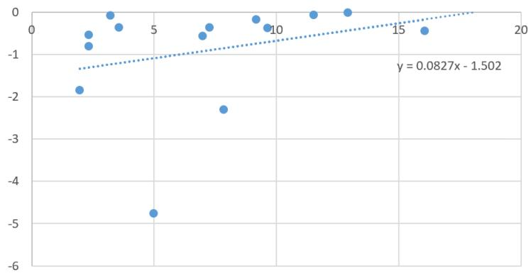

<details>
<summary>scatter</summary>

| X | Y |
| --- | --- |
| ~2.5 | ~-1.8 |
| ~3.0 | ~-0.6 |
| ~3.0 | ~-0.8 |
| ~4.0 | ~-0.1 |
| ~4.5 | ~-0.4 |
| ~5.0 | ~-4.7 |
| ~7.0 | ~-0.6 |
| ~7.5 | ~-0.3 |
| ~8.0 | ~-2.3 |
| ~9.0 | ~-0.2 |
| ~9.5 | ~-0.4 |
| ~11.5 | ~-0.1 |
| ~13.0 | 0 |
| ~16.0 | ~-0.4 |
</details>

图26 $\beta_{i1}$ 与进价的相关关系

## 6.2.4 优化模型汇总

设(未知变量) $x_{i}$ 为0表示不进货，为1表示进货， $y_{i}$ 表示进货量，单位为千克， $z_{i}$ 表示定价， $u_{j}$ 和 $v_{j}$ 是辅助变量。

$$
\underset {\mathbf {x}, \mathbf {y}} {\operatorname{argmax}} w = \sum_ {i = 1} ^ {n} (1 - a _ {i}) \cdot (z _ {i} - c _ {i}) \cdot y _ {i}
$$

$$
s. t. \left\{ \begin{array}{l} 2 7 \leq \sum_ {i = 1} ^ {n} x _ {i} \leq 3 3 \\ 2. 5 x _ {i} \leq y _ {i} \\ y _ {i} \leq 5 0 x _ {i} \\ u _ {i} \cdot \left(0. 5 \sum_ {i \in \mathcal {G} _ {j}} d _ {i} - \sum_ {i \in \mathcal {G} _ {j}} y _ {i}\right) \leq 0 \\ v _ {i} \cdot \left(\sum_ {i \in \mathcal {G} _ {j}} y _ {i} - \sum_ {i \in \mathcal {G} _ {j}} d _ {i}\right) \leq 0 \\ 5 - \sum_ {i = 1} ^ {n} u _ {i} \leq 0 \\ 5 - \sum_ {i = 1} ^ {n} v _ {i} \leq 0 \\ z _ {i} = \frac {y _ {i} - \beta_ {i _ {0}}}{\beta_ {i _ {1}}} \\ i = 1, 2, \dots , 5 8 \\ j = 1, 2, \dots , 6 \end{array} \right.
$$

其中(已知常数)

i表示单品

j表示品类

$a_{i}$ 表示损耗率

$c_{i}$ 表示批发价

$d_{i}$ 表示需求量

$\beta_{i1}$ 和 $\beta_{i0}$ 是定价与进货量的线性系数

$G_{j}$ 表示第j品类的蔬菜集合，比如花叶类包括什么什么蔬菜i

此外，进货量 $y_{i}$ 与定价 $z_{i}$ 的关系也可以用程序做 $y_{i}=f(z_{i})$ 的关系，需要题目2的函数 $f()$

## 6.3 问题三模型求解与分析

由于上述建立的混合整数二次规划模型涉及较多的决策变量和约束条件，使用常规算法计算最优解难度较大，因此使用遗传算法来解。遗传算法是模拟达尔文生物进化论的自然选择和遗传学机理的生物进化过程的计算模型，是一种通过模拟自然进化过程探索最优解的方法。使用 Python 程序设计编写遗传算法对该规划进行求解，分别设置最大进化次数为 2000、突变概率为 0.5 以及交叉概率为 0.7。

算法求解本模型规划的迭代过程如下图所示:

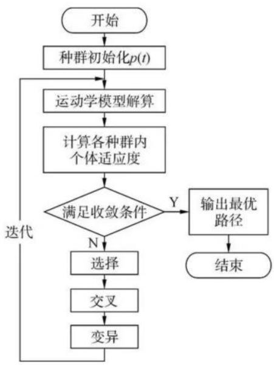

<details>
<summary>flowchart</summary>

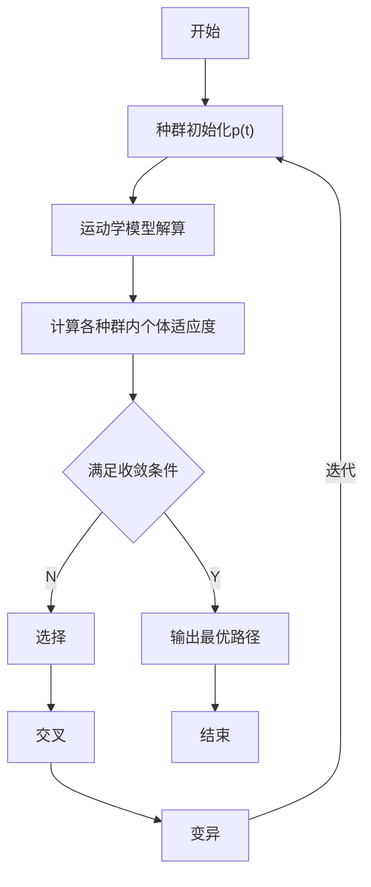
```mermaid
graph TD
  A["开始"] --> B["种群初始化p(t)"]
  B --> C["运动学模型解算"]
  C --> D["计算各种群内个体适应度"]
  D --> E{"满足收敛条件"}
  E -->|Y| F["输出最优路径"]
  E -->|N| G["选择"]
  G --> H["交叉"]
  H --> I["变异"]
  I -->|"迭代"| B
  F --> J["结束"]
```
</details>

图27 遗传算法求解流程图  
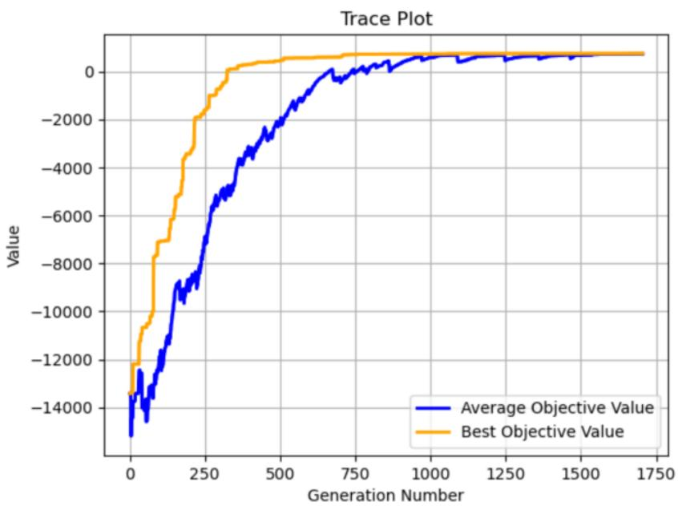

<details>
<summary>line</summary>

| Generation Number | Average Objective Value | Best Objective Value |
| --- | --- | --- |
| 0 | ~-13500 | ~-13500 |
| 250 | ~-8500 | ~-1500 |
| 500 | ~-2500 | ~500 |
| 750 | ~-500 | ~600 |
| 1000 | ~500 | ~650 |
| 1250 | ~500 | ~650 |
| 1500 | ~600 | ~650 |
| 1750 | ~650 | ~650 |
</details>

图28 遗传算法求解迭代过程

最终解得选择的蔬菜单品，以及其进货量、定价与利润，最大化利润为 743 元。

表9 进货的蔬菜单品品种、进货量、定价及利润

<table><tr><td>单品名称</td><td>品类名称</td><td>进货量</td><td>定价</td><td>利润</td></tr><tr><td>野生粉藕</td><td>水生根茎类</td><td>16.1</td><td>10.9</td><td>-72.3</td></tr><tr><td>净藕(1)</td><td>水生根茎类</td><td>10.8</td><td>18.2</td><td>75.3</td></tr><tr><td>洪湖藕带</td><td>水生根茎类</td><td>18.0</td><td>6.7</td><td>-154.1</td></tr><tr><td>金针菇(盒)</td><td>食用菌</td><td>2.5</td><td>3.2</td><td>4.5</td></tr><tr><td>金针菇(1)</td><td>食用菌</td><td>4.1</td><td>6.7</td><td>10.3</td></tr><tr><td>杏鲍菇(1)</td><td>食用菌</td><td>5.5</td><td>7.3</td><td>9.4</td></tr><tr><td>双孢菇(盒)</td><td>食用菌</td><td>3.4</td><td>4.4</td><td>3.5</td></tr><tr><td>紫茄子(2)</td><td>茄类</td><td>6.9</td><td>9.7</td><td>38.4</td></tr><tr><td>青茄子(1)</td><td>茄类</td><td>4.0</td><td>6.4</td><td>8.9</td></tr><tr><td>长线茄</td><td>茄类</td><td>7.0</td><td>10.6</td><td>23.7</td></tr><tr><td>螺丝椒</td><td>辣椒类</td><td>8.5</td><td>16.6</td><td>71.0</td></tr><tr><td>芜湖青椒(1)</td><td>辣椒类</td><td>8.4</td><td>10.5</td><td>56.8</td></tr><tr><td>小米椒(份)</td><td>辣椒类</td><td>3.9</td><td>4.8</td><td>9.2</td></tr><tr><td>七彩椒(1)</td><td>辣椒类</td><td>10.5</td><td>12.0</td><td>13.3</td></tr><tr><td>青线椒</td><td>辣椒类</td><td>7.0</td><td>9.5</td><td>16.2</td></tr><tr><td>苋菜</td><td>花叶类</td><td>4.3</td><td>4.2</td><td>6.4</td></tr><tr><td>云南生菜</td><td>花叶类</td><td>13.1</td><td>17.3</td><td>128.4</td></tr><tr><td>竹叶菜</td><td>花叶类</td><td>6.2</td><td>8.1</td><td>30.7</td></tr><tr><td>上海青</td><td>花叶类</td><td>5.0</td><td>8.2</td><td>17.6</td></tr><tr><td>菜心</td><td>花叶类</td><td>4.6</td><td>6.1</td><td>6.0</td></tr><tr><td>木耳菜</td><td>花叶类</td><td>3.2</td><td>3.6</td><td>1.2</td></tr><tr><td>云南油麦菜</td><td>花叶类</td><td>6.4</td><td>9.2</td><td>29.8</td></tr><tr><td>菠菜</td><td>花叶类</td><td>9.7</td><td>13.0</td><td>26.3</td></tr><tr><td>娃娃菜</td><td>花叶类</td><td>4.8</td><td>5.8</td><td>4.8</td></tr><tr><td>红薯尖</td><td>花叶类</td><td>6.0</td><td>8.2</td><td>27.1</td></tr><tr><td>奶白菜</td><td>花叶类</td><td>3.4</td><td>5.1</td><td>7.2</td></tr><tr><td>甜白菜</td><td>花叶类</td><td>5.0</td><td>5.9</td><td>4.2</td></tr><tr><td>小青菜(1)</td><td>花叶类</td><td>2.9</td><td>3.8</td><td>2.4</td></tr><tr><td>云南生菜(份)</td><td>花叶类</td><td>3.6</td><td>5.0</td><td>4.6</td></tr><tr><td>黄白菜(2)</td><td>花叶类</td><td>4.9</td><td>9.4</td><td>19.3</td></tr><tr><td>西兰花</td><td>花菜类</td><td>17.3</td><td>28.5</td><td>324.7</td></tr><tr><td>枝江青梗散花</td><td>花菜类</td><td>9.7</td><td>6.1</td><td>-32.1</td></tr><tr><td>青梗散花</td><td>花菜类</td><td>8.2</td><td>11.2</td><td>20.6</td></tr></table>

进一步分析上述方案满足约束的情况，发现 4 种品类能够满足 68%-99% 的需求，1 种品类只能满足 59% 的需求，另一种满足了 308% 需求。满足需求的情况较为良好。

表10 方案满足约束的情况

<table><tr><td>品类名称</td><td>品类进货量</td><td>品类需求量</td><td>需求满足度</td></tr><tr><td>水生根茎类</td><td>44.9</td><td>14.6</td><td>308%</td></tr><tr><td>食用菌</td><td>15.5</td><td>21.6</td><td>72%</td></tr><tr><td>茄类</td><td>18.0</td><td>26.2</td><td>68%</td></tr><tr><td>辣椒类</td><td>38.3</td><td>49.0</td><td>78%</td></tr><tr><td>花叶类</td><td>82.9</td><td>141.5</td><td>59%</td></tr><tr><td>花菜类</td><td>35.3</td><td>35.7</td><td>99%</td></tr></table>

## 七、问题四的模型分析

通过上述三问的建模与分析，本文认为商超可以进一步采集获取以下数据，从而建立更为完善的模型，并更好地制定蔬菜商品的补货和定价决策。

## 7.1 库存空间：每天或每周库存的可容纳限度（千克）

更具体的库存空间限制可以使得对应的补货策略更加可靠。结合该限制，可以针对每天的库存量、进货量和销售量之间的关系建立约束条件（或建立动态规划模型）。假设库存蔬菜隔天损耗率为0，以每天库存的可容纳限度为例，可以建立动态规划模型：

$$
\max f (s _ {k}) = f (s _ {k - 1}) + \sum_ {i = 1} ^ {n} z _ {i, k} m _ {i, k} \tag {15}
$$

其中， $m_{i,k}$ 表示 i 单品蔬菜第 k 天的销售量， $z_{i,k}$ 表示 i 单品蔬菜第 k 天的利润， $f(s_k)$ 表示第 k 天结束时商超获得的总利润，s\_k 表示第 k 天蔬菜的总存货量。式（15）即表示需要最大化第 k 天销售蔬菜所获得的总利润。

$$
s _ {i, k + 1} = s _ {i, k} + u _ {i, k} - m _ {i, k} \tag {16}
$$

其中， $s_{\{i,k\}}$ 表示 i 单品蔬菜第 k 天早晨的存货量， $u_{i,k}$ 表示 i 单品蔬菜第 k 天早晨的进货量。上市即表示在库存蔬菜隔天损耗率为 0 的情况下，将隔日早晨存货量与当日早晨存货量、当题进货量与当日销售量之间建立等价关系。

$$
s _ {k + 1} = \sum_ {i = 1} ^ {n} s _ {i, k + 1} \leq a \tag {17}
$$

其中，a 表示每天库存的可容纳限度（千克）。上式表示每日的库存量不超过库存的最大可容纳限度。

## 7.2 库存隔天损耗率：蔬菜隔天早晨库存量/当天晚上库存量

通过库存隔天损耗率，可以建立蔬菜隔天早晨库存量与当天晚上库存量之间的关系。结合实际经验，认为库存隔天损耗率与该时间段的季节、温度有关，因此可以尝试对库存隔天损耗率的历史数据预测未来损耗率。

获得库存隔天损耗率之后，即可以将式（16）优化为：

$$
s _ {i, k + 1} = g _ {i, k} (s _ {i, k} + u _ {i, k} - m _ {i, k}) \tag {18}
$$

其中， $g_{i,k}$ 表示 i 单品蔬菜第 k 天的库存隔天损耗率，即 i 单品蔬菜第 $k+1$ 天早晨库存量与第 k 天晚上库存量的比例。

## 7.3 各品类蔬菜每千克所对应的体积（立方米）

实际情况下，蔬菜进货或交易时以其重量作为成交依据，但商超的仓储库存或货架摆放的最大限度应该是以体积作为限制。因此，若想进一步优化上述的动态规划，需要知道最大库存空间的容量（立方米）以及各品类蔬菜每千克所对应的体积（立方米）。

获得该数据之后，可以将式（3）优化为：

$$
S _ {k + 1} = \sum_ {i = 1} ^ {n} s _ {i, k + 1} \rho_ {i, k + 1} \leq A \tag {19}
$$

其中， $S_{k+1}$ 表示第 $k+1$ 天存货蔬菜所占体积，而 A 表示最大库存空间的容量。式（5）即表示商超存货蔬菜所占体积不能超过最大库存空间的容量。

## 7.4 蔬菜各商品最佳保存时长

结合实际情况，蔬菜存放时间过久之后，会出现两种情况：可能是出现损耗而需要丢弃，这反映在之前考虑到的库存隔天损耗率之中；也可能只是品相变差，可以进行打折销售。因此，若考虑库存蔬菜品相变差的情况，则需要获取各单品蔬菜的最佳保存时长；结合打折销售的情况，可以分析出每单品蔬菜存放时间与打折倍数的关系。折扣率可以通过附件2中打折销售的售价与非打折销售的平均售价之间的比值求得。最终，可以获得类似于如下的对应表格：

表11 蔬菜损耗率与折扣率的关联

<table><tr><td>销售日期</td><td>损耗率</td><td>折扣率</td></tr><tr><td>进货当日</td><td>0%</td><td>原价</td></tr><tr><td>存储1天</td><td>10%</td><td>九折</td></tr><tr><td>存储2天</td><td>20%</td><td>七折</td></tr><tr><td>存储3天及以上</td><td>100%</td><td>丢弃</td></tr></table>

## 7.5 运输损耗情况

除了存货损耗之外，蔬菜从供应商运输到商超的过程中也会出现损耗或品相变差的情况，而附件4中并没有明确区分存货损耗率与运输损耗率。此外，结合实际经验，蔬菜的运输损耗率与季节、温度等有一定的关系，进而可以使用往年相同时间段内的运输损耗率来预测未来某段时间的运输损耗率。因此，获得运输损耗情况可以在进货量与可出售量之间建立相应关系，即将上式更新为：

$$
s _ {i, k + 1} = g _ {i, k} [ s _ {i, k} + (1 - \alpha_ {i, k}) u _ {i, k} - m _ {i, k} ] \tag {20}
$$

其中， $\alpha_{i,k}$ 表示 i 单品蔬菜在第 k 天的运输损耗率， $(1-\alpha_{i,k})u_{i,k}$ 则表示去除运输损耗之后商超的进货量。

## 7.6 疫情封控状况：商超所在地每日的封控状况

从前文的 xx 图中可以发现，2021 年 7 月到 2022 年 6 月一年期间内所有蔬菜的年销售量明显小于其余两年的年销售量。结合实际时间背景，认为是由于这一年内疫情反复封控不断，特别是上海 22 年春季的封控，这对居民的日常生活产生了极大的影响，进而也对蔬菜销售量产生了较大影响。此外，2023 年之前，疫情因素对蔬菜销量有或多或少的影响（例如封控前居民会大量囤菜，而封控期间蔬菜销量变得很小），但 2023 年上半年的销量数据却几乎没有疫情因素干扰；因此，在根据历史销量数据对未来销量数据进行预测时，需要去除疫情因素的影响。

通过获取该商超附近疫情期间的封控状况，并结合商超内各蔬菜单品的销售量，可以获得疫情封控对蔬菜销量的影响。进而，可以从蔬菜的销量数据中去除疫情封控因素的影响，更加精确地获得销量与时间、价格之间的关系，或更加准确地构造模型进行销售预测，从而合理地制定补货及定价策略。

## 7.7 客流量：每天的客户流量（人次）

客流量虽然和销售量并非呈现严格的一一对应关系，但是可靠的客流量数据可以使得销售量的预测更加精确，从而可以制定更准确的补货及定价策略。

## 7.8 各单品蔬菜的时令季节

由于商超蔬菜主要为线下销售，其目标客户主要为习惯于线下购买蔬菜的中年居民，而这部分居民更加注重蔬菜的新鲜程度、时令季节等，因此可能在对应季的蔬菜购买更多。此外，应季蔬菜的进货价格也可能更低。需要注意的是，虽然这部分影响因素可能可以反映在已有销量、进价等历史数据中，但由于所提供的数据只涉及3年，并没有覆盖更多的时间周期（若以1年为周期），因此更精确的蔬菜应季特征可以使得模型拟合更加准确。

## 7.9 退货原因

商超可以收集客户退货时所陈述的原因，进行自然语言数据处理和挖掘，从而对客户退货原因进行分类总结，进而可以对决策进行有针对性的改善。例如，若针对某单品蔬菜，由于品相变差而退货的概率较大，就需要考虑合理调整库存量与进货量的比重，从而减少退货率，最大化商超利润。

## 7.10 产地信息

注意到附件 1 中部分单品名称包含的数字编号表示不同的供应来源，但并没有提供具体的产地信息。结合产地信息，可以分析产地来源对销量、定价之间的影响，比如某地的蔬菜由于其品牌效应更受欢迎，从而制定更精准的补货和定价决策。

## 八、模型评价与推广

## 8.1 模型的优点

(1) 模型充分结合实际，简化了折扣率、损耗率等条件，考虑了诸多重要因素，得到合理的模型，如基于 Prophet 模型的补货和定价模型等。这样得到的模型贴合实际，具有较高的应用价值，可以推广和运用到其他行业（比如家电行业）的超市进价和补货决策方案中；  
(2) 本文使用的算法具有优化能力强、并行化能力强等优点，对于求解诸多非线性回归模型都非常适用；

## 8.2 模型的不足

(3) 实际应用中，退货率可能也是重要的因素，但本文未能考虑到这些因素的影响，一定程度上影响了模型的准确性；

(4) 实际上蔬菜销量与定价不一定是线性的，而本文将其作为线性因子处理，忽略了边际效应的影响。

## 参考文献

[1]陈华根,吴健生,王家林等.模拟退火算法机理研究[J].同济大学学报(自然科学版),2004(06):802-805.  
[2]赵杰斌,黄穗东,孙远明等.基于数据挖掘的江门市蔬菜食品安全风险分析与预测[J/OL].食品工业科技:1-16[2023-09-10].https://doi.org/10.13386/j.issn1002-0306.2022120006.  
[3]董燕燕. 不同组合方式下 ARIMA-BiLSTM 模型在蔬菜价格预测方面的构建研究[D]. 东北财经大学,2023.DOI:10.27006/d.cnki.gdbcu.2022.000906.  
[4]毛莉莎. 供应链视角下蔬菜批发市场定价策略及产销模式研究[D]. 中南林业科技大学,2023.DOI:10.27662/d.cnki.gznlc.2022.000680.  
[5]李干琼,王盛威,许世卫等.大城市蔬菜供需分析与预测研究——以上海市为例[J].上海农业学报,2021,37(04):125-132.DOI:10.15955/j.issn1000-3924.2021.04.21.  
[6]陈林生,孙利君,马佳.蔬菜价格短期预测模型比较研究——以上海市青菜价格为例[J].价格理论与实践,2020(09):68-71+178.DOI:10.19851/j.cnki.cn11-1010/f.2020.09.391.

## 附录

附录1 第一问代码  
```r
library("readxl")
library("forecast")
a = read_excel(path = "附件 1.xlsx", sheet = "Sheet1")
b = read_excel(path = "附件 2.xlsx", sheet = "Sheet1")
c = read_excel(path = "附件 3.xlsx", sheet = "Sheet1")
d = read_excel(path = "附件 4.xlsx", sheet = "Sheet1")
correspond=a[,c(1,3)]
library(showtext)
showtext_auto()

library(dplyr)
library("data.table")
correspond=data.table(correspond)
setkey(correspond,单品编码)
bt=data.table(b)
setkey(bt,单品编码)
b_1=bt.correspond]
b_2=aggregate(`销量(千克)`)~(分类编码+销售日期),data=b_1,FUN = sum)
b_2_11=b_2[b_2$分类编码=="1011010101",] #之后会对比改进前的时间序列分析

## 对每个单品的异常值处理(数据预处理)
mylist=unique(b_1$单品编码) #获得所有蔬菜单品的编码
b_i=b_1[b_1$单品编码==mylist[1],]
b_i_1=aggregate(`销量(千克)`)~(单品编码+销售日期),data=b_i,FUN = sum)
#获得第一个蔬菜的每天的售量之和
remove_outlier=function(x){
names(x)[3]="a"
q1=quantile(x$a)[[2]]
q2=quantile(x$a)[[3]]
q3=quantile(x$a)[[4]]
iqr=q3-q1
minq=q1-1.5*iqr
maxq=q3+1.5*iqr
x$a[x$a>maxq|x$a<minq]=NA
x$a[is.na(x$a)]=mean(x$a,na.rm=TRUE)
names(x)[3]="销量(千克)"
return(x)
}
b_i_1=remove_outlier(b_i_1)
bb=b_i_1
for(ii in 2:251){
b_i=b_1[b_1$单品编码==mylist[ii],]
```

```r
if(nrow(b_i)!=1){
    b_i=aggregate(`销量(千克)`)~(单品编码+销售日期),data=b_i,FUN = sum)
    b_i=remove_outlier(b_i)
    bb=rbind(bb,b_i)
}else{
    b_i=b_i[,c(3,1,4)]
    bb=rbind(bb,b_i)
}
}
b_i11=aggregate(`销量(千克)`)~(单品编码+销售日期),data=b_1,FUN = sum)
rm=bb
rm=na.omit(rm)
#write.csv(rm,"remove.outlier.csv")

## 改进后的时间序列分析
rmt=data.table(rm)
setkey(rmt,单品编码)
b_1=rmt[correspond]
b_2=aggregate(`销量(千克)`)~(分类编码+销售日期),data=b_1,FUN = sum)

b_2_1=b_2[b_2$分类编码=="1011010101",]
b_2_2=b_2[b_2$分类编码=="1011010201",]
b_2_3=b_2[b_2$分类编码=="1011010402",]
b_2_4=b_2[b_2$分类编码=="1011010501",]
b_2_5=b_2[b_2$分类编码=="1011010504",]
b_2_6=b_2[b_2$分类编码=="1011010801",]

sxfx=function(x){
    b_sxfx=x
    b_sxfx$销售日期 1=as.Date(b_sxfx$销售日期)
    sales <- b_sxfx[, 3]
    dates <- b_sxfx[, 4]
    dates <- as.Date(dates)
    weekly_sales <- data.frame(Week = format(dates, "%Y-%W"), Sales = sales) %>%
    group_by(Week) %>%
    summarise(TotalSales = sum(Sales))
    #按周进行加总 再进行 ARIMA 分析
    myts <- ts(weekly_sales[, 2], frequency = 52)
    #plot(myts)
    #acf(myts)
    #pacf(myts)
    fit <- auto.arima(myts,seasonal=TRUE)
    myts <- ts(weekly_sales[, 2], frequency = 1)
    plot(myts,xlab="Week",ylab="Total sales per week")
    summary(fit)
}
```

```txt
sxfx(b_2_1)
sxfx(b_2_11)
sxfx(b_2_2)
sxfx(b_2_3)
sxfx(b_2_4)
sxfx(b_2_5)
sxfx(b_2_6)
```

## 品类、按日、总销量算 corr 并画热力图  
```txt
b21=b_2_1\(`(\`销量(千克)\')`
b22=b_2_2\(`(\`销量(千克)\')`
b23=b_2_3\(`(\`销量(千克)\')`
b24=b_2_4\(`(\`销量(千克)\')`
b25=b_2_5\(`(\`销量(千克)\')`
b26=b_2_6\(`(\`销量(千克)\')`
```

```julia
length(b21)
length(b22)
b22=c(b22,0)
length(b23)
length(b24)
b24=c(b24,rep(0,35))
length(b25)
length(b26)
```

```txt
bbb=data.frame(花叶类=b21,
                    花菜类=b22,
                    水生根茎类=b23,
                    茄类=b24,
                    辣椒类=b25,
                    食用菌=b26)
cor(bbb)
library(corrplot) # 基础可视化-定量变量（相关性热图）
bbb %>%
  select_if(is.numeric) %>%
  cor() %>%
  corrplot(method = 'color', order = 'AOE', addCoef.col = 'black')
```

## 品类、按月、总销量 corr 并画热力图  
```txt
b_2$月份 <- format(b_2$销售日期, "%Y-%m")
monthly_sales <- aggregate(`(\`销量(千克)\`)` ~ (分类编码+月份), b_2, sum)
bb_2=monthly_sales
bb_2_1=bb_2[bb_2$分类编码=="1011010101",]
bb_2_2=bb_2[bb_2$分类编码=="1011010201",]
```

```r
bb_2_3=bb_2[bb_2$分类编码=="1011010402",]
bb_2_4=bb_2[bb_2$分类编码=="1011010501",]
bb_2_5=bb_2[bb_2$分类编码=="1011010504",]
bb_2_6=bb_2[bb_2$分类编码=="1011010801",]

bb21=bb_2_1\(`(\`销量(千克)\`)
bb22=bb_2_2\(`(\`销量(千克)\`)
bb23=bb_2_3\(`(\`销量(千克)\`)
bb24=bb_2_4\(`(\`销量(千克)\`)
bb25=bb_2_5\(`(\`销量(千克)\`)
bb26=bb_2_6\(`(\`销量(千克)\`)

length(bb21)
length(bb22)
#b22=c(bb22,0)
length(bb23)
length(bb24)
#b24=c(bb24,rep(0,35))
length(bb25)
length(bb26)

bbbb=data.frame(花叶类=bb21,
                    花菜类=bb22,
                    水生根茎类=bb23,
                    茄类=bb24,
                    辣椒类=bb25,
                    食用菌=bb26)
cor(bbbb)
library(corrplot) # 基础可视化-定量变量（相关性热图）
bbbb %>%
    select_if(is.numeric) %>%
    cor() %>%
    corrplot(method = 'color', order = 'AOE', addCoef.col = 'black')

## 不同单品蔬菜的销量计算 corr 并画热力图
#单品：将总销量占比低于 1%的行去除
kk=aggregate(``销量(千克)\`)~(单品编码),data=b_1,FUN = sum)
kk$比例=kk\(`(\`销量(千克)\`)/sum(kk\(`(\`销量(千克)\`)
b_1_75_list=kk$单品编码[kk$比例<=0.01]
for(i in 1:length(b_1_75_list)){
    if(i==1){
        b_1_75=b_1[b_1$单品编码!=b_1_75_list[i],]
    }else{
        b_1_75=b_1_75[b_1_75$单品编码!=b_1_75_list[i],]
    }
}
```

```r
b_1_75=na.omit(b_1_75)
#获得不同单品蔬菜的月销量 corr
b_1_75$月份 <- format(b_1_75$销售日期, "%Y-%m")
b_1_75=data.table(b_1_75)
setkey(b_1_75,单品编码)
at=data.table(a)
setkey(at,单品编码)
b_1_75=b_1_75[at]
b_1_75=na.omit(b_1_75)
monthly_sales <- aggregate(`销量(千克)`, ~ (单品名称+月份), b_1_75, sum)
library(tidyr)
b_1_75_1 <- pivot_wider(monthly_sales, names_from = 单品名称, values_from = `
销量(千克)')
for(i in 1:nrow(b_1_75_1)){
    b_1_75_1[i,][is.na(b_1_75_1[i,])]=0
}
b_1_75_1=b_1_75_1[,-1]
cor(b_1_75_1)
# 使用 CURE 聚类算法对数据进行聚类，生成聚类标签
library(cluster)
set.seed(123)  # 设置随机种子以获得可重复的结果
k <- 3  # 聚类数
cluster_labels <- pam(cor(b_1_75_1), k)
# 将聚类标签添加到原始数据中
data_a <- cbind(cor(b_1_75_1), Cluster = cluster_labels$clustering)
data_a=data.frame(data_a)
# 根据聚类标签重新排序数据
data_sorted <- data_a[order(data_a$Cluster), ]
# 绘制热力图（使用 heatmap 函数或其他绘图方法）
heatmap_data <- data_sorted[, -ncol(data_sorted)]  # 去除聚类标签列
for(i in nrow(heatmap_data)){
    for(j in nrow(heatmap_data)){
        heatmap_data[i,j]=as.numeric(heatmap_data[i,j])
    }
}
heatmap(as.matrix(heatmap_data),
            #labRow = NA,  # 隐藏行标签
            #labCol = NA,  # 隐藏列标签
            col = colorRampPalette(c("blue", "white", "red"))(100),  # 设置颜色范围
            main = "")

## 求出各个单品蔬菜的月销量
b111=b_1
b111$月份 <- format(b111$销售日期, "%Y-%m")
b111=data.table(b111)
```

```r
setkey(b111,单品编码)
at=data.table(a)
setkey(at,单品编码)
b111=b111[at]
b111=na.omit(b111)
monthly_sales <- aggregate(`销量(千克)`, ~(单品名称+月份), b111, sum)
library(tidyr)
b111_1 <- pivot_wider(monthly_sales, names_from = 单品名称, values_from = `销量(千克)\')
for(i in 1:nrow(b111_1)){
    b111_1[i,][is.na(b111_1[i,])]=0
}
write.csv(b111_1,"xy.csv")

## 求出各单品蔬菜的 6、7 月日销量
b112=b_1
b112$月份 <- format(b112$销售日期, "%m")
b112$年份 <- format(b112$销售日期, "%Y")
b112$年月= format(b112$销售日期,"%Y-%m")
b113=b112[b112$月份=="06"|b112$月份=="07",]
b113=data.table(b113)
setkey(b113,单品编码)
b113=b113[at]
b113=na.omit(b113)
b113=b113[,c(8,3,2)]
b113_1 <- pivot_wider(b113, names_from = 单品名称, values_from = `销量(千克)\')
for(i in 1:nrow(b113_1)){
    b113_1[i,][is.na(b113_1[i,])]=0
}
write.csv(b113_1,"xz.csv")

## K-S 检验-按月检验
# 1. 花叶类 vs. 花菜类
ks.test(bbbb$花叶类, bbbb$花菜类, exact = FALSE)
# 2. 花叶类 vs. 水生根茎类
ks.test(bbbb$花叶类, bbbb$水生根茎类, exact = FALSE)
# 3. 花叶类 vs. 茄类
ks.test(bbbb$花叶类, bbbb$茄类, exact = FALSE)
# 4. 花叶类 vs. 辣椒类
ks.test(bbbb$花叶类, bbbb$辣椒类, exact = FALSE)
# 5. 花叶类 vs. 食用菌
ks.test(bbbb$花叶类, bbbb$食用菌, exact = FALSE)
# 6. 花菜类 vs. 水生根茎类
ks.test(bbbb$花菜类, bbbb$水生根茎类, exact = FALSE) #p-value=0.2106
```

```r
# 7. 花菜类 vs. 茄类
ks.test(bbbb$花菜类, bbbb$茄类, exact = FALSE)
# 8. 花菜类 vs. 辣椒类
ks.test(bbbb$花菜类, bbbb$辣椒类, exact = FALSE)
# 9. 花菜类 vs. 食用菌
ks.test(bbbb$花菜类, bbbb$食用菌, exact = FALSE)
# 10. 水生根茎类 vs. 茄类
ks.test(bbbb$水生根茎类, bbbb$茄类, exact = FALSE)
# 11. 水生根茎类 vs. 辣椒类
ks.test(bbbb$水生根茎类, bbbb$辣椒类, exact = FALSE)
# 12. 水生根茎类 vs. 食用菌
ks.test(bbbb$水生根茎类, bbbb$食用菌, exact = FALSE)
# 13. 茄类 vs. 辣椒类
ks.test(bbbb$茄类, bbbb$辣椒类, exact = FALSE)
# 14. 茄类 vs. 食用菌
ks.test(bbbb$茄类, bbbb$食用菌, exact = FALSE)
# 15. 辣椒类 vs. 食用菌
ks.test(bbbb$辣椒类, bbbb$食用菌, exact = FALSE)
```

```txt
## K-S 检验-按日检验
# 1. 花叶类 vs. 花菜类
ks.test(bbb$花叶类, bbb$花菜类, exact = FALSE) #
# 2. 花叶类 vs. 水生根茎类
ks.test(bbb$花叶类, bbb$水生根茎类, exact = FALSE)
# 3. 花叶类 vs. 茄类
ks.test(bbb$花叶类, bbb$茄类, exact = FALSE)
# 4. 花叶类 vs. 辣椒类
ks.test(bbb$花叶类, bbb$辣椒类, exact = FALSE)
# 5. 花叶类 vs. 食用菌
ks.test(bbb$花叶类, bbb$食用菌, exact = FALSE)
# 6. 花菜类 vs. 水生根茎类
ks.test(bbb$花菜类, bbb$水生根茎类, exact = FALSE)
# 7. 花菜类 vs. 茄类
ks.test(bbb$花菜类, bbb$茄类, exact = FALSE)
# 8. 花菜类 vs. 辣椒类
ks.test(bbb$花菜类, bbb$辣椒类, exact = FALSE)
# 9. 花菜类 vs. 食用菌
ks.test(bbb$花菜类, bbb$食用菌, exact = FALSE)
# 10. 水生根茎类 vs. 茄类
ks.test(bbb$水生根茎类, bbb$茄类, exact = FALSE)
# 11. 水生根茎类 vs. 辣椒类
ks.test(bbb$水生根茎类, bbb$辣椒类, exact = FALSE)
# 12. 水生根茎类 vs. 食用菌
```

```python
ks.test(bbb$水生根茎类, bbb$食用菌, exact = FALSE)
# 13. 茄类 vs. 辣椒类
ks.test(bbb$茄类, bbb$辣椒类, exact = FALSE)
# 14. 茄类 vs. 食用菌
ks.test(bbb$茄类, bbb$食用菌, exact = FALSE)
# 15. 辣椒类 vs. 食用菌
ks.test(bbb$辣椒类, bbb$食用菌, exact = FALSE)

附录 1 第二问代码 (Python)

import pandas as pd
import numpy as np
import cvxpy as cp
import random
import math
from prophet import Prophet
from datetime import datetime, timedelta
import matplotlib.pyplot as plt
from prophet.diagnostics import cross_validation, performance_metrics
from sklearn.linear_model import LinearRegression
from sklearn.metrics import mean_squared_error, mean_absolute_error
    import statsmodels.api as sm

# 创建按品类划分的数据表
df_items = pd.read_excel('附件 1.xlsx', engine='openpyxl') # 从附件 1 读取蔬菜单品的数据
df_sales = pd.read_excel('附件 2.xlsx', engine='openpyxl') # 从附件 2 读取购买流水数据
df_merged = pd.merge(df_sales, df_items, on='单品编码', how='left') # 通过蔬菜编码连接两个数据表

df_merged['金额'] = df_merged['销量(千克)'] * df_merged['销售单价(元/千克)'] # 计算每笔订单的销售金额（考虑退货，所以使用负值）
df_merged.loc[df_merged['销售类型'] == '退货', '金额'] *= -1
df_merged.loc[df_merged['销售类型'] == '退货', '销量(千克)'] *= -1

# 获取蔬菜单品每日平均价格
daily_price = df_merged.groupby(['单品编码', '单品名称', '销售日期'])['销售单价(元/千克)'].mean().reset_index()

# 按照蔬菜单品和销售日期来计算每日销售总销量、总金额
daily_vol = df_merged.groupby(['单品编码', '单品名称', '销售日期'])['销量(千克)'].sum().reset_index()
daily_sales = df_merged.groupby(['单品编码', '单品名称', '销售日期'])['金额'].sum().reset_index()
```

# 根据退货和销售金额计算退货率  
```python
total_returned = df_merged[df_merged['销售类型'] == '退货'].groupby('单品编码')['金额'].sum()
total_sales = df_merged[df_merged['销售类型'] == '销售'].groupby('单品编码')['金额'].sum()
return_rate = (total_returned / total_sales).reset_index(name='退货率')
```

# 合并数据获取每日平均价格  
```python
pivot_price = daily_price.pivot_table(index=['单品编码', '单品名称'], columns='销售日期', values='销售单价(元/千克)', fill_value=0).reset_index()
finalprice_df = pd.merge(df_items[['单品编码', '单品名称', '分类名称']]. return_rate, on='单品编码', how='left')
finalprice_df = pd.merge(finalprice_df, pivot_price, on=['单品编码', '单品名称'], how='left')
```

# 合并数据获取每日销量  
```python
pivot_vol = daily_vol.pivot_table(index=['单品编码', '单品名称'], columns='销售日期', values='销量(千克)', fill_value=0).reset_index()
finalvol_df = pd.merge(df_items[['单品编码', '单品名称', '分类名称']]. return_rate, on='单品编码', how='left')
finalvol_df = pd.merge(finalvol_df, pivot_vol, on=['单品编码', '单品名称'], how='left')
```

# 合并数据以获取每日销售额  
```python
pivot_sales = daily_sales.pivot_table(index=['单品编码', '单品名称'], columns='销售日期', values='金额', fill_value=0).reset_index()
finalsales_df = pd.merge(df_items[['单品编码', '单品名称', '分类名称']]. return_rate, on='单品编码', how='left')
finalsales_df = pd.merge(finalsales_df, pivot_sales, on=['单品编码', '单品名称'], how='left')
```

# 保存为新的 Excel 文件  
```python
finalprice_df.to_excel('output_price.xlsx', index=False, engine='openpyxl')
finalvol_df.to_excel('output_vol.xlsx', index=False, engine='openpyxl')
    finalsales_df.to_excel('output_sales.xlsx', index=False, engine='open-pyx1')
```

# 使用 Prophet 剔除季节因素，研究销售价格和销售总量的关系。X\_1 和 X\_2（可选）为外生解释变量价格  
```txt
X_1='辣椒类'
X_2='茄类'
```

# 读取数据并设置列名  
```python
input_df_sales = pd.read_excel("category_vol.xlsx", sheet_name="销售量",
skiprows=0)
```

```python
input_df_sales.columns = ['ds'] + input_df_sales.columns[1:].tolist()
df_price = pd.read_excel("category_price_index.xlsx", skiprows=0)
df_price.columns = ['ds'] + df_price.columns[1:].tolist()
df_price[X_1].fillna(0, inplace=True)
df_price[X_2].fillna(0, inplace=True)
# num_cols = input_df_sales.select_dtypes(include=['number']).columns
# input_df_sales[num_cols] = input_df_sales[num_cols].where(input_df_sales[num_cols] > 0, 0)

for col in input_df_sales.columns[1:]

    # 选择一个蔬菜品类
    df_sales = input_df_sales[['ds', col]]
    df_sales = df_sales[df_sales[col] > 0].rename(columns={col: 'y'))

    # 合并销售量和利润率数据
    merged_df = pd.merge(df_sales, df_price, on='ds')
    # merged_df = merged_df.drop(merged_df.index[0:1063]).reset_index(drop=True) # 控制时间范围

    # 初始化 Prophet
    model = Prophet(yearly_seasonality=True, weekly_seasonality=True, daily_seasonality=False)
    model.add_country_holidays(country_name='CN')  # 添加中国的节假日
    # model.add_regressor(df_price.columns[1:].all())  # 添加全部价格作为外生解释变量
    # model.add_regressor(X_1)
    # model.add_regressor(X_2)
    model.add_regressor(col)  # 添加对应价格作为外生解释变量
    model.fit(merged_df)

    # 代入 Prophet，分析利润率这一外生变量的关联
    future = model.make_future_dataframe(periods=0)  # 不预测未来，只使用现有数据
    future = pd.merge(future, df_price, on='ds')  # 确保 future 数据框也包含 profit 列
    forecast = model.predict(future)

    # 绘制图像
    # print(forecast)
    # fig1 = model.plot(forecast)
    # fig2 = model.plot_components(forecast)

    print(col,evaluate_prophet_performance(merged_df,forecast))  # 评价拟合效果
```

```python
merged_df['y_adjusted'] =forecast['yhat'] - forecast['yearly'] - forecast['weekly'] - forecast['holidays']  # 剔除季节和节假日效应
# ols_regression(col,merged_df['y_adjusted'],merged_df[X_1],merged_df[X_2])
# plot_scatter_and_fit_line(col,merged_df[col],merged_df['y_adjusted'])
# neighborhood_regression(col,merged_df[col],merged_df['y_adjusted'])

# 读取 output_price.xlsx 和附件 3.xlsx
price_df = pd.read_excel('output_price.xlsx', engine='openpyxl')
cost_df = pd.read_excel('附件 3.xlsx', engine='openpyxl')
df_merged = pd.merge(price_df, cost_df, on='单品编码', how='left') # 通过蔬菜编码连接两个数据表

# 把附件 3 数据转换成宽格式，以便于合并
pivot_cost = cost_df.pivot_table(index='单品编码', columns='日期', values='批发价格(元/千克)', fill_value=0).reset_index()

# 合并数据
merged_df = pd.merge(price_df[['单品编码']], pivot_cost, on='单品编码', how='left')

# 从第五列开始计算成本利润率
for date in price_df.columns[4:]:
    merged_df[date]=price_df[date] / merged_df[date] - 1
    merged_df[date].replace({-1: None},inplace =True)  # 剔除异常值
    merged_df[date].replace({0: None},inplace =True)

# 保存到新 Excel 文件
    merged_df.to_excel('cost_profit_margin.xlsx', index=False, engine='openpyxl')

# 利用 Prophet 预测各品类蔬菜批发价格。

# 读取数据并设置列名
input_df_sales = pd.read_excel("category_inprice.xlsx", skiprows=0)
input_df_sales.columns = ['ds'] + input_df_sales.columns[1:].tolist()

forecast_cost=pd.DataFrame({"时间":pd.date_range("20230701",periods=7)})
for col in input_df_sales.columns[1:]

    # 选择一个蔬菜品类
    df_sales = input_df_sales[['ds', col]]
    df_sales = df_sales[df_sales[col] > 0].rename(columns={col: 'y'})
    # 合并销售量和利润率数据
    merged_df = pd.merge(df_sales, df_price, on='ds')
```

```python
# 初始化 Prophet
model = Prophet(yearly_seasonality=True, weekly_seasonality=True, daily_seasonality=False)
model.add_country_holidays(country_name='CN')  # 添加中国的节假日
model.fit(merged_df)

# 代入 Prophet，分析利润率这一外生变量的关联
future = model.make_future_dataframe(periods=7)  # 预测未来 7 天进货价格数据
# future = pd.merge(future, df_price, on='ds')  # 确保 future 数据框也包含 profit 列
forecast = model.predict(future)

# 绘制图像
# fig1 = model.plot(forecast)
# fig2 = model.plot_components(forecast)

future_values = forecast[['ds', 'yhat', 'yhat_lower', 'yhat_upper']].tail(7)
print(col+":")
print(future_values)
forecast_cost[col]=forecast[['yhat']].tail(7).values

print(forecast_cost)

def mkt_demand(sale_price, history_df_price):

    # 读取销售量数据并设置列名
    input_df_sales = pd.read_excel("category_vol.xlsx", sheet_name="销售量", skiprows=0)
    input_df_sales.columns = ['ds'] + input_df_sales.columns[1:].tolist()
    print(sale_price)
    print(history_df_price)

    # 将 sale_price 添加到 history_df_price 的末尾
    sale_price['ds'] = history_df_price['ds'].iloc[-1] + pd.Time-delta(days=1)  # 假设 sale_price 是下一天的价格
    df_price = history_df_price.append(sale_price, ignore_index=True)

    # 初始化 Prophet
    model = Prophet(yearly_seasonality=True, weekly_seasonality=True, daily_seasonality=False)
    model.add_country_holidays(country_name='CN')  # 添加中国的节假日
    model.add_regressor(df_price.columns[1:].all())  # 添加价格作为外生解释变量
    predictions = {}
```

```python
for col in input_df_sales.columns[1:]:
    # 选择一个蔬菜品类
    df_sales = input_df_sales[['ds', col]]
    df_sales = df_sales[df_sales[col] > 0].rename(columns={col: 'y'})
    # 合并销售量和价格数据
    merged_df = pd.merge(df_sales, df_price, on='ds')

    model.fit(merged_df)

    future = model.make_future_dataframe(periods=1)  # 预测 1 天
    future = pd.merge(future, df_price, on='ds', how='left')  # 确保
future 数据框也包含价格列
    forecast = model.predict(future)

    # 保存预测的销量
    predictions[col] = forecast['yhat'].iloc[-1]

    return predictions
```

附录 3 第三问遗传算法代码  
```python
# -*- coding: utf-8 -*-
"""MyProblem.py"""
import numpy as np
import geatpy as ea
import pandas as pd

df_1 = pd.read_excel('/df1.xlsx',sheet_name="df1")
df_2= pd.read_excel('/df1.xlsx',sheet_name="df2")
a = df_1["损耗率"]  # 填入实际数据
c = df_1["批发均价"]  # 填入实际数据
beta_0 = df_1["beta0"] # 填入实际数据
beta_1 = df_1["beta1"]
d = df_2["品类需求"]

class MyProblem(ea.Problem): # 继承 Problem 父类
    def __init__(self):
        name = 'MyProblem' # 初始化 name（函数名称，可以随意设置）
        M = 1 # 初始化 M（目标维数）
        # 初始化 maxormins（目标最小最大化标记列表，1：最小化；-1：最大化）
        maxormins = [-1]
        Dim = 58*2+6 # 初始化 Dim（决策变量维数）
        # 初始化决策变量的类型，元素为 0 表示变量是连续的；1 为离散的
```

```python
varTypes = [1]*58 + [0]*58+[1]*6+[1]*6
lb = [0]*58+[c[i] for i in range(0,58)]+[0]*6+[0]*6 # 决策变量下界
ub = [1]*58+[50]*58+[1]*6 +[1]*6 # 决策变量上界
lbin = [1] * Dim # 决策变量下边界
ubin = [1] * Dim # 决策变量上边界
# 调用父类构造方法完成实例化
print(1)
ea.Problem.__init__(self, name, M, maxormins, Dim, varTypes, lb, ub,
lbin, ubin)
def aimFunc(self, pop): # 目标函数
Vars = pop.Phen # 得到决策变量矩阵

x = [0]*58
y = [0]*58
u = [0]*6
v = [0]*6
for i in range(0,58):
    x[i] = Vars[:, [i]]
for i in range(0,58):
    y[i] = Vars[:, [i+58]]
for i in range(0,6):
    u[i] = Vars[:, [i+58+6]]
for i in range(0,6):
    u[i] = Vars[:, [i+58+6*2]]
pop.ObjV = sum([(1 - a[i]/100) * ((y[i]-beta_0[i])/beta_1[i] - c[i])
* y[i]*x[i] for i in range(0,58)])
pop.CV = np.hstack([(27-sum(x)),(sum(x)-33)]+[(2.5*x[i]-y[i]) for i
in range(0, 58)]
        +[(y[i]-100*x[i]-1) for i in range(0, 58)]
        +[5-sum(u)]
        +[5-sum(v)]
        +[u[0]*(0.6*d[5]-sum(y[0:7])),u[1]*(0.6*d[4]-
sum(y[7:17])),u[2]*(0.6*d[3]-sum(y[17:22])),u[3]*(0.6*d[2]-sum(y[22:36,,,),
u[4]*(0.6*d[1]-sum(y[36:55])),u[5]*(0.6*d[0]-sum(y[55:58])))]
        +[v[0]*(sum(y[0:7])-8*d[5]),v[1]*(sum(y[7:17])-8*d[4]),v[2]*(sum(y[17:22])-8*d[3]),v[3]*(sum(y[22:36])-8*d[2]),v[4]*(sum(y[36:55])-8*d[1]),v[5]*(sum(y[55:58])-8*d[0]))])

#
#[(27-sum(x))]
#+[(2.5*x[i]-y[i]) for i in range(0, 58)]
#             +[(sum(y[0:7])-2*d[5]),(sum(y[7:17])-2*d[4]),(sum(y[17:22])-2*d[3]),
#             (sum(y[22:36])-2*d[2]),(sum(y[36:55])-2*d[1]),(sum(y[55:58])-2*d[0]))
```

```txt
#实例化问题对象
problem = MyProblem()

Encoding = "RI" #实整数编码，还有"BG":二进制/格雷码，"P":排列编码
NIND = 200 #种群规模
Field = ea.crtfld(Encoding, problem.varTypes, problem.ranges, problem.bor-
ders) #创建区域描述器
population = ea.Population(Encoding, Field, NIND)

#算法参数设置
myAlgorithm = ea.soea_DE_best_1_L_templet(problem, population) #算法模板，这
里使用差分进化 DE/best/1/L
myAlgorithm.MAXGEN = 2000 #最大进化次数
myAlgorithm.mutOper.F = 0.5 #突变概率
myAlgorithm.recOper.XOVR = 0.7 #交叉概率
myAlgorithm.logTras = 0 #打印日志，0 表示不打印
myAlgorithm.verbose = False
myAlgorithm.drawing = 1 #绘图

#种群进化
[BestIndi, population] = myAlgorithm.run() # 执行算法模板，得到最优个体以及最
后一代种群

#输出结果
print('评价次数：%s'%(myAlgorithm.evalsNum))
print('花费时间 %s 秒'%(myAlgorithm.passTime))
if BestIndi.sizes != 0:
    print("最优的目标函数值为 %s" % BestIndi.ObjV[0][0])
    print("最优决策变量:")
    for i in range(BestIndi.Phen.shape[1]):
        print(BestIndi.Phen[0, i])
else:
    print("未找到解")

附录3 第三问 R 代码

library("readxl")
a = read_excel(path = "附件 1.xlsx", sheet = "Sheet1")
b = read_excel(path = "附件 2.xlsx", sheet = "Sheet1")
```

```r
c = read_excel(path = "附件 3.xlsx", sheet = "Sheet1")
d = read_excel(path = "附件 4.xlsx", sheet = "Sheet1")
correspond=a[,c(1,3)]
library(showtext)

library(dplyr)
library("data.table")
correspond=data.table(correspond)
setkey(correspond,单品编码)
bt=data.table(b)
setkey(bt,单品编码)
b_1=bt.correspond
#每个单品的异常值处理
mylist=unique(b_1$单品编码) #获得所有蔬菜单品的编码
b_i=b_1[b_1$单品编码==mylist[1],]
b_i_1=aggregate(`销量(千克)`)~(单品编码+销售日期),data=b_i,FUN = sum)
#获得第一个蔬菜的每天的售量之和
remove_outlier=function(x){
    names(x)[3]="a"
    q1=quantile(x$a)[[2]]
    q2=quantile(x$a)[[3]]
    q3=quantile(x$a)[[4]]
    iqr=q3-q1
    minq=q1-1.5*iqr
    maxq=q3+1.5*iqr
    x$a[x$a>maxq|x$a<minq]=NA
    x$a[is.na(x$a)]=mean(x$a,na.rm=TRUE)
    names(x)[3]="销量(千克)"
    return(x)
}

b_i_1=remove_outlier(b_i_1)
bb=b_i_1
for(ii in 2:251){
    b_i=b_1[b_1$单品编码==mylist[ii],]
    if(nrow(b_i)!=1){
        b_i=aggregate(`销量(千克)`)~(单品编码+销售日期),data=b_i,FUN = sum)
        b_i=remove_outlier(b_i)
        bb=rbind(bb,b_i)
    }else{
        b_i=b_i[,c(3,1,4)]
        bb=rbind(bb,b_i)
    }
}
b_i11=aggregate(`销量(千克)`)~(单品编码+销售日期),data=b_1,FUN = sum)

# write.csv(bb,"remove.outlier.csv")
```

```r
rm=bb
rm=na.omit(rm)

rmt=data.table(rm)
setkey(rmt,单品编码)
at=data.table(a)
setkey(at,单品编码)
b_1=rmt[at]
b_1=na.omit(b_1)

b112=b_1
b112$月份 <- format(b112$销售日期, "%m")
b112$年份 <- format(b112$销售日期, "%Y")
b112$年月= format(b112$销售日期,"%Y-%m")
b113=b112[b112$月份=="06"|b112$月份=="07",]
b113=data.table(b113)
setkey(b113,单品编码)
b113=b113[at]
b113=na.omit(b113)
b113=b113[,c(8,3,2)]
b113_1 <- pivot_wider(b113, names_from = 单品名称, values_from = `销量(千克)\)
for(i in 1:nrow(b113_1)){
    b113_1[i,][is.na(b113_1[i,])]=0
}

ab=read.xlsx("ab.xlsx")
names(ab)="单品编号"
ab1=ab$单品编号
ab1=as.numeric(ab1)
ct=data.table(c)
setkey(ct,日期,单品编码)
btt=data.table(b)
setkey(btt,销售日期,单品编码)
bc=btt[ct]
bc$利润=bc$`销量(千克)`*(bc$`销售单价(元/千克)`-bc$`批发价格(元/千克)\)
#去除不可以销售的
for(i in 1:length(ab1)){
    if(i==1){
        bc1=bc[bc$单品编码==ab1[i],]
    }else{
        bc1=rbind(bc1,bc[bc$单品编码==ab1[i],])
    }
}
#去除打折销售的
```

<div class="mineru-algorithm" style="white-space: pre-wrap; font-family:monospace;">
bc2=bc1[bc1$是否打折销售=="否",]
#
bc3=aggregate(cbind(利润,`销量(千克)`)~(单品编码+销售日期),data=bc2,FUN=sum)
bc3t=data.table(bc3)
setkey(bc3t,单品编码)
#
for(i in 1:length(ab1)){
    if(i==1){
        at1=a[a$单品编码==ab1[i],]
    }else{
        at1=rbind(at1,a[a$单品编码==ab1[i],])
    }
}
at1=data.table(at1)
setkey(at1,单品编码)
bc4=bc3t[at1]
#write.csv(bc4,"bc4.csv")
#
bc4$月份 &lt;- format(bc4$销售日期, "%m")
bc4$年份 &lt;- format(bc4$销售日期, "%Y")
bc4$年月= format(bc4$销售日期,"%Y-%m")
#集中在6、7月
bc5=bc4[bc4$月份=="06"|bc4$月份=="07",]
#单品利润后x%去除
bc_list=unique(bc5$单品编码)
for(i in 2:length(bc_list)){
    if(i==2){
        mymin=quantile(bc5[bc5$单品编码==bc_list[i],]$利润,0.1)[[1]]
        bc6=bc5[bc5$单品编码==bc_list[i],][
            bc5[bc5$单品编码==bc_list[i],]$利润&gt;=mymin,
        ]
    }else{
        bc6=rbind(
            bc6,bc5[bc5$单品编码==bc_list[i],][
                bc5[bc5$单品编码==bc_list[i],]$利润&gt;=mymin,
            ]
        )
    }
}
#write.csv(bc6,"bc6.csv")

#算平均需求
bcbc=data.frame(单品编号=ab1,平均需求=0)
for(i in 1:length(ab1)){
    bcbc$平均需求[bcbc$单品编号==ab1[i]]=
        sum(bc6$`销量(千克)$[bc6$单品编码==ab1[i]])/183
</div>

```r
}
write.csv(bcbc,"bcbc.csv")

#可销售的
for(i in 1:length(ab1)){
    if(i==1){
        c1=c[c$单品编码==ab1[i],]
    }else{
        c1=rbind(c1,c[c$单品编码==ab1[i],])
    }
}
#前一周的数据
c2=c1["2023-06-24 UTC"<=c1$日期&
            c1$日期<="2023-06-30 UTC",]
#均值
c3=aggregate(`批发价格(元/千克)~(单品编码),data=c2,FUN=mean)
c3t=data.table(c3)
setkey(c3t,单品编码)
c4=c3t[at1]
write.csv(c4,"c4.csv")

附录3 第三问 R 代码

library("readxl")
a = read_excel(path = "附件 1.xlsx", sheet = "Sheet1")
b = read_excel(path = "附件 2.xlsx", sheet = "Sheet1")
c = read_excel(path = "附件 3.xlsx", sheet = "Sheet1")
d = read_excel(path = "附件 4.xlsx", sheet = "Sheet1")
correspond=a[,c(1,3)]
library(showtext)

library(dplyr)
library("data.table")
correspond=data.table(correspond)
setkey(correspond,单品编码)
bt=data.table(b)
setkey(bt,单品编码)
b_1=bt.correspond
#每个单品的异常值处理
mylist=unique(b_1$单品编码) #获得所有蔬菜单品的编码
```

```r
b_i=b_1[b_1$单品编码==mylist[1],]
b_i_1=aggregate(`销量(千克)`)~(单品编码+销售日期),data=b_i,FUN = sum)
#获得第一个蔬菜的每天的售量之和
remove_outlier=function(x){
  names(x)[3]="a"
  q1=quantile(x$a)[[2]]
  q2=quantile(x$a)[[3]]
  q3=quantile(x$a)[[4]]
  iqr=q3-q1
  minq=q1-1.5*iqr
  maxq=q3+1.5*iqr
  x$a[x$a>maxq|x$a<minq]=NA
  x$a[is.na(x$a)]=mean(x$a,na.rm=TRUE)
  names(x)[3]="销量(千克)"
  return(x)
}

b_i_1=remove_outlier(b_i_1)
bb=b_i_1
for(ii in 2:251){
  b_i=b_1[b_1$单品编码==mylist[ii],]
  if(nrow(b_i)!=1){
    b_i=aggregate(`销量(千克)`)~(单品编码+销售日期),data=b_i,FUN = sum)
    b_i=remove_outlier(b_i)
    bb=rbind(bb,b_i)
  }else{
    b_i=b_i[,c(3,1,4)]
    bb=rbind(bb,b_i)
  }
}
b_i11=aggregate(`销量(千克)`)~(单品编码+销售日期),data=b_1,FUN = sum)

# write.csv(bb,"remove.outlier.csv")

rm=bb
rm=na.omit(rm)

rmt=data.table(rm)
setkey(rmt,单品编码)
at=data.table(a)
setkey(at,单品编码)
b_1=rmt[at]
b_1=na.omit(b_1)

b112=b_1
b112$月份 <- format(b112$销售日期, "%m")
b112$年份 <- format(b112$销售日期, "%Y")
```

```r
b112$年月= format(b112$销售日期,"%Y-%m")
b113=b112[b112$月份=="06"|b112$月份=="07",]
b113=data.table(b113)
setkey(b113,单品编码)
b113=b113[at]
b113=na.omit(b113)
b113=b113[,c(8,3,2)]
b113_1 <- pivot_wider(b113, names_from = 单品名称, values_from = `销量(千克)\)
for(i in 1:nrow(b113_1)){
    b113_1[i,][is.na(b113_1[i,])]=0
}

ab=read_xlsx("ab.xlsx")
names(ab)="单品编号"
ab1=ab$单品编号
ab1=as.numeric(ab1)
ct=data.table(c)
setkey(ct,日期,单品编码)
btt=data.table(b)
setkey(btt,销售日期,单品编码)
bc=btt[ct]
bc$利润=bc$`销量(千克)`*(bc$`销售单价(元/千克)`-bc$`批发价格(元/千克)\)
#去除不可以销售的
for(i in 1:length(ab1)){
    if(i==1){
        bc1=bc[bc$单品编码==ab1[i],]
    }else{
        bc1=rbind(bc1,bc[bc$单品编码==ab1[i],])
    }
}
#去除打折销售的
bc2=bc1[bc1$是否打折销售=="否",]
#
bc3=aggregate(cbind(利润,`销量(千克)`)~(单品编码+销售日期),data=bc2,FUN=sum)
bc3t=data.table(bc3)
setkey(bc3t,单品编码)
#
for(i in 1:length(ab1)){
    if(i==1){
        at1=a[a$单品编码==ab1[i],]
    }else{
        at1=rbind(at1,a[a$单品编码==ab1[i],])
    }
}
at1=data.table(at1)
```

```r
setkey(at1,单品编码)
bc4=bc3t[at1]
#write.csv(bc4,"bc4.csv")
#
bc4$月份 <- format(bc4$销售日期, "%m")
bc4$年份 <- format(bc4$销售日期, "%Y")
bc4$年月= format(bc4$销售日期,"%Y-%m")
#集中在6、7月
bc5=bc4[bc4$月份=="06"|bc4$月份=="07",]
#单品利润后x%去除
bc_list=unique(bc5$单品编码)
for(i in 2:length(bc_list)){
    if(i==2){
        mymin=quantile(bc5[bc5$单品编码==bc_list[i],]$利润,0.1)[[1]]
        bc6=bc5[bc5$单品编码==bc_list[i],][
            bc5[bc5$单品编码==bc_list[i],]$利润>=mymin,
        ]
    }else{
        bc6=rbind(
            bc6,bc5[bc5$单品编码==bc_list[i],][
                bc5[bc5$单品编码==bc_list[i],]$利润>=mymin,
            ]
        )
    }
}
#write.csv(bc6,"bc6.csv")

#算平均需求
bcbc=data.frame(单品编号=ab1,平均需求=0)
for(i in 1:length(ab1)){
    bcbc$平均需求[bcbc$单品编号==ab1[i]]=
        sum(bc6\$`销量(千克)\([bc6\$单品编码==ab1[i]])/183
}
write.csv(bcbc,"bcbc.csv")

#可销售的
for(i in 1:length(ab1)){
    if(i==1){
        c1=c[c$单品编码==ab1[i],]
    }else{
        c1=rbind(c1,c[c$单品编码==ab1[i],])
    }
}
```

<table><tr><td>#前一周的数据c2=c1[&quot;2023-06-24 UTC&quot;&lt;=c1$日期&amp;c1$日期&lt;=&quot;2023-06-30 UTC&quot;,]#均值c3=aggregate(`批发价格(元/千克)~(单品编码),data=c2,FUN=mean)c3t=data.table(c3)setkey(c3t,单品编码)c4=c3t[at1]write.csv(c4,&quot;c4.csv&quot;)</td></tr><tr><td>附录3第一问另一个描述性统计代码(R)</td></tr><tr><td>library(&quot;readxl&quot;)a = read_excel(path = &quot;附件1.xlsx&quot;, sheet = &quot;Sheet1&quot;)b = read_excel(path = &quot;附件2.xlsx&quot;, sheet = &quot;Sheet1&quot;)c = read_excel(path = &quot;附件3.xlsx&quot;, sheet = &quot;Sheet1&quot;)d = read_excel(path = &quot;附件4.xlsx&quot;, sheet = &quot;Sheet1&quot;)rm = read_excel(path = &quot;remove.outliner.xlsx&quot;, sheet = &quot;Sheet1&quot;)#去除离群值rm2 = read_excel(path = &quot;remove.outliner.xlsx&quot;, sheet = &quot;Sheet2&quot;)#去除总销量后25%的单品nrow(c)correspond=a[,c(1,3)]library(&quot;data.table&quot;)correspond=data.table(correspond)setkey(correspond,单品编码)bt=data.table(b)setkey(bt,单品编码)b_1=bt.correspond]b_2=aggregate(`销量(千克)~(分类编码+销售日期),data=b_1,FUN = sum)b_2_1=b_2[b_2$分类编码==&quot;1011010101&quot;,]b_2_2=b_2[b_2$分类编码==&quot;1011010201&quot;,]b_2_3=b_2[b_2$分类编码==&quot;1011010402&quot;,]b_2_4=b_2[b_2$分类编码==&quot;1011010501&quot;,]b_2_5=b_2[b_2$分类编码==&quot;1011010504&quot;,]b_2_6=b_2[b_2$分类编码==&quot;1011010801&quot;,]library(forecast)b_sxfx=b_2_3b_sxfx$销售日期1=as.Date(b_sxfx$销售日期)myts&lt;- ts(b_sxfx[, 3], start = start(b_sxfx[, 4]), frequency = 365)plot(myts)acf(myts)</td></tr></table>

```r
pacf(myts)
fit <- auto.arima(myts)
summary(fit)

###################
###
#问题 1 蔬菜类商品不同品类或不同单品之间可能存在一定的关联关系,
#请分析蔬菜各品类及单品销量量的分布规律及相互关系。

#检查是否有缺失值
missing_values <- colSums(is.na(a))
missing_values
missing_values <- colSums(is.na(b))
missing_values
missing_values <- colSums(is.na(c))
missing_values
missing_values <- colSums(is.na(d))
missing_values
#运行后发现不存在缺失值

###################
###
#观察品类内的星期规律

# 加载所需包
library(lubridate)
library(dplyr)

# 假设你的数据框叫做 data, 包含日期、产品编号和销量列

# 新增一列, 将日期转换为星期几
b_w <- rm %>%
  mutate(星期名 = weekdays(销售日期))

# 创建一个星期名称到数字的映射
weekday_mapping <- c("星期一" = 1, "星期二" = 2, "星期三" = 3, "星期四" = 4, "星期五" = 5, "星期六" = 6, "星期日" = 7)

# 使用 mutate 函数替换星期名称为数字
b_w <- b_w %>%
  mutate(星期名 = ifelse(星期名 %in% names(weekday_mapping), weekday_mapping[星期名], NA))

# 按照星期几和产品编号进行分组并计算销量总和
```

```txt
b_w <- b_w %>%
  group_by(单品编码,星期名) %>%
  summarise(星期销量 = sum(`销量(千克)`))

#_0 是品类, _1 是单品
ab_w <- merge(a,b_w, by = "单品编码", all.x = TRUE)
ab_w_0 <- ab_w %>%
  group_by(分类名称,星期名) %>%
  summarise(星期销量 = sum(星期销量))
ab_w_0 <- na.omit(ab_w_0)

#Min-Max 标准化 standardized_value = (x - min(x)) / (max(x) - min(x))
ab_w_0 <- ab_w_0 %>%
  group_by(分类名称) %>%
  mutate(星期销量总和 = sum(星期销量)) %>%
  mutate(星期销量比例 = 星期销量 / 星期销量总和)

###星期--条形图

# 导入库
library(ggplot2)

# 创建一个 ggplot 对象, 按照分类名称和星期名分组
p_w <- ggplot(ab_w_0, aes(x = 星期名, y = 星期销量比例)) +
  geom_bar(stat = "identity") +
  facet_wrap(~分类名称, nrow = 2, ncol = 3) +  # 创建 3 行*2 列的子图
  theme_minimal()  # 设置图的主题样式为最小化样式

# 打印图
print(p_w)

###星期--折线图
p_w <- ggplot(ab_w_0, aes(x = 星期名, y = 星期销量比例, color = 分类名称, group = 分类名称)) +
  geom_line() +  # 使用 geom_line 来创建折线图
  theme_minimal() +  # 设置图的主题样式为最小化样式
  labs(x = "星期名", y = "星期销量比例")  # 添加 X 和 Y 轴标签
# 打印图
print(p_w)

###################
###
####按年月观察品类
```

```txt
b_ym <- rm %>%
    mutate(年月 = paste(year(销售日期), month(销售日期), sep = "."))
```

# 按照年月几和产品编号进行分组并计算销量总和  
```txt
b_ym <- b_ym %>%
  group_by(单品编码,年月) %>%
  summarise(年月销量 = sum(`销量(千克)`))
```

#\_0 是品类，\_1 是单品  
```txt
ab_ym <- merge(a,b_ym, by = "单品编码", all.x = TRUE)
ab_ym_0 <- ab_ym %>%
  group_by(分类名称,年月) %>%
  summarise(年月销量 = sum(年月销量))
ab_ym_0 <- na.omit(ab_ym_0)
```

```r
#Min-Max 标准化 standardized_value = (x - min(x)) / (max(x) - min(x))
ab_ym_0 <- ab_ym_0 %>%
  group_by(分类名称) %>%
  mutate(年月销量总和 = sum(年月销量)) %>%
  mutate(年月销量比例 = 年月销量 / 年月销量总和)
```

###所有年月--条形图  
```txt
# 创建一个 ggplot 对象，按照分类名称和年月分组
p_ym_bar <- ggplot(ab_ym_0, aes(x = 年月, y = 年月销量比例)) +
  geom_bar(stat = "identity") +
  facet_wrap(~分类名称, nrow = 2, ncol = 3) +  # 创建 3 行*2 列的子图
  theme_minimal()  # 设置图的主题样式为最小化样式
```

# 打印图  
```lua
print(p_ym_bar)
```

# 创建一个 ggplot 对象，按照分类名称和年月分组  
```txt
p_ym_ <- ggplot(ab_ym_0, aes(x = 年月, y = 年月销量比例)) +
  geom_bar(stat = "identity") +  # 使用 geom_bar 来创建柱状图
  facet_wrap(~分类名称, nrow = 2, ncol = 3) +  # 创建 3 行*2 列的子图
  theme_minimal()  # 设置图的主题样式为最小化样式
```

# 打印图  
```lua
print(p)
```  
###所有年月--折线图

```r
# 创建一个 ggplot 对象，按照分类名称和年月分组
p <- ggplot(ab_ym_0, aes(x = 年月, y = 年月销量比例, color = 分类名称, group = 分类名称)) +
    geom_line() +  # 使用 geom_line 来创建折线图
    theme_minimal() +  # 设置图的主题样式为最小化样式
    labs(x = "年月", y = "年月销量比例")  # 添加 X 和 Y 轴标签
    scale_x_date(date_breaks = "1 month", date_labels = "%Y-%m")  # 自定义横轴刻度

# 打印图
print(p)

###年月范围--折线图

# 设置年月范围的起始日期和结束日期
start_date <- ym("2022-07")
end_date <- ym("2023-06")

#_0 是品类，_1 是单品
ab_ym <- merge(a,b_ym, by = "单品编码", all.x = TRUE)
ab_ym_0 <- ab_ym %>%
    group_by(分类名称,年月) %>%
    summarise(年月销量 = sum(年月销量))
ab_ym_0 <- na.omit(ab_ym_0)

#Min-Max 标准化 standardized_value = (x - min(x)) / (max(x) - min(x))
ab_ym_0 <- ab_ym_0 %>%
    group_by(分类名称) %>%
    mutate(年月销量总和 = sum(年月销量)) %>%
    mutate(年月销量比例 = 年月销量 / 年月销量总和)
ab_ym_0 <- ab_ym_0 %>%
    mutate(年月 = ym(年月))

# 使用 filter 函数筛选在指定年月范围内的数据
filtered_data <- ab_ym_0 %>%
    filter(年月 >= start_date & 年月 <= end_date)

# 创建一个 ggplot 对象，按照分类名称和年月分组
p <- ggplot(filtered_data, aes(x = 年月, y = 年月销量比例, color = 分类名称, group = 分类名称)) +
    geom_line() +  # 使用 geom_line 来创建折线图
    theme_minimal() +  # 设置图的主题样式为最小化样式
    labs(x = "年月", y = "年月销量比例")  # 添加 X 和 Y 轴标签
```

```r
scale_x_date(date_breaks = "2 month", date_labels = "%Y-%m-%d") # 自定义横轴刻度

# 打印图
print(p)

library(reshape2) # 加载 reshape2 包

# 创建透视表，将分类名称作为列，年月作为行，年月销量比例作为值
pivoted_data <- dcast(filtered_data, 年月 ~ 分类名称, value.var = "年月销量比例")

# 计算相关系数矩阵
correlation_matrix <- cor(pivoted_data[, -1]) # 去掉第一列的年月列

library(corrplot)
correlation_matrix %>%
  corrplot(method = 'color', order = 'AOE', addCoef.col = 'black')

# 设置年月范围的起始日期和结束日期
start_date <- ym("2021-07")
end_date <- ym("2022-06")

#_0 是品类，_1 是单品
ab_ym <- merge(a,b_ym, by = "单品编码", all.x = TRUE)
ab_ym_0 <- ab_ym %>%
  group_by(分类名称,年月) %>%
  summarise(年月销量 = sum(年月销量))
ab_ym_0 <- na.omit(ab_ym_0)

#Min-Max 标准化 standardized_value = (x - min(x)) / (max(x) - min(x))
ab_ym_0 <- ab_ym_0 %>%
  group_by(分类名称) %>%
  mutate(年月销量总和 = sum(年月销量)) %>%
  mutate(年月销量比例 = 年月销量 / 年月销量总和)

ab_ym_0 <- ab_ym_0 %>%
  mutate(年月 = ym(年月))

# 使用 filter 函数筛选在指定年月范围内的数据
filtered_data <- ab_ym_0 %>%
  filter(年月 >= start_date & 年月 <= end_date)
```

```r
# 创建一个 ggplot 对象，按照分类名称和年月分组
p <- ggplot(filtered_data, aes(x = 年月, y = 年月销量比例, color = 分类名称,
group = 分类名称)) +
  geom_line() +  # 使用 geom_line 来创建折线图
  theme_minimal() +  # 设置图的主题样式为最小化样式
  labs(x = "年月", y = "年月销量比例")  # 添加 X 和 Y 轴标签
scale_x_date(date_breaks = "2 month", date_labels = "%Y-%m-%d")  # 自定义横轴
刻度

# 打印图
print(p)

# 创建透视表，将分类名称作为列，年月作为行，年月销量比例作为值
pivoted_data <- dcast(filtered_data, 年月 ~ 分类名称, value.var = "年月销量比例")
)

# 计算相关系数矩阵
correlation_matrix <- cor(pivoted_data[, -1]) # 去掉第一列的年月列

library(corrplot)
correlation_matrix %>%
  corrplot(method = 'color', order = 'AOE', addCoef.col = 'black')

# 设置年月范围的起始日期和结束日期
start_date <- ym("2020-07")
end_date <- ym("2021-06")

#_0 是品类，_1 是单品
ab_ym <- merge(a,b_ym, by = "单品编码", all.x = TRUE)
ab_ym_0 <- ab_ym %>%
  group_by(分类名称,年月) %>%
  summarise(年月销量 = sum(年月销量))
ab_ym_0 <- na.omit(ab_ym_0)

#Min-Max 标准化 standardized_value = (x - min(x)) / (max(x) - min(x))
ab_ym_0 <- ab_ym_0 %>%
  group_by(分类名称) %>%
  mutate(年月销量总和 = sum(年月销量)) %>%
  mutate(年月销量比例 = 年月销量 / 年月销量总和)

ab_ym_0 <- ab_ym_0 %>%
  mutate(年月 = ym(年月))
```

```r
# 使用 filter 函数筛选在指定年月范围内的数据
filtered_data <- ab_ym_0 %>%
  filter(年月 >= start_date & 年月 <= end_date)

# 创建一个 ggplot 对象，按照分类名称和年月分组
p <- ggplot(filtered_data, aes(x = 年月, y = 年月销量比例, color = 分类名称,
group = 分类名称)) +
  geom_line() +  # 使用 geom_line 来创建折线图
  theme_minimal() +  # 设置图的主题样式为最小化样式
  labs(x = "年月", y = "年月销量比例")  # 添加 X 和 Y 轴标签
scale_x_date(date_breaks = "2 month", date_labels = "%Y-%m-%d")  # 自定义横轴
刻度

# 打印图
print(p)

# 创建透视表，将分类名称作为列，年月作为行，年月销量比例作为值
pivoted_data <- dcast(filtered_data, 年月 ~ 分类名称, value.var = "年月销量比例")
)

# 计算相关系数矩阵
correlation_matrix <- cor(pivoted_data[, -1]) # 去掉第一列的年月列

library(corrplot)
correlation_matrix %>%
  corrplot(method = 'color', order = 'AOE', addCoef.col = 'black')

###################
###
###按月观察品类
b_m <- rm %>%
  mutate(月 = month(销售日期))

# 按照月几和产品编号进行分组并计算销量总和
b_m <- b_m %>%
  group_by(单品编码,月) %>%
  summarise(月销量 = sum(`销量(千克)^))

#_0 是品类，_1 是单品
ab_m <- merge(a,b_m, by = "单品编码", all.x = TRUE)
ab_m_0 <- ab_m %>%
  group_by(分类名称,月) %>%
```

```r
summarise(月销量 = sum(月销量))
ab_m_0 <- na.omit(ab_m_0)

#Min-Max 标准化 standardized_value = (x - min(x)) / (max(x) - min(x))
ab_m_0 <- ab_m_0 %>%
  group_by(分类名称) %>%
  mutate(月销量总和 = sum(月销量)) %>%
  mutate(月销量比例 = 月销量 / 月销量总和)

###所有月--条形图
# 创建一个 ggplot 对象，按照分类名称和月分组
p_m_bar <- ggplot(ab_m_0, aes(x = 月, y = 月销量比例)) +
  geom_bar(stat = "identity") +
  facet_wrap(~分类名称, nrow = 2, ncol = 3) +  # 创建 3 行*2 列的子图
  scale_x_continuous(breaks = unique(ab_m_0$月))  # 设置横轴刻度为每一个月
  theme_minimal()  # 设置图的主题样式为最小化样式

# 打印图
print(p_m_bar)

###所有月--折线图

# 创建一个 ggplot 对象，按照分类名称和月份分组
p <- ggplot(ab_m_0, aes(x = 月, y = 月销量比例, color = 分类名称, group = 分类名称)) +
  geom_line() +  # 使用 geom_line 来创建折线图
  theme_minimal() +  # 设置图的主题样式为最小化样式
  labs(x = "月", y = "月销量比例") +  # 添加 X 和 Y 轴标签
  scale_x_continuous(breaks = unique(ab_m_0$月))  # 设置横轴刻度为每一个月

# 打印图
print(p)

###################
###
#####按年观察品类
# 将日期列从字符型转换为日期型
rm <- rm %>%
  mutate(销售日期 = as.Date(销售日期, format = "%Y/%m/%d"))

# 根据销售日期划分为三个时间段
b_y <- rm %>%
```

```r
mutate(年 = cut(销售日期,
            breaks = c(ymd("2020-07-01"), ymd("2021-06-30"), ymd("2022-
06-30"), ymd("2023-06-30")),
            labels = c("20-21", "21-22", "22-23"), right = FALSE))

# 按照年几和产品编号进行分组并计算销量总和
b_y <- b_y %>%
  group_by(单品编码,年) %>%
  summarise(年销量 = sum(`销量(千克)`))

#_0 是品类, _1 是单品
ab_y <- merge(a,b_y, by = "单品编码", all.x = TRUE)
ab_y_0 <- ab_y %>%
  group_by(分类名称,年) %>%
  summarise(年销量 = sum(年销量))
ab_y_0 <- na.omit(ab_y_0)

#Min-Max 标准化 standardized_value = (x - min(x)) / (max(x) - min(x))
ab_y_0 <- ab_y_0 %>%
  group_by(分类名称) %>%
  mutate(年销量总和 = sum(年销量)) %>%
  mutate(年销量比例 = 年销量 / 年销量总和)

### 所有年 -- 条形图
# 创建一个 ggplot 对象, 按照分类名称和年份分组
p_y_bar <- ggplot(ab_y_0, aes(x = 年, y = 年销量比例)) +
  geom_bar(stat = "identity") +
  facet_wrap(~分类名称, nrow = 2, ncol = 3) +  # 创建 3 行*2 列的子图
  scale_x_discrete(labels = c("20-21", "21-22", "22-23")) +  # 设置横轴刻度标签
  theme_minimal()  # 设置图的主题样式为最小化样式

# 打印条形图
print(p_y_bar)

### 所有年 -- 折线图
# 创建一个 ggplot 对象, 按照分类名称和年份分组
p <- ggplot(ab_y_0, aes(x = 年, y = 年销量比例, color = 分类名称, group = 分类名称)) +
  geom_line() +  # 使用 geom_line 来创建折线图
  scale_x_discrete(labels = c("20-21", "21-22", "22-23")) +  # 设置横轴刻度标签
  theme_minimal() +  # 设置图的主题样式为最小化样式
```

```r
labs(x = "年", y = "年销量比例") # 添加 X 和 Y 轴标签

# 打印折线图
print(p)

##############################
###
#####年销量总和对比

# 将日期列从字符型转换为日期型
rm <- rm %>%
  mutate(销售日期 = as.Date(销售日期, format = "%Y/%m/%d"))

# 根据销售日期划分为三个时间段
b_y <- rm %>%
  mutate(年 = cut(销售日期,
              breaks = c(ymd("2020-07-01"), ymd("2021-06-30"), ymd("2022-
06-30"), ymd("2023-06-30")),
              labels = c("20-21", "21-22", "22-23"), right = FALSE))

# 按照年几和产品编号进行分组并计算销量总和
b_y <- b_y %>%
  group_by(年) %>%
  summarise(年销量 = sum(`销量(千克)^))
b_y <- na.omit(b_y)

# 导入必要的库
library(ggplot2)

# 导入必要的库
library(ggplot2)

# 创建一个 ggplot 对象，按照年份分组
p <- ggplot(b_y, aes(x = 年, y = 年销量)) +
  geom_bar(stat = "identity") +  # 使用 geom_bar 创建柱状图
  labs(x = "年份", y = "年销量") +  # 添加 X 和 Y 轴标签
  theme_minimal()  # 设置图的主题样式为最小化样式

# 打印柱状图
print(p)

# 打印折线图
print(p)
```

```r
### 所有年 -- 条形图
# 创建一个 ggplot 对象，按照分类名称和年份分组
p_y_bar <- ggplot(b_y, aes(x = 年, y = 年销量比例)) +
  geom_bar(stat = "identity") +
  scale_x_discrete(labels = c("20-21", "21-22", "22-23")) +  # 设置横轴刻度标签
  theme_minimal()  # 设置图的主题样式为最小化样式

# 打印条形图
print(p_y_bar)

### 所有年 -- 折线图
# 创建一个 ggplot 对象，按照分类名称和年份分组
p <- ggplot(ab_y_0, aes(x = 年, y = 年销量比例)) +
  geom_line() +  # 使用 geom_line 来创建折线图
  scale_x_discrete(labels = c("20-21", "21-22", "22-23")) +  # 设置横轴刻度标签
  theme_minimal() +  # 设置图的主题样式为最小化样式
  labs(x = "年", y = "年销量比例")  # 添加 X 和 Y 轴标签

# 打印折线图
print(p)

# 创建一个 ggplot 对象，按照分类名称和年份分组
p_y_bar <- ggplot(b_y, aes(x = 年, y = 年销量比例)) +
  geom_bar(stat = "identity") +
  scale_x_discrete(labels = c("20-21", "21-22", "22-23")) +  # 设置横轴刻度标签
  theme_minimal()  # 设置图的主题样式為最小化样式

# 将缺失值替换为零
p_y_bar$data$年销量比例[is.na(p_y_bar$data$年销量比例)] <- 0

# 打印条形图
print(p_y_bar)

###################
###
####按月观察品类
b_m <- rm %>%
  mutate(月 = month(销售日期))
```

\# 按照月几和产品编号进行分组并计算销量总和

```erlang
b_m <- b_m %>%
  group_by(单品编码,月) %>%
  summarise(月销量 = sum(`销量(千克)`))
```

#\_0 是品类，\_1 是单品

```r
ab_m <- merge(a,b_m, by = "单品编码", all.x = TRUE)
```

\# 在 ab\_m 中进行 group\_by 和 summarise 操作

```txt
ab_m_1 <- ab_m %>%
  group_by(单品编码, 月) %>%
  summarise(月销量 = sum(月销量))
```

\# 合并 ab\_m\_1 和 ab\_m，按照 "单品编码" 列进行合并

```txt
ab_m_1 <- distinct(merge(ab_m_1, ab_m[, c("单品编码","单品名称", "单品名", "区别项", "分类名称")], by = "单品编码"))
```

```txt
#Min-Max 标准化 standardized_value = (x - min(x)) / (max(x) - min(x))
ab_m_1 <- ab_m_1 %>%
  group_by(单品编码) %>%
  mutate(月销量总和 = sum(月销量)) %>%
  mutate(月销量比例 = 月销量 / 月销量总和)
```

###所有月--折线图

p <- ggplot(ab\_m\_1, aes(x = 月, y = 月销量比例, color = 分类名称, group = 单品名称)) +

```txt
geom_line() +
facet_wrap(~分类名称, nrow = 3, ncol = 2) +
theme_minimal() +
labs(x = "月份", y = "月销量比例")
```

```lua
print(p)
```

```coffeescript
###
#####
```

```markdown
####按年观察品类
```

```r
rm <- rm %>%
  mutate(销售日期 = as.Date(销售日期, format = "%Y/%m/%d"))

# 根据销售日期划分为三个时间段
b_y <- rm %>%
  mutate(年 = cut(销售日期,
              breaks = c(ymd("2020-07-01"), ymd("2021-06-30"), ymd("2022-
06-30"), ymd("2023-06-30")),
              labels = c("20-21", "21-22", "22-23"), right = FALSE))

# 按照年几和产品编号进行分组并计算销量总和
b_y <- b_y %>%
  group_by(年,单品编码) %>%
  summarise(年销量 = sum(`销量(千克)^))
b_y <- na.omit(b_y)

#_0 是品类，_1 是单品
ab_y <- merge(a,b_y, by = "单品编码", all.x = TRUE)

# 在 ab_y 中进行 group_by 和 summarise 操作
ab_y_1 <- ab_y %>%
  group_by(单品编码, 年) %>%
  summarise(年销量 = sum(年销量))

# 合并 ab_y_1 和 ab_y，按照 "单品编码" 列进行合并
ab_y_1 <- distinct(merge(ab_y_1, ab_y[, c("单品编码","单品名称", "单品名", "区
别项", "分类名称")], by = "单品编码"))

#Min-Max 标准化 standardized_value = (x - min(x)) / (max(x) - min(x))
ab_y_1 <- ab_y_1 %>%
  group_by(单品编码) %>%
  mutate(年销量总和 = sum(年销量)) %>%
  mutate(年销量比例 = 年销量 / 年销量总和)

###所有年--折线图
# 假设你的数据框名为 df，年份列名为"年份"
ab_y_1 <- ab_y_1[complete.cases(ab_y_1$年), ]
```

```txt
p <- ggplot(ab_y_1, aes(x = 年, y = 年销量比例, color = 分类名称, group = 单品名称)) +
  geom_line() +
  facet_wrap(~分类名称, nrow = 3, ncol = 2) +
  theme_minimal() +
  labs(x = "年份", y = "年销量比例")

print(p)
```

```coffeescript
###
#####
```

附录 2 支撑材料列表

<table><tr><td>名称</td><td>^</td><td>修改日期</td><td>大小</td><td>种类</td></tr><tr><td></td><td>问题1 星期_月_年维度描述性统计.R</td><td>今天 13:39</td><td>21 KB</td><td>R Source File</td></tr><tr><td></td><td>问题1.R</td><td>今天 19:10</td><td>10 KB</td><td>R Source File</td></tr><tr><td></td><td>问题3 遗传算法.py</td><td>今天 19:30</td><td>4 KB</td><td>Python 脚本</td></tr><tr><td></td><td>问题3.R</td><td>今天 19:10</td><td>4 KB</td><td>R Source File</td></tr><tr><td></td><td>category_inprice_index.xlsx</td><td>今天 01:05</td><td>95 KB</td><td>Office 电子表格</td></tr><tr><td></td><td>category_inprice.xlsx</td><td>昨天 00:29</td><td>57 KB</td><td>Office 电子表格</td></tr><tr><td></td><td>category_price_index.xlsx</td><td>昨天 11:22</td><td>95 KB</td><td>Office 电子表格</td></tr><tr><td></td><td>category_price.xlsx</td><td>昨天 00:29</td><td>62 KB</td><td>Office 电子表格</td></tr><tr><td></td><td>category_vol.xlsx</td><td>前天 21:05</td><td>150 KB</td><td>Office 电子表格</td></tr><tr><td></td><td>cost_profit_margin.xlsx</td><td>前天 01:43</td><td>1.1 MB</td><td>Office 电子表格</td></tr><tr><td></td><td>df1.xlsx</td><td>昨天 22:42</td><td>102 KB</td><td>Office 电子表格</td></tr><tr><td></td><td>output_price.xlsx</td><td>2023 年 9 月 7 日 22:20</td><td>819 KB</td><td>Office 电子表格</td></tr><tr><td></td><td>output_sales.xlsx</td><td>2023 年 9 月 7 日 22:20</td><td>955 KB</td><td>Office 电子表格</td></tr><tr><td></td><td>output_vol.xlsx</td><td>2023 年 9 月 7 日 22:20</td><td>906 KB</td><td>Office 电子表格</td></tr><tr><td></td><td>prepare.ipynb</td><td>今天 16:53</td><td>55 KB</td><td>文稿</td></tr><tr><td></td><td>single_corr.xlsx</td><td>昨天 13:46</td><td>8 KB</td><td>Office 电子表格</td></tr><tr><td></td><td>single_corr2.xlsx</td><td>昨天 14:02</td><td>8 KB</td><td>Office 电子表格</td></tr><tr><td></td><td>single_price.xlsx</td><td>昨天 12:58</td><td>175 KB</td><td>Office 电子表格</td></tr><tr><td></td><td>single_vol.xlsx</td><td>昨天 12:58</td><td>251 KB</td><td>Office 电子表格</td></tr><tr><td></td><td>T0.ipynb</td><td>今天 00:40</td><td>5 KB</td><td>文稿</td></tr><tr><td></td><td>T2.ipynb</td><td>今天 01:04</td><td>6.1 MB</td><td>文稿</td></tr><tr><td></td><td>T2final.ipynb</td><td>今天 17:30</td><td>31 KB</td><td>文稿</td></tr><tr><td></td><td>T2optimize.ipynb</td><td>今天 17:20</td><td>508 KB</td><td>文稿</td></tr><tr><td></td><td>T3.ipynb</td><td>昨天 14:18</td><td>2.4 MB</td><td>文稿</td></tr><tr><td></td><td>T3optimize.ipynb</td><td>昨天 22:42</td><td>15 KB</td><td>文稿</td></tr><tr><td></td><td>test.ipynb</td><td>昨天 15:20</td><td>42 KB</td><td>文稿</td></tr></table>