# 基于时间序列分析预测的黄河水沙监测模型

## 摘 要

在对黄河进行水文研究时，常通过探究水沙关系分析水沙通量的各种特性和变化规律，从而指导水资源分配和调水调沙、防洪减灾等措施。本文在对各附件数据进行预处理后，通过回归分析、小波分析、时间序列分析方法建立水沙关系模型和水沙通量模型，利用时间序列预测模型预测水沙通量的变化趋势，优化水文站采样监测方案，分析调水调沙效果。本文主要借助 Python、Excel、Matlab 等软件进行相关计算。

对于问题一，用“均值替补法”补充缺失数据后，分别研究含沙量与时间、水位、水流量的关系，并进行模型展示。针对含沙量-水位关系和含沙量-水流量关系分别进行回归分析，运用最小二乘法进行分段拟合，利用 Matlab 中多项式拟合得到分段函数，同时进行拟合度检验。最后建立年总排沙量、年总水流量模型，估算了近 6年数据，又运用优化的数值积分法对上述模型进行了检验。

<table><tr><td>日期</td><td>2016</td><td>2017</td><td>2018</td><td>2019</td><td>2020</td><td>2021</td></tr><tr><td>年总排沙量(亿吨)</td><td>0.182</td><td>0.191</td><td>2.918</td><td>3.051</td><td>3.510</td><td>2.239</td></tr><tr><td>年总水流量(亿 $m^3$ )</td><td>143.809</td><td>153.353</td><td>388.973</td><td>387.239</td><td>433.910</td><td>472.626</td></tr></table>

对于问题二，按月汇总附件 1数据，将每月水沙通量的特性、变化规律通过月流量均值和月排沙量均值两要素描述。突变性利用“累积距平法”得到累积距平曲线，找到突变月份，利用“M-K突变检验”，判断两要素突变时间；季节性研究通过季节分解原理得两要素的时间序列分解图，由此分析季节性变化规律；周期性研究运用小波分析法得到该水文站 6年来每月“小波方差分析图”与“小波变换系数实数等值线图”，获得两要素各自的变化周期。根据各特性进一步得到水沙通量的变化规律。

对于问题三，针对水沙通量趋势的预测，建立 SARIMA 预测模型。将2016-年月流量数据作为训练集，预测 年月水沙通量变化趋势。 年月水沙通量作为测试集，将模型预测结果与实际数据进行拟合，观察结果，将参数进行调整，找到最优参数，建立准确 SARIMA 预测模型，以此预测未来两年水沙通量变化趋势。根据未来两年趋势走向图，判断出未来两年水沙通量的周期性与突变性，制定最优采样监测方案。

对于问题四，从水沙通量变化、河底高程变化，水情监测数据变化三方面分析调水调沙实际效果。结合问题二水沙通量变化，调水调沙起到一定作用；结合水位、河底高程与起点距离的关系，分析了水面宽度与水深的变化；采用“断面测量法”计算了水道断面面积，采用“流速面积法”计算了水道平均流速，计算结果展示出面积增大、流速略增的趋势。得出若不调水调沙，河底高程会升高的结论。

关键词：回归分析，数值积分法，累积距平法， 突变检验，小波分析，

SARIMA 模型，流速面积法

## 一、问题背景与问题重述

## 1.1 问题背景

黄河是中华民族的母亲河。研究黄河水沙通量的变化规律对沿黄流域的环境治理、气候变化和人民生活的影响，以及对优化黄河流域水资源分配、协调人地关系、调水调沙、防洪减灾等方面都具有重要的理论指导意义。

## 1.2 已知条件

为深入研究黄河水沙通量的变化规律，选取位于小浪底水文站下游黄河某水文站的数据为研究依据。

1. 该水文站近6年的水位、水流量与含沙量的实际监测数据（附件1）；  
2. 该水文站近6年黄河断面的测量数据（附件2）；  
3. 该水文站部分监测点的相关数据（附件3）。

## 1.3 问题重述

问题 1 研究该水文站黄河水的含沙量与时间、水位、水流量的关系，并估算近6年该水文站的年总水流量和年总排沙量。

问题 2 分析近 6年该水文站水沙通量的突变性、季节性和周期性等特性，研究水沙通量的变化规律。

问题 3 根据该水文站水沙通量的变化规律，预测分析该水文站未来两年水沙通量的变化趋势，并为该水文站制订未来两年最优的采样监测方案（采样监测次数和具体时间等），使其既能及时掌握水沙通量的动态变化情况，又能最大程度地减少监测成本资源。

问题 4 根据该水文站的水沙通量和河底高程的变化情况，分析每年 6-7 月小浪底水文站进行“调水调沙”的实际效果。如果不进行“调水调沙”，10年以后该水文站的河底高程会如何？

## 二、模型假设

1. 假设题目所给的数据真实可靠；  
2．假设水文站监测仪器因素导致的数据误差属于不可消除误差，忽略不计；  
3．假设所监测的黄河水只含水和沙，不考虑石子等其他物质的影响；  
4．假设选取的小浪底水文站下游的黄河水文站数据具有一定的代表性；  
5．假设黄河水中沙的密度为 $2 . 5 { \times } 1 0 ^ { 3 } { \bf k g } / \mathrm { m } ^ { 3 }$  
6．假设不考虑太阳蒸发对黄河水位的影响；  
7. 假设不考虑地理因素及自然灾害的影响；  
8. 假设“水位”和“河底高程”均以“1985国家高程基准”（海拔 72.36米）为基准面；  
9. 假设附件中的“起点距离”以河岸边某定点作为起点。

## 三、符号说明

<table><tr><td>符号</td><td>符号含义</td></tr><tr><td> $Q_{\text{沙}}$ </td><td>含沙量</td></tr><tr><td>t</td><td>时间</td></tr><tr><td>Z</td><td>水位</td></tr><tr><td> $Q_{\text{水}}$ </td><td>水流量</td></tr><tr><td>Q</td><td>流量</td></tr><tr><td> $Q_{\text{年沙}}$ </td><td>年总排沙量</td></tr><tr><td> $Q_{\text{年水}}$ </td><td>年总水流量</td></tr><tr><td> $\overline{Q}_{\text{月}}$ </td><td>月流量均值</td></tr><tr><td> $\overline{Q}_{\text{月沙}}$ </td><td>月含沙量均值</td></tr><tr><td> $\overline{Q}_{\text{月排}}$ </td><td>月排沙量均值</td></tr><tr><td> $W_{CAj}$ </td><td>第 j 年的累计距平值</td></tr><tr><td> $D_i$ </td><td>第i个起点距离</td></tr><tr><td> $a_n$ </td><td>第i个起点距离</td></tr><tr><td> $S_i$ </td><td>第i个梯形的面积</td></tr><tr><td> $h_{i-1}$ </td><td>第i个梯形的上底,即第 i-1 个测深读数</td></tr><tr><td> $h_i$ </td><td>第i个梯形的下底,即第 i 个测深读数</td></tr><tr><td> $b_{ij}$ </td><td>第 i 次测速中第 j 个小长方形的高度</td></tr><tr><td> $\overline{v}$ </td><td>水速均值</td></tr><tr><td>S</td><td>水到断面总面积</td></tr></table>

## 四、模型的分析、建立与求解

## 4.1 本文的研究思路

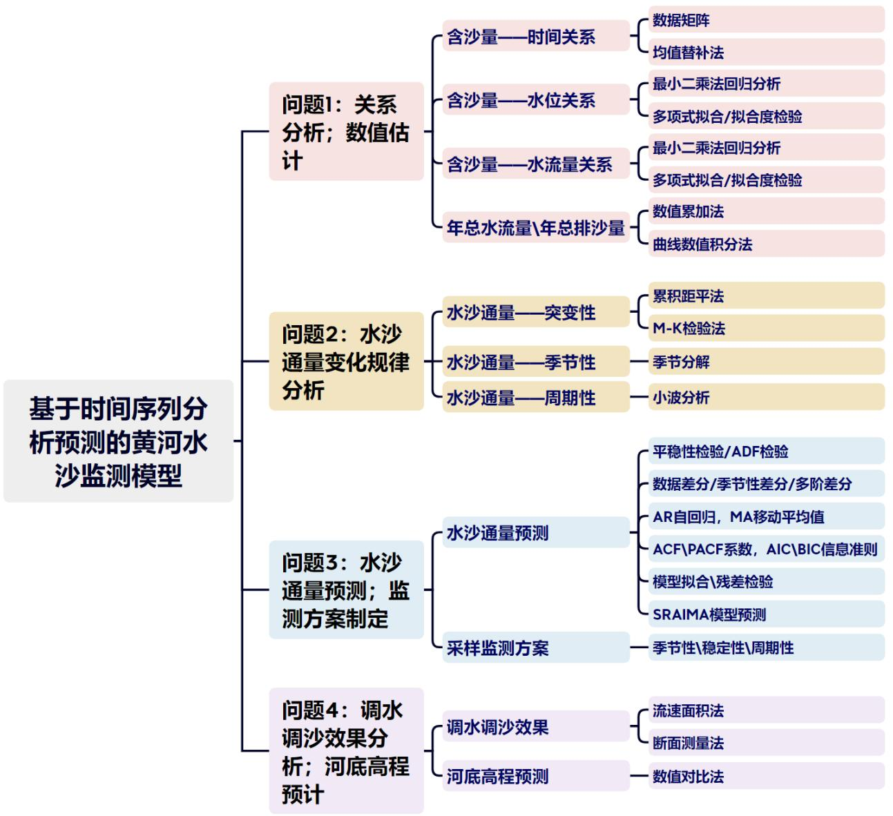

<details>
<summary>flowchart</summary>

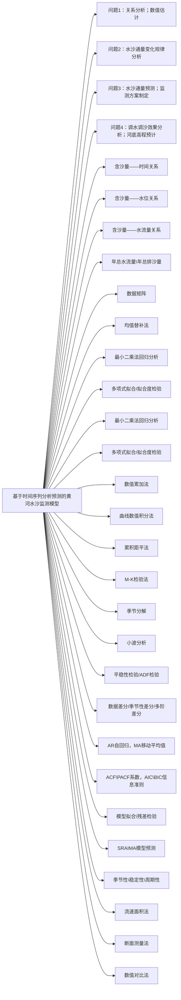
```mermaid
graph LR
  Root["基于时间序列分析预测的黄河水沙监测模型"]
  
  Root --> Problem1["问题1：关系分析；数值估计"]
  
  Root --> Problem2["问题2：水沙通量变化规律分析"]
  Root --> Problem3["问题3：水沙通量预测；监测方案制定"]
  Root --> Problem4["问题4：调水调沙效果分析；河底高程预计"]

  Root --> Category1["含沙量——时间关系"]
  Root --> Category2["含沙量——水位关系"]
  Root --> Category3["含沙量——水流量关系"]
  Root --> Category4["年总水流量\年总排沙量"]

  Root --> Sub1["数据矩阵"]
  Root --> Sub2["均值替补法"]

  Root --> Sub3["最小二乘法回归分析"]
  Root --> Sub4["多项式拟合/拟合度检验"]

  Root --> Sub5["最小二乘法回归分析"]
  Root --> Sub6["多项式拟合/拟合度检验"]

  Root --> Sub7["数值累加法"]
  Root --> Sub8["曲线数值积分法"]

  Root --> Sub9["累积距平法"]
  Root --> Sub10["M-K检验法"]

  Root --> Sub11["季节分解"]
  Root --> Sub12["小波分析"]

  Root --> Sub13["平稳性检验/ADF检验"]
  Root --> Sub14["数据差分/季节性差分/多阶差分"]
  Root --> Sub15["AR自回归，MA移动平均值"]
  Root --> Sub16["ACF\PACF系数，AIC\BIC信息准则"]
  Root --> Sub17["模型拟合\残差检验"]
  Root --> Sub18["SRAIMA模型预测"]

  Root --> Sub19["季节性\稳定性\周期性"]

  Root --> Sub20["流速面积法"]
  Root --> Sub21["断面测量法"]
  Root --> Sub22["数值对比法"]
```
</details>

图 1. 本文的研究路径

## 4.2 问题一

分析该水文站黄河水含沙量的检测数据时，从时间、水位、水流量三方面入手，并对 6年该水文站的年总水流量和年总排查量进行了合理估算。

## 4.2.1 数据预处理

(1)对附件各 sheet进行“首行冻结”操作。  
(2)通过“数据筛选”发现，2017、2018、2019、2021 年中有日期缺失情况。因此将缺失日期补全。  
(3)观察“附件 1”，6 年中，第i 年 ( 1 5i = ）12 月 31 日 24:00 与第i +1 年 1月1日 0:00的数据完全一致，因而去掉重复值。

## 4.2.2问题一的模型建立与求解

## 1.研究含沙量与时间的关系

考虑到涉及时间的分析，各年数据的数量应具有的一致性，因此剔除掉 2016、2020这两个闰年的 2 月 29 日数据。

对处理后的各年度数据进行汇总、转置操作，结果如表 1所示：

表1 含沙量数据展示汇总表

<table><tr><td></td><td>1月1日</td><td>1月2日</td><td>1月3日</td><td>1月4日</td><td>1月5日</td><td>1月6日</td><td>1月7日</td><td>1月8日</td><td>1月9日</td><td>1月10日</td><td>1月11日</td><td>1月12日</td><td>1月13日</td><td>1月14日</td><td>1月15日</td><td>1月16日</td><td>1月17日</td><td>1月18日</td><td>...</td><td>12月23日</td><td>12月24日</td><td>12月25日</td><td>12月26日</td><td>12月27日</td><td>12月28日</td><td>12月29日</td><td>12月30日</td><td>12月31日</td></tr><tr><td>2016年</td><td>0.8</td><td>0.84</td><td>0.67</td><td>0.65</td><td>0.69</td><td>0.73</td><td>0.71</td><td>0.92</td><td>0.95</td><td>0.96</td><td>0.87</td><td>0.86</td><td>0.85</td><td>0.88</td><td>0.83</td><td>0.87</td><td>0.89</td><td>0.88</td><td>...</td><td>0.4</td><td>0.4</td><td>0.4</td><td>0.3</td><td>0.3</td><td>0.3</td><td>0.4</td><td>0.4</td><td>0.4</td></tr><tr><td>2017年</td><td>0.51</td><td>0.58</td><td>0.47</td><td>0.42</td><td>0.42</td><td>0.44</td><td>0.47</td><td>0.53</td><td>0.53</td><td>0.53</td><td>0.48</td><td></td><td></td><td></td><td></td><td></td><td></td><td>0.52</td><td>...</td><td>0.8</td><td>0.68</td><td>0.76</td><td>0.73</td><td>0.64</td><td>0.68</td><td>0.62</td><td>0.67</td><td>0.79</td></tr><tr><td>2018年</td><td>0.59</td><td>0.64</td><td>0.64</td><td>0.79</td><td>0.68</td><td>0.71</td><td>1.19</td><td>0.97</td><td>0.68</td><td>1.05</td><td>0.71</td><td>1.02</td><td>0.84</td><td>0.86</td><td>0.97</td><td>0.86</td><td>0.8</td><td>0.97</td><td>...</td><td>0.6</td><td>0.8</td><td>0.9</td><td>0.8</td><td>0.9</td><td>0.7</td><td>0.9</td><td>0.8</td><td>0.7</td></tr><tr><td>2019年</td><td>0.92</td><td>0.89</td><td>0.83</td><td>0.68</td><td>0.68</td><td>0.81</td><td>0.73</td><td>0.73</td><td>0.7</td><td>0.72</td><td>0.83</td><td>0.86</td><td>0.86</td><td>0.92</td><td>0.82</td><td>0.82</td><td>0.9</td><td>0.76</td><td>...</td><td>1.1</td><td>0.9</td><td>1.1</td><td>0.8</td><td>1.1</td><td>1.6</td><td>1.9</td><td>1.7</td><td>2</td></tr><tr><td>2020年</td><td>1.53</td><td>1.6</td><td>1.46</td><td>1.03</td><td>1.29</td><td>0.94</td><td>0.88</td><td>1.15</td><td>0.99</td><td>1.21</td><td>1.03</td><td>0.97</td><td>1.02</td><td>1</td><td>0.97</td><td>0.97</td><td>1.02</td><td>0.98</td><td>...</td><td></td><td>1.13</td><td>1.2</td><td></td><td>0.9</td><td>0.75</td><td>1.12</td><td></td><td>2.12</td></tr><tr><td>2021年</td><td>0.95</td><td></td><td>1.42</td><td></td><td></td><td></td><td></td><td>2.01</td><td></td><td>2.25</td><td></td><td></td><td></td><td>1.36</td><td></td><td></td><td></td><td>1.02</td><td>...</td><td></td><td></td><td>1.8</td><td></td><td></td><td></td><td></td><td>3.1</td><td>2.4</td></tr><tr><td></td><td></td><td></td><td></td><td></td><td></td><td></td><td></td><td></td><td> $Q_{沙t-1}$ </td><td> $Q_{沙t}$ </td><td></td><td></td><td> $Q_{沙t+3}$ </td><td></td><td></td><td></td><td></td><td></td><td></td><td></td><td></td><td></td><td></td><td></td><td></td><td></td><td></td><td></td></tr><tr><td></td><td></td><td></td><td></td><td></td><td></td><td></td><td></td><td></td><td></td><td></td><td></td><td></td><td></td><td></td><td></td><td></td><td></td><td></td><td></td><td></td><td></td><td></td><td></td><td></td><td></td><td></td><td></td><td></td></tr></table>

其中，蓝色格子代表该日期的 8点时段获得了含沙量数据，而空白格子表示该日期未获得数据，因此，采用“均值替补法”对空数据进行补充。观察到每年1月1日的数据都是完整的，则针对某年度，从 1月2日起，逐一扫描每个 $Q _ { i \Downarrow }$ 若缺少第t日的含沙量 $Q _ { \mathrm { i j t } }$ ，则向后探测各含沙量数据，直到探测到非空值停止，再考虑前后时点与缺失的第 t 日的间隔不同，使用时点间隔d 设置权数，进行加

权计算，给出公式

$$
Q _ {\text {沙} \mathrm{t}} = \frac {d}{d + 1} Q _ {\text {沙} \mathrm{t} - 1} + \frac {1}{d + 1} Q _ {\text {沙} \mathrm{t} + \mathrm{d}}
$$

公式 1

补充第t日的含沙量，Python代码见附录。

在对附件 1数据进行预处理并汇总的基础上，建立含沙量矩阵来描述6年中每日含沙量的监测数据：

$$
\boldsymbol {Q} _ {\text {沙}} = \left( \begin{array}{c c c c} q _ {1 1} & q _ {1 2} & \dots & q _ {1, 3 6 5} \\ q _ {2 1} & q _ {2 1} & \dots & q _ {2, 3 6 5} \\ & & \dots \\ q _ {6, 1} & q _ {6, 2} & \dots & q _ {6, 3 6 5} \end{array} \right) _ {6 \times 3 6 5}.
$$

公式 2

$Q _ { i \imath }$ 中的任一元素 $Q _ { i j } ( \mathrm { ~ i = 1 } - 6 , \ j = 1 { \sim } 3 6 5 \ )$ 表示第i年的第 $j$ 天监测到的含沙量，i、j分别是年、日的逻辑编号。考虑对各年度的同一天的数据进行统计用以分析含沙量与时间的关系，并定义：

$$
\bar {q} _ {j} = \frac {1}{6} \sum_ {i = 1} ^ {6} q _ {i j},
$$

公式 3

从而获得每日含沙量向量

$$
\overline {{Q}} _ {\text {沙}} = \left( \begin{array}{c c c c} \overline {{q}} _ {1} & \overline {{q}} _ {2} & \dots & \overline {{q}} _ {3 6 5} \end{array} \right)
$$

根据以上模型，利用Excel软件的绘图功能，描述含沙量与时间的关系如图2：

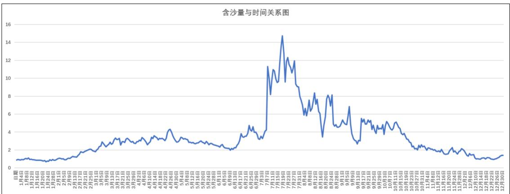

<details>
<summary>line</summary>

| 日期 | 含沙量 |
| --- | --- |
| 1月4日 | ~0.9 |
| 1月8日 | ~1.0 |
| 1月20日 | ~0.9 |
| 1月24日 | ~0.8 |
| 1月28日 | ~0.9 |
| 2月5日 | ~1.0 |
| 2月9日 | ~1.1 |
| 2月13日 | ~1.3 |
| 2月17日 | ~1.6 |
| 2月21日 | ~1.8 |
| 2月25日 | ~2.0 |
| 3月1日 | ~2.1 |
| 3月5日 | ~2.9 |
| 3月9日 | ~2.6 |
| 3月13日 | ~3.3 |
| 3月17日 | ~2.8 |
| 3月21日 | ~3.3 |
| 3月25日 | ~2.9 |
| 3月29日 | ~3.3 |
| 4月2日 | ~2.8 |
| 4月6日 | ~3.4 |
| 4月10日 | ~3.2 |
| 4月14日 | ~3.6 |
| 4月18日 | ~3.3 |
| 4月22日 | ~4.3 |
| 4月26日 | ~3.0 |
| 4月30日 | ~3.4 |
| 5月4日 | ~3.3 |
| 5月8日 | ~2.9 |
| 5月12日 | ~2.8 |
| 5月16日 | ~2.9 |
| 5月20日 | ~2.7 |
| 5月24日 | ~2.8 |
| 5月28日 | ~2.6 |
| 6月1日 | ~2.5 |
| 6月5日 | ~2.4 |
| 6月9日 | ~2.1 |
| 6月13日 | ~2.3 |
| 6月17日 | ~3.7 |
| 6月21日 | ~4.7 |
| 6月25日 | ~4.0 |
| 6月29日 | ~3.3 |
| 7月7日 | ~4.3 |
| 7月11日 | ~11.3 |
| 7月15日 | ~8.2 |
| 7月19日 | ~14.8 |
| 7月23日 | ~9.5 |
| 7月27日 | ~12.3 |
| 7月31日 | ~9.2 |
| 8月4日 | ~6.0 |
| 8月8日 | ~7.5 |
| 8月12日 | ~6.0 |
| 8月16日 | ~8.4 |
| 8月20日 | ~3.5 |
| 8月24日 | ~8.1 |
| 8月28日 | ~4.7 |
| 9月1日 | ~5.0 |
| 9月5日 | ~6.9 |
| 9月9日 | ~3.0 |
| 9月13日 | ~5.5 |
| 9月17日 | ~5.3 |
| 9月21日 | ~4.0 |
| 9月25日 | ~4.8 |
| 9月29日 | ~4.5 |
| 10月3日 | ~5.2 |
| 10月7日 | ~4.5 |
| 10月11日 | ~5.1 |
| 10月15日 | ~4.0 |
| 10月19日 | ~3.0 |
| 10月23日 | ~2.2 |
| 10月27日 | ~2.6 |
| 10月31日 | ~2.3 |
| 11月4日 | ~2.0 |
| 11月8日 | ~1.9 |
| 11月12日 | ~1.8 |
| 11月16日 | ~1.6 |
| 11月20日 | ~2.2 |
| 11月24日 | ~1.6 |
| 11月28日 | ~2.0 |
| 12月2日 | ~1.5 |
| 12月6日 | ~1.0 |
| 12月10日 | ~0.9 |
| 12月14日 | ~1.0 |
| 12月18日 | ~0.9 |
| 12月22日 | ~0.9 |
| 12月26日 | ~1.0 |
| 12月30日 | ~1.4 |
</details>

图2 含沙量与时间的关系图

由于同日均值是各年度同一天的概括性度量，较单独的一天数据更方便表示含沙量的变化规律。观察并分析出不同时间段的含沙量特征如下：

(1)10 月 15 日至来年 6 月 30 日含沙量较低，一般不超过 $4 \mathrm { k g / m ^ { 3 } }$ ，均值为

2.23 $\mathrm { k g / \Omega \ m ^ { 3 } }$ ，标准差为 0.96 $\mathrm { k g / m ^ { 3 } }$

(2)7 月 1 日至当年 10 月 14 日含沙量较高，一般高于 $4 \mathrm { k g / m ^ { 3 } }$ ，均值为$6 . 4 5 \mathrm { k g / m ^ { 3 } }$ ，标准差为 2.79 $\mathrm { k g / m ^ { 3 } }$

## 2.研究含沙量与水位的关系

## 1）数据准备

对在 4.2.1 中预处理之后的 6 年的所有数据,筛选剔除含沙量缺失的行，保留其余的2154 行。从中选取“水位”、“含沙量”所在列，作为研究数据。

## 2）组距分组

上述分析中，“日期”属于离散型数据，故而进行单变量分组。与日期不同，“水位”属于较多的连续型变量，需要把水位值的变化范围分成若干个区间，每个水位值归属于相应的区间，故而进行组距分组。

组距分组时，为了获得较好的组距，采用统计学家 Sturges 提出的经验公式确定组数，公式为：

$$
K \approx 1 + \frac {\ln N}{\ln 2}
$$

公式 3

式中，K代表组数，N代表水位值的总数，这里 $N = 2 1 5 4$ $K = 1 2 . 0 7 2 8$ ，通常分组取奇数，因而分 13组。

利用 Excel 函数“= $\left( \operatorname* { m a x } \left( \mathrm { A } \right) - \operatorname* { m i n } \left( \mathrm { A } \right) \right) / 1 3 ^ { \prime }$ 确定组距，进而获得各组上限、下限。

## 3）求解组内含沙量均值

利用 Excel 函数，“=VLOOKUP(B2,\$F\$3:\$G\$15,2,TRUE)”模糊查找小于水位值的每组下限，进而将2154个水位值归属为13组，获得第k组内各含沙量数据：

$$
\boldsymbol {Q} _ {k} = \left( \begin{array}{c c c c} q _ {k 1} ^ {\prime} & q _ {k 2} ^ {\prime} & \dots & q _ {k n} ^ {\prime} \end{array} \right).
$$

公式 4

式中，i 1 13= ，n表示第i组的数据频数。

利用“数据透视表”功能，求得各组均值

$$
\bar {q} _ {k} ^ {\prime} = \frac {1}{n} \sum_ {j = 1} ^ {n} q _ {k j}.
$$

公式 5

结果如表 2 所示：

表2 各组水位的含沙量均值

<table><tr><td>水位分组</td><td>组内含沙量均值(kg/m3)</td></tr><tr><td>41.50~42.23组</td><td>0.576724638</td></tr><tr><td>42.23~42.58组</td><td>0.932594595</td></tr><tr><td>42.58~42.93组</td><td>1.637192727</td></tr><tr><td>42.93~43.29组</td><td>3.649313889</td></tr><tr><td>43.29~43.64组</td><td>5.293121387</td></tr><tr><td>43.64~43.99组</td><td>7.347054264</td></tr><tr><td>43.99~44.34组</td><td>16.66772277</td></tr><tr><td>44.34~44.69组</td><td>16.08071429</td></tr><tr><td>44.69~45.04组</td><td>14.67</td></tr><tr><td>45.04~45.40组</td><td>12.82211268</td></tr><tr><td>45.40~45.75组</td><td>10.68325</td></tr><tr><td>45.75~46.10组</td><td>6.438888889</td></tr><tr><td>46.10~47.00组</td><td>6.6568</td></tr></table>

取其变化趋势展示如图 3：

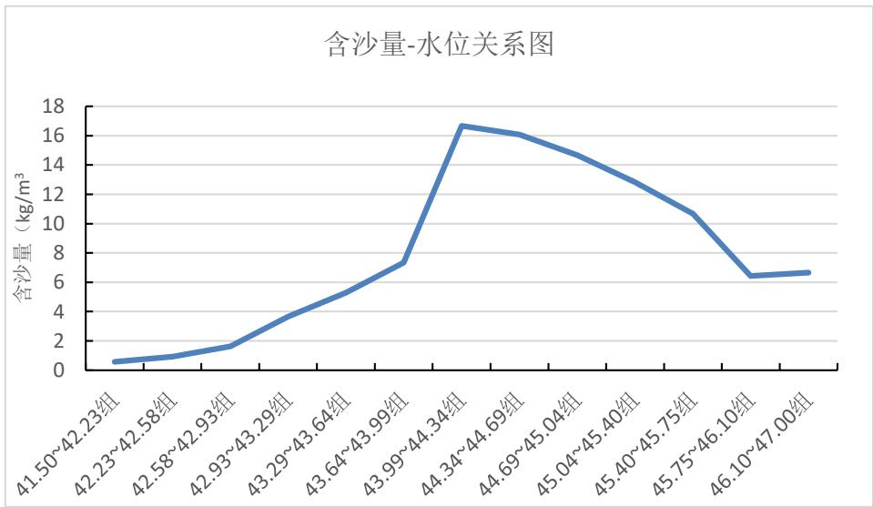

<details>
<summary>line</summary>

| 水位组 | 含沙量 \((kg/m^{3})\) |
| :--- | :--- |
| 41.50~42.23组 | ~0.6 |
| 42.23~42.58组 | ~1.0 |
| 42.58~42.93组 | ~1.7 |
| 42.93~43.29组 | ~3.5 |
| 43.29~43.64组 | ~5.2 |
| 43.64~43.99组 | ~7.3 |
| 43.99~44.34组 | ~16.7 |
| 44.34~44.69组 | ~16.1 |
| 44.69~45.04组 | ~14.8 |
| 45.04~45.40组 | ~13.0 |
| 45.40~45.75组 | ~10.7 |
| 45.75~46.10组 | ~6.5 |
| 46.10~47.00组 | ~6.7 |
</details>

图3 含沙量与水位的关系图

由上述图、表可以得出，前七组水位数据含沙量的数值是随着水位数值的增加逐渐增长的，特别是水位变化到 43.99-44.34m时，含沙量数值陡增。而此后，水位再增加时，含沙量的值却开始缓慢下降，显然，变化规律很难拟合成一个函数，该关系曲线更符合分段函数的特点。

## 4）利用回归分析拟合“含沙量-水位”关系曲线

利用线性最小二乘法进行回归分析，借助 Matlab 分别对前后两段曲线进行m次多项式拟合，由图中曲线变化趋势可以观察出，前段曲线符合三次函数特点，后端曲线变化更接近直线。因此两段函数拟合时，选用三次曲线和一次线进行拟合，即多项式函数的次数 m分别取 3和1，得到前后两段函数形成的分段函数表示为：

$$
y = \left\{ \begin{array}{l l} 3. 7 3 x ^ {3} - 4 7 7. 3 6 x ^ {2} + 2 0 3 7 7. 6 0 x - 2 8 9 9 7 8. 6 5, & 4 2. 0 8 \leq x <   4 4. 3 4, \\ - 5. 4 6 x + 2 5 8. 7 4, & 4 4. 3 4 \leq x \leq 4 6. 2 4. \end{array} \right.
$$

以水位分组后每组数据的均值为横坐标，取每组含沙量的均值为纵坐标，绘制拟合后的“含沙量-水位”分段函数图像见图 4：

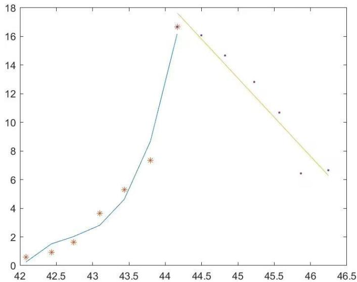

<details>
<summary>scatter</summary>

| X | Series (Asterisk) | Series (Dot) |
| --- | --- | --- |
| 42.1 | ~0.6 | — |
| 42.4 | ~1.0 | — |
| 42.7 | ~1.7 | — |
| 43.1 | ~3.7 | — |
| 43.4 | ~5.3 | — |
| 43.8 | ~7.4 | — |
| 44.2 | ~16.7 | — |
| 44.5 | — | ~16.1 |
| 44.8 | — | ~14.7 |
| 45.2 | — | ~12.9 |
| 45.5 | — | ~10.7 |
| 45.8 | — | ~6.5 |
| 46.2 | — | ~6.7 |
</details>

图4. “含沙量-水位”拟合函数曲线

## 5）回归模型的拟合度检验

利用Matlab 对两段拟合曲线进行“拟合优度检验”，程序见附件。左边拟合成三次曲线,其 $R ^ { 2 } = 0 . 9 8$ ，右边拟合成直线，其 $R ^ { 2 } = 0 . 9 4 1$ 。两段拟合的都非常理想。如果左边用二次曲线去拟合，其 $R ^ { 2 } = 0 . 9 5 2$ ，可见三次曲线拟合效果好。

在第二段函数中含沙量数值随水位数值的增大而减小，这种情况的产生受多因素影响，其中，可能包含该地区进行了“调水调沙”这一因素所产生的作用。

## 3.研究含沙量与水流量的关系

## 1）数据准备

在前期筛选剔除含沙量缺失的行后保留的2154行数据基础上，选取“流量”、“含沙量”所在列，作为两列研究对象。而问题一中需要研究“含沙量”与“水流量”的关系，因此给出水流量与流量的转换公式，从而补充附件 1中含沙量对应的水流量数据作为研究数据。水流量模型：

$$
Q _ {\text {水}} = Q \left(1 - \frac {Q _ {\text {沙}}}{\rho_ {\text {沙}}}\right), \left(\rho_ {\text {沙}} = 2. 5 8 \times 1 0 ^ {3} \mathrm{kg/m} ^ {3}\right)
$$

公式 6

## 2）组距分组

“流量”数据的特点与“水位”类似，属于较多的连续型变量，因此同样需要把“水流量”值的变化范围分成若干个区间，每个水流量数值归属于相应的区间，故而进行组距分组。分组方法同“水位”数据分组，利用经验公式确定组数，求得水流量值同样可分为 13组。再利用 Excel函数 $^ { \prime \prime } = \left( \operatorname* { m a x } \left( \mathrm { A } \right) - \operatorname* { m i n } \left( \mathrm { A } \right) \right) / 1 3 ^ { \prime \prime }$ 确定组距，进而获得各组上限、下限。

利用“数据透视表”功能，求得各组均值，结果如表 3所示。

表3 各组水流量的含沙量均值

<table><tr><td>水流量分组</td><td>组内含沙量均值(kg/m3)</td></tr><tr><td>0~548.12组</td><td>0.903063325</td></tr><tr><td>548.12~917.27组</td><td>1.893426439</td></tr><tr><td>917.27~1286.42组</td><td>4.244539249</td></tr><tr><td>1286.42~1655.57组</td><td>5.031612903</td></tr><tr><td>1655.57~2024.72组</td><td>8.182527473</td></tr><tr><td>2024.72~2393.87组</td><td>17.74513158</td></tr><tr><td>2393.87~2763.02组</td><td>16.24623656</td></tr><tr><td>2763.02~3132.16组</td><td>13.46295455</td></tr><tr><td>3132.16~3501.31组</td><td>12.06622222</td></tr><tr><td>3501.31~3870.46组</td><td>15.74454545</td></tr><tr><td>3870.46~4239.61组</td><td>10.02794118</td></tr><tr><td>4239.61~4608.76组</td><td>7.8375</td></tr><tr><td>4608.76~5000组</td><td>6.705416667</td></tr></table>

其变化趋势展示如图 5：

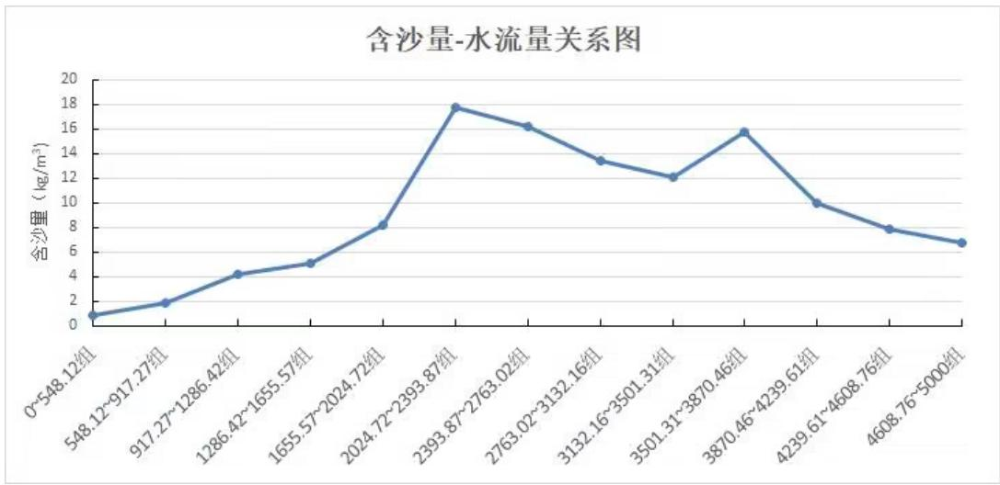

<details>
<summary>line</summary>

| 水流量组 | 含沙量 \((kg/m^{3})\) |
| :--- | :--- |
| 0~548.12组 | ~0.8 |
| 548.12~917.27组 | ~1.8 |
| 917.27~1286.42组 | ~4.1 |
| 1286.42~1655.57组 | ~5.0 |
| 1655.57~2024.72组 | ~8.1 |
| 2024.72~2393.87组 | ~17.6 |
| 2393.87~2763.02组 | ~16.1 |
| 2763.02~3132.16组 | ~13.3 |
| 3132.16~3501.31组 | ~12.0 |
| 3501.31~3870.46组 | ~15.6 |
| 3870.46~4239.61组 | ~9.9 |
| 4239.61~4608.76组 | ~7.8 |
| 4608.76~5000组 | ~6.7 |
</details>

图5. 含沙量-水流量关系图

同样利用线性最小二乘法进行回归分析，借助 Matlab 分别对前、后两段曲线进行m次多项式拟合，多项式函数的次数 m分别取2和 1，得到前后两段函数形成的分段函数表示为：

$$
y = \left\{ \begin{array}{l l} 2. 3 7 \times 1 0 ^ {- 6} x ^ {2} + 9. 8 1 \times 1 0 ^ {- 4} x - 0. 0 2 2, & 3 6 3. 7 1 \leq x <   2 5 7 6. 9 6, \\ - 0. 0 0 4 x + 2 6. 5 2, & 4 4. 3 4 \leq x \leq 4 4 8 1 6. 6 1. \end{array} \right.
$$

以水流量分组后每组数据的均值为横坐标，取每组含沙量的均值为纵坐标，绘制拟合后的“含沙量-水流量”分段函数图像见图 6：

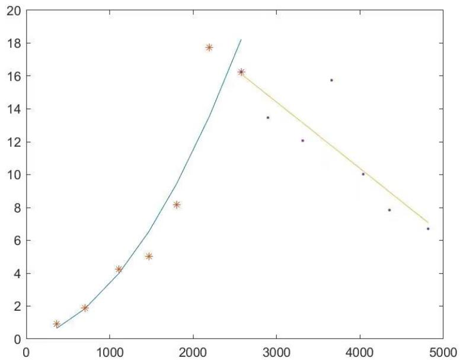

<details>
<summary>scatter</summary>

| X | Y (Trend Line) | Y (Scatter Points) |
| --- | --- | --- |
| ~400 | ~1 | 1 |
| ~750 | ~2 | 2 |
| ~1100 | ~4 | 4.3 |
| ~1500 | ~6.5 | 5 |
| ~1800 | ~9.5 | 8.2 |
| ~2200 | ~13.5 | 17.8 |
| ~2600 | ~16.5 | 16.3 |
| ~2900 | — | 13.5 |
| ~3300 | — | 12.1 |
| ~3700 | — | 15.8 |
| ~4000 | — | 10 |
| ~4400 | — | 7.9 |
| ~4800 | — | 6.7 |
</details>

图6. “含沙量-水流量”拟合函数曲线

利用 Matlab 对两段拟合曲线进行“拟合优度检验”，左边拟合成三次曲线,其 $R ^ { 2 } = 0 . 9 2 4$ ，右边拟合成直线，其 $R ^ { 2 } = 0 . 7 5 4$ 。左侧拟合得比右侧效果更理想。如果左边用二次曲线去拟合，其 $R ^ { 2 } = 0 . 9 0 7$ ，可见三次曲线拟合效果好。

## 4.估算近 6年该水文站年总水流量和年总排沙量

## （1）年总排沙量模型的建立与求解

给出第i年的年总排沙量的计算模型：

$$
Q _ {\text {年沙}} = 1 0 ^ {- 1 1} \cdot \sum_ {j = 1} ^ {3 6 5} Q _ {\text {沙} j} \cdot Q _ {j} \cdot t
$$

公式 7

其中， $Q _ { \psi j }$ 表示第j天8点的含沙量， $Q _ { j }$ 表示第j天含沙量数据对应的流量，t表示每天的时长， $t = 8 6 4 0 0$ 秒。参考水文研究中常用量纲，将年总排沙量的单位取为“亿吨”。利用上述模型，计算出近六年的年总排沙量，结果见表 4：

表 4 2016-2021 年的年总排沙量表

<table><tr><td>日期</td><td>2016</td><td>2017</td><td>2018</td><td>2019</td><td>2020</td><td>2021</td></tr><tr><td>年总排沙量(亿吨)</td><td>0.182</td><td>0.191</td><td>2.918</td><td>3.051</td><td>3.510</td><td>2.239</td></tr></table>

## （2）年总水流量模型的建立与求解

年总水流量计算应利用前面给出的“水流量模型 $Q _ { \gamma \mathrm { k } } = Q ( 1 - { \frac { Q _ { \mathrm { { \scriptsize { i } } \underline { { { v } } } } } } { \rho _ { \mathrm { { \scriptsize { i } } \underline { { { v } } } } } } } )$ ”计算求得，经过对该模型的分析，由于 $Q _ { \psi } \ll \rho _ { \psi }$ ，因此 $1 - \frac { Q _ { \ast \ast } } { \rho _ { \ast \ast } } \approx 1$ ，即水流量的数值近似取流量的数值。所以在估算近 6 年的年总水流量时，直接选取流量数据进行计算。给出第i年的年总水流量的计算模型：

$$
Q _ {\text {年水}} = 1 0 ^ {- 8} \cdot \sum_ {j = 1} ^ {n} \triangle t _ {j} \cdot Q
$$

公式 8

式中， $Q _ { \mathrm { f i x \uparrow k } }$ 为某年总排水量，设相邻两次监测时点之间为一个时段， $\triangle t$ 为时段长度，n为每年时段总个数。

模型求解时，首先观察到监测时点均为整点，因而使用 Excel 函数$\scriptstyle \mathbf { \mu } ^ { \# } = \mathrm { T E X T } ( { \mathrm { A } } 6 , " { \mathrm { h } } " ) ^ { * }$ ”取出小时数。其次，利用 $^ { \mathrm { \prime \prime } } { = } \mathrm { I F } ( \mathrm { T E X T } ( \mathrm { A } 6 , ^ { \mathrm { \prime \prime } } \mathrm { h " } ) { \mathrm { - } } \mathrm { T E X T } ( \mathrm { A } 5 ,$ $\mathrm { \mathrm { ^ { n } h ^ { n } ) > 0 , T E X T ( A 6 , " h " ) - T E X T ( A 5 , " h " ) , T E X T ( A 6 , " h " ) - T E X T ( A 5 , " h " ) + 2 4 ) * 3 6 0 0 ~ ^ { \mathrm { \mu _ { 3 } h " } } } }$ 计算时段长度并将小时转换为秒，统一时间单位。最后，利用“=SUMPRODUCT(B5:B2383,C5:C2383)/10^8”返回年总排水量，并将量纲调整为“亿立方米”。结果见表5：

表 5 2016-2021 年的年总水流量表

<table><tr><td>日期</td><td>2016</td><td>2017</td><td>2018</td><td>2019</td><td>2020</td><td>2021</td></tr><tr><td>年总水流量(亿 $m^3$ )</td><td>143.809</td><td>153.353</td><td>388.973</td><td>387.239</td><td>433.910</td><td>472.626</td></tr></table>

## （3）年总水流量与年总排沙量的优化模型——数值积分法

应用上述两个模型，分别求出了 2016-2021年的年总水流量和年总排沙量，为了验证模型计算数值的准确性，对模型进行了进一步改进，运用水文研究中流量估计的模型——数值积分法进行估算（程序代码见附录），从而对模型进行了检验和优化，年总排沙量和年总水流量的计算结果如下表 6：

表6 “数值积分法”估算的年总排沙量和年总水流量表

<table><tr><td>日期</td><td>2016</td><td>2017</td><td>2018</td><td>2019</td><td>2020</td><td>2021</td></tr><tr><td>年总排沙量(亿吨)</td><td>0.147</td><td>0.215</td><td>0.181</td><td>4.301</td><td>3.510</td><td>2.239</td></tr><tr><td>年总水流量(亿 $m^3$ )</td><td>133.436</td><td>161.478</td><td>395.784</td><td>518.374</td><td>449.518</td><td>444.308</td></tr></table>

## 4.3 问题二

## 4.3.1 问题二的分析

## 1.数据预处理

为方便研究水沙通量的突变性、季节性和周期性的特征，我们将附件1中的数据进行按月汇总、分析。利用Excel 处理附件1中数据，得到 6年来月流量和月排沙量的均值 $Q _ { \sharp }$ 和 $\overline { { { Q } } } _ { \scriptscriptstyle \boxplus \ n H } ( \overline { { { Q } } } _ { \scriptscriptstyle \boxplus \ n H } = \overline { { { Q } } } _ { \scriptscriptstyle \boxplus \nw D } . \overline { { { Q } } } _ { \scriptscriptstyle \boxplus } )$ ）。研究每年中每月的水沙通量，主要通过 $\overline { { Q } } _ { \mathtt { H } }$ 和 $\overline { { Q } } _ { \mathrm { H } \mathrm { f \ / k } }$ 这两个要素的变化规律描述水沙通量的各种特性。

## 2.水沙通量的突变性分析

利用“累积距平法”得到累积距平曲线，根据曲线的极值点找到每年中月水沙通量变化两要素各自趋势改变的月份。利用“M-K检验法”对该水文站6年来月水沙通量两要素进行突变检验，从而判断水沙通量的两要素各自发生突变的时间，找出其突变性特征。

## 3.水沙通量的季节性分析

根据每月水沙通量的均值，将 6 年来流量数据和排沙量数据按照季节性分解原理分离成不同成分，其中包括：原始数据均值，长期趋势(Trend)，季节性(Seasonality)和随机残差(Residual)。

## 4.水沙通量的周期性分析

运用小波分析方法得到该水文站 6 年来每月小波方差分析图与小波变换系数实数等值线图，得到水沙通量的两要素各自的变化周期。

## 4.3.2 问题二的模型建立与求解

## 1. 水沙通量突变性模型的建立与求解

运用累积距平法对水沙通量进行突变性分析。累积距平法的思路是：在研究的时段内，计算的累积距平值的数值越大，说明原数据越大于均值，得到的曲线在这一段呈现上升的态势，反之则曲线呈下降的态势。数据的变化特征是通过累积距平曲线的极值体现出来的。对于该水文站 6年来每月水沙通量值序列，其累积距平值计算公式为：

$$
W _ {C A j} = \sum_ {i = 1} ^ {j} \left(W _ {i} - \bar {W}\right), \quad \text {公式9}
$$

其中， $W _ { { \scriptscriptstyle C A j } }$ 表示为水沙通量序列 $W _ { i }$ 在第 $j$ 年的累积距平值， $W _ { i }$ 表示为第i年数值，n表示为序列长度， $\bar { W }$ 表示为序列平均值。

Mann-Kendall 法可进一步运用于检验序列突变。首先构建时间序列的秩序列为：

$$
S _ {k} = \sum_ {i = 1} ^ {k} R _ {i}, \quad \text {公式} 1 0
$$

其中， $R _ { i }$ 表示 $X _ { i } > X _ { i } ( 1 \leq j \leq i )$ ）的累积数。在时间序列独立的假设下，定义统计量：

$$
U F _ {k} = \frac {S _ {k} - E (S _ {k})}{\sqrt {\operatorname{Var} (S _ {k})}}, k = 1, 2, \dots 1 2. \quad \text {公式} 1 1
$$

其中， $U F _ { 1 } = 0$ $E ( S _ { k } )$ 和 $V a r ( S _ { k } )$ 分别表示序列 $S _ { k }$ 的期望和方差，它们可由下式表示：

$$
E (S _ {k}) = \frac {n (n + 1)}{4}, \quad V a r (S _ {k}) = \frac {n (n - 1) (2 n + 5)}{7 2}. \quad \text {公式} 1 2
$$

将时间序列逆序排列，重复上述过程，同时令 $U B _ { k } = - U F _ { k }$ ，且 $U B _ { 1 } = 0$ 。分析统计序列 $U B _ { k }$ 和 $U F _ { k }$ 可以进一步分析序列x突变的时间节点，显示突变的区域。若 $U F _ { k } > 0$ ，则表明序列呈上升趋势；反之序列呈下降趋势。如果 $U B _ { k }$ 和 $U F _ { k }$ 曲线出现交点，且交点在两临界直线之间，那么交点对应的时刻为突变开始的时刻。

首先根据 2016-2021 年流量和含沙量数据，整理得每年 12 个月中每月平均流量和含沙量，进而得到每月平均流量和排沙量数据。根据累积距平法将月均流量建立模型，利用 python 绘制首先得到月均流量累积距平曲线，如图 7 所示，通过对曲线图的分析，按照极值点将 6年来流量变化分为两个阶段，分别是 2016-

2018 年的枯水期和 2018-2021 年的丰水期，分析累积距平图后发现流量变化的极值分别出现在 2018 年间，2019年间，2021年间。

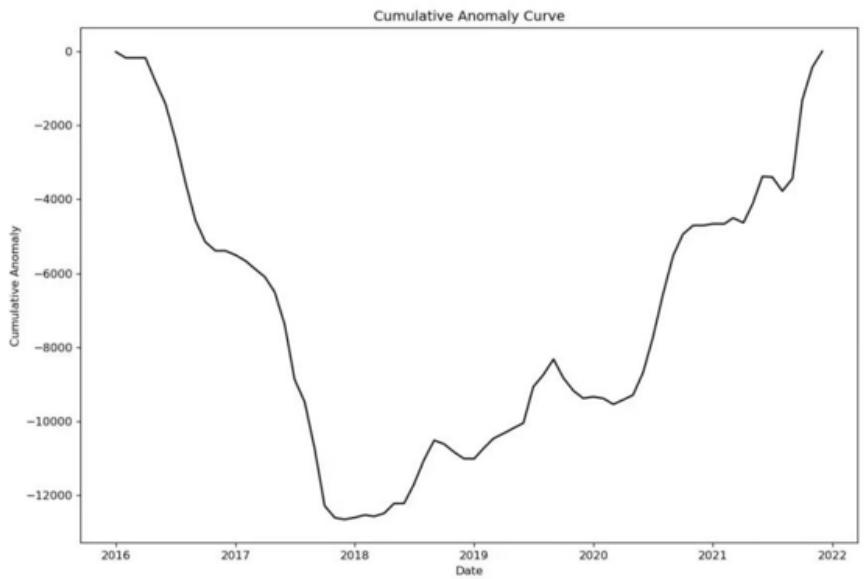

<details>
<summary>line</summary>

| Date | Cumulative Anomaly |
| --- | --- |
| 2016 | ~0 |
| 2017 | ~-5500 |
| 2018 | ~-12500 |
| 2019 | ~-10500 |
| 2020 | ~-9500 |
| 2021 | ~-4500 |
| 2022 | ~0 |
</details>

图 7. 2016-2021 年月均流量累积距平曲线

运用 M-K检验法对水文站月流量进行“突变性检验”，得到图7，为了方便观察规律，将在同一图中分析 2016-2021 年 72 个月流量和排沙量的某一性质。分析图中曲线变化趋势可明显观察到，在2016年和2018-2021年两阶段 $U F > 0$ 在此阶段内，该水文站的流量处于增加阶段，在 2016年 5月份之前和2016年 1月到 2017 年 5 月间， $U F < 0$ ，说明在这期间水文站的流量呈下降趋势。从图 8可知在置信区间内月流量统计量曲线 UF UB、 在第 25 个月和第 30 个月间相交，说明在此对应时段内可能存在突变点。综合上文所做的累积距平过程图在2018、2019、2021 年间出现的转折点，确定该水文站的月流量在 2018年间发生突变。

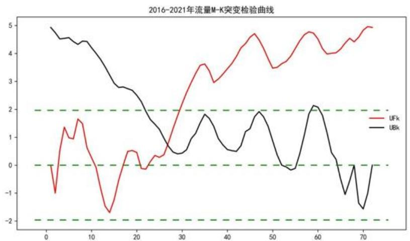

<details>
<summary>line</summary>

| X | UFk | UBk |
| --- | --- | --- |
| 0 | ~0 | ~4.9 |
| 5 | ~1.3 | ~4.5 |
| 10 | ~0.5 | ~4.4 |
| 15 | ~-1.7 | ~3.0 |
| 20 | ~0.5 | ~2.8 |
| 25 | ~0.3 | ~1.5 |
| 30 | ~1.5 | ~0.5 |
| 35 | ~3.6 | ~1.8 |
| 40 | ~3.0 | ~0.6 |
| 45 | ~4.2 | ~1.3 |
| 50 | ~3.5 | ~1.9 |
| 55 | ~3.8 | ~0.0 |
| 60 | ~4.8 | ~2.1 |
| 65 | ~4.0 | ~0.2 |
| 70 | ~4.9 | ~-1.6 |
| 72 | ~5.0 | ~0.0 |
</details>

图 8. 2016-2021 年月均流量突变性检验

将 2016-2021 年间月排沙量根据利用累积距平法建立模型，得到图 9排沙量累积距平曲线图，由于累积距平曲线表现出不稳定波动的趋势，故以起伏变化的最大值点对应时间进行趋势变化的区分，分别是 2016-2018 年中与 2021 年下半年的枯沙期和 2018年中-2021年中的丰沙期。分析累积距平曲线（如图9）后可见月排沙量变化的极值点分别出现在 2018年间，2019年间和 2021年间。

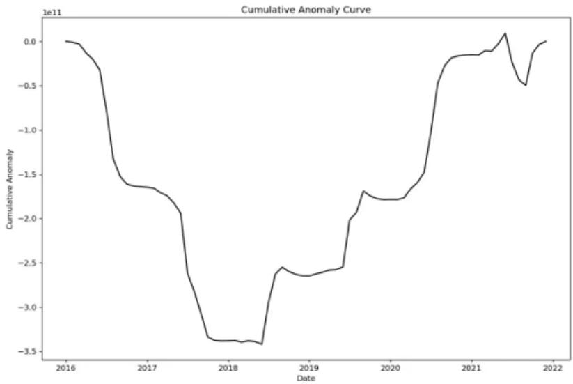

<details>
<summary>line</summary>

| Date | Cumulative Anomaly (1e11) |
| --- | --- |
| 2016 | ~0.0 |
| 2017 | ~-1.6 |
| 2018 | ~-3.4 |
| 2019 | ~-2.6 |
| 2020 | ~-1.8 |
| 2021 | ~-0.2 |
| 2022 | ~0.0 |
</details>

图 9. 2016-2021 年月均排沙量累积距平曲线

为了得到更精确的突变时间，利用 M-K 突变检验方法，分析 6 年来每月平均排沙量，得到图 10，根据曲线变化趋势，观察到在第 22个月之后 $U F > 0$ ，说明排沙量在此期间呈增大趋势，在第 个月之前，曲线变化趋势波动明显，但是总体是 $U F < 0$ ，说明排沙量减少。UF UB、 曲线在第25 个月和第30个月之间出现交点，说明突变点发生在此时间段内。与排沙量累积距平图得到的结果综合比较，可以发现，水文站月排沙量在 2018年间发生突变。

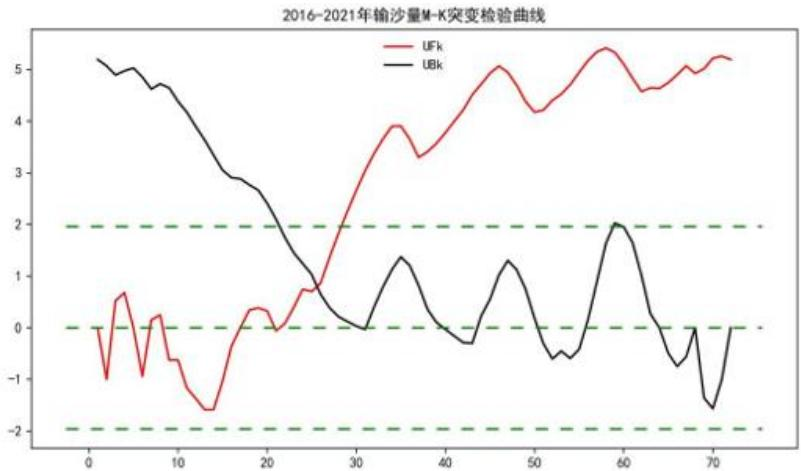

<details>
<summary>line</summary>

| X | UFk | UBk |
| --- | --- | --- |
| 0 | ~0 | ~5.2 |
| 5 | ~0.7 | ~4.9 |
| 10 | ~-0.6 | ~4.6 |
| 15 | ~-1.6 | ~3.0 |
| 20 | ~0.3 | ~2.7 |
| 25 | ~0.8 | ~1.2 |
| 30 | ~2.5 | ~0.2 |
| 35 | ~3.9 | ~1.4 |
| 40 | ~3.3 | ~0.2 |
| 45 | ~4.5 | ~-0.3 |
| 50 | ~5.0 | ~1.3 |
| 55 | ~4.2 | ~-0.6 |
| 60 | ~5.4 | ~2.0 |
| 65 | ~4.6 | ~-0.8 |
| 70 | ~5.2 | ~-1.6 |
| 75 | ~5.2 | ~0 |
</details>

图 10. 2016-2021 年每月平均排沙量突变性检验

该水文站月流量和月排沙量累积曲线表现较不规律的主要原因是由于小浪底水库对下游水沙要进行调控。小浪底水库要有效调节下泄水量，实现黄河下游不断流，并且要在汛前调水调沙，增加对下游河道的冲刷。

## 2. 水沙通量季节性模型的建立与求解

通过2016-2021年每月平均流量数据，通过季节分解原理得到 6年来关于流量的时间序列分解图，如图11：

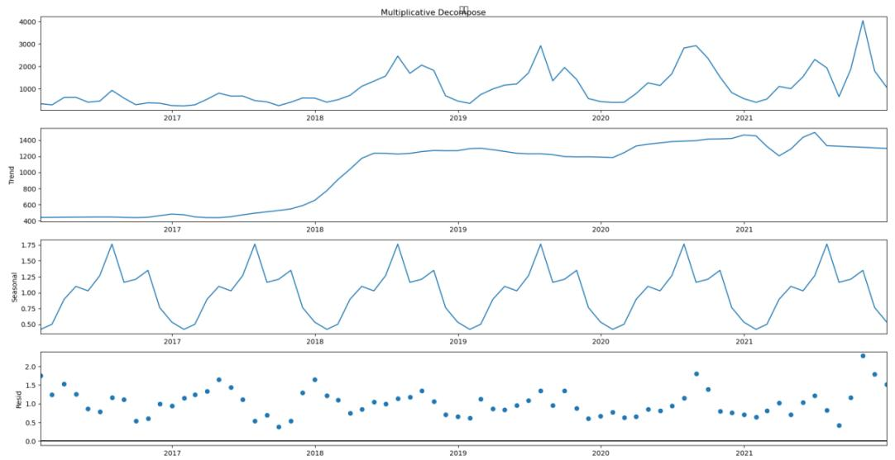

<details>
<summary>line</summary>

| Category | Trend | Seasonal | PESID |
| --- | --- | --- | --- |
| 2017 | ~450 | ~0.5 | ~1.0 |
| 2018 | ~600 | ~0.5 | ~1.3 |
| 2019 | ~1250 | ~0.5 | ~0.8 |
| 2020 | ~1200 | ~0.5 | ~0.7 |
| 2021 | ~1300 | ~0.5 | ~1.0 |
</details>

图11. 2016-2021年每月平均流量时间序列分解图

根据图中趋势(Trend)曲线，可以观察到水流量在 2018 年呈明显上升趋势，并且在2018年 5月份之后趋于稳定，在 2021年水流量再次出现小范围波动。从季节性(Seasonality)曲线图可以看出，每年春季流量逐渐增大，夏季流量出现急剧上升趋势，在 6、7 月份达到最大，汛期过后流量急剧减少，秋季流量较平稳，冬季阶段流量骤减。

根据 2016-2021年每月平均排沙量数据，通过季节分解原理得到 6年来关于排沙量的时间序列分解图，见图12，根据图中曲线分别分析趋势和季节性，由趋势(Trend)曲线可以看出排沙量在 2018 年出现急剧上升，自 2018 年 5 月之后趋势趋于平缓，2021 年开始排沙量开始呈下降趋势。根据季节性(Seasonality)曲线图可以看出，每年春季排沙量呈逐步增长趋势，在进入夏季之前出现小范围波动；进入夏季之后排沙量急剧上升在 6，7 月份达到最大值，汛期之后排沙量急剧下降；进入秋季出现小范围上升趋势，但不会超过汛期最大排沙量；冬季排沙量逐步下降。

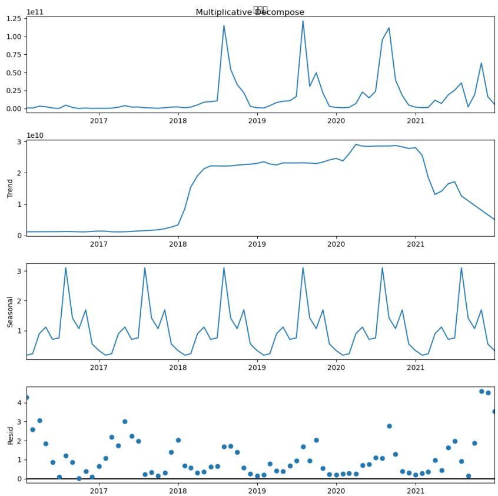  
图12. 2016-2021年每月平均排沙量时间序列分解图

## 3. 水沙通量周期性模型的建立与求解

小波分析是通过伸缩、平移等运算对数据逐步地多尺度地细化，进而满足不同特征数据的分析需求，获取不同条件下的变化周期的方法。通过小波变换方程对流量时间序列进行连续小波变换，可以得到小波变换系数，提取小波系数实部，绘制等值线图，从等值线图中识别水文序列在时间上的周期性特征。通过小波方差进行检验可以识别流域流量序列的主要周期，小波方差图上波峰对应尺度为主周期。

选取 2016-2021 年小浪底水库每月流量相关数据，使用 Matlab 编程进行Morlet 小波变换，得到小波变换系数。通过origin 绘图工具得到小波变换系数实部等值线图，得到图 。图中的横坐标对应时间，即所选取的研究时段各个月份，纵坐标对应频率，即对应不同的小波周期。通过图像可以看出该水文站流量值数值较大对应实部值大于零处，这些大于 0处的部分在图中以实线区反映出来；相反的流量值较小时，是用图中虚线区块显示出来。而在图中的实线区与虚线区相交的小波系数等于零的位置，则代表数据所处年代发生了突变。

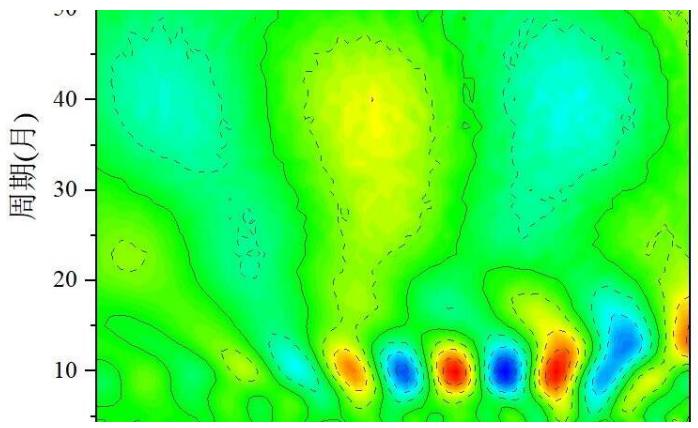

<details>
<summary>heatmap</summary>

| X (range) | Y (range) | Value (Color Intensity) |
| --- | --- | --- |
| 0~100 | 0~50 | Green to Red gradient |
</details>

图 13. 2016-2021年每月平均流量小波系数实部等值线图

根据图 13 观察出，小浪底水文站周期变化主要有 2 种，分别是 3-5 个月、10 个月。所有主要周期变化中以 10 个月为周期尺度的时间序列表现最为稳定，在此周期有明显的明暗交替的丰枯振荡变化。

将 2016-2021 年小浪底水库每月流量进行小波系数方差分析，得到图 14，小波方差图上极值的数值越大，表明该极值点对应的波动越强烈，这也表示其对方差的贡献越大。由图 13 可以观察得到，在 3 个月，10 个月，38-40 个月位置有明显峰值，其峰值与实部等值线图中的周期规律很好对应该水文站序列变化的第一主周期为 10个月；第二主周期、第三主周期分别为 40个月和3个月。

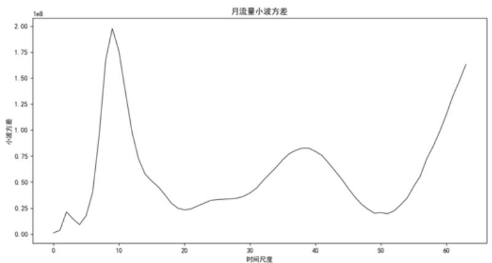

<details>
<summary>line</summary>

| 时间尺度 | 小波方差 (1e8) |
| --- | --- |
| 0 | ~0.02 |
| 2 | ~0.23 |
| 4 | ~0.10 |
| 6 | ~0.40 |
| 9 | ~1.98 |
| 12 | ~0.75 |
| 15 | ~0.55 |
| 20 | ~0.25 |
| 25 | ~0.33 |
| 30 | ~0.40 |
| 38 | ~0.83 |
| 40 | ~0.78 |
| 45 | ~0.45 |
| 50 | ~0.21 |
| 52 | ~0.20 |
| 55 | ~0.45 |
| 60 | ~1.15 |
| 63 | ~1.63 |
</details>

图14. 2016-2021年每月平均流量小波系数方差图

图 15 是 2016-2021 年每月排沙量小波系数实部等值线图，根据图中信息可以看出其周期变化主要有 2-3个月、10个月。

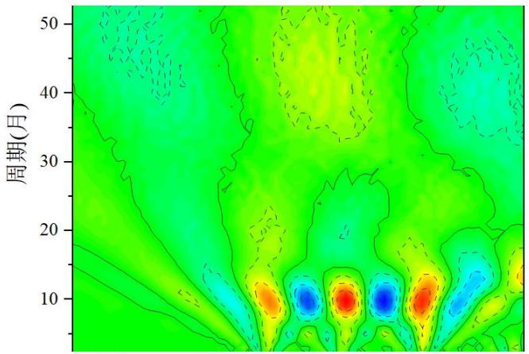

<details>
<summary>heatmap</summary>

| X (range) | Y (range) | Value (Color Intensity) |
| --- | --- | --- |
| 0~20 | 0~18 | Green to Yellow |
| 20~40 | 18~30 | Green to Yellow |
| 40~60 | 30~50 | Green to Yellow |
| 60~80 | 0~18 | Green to Yellow |
| 80~100 | 18~30 | Green to Yellow |
| 100~120 | 30~50 | Green to Yellow |
| 120~140 | 0~18 | Green to Yellow |
| 140~160 | 18~30 | Green to Yellow |
| 160~180 | 30~50 | Green to Yellow |
| 180~200 | 0~18 | Green to Yellow |
| 200~220 | 18~30 | Green to Yellow |
| 220~240 | 30~50 | Green to Yellow |
| 240~260 | 0~18 | Green to Yellow |
| 260~280 | 18~30 | Green to Yellow |
| 280~300 | 30~50 | Green to Yellow |
| 300~320 | 0~18 | Green to Yellow |
| 320~340 | 18~30 | Green to Yellow |
| 340~360 | 30~50 | Green to Yellow |
| 360~380 | 0~18 | Green to Yellow |
| 380~400 | 18~30 | Green to Yellow |
| 400~420 | 30~50 | Green to Yellow |
| 420~440 | 0~18 | Green to Yellow |
| 440~460 | 18~30 | Green to Yellow |
| 460~480 | 30~50 | Green to Yellow |
| 480~500 | 0~18 | Green to Yellow |
| 500~520 | 18~30 | Green to Yellow |
| 520~540 | 30~50 | Green to Yellow |
| 540~560 | 0~18 | Green to Yellow |
| 560~580 | 18~30 | Green to Yellow |
| 580~600 | 30~50 | Green to Yellow |
| 600~620 | 0~18 | Green to Yellow |
| 620~640 | 18~30 | Green to Yellow |
| 640~660 | 30~50 | Green to Yellow |
| 660~680 | 0~18 | Green to Yellow |
| 680~700 | 18~30 | Green to Yellow |
| 700~720 | 30~50 | Green to Yellow |
| 720~740 | 0~18 | Green to Yellow |
| 740~760 | 18~30 | Green to Yellow |
| 760~780 | 30~50 | Green to Yellow |
| 780~800 | 0~18 | Green to Yellow |
| 800~820 | 18~30 | Green to Yellow |
| 820~840 | 30~50 | Green to Yellow |
| 840~860 | 0~18 | Green to Yellow |
| 860~880 | 18~30 | Green to Yellow |
| 880~900 | 30~50 | Green to Yellow |
| 900~920 | 0~18 | Green to Yellow |
| 920~940 | 18~30 | Green to Yellow |
| 940~960 | 30~50 | Green to Yellow |
| 960~980 | 0~18 | Green to Yellow |
| 980~1000 | 18~30 | Green to Yellow |
| 1000~125 (est.) | N/A | N/A (Data points visible only in central region) |

*Note: The chart displays continuous data without explicit numerical labels for individual points; values are estimated based on the color gradient relative to the provided legend.*
</details>

图 15. 2016-2021年每月平均排沙量小波系数实部等值线图

将2016-2021 年小浪底水库每月排沙量进行小波系数方差分析，得到图 16 ，根据方差曲线得到，在 4 个月，10 个月，40 个月位置有明显峰值，其峰值与实部等值线图中的周期规律很好对应该水文站序列变化的第一主周期为 10 个月；第二主周期为 40个月、第三主周期为 3个月。

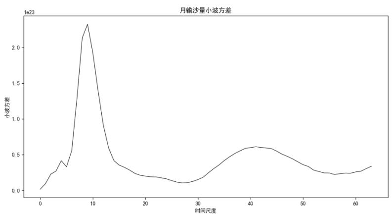

<details>
<summary>line</summary>

| 时间尺度 | 小波方差 (1e23) |
| --- | --- |
| 0 | ~0.02 |
| 2 | ~0.25 |
| 4 | ~0.42 |
| 6 | ~0.35 |
| 8 | ~2.15 |
| 9 | ~2.35 |
| 12 | ~0.65 |
| 14 | ~0.42 |
| 18 | ~0.25 |
| 22 | ~0.20 |
| 27 | ~0.12 |
| 31 | ~0.18 |
| 36 | ~0.45 |
| 40 | ~0.60 |
| 41 | ~0.62 |
| 44 | ~0.58 |
| 48 | ~0.45 |
| 51 | ~0.35 |
| 54 | ~0.25 |
| 56 | ~0.23 |
| 58 | ~0.25 |
| 61 | ~0.26 |
| 63 | ~0.35 |
</details>

图16. 2016-2021年每月平均排沙量小波系数方差图

根据突变性、季节性和周期性综合分析可知，流量在 2018年急剧增长，这是由于 2018 年开始黄河水量增加，进入丰水期，由于小浪底水文站的调水调沙功能，排沙量在 2018 年同样剧增；根据季节性分析结论，流量和排沙量在夏季最多，汛期时期达到峰值，春季与冬季的水量与排沙量差距不明显，秋季的水量与排沙量变化不明显；通过数据的周期性分析得到，流量与排沙量主要以 10 个月为周期变化，其次以 40个月，3 个月为周期变化。

## 4.4 问题三

## 4.4.1 问题三的分析

问题三是根据问题二水沙通量的变化规律研究预测其变化趋势。ARIMA 时间序列预测模型是水文研究中常用的预测模型，它是将非平稳时间序列转化为平稳时间序列，然后将因变量仅对它的滞后值以及随机误差项的现值和滞后值进行回归所建立的模型。

进行序列预测时，对序列 $\left\{ x _ { t } \right\}$ 进行小波分解后得到各层细节系数和逼近系数，重构后的细节系数一般可视为平稳过程来处理，通过模型识别可用选用 AR(p)、MA(q)或ARMA(p,q)等模型进行预测，逼近系数表示序列的趋势或走向，一般为非平稳序列，因此不能直接采用 ARIMA模型，需要经过季节差分采取SARIMA模型。

## 4.4.2 问题三的模型建立

时间序列预测是数据分析预测中经常遇到的问题，本题主要研究ARIMA模型，也是最常用的时间序列模型。本剧第二问的水沙通量变化规律，时间序列具有突变性、周期性、季节性等特征，因此可能无法直接使用 ARIMA建立模型。

因此建立季节差分自回归移动平均模型——SARIMA 预测模型。建模流程如下图17所示。

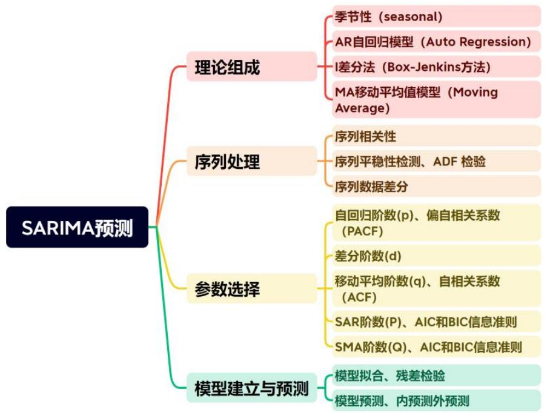

<details>
<summary>flowchart</summary>

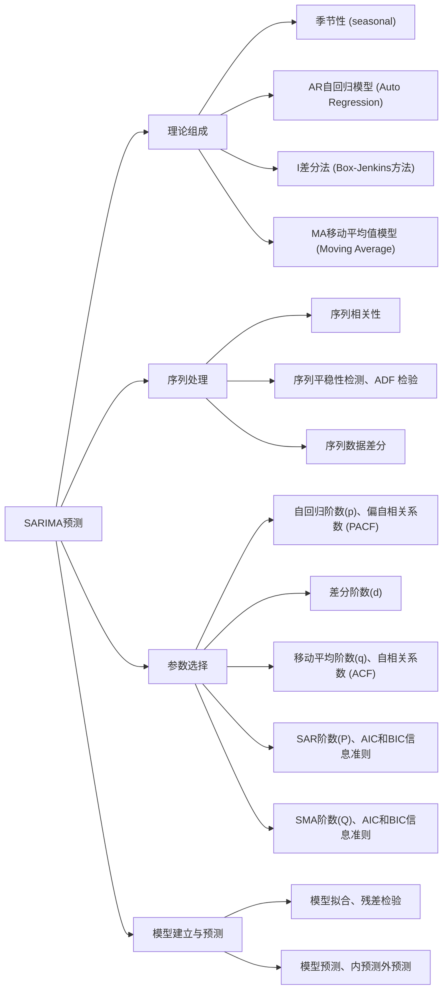
```mermaid
graph LR
  Root["SARIMA预测"] --> Group1["理论组成"]
  Root --> Sequence["序列处理"]
  Root --> Param["参数选择"]
  Root --> Model["模型建立与预测"]

  Group1 --> A1["季节性 (seasonal)"]
  Group1 --> A2["AR自回归模型 (Auto Regression)"]
  Group1 --> A3["I差分法 (Box-Jenkins方法)"]
  Group1 --> A4["MA移动平均值模型 (Moving Average)"]

  Sequence --> B1["序列相关性"]
  Sequence --> B2["序列平稳性检测、ADF 检验"]
  Sequence --> B3["序列数据差分"]

  Param --> C1["自回归阶数(p)、偏自相关系数 (PACF)"]
  Param --> C2["差分阶数(d)"]
  Param --> C3["移动平均阶数(q)、自相关系数 (ACF)"]
  Param --> C4["SAR阶数(P)、AIC和BIC信息准则"]
  Param --> C5["SMA阶数(Q)、AIC和BIC信息准则"]

  Model --> D1["模型拟合、残差检验"]
  Model --> D2["模型预测、内预测外预测"]
```
</details>

图 17.SARIMA 原理分析图

## 4.4.2 问题三模型的求解

## 1.SRAIMA 模型预测：

## 1) ARIMA 模型更新

对成熟的 ARIMA 进行时间序列预测，借助 MATLAB 程序进行简单分析，得到预测图18 如下：

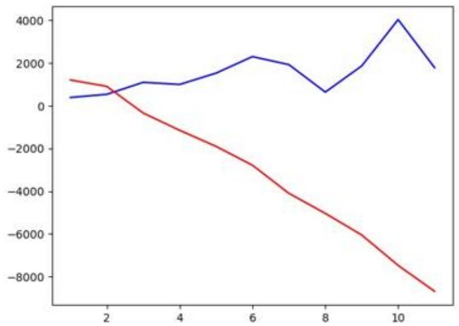

<details>
<summary>line</summary>

| X | Blue Line | Red Line |
| --- | --- | --- |
| 1 | ~400 | ~1200 |
| 2 | ~600 | ~900 |
| 3 | ~1100 | ~-300 |
| 4 | ~1000 | ~-1100 |
| 5 | ~1500 | ~-2000 |
| 6 | ~2300 | ~-2800 |
| 7 | ~1900 | ~-4100 |
| 8 | ~700 | ~-5100 |
| 9 | ~1900 | ~-6000 |
| 10 | ~4100 | ~-7500 |
| 11 | ~1800 | ~-8700 |
</details>

图 18. ARIMA 预测图

分析可得，由于时序数据中存在季节/周期性等的特征，所以ARIMA模型无法识别数据到底是哪种季节/周期特征，导致预测输出为一条直线。最后，已知有季节/周期性数据存在，所以就不能再用那个简单的 ARIMA模型来处理。因此我们使用 SARIMA。

## 2) 建立水沙通量预测序列数据

根据问题 2水沙通量特性研究，发现水流量与排沙量都存在突变性、季节性、周期性等规律，且规律基本一致，在本节中我们将水沙通量综合考虑为流量。下面引入ARIMA序列预测模型建立对未来水沙通量的趋势预测。

首先选取 2016-2020年此5 年的月流量和月排沙量作为原始数据，得到两个连续时间下的 60 组数据集合，将数据按 3 个月为一季节划分尺度，建立季节性自回归移动平均模型。

## 3) 检查时间序列的平稳性

为进行 SARIMA 序列预测，数据需要检查时间序列的平稳性，获取被观测系统时间序列数据，对数据绘图，观测是否为平稳时间序列；此时可进行平稳性测试， 我们使用 Augmented Dickey-Fuller 单位根测试测试平稳性。对于平稳的时间序列，由 ADF 测试得到的 p 值必须小于 5％。如果 p 值大于 0.05 或 5％，则可以得出结论：时间序列具有单位根，这意味着它是一个非平稳过程。对于非平稳时间序列要先进行 d 阶差分运算，化为平稳时间序列。对前 60 组数据进行处理得到如下图 19：可以看出序列为非平稳序列。

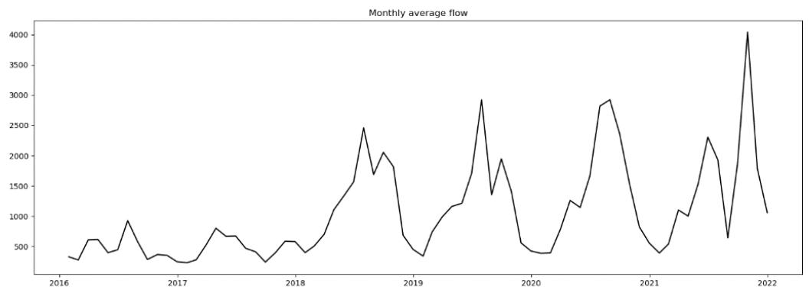

<details>
<summary>line</summary>

| Year | Monthly average flow |
| --- | --- |
| 2016 | ~350 |
| 2016 | ~280 |
| 2016 | ~630 |
| 2016 | ~630 |
| 2016 | ~410 |
| 2016 | ~440 |
| 2016 | ~940 |
| 2017 | ~300 |
| 2017 | ~380 |
| 2017 | ~370 |
| 2017 | ~280 |
| 2017 | ~250 |
| 2017 | ~280 |
| 2017 | ~810 |
| 2018 | ~680 |
| 2018 | ~680 |
| 2018 | ~470 |
| 2018 | ~430 |
| 2018 | ~250 |
| 2018 | ~450 |
| 2018 | ~600 |
| 2018 | ~600 |
| 2019 | ~410 |
| 2019 | ~530 |
| 2019 | ~730 |
| 2019 | ~1120 |
| 2019 | ~1450 |
| 2019 | ~1580 |
| 2019 | ~2480 |
| 2020 | ~1700 |
| 2020 | ~2080 |
| 2020 | ~1850 |
| 2020 | ~700 |
| 2020 | ~480 |
| 2020 | ~350 |
| 2020 | ~750 |
| 2021 | ~1150 |
| 2021 | ~1230 |
| 2021 | ~1750 |
| 2021 | ~2930 |
| 2021 | ~1350 |
| 2021 | ~1970 |
| 2021 | ~1450 |
| 2022 | ~570 |
| 2022 | ~430 |
| 2022 | ~410 |
| 2022 | ~410 |
| 2022 | ~1300 |
| 2022 | ~1160 |
| 2022 | ~1680 |
| 2023 | ~2830 |
| 2023 | ~2930 |
| 2023 | ~2450 |
| 2023 | ~1550 |
| 2023 | ~850 |
| 2023 | ~650 |
| 2023 | ~410 |
| 2023 | ~550 |
| 2024 | ~1130 |
| 2024 | ~1030 |
| 2024 | ~1550 |
| 2024 | ~2330 |
| 2024 | ~1950 |
| 2024 | ~660 |
| 2024 | ~4100 |
| 2025 | ~1850 |
| 2025 | ~1150 |
</details>

图19. 原时间序列图

## （2）差分操作

针对非平稳时间序列，进行序列的差分操作，差分操作是通过计算当前观测值与前一个观测值之间的差异来消除非平稳性。对于本题的序列，我们需要先消除其季节性，因此进行季节差分处理，得到如下图 20数据：

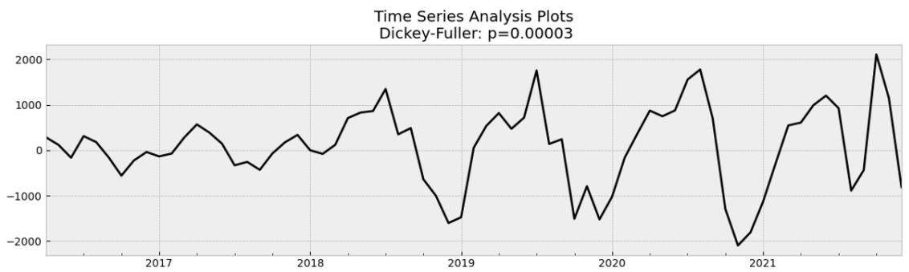

<details>
<summary>line</summary>

| Date | Value |
| --- | --- |
| 2017 | ~300 |
| 2018 | ~100 |
| 2019 | ~-1600 |
| 2020 | ~-1500 |
| 2021 | ~-2100 |
</details>

图 20.季节差分处理图

观察发现序列仍具有一定的不平稳性，因此进行差分处理。此时可以连续多次应用差分方法，产生“一阶差分”，“二阶差分”等，直到得到平稳的差分序列。在我们进行下一步之前，我们应用适当的差分顺序（d）使时间序列平稳。差分公式如下：

X X−一阶差分：

<sub>1 1 1 2</sub>( ) ( )<sub>T T T T T T</sub>X X X X X X<sub>− − − −</sub> − = − − −二阶差分： 公式 13

<sub>T T K</sub>K X X <sub>−</sub>−步差分：

将原始数据进行一阶差分得到下图 21，为实现更优效果，进行二阶差分，如图21。从图 22 中可以看出，二阶差分之后数据趋势逐渐平稳。

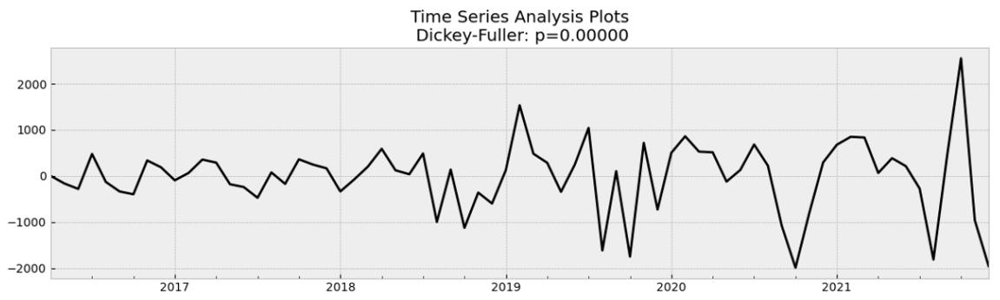

<details>
<summary>line</summary>

| Date | Value |
| --- | --- |
| 2017-01 | ~0 |
| 2017-02 | ~-200 |
| 2017-03 | ~500 |
| 2017-04 | ~-100 |
| 2017-05 | ~-300 |
| 2017-06 | ~-400 |
| 2017-07 | ~350 |
| 2017-08 | ~200 |
| 2017-09 | ~-100 |
| 2017-10 | ~150 |
| 2017-11 | ~350 |
| 2017-12 | ~300 |
| 2018-01 | ~-200 |
| 2018-02 | ~-300 |
| 2018-03 | ~-500 |
| 2018-04 | ~100 |
| 2018-05 | ~-200 |
| 2018-06 | ~350 |
| 2018-07 | ~250 |
| 2018-08 | ~150 |
| 2018-09 | ~-350 |
| 2018-10 | ~-150 |
| 2018-11 | ~250 |
| 2018-12 | ~600 |
| 2019-01 | ~150 |
| 2019-02 | ~50 |
| 2019-03 | ~-100 |
| 2019-04 | ~500 |
| 2019-05 | ~-1100 |
| 2019-06 | ~150 |
| 2019-07 | ~-1150 |
| 2019-08 | ~-400 |
| 2019-09 | ~-650 |
| 2019-10 | ~150 |
| 2019-11 | ~1550 |
| 2019-12 | ~500 |
| 2020-01 | ~350 |
| 2020-02 | ~-350 |
| 2020-03 | ~350 |
| 2020-04 | ~1100 |
| 2020-05 | ~-1650 |
| 2020-06 | ~150 |
| 2020-07 | ~-1800 |
| 2020-08 | ~750 |
| 2020-09 | ~-750 |
| 2020-10 | ~550 |
| 2020-11 | ~950 |
| 2020-12 | ~550 |
| 2021-01 | ~550 |
| 2021-02 | ~-150 |
| 2021-03 | ~150 |
| 2021-04 | ~750 |
| 2021-05 | ~350 |
| 2021-06 | ~-1350 |
| 2021-07 | ~-2150 |
| 2021-08 | ~350 |
| 2021-09 | ~750 |
| 2021-10 | ~950 |
| 2021-11 | ~95 |
| 2021-12 | ~45 |
| 2022-01 | ~45 |
| 2022-02 | ~35 |
| 2022-03 | ~-35 |
| 2022-04 | ~-195 |
| 2022-05 | ~35 |
| 2022-06 | ~85 |
| 2022-07 | ~35 |
| 2022-08 | ~85 |
| 2022-09 | ~35 |
| 2022-10 | ~35 |
| 2022-11 | ~35 |
| 2022-12 | ~35 |
| 2023-01 | ~35 |
| 2023-02 | ~35 |
| 2023-03 | ~35 |
| 2023-04 | ~35 |
| 2023-05 | ~35 |
| 2023-06 | ~35 |
| 2023-07 | ~35 |
| 2023-08 | ~35 |
| 2023-09 | ~35 |
| 2023-10 | ~35 |
| 2023-11 | ~35 |
| 2023-12 | ~35 |
| 2024-01 | ~35 |
| 2024-02 | ~35 |
| 2024-03 | ~35 |
| 2024-04 | ~35 |
| 2024-05 | ~35 |
| 2024-06 | ~35 |
| 2024-07 | ~35 |
| 2024-08 | ~35 |
| 2024-09 | ~35 |
| 2024-10 | ~35 |
| 2024-11 | ~35 |
| 2024-12 | ~35 |
| 2025-01 | ~35 |
| 2025-02 | ~35 |
| 2025-03 | ~35 |
| 2025-04 | ~35 |
| 2025-05 | ~35 |
| 2025-06 | ~35 |
| 2025-07 | ~35 |
| 2025-08 | ~35 |
| 2025-09 | ~35 |
| 2025-10 | ~35 |
| 2025-11 | ~35 |
| 2025-12 | ~35 |
| 2Q'16/16/16/16/16/16/16/16/16/16/16/16/16/16/16/16/16/16/16/16/16/16/16/16/16/16/16/<ecel><nl>

</details>

图 21.一阶差分序列图  
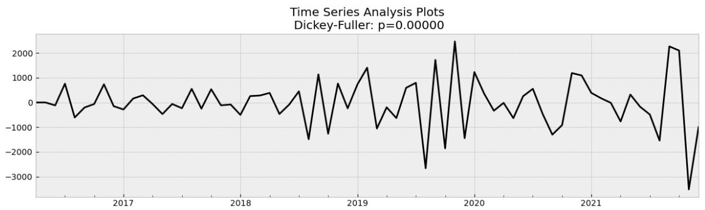

<details>
<summary>line</summary>

| Date | Value |
| --- | --- |
| 2017 | ~0 |
| 2018 | ~-500 |
| 2019 | ~-2700 |
| 2020 | ~-1300 |
| 2021 | ~-3500 |
</details>

图 22.二阶差分序列图

## （3）模型选择：

经过第二步处理，已经得到平稳时间序列。然后开始对得到的模型进行模型检验。根据差分操作后的时间序列，可以确定 SARIMA 模型的参数。季节性$\mathrm { S A R I M A ( p , d , q ) ( P , D , Q , s ) }$ 模型由 7 个参数表示：自回归阶数(p)、差分阶数(d)、移动平均阶数(q)和季节自回归的阶数(P)、季节差分阶数(D)、季节移动平均阶数(Q)。

一个 $\mathsf { p }$ 阶自回归模型可以表示如下：

$$
y _ {t} = c + \phi_ {1} y _ {t - 1} + \phi_ {2} y _ {t - 2} + \dots + \phi_ {p} y _ {t - p} + \varepsilon_ {t}, \quad \text {公式14}
$$

这里的 $ { \varepsilon } _ { t }$ 是白噪声。这相当于将预测变量替换为目标变量的历史值的多元回归。将这个模型称为 AR(p)模型--p阶自回归模型。可以使用自相关函数（ACF）和偏自相关函数（PACF）的图形，以及信息准则（如 AIC、BIC 等）等指标来选择合适的模型参数。

识别 AR模型的 p阶：对于AR模型，ACF 将以指数方式衰减，PACF 将用于识别 AR 模型的顺序（p）。如果我们在 PACF 上的滞后 1 处有一个显著峰值，那么我们有一个 1阶AR模型，即AR（1）。如果我们在 PACF 上有滞后1,2和 3的显著峰值，那么我们有一个 3阶 AR模型，即AR（3）。

识别 MA 模型的q阶：对于MA模型，PACF 将以指数方式衰减，ACF 图将用于识别 MA 过程的顺序。如果我们在 ACF 上的滞后 1 处有一个显著的峰值，那么我们有一个 1 阶的 MA 模型，即 MA（1）。如果我们在 ACF 上的滞后 1,2和3处有显著的峰值，那么我们有一个 3阶的MA模型，即 MA（3）。

下图展示了季节差分及二阶差分后的 ACF及PACF图像。

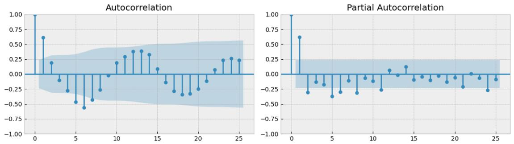  
图 23.一阶差分 ACF、PACF 图

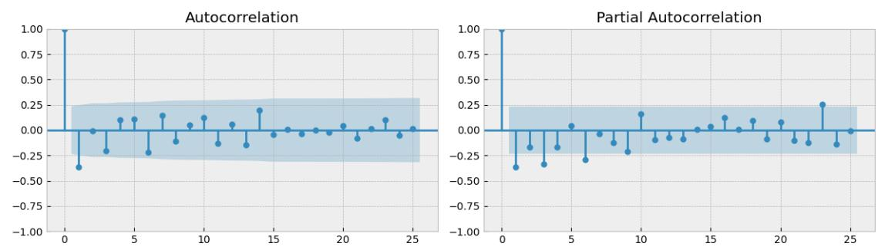  
图 24.二阶差分 ACF、PACF 图

ARIMA 模型结构的初步识别主要依据 ACF(自相关系数)和 PACF(偏自相关系数)的衰减情况。根据模型识别方法，p 阶自回归过程为 ACF 是拖尾的(即呈指数逐步衰减)，而其PACF 在步距p之后截尾；相应地，q阶滑动平均过程为ACF 在步距q 之后截尾，而PACF 拖尾。

热力图定阶结果如下图25所示：

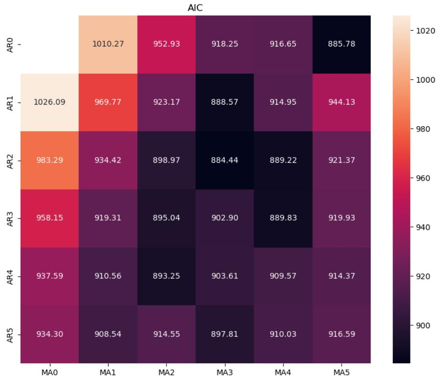

<details>
<summary>heatmap</summary>

| Category | MA0 | MA1 | MA2 | MA3 | MA4 | MA5 |
| --- | --- | --- | --- | --- | --- | --- |
| AR0 | — | 1010.27 | 952.93 | 918.25 | 916.65 | 885.78 |
| AR1 | 1026.09 | 969.77 | 923.17 | 888.57 | 914.95 | 944.13 |
| AR2 | 983.29 | 934.42 | 898.97 | 884.44 | 889.22 | 921.37 |
| AR3 | 958.15 | 919.31 | 895.04 | 902.90 | 889.83 | 919.93 |
| AR4 | 937.59 | 910.56 | 893.25 | 903.61 | 909.57 | 914.37 |
| AR5 | 934.30 | 908.54 | 914.55 | 897.81 | 910.03 | 916.59 |
</details>

图 25.热力图

根据 ACF 和PACF 图定阶，确定出 $\tt p = 2 , q = 3$

## （4）模型拟合

由以上分析得到：自回归阶数(p)=2；移动平均阶数(q)=3；此外可以确定地是，季节性判定 S=6，差分阶数(d)=2，做了 2 阶差分，季节差分阶数(D)=1，做了季节差分。

得到 SARIMA模型。为了预测的可靠性，接下来，借助 AIC信息准则及 BIC信息准则，利用 SARIMA 模型，带入程序来选择最优的参数。对差分后的时间序列进行模型拟合，算法会估计模型的未知参数，以最小化预测误差。在四个自变量的81 组候选参数中，得到最优参数组为[2,3,0,1]，即自回归阶数(p)=2，移动平均阶数(q)=3，和季节自回归的阶数(P)=0，季节移动平均阶数(Q)=1。

基于 SARIMA 模型对水沙通量数据进行预测，并将实际数据与预测数据进行拟合。得到图 18，此时贴合度为 90%。贴合度如图26所示：

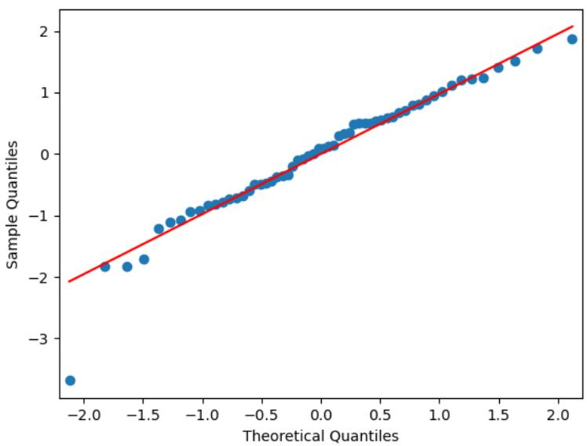

<details>
<summary>qq</summary>

| Theoretical Quantiles | Sample Quantiles |
| --- | --- |
| ~-2.1 | ~-3.7 |
| ~-1.8 | ~-1.8 |
| ~-1.6 | ~-1.8 |
| ~-1.5 | ~-1.7 |
| ~-1.4 | ~-1.2 |
| ~-1.3 | ~-1.1 |
| ~-1.2 | ~-1.0 |
| ~-1.1 | ~-0.9 |
| ~-1.0 | ~-0.9 |
| ~-0.9 | ~-0.8 |
| ~-0.8 | ~-0.8 |
| ~-0.7 | ~-0.7 |
| ~-0.6 | ~-0.6 |
| ~-0.5 | ~-0.5 |
| ~-0.4 | ~-0.4 |
| ~-0.3 | ~-0.3 |
| ~-0.2 | ~-0.2 |
| ~-0.1 | ~-0.1 |
| 0.0 | 0.0 |
| 0.1 | 0.1 |
| 0.2 | 0.2 |
| 0.3 | 0.3 |
| 0.4 | 0.4 |
| 0.5 | 0.5 |
| 0.6 | 0.6 |
| 0.7 | 0.7 |
| 0.8 | 0.8 |
| 0.9 | 0.9 |
| 1.0 | 1.0 |
| 1.1 | 1.1 |
| 1.2 | 1.2 |
| 1.3 | 1.2 |
| 1.4 | 1.3 |
| 1.5 | 1.4 |
| 1.6 | 1.5 |
| 1.7 | 1.6 |
| 1.8 | 1.7 |
| 2.1 | 1.9 |
</details>

图 26.贴合度图

## （5）模型诊断：

为检验模型的准确性，考虑选取模型残差的白噪声指标对拟合的 SARIMA模型进行D-W检验，以验证模型的适用性，D-W检验可以检查残差序列是否满足白噪声假设，即不存在自相关性。根据上文得到的结果，我们可以得到 D-W检验值为 2.020419531977266，已知当 D-W 检验值接近于 2 时，不存在自相关性，所以我们选取的 SARIMA模型对数据拟合充分。

## （6）模型预测

使用训练好的 SARIMA 模型对序列进行内预测，同时为未来的时间序列进行外预测，如下图 27展示：

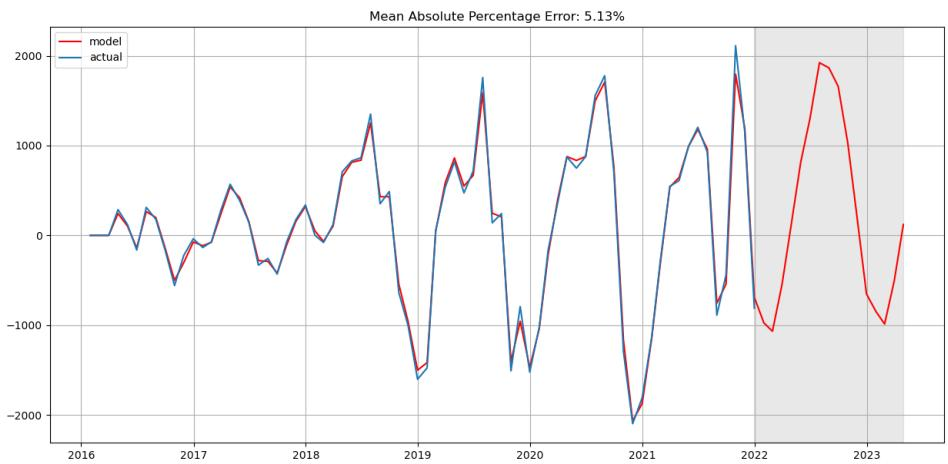

<details>
<summary>line</summary>

| Year | Model | Actual |
| --- | --- | --- |
| 2016 | 0 | 0 |
| 2017 | ~-100 | ~-100 |
| 2018 | ~300 | ~300 |
| 2019 | ~-1500 | ~-1600 |
| 2020 | ~-1000 | ~-1500 |
| 2021 | ~-2000 | ~-2100 |
| 2022 | ~-1000 | ~-800 |
| 2023 | ~-1000 | ~-1000 |
</details>

图 27.序列预测结果图

根据内预测数据我们发现，建立的 SARIMA 模型与有良好的预测性，数据能够接近真实值。此时，外预测图像展示了未来两年的水文站水沙通量情况。从图中可以看出，未来两年水文站水沙通量在仍有一定的季节性、周期性等特征，在未来一段时间内呈现上升趋势，22 年具有极值点，在到达极值点后开始呈下降趋势。

## 2.制定采样监测方案

根据上述预测，得到未来两年的水沙通量数据，根据图像分析变化趋势，制定有效监测水沙动态的方案。在以下方案中平均采样次数保持在每 3-5天采样一次。

（1）在秋季时段内，水沙通量具有一定的稳定变化趋势，则只需在该时间段内测得水沙通量数据连续稳定 10 天后可以每 3 天监测一次，在监测到水沙通量数据开始发生突变时，开始采取每天监测一次选取起始点和终止点的数据即可获取在时间趋势内的稳定变化数据情况。  
（2）每年进入夏季之前，水沙通量会发生突变，则从 5 月下旬开始每天早上 8:00 和 20:00 一天监测两次，6-7 月每天在早上 8:00、中午 14:00 和晚上 20:00监测三次。  
（3）每年春季和冬季时间，水沙通量具有一定的周期性，在每年春季水沙通量逐步增长，在此期间，采取每天监测一次的采样方案，在 5月下旬调整至每天监测 2 次。水沙通量在每年冬季水沙通量逐渐减少，在 10 月底开始监测方案由每3天采样一次调整到每天监测一次。

## 4.5 问题四

## 4.5.1 问题四的分析

由问题一结果看到，2016、2017 两年的总排沙量、总水流量不及 2018-2021年的 10%，说明 6 年间前期调水调沙能力不如后期。下图展示了 2016 年 6-7 月进行的调水调沙之前、之后的黄河河岸某定点处主河槽的河底高程情况。

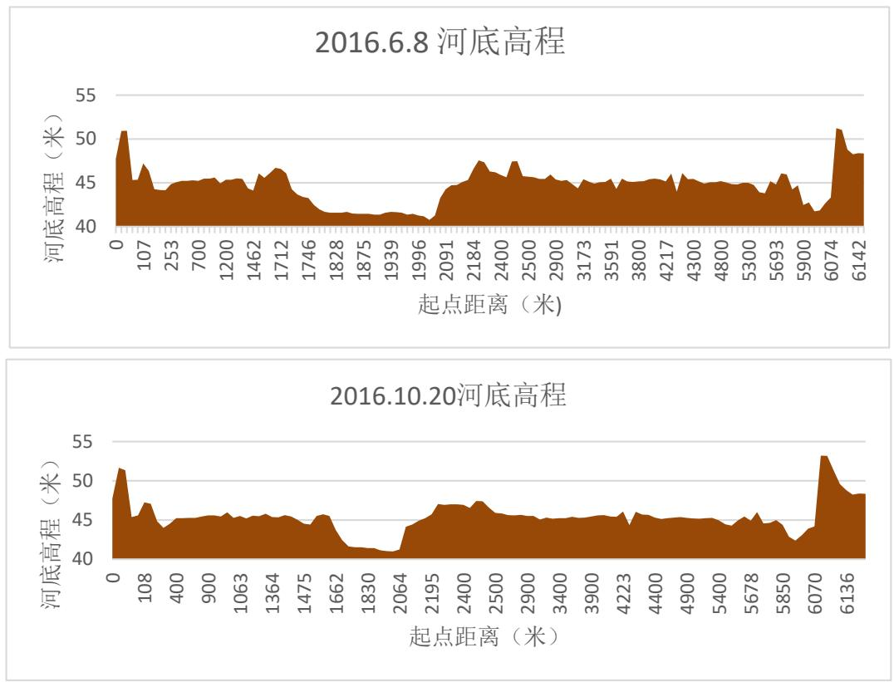  
图 28. 2016年检测日河底高程变化图

借助问题二该水文站月均流量、月均排沙量的计算结果，从主河槽剖面形态变化、平均下切高度两方面入手，分析了附件 2 黄河断面河底高程的变化情况；从测点水面宽度深度、流动力（水流速）、冲击力（水动能）三方面入手，分析附件3该水文站部分监测点数据。从而展示“调水调沙”的实际效果，即：小浪底下游河段具有河槽稳定、河床开阔、加深的趋势，黄河下游的 悬河 风险呈现降低态势，过洪能力提高。

## 4.5.2 问题四的模型建立与求解

## 1.从水沙通量变化研究调水调沙效果

每年6-7月小浪底水库进行调水调沙，为研究调水调沙效果，借助问题二中计算的该水文站每年每月的月均流量和月均排沙量，提取出每年 5-10 月的对应数据作为水沙通量的主要数据，绘制出图29和图30观察分析 6-7月调水调沙前后数据变化。

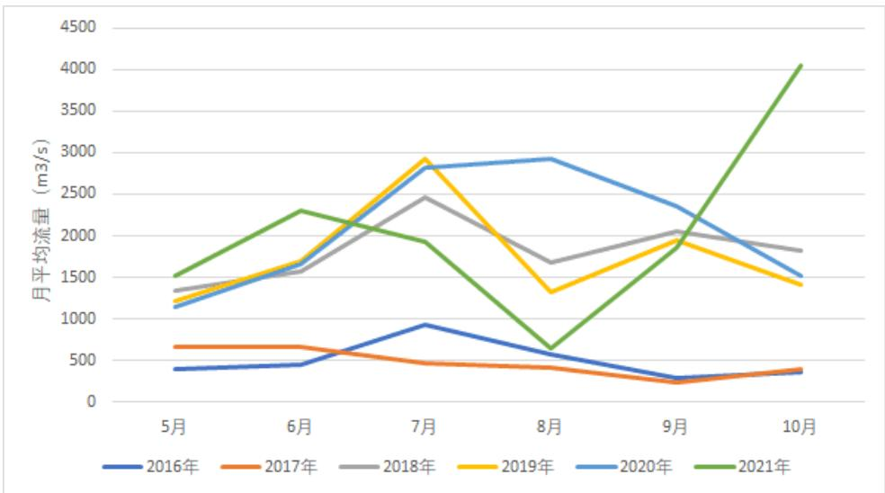

<details>
<summary>line</summary>

| Month | 2016年 \((m^{3}/s)\) | 2017年 \((m^{3}/s)\) | 2018年 \((m^{3}/s)\) | 2019年 \((m^{3}/s)\) | 2020年 \((m^{3}/s)\) | 2021年 \((m^{3}/s)\) |
| --- | --- | --- | --- | --- | --- | --- |
| 5月 | ~400 | ~650 | ~1350 | ~1200 | ~1150 | ~1500 |
| 6月 | ~450 | ~650 | ~1550 | ~1700 | ~1650 | ~2300 |
| 7月 | ~950 | ~450 | ~2450 | ~2900 | ~2800 | ~1950 |
| 8月 | ~600 | ~400 | ~1650 | ~1300 | ~2900 | ~650 |
| 9月 | ~300 | ~250 | ~2050 | ~1950 | ~2350 | ~1850 |
| 10月 | ~350 | ~400 | ~1800 | ~1400 | ~1500 | ~4050 |
</details>

图29.六年中5-10月的月均流量走势图

观察图 29 可以看出，每年从 6 月到 7 月，月均流量都在增大，一般 7 月达到峰值，主要是因为 7、8月份往往是汛期。理论上讲，6-7月调水调沙后河道变宽变深，流量应该增大，但由于汛期降水多，同时上游冲刷来的泥沙多，水沙量的增速大于调水调沙后的有利影响，所以从图像上看，6-7 月份之后，月均流量数值在降低，但过了汛期之后，特别是 8-9月之后，调水调沙的作用就逐渐显现出来，由于河道畅通，水沙流速增大，月均流量在多数年份有所增加。如果不进行调水调沙，七月达到的峰值会更高，河道快速变窄变浅，不利于排水排沙。

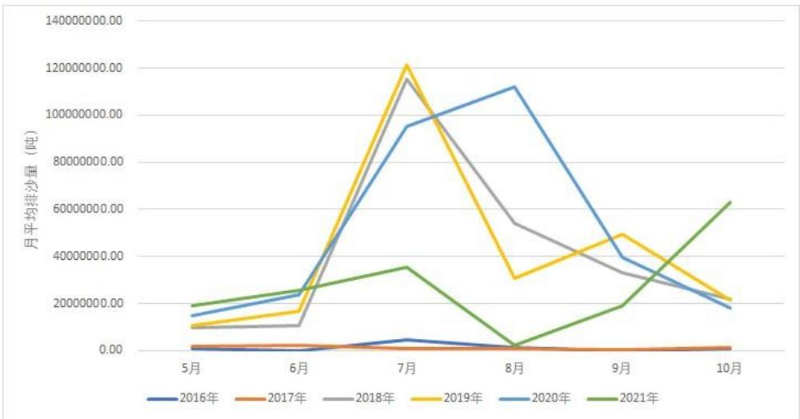

<details>
<summary>line</summary>

| 月份 | 2016年 (吨) | 2017年 (吨) | 2018年 (吨) | 2019年 (吨) | 2020年 (吨) | 2021年 (吨) |
| --- | --- | --- | --- | --- | --- | --- |
| 5月 | ~1,000,000 | ~2,000,000 | ~1,000,000 | ~1,000,000 | ~1,500,000 | ~2,000,000 |
| 6月 | ~1,000,000 | ~2,000,000 | ~1,000,000 | ~1,700,000 | ~2,400,000 | ~2,600,000 |
| 7月 | ~4,500,000 | ~1,500,000 | ~11,500,000 | ~12,200,000 | ~9,500,000 | ~3,500,000 |
| 8月 | ~1,500,000 | ~1,500,000 | ~5,400,000 | ~3,100,000 | ~11,200,000 | ~1,500,000 |
| 9月 | ~1,500,000 | ~1,500,000 | ~3,300,000 | ~5,000,000 | ~4,100,000 | ~1,900,000 |
| 10月 | ~1,500,000 | ~1,500,000 | ~2,200,000 | ~2,256,666 | ~1,844,884 | ~6,364,884 |
</details>

图30. 六年中5-10月的月均排沙量走势图

结合图 29 和图 30 可以看出，月均排沙量的变化与月均流量的变化趋势类似，每年从6月到 7月，月均排沙量都在增大，主要是七八月汛期的影响。调水调沙后，虽然月均排沙量数值在降低，但过了汛期之后，调水调沙的作用就逐渐显现出来。

问题二研究水沙通量的突变性时，发现 2018 年是水沙通量的突变年，可能是当地政府采取了技术更好的调水调沙方式，因此效果较以往明显。

## 2. 从河底高程变化研究调水调沙效果

从附件 2的数据出发，选取 2016 年和2019年河底高程与水位和起点距离的数据，分析在这两年调水调沙前后水面宽度与水深的变化。2016 年 6 月 8 日与2016 年 10 月 20 日河底淤沙的截面图在图 15 中直观地可以看出，经过 6、7 月份调水调沙，河底高程明显降低。为了检验我们的观察，根据附件 1 分析 2016年 6 月 8 日与 2016 年 10 月 20 日两天的平均水位分别为 42.201m，42.396m，水位轻微增长但变化不明显。我们将河底淤沙建立积分模型求得 6月8日的淤沙截面面积为 276753.8425 <sup>2</sup> m ，10 月 20 日淤沙截面的面积为 277733.05 <sup>2</sup> m ，综合分析水位和淤沙截面面积的变化验证了我们的观察。

同样，我们将 2019 年 4 月 13 日和 2019 年 10 月 15 日的淤沙截面图作图如图 16，由于 2019 年 4 月 13 日数据较粗略，只能看出河底高程最低高度无明显变化，所以不能从淤沙截面面积分析变化，故从水深变化以及水面宽度变化来描述结果。从水深角度出发，4月13 日平均水位为43.167m，10月15日平均水位为43.802m，水位轻微上升；从水面宽度角度出发，在附件 2中可以看出4月 13日起点距离在 1681m 和2072m 之间为水面宽度，约为 391m，10月15日起点距离在1600m 和 2055m 之间为水面宽度，约为 455m，水面宽度明显加宽。

综合以上结果分析得：小浪底水库调水调沙使得水面宽度变宽，故而水沙通量加大，确保了汛期黄河防洪安全；调水调沙前后河底高程无明显变化，实现了水库排沙减淤的调度目标，调水调沙带来的“清淤效果”极为显著，为下游通航提供了最基本的保障。

## 3.从“水情监测数据”研究调水调沙效果

观察附件 3数据中河槽内各处水深不同，且“测深点”、“测速点”间隔出现，考虑以测深垂线为边界，将若干条边界之间的面积视为直角梯形（前后两个三角形视为直角梯形的特例），分别计算出每一部分的面积（中面积），求和即为水道

断面总面积。示意图 31如下：

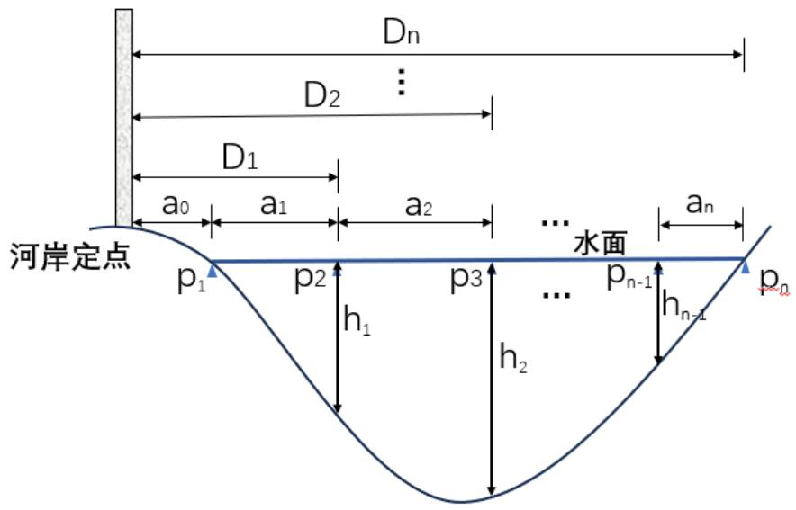

<details>
<summary>text_image</summary>

河岸定点
Dn
D2
...
D1
a0 a1 a2 ... 水面
p1 p2 p3 ... pn-1 pn
h1 h2 hn-1 hn-1
pn
</details>

图31. 求解水道断面面积示意图

记 n次测深监测中， $P _ { i } ( i = 1 \sim n )$ 为第i个测深点， $D _ { i }$ 表示监测点 $P _ { i }$ 起点距离，定义 $a _ { i }$ 为第i个直角梯形的高度，公式为：

$$
\left\{ \begin{array}{l} a _ {0} = \text {水深为} 0 \text {时的起点距离;} \\ a _ {1} = D _ {1} - a _ {0}; \\ a _ {2} = D _ {2} - D _ {1} \\ \dots \dots \\ a _ {n} = D _ {n} - D _ {n - 1} \end{array} \right. \quad \text {公式} 1 5
$$

定义 $h _ { i }$ 为第i个直角梯形的下底，公式为：

$$
\left\{ \begin{array}{l} h _ {0} = 0 \\ h _ {i} = \text {第} i \text {个测深点读数} (i = 0 \sim n) \end{array} \right. \quad \text {公式16}
$$

定义 $S _ { i }$ 为第i个直角梯形的面积，公式为：

$$
S _ {i} = \frac {1}{2} \left(h _ {i - 1} + h _ {i}\right) \cdot a _ {i} \quad \text {公式} 1 7
$$

定义S 为水道断面总面积，公式为：

$$
S = \sum_ {i = 1} ^ {n} S _ {i} \quad \text {公式} 1 8
$$

进一步观察附件 3的水流速数据，发现“测点水速”随起点距离的不同、与河道中心距离不同、与水面距离不同而发生变化，即水速会受河床地形的影响。由于每个“测速点”在水道断面的坐标位置不同，不能直接代表河道水速。

考虑采用“流速面积法”计算平均水流速度。以各测速点之间的中点为边界，将若干直角梯形进一步划分为若干长方形（小面积），作为该测点的水速的作用区域。示意图 32如下：

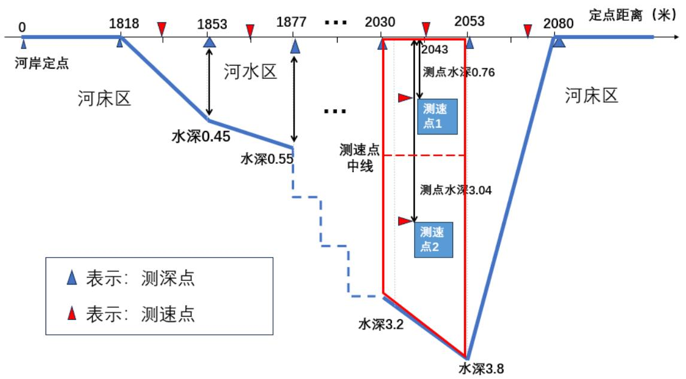

<details>
<summary>line</summary>

| Time (ms) | Depth (m) |
| --- | --- |
| 0 | 0 |
| 1818 | 0 |
| 1853 | 0.45 |
| 1877 | 0.55 |
| 2030 | 0.76 |
| 2043 | 0.76 |
| 2053 | 3.04 |
| 2080 | 3.8 |
</details>

图32. 求解水道平均速度示意图

记 $m ( m > n )$ 次测速中， $Q _ { i } ( i = 1 \sim m )$ 为第i次测速，在该次监测中的不同水深处共获得了k 个水速值和水深值，分别表示为 $\nu _ { _ { i j } } ( i = 1 \sim m , j = 1 \sim k )$ $l _ { i j } ( i = 1 \sim m , j = 1 \sim k )$ 。定义 $b _ { i j }$ 为第 i次测速中第 j个小长方形的高度，计算公式为：

$$
b _ {i j} = \frac {1}{2} (l _ {i j} + l _ {i, j + 1}) \quad \text {公式} 1 9
$$

第 i 次测速中第 j 个小长方形的宽度即为第i次测深中直角梯形的高度，因而该小长方形的面积定义为：

$$
S _ {i j} = a _ {i j} b _ {i j} \quad \text {公式20}
$$

定义v 为水速均值，公式为：

$$
\overline {{v}} = \frac {\sum_ {j = 1} ^ {k} \sum_ {i = 1} ^ {m} v _ {i j} s _ {i j}}{S} \quad \text {公式21}
$$

观察附件 3发现，每个测深点读数皆为相邻各测速点的水深读数之和，考虑该水文站大概率地采用了“对角拉线法”测水速。依此规律更正了部分数据，使得“测点水深”大于“水深”。

在 Python 下，针对每个监测日的数据，分别计算水道断面总面积、水道平均速度，并在Excel 下对部分监测日的计算结果进行了检验。部分结果如下表 7：

表7. 各监测日水道断面面积、平均水速

<table><tr><td>年 月</td><td>2018.4.4</td><td>2019. 4. 17</td><td>2020.4.17</td><td>2020.7.10</td><td>2020.7.11</td><td>2021.7.9</td></tr><tr><td>面积</td><td>572.675</td><td>741.6</td><td>721.325</td><td>1221.6</td><td>1240.75</td><td>1056.1</td></tr><tr><td>水速</td><td>0.8172</td><td>0.6969</td><td>0.8005</td><td>1.0119</td><td>0.4277</td><td>0.973</td></tr></table>

从以上结果中看出，水道断面具有面积增大的趋势，增强了路经船只的通行能力；同时水速略有上升，为河道的清淤提供了保障。

## 4. 调水调沙的作用和必要性

水库进行调水调沙是在现代化技术条件下，利用工程设施和调度手段，通过水流的冲击，将水库里的泥沙和河床上的淤沙适时送入大海，从而减少库区和河床的淤积，增大主槽的行洪能力，同时塑造一个稳定的中水河槽，改善滩区的防洪风险。因此，小浪底水库调水调沙的主要是用水转移黄河中的泥沙，冲刷黄河下游的淤泥，防止黄河的河床再次抬升。

如果小浪底水库不进行调水调沙，10 年后不同起点距离的河底高程会逐渐升高，河底高程最低点的增长趋势最明显，势必会造成大面积的灾害，同时影响生态平衡，造成不可挽回的重大损失。

## 五、模型检验

问题一中，在将含沙量与时间、水位、水流量的关系模型用图、表描述后，用回归分析的方法对各散点图进行了分段曲线拟合，用 Matlab 程序拟合多项式曲线的同时，对各段函数进行了“拟合优度检验”。

经检验，在含沙量与水位的关系的拟合曲线中，根据散点图特点分成两段进行拟合，左边拟合成三次曲线,其 $R ^ { 2 } = 0 . 9 8$ ，右边拟合成直线，其 $R ^ { 2 } = 0 . 9 4 1$ 。两段拟合的都非常理想。如果左边用二次曲线去拟合，其 $R ^ { 2 } = 0 . 9 5 2$ ，不如用三次曲线拟合效果好。同样，在含沙量与水流量关系的分段拟合曲线中，左边拟合成三次曲线,其 $R ^ { 2 } = 0 . 9 2 4$ ，右边拟合成直线，其 $R ^ { 2 } = 0 . 7 5 4$ 。左侧拟合得比右侧效果更理想。如果左边用二次曲线去拟合，其 $R ^ { 2 } = 0 . 9 0 7$ ，仍然不如用三次曲线拟合效果好。两图关系曲线的拟合都通过检验。

随后，又建立了年总水流量和年总排沙量模型，为检验模型估算的数据是否较为准确合理，又选择了更优化的“数值积分法”模型同时进行估算，用一种模型的计算数据去检验另一种。结果显示，两种模型的数据比较接近，计算结果准确、合理，通过检验。

问题二、问题三和问题四所建的模型中，在建模求解的过程中都同时包含了检验过程。结果均通过检验。

## 六、模型评价与推广

## 6.1 模型的优、缺点评价分析

## 6.1.1 模型的优点

（1）问题一中含沙量与水位和水流量的关系，画出散点图后都进行了分段拟合，经拟合优度检验，拟合度非常高，说明模型较为准确的反应了含沙量与二者的关系。年总水流量和年总排沙量的估算运用了两种方法分别建模，用一个模型去验证另一个模型，通过验证，说明模型结果准确可靠。  
（2）文中建立的“ARIMA时间序列预测模型”在各类预测方面，具有很好的通用性和推广性。  
（3）建立各类水文模型之前，对附件中的数据进行了预处理，补充了缺失数据，校正了个别错误数据，建立了各类数据之间的联系，找出其规律，便于分析解决问题。  
（4）文中多个水文模型采用“定量分析与定性分析相结合”，“对已知数据的研究与对未来数据的预测相结合”，使所建模型更有说服力。  
（5）本文所有的数据处理均经过精确的分析、比对、效验，具有很强的准确性，真实性；模型求解结果进行了检验，可信度高，可靠性强。  
（6）模型求解用到 Phthon、MATLAB、Excel 等多种软件，使求解过程更清晰、专业，运用多种绘图使得数据表达更加清晰明了。

## 6.1.2 模型的缺点

（1）在对含沙量与水流量的关系图像进行拟合时，分成左、右两端，右端用一次直线拟合，其 $R ^ { 2 } = 0 . 7 5 4 < 0 . 8$ ，此段拟合效果不够理想。如果将该图像分为三段拟合，可能拟合度会进一步提高。  
（2）累积距平法模型在应用时，所求平均值为 6 年来每月平均流量和平均排沙量，对于分析短期突变性的效果不够直观。

## 6.2 模型的改进与推广

（1）在问题一中，在对含沙量与水流量的图像进行多项式拟合时，分成左、右两端分别拟合，右端用一次直线拟合，通过拟合优度检验得 $R ^ { 2 } = 0 . 7 5 4$ ，拟合效果不够理想。如果将该图像分为三段，分别进行拟合，可能拟合度会进一步提高。

（2）问题二在应用累积距平法解决突变性问题时，可以将每年的月均流量和月均排沙量分别作出累积距平曲线，进一步分析每年中发生突变的更具体的时间。

（3）问题二、问题三中建立的 M-K突变检验模型、小波分析模型、ARIMA 模型近贴近实际，适用于对各领域的问题的分析与预测，有着广泛的通用性和借鉴意义，模型可操作性强，值得推广。

（4）问题四的解决，对政府和相关部门、企业采取一定的应对措施进行防洪减灾，把握问题发展趋势起到了积极的指导作用。

## 七、参考文献

[1]姜启源，谢金星，叶俊. 数学模型[M]，北京：高等教育出版社，2018.5  
[2]韩中庚，周素静. 数学建模实用教程[M]，北京：高等教育出版社，2020.8  
[3]司守奎，孙兆亮. 数学建模算法与应用[M]，北京：国防工业出版社，2015.9  
[4]卓金武.MATLAB数学建模方法与实践[M]，北京：北京航空航天大学出版社,2011  
[5]路贺. 白龙江干流舟曲、武都和碧口水文站水沙特征研究[D].兰州大学,2019  
[6]卢晗,王昱,李小宁,周伟. 黑河流域水沙通量多尺度变化特征及影响因素[J]，

泥沙研究,2023.3

[7]王光辉,近60 年黄河干流径流泥沙变异性分析[D]，清华大学,2019  
[8]许磊,温雅琴,全栋.黄河干流头道拐水文站水沙关系季节性特征分析[J]，泥沙研究，2023.9  
[9]潘彬,黄河水沙变化及其对气候变化和人类活动的响应[D]，山东师范大学,2021.  
[10]薛小杰,蒋晓辉,黄强. 小波分析在水文序列趋势分析中的应用[J], 应用科学学报，2002,20

## 八、附录

## 一、问题一的程序代码

1. 补充第 t日的含沙量数据  
```python
import pandas as pd
def fill_data(list_t):
    for i in range(len(list_t)):
        if list_t[i] == 999:
            for j in range(i, len(list_t)):
                if list_t[j] != 999:
                    t = (list_t[i - 1] + list_t[j]) / 2
                    list_t[i] = t
                    break
    return pd.Series(list_t)
if __name__ == &apos; __main__ &apos::
    f1_path = r&apos;//Data/转置汇总_t.xlsx&apos;
    f1_save = r&apos;//Data/转置汇总_re.xlsx&apos;
    df_ori = pd.read_excel(f1_path)
    df_ori = df_ori.fillna(999)
    df_ori[&apos;2017_t&apos;] = fill_data(df_ori[&apos;2017_t&apos;].values.tolist())
    df_ori[&apos;2018_t&apos;] = fill_data(df_ori[&apos;2018_t&apos;].values.tolist())
    df_ori[&apos;2019_t&apos;] = fill_data(df_ori[&apos;2019_t&apos;].values.tolist())
    df_ori[&apos;2020_t&apos;] = fill_data(df_ori[&apos;2020_t&apos;].values.tolist())
    df_ori[&apos;2021_t&apos;] = fill_data(df_ori[&apos;2021_t&apos;].values.tolist())
    print(df_ori)
    df_ori.to_excel(f1_save, index=False)
```

## 2. 含沙量与时间关系的画图程序：

```txt
clc,clear
```

```matlab
clc,clear
data = xlsread('time-hansha.xlsx', 'sheet1');
time2016=data(:,1);
time2017=data(:,1);
time2018=data(:,1);
time2019=data(:,1);
time2020=data(:,1);
time2021=data(:,1);
sha2016=data(:,2);
sha2017=data(:,3);
sha2018=data(:,4);
sha2019=data(:,5);
sha2020=data(:,6);
sha2021=data(:,7);
sha2016f=sha2016*3600*24;
sha2017f=sha2017*3600*24;
sha2018f=sha2018*3600*24;
sha2019f=sha2019*3600*24;
sha2020f=sha2020*3600*24;
sha2021f=sha2021*3600*24;
subplot(1,2,1),plot(time2016(1:365),sha2016(1:365),'*')
figure
subplot(1,2,1),plot(time2017(1:365),sha2017(1:365),'*')
figure
subplot(1,2,1),plot(time2018(1:365),sha2018(1:365),'*')
figure
subplot(1,2,1),plot(time2019(1:365),sha2019(1:365),'*')
figure
subplot(1,2,1),plot(time2020(1:365),sha2020(1:365),'*')
figure
subplot(1,2,1),plot(time2021(1:365),sha2021(1:365),'*')
```

## 3. 含沙量与水位的分段拟合及检验程序

```matlab
clc,clear
data = xlsread('nihejisuan-shuiwei.xlsx', 'sheet1');
wei=data(:,1);
sha2016=data(:,2);
format long e
    nihe1 = polyfit(wei(1:7),sha2016(1:7),2);
    x=wei(1:7);
    y=sha2016(1:7);
    f= polyval(nihe1,x);
    mdl1=fitlm(y,f)
```

```matlab
%R1=1-(sum(f-y).^2/sum((y-mean(y)).^2))
plot(x, f)
hold on
plot(x,y,'*')
xlim([42 46.5]);
ylim([0 18]);

nihe2 = polyfit(wei(8:13),sha2016(8:13),1);
x2=wei(8:13);
f2=sha2016(8:13);
y2 = polyval(nihe2,wei(8:13));
mdl2=fitlm(y2,f2)
rmse2 = sqrt(sum((sha2016(8:13)-y2).^2));

%R2=1-(sum( y2-sha2016(7:13)).^2/sum((sha2016(7:13)-mean(sha2016(7:13))).^2))
plot(wei(8:13), y2)
hold on
plot(wei(8:13),sha2016(8:13),'')
rmse2;
hold off
```

## 4. 含沙量与水流量关系的分段曲线拟合及检验程序：

```matlab
clc,clear
data = xlsread('nihejisuan-shuiliu.xlsx', 'sheet1');
liu=data(:,1);
sha=data(:,2);
plot(liu,sha)
hold off
format long e
    nihe1 = polyfit(liu(1:7),sha(1:7),3)
    x=liu(1:7);
    y=sha(1:7);
    yhat1= polyval(nihe1,x);
    mdl1=fitlm(y,yhat1)
    cha1=sum((sha(1:7)-yhat1.^2));rmse1=sqrt(cha1);
    plot(liu(1:7), yhat1)
    hold on
    plot(liu(1:7),sha(1:7),'*')
    rmse1;
    nihe2 = polyfit(liu(7:13),sha(7:13),1);
    x2=liu(7:13);
    y2=sha(7:13);
    yhat2 = polyval(nihe2,liu(7:13));
    mdl2=fitlm(y2,yhat2)
```

```matlab
rmse2 = sqrt(sum((sha(7:13)-yhat2).^2));
plot(liu(7:13), yhat2)
hold on
plot(liu(7:13),sha(7:13),'.')
rmse2;
hold off
```

5. “数值积分法”年总水流量程序：  
```matlab
clc,clear
data = xlsread('time-shuiliu.xlsx', 'sheet1');
time2016=data(:,1);
time2017=data(:,1);
time2018=data(:,1);
time2019=data(:,1);
time2020=data(:,1);
time2021=data(:,1);
liu2016=data(:,2);
liu2017=data(:,3);
liu2018=data(:,4);
liu2019=data(:,5);
liu2020=data(:,6);
liu2021=data(:,7);
liu2016f=liu2016*3600*24;
liu2017f=liu2017*3600*24;
liu2018f=liu2018*3600*24;
liu2019f=liu2019*3600*24;
liu2020f=liu2020*3600*24;
liu2021f=liu2021*3600*24;
i=1:365;
t=i;
t1=t(1);t2=t(end);
pp2016=csape(t,liu2016f);
pp2017=csape(t,liu2017f);
pp2018=csape(t,liu2018f);
pp2019=csape(t,liu2019f);
pp2020=csape(t,liu2020f);
pp2021=csape(t,liu2021f);
xsh2016=pp2016.coefs
xsh2017=pp2017.coefs
xsh2018=pp2018.coefs
xsh2019=pp2019.coefs
xsh2020=pp2020.coefs
xsh2021=pp2021.coefs
TL2016=quadl(@ (tt)fnval(pp2016,tt),t1,t2)
```

```julia
TL2017=quadl(@ (tt)fnval(pp2017,tt),t1,t2)
TL2018=quadl(@ (tt)fnval(pp2018,tt),t1,t2)
TL2019=quadl(@ (tt)fnval(pp2019,tt),t1,t2)
TL2020=quadl(@ (tt)fnval(pp2020,tt),t1,t2)
TL2021=quadl(@ (tt)fnval(pp2021,tt),t1,t2)
a = [TL2016,TL2017,TL2018,TL2019,TL2020,TL2021]
```

6. “数值积分法”年总排沙量程序：  
```matlab
clc,clear
data = xlsread('time-hansha.xlsx', 'sheet1');
time2016=data(:,1);
time2017=data(:,1);
time2018=data(:,1);
time2019=data(:,1);
time2020=data(:,1);
time2021=data(:,1);
sha2016=data(:,2);
sha2017=data(:,3);
sha2018=data(:,4);
sha2019=data(:,5);
sha2020=data(:,6);
sha2021=data(:,7);
sha2016f=sha2016/1000;
sha2017f=sha2017/1000;
sha2018f=sha2018/1000;
sha2019f=sha2019/1000;
sha2020f=sha2020/1000;
sha2021f=sha2021/1000;
i=1:365;
t=i;
t1=t(1);t2=t(end);
pp2016=csape(t,sha2016f);
pp2017=csape(t,sha2017f);
pp2018=csape(t,sha2018f);
pp2019=csape(t,sha2019f);
pp2020=csape(t,sha2020f);
pp2021=csape(t,sha2021f);
xsh2016=pp2016.coefs
xsh2017=pp2017.coefs
xsh2018=pp2018.coefs
xsh2019=pp2019.coefs
xsh2020=pp2020.coefs
xsh2021=pp2021.coefs
TL2016=quadl(@ (tt)fnval(pp2016,tt),t1,t2)
```

```julia
TL2017=quadl(@ (tt)fnval(pp2017,tt),t1,t2)
TL2018=quadl(@ (tt)fnval(pp2018,tt),t1,t2)
TL2019=quadl(@ (tt)fnval(pp2019,tt),t1,t2)
TL2020=quadl(@ (tt)fnval(pp2020,tt),t1,t2)
TL2021=quadl(@ (tt)fnval(pp2021,tt),t1,t2)
a = [TL2016,TL2017,TL2018,TL2019,TL2020,TL2021]
```

## 二、问题二的程序代码

## 1. 月流量累积距平曲线代码

```python
import numpy as np
import pandas as pd
import matplotlib.pyplot as plt
```

```txt
# 读取数据
data = pd.read_excel(r'./Data/月输沙量_1.xlsx')
# 去除重复数据和缺失值
data.drop_duplicates(inplace=True)
data.dropna(inplace=True)
# 将日期转换为时间格式
data['时间'] = pd.to_datetime(data['时间'])
```

```python
# 计算每日距平流量
daily_mean = data.groupby(data['时间'].dt.dayofyear)['流量'].mean()
data['flow_anomaly'] = data['流量'] - daily_mean[data['时间'].dt.dayofyear].values
```

```python
# 计算累积距平流量
data['flow_cumsum'] = data['flow_anomaly'].cumsum()

print(data['时间'].values)
print(data['flow_cumsum'])
```

```python
# 绘制累积距平曲线
plt.figure(figsize=(12,8), dpi=120)
plt.plot(data['时间'].values, data['flow_cumsum'].values.tolist(), color='black')
plt.xlabel('Date')
plt.ylabel('Cumulative Anomaly')
plt.title('Cumulative Anomaly Curve')
plt.show()
```

## 2. 月排沙量累积距平曲线代码

```python
import numpy as np
import pandas as pd
import matplotlib.pyplot as plt
```

```python
# 读取数据
data = pd.read_excel(r'/Data/月输沙量_1.xlsx')
# 去除重复数据和缺失值
data.drop_duplicates(inplace=True)
data.dropna(inplace=True)
# 将日期转换为时间格式
data['时间'] = pd.to_datetime(data['时间'])

# 计算每日距平输沙量
daily_mean = data.groupby(data['时间'].dt.dayofyear)['输沙量'].mean()
data['flow_anomaly'] = data['输沙量'] - daily_mean[data['时间'].dt.dayofyear].values

# 计算累积距平输沙量
data['flow_cumsum'] = data['flow_anomaly'].cumsum()

print(data['时间'].values)
print(data['flow_cumsum'])

# 绘制累积距平曲线
plt.figure(figsize=(12,8), dpi=120)
plt.plot(data['时间'].values, data['flow_cumsum'].values.tolist(), color='black')
plt.xlabel('Date')
plt.ylabel('Cumulative Anomaly')
plt.title('Cumulative Anomaly Curve')
plt.show()
```

## 3. 月流量 M-K突变检验代码

```python
import numpy as np
import pandas as pd
from pylab import *

df_ori = pd.read_excel(r'./Data/月流量_1.xlsx')
# df_ori_time = pd.to_datetime(df_ori['时间'].values.tolist())
# df = pd.DataFrame(df_ori['均值'].values.tolist(), index=pd.date_range('2016-01-01',
#
periods=72, freq='M'), columns=['均值'])
df_t = df_ori['流量']
np_t = np.array(df_t.values.tolist())
Data = np_t
# 对时序数据 X，生成一个序号序列，次数列范围为 2 ~ n。
# i 从 2 开始（即第二个数，其编号为 1，此时 1 处没有必要进行计算，因为
其之前没有数据，所以这里从 2 开始生成）
# 规定第一个结果为 0，因此我们不考虑第一个位置的结果
NUMI = np.arange(1, len(Data))
```

\# 计算 E

$$
\# \mathrm{E} = \text {NUMI} * (\text {NUMI - 1}) / 4
$$

$$
\mathrm{E} = (\mathrm{NUMI} + 1) * \mathrm{NUMI} / 4
$$

\# 计算 Var

$$
\# \mathrm{VAR} = \mathrm{NUMI} * (\mathrm{NUMI} - 1) * (2 * \mathrm{NUMI} + 5) / 7 2
$$

$$
\mathrm{VAR} = (\mathrm{NUMI} + 1) \quad * \mathrm{NUMI} * (2 * (\mathrm{NUMI} + 1) + 5) / 7 2
$$

\# 1.计算 Ri。即：序列中的某一个值与此值之前的所有值以此相比，结果为大出现的次数。

Ri = [(Data[i] > Data[:i]).sum() for i in NUMI]# 2.计算 Sk。使用 numpy 累计求和函数 cumsum。

Sk = np.cumsum(Ri)# 3.计算 UFk。考虑到 i 从 1 开始，因此把未计算的两个位置填充 0 。

$$
\mathrm{UFk} = \mathrm{np.pad} ((\mathrm{Sk-E}) / \mathrm{np.sqrt(VAR)}, (1, 0))
$$

\# 思路参考第一步，这里进行简写。

\## 对于倒序，由于 Python 支持传入负数表示倒序取值，这里利用此特性直接生成倒序（反向） Bk，不包含最后一个数（编号 -1）。

$$
\mathrm{Bk} = \mathrm{np.cumsum} ([ (\text {Data[i] > Data[i:])}. \text {sum() for i in -(NUMI + 1) ]})
$$

\## 按照 UFk 的计算方法后取负数即为 UBk。由于本身未对 Data 进行倒序，这里计算完成后对数据进行倒序。

$$
\mathrm{UBk} = \mathrm{np.pad} ((- (\mathrm{Bk} - \mathrm{E}) / \mathrm{np.sqrt(VAR)}), (1, 0)) [: - 1 ]
$$

$$
\text {import matplotlib.pyplot as plt}
$$

\# 配置参数

$$
\mathrm{PAR} = \{\text {font.sans-serif}: \text {Times New Roman}, \text {axes.unicode\_minus}: \text {False} \}
$$

$$
\text {plt.rcParams.update(PAR)}
$$

$$
\text {plt.figure(figsize = (10, 5.5), dpi = 300)}
$$

$$
\text {mpl.rcParams['font.sans - serif'] = ['SimHei']} \tag{1}
$$

$$
\text {plt.title} (^ {\prime} 2 0 1 6 - 2 0 2 1 \text {年流量 M - K 突变检验曲线})
$$

$$
\text {plt.plot} (\text {range} (1, \text {len} (\text {Data}) + 1), \text {UFk }, \text {label} = ^ {\prime} \text {UFk} ^ {\prime}, \text {color} = ^ {\prime} \mathrm{r} ^ {\prime})
$$

$$
\text {plt.plot} (\text {range} (1, \text {len} (\text {Data}) + 1), \text {UBk }, \text {label} = ^ {\prime} \text {UBk} ^ {\prime}, \text {color} = ^ {\prime} \text {black} ^ {\prime})
$$

$$
\# \text {plt.grid(True, linestyle} = (0, (6, 6)), \text {linewidth} = 0. 4) \# \# \text {画出} 0. 0 5 \text {置信区间边界}
$$

$$
\mathrm{x} \_ \lim = \text {plt.xlim()}
$$

$$
\text {plt.plot} (\mathrm{x} _ {-} \lim, [ - 1. 9 6, - 1. 9 6 ], \text {linestyle} = (0, (6, 6)), \text {color} = ^ {\prime} \mathrm{g} ^ {\prime})
$$

$$
\text {plt.plot} (\mathrm{x} \_ \lim, [ 0, 0 ], \text {linestyle} = (0, (6, 6)), \text {color} = ^ {\prime} \mathrm{g} ^ {\prime})
$$

$$
\text {plt.plot} (\mathrm{x} \_ \lim, [ 1. 9 6, 1. 9 6 ], \text {linestyle} = (0, (6, 6)), \text {color} = ^ {\prime} \mathrm{g} ^ {\prime})
$$

$$
\text {plt.legend(frameon = False)}
$$

$$
\text {plt.show()}
$$

## 4. 月排沙量 M-K突变检验代码

import numpy as np

import pandas as pd

from pylab import \*

df\_ori = pd.read\_excel(r'./Data/月输沙量\_1.xlsx')

\# df\_ori\_time = pd.to\_datetime(df\_ori['时间'].values.tolist())

\# df = pd.DataFrame(df\_ori['均值'].values.tolist(), index=pd.date\_range('2016-01-01', #

periods=72, freq='M'), columns=['均值'])

df\_t = df\_ori['输沙量']

np\_t = np.array(df\_t.values.tolist())

Data = np\_t

\# 对时序数据 X ，生成一个序号序列，次数列范围为 2 \~ n。

\# i 从 2 开始（即第二个数，其编号为 1，此时 1 处没有必要进行计算，因为其之前没有数据，所以这里从 2 开始生成）

\# 规定第一个结果为 0，因此我们不考虑第一个位置的结果

NUMI = np.arange(1, len(Data))

\# 计算 E

\# E = NUMI \* (NUMI - 1) / 4

E = (NUMI + 1) \* NUMI / 4

\# 计算 Var

\# VAR = NUMI \* (NUMI - 1) \* (2 \* NUMI + 5) / 72

VAR = (NUMI + 1) \* NUMI \* (2 \* (NUMI + 1) + 5) / 72

\# 1.计算 Ri。即：序列中的某一个值与此值之前的所有值以此相比，结果为大出现的次数。

Ri = [(Data[i] > Data[:i]).sum() for i in NUMI]# 2.计算 Sk。使用 numpy 累计求和函数 cumsum。

Sk = np.cumsum(Ri)# 3.计算 UFk。考虑到 i 从 1 开始，因此把未计算的两个位置填充 0 。

UFk = np.pad((Sk - E) / np.sqrt(VAR), (1,0))

\# 思路参考第一步，这里进行简写。

\## 对于倒序，由于 Python 支持传入负数表示倒序取值，这里利用此特性直接生成倒序（反向） Bk，不包含最后一个数（编号 -1）。

Bk = np.cumsum([(Data[i] > Data[i:]).sum() for i in -(NUMI+1)])

\## 按照 UFk 的计算方法后取负数即为 UBk。由于本身未对 Data 进行倒序，这里计算完成后对数据进行倒序。

UBk = np.pad((-(Bk - E) / np.sqrt(VAR)), (1,0))[::-1]

import matplotlib.pyplot as plt

\# 配置参数

PAR = {'font.sans-serif': 'Times New Roman','axes.unicode\_minus': False}

plt.rcParams.update(PAR)

plt.figure(figsize = (10, 5.5), dpi = 300)

mpl.rcParams['font.sans-serif'] = ['SimHei']

plt.title('2016-2021 年输沙量 M-K 突变检验曲线')

plt.plot(range(1 ,len(Data)+1),UFk,label = 'UFk',color = 'r')

plt.plot(range(1 ,len(Data)+1),UBk,label = 'UBk',color = 'black')

\# plt.grid(True, linestyle = (0,(6,6)), linewidth = 0.4)## 画出 0.05 置信区间边界

x\_lim = plt.xlim()

plt.plot(x\_lim,[-1.96,-1.96],linestyle = (0,(6,6)),color = 'g')

plt.plot(x\_lim, [0,0],linestyle = (0,(6,6)),color = 'g')

```python
plt.plot(x_lim,[1.96,1.96],linestyle = (0,(6,6)),color = 'g')
plt.legend(frameon = False)
plt.show()
```

## 5. 流量季节性分析

11

季节分解法

import pandas as pd

from statsmodels.tsa.seasonal import seasonal\_decompose import matplotlib.pyplot as plt

```python
def cal_avg(df_ori):
    """
    计算每月均值
    """
    list_ori = df_ori.values.tolist()
    print(str(list_ori[0][0]).split('')[0])
    list_time = []
    for i in range(len(list_ori)):
        list_time.append(str(list_ori[i][0]).split('')[0])

    list_re = []
    sum_num = 0
    list_t = [list_time[0]]
    flag = list_time[0].split('-')[1]
    count_num = 0
    for i in range(len(list_ori)):
        if list_time[i].split('-')[1] == flag:
            count_num = count_num + 1
            sum_num = sum_num + list_ori[i][1]
        else:
            avg_num = sum_num / count_num
            list_t.append(avg_num)
            list_re.append(list_t)
            sum_num = list_ori[i][1]
            flag = list_time[i].split('-')[1]
            list_t = [list_time[i]]
            count_num = 1
    list_t.append(sum_num/count_num)
    list_re.append(list_t)
    df_avg = pd.DataFrame(list_re)
    df_avg.to_excel(r'/Data/时间流量_month.xlsx')
```

```python
if __name__ == '__main__':
    df_ori = pd.read_excel(r'./Data/月流量_1.xlsx')
    df_ori_time = pd.to_datetime(df_ori['时间'].values.tolist())
    df = pd.DataFrame(df_ori['流量'].values.tolist(), index=pd.date_range('2016-01-01',
                      periods=72, freq='M'), columns=['流量'])
    print(df)
    # cal_avg(df_ori)
    result_mul = seasonal_decompose(df['流量'],
                     model='multiplicative',
                     extrapolate_trend='freq')

    plt.rcParams.update({'figure.figsize': (10, 10)})
    result_mul.plot().suptitle('Multiplicative Decompose')
    plt.show()
```

## 6. 月排沙量季节性分析

季节分解法

import pandas as pd from statsmodels.tsa.seasonal import seasonal\_decompose import matplotlib.pyplot as plt

```python
def cal_avg(df_ori):
    """
    计算每月均值
    """
    list_ori = df_ori.values.tolist()
    print(str(list_ori[0][0]).split('')[0])
    list_time = []
    for i in range(len(list_ori)):
        list_time.append(str(list_ori[i][0]).split('')[0])

    list_re = []
    sum_num = 0
    list_t = [list_time[0]]
    flag = list_time[0].split('-')[1]
    count_num = 0
    for i in range(len(list_ori)):
        if list_time[i].split('-')[1] == flag:
            count_num = count_num + 1
            sum_num = sum_num + list_ori[i][1]
        else:
            avg_num = sum_num / count_num
```

```python
list_t.append(avg_num)
list_re.append(list_t)
sum_num = list_ori[i][1]
flag = list_time[i].split('-')[1]
list_t = [list_time[i]]
count_num = 1
list_t.append(sum_num/count_num)
list_re.append(list_t)
df_avg = pd.DataFrame(list_re)
df_avg.to_excel(r'/Data/时间流量_month.xlsx')

if __name__ == '__main__':
    df_ori = pd.read_excel(r'/Data/月输沙量_1.xlsx')
    df_ori_time = pd.to_datetime(df_ori['时间'].values.tolist())
    df = pd.DataFrame(df_ori['输沙量'].values.tolist(), index=pd.date_range('2016-01-01',
            periods=72, freq='M'), columns=['输沙量'])
    print(df)
    # cal_avg(df_ori)
    result_mul = seasonal_decompose(df['输沙量'],
        model='multiplicative',
        extrapolate_trend='freq')

plt.rcParams.update({'figure.figsize': (10, 10)})
result_mul.plot().suptitle('Multiplicative Decompose')
plt.show()
```

## 三、问题三的程序代码

SRAIMA模型的建立与预测  
```python
import warnings                      # do not disturbe mode
warnings.filterwarnings('ignore')
```

# Load packages  
```python
import numpy as np                      # vectors and matrices
import pandas as pd                    # tables and data manipulations
import matplotlib.pyplot as plt             # plots
import seaborn as sns                   # more plots
```

from dateutil.relativedelta import relativedelta # working with dates with style from scipy.optimize import minimize # for function minimization

import statsmodels.formula.api as smf # statistics and econometrics

import statsmodels.tsa.api as smt import statsmodels.api as sm import scipy.stats as scs

from itertools import product from tqdm import tqdm\_notebook # some useful functions

\# Importing everything from forecasting quality metrics from sklearn.metrics import r2\_score, median\_absolute\_error, mean\_absolute\_error from sklearn.metrics import median\_absolute\_error, mean\_squared\_error, mean\_squared\_log\_error

\# MAPE def mean\_absolute\_percentage\_error(y\_true, y\_pred): return np.mean(np.abs((y\_true - y\_pred) / y\_true)) \* 100

def tsplot(y, lags=None, figsize=(12, 7), style='bmh'): Plot time series, its ACF and PACF, calculate Dickey–Fuller test

y - timeseries lags - how many lags to include in ACF, PACF calculation

if not isinstance(y, pd.Series): y = pd.Series(y) with plt.style.context(style): fig = plt.figure(figsize=figsize) layout = (2, 2) ts\_ax = plt.subplot2grid(layout, (0, 0), colspan=2) acf\_ax = plt.subplot2grid(layout, (1, 0)) pacf\_ax = plt.subplot2grid(layout, (1, 1)) y.plot(ax=ts\_ax, color='black') p\_value = sm.tsa.stattools.adfuller(y)[1] ts\_ax.set\_title('Time Series Analysis Plots\n Dickey-Fuller: {0:.5f}'.format(p\_value)) smt.graphics.plot\_acf(y, lags=lags, ax=acf\_ax) smt.graphics.plot\_pacf(y, lags=lags, ax=pacf\_ax) plt.tight\_layout() plt.show()

index = pd.date\_range('2016-01', periods=72, freq='M')

```python
index = list(index)
df = pd.read_excel(r'./Data/时间流量_month.xlsx')
data_list = df['均值'].values.tolist()
dataframe = pd.DataFrame(data_list, index=pd.date_range('2016-01', periods=72,
freq='M'), columns=['Ads'])
# dataframe.to_csv(r'./Data/ARMA_test_old.csv', index=0)
```

```python
ads = dataframe
print('the data is existting')
plt.figure(figsize=(18, 6))
plt.plot(ads, color='black')
plt.title('Monthly average flow')
plt.show()
```

```python
ads_diff = ads.Ads - ads.Ads.shift(3) #季节差分
tsplot(ads_diff[3:], lags=25)
ads_diff = ads_diff - ads_diff.shift(1) #一阶差分
ads_diff = ads_diff - ads_diff.shift(1) #二阶差分
ads_diff = ads_diff.fillna(0)
tsplot(ads_diff[3:], lags=25)
```

```python
# setting initial values and some bounds for them
ps = range(0, 4)
d=2 #除去季节差分外的差分次数
qs = range(0, 4)
Ps = range(0, 4)
D=1
Qs = range(0, 4)
s = 6 # season length is still 24
```

```python
# creating list with all the possible combinations of parameters
parameters = product(ps, qs, Ps, Qs)
parameters_list = list(parameters)
len(parameters_list)  # 36
```

```python
def optimizeSARIMA(parameters_list, d, D, s):
    """Return dataframe with parameters and corresponding AIC
    parameters_list - list with (p, q, P, Q) tuples
    d - integration order in ARIMA model
    D - seasonal integration order
    s - length of season
    """
```

```python
results = []
best_aic = float("inf")

for param in tqdm_notebook(parameters_list):
    # we need try-except because on some combinations model fails to converge
    try:
        model=sm.tsa.statespace.SARIMAX(ads.Ads, order=(param[0], d,
param[1]),
                    seasonal_order=(param[2], D, param[3],
s)).fit(disp=-1)
    except:
        continue
    aic = model.aic
    # saving best model, AIC and parameters
    if aic < best_aic:
        best_model = model
        best_aic = aic
        best_param = param
    results.append([param, model.aic])

result_table = pd.DataFrame(results)
result_table.columns = ['parameters', 'aic']
# sorting in ascending order, the lower AIC is - the better
result_table = result_table.sort_values(by='aic',
ascending=True).reset_index(drop=True)

return result_table

warnings.filterwarnings("ignore")
result_table = optimizeSARIMA(parameters_list, d, D, s)
print(result_table.parameters[0])

# set the parameters that give the lowest AIC
p, q, P, Q = result_table.parameters[0]

best_model=sm.tsa.statespace.SARIMAX(ads_diff, order=(p, d, q),
                   seasonal_order=(P, D, Q, s)).fit(disp=-1)

tsplot(best_model.resid[3+1:], lags=25)

def plotSARIMA(series, model, n_steps):
    """Plots model vs predicted values

    series - dataset with timeseries
```

```python
model - fitted SARIMA model
    n_steps - number of steps to predict in the future
"""

# adding model values
data = series.copy()
data.columns = ['actual']
data['sarima_model'] = model.fittedvalues
# making a shift on s+d steps, because these values were unobserved by the model
# due to the differentiating
data['sarima_model'][:s+d] = np.NaN

# forecasting on n_steps forward
forecast = model.predict(start = data.shape[0], end = data.shape[0]+n_steps)
forecast = data.sarima_model.append(forecast)

# calculate error, again having shifted on s+d steps from the beginning
error = mean_absolute_percentage_error(data['actual'][s+d:], data['sarima_model'][s+d])

plt.figure(figsize=(15, 7))
plt.title("Mean Absolute Percentage Error: {0:.2f}%.format(error))
plt.plot(forecast, color='r', label="model")
plt.axvspan(data.index[-1], forecast.index[-1], alpha=0.5, color='lightgrey')
plt.plot(data.actual, label="actual")
plt.legend()
plt.grid(True)
plt.show()

plotSARIMA(ads, best_model, 12)
```