# 基于小波变换和背包模型的小浪底水库最优监测方案研究

## 摘要

本文针对黄河小浪底水库的水沙通量变化趋势及最优监测方案进行了研究。

首先,对附件 1、附件 2、附件 3 的数据进行了整理，使用 python 软件对大量的缺失数据采用平均值进行了填补。

针对问题(1)，首先，研究含沙量与时间的关系，得出结论：一是2016、2017年的含沙量较小，但从2018年开始大幅度增长，含沙量随着年份存在周期性波动。二是每年2、3季度为旺季，每年1、4季度为淡季。三是建立了含沙量随时间（日）变化的正弦函数。其次，分别建立了含沙量与水位、水流量的双对数回归方程，得出结论：水位每增加 $1\%$ ，含沙量增加 $36.31\%$ ；水流量每增加 $1\%$ ，含沙量增加 $1.06\%$ 。第三，估算出年均水流量324亿 $\mathrm{m}^3$ ，年均总排沙量2亿吨。

针对问题(2)，把数据整理成以“月”为时间点的时间序列，首先，描述性分析得出结论：各月水流量分化严重，但平均波动幅度较小，排沙量则相反。其次，季节性分析得出结论：水通量和沙通量都在每年7月比例最大，在1月占比最小；水通量、沙通量每年6月-10月是旺季，每年1月-3月、11月、12月是淡季。第三，周期性分析得出结论：水沙通量的周期为365天，2018年有突变现象。第四，使用M-K检验法进行突变性分析得出结论：从 $t = 30$ 开始出现显著的上升趋势，在 $t = 27$ 时出现突变点。再使用Fisher最优分割法进行验证，得出的结论与M-K法检验法一致。第五，为了详细而准确地寻找水沙通量的周期性和突变点，还使用小波变换分析法得出结论：水通量、沙通量均以20月为周期振荡，呈现了5次正负循环交替，出现了8个突变点。

针对问题(3)，首先，使用R/S分析法研究水沙通量是否在未来2年存在相同趋势、反转趋势或随机趋势。把全时段2016-2021年分为2个阶段，第一阶段（2016-2017年）用于检验，第二阶段（2018-2021年）用于预测，检验结果表明：R/S分析法具有一定的可靠性，可以用于预测，预测结果表明：水沙通量未来变化将出现反转趋势。其次，分别针对水通量、沙通量建立了傅里叶级数，预测出未来2年的水沙通量数据。第三，借用背包问题建立了0-1规划模型，获得了未来2年最优的采样监测方案。

针对问题(4)，首先，使用“微元法”计算平均河底高程，观察其变化情况得出结论：每年“调水调沙”成效不佳，河底高程始终保持在45m左右，2019年成效尤其不佳，下降了0.23m。其次，考察水通量的变化情况得出结论：每年“调水调沙”成效不佳，水通量呈现逐年下降趋势，2018年成效尤其不佳，水通量下降了72%。如果不“调水调沙”，那么水通量逐年上升趋势越来越严重，2022年水通量上升幅度尤其不佳，上升了6.4%。第三，考察沙通量的变化情况得出结论：每年“调水调沙”成效不佳，2021年与2020年相比，沙通量下降了45.4%。第四，使用灰色GM（1,1）模型预测了未来十年的河底高程。

本文优点是使用季节指数、双对数回归方程、M-K检验法、最优分割法、小波变换法、R/S分析法研究分析季节性、周期性、突变性，能够交叉验证，可靠性强；使用傅里叶级数逼近水沙通量曲线预测精度较高；在建立最优采样监测方案时巧妙转化为背包问题，存在最优解；在计算曲线的平均高度时，使用了“微元法”。不足之处是在预测未来2年的水沙通量时，难以给出突变点数值，导致在突变点处误差较大。

本文所使用的模型或方法可以推广到水文资料分析问题中，还可以推广到其它有关季节性、周期性、突变性等问题的分析中。

关键词：双对数回归；M-K检验；小波变换；R/S分析；傅里叶级数；0-1规划；微元法

## 一、问题重述

通过研究黄河水沙通量的变化规律可以对沿黄流域的环境治理、气候变化和人民生活的影响做出一定判断，以及对优化黄河流域水资源分配、协调人地关系、调水调沙、防洪减灾提供帮助。对黄河的治理发展有重要的理论指导意义。

根据附件中的数据,建立数学模型,解决下列问题:

（1）研究含沙量与时间、水位、水流量的关系，并估算近6年的年总水流量和年总排沙量。  
(2) 分析水沙通量的突变性、季节性和周期性等特性,研究水沙通量的变化规律。  
（3）根据水沙通量的变化规律,预测该水文站未来两年水沙通量的变化趋势,并为该水文站制订未来两年最优的采样监测方案,使其既能及时掌握水沙通量的动态变化情况,又能最大程度地减少监测成本资源。  
（4）分析每年6-7月小浪底水库进行“调水调沙”的实际效果。如果不进行“调水调沙”，10年以后该水文站的河底高程将会带来什么结果和影响。

## 二、问题分析

首先,要对原始数据进行整理,主要是对空缺数据的补充。

针对问题(1)，该问题分为两个方面，一是研究水位、水流量、时间与含沙量的关系，二是估算近六年的该水文站的年总流水量和年总排沙量。对于含沙量与时间的关系，可以通过时序图、季节指数、时间趋势等方法来描述。对于含沙量与水位的关系，可以通过相关分析、回归分析来解决。然后定义年总流水量和年总排沙量，并计算6年的数值结果。

针对问题(2)，水通量就是径流量（亿 m3），沙通量就是排沙量（亿吨），研究它们的变化规律，需要从统计特征、季节性、周期性和突变性四个方面来入手。季节性可通过月份指数、季度指数来描述。周期性可通过时序图、建立三角函数来解决。突变性可通过非参数 Mann-Kendall 检验法来解决。

针对问题(3)，为预测水沙通量的变化趋势，我们借鉴R/S分析法分析水沙通量的分形特征和长期记忆过程，以判断其未来存在相同趋势、反转趋势或随机趋势。为了制订采样监测方案，使用小波分析法分析信号不同周期的时间演变规律，以掌握其丰枯旱涝情况，再根据这些情况制订最优的采样监测方案。

针对问题(4)，要评估“调水调沙”的实际效果，可以比较“调水调沙”前后河底高程、水沙通量、水流量等指标的变化。根据起点距的定义，使用“微元法”近似计算平均河底高程。

针对本文建立的模型,还需要进行敏感性分析和稳健性分析。

本文研究路径如图 1 所示。

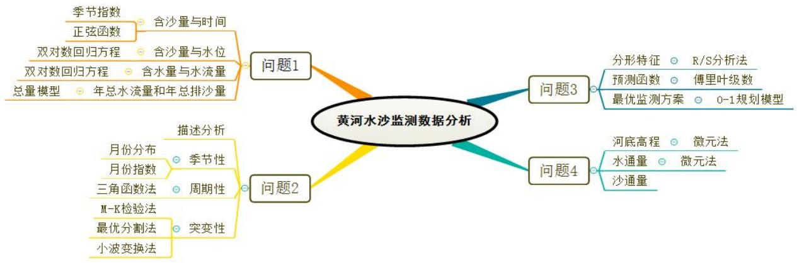

<details>
<summary>flowchart</summary>

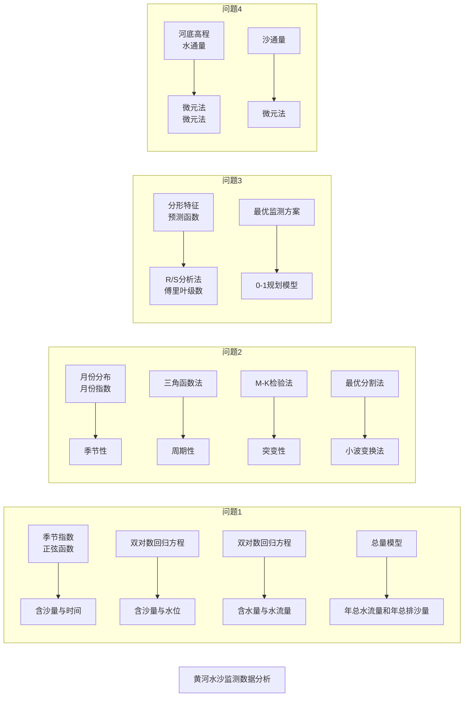
</details>

图 1 研究路径

## 三、符号说明

<table><tr><td>y:因变量(含沙量)</td><td>x:自变量(水位、时间、水流量)</td></tr><tr><td> $\beta_1$ :回归系数</td><td> $\beta_0$ :回归常数</td></tr><tr><td>z:表示年总水流量(亿m3)</td><td> $x_1$ :水位</td></tr><tr><td>p:表示水通量(亿 $m^3$ )</td><td> $x_t^{(2)}$ :表示时刻的水流量(m3/s)</td></tr><tr><td>q:表示沙通量(亿吨)</td><td> $x_2$ :水流量</td></tr><tr><td>f(t):表示t时刻的水沙通量</td><td>t:表示时刻(日)</td></tr><tr><td> $x_t$ :表示t时刻的水沙通量</td><td>H:R/S分析法的统计量</td></tr><tr><td colspan="2">注:其余符号在文中给出.</td></tr></table>

## 四、模型假设

为了简化问题,作如下假设:

（1）附件数据准确无误。  
(2) 水位和河底高程固定均以海拔 72.26 米为基准面。  
(3) $f(t)$ 表示 $t$ 时刻的水沙通量, 假设其满足狄利赫里 (Dirichlet) 条件。  
（4）水通量、沙通量序列是独立序列。  
(5) 每年 6-7 月份 “调水调沙” 一次。

## 五、模型建立与求解

## 5.0 数据整理

本文提供了以 “日” “月” “年” 为时间单位的时间序列。首先, 检查日期是否连续, 如果不连续, 就补充完整。其次, 由于数据存在缺失, 就用邻近值代替。第三, 为了排除闰年的影响, 一年定为 365 天。附件

1 的数据整理结果（样表）如表 1 所示。

表 1 数据整理

<table><tr><td>序号</td><td>年</td><td>月</td><td>日</td><td>水位(m)</td><td>流量(m3/s)</td><td>含沙量kg/m3)</td></tr><tr><td>1</td><td>2016</td><td>1</td><td>1</td><td>42.79</td><td>357</td><td>0.825</td></tr><tr><td>2</td><td>2016</td><td>1</td><td>1</td><td>42.8</td><td>363</td><td>0.825</td></tr><tr><td>3</td><td>2016</td><td>1</td><td>1</td><td>42.8</td><td>363</td><td>0.796</td></tr><tr><td>4</td><td>2016</td><td>1</td><td>1</td><td>42.81</td><td>368</td><td>0.796</td></tr><tr><td>5</td><td>2016</td><td>1</td><td>1</td><td>42.84</td><td>384</td><td>0.796</td></tr><tr><td>...</td><td></td><td></td><td></td><td></td><td></td><td></td></tr><tr><td>2338</td><td>2016</td><td>12</td><td>30</td><td>42.19</td><td>217</td><td>0.415</td></tr></table>

## 5.1 问题（1）——建立含沙量与时间、水位和水流量的关系

问题分析：含沙量与时间的关系,可以通过时序图、季节指数、时间趋势等方法来描述。含沙量与水位、水流量的关系,可以通过相关性、建立回归方程来描述。

建模思路：首先，研究含沙量与时间的关系，画时序图观察是否存在某种趋势，计算季节指数观察是否存在旺季和淡季。其次，以含沙量为因变量，以水位、水流量为自变量，建立回归方程。

## 5.1.1 研究含沙量与时间的关系

## 5.1.1.1 研究含沙量与月份、季度的关系

画出含沙量的时序图,如图2所示。从图中可知,有几个离群点,必须剔除。剔除离群点之后,时序图如图3所示,从图中可得出以下结论:

(1) 2016、2017 年的含沙量较小,但从 2018 年开始大幅度增长。  
(2) 含沙量随着年份存在周期性波动。

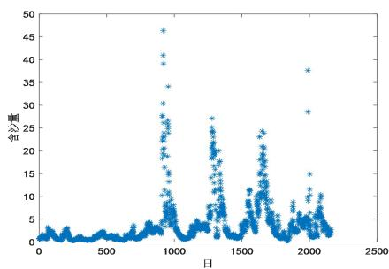

<details>
<summary>scatter</summary>

| 日 | 含沙量 |
| --- | --- |
| ~950 | ~47 |
| ~950 | ~41 |
| ~950 | ~39 |
| ~950 | ~34 |
| ~950 | ~30 |
| ~950 | ~28 |
| ~950 | ~27 |
| ~950 | ~26 |
| ~950 | ~25 |
| ~950 | ~24 |
| ~950 | ~23 |
| ~950 | ~22 |
| ~950 | ~21 |
| ~950 | ~20 |
| ~950 | ~19 |
| ~950 | ~18 |
| ~950 | ~17 |
| ~950 | ~16 |
| ~950 | ~15 |
| ~950 | ~14 |
| ~950 | ~13 |
| ~950 | ~12 |
| ~950 | ~11 |
| ~950 | ~10 |
| ~950 | ~9 |
| ~950 | ~8 |
| ~950 | ~7 |
| ~950 | ~6 |
| ~950 | ~5 |
| ~950 | ~4 |
| ~950 | ~3 |
| ~950 | ~2 |
| ~950 | ~1 |
| ~1250 | ~27 |
| ~1250 | ~26 |
| ~1250 | ~25 |
| ~1250 | ~24 |
| ~1250 | ~23 |
| ~1250 | ~22 |
| ~1250 | ~21 |
| ~1250 | ~20 |
| ~1250 | ~19 |
| ~1250 | ~18 |
| ~1250 | ~17 |
| ~1250 | ~16 |
| ~1250 | ~15 |
| ~1250 | ~14 |
| ~1250 | ~13 |
| ~1250 | ~12 |
| ~1250 | ~11 |
| ~1250 | ~10 |
| ~1250 | ~9 |
| ~1250 | ~8 |
| ~1250 | ~7 |
| ~1250 | ~6 |
| ~1250 | ~5 |
| ~1250 | ~4 |
| ~1250 | ~3 |
| ~1250 | ~2 |
| ~1250 | ~1 |
| ~1600 | ~24 |
| ~1600 | ~23 |
| ~1600 | ~22 |
| ~1600 | ~21 |
| ~1600 | ~20 |
| ~1600 | ~19 |
| ~1600 | ~18 |
| ~1600 | ~17 |
| ~1600 | ~16 |
| ~1600 | ~15 |
| ~1600 | ~14 |
| ~1600 | ~13 |
| ~1600 | ~12 |
| ~1600 | ~11 |
| ~1600 | ~10 |
| ~1600 | ~9 |
| ~1600 | ~8 |
| ~1600 | ~7 |
| ~1600 | ~6 |
| ~1600 | ~5 |
| ~1600 | ~4 |
| ~1600 | ~3 |
| ~1600 | ~2 |
| ~1600 | ~1 |
| ~2000 | ~38 |
| ~2000 | ~29 |
| ~2000 | ~15 |
| ~2000 | ~14 |
| ~2000 | ~13 |
| ~2000 | ~12 |
| ~2000 | ~11 |
| ~2000 | ~10 |
| ~2000 | ~9 |
| ~2000 | ~8 |
| ~2000 | ~7 |
| ~2000 | ~6 |
| ~2000 | ~5 |
| ~2000 | ~4 |
| ~2000 | ~3 |
| ~2000 | ~2 |
| ~2000 | ~1 |
</details>

图 2 含沙量时序图

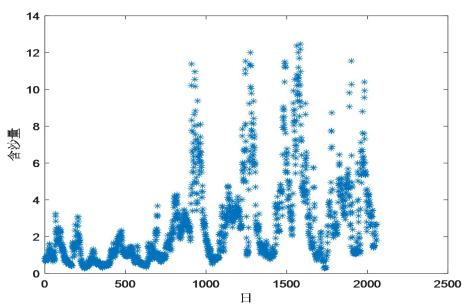

<details>
<summary>scatter</summary>

| 日 | 含沙量 |
| --- | --- |
| ~50 | ~1.0 |
| ~100 | ~2.5 |
| ~200 | ~1.5 |
| ~400 | ~1.0 |
| ~600 | ~1.5 |
| ~800 | ~2.5 |
| ~900 | ~11.5 |
| ~1000 | ~1.0 |
| ~1200 | ~4.5 |
| ~1300 | ~12.0 |
| ~1500 | ~1.5 |
| ~1600 | ~12.5 |
| ~1700 | ~1.0 |
| ~1900 | ~8.5 |
| ~2000 | ~11.5 |
</details>

图 3 剔除离群点后的含沙量时序图

分别计算 12 个月的月份指数和 4 个季度的季度指数, 如图 4、图 5 所示, 从图中可得出以下结论:

(1) 每年 7 月、9 月、10 月为旺季, 每年 1 月、2 月、11 月、12 月为淡季。  
(2) 每年 2、3 季度为旺季, 每年 1、4 季度为淡季。

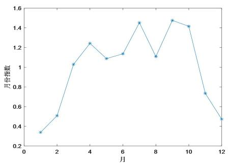

<details>
<summary>line</summary>

| 月 | 月份指数 |
| --- | --- |
| 1 | ~0.34 |
| 2 | ~0.51 |
| 3 | ~1.03 |
| 4 | ~1.25 |
| 5 | ~1.09 |
| 6 | ~1.14 |
| 7 | ~1.46 |
| 8 | ~1.11 |
| 9 | ~1.48 |
| 10 | ~1.42 |
| 11 | ~0.74 |
| 12 | ~0.47 |
</details>

图 4 含沙量的月份指数

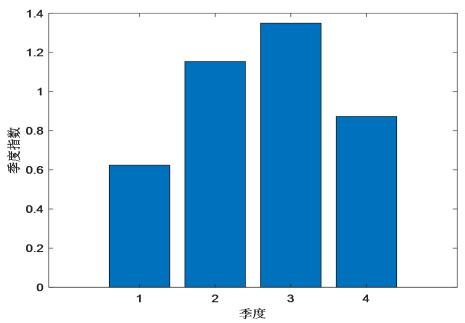

<details>
<summary>bar</summary>

| 季度 | 季度指数 |
| --- | --- |
| 1 | ~0.63 |
| 2 | ~1.15 |
| 3 | ~1.35 |
| 4 | ~0.87 |
</details>

图 5 含沙量的季度指数

## 5.1.1.2 研究含沙量与时刻（日）的关系

设 y 表示含沙量 $\left(\mathrm{kg}/\mathrm{m}^{3}\right)$ ，t 表示时刻（日），y 和 t 的函数关系为

$$
y = A \sin (\omega t + \phi) + C \tag {1}
$$

由于 y 的周期为 365 天, 故 $T = 365 = \frac{2\pi}{\omega}$ , $\omega = \frac{2\pi}{365}$ , 于是

$$
y = A \sin \left(\frac {2 \pi}{3 6 5} t + \phi\right) + C \tag {2}
$$

使用最小二乘法进行分段拟合得，

$$
y = \left\{ \begin{array}{l} 0. 3 0 \sin \left(\frac {2 \pi}{3 6 5} t - 0. 2 7\right) + 1. 0 2, \quad t \in [ 0, 7 3 0) \\ 3. 7 8 \sin \left(\frac {2 \pi}{3 6 5} t - 1. 9 3\right) + 4. 4 9, \quad t \in [ 7 3 1, 2 1 9 0) \end{array} \right. \tag {3}
$$

拟合效果如图 6、图 7 所示,从图中可知,拟合精度较高。

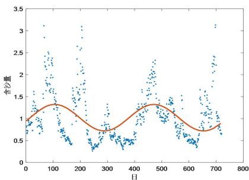

<details>
<summary>scatter</summary>

| 日 | 含沙量 |
| --- | --- |
| ~10 | ~0.8 |
| ~50 | ~1.6 |
| ~80 | ~3.1 |
| ~100 | ~1.9 |
| ~150 | ~0.6 |
| ~200 | ~1.8 |
| ~220 | ~3.1 |
| ~250 | ~0.4 |
| ~300 | ~0.7 |
| ~350 | ~0.5 |
| ~400 | ~1.2 |
| ~450 | ~2.3 |
| ~500 | ~1.1 |
| ~550 | ~0.8 |
| ~600 | ~0.5 |
| ~650 | ~1.6 |
| ~700 | ~3.1 |
| ~720 | ~0.8 |
</details>

图 6 2016-2017 年含沙量函数拟合效果

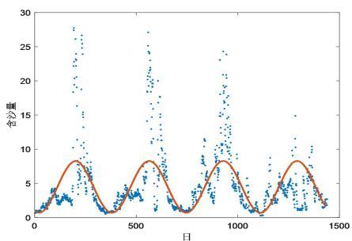

<details>
<summary>scatter</summary>

| Series | X (Day) (range) | Y (含沙量) (range) |
| --- | --- | --- |
| Data Points | 0~1450 | 0.5~28 |
| Trend Line | 0~1450 | 0.5~8.5 |
</details>

图 7 2018-2021 年含沙量函数拟合效果

## 5.1.2 研究含沙量与水位、水流量的关系

画出水位、水流量、含沙量两两之间的散点图,如图6所示。从图中可得出以下结论:

(1) 水位与水流量之间是高度的线性正相关关系。

(2) 水位与含沙量之间是线性正相关关系。  
(3) 水流量与含沙量之间是线性正相关关系。

基于以上结论,可分别建立含沙量与水位、含沙量与水流量的回归方程,但不能以水位、水流量为自变量建立二元回归模型,这是因为水位与水流量高度相关的缘故。

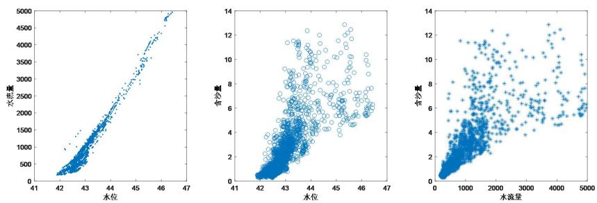  
图 8 水位、水流量、含沙量的散点图

## 5.1.2.1 一元线性回归模型简介

因变量 y 和自变量 x 的一元线性回归模型为 $^{[1]}$

$$
y = \beta_ {0} + \beta_ {1} x + \varepsilon \tag {4}
$$

其中， $\beta_{1}$ 为回归系数， $\beta_{0}$ 为回归常数， $\varepsilon\sim N(0,\sigma^{2})$ ， $\varepsilon_{i}$ 相互独立。

估计的回归方程为

$$
y = \hat {\beta} _ {0} + \hat {\beta} _ {1} x \tag {5}
$$

## 5.1.2.2 含沙量与水位的回归方程

设 y 表示含沙量 $\left(\mathrm{kg}/\mathrm{m}^{3}\right)$ ， $x_{1}$ 表示水位（m），y 和 $x_{1}$ 的双对数回归模型为

$$
\ln y = \beta_ {0} + \beta_ {1} \ln x _ {1} + \varepsilon \tag {6}
$$

使用 MATLAB 软件, 给定显著性水平 0.05, 使用最小二乘法进行参数估计, 结果如表 2 所示。

表 2 参数估计及其检验结果

<table><tr><td>系数</td><td>估计值</td><td>95%置信区间下限</td><td>95%置信区间上限</td></tr><tr><td> $\beta_0$ </td><td>-135.95</td><td>-140.98</td><td>-130.92</td></tr><tr><td> $\beta_1$ </td><td>36.31</td><td>34.97</td><td>37.64</td></tr></table>

$$
R ^ {2} = 0. 5 7 9 7, \quad p = 0. 0 0 0 0, \quad s _ {_ y} = 0. 3 1
$$

从表 2 可知, 2 个回归系数的 95% 置信区间均不包含 0, 故回归系数检验通过。拟合优度 $R^{2}=0.5797$ , 表明拟合精度尚可; F 检验的相伴概率 p=0.0000<0.05, 表明含沙量 $\ln y$ 与水位 $\ln x_{1}$ 的线性关系显著成立。于是有

$$
\ln y = - 1 3 5. 9 5 + 3 6. 3 1 \ln x _ {1}, \quad x _ {1} \in (0, + \infty) \tag {7}
$$

画出带有正态分布概率曲线的标准化残差直方图,如图9所示,从图中可知,残差服从均值为0的正态

分布。

以标准化预测值为横坐标,以标准化残差为纵坐标,画散点图,如图10所示,从图中可知,残差随机分布在 $\pm3\sigma$ 以内,且没有明显的趋势,表明残差的标准差是常数,且相互独立。

根据式（7）可以得出以下结论：

(1) 含沙量与水位是正相关关系。  
(2) 水位每增加 $1 \%$ , 含沙量增加 $36.31 \%$ , 含沙量对水位的变化非常敏感。

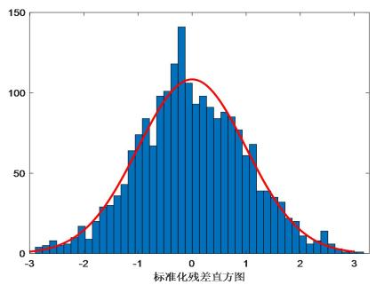

<details>
<summary>histogram</summary>

| Bin (Range) | Frequency |
| --- | --- |
| -3.0~-2.8 | ~5 |
| -2.8~-2.6 | ~8 |
| -2.6~-2.4 | ~10 |
| -2.4~-2.2 | ~15 |
| -2.2~-2.0 | ~18 |
| -2.0~-1.8 | ~30 |
| -1.8~-1.6 | ~35 |
| -1.6~-1.4 | ~45 |
| -1.4~-1.2 | ~65 |
| -1.2~-1.0 | ~75 |
| -1.0~-0.8 | ~85 |
| -0.8~-0.6 | ~95 |
| -0.6~-0.4 | ~100 |
| -0.4~-0.2 | ~115 |
| -0.2~0.0 | ~140 |
| 0.0~0.2 | ~105 |
| 0.2~0.4 | ~95 |
| 0.4~0.6 | ~90 |
| 0.6~0.8 | ~85 |
| 0.8~1.0 | ~75 |
| 1.0~1.2 | ~65 |
| 1.2~1.4 | ~40 |
| 1.4~1.6 | ~35 |
| 1.6~1.8 | ~30 |
| 1.8~2.0 | ~20 |
| 2.0~2.2 | ~15 |
| 2.2~2.4 | ~15 |
| 2.4~2.6 | ~5 |
| 2.6~2.8 | ~2 |
| 2.8~3.0 | ~1 |
</details>

图 9 标准化残差直方图

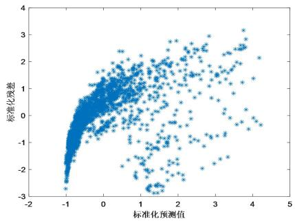

<details>
<summary>scatter</summary>

| Series | 标准化预测值 (range) | 标准化误差 (range) |
| --- | --- | --- |
| Blue | -1.0~4.2 | -2.8~3.2 |
</details>

图 10 标准化残差与标准化预测值的散点图

## 5.1.2.3 含沙量与水流量的回归方程

设 y 表示含沙量 $\left(\mathrm{kg}/\mathrm{m}^{3}\right)$ ， $x_{2}$ 表示水流量 $\left(\mathrm{m}^{3}/\mathrm{s}\right)$ ，y 和 $x_{2}$ 的回归模型为

$$
\ln y = \beta_ {0} + \beta_ {1} \ln x _ {1} + \varepsilon \tag {8}
$$

使用 MATLAB 软件, 给定显著性水平 0.05, 使用最小二乘法进行参数估计, 结果如表 3 所示。

表 3 参数估计及其检验结果

<table><tr><td>系数</td><td>估计值</td><td>95%置信区间下限</td><td>95%置信区间上限</td></tr><tr><td> $\beta_0$ </td><td>-6.35</td><td>-6.50</td><td>-6.20</td></tr><tr><td> $\beta_1$ </td><td>1.06</td><td>1.03</td><td>1.08</td></tr></table>

$$
R ^ {2} = 0. 8 0 1 3, \quad p = 0. 0 0 0 0, \quad s _ {y} = 0. 1 4 6 6
$$

从表 3 可知,2 个回归系数的 95% 置信区间均不包含 0, 故回归系数检验通过。拟合优度 $R^{2}=0.8013$ , 表明拟合精度较高; F 检验的相伴概率 p=0.0000<0.05, 表明 $\ln y$ 与 $\ln x_{2}$ 的线性关系显著成立。于是有

$$
\ln y = - 6. 3 5 + 1. 0 6 \ln x _ {2}, \quad x _ {2} \in (0, + \infty) \tag {9}
$$

画出带有正态分布概率曲线的标准化残差直方图,如图11所示,从图中可知,残差服从均值为0的正态分布。

以标准化预测值为横坐标,以标准化残差为纵坐标,画散点图,如图12所示,从图中可知,大多数残差随机分布在 $\pm3\sigma$ 以内,且没有明显的趋势,表明残差的标准差是常数,且相互独立。但存在个别离群点。

根据式（9）可以得出以下结论：

（1）含沙量与水位是正相关关系。

(2) 水流量每增加 $1\%$ , 含沙量增加 $1.06\%$ , 含沙量对水位的变化不敏感。

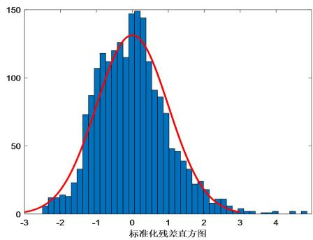

<details>
<summary>histogram</summary>

| Bin (标准化残差直方图) | Frequency |
| --- | --- |
| -3.0~-2.8 | ~1 |
| -2.8~-2.6 | ~5 |
| -2.6~-2.4 | ~12 |
| -2.4~-2.2 | ~13 |
| -2.2~-2.0 | ~14 |
| -2.0~-1.8 | ~22 |
| -1.8~-1.6 | ~33 |
| -1.6~-1.4 | ~73 |
| -1.4~-1.2 | ~88 |
| -1.2~-1.0 | ~107 |
| -1.0~-0.8 | ~118 |
| -0.8~-0.6 | ~113 |
| -0.6~-0.4 | ~125 |
| -0.4~-0.2 | ~115 |
| -0.2~0.0 | ~148 |
| 0.0~0.2 | ~150 |
| 0.2~0.4 | ~144 |
| 0.4~0.6 | ~113 |
| 0.6~0.8 | ~91 |
| 0.8~1.0 | ~86 |
| 1.0~1.2 | ~73 |
| 1.2~1.4 | ~48 |
| 1.4~1.6 | ~47 |
| 1.6~1.8 | ~38 |
| 1.8~2.0 | ~22 |
| 2.0~2.2 | ~23 |
| 2.2~2.4 | ~17 |
| 2.4~2.6 | ~9 |
| 2.6~2.8 | ~11 |
| 2.8~3.0 | ~5 |
| 3.0~3.2 | ~3 |
| 3.2~3.4 | ~1 |
| 3.4~3.6 | ~1 |
| 3.6~3.8 | ~1 |
| 3.8~4.0 | ~2 |
| 4.0~4.2 | ~1 |
| 4.2~4.4 | ~2 |
| 4.4~4.6 | ~2 |
</details>

图 11 标准化残差直方图

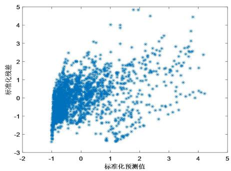

<details>
<summary>scatter</summary>

| 标准化预测值 (range) | 标准化残差 (range) |
| --- | --- |
| -1.0~4.2 | -2.5~4.9 |
</details>

图 12 标准化残差与标准化预测值的散点图

## 5.1.3 估算年总水流量和年总排沙量

设 $x_{t}^{(2)}$ 表示某年 $t$ 时刻（日）的水流量 $(\mathrm{m}^3 /\mathrm{s})$ ， $z$ 表示该年总水流量（亿 $\mathrm{m}^3$ ），则某年总水流量为

$$
z = \frac {3 6 5 \times 2 4 \times 3 6 0 0}{3 6 5 \times 1 0 0 0 0 0 0 0 0} \sum_ {t = 1} ^ {3 6 5} x _ {t} ^ {(2)} = 0. 0 0 0 8 6 4 \sum_ {t = 1} ^ {3 6 5} x _ {t} ^ {(2)} \tag {10}
$$

设 $y_{t}$ 表示 t 时刻（日）的含沙量（kg/m $^{3}$ ），u 表示年总含沙量（亿 t），则该年总含沙量为

$$
u = \frac {\sum_ {t = 1} ^ {3 6 5} y _ {t} z _ {t}}{1 0 ^ {1 1}} \tag {11}
$$

计算结果如表 4 所示。

表 4 年总水流量与年总排沙量

<table><tr><td>年份</td><td>2016</td><td>2017</td><td>2018</td><td>2019</td><td>2020</td><td>2021</td><td>平均</td></tr><tr><td>年总流量/亿m3</td><td>141.13</td><td>151.31</td><td>383.06</td><td>381.95</td><td>424.22</td><td>466.71</td><td>324.73</td></tr><tr><td>年总含沙量/吨</td><td>0.18</td><td>0.19</td><td>2.91</td><td>2.99</td><td>3.41</td><td>2.24</td><td>1.99</td></tr></table>

根据表 4 画出直方图, 如图 13、图 14 所示。

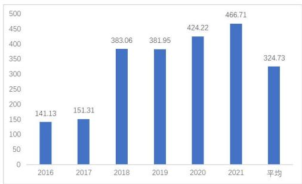

<details>
<summary>bar</summary>

| Category | Value |
| --- | --- |
| 2016 | 141.13 |
| 2017 | 151.31 |
| 2018 | 383.06 |
| 2019 | 381.95 |
| 2020 | 424.22 |
| 2021 | 466.71 |
| 平均 | 324.73 |
</details>

图 13 年总流量

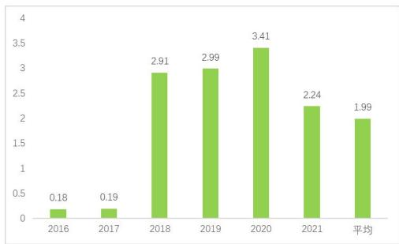

<details>
<summary>bar</summary>

| Category | Value |
| --- | --- |
| 2016 | 0.18 |
| 2017 | 0.19 |
| 2018 | 2.91 |
| 2019 | 2.99 |
| 2020 | 3.41 |
| 2021 | 2.24 |
| 平均 | 1.99 |
</details>

图 14 年总含沙量

## 5.2 问题（2）——研究水沙通量的变化规律

问题分析：水通量就是径流量（亿 m3），沙通量就是排沙量（亿吨），研究它们的变化规律，需要从统计特征、季节性、周期性和突变性四个方面来入手。

建模思路：首先,研究水沙通量的季节性,包括月份指数、月份分布、统计特征等。其次,研究水沙通量的周期性,包括时序图、即三角函数等。第三,研究水、沙通量的突变点,使用非参数 Mann-Kendall 检验法来解决。

使用 python 软件整理数据, 把每年的数据整理成以 “月” 为时间点的时间序列。

## 5.2.1 水沙通量的统计特征

对水通量、沙通量进行统计描述,结果如表5所示。从表中可以得出以下结论:

（1）各月水流量分化严重，最大流量 $105.85 \, 亿 \, m^{3}$ ，最小流量 $5.05 \, 亿 \, m^{3}$ 。但平均波动幅度较小。  
(2) 各月排沙量分化不严重, 最大流量 1.34 亿吨, 最小流量 0 亿吨, 但平均波动幅度较大。

表 5 水沙通量的特征

<table><tr><td></td><td>平均值</td><td>标准差</td><td>最小值</td><td>最大值</td><td>极差</td><td>变异系数</td></tr><tr><td>水流量/亿m3</td><td>27.10</td><td>20.67</td><td>5.05</td><td>105.85</td><td>100.80</td><td>0.76</td></tr><tr><td>排沙量/亿吨</td><td>0.17</td><td>0.27</td><td>0.00</td><td>1.34</td><td>1.33</td><td>1.66</td></tr></table>

## 5.2.2 水沙通量的季节性

## 5.2.2.1 水沙通量的月份分布

计算水沙通量在各月分布,如表6所示。从表中可以得出以下结论:

（1）水通量在每年7月比例最大，占全年15.36%。在1月占比最小，仅占2.69%。  
（2）排沙量在每年7月比例最大，占全年31.17%。在1月占比最小，仅占0.42%。

表 6 水沙通量的月份分布

<table><tr><td></td><td>1月</td><td>2月</td><td>3月</td><td>4月</td><td>5月</td><td>6月</td><td>7月</td><td>8月</td><td>9月</td><td>10月</td><td>11月</td><td>12月</td></tr><tr><td>水通量</td><td>2.69</td><td>3.51</td><td>6.11</td><td>7.79</td><td>8.33</td><td>11.14</td><td>15.36</td><td>10.02</td><td>11.64</td><td>12.81</td><td>6.2</td><td>4.4</td></tr><tr><td>沙通量</td><td>0.42</td><td>0.94</td><td>3.09</td><td>4.82</td><td>4.67</td><td>7.61</td><td>31.17</td><td>18.37</td><td>13.68</td><td>11.55</td><td>2.56</td><td>1.12</td></tr></table>

## 5.2.2.2 水沙通量的月份指数

计算水沙通量的月份指数,如表 7 所示。

表 7 水沙通量的月份指数

<table><tr><td></td><td>1月</td><td>2月</td><td>3月</td><td>4月</td><td>5月</td><td>6月</td><td>7月</td><td>8月</td><td>9月</td><td>10月</td><td>11月</td><td>12月</td></tr><tr><td>水通量</td><td>0.322</td><td>0.421</td><td>0.733</td><td>0.935</td><td>0.999</td><td>1.337</td><td>1.844</td><td>1.202</td><td>1.397</td><td>1.537</td><td>0.745</td><td>0.528</td></tr><tr><td>沙通量</td><td>0.050</td><td>0.112</td><td>0.371</td><td>0.579</td><td>0.560</td><td>0.913</td><td>3.740</td><td>2.205</td><td>1.642</td><td>1.386</td><td>0.307</td><td>0.134</td></tr></table>

根据表 1 画出图形,如图 15、图 16 所示。从图中可得出以下结论:

（1）水通量每年6月-10月是旺季，每年1月-3月、11月、12月是淡季。  
(2) 沙通量每年 7 月-10 月是旺季, 每年 1 月-5 月、11 月、12 月是淡季。

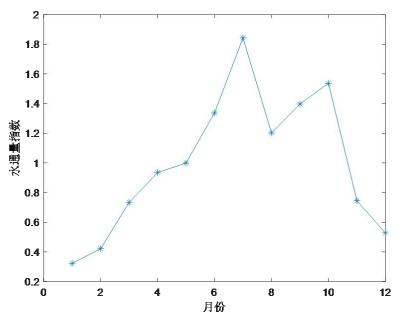

<details>
<summary>line</summary>

| 月份 | 水通量/海藻 |
| --- | --- |
| 1 | ~0.33 |
| 2 | ~0.43 |
| 3 | ~0.74 |
| 4 | ~0.95 |
| 5 | ~1.01 |
| 6 | ~1.34 |
| 7 | ~1.85 |
| 8 | ~1.21 |
| 9 | ~1.40 |
| 10 | ~1.54 |
| 11 | ~0.75 |
| 12 | ~0.54 |
</details>

图 15 水通量的月份指数

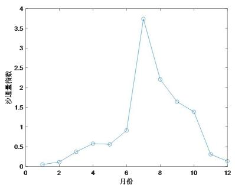

<details>
<summary>line</summary>

| 月份 | 沙道量指数 |
| --- | --- |
| 1 | ~0.1 |
| 2 | ~0.15 |
| 3 | ~0.4 |
| 4 | ~0.6 |
| 5 | ~0.6 |
| 6 | ~0.9 |
| 7 | ~3.8 |
| 8 | ~2.2 |
| 9 | ~1.65 |
| 10 | ~1.4 |
| 11 | ~0.3 |
| 12 | ~0.15 |
</details>

图 16 沙通量的月份指数

## 5.2.3 水沙通量的周期性

画出水沙通量的时序图,如图 17、图 18 所示。从图中可得出以下结论:

（1）水通量具有周期性，周期为365天，2018年有突变现象，且呈上升趋势。  
(2) 沙通量具有周期性, 周期为 365 天, 2018 年有突变现象, 且呈下降趋势。

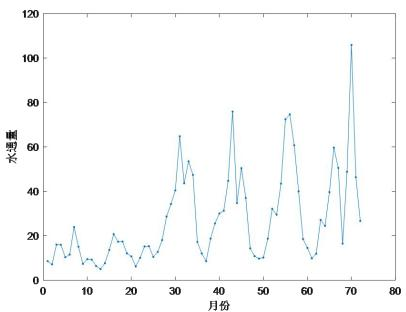

<details>
<summary>line</summary>

| 月份 | 水通量 |
| --- | --- |
| 1 | ~8 |
| 2 | ~9 |
| 3 | ~16 |
| 4 | ~16 |
| 5 | ~10 |
| 6 | ~11 |
| 7 | ~24 |
| 8 | ~12 |
| 9 | ~10 |
| 10 | ~10 |
| 11 | ~6 |
| 12 | ~5 |
| 13 | ~10 |
| 14 | ~21 |
| 15 | ~17 |
| 16 | ~17 |
| 17 | ~13 |
| 18 | ~8 |
| 19 | ~15 |
| 20 | ~15 |
| 21 | ~10 |
| 22 | ~12 |
| 23 | ~18 |
| 24 | ~29 |
| 25 | ~40 |
| 26 | ~65 |
| 27 | ~43 |
| 28 | ~54 |
| 29 | ~47 |
| 30 | ~18 |
| 31 | ~9 |
| 32 | ~27 |
| 33 | ~29 |
| 34 | ~35 |
| 35 | ~45 |
| 36 | ~76 |
| 37 | ~35 |
| 38 | ~51 |
| 39 | ~37 |
| 40 | ~14 |
| 41 | ~10 |
| 42 | ~10 |
| 43 | ~17 |
| 44 | ~33 |
| 45 | ~22 |
| 46 | ~41 |
| 47 | ~73 |
| 48 | ~75 |
| 49 | ~60 |
| 50 | ~40 |
| 51 | ~19 |
| 52 | ~14 |
| 53 | ~10 |
| 54 | ~27 |
| 55 | ~24 |
| 56 | ~40 |
| 57 | ~60 |
| 58 | ~17 |
| 59 | ~49 |
| 60 | ~106 |
| 61 | ~46 |
| 62 | ~27 |
</details>

图 17 水通量的时序图

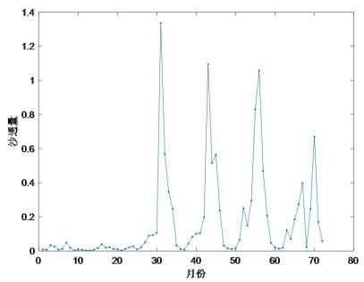

<details>
<summary>line</summary>

| 月份 | 沙坦量 |
| --- | --- |
| 1 | ~0.01 |
| 2 | ~0.04 |
| 3 | ~0.01 |
| 4 | ~0.05 |
| 5 | ~0.01 |
| 6 | ~0.02 |
| 7 | ~0.01 |
| 8 | ~0.06 |
| 9 | ~0.01 |
| 10 | ~0.01 |
| 11 | ~0.01 |
| 12 | ~0.01 |
| 13 | ~0.01 |
| 14 | ~0.01 |
| 15 | ~0.05 |
| 16 | ~0.03 |
| 17 | ~0.04 |
| 18 | ~0.03 |
| 19 | ~0.03 |
| 20 | ~0.02 |
| 21 | ~0.02 |
| 22 | ~0.02 |
| 23 | ~0.03 |
| 24 | ~0.02 |
| 25 | ~0.03 |
| 26 | ~0.04 |
| 27 | ~0.11 |
| 28 | ~0.12 |
| 29 | ~1.34 |
| 30 | ~0.57 |
| 31 | ~0.35 |
| 32 | ~0.25 |
| 33 | ~0.04 |
| 34 | ~0.03 |
| 35 | ~0.01 |
| 36 | ~0.04 |
| 37 | ~0.08 |
| 38 | ~0.11 |
| 39 | ~0.12 |
| 40 | ~0.19 |
| 41 | ~1.10 |
| 42 | ~0.52 |
| 43 | ~0.57 |
| 44 | ~0.24 |
| 45 | ~0.03 |
| 46 | ~0.03 |
| 47 | ~0.02 |
| 48 | ~0.02 |
| 49 | ~0.06 |
| 50 | ~0.21 |
| 51 | ~0.15 |
| 52 | ~0.29 |
| 53 | ~0.83 |
| 54 | ~1.06 |
| 55 | ~0.47 |
| 56 | ~0.21 |
| 57 | ~0.05 |
| 58 | ~0.04 |
| 59 | ~0.13 |
| 60 | ~0.06 |
| 61 | ~0.19 |
| 62 | ~0.28 |
| 63 | ~0.40 |
| 64 | ~0.24 |
| 65 | ~0.67 |
| 66 | ~0.17 |
| 67 | ~0.06 |
</details>

图 18 沙通量的时序图

设 p 表示水通量（亿 $m^{3}$ ），t 表示时刻（日），p 和 t 的函数关系为

$$
p = A \sin \left(\frac {2 \pi}{1 2} t + \phi\right) + C \tag {12}
$$

根据实际情况,可直接从第2阶段（2018-2021年）拟合,结果如下:

$$
p = 2 2. 7 6 \sin \left(\frac {2 \pi}{1 2} t - 2. 4 4\right) + 3 4. 5 4 \tag {13}
$$

同理, 设 q 表示沙通量（亿吨）, t 表示时刻（日）, q 和 t 的函数关系为

$$
q = 0. 3 0 \sin \left(\frac {2 \pi}{1 2} t - 2. 4 3\right) + 0. 2 4 \tag {14}
$$

拟合效果检验如图 19、图 20 所示,从图中可知,拟合效果较好。

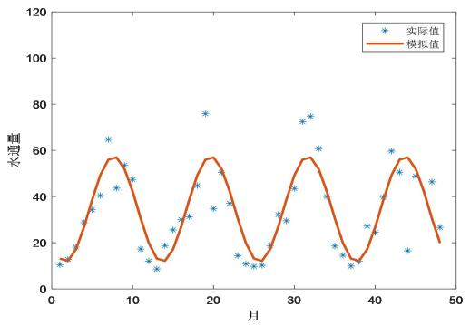

<details>
<summary>line</summary>

| 月 | 实际值 | 模拟值 |
| --- | --- | --- |
| 1 | ~11 | ~13 |
| 2 | ~18 | ~12 |
| 3 | ~29 | ~18 |
| 4 | ~35 | ~26 |
| 5 | ~40 | ~35 |
| 6 | ~65 | ~45 |
| 7 | ~44 | ~53 |
| 8 | ~54 | ~57 |
| 9 | ~47 | ~54 |
| 10 | ~18 | ~45 |
| 11 | ~13 | ~35 |
| 12 | ~9 | ~25 |
| 13 | ~19 | ~18 |
| 14 | ~26 | ~13 |
| 15 | ~30 | ~18 |
| 16 | ~31 | ~26 |
| 17 | ~45 | ~35 |
| 18 | ~76 | ~45 |
| 19 | ~35 | ~53 |
| 20 | ~50 | ~57 |
| 21 | ~37 | ~54 |
| 22 | ~15 | ~45 |
| 23 | ~10 | ~35 |
| 24 | ~10 | ~25 |
| 25 | ~19 | ~18 |
| 26 | ~33 | ~13 |
| 27 | ~30 | ~18 |
| 28 | ~43 | ~26 |
| 29 | ~73 | ~35 |
| 30 | ~75 | ~45 |
| 31 | ~61 | ~53 |
| 32 | ~40 | ~57 |
| 33 | ~19 | ~54 |
| 34 | ~14 | ~45 |
| 35 | ~10 | ~35 |
| 36 | ~28 | ~26 |
| 37 | ~24 | ~20 |
| 38 | ~40 | ~18 |
| 39 | ~60 | ~25 |
| 40 | ~50 | ~35 |
| 41 | ~49 | ~45 |
| 42 | ~17 | ~53 |
| 43 | ~46 | ~57 |
| 44 | ~27 | ~54 |
| 45 | — | ~45 |
| 46 | — | ~35 |
| 47 | — | ~20 |
</details>

图 19 水通量的时序图

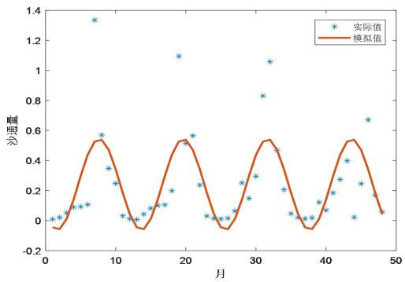

<details>
<summary>line</summary>

| 月 | 实际值 | 模拟值 |
| --- | --- | --- |
| 1 | ~0.02 | ~-0.06 |
| 2 | ~0.03 | ~-0.07 |
| 3 | ~0.08 | ~-0.04 |
| 4 | ~0.10 | ~0.02 |
| 5 | ~0.11 | ~0.15 |
| 6 | ~1.34 | ~0.35 |
| 7 | ~0.57 | ~0.53 |
| 8 | ~0.35 | ~0.54 |
| 9 | ~0.25 | ~0.45 |
| 10 | ~0.03 | ~0.32 |
| 11 | ~0.02 | ~0.20 |
| 12 | ~0.05 | ~0.08 |
| 13 | ~0.11 | ~-0.05 |
| 14 | ~0.11 | ~-0.06 |
| 15 | ~0.20 | ~-0.04 |
| 16 | ~0.52 | ~0.15 |
| 17 | ~1.10 | ~0.45 |
| 18 | ~0.56 | ~0.53 |
| 19 | ~0.24 | ~0.54 |
| 20 | ~0.03 | ~0.45 |
| 21 | ~0.02 | ~0.32 |
| 22 | ~0.03 | ~0.18 |
| 23 | ~0.25 | ~0.08 |
| 24 | ~0.15 | ~-0.02 |
| 25 | ~0.30 | ~-0.06 |
| 26 | ~0.83 | ~-0.07 |
| 27 | ~1.06 | ~-0.04 |
| 28 | ~0.46 | ~0.15 |
| 29 | ~0.21 | ~0.32 |
| 30 | ~0.05 | ~0.45 |
| 31 | ~0.03 | ~0.53 |
| 32 | ~0.12 | ~0.54 |
| 33 | ~0.46 | ~0.45 |
| 34 | ~0.27 | ~0.32 |
| 35 | ~0.19 | ~0.20 |
| 36 | ~0.12 | ~-0.02 |
| 37 | ~0.40 | ~-0.06 |
| 38 | ~0.26 | ~-0.07 |
| 39 | ~0.24 | ~-0.04 |
| 40 | ~0.67 | ~0.15 |
| 41 | ~0.18 | ~0.32 |
| 42 | ~0.17 | ~0.45 |
| 43 | — | — |
| 44 | — | — |
| 45 | — | — |
| 46 | — | — |
| 47 | — | — |
| 48 | — | — |
| 49 | — | — |
| 50 | — | — |
</details>

图 20 沙通量的时序图

## 5.2.4 水沙通量的突变性

## 5.2.4.1 水沙通量的变化趋势性

为判定水沙通量是否存在显著的上升或下降趋势,使用 M-K 检验法来判定。

M-K 检验法 $^{[2]}$ 最初是由曼(H. B. Mann)和肯德尔(M. G. Kendall)提出了原理并发展了这一方法，是世界气象组织推荐的用于提取序列变化趋势的有效工具。M-K检验法不受个别异常值的干扰，能够客观反映时间序列趋势，广泛应用于检验某一自然过程是处于自然波动亦或是存在确定的变化趋势，目前已经被广泛用于气候参数和水文序列的分析中。

M-K 法可以根据输出的两个序列 (UF 和 UB) 明确突变的时段和区域。若 UF 值大于 0，则表明序列呈上升趋势，小于 0 则表明呈下降趋势。当它们超过临界置信水平直线时 (显著性水平为 0.05 时，置信水平线为 ±1.96)，表明上升或下降趋势显著，超过临界线的范围确定为出现突变的时间区域。如果 UF 和 UB 两条曲线出现交点，且交点在临界线之间，那么交点对应的时刻便是突变开始的时间。

水通量的趋势检验结果如图 21 所示,从图中可得出以下结论:

UF 值从 t=23 开始大于 0，表明序列呈上升趋势。从 t=30 开始超过临界线（显著性水平为 0.05），表明上升趋势显著，此后为出现突变的时间区域。UF 和 UB 两条曲线在 t=27 时出现交点，且交点在临界线之间，于是此时刻便是突变开始的时刻。

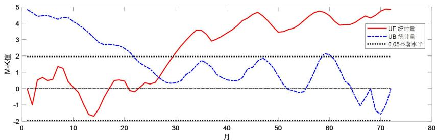

<details>
<summary>line</summary>

| 月 | UF 统计量 | UB 统计量 |
| --- | --- | --- |
| 1 | ~0 | ~4.9 |
| 2 | ~-1 | ~4.8 |
| 3 | ~0.6 | ~4.5 |
| 4 | ~0.7 | ~4.5 |
| 5 | ~0.6 | ~4.5 |
| 6 | ~0.6 | ~4.4 |
| 7 | ~1.3 | ~4.3 |
| 8 | ~1.2 | ~4.4 |
| 9 | ~0.5 | ~4.3 |
| 10 | ~0.2 | ~4.1 |
| 11 | ~-0.2 | ~3.9 |
| 12 | ~-0.8 | ~3.6 |
| 13 | ~-1.5 | ~3.3 |
| 14 | ~-1.6 | ~3.0 |
| 15 | ~-1.5 | ~2.8 |
| 16 | ~-1.0 | ~2.7 |
| 17 | ~-0.5 | ~2.7 |
| 18 | ~0.2 | ~2.7 |
| 19 | ~0.5 | ~2.6 |
| 20 | ~0.5 | ~2.6 |
| 21 | ~0.3 | ~2.5 |
| 22 | ~-0.2 | ~2.3 |
| 23 | ~-0.1 | ~2.0 |
| 24 | ~0.2 | ~1.7 |
| 25 | ~0.3 | ~1.4 |
| 26 | ~0.4 | ~1.1 |
| 27 | ~0.6 | ~0.8 |
| 28 | ~1.0 | ~0.6 |
| 29 | ~1.5 | ~0.4 |
| 30 | ~2.0 | ~0.4 |
| 31 | ~2.5 | ~0.5 |
| 32 | ~2.9 | ~0.7 |
| 33 | ~3.3 | ~0.9 |
| 34 | ~3.6 | ~1.1 |
| 35 | ~3.6 | ~1.3 |
| 36 | ~3.4 | ~1.5 |
| 37 | ~3.0 | ~1.7 |
| 38 | ~3.1 | ~1.6 |
| 39 | ~3.3 | ~1.4 |
| 40 | ~3.5 | ~1.2 |
| 41 | ~3.7 | ~1.0 |
| 42 | ~3.9 | ~0.8 |
| 43 | ~4.1 | ~0.6 |
| 44 | ~4.3 | ~0.5 |
| 45 | ~4.5 | ~0.6 |
| 46 | ~4.7 | ~0.8 |
| 47 | ~4.6 | ~1.1 |
| 48 | ~4.3 | ~1.4 |
| 49 | ~4.0 | ~1.7 |
| 50 | ~3.7 | ~1.9 |
| 51 | ~3.5 | ~1.8 |
| 52 | ~3.5 | ~1.5 |
| 53 | ~3.6 | ~1.2 |
| 54 | ~3.7 | ~0.9 |
| 55 | ~3.8 | ~0.6 |
| 56 | ~4.0 | ~0.3 |
| 57 | ~4.2 | ~0.1 |
| 58 | ~4.4 | ~-0.1 |
| 59 | ~4.6 | ~-0.2 |
| 60 | ~4.7 | ~-0.1 |
| 61 | ~4.8 | ~0.2 |
| 62 | ~4.7 | ~0.6 |
| 63 | ~4.5 | ~1.0 |
| 64 | ~4.3 | ~1.4 |
| 65 | ~4.0 | ~1.8 |
| 66 | ~3.9 | ~2.1 |
| 67 | ~3.9 | ~2.1 |
| 68 | ~4.0 | ~2.0 |
| 69 | ~4.1 | ~1.7 |
| 70 | ~4.3 | ~1.3 |
| 71 | ~4.5 | ~0.9 |
| 72 | ~4.8 | ~-0.2 |
| 73 | ~4.9 | ~-0.8 |
| 74 | — | — |
| 75 | — | — |
| 76 | — | — |
| 77 | — | — |
| 78 | — | — |
| 79 | — | — |
| 80 | — | — |

**Notes:**
- Horizontal dotted line at M-K=2 indicates the '0.05显著水平' (Significance Level).
- Values are estimated from gridlines where exact labels are not present.
</details>

图 21 水通量的趋势检验

沙通量的趋势检验结果如图 22 所示,从图中可得出以下结论:

UF 值从 t=23 开始大于 0，表明序列呈上升趋势。从 t=30 开始超过临界线（显著性水平为 0.05 时，置信水平线为 $\pm1.96$ ），表明上升趋势显著，此后为出现突变的时间区域。UF 和 UB 两条曲线在 t=27 时出现交点，且交点在临界线之间，于是此时刻便是突变开始的时刻。

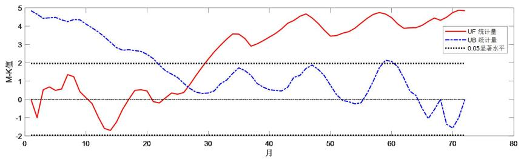

<details>
<summary>line</summary>

| 月 | UF 统计量 | UB 统计量 |
| --- | --- | --- |
| 1 | ~0 | ~4.9 |
| 2 | ~-1 | ~4.7 |
| 3 | ~0.6 | ~4.5 |
| 4 | ~0.7 | ~4.5 |
| 5 | ~0.6 | ~4.5 |
| 6 | ~0.6 | ~4.4 |
| 7 | ~1.4 | ~4.3 |
| 8 | ~1.3 | ~4.4 |
| 9 | ~0.8 | ~4.3 |
| 10 | ~0.4 | ~4.1 |
| 11 | ~0.1 | ~3.9 |
| 12 | ~-0.3 | ~3.7 |
| 13 | ~-0.8 | ~3.4 |
| 14 | ~-1.3 | ~3.1 |
| 15 | ~-1.6 | ~2.9 |
| 16 | ~-1.5 | ~2.8 |
| 17 | ~-1.1 | ~2.7 |
| 18 | ~-0.6 | ~2.7 |
| 19 | ~-0.2 | ~2.7 |
| 20 | ~0.1 | ~2.6 |
| 21 | ~0.5 | ~2.5 |
| 22 | ~0.5 | ~2.3 |
| 23 | ~0.5 | ~2.1 |
| 24 | ~0.2 | ~1.9 |
| 25 | ~-0.2 | ~1.7 |
| 26 | ~-0.1 | ~1.5 |
| 27 | ~0.1 | ~1.3 |
| 28 | ~0.3 | ~1.1 |
| 29 | ~0.4 | ~0.9 |
| 30 | ~0.5 | ~0.7 |
| 31 | ~0.8 | ~0.5 |
| 32 | ~1.2 | ~0.4 |
| 33 | ~1.6 | ~0.4 |
| 34 | ~2.0 | ~0.5 |
| 35 | ~2.4 | ~0.7 |
| 36 | ~2.8 | ~0.9 |
| 37 | ~3.2 | ~1.1 |
| 38 | ~3.5 | ~1.3 |
| 39 | ~3.6 | ~1.5 |
| 40 | ~3.6 | ~1.7 |
| 41 | ~3.4 | ~1.8 |
| 42 | ~3.0 | ~1.7 |
| 43 | ~2.9 | ~1.5 |
| 44 | ~3.1 | ~1.3 |
| 45 | ~3.3 | ~1.1 |
| 46 | ~3.5 | ~0.9 |
| 47 | ~3.7 | ~0.7 |
| 48 | ~4.0 | ~0.6 |
| 49 | ~4.2 | ~0.5 |
| 50 | ~4.4 | ~0.6 |
| 51 | ~4.6 | ~0.8 |
| 52 | ~4.7 | ~1.0 |
| 53 | ~4.6 | ~1.2 |
| 54 | ~4.4 | ~1.4 |
| 55 | ~4.2 | ~1.6 |
| 56 | ~3.9 | ~1.8 |
| 57 | ~3.6 | ~1.9 |
| 58 | ~3.5 | ~1.8 |
| 59 | ~3.6 | ~1.6 |
| 60 | ~3.7 | ~1.4 |
| 61 | ~3.8 | ~1.2 |
| 62 | ~4.0 | ~1.0 |
| 63 | ~4.2 | ~0.8 |
| 64 | ~4.4 | ~0.6 |
| 65 | ~4.6 | ~0.4 |
| 66 | ~4.7 | ~0.2 |
| 67 | ~4.8 | ~0.0 |
| 68 | ~4.9 | ~-0.2 |
| 69 | ~4.9 | ~-0.5 |
| 70 | ~4.9 | ~-0.8 |
| 71 | — | ~-1.2 |
| 72 | — | ~-1.5 |
| 73 | — | -1 |

**Notes:**
- Horizontal dotted lines represent thresholds at M-K values of -2 (top) and +2 (bottom).
- Dotted horizontal lines represent thresholds at M-K value of -2 and +2.
</details>

图 22 沙通量的趋势检验

## 5.2.4.2 水沙通量的突变点

为确定水沙通量在 6 年（72 个月）是否有转折性的变化和显著的转折点（变点），使用 Fisher 最优分割法来判定。

Fisher最优分割法也称有序聚类分析[3]，是多元统计分析中针对有序样品的一种统计分类方法.对有序样品分类，实际上就是要将这些样品组成的有序序列进行分段，每个分段为一类，这种分类称为分割.费歇尔(Fisher)曾给出了一个求最优分类的算法，其基本思想是：寻找一个分割使类内样品间的差异最小，而类间样品的差异最大.

使用 Fisher 最优分割法来判定是否存在突变点的方法是: 把时间序列 $x_{t}$ 按照时间点 t 从小到大排序成为一个有序序列, 再使用最优分割法进行分类, 就可以获得突变点。

水通量的突变点检验结果如图23所示,从图中可得出以下结论:在t=27时水流量被分为2类,说明此时为突变点,这个结论与M-K法检验法一致。

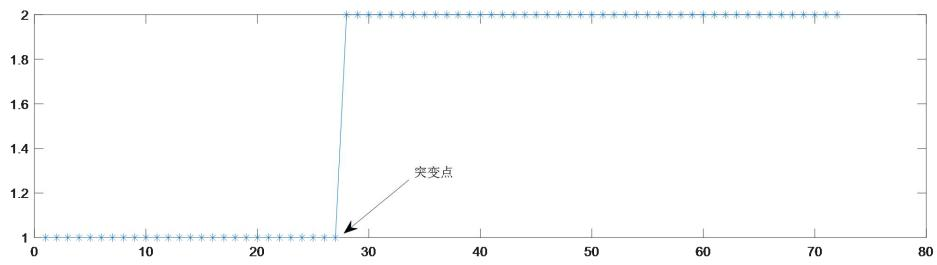

<details>
<summary>line</summary>

| X | Y |
| --- | --- |
| 0~27 | 1 |
| 28 | 2 |
| 29~73 | 2 |
</details>

图 23 水通量的突变点

沙通量的突变点检验结果如图24所示,从图中可得出以下结论:在t=30时沙流量被分为2类,说明此时为突变点,这个结论与M-K法检验法一致。

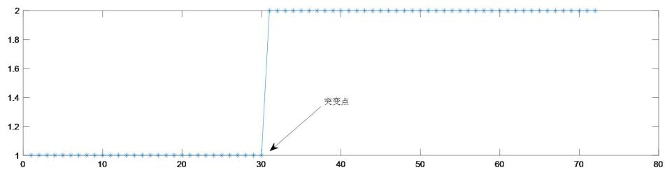

<details>
<summary>line</summary>

| X | Y |
| --- | --- |
| 0~30 | 1 |
| 30 | 2 |
| 31~72 | 2 |
</details>

图 24 沙通量的突变点

## 5.2.5 水沙通量时间尺度的变化特征

为了详细而准确地寻找水沙通量的周期性和突变点，需要使用小波变换分析法 $^{[4]}$ 。

小波变换是窗口大小固定但形状可改变、时间窗和频率窗都可改变的时-频局域化分析法，被誉为数学显微镜，它除了可以实现多分辨分析之外，在地球物理资料的处理中还可提取具有物理意义的最缓慢变化部分。小波变换分析在降水和水文资料的研究中得到了广泛的应用。

使用 MATLAB 软件作小波变换，再使用 Origin 软件画图。

画出水通量小波等值线图，如图 25 所示；画出水通量小波方差分析图，如图 26 所示。从图 25 可得出以下结论：

（1）水通量在 45～60 月的时间尺度上振荡明显，呈现了 3 次正负循环交替，但振幅较平缓，丰水期在 1、36、70 月附近，枯水期在 18、54 月附近，相应地，突变点在 12、26、43、64 月附近。  
（2）水通量在15～25月的时间尺度上振荡明显，呈现了5次正负循环交替，振幅陡峭，丰水期在18、30、43、50、66月附近，枯水期在25、38、50、66月附近，相应地，突变点在22、26、34、40、46、54、60、66月附近。

从图 2 可得出以下结论：水通量的主周期在 20 月附近，次周期在 55 月附近。

综合而言，水通量以20月为周期振荡，且振荡幅度很大；以55月为周期振荡，且振荡幅度较大。

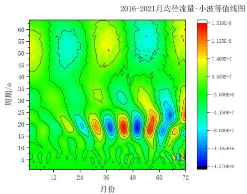

<details>
<summary>heatmap</summary>

| 周期/a | 12 | 24 | 36 | 48 | 60 | 72 |
| --- | --- | --- | --- | --- | --- | --- |
| 5 | ~-3.00E+6 | ~-3.00E+6 | ~-3.00E+6 | ~-3.00E+6 | ~-3.00E+6 | ~-3.00E+6 |
| 10 | ~-3.00E+6 | ~-3.00E+6 | ~-3.00E+6 | ~-3.00E+6 | ~-3.00E+6 | ~-3.00E+6 |
| 15 | ~-3.00E+6 | ~-3.00E+6 | ~-3.00E+6 | ~-3.00E+6 | ~-3.00E+6 | ~-3.00E+6 |
| 20 | ~-3.00E+6 | ~-3.00E+6 | ~-3.00E+6 | ~-3.00E+6 | ~-3.00E+6 | ~-3.00E+6 |
| 25 | ~-3.00E+6 | ~-3.00E+6 | ~-3.00E+6 | ~-3.00E+6 | ~-3.00E+6 | ~-3.00E+6 |
| 30 | ~-3.00E+6 | ~-3.00E+6 | ~-3.00E+6 | ~-3.00E+6 | ~-3.00E+6 | ~-3.00E+6 |
| 35 | ~-3.00E+6 | ~-3.00E+6 | ~-3.00E+6 | ~-3.00E+6 | ~-3.00E+6 | ~-3.00E+6 |
| 40 | ~-3.00E+6 | ~-3.00E+6 | ~-3.00E+6 | ~-3.00E+6 | ~-3.00E+6 | ~-3.00E+6 |
| 45 | ~-3.00E+6 | ~-3.00E+6 | ~-3.00E+6 | ~-3.00E+6 | ~-3.00E+6 | ~-3.00E+6 |
| 50 | ~-3.55E+7 | ~-8.00E+7 | ~7.40E+7 | ~7.40E+7 | ~7.40E+7 | ~7.40E+7 |
| 55 | ~-8.00E+7 | ~-8.00E+7 | ~7.40E+7 | ~7.40E+7 | ~7.40E+7 | ~7.40E+7 |
| 60 | ~-8.00E+7 | ~-8.00E+7 | ~7.40E+7 | ~7.40E+7 | ~7.40E+7 | ~7.40E+7 |
</details>

图 25 水通量小波等值线图

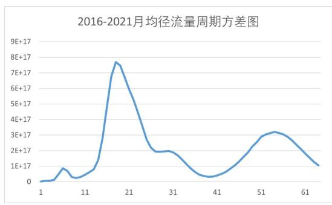

<details>
<summary>line</summary>

| X | Y |
| --- | --- |
| 1 | ~0.5E+17 |
| 4 | ~0.8E+17 |
| 6 | ~0.9E+17 |
| 8 | ~0.3E+17 |
| 11 | ~0.5E+17 |
| 13 | ~0.8E+17 |
| 15 | ~2.5E+17 |
| 17 | ~6.5E+17 |
| 19 | ~7.7E+17 |
| 21 | ~6.5E+17 |
| 23 | ~4.5E+17 |
| 25 | ~2.5E+17 |
| 27 | ~1.9E+17 |
| 29 | ~2.0E+17 |
| 31 | ~1.9E+17 |
| 33 | ~1.5E+17 |
| 35 | ~0.8E+17 |
| 37 | ~0.4E+17 |
| 39 | ~0.3E+17 |
| 41 | ~0.5E+17 |
| 43 | ~0.8E+17 |
| 45 | ~1.3E+17 |
| 47 | ~1.8E+17 |
| 49 | ~2.3E+17 |
| 51 | ~2.8E+17 |
| 53 | ~3.2E+17 |
| 55 | ~3.0E+17 |
| 57 | ~2.5E+17 |
| 59 | ~1.9E+17 |
| 61 | ~1.4E+17 |
| 63 | ~1.0E+17 |
</details>

图 26 水通量小波方差分析图

画出沙通量小波等值线图，如图 27 所示；画出沙通量小波方差分析图，如图 28 所示。从图 27 可得出以下结论：

(1) 沙通量在 30 月以上的时间尺度上振荡消失。  
（2）沙通量在 15～25 月的时间尺度上振荡明显，呈现了 5 次正负循环交替，振幅陡峭，丰沙期与水通量相同，枯沙期也与水通量相同，突变点也与水通量相同。

从图 4 可得出以下结论：沙通量的主周期在 20 月附近。

综合而言，沙通量以20月为周期振荡，且振荡幅度很大，与水通量相同。

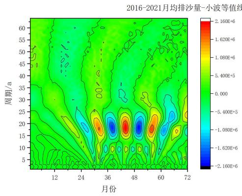

<details>
<summary>heatmap</summary>

| 周期/a | 12 | 24 | 36 | 48 | 60 | 72 |
| --- | --- | --- | --- | --- | --- | --- |
| 5 | ~-1.08E+5 | ~-1.08E+5 | ~-1.08E+5 | ~-1.08E+5 | ~-1.08E+5 | ~-1.08E+5 |
| 10 | ~-1.08E+5 | ~-1.08E+5 | ~-1.08E+5 | ~-1.08E+5 | ~-1.08E+5 | ~-1.08E+5 |
| 15 | ~-1.08E+5 | ~-1.08E+5 | ~-1.62E+6 | ~-1.62E+6 | ~-1.62E+6 | ~-1.62E+6 |
| 20 | ~-1.08E+5 | ~-1.08E+5 | ~-1.62E+6 | ~-1.62E+6 | ~-1.62E+6 | ~-1.62E+6 |
| 25 | ~-1.08E+5 | ~-1.08E+5 | ~-1.08E+5 | ~-1.08E+5 | ~-1.08E+5 | ~-1.08E+5 |
| 30 | ~-1.08E+5 | ~-1.08E+5 | ~-1.08E+5 | ~-1.08E+5 | ~-1.08E+5 | ~-1.08E+5 |
| 35 | ~-1.08E+5 | ~-1.08E+5 | ~-1.08E+5 | ~-1.08E+5 | ~-1.08E+5 | ~-1.08E+5 |
| 40 | ~-1.08E+5 | ~-1.08E+5 | ~-1.08E+5 | ~-1.08E+5 | ~-1.08E+5 | ~-1.08E+5 |
| 45 | ~-1.08E+5 | ~-1.08E+5 | ~-1.08E+5 | ~-1.08E+5 | ~-1.08E+5 | ~-1.08E+5 |
| 50 | ~-1.08E+5 | ~-1.08E+5 | ~-1.08E+5 | ~-1.08E+5 | ~-1.08E+5 | ~-1.08E+5 |
| 55 | ~-1.08E+5 | ~-1.08E+5 | ~-1.08E+5 | ~-1.08E+5 | ~-1.08E+5 | ~-1.08E+5 |
| 60 | ~-1.08E+5 | ~-1.08E+5 | ~-1.08E+5 | ~-1.08E+5 | ~-1.08E+5 | ~-1.08E+5 |
</details>

图 27 沙通量小波等值线图

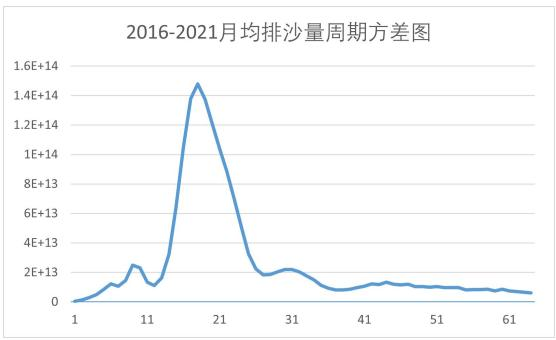

<details>
<summary>line</summary>

| X | Y |
| --- | --- |
| 1 | ~0 |
| 5 | ~1.2E+13 |
| 8 | ~2.5E+13 |
| 11 | ~1.2E+13 |
| 17 | ~1.48E+14 |
| 21 | ~9.5E+13 |
| 25 | ~2.2E+13 |
| 31 | ~2.1E+13 |
| 35 | ~0.8E+13 |
| 41 | ~1.2E+13 |
| 45 | ~1.1E+13 |
| 51 | ~0.9E+13 |
| 55 | ~0.8E+13 |
| 61 | ~0.7E+13 |
</details>

图 28 沙通量小波方差分析图

## 5.3 问题（3）——预测水沙通量的未来趋势并制订采样监测方案

问题分析：题目要求预测未来2年水沙通量的变化趋势，并制订未来2年最优的采样监测方案。为预测水沙通量的变化趋势，使用R/S分析法分析水沙通量的分形特征和长期记忆过程，以判断其未来是否存在相同趋势、反转趋势或随机趋势。为预测未来2年的水沙通量数据，可建立傅里叶级数去逼近。为制订采样监测方案，使用小波分析法分析信号不同周期的时间演变规律，以掌握其丰枯旱涝情况，再根据这些情况把最优方案问题转化为背包问题，从而通过建立0-1规划模型来制订最优的采样监测方案。

建模思路：首先，使用 R/S 分析法研究水沙通量是否在未来 2 年存在反转趋势。其次，建立傅里叶级数，预测未来 2 年的水沙通量数据。第三，使用小波分析法掌握其丰枯旱涝情况，再建立 0-1 规划模型，获得最优的采样监测方案。仍然把水沙通量整理成以 “月” 为时间点的时间序列。

## 5.3.1 水沙通量的分形特征

为定量描述水沙通量的分形特征和长期记忆过程，探寻未来水沙通量的变化趋势，使用 R/S 分析法 $^{[5]}$ 。

R/S 分析法也称为重标极差分析法（Rescaled Range Analysis），通常用于分析时间序列的分形特征和长期记忆过程。R/S 分析法属于非参数分析法，它不必假定潜在的分布是正态高斯分布，仅仅独立就可以。R/S 分析法被称为最具代表性的分形分析方法之一，在分形理论中有着重要的应用，目前已广泛应用于洪水、年径流序列以及气候变化的趋势分析中.

$H$ 为R/S分析法的统计量， $0\leq H\leq 1$ 。 $H$ 能揭示出时间序列中的趋势性成分，同时可以根据 $H$ 的大小来判断趋势性成分的强弱。当 $H = 0.5$ 时，说明时间序列为独立同分布的随机序列，即现在的变化对未来没有影响；当 $0\leq H < 0.5$ 时，表明该过程具有反持续性，未来变化将与过去总体趋势相反， $H$ 越接近于0，反持续性越强；当 $0.5\leq H\leq 1$ 时，时间序列具有长程依赖性，即未来与过去具有相同的变化趋势， $H$ 越接近于1，持续性越强。

根据假设，水通量、沙通量序列是独立序列。

以全时段（2016-2021年，一共72个月）为例，水通量、沙通量 $\ln(\mathrm{R}/\mathrm{S})$ 与 $\ln(\mathrm{n})$ 的散点图如图29、图30所示，从图中可知， $\ln(\mathrm{R}/\mathrm{S})$ 与 $\ln(\mathrm{n})$ 二者的线性关系成立，其Hurst指数有效。

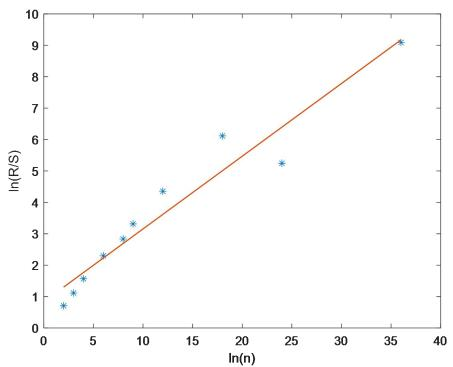

<details>
<summary>scatter</summary>

| ln(n) | ln(R/S) |
| --- | --- |
| ~2 | ~0.7 |
| ~3 | ~1.1 |
| ~4 | ~1.6 |
| ~6 | ~2.3 |
| ~8 | ~2.9 |
| ~9 | ~3.4 |
| ~12 | ~4.4 |
| ~18 | ~6.1 |
| ~24 | ~5.3 |
| ~36 | ~9.1 |
</details>

图 29 水通量 $\ln(R/S)$ 与 $\ln(n)$ 的散点图

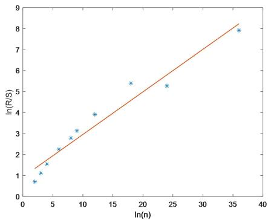

<details>
<summary>scatter</summary>

| ln(n) | ln(R/S) |
| --- | --- |
| ~2 | ~0.7 |
| ~3 | ~1.1 |
| ~4 | ~1.6 |
| ~6 | ~2.3 |
| ~8 | ~2.8 |
| ~9 | ~3.2 |
| ~12 | ~3.9 |
| ~18 | ~5.4 |
| ~24 | ~5.3 |
| ~36 | ~7.9 |
</details>

图 30 沙通量 $\ln(R/S)$ 与 $\ln(n)$ 的散点图

把全时段 2016-2021 年（1-72 日）分为 2 个阶段：2016-2017 年（1-24 日）和 2018-2021 年（25-72 日），第一阶段用于检验，第二阶段用于预测，结果如表 8 所示。

表 8 R/S 分析法的结果

<table><tr><td>阶段</td><td colspan="2">2016-2021年(1-72日)</td><td colspan="2">2016-2017年(1-24日)</td><td colspan="2">2018-2021年(25-72日)</td></tr><tr><td>水沙通量</td><td>水通量</td><td>沙通量</td><td>水通量</td><td>沙通量</td><td>水通量</td><td>沙通量</td></tr><tr><td>Hurst指数</td><td>0.2315</td><td>0.2029</td><td>0.3317</td><td>0.2842</td><td>0.2261</td><td>0.2233</td></tr><tr><td>判定结果</td><td>趋势反转</td><td>趋势反转</td><td>趋势反转</td><td>趋势反转</td><td>趋势反转</td><td>趋势反转</td></tr></table>

从表 1 中可以得出以下结论:

（1）在模型检验阶段，首先，水通量 $\mathrm{H} = 0.3317 < 0.5$ ，预示水流量未来变化将与过去总体趋势相反，这与实际情况相符。其次，沙通量 $\mathrm{H} = 0.2842 < 0.5$ ，预示排沙量未来变化将与过去总体趋势相反，这也与实际情况相符。第三，沙通量 $\mathrm{H} <$ 水通量 $\mathrm{H}$ ，说明沙通量的反转趋势比水通量更强，这也与实际情况相符。以上结果表明，R/S分析法具有一定的可靠性，可以用于预测。  
（2）在模型预测阶段，首先，水通量 H=0.2261<0.5，预示水流量未来变化将与过去总体趋势相反。其次，沙通量 H=0.2233<0.5，预示排沙量未来变化将与过去总体趋势相反。第三，沙通量 H<水通量 H，说明沙通量的反转趋势比水通量更强。

## 5.3.2 水沙通量的预测

## 5.3.2.1 预测函数的建立

根据前文分析，水通量、沙通量都具有周期性，因此使用傅里叶级数去逼近。

设 $f(t)$ 表示 t 时刻的水沙通量，根据假设，其满足狄利赫里（Dirichlet）条件，那么 $f(t)$ 的傅里叶级数处处收敛，于是

$$
f (t) = \frac {a _ {0}}{2} + \sum_ {n = 1} ^ {\infty} \left(a _ {n} \cos n t + b _ {n} \sin n t\right) \tag {15}
$$

由于水沙通量的周期为 12，于是水沙通量 $f(t)$ 的函数逼近解析式（取 10 阶）为

$$
\begin{array}{l} y = f (t) \\ = \frac {a _ {0}}{2} + \left(a _ {1} \cos \frac {\pi}{6} t + b _ {1} \sin \frac {\pi}{6} t\right) \tag {16} \\ + \left(a _ {2} \cos \frac {2 \pi}{6} t + b _ {2} \sin \frac {2 \pi}{6} t\right) + \dots + \left(a _ {1 0} \cos \frac {1 0 \pi}{6} t + b _ {1 0} \sin \frac {1 0 \pi}{6} t\right) \\ \end{array}
$$

误差检验公式为

$$
e = \sqrt {\frac {1}{n} \sum_ {t = 1} ^ {n} \left(\hat {y} _ {t} - y _ {t}\right) ^ {2}} \tag {17}
$$

其中， $\hat{y}_{t}, y_{t}$ 分别表示模拟值和实际值，n 为时间点个数。

## 5.3.2.2 预测函数的拟合和应用

取 2018-2020 年（36 个月）的水沙通量数据作拟合，再对 2021 年（12 个月）的水沙通量数据进行预测，接着作预测误差估计，最后对今后 2 年（2022-2023 年 24 个月）的水沙通量数据作预测。

对水通量、沙通量函数进行拟合，傅里叶系数的估计结果如表 9 所示。

表 9 水沙通量函数的傅里叶系数

<table><tr><td>序号</td><td>水通量</td><td>沙通量</td><td>序号</td><td>水通量</td><td>沙通量</td></tr><tr><td>a0</td><td>33.07</td><td>0.26</td><td>-</td><td>-</td><td>-</td></tr><tr><td>a1</td><td>-18.26</td><td>-0.25</td><td>a6</td><td>-1.06</td><td>-0.04</td></tr><tr><td>b1</td><td>-16.53</td><td>-0.26</td><td>b6</td><td>1.00</td><td>1.00</td></tr><tr><td>a2</td><td>-2.48</td><td>-0.02</td><td>a7</td><td>2.17</td><td>0.04</td></tr><tr><td>b2</td><td>2.21</td><td>1.09</td><td>b7</td><td>3.35</td><td>1.02</td></tr><tr><td>a3</td><td>-0.37</td><td>0.04</td><td>a8</td><td>-0.15</td><td>-0.04</td></tr><tr><td>b3</td><td>-0.03</td><td>0.95</td><td>b8</td><td>-0.67</td><td>0.96</td></tr><tr><td>a4</td><td>-0.15</td><td>-0.04</td><td>a9</td><td>-0.37</td><td>0.04</td></tr><tr><td>b4</td><td>4.97</td><td>1.04</td><td>b9</td><td>2.03</td><td>1.05</td></tr><tr><td>a5</td><td>1.62</td><td>0.04</td><td>a10</td><td>-1.55</td><td>-0.02</td></tr><tr><td>b5</td><td>0.77</td><td>0.98</td><td>b10</td><td>-1.45</td><td>0.91</td></tr></table>

拟合效果如图 31、图 32 所示，从图中可知，拟合效果较好。

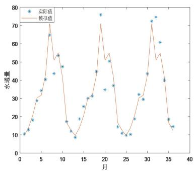

<details>
<summary>line</summary>

| 月 | 实际值 | 模拟值 |
| --- | --- | --- |
| 1 | ~10.5 | ~10.5 |
| 2 | ~13.5 | ~13.5 |
| 3 | ~18.5 | ~18.5 |
| 4 | ~29 | ~29 |
| 5 | ~34.5 | ~34.5 |
| 6 | ~40.5 | ~40.5 |
| 7 | ~65 | ~65 |
| 8 | ~44 | ~51 |
| 9 | ~54 | ~54 |
| 10 | ~47.5 | ~47.5 |
| 11 | ~17.5 | ~17.5 |
| 12 | ~12.5 | ~12.5 |
| 13 | ~9 | ~9 |
| 14 | ~19 | ~19 |
| 15 | ~26 | ~26 |
| 16 | ~30.5 | ~30.5 |
| 17 | ~31.5 | ~31.5 |
| 18 | ~45 | ~45 |
| 19 | ~76 | ~76 |
| 20 | ~35 | ~52 |
| 21 | ~50.5 | ~50.5 |
| 22 | ~37.5 | ~37.5 |
| 23 | ~14.5 | ~14.5 |
| 24 | ~10.5 | ~10.5 |
| 25 | ~10 | ~10 |
| 26 | ~19 | ~19 |
| 27 | ~32.5 | ~32.5 |
| 28 | ~30 | ~30 |
| 29 | ~44 | ~44 |
| 30 | ~72.5 | ~72.5 |
| 31 | ~75 | ~75 |
| 32 | ~61 | ~61 |
| 33 | ~40.5 | ~40.5 |
| 34 | ~19 | ~19 |
| 35 | ~15 | ~15 |
</details>

图 31 水通量的拟合效果比较

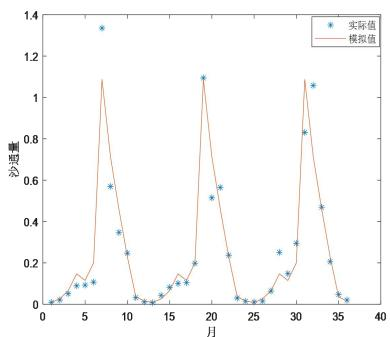

<details>
<summary>line</summary>

| 月 | 实际值 | 模拟值 |
| --- | --- | --- |
| 1 | ~0.02 | ~0.02 |
| 2 | ~0.03 | ~0.04 |
| 3 | ~0.05 | ~0.08 |
| 4 | ~0.09 | ~0.14 |
| 5 | ~0.09 | ~0.12 |
| 6 | ~0.11 | ~0.18 |
| 7 | ~1.34 | ~0.65 |
| 8 | ~0.57 | ~0.45 |
| 9 | ~0.35 | ~0.25 |
| 10 | ~0.25 | ~0.12 |
| 11 | ~0.04 | ~0.04 |
| 12 | ~0.02 | ~0.02 |
| 13 | ~0.02 | ~0.02 |
| 14 | ~0.04 | ~0.04 |
| 15 | ~0.09 | ~0.12 |
| 16 | ~0.11 | ~0.15 |
| 17 | ~0.11 | ~0.12 |
| 18 | ~0.21 | ~0.21 |
| 19 | ~1.10 | ~0.65 |
| 20 | ~0.52 | ~0.45 |
| 21 | ~0.57 | ~0.25 |
| 22 | ~0.24 | ~0.12 |
| 23 | ~0.04 | ~0.04 |
| 24 | ~0.02 | ~0.02 |
| 25 | ~0.02 | ~0.02 |
| 26 | ~0.04 | ~0.04 |
| 27 | ~0.07 | ~0.12 |
| 28 | ~0.26 | ~0.16 |
| 29 | ~0.15 | ~0.12 |
| 30 | ~0.30 | ~0.25 |
| 31 | ~0.83 | ~0.65 |
| 32 | ~1.06 | ~1.15 |
| 33 | ~0.47 | ~0.65 |
| 34 | ~0.21 | ~0.35 |
| 35 | ~0.06 | ~0.18 |
| 36 | ~0.03 | ~0.12 |
</details>

图 32 沙通量的拟合效果比较

预测误差估计结果如表 10 所示，从表中可知，预测误差较小。

表 10 预测误差的估计

<table><tr><td></td><td>模拟误差</td><td>预测误差</td></tr><tr><td>水通量</td><td>0.1011</td><td>0.3205</td></tr><tr><td>沙通量</td><td>5.7116</td><td>24.6572</td></tr></table>

为了比较水通量、沙通量的预测效果，画出全部6年数据与未来2年数据的时序图，如图33、图34所示，从图中可知，未来2年的预测值也具有相同的周期性，说明预测效果较好。

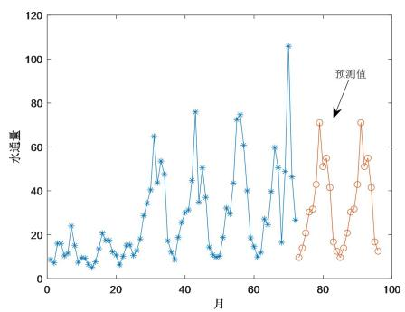

<details>
<summary>line</summary>

| 月 | 水通量 |
| --- | --- |
| 1 | ~9 |
| 2 | ~17 |
| 3 | ~16 |
| 4 | ~10 |
| 5 | ~17 |
| 6 | ~24 |
| 7 | ~10 |
| 8 | ~9 |
| 9 | ~10 |
| 10 | ~7 |
| 11 | ~6 |
| 12 | ~10 |
| 13 | ~20 |
| 14 | ~18 |
| 15 | ~19 |
| 16 | ~15 |
| 17 | ~18 |
| 18 | ~13 |
| 19 | ~16 |
| 20 | ~12 |
| 21 | ~15 |
| 22 | ~13 |
| 23 | ~16 |
| 24 | ~18 |
| 25 | ~29 |
| 26 | ~35 |
| 27 | ~40 |
| 28 | ~65 |
| 29 | ~44 |
| 30 | ~54 |
| 31 | ~48 |
| 32 | ~18 |
| 33 | ~9 |
| 34 | ~19 |
| 35 | ~20 |
| 36 | ~30 |
| 37 | ~32 |
| 38 | ~35 |
| 39 | ~45 |
| 40 | ~50 |
| 41 | ~76 |
| 42 | ~35 |
| 43 | ~51 |
| 44 | ~37 |
| 45 | ~15 |
| 46 | ~14 |
| 47 | ~11 |
| 48 | ~10 |
| 49 | ~19 |
| 50 | ~30 |
| 51 | ~44 |
| 52 | ~73 |
| 53 | ~75 |
| 54 | ~61 |
| 55 | ~40 |
| 56 | ~19 |
| 57 | ~17 |
| 58 | ~11 |
| 59 | ~26 |
| 60 | ~27 |
| 61 | ~40 |
| 62 | ~60 |
| 63 | ~51 |
| 64 | ~50 |
| 65 | ~17 |
| 66 | ~47 |
| 67 | ~27 |
| 68 | ~10 |
| 69 | ~14 |
| 70 | ~20 |
| 71 | ~30 |
| 72 | ~32 |
| 73 | ~43 |
| 74 | ~71 |
| 75 | ~54 |
| 76 | ~55 |
| 77 | ~43 |
| 78 | ~18 |
| 79 | ~10 |
| 80 | ~13 |
| 81 | ~21 |
| 82 | ~30 |
| 83 | ~43 |
| 84 | ~52 |
| 85 | ~71 |
| 86 | ~55 |
| 87 | ~56 |
| 88 | ~42 |
| 89 | ~17 |
| 90 | ~13 |
</details>

图 33 水通量过去值与未来值的比较

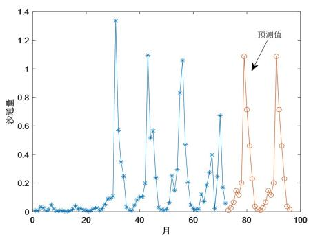

<details>
<summary>line</summary>

| 月 | 沙用量 |
| --- | --- |
| ~30 | ~1.35 |
| ~43 | ~1.1 |
| ~56 | ~1.05 |
| ~78 | ~1.1 |
| ~92 | ~1.1 |
</details>

图 34 沙通量过去值与未来值的比较

## 5.3.3 制订水沙通量的最优采样监测方案

为制定最优的采样监测方案，基本思路是：在水沙通量变化平缓的时间点减少采样次数，相反，在水沙通量变化急剧的时间点增加采样次数。

## 5.3.3.1 未来 2 年水沙通量时间尺度的变化特征

画出未来 2 年水通量、沙通量小波等值线图，如图 35、图 36 所示，从图中可得出以下结论：

（1）水通量在未来2年（73～96月）振荡减弱，只呈现了1次正负循环交替，振幅较平缓，有3个突变点，因此可减少监测次数。  
(2) 沙通量在未来 2 年 (73\~96 月) 的变化趋势与水通量相同, 也可减少监测次数。

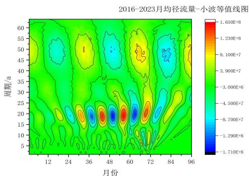

<details>
<summary>heatmap</summary>

| 周期/a | 12 | 24 | 36 | 48 | 60 | 72 | 84 | 96 |
| --- | --- | --- | --- | --- | --- | --- | --- | --- |
| 5~10 | ~-1.290E+8 | ~-1.290E+8 | ~-1.290E+8 | ~-1.290E+8 | ~-1.290E+8 | ~-1.290E+8 | ~-1.290E+8 | ~-1.290E+8 |
| 10~15 | ~-1.290E+8 | ~-1.290E+8 | ~-1.290E+8 | ~-1.290E+8 | ~-1.290E+8 | ~-1.290E+8 | ~-1.290E+8 | ~-1.290E+8 |
| 15~20 | ~-1.290E+8 | ~-1.290E+8 | ~-1.290E+8 | ~-1.290E+8 | ~-1.290E+8 | ~-1.290E+8 | ~-1.290E+8 | ~-1.290E+8 |
| 20~25 | ~-1.290E+8 | ~-1.290E+8 | ~-1.290E+8 | ~-1.290E+8 | ~-1.290E+8 | ~-1.290E+8 | ~-1.290E+8 | ~-1.290E+8 |
| 25~30 | ~-1.290E+8 | ~-1.290E+8 | ~-1.290E+8 | ~-1.290E+8 | ~-1.290E+8 | ~-1.290E+8 | ~-1.290E+8 | ~-1.290E+8 |
| 30~35 | ~-1.290E+8 | ~-1.290E+8 | ~-1.290E+8 | ~-1.290E+8 | ~-1.290E+8 | ~-1.290E+8 | ~-1.290E+8 | ~-1.290E+8 |
| 35~40 | ~-1.290E+8 | ~-1.290E+8 | ~-1.290E+8 | ~-1.290E+8 | ~-1.290E+8 | ~-1.290E+8 | ~-1.290E+8 | ~-1.290E+8 |
| 40~45 | ~-1.290E+8 | ~-1.290E+8 | ~-1.290E+8 | ~-1.290E+8 | ~-1.290E+8 | ~-1.290E+8 | ~-1.290E+8 | ~-1.290E+8 |
| 45~50 | ~-1.290E+8 | ~-1.290E+8 | ~-1.290E+8 | ~-1.290E+8 | ~-1.290E+8 | ~-1.290E+8 | ~-1.290E+8 | ~-1.290E+8 |
| 50~55 | ~-1.290E+8 | ~-1.290E+8 | ~-1.290E+8 | ~-1.290E+8 | ~-1.290E+8 | ~-1.290E+8 | ~-1.290E+8 | ~-1.290E+8 |
| 55~60 | ~-1.290E+8 | ~-1.290E+8 | ~-1.290E+8 | ~-1.290E+8 | ~-1.290E+8 | ~-1.290E+8 | ~-1.290E+8 | ~-1.290E+8 |
</details>

图 35 水通量小波等值线图

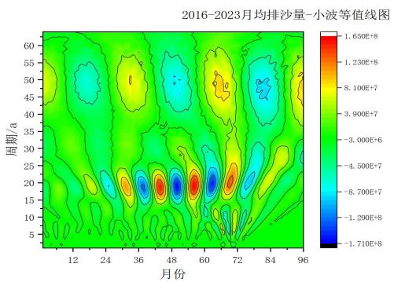

<details>
<summary>heatmap</summary>

| 周期/a | 12 | 24 | 36 | 48 | 60 | 72 | 84 | 96 |
| --- | --- | --- | --- | --- | --- | --- | --- | --- |
| 5~10 | ~-1.7E+8 | ~-1.29E+8 | ~-1.29E+8 | ~-1.29E+8 | ~-1.29E+8 | ~-1.29E+8 | ~-1.29E+8 | ~-1.29E+8 |
| 10~15 | ~-1.29E+8 | ~-1.29E+8 | ~-1.29E+8 | ~-1.29E+8 | ~-1.29E+8 | ~-1.29E+8 | ~-1.29E+8 | ~-1.29E+8 |
| 15~20 | ~-1.29E+8 | ~-1.29E+8 | ~-1.29E+8 | ~-1.29E+8 | ~-1.29E+8 | ~-1.29E+8 | ~-1.29E+8 | ~-1.29E+8 |
| 20~25 | ~-1.29E+8 | ~-1.29E+8 | ~-1.29E+8 | ~-1.29E+8 | ~-1.29E+8 | ~-1.29E+8 | ~-1.29E+8 | ~-1.29E+8 |
| 25~30 | ~-1.29E+8 | ~-1.29E+8 | ~-1.29E+8 | ~-1.29E+8 | ~-1.29E+8 | ~-1.29E+8 | ~-1.29E+8 | ~-1.29E+8 |
| 30~35 | ~-1.29E+8 | ~-1.29E+8 | ~-1.29E+8 | ~-1.29E+8 | ~-1.29E+8 | ~-1.29E+8 | ~-1.29E+8 | ~-1.29E+8 |
| 35~40 | ~-1.29E+8 | ~-1.29E+8 | ~-1.29E+8 | ~-1.29E+8 | ~-1.29E+8 | ~-1.29E+8 | ~-1.29E+8 | ~-1.29E+8 |
| 40~45 | ~-1.29E+8 | ~-1.29E+8 | ~-1.29E+8 | ~-1.29E+8 | ~-1.29E+8 | ~-1.29E+8 | ~-1.29E+8 | ~-1.29E+8 |
| 45~50 | ~-1.29E+8 | ~-1.29E+8 | ~-1.29E+8 | ~-1.29E+8 | ~-1.29E+8 | ~-1.29E+8 | ~-1.29E+8 | ~-1.29E+8 |
| 50~55 | ~-1.29E+8 | ~-1.29E+8 | ~-1.29E+8 | ~-1.29E+8 | ~-1.29E+8 | ~-1.29E+8 | ~-1.29E+8 | ~-1.29E+8 |
| 55~60 | ~-1.29E+8 | ~-1.29E+8 | ~-1.29E+8 | ~-1.29E+8 | ~-1.29E+8 | ~-1.29E+8 | ~-1.29E+8 | ~-1.29E+8 |
</details>

图 36 沙通量小波等值线图

## 5.3.3.2 未来 2 年水沙通量的采样监测方案

问题分析：基于对水沙通量的小波分析，要制订监测方案，所追求的目标是既要节约监测成本（监测次数），又要及时掌握水沙通量的动态变化。该问题可以转化为背包问题来解决，把水通量的动态变化信息看作价值，把监测看作物品（有成本），在价值一定的情况下，如何监测才能使得成本最小。

建模思路：以时间点 “月” 为例，首先，对历年每月的水沙通量所携带的信息进行度量，并汇总成月均信息量。其次，对未来 2 年每月的水沙通量所携带的信息进行度量。第三，以月均信息量为约束条件，以总监测次数最小为目标，建立 0-1 规划模型。

下面开始建模。以时间点 “月” 为例（模型可以推广到周、日、小时等时间单位），以年为方案制订的周期。

设 $x_{t}$ 表示 $t$ 时刻的水沙通量（水通量或沙通量）， $t = 1,2,\dots,12$ ，令

$$
\left\{ \begin{array}{l} y _ {t + 1} = \left| x _ {t + 1} - x _ {t} \right|, \quad t = 1, 2, \dots , 1 1 \\ y _ {1} = y _ {2} \end{array} \right. \tag {18}
$$

$y_{t}$ 表示 t 时刻水沙通量所携带的动态信息，可以提前进行估计， $y_{t} \geq 0$ 。

设 $\overline{y}$ 表示水沙通量所携带的动态信息的月平均值，可以用历史数据进行估计。

设 $z_{t} = 1$ 表示 $t$ 时刻监测， $z_{t} = 0$ 表示 $t$ 时刻不监测，则目标函数为

$$
f = \sum_ {t = 1} ^ {1 2} z _ {t} \tag {19}
$$

目标函数求最小值，即

$$
\min f \tag {20}
$$

约束条件为

$$
\frac {1}{1 2} \sum_ {t = 1} ^ {1 2} z _ {t} y _ {t} \geq \overline {{y}} \tag {21}
$$

汇总得，

$$
\min \quad f = \sum_ {t = 1} ^ {1 2} z _ {t}
$$

$$
s. t. \left\{ \begin{array}{l} \frac {1}{1 2} \sum_ {t = 1} ^ {1 2} z _ {t} y _ {t} \geq \bar {y}, \\ z _ {t} \in \{0, 1 \} \end{array} \right. \tag {22}
$$

下面开始参数估计。根据前面的分析，水通量与水通量的变化趋势相同，故仅制订水通量的监测方案即可。根据2018～2021年每月的水通量可以估计出 $\overline{y}=10.8$ （亿 $m^{3}$ ）。再根据2022年、2023年的水通量数据 $x_{t}$ 计算出 $y_{t}$ ，如表11所示。从表中可知，2022、2023年的 $y_{t}$ 是相同的，这是由于水通量周期性所致。

使用 LINGO 软件求解，计算结果如表 11 所示。

表 11 参数估计和最优解

<table><tr><td colspan="2">月份</td><td>1</td><td>2</td><td>3</td><td>4</td><td>5</td><td>6</td><td>7</td><td>8</td><td>9</td><td>10</td><td>11</td><td>12</td></tr><tr><td rowspan="2">2022年</td><td>差分/亿m3</td><td>4.2851</td><td>4.2851</td><td>6.8839</td><td>9.508</td><td>1.4074</td><td>11.1839</td><td>28.1436</td><td>20.0018</td><td>3.8734</td><td>13.4233</td><td>24.7519</td><td>4.2575</td></tr><tr><td>最优解</td><td>1</td><td>1</td><td>1</td><td>1</td><td>0</td><td>1</td><td>1</td><td>1</td><td>1</td><td>1</td><td>1</td><td>1</td></tr><tr><td rowspan="2">2023年</td><td>差分/亿m3</td><td>4.2851</td><td>4.2851</td><td>6.8839</td><td>9.508</td><td>1.4074</td><td>11.1839</td><td>28.1436</td><td>20.0018</td><td>3.8734</td><td>13.4233</td><td>24.7519</td><td>4.2575</td></tr><tr><td></td><td>1</td><td>1</td><td>1</td><td>1</td><td>0</td><td>1</td><td>1</td><td>1</td><td>1</td><td>1</td><td>1</td><td>1</td></tr></table>

从表 11 可知，2022 年、2023 年均在 5 月不监测，其余月份都要监测，监测次数减少了 1 次。

结果检验：由于 5 月份差分值最小（1.41），表明 5 月份与 4 月份的水通量变化不大，故可以不监测。

## 5.4 问题（4）——分析 “调水调沙” 的实际效果

问题分析：为了评估“调水调沙”的实际效果，可以比较“调水调沙”前后河底高程、水沙通量、水流量等指标的变化。

建模思路：首先，使用“微元法”计算不同时间点的平均河底高程，并进行比较。其次，使用“微元法”计算平均水深，在此基础上计算不同时间点的水通量，并进行比较。第三，计算不同时间点的沙通量，并进行比较。

根据假设，每年6-7月份“调水调沙”一次。

## 5.4.1 “调水调沙” 对河底高程的影响

定义 1 河道断面左侧为起点桩位置，断面上测点距起点桩的距离即为起点距.

河道断面如图 37 所示。为了计算平均河底高程，需要使用 “微元法”。

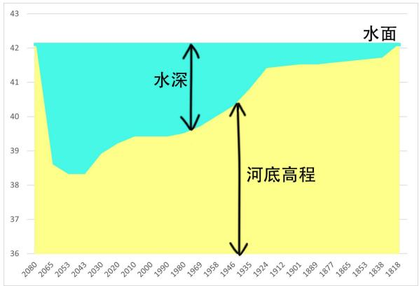

<details>
<summary>area_stacked</summary>

| Year | 水深 (Area) | 河底高程 (Area) |
| --- | --- | --- |
| 2080 | ~42.1 | ~42.1 |
| 2053 | ~42.1 | ~38.6 |
| 2043 | ~42.1 | ~38.3 |
| 2030 | ~42.1 | ~38.9 |
| 2020 | ~42.1 | ~39.2 |
| 2010 | ~42.1 | ~39.4 |
| 2000 | ~42.1 | ~39.4 |
| 1990 | ~42.1 | ~39.4 |
| 1980 | ~42.1 | ~39.6 |
| 1969 | ~42.1 | ~39.7 |
| 1958 | ~42.1 | ~40.0 |
| 1946 | ~42.1 | ~40.3 |
| 1935 | ~42.1 | ~40.6 |
| 1924 | ~42.1 | ~41.4 |
| 1912 | ~42.1 | ~41.5 |
| 1901 | ~42.1 | ~41.5 |
| 1889 | ~42.1 | ~41.5 |
| 1877 | ~42.1 | ~41.6 |
| 1865 | ~42.1 | ~41.6 |
| 1853 | ~42.1 | ~41.7 |
| 1838 | ~42.1 | ~41.7 |
| 1818 | ~42.1 | ~42.1 |
</details>

图 37 河道断面示意图

根据起点距的定义，使用“微元法”近似计算平均河底高程，步骤如下：

第 1 步，把数据点 $\left(x_{i}, y_{i}\right)$ 按照起点距 $x_{i}$ 从小到大排序， $i = 1, 2, \ldots, n$ 。

第 2 步，计算相邻两个起点距的长度： $\Delta x_{i}=x_{i}-x_{i-1},\quad i=2,3,\ldots,n$ 。

第 3 步，计算相邻两个河底高程的平均高度： $\overline{y}_{i}=0.5\left(y_{i}+y_{i-1}\right)$ ， $i=2,3,\ldots,n$ 。

第 4 步，计算面积微元： $dS = \Delta x_{i} \overline{y}_{i}, \quad i = 2, 3, \ldots, n$ 。

第 5 步，计算总面积： $S = \sum_{i=2}^{n} \Delta x_{i} \overline{y}_{i}$ 。

第 6 步，计算平均河底高程： $h=\frac{S}{a}$ ，其中 a 为起点桩与终点桩之间的距离。

根据附件 2 的数据，计算结果如图 38 所示。从图中可得出以下结论：

（1）每年的“调水调沙”成效显著，河底高程始终保持在45m左右，如果不调沙的话，必将出现上升现象。  
(2) 2019 年 “调水调沙” 前后成效尤其显著, 从 $45 \mathrm{~m}$ 下降到 $44.77 \mathrm{~m}$ , 下降了 $0.23 \mathrm{~m}$ 。

## 5.4.2 “调水调沙” 对水通量的影响

根据水通量的计算公式，计算水通量（亿 $\mathrm{m}^3$ ），结果如图39、图40所示。从图39中可得出以下结论：

(1) 每年的 “调水调沙” 效果不佳, 水通量呈现逐年下降趋势。  
(2) 2018 年 “调水调沙” 前后成效尤其不佳, 水通量从 9.46 亿 $\mathrm{m}^{3}$ 下降 5.49 亿 $\mathrm{m}^{3}$ 。下降了 $72\%$ 。

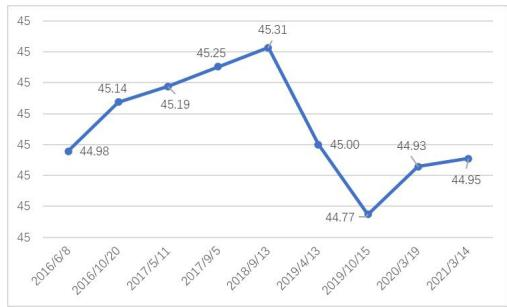

<details>
<summary>line</summary>

| Date | Value |
| --- | --- |
| 2016/6/8 | 44.98 |
| 2016/10/20 | 45.14 |
| 2017/5/11 | 45.19 |
| 2017/9/5 | 45.25 |
| 2018/9/13 | 45.31 |
| 2019/4/13 | 45.00 |
| 2019/10/15 | 44.77 |
| 2020/3/19 | 44.93 |
| 2021/3/14 | 44.95 |
</details>

图 38 河底高程的变化情况

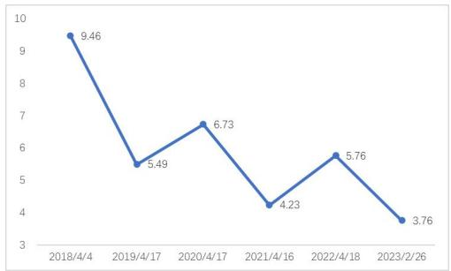

<details>
<summary>line</summary>

| Date | Value |
| --- | --- |
| 2018/4/4 | 9.46 |
| 2019/4/17 | 5.49 |
| 2020/4/17 | 6.73 |
| 2021/4/16 | 4.23 |
| 2022/4/18 | 5.76 |
| 2023/2/26 | 3.76 |
</details>

图 39 水通量的变化情况

从图 39 中可得出以下结论:

(1) 如果不 “调水调沙”，那么水通量逐年下降趋势越来越严重。  
(2) 2022 年水通量上升幅度尤其显著, 上升了 $6.4\%$ , 调沙效果尤其不好。

## 5.4.3 “调水调沙” 对沙通量的影响

根据沙通量的计算公式，计算沙通量（亿吨），结果如图 40 所示。从图中可得出以下结论：

（1）“调水调沙”成效不佳，2021年与2020年相比，沙通量下降了45.4%。

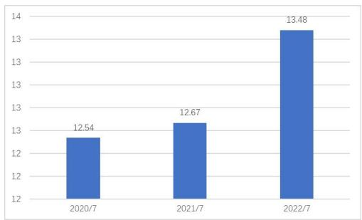

<details>
<summary>bar</summary>

| Category | Value |
| --- | --- |
| 2020/7 | 12.54 |
| 2021/7 | 12.67 |
| 2022/7 | 13.48 |
</details>

图 40 日均水通量的变化情况

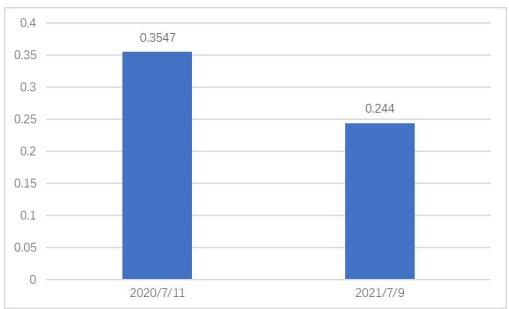

<details>
<summary>bar</summary>

| Category | Value |
| --- | --- |
| 2020/7/11 | 0.3547 |
| 2021/7/9 | 0.244 |
</details>

图 40 日均水通量的变化情况

## 5.4.4 未来 10 年河底高程的预测

根据附件 2 的数据，把 9 个时间点的平均河底高程估算出来，为了排除每年 6、7 月份 “调水调沙” 的影响，把本年度排沙后的河底高程减去上年度排沙前的河底高程，形成新的时间序列，具体情况如表 12

所示。

表 12 新的时间序列产生方式

<table><tr><td>时间点</td><td>1</td><td>2</td><td>3</td><td>4</td></tr><tr><td>两个时间点数据相减</td><td>2017/5/11-2016/10/20</td><td>2019/4/13-2018/9/13</td><td>2020/3/19-2019/10/15</td><td>2021/3/14-2020/3/19</td></tr></table>

新的时间序列如表 13 所示.

表 13 新的时间序列

<table><tr><td>时间点</td><td>1</td><td>2</td><td>3</td><td>4</td></tr><tr><td>上年度数据</td><td>45.14</td><td>45.31</td><td>44.77</td><td>44.93</td></tr><tr><td>本年度数据</td><td>45.19</td><td>45.00</td><td>44.93</td><td>44.95</td></tr><tr><td>数据相减</td><td>0.05</td><td>-0.31</td><td>0.15</td><td>0.03</td></tr></table>

由于新的时间序列只有 4 个时间点，故选择灰色模型 GM(1,1) 进行预测。

设 $\left\{z_{t}\right\}$ 为时间序列， $z_{t}$ 表示 t 时刻河底高程 1 年的增量， $z_{t} \in (-\infty, +\infty)$ ，t = 1, 2, 3, 4，令

$$
u _ {t} = z _ {t} + z _ {0}, t = 1, 2, 3, 4 \tag {23}
$$

则 $u_{t} > 0$ ，这里取 $z_0 = 1$ ，于是建立GM(1,1)模型对未来 $m$ 个时间点的数据进行预测，得到预测时间序列 $\left\{\hat{u}_t\right\}$ ， $t = 1,2,\dots,4 + m$ ，再还原得

$$
\hat {z} _ {t} = \hat {u} _ {t} - z _ {0}, t = 1, 2,..., 4 + m \tag {24}
$$

则 $\hat{z}_{t}$ 表示河底高程 1 年的增量值，再还原为 t 时刻河底高程。

使用 MATLAB 编程计算，结果如表 14 所示。

表 14 模拟数据与预测数据

<table><tr><td>时间</td><td>1</td><td>2</td><td>3</td><td>4</td><td>5</td><td>6</td><td>7</td><td>8</td><td>9</td><td>10</td><td>11</td><td>12</td><td>13</td><td>14</td></tr><tr><td>数据</td><td>45.19</td><td>45.12</td><td>44.72</td><td>45.04</td><td>45.34</td><td>45.88</td><td>46.67</td><td>47.78</td><td>49.26</td><td>51.16</td><td>53.58</td><td>56.58</td><td>60.28</td><td>64.79</td></tr></table>

根据表 14，画出河底高程的演变趋势，如图 41 所示。从表 14 和图 41 可知，未来如果不进行 “调水调沙”，那么河底高程将持续升高，10 年后将达到 64.79m。

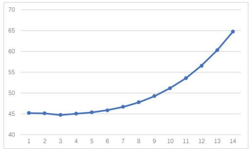

<details>
<summary>line</summary>

| X | Y |
| --- | --- |
| 1 | ~45.2 |
| 2 | ~45.1 |
| 3 | ~44.8 |
| 4 | ~45.1 |
| 5 | ~45.3 |
| 6 | ~45.8 |
| 7 | ~46.6 |
| 8 | ~47.7 |
| 9 | ~49.2 |
| 10 | ~51.1 |
| 11 | ~53.5 |
| 12 | ~56.6 |
| 13 | ~60.3 |
| 14 | ~64.8 |
</details>

图 41 河底高程未来 10 年的变化情况

## 六、模型的评价和推广

## 6.1 模型优点

(1) 在分析含沙量与时间的关系时, 建立了季节指数, 得到了时间上的分布规律; 在分析含沙量与

水位、水流量的关系时，建立了双对数回归方程，得到了相关性和弹性。

（2）在分析水沙通量的季节性时，仍然建立了季节指数；在分析周期性时，建立了三角函数；在分析突变性时，分别使用 M-K 检验法和 Fisher 最优分割法进行交叉验证，可靠性强；为了详细寻找周期性和突变点，还使用了小波变换法，进一步验证了结论的正确性。  
（3）在分析水沙通量的趋势性时，使用 R/S 分析法；在预测未来 2 年的水沙通量时，建立了傅里叶级数，预测精度较高；在建立最优采样监测方案时巧妙转化为背包问题，存在最优解。  
(4) 在计算曲线的平均高度时, 使用了 “微元法”。

## 6.2 模型缺点

(1) 在预测未来 2 年的水沙通量时, 难以给出突变点的数值, 导致在突变点的预测值偏低。

## 6.3 模型推广

本文所使用的模型或方法可以推广到水文资料分析问题中，还可以推广到其它有关季节性、周期性、突变性等问题的分析中。

## 七、参考文献

[1]郑锦秀.一元线性回归方程在大电流分流器测量中的应用[J].计测技术,2009,(5):17-19.  
[2]靳明.基于M-K检验方法的沈阳地区典型水文站近53年洪水要素演变分析[J].地下水,2019,(2):119-161.  
[3]刘克琳等．"Fisher最优分割法在汛期分期中的应用."水利水电科技进展,2017,(6):19-23.  
[4] 王海龙. 基于小波分析的汀江水沙通量变化规律研究 [J]. 泥沙研究, 2012.  
[5] 方国华. 线性回归法和 R/S 分析法在南平市年平均气温变化趋势分析中的应用 [C]// 中国水文科技新发展——2012 中国水文学术讨论会论文集. 2012.  
[6] 王天华 王平洋 范明天. 用 0-1 规划求解馈线自动化规划问题 [J]. 中国电机工程学报, 2000, 20(5): 54-58.  
[7] 王晓佳．基于数据分析的预测理论与方法研究．Diss．合肥工业大学，2012.

## 附录

## 1. 支撑材料列表

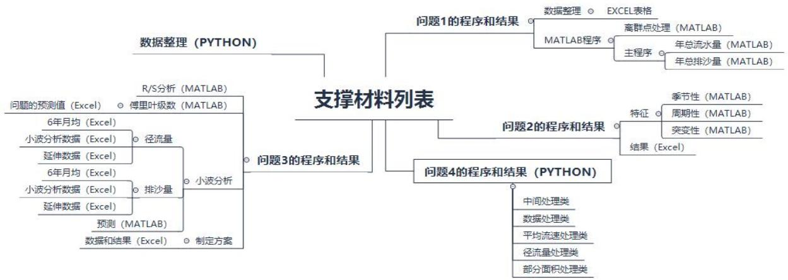

<details>
<summary>flowchart</summary>

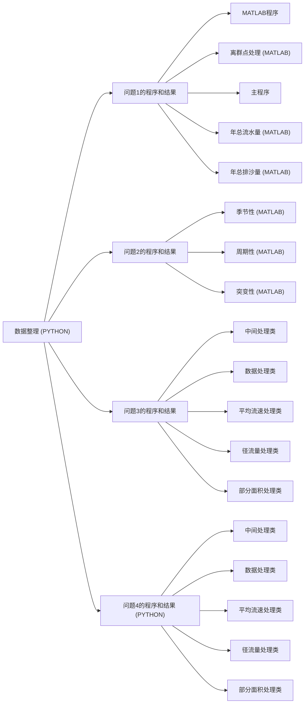
</details>

## 2. 支撑材料内容

2.0 数据整理（Python 软件）  
```python
from 格式转换类 import wk_format
  for year in range(2016, 2022):
    wk_format(year)

from openpyxl import Workbook, load_workbook
def wk_format(year):
    new_wk: Workbook = Workbook()
    new_sheet = new_wk.active
    old_wk: Workbook = load_workbook("待整理数据表格.xlsx", data_only=True)
    for row in old_wk.get_sheet_by_name(str(year)):
        cell_list = []
        for cell in row:
            cell_list.append(cell.value)
        new_sheet.append(cell_list)
    new_wk.save(f"{year}.xlsx")
from pyecharts.charts import Bar
from pyecharts.options import *

from 统计工具类 import *
bar = Bar()
x = ['2016', '2017', '2018', '2019', '2020', '2021']
a, b = sum_utils()
y = a
for i in range(len(y)):
    y[i] = y[i] / 100000000
bar.add_xaxis(x)
bar.add_yaxis("年总水流量(亿立方米)", y, label_opts=LabelOpts(is_show=True, position="top"))
# 全局设置
bar.set_global_opts(
```

```python
legend_opts=LegendOpts(is_show=True, pos_top='2%'),
title_opts=TitleOpts(title=f"2016-2021各年总水流量", pos_left='center', pos_bottom='2%')) bar.render("年总水流量图.html")
```

```python
from pyecharts.charts import Bar
from pyecharts.options import *
from 测试代码.年总量计算类.统计工具类 import sum_utils
bar = Bar()
x = ['2016', '2017', '2018', '2019', '2020', '2021']
a, b = sum_utils()
y = b
bar.add_xaxis(x)
bar.add_yaxis("年总输沙量(亿吨)", y, label_opts=LabelOpts(is_show=True, position="top"))
for i in range(len(y)):
    y[i] = y[i] / 100000000
bar.set_global_opts(
    legend_opts=LegendOpts(is_show=True, pos_top='2%'),
    title_opts=TitleOpts(title=f"2016-2021各年总输沙量", pos_left='center', pos_bottom='2%'))
bar.render("年总输沙量图.html")
```

```python
import decimal
from math import floor
from openpyxl import Workbook, load_workbook
```

```python
def get_sum(year):
    wk: Workbook = load_workbook(f'{year}年日平均计算.xlsx')
    sheet = wk.active
    sum1 = decimal.Decimal('0.0000')
    sum2 = decimal.Decimal('0.0000')
    for cell in sheet['G2:G361']:
        sum1 += decimal.Decimal(cell[0].value)
    for cell in sheet['H2:H361']:
        sum2 += decimal.Decimal(cell[0].value)
    return floor(sum1), floor(sum2)
def sum_utils():
    sum_list1 = []
    sum_list2 = []
    for year in range(2016, 2022):
        value1, value2 = get_sum(year)
        sum_list1.append(value1)
        sum_list2.append(value2)
    return sum_list1, sum_list2
```

```python
from 日平均计算类 import day_start
from 月平均计算类 import month_start
from 折线图处理类 import line_start
```

```python
for year in range(2016, 2022):
    day_start(f'{year}.xlsx')
    month_start(year)
    line_start(year)

from openpyxl import Workbook, load_workbook
import decimal
def day_start(file):wk: Workbook = load_workbook(file, data_only=True)
    sheet = wk.active
    prev_d = 1
    prev_m = 1
    count = decimal.Decimal('0.0')
    water_level_sum = decimal.Decimal('0.00')
    flow_sum = decimal.Decimal('0.00')
    sand_content_sum = decimal.Decimal('0.00')
    new_wk = Workbook()
    new_sheet = new_wk.active
    new_sheet.append(['年', '月', '日', '平均水位', '平均流量', '平均含沙量', '径流量(立方米)', '输沙量(吨)'])
    flag = True
    for row in sheet:
        if flag:
            flag = False
            continue
        year = row[1].value
        month = row[2].value
        day = row[3].value
        water_level = row[4].value
        flow = row[5].value
        sand_content = row[6].value
        water_level = decimal.Decimal(water_level).quantize(decimal.Decimal('0.000'))
        flow = decimal.Decimal(flow).quantize(decimal.Decimal('0.000'))
        sand_content = decimal.Decimal(sand_content).quantize(decimal.Decimal('0.000'))
        if prev_d != day:
            water_level_sum = water_level_sum / count
            flow_sum = flow_sum / count
            sand_content_sum = sand_content_sum / count
            runoff_sum = flow_sum * 3600 * 24
            sediment_load_sum = sand_content_sum * flow_sum * 3600 * 24 / 1000
            new_sheet.append(
                [year, prev_m, prev_d, water_level_sum, flow_sum, sand_content_sum, runoff_sum, sediment_load_sum])
            prev_d = day
            prev_m = month
            water_level_sum = decimal.Decimal(water_level)
            flow_sum = decimal.Decimal(flow)
            sand_content_sum = decimal.Decimal(sand_content)
            count = decimal.Decimal('1.0')
```

```python
else:
    water_level_sum += decimal.Decimal(water_level)
    flow_sum += decimal.Decimal(flow)
    sand_content_sum += decimal.Decimal(sand_content)
    count += 1
water_level_sum = water_level_sum / count
flow_sum = flow_sum / count
sand_content_sum = sand_content_sum / count
runoff_sum = water_level_sum * 3600 * 24
sediment_load_sum = sand_content_sum * flow_sum * 3600 * 24 / 1000

new_sheet.append([year, month, day, water_level_sum, flow_sum, sand_content_sum, runoff_sum, sediment_load_sum])
new_wk.save(f'{year}年日平均计算.xlsx')

from openpyxl import Workbook, load_workbook
from pyecharts.charts import Line
import decimal
def month_start(year):
    wk: Workbook = load_workbook(f'{year}年日平均计算.xlsx')
    prev_d = 1
    prev_m = 1
    count = decimal.Decimal('0.0')
    new_wk = Workbook()
    sheet = wk.active
    new_sheet = new_wk.active
    new_sheet.append(['年', '月', '日', '平均径流量(立方米)', '平均输沙量(吨)'])
    runoff_sum = decimal.Decimal('0.0000')
    sediment_load_sum = decimal.Decimal('0.0000')
    flag = True
    for row in sheet:
        if flag:
            flag = False
            continue
        year = row[0].value
        month = row[1].value
        day = row[2].value
        runoff = decimal.Decimal(row[6].value)
        sediment_load = decimal.Decimal(row[7].value)
        if prev_m != month:
            runoff_sum = runoff_sum / count
                new_sheet.append([year, prev_m, prev_d, runoff_sum, sediment_load_sum])
        prev_m = month
            prev_d = day
            runoff_sum = runoff
            sediment_load_sum = sediment_load
            count = decimal.Decimal('1.0')
```

```python
else:
    runoff_sum += runoff
    sediment_load_sum += sediment_load
    count += 1
runoff_sum = runoff_sum / count
sediment_load_sum = sediment_load_sum / count
new_sheet.append([year, month, day, runoff_sum, sediment_load_sum])
new_wk.save(f' {year}年月平均计算.xlsx')
```

```python
from openpyxl import Workbook, load_workbook
from openpyxl.chart import LineChart, Reference
```

def line\_start(year):  
```python
wk: Workbook = load_workbook(f"{year}年月平均计算.xlsx")
sheet = wk.active

new_wk = Workbook()
new_sheet = new_wk.active

data_list = []

for row in sheet:
    year = row[0].value
    month = row[1].value
    day = row[2].value
    runoff = row[3].value
    sediment_load = row[4].value
    data_list.append([year, month, day, runoff, sediment_load])
    new_sheet.append(data_list[-1])
c1 = LineChart()
c1.title = "月平均径流量图"
c1.x_axis.title = "月份"
c1.y_axis.title = "月平均径流量"
data_c1 = Reference(sheet, min_col=4, min_row=1, max_col=4, max_row=13)
c1.add_data(data_c1, titles_from_data=True)
c2 = LineChart()
c2.title = "月平均输沙量图"
c2.x_axis.title = "月份"
c2.y_axis.title = "月平均输沙量"
data_c2 = Reference(sheet, min_col=5, min_row=1, max_col=5, max_row=13)
c2.add_data(data_c2, titles_from_data=True)
new_sheet.add_chart(c1, "G2")
new_sheet.add_chart(c2, "P2")
new_wk.save(f"{year}水流通量折线图.xlsx")
```

## 2.1 问题1的程序和结果

## 2.1.1 数据整理（Excel）

2.1.2 程序（MATLAB软件）  
```matlab
% 5.0 数据整理
clc,clear all
load data      % a1,a2,a3,a4,a5,a6=矩阵，若干行*5（5列：年-月-日-水位-流量-含沙量）
%%
a{1}=a1;
a{2}=a2;
a{3}=a3;
a{4}=a4;
a{5}=a5;
a{6}=a6;
save data2 a
```  
% 5.1.1研究含沙量与时间的关系
clc,clear all
load data2          % a{}=数组，6个矩阵，若干行\*5（5列：年-月-日-水位-流量-含沙量）

```matlab
%% 按日汇总：含沙量、水位、水流量
for i=1:6
    b=a{i};%年数据
    b(:,1)=[];
    for j=1:12
        p=find(b(:,1)==j);
        b2=b(p,:);%月数据
        b2(:,1)=[];
        for k=1:30
            q=find(b2(:,1)==k);
            b3=b2(q,:);%日数据
            b3(:,1)=[];
            b5=mean(b3,1);
            c(k,:,j,i)=b5;% 数组，30*3*12*6
        end
    end
end
```

```matlab
%% 含沙量与水位、水流量
d=[];
for i=1:6
    for j=1:12
        c2=c(:,:,j,i);
        d=[d;c2];% 时间序列矩阵, 2160*3
    end
end
```

%% 画时序图，

d2=d(:,3);%含沙量

plot(d2,'\*');

k1=1.5;

k2=3;

y=liqundian3(d2,k1,k2);%识别离群点

i=find(y==2);

d2(i) = [];

plot(d2,'\*');

%% 月份指数

d3=[];

for i=1:6

```matlab
for j=1:12
    c2=c(:,:,j,i);
    n=size(c2,1);
    c3=[j*ones(n,1),c2];
    d3=[d3;c3];% 时间序列矩阵，2160*4(月份-水位-水流量-含沙量)
```

end

end

d5=d3(:, [1,end]);

%% 计算月份指数

y=liqundian3(d5(:,2),k1,k2);%识别离群点

i=find(y==2);

d5(i,:)=[];

for i=1:12

```matlab
k=find(d5(:,1)==i);
d6=d5(k,2);
d7(i)=mean(d6);
```

end

d8=d7/mean(d7);%月份指数

plot(d8,'\*-'')

%% 计算季度指数

```matlab
k=find(d5(:,1)>=1 & d5(:,1)<=3) ;
d6=d5(k,2);
d9(1)=mean(d6);
```

```matlab
k=find(d5(:,1)>=4 & d5(:,1)<=6) ;
d6=d5(k,2);
d9(2)=mean(d6);
```

```matlab
k=find(d5(:,1)>=7 & d5(:,1)<=9) ;
d6=d5(k,2);
d9(3)=mean(d6);
```

k=find(d5(:,1)>=10 & d5(:,1)<=12) ;

$\mathrm{d}6 = \mathrm{d}5(\mathrm{k},2)$

d9(4)=mean(d6);

d10=d9/mean(d9);%月份指数

bar(d10);

% 5.1.2研究含沙量与水位、水流量的关系

clc,clear all

load data2 % a{}=数组，6个矩阵，若干行\*5（5列：年-月-日-水位-流量-含沙量）

%% 按日汇总：含沙量、水位、水流量  
```matlab
for i=1:6
    b=a{i};%年数据
    b(:,1)=[];
    for j=1:12
        p=find(b(:,1)==j);
        b2=b(p,:);%月数据
        b2(:,1)=[];
        for k=1:30
            q=find(b2(:,1)==k);
            b3=b2(q,:);%日数据
            b3(:,1)=[];
            b5=mean(b3,1);
            c(k,:,j,i)=b5;% 数组, 30*3*12*6
        end
    end
end
```

%% 含沙量与水位、水流量  
```matlab
d=[];
for i=1:6
    for j=1:12
        c2=c(:,:,j,i);
        d=[d;c2];% 时间序列矩阵，2160*3
    end
end
```

%% 剔除离群点  
```matlab
d2=d(:,3);%含沙量
plot(d2,'*');
k1=1.5;
k2=3;
y=liqundian3(d2,k1,k2);%识别离群点
i=find(y==2);
d(i,:)=[];
```

$d2=d(:,2)$ ; %检验，是否存在离群点

plot(d2,'\*');

%% 画散点图  
```javascript
subplot(1,3,1); plot(d(:,1),d(:,2),'.');xlabel('水位');ylabel('水流量');
subplot(1,3,2); plot(d(:,1),d(:,3),'o');xlabel('水位');ylabel('含沙量');
subplot(1,3,3); plot(d(:,2),d(:,3),'*');xlabel('水流量');ylabel('含沙量');
```

%% 建立回归方程  
```matlab
y=d(:,3);%含沙量
x=d(:,1);                      % 水位或水流量，分别对应2个回归方程
n=length(x);
[b, bint, r,rint,stats]=regress(log(y),[ones(n,1) log(x)],0.05);
z=[b bint],
stats,
```

%% 残差检验  
```matlab
r2=(r-mean(r))/sqrt(stats(4));
figure, histfit(r2);
y2=(y-mean(y))/std(y);
figure, plot(y2,r2,'*');
```  
% 5.1.3 估算年总水流量和年总排沙量

```txt
clc,clear all
load data2          % a{}=数组，6个矩阵，若干行*5（5列：年-月-日-水位-流量-含沙量）
```

%% 按日汇总：含沙量、水位、水流量  
```matlab
for i=1:6
    b=a{i};%年数据
    b(:,1)=[];
    for j=1:12
        p=find(b(:,1)==j);
        b2=b(p,:);%月数据
        b2(:,1)=[];
        for k=1:30
            q=find(b2(:,1)==k);
            b3=b2(q,:);%日数据
            b3(:,1)=[];
            b5=mean(b3,1);
            c(k,:,j,i)=b5;% 数组，30*3*12*6
        end
    end
end
```

%% 含沙量与水位、水流量  
```matlab
for i=1:6
    c2=c(:,:,i);
    c3=mean(mean(c2,1),3);
```

```matlab
d=c3(:,2);
d2=365*24*3600/10^8*d;
d3(i)=d2;    %年总水流量,亿立方米
end
d4=mean(d3);
d5=[d3,d4];
```

%% 含沙量与水位、水流量  
```matlab
d9=0;
for i=1:6
    c2=c(:,:,i);
    for j=1:12
        c3=c2(:,:,j);
        for k=1:30
            c4=c3(k,:);
            d8=c4(2)*c4(3)*24*3600/1000;%吨
            d9=d9+d8;
        end
    end
    d10(i)=d9/10^8;
end
d11=mean(d10);
d12=[d10,d11];
```

%% 输出  
```json
e=[d5;d12]
```

%% 剔除离群点  
```matlab
d2=d(:,3);%含沙量
plot(d2,'*');
k1=1.5;
k2=3;
y=liqundian3(d2,k1,k2);%识别离群点
i=find(y==2);
d(i,:)=[];
```

```matlab
d2=d(:,2);%检验，是否存在离群点
plot(d2,'*');
```

%% 年总水流量  
```matlab
d3=d(:,2);
d4=mean(d3)*365*24*3600/100000000      %亿立方米
```

%% 年总排沙量  
```matlab
d5=d(:,3);
d6=mean(d4)*d4/1000   %吨
```

% 5.1.1 研究含沙量与时间的关系  
```txt
clc,clear all
load data2          % a{}=数组，6个矩阵，若干行*5（5列：年-月-日-水位-流量-含沙量）
```

%% 按日汇总：含沙量、水位、水流量  
```matlab
for i=1:6
    b=a{i};%年数据
    b(:,1)=[];
    for j=1:12
        p=find(b(:,1)==j);
        b2=b(p,:);%月数据
        b2(:,1)=[];
        for k=1:30
            q=find(b2(:,1)==k);
            b3=b2(q,:);%日数据
            b3(:,1)=[];
            b5=mean(b3,1);
            c(k,:,j,i)=b5;% 数组, 30*3*12*6
        end
    end
end
```

```matlab
%%
d=[];
for i=1:2 % 拟合三角函数（2016-2017年）
    for j=1:12
        c2=c(:,:,j,i);
        d=[d;c2];% 时间序列矩阵，若干日*3
    end
end
n=size(d,1);
d2=[[1:n]',d(:,end)];% 矩阵，若干行*2（2列：日序号-含沙量）
```

%% 剔除离群点  
```matlab
d3=sortrows(d2,2);
d4=flipud(d3);
d4(1:3,:)=[];%有3个离群点
d5=sortrows(d4,1);          %剔除离群点以后的矩阵，若干行*2（2列：日序号-含沙量）
d6=d5(:,2);%检验，是否存在离群点
figure,  plot(d6,'*');
```

%% 拟合三角函数（2016-2017年）  
```javascript
t=d5(:,1);
y=d5(:,2);
f=inline('p(1)*sin(2*pi/365*t+p(2))+p(3)', 'p','t');
p=lsqcurvefit(f,[0.3,-0.3,1],t,y)
```

%% 拟合检验

```matlab
n=size(d5,1);
t2=1:n;
f2=p(1)*sin(2*pi/365*t+p(2))+p(3);
figure, plot(t,y,'.',t2,f2,'-');
```

% 5.1.1 研究含沙量与时间的关系

```txt
clc,clear all
```

```txt
load data2 % a{}=数组，6个矩阵，若干行*5（5列：年-月-日-水位-流量-含沙量）
```

%% 按日汇总：含沙量、水位、水流量

```matlab
for i=1:6
    b=a{i};%年数据
    b(:,1)=[];
    for j=1:12
        p=find(b(:,1)==j);
        b2=b(p,:);%月数据
        b2(:,1)=[];
        for k=1:30
            q=find(b2(:,1)==k);
            b3=b2(q,:);%日数据
            b3(:,1)=[];
            b5=mean(b3,1);
            c(k,:,j,i)=b5;% 数组, 30*3*12*6
        end
    end
end
```

```txt
%%
d=[] ;
```

```txt
for i=3:6 % 拟合三角函数（2018-2021年）
```

```matlab
for j=1:12
        c2=c(:,:,j,i);
        d=[d;c2];% 时间序列矩阵，若干日*3
    end
end
n=size(d,1);
d2=[[1:n]',d(:,end)];% 矩阵，若干行*2（2列
```

%% 剔除离群点

```javascript
d3=sortrows(d2,2);
d4=flipud(d3);
```

```txt
d4(1:7,:)=[];%有7个离群点
```

```matlab
d5=sortrows(d4,1);          %剔除离群点以后的矩阵，若干行*2（2列：日序号-含沙量）
```

```matlab
d6=d5(:,2);%检验，是否存在离群点
figure, plot(d6,'*');
```

%% 拟合三角函数（2016-2017年）

```matlab
t=d5(:,1);
y=d5(:,2);
f=inline('p(1)*sin(2*pi/365*t+p(2))+p(3)','p','t');
p=lsqcurvefit(f,[4,-2,5],t,y)
%% 拟合检验
n=size(d5,1);
t2=1:n;
f2=p(1)*sin(2*pi/365*t+p(2))+p(3);
figure,    plot(t,y,'.',t2,f2,'-');
```

## 2.2 问题2的程序和结果

## 2.2.1 季节性（MATLAB）

% 5.2.1 水、沙通量的季节性

```txt
clc,clear all
load data2          % a{}=数组，6个矩阵，若干行*6（6列：年-月-日-水位-流量-含沙量）
```

%% 按月汇总，水通量，沙通量

```matlab
for i=1:6
    b=a{i};%年数据
    b(:,1)=[];% 若干行*5（5列：月-日-水位-流量-含沙量）
    for j=1:12
        p=find(b(:,1)==j);
        b2=b(p,:);%月数据
        b2(:,1)=[];% 若干行*4（4列：日-水位-流量-含沙量）
        c2=0;
        d2=0;
        for k=1:30
            q=find(b2(:,1)==k);
            b3=b2(q,:);%日数据
            b3(:,1:2)=[];% 若干行*2（2列：流量-含沙量）
            b5=mean(b3,1);% 1*2（2列：流量-含沙量），日均数据
            % 计算水通量
            c=b5(1)*24*3600/10^8;%亿立方米
            c2=c2+c;
            % 计算沙通量
            d=b5(2)*b5(1)*24*3600/1000/10^8;%亿吨
            d2=d2+d;
        end
        c3(j,:)=[j,c2];% 数组，12*2列（月-水通量）
        d3(j,:)=[j,d2];% 数组，12*2列（月-沙通量）
    end
    c4(:, :,i)=c3;%亿立方米，12*2*6，水通量
    d4(:, :,i)=d3;%亿吨，12*2*6，沙通量
end
```

%% 计算月份指数(水通量)

```matlab
c5=mean(c4,3);
c6=c5(:,2);
c7=c6/mean(c6);% 水通量的月份指数
subplot(1,2,1); plot(c7,'*-'); xlabel('月份');ylabel('水通量指数');
c8=c7/sum(c7)
```

%% 计算月份指数(沙通量)

d5=mean(d4,3);

d6=d5(:,2);

d7=d6/mean(d6);% 水通量的月份指数

```matlab
subplot(1,2,2); plot(d7,'o-');          xlabel('月份');ylabel('沙通量指数');
d8=d7/sum(d7)
```

%% 输出：季节指数

e=[c7, d7]

e2=[c8, d8]

% 5.2.1 水、沙通量的季节性

clc, clear all

load data2 % a{}=数组，6个矩阵，若干行\*6（6列：年-月-日-水位-流量-含沙量）

%% 按月汇总，水通量，沙通量

for i=1:6

b=a{i};%年数据

b(:,1)=[];% 若干行\*5（5列：月-日-水位-流量-含沙量）

```matlab
for j=1:12
    p=find(b(:,1)==j);
    b2=b(p,:);%月数据
    b2(:,1)=[];% 若干行*4（4列：日-水位-流量-含沙量）
    c2=0;
    d2=0;
    for k=1:30
        q=find(b2(:,1)==k);
        b3=b2(q,:);%日数据
        b3(:,1:2)=[]; % 若干行*2（2列：流量-含沙量）
        b5=mean(b3,1);% 1*2（2列：流量-含沙量），日均数据
        % 计算水通量
        c=b5(1)*24*3600/10^8;%亿立方米
        c2=c2+c;
        % 计算沙通量
        d=b5(2)*b5(1)*24*3600/1000/10^8;%亿吨
        d2=d2+d;
    end
    c3(j,:)=[j,c2];% 数组，12*2列（月-水通量）
    d3(j,:)=[j,d2];% 数组，12*2列（月-沙通量）
end
```

c4(:,:,i)=c3;%亿立方米，12\*2\*6，水通量

```matlab
d4(:, :, i)=d3;%亿吨, 12*2*6, 沙通量
end

%% 描述分析
c6=[];    d6=[];
for i=1:6
    c5=c4(:, :, i);
    c5=c5(:, 2);
    c6=[c6;c5];
    %
    d5=d4(:, :, i);
    d5=d5(:, 2);
    d6=[d6;d5];
end
c7=[mean(c6), std(c6), min(c6), max(c6), range(c6), std(c6)/mean(c6)];
d7=[mean(d6), std(d6), min(d6), max(d6), range(d6), std(d6)/mean(d6)];
```

%% 输出

```txt
e=[c7;d7]
```

## 2.2.2 周期性（MATLAB）

% 5.2.2 水、沙通量的周期性

```txt
clc,clear all
load data2          % a {}=数组，6个矩阵，若干行*6（6列：年-月-日-水位-流量-含沙量）
```

%% 按月汇总，水通量，沙通量

```matlab
for i=1:6
    b=a{i};%年数据
    b(:,1)=[];% 若干行*5（5列：月-日-水位-流量-含沙量）
    for j=1:12
        p=find(b(:,1)==j);
        b2=b(p,:);%月数据
        b2(:,1)=[];% 若干行*4（4列：日-水位-流量-含沙量）
        c2=0;
        d2=0;
        for k=1:30
            q=find(b2(:,1)==k);
            b3=b2(q,:);%日数据
            b3(:,1:2)=[];% 若干行*2（2列：流量-含沙量）
            b5=mean(b3,1);% 1*2（2列：流量-含沙量），日均数据
            % 计算水通量
            c=b5(1)*24*3600/10^8;%亿立方米
            c2=c2+c;
            % 计算沙通量
            d=b5(2)*b5(1)*24*3600/1000/10^8;%亿吨
            d2=d2+d;
        end
```

```matlab
c3(j,:)=[j,c2];% 数组, 12*2列 (月-水通量)
d3(j,:)=[j,d2];% 数组, 12*2列 (月-沙通量)
end
c4(:,:,i)=c3;%亿立方米, 12*2*6, 水通量
d4(:,:,i)=d3;%亿吨, 12*2*6, 沙通量
end
```

%% 周期性(水通量)  
```matlab
c6=[];
d6=[];
for i=1:6
    c5=c4(:, :, i);
    c5=c5(:, 2);
    c6=[c6;c5];
    %
    d5=d4(:, :, i);
    d5=d5(:, 2);
    d6=[d6;d5];
end
```

```matlab
subplot(1,2,1); plot(c6,'.-'); xlabel('月份');ylabel('水通量');
subplot(1,2,2); plot(d6,'.-'); xlabel('月份');ylabel('沙通量');
```  
% 5.2.2 水、沙通量的周期性

```txt
clc,clear all
load data2          % a{}=数组，6个矩阵，若干行*6（6列：年-月-日-水位-流量-含沙量）
```

%% 按月汇总，水通量，沙通量  
```matlab
for i=1:6
    b=a{i};%年数据
    b(:,1)=[];% 若干行*5（5列：月-日-水位-流量-含沙量）
    for j=1:12
        p=find(b(:,1)==j);
        b2=b(p,:);%月数据
        b2(:,1)=[];% 若干行*4（4列：日-水位-流量-含沙量）
        c2=0;
        d2=0;
        for k=1:30
            q=find(b2(:,1)==k);
            b3=b2(q,:);%日数据
            b3(:,1:2)=[];% 若干行*2（2列：流量-含沙量）
            b5=mean(b3,1);% 1*2（2列：流量-含沙量），日均数据
            % 计算水通量
            c=b5(1)*24*3600/10^8;%亿立方米
            c2=c2+c;
            % 计算沙通量
            d=b5(2)*b5(1)*24*3600/1000/10^8;%亿吨
            d2=d2+d;
```

```matlab
end
    c3(j,:)=[j, c2];% 数组，12*2列（月-水通量）
    d3(j,:)=[j, d2];% 数组，12*2列（月-沙通量）
end
c4(:,:,i)=c3;%亿立方米，12*2*6，水通量
d4(:,:,i)=d3;%亿吨，12*2*6，沙通量
end
```

%% 周期性(水通量、沙通量)

```matlab
c6=[];
d6=[];
for i=3:6 % (2018-2021年)
    c5=c4(:, :, i);
    c5=c5(:, 2);
    c6=[c6;c5];
    %
    d5=d4(:, :, i);
    d5=d5(:, 2);
    d6=[d6;d5];
end
n=length(c6);
t=1:n;
```

%% 剔除离群点

```matlab
e=[t',c6];      % (水通量、或者沙通量)
t=e(:,1);
y=e(:,2);
plot(t,y,'*-');
f=inline('p(1)*sin(2*pi/12*t+p(2))+p(3)','p','t');
p=lsqcurvefit(f,[22,-2,34],t,y)
%% 拟合检验
f2=p(1)*sin(2*pi/12*t+p(2))+p(3);
plot(t,y,'*',t,f2,'-');
```

## 2.2.3 突变性（MATLAB）

% 5.2.4.1 水沙通量的变化趋势性

clc, clear all

load data2 % a{}=数组，6个矩阵，若干行\*6（6列：年-月-日-水位-流量-含沙量）

%% 按月汇总，水通量，沙通量

```matlab
for i=1:6
    b=a{i};%年数据
    b(:,1)=[];% 若干行*5（5列：月-日-水位-流量-含沙量）
    for j=1:12
        p=find(b(:,1)==j);
        b2=b(p,:);%月数据
        b2(:,1)=[];% 若干行*4（4列：日-水位-流量-含沙量）
```

```matlab
c2=0;
d2=0;
for k=1:30
    q=find(b2(:,1)==k);
    b3=b2(q,:);%日数据
    b3(:,1:2)=[]; % 若干行*2（2列：流量-含沙量）
    b5=mean(b3,1);% 1*2（2列：流量-含沙量），日均数据
    % 计算水通量
    c=b5(1)*24*3600/10^8;%亿立方米
    c2=c2+c;
    % 计算沙通量
    d=b5(2)*b5(1)*24*3600/1000/10^8;%亿吨
    d2=d2+d;
end
c3(j,:)=[j,c2];% 数组，12*2列（月-水通量）
d3(j,:)=[j,d2];% 数组，12*2列（月-沙通量）
end
c4(:, :,i)=c3;%亿立方米，12*2*6，水通量
d4(:, :,i)=d3;%亿吨，12*2*6，沙通量
end
```

```matlab
%% 趋势性
c6=[];
d6=[];
for i=1:6
    c5=c4(:, :, i);
    c5=c5(:, 2);
    c6=[c6; c5];
    %
    d5=d4(:, :, i);
    d5=d5(:, 2);
    d6=[d6; d5];
end
n=length(c6); % 水通量，或沙通量，在这里输入变量!!!!!!!!!!!!!
t=[1:n]';
e=[t, c6];
y3=MKtest(e)
% 5.2.4.2水沙通量的突变点
clc, clear all
load data2      % a{} =数组，6个矩阵，若干行*6（6列：年-月-日-水位-流量-含沙量）
```

%% 按月汇总，水通量，沙通量

```matlab
for i=1:6
    b=a{i};%年数据
    b(:,1)=[];% 若干行*5（5列：月-日-水位-流量-含沙量）
    for j=1:12
```

```matlab
p=find(b(:,1)==j);
b2=b(p,:);%月数据
b2(:,1)=[];% 若干行*4（4列：日-水位-流量-含沙量）
c2=0;
d2=0;
for k=1:30
    q=find(b2(:,1)==k);
    b3=b2(q,:);%日数据
    b3(:,1:2)=[];% 若干行*2（2列：流量-含沙量）
    b5=mean(b3,1);% 1*2（2列：流量-含沙量），日均数据
    % 计算水通量
    c=b5(1)*24*3600/10^8;%亿立方米
    c2=c2+c;
    % 计算沙通量
    d=b5(2)*b5(1)*24*3600/1000/10^8;%亿吨
    d2=d2+d;
end
c3(j,:)=[j,c2];% 数组，12*2列（月-水通量）
d3(j,:)=[j,d2];% 数组，12*2列（月-沙通量）
end
c4(:, :,i)=c3;%亿立方米，12*2*6，水通量
d4(:, :,i)=d3;%亿吨，12*2*6，沙通量
end
```

%% 趋势性

c6=[] ;

d6=[] ;

for i=1:6

```matlab
c5=c4 (:,:, i);
c5=c5 (:, 2);
c6=[c6; c5];
%
d5=d4 (:,:, i);
d5=d5 (:, 2);
d6=[d6; d5];
```

end

```javascript
n=length(c6); % 水通量，或沙通量，在这里输入变量！！！！！！！！！！！！
t=[1:n]';
```

%% 最优分割法

```matlab
e=c6;                      % 水通量，或沙通量，在这里输入变量！！！！！！！！！
e=e' ;
m=2;  % 类别个数
y=fenlei(e,m) ;
e2=[t,y']
plot(t,y,'*')
```

%分类函数

```txt
function y=fenlei(a,m)
```

% a是一个行向量（从小到大排序或者从大到小排序），

% m=6是预先估计的分类个数，然后根据输出图形的结果再调整

% y=行向量，每个样品的类别

%%

```txt
[x, y, z]=sunshi(a); % z是分点矩阵n*n(例如26*26)
```

```javascript
n=size(z, 1);
```

```javascript
a=zeros(1,n);
```

<div class="mineru-algorithm" style="white-space: pre-wrap; font-family:monospace;">
$y=z(n,m)$ ;
</div>

```typescript
a(1, y:n)=m;
```

```txt
t=y-1;
```

```txt
for j=1:(m-1)
```

```txt
i=m-j;
```

```txt
if i>1
```

```javascript
y=z(t, i);
```

```javascript
a(1,y:t)=i;
```

```txt
t=y-1;
```

```matlab
else
    a(1,1:t)=1;
end
```

end

y=a;

% 最优分割法--计算直径的函数

```txt
function y=zhijing(a)
```

% a是一个行向量（本文中是相对误差）

%%

```javascript
b=size(a);
```

```javascript
e=zeros(b(2));
```

```python
for i=1:(b(2)-1)
```

```matlab
for j=(i+1):b(2)
    c=a(1,i:j);
    f=size(c);
    d=mean(c);
    for k=1:f(2)
        e(i,j)=e(i,j)+(c(1,k)-d)^2;
    end
end
```

end

y=e;

```txt
function [x, y, z]=sunshi(a)
```

% a是一个行向量（从小到大排序）

% x=直径D(i, j)矩阵, 是b阶方阵

% y=损失函数值L[b\*(1,k)]矩阵，是b阶方阵

% z=分类位置点j 矩阵，是b阶方阵

```matlab
%%d=zhijing(a);% d是直径矩阵，zhijing()是自编的求直径的函数
b=length(a);
c=zeros(b);
e=zeros(b);
f=zeros(1,b);
k=2;
for i=(k+1):b
    for j=k:i
        f(1,j)=d(1,j-1)+d(j,i) ;
    end
    g=nonzeros(f);
    c(i,k)=min(g);
    for j=1:b
        if f(1,j)==min(g)
            e(i,k)= j;
        end
    end
end
h=zeros(1,b);
for k=3:b-1
    for i=(k+1):b
        for j=k:i
            h(1,j)=c(j-1,k-1)+d(j,i) ;
        end
        g=nonzeros(h);
        c(i,k)= min(g);
        for j=1:b
            if h(1,j)==min(g)
                e(i,k)= j;
            end
        end
    end
end
x=d; %输出直径D(i,j)矩阵, 是b阶方阵
y=c; %输出损失函数值L[b*(1,k)]矩阵，是b阶方阵
z=e; %输出分类位置点j 矩阵，是b阶方阵
x1=2:b-1;
y1=c(b,2:b-1);
plot(x1,y1,'-*') %画出损失函数关于分类数的变化图像
% M-K检验法(Mann-Kendall检验法)
% clc,clear all
% load data % a=矩阵，若干行*2列（时间点-平均温度序列）
function y3=MKtest(a)
%%
y=a(:,2); %平均温度序列
```

Sk=zeros(size(y)); %定义累计量序列Sk，长度=y，初始值=0，Sk(1)=0

UFk=zeros(size(y)); %定义统计量UFk，长度=y，初始值=0，UFk(1)=0

s=0;                      %定义Sk序列的元素s

for i = 2:length(y)

```matlab
for j=1:i
    if y(i) > y(j)
        s=s+1;
    else
        s=s+0;
    end
```

```javascript
end
Sk(i)=s;
```

$\mathrm{Var} = \mathrm{i} * (\mathrm{i} - 1) * (2 * \mathrm{i} + 5) / 72; \% \mathrm{Sk}(\mathrm{i})$ 方差，见式(3)

$E=i*(i-1)/4;\%Sk(i)$ 的均值，见式(3)

$\text{UFk(i)} = (\text{Sk(i)-E}) / \text{sqrt(Var)} ; \% \text{正序列UF值，见式(2)}$

```txt
end
%%
```

$\mathrm{Sk2 = zeros(size(y))}; \%$ 定义逆序累计量序列Sk2，长度 $=\mathrm{y}$ ，初始值 $= 0$ ， $\mathrm{Sk(2)} = 0$

UBk=zeros(size(y));%定义逆序统计量UBk，长度=y，初始值=0，UBk(1)=0

```txt
s=0;
```

y2=flipud(y);%按时间序列逆转平均温度序列

for i=2:length(y2)

```matlab
for j=1:i
    if y2(i)>y2(j)
        s=s+1;
    else
        s=s+0;
    end
```

```txt
end
```

Sk2(i)=s;

$E=i*(i-1)/4;\%$ 均值

$\mathrm{Var} = \mathrm{i} * (\mathrm{i} - 1) * (2 * \mathrm{i} + 5) / 72;\%$ 方差

UBk(i)=0-(Sk2(i)-E)/sqrt(Var);

```txt
end
```

UBk2=flipud(UBk);%逆序列UB值

```txt
%%
```

x=a(:,1); %年份序列

n=length(x); %年份序列的长度

figure,          %画图

set (gcf,'unit','centimeters','position',[3 5 12 6]) % 设置图形的位置及大小

set ( gca, 'Position', [0.15 0.18 0.8 0.78]) ; % 设置图片比例大小

plot(x,UFk,'r-','linewidth',1.5);          %画UF线

```txt
hold on
```

plot(x,UBk2,'b-.','linewidth',1.5);          %画UB线

plot(x, 1.96\*ones(n, 1),'k:','linewidth', 2);

plot(x,-1.96\*ones(n,1),'k:','linewidth',2);

```matlab
plot(x,0*ones(n,1),'k-.','linewidth',1) ;    %画0水平线
xlabel('月');
ylabel('M-K值');
legend('UF 统计量','UB 统计量','0.05显著水平'); % 设置图例
%%
y3=[x,UFk,UBk2];
```

## 2.3 问题 3 的结果

## 2.3.1R/S 分析

% 5.2.2 水、沙通量的周期性  
```txt
clc,clear all
load data2          % a{}=数组，6个矩阵，若干行*6（6列：年-月-日-水位-流量-含沙量）
```

%% 按月汇总，水通量，沙通量  
```matlab
for i=1:6
    b=a{i};%年数据
    b(:,1)=[];% 若干行*5（5列：月-日-水位-流量-含沙量）
    for j=1:12
        p=find(b(:,1)==j);
        b2=b(p,:);%月数据
        b2(:,1)=[];% 若干行*4（4列：日-水位-流量-含沙量）
        c2=0;
        d2=0;
        for k=1:30
            q=find(b2(:,1)==k);
            b3=b2(q,:);%日数据
            b3(:,1:2)=[];% 若干行*2（2列：流量-含沙量）
            b5=mean(b3,1);% 1*2（2列：流量-含沙量），日均数据
            % 计算水通量
            c=b5(1)*24*3600/10^8;%亿立方米
            c2=c2+c;
            % 计算沙通量
            d=b5(2)*b5(1)*24*3600/1000/10^8;%亿吨
            d2=d2+d;
        end
        c3(j,:)=[j,c2];% 数组，12*2列（月-水通量）
        d3(j,:)=[j,d2];% 数组，12*2列（月-沙通量）
    end
    c4(:, :,i)=c3;%亿立方米，12*2*6，水通量
    d4(:, :,i)=d3;%亿吨，12*2*6，沙通量
end
```

%% 建立时间序列  
```matlab
c6=[];
d6=[];
for i=1:6
    c5=c4(:,:,i);
```

```matlab
c5=c5(:,2);
c6=[c6;c5];
%
d5=d4(:, :, i);
d5=d5(:, 2);
d6=[d6;d5];
end
```

%% 分形特征

```javascript
x=d6(25:end);
```

```txt
y3=RSzhishu2(x)
```

% R/S分析法，也称为重标极差分析法

```javascript
function y=RSzhishu(x,n)
```

% x=列向量，m\*1，

% n=把x分成p个区间，每个区间有n个元素，n\*p=m

% y=R/S值，1\*1

% n=12;

```javascript
m=size(x);
```

```txt
p=m/n;
```

c=[] ;

```txt
while length(x)>0
```

```javascript
c=[c, x(1:n)];
```

```javascript
x(1:n)=[];
```

end

```txt
for i=1:p
```

```javascript
c2=c(:,i);
```

```javascript
c3=mean(c2);
```

```javascript
c4=c2-c3;
```

```javascript
c5=cumsum(c4);
```

```txt
c6=max(c5)-min(c5);
```

```javascript
c7=std(c2);
```

c8(i)=(c6-c7)^2; % 有的文献这样定义

c8(i)=c6/c7; % 有的文献这样定义

end

```txt
y=mean(c8);
```

% R/S分析法，也称为重标极差分析法

```javascript
function y3=RSzhishu2(x)
```

```javascript
m=length(x);
```

```javascript
n0=find(rem(m. / (1:m), 1)==0);
```

```javascript
n0(1)=[];
```

```javascript
n0(end)=[];
```

```javascript
k=length(n0);
```

```txt
for i=1:k
```

```javascript
n=n0(i);
```

```javascript
y=RSzhishu(x, n);
```

```txt
y2(i,:)=[n,y];
```

```matlab
end
%% 拟合多项式系数
p=polyfit(y2(:,1),y2(:,2),1); % 多项式系数按照降幂排列，最后1个是常数项系数
y3=polyval(p,y2(:,1));          % 求多项式的值
plot(y2(:,1),y2(:,2),'*',y2(:,1),y3,'-');
y3=p(1);
```

## 2.3.2 傅里叶级数

% 5.2.2 水、沙通量的周期性  
```txt
clc,clear all
load data2          % a{}=数组，6个矩阵，若干行*6（6列：年-月-日-水位-流量-含沙量）
```

%% 按月汇总，水通量，沙通量  
```matlab
for i=1:6
    b=a{i};%年数据
    b(:,1)=[];% 若干行*5（5列：月-日-水位-流量-含沙量）
    for j=1:12
        p=find(b(:,1)==j);
        b2=b(p,:);%月数据
        b2(:,1)=[];% 若干行*4（4列：日-水位-流量-含沙量）
        c2=0;
        d2=0;
        for k=1:30
            q=find(b2(:,1)==k);
            b3=b2(q,:);%日数据
            b3(:,1:2)=[];% 若干行*2（2列：流量-含沙量）
            b5=mean(b3,1);% 1*2（2列：流量-含沙量），日均数据
            % 计算水通量
            c=b5(1)*24*3600/10^8;%亿立方米
            c2=c2+c;
            % 计算沙通量
            d=b5(2)*b5(1)*24*3600/1000/10^8;%亿吨
            d2=d2+d;
        end
        c3(j,:)=[j,c2];% 数组，12*2列（月-水通量）
        d3(j,:)=[j,d2];% 数组，12*2列（月-沙通量）
    end
    c4(:, :,i)=c3;%亿立方米，12*2*6，水通量
    d4(:, :,i)=d3;%亿吨，12*2*6，沙通量
end
```

%% 建立时间序列  
```matlab
c6=[];
d6=[];
for i=1:6
    c5=c4(:, :, i);
    c5=c5(:, 2);
```

```matlab
c6=[c6;c5];
%
d5=d4(:, :, i);
d5=d5(:, 2);
d6=[d6;d5];
end
```

%% 拟合傅里叶级数  
```matlab
y=d6(25:60);    % (水通量、或者沙通量)
y3=d6(61:72);    % 留出最后1年用于预测误差的估计
t=1:length(y);
t=t';
plot(t,y,'*-');
f=inline('p(1)+(p(2)*cos(pi/6*t)+p(3)*sin(pi/6*t))+(p(4)*cos(pi/6*2*t)+p(5)*sin(pi/6*2*t))+(p(6)*cos(pi/6*3*t)+p(7)*sin(pi/6*3*t))+(p(8)*cos(pi/6*4*t)+p(9)*sin(pi/6*4*t))+(p(10)*cos(pi/6*5*t)+p(11)*sin(pi/6*5*t))+(p(12)*cos(pi/6*6*t)+p(13)*sin(pi/6*6*t))+(p(14)*cos(pi/6*7*t)+p(15)*sin(pi/6*7*t))+(p(16)*cos(pi/6*8*t)+p(17)*sin(pi/6*8*t))+(p(18)*cos(pi/6*9*t)+p(19)*sin(pi/6*9*t))+(p(20)*cos(pi/6*10*t)+p(21)*sin(pi/6*10*t))','p','t');
p=lsqcurvefit(f,ones(1,21),t,y);
p=p'
```

%% 拟合检验  
```matlab
f2=p(1)+(p(2)*cos(pi/6*t)+p(3)*sin(pi/6*t))+ (p(4)*cos(pi/6*2*t)+p(5)*sin(pi/6*2*t))+ (p(6)*cos(pi/6*3*t)+p(7)*sin(pi/6*3*t))+ (p(8)*cos(pi/6*4*t)+p(9)*sin(pi/6*4*t))+ (p(10)*cos(pi/6*5*t)+p(11)*sin(pi/6*5*t))+ (p(12)*cos(pi/6*6*t)+p(13)*sin(pi/6*6*t))+ (p(14)*cos(pi/6*7*t)+p(15)*sin(pi/6*7*t))+ (p(16)*cos(pi/6*8*t)+p(17)*sin(pi/6*8*t))+ (p(18)*cos(pi/6*9*t)+p(19)*sin(pi/6*9*t))+ (p(20)*cos(pi/6*10*t)+p(21)*sin(pi/6*10*t));
plot(t,y,'*',t,f2,'-');
e=sqrt(mean((f2-y).^2))
```

%% 预测误差估计  
```matlab
t2=37:48;
t2=t2';
f3=p(1)+(p(2)*cos(pi/6*t2)+p(3)*sin(pi/6*t2))+p(4)*cos(pi/6*2*t2)+p(5)*sin(pi/6*2*t2))+p(6)*cos(pi/6*3*t2)+p(7)*s
in(pi/6*3*t2))+p(8)*cos(pi/6*4*t2)+p(9)*sin(pi/6*4*t2))+p(10)*cos(pi/6*5*t2)+p(11)*sin(pi/6*5*t2))+p(12)*cos(pi/
6*6*t2)+p(13)*sin(pi/6*6*t2))+p(14)*cos(pi/6*7*t2)+p(15)*sin(pi/6*7*t2))+p(16)*cos(pi/6*8*t2)+p(17)*sin(pi/6*8*t2)
)+(p(18)*cos(pi/6*9*t2)+p(19)*sin(pi/6*9*t2))+p(20)*cos(pi/6*10*t2)+p(21)*sin(pi/6*10*t2));
e2=sqrt(mean((f3-y3).^2))
```

%% 今后2年的预测  
```matlab
t2=49:72;
t2=t2';
f3=p(1)+(p(2)*cos(pi/6*t2)+p(3)*sin(pi/6*t2))+ (p(4)*cos(pi/6*2*t2)+p(5)*sin(pi/6*2*t2))+ (p(6)*cos(pi/6*3*t2)+p(7)*s
in(pi/6*3*t2))+ (p(8)*cos(pi/6*4*t2)+p(9)*sin(pi/6*4*t2))+ (p(10)*cos(pi/6*5*t2)+p(11)*sin(pi/6*5*t2))+ (p(12)*cos(pi/
6*6*t2)+p(13)*sin(pi/6*6*t2))+ (p(14)*cos(pi/6*7*t2)+p(15)*sin(pi/6*7*t2))+ (p(16)*cos(pi/6*8*t2)+p(17)*sin(pi/6*8*t2)
)+(p(18)*cos(pi/6*9*t2)+p(19)*sin(pi/6*9*t2))+ (p(20)*cos(pi/6*10*t2)+p(21)*sin(pi/6*10*t2));
```

%% 把8年数据放到一起检验  
```txt
t=1:length(d6);
```

```javascript
t=t';
t2=73:96;
plot(t,d6,'*-',t2,f3,'o-');  % (水通量、或者沙通量)
```

## 2.3.4 小波分析

```txt
waveletAnalyzer
>> shibu=real (coefs);
>> mo=abs (coefs);
>> mofang=mo. ^2;
>> fangcha=sum(mofang, 2);
```

## 2.3.5 制定方案

```matlab
!一般模型;
MODEL:
sets:
yue/1..12/:y,z;
endsets
data:
    y=@file(y2023.txt);
enddata
@for(yue(i): @bin(z(i))););
@sum(yue(i):z(i)*y(i))/12>=10.8;
min=@sum(yue(i):z(i));
END
```

## 2.4 问题 4 的程序和结果

## 2.4.1 中间处理类 1

```python
from openpyxl import Workbook, load_workbook
def flow2_1():
    wk: Workbook = load_workbook('处理数据2.xlsx', data_only=True)
    sheet = wk.active
    new_wk = Workbook()
    new_sheet = new_wk.active
    new_sheet.append(['年', '月', '日', '起点距离', '水位', '水深', '测点水深', '测点水流速', '测点含沙量'])
    for row in sheet:
        if str(row[0].value) == '日期':
            continue
        string: str = str(row[0].value)
        sp = string.split('')[0].split('-')
        cell_list = [int(sp[0]), int(sp[1]), int(sp[2]), row[1].value, row[2].value, row[3].value, row[4].value,
                    row[5].value, row[6].value]
        new_sheet.append(cell_list)
    new_wk.save('中间数据1.xlsx')
```

## 中间处理类 2

```python
from openpyxl import Workbook, load_workbook

def flow2_2():
    wk: Workbook = load_workbook('中间数据1.xlsx', data_only=True)
    sheet = wk.active
    new_wk = Workbook()
```

```python
new_sheet = new_wk.active
new_sheet.append(
    ['年', '月', '日', '起点距离', '水位', '水深', '测点水流速', '测点含沙量', '计数'])
flag = True
row_list = []
for row in sheet:
    if flag:
        flag = False
        continue
    year = int(row[0].value)
    month = int(row[1].value)
    day = int(row[2].value)
    s = int(row[3].value)
    w = float(row[4].value)
    h = float(row[5].value)
    v = float(row[7].value)
    try:
        sand = float(row[8].value)
    except:
        sand = None
    row_list.append((year, month, day, s, w, h, v, sand))
count = 1
for i in range(len(row_list) - 1):
    year = row_list[i][0]
    month = row_list[i][1]
    day = row_list[i][2]
    s = row_list[i][3]
    w = row_list[i][4]
    h = row_list[i][5]
    v = row_list[i][6]
    sand = row_list[i][7]
    new_sheet.append([year, month, day, s, w, h, v, sand, count])
    if row_list[i][3] != row_list[i + 1][3]:
        count += 1
new_wk.save("中间数据2.xlsx")
```

## 2.4.2 数据整理主方法

```python
from 数据处理类 import flow1
from 中间处理类1 import flow2_1
from 中间处理类2 import flow2_2
from 平均流速处理类 import flow3
from 部分面积处理类 import flow4
from 径流量处理类 import flow5

flow1()
flow2_1()
flow2_2()
```

```txt
flow3()
flow4()
flow5()
```  
2.4.3 数据处理类

```python
from openpyxl import Workbook, load_workbook
def flow1():
    wk: Workbook = load_workbook('附件3.xlsx', data_only=True)
    sheet = wk.active
    new_wk = Workbook()
    new_sheet = new_wk.active
    new_sheet.append(
        ['日期', '起点距离(m)', '水位(m)', '水深(m)', '测点水深(m)', '测点水流速(m/s)', '测点含沙量(kg/m3)'])
    # 1. 水深 = 0 去除
    for row in sheet:
        try:
            if float(row[3].value) > 0:
                cell_list = []
                for cell in row:
                    cell_list.append(cell.value)
                new_sheet.append(cell_list)
        except:
            continue
    new_wk.save("处理数据1.xlsx")
    # 2. 测点水深 > 水深 / 水位 去除
    wk: Workbook = load_workbook('处理数据1.xlsx', data_only=True)
    sheet = wk.active
    new_wk = Workbook()
    new_sheet = new_wk.active
    new_sheet.append(
        ['日期', '起点距离(m)', '水位(m)', '水深(m)', '测点水深(m)', '测点水流速(m/s)', '测点含沙量(kg/m3)'])
    for row in sheet:
        try:
            if row[4].value == None or row[4].value > row[3].value:
                continue
        except:
            continue
        cell_list = []
        for cell in row:
            cell_list.append(cell.value)
        new_sheet.append(cell_list)
    new_wk.save("处理数据2.xlsx")
```

2.4.4 平均流速处理类  
```python
from openpyxl import Workbook, load_workbook

def flow3():
    wk: Workbook = load_workbook('中间数据2.xlsx', data_only=True)
    sheet = wk.active
```

```python
new_wk = Workbook()
new_sheet = new_wk.active
new_sheet.append(['年', '月', '日', '起点距离', '水位', '水深', '平均水流速', '测点含沙量'])
count_list = []
vc_list = []
sc_list = []
def water_v(n, vc):
    list1 = []
    for i in vc:
        if int(i[1]) == n:
            list1.append(float(i[0]))
    return list1
def sand_sum(n, sc):
    list1 = []
    for i in sc:
        if int(i[1]) == n:
            list1.append(float(i[0]))
    return list1
flag = True
for row in sheet:
    if flag:
        flag = False
        continue
    v = float(row[6].value)
    try:
        s = float(row[7].value)
    except:
        s = 0
    count = int(row[8].value)
    count_list.append(count)
    vc_list.append((v, count))
    sc_list.append((s, count))
i = 0
flag = True
for row in sheet:
    if flag:
        flag = False
        continue
    year = int(row[0].value)
    month = int(row[1].value)
    day = int(row[2].value)
    s = int(row[3].value)
    w = float(row[4].value)
    h = float(row[5].value)
    v = float(row[6].value)
    n = int(row[8].value)
```

```python
cell_list = []
if i != 0:
    i -= 1
    continue
if count_list.count(n) == 1:
    cell_list = [year, month, day, s, w, h, v, None]
    i = 0
elif count_list.count(n) == 2:
    v_list = water_v(n, vc_list)
    a = v_list[0]
    b = v_list[1]
    sum = (a + b) / 2
    cell_list = [year, month, day, s, w, h, sum, None]
    i = 1
elif count_list.count(n) == 5:
    v_list = water_v(n, vc_list)
    a = v_list[0]
    b = v_list[1]
    c = v_list[2]
    d = v_list[3]
    e = v_list[4]
    sum = (a + 3 * b + 3 * c + 2 * d + e) / 10
    sand_list = sand_sum(n, sc_list)
    sand = 0.0
    for sha in sand_list:
        sand += sha
    sand = sand / 5
    if sand == 0:
        sand = None
    cell_list = [year, month, day, s, w, h, sum, sand]
    i = 4
new_sheet.append(cell_list)
new_wk.save('平均流速.xlsx')
```

## 2.4.5 径流量处理类

```python
from openpyxl import Workbook, load_workbook
def flow5():
    wk: Workbook = load_workbook('部分面积.xlsx', data_only=True)
    sheet = wk.active
    new_wk = Workbook()
    new_sheet = new_wk.active
    new_sheet.append(
['年', '月', '日', '起点距离', '水位', '水深', '平均水流速', '截面面积', '截面水流量', '径流量', '测点含沙
```

```python
'截面输沙量'])
row_list = []

flag = True
```

```python
for row in sheet:
    if flag:
        flag = False
        continue
    year = int(row[0].value)
    month = int(row[1].value)
    day = int(row[2].value)
    s = int(row[3].value)
    w = float(row[4].value)
    h = float(row[5].value)
    v = float(row[6].value)
    try:
        m = float(row[7].value)
        js = float(row[8].value)
    except:
        m = None
        js = None
    try:
        sand = float(row[9].value)
    except:
        sand = None
    row_list.append((year, month, day, s, w, h, v, sand, m, js))
for i in range(0, len(row_list)):
    if flag:
        flag = False
        continue
    year = row_list[i][0]
    month = row_list[i][1]
    day = row_list[i][2]
    s = row_list[i][3]
    w = row_list[i][4]
    h = row_list[i][5]
    v = row_list[i][6]
    try:
        m = row_list[i][8]
        js = row_list[i][9]
    except:
        m = None
        js = None
    try:
        sand = row_list[i][7]
    except:
        sand = None
    if m != None:
        cell_list = [year, month, day, s, w, h, v, m, js, js * 24 * 3600]
    else:
```

```python
cell_list = [year, month, day, s, w, h, v, m, js, None]
if sand:
    cell_list.append(sand)
    if row_list[i + 2][7]:
        pj_js = (float(row_list[i][9]) + float(row_list[i + 1][9])) / 2
        pj_sand = (float(row_list[i][7]) + float(row_list[i + 2][7])) / 2
        cell_list.append(pj_js * pj_sand * 24 * 3600)
else:
    cell_list.append(sand)
    cell_list.append(sand)
new_sheet.append(cell_list)
new_wk.save('径流量.xlsx')
```

## 2.4.6 部分面积处理类

```python
from openpyxl import Workbook, load_workbook
def flow4():
    wk: Workbook = load_workbook('平均流速.xlsx', data_only=True)
    sheet = wk.active
    new_wk = Workbook()
    new_sheet = new_wk.active
    new_sheet.append(
        ['年', '月', '日', '起点距离', '水位', '水深', '平均水流速', '截面面积', '截面水流量', '测点含沙量'])
        s_list = []
        h_list = []
        v_list = []
        row_list = []
        flag = True
        for row in sheet:
            if flag:
                flag = False
                continue
            year = int(row[0].value)
            month = int(row[1].value)
            day = int(row[2].value)
            s = int(row[3].value)
            w = float(row[4].value)
            h = float(row[5].value)
            v = float(row[6].value)
            try:
                sand = float(row[7].value)
            except:
                sand = None
            row_list.append((year, month, day, s, w, h, v, sand))
        index = 0
        flag = True
        for i in range(0, len(row_list)):
            if flag:
```

```python
flag = False
    continue
year = row_list[i - 1][0]
month = row_list[i - 1][1]
day = row_list[i - 1][2]
s = row_list[i - 1][3]
w = row_list[i - 1][4]
h = row_list[i - 1][5]
v = row_list[i - 1][6]
try:
    sand = row_list[i - 1][7]
except:
    sand = None
if i == len(row_list) - 1:
    cell_list = [year, month, day, s, w, h, v, None, None, sand]
elif row_list[i][2] == row_list[i - 1][2]:
    sub = abs(row_list[i - 1][3] - row_list[i][3])
    hc = abs(row_list[i - 1][5] + row_list[i][5]) / 2
    vc = (row_list[i - 1][6] + row_list[i][6]) / 2
    cell_list = [year, month, day, s, w, h, v, sub * hc, sub * hc * vc, sand]
else:
    cell_list = [year, month, day, s, w, h, v, None, None, sand]
new_sheet.append(cell_list)
new_wk.save('部分面积.xlsx')
```