# 基于遗传算法的最优种植策略

## 摘要

山区耕地资源匮乏，因此为了提高乡村的经济效益，必须充分利用有限的耕地的资源，而选择合适的农作物品种，指定最优种植策略是其关键之处，也是本文亟待解决的问题。

问题一：本文以某年某耕地所种某农作物的面积作为决策变量，建立以2024年到2030年利润总和为目标函数的优化模型。该模型满足约束有：耕地面积限制、种植面积不宜太小、种植地不能太分散、轮作制度、豆类种植要求、各类型耕地种植农作物类型限制、大白菜、白萝卜和红萝卜的季节性限制和食用菌种植环境要求。为了求解该优化模型，本文选择使用遗传算法求解，最终得到情况1——超过部分滞销，造成浪费的总利润为：29276719.5元；情况2——超过部分按2023年销售价格的 $50\%$ 降价出售的总利润为：42837286.75元

问题二：对于农作物未来预期销售量、亩产量、种植成本和销售价格的不确定性，本文引入满足均分分布的不确定因子，再利用对以上4种指标进行修正；对于农作物潜在的种植风险，综合该乡村地处华北山区，本文考虑了华北地区常出现的两种自然灾害，分别为干旱与寒潮，其主要影响的为农作物的产量。再根据文献得知两种灾害对农作物的产量的影响量大小，将影响量刻画为干旱因子，寒潮因子，分别在两种因子情况下对农作物的亩产量进行修正，最终在问题一模型的基础上建立以2024年到2030年利润总和为目标函数的优化模型。再次利用遗传算法求解得到方案，然后引入了在风险下利润波动指标得到抗风险能力最强的方案，该方案的总利润为：38732308.4505元

问题三：对于农作物之间的替代性，本文对农作物划分了3类替代品集合，处于替代品集合中的农作物互为替代品，因此它们被认为一体，随着某农作物价格上升其替代品的销售量将增加；对于农作物之间的互补性，本文对农作物划分了2类互补品集合，处于互补品集合中的农作物互为互补品，因此它们一荣俱荣、一损俱损，随着某农作物价格上升其互补品的销售量将减少；对于预期销售量与销售价格，种植成本的相关性，本文假设前一年销售量作为今年的市场需求量，再利用供需关系，得到预期销售量与销售价格负相关，预期销售量与种植成本负相关。然后通过查阅资料，对这4种关系进行量化，最终在问题二的基础上，建立以2024年到2030年利润总和为目标函数的优化模型，模拟数据得到总利润为37304570.2468元，与问题二相比来说其总利润发生了下降，主要影响是供需关系，替代性导致买方可能选择更低价的农产品。

在文章的最后总结了模型的优缺，并提出了模型的改进意见。

关键词：优化模型 遗传算法 均分分布 供需关系

## 一、问题背景与重述

## 1.1 问题背景

随着乡村振兴战略的实施，国家对提高乡村经济越发重视。农业经济作为乡村经济最基础的部分，提高农业经济对乡村振兴具有深远的影响。

农作物作为人民日常生活必备食物之一，其市场前景广阔。但由于农作物具有季节性，周期性等自然属性，加之农作物品种众多，价格各异，种植成本不同且我国耕地资源匮乏，因此根据乡村的实际情况，选择合适的农作物品种，优化种植策略，充分利用有限的耕地的资源，对于乡村实现更高的经济效益至关重要。

## 1.2 问题重述

某山村地处华北山区，其耕地面积 1213 亩，包含平旱地、梯田、山坡地、水浇地、普通大棚与智慧大棚共 6 种类型。为了提高农作物的产量，每块耕地 3 年内至少种植一次豆科植物且每种农作物不能在同一块地连续重茬种植。附件 1 给出了该乡村耕地资源的详细情况与可种植农作物的品种；附件 2 给出了该乡村 2023 年农作物的种植情况与经济效益。

问题一：假定各种农作物未来的预期销售量、种植成本、亩产量和销售价格相对于2023年保持稳定，每季种植的农作物在当季销售。如果某种农作物每季总产量超出当季的销售量，超出的产量将被浪费或者以2023年销售价格50%出售。针对上文这2种超出产量的处理方法，分别给出乡村2024\~2030年农作物的最优种植方案。

问题二：根据经验，农作物未来的预期销售量、亩产量、种植成本与销售价格均会发生波动，综合考虑各种农作物的预期销售量、亩产量、种植成本和销售价格的不确定性以及潜在的种植风险，给出该乡村2024\~2030年农作物的最优种植方案。

问题三：在实际情况中，农作物之间存在替代性与互补性，而预期销售量与种植成本、销售价格之间也存在经济学关系，再考虑上这些因素给出该乡村2024\~2030年农作物的最优种植策略，并通过模拟数据与问题二的结果进行对比。

## 二、问题分析

## 2.1 问题一的分析

问题一需要在每年预期销售量、种植成本、亩产量和销售价格固定为2023年的情况下，分别求出超出销售量的部分浪费或者以销售价格50%进行出售2种情况的最优种植方案。为了得到2023年的销售量，假设2023农作物全部正常售出，然后从2023年统计的相关数据中探究农作物种植成本、亩产量和销售价格的影响关系，最后以某年某耕地所种某农作物的面积作为决策变量，建立以2024年到2030年利润总和为目标函数的单变量线性规划模型，满足最大耕地面积限制、作物在单块耕地种植面积不宜太小、每种作物每季的种植地不能太分散以及采取轮作制度以及每块耕地三年内至少种植一次豆类作物、作物习性的约束如平旱地、梯田和山坡地每年适宜单季种植粮食类作物（水稻除外）、水稻只能种在水浇地等约束。为了求解该大规模优化模型，需要采用启发式遗传算法进行求解。

## 2.2 问题二的分析

在问题一的基础上，对于不确定性因素，农作物的未来预期销售量、亩产量有一定范围内的变化，且受市场价格影响，农作物的种植成本和销售价格也有变化。我们假设在一定范围内变化的随机变量服从均匀分布，如预期销售量、亩产量等；对于农作物的种植成本、蔬菜类作物的销售价格的增长取定值。对于潜在的种植风险因素，我们考虑华北地区因极端气候影响面临的严重自然灾害干旱和寒潮，引入自然灾害因子：寒潮灾害因子和干旱灾害因子，干旱和寒潮对相应季节不同作物的影响也有不同。

综上所述，结合不确定性因素和潜在的种植风险，同问题一建立以2024年到2030年利润总和为目标函数的单变量线性规划模型，并采用启发式遗传算法进行求解，再引入利润波动指标来选择抗风险好的方案，得到两种情况的最优种植方案。

## 2.3 问题三的分析

在问题二的基础上，问题三需要考虑作物之间可能存在的替代性和互补性。作物之间存在可替代性时可以近似看作一种类型：作物之间存在互补性体现为一荣俱荣、一损俱损。考虑预期销售量与销售价格、种植成本之间的相关性时，根据市场供求关系进行分析：作物供过于求，销售价格相对减少，反之增加；作物供过于求，市面流通种子增多，从种子商供应方角度考虑，短期内作物种子供小于求，种子的销售价格增大，种植成本增大。

## 2.4 总思路图

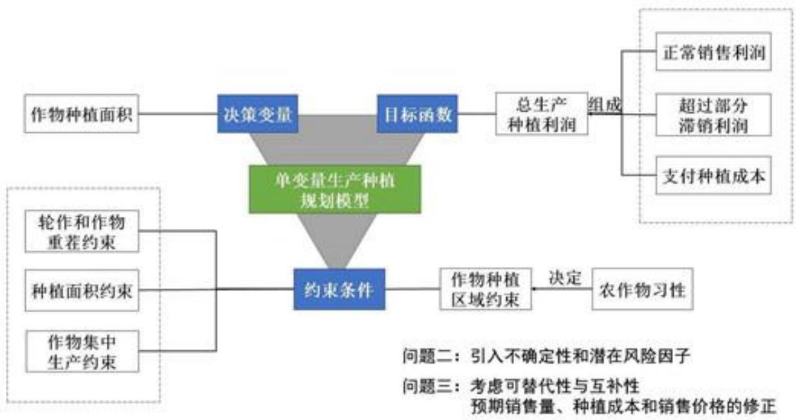

<details>
<summary>flowchart</summary>

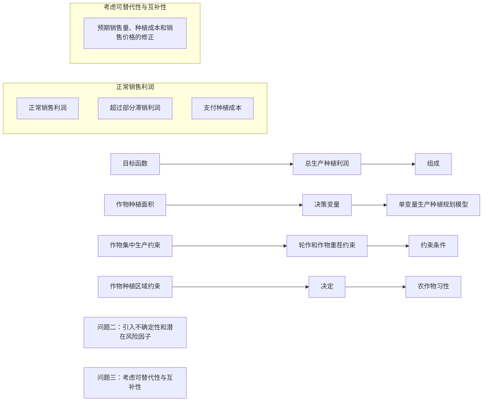
</details>

图1总思路图

## 三、模型假设

1. 假设 2023 年产销相等。  
2. 假设每种农作物种植面积不小于种植地的一半。  
3. 假设农作物未来的预期销售量、亩产量、种植成本和销售价格的年变化率满足均匀分布。  
4. 假设为了管理方便，粮食类农作物在每块耕地上仅能种植一种。

## 四、符号说明

<table><tr><td>符号</td><td>说明</td><td>单位</td></tr><tr><td> $x_{ijk}^{(p)}$ </td><td>第p年第i块耕地第j季第k种农作物所种植的面积</td><td>亩</td></tr><tr><td> $\Delta_k^{(p)}$ </td><td>第p年该乡村的第k种农作物植成本</td><td>元</td></tr><tr><td> $c_{ijk}$ </td><td>第i块耕地的第j季第k种农作物的种植成本</td><td>元/亩</td></tr><tr><td> $\Phi_k^{(p)}$ </td><td>第p年第k种农作物的正常销售收入</td><td>元</td></tr><tr><td> $w_{jk}$ </td><td>第j季第k种农作物的销售价格</td><td>元/斤</td></tr><tr><td> $u_{ijk}$ </td><td>第i块耕地第j季第k种农作物的亩产量</td><td>斤/亩</td></tr><tr><td> $S_{jk}$ </td><td>第j季第k种农作物预期的销售量</td><td>斤</td></tr><tr><td> $\Theta_k^{(p)}$ </td><td>第p年第k种农作物超出预期销售量部分的销售收入</td><td>元</td></tr><tr><td>λ</td><td>滞销利润因子</td><td>/</td></tr><tr><td>W</td><td>第2024~2030年乡村所得的利润总和</td><td>元</td></tr><tr><td>D</td><td>平旱地,山坡地与梯田耕地地块集合</td><td>/</td></tr><tr><td>L</td><td>水浇地耕地地块集合</td><td>/</td></tr><tr><td>N</td><td>普通大棚耕地地块集合</td><td>/</td></tr><tr><td>G</td><td>粮食类作物集合</td><td>/</td></tr><tr><td>R</td><td>蔬菜作物集合</td><td>/</td></tr><tr><td>F</td><td>食用菌作物集合</td><td>/</td></tr><tr><td>M</td><td>所有豆类农作物集合</td><td>/</td></tr><tr><td> $A_i$ </td><td>第i块耕地的面积大小</td><td>亩</td></tr><tr><td> $R_1$ </td><td>除去大白菜、白萝卜和红萝卜外的蔬菜集合</td><td>/</td></tr><tr><td> $\varepsilon_{\text{ek}}^{(p)}$ </td><td>第p年第k种农作物第v个指标的变化率</td><td>/</td></tr><tr><td> $[a_{uk},b_{uk}]$ </td><td>每年第k种农作物的第v指标的变化率的区间</td><td>/</td></tr><tr><td> $c_{ijk}(p)$ </td><td>第p年第i块耕地的第j季第k种农作物的种植成本</td><td>元/亩</td></tr><tr><td> $S_{jk}(p)$ </td><td>第p年第j季第k种农作物的预期销售量</td><td>斤</td></tr></table>

## 五、数据处理与分析

考虑到给出数据的复杂性，为了更好地分析与理解数据，需要在模型建立之前对数据进行分析，确保模型的准确性。根据题目要求，综合附件1与附件2的数据与信息，利用Excel工具对数据进行了多角度的整理，并提取了关键之处。

## 5.1 数据补全

## ● 智慧大棚 2023 第一季的数据补全

根据附件 2 给出的信息, 2023 年智慧大棚第一季的数据均与普通大棚第一季的相同, 利用给出的普通大棚第一季的数据将 2023 年智慧大棚第一季数据补全。

## 5.2 不同农作物对耕地类型的需求

不同的农作物需要环境差异较大，在耕地上适合的农作物有利于提高农作物的产量，从而提高该农作物的经济效益，各个农作物所需要耕地类型如下图：

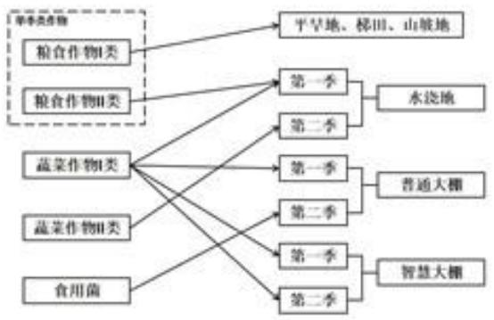

<details>
<summary>flowchart</summary>

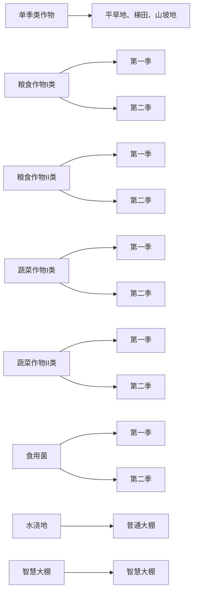
</details>

图 2 农作物所需要耕地类型图

在上图中，粮食Ⅰ型农作物包括黄豆、黑豆、红豆、绿豆、爬豆、小麦、玉米谷子、高粱、黍荞麦、南瓜、红薯、莜麦和大麦；粮食Ⅱ型农作物单指水稻；蔬菜Ⅰ型农作物包括豇豆、刀豆、芸豆、土豆、西红柿、茄子、菠菜、青椒、菜花、包菜、油麦菜、小青菜、黄瓜、生菜、辣椒、空心菜、黄心菜和芹菜；蔬菜Ⅱ型农作物包括大白菜、白萝卜和红萝卜；食用菌农作物包括榆黄菇、香菇、白灵菇和羊肚菌。

## 5.3 各个耕地季次处于的季节

季节气候对于农作物生长影响较大，考虑到自然灾害的可能性，需要得到各个耕地不同季次处于哪个季节。因为平旱地、山坡地、梯田只种植单季农作物，跨越全年季节，所以只需要统计水浇地、普通大棚和智慧大棚的情况，结果如下表：

表 1 季次对应的季节表

<table><tr><td>耕地类型</td><td colspan="2">水浇地</td><td colspan="2">普通大棚</td><td colspan="2">智慧大棚</td></tr><tr><td>季次</td><td>一季</td><td>二季</td><td>一季</td><td>二季</td><td>一季</td><td>二季</td></tr><tr><td>时间</td><td>3-6月</td><td>7-10月</td><td>5-9月</td><td>9-4月</td><td>3-7月</td><td>8-2月</td></tr><tr><td>季节</td><td>春</td><td>夏秋季</td><td>夏季</td><td>秋冬季</td><td>春夏</td><td>秋冬</td></tr></table>

## 5.4 农作物的亩产量、种植成本与销售价格

为了得到乡村农作物的总利润，需要筛选出农作物的三大指标数据，即农作物的亩产量、种植成本与销售价格，部分筛选后的数据表如下表1，2：

表 2 季次与农作物的亩产量、种植成本与销售价格（部分）

<table><tr><td>指标</td><td colspan="2">亩产量/斤</td><td colspan="2">种植成本/(元/亩)</td><td colspan="2">销售单价/(元/斤)</td></tr><tr><td>季次</td><td>第一季</td><td>第二季</td><td>第一季</td><td>第二季</td><td>第一季</td><td>第二季</td></tr><tr><td>豇豆</td><td>3600</td><td>3200</td><td>2400</td><td>2640</td><td>7.00-9.00</td><td>8.40-10.80</td></tr><tr><td>刀豆</td><td>2400</td><td>2200</td><td>1200</td><td>1320</td><td>5.50-8.00</td><td>6.60-9.60</td></tr><tr><td>芸豆</td><td>3600</td><td>3200</td><td>2400</td><td>2640</td><td>5.00-8.00</td><td>6.00-9.60</td></tr><tr><td>土豆</td><td>2400</td><td>2200</td><td>2400</td><td>2640</td><td>3.00-4.50</td><td>3.60-5.40</td></tr><tr><td>西红柿</td><td>3000</td><td>2700</td><td>2400</td><td>2640</td><td>5.00-7.50</td><td>6.00-9.00</td></tr><tr><td>茄子</td><td>8000</td><td>7200</td><td>2400</td><td>2640</td><td>5.00-6.00</td><td>6.00-7.20</td></tr><tr><td>菠菜</td><td>3300</td><td>3000</td><td>2700</td><td>3000</td><td>4.80-6.70</td><td>5.80-8.00</td></tr><tr><td>青椒</td><td>3000</td><td>2700</td><td>2000</td><td>2200</td><td>4.00-6.50</td><td>5.80-7.80</td></tr><tr><td>菜花</td><td>4000</td><td>3600</td><td>3000</td><td>3300</td><td>5.00-6.00</td><td>6.00-7.20</td></tr></table>

由上表，不同季次的亩产量、种植成本、销售单价均有所不同，进而得到种植季次对作物三个因素均有影响。

表 3 耕地类型与农作物的亩产量、种植成本与销售价格（部分）

<table><tr><td>指标</td><td colspan="2">亩产量</td><td colspan="2">种植成本</td><td colspan="2">销售单价</td></tr><tr><td>季次</td><td>水浇地</td><td>普通大棚</td><td>水浇地</td><td>普通大棚</td><td>水浇地</td><td>普通大棚</td></tr><tr><td>豇豆</td><td>3000</td><td>3600</td><td>2000</td><td>2400</td><td>7.00-9.00</td><td>7.00-9.00</td></tr><tr><td>刀豆</td><td>2000</td><td>2400</td><td>1000</td><td>1200</td><td>5.50-8.00</td><td>5.50-8.00</td></tr><tr><td>芸豆</td><td>3000</td><td>3600</td><td>2000</td><td>2400</td><td>5.00-8.00</td><td>5.00-8.00</td></tr><tr><td>土豆</td><td>2000</td><td>2400</td><td>2000</td><td>2400</td><td>3.00-4.50</td><td>3.00-4.50</td></tr><tr><td>西红柿</td><td>2400</td><td>3000</td><td>2000</td><td>2400</td><td>5.00-7.50</td><td>5.00-7.50</td></tr><tr><td>茄子</td><td>6400</td><td>8000</td><td>2000</td><td>2400</td><td>5.00-6.00</td><td>5.00-6.00</td></tr><tr><td>菠菜</td><td>2700</td><td>3300</td><td>2300</td><td>2700</td><td>4.80-6.70</td><td>4.80-6.70</td></tr><tr><td>青椒</td><td>2400</td><td>3000</td><td>1600</td><td>2000</td><td>4.00-6.50</td><td>4.00-6.50</td></tr><tr><td>菜花</td><td>3300</td><td>4000</td><td>2400</td><td>3000</td><td>5.00-6.00</td><td>5.00-6.00</td></tr></table>

由上表，作物在同一季次不同耕地的亩产量和种植成本不同，但销售单价均保持不变，所以可认定耕地类型影响亩产量和种植成本，但不影响销售单价。

同时，每种农作物每个季次的销售价格均为范围值。为了方便计算，本文根据中华人民共和国农村农业部对农产品市场交易价格的常规描述方法[1]，使用每个季次价格的平均值作为该季次的销售价格。

## 5.5 2023年农作物每季次的预期销售量与单位利润

由题意可得 2023 年农作物每季次的产量作为以后年份初始的预期销售量，为了得到 2023 年的预期销售量，本文假设 2023 年所有农作物全部卖出，其季次总产量如下表：

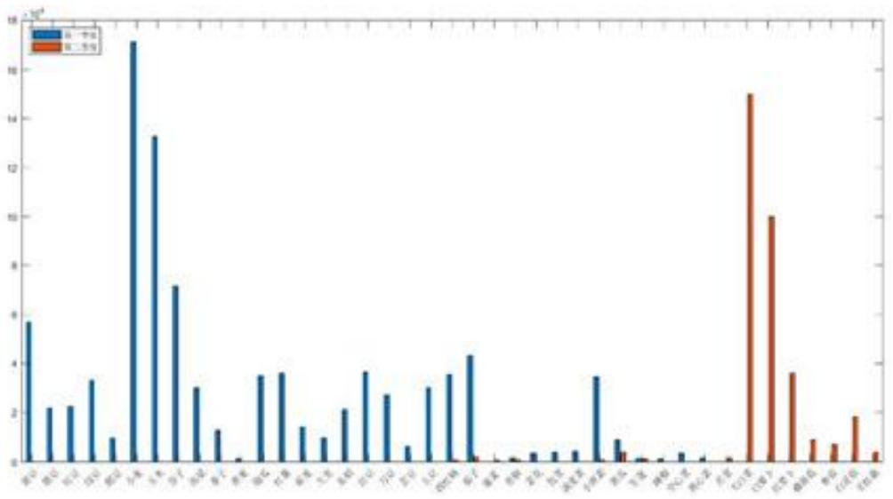

<details>
<summary>bar</summary>

| Category | Value (x 10^-4) |
| --- | --- |
| 第一组 | ~5.8 |
| 第二组 | ~2.2 |
| 第三组 | ~2.3 |
| 第四组 | ~3.4 |
| 第五组 | ~1.0 |
| 第六组 | ~17.2 |
| 第七组 | ~13.3 |
| 第八组 | ~7.2 |
| 第九组 | ~3.0 |
| 第十组 | ~1.4 |
| 第十一组 | ~0.2 |
| 第十二组 | ~3.5 |
| 第十三组 | ~3.6 |
| 第十四组 | ~1.5 |
| 第十五组 | ~1.0 |
| 第十六组 | ~2.1 |
| 第十七组 | ~3.7 |
| 第十八组 | ~2.7 |
| 第十九组 | ~0.7 |
| 第二十组 | ~3.0 |
| 第二十一组 | ~3.6 |
| 第二十二组 | ~4.4 |
| 第二十三组 | ~0.2 |
| 第二十四组 | ~0.1 |
| 第二十五组 | ~0.4 |
| 第二十六组 | ~0.5 |
| 第二十七组 | ~0.5 |
| 第二十八组 | ~3.5 |
| 第二十九组 | ~0.9 |
| 第三十组 | ~0.2 |
| 第三十一组 | ~0.1 |
| 第三十二组 | ~0.4 |
| 第三十三组 | ~0.2 |
| 第三十四组 | ~0.1 |
| 第三十五组 | ~15.0 |
| 第三十六组 | ~10.0 |
| 第三十七组 | ~3.6 |
| 第三十八组 | ~0.9 |
| 第三十九组 | ~0.8 |
| 第四十组 | ~1.9 |
| 第四十一组 | ~0.5 |
</details>

图 3 2023 年农作物每季次的预期销售量图

为了获得更多的经济效益，乡村应该在有条件的情况下种植更的的高利润的农作物，因此需要统计得到农作物在不同季次下的单位利润（元/亩）如下图：

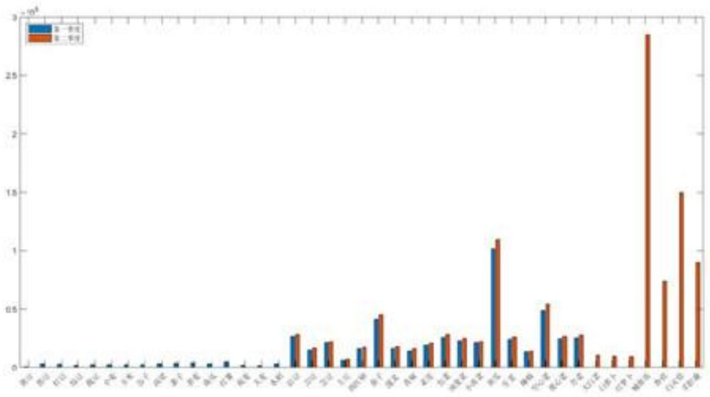

<details>
<summary>bar</summary>

| Category | Series 1 (Blue) | Series 2 (Orange) |
| --- | --- | --- |
| 第1组 | ~0.05 | ~0.05 |
| 第2组 | ~0.03 | ~0.03 |
| 第3组 | ~0.02 | ~0.02 |
| 第4组 | ~0.02 | ~0.02 |
| 第5组 | ~0.02 | ~0.02 |
| 第6组 | ~0.02 | ~0.02 |
| 第7组 | ~0.02 | ~0.02 |
| 第8组 | ~0.02 | ~0.02 |
| 第9组 | ~0.02 | ~0.02 |
| 第10组 | ~0.02 | ~0.02 |
| 第11组 | ~0.02 | ~0.02 |
| 第12组 | ~0.02 | ~0.02 |
| 第13组 | ~0.02 | ~0.02 |
| 第14组 | ~0.02 | ~0.02 |
| 第15组 | ~0.02 | ~0.02 |
| 第16组 | ~0.02 | ~0.02 |
| 第17组 | ~0.28 | ~0.30 |
| 第18组 | ~0.15 | ~0.18 |
| 第19组 | ~0.22 | ~0.23 |
| 第20组 | ~0.08 | ~0.15 |
| 第21组 | ~0.18 | ~0.19 |
| 第22组 | ~0.42 | ~0.45 |
| 第23组 | ~0.18 | ~0.19 |
| 第24组 | ~0.15 | ~0.17 |
| 第25组 | ~0.21 | ~0.22 |
| 第26组 | ~0.28 | ~0.30 |
| 第27组 | ~0.23 | ~0.25 |
| 第28组 | ~1.02 | ~1.10 |
| 第29组 | ~0.24 | ~0.27 |
| 第30组 | ~0.15 | ~0.16 |
| 第31组 | ~0.48 | ~0.55 |
| 第32组 | ~0.25 | ~0.28 |
| 第33组 | ~0.26 | ~0.30 |
| 第34组 | — | ~0.11 |
| 第35组 | — | ~0.11 |
| 第36组 | — | ~0.11 |
| 第37组 | — | ~2.85 |
| 第38组 | — | ~0.75 |
| 第39组 | — | ~1.50 |
| 第40组 | — | ~0.90 |
</details>

图 4 2023 年不同季次下农作物的单位利润图

从上图可知，食用菌类的利润>蔬菜类的利润>粮食类的单位利润。在食用菌类中榆黄菇的利润最高，白灵菇利润其次；在蔬菜类中黄瓜利润最高，空心菜利润其次。

## 六、模型的建立与求解

## 6.1 问题一模型的建立与求解

## 6.1.1 决策变量的确定

本文以每年每季每块耕地所种农作物的数量为决策变量，设：

$$
x _ {i j k} ^ {(p)} \geqslant 0 \tag {1}
$$

其中， $x_{ijk}^{p}$ 表示第 p 年第 i 块耕地第 j 季第 k 种农作物所种植的面积（亩），其大于等于 0； $p=2023,2024,\cdots,2030$ 表示年份： $i=1,2,\cdots,54$ 表示耕地，其数字对应于附件 1 所给的耕地从上往下排序：j=1,2 表示第一季与第二季； $k=1,2,\cdots,41$ 表示作物编号。

根据题中所给信息，某些农作物为单季作物，无法进行第二季的种植，因此我们规定：

$$
x _ {i 2 k} ^ {(p)} = 0 \quad k = 1, 2 \dots 1 6 \tag {2}
$$

## 6.1.2 利润最大化目标

该乡村优化种植策略的主要目标是利用有限的耕地资源获得更多的经济效益，因此本文以该乡村2024\~2030年总利润最大化为作为模型的目标。

首先考虑每年该乡村的某种农作物的种植成本，有：

$$
\Delta_ {k} ^ {(p)} = \sum_ {i = 1} ^ {5 4} \sum_ {j = 1} ^ {2} c _ {i j k} x _ {i j k} ^ {(p)} \tag {3}
$$

其中， $\Delta_{k}^{(p)}$ 表示第 p 年该乡村的第 k 种农作物植成本（元）； $c_{ijk}$ 表示第 i 块耕地的第 j 季第 k 种农作物的种植成本（元/亩）；

再考虑每年该乡村的某种农作物的销售收入（元），有：

$$
\Phi_ {k} ^ {(p)} = \sum_ {j = 1} ^ {2} w _ {j k} \min \left\{\sum_ {i = 1} ^ {5 4} u _ {i j k} x _ {i j k} ^ {(p)}, S _ {j k} \right\} \tag {4}
$$

其中， $\Phi_{k}^{(p)}$ 第p年第k种农作物的正常销售收入（元）； $w_{jk}$ 表示第j季第k种农作物的销售价格（元/斤）； $u_{ijk}$ 表示第i块耕地第j季第k种农作物的亩产量（斤/亩）； $S_{jk}$ 表示第j季第k种农作物预期的销售量，根据假设，这里使用的2023年的销售量作为以后每年的固定预期销售量；min在这里表示取2者更小的一个，即满足最多卖出预期销售量。若农作物产量超出预期，则超出部分有2种处理方案：（1）超过部分滞销，造成浪费；（2）超过部分按2023年销售价格的50%降价出售。因此有每年某种农作物超过预期销售量部分的销售收入如下：

$$
\Theta_ {k} ^ {(p)} = \lambda \sum_ {j = 1} ^ {2} w _ {j k} \max \left\{\sum_ {i = 1} ^ {5 4} u _ {i j k} x _ {i j k} ^ {(p)} - S _ {j k}, 0 \right\} \tag {5}
$$

其中， $\Theta_{k}^{(p)}$ 第p年第k种农作物超出预期销售量部分的销售收入（元）； $\lambda$ 表示滞销利润因子，本题为常数0或者0.5，分别代表第一种处理方案与第二种处理方案。

综上，模型的最终目标为：

$$
W = \sum_ {p = 2 0 2 4} ^ {2 0 3 0} \sum_ {k = 1} ^ {4 1} \left(\Phi_ {k} ^ {(p)} + \Theta_ {k} ^ {(p)} - \Delta_ {k} ^ {(p)}\right) \tag {6}
$$

其中，W 表示第 2024\~2030 年乡村所得的利润总和（元）。

## 6.1.3 约束条件

为了更好的描述约束条件，本文进行耕地与农作物集合进行了更细致的划分。本文将耕地集合分为了3类如下：

1. $D=\{i|i=1,2,\cdots,26\}$ 表示平旱地，山坡地与梯田3种类型的所有耕地地块。  
2. $L=\{i|i=27,28,\cdots,34\}$ 表示水浇地的所有耕地地块。  
3. $N=\{i|i=35,36,\cdots,50\}$ 表示普通大棚的所有耕地地块。  
4. $Z=\{i|i=51,52,\cdots,54\}$ 表示智慧大棚的所有耕地地块。

再将作物集合分为3类：

1. $G=\{k \mid k=1,2,\cdots,15\}$ 表示粮食类作物集合（除水稻外）。 $G \cup \{k=16\}$ 表示全部粮食作物集合。  
2. $R=\{k \mid k=17,18,\cdots,37\}$ 表示蔬菜作物集合。  
3. $F=\{k\mid k=38,39,40,41\}$ 表示食用菌作物集合。  
4. $M=\{k\mid k=1,2\cdots5,17,18,19\}$ 表示所有豆类农作物集合。

约束1：耕地面积限制。

$$
\sum_ {k = 1} ^ {n} x _ {i j k} ^ {(p)} \leqslant A _ {i} \tag {7}
$$

其中， $A_{i}$ 表示第 i 块耕地的面积大小（亩）。

约束2：每种作物在单个耕地种植的面积不宜太小。

$$
x _ {i j k} ^ {(p)} \geqslant \frac {1}{2} A _ {i} \operatorname{sgn} \left(x _ {i j k} ^ {(p)}\right) \tag {8}
$$

其中，根据实际土地划分与附件2所给情况，本文假设每种农作物种植面积不应小于其所在耕地面积的一半； $A_{i}$ 表示第i块耕地的面积大小（亩）；sgn()表示符号函数（阶跃函数），其目的是当 $x_{ijk}^{(p)}=0$ 即该农作物不种植时，也能满足该条约束。

约束3：每种作物每季的种植地不能太分散。

由于平旱地、山坡地和梯田地形复杂且面积普遍就大，为了种植地能太分散，这些类型的耕地上仅能种植一种类型的农作物，所有：

$$
\sum_ {k} \operatorname{sgn} \left(x _ {i j k} ^ {(p)}\right) \leqslant 1, i \in D \tag {9}
$$

其中，D 表示平旱地，山坡地与梯田 3 种类型的所有耕地地块； $\mathrm{sgn}(x_{ijk}^{(p)})$ 表示是否在第 p 年第 i 块耕地的第 j 季种植 k 种农作物。

约束 4: 每种作物在同一耕地都不能连续重茬种植。

因为农作物有一季类和二季类，所以不能连续重茬种植存在以下3种情况：

a) 相邻年份之间不能种相同的一季类农作物。

$$
x _ {i 1 k} ^ {(p)} x _ {i 1 k} ^ {(p + 1)} = 0 \quad k \in (G \cup \{k = 1 6 \}) \tag {10}
$$

其中， $G \cup \{k=16\}$ 表示包括水稻的所有粮食类农作物集合。

b) 同一年份的两季不能种相同的两季类农作物。

$$
x _ {i 1 k} ^ {(p)} x _ {i 2 k} ^ {(p)} = 0 \quad k \in R \tag {11}
$$

其中，R表示所有蔬菜农作物集合。

c) 今年的第二季与明年的第一季不能种相同的两季类农作物。

$$
x _ {i 2 k} ^ {(p)} x _ {i 1 k} ^ {(p + 1)} = 0 \quad k \in R \tag {12}
$$

其中，R 表示所有蔬菜农作物。

约束5：每块耕地三年内至少种植一次豆类作物。

$$
\sum_ {t = 0} ^ {2} \sum_ {k \in M} x _ {i j k} ^ {(p + t)} > 0 \tag {13}
$$

其中，M 表示所有豆类农作物。

约束6：除水稻外，一季种植粮食类作物仅种植在平旱地、梯田和山坡地。

$$
\sum_ {k \in G} x _ {i j k} ^ {(p)} = 0 i \notin D \tag {14}
$$

其中，G 表示除水稻外的所有粮食类农作物；D 表示平旱地、梯田和山坡地所有耕地。

约束7：平旱地、梯田和山坡地仅种植除水稻外的一季粮食类作物。

$$
\sum_ {k \notin G} x _ {i j k} ^ {(p)} = 0 i \in D \tag {15}
$$

其中，G 表示除水稻外的所有粮食类农作物；D 表示平旱地、梯田和山坡地所有耕地。

约束8：水稻只种在水浇地。

$$
x _ {i 1 (1 6)} ^ {(p)} = 0 \quad i \notin L \tag {16}
$$

其中， $x_{i1(16)}^{(p)}$ 表示水稻在水浇地种植的面积；L 表示水浇地的所有耕地。

约束9：水浇地每年可以单季种植水稻或两季种植蔬菜作物。

$$
x _ {i 1 (1 6)} ^ {(p)} \left(\sum_ {j = 1} ^ {2} \sum_ {k \in R} x _ {i j k} ^ {(p)}\right) = 0 \quad i \in L \tag {17}
$$

其中， $x_{i1(16)}^{(p)}$ 表示水稻在水浇地种植的面积；R 表示所有能进行两季种植的蔬菜；L 表示水浇地的所有耕地。

约束 10: 在水浇地种植两季蔬菜, 则第一季只能种植除大白菜、白萝卜和红萝卜外的蔬菜, 第二季只能种植大白菜、白萝卜和红萝卜3种蔬菜。

$$
\sum_ {k \in R / R _ {1}} x _ {i 1 k} ^ {(p)} + \sum_ {k \in R _ {1}} x _ {i 2 k} ^ {(p)} = 0, i \in L \tag {18}
$$

其中，第一项表示大白菜、白萝卜和红萝卜在水浇地第一季的种植面积为0，第二项表示除大白菜、白萝卜和红萝卜外的蔬菜在水浇地第二季的种植面积为0。

同时为了方便管理，大白菜、白萝卜和红萝卜3种蔬菜仅能选择一种进行种植，有：

$$
\sum_ {k \in R / R _ {1}} \operatorname{sgn} (x _ {i 2 k} ^ {(p)}) \leqslant 1 \quad i \in L \tag {19}
$$

其中， $R_{1}=R/\{k=35,36,37\}$ 表示除去大白菜、白萝卜和红萝卜外所有能进行两季种植的蔬菜； $R/R_{1}$ 表示大白菜、白萝卜和红萝卜3种蔬菜；L表示水浇地的所有耕地。

约束11：大白菜、白萝卜和红萝卜只能在水浇地的第二季种植。

$$
\sum_ {i \in L, k \in R / R _ {1}} x _ {i 1 k} ^ {(p)} + \sum_ {j = 1} ^ {2} \sum_ {i \notin L, k \in R / R _ {1}} x _ {i j k} ^ {(p)} = 0 \tag {20}
$$

其中，L 表示水浇地的所有耕地； $R/R_{1}$ 表示大白菜、白萝卜和红萝卜3种蔬菜。第一项表示大白菜、白萝卜和红萝卜3种蔬菜在所有水浇地上第一季的种植面积为0，第二项表示大白菜、白萝卜和红萝卜3种蔬菜在不是水浇地上的任意季的种植也为0。

约束 12: 在普通大棚种植两季蔬菜, 则第一季只能种植除大白菜、白萝卜和红萝卜外的蔬菜, 第二季只能种植食用菌。

$$
\sum_ {k \in R / R _ {1}} x _ {i 1 k} ^ {(p)} + \sum_ {k \notin F} x _ {i 2 k} ^ {(p)} = 0, i \in N \tag {21}
$$

其中，N 表示普通大棚的所有耕地地块；F 表示食用菌作物集合。第一项表示大白菜、白萝卜和红萝卜在普通大棚第一季的种植面积为 0，第二项表示除食用菌外所有农作物在普通大棚的二季种植面积为 0。

约束 13：食用菌类只能种植在第二季的普通大棚里。

$$
\sum_ {i \in N, k \in F} x _ {i 1 k} ^ {(p)} + \sum_ {j = 1} ^ {2} \sum_ {i \in N, k \in F} x _ {i j k} ^ {(p)} = 0 \tag {22}
$$

其中，N 表示普通大棚的所有耕地地块；F 表示食用菌作物集合。第一项表示食用菌在普通大棚第一季的植面积为 0，第二项表示食用菌在其他耕地的任意季的种植面积都为 0。

约束14: 智慧大棚可以种植两季蔬菜，且不能种植大白菜、白萝卜和红萝卜。

$$
x _ {i j k} ^ {(p)} \geqslant 0, i \in Z, k \in R; x _ {i j k} ^ {(p)} = 0, i \in Z, k \in R / R _ {1} \tag {23}
$$

其中，Z 表示智慧大棚集合；R 表示蔬菜集合； $R/R_{1}$ 表示大白菜、白萝卜和红萝卜。

## 6.1.4 模型汇总

综上，本文建立了以乡村 2024 年\~2030 年总利润为目标的农作物最优策略模型如下：

$$
\text {s.t.} = \left\{ \begin{array}{c} W = \sum_ {p = 2 0 2 4} ^ {2 0 3 0} \sum_ {k = 1} ^ {4 1} \left(\Phi_ {k} ^ {(p)} + \Theta_ {k} ^ {(p)} - \Delta_ {k} ^ {(p)}\right) \\ \Delta_ {k} ^ {(p)} = \sum_ {i = 1} ^ {5 4} \sum_ {j = 1} ^ {2} c _ {i j k} x _ {i j k} ^ {(p)} \\ \Phi_ {k} ^ {(p)} = \sum_ {j = 1} ^ {2} w _ {j k} \min \left\{\sum_ {i = 1} ^ {5 4} u _ {i j k} x _ {i j k} ^ {(p)}, S _ {j k} \right\} \\ \Theta_ {k} ^ {(p)} = \lambda \sum_ {j = 1} ^ {2} w _ {j k} \max \left\{\sum_ {i = 1} ^ {5 4} u _ {i j k} x _ {i j k} ^ {(p)} - S _ {j k}, 0 \right\} \\ x _ {i j k} ^ {(p)} = 0 \quad k = 1, 2 \dots 1 6 \\ x _ {i i k} ^ {(p)} x _ {i 2 k} ^ {(p)} = 0 \quad k \in R \\ x _ {i 2 k} ^ {(p)} x _ {i 1 k} ^ {(p + 1)} = 0 \quad k \in R \\ x _ {i 1 k} ^ {(p)} x _ {i 1 k} ^ {(p + 1)} = 0 \quad k \in (G \cup \{k = 1 6 \}) \\ \sum_ {k \in G} x _ {i j k} ^ {(p)} = 0 \quad i \notin D; \\ x _ {i 1 (1 5)} ^ {(p)} \left(\sum_ {j = 1} ^ {2} \sum_ {k \in R} x _ {i j k} ^ {(p)}\right) = 0 \quad i \in L \\ \sum_ {k \in R / R _ {1}} x _ {i 1 k} ^ {(p)} + \sum_ {k \in R _ {1}} x _ {i 2 k} ^ {(p)} = 0, i \in L \\ \sum_ {k \in R / R _ {1}} x _ {i 1 k} ^ {(p)} + \sum_ {k \in F} x _ {i 2 k} ^ {(p)} = 0, i \in N \\ \sum_ {i \in N, k \in F} x _ {i 1 k} ^ {(p)} + \sum_ {j = 1} ^ {2} \sum_ {i \in N, k \in F} x _ {i j k} ^ {(p)} = 0 \\ \sum_ {i \in L, k \in R / R _ {1}} x _ {i 1 k} ^ {(p)} + \sum_ {j = 1} ^ {2} \sum_ {i \in L, k \in R / R _ {1}} x _ {i j k} ^ {(p)} = 0 \\ \sum_ {k \in G} x _ {i j k} ^ {(p)} = 0 \quad i \in D; x _ {i 1 (1 6)} ^ {(p)} = 0 \quad i \notin L \\ x _ {i j k} ^ {(p)} \geqslant \frac {1}{2} A _ {i} \operatorname{sgn} (x _ {i j k} ^ {(p)}) \\ \sum_ {t = 0} ^ {2} \sum_ {k \in M} x _ {i j k} ^ {(p + t)} > 0; \\ \sum_ {k \in R / R _ {1}} \operatorname{sgn} (x _ {i j k} ^ {(p)}) \leqslant 1 \quad i \in L \\ \sum_ {k = 1} ^ {\mathrm{n}} x _ {\mathrm{ijk}} ^ {(p)} \leqslant A _ {i}; \sum_ {k} \operatorname{sgn} (x _ {\mathrm{ijk}} ^ {(p)}) \leqslant 1, i \in D \\ x _ {\mathrm{ijk}} ^ {(p)} \geqslant 0; x _ {\mathrm{ijk}} ^ {(p)} = 0, i \in Z, k \in R / R _ {1} \\ M = \{k | k = 1, 2, \dots , 5, 1 7, 1 8, 1 9 \} \\ D = \{i | i = 1, 2, \dots , 2 6 \}; L = \{i | i = 2 7, 2 8, \dots , 3 4 \} \\ N = \{i | i = 3 5, 3 6, \dots , 5 0 \}; G = \{k | k = 1, 2, \dots , 1 5 \} \\ R _ {1} = R / (k = 3 5, 3 6, 3 7); Z = (i | i = 5 1, 5 2, \dots , 5 4) \\ R = (k | k = 1 7, 1 8, \dots , 3 7); F = (k | k = 3 8, 3 9, 4 0, 4 1) \end{array} \right. (2 4)
$$

## 6.1.5 单目标优化模型的求解与分析

为了求解该优化模型，本文采取了遗传算法进行求解，其步骤如下：

Step1. 确定编码规则: 将该问题的候选解集用染色体表示, 每一个染色体个体能代表种植方案, 即每年每季每块耕地所种农作物的面积。判断个体满足可行性的流程图如下:

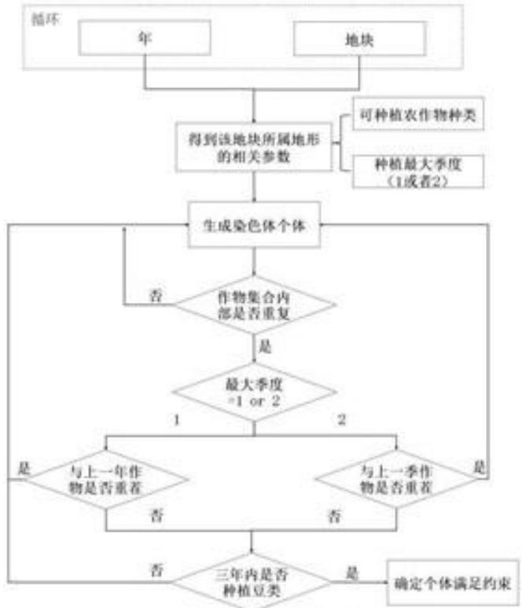

<details>
<summary>flowchart</summary>

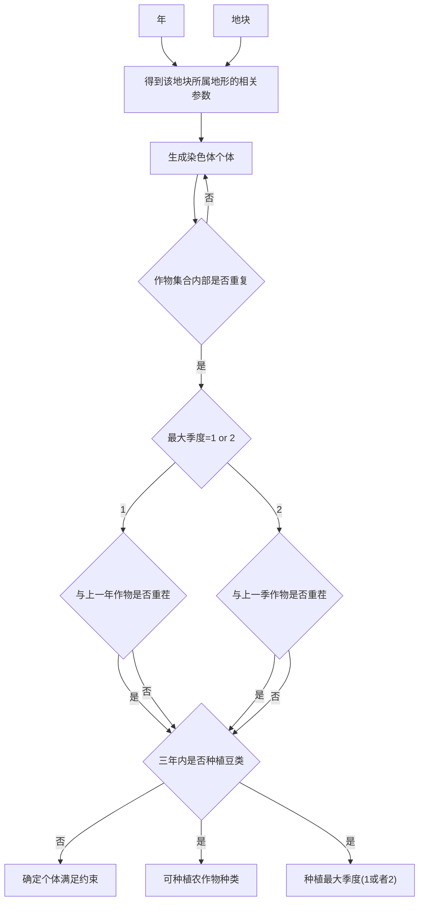
</details>

图 5 验证可行性流程图

Step2. 确定适应度函数：适应度函数即目标函数，2024\~2030年乡村所得的利润总和（元）。

$$
W = \sum_ {p = 2 0 2 4} ^ {2 0 3 0} \sum_ {k = 1} ^ {4 1} (\varPhi_ {k} ^ {(p)} + \varTheta_ {k} ^ {(p)} - \varDelta_ {k} ^ {(p)}) \tag {25}
$$

Step3.父代种群初始化: 产生代表问题可能潜在解集的一个初始群体 $\tau$ , 这里我们将种群规模设定为 100, 生成父代种群。转至 Step5。

Step4. 早熟判断：判断当前种群内部是否存在早熟现象，即若当前种群的最优适应度值对应的个体数量超过该种群规模的 $10\%$ ，则表明可能存在收敛于局部最优解的情况。若存在早熟现象则在当前父代种群中插入一批新生成的基因序列个体后，重新进行适应度计算并排序。

Step5.子代的生成：对父代进行选择、交叉和变异进化后进行生成子代种群，选择规则为优先选择适应度函数最小的交叉，其中交叉和变异需满足模型约束条件，我们将进化次数设定为200，变异概率设定为10%。

Step6.合并：父代与子代合并，再次根据适应度函数进行排序，最终根据所设定的种群规模大小进行淘汰，生成新一代的种群。

Step7. 判断进化次数是否达到最大进化次数，若达到则退出，得到农作物种植最优方案，否则转至 Step4。

最终，问题一结果如下：

## > 情况一

情况一为超出预期销售量的部分浪费。最优种植方案从2024年到2030年的总利润为：29276719.5元，其进化曲线如图：

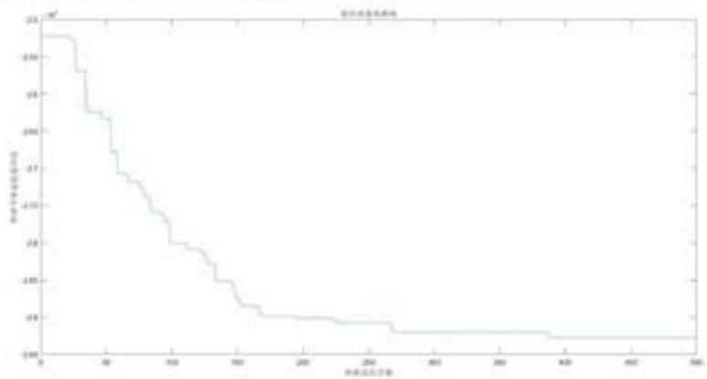

<details>
<summary>survival</summary>

| 时间 (天) | 持续生存率 (%) |
| --- | --- |
| 0 | ~25.3 |
| 10 | ~25.3 |
| 20 | ~24.6 |
| 30 | ~24.4 |
| 40 | ~23.8 |
| 50 | ~23.7 |
| 60 | ~23.5 |
| 70 | ~23.3 |
| 80 | ~23.1 |
| 90 | ~22.9 |
| 100 | ~22.8 |
| 110 | ~22.7 |
| 120 | ~22.6 |
| 130 | ~22.5 |
| 140 | ~22.4 |
| 150 | ~22.3 |
| 160 | ~22.1 |
| 170 | ~21.9 |
| 180 | ~21.8 |
| 190 | ~21.7 |
| 200 | ~21.6 |
| 210 | ~21.5 |
| 220 | ~21.4 |
| 230 | ~21.3 |
| 240 | ~21.2 |
| 250 | ~21.1 |
| 260 | ~21.0 |
| 270 | ~20.9 |
| 280 | ~20.8 |
| 290 | ~20.7 |
| 300 | ~20.6 |
| 310 | ~20.5 |
| 320 | ~20.4 |
| 330 | ~20.3 |
| 340 | ~20.2 |
| 350 | ~20.1 |
| 360 | ~20.0 |
| 370 | ~19.9 |
| 380 | ~19.8 |
| 390 | ~19.7 |
| 400 | ~19.6 |
| 410 | ~19.5 |
| 420 | ~19.4 |
| 430 | ~19.3 |
| 440 | ~19.2 |
| 450 | ~19.1 |
| 460 | ~19.0 |
| 470 | ~18.9 |
| 480 | ~18.8 |
| 490 | ~18.7 |
| 500 | ~18.6 |
| 510 | ~18.5 |
| 520 | ~18.4 |
| 530 | ~18.3 |
| 540 | ~18.2 |
| 550 | ~18.1 |
| 560 | ~18.0 |
| 570 | ~17.9 |
| 580 | ~17.8 |
| 590 | ~17.7 |
| 600 | ~17.6 |
| 610 | ~17.5 |
| 620 | ~17.4 |
| 630 | ~17.3 |
| 640 | ~17.2 |
| 650 | ~17.1 |
| 660 | ~17.0 |
| 670 | ~16.9 |
| 680 | ~16.8 |
| 690 | ~16.7 |
| 700 | ~16.6 |
| 710 | ~16.5 |
| 720 | ~16.4 |
| 730 | ~16.3 |
| 740 | ~16.2 |
| 750 | ~16.1 |
| 760 | ~16.0 |
| 770 | ~15.9 |
| 780 | ~15.8 |
| 790 | ~15.7 |
| 800 | ~15.6 |
| 810 | ~15.5 |
| 820 | ~15.4 |
| 830 | ~15.3 |
| 840 | ~15.2 |
| 850 | ~15.1 |
| 860 | ~15.0 |
| 870 | ~14.9 |
| 880 | ~14.8 |
| 890 | ~14.7 |
| 900 | ~14.6 |
| 910 | ~14.5 |
| 920 | ~14.4 |
| 930 | ~14.3 |
| 940 | ~14.2 |
| 950 | ~14.1 |
| 960 | ~14.0 |
| 970 | ~13.9 |
| 980 | ~13.8 |
| 990 | ~13.7 |
| 1000 | ~13.6 |
| 1010 | ~13.5 |
| 1020 | ~13.4 |
| 1030 | ~13.3 |
| 1040 | ~13.2 |
| 1050 | ~13.1 |
| 1060 | ~13.0 |
| 1070 | ~12.9 |
| 1080 | ~12.8 |
| 1090 | ~12.7 |
| 1100 | ~12.6 |
| 1110 | ~12.5 |
| 1120 | ~12.4 |
| 1130 | ~12.3 |
| 1140 | ~12.2 |
| 1150 | ~12.1 |
| 1160 | ~12.0 |
| 1170 | ~11.9 |
| 1180 | ~11.8 |
| 1190 | ~11.7 |
| 1200 | ~11.6 |
| 1210 | ~11.5 |
| 1220 | ~11.4 |
| 1230 | ~11.3 |
| 1240 | ~11.2 |
| 1250 | ~11.1 |
| 1260 | ~11.0 |
| 1270 | ~10.9 |
| 1280 | ~10.8 |
| 1290 | ~10.7 |
| 1300 | ~10.6 |
| 1310 | ~10.5 |
| 1320 | ~10.4 |
| 1330 | ~10.3 |
| 1340 | ~10.2 |
| 1350 | ~10.1 |
| 1360 | ~10.0 |
| 1370 | ~9.9 |
| 1380 | ~9.8 |
| 1390 | ~9.7 |
| 1400 | ~9.6 |
| 1410 | ~9.5 |
| 1420 | ~9.4 |
| 1430 | ~9.3 |
| 1440 | ~9.2 |
| 1450 | ~9.1 |
| 1460 | ~9.0 |
| 1470 | ~8.9 |
| 1480 | ~8.8 |
| 1490 | ~8.7 |
| 1500 | ~8.6 |
| 1510 | ~8.5 |
| 1520 | ~8.4 |
| 1530 | ~8.3 |
| 1540 | ~8.2 |
| 1550 | ~8.1 |
| 1560 | ~8.0 |
| 1570 | ~7.9 |
| 1580 | ~7.8 |
| 1590 | ~7.7 |
| 1600 | ~7.6 |
| 1610 | ~7.5 |
| 1620 | ~7.4 |
| 1630 | ~7.3 |
| 1640 | ~7.2 |
| 1650 | ~7.1 |
| 1660 | ~7.0 |
| 1670 | ~6.9 |
| 1680 | ~6.8 |
| 1690 | ~6.7 |
| 1700 | ~6.6 |
| 1710 | ~6.5 |
| 1720 | ~6.4 |
| 1730 | ~6.3 |
| 1740 | ~6.2 |
| 1750 | ~6.1 |
| 1760 | ~6.0 |
| 1770 | ~5.9 |
| 1780 | ~5.8 |
| 1790 | ~5.7 |
| 1800 | ~5.6 |
| 1810 | ~5.5 |
| 1820 | ~5.4 |
| 1830 | ~5.3 |
| 1840 | ~5.2 |
| 1850 | ~5.1 |
| 1860 | ~5.0 |
| 1870 | ~4.9 |
| 1880 | ~4.8 |
| 1890 | ~4.7 |
| 1900 | ~4.6 |
| 19<ecel><nl>

</details>

图 6 情况 1 进化曲线图

从上图中，可以发生进化曲线逐渐趋于平稳，证明该解逐渐收敛，再作出其逐年利润如下图：

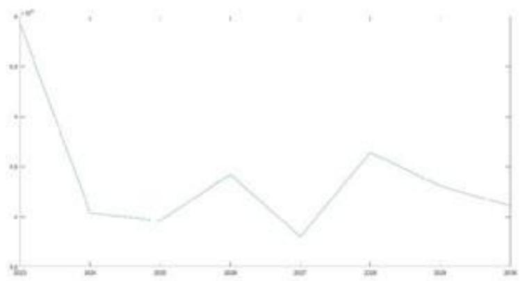

<details>
<summary>line</summary>

| Category | Value |
| --- | --- |
| 2013 | ~9.8 |
| 2014 | ~2.0 |
| 2015 | ~1.9 |
| 2016 | ~3.4 |
| 2017 | ~1.7 |
| 2018 | ~4.3 |
| 2019 | ~3.3 |
| 2020 | ~2.1 |
</details>

图 7 2023 年\~2030 年利润折线图

由于农作物不能连续种植的影响，所以高利润的年数将至少相隔一年，而上图中的结果满足了这种情况，说明了结果的合理性。而题中假设2023的预期销售量作为每年的预期销售量，情况1又是产量超出预期销售量的部分直接舍弃，所以当一种作物产量超出其预期销售量时直接造成亏损，因此2023年后每年每种作物的总产量不应超过预期销售量过多，每年利润应该在2023年利润的一定范围内，从上文折线图中也不难看出这种情况。再假设一种极端情况，2025、2027、2029年的方案与2023方案尽可能相同利润相近，剩下的年份仅补充豆类作物忽略利润，在这种极端情况下其利润大致为2023年利润的3倍1788万元，而本文方案总利润为：29276719.5元远远大于该值，进一步说明了方案的合理性与优越性。

## > 情况二

情况二为超出的部分按 $50\%$ 的价格进行出售。最优种植方案从2024年到2030年的总利润为：42837286.75元，其进化曲线图如下：

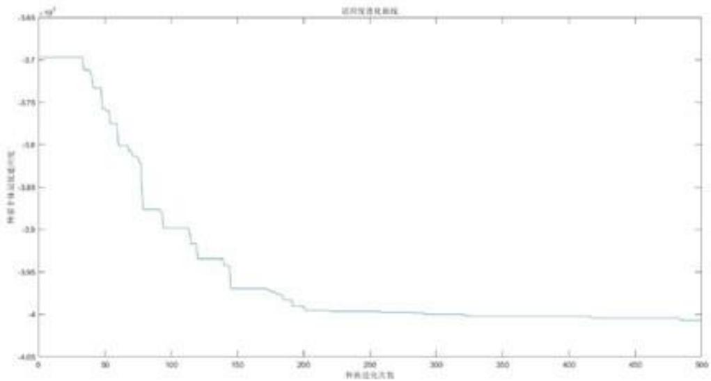

<details>
<summary>line</summary>

| 种潜进化次数 | 渗透率 (g^-1) |
| --- | --- |
| 0 | -3.7 |
| ~40 | -3.7 |
| ~50 | -3.72 |
| ~60 | -3.78 |
| ~70 | -3.8 |
| ~80 | -3.82 |
| ~90 | -3.88 |
| ~100 | -3.9 |
| ~110 | -3.92 |
| ~120 | -3.94 |
| ~130 | -3.94 |
| ~140 | -3.97 |
| ~150 | -3.97 |
| ~160 | -3.97 |
| ~170 | -3.98 |
| ~180 | -3.99 |
| ~190 | -4 |
| ~200 | -4 |
| ~250 | -4 |
| ~300 | -4 |
| ~350 | -4 |
| ~400 | -4 |
| ~450 | -4 |
| ~500 | -4.01 |
</details>

图8情况2利润进化曲线

从上图中，可以发生进化曲线逐渐趋于平稳，证明该解逐渐收敛，再提取利润最大的年份的各种农作物销量如下图：

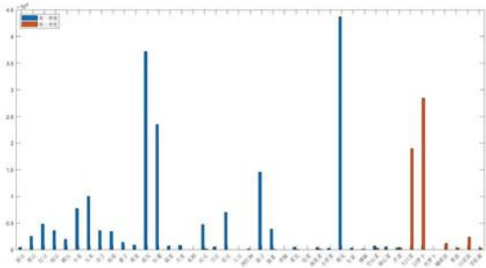

<details>
<summary>bar</summary>

| Category | Blue Series | Orange Series |
| --- | --- | --- |
| 01-12 | ~0.05 | — |
| 03-12 | ~0.25 | — |
| 05-12 | ~0.5 | — |
| 07-12 | ~0.35 | — |
| 09-12 | ~0.2 | — |
| 11-12 | ~0.75 | — |
| 01-13 | ~1.0 | — |
| 03-13 | ~0.35 | — |
| 05-13 | ~0.35 | — |
| 07-13 | ~0.15 | — |
| 09-13 | ~0.1 | — |
| 11-13 | ~3.7 | — |
| 01-14 | ~2.4 | — |
| 03-14 | ~0.1 | — |
| 05-14 | ~0.1 | — |
| 07-14 | ~0.5 | — |
| 09-14 | ~0.05 | — |
| 11-14 | ~0.7 | — |
| 01-15 | ~0.05 | — |
| 03-15 | ~1.45 | — |
| 05-15 | ~0.4 | — |
| 07-15 | ~0.05 | — |
| 09-15 | ~0.05 | — |
| 11-15 | ~0.05 | — |
| 01-16 | ~4.4 | — |
| 03-16 | ~0.05 | — |
| 05-16 | ~0.05 | — |
| 07-16 | ~0.08 | — |
| 09-16 | ~0.08 | — |
| 11-16 | ~0.05 | — |
| 01-17 | ~0.05 | — |
| 03-17 | ~0.05 | — |
| 05-17 | ~1.9 | — |
| 07-17 | ~2.85 | — |
| 09-17 | ~0.05 | — |
| 11-17 | ~0.15 | — |
| 01-18 | ~0.25 | — |
| 03-18 | ~0.05 | — |
</details>

图9利润最高年份各农作物销售量的柱状图

从上图中可以发现在利润最高的年份中，大量种植了蔬菜类中的黄瓜，这是因为黄瓜的单位利润最大。对于最高利润来说，在情况2超出销售量的部分按50%的价格进行出售的基础下无论种植多少农作物，只要该农作物的单位利润足够高，其超出的部分同样也是巨大的利润，因此情况2下应该尽量种植更多的高利润农作物，所以该种植方案合理。

## 6.2 问题二模型的建立与求解

在问题一的基础上，问题二更多地考虑了实际情况，如农作物预期销售量、亩产量、销售价格和种植成本均会随着年份不同而发生波动，同时农作物还会受到极端气候等因素的影响。因此本文考虑农作物预期销售量、亩产量、销售价格和种植成本的不确定性与类似极端天气发生的潜在种植风险两个方面。

## 6.2.1 不确定性

根据题中信息，提取得到农作物预期销售量、亩产量、销售价格和种植成本的年波动情况，示意图如下：

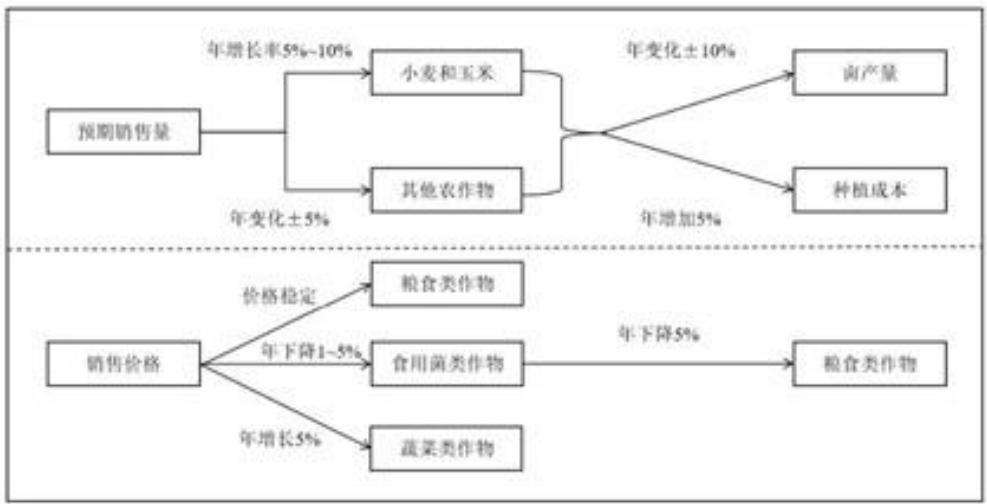

<details>
<summary>flowchart</summary>

```mermaid
graph LR
  A["预期销售量"] --> B{"年增长率5%~10%"}
  A --> C{"年变化±5%"}
  B --> D["小麦和玉米"]
  B --> E["其他农作物"]
  D --> F{"年变化±10%"}
  E --> F
  F --> G["亩产量"]
  F --> H["种植成本"]
  
  subgraph sg_5["\"年变化±5%\"]"]
    D
    E
  end
  
  subgraph sg_5_2["\"年增加5%\"]"]
    G
    H
  end
  
  subgraph sg_5_3["\"年下降5%\" |"]
    I["粮食类作物"]
    J["食用菌类作物"]
    K["蔬菜类作物"]
  end
  
  L["销售价格"] --> M{"年价格稳定"}
  L --> N{"年下降1~5%"}
  L --> O{"年增长5%"}
```
</details>

图 10 农作物预期销售量、亩产量、销售价格和种植成本年波动情况示意图

在上图中，价格稳定可以看作变化率为0，同时不难发现大部分数据为范围值。为了更多的模拟不确定性，我们采取均匀分布概率密度函数在范围值进行随机选取，有：

$$
\varepsilon_ {\mathrm{uk}} ^ {(p)} \sim U (a _ {\mathrm{uk}}, b _ {\mathrm{uk}}) \tag {26}
$$

其中，v=1, 2, 3, 4 分别表示预期销量、亩产量、种植成本和销售价格 4 个指标； $\varepsilon_{uk}^{(p)}$ 表示第 p 年第 k 种农作物第 v 个指标的变化率；U 表示均匀分布； $b_{uk}, a_{uk}$ 为已知数，表示每年第 k 种农作物的第 v 指标的变化率的区间。特别说明，若变化率为定值，则由均匀分布取到该定值的概率为 1。

## 6.2.2 潜在种植风险

由题中信息可知，该乡村地处华北山区，常年温度偏低。据南京信息工程大学刘樱的统计[2]：1959年\~2009年华北地区50年间，发生持续性寒潮共出26次，平均1.9年就会出现一次严重的寒潮，且华北地区持续寒潮具有年代特征，从60年代到90年代呈先多后少的变化趋势，21世纪后又有所增加。又根据兰州大学韩兰英的研究[3]，在全球变暖的趋势下，华北地区面临最严重的自然灾害为干旱，且在干旱天气下损失率为 $9.3\%$ ，仅次于东北地区的 $9.6\%$ 。因此，本文对该乡村的潜在种植风险主要考虑寒潮天气与干旱天气。

## 寒潮

华北寒潮常发于春冬季节，最明显的特征为强降温，气温常在0摄氏度以下，同时伴随者大风，阴天，因此对于蔬菜与食用菌来说影响较大。

根据5.3所统计的季次对应季节表1，除单季外，寒潮主要影响季次示意图如下：

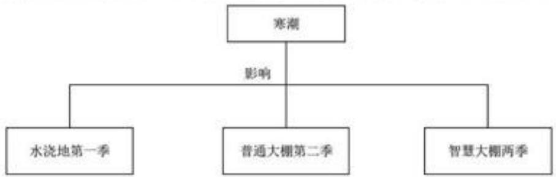

<details>
<summary>flowchart</summary>

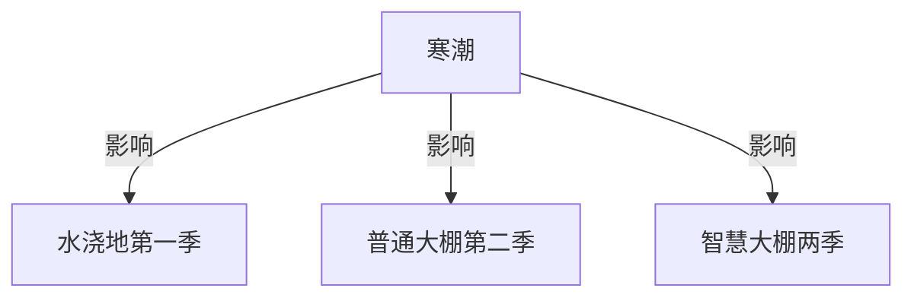
</details>

图11寒潮影响的季次

参考相关报道，本文假设寒潮天气下：对应季次蔬菜减产 $30\%^{[4]}$ ，食用菌的减产 $50\%^{[5]}$ ，其他单季农作物减产 $25\%^{[6]}$ 。非对应季次影响为0。

## > 干旱

干旱灾害常发生夏季，最明显的特征为高温，缺少雨水灌溉，因此对于蔬菜与水稻来说影响较大。

根据 5.3 所统计的季次对应季节表 1，除单季外，干旱主要影响农作物示意图如下：

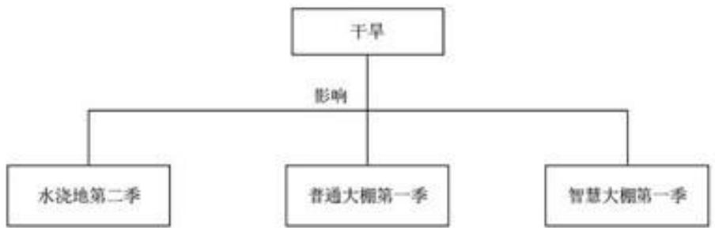

<details>
<summary>flowchart</summary>

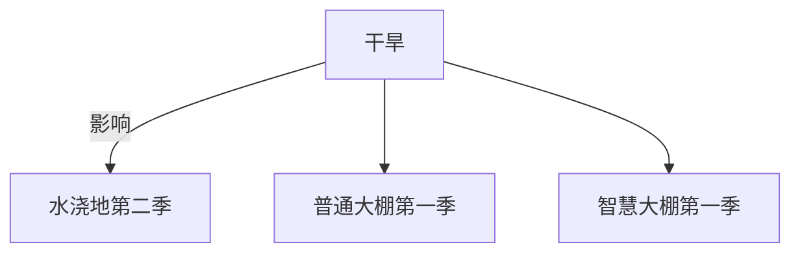
</details>

图12干旱影响的季次

因为小麦、玉米、谷子、高粱、红薯、土豆、西红柿、茄子、黄瓜和辣椒均为抗旱农作物，参考相关报道，本文假设干旱天气下：抗旱农作物减产 $10\%$ ，对应季次非抗旱蔬菜减产 $40\%^{[7]}$ ，其他非抗旱单季农作物减产 $25\%$ 。非对应季次影响为0。

## 6.2.3 模型的修正

## 预期销售量、亩产量、销售价格和种植成本的不确定性

针对不确定性，本文引入了变化率 $\varepsilon_{p}^{(p)}$ ，需要对原模型的预期销量、亩产量、种植成本和销售价格4个指标种植成本进行修正。

## [1] 种植成本

农作物的亩产量往往会受气候等因素的影响，每年会有±10%的变化。

$$
c _ {i j k} (p) = \prod_ {\mu = 2 0 2 4} ^ {p} (1 + \varepsilon_ {3 k} ^ {(p)}) c _ {i j k} (2 0 2 3) \tag {27}
$$

其中， $c_{ijk}(p)$ 表示第 $p$ 年第 $i$ 块耕地的第 $j$ 季第 $k$ 种农作物的种植成本； $c_{ijk}$ (2023)表示2023年第 $i$ 块耕地的第 $j$ 季第 $k$ 种农作物的种植成本； $\varepsilon_{3k}^{(p)}$ 表示第 $p$ 年第 $k$ 种农作物种植成本的变化率，满足均匀分布。

## [2] 预期销售量

小麦和玉米未来的预期销售量有增长的趋势，平均年增长率为5%\~10%之间，其他农作物相对于2023年的预期销售量变化率为±10%。

$$
S _ {j k} (p) = \left\{ \begin{array}{l l} \prod_ {\mu = 2 0 2 4} ^ {p} (1 + \varepsilon_ {1 k} ^ {(\mu)}) S _ {j k} (2 0 2 3), & k = 6, 7 \\ (1 + \varepsilon_ {1 k} ^ {(p)}) S _ {j k} (2 0 2 3), & k \neq 6, 7 \end{array} \right. \tag {28}
$$

其中， $S_{jk}(p)$ 表示第 p 年第 j 季第 k 种农作物的预期销售量； $S_{jk}(2023)$ 表示 2023 年第 p 年第 j 季第 k 种农作物的预期销售量； $\varepsilon_{1k}^{(p)}$ 表示第 p 年第 k 种农作物种预期销售量的变化率，满足均匀分布；k=6，7 分别为小麦和玉米。

## [3] 亩产量

农作物亩产量每年会有±10%的变化。

$$
u _ {i j k} (p) = \prod_ {\mu = 2 0 2 4} ^ {p} (1 + \varepsilon_ {2 k} ^ {(\mu)}) u _ {i j k} (2 0 2 3) \tag {29}
$$

其中， $u_{ijk}(p)$ 表示第 p 年第 i 块耕地第 j 季第 k 种农作物的亩产量； $u_{ijk}(2023)$ 表示 2023 年第 i 块耕地第 j 季第 k 种农作物的亩产量； $\varepsilon_{2k}^{(p)}$ 表示第 p 年第 k 种农作物种亩产量的变化率，满足均匀分布。

## [4] 销售价格

农作物除粮食作物外每年销售价格都会发生变化

$$
w _ {j k} (p) = \prod_ {\mu = 2 0 2 4} ^ {p} (1 + \varepsilon_ {4 k} ^ {(\mu)}) w _ {j k} (2 0 2 3) \tag {30}
$$

其中， $w_{jk}(p)$ 表示第 p 年第 j 季第 k 种农作物的销售价格； $w_{jk}(2023)$ 表示 2023 年第 j 季第 k 种农作物的销售价格； $\varepsilon_{dk}^{(p)}$ 表示第 p 年第 k 种农作物种销售价格的变化率，满足均匀分布。

## 自然灾害存在引起的潜在种植风险

对于寒潮、干旱引起的种植风险，引入潜在风险因子 $\tau_{jk}^{o}$ 表示第j个季度第k种农作亩产量的损失率，当o=1时表示寒潮，当o=2时表示干旱。同时，该因子为常数，其数值在上文潜在种植风险中已经给出。于是考虑潜在风险后，农作物的亩产量为：

$$
u _ {i j k} ^ {\prime} (p) = \tau_ {j k} ^ {o} u _ {i j k} (p) \tag {31}
$$

## 修正后的模型

综上，修正得到模型如下，其省略的约束条件与问题一中模型的完全相同，不在赘述。

$$
\begin{array}{r l} & W = \sum_ {p = 2 0 2 4} ^ {2 0 3 0} \sum_ {k = 1} ^ {4 1} (\Phi_ {k} ^ {(p)} + \Theta_ {k} ^ {(p)} - \Delta_ {k} ^ {(p)}) \\ & s. t. = \left\{ \begin{array}{c} \Delta_ {k} ^ {(p)} = \sum_ {i = 1} ^ {5 4} \sum_ {j = 1} ^ {2} c _ {i j k} (p) x _ {i j k} ^ {(p)} \\ \Phi_ {k} ^ {(p)} = \sum_ {j = 1} ^ {2} w _ {j k} (p) \min \left\{\sum_ {i = 1} ^ {5 4} u _ {i j k} (p) x _ {i j k} ^ {(p)}, S _ {j k} (p) \right\} \\ \Theta_ {k} ^ {(p)} = \lambda \sum_ {j = 1} ^ {2} w _ {j k} (p) \max \left\{\sum_ {i = 1} ^ {5 4} u _ {i j k} ^ {\prime} (p) x _ {i j k} ^ {(p)} - S _ {j k} (p), 0 \right\} \\ c _ {i j k} (p) = \prod_ {\mu = 2 0 2 4} ^ {p} (1 + \varepsilon_ {3 k} ^ {(p)}) c _ {i j k} (2 0 2 3) \\ u _ {i j k} ^ {\prime} (p) = \tau_ {j k} ^ {o} u _ {i j k} (p) \\ S _ {j k} (p) = \prod_ {\mu = 2 0 2 4} ^ {p} (1 + \varepsilon_ {1 k} ^ {(u)}) S _ {j k} (2 0 2 3), k = 6, 7 \\ S _ {j k} (p) = (1 + \varepsilon_ {1 k} ^ {(p)}) S _ {j k} (2 0 2 3), k \neq 6, 7 \\ u _ {i j k} (p) = \prod_ {\mu = 2 0 2 4} ^ {p} (1 + \varepsilon_ {2 k} ^ {(u)}) u _ {i j k} (2 0 2 3) \\ w _ {j k} (p) = \prod_ {\mu = 2 0 2 4} ^ {p} (1 + \varepsilon_ {4 k} ^ {(u)}) w _ {j k} (2 0 2 3) \\ \varepsilon_ {i k} ^ {(p)} \sim U (a _ {i k}, b _ {i k}) \\ \vdots \end{array} \right. \end{array} \tag {32}
$$

## 6.2.4 修正模型的求解

同样地，由遗传算法本文得到情况2正常情况下、寒潮天气下和干旱天气下2024年到2030的最优种植方案1，2，3。种植方案总利润如下：

方案1号：总利润为41310782.4687元，其进化曲线如下：

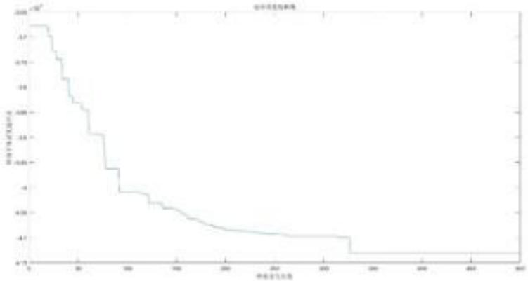

<details>
<summary>survival</summary>

| 标准差 | 持存概率 |
| --- | --- |
| 0 | ~0.25 |
| 10 | ~0.25 |
| 20 | ~0.23 |
| 30 | ~0.18 |
| 40 | ~0.16 |
| 50 | ~0.14 |
| 60 | ~0.12 |
| 70 | ~0.10 |
| 80 | ~0.08 |
| 90 | ~0.06 |
| 100 | ~0.04 |
| 110 | ~0.02 |
| 120 | ~0.01 |
| 130 | ~-0.01 |
| 140 | ~-0.03 |
| 150 | ~-0.04 |
| 160 | ~-0.05 |
| 170 | ~-0.06 |
| 180 | ~-0.07 |
| 190 | ~-0.08 |
| 200 | ~-0.09 |
| 210 | ~-0.10 |
| 220 | ~-0.11 |
| 230 | ~-0.12 |
| 240 | ~-0.13 |
| 250 | ~-0.14 |
| 260 | ~-0.15 |
| 270 | ~-0.16 |
| 280 | ~-0.17 |
| 290 | ~-0.18 |
| 300 | ~-0.19 |
| 310 | ~-0.20 |
| 320 | ~-0.21 |
| 330 | ~-0.22 |
| 340 | ~-0.23 |
| 350 | ~-0.24 |
| 360 | ~-0.25 |
| 370 | ~-0.26 |
| 380 | ~-0.27 |
| 390 | ~-0.28 |
| 400 | ~-0.29 |
| 410 | ~-0.30 |
| 420 | ~-0.31 |
| 430 | ~-0.32 |
| 440 | ~-0.33 |
| 450 | ~-0.34 |
| 460 | ~-0.35 |
| 470 | ~-0.36 |
| 480 | ~-0.37 |
| 490 | ~-0.38 |
| 500 | ~-0.39 |
| 510 | ~-0.40 |
| 520 | ~-0.41 |
| 530 | ~-0.42 |
| 540 | ~-0.43 |
| 550 | ~-0.44 |
| 560 | ~-0.45 |
| 570 | ~-0.46 |
| 580 | ~-0.47 |
| 590 | ~-0.48 |
| 600 | ~-0.49 |
| 610 | ~-0.50 |
| 620 | ~-0.51 |
| 630 | ~-0.52 |
| 640 | ~-0.53 |
| 650 | ~-0.54 |
| 660 | ~-0.55 |
| 670 | ~-0.56 |
| 680 | ~-0.57 |
| 690 | ~-0.58 |
| 700 | ~-0.59 |
| 710 | ~-0.60 |
| 720 | ~-0.61 |
| 730 | ~-0.62 |
| 740 | ~-0.63 |
| 750 | ~-0.64 |
| 760 | ~-0.65 |
| 770 | ~-0.66 |
| 780 | ~-0.67 |
| 790 | ~-0.68 |
| 800 | ~-0.69 |
| 810 | ~-0.70 |
| 820 | ~-0.71 |
| 830 | ~-0.72 |
| 840 | ~-0.73 |
| 850 | ~-0.74 |
| 860 | ~-0.75 |
| 870 | ~-0.76 |
| 880 | ~-0.77 |
| 890 | ~-0.78 |
| 900 | ~-0.79 |
| 910 | ~-0.80 |
| 920 | ~-0.81 |
| 930 | ~-0.82 |
| 940 | ~-0.83 |
| 950 | ~-0.84 |
| 960 | ~-0.85 |
| 970 | ~-0.86 |
| 980 | ~-0.87 |
| 990 | ~-0.88 |
| 1,0,1,1,2,3,4,5,6,7,8,9,11,13,15,17,19,21,23,25,27,29,31,33,35,37,39,41,43,45,47,49,51,53,55,57,59,61,63,65,67,69,71,73,75,77,79,81,83,85,87,89,91,93,95,97,99,1,1,11,13,15,17,19,21,23,25,27,29,31,33,35,37,39,41,43,45,47,49,51,53,55,57,59,61,63,65,67,69,71,73,75
; 数据来源：信达证券
</details>

图 13 方案 1 号的进化曲线

方案2号：总利润为35571712.9128454元，其进化曲线如下：

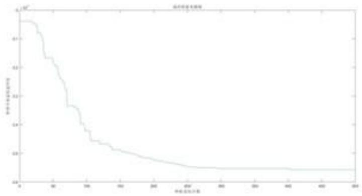

<details>
<summary>line</summary>

| 单位面积系数 | 平均有效面积 (x10^4) |
| --- | --- |
| 0 | ~0.75 |
| 20 | ~0.75 |
| 40 | ~0.68 |
| 60 | ~0.63 |
| 80 | ~0.63 |
| 100 | ~0.58 |
| 120 | ~0.53 |
| 140 | ~0.53 |
| 160 | ~0.49 |
| 180 | ~0.49 |
| 200 | ~0.46 |
| 220 | ~0.43 |
| 240 | ~0.43 |
| 260 | ~0.41 |
| 280 | ~0.41 |
| 300 | ~0.40 |
| 320 | ~0.39 |
| 340 | ~0.39 |
| 360 | ~0.38 |
| 380 | ~0.38 |
| 400 | ~0.37 |
| 420 | ~0.37 |
| 440 | ~0.37 |
| 460 | ~0.36 |
| 480 | ~0.36 |
| 500 | ~0.36 |
| 520 | ~0.35 |
| 540 | ~0.35 |
| 560 | ~0.35 |
| 580 | ~0.34 |
| 600 | ~0.34 |
| 620 | ~0.34 |
| 640 | ~0.33 |
| 660 | ~0.33 |
| 680 | ~0.33 |
| 700 | ~0.32 |
| 720 | ~0.32 |
| 740 | ~0.32 |
| 760 | ~0.31 |
| 780 | ~0.31 |
| 800 | ~0.31 |
| 820 | ~0.31 |
| 840 | ~0.31 |
| 860 | ~0.31 |
| 880 | ~0.31 |
| 900 | ~0.31 |
| 920 | ~0.31 |
| 940 | ~0.31 |
| 960 | ~0.31 |
| 980 | ~0.31 |
| 1000 | ~0.31 |
</details>

图 14 方案 2 号的进化曲线

方案3号：总利润为38732308.4505元，其进化曲线如下：

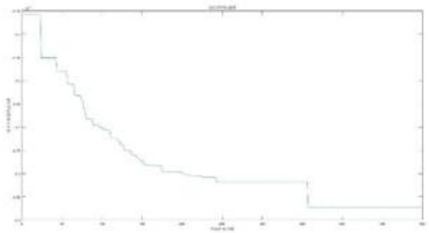

<details>
<summary>survival</summary>

| Time (min) | Probability of survival |
| --- | --- |
| 0 | 1.0 |
| ~2 | 0.8 |
| ~4 | 0.75 |
| ~6 | 0.7 |
| ~8 | 0.65 |
| ~10 | 0.6 |
| ~12 | 0.55 |
| ~14 | 0.5 |
| ~16 | 0.45 |
| ~18 | 0.4 |
| ~20 | 0.35 |
| ~22 | 0.3 |
| ~24 | 0.25 |
| ~26 | 0.2 |
| ~28 | 0.15 |
| ~30 | 0.1 |
| ~32 | 0.05 |
| ~34 | 0.05 |
| ~36 | 0.05 |
| ~38 | 0.05 |
| ~40 | 0.05 |
| ~42 | 0.05 |
| ~44 | 0.05 |
| ~46 | 0.05 |
| ~48 | 0.05 |
| ~50 | 0.05 |
| ~52 | 0.05 |
| ~54 | 0.05 |
| ~56 | 0.05 |
| ~58 | 0.05 |
| ~60 | 0.05 |
| ~62 | 0.05 |
| ~64 | 0.05 |
| ~66 | 0.05 |
| ~68 | 0.05 |
| ~70 | 0.05 |
| ~72 | 0.05 |
| ~74 | 0.05 |
| ~76 | 0.05 |
| ~78 | 0.05 |
| ~80 | 0.05 |
| ~82 | 0.05 |
| ~84 | 0.05 |
| ~86 | 0.05 |
| ~88 | 0.05 |
| ~90 | 0.05 |
| ~92 | 0.05 |
| ~94 | 0.05 |
| ~96 | 0.05 |
| ~98 | 0.05 |
| ~100 | 0.05 |
</details>

图 15 方案 3 号的进化曲线

以上三种方案的进化曲线均趋于平稳，认为三个解均收敛。最后，为了确定哪种方案在潜在种植风险发生受到的波及最小，引入利润波动指标 $\phi$ ，该指标越大说明波动越小，计算公式如下：

$$
\phi = \frac {W ^ {\prime} - W}{W} \tag {33}
$$

其中，W 表示正常情况下的方案的总利润； $W'$ 表示潜在种植风险发生后方案的总利润。计算得到各个方案的利润波动指标如下表：

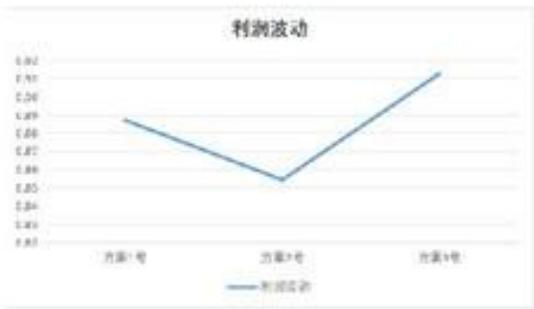

<details>
<summary>line</summary>

| Category | 利润波动 |
| --- | --- |
| 方案1号 | ~0.89 |
| 方案7号 | ~0.85 |
| 方案9号 | ~0.92 |
</details>

图 16 利润波动折线图

根据上图，选择利润波动最小的方案为方案3号，总利润为38732308.4505元。

## 6.3 问题三模型的建立与求解

问题三在问题二的基础上再需要考虑2个方面：其一，各种农作物之间可能存在一定的替代性和互补性；其二，种植成本、销售价格与预期销售量具有相关性。

## 6.3.1 农作物的替代性和互补性。

根据经济学原理，从价格角度对替代性、互补性进行定义：若一个商品的需求量随着另一个商品价格升高而增加，则称两者具有替代性；若一个商品的需求量随着另一个商品价格升高而减小，则称两者具有互补性。

商品之间既有替代性又有互补性，若两种商品之间的替代性强于互补性，称这两种商品称为替代品；若两种商品之间的互补性强于替代性，称它们为互补品。

## 替代性

首先根据日常需求对该乡村所有农作物进行分类，分出3类替代品。第一类粮食类替代品有：玉米、小麦、大麦、莜麦、红薯、黍子、荞麦、水稻和土豆；第二类蔬菜类替代品有：青椒和辣椒；第三类食用菌替代类：榆黄菇、香菇、白灵菇和羊肚菌。

对于替代类来说，因为它们存在相互替代性，可以认为其预期销售量为一体，根据农作物的销售价格对其销售量进行分配，某农作物价格越高，人们将会倾向购买其替代品，该农作物的预期销售量将减少。为了简化模型，本文采取一次函数作为替代品之间价格与需求的关系：

$$
S _ {j k} ^ {\prime} (p) = \left(1 - \frac {w _ {j k} ^ {\prime} (p)}{\sum_ {k} w _ {j k} ^ {\prime} (p)}\right) \sum_ {k} S _ {j k} (p) \quad k \in B _ {l} \tag {34}
$$

其中， $S_{jk}^{\prime}(p)$ 表示修正后农作物预期销售量； $B_{l}$ 表示替代品集合，l=1,2,3分别表示粮食类替代品、蔬菜类替代品和食用菌替代类； $w_{jk}^{\prime}(p)$ 表示由预期销售量与销售价格相关性修正后的销售单价，其具体计算公式在下文（34）式。

## 互补性

同样地对农作物进行分类,分出2类互补品,第一类花叶类蔬菜互补品有:菠菜、青椒、菜花、包菜、油麦菜、小青菜、生菜、空心菜和黄心菜;第二类为粮食性豆类互补品:黄豆、黑豆、红豆、绿豆和爬豆。

对于互补类来说，因为它们存在相互弥补性，可以认为其销售量一损俱损，一荣俱荣。所以说，以互补类集合内销售价格相对比去年幅度最大的农作物作为指标，集合内所有作物的销售量进行该农作物价格变化相同的变化：

$$
S _ {j k} ^ {\prime} (p) = \left(1 \pm \max \left(| w _ {j k} (p) - w _ {j k} (p - 1) |\right)\right) S _ {j k} (p) \quad k \in G _ {l} \tag {35}
$$

其中， $S_{jk}^{\prime}(p)$ 表示修正得到的农作物预期销售量； $G_{l}$ 表示互补品集合，l=1,2，分别表示花叶类蔬菜互补品、粮食性豆类互补品。

## 6.3.2 种植成本、销售价格与预期销售量具有相关性

由于文中假设 2023 年产销相同，本文假设以前一年销售量设定为今年的农作物市场需求量，今年的预期销售量作为农作物供应量。

根据相关文献[8]和供应关系有：一、销售价格：作物预期销售量大于设定市场需求时，反映短期内供过于求，销售价格相对减少；二、种植成本作物预期销售量大于设定市场需求时，各乡村大量种植了该作物，从种子供应方角度考虑，短期内作物种子供小于求，导致种植成本增加。为了简化模型，本文任然采取一次函数作为预期销售与种植成本，销售价格的函数：

$$
\left\{ \begin{array}{l} c _ {i j k} ^ {\prime} (p) = \left(1 + \frac {S _ {j k} (p) - S _ {j k} (p - 1)}{S _ {j k} (p - 1)}\right) c _ {i j k} (p - 1) \\ w _ {j k} ^ {\prime} (p) = \left(1 - \frac {S _ {j k} (p) - S _ {j k} (p - 1)}{S _ {j k} (p - 1)}\right) w _ {j k} (p - 1) \end{array} \right. \tag {36}
$$

其中， $c_{ijk}^{\prime \prime}(p)$ ， $w_{jk}^{\prime}(p)$ 分别表示由各自相关性修正得到的种植成本与销售价格。

## 6.3.3 修正的总模型

综上，考虑以上2个方面的新优化模型如下，省略的约束与问题二模型相同：

$$
\text {s.t.} = \left\{ \begin{array}{c} W = \sum_ {p = 2 0 2 4} ^ {2 0 3 0} \sum_ {k = 1} ^ {4 1} \left(\Phi_ {k} ^ {(p)} + \Theta_ {k} ^ {(p)} - \Delta_ {k} ^ {(p)}\right) \\ \Delta_ {k} ^ {(p)} = \sum_ {i = 1} ^ {5 4} \sum_ {j = 1} ^ {2} c _ {i j k} ^ {\prime} (p) x _ {i j k} ^ {(p)} \\ \Phi_ {k} ^ {(p)} = \sum_ {j = 1} ^ {2} w _ {j k} (p) \min \left\{\sum_ {i = 1} ^ {5 4} u _ {i j k} ^ {\prime} (p) x _ {i j k} ^ {(p)}, S _ {j k} (p) \right\} \\ \Theta_ {k} ^ {(p)} = \lambda \sum_ {j = 1} ^ {2} w _ {j k} (p) \max \left\{\sum_ {i = 1} ^ {5 4} u _ {i j k} ^ {\prime} (p) x _ {i j k} ^ {(p)} - S _ {j k} (p), 0 \right\} \\ c _ {i j k} (p) = \prod_ {\mu = 2 0 2 4} ^ {p} \left(1 + \varepsilon_ {i k} ^ {(p)}\right) c _ {i j k} (2 0 2 3) \\ u _ {i j k} ^ {\prime} (p) = \tau_ {j k} ^ {\alpha} u _ {i j k} (p) \\ S _ {j k} (p) = \prod_ {\mu = 2 0 2 4} ^ {p} \left(1 + \varepsilon_ {i k} ^ {(u)}\right) S _ {j k} (2 0 2 3), k = 6, 7 \\ S _ {j k} (p) = \left(1 + \varepsilon_ {i k} ^ {(p)}\right) S _ {j k} (2 0 2 3), k \neq 6, 7 \\ u _ {i j k} (p) = \prod_ {\mu = 2 0 2 4} ^ {p} \left(1 + \varepsilon_ {i k} ^ {(u)}\right) u _ {i j k} (2 0 2 3) \\ w _ {j k} (p) = \prod_ {\mu = 2 0 2 4} ^ {p} \left(1 + \varepsilon_ {i k} ^ {(u)}\right) w _ {j k} (2 0 2 3) \\ S _ {j k} ^ {\prime} (p) = \left(1 - \frac {w _ {j k} ^ {\prime} (p)}{\sum_ {k} w _ {j k} ^ {\prime} (p)}\right) \sum_ {k} S _ {j k} (p) k \in B _ {l} \\ c _ {i j k} ^ {\prime} (p) = \left(1 + \frac {S _ {j k} (p) - S _ {j k} (p - 1)}{S _ {j k} (p - 1)}\right) c _ {i j k} (p - 1) \\ w _ {j k} ^ {\prime} (p) = \left(1 - \frac {S _ {j k} (p) - S _ {j k} (p - 1)}{S _ {j k} (p - 1)}\right) w _ {j k} (p - 1) \\ S _ {j k} ^ {\prime} (p) = (1 \pm \max (\left| w _ {j k} (p) - w _ {j k} (p - 1) \right|)) S _ {j k} (p) k \in G _ {l} \\ \varepsilon_ {i k} ^ {(p)} \sim U (a _ {i k}, b _ {i k}) \\ \vdots \end{array} \right. \tag {37}
$$

## 6.3.4 问题三模型的求解与对比

由遗传算法本文得到情况2正常情况下最优方案的总利润为:37304570.2468元,其与问题二对比图如下:

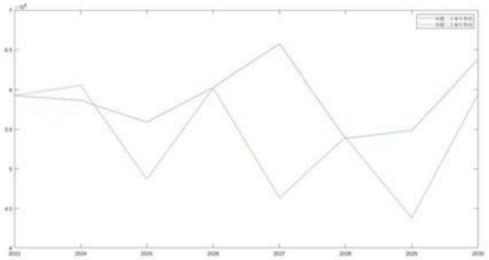

<details>
<summary>line</summary>

| Year | 其他二类客车利润 (10^6) | 其他三类客车利润 (10^6) |
| --- | --- | --- |
| 2023 | ~5.95 | ~5.95 |
| 2024 | ~5.85 | ~6.05 |
| 2025 | ~5.60 | ~4.85 |
| 2026 | ~6.00 | ~6.00 |
| 2027 | ~6.55 | ~4.65 |
| 2028 | ~5.40 | ~5.40 |
| 2029 | ~5.50 | ~4.40 |
| 2030 | ~6.35 | ~5.95 |
</details>

图 17 问题三与问题二方案年利润对比图

从上图中可以发现，问题三的年利润相对于问题二减小，这是由于供需关系，替代性导致买方可能选择更低价的农产品。

## 七、模型的评价、改进与推广

## 7.1 模型的优点

1. 模型引入滞销利润因子，具有推广性。  
2. 考虑不确定性因素时假设变量服从均匀分布，具有简单性和普适性。  
3. 针对种植风险的影响，我们引入了潜在风险因子，来表示华北地区主要灾害干旱和寒潮对农作物的影响，提高决策的准确性和可靠性。  
4. 针对农作物的可替代性和互补性，对作物的变量之间相互影响关系，对农作物的预期销售量进行了修正，进而提高了销售预测的准确性和实用性，从而更好地指导农作物生产。  
5.求解模型时采用了遗传算法进行求解，并对算法进行了优化，收敛速度较快。

## 7.2 模型的缺点

1. 潜在种植风险考虑较少。  
2. 考虑可替代性和互补性作物因素相互影响关系时，采用较为简单的线性函数。

## 7.3 模型的改进

1. 在考虑潜在种植风险中，可以对模型进行改进，即考虑，机票这多加几种自然灾害因素，并且可以考虑多种自然灾害的共同影响，比如该问单季粮食作物可能同时受两种自然灾害（旱灾、寒潮）影响，通过对两种潜在风险因子加权后相乘再与原来的亩

产量相乘得到修正后的亩产量。

2. 针对替代性和互补性的相关线性函数，可采用更可靠的模型。

## 7.4 模型的推广

本文根据华北山区某乡村地2023年实际的农作物种植情况以及相关数据，针对该地区所面临的可能情况，所建立的模型层层递进，并通过遗传算法进行求解，经过算法优化后，算法迭代的速度较快，合理地给出了最优种植方案。本文在充分利用土地资源的情况下建立的单目标规划模型以及求解所用算法可以推广到更一般的农作物种植情景，例如增加潜在风险因子的数量等。本文提供的模型对促进农业种植结构升级有借鉴意义。

## 八、参考文献

[1]http://www.moa.gov.cn/ztzl/nybrl/rlxx/202409/t20240904\_6461895.htm  
[2]刘樱.我国华北地区冬季持续性异常低温事件与大气低频振荡的关系[D].南京信息工程大学,2012.  
[3]韩兰英.气候变暖背景下中国农业干旱灾害致灾因子、风险性特征及其影响机制研究[D].兰州大学,2016.  
[4]https://www.thepaper.cn/newsDetail\_forward\_26306076  
[5]http://gxhzs.hunan.gov.cn/gxhzs/xxgk/gzdt/zsxx/202402/t20240228\_32950661.html  
[6]https://www.163.com/dy/article/IR5LU1EP05325BXL.html  
[7]https://www.gzzhijin.gov.cn/ztzl/rdzt/snfw/nvkjfwzs/201710/t20171016 75194337.html  
[8]https://mp.weixin.qq.com/s?biz=MjM5NTk1ODUxNA==&mid=2649895629&idx=4&sn=12d98efalde389350ac37ea105697169&chksm=bef6095089818046097130fcbaa05737cbf71f1298d2d92ac6679223fe8432a8002f1f0ddb80&scene=27

```matlab
附录1
介绍：第一问主程序
clc;clear;
% 数据读取
plant2023 = importdata("2023 种植方案.mat");
output2023 = importdata("2023 种植统计.mat");
Sale = importdata("各作物各季度售价.mat");
Stastic = importdata("种植相关统计数据.mat");
Data1 = importdata("1.xlsx");
Data2 = importdata("2.xlsx");
Data3 = importdata("3.xlsx");
Area = Data1.data.Sheet1;

nPop = 50; % 种群数量
maxIt = 500;
nPc = 0.8;
nC = round(nPop * nPc/2) * 2 ;
crossover_rate = 0.1; %交换概率
mutation_rate = 0.01; %变异概率

% 参数定义
num_years = 8; % 2023 到 2030
num_plots = 54; % 地块数量
num_crops = 41; % 作物总数

% 耕地编号
land_types = [ones(1,6),2*ones(1,14),3*ones(1,6),4*ones(1,8),5*ones(1,16),6*ones(1,4)];
% 根据种植耕地划分,共5种作物
crop_massif.a = [];
crop_massif(1).a = [1:15]; %平旱地,梯田,山坡地
crop_massif(2).a = [16]; %水浇地单季
crop_massif(3).a = [17:34]; %水浇地第一季 普通大棚第一季 智慧大棚一二季
crop_massif(4).a = [35:37]; %水浇地第二季
crop_massif(5).a = [38:41]; %普通大棚第二季

% 季节矩阵大小，根据地块类型定义，
% 1=一个季节种单作物, 2=两季单作物, 2 两季 2 作物、普通大棚和智慧大棚
season_matrix_sizes = {
[1, 1];          % 平旱地，一个季节种一个作物
[1, 1];          % 梯田，一个季节种一个作物
[1, 1];          % 山坡地，一个季节种一个作物
[1, 1];          % 水浇地，一个季节最多种一个/两个作物
```

```matlab
[2, 2];          % 普通大棚，每季最多种两种作物
[2, 2];          % 智慧大棚，每季最多种两种作物
};
template.x = [];
template.y = [];

Parent = repmat(template,nPop,1);

R=[]; %用于存储最优解
%初始化种群
for i=1:nPop
    Parent(i).x = spe_createPop(crop_massif, land_types, season_matrix_sizes, num_years,
num_plots, plant2023, output2023, Area, Stastic);
    Parent(i).y = fun(Parent(i).x,Data1,output2023,Sale,Stastic);
end

for It = 1:maxIt
    Offspring = repmat(template,nC/2,2);

    for j = 1:nC/2
        parent1 = selectPop(Parent);
        parent2 = selectPop(Parent);
        [Offspring(j,1).x,Offspring(j,2).x] = crossPop(parent1, parent2, crossover_rate,
season_matrix_sizes, num_years, num_plots, crop_massif, land_types, output2023, Area, Stastic);
    end

    Offspring=Offspring(:);
    A = Offspring;

    %进行变异
    for k=1:nC
        Offspring(k).x = mutatePop(Offspring(k).x, mutation_rate, crop_massif, land_types,
season_matrix_sizes, num_years, num_plots, output2023, Area, Stastic);
        Offspring(k).y = fun(Offspring(k).x,Data1,output2023,Sale,Stastic);
    end

    newPop=[Parent,Offspring];
    [~,so]=sort([newPop.y],'ascend');
    newPop=newPop(so);
    Parent=newPop(1:nPop);
    disp(['迭代次数:',num2str(It),',最小值为:',num2str(Parent(1).y)])
    R=[R,Parent(1).y];
end
figure
plot(R)
xlabel('种族进化次数')
```

```matlab
ylabel('种群个体最优适应度')
title('适应度进化曲线')
%获取多个
best_x = Parent(1).x;
vaild = check(best_x, crop_massif, land_types, num_years, num_plots);
```

附录2  
```matlab
介绍: 目标函数
function y = fun(x,Data1,output2023,Sale,Stastic)
Area = Data1.data.Sheet1;
Crop = Data1.data.Sheet2;
% 第一列作物 第二列耕地 第三列季度
for year = 2:8
    Plan = zeros(150, 4); % 预分配 Plan 数组, 假设最大行数为 150, 后续再调整
    planCounter = 1; % 用于跟踪 Plan 数组中的行数
    for i = 1:size(Area,1)
        plan = x{year,i};
        %单季度
        if size(plan,2) == 1
            land = plan.land;
            season = plan.season;
            crop = plan.crop;
            % 第一列作物 第二列耕地 第三列季度 第四列种植面积
            Plan(planCounter, :) = [crop, land, season, Area(i)];
            planCounter = planCounter + 1;
            %双季度
        else
            for j = 1:2
                crop = plan(j).crop;
                land = plan(j).land;
                season = plan(j).season;
                for k = crop
                    Plan(planCounter, :) = [k, land, season, Area(i) / length(crop)];
                    planCounter = planCounter + 1;
                end
            end
        end
    end
end
Plan = Plan(1:planCounter - 1, :); % 调整 Plan 数组大小
Output = zeros(size(Crop,1),2);
Cost = 0;
for i = 1:size(Plan,1)
    crop = Plan(i,1);
    land = Plan(i,2);
    season = Plan(i,3);
```

```matlab
%亩产量/斤 并得到总产量
yield_permu = Stastic(1,land,crop,season);
%种植成本/(元/亩)
plant_cost = Stastic(2,land,crop,season);
%每个农作物每个季度的产量
Output(crop,season) = Output(crop,season) + Plan(i,4) * yieldpermu;
Cost = Cost + Plan(i,4) * plant_cost;
end
y1 = -Cost;
%第一种 多出的直接舍弃
for i = 1:size(Output,1)
    for j = 1:size(Output,2)
        y1 = y1 + min(Output(i,j),output2023(i,j)) * Sale(i,j);
    end
end
y2 = -Cost;
%第二种 多出的按一半价格出售
for i = 1:size(Output,1)
    for j = 1:size(Output,2)
        if Output(i,j) > output2023(i,j)
            y2 = y2 + output2023(i,j) * Sale(i,j) + (Output(i,j)-output2023(i,j)) * Sale(i,j) *
0.5;
    else
        y2 = y2 + Output(i,j) * Sale(i,j);
    end
end
end
Y(year-1) = -y1;
end
y = sum(Y);
```

```matlab
附录 3
介绍：锦标赛选择函数
function selected = selectPop(Parent)
    %锦标赛选择法
    population_size = numel(Parent);
    fitness = [Parent.y];
    tournament_size = 5;
    selected_indices = zeros(population_size, 1);
    for i = 1:population_size
        candidates = randsample(1:population_size, tournament_size);
        [~, best_candidate_idx] = max(fitness(candidates));
        selected_indices(i) = candidates(best_candidate_idx);
    end
    % 统计每个个体被选择的次数
    counts = histc(selected_indices, 1:population_size);
    [max_count, ~] = max(counts);
```

```matlab
most_selected_indices = find(counts == max_count);

% 如果有多个出现次数相同的个体，随机选择一个
if length(most_selected_indices) > 1
    parent_idx = most_selected_indices(randi(length(most_selected_indices)));
else
    parent_idx = most_selected_indices;
end
selected = Parent(parent_idx).x;
end
```  
附录4

介绍：变异函数  
```matlab
function mutated_offspring = mutatePop(offspring, mutation_rate, crop_massif, land_types,
season_matrix_sizes, num_years, num_plots, output2023, Area, Stastic)
% 初始化变异后的个体矩阵
mutated_offspring = offspring;
if rand(1) < mutation_rate
    plot = randi([2, num_plots]); % 从第二年开始进行变异，第一年的值保持不变
    for year = 2:num_years
        output = zeros(41,2);
        for i = 1:num_plots
            land_type = land_types(i);
            if i ~= plot
                num_season = size(mutated_offspring{year, i}, 2);
                for season = 1:num_season
                    crops = mutated_offspring{year, i}(season).crop;
                    for crop = crops
                        output(crop,season) = output(crop,season) + Area(i) *
Stastic(1,land_type,crop,season);
                    end
                end
            end
        end

    end

    land_type = land_types(plot);
    sizes = season_matrix_sizes{land_type};
    if land_type==4
        num_seasons = randi([1,2]);
    else
        num_seasons = sizes(1);
    end
    max_crops_per_season = sizes(2);

    planting_plan = struct();
    % 针对水稻进行二层单独判断
    if land_type == 4 && num_seasons == 1 && size(mutated_offspring{year-1, plot}, 2) == 1
```

```matlab
num_seasons = 2;
end
for season = 1:num_seasons
    % 水浇地单季作物组
    if land_type == 4 && num_seasons == 1
        crops_group = 2;
        % 水浇地第一季 普通大棚第一季 智慧大棚一二季作物组
    elseif land_type == 6 || land_type == 4 && num_seasons == 2 && season == 1 ||
land_type == 5 && num_seasons == 2 && season == 1
        crops_group = 3;
        % 水浇地第二季作物组
    elseif land_type == 4 && num_seasons == 2 && season == 2
        crops_group = 4;
        % 普通大棚第二季作物组
    elseif land_type == 5 && num_seasons == 2 && season == 2
        crops_group = 5;
    else % 对应地块，平旱地、梯田、山坡地
        crops_group = 1;
    end
    available_crops = crop_massif(crops_group).a;
    crops_per_season = randi([1, max_crops_per_season]);
    planting_plan(season).land = land_type;
    planting_plan(season).season = season;
    crops = generate_unique_crops(available_crops, crops_per_season,
mutated_offspring, planting_plan, year, plot, season, output2023, output, Area, Stastic);
    if isempty(crops)
        available_crops = crop_massif(3).a;
        crops = generate_unique_crops(available_crops, crops_per_season,
mutated_offspring, planting_plan, year, plot, season, output2023, output, Area, Stastic);
    end
    planting_plan(season).crop = crops;
    if crops_group == 2 && ~ismember(16.planting_plan(season).crop)
        planting_plan(season+1).land = land_type;
        planting_plan(season+1).season = season+1;
        crops = generate_unique_crops(available_crops, crops_per_season,
mutated_offspring, planting_plan, year, plot, season+1, output2023, output, Area, Stastic);
        planting_plan(season+1).crop = crops;
        output(crops, season + 1) = output(crops, season + 1) + Area(plot) *
Stastic(1,land_type,crops,season + 1);
    end
    for k = 1:length(planting_plan(season).crop)
        crop = planting_plan(season).crop(k);
        output(crop, season) = output(crop, season) + Area(plot) *
Stastic(1,land_type,crop,season);
    end
end
mutated_offspring{year, plot} = planting_plan;
```

```matlab
end
mutated_offspring = checkAndRepair(mutated_offspring, crop_massif, land_types, num_plots,
season_matrix_sizes, output2023, Area, Stastic);
end
```

附录5  
```matlab
介绍: 生成不重复编号
function crops = repair(available_crops, crops_per_season, individual, planting_plan, year, plot, season, output2023, output, Area, Stastic)
num_attempts = 18; % 尝试次数限制，防止无限循环
land_types = [ones(1,6),2*ones(1,14),3*ones(1,6),4*ones(1,8),5*ones(1,16),6*ones(1,4)];
% 提前获取相关数据，减少循环内计算
if year > 1
    prev_year_plan = individual{year - 1, plot};
else
    prev_year_plan = [];
end

for attempt = 1:num_attempts
    vaild = false;
    if length(available_crops) > 1
        crops = randsample(available_crops, crops_per_season, false);
    elseif length(available_crops) == 1
        crops = available_crops(1);
    elseif isempty(available_crops)
        crops = [];
    return
end

for i = 1:crops_per_season
    % 检查当前季节内部作物是否重复
    if length(unique(crops)) < crops_per_season
        vaild = true;
        continue;
    end

    % 检查与上季重复情况
    if season > 1 && isfield(planting_plan(season - 1), 'crop')
        if hasOverlap(crops(i), planting_plan(season - 1).crop)
            available_crops(available_crops==crops(i)) = [];
            vaild = true;
            continue;
        end
    end

end

% 检查与上年所有季节重复情况
```

```matlab
if hasYearOverlap(crops(i), prev_year_plan)
    available_crops(available_crops==crops(i)) = [];
    vaild = true;
    continue;
end
% 检查三年内种植豆类作物要求
if year >= 3 && ~checkLegumesInThreeYears(crops(i), individual,planting_plan, year, plot, season) && ~ismember(crops(1),[1:5, 17:19])
    % 水浇地或者普通大棚第一季
    if plot > 26 && season == 1 && plot < 51
        legume_crops = [17:19]; % 第一季豆类作物编号
        crops(i) = randsample(legume_crops, 1, false);
        % 单季度
    elseif plot <= 26
        legume_crops = [1:5]; % 第一季豆类作物编号
        crops(i) = randsample(legume_crops, 1, false);
    elseif plot >= 51
        legume_crops = [17:19]; % 第一季豆类作物编号
        crops(i) = randsample(legume_crops, 1, false);
    end
end

if ~ismember(crops(i),[1:5,17:19,35:41])
    %检查是否超过预期销售量太多
    refer_sale = output2023(crops(i), season);
    cur_sale = output(crops(i), season);
    will_sale = Area(plot) * Stastic(1,land_types(plot),crops(i),season);

    if cur_sale + will_sale > refer_sale + 50000
        available_crops(available_crops==crops(i)) = [];
        vaild = true;
        continue;
    end
end
end
% 如果没有发现重复,符合豆类作物轮种要求且没有超出预期销售量返回生成的作物
if ~vaild
    return
end
end
```

<table><tr><td>附录6</td></tr><tr><td>介绍:个体生成函数</td></tr><tr><td>function individual = spe_createPop(crop_massif, land_types, season_matrix_sizes, num_years, num_plots, plant2023, output2023, Area, Stastic)</td></tr></table>

```matlab
% 初始化种群为结构体数组
individual = cell(num_years, num_plots); % 初始化每个个体的 cell 矩阵
% 给出 2023 的种植数据
individual(1,:) = plant2023;
for year = 2:num_years
    % 用来存储该年份当前的输出 不能超出太多预期销售量
    output = zeros(41,2);
    for plot = 1:num_plots
        % 根据地块类型生成种植方案
        land_type = land_types(plot);
        sizes = season_matrix_sizes{land_type};
        if land_type==4
            num_seasons = randi([1,2]);
        else
            num_seasons = sizes(1);
        end
        max_crops_per_season = sizes(2);

        planting_plan = struct();
        % 针对水稻进行二层单独判断
        if land_type == 4 && num_seasons == 1 && size(individual{year-1, plot}, 2) == 1
            num_seasons = 2;
        end
        for season = 1:num_seasons
            % 水浇地单季作物组
            if land_type == 4 && num_seasons == 1
                crops_group = 2;
                % 水浇地第一季 普通大棚第一季 智慧大棚一二季作物组
            elseif land_type == 6 || land_type == 4 && num_seasons == 2 && season == 1 ||
land_type == 5 && num_seasons == 2 && season == 1
                crops_group = 3;
                % 水浇地第二季作物组
            elseif land_type == 4 && num_seasons == 2 && season == 2
                crops_group = 4;
                % 普通大棚第二季作物组
            elseif land_type == 5 && num_seasons == 2 && season == 2
                crops_group = 5;
            else % 对应地块，平旱地、梯田、山坡地
                crops_group = 1;
            end
            available_crops = crop_massif(crops_group).a;
            crops_per_season = randi([1, max_crops_per_season]); % 随机 1 到 2 种作物
            planting_plan(season).land = land_type;
            planting_plan(season).season = season;
            crops = generate_unique_crops(available_crops, crops_per_season, individual,
planting_plan, year, plot, season, output2023, output, Area, Stastic);
```

```matlab
%说明此时不能种小麦或者没有满足条件的农作物,这里种第一季度,第二季度由下面的代码得到
if isempty(crops)
    available_crops = crop_massif(3).a;
    %available_crops = crop_massif(1).a;
    crops = generate_unique_crops(available_crops, crops_per_season, individual, planting_plan, year, plot, season, output2023, output, Area, Stastic);
end
planting_plan(season).crop = crops;
%说明被替换成两季度作物用来种豆
if crops_group==2 && ~ismember(16,planting_plan(season).crop)
    available_crops = crop_massif(4).a;
    planting_plan(season+1).land = land_type;
    planting_plan(season+1).season = season+1;
    crops = generate_unique_crops(available_crops, crops_per_season, individual, planting_plan, year, plot, season+1, output2023, output, Area, Stastic);
    planting_plan(season+1).crop = crops;
    output(crops, season + 1) = output(crops, season + 1) + Area(plot) * Stastic(1,land_type,crops,season + 1);
end
for k = length(planting_plan(season).crop)
    crop = planting_plan(season).crop(k);
    output(crop, season) = output(planting_plan(season).crop(k), season) + Area(plot) * Stastic(1,land_type,crop,season);
end
end
% 存储种植计划到个体矩阵
individual{year, plot} = planting_plan;
end
end
```

```matlab
附录 7
介绍：检查与上年所有季节重复情况
function overlap = hasYearOverlap(crops, prev_year_plan)
overlap = false;
if ~isempty(prev_year_plan)
    for prev_season = 1:length(prev_year_plan)
        if isfield(prev_year_plan(prev_season), 'crop')
            if hasOverlap(crops, prev_year_plan(prev_season).crop)
                overlap = true;
                break;
            end
        end
    end
end
end
```

<table><tr><td>附录8</td></tr><tr><td>介绍:检查与上季重复情况</td></tr><tr><td>function overlap = hasOverlap(crops1, crops2)overlap = any(ismember(crops1, crops2));end</td></tr></table>

<table><tr><td>附录9</td></tr><tr><td>介绍:生成不重复作物编号</td></tr><tr><td>function crops = generate_unique_crops(available_crops, crops_per_season, individual, planting_plan, year, plot, season, output2023, output, Area, Stastic) num attempts = 18; % 尝试次数限制,防止无限循环 land_types = [ones(1,6),2*ones(1,14),3*ones(1,6),4*ones(1,8),5*ones(1,16),6*ones(1,4)]; % 提前获取相关数据,减少循环内计算 if year &gt;1 prev_year_plan = individual{year - 1, plot}; else prev_year_plan = []; end for attempt = 1:num attempts vaild = false; if length(available_crops) &gt; 1 crops = randsample(available_crops, crops_per_season, false); elseif length(available_crops) == 1 crops = available_crops(1); elseif isempty(available_crops) crops = []; return end for i = 1:crops_per_season % 检查当前季节内部作物是否重复 if length(unique(crops)) &lt; crops_per_season vaild = true; continue; end % 检查与上季重复情况 if season &gt; 1 &amp;&amp; isfield(planting_plan(season - 1), &#x27;crop&#x27;) if hasOverlap(crops(i), planting_plan(season - 1).crop) available_crops(available_crops==crops(i)) = []; vaild = true; continue; end % 检查与上年所有季节重复情况</td></tr></table>

```matlab
if hasYearOverlap(crops(i), prev_year_plan)
    available_crops(available_crops==crops(i)) = [];
    vaild = true;
    continue;
end

% 检查三年内种植豆类作物要求
if year >= 3 && ~checkLegumesInThreeYears(crops(i), individual,planting_plan, year, plot, season) && ~ismember(crops(1),[1:5, 17:19])
    % 水浇地或者普通大棚第一季
    if plot > 26 && season == 1 && plot < 51
        legume_crops = [17:19]; % 第一季豆类作物编号
        crops(i) = randsample(legume_crops, 1, false);
        % 单季度
    elseif plot <= 26
        legume_crops = [1:5]; % 第一季豆类作物编号
        crops(i) = randsample(legume_crops, 1, false);
    elseif plot >= 51
        legume_crops = [17:19]; % 第一季豆类作物编号
        crops(i) = randsample(legume_crops, 1, false);
    end
end

if ~ismember(crops(i),[1:5,17:19,35:41])
    %检查是否超过预期销售量太多
    refer_sale = output2023(crops(i), season);
    cur_sale = output(crops(i), season);
    will_sale = Area(plot) * Stastic(1,land_types(plot),crops(i),season);

    if cur_sale + will_sale > refer_sale + 50000
        available_crops(available_crops==crops(i)) = [];
        vaild = true;
        continue;
    end
end
end
% 如果没有发现重复,符合豆类作物轮种要求且没有超出预期销售量返回生成的作物
if ~vaild
    return
end
end
```

<table><tr><td>附录10</td></tr><tr><td>介绍:检查函数</td></tr><tr><td>clc;clear,clc;clear,</td></tr></table>

```matlab
% 用来判断是否有问题
x = importdata("情况 1.mat");
plant2023 = importdata("2023 种植方案.mat");
output2023 = importdata("2023 种植统计.mat");
landoutput2023 = importdata("2023 预期销售量.mat");
Sale = importdata("各作物各季度售价.mat");
Stastic = importdata("种植相关统计数据.mat");
Data1 = importdata("1.xlsx");
Data2 = importdata("2.xlsx");
Data3 = importdata("3.xlsx");
Area = Data1.data.Sheet1;
% 参数定义
num_years = 8; % 2023 到 2030
num_plots = 54; % 地块数量
num_crops = 41; % 作物总数

% 根据种植耕地划分,共 5 种作物
crop_massif.a = [];
crop_massif(1).a = [1:15]; %平旱地,梯田,山坡地
crop_massif(2).a = [16]; %水浇地单季
crop_massif(3).a = [17:34]; %水浇地第一季 普通大棚第一季 智慧大棚一二季
crop_massif(4).a = [35:37]; %水浇地第二季
crop_massif(5).a = [38:41]; %普通大棚第二季

% 季节矩阵大小,根据地块类型定义,
% 1=一个季节种单作物, 2=两季单作物, 2 两季 2 作物、普通大棚和智慧大棚
season_matrix_sizes = {
[1, 1];          % 平旱地,一个季节种一个作物
[1, 1];          % 梯田,一个季节种一个作物
[1, 1];          % 山坡地,一个季节种一个作物
[1, 1];          % 水浇地,一个季节最多种一个/两个作物
[2, 2];          % 普通大棚,每季最多种两种作物
[2, 2];          % 智慧大棚,每季最多种两种作物
};
% 第一列作物 第二列耕地 第三列季度
land_types = [ones(1,6),2*ones(1,14),3*ones(1,6),4*ones(1,8),5*ones(1,16),6*ones(1,4)];
sale = Data3.data;
vald = check(x, crop_massif, land_types, num_years, num_plots, Area, Stastic);
```

<table><tr><td>附录11</td></tr><tr><td>介绍:交叉</td></tr><tr><td>function [offspring1, offspring2] = crossPop(parent1, parent2, crossover_rate, season_matrix_sizes, num_years, num_plots, crop_massif, land_types, output2023, Area, Stastic)</td></tr></table>

```matlab
% 初始化子代个体矩阵
offspring1 = parent1;
offspring2 = parent2;

% 用于减少 rand 调用

% 用于减少 rand 调用
crossover_matrix = rand(num_years, num_plots) < crossover_rate;
crossover_year = randi([2,num_years]);

for plot = 1:num_plots
    if crossover_matrix(crossover_year, plot)
        offspring1(:, plot) = parent2(:, plot);
        offspring2(:, plot) = parent1(:, plot);
    end
end
    % 约束检测和修复合并在一起
    offspring1 = checkAndRepair(offspring1, crop_massif, land_types, num_plots,
season_matrix_sizes, output2023, Area, Stastic);
    offspring2 = checkAndRepair(offspring2, crop_massif, land_types, num_plots,
season_matrix_sizes, output2023, Area, Stastic);
end
```

```matlab
附录 12
介绍：生成个体
function individual = createPop(crop_massif, land_types, season_matrix_sizes, num_years,
num_plots, plant2023)
% 初始化种群为结构体数组
individual = cell(num_years, num_plots); % 初始化每个个体的 cell 矩阵
% 给出 2023 的种植数据
individual(1,:) = plant2023;
for year = 2:num_years
    % 用来存储该年份当前的输出 不能超出太多预期销售量
    output = zeros(41,2);
    for plot = 1:num_plots
        % 根据地块类型生成种植方案
        land_type = land_types(plot);
        sizes = season_matrix_sizes{land_type};
        if land_type==4
            num_seasons = randi([1,2]);
        else
            num_seasons = sizes(1);
        end
        max_crops_per_season = sizes(2);

        planting_plan = struct();
```

```matlab
% 针对水稻进行二层单独判断
if land_type == 4 && num_seasons == 1 && size(individual{year-1, plot}, 2) == 1
    num_seasons = 2;
end
for season = 1:num_seasons
    % 水浇地单季作物组
    if land_type == 4 && num_seasons == 1
        crops_group = 2;
        % 水浇地第一季 普通大棚第一季 智慧大棚一二季作物组
    elseif land_type == 6 || land_type == 4 && num_seasons == 2 && season == 1 ||
land_type == 5 && num_seasons == 2 && season == 1
        crops_group = 3;
        % 水浇地第二季作物组
    elseif land_type == 4 && num_seasons == 2 && season == 2
        crops_group = 4;
        % 普通大棚第二季作物组
    elseif land_type == 5 && num_seasons == 2 && season == 2
        crops_group = 5;
    else % 对应地块，平旱地、梯田、山坡地
        crops_group = 1;
    end
    available_crops = crop_massif(crops_group).a;
    crops_per_season = randi([1, max_crops_per_season]); % 随机 1 到 2 种作物
    planting_plan(season).land = land_type;
    planting_plan(season).season = season;
    crops = generate_unique_crops(available_crops, crops_per_season, individual,
planting_plan, year, plot, season, output2023, output, Area, Stastic);
    %说明此时不能种小麦或者没有满足条件的农作物,这里种第一季度,第二季度由下面的代码得到
    if isempty(crops)
        available_crops = crop_massif(3).a;
        %available_crops = crop_massif(1).a;
        crops = generate_unique_crops(available_crops, crops_per_season, individual,
planting_plan, year, plot, season, output2023, output, Area, Stastic);
    end
    planting_plan(season).crop = crops;
    %说明被替换成两季度作物用来种豆
    if crops_group==2 && ~ismember(16,planting_plan(season).crop)
        available_crops = crop_massif(4).a;
        planting_plan(season+1).land = land_type;
        planting_plan(season+1).season = season+1;
        crops = generate_unique_crops(available_crops, crops_per_season, individual,
planting_plan, year, plot, season+1, output2023, output, Area, Stastic);
        planting_plan(season+1).crop = crops;
        output(crops, season + 1) = output(crops, season + 1) + Area(plot) *
Stastic(1,land_type,crops,season + 1);
end
```

```matlab
for k = 1:length(planting_plan(season).crop)
    crop = planting_plan(season).crop(k);
    output(crop, season) = output(planting_plan(season).crop(k), season) +
Area(plot) * Stastic(1,land_type,crop,season);
end
end
% 存储种植计划到个体矩阵
individual{year, plot} = planting_plan;
end
offspring2 = checkAndRepair(offspring2, crop_massif, land_types, num_plots, season_matrix_sizes,
output2023, Area, Stastic);
end
```  
附录13

介绍：检查三年内种植豆类作物要求  
```matlab
function in_three_years = checkLegumesInThreeYears(crops, individual, planting_plan, year, plot,
season)
legumes = [1:5, 17:19];
in_three_years = false;

for past_year = max(1, year-2):year-1
    prev_year_plan = individual{past_year, plot};
    if ~isempty(prev_year_plan)
        for prev_season = 1:length(prev_year_plan)
            if isfield(prev_year_plan(prev_season), 'crop')
                prev_crops = prev_year_plan(prev_season).crop;
                if any(ismember(prev_crops, legumes))
                    in_three_years = true;
                    return;
                end
            end
        end
    end
end
if season == 2
    if isfield(planting_plan(season-1), 'crop')
        prev_crops = planting_plan(season-1).crop;
        if any(ismember(prev_crops, legumes))
            in_three_years = true;
            return
        end
    end
end
if ~in_three_years && ~any(ismember(crops, legumes))
    in_three_years = false;
else
```

```matlab
in_three_years = true;
end
end
```

附录14  
```matlab
介绍: 该年各农作物的产出
function offspring = checkAndRepair(offspring, crop_massif, land_types,
num_plots,season_matrix_sizes, output2023, Area, Stastic)
num_years = 8;
vailds = check(offspring, crop_massif, land_types, num_years, num_plots);
while ~isempty(vailds)
    for i = 1:size(vailds)
        output = zeros(41,2);
        % 获得地块类型和季节数
        year = vailds(i,1);
        plot = vailds(i,2);
        num_season = size(offspring{year, plot}, 2);
        land_type = land_types(plot);
        for k = 1:plot
            for season = 1:num_season
                crops = offspring{year, plot}(season).crop;
                for crop = crops
                    output(crop,season) = output(crop,season) + Area(plot) *
Stastic(1,land_type,crop,season);
            end
        end
    end
    num_seasons = size(offspring{year, plot}, 2);
    vaild = offspring{year, plot};
    % 修复个体以确保约束 land_type = land_types(plot);
    sizes = season_matrix_sizes{land_type};
    max_crops_per_season = sizes(2);
    planting_plan = struct();
    % 针对水稻进行二层单独判断
    if (land_type == 4 && num_seasons == 1 && size(offspring{year-1, plot}, 2) == 1) ||
(land_type == 4 && num_seasons == 1 && size(offspring{min(year+1,size(offspring,1)), plot}, 2) == 1)
        num_seasons = 2;
    end
    offspring{year, plot} = [];
    for season = 1:num_seasons
        % 水浇地单季作物组
        if land_type == 4 && num_seasons == 1
            crops_group = 2;
            % 水浇地第一季 普通大棚第一季 智慧大棚一二季作物组
        elseif land_type == 6 || land_type == 4 && num_seasons == 2 && season == 1 ||
land_type == 5 && num_seasons == 2 && season == 1
```

```matlab
crops_group = 3;
% 水浇地第二季作物组
elseif land_type == 4 && num_seasons == 2 && season == 2
    crops_group = 4;
    % 普通大棚第二季作物组
elseif land_type == 5 && num_seasons == 2 && season == 2
    crops_group = 5;
else % 对应地块，平旱地、梯田、山坡地
    crops_group = 1;
end
available_crops = crop_massif(crops_group).a;
crops_per_season = randi([1, max_crops_per_season]); % 随机 1 到 2 种作物
planting_plan(season).land = land_type;
planting_plan(season).season = season;
crops = repair(available_crops, crops_per_season, offspring, planting_plan, year,
plot,season, output2023, output, Area, Stastic);
if isempty(crops)
    available_crops = crop_massif(3).a;
    crops = repair(available_crops, crops_per_season, offspring, planting_plan, year,
plot, season, output2023, output, Area, Stastic);
end
planting_plan(season).crop = crops;
%说明被替换成两季度作物用来种豆
if crops_group==2 && ~ismember(16,planting_plan(season).crop)
    planting_plan(season+1).land = land_type;
    planting_plan(season+1).season = season + 1;
    crops = repair(crop_massif(4).a, crops_per_season, offspring, planting_plan, year,
plot, season, output2023, output, Area, Stastic);
    planting_plan(season+1).crop = crops;
end
end
offspring{year, plot} = planting_plan;
end
vails = check(offspring, crop_massif, land_types, num_years, num_plots);
end
end
```

## 附录15

介绍：检查约束  
```matlab
function valid_combo = check(offspring, crop_massif, land_types, num_years, num_plots)
valid_combo = [];
for year = 1:num_years
    for plot = 1:num_plots
        % 获得地块类型和季节数
        land_type = land_types(plot);
        num_seasons = size(offspring{year, plot}, 2);
        % 校验标志
```

```matlab
valid = true;
% 检查每个季节的作物
for season = 1:num_seasons
    crops = offspring{year, plot}(season).crop;

    if land_type == 4 && num_seasons == 1
        crops_group = 2;
    elseif land_type == 6 || (land_type == 4 && num_seasons == 2 && season == 1) ||
(land_type == 5 && num_seasons == 2 && season == 1)
        crops_group = 3;
    elseif land_type == 4 && num_seasons == 2 && season == 2
        crops_group = 4;
    elseif land_type == 5 && num_seasons == 2 && season == 2
        crops_group = 5;
    else
        crops_group = 1;
end
available_crops = crop_massif(crops_group).a;

% 检查当前作物是否在允许的作物范围内
if any(~ismember(crops, available_crops))
    valid = false;
    break;
end

% 检查季节内作物是否重复
if length(unique(crops)) < length(crops)
    valid = false;
    break;
end

% 检查双季度是否存在水稻
if num_seasons == 2 && ismember(16,offspring{year, plot}(season).crop)
    valid = false;
    break;
end

% 检查与前季节作物是否重复
if season > 1 && hasOverlap(crops, offspring{year, plot}(season-1).crop)
    valid = false;
    break;
end

% 检查与上一年作物是否重复
if year > 1 && hasYearOverlap(crops, offspring{year-1, plot})
    valid = false;
    break;
```

```matlab
end

% 检查三年内种植豆类作物要求
if year >= 3 && ~checkLegumesInThreeYears(crops, offspring, offspring{year, plot}, year, plot, season)
    valid = false;
    break;
end
end
if ~valid
    valid_combo = [valid_combo;[year,plot,season]];
end
end
end
```