# 基于Python语言的交通流量管控与预测分析摘要

随着城市化进程的加速、交通需求不断增加，城市道路交通流量管控与优化成为亟需解决的重要问题[1]。本文建立信号灯优化模型，运用K-均值聚类算法、遗传算法和仿真模拟，从而制定合理的交通流预测分析方案，为便于交通流量管控提供了重要参考。

针对问题一，为得到一天中各时段的相位车流量，首先对数据进行预处理，将未挂车牌的车辆当作异常值处理，考虑到工作日、非工作日与节假日的影响，分析各路口交通流量，并进行可视化，将不同时间段进一步细分为划分为低峰期、高峰期和平峰期，然后建立K-均值聚类算法模型且运用方向流量公式估算直行和转弯车辆比例，最后使用Python软件且结合公式模型计算出一天中三个时段的相位车流量（单位：pcu/h）：工作日中的低峰期时段：由东向西方向直行、左转、右转的车流量分别为6754, 2251, 2251；由西向东方向直行、左转、右转的车流量分别为2412, 804, 804；由南向北方向直行、左转、右转的车流量分别为4573, 1524, 1524；由北向南方向直行、左转、右转的车流量分别为8594, 2865, 2865。……（具体详见5.1.5结果展示）

针对问题二，为得到两条主路上的车流最高平均速度，首先进行数据的预处理，利用 python 软件将各交叉路口的总车流量进行可视化分析，在问题一的基础上将各路口车的流量划分为低峰期、高峰期和平峰期，构建所有交叉路口的车流量模型和信号灯优化模型，并设计绿波带进一步优化模型，然后采用遗传算法计算出每个路口的最优绿灯时长及周期，最后用仿真模拟检验优化模型，其模拟仿真网址为 https://wwto.lanzouj.com/iFB cd29ibgna. 推导出整体道路的最优平均速度约为 50.4km/h，即 14.0m/s。

针对问题三，为估算出景区所需的临时停车位数量，本问首先根据行驶路径、车辆速度以及出现频率来对巡游车辆进行识别，并设置阈值，得到巡游车辆，然后建立排队论模型估计停车的需求量，最终得到景区所需的临时停车位数量范围为[430, 450]辆。

针对问题四，为评估五一期间和非五一期间临时管控措施在两条主路上的效果，首先对数据进行预处理，处理车辆通过方向、时间、车牌号等信息，剔除无关数据。并综合分析对比各路段的三个指标：流量密度、绕行车辆和通行方向。比较管控措施前后这些指标的变化，得到五一期间的临时管控措施在减少车流、优化车辆绕行以及规范通行方向方面有着显著效益的成果。

关键词：交通流量管控 K-均值聚类算法 信号灯优化模型 仿真模拟 排队论模型

## 一、问题重述

## 1.1背景介绍

交通流量是指在一定时间段内通过特定道路或交通网络的车辆数量，是交通管理中一个重要的指标，准确计算和分析交通流量可以更好地理解城市交通情况，改善交通拥堵问题，提高环境质量，为城市的可持续发展提供支持。

综合题目中所给的条件分析，影响车流量的因素有很多，例如工作日的影响和信号灯周期时长的影响。现整合题中资源如下：

1、受工作日与节假日的影响：工作日的早高峰较节假日少，且工作日因通勤需要，早晚高峰期，通勤人数会增加，导致车流量上升。  
2、信号灯周期时长的影响：当绿灯周期过短时，车辆通过交叉口的时间减少，会导致交通拥堵。同时，较长的红灯周期也会影响到整体的交通流畅度。

## 1.2 问题概述

问题一：将一天分成若干个时段，分析经中路-纬中路交叉口车流量的差异，最终估计不同时段各个相位的车流量。

问题二：在保证车辆通信的前提下，建立优化模型，对经中路和纬中路上所有的路口信号灯进行优化配置，以使主路上的车流平均速度最大。

问题三：分析五一黄金周期间的数据，识别停车位的巡游车辆，并估算出景区所需的临时停车位数量。

问题四: 评价五一黄金周期间小镇对景区周边道路实行的临时交通管理措施的效果。

## 二、问题分析

根据对上述问题的探讨，为了更好地分析题中的四个问题，使用亿图软件绘画出题目中的小镇主要道路示意图。如下：

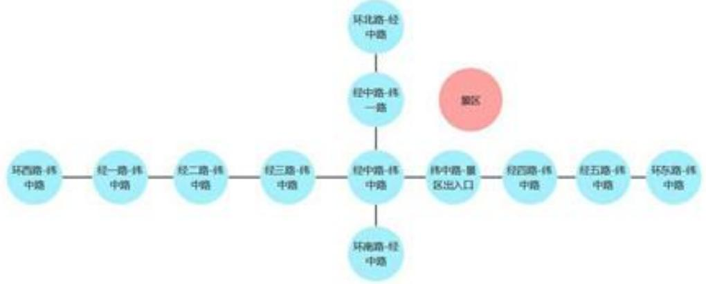

<details>
<summary>flowchart</summary>

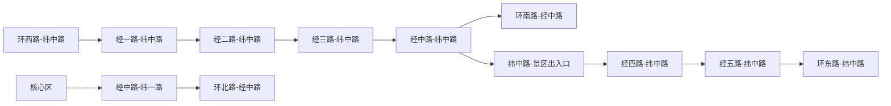
</details>

图 2-1 小镇主要道路示意图

## 2.1 问题 1 的分析

根据题意，首先对数据进行预处理，考虑到工作日、非工作日与节假日的影响，分析各路口交通流量，并进行可视化，将不同时间段进一步细分为划分为低峰期、高峰期和平峰期，然后建立数学模型估算直行和转弯车辆比例，最后运用Python软件且结合公式模型计算出一天中各时段的相位车流量。

## 2.2 问题 2 的分析

为得到两条主路的最高车流平均速度，首先进行数据的预处理，在问题一的基础上将各路口车的流量划分为低峰期、高峰期和平峰期，构建所有交叉路口的车流量模型和信号灯优化模型，并设计绿化带进一步优化模型，然后采用遗传算法计算出每个路口的最优绿灯时长及周期，最后用仿真模拟检验优化模型，推导出整体道路的最优平均速度。

## 2.3 问题 3 的分析

根据题目要求，为估算出景区所需的临时停车位数量，本问首先根据行驶路径、车辆速度以及出现频率来对巡游车辆进行识别，并设置阈值，得到巡游车辆，然后建立排队论模型估计停车的需求量，最终得到景区所需的临时停车位数量。

## 2.4 问题 4 的分析

依题意，首先对数据进行预处理，提取五一期间和非管控期间的交通数据，需选择评价指标：车流量、绕行车辆和通行方向，比较管控措施前后这些指标的变化，进而评价管控措施的效果。

## 三、模型假设

1. 假设问题二中黄灯对整个模型的影响忽略不计；  
2. 假设问题二中平均停车时间为 2 小时（每个停车位每小时有 0.5 辆车离开）；  
3. 假设问题三仿真模拟中无交通事故发生。

## 四、定义与符号说明

<table><tr><td>符号定义</td><td>符号说明</td></tr><tr><td>k</td><td>聚类的数量</td></tr><tr><td> $X_{i}$ </td><td>数据 i 点的位置</td></tr><tr><td> $\mu_{k}$ </td><td>聚类 $C_{j}$ 的中心点</td></tr><tr><td> $C_i$ </td><td>在点i处建设配送站的成本</td></tr><tr><td> $\|x_i - \mu_j\|$ </td><td>数据 $x_i$ 到质心 $\mu_j$ 的欧几里得距离</td></tr><tr><td>J</td><td>所有数据点到其所属聚类质心的距离</td></tr><tr><td> $\xi_{i,j}$ </td><td>总流量</td></tr><tr><td>ω</td><td>左转</td></tr><tr><td>γ</td><td>直行</td></tr><tr><td>λ</td><td>右转</td></tr><tr><td> $G_{ij}$ </td><td>交叉口i上第j个相位的绿灯时间</td></tr><tr><td> $R_i$ </td><td>交叉口i的红灯时间</td></tr><tr><td> $T_i$ </td><td>第i个交叉信号灯周期总时间</td></tr></table>

## 五、模型的建立与求解

## 5.1 问题 1 的模型建立与求解

## 5.1.1 题目信息分析

本题需要估计不同时段经中路-纬中路交叉口各个相位（包括四个方向直行、转弯）车流量，分析本问附件1与附件2的数据，具有以下特征：

1、数据的庞大性：由于附件2纬中路各交叉口车辆信息的数据高达8844996，因此为了高效地解决本问题，会结合历史数据和现有的流量模型进行估算。

2、交叉路口的相位只有四种组合方式：相位1南北直行、相位2南北左转、相位3东西直行、相位4东西左转。

用 CAD 软件大致绘画出四种相位的组合方式，如下：


<details>
<summary>natural_image</summary>

Pure diagram of four perpendicular lines with arrows indicating direction (no text or symbols)
</details>

相位1南北直行


<details>
<summary>natural_image</summary>

Pure electrical circuit lines without any symbols
</details>

相位2南北左转


<details>
<summary>natural_image</summary>

Pure geometric diagram with four perpendicular lines and two arrows, no text or symbols present
</details>

相位3东西直行

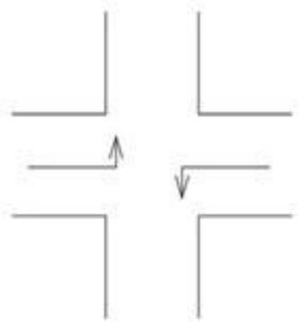

<details>
<summary>natural_image</summary>

Pure geometric lines forming a symmetrical pattern with arrows indicating direction (no text or symbols)
</details>

相位4东西左转  
图 5-1 交叉路口相位

## 5.1.2 数据预处理

本问的数据较多，在建立模型前首先对数据进行预处理，发现附件2中的数据存在异常值，即未挂车牌的车辆，因此需要对数据进行异常值处理。附件2中纬中路各交叉口车辆信息中存在近20万辆未挂车牌的车辆，由于该部分车辆只占总数据的比例为0.025，因此，使用python软件将未挂车牌的车辆进行异常值处理，将其直接从中剔除，后将经中路-纬中路的数据整理筛选出来。

## Step1: 考虑到工作日、非工作日与节假日的影响，分析交通流量

运用 python 软件将筛选出来经中路-纬中路的数据按工作日、非工作日与节假日区分，区分后的表见支撑材料一。且统计每个时段的车流量，通过监控数据，分别统计各个时段内，每个相位通过的车辆总数。由于监控设备安装在停车线后方，并不知道车辆通过停车线后的转向。因此，我们通过研究下一个路口的车流量来分析该路口的转向。

## Step2: 将不同时间段的交通流量进行可视化

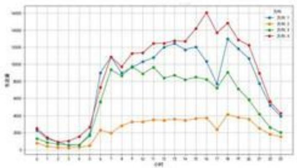

<details>
<summary>line</summary>

| 小时 | 2017 | 2018 | 2019 | 2023 |
| --- | --- | --- | --- | --- |
| 0 | ~250 | ~100 | ~150 | ~260 |
| 1 | ~150 | ~50 | ~80 | ~150 |
| 2 | ~100 | ~30 | ~60 | ~100 |
| 3 | ~100 | ~30 | ~60 | ~100 |
| 4 | ~150 | ~40 | ~70 | ~150 |
| 5 | ~250 | ~50 | ~180 | ~280 |
| 6 | ~900 | ~230 | ~370 | ~730 |
| 7 | ~1080 | ~200 | ~940 | ~1080 |
| 8 | ~970 | ~290 | ~870 | ~970 |
| 9 | ~1030 | ~330 | ~970 | ~1030 |
| 10 | ~1060 | ~340 | ~890 | ~1060 |
| 11 | ~1130 | ~350 | ~960 | ~1130 |
| 12 | ~1140 | ~350 | ~840 | ~1140 |
| 13 | ~1170 | ~360 | ~870 | ~1170 |
| 14 | ~1140 | ~350 | ~820 | ~1140 |
| 15 | ~1220 | ~360 | ~840 | ~1220 |
| 16 | ~1450 | ~370 | ~820 | ~1450 |
| 17 | ~980 | ~240 | ~730 | ~980 |
| 18 | ~1280 | ~420 | ~910 | ~1280 |
| 19 | ~1150 | ~390 | ~720 | ~1150 |
| 20 | ~1030 | ~370 | ~640 | ~1030 |
| 21 | ~890 | ~260 | ~430 | ~890 |
| 22 | ~450 | ~180 | ~270 | ~450 |
| 23 | ~410 | ~150 | ~210 | ~430 |
</details>

图 5-2 工作日不同时段的车流量

如上图,工作日在不同时段的车流量有着显著差异。凌晨时段四个方向的车流量都较少,9:00出现早高峰,为通勤高峰,车流量大;9:00-17:00的车流量整体呈现平稳状态;下午17:00至晚上20:00为晚高峰,与早高峰相似通勤车辆多，车流量大，夜间时段车流量逐渐减少，夜间娱乐、购物和晚餐时间段，车流量相对较高。

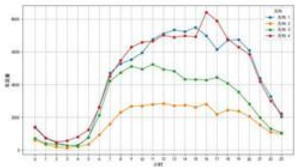

<details>
<summary>line</summary>

| 小时 | A/m 1 | A/m 2 | A/m 3 | A/m 4 |
| --- | --- | --- | --- | --- |
| 0 | ~1600 | ~1200 | ~1300 | ~1700 |
| 1 | ~1200 | ~900 | ~800 | ~1100 |
| 2 | ~800 | ~700 | ~600 | ~700 |
| 3 | ~800 | ~600 | ~500 | ~800 |
| 4 | ~1100 | ~700 | ~600 | ~1200 |
| 5 | ~1800 | ~1100 | ~1300 | ~1900 |
| 6 | ~3200 | ~1800 | ~2500 | ~3100 |
| 7 | ~4600 | ~2800 | ~4300 | ~4500 |
| 8 | ~5200 | ~3300 | ~4700 | ~5300 |
| 9 | ~5600 | ~3600 | ~5100 | ~6100 |
| 10 | ~6000 | ~3600 | ~4900 | ~6400 |
| 11 | ~6600 | ~3700 | ~5200 | ~6500 |
| 12 | ~7100 | ~3800 | ~5100 | ~6900 |
| 13 | ~7300 | ~3700 | ~4900 | ~6800 |
| 14 | ~7200 | ~3700 | ~4800 | ~6800 |
| 15 | ~7400 | ~3700 | ~4300 | ~6900 |
| 16 | ~7600 | ~3600 | ~4300 | ~6900 |
| 17 | ~6900 | ~3800 | ~4300 | ~8300 |
| 18 | ~6100 | ~3100 | ~4400 | ~7900 |
| 19 | ~6700 | ~3400 | ~4100 | ~7200 |
| 20 | ~6800 | ~3300 | ~3700 | ~6500 |
| 21 | ~6100 | ~2900 | ~3100 | ~5900 |
| 22 | ~4200 | ~2400 | ~2500 | ~4200 |
| 23 | ~3200 | ~2100 | ~2100 | ~3100 |
| 24 | ~2100 | ~2100 | ~2100 | ~2200 |
</details>

图 5-3 非工作日不同时段的车流量

由图可知，非工作日不同时段的最高车流量近 $8500 \, pcu/h$ ，为工作日的最高车流量的 1/2。从图的整体上来看，非工作日的不同时段车流量与工作日不同时段的车流量大体一致，但车流量数值不同，相比于工作日时的车流量非工作日的车流量较少。

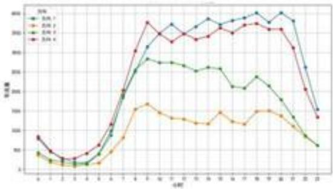

<details>
<summary>line</summary>

| 小时 | 2016年7月 | 2016年9月 | 2016年11月 | 2017年1月 |
| --- | --- | --- | --- | --- |
| 0 | ~450 | ~350 | ~400 | ~450 |
| 1 | ~350 | ~250 | ~300 | ~350 |
| 2 | ~300 | ~200 | ~250 | ~300 |
| 3 | ~300 | ~200 | ~250 | ~300 |
| 4 | ~350 | ~250 | ~300 | ~350 |
| 5 | ~550 | ~400 | ~450 | ~550 |
| 6 | ~950 | ~650 | ~850 | ~950 |
| 7 | ~1450 | ~1150 | ~1350 | ~1450 |
| 8 | ~1950 | ~1650 | ~1850 | ~1950 |
| 9 | ~2350 | ~1850 | ~2250 | ~2350 |
| 10 | ~2650 | ~1750 | ~2650 | ~2650 |
| 11 | ~2750 | ~1750 | ~2750 | ~2750 |
| 12 | ~2650 | ~1700 | ~2650 | ~2650 |
| 13 | ~2450 | ~1650 | ~2450 | ~2450 |
| 14 | ~2650 | ~1650 | ~2650 | ~2650 |
| 15 | ~2850 | ~1750 | ~2850 | ~2850 |
| 16 | ~2750 | ~1950 | ~2750 | ~2750 |
| 17 | ~2850 | ~1750 | ~2850 | ~2850 |
| 18 | ~2950 | ~1750 | ~2950 | ~2950 |
| 19 | ~3150 | ~2150 | ~3150 | ~3150 |
| 20 | ~3350 | ~2150 | ~3350 | ~3350 |
| 21 | ~3450 | ~2450 | ~3450 | ~3450 |
| 22 | ~3650 | ~2750 | ~3650 | ~3650 |
| 23 | ~3450 | ~2450 | ~3450 | ~3450 |
| 24 | ~2850 | ~1950 | ~2850 | ~2850 |
| 25 | ~1950 | ~1450 | ~1950 | ~1950 |
| 26 | ~1450 | ~950 | ~1450 | ~1450 |
| 27 | — | — | — | — |
| 28 | — | — | — | — |
| 29 | — | — | — | — |
| 30 | — | — | — | — |
| 31 | — | — | — | — |
| 32 | — | — | — | — |
| 33 | — | — | — | — |
| 34 | — | — | — | — |
| 35 | — | — | — | — |
| 36 | — | — | — | — |
| 37 | — | — | — | — |
| 38 | — | — | — | — |
| 39 | — | — | — | — |
| 40 | — | — | — | — |
| 41 | — | — | — | — |
| 42 | — | — | — | — |
| 43 | — | — | — | — |
| 44 | — | — | — | — |
| 45 | — | — | — | — |
| 46 | — | — | — | — |
| 47 | — | — | — | — |
| 48 | — | — | — | — |
| 49 | — | — | — | — |
| 50 | — | — | — | — |
| 51 | — | — | — | — |
| 52 | — | — | — | — |
</details>

图 5-4 节假日不同时段的车流量

如图，节假日的最高车流量最少，为工作日时车流量的1/4，为非工作日时车流量的1/2。节假日的不同时段车流量的大小与工作日和非工作日的车流量大小大体相同，但在不同方向的车流量存在一定差异，在中午12:00之前各方向的车流量排名为：方向4>方向1>方向3>方向2，当过了12:00以后方向1的车流量较高高，即由东向西方向的车比较多。

## 5.1.3 建立K-均值聚类算法模型

$^{[2]}$ K-均值聚类算法的目标是将数据集划分为K个族，使得同一族内的点尽可能相似，而不同族之间的点尽可能不同。本问根据题意建立如下公式：

目标函数：

$$
\mathrm{J} = \sum_ {j = 1} ^ {k} \sum_ {x _ {i} \in C _ {j}} \left\| x _ {i} - \mu_ {j} \right\| ^ {2} \tag {1}
$$

其中k是聚类的数量， $x_{i}$ 是数据i点的位置， $\mu_{j}$ 是聚类 $C_{j}$ 的中心点， $\left\|x_{i}-\mu_{j}\right\|$ 表示是数据点 $x_{i}$ 到质心 $\mu_{i}$ 的欧几里得距离。 $J$ 表示所有数据点到其所属聚类质心的距离平方和， $J$ 越小代表聚类的效果越好，分的种类越好。

## 5.1.4 模型的求解

## Step3: 将不同时间段进一步细分为划分为低峰期、高峰期和平峰期

根据题目要求，需要估算不同时间段各个相位的车流量，在前面分别对工作日、非工作日和节假日的分段基础上，利用上述模型，进一步细分时段。

如下：

表 5-5 工作日的进一步细分时段

<table><tr><td>时间</td><td>1</td><td>2</td><td>3</td><td>4</td><td>族</td><td>时期</td></tr><tr><td>7</td><td>10845</td><td>1970</td><td>9339</td><td>10834</td><td>0</td><td>高峰期</td></tr><tr><td>8</td><td>8976</td><td>2836</td><td>8620</td><td>9707</td><td>0</td><td>高峰期</td></tr><tr><td>9</td><td>9628</td><td>3264</td><td>9719</td><td>11264</td><td>0</td><td>高峰期</td></tr><tr><td>10</td><td>10283</td><td>3285</td><td>8876</td><td>11317</td><td>0</td><td>高峰期</td></tr><tr><td>11</td><td>10764</td><td>3532</td><td>9621</td><td>12422</td><td>0</td><td>高峰期</td></tr><tr><td>12</td><td>11992</td><td>3464</td><td>8370</td><td>12453</td><td>0</td><td>高峰期</td></tr><tr><td>13</td><td>12423</td><td>3608</td><td>8682</td><td>12735</td><td>0</td><td>高峰期</td></tr><tr><td>14</td><td>11690</td><td>3449</td><td>8166</td><td>12684</td><td>0</td><td>高峰期</td></tr><tr><td>15</td><td>12025</td><td>3657</td><td>8472</td><td>14165</td><td>0</td><td>高峰期</td></tr><tr><td>16</td><td>10309</td><td>3746</td><td>8202</td><td>16057</td><td>0</td><td>高峰期</td></tr><tr><td>17</td><td>7671</td><td>2393</td><td>7213</td><td>13677</td><td>0</td><td>高峰期</td></tr><tr><td>18</td><td>12945</td><td>4130</td><td>9040</td><td>14820</td><td>0</td><td>高峰期</td></tr><tr><td>19</td><td>11808</td><td>3805</td><td>7112</td><td>12867</td><td>0</td><td>高峰期</td></tr><tr><td>20</td><td>10672</td><td>3608</td><td>5842</td><td>12223</td><td>0</td><td>高峰期</td></tr><tr><td>0</td><td>2266</td><td>784</td><td>1314</td><td>2506</td><td>1</td><td>低峰期</td></tr><tr><td>1</td><td>1288</td><td>403</td><td>855</td><td>1435</td><td>1</td><td>低峰期</td></tr><tr><td>2</td><td>912</td><td>245</td><td>650</td><td>888</td><td>1</td><td>低峰期</td></tr><tr><td>3</td><td>519</td><td>241</td><td>588</td><td>1028</td><td>1</td><td>低峰期</td></tr><tr><td>4</td><td>557</td><td>306</td><td>543</td><td>1550</td><td>1</td><td>低峰期</td></tr><tr><td>5</td><td>1788</td><td>491</td><td>1649</td><td>2647</td><td>1</td><td>低峰期</td></tr><tr><td>23</td><td>3927</td><td>1550</td><td>2022</td><td>4269</td><td>1</td><td>低峰期</td></tr><tr><td>6</td><td>8983</td><td>2301</td><td>5604</td><td>7256</td><td>2</td><td>平峰期</td></tr><tr><td>21</td><td>7705</td><td>2502</td><td>4174</td><td>8930</td><td>2</td><td>平峰期</td></tr><tr><td>22</td><td>5237</td><td>1811</td><td>2634</td><td>5624</td><td>2</td><td>平峰期</td></tr></table>

表 5-6 非工作日的进一步细分时段

<table><tr><td>时间</td><td>1</td><td>2</td><td>3</td><td>4</td><td>族</td><td>时期</td></tr><tr><td>0</td><td>1369</td><td>613</td><td>723</td><td>1422</td><td>0</td><td>低峰期</td></tr><tr><td>1</td><td>715</td><td>341</td><td>399</td><td>748</td><td>0</td><td>低峰期</td></tr><tr><td>2</td><td>456</td><td>185</td><td>348</td><td>483</td><td>0</td><td>低峰期</td></tr><tr><td>3</td><td>280</td><td>141</td><td>284</td><td>562</td><td>0</td><td>低峰期</td></tr><tr><td>4</td><td>288</td><td>209</td><td>249</td><td>808</td><td>0</td><td>低峰期</td></tr><tr><td>5</td><td>766</td><td>343</td><td>794</td><td>1237</td><td>0</td><td>低峰期</td></tr><tr><td>7</td><td>4699</td><td>1594</td><td>4213</td><td>4508</td><td>1</td><td>高峰期</td></tr><tr><td>8</td><td>5278</td><td>2303</td><td>4727</td><td>5471</td><td>1</td><td>高峰期</td></tr><tr><td>9</td><td>5520</td><td>2681</td><td>5114</td><td>6279</td><td>1</td><td>高峰期</td></tr><tr><td>10</td><td>5942</td><td>2698</td><td>4940</td><td>6583</td><td>1</td><td>高峰期</td></tr><tr><td>11</td><td>6768</td><td>2791</td><td>5227</td><td>6646</td><td>1</td><td>高峰期</td></tr><tr><td>12</td><td>7102</td><td>2843</td><td>4933</td><td>7009</td><td>1</td><td>高峰期</td></tr><tr><td>13</td><td>7332</td><td>2713</td><td>4819</td><td>6886</td><td>1</td><td>高峰期</td></tr><tr><td>14</td><td>7234</td><td>2747</td><td>4318</td><td>6970</td><td>1</td><td>高峰期</td></tr><tr><td>15</td><td>7489</td><td>2629</td><td>4309</td><td>6916</td><td>1</td><td>高峰期</td></tr><tr><td>16</td><td>6975</td><td>2807</td><td>4274</td><td>8417</td><td>1</td><td>高峰期</td></tr><tr><td>17</td><td>6134</td><td>2184</td><td>4438</td><td>7888</td><td>1</td><td>高峰期</td></tr><tr><td>18</td><td>6699</td><td>2444</td><td>4076</td><td>6777</td><td>1</td><td>高峰期</td></tr><tr><td>19</td><td>6746</td><td>2385</td><td>3544</td><td>6279</td><td>1</td><td>高峰期</td></tr><tr><td>20</td><td>6081</td><td>2051</td><td>2819</td><td>5854</td><td>1</td><td>高峰期</td></tr><tr><td>6</td><td>2643</td><td>923</td><td>2123</td><td>2596</td><td>2</td><td>平峰期</td></tr><tr><td>21</td><td>4380</td><td>1525</td><td>1982</td><td>4190</td><td>2</td><td>平峰期</td></tr><tr><td>22</td><td>3278</td><td>1093</td><td>1299</td><td>3003</td><td>2</td><td>平峰期</td></tr><tr><td>23</td><td>2048</td><td>1000</td><td>1062</td><td>2222</td><td>2</td><td>平峰期</td></tr></table>

表 5-7 节假日的进一步细分时段

<table><tr><td>时间</td><td>1</td><td>2</td><td>3</td><td>4</td><td>族</td><td>时期</td></tr><tr><td>8</td><td>2514</td><td>1539</td><td>2550</td><td>3042</td><td>0</td><td>高峰期</td></tr><tr><td>9</td><td>3141</td><td>1673</td><td>2834</td><td>3768</td><td>0</td><td>高峰期</td></tr><tr><td>10</td><td>3490</td><td>1454</td><td>2737</td><td>3475</td><td>0</td><td>高峰期</td></tr><tr><td>11</td><td>3722</td><td>1316</td><td>2738</td><td>3271</td><td>0</td><td>高峰期</td></tr><tr><td>12</td><td>3469</td><td>1290</td><td>2661</td><td>3483</td><td>0</td><td>高峰期</td></tr><tr><td>13</td><td>3663</td><td>1182</td><td>2522</td><td>3336</td><td>0</td><td>高峰期</td></tr><tr><td>14</td><td>3861</td><td>1169</td><td>2613</td><td>3414</td><td>0</td><td>高峰期</td></tr><tr><td>15</td><td>3715</td><td>1462</td><td>2579</td><td>3632</td><td>0</td><td>高峰期</td></tr><tr><td>16</td><td>3822</td><td>1223</td><td>2125</td><td>3502</td><td>0</td><td>高峰期</td></tr><tr><td>17</td><td>3885</td><td>1155</td><td>2080</td><td>3702</td><td>0</td><td>高峰期</td></tr><tr><td>18</td><td>4016</td><td>1483</td><td>2375</td><td>3743</td><td>0</td><td>高峰期</td></tr><tr><td>19</td><td>3771</td><td>1506</td><td>2138</td><td>3597</td><td>0</td><td>高峰期</td></tr><tr><td>20</td><td>4019</td><td>1369</td><td>1786</td><td>3592</td><td>0</td><td>高峰期</td></tr><tr><td>21</td><td>3808</td><td>1102</td><td>1342</td><td>3117</td><td>0</td><td>高峰期</td></tr><tr><td>6</td><td>988</td><td>453</td><td>872</td><td>1161</td><td>1</td><td>平峰期</td></tr><tr><td>7</td><td>1850</td><td>814</td><td>1909</td><td>2027</td><td>1</td><td>平峰期</td></tr><tr><td>22</td><td>2620</td><td>838</td><td>865</td><td>2056</td><td>1</td><td>平峰期</td></tr><tr><td>23</td><td>1535</td><td>614</td><td>615</td><td>1342</td><td>1</td><td>平峰期</td></tr><tr><td>0</td><td>785</td><td>362</td><td>427</td><td>837</td><td>2</td><td>低峰期</td></tr><tr><td>1</td><td>446</td><td>184</td><td>237</td><td>476</td><td>2</td><td>低峰期</td></tr><tr><td>2</td><td>287</td><td>108</td><td>191</td><td>254</td><td>2</td><td>低峰期</td></tr><tr><td>3</td><td>177</td><td>81</td><td>126</td><td>279</td><td>2</td><td>低峰期</td></tr><tr><td>4</td><td>167</td><td>117</td><td>141</td><td>409</td><td>2</td><td>低峰期</td></tr><tr><td>5</td><td>397</td><td>160</td><td>390</td><td>625</td><td>2</td><td>低峰期</td></tr></table>

由上表可知，一天24小时大致按7:3:2的比例将工作日、非工作日与节假日的各时间段进一步细分为高峰期、低峰期和平峰期，其中这三个不同时期的高峰期最多，都有14个小时，低峰期有6-7小时，平峰期最少，只有3-4小时，由此可见，该路口的交通压力增大，容易增加事故的风险。将三个不同时间段的细分时段汇总表如下：

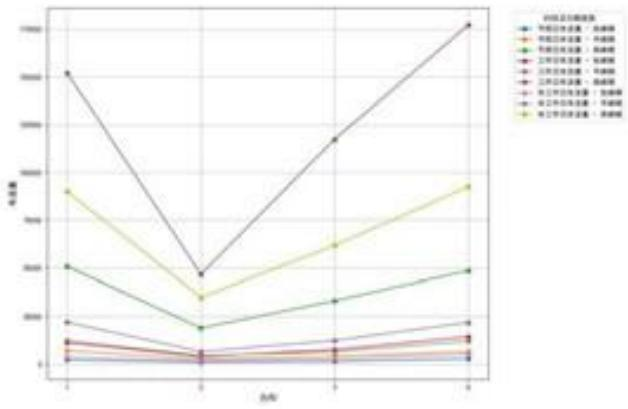

<details>
<summary>line</summary>

| 合计 | 一季度总体涨幅 | 平周总体涨幅 | 节期总体涨幅 | 工业总体涨幅 | 省工贸总体涨幅 | 一季度总体涨幅 | 省工贸总体涨幅 | 全业总体涨幅 | 平周总体涨幅 |
| --- | --- | --- | --- | --- | --- | --- | --- | --- | --- |
| 1 | ~20000 | ~5000 | ~10000 | ~15000 | ~5000 | ~10000 | ~15000 | ~5000 | ~10000 |
| 2 | ~18000 | ~4000 | ~9000 | ~14000 | ~4500 | ~9500 | ~14500 | ~4500 | ~9500 |
| 3 | ~28000 | ~6000 | ~12000 | ~17000 | ~6500 | ~13500 | ~18500 | ~6500 | ~13500 |
| 4 | ~38000 | ~8000 | ~15000 | ~22000 | ~9500 | ~17500 | ~23500 | ~9500 | ~17500 |
</details>

图 5-8 三个不同时段的细分时段汇总

由图可知,工作日存在高峰期的车流量最多,然后依次为非工作日的平峰期、节假日的高峰期、工作日的平峰期、工作日的低峰期、非工作日的平峰期、节假日的平峰期、非工作日的低峰期、节假日的低峰期。

## Step4: 估算直行和转弯车辆比例

由于附件 2 中只提供了车辆在交叉路口相位（即直行）的数据，并未给出转弯的数据，无法直接区分车辆的转向行为，因此，需要结合历史数据和现有的流量模型，通过细分时段和估算比例的方法，得到每个相位在不同时间段内的车流量估算。为计算各方向流量，建立如下公式：

假设车辆在交叉口的转向比例是已知的（通过历史数据或交通规则推断），则可以估计左转、直行和右转的流量。设转向比例为 $\omega,\gamma,\lambda$ 分别代表左转、直行和右转的比例，其中 $\xi_{i,j}$ 表示总流量。则各方向流量表达式为：

①直行流量

$$
\xi_ {\mathrm{i,j}} ^ {\mathrm{直行}} = \omega_ {\mathrm{i}} \times \xi_ {\mathrm{i,j}} \tag {2}
$$

②左转流量

$$
\xi_ {i, j} ^ {\mathrm{左转}} = \gamma_ {\mathrm{i}} \times \xi_ {\mathrm{i}, j} \tag {3}
$$

③右转流量

$$
\xi_ {i, j} ^ {\mathrm{右转}} = \lambda_ {\mathrm{i}} \times \xi_ {\mathrm{i}, j} \tag {4}
$$

由于车的型号过多，根据每个路口的历史数据，了解在某个时段内，特定路口的车辆转弯比例。比如，如果在早高峰时段通过上述公式可得20%的车辆是转弯的，那么可以将总车流量的20%划分为转弯车辆，其余80%为直行车辆。

## Step5: 运用 Python 软件结合公式模型分配转弯比例

将进一步细分时段的工作日、非工作日与节假日进行汇总，得到下表：

图 5-9 工作日进一步细分时段车流量汇总

<table><tr><td>时期</td><td>1</td><td>2</td><td>3</td><td>4</td></tr><tr><td>低峰期</td><td>11257</td><td>4020</td><td>7621</td><td>14323</td></tr><tr><td>平峰期</td><td>21925</td><td>6614</td><td>12412</td><td>21810</td></tr><tr><td>高峰期</td><td>152031</td><td>46747</td><td>117274</td><td>177225</td></tr></table>

图 5-10 非工作日进一步细分时段车流量汇总

<table><tr><td>时期</td><td>1</td><td>2</td><td>3</td><td>4</td></tr><tr><td>低峰期</td><td>3874</td><td>1832</td><td>2797</td><td>5260</td></tr><tr><td>平峰期</td><td>12349</td><td>4541</td><td>6466</td><td>12011</td></tr><tr><td>高峰期</td><td>89999</td><td>34870</td><td>61751</td><td>92483</td></tr></table>

图 5-11 节假日进一步细分时段车流量汇总

<table><tr><td>时期</td><td>1</td><td>2</td><td>3</td><td>4</td></tr><tr><td>低峰期</td><td>2259</td><td>1012</td><td>1512</td><td>2880</td></tr><tr><td>平峰期</td><td>6993</td><td>2719</td><td>4261</td><td>6586</td></tr><tr><td>高峰期</td><td>50896</td><td>18923</td><td>33080</td><td>48674</td></tr></table>

运用 Python 软件结合公式模型将车辆行驶方向的各比例求出来，得到不同时段车辆行驶方向的比例：

①高峰期：直行：左转：右转=0.8:0.1:0.1  
②平峰期：直行：左转：右转=0.7：0.2：0.1  
③低峰期：直行：左转：右转=0.6:0.2:0.2

## 5.1.5 结论分析

(1) 工作日三个时段的相位车流量:

<table><tr><td>时期</td><td>1直行</td><td>1左转</td><td>1右转</td><td>2直行</td><td>2左转</td><td>2右转</td><td>3直行</td><td>3左转</td><td>3右转</td><td>4直行</td><td>4左转</td><td>4右转</td></tr><tr><td>低峰期</td><td>6754</td><td>2251</td><td>2251</td><td>2412</td><td>804</td><td>804</td><td>4573</td><td>1524</td><td>1524</td><td>8594</td><td>2865</td><td>2865</td></tr><tr><td>平峰期</td><td>15347</td><td>4385</td><td>2192</td><td>4630</td><td>1323</td><td>661</td><td>8688</td><td>2482</td><td>1241</td><td>15267</td><td>4362</td><td>2181</td></tr><tr><td>高峰期</td><td>121625</td><td>15203</td><td>15203</td><td>37398</td><td>4675</td><td>4675</td><td>93819</td><td>11727</td><td>11727</td><td>141780</td><td>17722</td><td>17722</td></tr></table>

由表可知，低峰期直行和左转的车流量相对较低；在平峰期直行车流量显著增加，左转和右转车流量也有所增加，总体车流量较低峰期有明显增长；在高峰期，直行车流量最高可达8594pcu/h。

(2) 非工作日三个时段的相位车流量:

<table><tr><td>时期</td><td>1直行</td><td>1左转</td><td>1右转</td><td>2直行</td><td>2左转</td><td>2右转</td><td>3直行</td><td>3左转</td><td>3右转</td><td>4直行</td><td>4左转</td><td>4右转</td></tr><tr><td>低峰期</td><td>2324</td><td>775</td><td>775</td><td>1099</td><td>366</td><td>366</td><td>1678</td><td>559</td><td>559</td><td>3156</td><td>1052</td><td>1052</td></tr><tr><td>平峰期</td><td>8644</td><td>2470</td><td>1235</td><td>3179</td><td>908</td><td>454</td><td>4526</td><td>1293</td><td>647</td><td>8408</td><td>2402</td><td>1201</td></tr><tr><td>高峰期</td><td>71999</td><td>9000</td><td>9000</td><td>27896</td><td>3487</td><td>3487</td><td>49401</td><td>6175</td><td>6175</td><td>73986</td><td>9248</td><td>9248</td></tr></table>

如上表，低峰期整体交通相对畅通，左转和右转车流量相对较低。平峰期流量显著增加，直行车流量和左转车流量都有所提高；高峰期的车流量大幅增加，特别是直行车流量，达到71999 pcu/h，可能会导致交通拥堵。

(3) 节假日日三个时段的相位车流量:

<table><tr><td>时期</td><td>1直行</td><td>1左转</td><td>1右转</td><td>2直行</td><td>2左转</td><td>2右转</td><td>3直行</td><td>3左转</td><td>3右转</td><td>4直行</td><td>4左转</td><td>4右转</td></tr><tr><td>低峰期</td><td>1355</td><td>452</td><td>452</td><td>607</td><td>202</td><td>202</td><td>907</td><td>302</td><td>302</td><td>1728</td><td>576</td><td>576</td></tr><tr><td>平峰期</td><td>4895</td><td>1399</td><td>699</td><td>1903</td><td>544</td><td>272</td><td>2983</td><td>852</td><td>426</td><td>4610</td><td>1317</td><td>659</td></tr><tr><td>高峰期</td><td>40717</td><td>5090</td><td>5090</td><td>15138</td><td>1892</td><td>1892</td><td>26464</td><td>3308</td><td>3308</td><td>38939</td><td>4867</td><td>4867</td></tr></table>

注：其中1为由东向西方向，2为由西向东方向，3为由南向北方向，4为由北向南方向。单位：pcu/h

由上表可知，节假日总体车流量较低，分布相对均衡，但都显著低于平峰期和高峰期；平峰期的车流量明显高于低峰期，尤其是直行和左转车流量有所增加；高峰期的直行车流量非常高，最高达73986pcu/h，可能会导致严重的拥堵事故。

## 5.2 问题 2 的模型建立与求解

## 5.2.1 题目信息分析

本题要求优化经中路和纬中路上所有交叉口的信号灯配置，以提高两条主路上的车流平均速度。车流的平均速度受到多种因素影响，如交通信号因素和交通密度因素，具体因素分析如下：

1、交通信号因素：红绿灯的周期和控制策略直接影响车辆的行驶速度

2、交通密度因素：车流量的多少决定了车速，特别是在高峰时段和低峰时段，车流量多时速度通常较低。

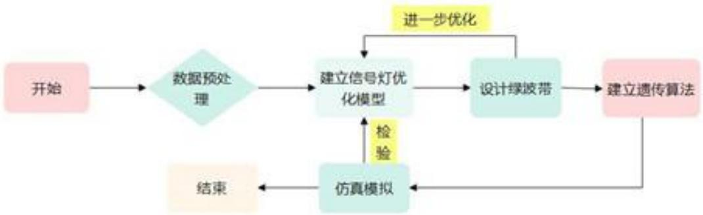

<details>
<summary>flowchart</summary>

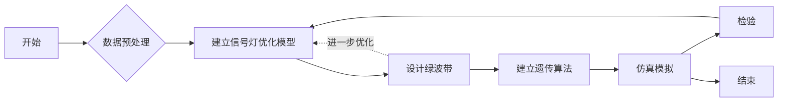
</details>

图 5-12 问题二流程图

## 5.2.2 数据预处理，并进行可视化

基于问题一的基础上，首先利用 python 软件对附件 2 中各交叉路口的总车流量进行数据分析处理，进而绘制出每个交叉路口车流量在各时间段的总车流量图。

如下：

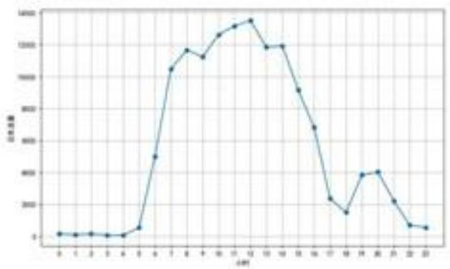

<details>
<summary>line</summary>

| 小时 | 进 intake量 |
| --- | --- |
| 0 | ~50 |
| 1 | ~30 |
| 2 | ~40 |
| 3 | ~30 |
| 4 | ~20 |
| 5 | ~80 |
| 6 | ~500 |
| 7 | ~1050 |
| 8 | ~1150 |
| 9 | ~1100 |
| 10 | ~1250 |
| 11 | ~1300 |
| 12 | ~1350 |
| 13 | ~1200 |
| 14 | ~1200 |
| 15 | ~900 |
| 16 | ~680 |
| 17 | ~320 |
| 18 | ~220 |
| 19 | ~380 |
| 20 | ~400 |
| 21 | ~320 |
| 22 | ~120 |
| 23 | ~100 |
</details>

图 5-13 环东路-纬中路

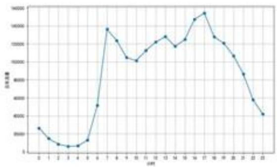

<details>
<summary>line</summary>

| Day | Value |
| --- | --- |
| 1 | ~2600 |
| 2 | ~1600 |
| 3 | ~800 |
| 4 | ~800 |
| 5 | ~1300 |
| 6 | ~3200 |
| 7 | ~13800 |
| 8 | ~12300 |
| 9 | ~10400 |
| 10 | ~10100 |
| 11 | ~11500 |
| 12 | ~12200 |
| 13 | ~12800 |
| 14 | ~11800 |
| 15 | ~12400 |
| 16 | ~13600 |
| 17 | ~14400 |
| 18 | ~12700 |
| 19 | ~12100 |
| 20 | ~11300 |
| 21 | ~9500 |
| 22 | ~5900 |
| 23 | ~4100 |
</details>

图 5-14 环西路-纬中路

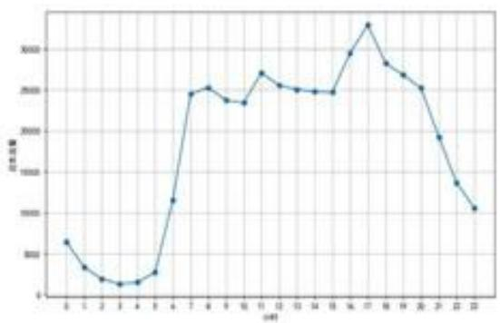

<details>
<summary>line</summary>

| Day | Value |
| --- | --- |
| 0 | ~6500 |
| 1 | ~4500 |
| 2 | ~2500 |
| 3 | ~1500 |
| 4 | ~1800 |
| 5 | ~3000 |
| 6 | ~11500 |
| 7 | ~24500 |
| 8 | ~25500 |
| 9 | ~23500 |
| 10 | ~23200 |
| 11 | ~27000 |
| 12 | ~25500 |
| 13 | ~25000 |
| 14 | ~24800 |
| 15 | ~24800 |
| 16 | ~29500 |
| 17 | ~33500 |
| 18 | ~28000 |
| 19 | ~26500 |
| 20 | ~25000 |
| 21 | ~19000 |
| 22 | ~13500 |
| 23 | ~11000 |
</details>

图 5-15 经二路-纬中路

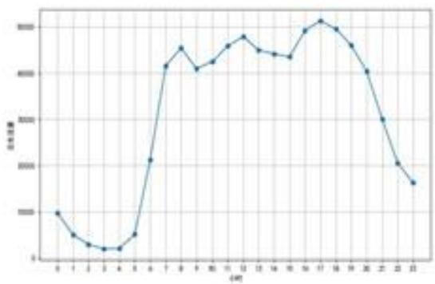

<details>
<summary>line</summary>

| Time (AM) | Value |
| --- | --- |
| 0 | ~5000 |
| 1 | ~2000 |
| 2 | ~1500 |
| 3 | ~1000 |
| 4 | ~1000 |
| 5 | ~2500 |
| 6 | ~6500 |
| 7 | ~8500 |
| 8 | ~9500 |
| 9 | ~8500 |
| 10 | ~9000 |
| 11 | ~9500 |
| 12 | ~10000 |
| 13 | ~9500 |
| 14 | ~9250 |
| 15 | ~9250 |
| 16 | ~9250 |
| 17 | ~10000 |
| 18 | ~10500 |
| 19 | ~10000 |
| 20 | ~9500 |
| 21 | ~8500 |
| 22 | ~6500 |
| 23 | ~5500 |
| 24 | ~4500 |
</details>

图 5-16 经三路-纬中路

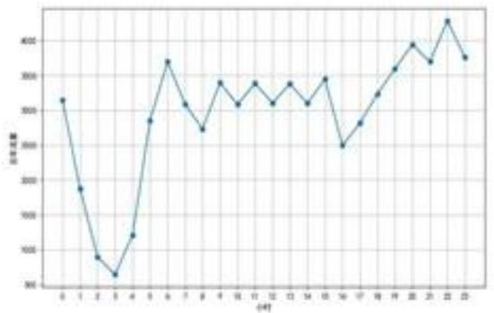

<details>
<summary>line</summary>

| Category | Value |
| --- | --- |
| 0 | ~2750 |
| 1 | ~1800 |
| 2 | ~850 |
| 3 | ~600 |
| 4 | ~1400 |
| 5 | ~2750 |
| 6 | ~3400 |
| 7 | ~3150 |
| 8 | ~2500 |
| 9 | ~2850 |
| 10 | ~3150 |
| 11 | ~2850 |
| 12 | ~3150 |
| 13 | ~2850 |
| 14 | ~3150 |
| 15 | ~2950 |
| 16 | ~2000 |
| 17 | ~2650 |
| 18 | ~3150 |
| 19 | ~3600 |
| 20 | ~3900 |
| 21 | ~3400 |
| 22 | ~4400 |
| 23 | ~3550 |
</details>

图 5-17 经四路-纬中路

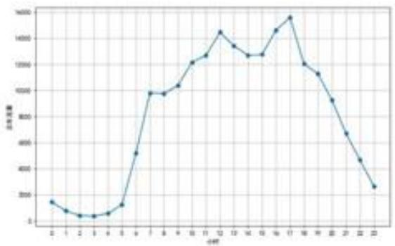

<details>
<summary>line</summary>

| 小时 | 总重量 |
| --- | --- |
| 0 | ~1500 |
| 1 | ~800 |
| 2 | ~400 |
| 3 | ~400 |
| 4 | ~600 |
| 5 | ~1300 |
| 6 | ~5200 |
| 7 | ~9800 |
| 8 | ~9700 |
| 9 | ~10300 |
| 10 | ~12200 |
| 11 | ~12600 |
| 12 | ~14400 |
| 13 | ~13500 |
| 14 | ~12700 |
| 15 | ~12700 |
| 16 | ~14500 |
| 17 | ~15600 |
| 18 | ~12200 |
| 19 | ~11300 |
| 20 | ~9200 |
| 21 | ~6800 |
| 22 | ~4600 |
| 23 | ~2600 |
</details>

图 5-18 经五路-纬中路

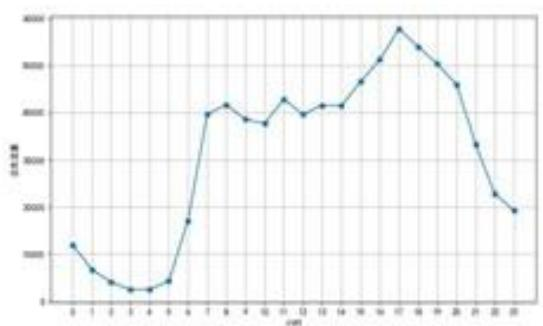

<details>
<summary>line</summary>

| hour | intake (g) |
| --- | --- |
| 0 | ~1300 |
| 1 | ~700 |
| 2 | ~400 |
| 3 | ~250 |
| 4 | ~250 |
| 5 | ~400 |
| 6 | ~1800 |
| 7 | ~3900 |
| 8 | ~4100 |
| 9 | ~3800 |
| 10 | ~3700 |
| 11 | ~4200 |
| 12 | ~3900 |
| 13 | ~4100 |
| 14 | ~4100 |
| 15 | ~4600 |
| 16 | ~5100 |
| 17 | ~5800 |
| 18 | ~5500 |
| 19 | ~5100 |
| 20 | ~4600 |
| 21 | ~3300 |
| 22 | ~2300 |
| 23 | ~2000 |
</details>

图 5-19 经一路-纬中路

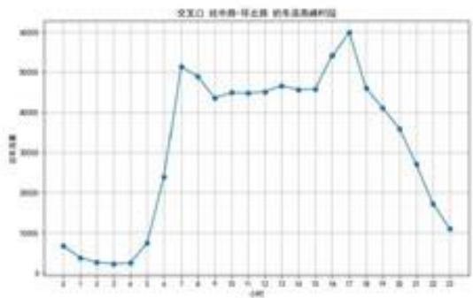

<details>
<summary>line</summary>

| 小时 | 车流量 |
| --- | --- |
| 0 | ~6500 |
| 1 | ~3500 |
| 2 | ~2500 |
| 3 | ~2000 |
| 4 | ~2000 |
| 5 | ~7500 |
| 6 | ~24000 |
| 7 | ~31000 |
| 8 | ~29000 |
| 9 | ~24000 |
| 10 | ~25500 |
| 11 | ~25500 |
| 12 | ~25500 |
| 13 | ~26500 |
| 14 | ~26000 |
| 15 | ~26000 |
| 16 | ~34000 |
| 17 | ~40000 |
| 18 | ~26500 |
| 19 | ~21500 |
| 20 | ~17500 |
| 21 | ~13500 |
| 22 | ~11500 |
</details>

图 5-20 经中路-环北路

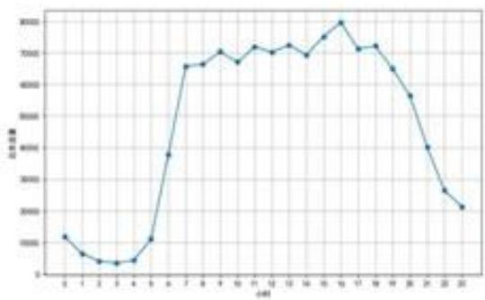

<details>
<summary>line</summary>

| hour | Value |
| --- | --- |
| 0 | ~1200 |
| 1 | ~600 |
| 2 | ~400 |
| 3 | ~350 |
| 4 | ~400 |
| 5 | ~1100 |
| 6 | ~3700 |
| 7 | ~6500 |
| 8 | ~6600 |
| 9 | ~7100 |
| 10 | ~6700 |
| 11 | ~7200 |
| 12 | ~7000 |
| 13 | ~7200 |
| 14 | ~6900 |
| 15 | ~7500 |
| 16 | ~8000 |
| 17 | ~7100 |
| 18 | ~7200 |
| 19 | ~6500 |
| 20 | ~5600 |
| 21 | ~4000 |
| 22 | ~2700 |
| 23 | ~2100 |
</details>

图 5-21 经中路-环南路

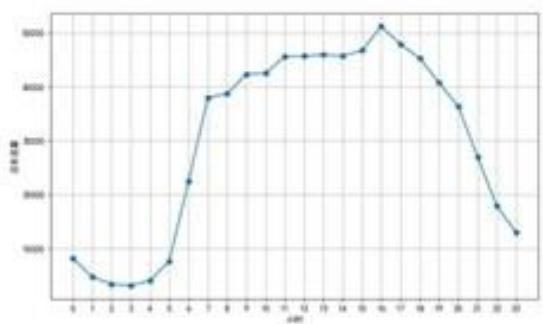

<details>
<summary>line</summary>

| hour | value |
| --- | --- |
| 0 | ~1850 |
| 1 | ~1700 |
| 2 | ~1650 |
| 3 | ~1650 |
| 4 | ~1700 |
| 5 | ~1850 |
| 6 | ~2600 |
| 7 | ~3800 |
| 8 | ~3900 |
| 9 | ~4200 |
| 10 | ~4250 |
| 11 | ~4500 |
| 12 | ~4550 |
| 13 | ~4550 |
| 14 | ~4550 |
| 15 | ~4600 |
| 16 | ~5100 |
| 17 | ~4800 |
| 18 | ~4500 |
| 19 | ~4100 |
| 20 | ~3700 |
| 21 | ~2800 |
| 22 | ~2300 |
| 23 | ~1900 |
</details>

图 5-22 经中路-纬一路

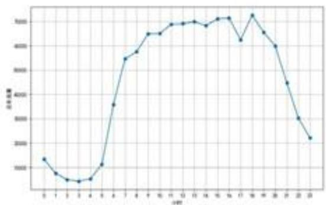

<details>
<summary>line</summary>

| Day | Value |
| --- | --- |
| 0 | ~1400 |
| 1 | ~800 |
| 2 | ~600 |
| 3 | ~550 |
| 4 | ~600 |
| 5 | ~1100 |
| 6 | ~3200 |
| 7 | ~4900 |
| 8 | ~5200 |
| 9 | ~5600 |
| 10 | ~5500 |
| 11 | ~5800 |
| 12 | ~5900 |
| 13 | ~6000 |
| 14 | ~5700 |
| 15 | ~6100 |
| 16 | ~6100 |
| 17 | ~4400 |
| 18 | ~6300 |
| 19 | ~5300 |
| 20 | ~4000 |
| 21 | ~2800 |
| 22 | ~2100 |
| 23 | ~1600 |
</details>

图 5-23 经中路-纬中路

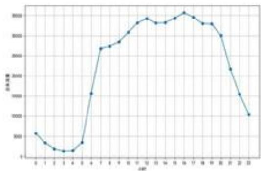

<details>
<summary>line</summary>

| Day | Value |
| --- | --- |
| 0 | ~3500 |
| 1 | ~2500 |
| 2 | ~1800 |
| 3 | ~1500 |
| 4 | ~1600 |
| 5 | ~2500 |
| 6 | ~11000 |
| 7 | ~24000 |
| 8 | ~25000 |
| 9 | ~26500 |
| 10 | ~29000 |
| 11 | ~31500 |
| 12 | ~33500 |
| 13 | ~32500 |
| 14 | ~32800 |
| 15 | ~34500 |
| 16 | ~36500 |
| 17 | ~34500 |
| 18 | ~33500 |
| 19 | ~33500 |
| 20 | ~30000 |
| 21 | ~23500 |
| 22 | ~18500 |
| 23 | ~11000 |
</details>

图 5-24 纬中路-景区出入口

由上述图可知，每个交叉路口的总车流量不一致，车流量最高的是环西路-纬中路交叉路口，高达160000 pcu/h，最少的为经四-纬中路交叉路口，最高的车流量只有 5000 pcu/h 左右。但是整体上都呈现上升趋于平缓最后减少的趋势。

## Step1: 基于问题一的模型进行时段的划分

通过上述分析，各交叉路口的总车流量在不同时刻出现了不同的峰值，与问题一步骤一致，首先将每个交叉口的车流量划分三个时段分别为工作日、非工作日与节假日，然后运用问题一建立的k-均值聚类算法模型，再对各交叉路口的总车流量进行进一步的时段划分，按小时划分为低峰期，平峰期和高峰期。

由于表格数据过多，因此只取部分交叉路口的工作日、非工作日与节假日中的同一段时间内的高峰期、低峰期与平峰期数据，具体详见支撑材料二。

如下：

## (1) 工作日

表 5-25 纬东路-纬中路

<table><tr><td>方向</td><td>时间</td><td>车流总量</td><td>总车流量</td><td>族</td><td>时期</td></tr><tr><td>1</td><td>7</td><td>1654</td><td>6914</td><td>2</td><td>高峰期</td></tr><tr><td>2</td><td>7</td><td>639</td><td>6914</td><td>2</td><td>高峰期</td></tr><tr><td>3</td><td>7</td><td>2186</td><td>6914</td><td>2</td><td>高峰期</td></tr><tr><td>4</td><td>7</td><td>2435</td><td>6914</td><td>2</td><td>高峰期</td></tr><tr><td>1</td><td>0</td><td>39</td><td>178</td><td>1</td><td>低峰期</td></tr><tr><td>2</td><td>0</td><td>9</td><td>178</td><td>1</td><td>低峰期</td></tr><tr><td>3</td><td>0</td><td>41</td><td>178</td><td>1</td><td>低峰期</td></tr><tr><td>4</td><td>0</td><td>89</td><td>178</td><td>1</td><td>低峰期</td></tr><tr><td>1</td><td>6</td><td>627</td><td>3373</td><td>0</td><td>平峰期</td></tr><tr><td>2</td><td>6</td><td>343</td><td>3373</td><td>0</td><td>平峰期</td></tr><tr><td>3</td><td>6</td><td>1043</td><td>3373</td><td>0</td><td>平峰期</td></tr><tr><td>4</td><td>6</td><td>1360</td><td>3373</td><td>0</td><td>平峰期</td></tr></table>

表 5-26 环西路-纬中路

<table><tr><td>方向</td><td>时间</td><td>车流总量</td><td>总车流量</td><td>族</td><td>时期</td></tr><tr><td>1</td><td>7</td><td>33548</td><td>95069</td><td>2</td><td>高峰期</td></tr><tr><td>2</td><td>7</td><td>20721</td><td>95069</td><td>2</td><td>高峰期</td></tr><tr><td>3</td><td>7</td><td>22772</td><td>95069</td><td>2</td><td>高峰期</td></tr><tr><td>4</td><td>7</td><td>18028</td><td>95069</td><td>2</td><td>高峰期</td></tr><tr><td>1</td><td>0</td><td>4939</td><td>13802</td><td>1</td><td>低峰期</td></tr><tr><td>2</td><td>0</td><td>3584</td><td>13802</td><td>1</td><td>低峰期</td></tr><tr><td>3</td><td>0</td><td>2487</td><td>13802</td><td>1</td><td>低峰期</td></tr><tr><td>4</td><td>0</td><td>2792</td><td>13802</td><td>1</td><td>低峰期</td></tr><tr><td>1</td><td>9</td><td>18326</td><td>56703</td><td>0</td><td>平峰期</td></tr><tr><td>2</td><td>9</td><td>13368</td><td>56703</td><td>0</td><td>平峰期</td></tr><tr><td>3</td><td>9</td><td>12581</td><td>56703</td><td>0</td><td>平峰期</td></tr><tr><td>4</td><td>9</td><td>12428</td><td>56703</td><td>0</td><td>平峰期</td></tr></table>

## (2) 非工作日

表 5-27 经中路-南环路

<table><tr><td>方向</td><td>时间</td><td>车流总量</td><td>总车流量</td><td>族</td><td>时期</td></tr><tr><td>1</td><td>7</td><td>1818</td><td>10149</td><td>1</td><td>高峰期</td></tr><tr><td>2</td><td>7</td><td>339</td><td>10149</td><td>1</td><td>高峰期</td></tr><tr><td>3</td><td>7</td><td>5009</td><td>10149</td><td>1</td><td>高峰期</td></tr><tr><td>4</td><td>7</td><td>2983</td><td>10149</td><td>1</td><td>高峰期</td></tr><tr><td>1</td><td>0</td><td>415</td><td>2502</td><td>0</td><td>低峰期</td></tr><tr><td>2</td><td>0</td><td>206</td><td>2502</td><td>0</td><td>低峰期</td></tr><tr><td>3</td><td>0</td><td>1072</td><td>2502</td><td>0</td><td>低峰期</td></tr><tr><td>4</td><td>0</td><td>809</td><td>2502</td><td>0</td><td>低峰期</td></tr><tr><td>1</td><td>6</td><td>948</td><td>5570</td><td>2</td><td>平峰期</td></tr><tr><td>2</td><td>6</td><td>186</td><td>5570</td><td>2</td><td>平峰期</td></tr><tr><td>3</td><td>6</td><td>2769</td><td>5570</td><td>2</td><td>平峰期</td></tr><tr><td>4</td><td>6</td><td>1667</td><td>5570</td><td>2</td><td>平峰期</td></tr></table>

表 5-28 经中路-环北路

<table><tr><td>方向</td><td>时间</td><td>车流总量</td><td>总车流量</td><td>族</td><td>时期</td></tr><tr><td>1</td><td>7</td><td>4231</td><td>16600</td><td>1</td><td>高峰期</td></tr><tr><td>2</td><td>7</td><td>3857</td><td>16600</td><td>1</td><td>高峰期</td></tr><tr><td>3</td><td>7</td><td>4708</td><td>16600</td><td>1</td><td>高峰期</td></tr><tr><td>4</td><td>7</td><td>3804</td><td>16600</td><td>1</td><td>高峰期</td></tr><tr><td>1</td><td>6</td><td>2312</td><td>8864</td><td>0</td><td>平峰期</td></tr><tr><td>2</td><td>6</td><td>2176</td><td>8864</td><td>0</td><td>平峰期</td></tr><tr><td>3</td><td>6</td><td>2172</td><td>8864</td><td>0</td><td>平峰期</td></tr><tr><td>4</td><td>6</td><td>2204</td><td>8864</td><td>0</td><td>平峰期</td></tr><tr><td>1</td><td>0</td><td>519</td><td>3518</td><td>2</td><td>低峰期</td></tr><tr><td>2</td><td>0</td><td>1184</td><td>3518</td><td>2</td><td>低峰期</td></tr><tr><td>3</td><td>0</td><td>914</td><td>3518</td><td>2</td><td>低峰期</td></tr><tr><td>4</td><td>0</td><td>901</td><td>3518</td><td>2</td><td>低峰期</td></tr></table>

## (3) 节假日

表 5-29 经中路-纬一路

<table><tr><td>方向</td><td>时间</td><td>车流总量</td><td>总车流量</td><td>族</td><td>时期</td></tr><tr><td>1</td><td>9</td><td>1240</td><td>7199</td><td>2</td><td>高峰期</td></tr><tr><td>2</td><td>9</td><td>900</td><td>7199</td><td>2</td><td>高峰期</td></tr><tr><td>3</td><td>9</td><td>2132</td><td>7199</td><td>2</td><td>高峰期</td></tr><tr><td>4</td><td>9</td><td>2927</td><td>7199</td><td>2</td><td>高峰期</td></tr><tr><td>1</td><td>0</td><td>204</td><td>1540</td><td>1</td><td>低峰期</td></tr><tr><td>2</td><td>0</td><td>365</td><td>1540</td><td>1</td><td>低峰期</td></tr><tr><td>3</td><td>0</td><td>476</td><td>1540</td><td>1</td><td>低峰期</td></tr><tr><td>4</td><td>0</td><td>495</td><td>1540</td><td>1</td><td>低峰期</td></tr><tr><td>1</td><td>7</td><td>616</td><td>3992</td><td>0</td><td>平峰期</td></tr><tr><td>2</td><td>7</td><td>488</td><td>3992</td><td>0</td><td>平峰期</td></tr><tr><td>3</td><td>7</td><td>1463</td><td>3992</td><td>0</td><td>平峰期</td></tr><tr><td>4</td><td>7</td><td>1425</td><td>3992</td><td>0</td><td>平峰期</td></tr></table>

表 5-30 经中路-环南路

<table><tr><td>方向</td><td>时间</td><td>车流总量</td><td>总车流量</td><td>族</td><td>时期</td></tr><tr><td>1</td><td>9</td><td>3336</td><td>11631</td><td>0</td><td>高峰期</td></tr><tr><td>2</td><td>9</td><td>2634</td><td>11631</td><td>0</td><td>高峰期</td></tr><tr><td>3</td><td>9</td><td>3287</td><td>11631</td><td>0</td><td>高峰期</td></tr><tr><td>4</td><td>9</td><td>2374</td><td>11631</td><td>0</td><td>高峰期</td></tr><tr><td>1</td><td>0</td><td>349</td><td>2069</td><td>1</td><td>低峰期</td></tr><tr><td>2</td><td>0</td><td>645</td><td>2069</td><td>1</td><td>低峰期</td></tr><tr><td>3</td><td>0</td><td>541</td><td>2069</td><td>1</td><td>低峰期</td></tr><tr><td>4</td><td>0</td><td>534</td><td>2069</td><td>1</td><td>低峰期</td></tr><tr><td>1</td><td>7</td><td>1902</td><td>6879</td><td>2</td><td>平峰期</td></tr><tr><td>2</td><td>7</td><td>1507</td><td>6879</td><td>2</td><td>平峰期</td></tr><tr><td>3</td><td>7</td><td>2033</td><td>6879</td><td>2</td><td>平峰期</td></tr><tr><td>4</td><td>7</td><td>1437</td><td>6879</td><td>2</td><td>平峰期</td></tr></table>

注：以上表格中，总车流量表示该路口在同一时间的不同方向的车流量总和。

由上表可知，在工作日与非工作日期间，高峰期主要集中在上午7:00，低峰期主要集中在凌晨零点，且工作期间车流总量值较非工作日和节假日高；在节假日期间，高峰期主要集中在上午9:00，低峰期主要集中在凌晨零点。因此，本问通过研究各路口车流量的峰值对下文信号灯时间进行划分。

## 5.2.3 建立模型

## Step2: 建立交通流量模型

使用交通流量模型对整个交通线路进行模拟和分析, 计算出不同站点的车流量和交通路口的最大通行能力, 公式如下:

①不同交叉口车流量

$$
\mathrm{Q} _ {\mathrm{ij}} = k _ {i j} \times v _ {i j} \tag {5}
$$

其中 $v_{ij}$ 表示车速， $k_{ij}$ 表示车道上单位长度的车流密度

②交叉路口的最大通行量

$$
\mathrm{C} _ {\mathrm{j}} = \mathrm{N} _ {j} \times S _ {j} \tag {6}
$$

其中 $N_{j}$ 表示交叉路口的车道数， $S_{j}$ 每条车道的饱和量

## Step3: 建立信号灯优化模型

通过建立信号灯优化模型，优化信号灯的时间周期，提升整个交通系统的平均车速，本文依据题意建立以下公式：

目标函数：

$$
\max \mathrm{V} = \frac {\mathrm{D}}{\sum_ {i = 1} ^ {\mathrm{n}} (T _ {i} + w _ {i})} \tag {7}
$$

约束条件：

①每个交叉口的通行能力应该大于等于其车流量，确保不会出现严重的拥堵。

$$
\mathrm{M} _ {\mathrm{i}} \geq \mathrm{F} _ {\mathrm{i}} \tag {8}
$$

其中 $F_{i}$ 是第i个交叉口的车流量。 $M_{i}$ 是第i个交叉口的通行能力。

②信号灯的周期性分配

$$
\sum_ {j = 1} ^ {m _ {i}} G _ {i j} + R _ {i} = T _ {i} \tag {9}
$$

其中 $G_{ij}$ 是交叉口i上第j个相位的绿灯时间， $R_{i}$ 是交叉口i的红灯时间， $T_{i}$ 是第i个交叉信号灯周期总时间。

## 5.2.3 模型的进一步优化

为了使模型更完善, 可以通过设置绿波带来保证车辆在一定速度下通过多个交叉口, 而不会频繁遇到红灯, 从而使车流的平均速度最大。

## Step4: 设置绿波带，进一步优化信号灯周期

绿波带是一种信号灯优化技术，通过控制多个连续交叉口的信号灯相位，使车辆在某个特定的速度下能连续通过多个绿灯，减少不必要的停车和等待。本问可以根据车辆的平均速度和交叉口之间的距离，设定每个信号灯的绿灯开始时间。对整个交通信号周期进行优化。建立公式如下：

目标函数：

$$
\min \sum_ {i = 1} ^ {n - 1} (\Delta t _ {i} - \frac {d _ {i}}{v _ {0}}) ^ {2} \tag {10}
$$

$\Delta t_{i}$ 是第 i 个交叉口与第 $i+1$ 个交叉口之间信号灯的时间偏移， $d_{i}$ 表示第 i 个交叉口与第 $i+1$ 个交叉口之间的距离， $v_{0}$ 表示车辆的目标通过速度（设定的恒定速度）。

## 约束条件：

为了确保车辆在该时间段内遇到绿灯，信号灯的时间偏移 $\Delta t_{i}$ 应该满足：

$$
\Delta \mathrm{t} _ {\mathrm{i}} = \mathrm{T} _ {\mathrm{i}} - \frac {\mathrm{d} _ {\mathrm{i}}}{\mathrm{v} _ {0}} \tag {11}
$$

$$
\mathrm{T} _ {\mathrm{i}} (t) = T _ {\text {low}} + (T _ {\text {high}} - T _ {\text {low}}) \times \frac {F (t)}{F _ {\max}} \tag {12}
$$

$T_{low}$ ：低峰期信号灯周期时间， $T_{mid}$ ：平峰期信号灯周期时间， $T_{high}$ ：高峰期信号灯周期时间。根据不同日期和时间段（如工作日、周末、节假日）以及交通流量的高峰和低峰期，动态调整信号灯周期可以避免固定周期带来的效率低下。

综合分析：

$$
\min \left(\sum_ {i = 1} ^ {n - 1} \left(\Delta t _ {i} - \frac {d _ {i}}{v _ {0}}\right) ^ {2} + \sum_ {t = 0} ^ {T _ {\text {day}}} \left(T _ {i} (t) - T _ {\text {optimal}} (t) ^ {2}\right)\right) \tag {13}
$$

$T_{day}$ 表示一天内的总时间， $T_{optimal}$ 表示在时间 t 下最优的信号灯周期。通过优化这两个部分可以绿波协调和信号灯周期调整，来提高整个交通系统的效率。

## 5.2.4 模型的建立与求解

## Step5: 建立遗传算法

遗传算法是一种基于自然选择和遗传机制的优化算法，适用于解决复杂的组合优化问题，本问利用遗传算法通过模拟自然选择和遗传变异，在多种可能的配置中找到最优信号灯时长分配。根据题意建立如下公式：

不同方向的同行能力：

$$
\mathrm{A} _ {i, j} (t) = k _ {i, j} \times G _ {i, j} (t) \tag {14}
$$

$k_{i,j}$ 是与车流量相关的比例常数，用于表示绿灯时长对车流通行能力的影响， $G_{i,j}(t)$ 表示绿灯时长。

适应度函数：

$$
\mathrm{f} (G) = \sum_ {i = 1} ^ {N} \sum_ {j = 1} ^ {4} A _ {i, j} (t) = \sum_ {i = 1} ^ {N} \sum_ {j = 1} ^ {4} k _ {i, j} \times G _ {i, j} (t) \tag {15}
$$

在给定的周期 $C_{i}$ 内，调整绿灯时长 $G_{i,j}(t)$ 使得适应度函数f(G)最大化。

约束条件：

$$
\sum_ {j = 1} ^ {4} G _ {i, j} (t) \leq C _ {i} \tag {16}
$$

每个交叉口各个方向的绿灯时长之和不能超过总周期。

## Step6: 运用遗传算法求解

采用遗传算法计算出每个路口的最优绿灯时长及周期, 得到交叉路口部分时间最优信号灯时长及周期, 如下: （具体详见支撑材料三）

表 5-31 环东路-纬中路

<table><tr><td>方向</td><td>时间</td><td>簇</td><td>时期</td><td>信号灯周期</td><td>绿灯时长</td><td>方向</td><td>小时</td><td>族</td><td>时期</td><td>信号灯周期</td><td>绿灯时长</td></tr><tr><td>1</td><td>7</td><td>2</td><td>高峰期</td><td>150</td><td>19</td><td>1</td><td>7</td><td>2</td><td>高峰期</td><td>150</td><td>45</td></tr><tr><td>2</td><td>7</td><td>2</td><td>高峰期</td><td>150</td><td>19</td><td>2</td><td>7</td><td>2</td><td>高峰期</td><td>150</td><td>38</td></tr><tr><td>3</td><td>7</td><td>2</td><td>高峰期</td><td>150</td><td>47</td><td>3</td><td>7</td><td>2</td><td>高峰期</td><td>150</td><td>31</td></tr><tr><td>4</td><td>7</td><td>2</td><td>高峰期</td><td>150</td><td>62</td><td>4</td><td>7</td><td>2</td><td>高峰期</td><td>150</td><td>35</td></tr><tr><td>1</td><td>0</td><td>1</td><td>低峰期</td><td>60</td><td>11</td><td>1</td><td>0</td><td>1</td><td>低峰期</td><td>60</td><td>19</td></tr><tr><td>2</td><td>0</td><td>1</td><td>低峰期</td><td>60</td><td>5</td><td>2</td><td>0</td><td>1</td><td>低峰期</td><td>60</td><td>16</td></tr><tr><td>3</td><td>0</td><td>1</td><td>低峰期</td><td>60</td><td>14</td><td>3</td><td>0</td><td>1</td><td>低峰期</td><td>60</td><td>11</td></tr><tr><td>4</td><td>0</td><td>1</td><td>低峰期</td><td>60</td><td>29</td><td>4</td><td>0</td><td>1</td><td>低峰期</td><td>60</td><td>12</td></tr><tr><td>1</td><td>0</td><td>1</td><td>低峰期</td><td>60</td><td>11</td><td>1</td><td>9</td><td>0</td><td>平峰期</td><td>90</td><td>28</td></tr><tr><td>2</td><td>0</td><td>1</td><td>低峰期</td><td>60</td><td>5</td><td>2</td><td>9</td><td>0</td><td>平峰期</td><td>90</td><td>24</td></tr><tr><td>3</td><td>0</td><td>1</td><td>低峰期</td><td>60</td><td>14</td><td>3</td><td>9</td><td>0</td><td>平峰期</td><td>90</td><td>17</td></tr><tr><td>4</td><td>0</td><td>1</td><td>低峰期</td><td>60</td><td>29</td><td>4</td><td>9</td><td>0</td><td>平峰期</td><td>90</td><td>18</td></tr></table>

表5-32 环西路-纬中路

通过综合考虑平均车速、各交叉路口的信号周期、等待时间以及路口间距离，计算出各个交叉路口的平均车速，然后推导出整体道路的最优平均速度。如下所示：

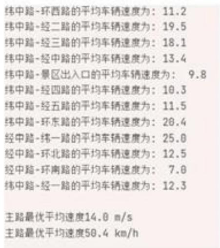

<details>
<summary>text_image</summary>

纬中路-环西路的平均车辆速度为：11.2
纬中路-经二路的平均车辆速度为：19.5
纬中路-经三路的平均车辆速度为：18.1
纬中路-经中路的平均车辆速度为：13.4
纬中路-景区出入口的平均车辆速度为： 9.8
纬中路-经四路的平均车辆速度为：10.3
纬中路-经五路的平均车辆速度为：11.5
纬中路-环东路的平均车辆速度为：20.4
经中路-纬一路的平均车辆速度为：25.0
经中路-环北路的平均车辆速度为：12.5
经中路-环南路的平均车辆速度为： 7.0
纬中路-经一路的平均车辆速度为：12.3

主路最优平均速度14.0 m/s
主路最优平均速度50.4 km/h
</details>

图 5-33 经中路和纬中路的最优平均速度

计算得到经中路和纬中路这两条路口的车辆最优平均速度约为50.4km/h。

## 5.2.5 模型的检验

## Step7: 运用仿真软件 VISSIM 对优化后的信号灯进行仿真

利用 VISSIM 对现实路段的高仿真功能，其模拟仿真网址为 https://wwto.lanzouj.com/iFBcd29ibgna，模拟出包括仿真真路段及路况、交通流的特征、驾驶人路径行为，以此验证上述模型的性能与效果。

由于时间有限，且路口较多，因此本问只截取了其中两个路口的仿真模拟情况，分别是经一路-纬中路路口和经二路-纬中路路口。设置红绿灯，模拟车辆行驶情况如下：

  
图 5-34 仿真模拟路况、交通流

如上图，红色与绿色的矩形长条分别模拟红灯与绿灯的信号灯周期，当矩形长条为红色时，该方向的所有车辆都停止运行，当矩形长条颜色变成绿色时，所有车辆开始运行。

经一路-纬中路路口和经二路-纬中路路口之间的距离为340m，在第一个路口监测的时间为100s,在第二个路口监测到的时间为124s，如下图：

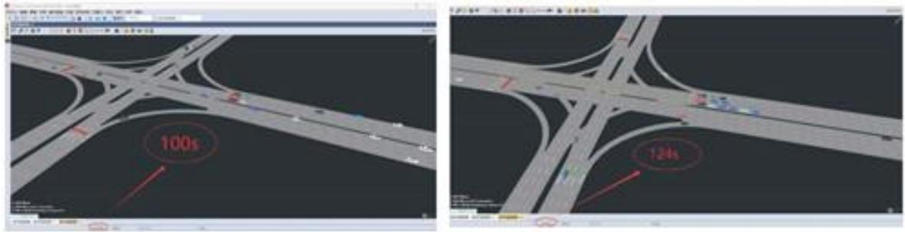  
图 5-35 两个路口的时间仿真模拟图

计算得到车辆的行驶速度为 50.98km/h。

## 5.2.6 误差分析与结论

通过仿真软件 VISSIM 对各个路口进行仿真验证，代入优化后的红绿灯周期和绿灯时间，记录车辆在通过不同路口的时间，获得在本路段中行驶时间，已知的两路口之间的距离，直接计算出车辆的行驶速度，得出行驶速度为 50.98km/h，而我们的理论平均最大速度约为 50.4km/h，两者误差非常小，仅只有 1.14%，仿真模型很好的验证了理论模型的正确性及合理性。

## 5.3 问题 3 的模型建立与求解

## 5.3.1 题目信息分析

本题需要分析五一黄金周期间的数据，对停车位的巡游车辆进行识别，并估算出景区所需的临时停车位数量。具体解决思路如下：

1、识别巡游车辆：根据车辆的行驶轨迹数据，识别出反复绕行且行驶速度低于某一阈值（例如低于20km/h），则判定为巡游车辆。  
2、估算停车需求：根据巡游车辆数量、巡游时间段和停车位利用率，估算出临时停车位的需求量，可使用排队论模型进行估算。

## 5.3.2 数据预处理

首先对附件 2 的数据进行筛选，筛选出五一黄金周时间段的数据，去除无车牌的数据，和时间异常的数据。

## Step1: 根据行驶路径、车辆速度以及出现频率来对巡游车辆进行识别

（1）对车辆进行划分，构建车辆的行车轨迹。由于数据过多，本问只截取部分车辆的行车轨迹，详见支撑材料四。

如下：

表 5-36 部分车辆行车轨迹

<table><tr><td>车牌号</td><td>开始时间</td><td>结束时间</td><td>行车轨迹</td></tr><tr><td>3B07ADI</td><td>29:55.0</td><td>40:53.0</td><td>经中路-环南路 -&gt; 经中路-环南路</td></tr><tr><td>3B445GY</td><td>33:33.0</td><td>07:16.8</td><td>环西路-纬中路 -&gt; 环西路-纬中路</td></tr><tr><td>3B4C1DB</td><td>28:17.1</td><td>30:25.9</td><td>经五路-纬中路 -&gt; 纬中路-景区出入口 -&gt; 经五路-纬中路</td></tr><tr><td>3BB63KF</td><td>21:31.1</td><td>11:19.5</td><td>经中路-环北路 -&gt; 经中路-环北路</td></tr></table>

如上表，车牌号为3B4C1DB的车辆从经五路-纬中路经过纬中路-景区出入口，最后又回到经五路-纬中路，且只有2分钟的间隔时间，时间间隔较小，则有理由为巡游车辆。

## (2) 计算车辆速度

已知时间与行车轨迹，计算车辆速度，对数据进行分析，去除其中的空值。车辆速度=车辆走过的距离/车辆走过这段距离所用的时间，详见支撑材料五。

表 5-37 部分车辆速度

<table><tr><td>车牌号</td><td>开始时间</td><td>结束时间</td><td>行车轨迹</td><td>距离(m)</td><td>行驶时间(秒)</td><td>速度(m/s)</td></tr><tr><td>3B3CG9S</td><td>51:29.0</td><td>39:03.0</td><td>经五路-纬中路 -&gt; 经中路-纬中路 -&gt; 经中路-环南路</td><td>2230</td><td>10053.983</td><td>0.22</td></tr><tr><td>3B3SD7E</td><td>41:50.1</td><td>43:47.9</td><td>环西路-纬中路 -&gt; 经一路-纬中路</td><td>460</td><td>117.811</td><td>3.9</td></tr><tr><td>3B4C1DB</td><td>28:17.1</td><td>30:25.9</td><td>经五路-纬中路 -&gt; 经中路-景区出入口 -&gt; 经五路-纬中路</td><td>1980</td><td>36128.872</td><td>0.05</td></tr><tr><td>3B95N88</td><td>48:30.9</td><td>30:05.2</td><td>经一路-纬中路 -&gt; 环西路-纬中路</td><td>460</td><td>6094.295</td><td>0.08</td></tr><tr><td>3B96B7P</td><td>55:15.5</td><td>08:20.1</td><td>环西路-纬中路 -&gt; 经中路-环北路</td><td>2690</td><td>784.571</td><td>3.43</td></tr></table>

得到各车辆的速度后，需要设定一个阈值，求在不同速度出现的频率，得到下图：

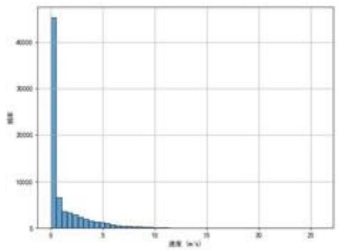

<details>
<summary>histogram</summary>

| Bin (m/s) | Frequency |
| --- | --- |
| 0~0.25 | ~45000 |
| 0.25~0.5 | ~6800 |
| 0.5~0.75 | ~3500 |
| 0.75~1.0 | ~3000 |
| 1.0~1.25 | ~2500 |
| 1.25~1.5 | ~2000 |
| 1.5~1.75 | ~1800 |
| 1.75~2.0 | ~1500 |
| 2.0~2.25 | ~1200 |
| 2.25~2.5 | ~1000 |
| 2.5~2.75 | ~900 |
| 2.75~3.0 | ~800 |
| 3.0~3.25 | ~700 |
| 3.25~3.5 | ~600 |
| 3.5~3.75 | ~500 |
| 3.75~4.0 | ~400 |
| 4.0~4.25 | ~300 |
| 4.25~4.5 | ~250 |
| 4.5~4.75 | ~200 |
| 4.75~5.0 | ~150 |
| 5.0~5.25 | ~100 |
| 5.25~5.5 | ~80 |
| 5.5~5.75 | ~60 |
| 5.75~6.0 | ~40 |
| 6.0~6.25 | ~30 |
| 6.25~6.5 | ~20 |
| 6.5~6.75 | ~15 |
| 6.75~7.0 | ~10 |
| 7.0~7.25 | ~8 |
| 7.25~7.5 | ~6 |
| 7.5~7.75 | ~4 |
| 7.75~8.0 | ~3 |
| 8.0~8.25 | ~2 |
| 8.25~8.5 | ~1 |
| 8.5~8.75 | ~1 |
| 8.75~9.0 | ~1 |
| 9.0~9.25 | ~1 |
| 9.25~9.5 | ~1 |
| 9.5~9.75 | ~1 |
| 9.75~10.0 | ~1 |
</details>

图 5-38 车辆速度频率

从速度的分布直方图中可以看到，大多数车辆的速度集中在较低的范围，尤其是接近0的部分。这表明部分车辆可能是在低速行驶，可能是在寻找停车位。因此，需要设计一个0.5m/s的阈值，低于0.5m/s的车辆可能被认为是在寻找停车位的巡游车辆。

## Step2: 设置阈值，得到巡游车辆

（3）以 0.5m/s 作为速度阈值，筛选出低于该速度的巡游车辆，然后分析低速车辆的行车轨迹，寻找在短时间内经过多个相邻交叉口或者重复经过同一路段的情况。

综合以上多个方面，进行判断得出巡游车辆，有车牌号为3B3CT78、3B4BE2C、3B4C1DB、3B5454X、3B5540X等车辆，详见支撑材料六。

## 5.3.3 估计停车的需求

## Step3: 建立排队论模型

排队论模型用于分析和优化排队系统中服务对象和服务设施的关系,本问使用排队论模型的 m/m/c 模型,依据题意建立以下模型:

$$
\mathrm{p} = \frac {\lambda}{c \cdot \mu} \tag {17}
$$

其中 $\lambda$ 是到达率， $\mu$ 是服务率，c 是停车位的数量。根据 m/m/c 模型，可以估算停车场的平均等待时间和队列长度。

Erlang C 公式计算:

$$
\mathrm{p(0)} = (\sum_ {k = 0} ^ {c - 1} \frac {(c \cdot p) ^ {k}}{k} + \frac {(c \cdot p) ^ {c}}{k \cdot (1 - p)}) ^ {- 1} \tag {18}
$$

其中 $P(0)$ 为系统中无车的概率，k 表示 c 的阶乘， $p(0)$ 越高，意味着停车场空闲的可能性越大，说明停车场的利用率较低；反之， $p(0)$ 越低，停车场越接近满负荷运转。

排队等待车位的车辆数：

$$
\mathrm{L} _ {q} = \frac {L _ {q}}{\lambda} \tag {19}
$$

$L_{q}$ 过高，说明停车场当前的车位数量不足，可能需要增加临时停车位来应对高峰时段的需求。

每辆车的平均时间：

$$
\mathrm{W} _ {q} = \frac {L _ {q}}{\lambda} \tag {20}
$$

$^{W_{q}}$ 反映了停车场是否能够有效处理高峰期的车辆流入，当 $^{W_{q}}$ 过长说明停车场无法及时提供车位。

## 5.3.4 模型的求解

结合上述模型，使用python软件估算停车需求，求解流程如下：

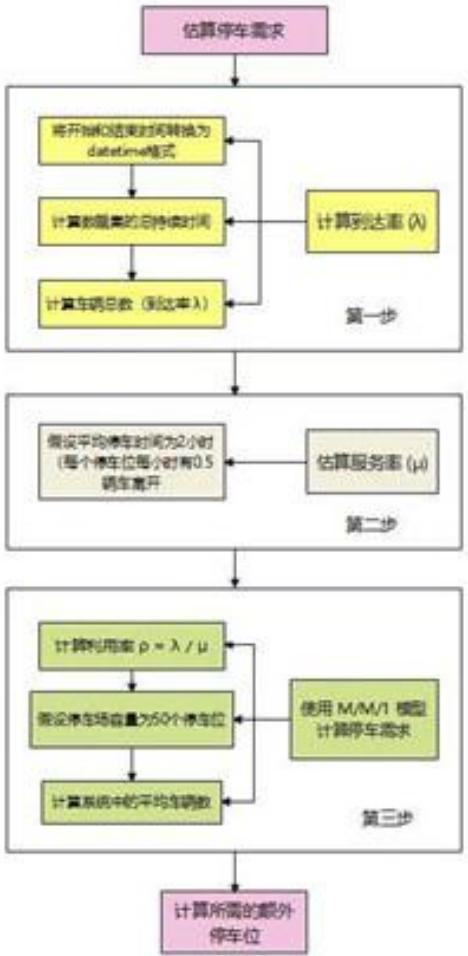

<details>
<summary>flowchart</summary>

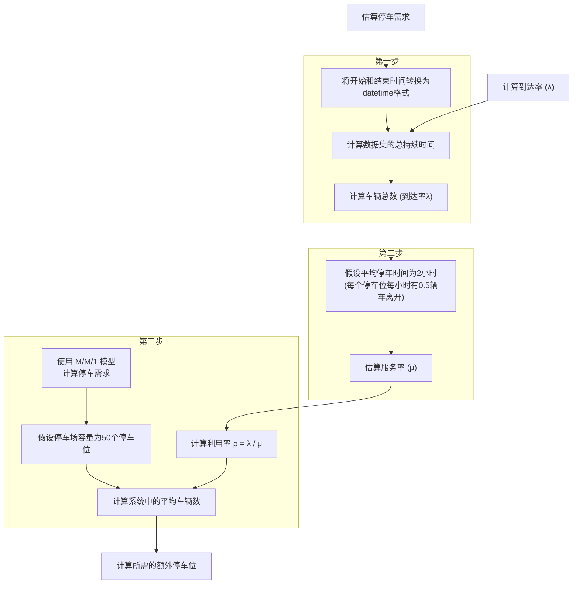
</details>

图 5-39 问题三求解流程图

## 5.3.5 结果展示

代码运行得到的结果为：车辆总数：32832；到达率：0.91；服务率：0.73；利用率：0.78，估算得到景区所需的临时停车位数量范围为[430,450]辆。

## 5.4 问题 4 的模型建立与求解

## 5.4.1 题目信息分析

本问要求评估五一期间和非五一期间临时管控措施在两条主路上的效果，需选择评价指标：车流量、绕行车辆和通行方向，比较管控措施前后这些指标的变化，进而评价管控措施的效果。具体分析思路如下：

1、分析车流量：对比“五一”黄金周（5月1日至5月5日）期间与非管控期间交通流量变化，尤其是关注两条主路（纬中路和经中路）上车辆进出流量的变化。  
2、分析车辆绕行：由于在平时，这些车辆往往为了寻找停车位而低速绕圈，影响通行效率，管控措施是否有效减少了这些低速车辆的数量，可以通过分析车辆重复出现的数据来验证。  
3、分析车辆通行方向：通过分析车辆的行驶方向数据，验证这些路线是否按照指示执行。若大部分车辆能够按照橙色/绿色箭头指示的路线进入和离开景区，说明管控措施取得了一定效果。

## 5.4.2 数据预处理

整理 “五一” 期间（5 月 1 日至 5 月 5 日）和之前（4 月 1 日至 4 月 30 日）的车辆数据。按时间分段整理车辆通过不同路段的情况。处理车辆通过方向、时间、车牌号等信息，剔除无关数据。如下表（详见支撑材料七）：

表 5-40 数据处理后的车辆信息

<table><tr><td>方向</td><td>时间</td><td>车牌号</td><td>交叉口</td></tr><tr><td>3</td><td>39:08.6</td><td>AF5B7CEM</td><td>环西路-纬中路</td></tr><tr><td>1</td><td>45:32.3</td><td>BK2IA84</td><td>环西路-纬中路</td></tr><tr><td>3</td><td>09:04.1</td><td>AF4EC7FK</td><td>环西路-纬中路</td></tr><tr><td>2</td><td>49:03.7</td><td>AF4MBB6</td><td>环西路-纬中路</td></tr><tr><td>3</td><td>47:49.4</td><td>CBA7KCG</td><td>环西路-纬中路</td></tr><tr><td>2</td><td>19:15.9</td><td>AFB9C06</td><td>环西路-纬中路</td></tr><tr><td>1</td><td>30:49.7</td><td>AF25DA6M</td><td>环西路-纬中路</td></tr><tr><td>4</td><td>43:28.6</td><td>AF8CB6CM</td><td>环西路-纬中路</td></tr><tr><td>3</td><td>39:19.7</td><td>AFU4CWB</td><td>环西路-纬中路</td></tr><tr><td>1</td><td>07:41.4</td><td>AFO4AAE</td><td>环西路-纬中路</td></tr><tr><td>1</td><td>10:19.1</td><td>AF8Y4AB</td><td>环西路-纬中路</td></tr><tr><td>3</td><td>56:01.8</td><td>AF9FB66</td><td>环西路-纬中路</td></tr></table>

## 5.4.3 对比各项指标

## (1) 分析车流量密度

通过对比“五一”黄金周与之前的流量数据，分析红色管控路段的车辆通行情况，是否有减少或管控效果。通过时间段划分（如早高峰、午间、晚高峰），对比流量高峰时段的变化，分析管控措施对不同时间段的影响。因此需要建立流量密度公式与流量密度百分比公式，如下：

流量密度公式：

$$
\mathrm{p} _ {\mathrm{i}} = \frac {\mathrm{Q} _ {\mathrm{i}}}{t _ {\mathrm{i}}} \tag {21}
$$

其中 p 表示 i 时期流量密度， $Q_{i}$ 表示 i 时期总车流量， $t_{i}$ 表示 i 时期总时间。

流量密度百分比：

$$
\mathrm{M} = \frac {\mathrm{p} _ {i} - p _ {j}}{p _ {i}} \tag {22}
$$

其中 $p_{i}$ 表示四月的流量密度， $p_{j}$ 表示五月的流量密度。M 可以直观的观测到五月份和四月份的车流量差别。

结合上述公式, 运用 python 计算出 12 个交叉路口的车流量密度与流量密度百分比, 如下表:

表 5-41 12 个路口的车流量密度

<table><tr><td>交叉口</td><td>流量计数_五一</td><td>流量计数_四月</td><td>流量密度_五一</td><td>流量密度_四月</td><td>流量密度变化百分比</td></tr><tr><td>环东路-纬中路</td><td>7269</td><td>111653</td><td>1453.8</td><td>3721.766667</td><td>-60.93790583</td></tr><tr><td>环西路-纬中路</td><td>251798</td><td>1608751</td><td>50359.6</td><td>53625.03333</td><td>-6.089382384</td></tr><tr><td>纬中路-景区出入口</td><td>87399</td><td>389593</td><td>17479.8</td><td>12986.43333</td><td>34.60046767</td></tr><tr><td>经一路-纬中路</td><td>87314</td><td>590170</td><td>17462.8</td><td>19672.33333</td><td>-11.23167901</td></tr><tr><td>经三路-纬中路</td><td>87999</td><td>599361</td><td>17599.8</td><td>19978.7</td><td>-11.90718115</td></tr><tr><td>经中路-环北路</td><td>103734</td><td>612139</td><td>20746.8</td><td>20404.63333</td><td>1.676906716</td></tr><tr><td>经中路-环南路</td><td>153170</td><td>894463</td><td>30634</td><td>29815.43333</td><td>2.74544615</td></tr><tr><td>经中路-纬一路</td><td>121312</td><td>529828</td><td>24262.4</td><td>17660.93333</td><td>37.37892297</td></tr><tr><td>经中路-纬中路</td><td>149346</td><td>858232</td><td>29869.2</td><td>28607.73333</td><td>4.40953029</td></tr><tr><td>经二路-纬中路</td><td>49754</td><td>353700</td><td>9950.8</td><td>11790</td><td>-15.59966073</td></tr><tr><td>经五路-纬中路</td><td>34142</td><td>143313</td><td>6828.4</td><td>4777.1</td><td>42.94027757</td></tr><tr><td>经四路-纬中路</td><td>7905</td><td>56603</td><td>1581</td><td>1886.766667</td><td>-16.20585481</td></tr></table>

将上表进行可视化，如下：

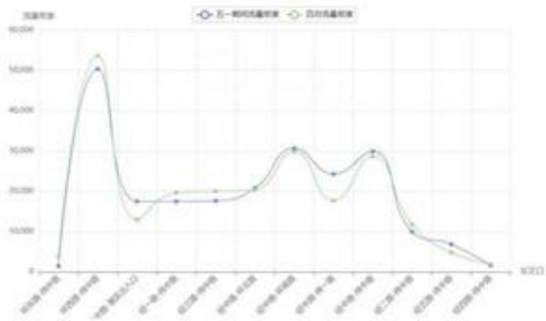

<details>
<summary>line</summary>

| 日期 | 五种流量类别 (万) | 四种流量类别 (万) |
| :--- | :--- | :--- |
| 10月28日-10月29日 | ~1,500 | ~1,500 |
| 10月29日-10月30日 | ~50,000 | ~54,000 |
| 10月30日-10月31日 | ~27,000 | ~13,000 |
| 10月31日-11月1日 | ~27,000 | ~29,000 |
| 11月1日-11月2日 | ~27,000 | ~30,000 |
| 11月2日-11月3日 | ~30,000 | ~30,000 |
| 11月3日-11月4日 | ~50,000 | ~50,000 |
| 11月4日-11月5日 | ~34,000 | ~28,000 |
| 11月5日-11月6日 | ~49,000 | ~49,000 |
| 11月6日-11月7日 | ~9,500 | ~12,000 |
| 11月7日-11月8日 | ~7,000 | ~5,500 |
| 11月8日-11月9日 | ~1,500 | ~1,500 |
</details>

图 5-42 12 个路口的车流量密度可视化图

由上图可知，各时间段景区出入口的流量密度都较大，两时期流量密度曲线趋于重合，五一节假日景区人口会激增，造成流量密度增大，但是图中在两个时期相近说明临时管控措施起到在交通管理很大作用。

## (2) 分析绕行车辆

检查在特定路段上，是否有车辆多次出现来回低速行驶的情况，以此判断车辆绕行问题是否缓解。如下（详见支撑材料八）：

图 5-43 五一期间绕行车辆数

<table><tr><td>车牌号</td><td>交叉口</td><td>出现次数</td></tr><tr><td>3B178Q8</td><td>经中路-环北路</td><td>3</td></tr><tr><td>3B1CB0F</td><td>纬中路-景区出入口</td><td>3</td></tr><tr><td>3B1CB0F</td><td>经中路-纬中路</td><td>3</td></tr><tr><td>3B5454X</td><td>经三路-纬中路</td><td>3</td></tr><tr><td>3B5454X</td><td>经中路-纬中路</td><td>3</td></tr><tr><td>3B5540X</td><td>经中路-纬一路</td><td>3</td></tr><tr><td>3B56PBV</td><td>纬中路-景区出入口</td><td>4</td></tr><tr><td>3B56PBV</td><td>经中路-纬中路</td><td>4</td></tr><tr><td>3B846U6</td><td>纬中路-景区出入口</td><td>4</td></tr><tr><td>3B846U6</td><td>经中路-纬一路</td><td>4</td></tr><tr><td>3B846U6</td><td>经中路-纬中路</td><td>4</td></tr><tr><td>3BAA68W</td><td>环西路-纬中路</td><td>3</td></tr><tr><td>3BAB03C</td><td>环西路-纬中路</td><td>6</td></tr></table>

如上表，车牌号为 3BAB03C 的车辆在环西路-纬中路路口出现次数最多，由此可见该车存在绕行现象。

## (3) 分析车辆通行方向

按照附件3提供的车辆进出方向（橙色和绿色箭头），分析是否大部分车辆

按照指定方向通行，观察管控是否有效引导了车流。

使用 python 对各个路口的车流量进行数据处理，首先汇总每个路口的各个方向车流量，然后根据日期将数据按天分类，计算每天各个路口的车流量方向分布。接着，对这些汇总后的数据进行分析，最后进行评价临时管控措施的效果，不同时期的部分日通行方向如下：

图 5-44 车辆各通行方向的次数

<table><tr><td>交叉口</td><td>方向</td><td>方向计数</td><td>日均方向计数</td><td>交叉口</td><td>方向</td><td>方向计数</td><td>日均方向计数</td></tr><tr><td>环东路-纬中路</td><td>1</td><td>16329</td><td>544</td><td>环东路-纬中路</td><td>1</td><td>16329</td><td>544</td></tr><tr><td>环东路-纬中路</td><td>2</td><td>14346</td><td>478</td><td>环东路-纬中路</td><td>2</td><td>14346</td><td>478</td></tr><tr><td>环东路-纬中路</td><td>3</td><td>32824</td><td>1094</td><td>环东路-纬中路</td><td>3</td><td>32824</td><td>1094</td></tr><tr><td>环东路-纬中路</td><td>4</td><td>48154</td><td>1605</td><td>环东路-纬中路</td><td>4</td><td>48154</td><td>1605</td></tr><tr><td>环西路-纬中路</td><td>1</td><td>515228</td><td>17174</td><td>环西路-纬中路</td><td>1</td><td>515228</td><td>17174</td></tr><tr><td>环西路-纬中路</td><td>2</td><td>430390</td><td>14346</td><td>环西路-纬中路</td><td>2</td><td>430390</td><td>14346</td></tr><tr><td>环西路-纬中路</td><td>3</td><td>319588</td><td>10652</td><td>环西路-纬中路</td><td>3</td><td>319588</td><td>10652</td></tr><tr><td>环西路-纬中路</td><td>4</td><td>343545</td><td>11451</td><td>环西路-纬中路</td><td>4</td><td>343545</td><td>11451</td></tr><tr><td>纬中路-景区出入口</td><td>1</td><td>240293</td><td>8009</td><td>纬中路-景区出入口</td><td>1</td><td>240293</td><td>8009</td></tr></table>

由上表可知，大部分车辆能够按照橙色/绿色箭头指示的路线进入和离开景区，说明管控措施取得了一定效果。

## 5.4.4 结论分析

1、车辆流量变化分析：通过对比五一期间与非五一期间的车流量数据，发现红色管控路段的车流量有所减少。这表明五一期间实施的临时管控措施取得了显著的效果，成功减少了该路段的交通压力。  
2、绕行车辆情况：综合分析五一期间与非五一期间的绕行车辆数据，结果显示五一期间的绕行车辆数量有所增加，反映出临时管控措施在有效引导车辆绕行方面发挥了更好的作用。  
3、车辆通行方向的合规性：通过比较五一期间与非五一期间某站点的车辆通行频次，发现五一期间的通行次数低于非五一期间。这说明临时管控措施对规范车辆通行方向的效果更为明显，确保了车流按预期方向运行，有效提升了交通秩序。

整体上来看，五一期间的临时管控措施在减少车流、优化车辆绕行以及规范通行方向方面都展现了较为出色的成效。

## 六、模型的评价

## 6.1 模型的优点

（1）本文所使用的 K-均值算法可以将车流量划分为不同类别，不需要手动设定时间段，并且该算法计算快，适合处理大规模的交通数据，并且可快速收敛得到稳定的结果。  
（2）排队论模型相对简单易行，可适合快速评估临时停车需求，并且此模型适合动态的交通场景，可得出一个合理的停车位需求评估。  
（3）对于问题四，本文在理论模型的基础上，通过仿真软件 VISSIM 进一步对理论模型进行了验证，从理论和实际两个方面证明了模型的合理性。

## 6.2 模型的缺点

（1）本文所使用的 K-均值算法没有考虑车流量的时间连续性，只关注数据的相似点。  
(2) 排队论模型难以应对极端的情况，例如发生交通事故。

## 6.3 模型的改进

由于在本次比赛中时间有限，且路口较多，因此在使用 VISSIM 软件进行模型的仿真模拟检验时，没有模拟所有的交叉路口，只对其中两个路口进行模拟仿真，后期会将本仿真模拟进行进一步地完善。

## 6.4 模型的推广

本题使用的 k-均值算法和模糊数学在交通管制上面有广泛应用，还在资源调度或城市资源管理上面有广泛应用。

## 七、参考文献

[1]陈军舰,刘春生,王晓晗,等.多源数据融合的交通走廊交通流量分析[J].天津建设科技,2024,34(04):1-4.  
[2]李国庆.基于K-mean聚类算法的电力营销数据分析[J].电子技术,2023,52  
[3]高萌悦,马晓旦.基于VISSIM仿真的信号交叉口优化研究[J].物流科技,2024,47(09):98-101.DOI:10.13714/j.cnki.  
[4] 吴场建, 曹奇, 任刚. 考虑路径关系的干线多路径绿波优化模型 [J]. 交通运输系统工程与信息 2024, 24(03): 103-113+163. DOI:10.16097/j.cnki.

## 八、附录

<table><tr><td>附录一</td></tr><tr><td>介绍:支撑材料的文件列表</td></tr><tr><td>支撑材料一</td></tr><tr><td>工作日、非工作日与节假日的划分</td></tr><tr><td>支撑材料二</td></tr><tr><td>高峰期、低峰期与平峰期的划分</td></tr><tr><td>支撑材料三</td></tr><tr><td>各路口最优信号灯时长及周期</td></tr><tr><td>支撑材料四</td></tr><tr><td>车辆的行车轨迹</td></tr><tr><td>支撑材料五</td></tr><tr><td>车辆的行驶速度</td></tr><tr><td>支撑材料六</td></tr><tr><td>设置阈值筛选得到的所有巡游车辆</td></tr><tr><td>支撑材料七</td></tr><tr><td>数据预处理后的车辆信息</td></tr><tr><td>支撑材料八</td></tr><tr><td>五一期间绕行车辆数</td></tr><tr><td>附录二</td></tr><tr><td>介绍:问题一数据预处理的代码</td></tr><tr><td>1删除无车牌数据import pandas as pd# 读取数据data = pd.read_csv('./附件2.csv', encoding='gbk')# 删除车牌号为"无车牌"的数据data = data[data['车牌号'] != '无车牌']# 保存为新文件data.to_csv('无车牌数据的附件2.csv', index=False)</td></tr><tr><td>2筛选经中路-纬中路的数据erimport pandas as pddata = pd.read_csv('./附件2.csv', encoding='gbk')# 删除车牌号为"无车牌"的数据data = data[data['车牌号'] != '无车牌']# 筛选出交叉口为'经中路-纬中路'的数据data = data[data['交叉口'] == '经中路-纬中路']# 重置索引data = data.reset_index(drop=True)print(data)data.to_csv('2.经中路-纬中路.csv', index=False)</td></tr><tr><td>3分工作日和节假日import pandas as pdimport holidays # 需要先安装 holidays 库# 读取数据data = pd.read_csv('2.经中路-纬中路.csv')# 假设时间列为'时间',如果格式不同请调整data['时间'] = pd.to_datetime(data['时间'])# 使用 holidays 库来定义中国的节假日cn_holidays = holidays.China()# 添加是否为节假日的列data['是否为中国节假日'] = data['时间'].dt.date.apply(lambda x: 1 if x in cn_holidays else 0)# 添加是否为工作日的列(工作日为1,周末为0)data['是否为工作日'] = data['时间'].dt.weekday.apply(lambda x: 1 if x &lt; 5 else 0)data.to_csv('3.节假日工作日.csv')</td></tr><tr><td>4将数据按工作日、非工作日与节假日进行区分import pandas as pdfile_path = '3.节假日工作日.csv"data = pd.read_csv(file_path)workday_data = data[(data['是否为工作日'] == 1) &amp; (data['是否为中国节假日'] ==</td></tr></table>

```python
0)] # 工作日数据
non_workday_data = data[data['是否为工作日'] == 0] # 非工作日数据
holiday_data = data[data['是否为中国节假日'] == 1] # 节假日数据
workday_file_path = '4.工作日数据.xlsx'
non_workday_file_path = '4.非工作日数据.xlsx'
holiday_file_path = '4.节假日数据.xlsx'
workday_data.to_excel(workday_file_path, index=False)
non_workday_data.to_excel(non_workday_file_path, index=False)
holiday_data.to_excel(holiday_file_path, index=False)

⑤统计不同时段的车流量
import pandas as pd
# new_list = ['5.工作日不同时段车流量.csv', '5.非工作日不同时段车流量.csv', '5.
节假日不同时段车流量.csv']
workday_data = pd.read_csv('4.工作日数据.csv')
non_work_data = pd.read_csv('4.非工作日数据.csv')
holiday_data = pd.read_csv('4.节假日数据.csv')
# 将 '时间' 列转换为日期时间格式以便于处理
workday_data['时间'] = pd.to_datetime(workday_data['时间'])
non_work_data['时间'] = pd.to_datetime(non_work_data['时间'])
holiday_data['时间'] = pd.to_datetime(holiday_data['时间'])
# 从时间戳中提取小时
workday_data['hour'] = workday_data['时间'].dt.hour
non_work_data['hour'] = non_work_data['时间'].dt.hour
holiday_data['hour'] = holiday_data['时间'].dt.hour
# 按小时和方向分组，统计每小时各个方向的车辆数量
workday_data = workday_data.groupby(['hour', '方向']).size().unstack(fill_value=0)
# workday_data = workday_data.groupby(['hour', '方向'])['车牌号'].nunique()
non_work_data = non_work_data.groupby(['hour', '方向'
']).size().unstack(fill_value=0)
holiday_data = holiday_data.groupby(['hour', '方向']).size().unstack(fill_value=0)
print(workday_data)
print(non_work_data)
print(holiday_data)
# workday_data.to_csv('5.工作日不同时段车流量.csv')
# non_work_data.to_csv('5.非工作日不同时段车流量.csv')
# holiday_data.to_csv('5.节假日不同时段车流量.csv')

⑥将不同时段的车流量可视化
import pandas as pd
import matplotlib.pyplot as plt
plt.rcParams['font.sans-serif'] = ['SimHei'] # 设置显示中文字体
# 另外，由于字体更改以后会导致坐标轴中部分字符无法正常显示，这是需要更改 axes.unicode_minus 参数。
```

```python
plt.rcParams['axes.unicode_minus'] = False  # 设置正常显示符号
file_paths = [
    '5.非工作日不同时段车流量.csv',
    '5.工作日不同时段车流量.csv',
    '5.节假日不同时段车流量.csv']
# Read the data
data_non_workday = pd.read_csv(file_paths[0])
data_workday = pd.read_csv(file_paths[1])
data_holiday = pd.read_csv(file_paths[2])
# Create a list of datasets and titles for each category
datasets = [data_non_workday, data_workday, data_holiday]
titles = ['非工作日不同时段车流量', '工作日不同时段车流量', '节假日不同时段车流量']
# Plot the data for each dataset
for i, data in enumerate(datasets):
    plt.figure(figsize=(10, 6))
    for col in data.columns[1:]:
        plt.plot(data['hour'], data[col], marker='o', label=f'方向 {col}')
    plt.title(titles[i], fontsize=16)
    plt.xlabel('小时', fontsize=12)
    plt.ylabel('车流量', fontsize=12)
    plt.xticks(data['hour'])
    plt.grid(True)
    plt.legend(title='方向')
    # Show each plot
    plt.tight_layout()
    plt.show()
```

```python
附录三
介绍：问题一模型的求解代码
①根据车流量划分早晚高峰
import pandas as pd
from sklearn.cluster import KMeans
import numpy as np
# 加载数据
file_path = '5.工作日不同时段车流量.csv'
traffic_data = pd.read_csv(file_path)
# 计算每小时的总车流量
traffic_data['total_traffic'] = traffic_data[['1', '2', '3', '4']].sum(axis=1)
# 使用 K-均值聚类算法分析数据
X = traffic_data[['hour', 'total_traffic']].values
kmeans = KMeans(n_clusters=3, random_state=0).fit(X)
```

```python
traffic_data['cluster'] = kmeans.labels_
# 根据聚类结果定义时间段
cluster_label_to_period = {
    0: "高峰期",
    1: "低峰期",
    2: "平峰期"
}# 根据实际数据调整聚类标签映射至时间段描述
traffic_data['time_period'] = traffic_data['cluster'].map(cluster_label_to_period)
# 排序和显示结果
clustered_traffic = traffic_data.sort_values(by=['cluster', 'hour'])
print(clustered_traffic)
clustered_traffic.drop(columns='total_traffic', inplace=True)
clustered_traffic.to_csv('6.工作日时期划分.csv')
## 加载数据
# file_path = '5.节假日不同时段车流量.csv'
# traffic_data = pd.read_csv(file_path)
### 计算每小时的总车流量
# traffic_data['total_traffic'] = traffic_data[['1', '2', '3', '4']].sum(axis=1)
### 使用 K-均值聚类算法分析数据
# X = traffic_data[['hour', 'total_traffic']].values
# kmeans = KMeans(n_clusters=3, random_state=0).fit(X)
# traffic_data['cluster'] = kmeans.labels_
### 根据聚类结果定义时间段
# cluster_label_to_period = {
    #      0: "高峰期",
    #      1: "平峰期",
    #      2: "低峰期"
}### 根据实际数据调整聚类标签映射至时间段描述
# traffic_data['time_period'] = traffic_data['cluster'].map(cluster_label_to_period)
### 排序和显示结果
# clustered_traffic = traffic_data.sort_values(by=['cluster', 'hour'])
# print(clustered_traffic)
# clustered_traffic.drop(columns='total_traffic', inplace=True)
# clustered_traffic.to_csv('6.节假日时期划分.csv')
## 加载数据
# file_path = '5.非工作日不同时段车流量.csv'
# traffic_data = pd.read_csv(file_path)
### 计算每小时的总车流量
# traffic_data['total_traffic'] = traffic_data[['1', '2', '3', '4']].sum(axis=1)
### 使用 K-均值聚类算法分析数据
# X = traffic_data[['hour', 'total_traffic']].values
# kmeans = KMeans(n_clusters=3, random_state=0).fit(X)#
# traffic_data['cluster'] = kmeans.labels_
### 根据聚类结果定义时间段
```

```python
# cluster_label_to_period = {
#      0: "低峰期",
#      1: "高峰期",
#      2: "平峰期"
# }### 根据实际数据调整聚类标签映射至时间段描述
# traffic_data['time_period'] = traffic_data['cluster'].map(cluster_label_to_period)
### 排序和显示结果
# clustered_traffic = traffic_data.sort_values(by=['cluster', 'hour'])
# print(clustered_traffic)
# clustered_traffic.drop(columns='total_traffic', inplace=True)
# clustered_traffic.to_csv('6.非工作日时期划分.csv')

②不同时期的可视化
# Here's the complete code to load the data and visualize it as line charts:
import pandas as pd
import matplotlib.pyplot as plt
plt.rcParams['font.sans-serif'] = ['SimHei']  # 设置显示中文字体
# 另外，由于字体更改以后会导致坐标轴中部分字符无法正常显示，这是需要更改 axes.unicode_minus 参数。
plt.rcParams['axes.unicode_minus'] = False  # 设置正常显示符号
# Load the three CSV files for visualization
file_paths_period = [
    '7.节假日不同时期车流量.csv',
    '7.工作日不同时期车流量.csv',
    '7.非工作日不同时期车流量.csv'
]# Read the data from these files
data_holiday_period = pd.read_csv(file_paths_period[0])
data_workday_period = pd.read_csv(file_paths_period[1])
data_non_workday_period = pd.read_csv(file_paths_period[2])
# Create a list of datasets and titles for each category
datasets_period = [data_holiday_period, data_workday_period,
data_non_workday_period]
titles_period = ['节假日车流量', '工作日车流量', '非工作日车流量']
# Plot all the data in a single combined plot
plt.figure(figsize=(12, 8))
# Plot data from all three datasets
for i, data in enumerate(datasets_period):
    for index, row in data.iterrows():
        print(index, row)
        plt.plot(data.columns[1:], row[1:], marker='o', label=f'{titles_period[i]} - {row["time_period"]}')
plt.title('节假日、工作日、非工作日的车流量汇总', fontsize=16)
plt.xlabel('方向', fontsize=12)
plt.ylabel('车流量', fontsize=12)
```

```python
plt.grid(True)
plt.legend(title='时段及日期类型', bbox_to_anchor=(1.05, 1), loc='upper left')
plt.tight_layout()
plt.show()
```

③不同时期车流量的统计  
```python
import pandas as pd
file_path = "6.工作日时期划分.csv"
data = pd.read_csv(file_path)
traffic_summary = data.groupby('time_period')['['1', '2', '3', '4']].sum()
print(traffic_summary)
traffic_summary.to_csv('7.工作日不同时期车流量.csv')
file_path1 = "6.非工作日时期划分.csv"
data1 = pd.read_csv(file_path1)
traffic_summary1 = data1.groupby('time_period')['['1', '2', '3', '4']].sum()
print(traffic_summary1)
traffic_summary1.to_csv('7.非工作日不同时期车流量.csv')
file_path2 = "6.节假日时期划分.csv"
data2 = pd.read_csv(file_path2)
traffic_summary2 = data2.groupby('time_period')['['1', '2', '3', '4']].sum()
print(traffic_summary2)
traffic_summary2.to_csv('7.节假日不同时期车流量.csv')
```

④估计工作日各相位车流量  
```python
import pandas as pd
file_path = "7.工作日不同时期车流量.csv"
data = pd.read_csv(file_path)
# Define a function to apply the percentage splits based on time_period
def split_traffic(row):
    if row['time_period'] == '高峰期':
        straight_ratio, left_ratio, right_ratio = 0.8, 0.1, 0.1
    elif row['time_period'] == '平峰期':
        straight_ratio, left_ratio, right_ratio = 0.7, 0.2, 0.1
    elif row['time_period'] == '低峰期':
        straight_ratio, left_ratio, right_ratio = 0.6, 0.2, 0.2
    # Calculate straight, left, and right turns for each direction
    for direction in ['1', '2', '3', '4']:
        row[f'{direction}_直行'] = row[direction] * straight_ratio
        row[f'{direction}_左转'] = row[direction] * left_ratio
        row[f'{direction}_右转'] = row[direction] * right_ratio
    return row
# Apply the function to each row
new_data = data.apply(split_traffic, axis=1)
# Select and display relevant columns for verification
```

```python
traffic_split_columns = ['time_period'] + [f'{direction}_{turn}' for direction in ['1', '2',
'3', '4'] for turn in
['直行', '左转', '右转']]
split_traffic_data = new_data[traffic_split_columns]

split_traffic_data = split_traffic_data.round(0).astype(int, errors='ignore')
print(split_traffic_data)
split_traffic_data.to_csv('8.工作日各相位车流量.csv')

⑤估计非工作日各相位车流量
import pandas as pd
file_path = "7.非工作日不同时期车流量.csv"
data = pd.read_csv(file_path)
# Define a function to apply the percentage splits based on time_period
def split_traffic(row):
    if row['time_period'] == '高峰期':
        straight_ratio, left_ratio, right_ratio = 0.8, 0.1, 0.1
    elif row['time_period'] == '平峰期':
        straight_ratio, left_ratio, right_ratio = 0.7, 0.2, 0.1
    elif row['time_period'] == '低峰期':
        straight_ratio, left_ratio, right_ratio = 0.6, 0.2, 0.2
    # Calculate straight, left, and right turns for each direction
    for direction in ['1', '2', '3', '4']:
        row[f'{direction}_直行'] = row[direction] * straight_ratio
        row[f'{direction}_左转'] = row[direction] * left_ratio
        row[f'{direction}_右转'] = row[direction] * right_ratio
    return row
# Apply the function to each row
new_data = data.apply(split_traffic, axis=1)
# Select and display relevant columns for verification
traffic_split_columns = ['time_period'] + [f'{direction}_{turn}' for direction in ['1', '2',
'3', '4'] for turn in
['直行', '左转', '右转']]
split_traffic_data = new_data[traffic_split_columns]
split_traffic_data = split_traffic_data.round(0).astype(int, errors='ignore')
print(split_traffic_data)
split_traffic_data.to_csv('8.非工作日各相位车流量.csv')

⑥估计节假日各相位车流量
import pandas as pd
file_path = "7.节假日不同时期车流量.csv"
data = pd.read_csv(file_path)
# Define a function to apply the percentage splits based on time_period
def split_traffic(row):
```

```python
if row['time_period'] == '高峰期':
    straight_ratio, left_ratio, right_ratio = 0.8, 0.1, 0.1
elif row['time_period'] == '平峰期':
    straight_ratio, left_ratio, right_ratio = 0.7, 0.2, 0.1
elif row['time_period'] == '低峰期':
    straight_ratio, left_ratio, right_ratio = 0.6, 0.2, 0.2
# Calculate straight, left, and right turns for each direction
for direction in ['1', '2', '3', '4']:
    row[f'{direction}_直行'] = row[direction] * straight_ratio
    row[f'{direction}_左转'] = row[direction] * left_ratio
    row[f'{direction}_右转'] = row[direction] * right_ratio
return row
# Apply the function to each row
new_data = data.apply(split_traffic, axis=1)
# Select and display relevant columns for verification
traffic_split_columns = ['time_period'] + [f'{direction}_{turn}' for direction in ['1', '2',
'3', '4'] for turn in
['直行', '左转', '右转']]
split_traffic_data = new_data[traffic_split_columns]
split_traffic_data = split_traffic_data.round(0).astype(int, errors='ignore')
print(split_traffic_data)
split_traffic_data.to_csv('8.节假日各相位车流量.csv')

⑦相位可视化
from pyecharts.charts import Line
from pyecharts import options as opts
import pandas as pd
# 加载数据
holiday_data = pd.read_csv('8.节假日各相位车流量.csv')
workday_data = pd.read_csv('8.工作日各相位车流量.csv')
non_workday_data = pd.read_csv('8.非工作日各相位车流量.csv')
# 定义绘制 pyecharts 折线图的函数
def create_pyecharts_line_chart(data, title):
    time_periods = data['time_period'].tolist()
    directions = ['1_直行', '1_左转', '1_右转', '2_直行', '2_左转', '2_右转', '3_直行',
'3_左转', '3_右转', '4_直行',
            '4_左转', '4_右转']
    line = Line()
    line.add_xaxis(time_periods)
    for direction in directions:
        line.add_yaxis(direction, data[direction].tolist(), is_smooth=True,
label_opts=opts.LabelOpts(is_show=False))
    line.set_global_opts(
        title_opts=opts.TitleOpts(title=title),
```

```python
xaxis_opts=opts.AxisOpts(axislabel_opts={"rotate": 45}),
yaxis_opts=opts.AxisOpts(name="车流量"),
tooltip_opts=opts.ToolTipOpts(trigger="axis"),
legend_opts=opts.LegendOpts(pos_left="right", item_width=0,
item_height=0) # 移除图例符号 )
    return line
# 创建折线图
line_holiday = create_pyecharts_line_chart(holiday_data, '节假日各相位车流量 (折线图)')
line_workday = create_pyecharts_line_chart(workday_data, '工作日各相位车流量(折线图)')
line_non_workday = create_pyecharts_line_chart(non_workday_data, '非工作日各相位车流量 (折线图)')
# 渲染图表并在浏览器中显示
line_holiday.render('holiday_traffic_flow_line.html')
line_workday.render('workday_traffic_flow_line.html')
line_non_workday.render('non_workday_traffic_flow_line.html')
print("折线图已保存为 HTML 文件，可以通过浏览器查看。")
```

```python
附录四
介绍：问题二解题代码
①所有交叉路口的车流峰值时段
import pandas as pd
import matplotlib.pyplot as plt
plt.rcParams['font.sans-serif'] = ['SimHei']  # 设置显示中文字体
plt.rcParams['axes.unicode_minus'] = False  # 设置正常显示符号
# Load the uploaded file to inspect its contents
file_path = '../无车牌数据的附件 2.csv'
data_cleaned = pd.read_csv(file_path)
# 先对数据进行初步清理，删除不需要的索引列，并格式化时间列
data_cleaned['时间'] = pd.to_datetime(data_cleaned['时间'])
# 提取时间信息，以便后续按小时段统计车流量
data_cleaned['小时'] = data_cleaned['时间'].dt.hour
# 统计每个交叉口在不同小时的车流量
traffic_flow_by_hour = data_cleaned.groupby(['交叉口','方向','小时'])
.size().reset_index(name='车流量')
# 统计每个交叉口在不同小时段的总车流量
traffic_peak = data_cleaned.groupby(['交叉口','小时']).size().reset_index(name='总车流量')
# 绘制每个交叉口的车流高峰时段折线图并保存
unique_crossings = traffic_peak['交叉口'].unique()
for crossing in unique_crossings:
    plt.figure(figsize=(10, 6))
```

```python
crossing_data = traffic_peak[traffic_peak['交叉口'] == crossing]
plt.plot(crossing_data['小时'], crossing_data['总车流量'], marker='o',
linestyle='-', label=crossing)
plt.title(f'交叉口 {crossing} 的车流高峰时段')
plt.xlabel('小时')
plt.ylabel('总车流量')
plt.xticks(range(0, 24)) # 设置 X 轴刻度显示小时
plt.grid(True)
# 保存图片，文件名为图像标题
file_name = f'交叉口_{crossing}_的车流高峰时段.png'
plt.savefig(file_name)
plt.show()

②划分天数工作日
import pandas as pd
import holidays # 需要先安装 holidays 库
# 读取数据
data = pd.read_csv('../无车牌数据的附件 2.csv')
# 假设时间列为 '时间'，如果格式不同请调整
data['时间'] = pd.to_datetime(data['时间'])
# 使用 holidays 库来定义中国的节假日
cn_holidays = holidays.China()
# 添加是否为节假日的列
data['是否为中国节假日'] = data['时间'].dt.date.apply(lambda x: 1 if x in
cn_holidays else 0)
# 添加是否为工作日的列（工作日为 1，周末为 0）
data['是否为工作日'] = data['时间'].dt.weekday.apply(lambda x: 1 if x < 5 else 0)
data.to_csv('2.日期与节假日.csv')

③区分三个时间段
import pandas as pd
file_path = '2.日期与节假日.csv'
data = pd.read_csv(file_path)
workday_data = data[(data['是否为工作日'] == 1) & (data['是否为中国节假日'] == 0)] # 工作日数据
non_workday_data = data[data['是否为工作日'] == 0] # 非工作日数据
holiday_data = data[data['是否为中国节假日'] == 1] # 节假日数据
workday_file_path = '2.工作日数据.csv'
non_workday_file_path = '2.非工作日数据.csv'
holiday_file_path = '2.节假日数据.csv'
workday_data.to_csv(workday_file_path)
non_workday_data.to_csv(non_workday_file_path)
holiday_data.to_csv(holiday_file_path)
```

```python
④统计车流量
import os
import pandas as pd
from sklearn.cluster import KMeans
# 文件夹名称列表
name_list = ['工作日不同路段表', '节假日不同路段表', '非工作日不同路段表']
# 遍历文件夹列表
for folder_name in name_list:
    folder_path = folder_name
    # 获取文件夹下所有 CSV 文件的路径
    file_paths = [os.path.join(folder_path, file) for file in os.listdir(folder_path) if file.endswith('.csv')]
    # 读取所有 CSV 文件到一个字典中，键为文件名，值为 DataFrame
    for file_path in file_paths:
        file_name = os.path.basename(file_path)
        df = pd.read_csv(file_path)
        # 分组并计算车流总量
        df_grouped = df.groupby(['方向', 'hour']).size().reset_index(name='车流总量')
        # 使用 K-均值聚类算法分析数据
        X = df_grouped[['hour', '车流总量']].values
        kmeans = KMeans(n_clusters=3, random_state=0).fit(X)
        df_grouped['cluster'] = kmeans.labels_
        # 根据聚类结果定义时间段
        cluster_label_to_period = {
            0: "低峰期",
            1: "平峰期",
            2: "高峰期" }
        # 根据实际数据调整聚类标签映射至时间段描述
        df_grouped['time_period'] =
df_grouped['cluster'].map(cluster_label_to_period)
        # 打印结果
        print(f"文件夹: {folder_name}, 文件名: {file_name}")
        print(df_grouped)
        # 保存处理后的数据到新的 CSV 文件
        output_file_name = f'processed_{file_name}'
        output_file_path = os.path.join(folder_path, output_file_name)
        df_grouped.to_csv(output_file_path, index=False, encoding='utf-8-sig')
print("\n 所有文件处理完毕。\n")
```

⑤分表  
```txt
# 重新加载并处理数据
import pandas as pd
file_path = '2.非工作日数据.csv'
```

```python
data_cleaned = pd.read_csv(file_path)
# 清理数据
data_cleaned['时间'] = pd.to_datetime(data_cleaned['时间'])
data_cleaned['hour'] = data_cleaned['时间'].dt.hour
# 按照交叉口分组
grouped = data_cleaned.groupby('交叉口')
# 创建并保存每个交叉口的表
for intersection, group_data in grouped:
    # 创建表格文件名
    file_name = f'非工作日---{intersection}.csv'
    # 保存为 CSV 文件
    group_data.to_csv(file_name, index=False, encoding='utf-8-sig')
## 计算每个交叉口、每个方向的车流总量
# traffic_flow_total = data_cleaned.groupby(['交叉口', '方向',
'hour']).size().reset_index(name='车流总量')
# print(traffic_flow_total)
### 使用 K-均值聚类算法分析数据
# X = traffic_flow_total[['hour', '车流总量']].values
# kmeans = KMeans(n_clusters=3, random_state=0).fit(X)
# traffic_flow_total['cluster'] = kmeans.labels_
## print(traffic_flow_total)
### 根据聚类结果定义时间段
# cluster_label_to_period = {
#      0: "低峰期",
#      1: "平峰期",
#      2: "高峰期"
# }### 根据实际数据调整聚类标签映射至时间段描述
# traffic_flow_total['time_period'] =
traffic_flow_total['cluster'].map(cluster_label_to_period)
# print(traffic_flow_total)
# traffic_flow_total.to_csv('test.csv')
## 计算每个交叉口的车流总量，以便按比例分配绿灯时长
# traffic_flow_sum_by_crossing = traffic_flow_total.groupby('交叉口')['车流总量'].sum().reset_index(name='总车流量')
### 合并数据，计算每个方向的绿灯时长
# traffic_flow_total = pd.merge(traffic_flow_total, traffic_flow_sum_by_crossing,
on='交叉口')
# traffic_flow_total['绿灯时长'] = (traffic_flow_total['车流总量'] / traffic_flow_total['总车流量']) * T_cycle
## print(traffic_flow_total)

⑥分配绿灯时间
import os
import pandas as pd
```

```python
from sklearn.cluster import KMeans
from sklearn.preprocessing import StandardScaler
folder_name = '绿灯时间'
# 时间段对应的信号灯周期（单位：秒）
time_period_to_cycle = {
    "低峰期": 60, # 低峰期信号灯周期为 60 秒
    "平峰期": 90, # 平峰期信号灯周期为 90 秒
    "高峰期": 150 # 高峰期信号灯周期为 150 秒}
# 获取文件夹下所有 CSV 文件的路径
file_paths = [os.path.join(folder_name, file) for file in os.listdir(folder_name) if file.endswith('.csv')]
# 遍历文件路径
for file_path in file_paths:
    file_name = os.path.basename(file_path)
    df = pd.read_csv(file_path)
# 为每个时间段设置对应的信号灯周期
    df['信号灯周期'] = df['time_period'].map(time_period_to_cycle)
    # 计算绿灯时长
    df['绿灯时长'] = (df['车流总量'] / df['总车流量']) * df['信号灯周期']
    # 转换绿灯时长为整数
    df['绿灯时长'] = df['绿灯时长'].astype(int)
    # 打印结果
    print(f"文件名: {file_name}")
    print(df)
    # 保存处理后的数据到新的 CSV 文件
    output_file_name = f'绿灯时间{file_name}'
    output_file_path = os.path.join(folder_name, output_file_name)
    df.to_csv(output_file_path, index=False, encoding='utf-8-sig')
print("\n 所有文件处理完毕。\n")

⑦优化信号灯周期
import os
import pandas as pd
from sklearn.cluster import KMeans
from sklearn.preprocessing import StandardScaler
folder_name = '绿灯时间'
# 时间段对应的信号灯周期（单位：秒）
time_period_to_cycle = {
    "低峰期": 60, # 低峰期信号灯周期为 60 秒
    "平峰期": 90, # 平峰期信号灯周期为 90 秒
    "高峰期": 150 #高峰期信号灯周期为 150 秒}
# 获取文件夹下所有 CSV 文件的路径
file_paths = [os.path.join(folder_name, file) for file in os.listdir(folder_name) if file.endswith('.csv')]
```

```python
# 遍历文件路径
for file_path in file_paths:
    file_name = os.path.basename(file_path)
    df = pd.read_csv(file_path)
# 为每个时间段设置对应的信号灯周期
    df['信号灯周期'] = df['time_period'].map(time_period_to_cycle)
    # 计算绿灯时长
    df['绿灯时长'] = (df['车流总量'] / df['总车流量']) * df['信号灯周期']
    # 转换绿灯时长为整数
    df['绿灯时长'] = df['绿灯时长'].astype(int)
    # 打印结果
    print(f"文件名: {file_name}")
    print(df)
    # 保存处理后的数据到新的 CSV 文件
    output_file_name = f'绿灯时间{file_name}'
    output_file_path = os.path.join(folder_name, output_file_name)
    df.to_csv(output_file_path, index=False, encoding='utf-8-sig')
print("\n 所有文件处理完毕。\n")

⑧设置绿波带
# 重新尝试计算绿灯时间差
# 交叉口之间的距离信息（单位：米）
distances = {
    "环北路-纬一路": 520,
    "纬一路-纬中路": 510,
    "纬中路-环南路": 710,
    "环西路-经一路": 460,
    "经一路-经二路": 340,
    "经二路-经三路": 440,
    "经三路-经中路": 420,
    "经中路-景区出入口": 530,
    "景区出入口-经四路": 560,
    "经四路-经五路": 430,
    "经五路-环东路": 270}
# 假设的平均速度 (40 km/h = 11.11 m/s)
v_avg = 11.11 # 平均速度为 40 km/h 转换为 m/s
# 计算每个交叉口之间的时间差
time_offsets_rounded = {crossing: int(distance / v_avg) for crossing, distance in distances.items()}
# 打印每个交叉口的绿灯时间差
print(time_offsets_rounded)

⑨遗传算法求解
import numpy as np
```

```python
import random
# 定义遗传算法的参数
POPULATION_SIZE = 50 # 种群大小
GENERATIONS = 100 # 迭代代数
MUTATION_RATE = 0.1 # 变异概率
CROSSOVER_RATE = 0.7 # 交叉概率
# 交通流信息
distances = {
'NS': 500, # 北-南方向的总距离
'SN': 500, # 南-北方向的总距离
'EW': 400, # 东-西方向的总距离
'WE': 400 # 西-东方向的总距离
}# 假设的信号灯周期
T_cycle = 120
# 适应度函数：计算平均车速，适应度越大，配置越优
def fitness(T_green, distances):
    total_time = 0
    for direction in distances:
        travel_time = distances[direction] / v_avg
        wait_time = T_cycle - T_green[direction]
        total_time += travel_time + wait_time
    total_distance = sum(distances.values())
    avg_speed = total_distance / total_time
    return avg_speed
speed = 48
# 初始化种群：生成随机的信号灯时长配置
def initialize_population():
    population = []
    for _ in range(POPULATION_SIZE):
        T_green = {
            'NS': random.randint(20, 60), # 随机绿灯时长
            'SN': random.randint(20, 60),
            'EW': random.randint(20, 60),
            'WE': random.randint(20, 60)
        } population.append(T_green)
    return population
# 选择：根据适应度值选择最优的个体
def selection(population):
    fitness_values = [fitness(individual, distances) for individual in population]
    total_fitness = sum(fitness_values)
    selection_probs = [f / total_fitness for f in fitness_values]
```

```python
selected_index = np.random.choice(range(POPULATION_SIZE),
p=selection_probs)
    return population[selected_index]
# 交叉: 两个父代个体交叉产生子代
def crossover(parent1, parent2):
    if random.random() < CROSSOVER_RATE:
        crossover_point = random.choice(list(distances.keys
()))          child1 = {*parent1}
        child2 = {*parent2}
        for direction in list(distances.keys()):
            if direction == crossover_point:
                break
            child1[direction] = parent2[direction]
            child2[direction] = parent1[direction]
        return child1, child2
    return parent1, parent2
# 变异: 随机调整个体的某个基因 (绿灯时长)
def mutate(individual):
    if random.random() < MUTATION_RATE:
        direction = random.choice(list(distances.keys()))
        individual[direction] = random.randint(20, 60)
    return individual
# 遗传算法的主循环
def genetic_algorithm():
    population = initialize_population()
    for generation in range(GENERATIONS):
        new_population = []
        # 选择、交叉和变异产生新的种群
        for _ in range(POPULATION_SIZE // 2):
            parent1 = selection(population)
            parent2 = selection(population)
            child1, child2 = crossover(parent1, paren
t2)          child1 = mutate(child1)
            child2 = mutate(child2)
            new_population.extend([child1, child2])
        population = new_population
        # 输出当前代最优解的适应度
        best_individual = max(population, key=lambda ind:
fitness(ind, distances))
        best_fitness = fitness(best_individual, distances)
        print(f"Generation {generation + 1}: Best fitness
s = {best_fitness:.2f}")
    return best_individual
# 假设的车辆平均速度
```

```python
v_avg = 11.11 # 40 km/h
# 运行遗传算法
best_solution = genetic_algorithm()
print(f"最优的信号灯配置 >>>>>> 导入csv表")
print(f"得到最大车流平均速度为: {speed}km/h")

⑩计算两条主路的最优平均速度
import pandas as pd
import numpy as np
np.random.seed(36)
intersections = ['纬中路-环西路', '纬中路-经二路', '纬中路-经三路', '纬中路-经中路', '纬中路-景区出入口', '纬中路-经四路',
           '纬中路-经五路', '纬中路-环东路', '经中路-纬一路', '经中路-环北路', '经中路-环南路',
           '纬中路-经一路']
directions = ['north_south', 'south_north', 'east_west', 'west_east']
traffic_data = []
for intersection in intersections:
    for direction in directions:
        vehicle_count = np.random.randint(100, 500)
        traffic_data.append([intersection, direction, vehicle_count])
traffic_df = pd.DataFrame(traffic_data, columns=['intersection', 'direction', 'vehicle_count'])
# 定义信号灯周期调整函数
def optimize_signal_cycle(intersection, traffic_data, min_time, max_time):
    # 获取该交叉口的车流量数据
    flow_data = traffic_data[traffic_data['intersection'] == intersection]
    # 初始化信号灯周期为默认值
    signal_times = {direction: np.random.randint(min_time, max_time) for direction in directions}
    # 计算每个方向的车流通行速度（车辆数 / 通行时间）
    def calculate_average_speed(signal_times):
        speeds = {}
        for direction in directions:
            flow = flow_data[flow_data['direction'] == direction]['vehicle_count'].sum()
            time = signal_times[direction]
            if time > 0:
                speed = flow / time
                speeds[direction] = speed
```

```python
return speeds
# 目标: 在满足所有方向通行的情况下, 使平均车速最大
speeds = calculate_average_speed(signal_times)
average_speed = np.mean(list(speeds.values()))
# 信号灯周期和平均车速
return signal_times, average_speed
# 优化每个交叉口的信号灯周期
optimal_signals = {}
average_scores = {}
for intersection in intersections:
    signal_times, avg_speed = optimize_signal_cycle(intersection, traffic_df, 10, 41)
    optimal_signals(intersection] = signal_times
    average_scores(intersection] = avg_speed
for k, v in average.speeds.items():
    print(f"{k}的平均车辆速度为: {v:4.1f}")
# 计算整体的平均车速
total_average_speed = np.mean(list(average.speeds.values()))
total_average_speed = total_average_speed.round()
# print((total_average_speed.round()) * 3.6)
print()
print(f'主路最优平均速度{total_average_speed} m/s')
print(f"主路最优平均速度{total_average_speed * 3.6} km/h")
```

```python
附录五
介绍：问题三解题代码
①分表
import pandas as pd
import os
data = pd.read_csv('../无车牌数据的附件 2.csv')
filtered_data = data[data['时间'].str.contains('-05-')]
# 确保时间列是日期时间格式
data['时间'] = pd.to_datetime(data['时间'])
# 按车牌号和时间排序
data = data.sort_values(by=['车牌号', '时间'])
# 创建'车辆'文件夹，如果不存在的话
folder_name = "车辆"
if not os.path.exists(folder_name):
    os.makedirs(folder_name)
# 每个车牌号生成一个 csv 文件并保存到'车辆'文件夹中
for license_plate, group_data in data.groupby('车牌号'):
    filename = f"{folder_name}/{license_plate}.csv"
    group_data.to_csv(filename, index=False)
```

print(f"Saved {filename}")  
```python
②构建车辆轨迹
import pandas as pd
data = pd.read_csv('./无车牌数据的附件 2.csv')
# 确保时间列是日期时间格式
data['时间'] = pd.to_datetime(data['时间'])
# 定义筛选时间的范围
start_date = '2024-05-01'
# end_date = '2024-05-05 23:59:59'
end_date = '2024-05-06'
# 筛选时间在 5 月 1 日到 5 月 5 日之间的数据
filtered_data = data[(data['时间'] >= start_date) & (data['时间'] <= end_date)]
print(filtered_data)
# 按车牌号和时间排序
filtered_data = filtered_data.sort_values(by=['车牌号', '时间'])
# 构建行车轨迹
trajectory_data = filtered_data.groupby('车牌号').agg({
    '时间': [('开始时间', 'min'), ('结束时间', 'max')],
    '交叉口': [('行车轨迹', lambda x: ' -> '.join(x))]
}).reset_index()
# 展开多级列索引
trajectory_data.columns = [col[0] if col[1] == " else col[1] for col in trajectory_data.columns.values]
# 查看结果
print(trajectory_data)
# trajectory_data.to_csv('车辆轨迹表.csv')

③计算行驶距离和时间
import pandas as pd
# 读取 CSV 文件
csv_file = "车辆轨迹表.csv"  # 替换为你的 CSV 文件路径
df = pd.read_csv(csv_file)
# 路段距离字典（保持不变）
corrected_road_segments = {
    ('环北路-经中路', '经中路-纬一路'): 520,
    ('经中路-环北路', '纬一路-经中路'): 520,
    ('经中路-纬一路', '经中路-纬中路'): 510,
    ('纬一路-经中路', '纬中路-经中路'): 510,
    ('经中路-纬中路', '经中路-环南路'): 710,
    ('纬中路-经中路', '环南路-经中路'): 710,
    ('纬中路-环西路', '纬中路-经一路'): 460,
    ('环西路-纬中路', '经一路-纬中路'): 460,
    ('纬中路-经一路', '纬中路-经二路'): 340,
```

('经一路-纬中路','经二路-纬中路'):340,  
('纬中路-经二路','纬中路-经三路'):440,  
('经二路-纬中路','经三路-纬中路'):440,  
('纬中路-经三路','纬中路-经中路'):420,  
('经三路-纬中路','经中路-纬中路'):420,  
(纬中路-经中路', '纬中路-景区出入口'): 530,  
('经中路-纬中路','景区出入口-纬中路'):530,  
('纬中路-景区出入口','纬中路-经四路'):560,  
('景区出入口-纬中路','经四路-纬中路'):560,  
('纬中路-经四路','纬中路-经五路'):430,  
('经四路-纬中路','经五路-纬中路'):430,  
('纬中路-经五路','纬中路-环东路'):270,  
('经五路-纬中路','环东路-纬中路'): 270,
# 逆向  
('经中路-纬一路','经中路-环北路'):520,  
('纬一路-经中路','环北路-经中路'):520,  
('经中路-纬中路','纬一路-经中路'):510,  
('纬中路-经中路','经中路-纬一路'):510,  
('经中路-环南路','纬中路-经中路'):710,  
('环南路-经中路','经中路-纬中路'):710,  
('纬中路-经一路','环西路-纬中路'):460,  
('经一路-纬中路','纬中路-环西路'):460,  
('纬中路-经二路','经一路-纬中路'):340,  
('经二路-纬中路','纬中路-经一路'):340,  
('纬中路-经三路','经二路-纬中路'):440,  
('经三路-纬中路','纬中路-经二路'):440,  
('纬中路-经中路','经三路-纬中路'):420,  
('经中路-纬中路','纬中路-经三路'):420,  
('纬中路-景区出入口','经中路-纬中路'):530,  
('景区出入口-纬中路','纬中路-经中路'):530,  
('纬中路-经四路','景区出入口-纬中路'):560,  
('经四路-纬中路','纬中路-景区出入口'):560,  
('纬中路-经五路','经四路-纬中路'):430,  
('经五路-纬中路','纬中路-经四路'):430,  
('纬中路-环东路','经五路-纬中路'):270,  
('环东路-纬中路','纬中路-经五路'): 270,
# 组合路线  
('纬中路-环西路','经二路-纬中路'): 460 + 340,  
('经二路-纬中路','环西路-纬中路'):460+340,  
('环西路-纬中路','纬中路-经二路'): 460 + 340, # 增加的行  
('经五路-纬中路','纬中路-景区出入口'):430+560,  
('纬中路-景区出入口','纬中路-经五路'):430+560,  
('纬中路-经五路','景区出入口-纬中路'): 430 + 560, # 增加的行  
('经三路-纬中路','纬中路-景区出入口'):420+530,

<table><tr><td>('纬中路-景区出入口','纬中路-经三路'):420+530,('纬中路-经三路','景区出入口-纬中路'):420+530,#增加的行('环北路-经中路','经中路-环南路'):520+510+710,( '经中路-环南路','经中路-环北路'):520+510+710,( '经中路-环北路','环南路-经中路'):520+510+710,( '纬中路-环西路','纬中路-经二路'):460+340,( '纬中路-经二路','环西路-纬中路'),):460+340,( '环西路-纬中路','经二路-纬中路'):460+340,( '纬中路-环西路','纬中路-经三路'):460+340+440,( '纬中路-经三路','环西路-纬中路'):460+340+440,( '环西路-纬中路','经三路-纬中路'):460+340+440,( '纬中路-环西路','纬中路-经中路'):460+340+440+420,( '纬中路-经中路','环西路-纬中路'):460+340+440+420,( '环西路-纬中路','经中路-纬中路'):460+340+440+420,( '纬中路-环西路','纬中路-景区出入口'):460+340+440+420+530,( '纬中路-景区出入口','环西路-纬中路'):460+340+440+420+530,( '环西路-纬中路','景区出入口-纬中路'):460+340+440+420+530,( '纬中路-环西路','纬中路-经四路'):460+340+440+420+530+560,( '纬中路-经四路','环西路-纬中路'):460+340+440+420+530+560,( '环西路-纬中路','经四路-纬中路'):460+340+440+420+530+560,( '纬中路-环西路','纬中路-经五路'):460+340+440+420+530+560+430,( '纬中路-经五路','环西路-纬中路'):460+340+440+420+530+560+430,( '环西路-纬中路','经五路-纬中路'):460+340+440+420+530+560+430,( '纬中路-环西路','纬中路-环东路'):460+340+440+420+530+560+430+270,(('纬中路-环东路','环西路-纬中路'):460+340+440+420+530+560+430+270,(('环西路-纬中路','环东路-纬中路'):460+340+440+420+530+560+430+270,(('纬中路-环西路','经中路-纬一路'):460+340+440+420+510,( '经中路-纬一路','环西路-纬中路'):460+340+440+420+510,( '环西路-纬中路','纬一路-经中路'):460+340+440+420+510,( '纬中路-环西路','经中路-环北路'):460+340+440+420+510+520,( '经中路-环北路','环西路-纬中路'):460+340+440+420+510+520,( '环西路-纬中路','环北路-经中路'):460+340+440+420+510+520,( '纬中路-环西路','经中路-环南路'):460+340+440+420+720,( '经中路-环南路','环西路-纬中路'):460+340+440+420+720,( '环西路-纬中路','环南路-经中路'):460+340+440+420+720,( '纬中路-经一路','纬中路-经三路'):340+440,( '纬中路-经三路','经一路-纬中路'):340+440,( '经一路-纬中路','经三路-纬中路'):340+440,( '纬中路-经一路','纬中路-经中路'):340+440+420,( '纬中路-经中路','经一路-纬中路'):340+440+420,( '经一路-纬中路','经中路-纬中路'):340+440+420,( '纬中路-经一路','纬中路-景区出入口'):340+440+420+530,( '纬中路-景区出入口','经一路-纬中路'):340+440+420+530,( '经一路-纬中路','景区出入口-纬中路'):340+440+420+530,</td></tr><tr><td>(纬中路-经一路', '纬中路-经四路'): 340 + 440 + 420 + 530 + 560,</td></tr><tr><td>(纬中路-经四路', '经一路-纬中路'): 340 + 440 + 420 + 530 + 560,</td></tr><tr><td>(经一路-纬中路', '经四路-纬中路'): 340 + 440 + 420 + 530 + 560,</td></tr><tr><td>(纬中路-经一路', '纬中路-经五路'): 340 + 440 + 420 + 530 + 560 + 430,</td></tr><tr><td>(纬中路-经五路', '经一路-纬中路'): 340 + 440 + 420 + 530 + 560 + 430,</td></tr><tr><td>(经一路-纬中路', '经五路-纬中路'): 340 + 440 + 420 + 530 + 560 + 430,</td></tr><tr><td>(纬中路-经一路', '纬中路-环东路'): 340 + 440 + 420 + 530 + 560 + 430 + 270,</td></tr><tr><td>(纬中路-环东路', '经一路-纬中路'): 340 + 440 + 420 + 530 + 560 + 430 + 270,</td></tr><tr><td>(经一路-纬中路', '环东路-纬中路'): 340 + 440 + 420 + 530 + 560 + 430 + 270,</td></tr><tr><td>(纬中路-经一路', '经中路-纬一路'): 340 + 440 + 420 + 510,</td></tr><tr><td>(经中路-纬一路', '经一路-纬中路'): 340 + 440 + 420 + 510,</td></tr><tr><td>(经一路-纬中路', '纬一路-经中路'): 340 + 440 + 420 + 510,</td></tr><tr><td>(纬中路-经一路', '经中路-环北路'): 340 + 440 + 420 + 510 + 520,</td></tr><tr><td>(经中路-环北路', '经一路-纬中路'): 340 + 440 + 420 + 510 + 520,</td></tr><tr><td>(经一路-纬中路', '环北路-经中路'): 340 + 440 + 420 + 510 + 520,</td></tr><tr><td>(纬中路-经一路', '经中路-环南路'): 340 + 440 + 420 + 710,</td></tr><tr><td>(经中路-环南路', '经一路-纬中路'): 340 + 440 + 420 + 710,</td></tr><tr><td>(经一路-纬中路', '环南路-经中路'): 340 + 440 + 420 + 710,</td></tr><tr><td>(纬中路-经二路', '纬中路-经中路'): 440 + 420,</td></tr><tr><td>(纬中路-经中路', '经二路-纬中路'): 440 + 420,</td></tr><tr><td>(经二路-纬中路', '经中路-纬中路'): 440 + 420,</td></tr><tr><td>(纬中路-经二路', '纬中路-景区出入口'): 440 + 420 + 530,</td></tr><tr><td>(纬中路-景区出入口', '经二路-纬中路'): 440 + 420 + 530,</td></tr><tr><td>(经二路-纬中路', '景区出入口-纬中路'): 440 + 420 + 530,</td></tr><tr><td>(纬中路-经二路', '纬中路-经四路'): 440 + 420 + 530 + 560,</td></tr><tr><td>(纬中路-经四路', '经二路-纬中路'): 440 + 420 + 530 + 560,</td></tr><tr><td>(经二路-纬中路', '经四路-纬中路'): 440 + 420 + 530 + 560,</td></tr><tr><td>(纬中路-经二路', '纬中路-经五路'): 440 + 420 + 530 + 560 + 430,</td></tr><tr><td>(纬中路-经五路', '经二路-纬中路'): 440 + 420 + 530 + 560 + 430,</td></tr><tr><td>(经二路-纬中路', '经五路-纬中路'): 440 + 420 + 530 + 560 + 430,</td></tr><tr><td>(纬中路-经二路', '纬中路-环东路'): 440 + 420 + 530 + 560 + 430 + 270,</td></tr><tr><td>(纬中路-环东路', '经二路-纬中路'): 440 + 420 + 530 + 560 + 430 + 270,</td></tr><tr><td>(经二路-纬中路', '环东路-纬中路'): 440 + 420 + 530 + 560 + 430 + 270,</td></tr><tr><td>(纬中路-经二路', '经中路-纬一路'): 440 + 420 + 510,</td></tr><tr><td>(经中路-纬一路', '经二路-纬中路'): 440 + 420 + 510,</td></tr><tr><td>(经二路-纬中路', '纬一路-经中路'): 440 + 420 + 510,</td></tr><tr><td>(纬中路-经二路', '经中路-环北路'): 440 + 420 + 510 + 520,</td></tr><tr><td>(经中路-环北路', '经二路-纬中路'): 440 + 420 + 510 + 520,</td></tr><tr><td>(经二路-纬中路', '环北路-经中路'): 440 + 420 + 510 + 520,</td></tr><tr><td>(纬中路-经二路', '经中路-环南路'): 440 + 420 + 710,</td></tr><tr><td>(经中路-环南路', '经二路-纬中路'): 440 + 420 + 710,</td></tr><tr><td>(经二路-纬中路', '环南路-经中路'): 440 + 420 + 710,</td></tr><tr><td>(纬中路-经三路', '纬中路-景区出入口'): 420 + 530,</td></tr><tr><td>(纬中路-景区出入口', '经三路-纬中路'): 420 + 530,</td></tr></table>

('经三路-纬中路','景区出入口-纬中路'):420+530,  
('纬中路-经三路','纬中路-经四路'): 420 + 530 + 560,  
('纬中路-经四路','经三路-纬中路'): 420 + 530 + 560,  
('经三路-纬中路','经四路-纬中路'): 420 + 530 + 560,  
('纬中路-经三路','纬中路-经五路'): 420 + 530 + 560 + 430,  
('纬中路-经五路','经三路-纬中路'): 420 + 530 + 560 + 430,  
('经三路-纬中路','经五路-纬中路'): 420 + 530 + 560 + 430,  
('纬中路-经三路','纬中路-环东路'): 420 + 530 + 560 + 430 + 270,  
('纬中路-环东路','经三路-纬中路'): 420 + 530 + 560 + 430 + 270,  
('经三路-纬中路','环东路-纬中路'): 420 + 530 + 560 + 430 + 270,  
('纬中路-经三路','经中路-纬一路'): 420 + 510,  
('经中路-纬一路','经三路-纬中路'): 420 + 510,  
('经三路-纬中路','纬一路-经中路'):420+510,  
('纬中路-经三路','经中路-环北路'): 420 + 510 + 520,  
('经中路-环北路','经三路-纬中路'): 420 + 510 + 520,  
('经三路-纬中路','环北路-经中路'): 420 + 510 + 520,  
(纬中路-经三路',经中路-环南路'):420+710,  
('经中路-环南路','经三路-纬中路'): 420 + 710,  
('经三路-纬中路','环南路-经中路'):420+710,  
(纬中路-经中路', '纬中路-经四路'): 530 + 560,  
('纬中路-经四路','经中路-纬中路'): 530 + 560,  
('经中路-纬中路','经四路-纬中路'): 530 + 560,  
('纬中路-经中路','纬中路-经五路'): 530 + 560 + 430,  
('纬中路-经五路','经中路-纬中路'): 530 + 560 + 430,  
('经中路-纬中路','经五路-纬中路'): 530 + 560 + 430,  
('纬中路-经中路','纬中路-环东路'): 530 + 560 + 430 + 270,  
('纬中路-环东路','经中路-纬中路'): 530 + 560 + 430 + 270,  
('经中路-纬中路','环东路-纬中路'): 530 + 560 + 430 + 270,  
(纬中路-经中路',经中路-环北路'): 510 + 520,  
('经中路-环北路','经中路-纬中路'): 510 + 520,  
('经中路-纬中路', '环北路-经中路'): 510 + 520,  
('纬中路-景区出入口','纬中路-经五路'):560+430,  
('纬中路-经五路','景区出入口-纬中路'):560+430,  
('景区出入口-纬中路','经五路-纬中路'):560+430,  
('纬中路-景区出入口','纬中路-环东路'):560+430+270,  
('纬中路-环东路','景区出入口-纬中路'): 560 + 430 + 270,  
('景区出入口-纬中路','环东路-纬中路'):560+430+270,  
('环东路-纬中路','纬中路-景区出入口'):270+430+560,  
('纬中路-景区出入口','经中路-纬一路'):530+510,  
('经中路-纬一路','景区出入口-纬中路'):530+510,  
('景区出入口-纬中路','纬一路-经中路'):530+510,  
('纬中路-景区出入口','经中路-环北路'):530+510+520,  
('经中路-环北路','景区出入口-纬中路'): 530 + 510 + 520,  
('景区出入口-纬中路','环北路-经中路'):530+510+520,

```python
('纬中路-景区出入口','经中路-环南路'): 530 + 710,
('经中路-环南路','景区出入口-纬中路'): 530 + 710,
('景区出入口-纬中路','环南路-经中路'): 530 + 710,
('纬中路-经四路','纬中路-环东路'): 530 + 270,
('纬中路-环东路','经四路-纬中路'): 530 + 270,
('经四路-纬中路','环东路-纬中路'): 530 + 270,
('纬中路-经四路','经中路-纬一路'): 560 + 530 + 510,
('经中路-纬一路','经四路-纬中路'): 560 + 530 + 510,
('经四路-纬中路','纬一路-经中路'): 560 + 530 + 510,
('纬中路-经四路','经中路-环北路'): 560 + 530 + 510 + 520,
('经中路-环北路','经四路-纬中路'): 560 + 530 + 510 + 520,
('经四路-纬中路','环北路-经中路'): 560 + 530 + 510 + 520,
('纬中路-经四路','经中路-环南路'): 560 + 530 + 710,
('经中路-环南路','经四路-纬中路'): 560 + 530 + 710,
('经四路-纬中路','环南路-经中路'): 560 + 530 + 710,
('纬中路-经五路','经中路-纬一路'): 430 + 560 + 530 + 510,
('经中路-纬一路','经五路-纬中路'): 430 + 560 + 530 + 510,
('经五路-纬中路','纬一路-经中路'): 430 + 560 + 530 + 510,
('纬中路-经五路','经中路-环北路'): 430 + 560 + 530 + 510 + 520,
('经中路-环北路','经五路-纬中路'): 430 + 560 + 530 + 510 + 520,
('经五路-纬中路','环北路-经中路'): 430 + 560 + 530 + 510 + 520,
('纬中路-经五路','经中路-环南路'): 430 + 560 + 530 + 710,
('经中路-环南路','经五路-纬中路'): 430 + 560 + 530 + 710,
('经五路-纬中路','环南路-经中路'): 430 + 560 + 530 + 710,
('纬中路-环东路','经中路-纬一路'): 270 + 430 + 560 + 530 + 510,
('经中路-纬一路','环东路-纬中路'): 270 + 430 + 560 + 530 + 510,
('环东路-纬中路','纬一路-经中路'): 270 + 430 + 560 + 530 + 510,
('纬中路-环东路','经中路-环北路'): 270 + 430 + 560 + 530 + 510 + 520,
('经中路-环北路','环东路-纬中路'): 270 + 430 + 560 + 530 + 510 + 520,
('环东路-纬中路','环北路-经中路'): 270 + 430 + 560 + 530 + 510 + 520,
('纬中路-环东路','经中路-环南路'): 270 + 430 + 560 + 530 + 710,
('经中路-环南路','环东路-纬中路'): 270 + 430 + 560 + 530 + 710,
('环东路-纬中路','环南路-经中路'): 270 + 430 + 560 + 530 + 710,
('经中路-环北路','经中路-环南路'): 520 + 510 + 710,
('经中路-环南路','环北路-经中路'): 520 + 510 + 710,
('环北路-经中路','环南路-经中路'): 520 + 510 + 710,
('经中路-纬一路','经中路-环南路'): 510 + 710,
('经中路-环南路','纬一路-经中路'): 510 + 710,
('纬一路-经中路','环南路-经中路'): 510 + 710,
}# 规范化路段名称
def normalize_segment_name(name):
    return name.replace(" ", """)
# 对路段的起点和终点进行排序，确保双向路段统一比较
def normalize_road_segments(start, end):
```

```python
start = normalize_segment_name(start)
end = normalize_segment_name(end)
return tuple(sorted([start, end]))  # 按字母顺序排序
# 处理双向路段名称并获取路段距离
def get_segment_distance_corrected(start, end):
    start = normalize_segment_name(start)
    end = normalize_segment_name(end)
    if (start, end) in corrected_road_segments:
        return corrected_road_segments[(start, end)]
    elif (end, start) in corrected_road_segments:
        return corrected_road_segments[(end, start)]
    print(f"路段未匹配: {start} -> {end}")
    return 0
# 计算车辆的总行驶距离，避免重复路径的计算
def calculate_total_distance_v3(route):
    total_distance = 0
    segments = route.split(' -> ')
    for i in range(len(segments) - 1):
        start = segments[i].strip()
        end = segments[i + 1].strip()
        # 跳过重复路段
        if start == end:
            continue
        distance = get_segment_distance_corrected(start, end)
        total_distance += distance
    return total_distance
# 计算行驶时间
def calculate_travel_time(start_time, end_time):
    start_time = pd.to_datetime(start_time)
    end_time = pd.to_datetime(end_time)
    travel_time = (end_time - start_time).total_seconds()  # 计算总时间，单位为秒
    return travel_time
# 判断行驶时间是否超过一天
def check_time_exceeds_one_day(start_time, end_time):
    start_time = pd.to_datetime(start_time)
    end_time = pd.to_datetime(end_time)
    return 1 if (end_time - start_time).days >= 1 else 0  # 超过 1 天返回 1，否则返回 0
df['总行驶距离 (m)'] = df['行车轨迹'].apply(calculate_total_distance_v3)
# 计算行驶时间
df['行驶时间 (秒)'] = df.apply(lambda row: calculate_travel_time(row['开始时间'], row['结束时间'], axis=1)
# 判断是否超过一天
df['超过一天'] = df.apply(lambda row: check_time_exceeds_one_day(row['开始时间])
```

```python
'], row['结束时间'], axis=1)
# 对没有超过一天的数据计算速度
df['速度 (m/s)'] = df.apply(lambda row: row['总行驶距离 (m)'] / row['行驶时间 (秒)'] if row['超过一天'] == 0 and row['行驶时间 (秒)'] > 0 else None, axis=1)
output_csv_file = "车辆综合表表.csv"  # 设置保存的文件名
df.to_csv(output_csv_file, index=False, encoding='utf-8-sig')
# 输出结果
print(df[['车牌号', '总行驶距离 (m)]])
data = df.drop(columns=['开始时间', '结束时间', '行车轨迹'])
print(data)
data.to_csv('巡游车判断条件.csv')

③计算轨迹距离
import pandas as pd
# 车辆数据
data = [
    ('1', '3B04AU8', '环西路-纬中路 -> 经二路-纬中路 -> 经三路-纬中路 -> 经中路-纬中路 -> 经三路-纬中路 -> 经二路-纬中路'),
    ('9', '3B23AAK', '经三路-纬中路'),
    ('10', '3B23C8K', '经三路-纬中路'),
    ('11', '3B24BD9', '纬中路-景区出入口'),
    ('12', '3B24Z37', '纬中路-景区出入口 -> 纬中路-景区出入口 -> 经中路-纬中路 -> 经中路-纬一路 -> 经中路-环北路'),
    ('13', '3B2546CK', '经五路-纬中路 -> 纬中路-景区出入口 -> 经中路-纬中路 -> 经中路-纬一路 -> 经中路-环北路'),
    ('14', '3B25AACM', '经中路-环北路 -> 环东路-纬中路'),
    ('15', '3B2606H',
        '环西路-纬中路 -> 经一路-纬中路 -> 经二路-纬中路 -> 经三路-纬中路 -> 经中路-纬中路 -> 纬中路-景区出入口'),
    ('16', '3B2677T', '经中路-环南路 -> 经中路-纬中路 -> 经中路-纬一路 -> 经中路-环北路'),
    ('17', '3B26XJB',
        '纬中路-景区出入口 -> 纬中路-景区出入口 -> 经中路-纬中路 -> 经中路-纬一路 -> 经中路-纬一路 -> 经中路-纬中路 -> 纬中路-景区出入口'),
    ('18', '3B29H5H',
        '经中路-环北路 -> 经中路-纬一路 -> 经中路-纬中路 -> 经中路-纬中路 -> 经中路-纬一路 -> 经中路-环北路'),
    ('19', '3B29K3F', '经中路-纬中路 -> 经中路-纬一路 -> 经中路-环北路'),
    ('20', '3B29Q6H', '经中路-环南路 -> 经中路-纬中路 -> 经中路-纬中路 -> 经中路-纬一路 -> 经中路-纬中路'),
    ('21', '3B2A4LQ', '经一路-纬中路 -> 环西路-纬中路 -> 环西路-纬中路'),
    ('22', '3B2ANMF',
        '经四路-纬中路 -> 纬中路-景区出入口 -> 经中路-纬中路 -> 经三路-纬中路 -> 经二路-纬中路 -> 经一路-纬中路 -> 环西路-纬中路 -> 环西路-纬中
```

```python
路 -> 环西路-纬中路'),
('23', '3B2BB78M', '经中路-环北路 -> 经中路-环北路'),
('24', '3B2BP5X', '经中路-环南路'),
('25', '3B2C59I', '经中路-环南路 -> 经中路-环南路'),
('26', '3B2CKSC',
'经中路-环北路 -> 经中路-纬一路 -> 经中路-纬中路 -> 纬中路-景区出入口 -> 经中路-纬中路 -> 经三路-纬中路 -> 经三路-纬中路 -> 经中路-纬中路 -> 纬中路-景区出入口 -> 纬中路-景区出入口 -> 经中路-纬中路 -> 经三路-纬中路 -> 经三路-纬中路'),
('27', '3B2ECD6M', '环西路-纬中路 -> 环西路-纬中路 -> 经中路-环北路'),
('28', '3B2HB66K',
'环西路-纬中路 -> 经一路-纬中路 -> 经二路-纬中路 -> 经中路-纬中路 -> 纬中路-景区出入口 -> 经中路-纬中路 -> 经中路-环南路 -> 经中路-环南路'),
('29', '3B2KTCD', '经三路-纬中路 -> 纬中路-景区出入口 -> 纬中路-景区出入口 -> 经中路-纬中路 -> 经中路-环南路'),
('30', '3B2ML6C', '经中路-环北路 -> 经中路-环北路'),
('31', '3B2OC8E',
'纬中路-景区出入口 -> 经中路-纬中路 -> 经三路-纬中路 -> 经二路-纬中路 -> 环西路-纬中路 -> 环西路-纬中路'),
('32', '3B2P4CI', '经五路-纬中路 -> 经四路-纬中路 -> 纬中路-景区出入口 -> 经中路-纬中路 -> 经中路-环北路')]
# 规范化路段名称
def normalize_segment_name(name):
    return name.replace(" ", """)
# 对路段的起点和终点进行排序，确保双向路段统一比较
def normalize_road_segments(start, end):
    start = normalize_segment_name(start)
    end = normalize_segment_name(end)
    return tuple(sorted([start, end]))  # 按字母顺序排序
# 处理双向路段名称并获取路段距离
def get_segment_distance_corrected(start, end):
    start = normalize_segment_name(start)
    end = normalize_segment_name(end)
    if (start, end) in corrected_road_segments:
        return corrected_road_segments[(start, end)]
    elif (end, start) in corrected_road_segments:
        return corrected_road_segments[(end, start)]
    print(f"路段未匹配: {start} -> {end}")
    return 0
# 计算车辆的总行驶距离，避免重复路径的计算
def calculate_total_distance_v3(route):
    total_distance = 0
    segments = route.split(' ->')
```

```python
for i in range(len(segments) - 1):
    start = segments[i].strip()
    end = segments[i + 1].strip()
    # 跳过重复路段
    if start == end:
        continue
        distance = get_segment_distance_corrected(start, end)
        total_distance += distance
    return total_distance
# 重新计算每辆车的行驶距离
final_results_v3 = []
for car in data:
    car_id = car[0]
    route = car[2]
    total_distance = calculate_total_distance_v3(route)
    final_results_v3.append((car_id, total_distance))
# 转为 DataFrame 输出
df_final_results_v3 = pd.DataFrame(final_results_v3, columns=['Car ID', 'Total Distance (m)'])
print(df_final_results_v3

④计算停车位数量
import pandas as pd
# 加载新上传的文件以检查数据并使用排队论模型估算停车需求
circling_vehicle_file_path = '巡游车辆数据.csv'
circling_vehicle_data = pd.read_csv(circling_vehicle_file_path, encoding='utf-8')
# 显示数据的前几行以了解其结构
circling_vehicle_data.head()
# 第一步：计算到达率 (λ)
# 假设我们使用数据集中的时间来估计到达率
# 假设我们计算的是整个五一假期
# 将开始和结束时间转换为 datetime 格式以进行计算
circling_vehicle_data['开始时间'] = pd.to_datetime(circling_vehicle_data['开始时间'])
circling_vehicle_data['结束时间'] = pd.to_datetime(circling_vehicle_data['结束时间'])# 计算数据集的总持续时间（以小时为单位）
total_duration = (circling_vehicle_data['结束时间'].max() - circling_vehicle_data['开始时间'].min()).total_seconds() / 3600
# 计算车辆总数（到达率 λ）
total_vehicles = circling_vehicle_data['车牌号'].nunique()
arrival_rate = total_vehicles / total_duration  # 每小时车辆数
# 第二步：估算服务率 (μ)
# 假设平均停车时间为 2 小时（每个停车位每小时有 0.5 辆车离开）
service_rate = 250  # 每小时每个停车位服务车辆数
# 第三步：使用 M/M/1 模型计算停车需求
```

```python
## 计算利用率 ρ = λ / μ
utilization = arrival_rate / service_rate
# 假设停车场容量为 50 个停车位
parking_capacity = 50
# 计算系统中的平均车辆数 (L_s)
average_vehicles_in_system = utilization / (1 - utilization)
# 计算所需的额外停车位（如果平均值超过容量）
required_additional_parking = max(0, average_vehicles_in_system - parking_capacity)
# Iteratively increase parking capacity to find the required number of parking spaces def find_required_parking_capacity(arrival_rate, service_rate, initial_capacity=500, max_capacity=10000, step=100):
    capacity = initial_capacity
    while capacity <= max_capacity:
        utilization = arrival_rate / (service_rate * capacity)
        if utilization < 1:  # When the utilization is less than 1, system is stable
            average_vehicles_in_system = utilization / (1 - utilization)
            if average_vehicles_in_system <= capacity:
                return capacity  # Return the capacity where system becomes stable   capacity += step
        return max_capacity  # Return max capacity if no stable point is found
# Find the required parking capacity
required_parking_capacity = find_required_parking_capacity(arrival_rate, service_rate)
# 显示结果
print({'车辆总数': total_vehicles,
    '到达率 (λ)': arrival_rate,
    '服务率 (μ)': service_rate,
    '利用率 (ρ)': utilization,
    '系统中的平均车辆数 (L_s)': average_vehicles_in_system,
    '所需的额外停车位': required_parking_capacity})

⑤M/m/c 模型求解
import pandas as pd
import mpmath as mp
# 加载车辆数据
circling_vehicle_file_path = '巡游车辆数据.csv'
circling_vehicle_data = pd.read_csv(circling_vehicle_file_path, encoding='utf-8')
# 转换开始和结束时间为 datetime 格式
circling_vehicle_data['开始时间'] = pd.to_datetime(circling_vehicle_data['开始时间'])
circling_vehicle_data['结束时间'] = pd.to_datetime(circling_vehicle_data['结束时间'])
# 计算数据集的总持续时间（以小时为单位）
total_duration = (circling_vehicle_data['结束时间'].max() - circling_vehicle_data['开始时间'].min()).total_seconds() / 3600
```

```python
# 计算车辆总数（到达率 λ）
total_vehicles = circling_vehicle_data['车牌号'].nunique()
arrival_rate = total_vehicles / total_duration  # 每小时车辆数
# 假设服务率 μ(平均停车时间为 2 小时，每个停车位每小时有 0.5 辆车离开)
service_rate = 0.5  # 每小时每个停车位服务车辆数
# M/M/c 模型计算 (使用 mpmath 处理大数值)
def calculate_P0_mpmath(arrival_rate, service_rate, c):
    rho = arrival_rate / (c * service_rate)
    sum_terms = sum(mp.power(arrival_rate / service_rate, n) / mp.fac(n) for n in range(c))
    last_term = mp.power(arrival_rate / service_rate, c) / (mp.fac(c) * (1 - rho))
    P0 = 1 / (sum_terms + last_term)
    return P0
def calculate_Lq_mpmath(arrival_rate, service_rate, c):
    rho = arrival_rate / (c * service_rate)
    P0 = calculate_P0_mpmath(arrival_rate, service_rate, c)
    Lq = (P0 * mp.power(arrival_rate / service_rate, c) * rho) / (mp.fac(c) * (1 - rho) ** 2)
    return Lq
def calculate_Ls_mpmath(arrival_rate, service_rate, c):
    Lq = calculate_Lq_mpmath(arrival_rate, service_rate, c)
    Ls = Lq + arrival_rate / service_rate
    return Lq, Ls
# 假设停车位数量 c = 600
c = 600
# 计算系统的平均排队车辆数 (Lq) 和系统中的平均车辆数 (Ls)
Lq_mpmath, Ls_mpmath = calculate_Ls_mpmath(arrival_rate, service_rate, c)
# 打印结果
results = {      '需要临时停车位数量 (c)': c,
        '平均排队车辆数 (Lq)': Lq_mpmath,
        '系统中的平均车辆数 (Ls)': Ls_mpmath
}print(results)

⑥计算巡游车辆
import pandas as pd
import matplotlib.pyplot as plt
plt.rcParams['font.sans-serif'] = ['SimHei']  # 设置显示中文字体
# 另外，由于字体更改以后会导致坐标轴中部分字符无法正常显示，这是需要更改 axes.unicode_minus 参数。
plt.rcParams['axes.unicode_minus'] = False  # 设置正常显示符号
data = pd.read_csv('去重车辆综合表.csv')
print(data)
# 绘制速度的分布直方图
plt.figure(figsize=(8, 6))
```

```python
plt.hist(data['速度 (m/s)\'], bins=50, edgecolor='black', alpha=0.7)
plt.title('速度分布 (m/s)')
plt.xlabel('速度 (m/s)')
plt.ylabel('频率')
plt.grid(True)
plt.show()"""从速度的分布直方图中可以看到，大多数车辆的速度集中在较低的范围，尤其是接近 0 的部分。这表明部分车辆可能是在低速行驶，可能是在寻找停车位。"""# 设置速度阈值，低于此速度的车辆将被视为巡游车辆
speed_threshold = 0.5
# 先筛选出低速车辆
low_speed_vehicles = data[data['速度 (m/s)'] < speed_threshold]
# 对于每个低速车辆，分析其行车轨迹，寻找是否存在重复的交叉口
# 定义一个函数来识别重复或相邻的交叉口模式
def is_circling(trajectory):
    # 分割行车轨迹中的路段
    roads = trajectory.split(' ->')
    # 判断是否有重复的路段或循环路线
    return len(roads) != len(set(roads))
# 通过轨迹来进一步筛选
circling_vehicles_with_trajectory = low_speed_vehicles[low_speed_vehicles['行车轨迹'].apply(is_circling)]
# 获取最终筛选出的车辆车牌号
final_circling_vehicles = circling_vehicles_with_trajectory['车牌号'].unique()
# 将筛选出的车辆显示出来
final_circling_vehicles_list = pd.DataFrame(final_circling_vehicles, columns=['巡游车辆车牌号'])
print(final_circling_vehicles_list)
circling_data = data[data['车牌号'].isin(final_circling_vehicles)]
print(circling_data)
# circling_data.to_csv('巡游车辆数据.csv')
```

```python
附录六
介绍：问题四的解题代码
①分析对比流量密度
import pandas as pd
import matplotlib.pyplot as plt
plt.rcParams['font.sans-serif'] = ['SimHei']  # 设置显示中文字体
# 另外，由于字体更改以后会导致坐标轴中部分字符无法正常显示，这是需要更改 axes.unicode_minus 参数。
plt.rcParams['axes.unicode_minus'] = False  # 设置正常显示符号
data = pd.read_csv('../无车牌数据的附件 2.csv')
```

```python
# 将‘时间’列转换为日期时间格式
data['时间'] = pd.to_datetime(data['时间'])
# 过滤“五一”黄金周数据
holiday_data = data[(data['时间'] >= '2024-05-01') & (data['时间'] <= '2024-05-05')]
# print(holiday_data) 114w
# holiday_data.to_csv('五一假期数据.csv')
# 过滤 4 月的参考数据
reference_data = data[(data['时间'] >= '2024-04-01') & (data['时间'] <= '2024-04-30')]
# reference_data.to_csv('四月数据.csv')
# 假设五一期间和参考期间的时间段长度为：五一期间 5 天，参考期间 30 天
holiday_duration = 5  # 五一期间总天数
reference_duration = 30  # 参考期间总天数
# 按日期和交叉口汇总流量
holiday_flow = holiday_data.groupby([holiday_data['时间'].dt.date, '交叉口'
']).size().reset_index(name='流量计数_五一')
reference_flow = reference_data.groupby([reference_data['时间'].dt.date, '交叉口
']).size().reset_index(name='流量计数_参考')
# 按交叉口汇总整个五一期间和参考期间的总流量
holiday_flow_total = holiday_flow.groupby('交叉口')['流量计数_五一
'].sum().reset_index()
reference_flow_total = reference_flow.groupby('交叉口')['流量计数_参考
'].sum().reset_index()
# 合并数据
flow_comparison = pd.merge(holiday_flow_total, reference_flow_total, on='交叉口',
how='outer')
# 计算流量密度（流量/时间）
flow_comparison['流量密度_五一'] = flow_comparison['流量计数_五一'] /
holiday_duration
flow_comparison['流量密度_参考'] = flow_comparison['流量计数_参考']
reference_duration
# 避免除以零的问题
flow_comparison['流量密度_参考'] = flow_comparison['流量密度_参考'].replace(0,
1e-6)
# 计算流量密度变化百分比
flow_comparison['流量密度变化百分比'] = (flow_comparison['流量密度_五一'] -
flow_comparison['流量密度_参考']) / flow_comparison['流量密度_参考'] * 100
# 导出结果为 CSV 文件
# flow_comparison.to_csv('4 月 5 月流量密度变化对比.csv')
# 显示前几行结果
print(flow_comparison.head())
# 51 期间检查是否有车辆重复出现的情况
duplicate_vehicles = holiday_data.groupby(['车牌号', '交叉口
']).size().reset_index(name='出现次数')
# 过滤出现多次的车辆，假设 3 次及以上被认为是绕行
```

```python
circling_vehicles = duplicate_vehicles[duplicate_vehicles['出现次数'] >= 3]
# print(circling_vehicles)
# 4月期间检查是否有车辆重复出现的情况
reference_vehicles = reference_data.groupby(['车牌号', '交叉口'
']).size().reset_index(name='出现次数')
# 过滤出现多次的车辆，假设3次及以上被认为是绕行
reference_vehicles = reference_vehicles[reference_vehicles['出现次数'] >= 3]
# print(reference_vehicles)
# 计算五一期间总车辆数
total_holiday_vehicles = holiday_data['车牌号'].nunique()
# 五一期间绕行车辆数（出现次数大于等于3次的车辆）
circling_vehicles = duplicate_vehicles[duplicate_vehicles['出现次数'] >= 3]
circling_holiday_vehicles = circling_vehicles['车牌号'].nunique()
# 计算五一期间绕行车辆占比
holiday_circling_percentage = (circling_holiday_vehicles / total_holiday_vehicles) *
100
print()
print(f"五一期间绕行车辆占总车辆的百分比:
{holiday_circling_percentage:.2f}%")
# 计算4月期间总车辆数
total_reference_vehicles = reference_data['车牌号'].nunique()
# 4月期间绕行车辆数（出现次数大于等于3次的车辆）
circling_reference_vehicles = reference_vehicles['车牌号'].nunique()
# 计算4月期间绕行车辆占比
reference_circling_percentage = (circling_reference_vehicles /
total_reference_vehicles) * 100
print(f"4月期间绕行车辆占总车辆的百分比:
{reference_circling_percentage:.2f}%")
# 对比结果
if holiday_circling_percentage < reference_circling_percentage:
    print("五一期间临时交通管控措施减少了绕行车辆。")
else:     print("五一期间绕行车辆增加，临时交通管控措施可能效果不佳。")
# 分析管控路段与通行方向
# 分析“五一”期间在红色管控路段的车辆流量
# holiday_control_flow = holiday_data.groupby('交叉口').size().reset_index(name='流量计数')
# 车辆通行方向分析
directions_analysis = holiday_data.groupby(['交叉口', '方向'
']).size().reset_index(name='方向计数')
print(directions_analysis)
# 流量高峰时段分析
# 按小时划分流量
# holiday_data['hour'] = pd.to_datetime(holiday_data['时间']).dt.hour
## # 统计每个时段的车辆流量
```

```python
# hourly_flow = holiday_data.groupby('hour').size().reset_index(name='流量计数')
## # 绘制流量时段变化图
# plt.plot(hourly_flow['hour'], hourly_flow['流量计数'], label='五一假期车流量')
# plt.xlabel('时间（小时)')
# plt.ylabel('车辆流量计数')
# plt.title('五一黄金周各时段车辆流量')
# plt.legend()
# plt.show()

②做流量密度折线图
from pyecharts.charts import Line
from pyecharts import options as opts
import pandas as pd
# 创建基于提供数据的 DataFrame
data = {
    '交叉口': [
        '环东路-纬中路', '环西路-纬中路', '纬中路-景区出入口', '经一路-纬中路',
'经三路-纬中路',
        '经中路-环北路', '经中路-环南路', '经中路-纬一路', '经中路-纬中路', '经二路-纬中路',
        '经五路-纬中路', '经四路-纬中路'
    ],    '流量密度_五一': [1453.8, 50359.6, 17479.8, 17462.8, 17599.8, 20746.8,
30634.0, 24262.4, 29869.2, 9950.8, 6828.4, 1581.0],
        '流量密度_参考': [3721.77, 53625.03, 12986.43, 19672.33, 19978.7, 20404.63,
29815.43, 17660.93, 28607.73, 11790.0, 4777.1, 1886.77]
}df = pd.DataFrame(data)
# 创建折线图
line = (
    Line()
    .add_xaxis(df['交叉口'].tolist())  # X 轴是交叉口名称
    .add_yaxis("五一期间流量密度", df['流量密度_五一'].tolist(), is_smooth=True,
label_opts=opts.LabelOpts(is_show=False))  # 五一期间流量密度折线
    .add_yaxis("四月流量密度", df['流量密度_参考'].tolist(), is_smooth=True,
label_opts=opts.LabelOpts(is_show=False))  # 参考期间流量密度折线
    .set_global_opts(
        title_opts=opts.TitleOpts(title="五一期间与四月流量密度折线图"),
        xaxis_opts=opts.AxisOpts(name="交叉口", axislabel_opts={"rotate": 45}),
        yaxis_opts=opts.AxisOpts(name="流量密度"),
        tooltip_opts=opts.ToolTipOpts(trigger="axis"),
        legend_opts=opts.LegendOpts(pos_top="5%")
    )# 渲染图表
line.render("流量密度折线图.html")
```