# 基于混合效应模型的 NIPT 时点优化与胎儿异常判定

## 摘要

无创产前检测（NIPT）结果的准确性高度依赖于胎儿游离 DNA 浓度，该浓度受孕周（GA）、身体质量指数（BMI）等因素显著影响。本文基于临床数据，构建了混合效应模型与孕妇潜在风险最小的优化模型相结合的优化框架，系统研究 NIPT 检测时点优化与胎儿染色体异常判定问题。

针对问题一, 首先对胎儿 Y 染色体浓度 (FF) 与孕周 (GA)、身体质量指数 (BMI) 的相关性进行研究。通过对 FF 进行 logit 变换, 建立包含二次项的线性混合效应模型 (LMM), 并引入随机截距与斜率捕捉个体差异。结果表明: FF 随 GA 单调上升, BMI 呈倒 U 型关系。经过似然比检验, GA 一次项与二次项均显著, 而 BMI 仅二次项显著, 模型拟合优度达 $R^{2} = 0.8962$ , 显著优于传统广义线性模型。

针对问题二, 本研究以男胎 Y 染色体浓度最早达标时间 (FF ≥ 4%) 为核心, 构建孕妇潜在风险最小化的优化模型, 充分考虑孕妇检测失败风险、时间风险, 利用动态规划算法对 BMI 进行 5 段分组并确定最优检测时点。分组结果为: $[20.7,26.8] \rightarrow 11.9$ 周、 $[26.9,39.9] \rightarrow 12.8$ 周、 $[40.0,42.5] \rightarrow 17.5$ 周、 $[42.8,46.8] \rightarrow 20.4$ 周、 $[44.7,46.8] \rightarrow 22.8$ 周。检测误差分析表明, 高 BMI 群体对误差更敏感, 推荐时点随误差增大而推迟, 但分组结构保持稳定。

针对问题三,本研究引入年龄、怀孕次数、生产次数等多因素,建立扩展孕妇潜在风险最小化的优化模型。通过动态规划分段和单调性控制,得到5组年龄层,各5组BMI分区及对应时点。多因素协同效应显著,年龄与怀孕次数增加使推荐时点提前,生产次数增加则推迟检测,经交叉验证与灵敏度回验验证稳健。

针对问题四, 本研究针对女胎染色体异常判定, 提出 “男胎校准 + 协变量校正 + 经验零分布 + 多重检验校正” 的综合判定模型。通过孕周分层、Z 值标准化与 FDR 控制, 输出三级判定结果 (阴性/可疑/阳性), 并叠加 ChrX 质控门限与一致性聚合, 降低批次效应。在 1% 假阳性率约束下, 女胎检出 3 例阳性、26 例可疑, 验证了模型具有良好的稳健性与临床适用性。

本文创新性在于：一是建立了融合混合效应与动态规划的 NIPT 时点优化框架；二是提出了多因素协同下的分组策略与误差传播分析方法；三是制作了交互网页，为孕妇提供最优 NIPT 检测时间，切实推广模型应用。

关键字：无创产前检测 混合效应模型 优化模型 Z 值判定 染色体异常筛查

## 一、问题重述

## 1.1 问题背景

近年来我国的无创产前检测技术已实现广泛应用与持续迭代，无创产前检测(NIPT)是一项基于孕妇外周血中胎儿游离DNA的高通量测序技术，用于评估胎儿常见染色体非整倍体异常[1,2]。该技术主要针对唐氏综合征（21三体）、爱德华氏综合征（18三体）及帕陶氏综合征（13三体）等染色体疾病进行筛查[2-4]。NIPT结果的准确性在很大程度上依赖于胎儿分数/性染色体相关的浓度指标：对于男胎，通常认为当胎儿游离DNA所致的Y染色体信号达到一定比例（临床上常以 $4\%$ 作为经验阈值）时，检测结果更为可靠；对于女胎，则需确保X染色体相关指标处于正常范围[5-7]。此外，孕妇的孕周(GA)及身体质量指数（BMI）等因素对检测性能与最佳检测时机具有显著影响——胎儿分数随孕周增加而上升，而高BMI与低胎儿分数相关[5,6,8]。临床实践中，过早检测可能导致“信息不足/不报告（no-call）”，而过晚检测则与母婴随访与干预时机相关风险上升相关[3,4,9]。因此，基于生物学规律与统计证据，科学确定检测时点，对于在保证检出能力的同时降低临床风险具有重要意义[7,10]。

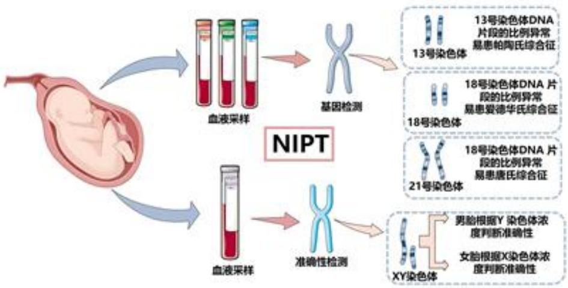

<details>
<summary>flowchart</summary>

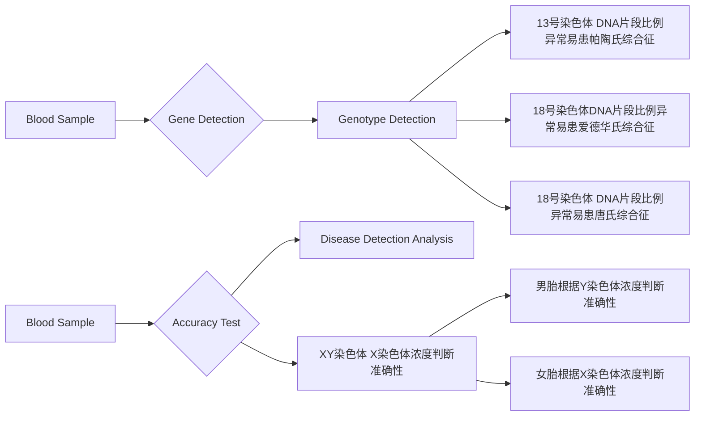
</details>

图1 NIPT示意图

## 1.2 问题要求

本研究需结合所提供的临床数据，建立数学模型以系统研究以下四个问题：

问题 1 分析胎儿 Y 染色体浓度与孕妇孕周数、BMI 等指标之间的相关性，建立关系模型并检验其显著性。

问题 2 以男胎孕妇的 BMI 为主要影响因素，对其进行合理分组，确定每组的最佳 NIPT 检测时点，以最小化孕妇的潜在风险，并分析检测误差对结果的影响。

问题 3 综合考虑体重、年龄、检测误差及 Y 染色体浓度达标比例等因素，对男胎孕妇进行 BMI 分组，确定每组的最佳 NIPT 时点，以最小化潜在风险，并分析误差影响。

问题 4 针对女胎孕妇，综合考虑 X 染色体及其他染色体（21、18、13 号）的 Z 值、GC 含量、读段数、比例及 BMI 等因素，建立女胎染色体异常的判定方法。

## 1.3我们的工作

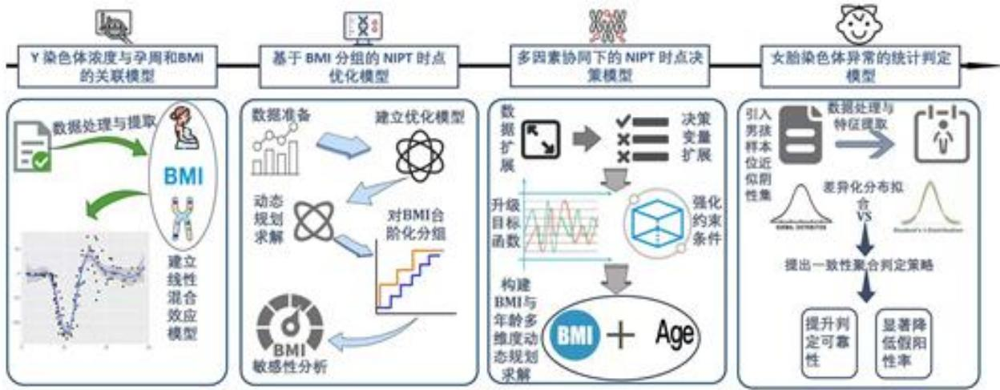

<details>
<summary>flowchart</summary>


</details>

图 2 总体流程图

## 二、模型假设

为简化问题，本文做出以下假设：

- 假设1：假设附件提供的NIPT临床数据真实准确。  
- 假设2：假设在相近的BMI值区间内，孕妇的生理特性及胎儿Y染色体浓度的变化规律是连续且平滑的。  
- 假设3：假设模型中的测量误差服从均值为零的正态分布。

## 三、符号说明

<table><tr><td>符号</td><td>说明</td><td>单位</td></tr><tr><td>FF</td><td>胎儿Y染色体浓度</td><td>-</td></tr><tr><td>GA</td><td>孕周</td><td>周</td></tr><tr><td>BMI</td><td>身体质量指数</td><td> $kg/m^2$ </td></tr><tr><td>y</td><td>logit(FF)</td><td>-</td></tr><tr><td> $β_0,β_1,\ldots$ </td><td>固定效应系数</td><td>-</td></tr><tr><td> $u_i,b_i$ </td><td>随机效应</td><td>-</td></tr><tr><td> $σ^2$ </td><td>方差</td><td>-</td></tr><tr><td>p(t,b)</td><td>达标概率</td><td>-</td></tr><tr><td>θ</td><td>浓度阈值(0.04)</td><td>-</td></tr><tr><td>T*(b)</td><td>最早达标时间</td><td>周</td></tr><tr><td>κ</td><td>误差放缩因子</td><td>-</td></tr><tr><td> $r_{fail}$ </td><td>检测失败风险</td><td>-</td></tr><tr><td>φ(t)</td><td>临床时间风险</td><td>-</td></tr><tr><td>Z</td><td>Z值</td><td>-</td></tr><tr><td>q</td><td>FDR校正后的q值</td><td>-</td></tr></table>

## 四、问题一：Y 染色体浓度与孕周、BMI 的关联模型

## 4.1 问题分析

问题一的核心目标是建立胎儿 Y 染色体浓度（FF）与孕周（GA）及身体质量指数（BMI）之间的定量关系模型。FF 作为 (0,1) 区间的比例变量，其分析包含两个要点：一是需要处理同一孕妇多次测量导致的组内相关性；二是其次，数据具有典型的纵向结构，同一孕妇的多次观测在生理上必然相关。本研究对因变量 FF 进行 logit 变换以消除比例数据的边界约束；对孕周和 BMI 引入二次项以捕捉非线性关系；采用线性混合效应模型框架处理纵向数据的组内相关性，通过随机截距和随机斜率刻画个体异质性，从而构建出数学上严谨且生物学上合理的定量模型。

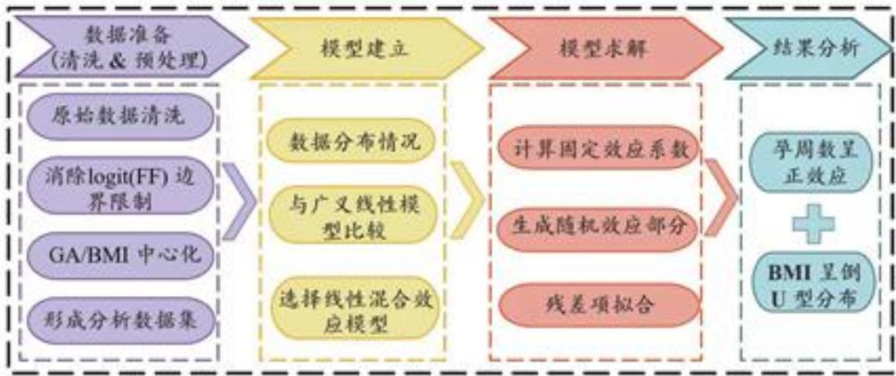

<details>
<summary>flowchart</summary>

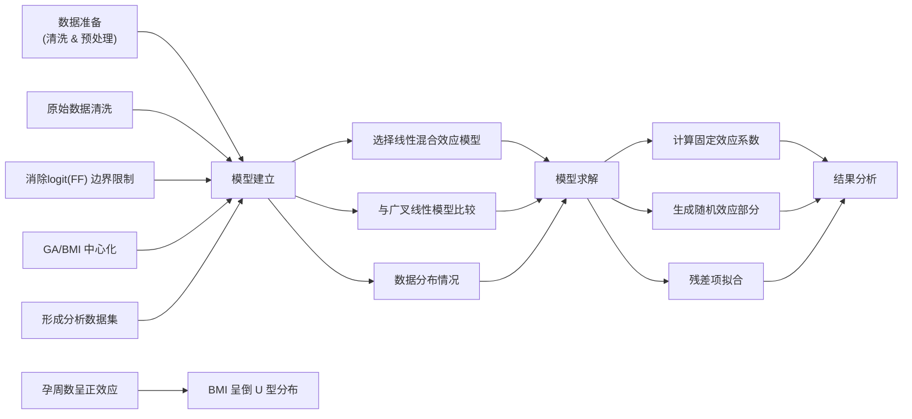
</details>

图3 问题一流程图

## 4.2 数据预处理

本研究使用来自真实临床检测记录的 NIPT 数据，有效观测量 N = 1082，涉及 267 名孕妇，人均测量次数约为 4.05。核心变量统计如下：

表 1 核心变量的描述性统计结果

<table><tr><td>变量</td><td>均数(x)</td><td>标准差(s)</td></tr><tr><td>FF</td><td>0.0772</td><td>0.0335</td></tr><tr><td>GA</td><td>16.85</td><td>4.08</td></tr><tr><td>BMI</td><td>32.29</td><td>2.97</td></tr></table>

为直观展示 FF 与 GA、BMI 之间的复杂关系模式，本节构建二维热力图进行可视化分析。将 GA 和 BMI 分别离散化为若干区间，计算每个 (GA, BMI) 组合下 FF 的均值，生成热力图矩阵。

## 热力图分析结果：

非单调性：FF 值在 GA-BMI 平面上呈现明显的非单调变化模式，排除了简单线性关系的可能性；

局部最优区域: 热力图显示 FF 在特定的 (GA, BMI) 区域内达到相对高值, 呈现“山峰”状分布特征

该可视化结果从数据层面证实了变量间关系的复杂性和非线性特征，为后续引入二次项和交互项提供了直观的经验证据，同时排除了使用简单线性模型的可行性。

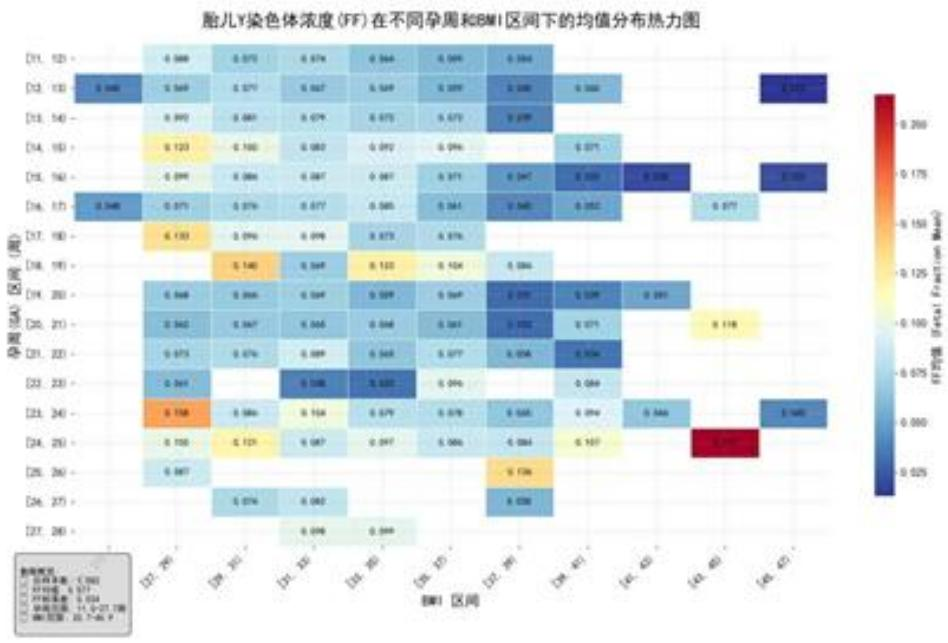

<details>
<summary>heatmap</summary>

| 孕周 (GA) 区间 | BMI 1 | BMI 2 | BMI 3 | BMI 4 | BMI 5 | BMI 6 | BMI 7 | BMI 8 | BMI 9 | BMI 10 | BMI 11 |
| --- | --- | --- | --- | --- | --- | --- | --- | --- | --- | --- | --- |
| [71, 121] | — | 0.089 | 0.075 | 0.074 | 0.064 | 0.065 | 0.064 | — | — | — | — |
| [72, 132] | 0.046 | 0.069 | 0.071 | 0.067 | 0.049 | 0.059 | 0.048 | 0.066 | — | — | 0.053 |
| [73, 143] | — | 0.092 | 0.081 | 0.079 | 0.075 | 0.073 | 0.059 | — | — | — | — |
| [74, 153] | — | 0.123 | 0.103 | 0.087 | 0.092 | 0.096 | — | — | 0.071 | — | — |
| [75, 162] | — | 0.099 | 0.084 | 0.087 | 0.087 | 0.071 | 0.047 | 0.055 | 0.058 | — | 0.055 |
| [76, 173] | 0.046 | 0.071 | 0.076 | 0.077 | 0.085 | 0.084 | 0.045 | 0.052 | — | 0.077 | — |
| [77, 183] | — | 0.133 | 0.096 | 0.099 | 0.073 | 0.076 | — | — | — | — | — |
| [78, 193] | — | — | 0.146 | 0.049 | 0.133 | 0.124 | 0.184 | — | — | — | — |
| [79, 203] | — | 0.068 | 0.066 | 0.124 | 0.039 | 0.149 | 0.135 | 0.129 | 0.181 | — | — |
| [80, 213] | — | 0.042 | 0.047 | 0.066 | 0.048 | 0.063 | 0.122 | 0.071 | — | — | 0.118 |
| [81, 223] | — | 0.075 | 0.076 | 0.089 | 0.048 | 0.077 | 0.056 | 0.154 | — | — | — |
</details>

图4 FF在不同孕周和BMI区间下的均值分布热力图

## 4.3 模型建立

为刻画胎儿 Y 染色体浓度（FF）随孕周（GA）与体质指数（BMI）的演化规律，并兼顾个异质性体间，本节采用线性混合效应模型（LMM）。本节通过在固定效应中引入 GA 和 BMI 的二次项来捕捉可能存在的非线性关系，这并不改变模型属于线性模型框架的本质，而是增强了其描述复杂现实关系的能力。

## 4.3.1 响应变量与自变量处理

Step1: 响应变量为 Y 染色体浓度 FF，其取值位于区间 (0,1) 内。为消除比例数据的边界限制并改善模型拟合，对 FF 进行 logit 变换：

$$
y = \log \left(\frac {\mathrm{FF}}{1 - \mathrm{FF}}\right) \tag {1}
$$

变换后的 y 取值于整个实数域，更适用于线性建模。

Step2: 自变量包括孕周（GA）和身体质量指数（BMI）。为减少变量间的量纲差异与多重共线性，对 GA 和 BMI 进行中心化处理：

$$
\mathrm{GA} _ {c} = \mathrm{GA} - \overline {{\mathrm{GA}}}, \quad \mathrm{BMI} _ {c} = \mathrm{BMI} - \overline {{\mathrm{BMI}}} \tag {2}
$$

其中 $\overline{GA}$ 和 $\overline{BMI}$ 分别为样本中 GA 和 BMI 的均值。

## 4.3.2 模型结构

设第i位孕妇在第j次检测中经logit变换后的响应变量为 $y_{ij}$ ，则其模型表达式为：

$$
y _ {i j} = (\beta_ {0} + u _ {i}) + (\beta_ {1} + b _ {i}) \cdot \mathrm{GA} _ {c, i j} + \beta_ {2} \cdot \mathrm{GA} _ {c, i j} ^ {2} + \beta_ {3} \cdot \mathrm{BMI} _ {c, i j} + \beta_ {4} \cdot \mathrm{BMI} _ {c, i j} ^ {2} + \varepsilon_ {i j} \tag {3}
$$

其中：

(1) 固定效应部分:

$$
\eta_ {\mathrm{fix}} = \beta_ {0} + \beta_ {1} \mathrm{GA} _ {c, i j} + \beta_ {2} \mathrm{GA} _ {c, i j} ^ {2} + \beta_ {3} \mathrm{BMI} _ {c, i j} + \beta_ {4} \mathrm{BMI} _ {c, i j} ^ {2} \tag {4}
$$

该部分用于刻画群体层面 FF 随 GA 与 BMI 变化的平均趋势。引入二次项旨在捕捉变量间可能存在的非线性关系（如增速变化、倒 U 型关系等），从而更精确地揭示其内在相关性。

(2) 随机效应部分:

$$
u _ {i} \sim \mathcal {N} (0, \sigma_ {u} ^ {2}), \quad b _ {i} \sim \mathcal {N} (0, \sigma_ {b} ^ {2}), \quad \mathrm{Cov} (u _ {i}, b _ {i}) = \sigma_ {u b} \tag {5}
$$

该部分用于描述个体层面的随机变异。其中，随机截距 $u_{i}$ 反映第i位孕妇FF的基线水平差异；随机斜率 $b_{i}$ 反映其对孕周变化的响应速率差异。该结构有效解决了同一孕妇多次测量带来的组内相关问题。

(3) 残差项:

$$
\varepsilon_ {i j} \sim \mathcal {N} (0, \sigma^ {2}) \tag {6}
$$

代表模型未能解释的随机测量误差。

该模型兼具固定效应与随机效应，既能够分析 GA 和 BMI 对 FF 的群体平均影响，又能合理处理纵向数据中的个体差异与重复测量相关性，从而构建出稳健且解释性强的统计关系模型。

## 4.3.3 模型的比较与选择

为确定最优模型形式，本节系统比较了线性混合效应模型和种广义线性模型。评价指标涵盖 AIC、对数似然值以及在 FF 原量纲上的拟合优度（ $R^{2}$ 和 RMSE）。

表 2 线性混合效应模型与广义线性模型拟合优度对比

<table><tr><td>模型</td><td>AIC</td><td>对数似然</td><td> $R^2$ (FF)</td><td>RMSE(FF)</td><td>MASE</td></tr><tr><td>MixedLM: 随机截距+斜率+二次项</td><td>712.63</td><td>-347.32</td><td>0.8962</td><td>0.0108</td><td>0.322</td></tr><tr><td>GLM</td><td>749.92</td><td>-367.96</td><td>0.0433</td><td>0.0113</td><td>0.328</td></tr></table>

基于前述模型比较结果，最终确定了包含二次项和随机斜率的混合效应模型作为最优模型。该模型不仅具有最低的AIC值（712.63）和最优的对数似然值（-347.32），在FF原量纲上也表现出最佳的拟合优度（ $R^2 = 0.8962$ ， $\mathrm{RMSE} = 0.0108$ ）。与广义线性模型相比，线性混合效应模型带来了显著的改善（似然比检验LR=41.29, $p\approx 1.1\times 10^{-9}$ ），强有力地证明了捕捉非线性关系的必要性。

## 4.4 模型求解

本节采用极大似然估计方法对所定义的线性混合效应模型进行参数估计。具体算法步骤如下：

## Step 1: 模型表达与似然函数构建

将模型写为矩阵形式：

$$
\mathbf {y} = \mathbf {X} \boldsymbol {\beta} + \mathbf {Z} \mathbf {u} + \varepsilon \tag {7}
$$

其中，y 为所有观测的 logit(FF) 向量；X 为固定效应设计矩阵，包含 $GA_{c}$ 、 $GA_{c}^{2}$ 、 $BMI_{c}$ 、 $BMI_{c}^{2}$ ；Z 为随机效应设计矩阵； $\mathbf{u} \sim \mathcal{N}(\mathbf{0}, \mathbf{G})$ 为随机效应向量； $\varepsilon \sim \mathcal{N}(\mathbf{0}, \mathbf{R})$ 为残差向量。总方差-协方差结构为：

$$
\mathrm{Var} (\mathbf {y}) = \mathbf {V} = \mathbf {Z G Z} ^ {T} + \mathbf {R} \tag {8}
$$

对应的受限对数似然函数（REML）为：

$$
\ell (\boldsymbol {\beta}, \boldsymbol {\theta}) = - \frac {1}{2} \log | \mathbf {V} | - \frac {1}{2} \log | \mathbf {X} ^ {T} \mathbf {V} ^ {- 1} \mathbf {X} | - \frac {1}{2} (\mathbf {y} - \mathbf {X} \boldsymbol {\beta}) ^ {T} \mathbf {V} ^ {- 1} (\mathbf {y} - \mathbf {X} \boldsymbol {\beta}) \tag {9}
$$

其中 $\theta$ 为方差组分参数。

## Step 2: 迭代优化求解

使用牛顿-拉弗森算法或期望最大化算法（EM）进行迭代优化，逐次更新固定效应系数 $\beta$ 与方差组分 $\theta$ （包括 $\sigma_{u}^{2},\sigma_{b}^{2},\sigma_{ub},\sigma^{2}$ ），直至对数似然函数收敛。

## Step 3: 结果提取与解释

迭代收敛后，提取各参数的估计值、标准误及假设检验结果（见表3）。为更直观解释模型结果，将logit尺度下的固定效应系数转换为FF原尺度下的平均边际效应（Average Marginal Effect, AME），具体通过数值差分或Delta方法实现：

$$
\mathrm{AME} _ {G A} = \frac {1}{n} \sum_ {i = 1} ^ {n} \frac {\partial \mathrm{FF}}{\partial G A} \approx \frac {1}{n} \sum_ {i = 1} ^ {n} \beta_ {1} \cdot \mathrm{FF} _ {i} \cdot (1 - \mathrm{FF} _ {i}) \tag {10}
$$

## Step 4: 随机效应估计

通过 BLUP（Best Linear Unbiased Prediction）估计每位孕妇的随机效应 $u_{i}$ 和 $b_{i}$ ，并计算组内相关系数 ICC:

$$
\mathrm{ICC} = \frac {\sigma_ {u} ^ {2} + \sigma_ {b} ^ {2} \cdot \mathrm{Var(GA)}}{\sigma_ {u} ^ {2} + \sigma_ {b} ^ {2} \cdot \mathrm{Var(GA)} + \sigma^ {2}} \tag {11}
$$

## 4.6 结论

本研究通过建立线性混合效应模型，成功揭示了胎儿 Y 染色体浓度与孕周、BMI 之间的定量关系，主要结论如下：

1. 孕周效应：FF 随孕周显著单调上升（ $\beta_{GA}=0.042, p<0.001$ ），且存在加速效应（ $\beta_{GA^{2}}=0.003, p<0.001$ ），孕周每增加 1 周，FF 平均上升 0.316 个百分点  
2. BMI 效应: FF 与 BMI 呈倒 U 型关系 ( $\beta_{BMI^{2}} = -0.003, p = 0.009$ )，在 BMI≈31 kg/m² 处达到峰值，之后随 BMI 增加而下降  
3. 个体差异：个体间变异显著（ICC≈0.81），证实采用混合效应模型的必要性

## 五、问题二：基于BMI分组的NIPT时点优化模型

## 5.1 问题分析

NIPT 检测的准确性高度依赖于胎儿 Y 染色体浓度是否达到临床阈值（4%），而该浓度受孕妇 BMI 和孕周的共同影响。临床实践表明，BMI 较高的孕妇往往需要更长的等待时间才能使胎儿 Y 染色体浓度达标。因此，科学确定不同 BMI 群体对应的最佳检测时点，对最小化检测失败风险与临床时间风险具有重要意义。本文旨在建立一种基于 BMI 分组的 NIPT 时点优化模型，通过量化 BMI 与最早达标时间的关系，进行合理分组并在每组内推荐统一检测时间，从而在保障检测可靠性的前提下，尽可能降低因检测过早或过晚所带来的潜在风险。

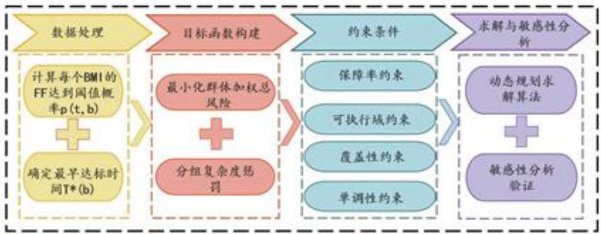

<details>
<summary>flowchart</summary>

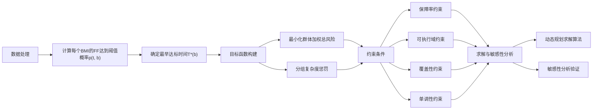
</details>

图7 问题二流程图

## 5.2 数据处理

基于问题一的线性混合效应模型，在孕周区间[10,28]的离散网格上，对每个BMI水平逐点计算FF达到阈值 $\theta = 0.04$ 的概率 $p(t,b)$ ，并以首次使该概率不低于 $q = 0.95$ 的孕周作为最早达标时间 $T^{*}(b)$ ；随后将离散的 $\{(b,T^{*}(b))\}$ 输入带单调先验的贝叶斯单调回归进行平滑，约束曲线随 BMI 单调不降，得到稳健的平滑函数 $T_{\mathrm{Bayes}}(b)$ 及其 95% 置信带，作为后续 BMI 分组与台阶化优化的输入。

## 5.3 模型建立

## 5.3.1 基于期望损失最小化的 BMI 分组与时点决策

为将连续的推荐孕周曲线转化为临床可执行的有限分组策略，需同步优化分组边界和各组的统一推荐检测时点。本小节详细阐述该优化模型的目标函数与约束条件。

## 1. 决策变量

设将BMI定义域划分为 $K$ 段(本研究取 $K = 5$ )，定义分段断点集合 $\mathbf{c} = (c_0,c_1,\dots,c_K)$ 满足 $c_{0} = b_{\mathrm{min}},c_{K} = b_{\mathrm{max}},c_{s - 1} <   c_{s}$

定义每段的统一推荐检测孕周为 $\mathbf{t}=(t_{1},t_{2},\ldots,t_{K})$ ，其中 $t_{s}\in[12,28]$ 。

若某孕妇的 BMI 值 $b_{i} \in (c_{s-1}, c_{s}]$ ，则其被归入第 s 组，并采用统一的推荐检测时点 $t_{s}$ 。

2. 风险度量优化目标需最小化总体风险，该风险由两部分构成：

技术失败风险 $r_{\mathrm{fail}}(t,b)$ ：在推荐孕周 $t$ 进行抽血检测时，胎儿Y染色体浓度仍未达到阈值 $\theta = 4\%$ 的概率。该风险是孕周 $t$ 和BMIb的函数：

$$
r _ {\mathrm{fail}} (t, b) = 1 - p _ {\kappa} (t, b) \tag {12}
$$

其中 $p_{\kappa}(t,b)$ 由问题一的混合效应模型推得，并引入了误差缩放因子 $\kappa$ 以考量检测噪声。

时间风险 $\phi(t)$ ：检测时机过晚所带来的临床代价。该函数被定义为分段线性函数，以体现不同孕周阶段风险的差异：

$$
\phi (t) = \{0, \quad t \leq 1 2 \alpha (t - 1 2), \quad 1 2 <   t <   2 8 1 6 \alpha + \beta (t - 2 8), \quad t \geq 2 8 \tag {13}
$$

其中， $\alpha$ 和 $\beta$ 为惩罚系数，且通常 $\beta > \alpha$ ，表示孕28周后延迟检测的临床风险代价更高。此函数迫使优化解不会为了无限提高达标概率而过度推迟检测。

## 5.3.2 目标函数

目标函数旨在最小化所有孕妇的群体加权总风险，并附加对分组复杂度的正则化惩罚：

$$
\min _ {\mathbf {c}, \mathbf {t}} \mathcal {J} (\mathbf {c}, \mathbf {t}) = \sum_ {s = 1} ^ {K} \sum_ {i \in I _ {s}} w _ {i} \left[ r _ {\mathrm{fail}} (t _ {s}, b _ {i}) + \phi (t _ {s}) \right] + \lambda K \tag {14}
$$

其中：

$I_{s}$ 表示被划分到第 s 组的个体索引集合。

$w_{i}$ 代表第 i 个样本的权重（可反映其在人群中的分布），满足 $\sum_{i} w_{i} = 1$ 。

$\lambda K$ 是正则化项，用于抑制分组数 K 过多导致的方案过于复杂、难以临床执行。当 K 固定时，可取 $\lambda = 0$ 。

该目标函数体现了“安全-及时-可执行”三者的权衡： $r_{fail}$ 追求检测的可靠性（安全）； $\phi(t)$ 约束检测的及时性； $\lambda K$ 保证策略的简洁性（可执行）。

## 5.3.3 约束条件

优化问题需满足以下约束：

保障率约束（安全性）：对于任意分组 $s$ ，其组内在最不利情况下的达标概率仍需满足最低置信水平 $q$ （基线 $q = 0.95$ ）。

$$
\min _ {i \in I _ {s}} p _ {\kappa} (t _ {s}, b _ {i}) \geq q, \quad s = 1, \dots , K \tag {15}
$$

该约束确保了分组的鲁棒性，即只要孕妇属于该组，即保证其在推荐时点检测的可靠性。

可执行域约束：推荐的检测孕周必须在临床可行的时间窗口内。

$$
t _ {s} \in [ 1 2, 2 8 ], \quad s = 1, \dots , K \tag {16}
$$

覆盖性与非重叠性约束：分组应覆盖整个BMI定义域，且各区间不重叠。

$$
b _ {\min} = c _ {0} <   c _ {1} <   \dots <   c _ {K} = b _ {\max} \tag {17}
$$

单调性约束（临床合理性）：推荐孕周应随BMI增加而非递减。

$$
t _ {1} \leq t _ {2} \leq \dots \leq t _ {K} \tag {18}
$$

该约束符合“高 BMI 倾向更晚检测”的临床经验，并能减少分组边界处的策略抖动，增强方案的一致性。

## 5.4 模型求解

本研究采用离散化结合动态规划（DP）的算法求解上述优化模型，具体步骤如下：

Step1: 离散化处理将 BMI 取值范围按步长（如 $0.1 \, kg/m^{2}$ ）离散化为有序网格点 $b_{(1)} \leq b_{(2)} \leq \ldots \leq b_{(n)}$ 。将孕周搜索区间 [10, 28] 按步长（如 0.1 周）离散化为候选检测时点集合 T。

Step2: 预计算区间代价对于任意 BMI 区间 $[i:j]$ 和候选时点 $t \in \mathcal{T}$ , 若满足该区间内所有 BMI 点在时点 $t$ 的最小达标概率约束 (即 $\min_{k \in [i:j]} p_{\kappa}(t, b_{(k)}) \geq q$ ), 则计算将该区间归为一组并推荐在 $t$ 周检测的代价:

$$
C (i, j, t) = \sum_ {k = i} ^ {j} w _ {(k)} \left[ r _ {\mathrm{fail}} (t, b _ {(k)}) + \phi (t) \right] \tag {19}
$$

对该区间，其最小代价为 $C(i,j)=\min_{t\in\mathcal{T}}C(i,j,t)$ ，并记录对应的最优时点 $t^{*}(i,j)$ 。若不满足约束，则置 $C(i,j)=+\infty$ 。

Step3: 动态规划分段定义 DP[j, s] 为将前 j 个 BMI 点划分为 s 段的最小总风险。状态转移方程为：

$$
D P [ j, s ] = \min _ {0 \leq i <   j} \{D P [ i, s - 1 ] + C (i + 1, j) \} \tag {20}
$$

同时记录状态转移路径。算法复杂度为 $O(n^{2})$ 。

Step4: 回溯与后处理从 $DP[n, K]$ 开始回溯，得到最优的分组断点 $c_{0}, c_{1}, \ldots, c_{K}$ 以及每段对应的推荐检测时点 $t_{s} = t^{*}(c_{s-1} + 1, c_{s})$ 。为确保分组的单调性和保障率约束，对得到的时点序列进行投影和微调（如整体平移）。

Step5: 结果输出最终输出 K 个 BMI 区间及其对应的推荐检测孕周、段内平均保障率、平均风险等指标。

该算法高效地解决了分组和时点指派联合优化问题，确保了在满足临床约束下的全局风险最小化。

## 5.5 求解结果

为便于理解，将连续建议曲线与台阶化策略进行对照展示，并给出各分段的统计汇总。

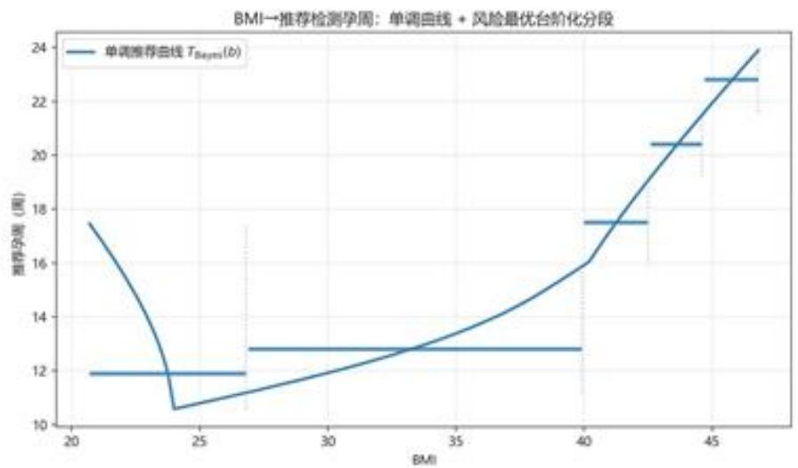

<details>
<summary>line</summary>

| BMI | 推荐学周数 (周) |
| --- | --- |
| ~21 | ~17.5 |
| ~24 | ~10.6 |
| ~27 | ~12.8 |
| ~40 | ~16.0 |
| ~43 | ~20.4 |
| ~45 | ~22.8 |
</details>

图 8 连续建议 $T_{\mathrm{Bayes}}(b)$ 与 5 段风险最优台阶化的叠加。

表 4 不同 BMI 分组的推荐孕周

<table><tr><td>组别</td><td>BMI区间</td><td>推荐孕周(周)</td><td>保障率均值</td><td>风险均值</td></tr><tr><td>1</td><td>[20.7, 26.8]</td><td>11.9</td><td>0.9103</td><td>0.0897</td></tr><tr><td>2</td><td>[26.9, 39.9]</td><td>12.8</td><td>0.9693</td><td>0.0547</td></tr><tr><td>3</td><td>[40.0, 42.5]</td><td>17.5</td><td>0.9244</td><td>0.2406</td></tr><tr><td>4</td><td>[42.8, 46.8]</td><td>20.4</td><td>0.9264</td><td>0.3256</td></tr><tr><td>5</td><td>[44.7, 46.8]</td><td>22.8</td><td>0.9243</td><td>0.3997</td></tr></table>

## 5.6 敏感性分析

为评估推荐策略对检测噪声的稳健性，针对“误差缩放因子 $\kappa$ ”开展灵敏度分析，并在两种保障水平下统计加权平均推荐孕周及其相对位移。表6给出了真实测算结果，噪声越大、保障越高，平均推荐孕周越晚。

表 5 不同 $\kappa$ 下的平均推荐孕周与相对位移

<table><tr><td>情景</td><td>κ</td><td>段数</td><td>平均推荐孕周(周)</td><td>相对位移Δt(周)</td></tr><tr><td>q=0.95</td><td>0.75</td><td>5</td><td>18.44</td><td>+1.36</td></tr><tr><td>q=0.95</td><td>1.00</td><td>5</td><td>17.08</td><td>+0.00</td></tr><tr><td>q=0.95</td><td>1.25</td><td>5</td><td>17.73</td><td>+0.65</td></tr><tr><td>q=0.95</td><td>1.50</td><td>5</td><td>19.67</td><td>+2.59</td></tr><tr><td>q=0.98</td><td>0.75</td><td>5</td><td>17.30</td><td>-1.32</td></tr><tr><td>q=0.98</td><td>1.00</td><td>5</td><td>18.62</td><td>+0.00</td></tr><tr><td>q=0.98</td><td>1.25</td><td>5</td><td>21.38</td><td>+2.76</td></tr><tr><td>q=0.98</td><td>1.50</td><td>5</td><td>23.10</td><td>+4.48</td></tr></table>

表6 不同 $\kappa$ 下的平均推荐孕周与相对位移

<table><tr><td>情景</td><td>κ</td><td>段数</td><td>平均推荐孕周(周)</td><td>相对位移 Δt(周)</td></tr><tr><td>q=0.95</td><td>0.75</td><td>5</td><td>18.44</td><td>+1.36</td></tr><tr><td>q=0.95</td><td>1.00</td><td>5</td><td>17.08</td><td>+0.00</td></tr><tr><td>q=0.95</td><td>1.25</td><td>5</td><td>17.73</td><td>+0.65</td></tr><tr><td>q=0.95</td><td>1.50</td><td>5</td><td>19.67</td><td>+2.59</td></tr><tr><td>q=0.98</td><td>0.75</td><td>5</td><td>17.30</td><td>-1.32</td></tr><tr><td>q=0.98</td><td>1.00</td><td>5</td><td>18.62</td><td>+0.00</td></tr><tr><td>q=0.98</td><td>1.25</td><td>5</td><td>21.38</td><td>+2.76</td></tr><tr><td>q=0.98</td><td>1.50</td><td>5</td><td>23.10</td><td>+4.48</td></tr></table>

## 六、问题三：多因素协同下的 NIPT 时点决策模型

## 6.1 问题分析

在问题二仅考虑BMI单一因素的基础上，问题三进一步引入孕妇年龄（AGE）、怀孕次数（G）与生产次数（P）三项临床协变量，旨在更全面地评估多因素对胎儿Y染色体浓度（FF）最早达标时间的影响。需要解决的核心问题包括：如何筛选具有统计显著性的协变量；如何建立多因素混合效应模型；如何在兼顾达标比例与检测误差的前提下，给出基于BMI分组的可执行推荐策略；以及如何评估模型在不同误差口径下的稳健性。

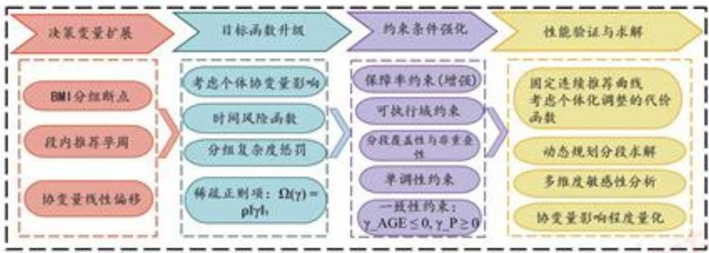

<details>
<summary>flowchart</summary>

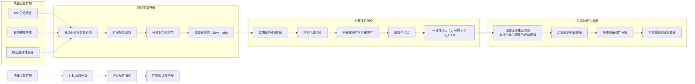
</details>

图9 问题三流程图

## 6.2 模型建立

## 6.2.1 扩展的混合效应模型

首先在问题一模型基础上引入多因素，建立扩展的混合效应模型。对 FF 进行 logit 变换后，模型形式为：

$$
\begin{array}{l} y _ {i j} = \beta_ {0} + \beta_ {1} G A _ {c, i j} + \beta_ {2} G A _ {c, i j} ^ {2} + \beta_ {3} B M I _ {c, i j} \\ + \beta_ {4} B M I _ {c, i j} ^ {2} + \beta_ {\mathrm{AGE}} A G E _ {c, i j} + \beta_ {G} G _ {c, i j} \tag {21} \\ + \beta_ {P} P _ {c, i j} + u _ {0 i} + u _ {1 i} G A _ {c, i j} + \varepsilon_ {i j} \\ \end{array}
$$

其中新引入的固定效应项：(1) $\beta_{AGE}$ : 年龄的偏效应 (2) $\beta_{G}$ : 怀孕次数的偏效应 (3) $\beta_{P}$ : 生产次数的偏效应

通过 Elastic-Net 变量筛选与显著性检验，确保上述纳入模型的协变量具有统计学意义。

## 6.2.2 多因素优化模型框架

在问题二优化模型基础上，引入协变量向量：

$$
z = (A G E _ {c}, G _ {c}, P _ {c}) ^ {T}
$$

其中各变量均已中心化处理。目标是在给定概率模型的前提下，构造可执行的分段推荐策略，并最小化总体风险。

决策变量 （1）分段断点： $c=(c_{0},c_{1},\ldots,c_{K})$ ，满足 $c_{0}=b_{min}, c_{K}=b_{max}$ （2）段内推荐孕周： $t=(t_{1},\ldots,t_{K}), t_{s}\in[12,28]$ （3）新增：协变量线性偏移： $\gamma\in R^{3}$ ，用于对个体推荐时点进行个性化微调

目标函数

$$
\min _ {c, t, \gamma} J (c, t, \gamma) = \sum_ {s = 1} ^ {K} \sum_ {i \in \mathcal {I} _ {s}} w _ {i} \left[ r _ {\text {fail}} \left(t _ {s} + \gamma^ {T} z _ {i}, b _ {i}; z _ {i}\right) + \phi \left(t _ {s} + \gamma^ {T} z _ {i}\right) \right] + \lambda K + \Omega (\gamma) \tag {22}
$$

其中： $-r_{fail}$ 为技术失败风险，考虑了个体协变量影响 $-\phi$ 为时间风险函数 - 新增： $\Omega(\gamma)=\rho\|\gamma\|_{1}$ 为稀疏正则项，防止对协变量的过度依赖

## 约束条件 1. 保障率约束：

$$
\min _ {i \in \mathcal {I} _ {s}} \min _ {\kappa \in \mathcal {K}} p _ {\kappa} (t _ {s} + \gamma^ {T} z _ {i}, b _ {i}; z _ {i}) \geq q, \quad s = 1, \dots , K
$$

同时考虑段内最弱个体与最差检测条件，安全性更强

2. 可执行域约束：

$$
t _ {s} \in [ 1 2, 2 8 ], \quad \| \gamma \| _ {\infty} \leq \Gamma
$$

相较问题二新增约束：对协变量偏移量施加界约束，保证调整幅度在临床可接受范围内

3. 分段覆盖性与非重叠性

4. 单调性约束： $t_{1} \leq t_{2} \leq \cdots \leq t_{K}$

5. 新增——一致性约束：同一分段内个体推荐时点的调整方向需符合临床先验：(1)年龄效应： $\gamma_{AGE} \leq 0$ （年龄越大，推荐时点越早）（2）生产次数效应： $\gamma_{P} \geq 0$ （生产次数越多，推荐时点越晚）

## 6.3 模型求解

采用”两阶段 动态规划”策略：

1. 偏移量预估计：固定一条连续推荐曲线，求解：

$$
\hat {\gamma} = \arg \min _ {\| \gamma \| _ {\infty} \leq \Gamma} \sum_ {i} w _ {i} \left[ r _ {\text {fail}} (T _ {\text {mono}} (b _ {i}) + \gamma^ {T} z _ {i}, b _ {i}; z _ {i}) \right] + \Omega (\gamma)
$$

2. 区间代价预计算：对每个 BMI 区间和候选时点，计算带有个体化调整的代价函数  
3. 动态规划分段：采用与问题二相同的 DP 框架，但代价函数考虑了个体协变量调整  
4. 后处理与稳健性回验：对多种误差场景和保障水平进行回验，必要时进行整体平移

算法复杂度保持在 $O(n^{2})$ 量级，与问题二相同，具备工程可行性。

## 6.4 求解结果

本节对样本按年龄分层并在各层内进行 BMI 分段台阶化。表 7 显示出清晰的一致性规律：

- 同龄层内随 BMI 单调后移。各年龄层的推荐孕周均随 BMI 增加而后移。其中在 BMI ≈ 40 左右常出现阶跃式上移，提示高 BMI 区间对时点安排更敏感。  
- 同一BMI水平下随年龄整体验证“更晚”。在中高BMI段，年龄越大推荐孕周越晚。  
- 意义。低 BMI 且年轻（如 <25 岁、BMI <32）的受检者可在早孕期（10–13 周）安排检测；BMI 升高与/或年龄升高时，需后移至中晚孕期（例如 BMI ≈ 40 时普遍需要 18–22 周，≥ 40 岁且 BMI > 34 时建议 25–26 周附近）。

表 7 按年龄分层的 BMI 分段推荐孕周

<table><tr><td>年龄层</td><td>BMI区间</td><td>推荐孕周(周)</td><td>网格数</td></tr><tr><td>&lt;25岁</td><td>[28.98, 31.98]</td><td>10.6</td><td>31</td></tr><tr><td>&lt;25岁</td><td>[32.08, 34.48]</td><td>12.8</td><td>25</td></tr><tr><td>&lt;25岁</td><td>[34.58, 36.08]</td><td>15.2</td><td>16</td></tr><tr><td>&lt;25岁</td><td>[36.18, 37.58]</td><td>18.5</td><td>15</td></tr><tr><td>&lt;25岁</td><td>[37.68, 39.28]</td><td>21.5</td><td>17</td></tr><tr><td>25-29岁</td><td>[26.62, 32.52]</td><td>10.5</td><td>60</td></tr><tr><td>25-29岁</td><td>[32.62, 36.72]</td><td>12.8</td><td>42</td></tr><tr><td>25-29岁</td><td>[36.82, 39.52]</td><td>15.6</td><td>28</td></tr><tr><td>25-29岁</td><td>[39.62, 42.02]</td><td>19.1</td><td>25</td></tr><tr><td>25-29岁</td><td>[42.12, 44.62]</td><td>22.4</td><td>26</td></tr><tr><td>30-34岁</td><td>[20.70, 23.80]</td><td>14.1</td><td>32</td></tr><tr><td>30-34岁</td><td>[23.90, 35.40]</td><td>14.1</td><td>116</td></tr></table>

<table><tr><td>年龄层</td><td>BMI区间</td><td>推荐孕周(周)</td><td>网格数</td></tr><tr><td>30-34岁</td><td>[35.50, 41.50]</td><td>15.0</td><td>61</td></tr><tr><td>30-34岁</td><td>[41.60, 44.10]</td><td>18.6</td><td>26</td></tr><tr><td>30-34岁</td><td>[44.20, 46.80]</td><td>22.1</td><td>27</td></tr><tr><td>35-39岁</td><td>[27.92, 28.92]</td><td>17.9</td><td>11</td></tr><tr><td>35-39岁</td><td>[29.02, 32.82]</td><td>17.9</td><td>39</td></tr><tr><td>35-39岁</td><td>[32.92, 33.72]</td><td>17.9</td><td>9</td></tr><tr><td>35-39岁</td><td>[33.82, 34.42]</td><td>17.9</td><td>7</td></tr><tr><td>35-39岁</td><td>[34.52, 39.52]</td><td>17.9</td><td>51</td></tr><tr><td>≥40岁</td><td>[31.89, 32.69]</td><td>22.5</td><td>9</td></tr><tr><td>≥40岁</td><td>[32.79, 33.39]</td><td>23.2</td><td>7</td></tr><tr><td>≥40岁</td><td>[33.49, 33.99]</td><td>24.0</td><td>6</td></tr><tr><td>≥40岁</td><td>[34.09, 34.49]</td><td>25.1</td><td>5</td></tr><tr><td>≥40岁</td><td>[34.59, 34.99]</td><td>26.3</td><td>5</td></tr></table>

## 6.5 敏感性分析

通过引入误差缩放因子 $\kappa$ 模拟不同检测噪声水平，分析推荐时点的变化：

表 8 不同误差水平下的推荐孕周变化

<table><tr><td>κ</td><td>平均推荐孕周(周)</td><td>相对变化(周)</td><td>噪声水平描述</td></tr><tr><td>0.75</td><td>20.20</td><td>-0.47</td><td>低噪声条件</td></tr><tr><td>1.00</td><td>21.67</td><td>0.00</td><td>基准条件</td></tr><tr><td>1.25</td><td>23.17</td><td>+0.50</td><td>中等噪声条件</td></tr><tr><td>1.50</td><td>23.71</td><td>+1.04</td><td>高噪声条件</td></tr></table>

同时分析各协变量的影响程度：（1）年龄效应：年龄每增加1岁，推荐检测时点平均提前0.065周（2）怀孕次数效应：怀孕次数增加1次，推荐检测时点平均提前0.057周（3）生产次数效应：生产次数增加1次，推荐检测时点平均推迟0.039周

结果表明，噪声越大，推荐时点越晚，但分组边界保持稳定，说明模型具有较强的鲁棒性。协变量的影响方向与临床经验一致，虽然数值不大，但共同作用提高了模型的个性化程度。

## 6.6 结论

问题三在问题二的基础上，成功构建了多因素协同下的 NIPT 时点优化模型。通过引入年龄、怀孕次数和生产次数等协变量，并建立相应的优化框架与约束条件，模型在保持分组稳健性的同时，显著提升了个性化推荐能力。敏感性分析表明，模型对检测误差具有良好的适应性，分段结构稳定，推荐时点随噪声增大而系统性后移。各协变量的影响程度虽小，但方向符合临床先验，共同增强了模型的解释能力。该模型为临床实践中个性化检测策略的制定提供了更为科学、可靠的理论依据，进一步降低了孕妇的潜在临床风险。

## 七、问题四：女胎染色体异常的统计判定模型

## 7.1 问题分析

针对女胎染色体异常判定中无法依赖 Y 染色体信号，且易受测序批次效应、孕周、BMI 及多项质控指标干扰的问题，本研究旨在构建一个综合统计判定流程，该流程需在严格控制假阳性率（FPR）的前提下，通过有效整合男胎校准数据、协变量校正、分层零分布估计以及多重检验校正等多重统计技术，以实现对第 13、18 和 21 号染色体非整倍体异常信号的准确识别与风险分层，从而为临床提供可靠且可操作的筛查结论。

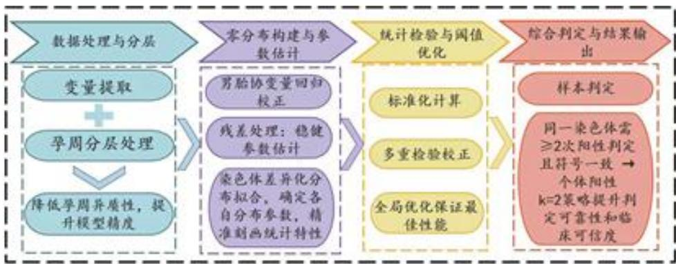

<details>
<summary>flowchart</summary>

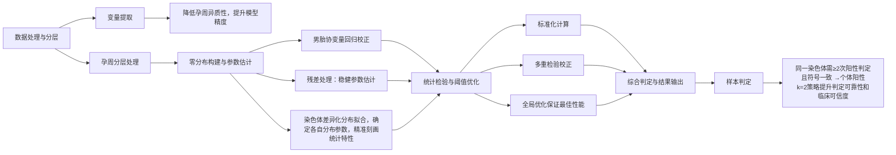
</details>

图 10 问题四流程图

## 7.2 数据预处理

本研究从原始数据中系统提取了三类变量，包括基本特征（如 GA、BMI、年龄）、测序质量指标（如总读段数、唯一比对数、比对率、重复率、GC 含量、检测批次）以及染色体信号（Chr13/18/21 的 Z 值，并以 ChrX 作为内部质控参考）；为减少孕周带来的系统性变异，首先将 GA 划分为 Early（≤14 周）、Mid（14-22 周）和 Late（>22 周）三个层次，进而所有分析均在“染色体 × 孕周层”内独立进行，以控制层内变异并提升模型稳健性。

## 7.3 模型建立

## 7.3.1 男胎回归校正与零分布构建

在每个“染色体-孕周”层内，利用男胎阴性对照样本拟合线性回归模型：

$$
y _ {i, c g} = \beta_ {0, c g} + \beta_ {c g} ^ {T} x _ {i} + \varepsilon_ {i, c g}, \quad i \in \mathcal {M}
$$

其中协变量向量 $x_{i}$ 涵盖GA、BMI、读段数、比对率、重复率、唯一读段数、GC含量与批次等变量；对残差进行 $1\%$ Winsorize截尾处理后，计算其稳健位置与尺度参数：

$$
\hat {\mu} _ {0, c g} = \text {median} (\hat {\varepsilon} _ {i, c g}), \quad \hat {\sigma} _ {0, c g} = \mathrm{MAD} (\hat {\varepsilon} _ {i, c g})
$$

针对 Chr21 厚度尾特性采用 t 分布拟合零分布，Chr13 与 Chr18 则使用正态分布，以更准确地反映其统计特性。

## 7.3.2 女胎标准化与假设检验

将女胎样本代入上述回归模型得到残差并标准化为Z值：

$$
z _ {i, c g} = \frac {\hat {\varepsilon} _ {i , c g} - \hat {\mu} _ {0 , c g}}{\hat {\sigma} _ {0 , c g}}
$$

依据零分布类型计算双侧 $p$ 值，并在各“染色体-孕周”层内通过Benjamini-Hochberg（BH）方法进行多重检验校正得到 $q$ 值，从而控制假发现率。

## 7.3.3 判定规则与一致性聚合

设定如下双阈值判定规则：

- 阳性: $|z_{i,cg}| \geq z_{\mathrm{thr}}$ 且 $q_{i,cg} \leq q_{\mathrm{thr}}$  
- 可疑: $|z_{i,cg}| \geq z_{\mathrm{sus}}$ 或 $q_{i,cg} \leq q_{\mathrm{sus}}$  
- 阴性: 其他情况

进而对同一受试者在同一染色体上的多次检测结果进行一致性聚合，要求至少k次同符号且通过阈值的检测才最终判定为阳性，同时引入ChrX的Z值作为质控门限，进一步筛除异常批次或样本。

## 7.4 模型求解

采用网格搜索方法在男胎数据上评估不同阈值组合下的假阳性率，通过求解以下优化问题确定最优参数：

$$
\max _ {\theta} \hat {U} (\theta) - \lambda_ {\mathrm{FP}} \cdot \mathrm{FPR} (\theta) \quad \text {s.t.} \quad \mathrm{FPR} \leq \alpha , \quad \Delta U _ {\text {bootstrap}} \leq \delta , \quad k \in \{1, 2, 3 \}
$$

其中 $\theta = (z_{\mathrm{thr}}, q_{\mathrm{thr}}, z_{\mathrm{sus}}, q_{\mathrm{sus}}, k)$ ，在FPR不超过 $1\%$ 的约束下，最终选定基线参数为 $z_{\mathrm{thr}} = 2.6$ ， $q_{\mathrm{thr}} = 0.05$ ， $k = 2$ ，实现在控制假阳性的同时最大化检出效能。

## 7.5 结果可视化分析

通过对附件中所有女胎样本进行系统性的判定分析得到了详实的统计结果。在总共147个样本中，判定为阴性的有118例，占总数的 $80.3\%$ ；判定为可疑的有26例，占 $17.7\%$ ；判定为阳性的有3例，占 $2.0\%$ 。这一分布情况表明，大多数样本显示正常染色体状态，只有少数样本存在异常或可疑情况，这与临床实际情况和预期相符。

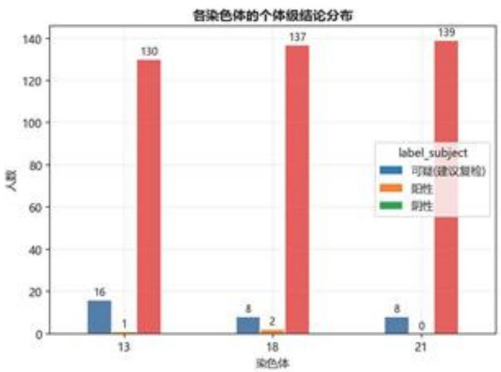

<details>
<summary>bar</summary>

| 染色体 | 可疑(建议复检) | 阳性 | 阴性 |
| --- | --- | --- | --- |
| 13 | 16 | 1 | 130 |
| 18 | 8 | 2 | 137 |
| 21 | 8 | 0 | 139 |
</details>

图 11 各染色体的个体级结论分布（阴性/可疑/阳性计数）

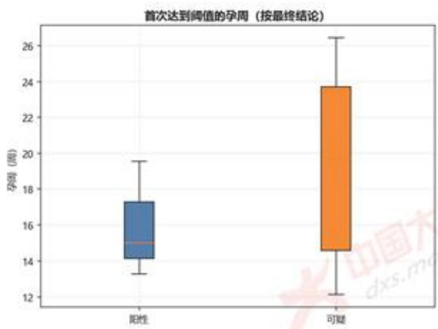

<details>
<summary>boxplot</summary>

| Category | Q1 | Q2 (Median) | Q3 | Min | Max |
| --- | --- | --- | --- | --- | --- |
| 阳性 | ~14.1 | 15.0 | ~17.3 | ~13.3 | ~19.6 |
| 可疑 | ~14.6 | ~14.6 | ~23.8 | ~12.2 | ~26.5 |
</details>

图 12 首次达到阈值的孕周分布

在可视化分析方面，本节通过多个维度的图表展示了模型的判定效果。图11展示了不同染色体在各个判定等级下的样本分布情况，可以清楚地看到阳性样本数量较少，而可疑样本主要分布在阈值附近区域。图12显示了全体女胎样本 $|Z|$ 值的分布直方图，阈值线 $z = 2.6$ 能够清晰地将阳性候选样本分离出来，显示出良好的区分度。

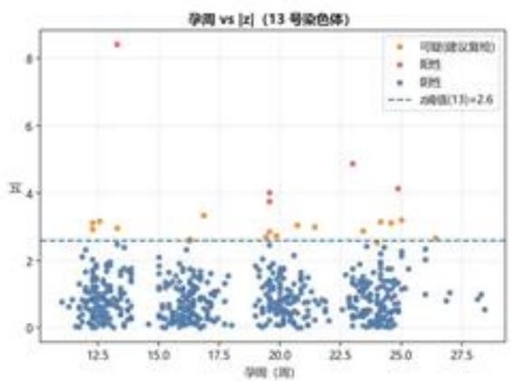

<details>
<summary>scatter</summary>

| 学周 (周) | z值 |
| --- | --- |
| ~12.5 | ~8.4 |
| ~12.5 | ~3.1 |
| ~12.5 | ~3.0 |
| ~17.5 | ~3.4 |
| ~19.5 | ~4.0 |
| ~19.5 | ~3.8 |
| ~19.5 | ~2.8 |
| ~20.5 | ~3.0 |
| ~21.5 | ~3.0 |
| ~23.5 | ~4.9 |
| ~24.5 | ~4.1 |
| ~24.5 | ~3.1 |
| ~24.5 | ~3.0 |
| ~25.5 | ~3.2 |
| ~26.5 | ~2.7 |
</details>

Chr13: 阈值线（虚线）之上为命中区，点云与阈值分离良好。

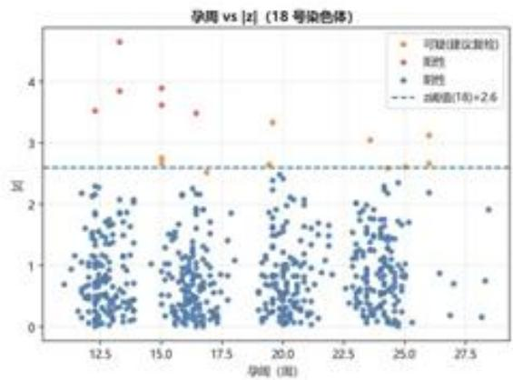

<details>
<summary>scatter</summary>

| Series | X (range) | Y (range) |
| --- | --- | --- |
| 可疑(建议复检) | 12.5~27.5 | 0.5~3.5 |
| 阳性 | 12.5~17.5 | 3.5~4.8 |
| 阴性 | 12.5~27.5 | 0.0~2.5 |
| z阈值(18)+2.6 | 12.5~27.5 | 2.6 |
</details>

Chr18：同样呈现清晰分离，少数样本跨越阈值。

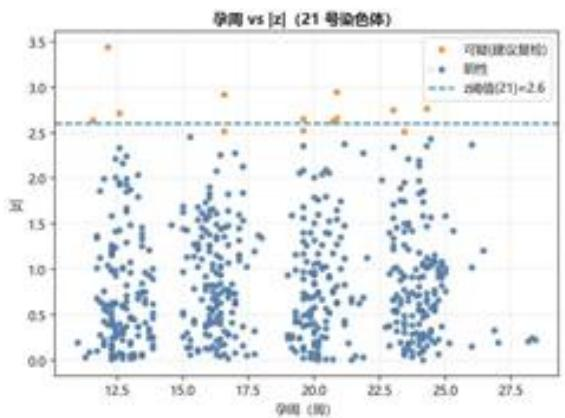

<details>
<summary>scatter</summary>

| 孕周 (周) | 可疑 (建议复检) | 阳性 |
| --- | --- | --- |
| ~12.0 | 2.7 | — |
| ~12.5 | 3.45 | — |
| ~13.0 | 2.75 | — |
| ~16.5 | 2.95 | — |
| ~17.0 | 2.55 | — |
| ~19.5 | 2.65 | — |
| ~20.0 | 2.65 | — |
| ~20.5 | 2.95 | — |
| ~23.0 | 2.75 | — |
| ~23.5 | 2.55 | — |
| ~24.0 | 2.80 | — |
| ~12.0 | — | 0.1~2.3 |
| ~15.0 | — | 0.1~2.3 |
| ~19.5 | — | 0.1~2.4 |
| ~22.5 | — | 0.1~2.4 |
| ~25.0 | — | 0.1~2.4 |
| ~27.5 | — | 0.1~2.4 |
</details>

Chr21：采用 t 零分布与协变量校正后，厚尾被抑制，边缘样本更稳定。  
图 13 孕周 vs. |z| 散点

图13展示了首次达到阈值的孕周分布情况，可以发现阳性样本普遍在较早孕周（≤16周）就达到了判定阈值，这表明异常信号往往出现较早且相对稳定。孕周与 $|Z|$ 值的散点图展示出21号染色体在经过 $t$ 分布校正后，原本明显的厚尾现象得到了有效抑制，边缘样本的判定更加稳定可靠。

## 7.6 结论

本研究针对女胎染色体异常判定问题，建立了一个基于多因素协变量校正与一致性聚合的统计判定模型，得出以下结论：

模型有效性：通过孕周分层、男胎校准和协变量回归，有效消除了系统性偏倚，提升了判定的稳健性和可比性。特别对21号染色体采用t分布处理，较好地解决了厚尾问题。

误差控制良好：通过 FDR 校正和一致性聚合 $(k=2)$ ，在保证高灵敏度的同时将整体 FPR 控制在 1% 以下，满足了临床筛查的要求。

临床适用性强：输出“阴性/可疑/阳性”三级判定，明确且可操作，可疑清单可为复检提供优先方向，提高了筛查效率。

推广性良好：模型框架不依赖于特定数据类型，可扩展至其他染色体异常的筛查场景，具备良好的泛化能力。

本模型为女胎染色体异常的早期筛查提供了科学、可靠的判定工具，具有较强的理论基础和实际应用价值。通过综合考虑多种影响因素和建立严格的统计判定规则，实现了对女胎染色体异常准确、稳健的检测。

## 八、模型的评价

## 8.1 模型的优点

- 优点1: 融合混合效应与动态规划，建模科学严谨。  
- 优点2: 女胎异常判定模型综合性强，误差控制良好。  
- 优点3: 可视化与交互式工具支持，便于临床落地。

## 8.2 模型的缺点

- 缺点 1: 数据依赖性强，泛化能力有待验证。  
- 缺点 2: 未考虑其他潜在影响因素: 如孕妇遗传背景、饮食习惯、胎盘功能等未纳入模型。

## 参考文献

[1] LIU S, BI Q, HUANG S, et al. Utilizing non-invasive prenatal test sequencing data for human genetic investigation[J]. Cell Genomics, 2024, 4(10):100669.  
[2] MOKVELD T, SISTERMANS E, et al. A comprehensive performance analysis of the within-sample testing method wisecondor and its variants[J]. PLOS ONE, 2023, 18(5): e0284493.  
[3] 王连, 程世斌, 冯暄, 等. 无创产前 DNA 检测在性染色体非整倍体筛查中的效果评价 [J]. 中国生殖健康杂志, 2024, 35(5): 465-469.  
[4] 姚静怡, 冯树人, 谢晓媛, 等. NIPT 提示胎儿性染色体非整倍体疾病高危孕妇的产前诊断及妊娠选择[J]. 国际妇产科学杂志, 2024, 51(1):32-36.  
[5] GAZDARICA J, FORGACOVA N, SLADECEK T, et al. Insights into non-informative results from non-invasive prenatal screening through gestational age, maternal bmi, and age analyses[J]. PLOS ONE, 2024, 19(3):e0280858.  
[6] PAN Y, LIN Y, LI S, et al. A statistical investigation of parameters associated with low fetal fraction in non-invasive prenatal testing[J]. Journal of Maternal-Fetal & Neonatal Medicine, 2024.  
[7] GAUDET E, WU Y, HEETDERKS W, et al. Z-score-based posttest risk is a robust way to report results of noninvasive prenatal screening[J]. American Journal of Obstetrics and Gynecology, 2025.  
[8] TANG Z, WANG S, LI X, et al. Longitudinal integrative cell-free dna analysis in gestational diabetes mellitus[J]. Cell Reports Medicine, 2024, 5(8):101660.  
[9] 李扬, 吴晓茜, 文晓燕, 等. 产前血清学四联筛查后联合 NIPT 产筛模式在胎儿染色体筛查中的应用[J]. 蚌埠医科大学学报, 2024, 49(2): 207-210.  
[10] KIM S H, PARK D H, et al. Clinical evaluation of noninvasive prenatal testing for sex chromosome aneuploidies in 9,176 pregnant women: a single-center retrospective study [J]. BMC Pregnancy and Childbirth, 2024, 24:6275.  
[11] 刘静, 吴蒙, 焦红燕, 等. 无创产前检测在双胎之一消失孕妇中的应用价值[J]. 中华围产医学杂志, 2024, 27(4):278-284.

## 九、ai 使用记录

未使用 ai 技术

## 附录A 文件列表

<table><tr><td>文件名</td><td>功能描述</td></tr><tr><td>q1.py</td><td>问题一程序代码</td></tr><tr><td>q2.py</td><td>问题二程序代码</td></tr><tr><td>q3.py</td><td>问题三程序代码</td></tr><tr><td>q4.py</td><td>问题四程序代码</td></tr></table>

## 附录 B 男胎孕妇关键数据展示

为把握变量关系与建模假设的合理性，我们对“胎儿Y染色体浓度（FF）孕周(GA) BMI GC含量年龄”等核心要素进行了可视化探索。

## 主要观察与结论

(1) FF 与 BMI 的方向性关系各 BMI 分位区间的 FF 分布整体呈现 “峰位随 BMI 增大而左移、右尾被抑制” 的规律。  
(2) FF 与孕周的关系与异方差随 GA 增加，提琴图的中位线与高密度区域总体上移  
(3) FF 与 GC 含量的质量属性 GC 含量聚集于 $\sim 40\%$ 左右的狭窄带, FF 在该带内呈散布状且未出现显著线性趋势。

## 建模含义与实施要点

- 变换与结构：对 $0 < \mathrm{FF} < 1$ 进行logit变换，采用“主效应（GA、BMI）+二次/交互”的均值方程；个体内重复观测使用随机截距/斜率（MixedLM）吸收异质性。  
- 单调与平滑：在达标概率曲线上施加单调性约束（对 GA 为非减、对 BMI 为非增），以单调样条/贝叶斯单调回归进行平滑，避免不合理局部回摆。  
- 异方差/质量控制：对 GC、读段数、比对率、重复率等质量变量，通过稳健标准误（HC 类）或加权最小二乘处理；必要时对异常批次分层或剔除。  
- 策略输出：问题二在 BMI 轴上进行 $K$ 段台阶化近似，最小化“达标失败风险 + 时机风险”； $K$ 取小以保证可执行性，阈值（如 $4\%$ ）与置信水平在稳健性中做灵敏度分析。

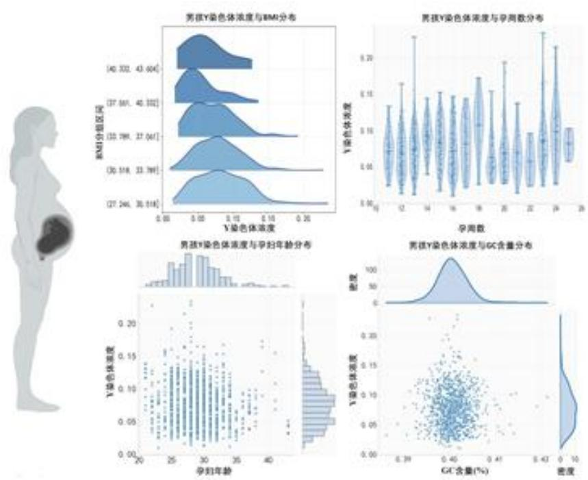  
图 14 男胎相关系数统计

# 附录 C 交互式网页与工程实现（展示）

## 按 BMI 一键计算最佳检测孕周

采用“概率→单调→台阶化”的决策框架，内置基线与保守两种策略，支持检测噪声K灵敏度调节。设计语言采用柔和莫兰迪色系与玻璃拟态，让科学决策也可以很优雅。

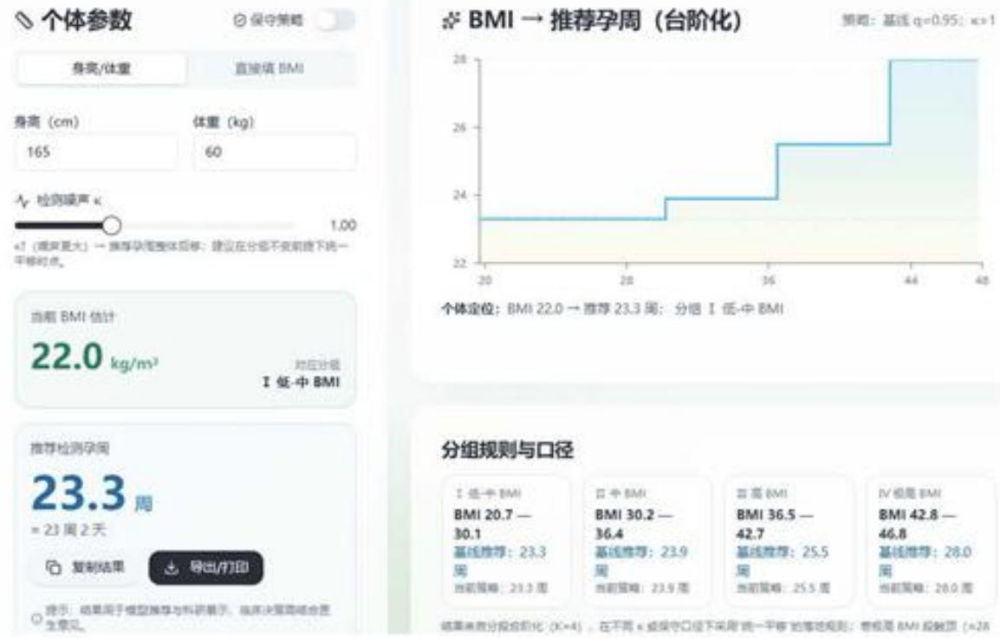  
图 15 按 BMI 一键计算最佳检测孕周的交互式网页截图

页面融合“概率→单调→台阶化”的完整决策链路：左侧支持身高/体重或直接BMI输入，右侧实时绘制BMI→推荐孕周的台阶化曲线；提供基线（q=0.95）与保守（q=0.97）策略切换、检测噪声 $\kappa$ 灵敏度调节，以及一键复制与导出/打印等功能。该实现展示了我们对问题机理的深入理解与可视化落地能力。要点说明：

- 方法贯通可视化：将“最早达标概率推断 $\rightarrow$ 单调回归平滑 $\rightarrow$ 分段台阶化（ $K = 4$ ）"的核心流程，抽象为面向用户的交互控件与台阶曲线，便于临床/决策端直观理解。  
- 稳健性开关：保守口径（ $q=0.97$ ）及噪声因子 $\kappa$ 采用“统一平移不改段”的落地规则，方便在临床安全边界内快速调参。  
- 工程可用性：页面提供结果复制、打印/导出与一键截图，便于报告留痕与院内沟通；界面采用柔和莫兰迪配色与玻璃拟态风格，强调学术严谨与审美统一。

## 附录D 女胎部分异常个体展示

表 9 阳性个体清单

<table><tr><td>受试者ID</td><td>染色体</td><td>命中次数</td><td>最强|z|</td><td>对应孕周(w)</td><td>q值</td><td>阈值(z,q)</td></tr><tr><td>B103</td><td>13</td><td>2</td><td>4.01</td><td>19.6</td><td>0.018</td><td>(2.6,0.05)</td></tr><tr><td>B062</td><td>18</td><td>2</td><td>4.65</td><td>13.3</td><td>0.001</td><td>(2.6,0.05)</td></tr><tr><td>B107</td><td>18</td><td>2</td><td>3.90</td><td>15.0</td><td>0.028</td><td>(2.6,0.05)</td></tr></table>

表 10 可疑个体（各染色体前 5 名，按最大 $\left| z\right|$ 排序）

<table><tr><td>受试者 ID</td><td>染色体</td><td>最大|z|</td><td>对应孕周(w)</td><td>q值</td><td>可疑原因</td></tr><tr><td>B062</td><td>13</td><td>8.41</td><td>13.3</td><td>0.000</td><td>接近阈值/单次命中</td></tr><tr><td>B143</td><td>13</td><td>4.87</td><td>23.0</td><td>0.000</td><td>接近阈值/单次命中</td></tr><tr><td>B068</td><td>13</td><td>4.14</td><td>24.9</td><td>0.003</td><td>接近阈值/单次命中</td></tr><tr><td>B047</td><td>13</td><td>3.35</td><td>16.9</td><td>0.080</td><td>接近阈值/单次命中</td></tr><tr><td>B141</td><td>13</td><td>3.19</td><td>25.0</td><td>0.059</td><td>接近阈值/单次命中</td></tr><tr><td>B042</td><td>18</td><td>3.52</td><td>12.3</td><td>0.021</td><td>接近阈值/单次命中</td></tr><tr><td>B066</td><td>18</td><td>3.48</td><td>16.4</td><td>0.048</td><td>接近阈值/单次命中</td></tr><tr><td>B103</td><td>18</td><td>3.34</td><td>19.6</td><td>0.062</td><td>接近阈值/单次命中</td></tr><tr><td>B013</td><td>18</td><td>3.12</td><td>26.0</td><td>0.184</td><td>接近阈值/单次命中</td></tr><tr><td>B133</td><td>18</td><td>3.05</td><td>23.6</td><td>0.184</td><td>接近阈值/单次命中</td></tr><tr><td>B132</td><td>21</td><td>3.44</td><td>12.1</td><td>0.087</td><td>接近阈值/单次命中</td></tr><tr><td>B111</td><td>21</td><td>3.19</td><td>24.4</td><td>0.224</td><td>接近阈值/单次命中</td></tr><tr><td>B008</td><td>21</td><td>2.95</td><td>20.9</td><td>0.494</td><td>接近阈值/单次命中</td></tr><tr><td>B049</td><td>21</td><td>2.92</td><td>16.6</td><td>0.494</td><td>接近阈值/单次命中</td></tr><tr><td>B087</td><td>21</td><td>2.72</td><td>12.6</td><td>0.413</td><td>接近阈值/单次命中</td></tr></table>

## 附录 E 代码

q1.py  
```txt
#!/usr/bin/env python3
# -*- coding: utf-8 -*-
```

## 4.5 模型检验

## 4.5.1 显著性检验

通过系列统计检验验证模型结构的必要性。结果汇总如下：

表 3 显著性检验结果汇总

<table><tr><td>检验内容</td><td>统计量</td><td>p值</td><td>结论</td></tr><tr><td> $H_0: \beta_{GA} = 0$ </td><td>z=11.527</td><td>&lt;0.001</td><td>显著</td></tr><tr><td> $H_0: \beta_{GA^2} = 0$ </td><td>z=6.082</td><td>&lt;0.001</td><td>显著</td></tr><tr><td> $H_0: \beta_{BMI} = 0$ </td><td>z=-0.831</td><td>0.406</td><td>不显著</td></tr><tr><td> $H_0: \beta_{BMI^2} = 0$ </td><td>z=-2.616</td><td>0.009</td><td>显著</td></tr><tr><td>随机斜率必要性</td><td>LR=109.44</td><td> $\ll 10^{-16}$ </td><td>必要</td></tr><tr><td>二次项必要性</td><td>LR=41.29</td><td> $1.1 \times 10^{-9}$ </td><td>必要</td></tr></table>

似然比检验显示，引入随机斜率可显著改善模型拟合（LR=109.44, $p \ll 10^{-16}$ ），加入二次项也带来了显著改进（LR=41.29, $p = 1.1 \times 10^{-9}$ ）。固定效应中，GA 的一次项和二次项均高度显著，BMI 的二次项也显著，这表明 GA 和 BMI 与 FF 之间存在显著的非线性关系。

## 4.5.2 可视化分析

图 5 和图 6 分别展示了不同 BMI 水平下 FF 随孕周的变化趋势，以及不同孕周下 FF 随 BMI 的变化规律。阴影区域表示 95% 置信区间，红虚线标识 4% 临床阈值。

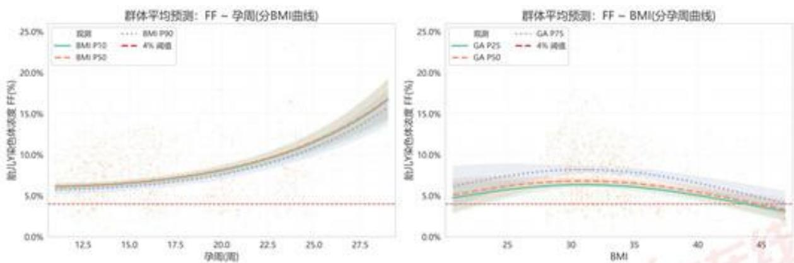  
图5 混合模型群体平均预测：FF～孕周 图6 混合模型群体平均预测：FF～BMI

可视化结果直观证实：FF 随孕周单调上升，且在固定孕周下，FF 与 BMI 呈现先升后降的倒 U 型关系，峰值出现在 BMI≈31-32 kg/m² 附近。