# 矿井突水水流漫延模型与逃生方案问题

## 摘要

矿井水灾是矿山安全开采生产“五大灾害”之首，易造成重大人员伤亡和财产损失。因为矿井水文地质条件复杂，所以矿井水灾事故难以避免。为了降低涉险人员的危险性，减少经济损失，本文针对突出水流漫延过程，以巷道不同漫延方式来建立实时动态模型，研究制定科学救灾方案和最佳逃生路径。

针对问题一，由附件一和附件二，通过 Python 编程分别实现二维平面图和三维立体图，确定出突水点 A1,A2 位置分别在二维平面图和三维立体图的 “H0399” 巷道。

为研究附件一端点水流首次到达时刻和巷道水流充满时刻，本问建立巷道的流动漫延模型。讨论“铺水”过程中，根据巷道三种突水水流分配方案，分别为没有封闭，没有断流模型；封闭，没有断流模型；没有封闭，断流模型。将三种特殊的模型综合在一起形成平面突水水流漫延模型，通过巷道长度和突水点的突水量求出经过巷道的时间，经过比较求出水流到达端点的首次时间，并将每一个最短时间巷道包含的所有端点看做一个顶点集，直至包含所有端点。巷道突水先后到达0.1m后，再同时逐步上升到0.3m，直至上升到3m灌满整个巷道。通过上述模型，得到以下结论：（1）铺满巷道时间为1672.06min；（2）所有巷道水位高度到达0.3m的时间为5016.18min；（3）灌满所有巷道的时间为50161.80min。

为研究附件二端点水流首次到达时刻和巷道水流充满时刻，首先筛选出等于和低于突水位置的端点，并利用上述模型，求出形成平面集合包含的所有端点，集合中的端点已铺满0.1m，以此找出筛选出但未在集合中的端点，采用BFS广度优先模型搜索这些端点对应巷道的另一个端点。接着将模型简化为以形成的平面为基础，从低到高，突水以平行于平面方向向上漫延，直至到达3m，灌满整个巷道。在整个过程中，铺满和灌满同时精选，且灌满整个巷道的时间就是到达最后一个端点的时间，时间均为50249.91min。

针对问题二，由条件可知，在突水1分钟后所有矿工都在无突水水流巷道。经分析可知当巷道内水面高度超过0.3m时，矿工均逃生成功。根据问题一得到所有端点随时间水位变化情况，根据端点水流到达时刻的先后顺序确定顺水和逆水方向。以到达邻点所需要的最小时间为权重，采用实时动态网络的Dijkstra算法，设计三位矿工最佳逃生路径，具体逃生路径和时刻表分别保存到附件2、result2-1.xlsx和result2-2.xlsx中。

针对问题三，为研究矿井有两个突水点发生突水时，各端点水流首次到达时刻和巷道水流充满时刻，本问采用实时动态的流动漫延模型，因为当来自不同突水点的两个漫延路径相互碰撞时，就会形成封闭，此时按照模型会将分给该巷道的流量回到上一端点重新分配。具体结果分别保存到文件 result3-1.xlsx 和 result3-2.xlsx 中。

针对问题四，经分析得知前3分钟矿工逃生路径与附件2相同，5分钟后调整有两个突水口时的最佳逃生路径，具体结果分别保存到文件result4-1.xlsx和result4-2.xlsx中。

关键词：流动漫延模型 BFS 广度优先模型 最佳逃生路径 实时动态网络的 Dijkstra 算法

## 一、问题重述

## 1.1 问题背景

矿井水灾是矿山安全开采生产“五大灾害”之首，易造成重大人员伤亡和财产损失。因为矿井水文地质条件复杂，所以矿井水灾事故难以避免。一旦发生突水，极易增加涉险人员危险性和造成经济损失。

矿井巷道系统根据矿藏分布和矿脉走向布局，形成复杂。

当水灾发生时，若能快速推演出突水水流蔓延过程制定科学的逃生方案，就能最大程度的减少损失。

矿井巷道系统特征和条件：

1、矿井巷道系统根据矿藏分布和矿脉走向布局，形成复杂的交叉三维网络结构。  
2、巷道断面多种多样，本文简化为统一的矩形断面（宽 4m，高 3m），断面底边与水面平行且两端断面底边中点的连线表示一段巷道。  
3、突水水流以 0.1 的初始水位向前蔓延，初水水位为水流首次到达后能够保持的高度。  
4、当水流漫延到巷道的分叉节点处时，水流向水平巷道和下行巷道平均分流，且初始水位不变  
5、以开始突水时间为零时刻，各突水点的突水量均为 $30 \, m^{3}/min$ 。

## 1.2 问题提出

问题一：已知端点水流到达时刻是指突水水流首次流经该点的时刻，巷道充满水时刻是指巷道中水流的水平面达到巷道最高点的时刻。文中给出了附件一的突水点位置A1（5349.03,4931.90,10.00），附件二的突水点位置A2（4143.12,4376.28,6.33）等条件，要求分析巷道的某一点发生突水的水流过程，建立突水水流在巷道的流动漫延模型，并分别给出网络中各巷道水流的变化情况，结果均保留两位小数。

问题二：假设当矿井发生突水后，安全生产部门即刻监控到突水情况且当在突水1分钟时发布逃生通知。已知工人在无突水水流巷道时，行进速度为4m/s；巷道内水面高度为0.3m时，工人逆水行进速度为1m/s，顺水行进速度为2m/s；巷道内水面高度超过0.3m时，不建议涉水通行。文中给出了附件1中的出入口位置分别为(3252.16,3326.63,10.00)，(3173.10,2819.97,10.00)，矿工的位置分别为(5808.18,5367.75,10.00)，(5194.00,4785.31,10.00)，(6190.81,3434.29,10.00)，附件2中的出入口位置分别为(6336.99,6073.22,36.15)，(6416.05,6579.88,8.69)，矿工的位置分别为(4395.15,4614.53,6.59)，(3398.34,5965.56,1.31)，(3879.44,4125.47,6.22)等条件。要求根具问题一中所建流水漫延模型，协助安全生产部门为各矿工设计最佳逃生路径。

问题三：文中给出了附件一中第二个突水点位置 B1（3760.40,3808.33,10.00），附件二的突水点位置 B2（5883.14,5643.35,40.37）等条件。已知 B1 在 A1 点突水 4 分钟后开始突水，B2 在 A2 点突水 5 分钟后开始突水。要求分析矿井有两个突水点发生突水的水流过程，建立突水水流在巷道的流动漫延模型并给出网络中各巷道水流变化情况。

问题四：已知当矿井出现第二个突水点后，安全生产部门即刻监控到突水情况。假设在第二突水点突水1分钟后，安全生产部门发布调整后的逃生方案。要求分析各矿工调整后的最佳逃生路径。

## 二、问题分析

问题一：根据条件可知，附件一形成二维平面图，附件二形成三维立体图，突水点A1,A2位置分别在二维平面图和三维立体图的“H0399”巷道。为研究端点水流到达时刻和巷道水流充满时刻，针对附件一，本问建立三种特殊突水水流在巷道的流动漫延模型。分别为没有封闭，没有断流模型；封闭，没有断流模型；没有封闭，断流模型。将三种特殊的模型综合在一起形成平面突水水流漫延模型，在模型基础上求出水流到达端点的最短时间，并将每一个最短时间巷道包含的所有端点看做一个整体，形成集合，直至包含所有端点。巷道突水先到达0.1m，再同时逐步上升到0.3m，直至到3m灌满整个巷道。针对附件二，首先筛选出等于和低于突水位置的端点，并利用上述模型，求出形成平面集合包含的所有端点，以此找出筛选出但未在集合中的端点，采用BFS方式广度搜索这些端点对应巷道的另一个端点。接着将模型简化为以形成的平面为基础，从低到高，突水以平行于平面方向向上漫延，直至到达3m，灌满整个巷道。

问题二：为制定出每个矿工的最佳逃生路径，本问采用实时动态网络的Dijkstra算法为矿工设计从矿工的初始位置到安全出入口的最短路径，其中以到达端点所需要的最小时间为权重。根据问题一可知突水水流到达每个端点的的最小时间，每个巷道突水水流方向以及巷道之间漫延方向。由此可判断矿工在不同巷道的逃生前进速度，求出矿工穿过不同巷道对应的时间，以最小时间作为权重，最后采用时动态网络的Dijkstra算法求出每个矿工的最佳逃生路径。

问题三：由条件可知，突水点A1突水4分钟后突水点B1开始突水，突水点A2突水5分钟后突水点B2开始突水。为研究矿井有两个突水点发生突水时，各端点水流到达最短时间和巷道水流充满时间，本问采用与问题一相同的模型，因为当来自不同突水点的两个漫延路径相互碰撞时，就会形成封闭，此时按照模型会将分给该巷道的流量按比例分给其他巷道，再次回到各自轨道上按模型漫延。因此得到结论为：突水到达端点的最短时间与突水点单独突水最短时间相同，互不影响。但是，来自两个突水点的不同路径的突水在同一巷道相互作用时，会增加经过该巷道的速度，所以将所有巷道铺满至0.1m的总时间和灌满整个巷道的总时间会比一个突水点时总时间的一半还短。

问题四：经分析得知前4分钟矿工逃生路径与问题二相同，4分钟后第二突水点开始突水，但此时工人并不知道此时有两个突水点开始突水，直至5分钟后调整有两个突水口时的最佳逃生路径，并通过时动态网络的Dijkstra算法求出每个矿工在两个突水点开始突水时的最佳逃生路径。

## 三、模型假设

1、假设巷道断面为矩形断面，断面底边与水平面平行。  
2、假设当水流漫延到巷道的分叉节点处，水流向水平巷道和下行巷道平均分流。  
3、假设以开始突水时间为零时刻，各突水点的流水量均为 $30m^{3}/min$ 。  
4、假设端点水流到达时刻是指突水水流首次流经该点时刻，巷道充满水时刻是指巷道中水流的水平面达到巷道最高点的时刻。  
5、假设工人反应时间为零。  
6、假设巷道内水面高度超过0.3m时，逆流方向路径中断。

## 四、符号说明

<table><tr><td>符号</td><td>含义</td><td>单位</td></tr><tr><td> $Q$ </td><td>突水点突水量</td><td> $m^{3} / min$ </td></tr><tr><td> $m_{i}$ </td><td>第i个端点名称</td><td></td></tr><tr><td> $m_{j}$ </td><td>第j个端点名称</td><td></td></tr><tr><td> $V_{m,m_{i}}$ </td><td>巷道在高0.1m时对应体积</td><td> $m^{3}$ </td></tr><tr><td> $m_{i}m_{j}$ </td><td>端点 $m_{i}$ 和 $m_{j}$ 组成的巷道名称</td><td></td></tr><tr><td> $t_{0}$ </td><td>表示所有端点铺满时刻</td><td>min</td></tr></table>

## 五、模型建立与求解

本文矿井突水漫延模型整体思维导图如下：

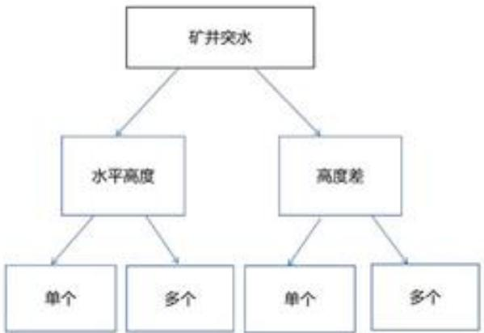

<details>
<summary>flowchart</summary>

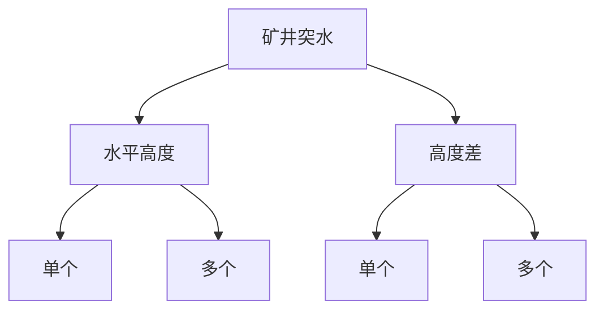
</details>

图1矿井漫延思维导图

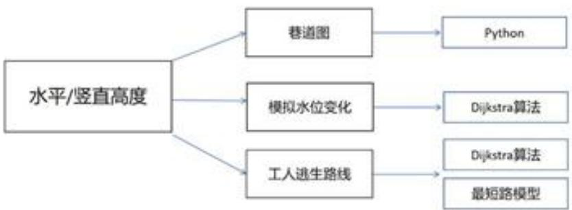

<details>
<summary>flowchart</summary>

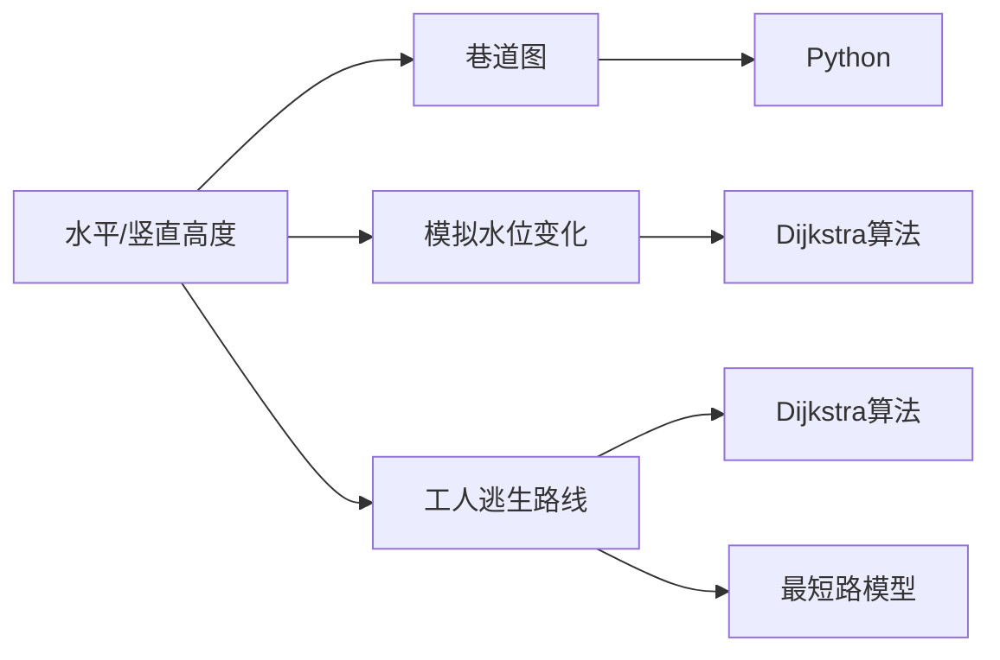
</details>

图2模型思维导图

## 5.1 问题一模型建立与求解

## 5.1.1 问题一模型建立

本问运用 Python，画出附件一中每个端点、各个端点组成的巷道网络图以及用五角星标出突出点 A1 位置，如下图：

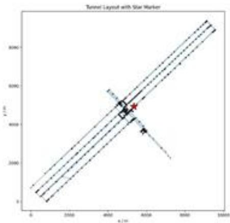

<details>
<summary>scatter</summary>

| Series | X (m) | Y (m) |
| --- | --- | --- |
| Star Marker | ~4500 | ~5000 |
| Data Point 1 | ~4200 | ~4800 |
| Data Point 2 | ~4300 | ~4700 |
| Data Point 3 | ~4400 | ~4600 |
| Data Point 4 | ~4500 | ~4500 |
| Data Point 5 | ~4600 | ~4400 |
| Data Point 6 | ~4700 | ~4300 |
| Data Point 7 | ~4800 | ~4200 |
| Data Point 8 | ~4900 | ~4100 |
| Data Point 9 | ~5000 | ~4000 |
| Data Point 10 | ~5100 | ~3900 |
| Data Point 11 | ~5200 | ~3800 |
| Data Point 12 | ~5300 | ~3700 |
| Data Point 13 | ~5400 | ~3600 |
| Data Point 14 | ~5500 | ~3500 |
| Data Point 15 | ~5600 | ~3400 |
| Data Point 16 | ~5700 | ~3300 |
| Data Point 17 | ~5800 | ~3200 |
| Data Point 18 | ~5900 | ~3100 |
| Data Point 19 | ~6000 | ~3000 |
| Data Point 20 | ~6100 | ~2900 |
| Data Point 21 | ~6200 | ~2800 |
| Data Point 22 | ~6300 | ~2700 |
| Data Point 23 | ~6400 | ~2600 |
| Data Point 24 | ~6500 | ~2500 |
| Data Point 25 | ~6600 | ~2400 |
| Data Point 26 | ~6700 | ~2300 |
| Data Point 27 | ~6800 | ~2200 |
| Data Point 28 | ~6900 | ~2100 |
| Data Point 29 | ~7000 | ~2000 |
| Data Point 30 | ~7100 | ~1900 |
| Data Point 31 | ~7200 | ~1800 |
| Data Point 32 | ~7300 | ~1700 |
| Data Point 33 | ~7400 | ~1600 |
| Data Point 34 | ~7500 | ~1500 |
| Data Point 35 | ~7600 | ~1400 |
| Data Point 36 | ~7700 | ~1300 |
| Data Point 37 | ~7800 | ~1200 |
| Data Point 38 | ~7900 | ~1100 |
| Data Point 39 | ~8000 | ~1000 |
| Data Point 40 | ~8100 | ~900 |
| Data Point 41 | ~8200 | ~855 |
| Data Point 42 | ~8355 | ~885 |
| Data Point 43 | ~8555 | ~895 |
| Data Point 44 | ~8755 | ~915 |
| Data Point 45 | ~8955 | ~935 |
| Data Point 46 | ~9155 | ~955 |
| Data Point 47 | ~9355 | ~975 |
| Data Point 48 | ~9555 | ~995 |
| Data Point 49 | ~9755 | ~1015 |
| Data Point 50 | ~9955 | ~1035 |
| Data Point 51 | ~10155 | ~1055 |
| Data Point 52 | ~10355 | ~1075 |
| Data Point 53 | ~10555 | ~1095 |
| Data Point 54 | ~10755 | ~1115 |
| Data Point 55 | ~10955 | ~1135 |
| Data Point 56 | ~11155 | ~1155 |
| Data Point 57 | ~11355 | ~1175 |
| Data Point 58 | ~11555 | ~1195 |
| Data Point 59 | ~11755 | ~1215 |
| Data Point 60 | ~11955 | ~1235 |
| Data Point 61 | ~12155 | ~1255 |
| Data Point 62 | ~12355 | ~1275 |
| Data Point 63 | ~12555 | ~1295 |
| Data Point 64 | ~12755 | ~1315 |
| Data Point 65 | ~12955 | ~1335 |
| Data Point 66 | ~13155 | ~1355 |
| Data Point 67 | ~13355 | ~1375 |
| Data Point 68 | ~13555 | ~1395 |
| Data Point 69 | ~13755 | ~1415 |
| Data Point 70 | ~13955 | ~1435 |
| Data Point 71 | ~14155 | ~1455 |
| Data Point 72 | ~14355 | ~1475 |
| Data Point 73 | ~14555 | ~1495 |
| Data Point 74 | ~14755 | ~1515 |
| Data Point 75 | ~14955 | ~1535 |
| Data Point 76 | ~15155 | ~1555 |
| Data Point 77 | ~15355 | ~1575 |
| Data Point 78 | ~15555 | ~1595 |
| Data Point 79 | ~15755 | ~1615 |
| Data Point 80 | ~15955 | ~1635 |
| Data Point 81 | ~16155 | ~1655 |
| Data Point 82 | ~16355 | ~1675 |
| Data Point 83 | ~16555 | ~1695 |
| Data Point 84 | ~16755 | ~1715 |
| Data Point 85 | ~16955 | ~1735 |
| Data Point 86 | ~17155 | ~1755 |
| Data Point 87 | ~17355 | ~1775 |
| Data Point 88 | ~17555 | ~1795 |
| Data Point 89 | ~17755 | ~1815 |
| Data Point 90 | ~17955 | ~1835 |
| Data Point 91 | ~18155 | ~1855 |
| Data Point 92 | ~18355 | ~1875 |
| Data Point 93 | ~18555 | ~1895 |
| Data Point 94 | ~18755 | ~1915 |
| Data Point 95 | ~18955 | ~1935 |
| Data Point 96 | ~19155 | ~1955 |
| Data Point 97 | ~19355 | ~1975 |
| Data Point 98 | ~19555 | ~1995 |
| Data Point 99 | ~19755 | >2022.222.222.222.222.222.222.222.222.222.222.222.222.222.222.222.222.222.222.222.222.222.222.222.222.222.<nl>

</details>

图 3 巷道平面示意图

如图所示：附件一所形成的巷道为二维平面图。由此可知，突水水流先以0.1m初始水位向前漫延，直到铺满全部巷道，全部巷道一起再从0.1m逐渐上升至3m，灌满整个赛道。[1-5]

本问运用 Python，画出附件二中每个端点、各个端点组成的巷道网络图以及用五角星标出突出点 A2 位置，如下图：

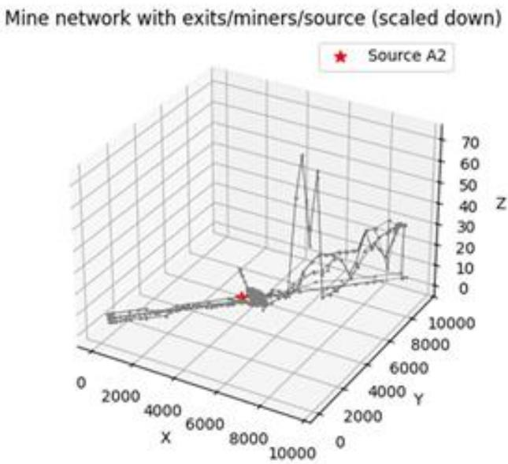

<details>
<summary>surface_3d</summary>

| X | Y | Z |
| --- | --- | --- |
| ~0 | ~0 | ~0 |
| ~8000 | ~0 | ~0 |
| ~10000 | ~0 | ~0 |
| ~0 | ~10000 | ~0 |
| ~8000 | ~10000 | ~65 |
| ~8000 | ~10000 | ~55 |
| ~8000 | ~10000 | ~35 |
| ~8000 | ~10000 | ~35 |
| ~8000 | ~10000 | ~35 |
| ~8000 | ~10000 | ~35 |
| ~8000 | ~10000 | ~35 |
| ~8000 | ~10000 | ~35 |
| ~8000 | 10000 | ~35 |
| ~8000 | 10000 | ~35 |
| ~8000 | 10000 | ~35 |
| ~8000 | 10000 | ~35 |
| ~8000 | 10000 | ~35 |
| ~8000 | 10000 | ~35 |
</details>

图 4 三维巷道示意图

如图所示:附件二所形成的巷道为三维立体图。由此可知,突水水流从突水点以0.1m水位先向同一高度和比突水点高度低的位置漫延,待达到铺满0.1m最大面积时,将所有端点形成一个平面,以这个平面为底且以平面方向平行向上漫延,直至巷道突水水流达到0.3m,3m。由于三维立体图有落差,所以铺和盖的是同时进行的。[6-10]

## 5.1.1.1 寻找距离突水点最近的巷道

对于附件一平面图形：

运用 Python，通过向量投影法计算突水点到巷道的最短距离，结果为突水点 A1 刚好在 H0399 巷道上，并且通过距离公式 $\sqrt{(x_{1}-x_{2})^{2}+(y_{1}-y_{2})^{2}+(z_{1}-z_{2})^{2}}$ 得出突水点 A1 距离巷道两端点 P0351，P0358 距离相同。

为了确保位置准确性，本问采用数学表达式进行验证。

给定两点P0351(x₁,y₁)=(5205.06,4795.87)，P0358(x₂,y₂)=(5492.97,5067.92)

斜率为:

$$
\mathrm{k} = \frac {\mathrm{y} _ {2} - \mathrm{y} _ {1}}{\mathrm{x} _ {2} - \mathrm{x} _ {1}} = \frac {5 0 6 7 . 9 2 - 4 7 9 5 . 8 7}{5 4 9 2 . 9 7 - 5 2 0 5 . 0 6} = \frac {2 7 2 . 0 5}{2 8 7 . 9 1} \approx 0. 9 4 4 9 \tag {1}
$$

直线方程为:

$$
\mathrm{y} = 0. 9 4 4 9 \mathrm{x} - 1 2 2. 0 9 \tag {2}
$$

将 A1（5349.03,4931.90）带入直线方程得 $y \approx 4932.83$ 。

故误差为 4932.83-4931.90=0.93。虽 A1 不在巷道所在直线上，但误差很小，所以可以看做 A1 就在巷道所形成的直线上。

综上所述：突水点 A1 在巷道 H0399 终点位置，开始从巷道中点以 $30 ~m^{3} / min$ 突水量同时向两端点 P0351，P0358 漫延，并经过 5.28min 同时到达两端点。

## 对于附件二三维立体图形：

运用 Python，通过向量投影法计算突水点到巷道的最短距离，结果为突水点 A2 刚好也在 H0399 巷道上，此时 A2 距离巷道两端点 P0351，P0358 距离也相同。

为了确保位置准确性，采用和上述相同的方式进行验证。

设直线参数方程为

$$
\left\{ \begin{array}{l} \mathrm{x=4384.08-287.90t} \\ \mathrm{y=4603.97-272.04t} \\ \mathrm{z=6.59-0.31t} \end{array} \right. \tag {3}
$$

其中 $t \in R$ ，将突水点A2（4143.12,4376.28,6.33）带入参数方程得

$$
\left\{ \begin{array}{l} t _ {1} = 0. 8 3 6 8 \\ t _ {2} = 0. 8 3 6 9 \\ t _ {3} = 0. 8 3 8 7 \end{array} \right. \tag {4}
$$

由于三个 t 值非常接近，可认为在误差范围内一致，可看做 A2 在巷道所形成的直线上。

## 5.1.1.2 附件一平面模型的分类讨论

$G(V,E)$ ：巷道网络图，V为节点集 $(|V|=n)$ ，E为边集。

$U(m_{j})$ 表示邻点集

$$
e _ {m, m _ {j}} \in E
$$

$$
m _ {i} \in U (m _ {j})
$$

$$
\min U (m _ {j}) = \{m _ {i}, m _ {k} \}, k \neq i, k \neq j, k \in (1, 6 4 5) \tag {5}
$$

模型一（没有封闭，没有断流）：

$$
\mathrm{Q} _ {\mathrm{m}, \mathrm{m} _ {j}} = \frac {\mathrm{Q} _ {\mathrm{m} _ {z} \mathrm{m} _ {i}}}{\mathrm{n} - 1} \tag {6}
$$

$$
\mathrm{t} _ {\mathrm{j}} = \frac {\mathrm{V} _ {\mathrm{m} , \mathrm{m} _ {\mathrm{j}}}}{\mathrm{Q} _ {\mathrm{m} , \mathrm{m} _ {\mathrm{j}}}} = \frac {\mathrm{SL} _ {\mathrm{m} , \mathrm{m} _ {\mathrm{j}}}}{\mathrm{Q} _ {\mathrm{m} , \mathrm{m} _ {\mathrm{j}}}} \tag {7}
$$

$$
\mathrm{t} _ {\min} = \min (\mathrm{t} _ {\mathrm{j}}) \tag {8}
$$

其中 S 为巷道的截面，巷道突水未铺满前 $S = 0.4m^{2}$ 。

找出最小时间的巷道包含的所有端点，所有端点形成一个集合，做为一个整体，以此类推。

以下图为例：

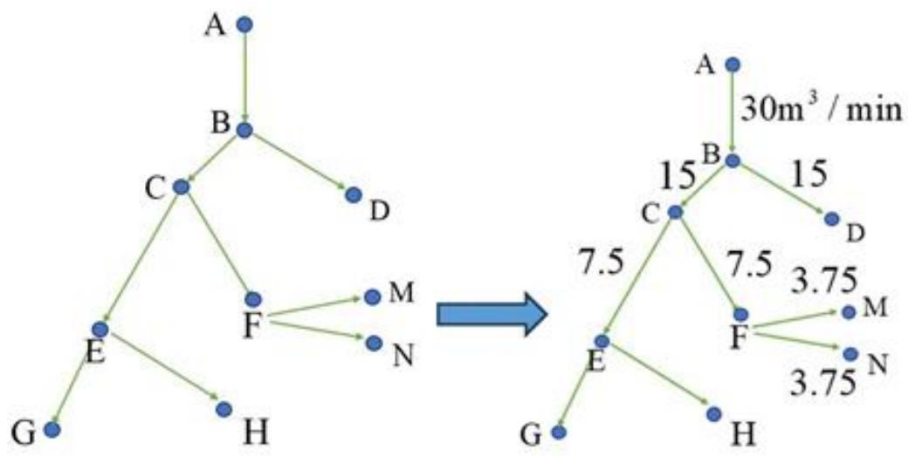

<details>
<summary>flowchart</summary>

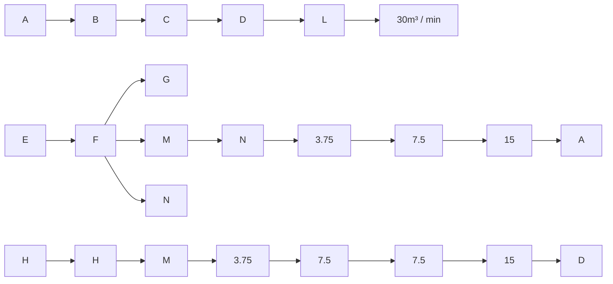
</details>

图5示意图

第一轮：假设 $Q_{AB}=30m^{3}/min$ ，则 $Q_{BC}=Q_{BD}=\frac{Q_{AB}}{2}=15m^{3}/min$ 。若 $\frac{SL_{BC}}{Q_{BC}}<\frac{SL_{BD}}{Q_{BD}}$ ，此时BC巷道优先铺满，故可将A、B、C看做一个集合且BC巷道向外漫延。

第二轮： $Q_{CE}=Q_{CF}=\frac{1}{2}Q_{BC}=7.5m^{3}/min$ 。设 CE 巷道铺满 0.1m 时间最短，则 $\frac{SL_{CE}}{Q_{CE}}<\frac{SL_{CF}}{Q_{CF}},\frac{SL_{CE}}{Q_{CE}}<\frac{SL_{BD}}{Q_{BD}}$ ，故可将 A、B、C、E 一个集合且 BC 巷道向外漫延。

第三轮： $Q_{EG}=Q_{EH}=\frac{Q_{CE}}{2}=3.75m^{3}/min$ ， $Q_{FM}=Q_{FN}=\frac{Q_{CF}}{2}=3.75m^{3}/min$ 。设FM巷道铺满0.1m时间最短，故可将A、B、C、E、F集合且BC巷道向外漫延。以此类推，向后漫延，直到不能漫延。

模型二（没有封闭，断流）： $t_{min}$ 时对应的巷道 $m_{i}m_{j}$ 后无巷道，则形成断流。

当n-2>0时：除 $t_{min}$ 时对应的巷道 $m_{i}m_{j}$ 外其他从 $m_{i}$ 端点流出的巷道对应的突出流量为

$$
\mathrm{Q} = \frac {\mathrm{Q} _ {\mathrm{m} _ {\mathrm{k}} \mathrm{m} _ {\mathrm{j}}}}{\mathrm{n} - 1} * \frac {\mathrm{n} - 1}{\mathrm{n} - 2} = \frac {\mathrm{Q} _ {\mathrm{m} _ {\mathrm{k}} \mathrm{m} _ {\mathrm{j}}}}{\mathrm{n} - 2} \tag {9}
$$

当 $n - 2 = 0$ 时：考虑 $\mathrm{m_k}$ 是否有除 $\mathrm{m_km_i}$ 巷道外从 $\mathrm{m_k}$ 流出的巷道，若有，就以该方法按比例分流；若没有，则继续前推比 $\mathrm{m_i}$ 上一个加入集合的端点，若一直没有，则结束循环。

下图为例：

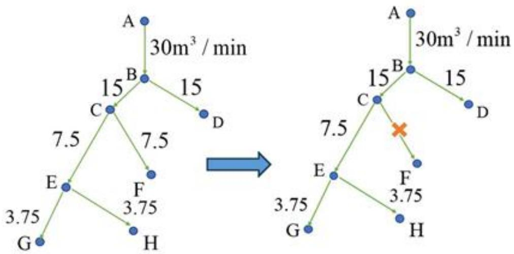

<details>
<summary>flowchart</summary>

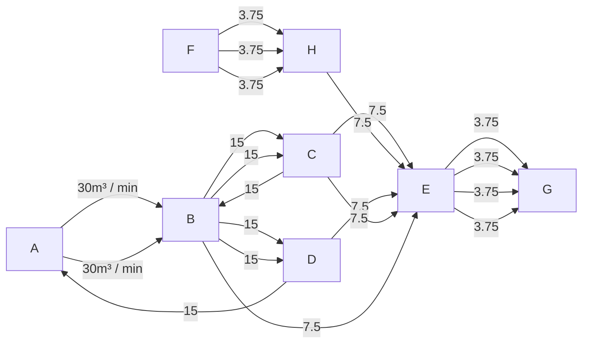
</details>

图6示意图

假设突水漫延情况与模型一相同，则第一轮，第二轮相同，第三轮时巷道CF断流，可将其巷道看做消失，此时 $Q_{EG}=Q_{EH}=\frac{Q_{CE}}{2}+\frac{Q_{CF}}{2}=7.5m^{3}/min$ 。

模型三（封闭，没有断流）：

假设 $Q_{AB}=10m^{3}/min$

（1）假设突水从端点 C 流出的巷道只有 CD，从端点 D 出的巷道只有 CD，以下面图形为例：

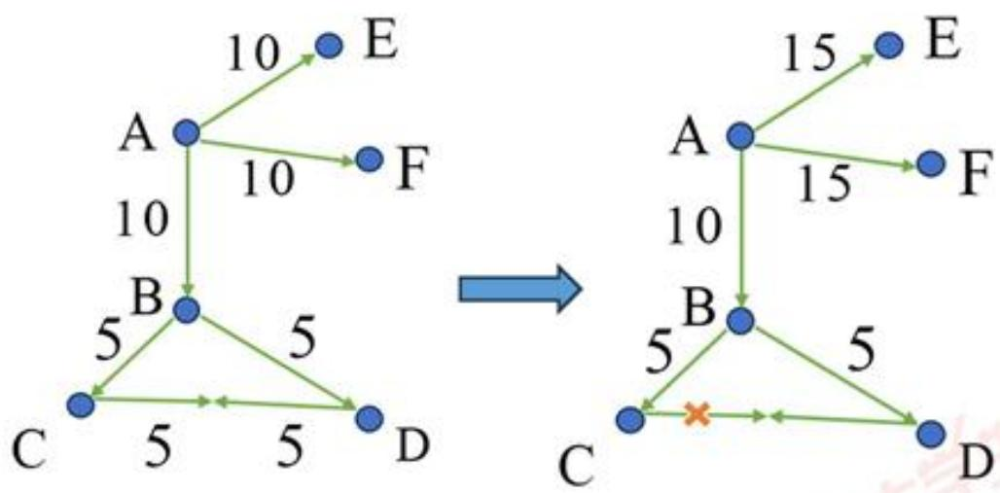

<details>
<summary>flowchart</summary>

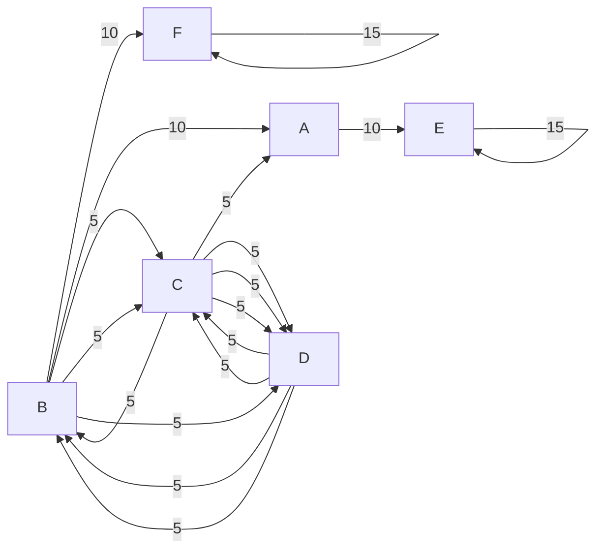
</details>

图7示意图

此时 $Q_{BC} = Q_{BD} = 5m^{3}/min$ ，如果 $t_{BC} < t_{BD}$ ，则 BC 巷道先铺满 0.1m，突水先从 BC 巷道漫延到 CD 巷道，待 BD 巷道铺满 0.1m 时，两个方向突水共同作用，直到 CD 巷道铺满 0.1m。因为突水从端点 C 流出的巷道只有 CD，所以返回上一端点 B，而 B 端点只和 BC,BD 两巷道连接，故继续返回上一端点 A，存在除 BC 巷道外从 A 点流出的巷道 AE,AF，此时对其平均分流， $Q = Q_{原} + Q_{分} = 10 + 5 = 15m^{3}/min$ 。

(2) 假设突水从点 C 流出的巷道为 CD,CG，从端点 D 出的巷道只有 CD，以下面图形为例：

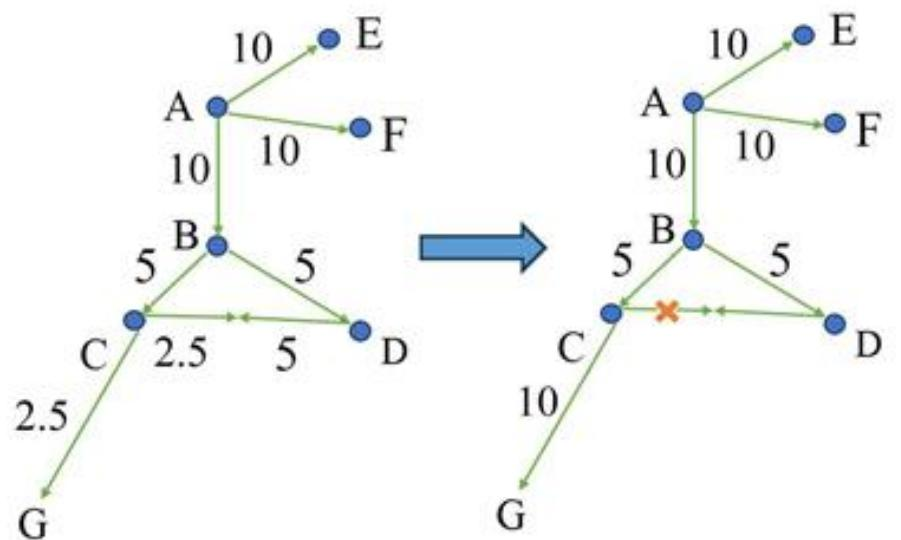

<details>
<summary>flowchart</summary>

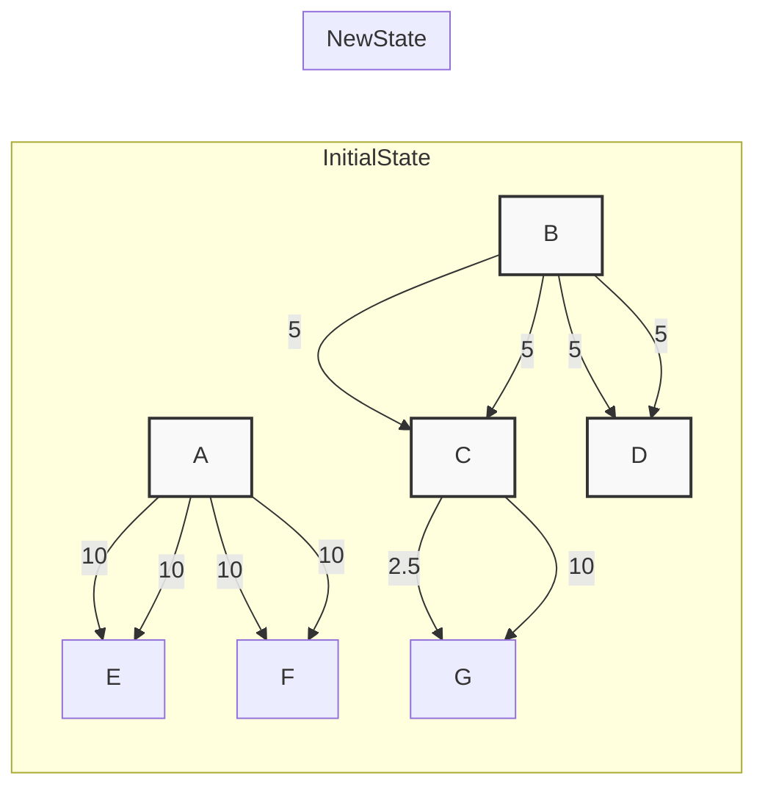
</details>

图8示意图

CD巷道突水铺满0.1m方式和上述相同，若CD巷道比CG巷道先铺满0.1m，此时 $Q_{\mathrm{CG}} = Q_{\mathrm{CD}} + Q_{\mathrm{CG原}} = 7.5 + 2.5 = 10\mathrm{m}^3 /\mathrm{min}$ ，CD突水分流到CG巷道。若CD巷道比CG巷道后满0.1m，将CG巷道突水分流到CD巷道，再按（1）模型推进。

将三种模型情况综合考虑，先遇到模型中的哪种情况，就先考虑哪种模型，解决到达端点的最短时间。

## 5.1.1.3 附件二立体模型的分类讨论

首先筛选出附件二 Excel 表格中和突水点 A2 位置相同和比突水点 A2 位置低的数据。以筛选出来的端点为基，采用与平面一相同的模型和方法，将可以形成集合的端点看做一个平面。若筛选出来的端点未在集合内，则通过 BFS 路径搜索算法寻找与这些端点连接成巷道的另一个端点。接着将模型简化为以形成的平面为基础，从低到高，突水以平行于平面方向向上漫延，直至到达 3m，灌满整个巷道。

## 5.1.2 问题一模型求解

附件一：所有端点完全铺满（高度达到0.1m）时间为1672.06min，所有巷道高度达到0.3m时时间为5016.18min，所有巷道完全灌满（高度达到3m）时间为50161.80min。

附件二：得出的结论为灌满整个巷道的时间就是到达最后一个端点的时间，所有巷道完全铺满时间为50249.91min。

针对所有端点完全铺满时间为1672.06min，而不是1674.09min解析：

铺满所有巷道时间如下：

$$
T = \frac {V}{Q} = \frac {0 . 1 * 4 * L}{3 0} = \frac {0 . 1 * 4 * 1 2 5 5 5 7 . 1}{3 0} = 1 6 7 4. 0 9 \mathrm{min}
$$

铺满所有端点的时间比铺满所有巷道的时间短原因是当所有端点都遇到水时，存在一些巷道还没有水。图形如下：

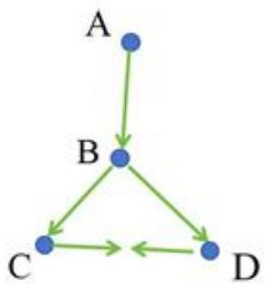

<details>
<summary>flowchart</summary>

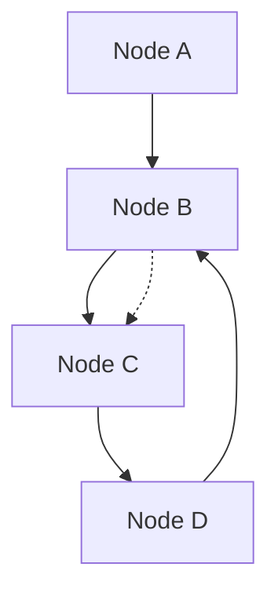
</details>

图9示意图

## 5.2 问题二模型建立与求解

## 5.2.1 问题二模型建立

为了给每个矿工制定最佳逃生路径，本问运用 Python，画出附件一中每个端点、各个端点组成的巷道网络图、突出点 A1 以及两个出入口位置 $P_{1}(3252.16,3326.63,10.00)$ ， $P_{2}(3173.10,2819.97,10.00)$ 和三个矿工位置 $P_{3}(5808.18,5367.75,10.00)$ ， $P_{4}(5194.00,4785.31,10.00)$ ， $P_{5}(6190.81,3434.29,10.00)$ ，图形如下：

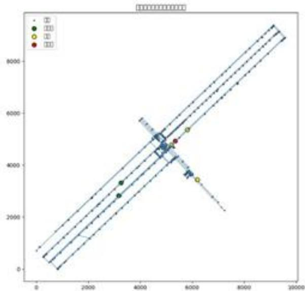

<details>
<summary>scatter</summary>

| Series | X (range) | Y (range) |
| --- | --- | --- |
| Blue (circle) | 4000~9500 | 3500~5800 |
| Green (circle) | 3200~6200 | 2800~5400 |
| Yellow (circle) | 5800~6500 | 3400~5400 |
| Red (circle) | 5400~5600 | 4900~5100 |
</details>

图 10 最佳逃生路径

运用 Python，画出附件二中每个端点、各个端点组成的巷道网络图、突出点 A2 以及两个出入口位置 P $_{6}$ (6336.99,6073.22,36.15)，P $_{7}$ (6416.05,6579.88,8.69)和三个矿工位置 $P_{8}(4395.15,4614.53,6.59)$ ， $P_{9}(3398.34,5965.56,1.31)$ ， $P_{10}(3879.44,4125.47,6.22)$ ，图形如下：

Mine network with exits/miners/source (scaled down)  
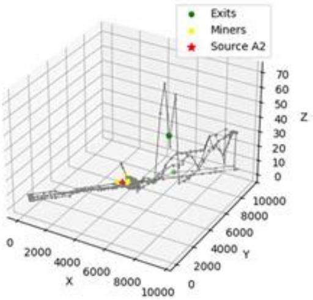

<details>
<summary>scatter_3d</summary>

| Category | X | Y | Z |
| --- | --- | --- | --- |
| Exits | ~8000 | ~10000 | ~30 |
| Miners | ~7500 | ~9000 | ~5 |
| Source A2 | ~7500 | ~9000 | ~2 |
</details>

图 11 巷道网络图

在矿井发生突水灾害后，为各矿工设计最佳逃生路径是一个动态网路最短路问题，本问采用 Dijkstra 算法为矿工设计从矿工的初始位置到安全出入口的最短路径。其中以到达端点所需要的最小时间为权重，但考虑到边权是时刻变化的，且该值取决于水流到达该巷道的时间和水深。本文将逃生时间线离散为多个时间步，并把每个时间步看成一个集合，在集合内网络状态不变，便将动态网络问题转化为静态问题，从而达到 Dijkstra 算法实现。

对于附件一, 运用 MATLAB, 可分析得出入口 $\mathrm{P}_{1}$ 在“P0393”端点, 出入口 $\mathrm{P}_{2}$ 在“P0526”端点。矿工 $\mathrm{P}_{3}$ 在距离 “P0661” 端点 $35.1 \mathrm{~m}$ , 矿工 $\mathrm{P}_{4}$ 在距离 “P0351” 端点和 “P0349” 端点 $15.3 \mathrm{~m}$ , 矿工 $\mathrm{P}_{5}$ 在距离 “P0016” 端点 $245.73 \mathrm{~m}$ 。

对于附件二, 运用 MATLAB, 可分析得出入口 $\mathrm{P}_{6}$ 在“P0393”端点, 出入口 $\mathrm{P}_{7}$ 在“P0526”端点。矿工 $\mathrm{P}_{8}$ 在“H0389”巷道上, 距离“P0351”端点和“P0349”端点 $15.3 \mathrm{~m}$ ; 矿工 $\mathrm{P}_{9}$ 在“H0012”巷道上, 距离“P0016”端点和“P0017”端点 $245.7 \mathrm{~m}$ ; 矿工 $\mathrm{P}_{10}$ 在“H0968”巷道上, 距离“P0660”端点 $99.76 \mathrm{~m}$ .

首先运用传统的 Dijkstra 算法，以距离为权重，算出每个矿工到出入点的最短距离。将最短距离和最小速度乘积与突水水流高度到达 0.3m 时的时间进行比较。经计算可得，在突水水流高度达到 0.3m 时，矿工不可能还在巷道内。

## 6.2.1.1 时间权重的计算

第一轮：因为突水1分钟时发布逃生通知，所以要先找出1分钟突水能够到达的端点。本问采用BFS广度优先模型，找出与矿工位置形成巷道的另一个端点，并求出矿工以4m/s前进速度时到达此端点时间t

$$
t = \frac {L _ {m}}{4} \tag {10}
$$

其中 $L_{m}$ 表示巷道的长度，根据 result-1xslx 可知当 $T = \frac{L}{4} + 1$ 时有突水水流的端点，由此判断 BFS 搜索的端点是否有突水水流。经检验可知，与矿工位置形成巷道的另一个端点都没有突水。所以只需找到最短巷道，此巷道就是该矿工逃生的第一段路径并将时间作为该路径的权重。将组成巷道的两个端点看作整体，形成一个集合A。

第二轮：BFS广度优先模型，找出与集合A中所有端点形成巷道的另一个端点，并求出矿工以4m/s前进速度时到达此端点时间 $t_{1}=\frac{L_{m}}{4}$ 根据result-1xslx可知当 $T_{1}=T+t_{1}$ 时有突水水流的端点。

由问题一结果可知突水水流到达每个端点的的最小时间，每个巷道突水水流方向以及巷道之间漫延方向。

若有突水水流的端点在 BFS 搜索的端点：

1、当矿工行进方向与巷道突水水流方向相同时：矿工为顺水行进，矿工经过巷道时间为 $\frac{L_{m}}{2}$ 。

2、当矿工行进方向与巷道突水水流方向相反时：矿工为逆水行进，矿工经过巷道时间为 $L_{m}$ 。

若有突水水流的端点不在BFS搜索的端点：矿工经过巷道时间为 $\frac{L_m}{4}$ 。

通过比较求出最短时间，将最短时间的巷道作为逃生路径并将此时时间看作该路径的权重。将组成巷道的所有端点看作整体，形成一个集合B。

接着与上述模型相同，以此类推，直到集合中包含出入点结束。加入集合的先后顺序就是矿工的最佳逃生路径。

## 6.2.1.2 基于时间动态网络 Dijkstra 算法步骤

$\min T_{jk}(t) = \frac{L_{jk}}{v_{jk}(h(e_{jk},t))}$

s.t. $\sum_{k:e_{km}\in E}\sum_{t\in T}x_{mk}^{\prime}=1$

$$
\sum_ {j \in e _ {j n} \in E} \sum_ {t \in T} x _ {j n} ^ {\prime} = 1
$$

$$
\sum_ {j: e _ {j u} \in E} \sum_ {t \in \mathcal {T}} x _ {j u} ^ {t} = \sum_ {k: e _ {u k} \in E} \sum_ {t \in \mathcal {T}} x _ {u k} ^ {t}, \forall u \in V \backslash \{s, d \}
$$

$$
\sum_ {1} ^ {T} Q = 3 0 m ^ {3} / \min
$$

$$
T _ {\text {总}} \leq 5 0 2 2 2
$$

$t_0 \leq 1674.06$ (11)

$t_{0}$ 表示所有端点铺满时刻

其中 $L_{jk}$ ：巷道 $e_{jk}$ 的长度（m）

$\tau_{jk}(t)$ ：表示在 $t$ 时刻开始通过巷道 $e_{jk}$ 所需的时间（s）

T：连续决策变量，表示工人到达目标出口d的总时间（s）。

左边 $\sum_{j\neq j_{u}\in E}\sum_{t\in T}x_{j_{u}}^{j}$ ：计算所有流入中间节点 u 的“流”的总和。

右边 $\sum_{k:e_{uk}\in E}\sum_{t\in T}x_{uk}^{t}$ ：计算所有流出中间节点u的“流”的总和。

$\forall u\in V\setminus\{s,d\}$ ：该约束对网络中除起点和终点之外的所有节点u都必须成立。

## 5.2.2 问题二模型求解

基于上述算法，进一步运用 Dijkstra 算法，将矿工位置 $P_{3}$ 近似为在 “P0661” 端点，将矿工位置 $P_{4}$ 近似为在 “P0351” 端点，将矿工 $P_{6}$ 位置近似为在 “P0016” 端点。

最后通过算法得出矿工：

从位置 $P_{3}$ 到达最近出入口的最短路径为: 662 427 425 661 659 357 352 350 347 345 658 653 651 652 53 338 641 625 317 316 430 313 315 314 637 635 193 195 645 644 419 420 170 169 649 160 151 147 150 153 520 518 395 392 393，最短路径总长度: 3718.009m

从位置 $P_{4}$ 到达最近出入口的最短路径为: 349, 348, 332, 330, 331, 52, 327, 627, 319, 321, 416, 648, 185, 181, 182, 631, 170, 169, 649, 160, 151, 147, 150, 153, 520, 518, 395, 392, 393，最短路径总长度: 2665.6m

从位置 $\mathrm{P}_5$ 到达最近出入口的最短路径为：17,24,22,23,121,126,369,606,607,611,612,370,139,137,134,133,136,201,561,205,365,367,342,566,565,161,155,163,164,158,149,146,148,150,153,520,518,395,392,393，最短路径总长度： $3859.1\mathrm{m}$

从位置 $P_{g}$ 到达最近出入口的最短路径为: 349, 348, 332, 330, 331, 52, 327, 627, 319, 321, 416, 648, 185, 181, 182, 631, 170, 169, 649, 160, 151, 147, 152, 153, 520, 518, 395, 392, 393，最短路径总长度：2672.2m

从位置 $P_{9}$ 到达最近出入口的最短路径为：从位置 $P_{6}$ 到达最近出入口的最短路径为：17,24,22,23,123,126,369,606,607,611,612,372,139,137,134,133,136,201,561,205,365,367,342,566,565,161,155,163,164,158,149,146,148,150,153,520,518,395,392,393，最短路径总长度：3865.9m

从位置 $P_{10}$ 到达最近出入口的最短路径为: 660, 662, 661, 659, 357, 352, 350, 347, 345, 658, 653, 651, 652, 53, 338, 641, 625, 317, 316, 430, 313, 315, 314, 637, 635, 193, 195, 645, 644, 419, 420, 170, 169, 649, 160, 151, 147, 150, 153, 520, 518, 395, 392, 393，最短路径总长度：3675.629m

## 5.3 问题三模型建立与求解

## 5.3.1 问题三模型建立

运用 Python，针对附件一，画出两个出入口，三个矿工位置以及两个突水点位置，如下图：

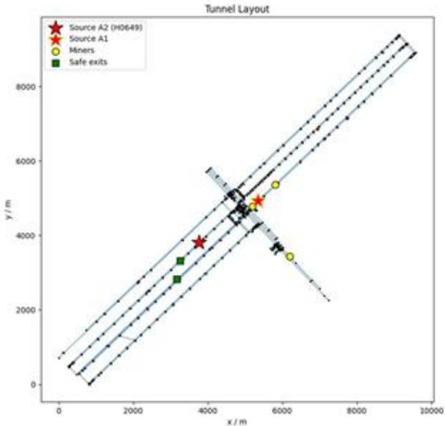

<details>
<summary>scatter</summary>

| Series | X (m) | Y (m) |
| --- | --- | --- |
| Source A2 (H0649) | ~3800 | ~3800 |
| Source A1 | ~5300 | ~4900 |
| Miners | ~5800 | ~5400 |
| Miners | ~6200 | ~3400 |
| Safe exits | ~3300 | ~3300 |
| Safe exits | ~3200 | ~2800 |
</details>

图 12 巷道网络图

运用 Python，针对附件二，画出两个出入口，三个矿工位置以及两个突水点位置，如下图：

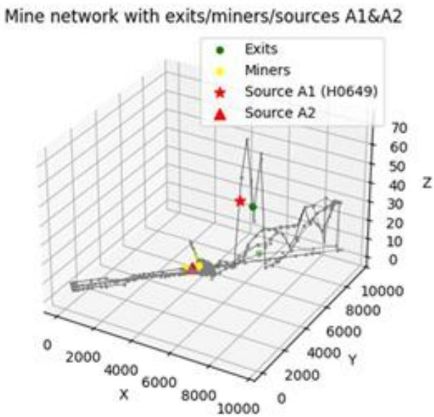

<details>
<summary>scatter_3d</summary>

| Category | Description |
| --- | --- |
| Exits | Green dot |
| Miners | Yellow dot |
| Source A1 | Red star |
| Source A2 | Red triangle |
</details>

图 13 巷道网络图

本问采用与问题一相同的模型，在突水点 A1 突水 4 分钟后突水点 B1 开始突水，在突水点 A2 突水 5 分钟后突水点 B2 开始突水。两者分别以问题一的模型漫延，到达端点的最短时间与突水点单独突水最短时间相同，互不影响。因为当来自不同突水点的两个漫延路径相互碰撞时，就会形成封闭，此时按照模型会将分给该巷道的流量按比例分给其他巷道，再次回到各自轨道上按模型漫延。但是，来自两个突水点的不同路径的突水在同一巷道相互作用会增加经过该巷道的时间，所以将所有巷道铺满至0.1m的总时间和灌满整个巷道的总时间会比一个突水点时总时间的一半还短。

例如：

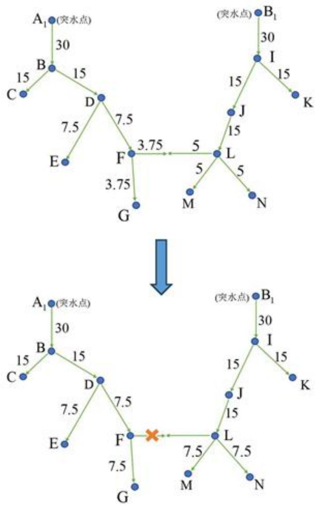  
图14示意图

假设经过三轮漫延后，集合 $X=\{A1,B,D,F\},Y=\{B1,I,J,K,L\}$ ，前三轮两个突水点漫延路径互不影响，到第四轮时，巷道DF和巷道JL漫延的突水会在巷道FL相互叠加，但这属于封闭模型，根据模型漫延方法，巷道FL铺满0.1m后可看做不存在，将突水量按各自比例平均分配。所以巷道FG突水量从 $3.75m^{3}/min$ 重新变为 $7.5m^{3}/min$ ，巷道LM,LN突水量从 $5m^{3}/min$ 重新变为 $7.5m^{3}/min$ 。与单独一个突水点突水流量相同，故又在各自轨道上漫延，所以可以将本文看做两个突水点各自在各自轨道上漫延，不影响到达各端点的最小时间和铺满整个巷道的时间。

## 5.4 问题四模型建立与求解

针对附件一：开始时突水口 A1 开始突水，但 1 分钟后矿工才接受到逃生通知，1 分钟到第 4 分钟，矿工开始矿工逃生，路径与问题二相同。4 分钟后第二突水点开始突水，但此时工人并不知道此时有两个突水点开始突水，直至 5 分钟后调整有两个突水口时的最佳逃生路径，并通过时动态网络的 Dijkstra 算法求出每个矿工在两个突水点开始突水时的最佳逃生路径。图形如下：

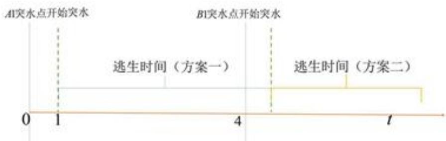

<details>
<summary>text_image</summary>

A1突水点开始突水
B1突水点开始突水
0 1 4 t
逃生时间（方案一）
逃生时间（方案二）
</details>

图15示意图

结果显示：在附件一的二位平面图中，本问三个矿工逃生路径与问题二最短时间基本相同。在附件二的空间立体图中，本问两个矿工逃生路径与问题二基本相同，只有一个特殊矿工受到第二突水点的影响较大，通过时动态网络的 Dijkstra 算法求出该矿工在两个突水点开始突水时的最佳逃生路径。

## 六、模型的优缺点

(1) 在传统的 Dijkstra 算法下，以动态用时对边赋权，建立了实时动态网络 Dijkstra 算法，更好地模拟了实际情况下的突水水流漫延模型。  
(2) 模型考虑了矿井水灾发生后的各个方面，包括突水的时间、巷道的水流传播、矿工逃生路径的设计等，确保了矿井突水灾害后各个环节的应对策略。  
(3) 通过动态调整矿工逃生路径和考虑不同突水点的情况，模型能灵活应对多种复杂情况，具备较强的适应性。  
(4) 在涉及到多种复杂情况（如多个突水点、矿工逃生路径设计等）时，模型的计算复杂度较高。尤其是在三维模型中，随着巷道网络规模的增大，计算量将大幅增加，可能导致处理时间的延长。  
(5)由于时间有限, 我们建立了四个模型, 解决问题一到问题四, 我们可以进一步以突水点数量和巷道高度为变量, 从而建立一个更一般化的模型。

## 七、模型的推广

除了突水，矿井还可能面临其他类型的灾害（如瓦斯爆炸、火灾等），通过调整水流模拟参数，模型可被改造成适用于其他矿井灾害情境的应急响应工具。可跨行业应用，该模型的优化不仅能提升矿井安全管理的水平，还可以应用于城市地下管网、隧道施工、水下工程与救援、军事与国防等领域，进行水灾的模拟与逃生路径设计。

## 八、参考文献

[1] 高风险岩溶隧道突水灾变演化机理及其应用研究. 李利平. 山东大学, 2009  
[2] 水压作用下防砂安全煤（岩）柱失稳突水渍砂机理研究. 李江华. 中国矿业大学(北京), 2016  
[3] 宁东某矿煤层顶板突水危险性研究. 谌会芹. 中国地质大学(北京), 2014  
[4] 煤层顶底板突水地质力学条件及其危险性研究. 王睿. 中国矿业大学（北京）, 2011  
[5] 基于多源数据的贫困度与自然灾害相关性评估. 赵习枝. 华东师范大学, 2019  
[6] 岩体水压致裂机理研究及在矿山突水中的应用. 刘洪磊. 东北大学, 2011  
[7] 煤矿区突（涌）水系统分析模拟及应用. 尹尚先. 中国矿业大学（北京），2002  
[8] 冲蚀诱发断层突水的流固耦合机理及应用研究. 王戈. 河南理工大学, 2020  
[9] 煤层顶板松散承压含水层渗流突涌特性及致灾机理与防治研究. 施小平. 合肥工业大学, 2015  
[10] 金属矿深竖井工程围岩渗透特征分析与突水风险预测研究. 张同钊. 北京科技大学, 2022  
[11] 北京月之暗面科技有限公司 kimi,k2 模型，深度搜索，2025-09-07

## 九、附录

附录一：

<table><tr><td>端点编号</td><td>水流到达时刻(分钟)</td><td></td></tr><tr><td>P0000</td><td>264.57</td><td></td></tr><tr><td>P0001</td><td>273.69</td><td></td></tr><tr><td>P0002</td><td>290.08</td><td></td></tr><tr><td>P0003</td><td>316.79</td><td></td></tr><tr><td>P0004</td><td>169.96</td><td></td></tr><tr><td>P0005</td><td>57.19</td><td></td></tr><tr><td>P0006</td><td>54.54</td><td></td></tr><tr><td>P0007</td><td>72.75</td><td></td></tr><tr><td>P0008</td><td>50.97</td><td></td></tr><tr><td>P0009</td><td>120.24</td><td></td></tr><tr><td>P0010</td><td>341.74</td><td></td></tr><tr><td>P0011</td><td>496.38</td><td></td></tr><tr><td>P0012</td><td>592.13</td><td></td></tr><tr><td>P0013</td><td>622.35</td><td></td></tr><tr><td>P0014</td><td>545.22</td><td></td></tr><tr><td>P0015</td><td>489.45</td><td></td></tr><tr><td>P0016</td><td>378.3</td><td></td></tr><tr><td>P0017</td><td>291.3</td><td></td></tr><tr><td>P0018</td><td>284.49</td><td></td></tr><tr><td>P0019</td><td>282.34</td><td></td></tr><tr><td>P0020</td><td>286.04</td><td></td></tr><tr><td>P0021</td><td>284.86</td><td></td></tr><tr><td>P0022</td><td>290.87</td><td></td></tr><tr><td>P0023</td><td>284.99</td><td></td></tr><tr><td>P0024</td><td>295.03</td><td></td></tr><tr><td>P0025</td><td>298.49</td><td></td></tr><tr><td>P0026</td><td>248.59</td><td></td></tr><tr><td>P0027</td><td>1067.72</td><td></td></tr><tr><td>P0028</td><td>1118.86</td><td></td></tr><tr><td>P0029</td><td>45.21</td><td></td></tr><tr><td>P0030</td><td>56.39</td><td></td></tr><tr><td>P0031</td><td>1176.63</td><td></td></tr><tr><td>P0032</td><td>1170.13</td><td></td></tr></table>

附录二：

<table><tr><td></td><td>A</td><td>B</td><td>C</td></tr><tr><td>1</td><td>巷道编号</td><td>巷道充满水时刻(分钟)</td><td></td></tr><tr><td>2</td><td>H0001</td><td>50161.80</td><td></td></tr><tr><td>3</td><td>H0002</td><td>50161.80</td><td></td></tr><tr><td>4</td><td>H0003</td><td>50161.80</td><td></td></tr><tr><td>5</td><td>H0004</td><td>50161.80</td><td></td></tr><tr><td>6</td><td>H0005</td><td>50161.80</td><td></td></tr><tr><td>7</td><td>H0006</td><td>50161.80</td><td></td></tr><tr><td>8</td><td>H0007</td><td>50161.80</td><td></td></tr><tr><td>9</td><td>H0008</td><td>50161.80</td><td></td></tr><tr><td>0</td><td>H0009</td><td>50161.80</td><td></td></tr><tr><td>1</td><td>H0010</td><td>50161.80</td><td></td></tr><tr><td>2</td><td>H0011</td><td>50161.80</td><td></td></tr><tr><td>3</td><td>H0012</td><td>50161.80</td><td></td></tr><tr><td>4</td><td>H0013</td><td>50161.80</td><td></td></tr><tr><td>5</td><td>H0014</td><td>50161.80</td><td></td></tr><tr><td>6</td><td>H0015</td><td>50161.80</td><td></td></tr><tr><td>7</td><td>H0016</td><td>50161.80</td><td></td></tr><tr><td>8</td><td>H0017</td><td>50161.80</td><td></td></tr><tr><td>9</td><td>H0018</td><td>50161.80</td><td></td></tr><tr><td>10</td><td>H0019</td><td>50161.80</td><td></td></tr><tr><td>11</td><td>H0020</td><td>50161.80</td><td></td></tr><tr><td>12</td><td>H0021</td><td>50161.80</td><td></td></tr><tr><td>13</td><td>H0022</td><td>50161.80</td><td></td></tr><tr><td>14</td><td>H0023</td><td>50161.80</td><td></td></tr><tr><td>15</td><td>H0024</td><td>50161.80</td><td></td></tr><tr><td>16</td><td>H0025</td><td>50161.80</td><td></td></tr><tr><td>17</td><td>H0026</td><td>50161.80</td><td></td></tr><tr><td>18</td><td>H0027</td><td>50161.80</td><td></td></tr><tr><td>19</td><td>H0028</td><td>50161.80</td><td></td></tr><tr><td>20</td><td>H0029</td><td>50161.80</td><td></td></tr><tr><td>21</td><td>H0030</td><td>50191.80</td><td></td></tr><tr><td>22</td><td>H0031</td><td>50161.80</td><td></td></tr><tr><td>23</td><td>H0032</td><td>50161.80</td><td></td></tr><tr><td>24</td><td>H0033</td><td>50161.80</td><td></td></tr></table>

附录三：

<table><tr><td></td><td>A</td><td>B</td><td>C</td><td>D</td><td></td></tr><tr><td>633</td><td>P0633</td><td>2459.45</td><td></td><td></td><td></td></tr><tr><td>634</td><td>P0634</td><td>2285.47</td><td></td><td></td><td></td></tr><tr><td>635</td><td>P0635</td><td>2482.36</td><td></td><td></td><td></td></tr><tr><td>636</td><td>P0636</td><td>2525.70</td><td></td><td></td><td></td></tr><tr><td>637</td><td>P0637</td><td>2533.58</td><td></td><td></td><td></td></tr><tr><td>638</td><td>P0638</td><td>2766.41</td><td></td><td></td><td></td></tr><tr><td>639</td><td>P0639</td><td>2097.98</td><td></td><td></td><td></td></tr><tr><td>640</td><td>P0640</td><td>1937.50</td><td></td><td></td><td></td></tr><tr><td>641</td><td>P0641</td><td>1551.48</td><td></td><td></td><td></td></tr><tr><td>642</td><td>P0642</td><td>2671.99</td><td></td><td></td><td></td></tr><tr><td>643</td><td>P0643</td><td>3789.72</td><td></td><td></td><td></td></tr><tr><td>644</td><td>P0644</td><td>3188.72</td><td></td><td></td><td></td></tr><tr><td>645</td><td>P0645</td><td>2727.24</td><td></td><td></td><td></td></tr><tr><td>646</td><td>P0646</td><td>2643.70</td><td></td><td></td><td></td></tr><tr><td>647</td><td>P0647</td><td>2505.93</td><td></td><td></td><td></td></tr><tr><td>648</td><td>P0648</td><td>2216.62</td><td></td><td></td><td></td></tr><tr><td>649</td><td>P0649</td><td>3853.66</td><td></td><td></td><td></td></tr><tr><td>650</td><td>P0650</td><td>6925.95</td><td></td><td></td><td></td></tr><tr><td>651</td><td>P0651</td><td>1015.20</td><td></td><td></td><td></td></tr><tr><td>652</td><td>P0652</td><td>958.34</td><td></td><td></td><td></td></tr><tr><td>653</td><td>P0653</td><td>923.22</td><td></td><td></td><td></td></tr><tr><td>654</td><td>P0654</td><td>2148.89</td><td></td><td></td><td></td></tr><tr><td>655</td><td>P0655</td><td>2295.41</td><td></td><td></td><td></td></tr><tr><td>656</td><td>P0656</td><td>2000.53</td><td></td><td></td><td></td></tr><tr><td>657</td><td>P0657</td><td>624.18</td><td></td><td></td><td></td></tr><tr><td>658</td><td>P0658</td><td>836.68</td><td></td><td></td><td></td></tr><tr><td>659</td><td>P0659</td><td>2129.82</td><td></td><td></td><td></td></tr><tr><td>660</td><td>P0660</td><td>1995.48</td><td></td><td></td><td></td></tr><tr><td>661</td><td>P0661</td><td>2408.26</td><td></td><td></td><td></td></tr><tr><td>662</td><td>P0662</td><td>2354.75</td><td></td><td></td><td></td></tr><tr><td>663</td><td>p3095</td><td>50227.15</td><td></td><td></td><td></td></tr><tr><td>664</td><td>P389</td><td>3.05</td><td></td><td></td><td></td></tr><tr><td>665</td><td></td><td></td><td></td><td></td><td></td></tr><tr><td>666</td><td></td><td></td><td></td><td></td><td></td></tr></table>

附录四：

<table><tr><td></td><td>A</td><td>B</td><td>C</td></tr><tr><td>1</td><td>巷道编号</td><td>巷道充满水时刻(分钟)</td><td></td></tr><tr><td>2</td><td>H0644</td><td>50227.15</td><td></td></tr><tr><td>3</td><td>H0969</td><td>24195.25</td><td></td></tr><tr><td>4</td><td>H0968</td><td>23642.11</td><td></td></tr><tr><td>5</td><td>H0967</td><td>23505.47</td><td></td></tr><tr><td>6</td><td>H0966</td><td>23105.32</td><td></td></tr><tr><td>7</td><td>H0965</td><td>23047.76</td><td></td></tr><tr><td>8</td><td>H0964</td><td>22842.70</td><td></td></tr><tr><td>9</td><td>H0963</td><td>22738.51</td><td></td></tr><tr><td>10</td><td>H0962</td><td>22699.33</td><td></td></tr><tr><td>11</td><td>H0975</td><td>22699.33</td><td></td></tr><tr><td>12</td><td>H0961</td><td>22596.44</td><td></td></tr><tr><td>13</td><td>H0974</td><td>22596.44</td><td></td></tr><tr><td>14</td><td>H0041</td><td>11800.48</td><td></td></tr><tr><td>15</td><td>H0051</td><td>11800.48</td><td></td></tr><tr><td>16</td><td>H0040</td><td>11389.07</td><td></td></tr><tr><td>17</td><td>H0050</td><td>11389.07</td><td></td></tr><tr><td>18</td><td>H0039</td><td>11337.63</td><td></td></tr><tr><td>19</td><td>H0049</td><td>11337.63</td><td></td></tr><tr><td>20</td><td>H0054</td><td>11337.63</td><td></td></tr><tr><td>21</td><td>H0038</td><td>11276.19</td><td></td></tr><tr><td>22</td><td>H0048</td><td>11276.19</td><td></td></tr><tr><td>23</td><td>H0053</td><td>11276.19</td><td></td></tr><tr><td>24</td><td>H0037</td><td>11253.68</td><td></td></tr><tr><td>25</td><td>H0047</td><td>11253.68</td><td></td></tr><tr><td>26</td><td>H0052</td><td>11253.68</td><td></td></tr><tr><td>27</td><td>H0036</td><td>11238.23</td><td></td></tr><tr><td>28</td><td>H0046</td><td>11238.23</td><td></td></tr><tr><td>29</td><td>H0035</td><td>11108.29</td><td></td></tr><tr><td>30</td><td>H0045</td><td>11108.29</td><td></td></tr><tr><td>31</td><td>H0034</td><td>11106.58</td><td></td></tr><tr><td>32</td><td>H0044</td><td>11106.58</td><td></td></tr><tr><td>33</td><td>H0033</td><td>11048.44</td><td></td></tr><tr><td>34</td><td>H0043</td><td>11048.44</td><td></td></tr></table>

附录五：

附件一图形生成代码：

#!/usr/bin/env python3

\# -\*- coding: utf-8 -\*-

import pandas as pd

import matplotlib.pyplot as plt

#1. 读端点（跳过3行说明，手工给列名）

pts = pd.read\_excel('附件 1.xlsx',

```python
sheet_name='端点',
header=None,
skiprows=3,          # 跳过表头说明
usecols='A:D',
names=['端点编号','x','y','z'],
dtype={'端点编号': str})
```

\# 去掉可能出现的空行

pts = pts[pts['端点编号'].notna()]

pts.set\_index('端点编号', inplace=True)

#2. 读巷道（同样跳过3行）

```python
edges = pd.read_excel('附件 1.xlsx',
            sheet_name='巷道',
            header=None,
            skiprows=3,
            usecols='A:C',
            names=['巷道编号','p1','p2'],
            dtype={'巷道编号': str, 'p1': str, 'p2': str})
edges = edges[edges['p1'].notna() & edges['p2'].notna()]
```

#3. 绘图

```python
plt.figure(figsize=(12, 9))
for _, row in edges.iterrows():
    p1, p2 = row['p1'], row['p2']
    if p1 not in pts.index or p2 not in pts.index:   # 保险
        continue
    x1, y1 = pts.loc[p1, 'x'], pts.loc[p1, 'y']
    x2, y2 = pts.loc[p2, 'x'], pts.loc[p2, 'y']
    plt.plot([x1, x2], [y1, y2], color='steelblue', linewidth=0.8)
```

```python
plt.scatter(pts['x'], pts['y'], s=2, color='black')
plt.gca().set_aspect('equal')
plt.title('巷道二维平面图')
plt.savefig('tunnel_2d.png', dpi=300)
plt.show()
```

附件二图像生成代码：

#1. 读端点坐标 —— 跳过 3 行说明，自己起名

```python
coordinates = pd.read_excel('文件路径.xlsx',          # <-- 换成你的实际文件名
            sheet_name='端点',
            header=None,
            skiprows=3,
            usecols='A:D',
            names=['端点编号','x','y','z'])
```

#2. 读巷道连接 —— 同样跳过 3 行说明  
```python
tunnels = pd.read_excel('文件路径.xlsx',
sheet_name='巷道',
header=None,
skiprows=3,
usecols='A:C',
names=['巷道编号','巷道端点 1','巷道端点 2'])
```

#3. 建坐标字典（用我们新起的列名 'x', 'y', 'z')  
```python
coordinates_dict = dict(zip(coordinates['端点编号'],
    zip(coordinates['x'], coordinates['y'], coordinates['z']))
```

#4.3D 画图  
```python
fig = plt.figure()
ax = fig.add_subplot(111, projection='3d')
```

# 画端点  
```python
for ep, (x, y, z) in coordinates_dict.items():
    ax.scatter(x, y, z, s=5)          #s=5 控制点的大小
```

# 画巷道线  
```python
for _, row in tunnels.iterrows():
    p1, p2 = row['巷道端点 1'], row['巷道端点 2']
    if p1 not in coordinates_dict or p2 not in coordinates_dict:
        continue          # 防止缺号崩掉
    x1, y1, z1 = coordinates_dict[p1]
    x2, y2, z2 = coordinates_dict[p2]
    ax.plot([x1, x2], [y1, y2], [z1, z2], color='steelblue', linewidth=0.6)

ax.set_xlabel('X/m')
ax.set_ylabel('Y/m')
ax.set_zlabel('Z/m')
plt.title('3D Tunnel Layout')
plt.show()
```

附件一增加突水点+标记矿工+标记安全出入口代码：  
```txt
#!/usr/bin/env python3
# -*- coding: utf-8 -*-
......
绘制二维巷道图 + 自动判断 Source A2 所属巷道
......
```

```python
import pandas as pd
import matplotlib.pyplot as plt
import numpy as np
from scipy.spatial.distance import cdist
```

#---- 读表 ----  
```python
pts = pd.read_excel('附件 1.xlsx', sheet_name='端点', header=None, skiprows=3,
            usecols='A:D', names=['id', 'x', 'y', 'z'], dtype={'id': str})
pts = pts[pts['id'].notna()].set_index('id')

edges = pd.read_excel('附件 1.xlsx', sheet_name='巷道', header=None, skiprows=3,
            usecols='A:C', names=['eid', 'p1', 'p2'], dtype={'eid': str, 'p1': str,
'p2': str})
edges = edges[edges['p1'].notna() & edges['p2'].notna()]
```

```python
# ----------------- 判断 Source A2 所属巷道 -----------------
source_A2 = np.array([[3760.40, 3808.33]])
best_eid, min_d = None, np.inf
for _, r in edges.iterrows():
    p1, p2 = r['p1'], r['p2']
    if p1 not in pts.index or p2 not in pts.index:
        continue
    seg = pts.loc[[p1, p2], ['x', 'y']].values
    d = np.min(cdist(source_A2, seg))
    if d < min_d:
        min_d, best_eid = d, r['eid']
```

print(f'Source A2 最接近巷道: {best\_eid} (距离≈{min\_d:.2f} m)')  
```python
#-------- 绘图 attention
plt.figure(figsize=(12, 9))
for _, r in edges.iterrows():
    p1, p2 = r['p1'], r['p2']
    if p1 not in pts.index or p2 not in pts.index:
        continue
    x1, y1, x2, y2 = *pts.loc[p1, ['x', 'y']]. *pts.loc[p2, ['x', 'y']]
    plt.plot([x1, x2], [y1, y2], color='steelblue', linewidth=0.8, zorder=1)
```

```python
plt.scatter(pts['x'], pts['y'], s=2, color='black', zorder=2)
plt.scatter(*source_A2.T, marker='*', s=400, c='red', edgecolors='k',
                      zorder=5, label=f'Source A2 ({best_eid})')
plt.scatter(5349.03, 4931.90, marker='*', s=400, c='red', edgecolors='orange',
                      zorder=5, label='Source A1')
```

#矿工 & 出口  
```python
miners = np.array([[5808.18, 5367.75], [5194.00, 4785.31], [6190.81, 3434.29]])
exits = np.array([[3252.16, 3326.63], [3173.10, 2819.97]])
plt.scatter(miners[:, 0], miners[:, 1], marker='o', s=80, c='yellow', edgecolors='k', zorder=4, label='Miners')
```

```txt
plt.scatter(exits[:, 0], exits[:, 1], marker='s', s=80, c='green', edgecolors='k', zorder=4, label='Safe exits')
```

```txt
plt.gca().set_aspect('equal', adjustable='box')
plt.title('Tunnel Layout')
plt.xlabel('x / m'); plt.ylabel('y / m')
plt.legend()
plt.savefig('tunnel_2d_layout.png', dpi=300)
plt.savefig('tunnel_2d_layout.pdf')
plt.show()
```

附件二生成图像+标注绿色出入口+标注黄色矿工+标注红色突水口代码：  
```python
# -*- coding: utf-8 -*-
import pandas as pd
import matplotlib.pyplot as plt
from mpl_toolkits.mplot3d import Axes3D
import numpy as np
```

#---- 1. 读网 ----  
```python
coordinates = pd.read_excel(
    '附件 2.xlsx',
    sheet_name='端点',
    header=None, skiprows=3, usecols='A:D',
    names=['端点编号', 'x', 'y', 'z']
)
tunnels = pd.read_excel(
    '附件 2.xlsx',
    sheet_name='巷道',
    header=None, skiprows=3, usecols='A:C',
    names=['巷道编号', '巷道端点 1', '巷道端点 2']
)
coord = dict(zip(coordinates['端点编号'],
                   zip(coordinates['x'], coordinates['y'], coordinates['z']))
```

#---- 2. 定义特殊点 ----  
```javascript
# 绿色: 出入口
exits = np.array([
    [6336.99, 6073.22, 36.15],
    [6416.05, 6579.88, 8.69]
])
```

# 黄色：矿工  
```txt
miners = np.array([
    [4395.15, 4614.53, 6.59],
    [3398.34, 5965.56, 1.31],
    [3879.44, 4125.47, 6.22]
])
```

\# 红色：突水点（A1 新增，A2 保留）

source\_A1 = np.array([5883.14, 5643.35, 40.37]) # 新增 A1

source\_A2 = np.array([4143.12, 4376.28, 6.33]) # 原 A2

#---- 3. 空间点到线段最近距离 & 垂足判断 ----

def dist point to segment(p, a, b):

""返回点到线段 ab 的最短距离，及垂足是否在线段内""

```python
p, a, b = map(np.array, (p, a, b))
ab = b - a
ap = p - a
t = np.dot(ap, ab) / np.dot(ab, ab)          # 垂足参数
if 0 <= t <= 1:                          # 垂足在线段内
    foot = a + t * ab
    return np.linalg.norm(p - foot), True
else:
    return min(np.linalg.norm(p - a), np.linalg.norm(p - b)), False
```

\# 判断 A1 所属巷道

best\_eid, best\_p1, best\_p2, min\_d = None, None, None, np.inf
for \_, row in tunnels.iterrows():

```python
p1, p2 = row['巷道端点 1'], row['巷道端点 2']
if p1 not in coord or p2 not in coord:
    continue
a, b = coord[p1], coord[p2]
d, inside = dist_point_to_segment(source_A1, a, b)
if d < min_d:
    min_d, best_eid, best_p1, best_p2 = d, row['巷道编号'], p1, p2
```

print(f'新增 Source A1 {source\_A1} 所属巷道: {best\_eid} ({best\_p1}→{best\_p2}, 距离≈{min\_d:.2f} m)')

#---- 4. 画图 ----

```python
fig = plt.figure()
ax = fig.add_subplot(111, projection='3d')
```

\# 画巷道

```python
for _, row in tunnels.iterrows():
    p1, p2 = row['巷道端点 1'], row['巷道端点 2']
    if p1 in coord and p2 in coord:
        (x1, y1, z1), (x2, y2, z2) = coord[p1], coord[p2]
        ax.plot([x1, x2], [y1, y2], [z1, z2], 'k-', linewidth=0.4, alpha=0.6)
```

\# 特殊标记

```javascript
ax.scatter(*exits.T, c='green', s=20, label='Exits')
ax.scatter(*miners.T, c='yellow', s=20, label='Miners')
ax.scatter(*source_A1, c='red', s=60, marker='*',
    label=f'Source A1 ({best_eid})')  #← 图例带巷道号
ax.scatter(*source_A2, c='red', s=60, marker='^', label='Source A2')
```

```python
ax.set_xlabel('X')
ax.set_ylabel('Y')
ax.set_zlabel('Z')
ax.legend()
plt.title('Mine network with exits/miners/sources A1&A2')
plt.show()
```

## 经过删掉路径 MATLAB 代码:

## % 定义图的边和权重

```html
s = [000 002 003 005 005 005 005 010 011 012 014 015 016 018 019 019 022 022 022
025 027 006 006 031 033 033 033 037 038 038 038 041 041 041 046 046 046 047 047
050 050 050 054 054 054 028 028 059 059 059 063 063 063 067 067 067 071 071 071 072
072 075 075 075 078 078 078 082 084 086 088 088 088 091 092 092 093 093 094 094 096
096 097 097 100 100 100 101 101 104 104 102 108 039 039 110 110 110 114 116 118 119
119 119 023 020 122 123 123 123 121 127 127 130 130 133 133 133 137 137 137 140
140 141 141 141 134 134 146 146 146 147 147 148 148 150 154 154 149 149 157 157 161
161 155 163 163 162 165 165 164 158 160 151 166 166 169 169 167 171 172 172 175 175
175 179 176 181 181 181 182 185 186 186 186 190 191 188 193 193 196 198 143 143 199
199 144 145 145 136 202 202 202 203<fcel>202<fcel>202<fcel>202<fcel>203<fcel>203<fcel>204<fcel>204<fcel>206<fcel>208<fcel>208<fcel>211<fcel>211<fcel>210<fcel>212<fcel>212<nl>
<fcel>213<fcel>214<fcel>214<fcel>215<fcel>216<fcel>216<fcel>217<fcel>219<fcel>219<fcel>218<fcel>221<fcel>221<fcel>220<fcel>224<fcel>224<fcel>225<fcel>225<fcel>226<nl>
<fcel>234<fcel>227<fcel>229<fcel>229<fcel>230<fcel>232<fcel>232<fcel>233<fcel>236<fcel>236<fcel>236<fcel>237<fcel>237<fcel>238<fcel>238<fcel>240<fcel>242<fcel>243<nl>
<fcel>245<fcel>246<fcel>246<fcel>247<fcel>250<fcel>250<fcel>250<fcel>251<fcel>251<fcel>252<fcel>252<fcel>254<fcel>256<fcel>256<fcel>257<fcel>258<fcel>258<fcel>260<nl>
<fcel>262<fcel>262<fcel>263<fcel>264<fcel>264<fcel>265<fcel>266<fcel>266<fcel>267<fcel>268<fcel>268<fcel>269<fcel>270<fcel>270<fcel>271<fcel>272<fcel>273<fcel>274<nl>
<fcel>276<fcel>276<fcel>277<fcel>278<fcel>278<fcel>279<fcel>279<fcel>279<fcel>279<fcel>074<fcel>280<fcel>280<fcel>281<fcel>282<fcel>283<fcel>285<fcel>285<fcel>287<nl>
<fcel>286<fcel>286<fcel>290<fcel>290<fcel>288<fcel>291<fcel>291<fcel>292<fcel>293<fcel>293<fcel>294<fcel>297<fcel>297<fcel>297<fcel>295<fcel>296<fcel>298<fcel>300<nl>
<fcel>302<fcel>301<fcel>304<fcel>304<fcel>303<fcel>306<fcel>306<fcel>305<fcel>309<fcel>309<fcel>309<fcel>308<fcel>307<fcel>310<fcel>234<fcel>311<fcel>312<fcel>314<nl>
<fcel>319<fcel>319<fcel>322<fcel>322<fcel>322<fcel>320<fcel>320<fcel>325<fcel>326<fcel>326<fcel>330<fcel>330<fcel>330<fcel>335<fcel>335<fcel>354<ecel><ecel><nl>
<fcel>336<fcel>340<fcel>340<fcel>343<fcel>344<fcel>344<fcel>344<fcel>348<fcel>348<fcel>348<fcel>349<ecel><ecel><ecel><ecel><ecel><ecel><ecel><nl>
```

614 623 623 624 624 624 051 626 626 627 627 627 630 630 630 184 631 631 631 631 632
632 632 628 628 629 633 633 633 634 634 635 635 635 567 567 638 317 317 640 640 640
641 641 642 643 644 645 194 646 647 636 637 315 648 648 648 648 323 323 649 649 649
598 126 126 120 370 370 370 612 612 610 001 142 142 142 129 052 052 652 652 652 651
651 053 339 030 367 367 367 361 361 639 654 654 654 654 064 064 065 655 655 442 332
345 345 333 333 333 334 658 328 195 205 026 048 004 049 049 049 386 388 656 357 357
659 659 660 660 661 661 662 425 555 017 095 090 ]; % 起始节点编号

t = [001 003 004 006 007 008 009 011 012 013 015 016 017 019 020 021 001 023 020 024
026 028 029 030 032 034 035 036 035 039 040 004 042 043 044 045 047 043 026 048 049
051 052 053 055 056 057 031 058 060 061 062 064 065 066 068 069 070 072 073 058 074
032 076 040 077 079 080 081 083 085 087 087 089 090 092 093 089 094 095 096 097 098
095 098 099 101 102 103 104 105 102 106 107 004 109 077 111 112 113 115 117 116 023
021 120 121 122 021 121 124 125 126 128 129 113 131 132 134 135 136 134 138 139 141
142 143 139 009 144 145 147 148 149 150 151 150 152 153 155 156 157 158 159 160 155
162 163 162 164 165 164 159 158 159 151 166 167 168 167 170 171 172 173 174 176 177
178 180 065 182 177 183 184 181 187 188 189 187 192 190 194 195 197 196 199 144 135
009 135 136 200 201 203 204 205 206 207 206 208 209 210 209 210 212 209 213 213 214
215 215 216 217 217 218 219 218 220 221 220 222 223 225 226 227 228 034 228 229 230
227 231 230 232 233 233<fcel>233<fcel>234<fcel>235<fcel>237<fcel>238<fcel>239<fcel>240<fcel>241<fcel>240<fcel>242<fcel>243<fcel>243<fcel>244<fcel>245<fcel>245<fcel>246<nl>
<fcel>247<fcel>247<fcel>248<fcel>249<fcel>251<fcel>252<fcel>253<fcel>254<fcel>255<fcel>254<fcel>256<fcel>257<fcel>257<fcel>258<fcel>259<fcel>260<fcel>261<fcel>261<fcel>262<nl>
<fcel>263<fcel>264<fcel>265<fcel>265<fcel>266<fcel>267<fcel>267<fcel>268<fcel>269<fcel>269<fcel>270<fcel>271<fcel>271<fcel>272<fcel>273<fcel>273<fcel>274<fcel>275<fcel>276<nl>
<fcel>277<fcel>278<fcel>073<fcel>073<fcel>055<fcel>055<fcel>074<fcel>032<fcel>280<fcel>281<fcel>281<fcel>282<fcel>283<fcel>283<fcel>284<fcel>285<fcel>284<fcel>286<fcel>287<nl>
<fcel>289<fcel>290<fcel>288<fcel>291<fcel>292<fcel>292<fcel>293<fcel>294<fcel>294<fcel>295<fcel>296<fcel>295<fcel>298<fcel>299<fcel>296<fcel>298<fcel>300<fcel>300<fcel>301<nl>
<fcel>303<fcel>304<fcel>303<fcel>305<fcel>306<fcel>305<fcel>307<fcel>308<fcel>308<fcel>310<fcel>234<fcel>307<fcel>310<fcel>235<fcel>235<fcel>193<fcel>313<fcel>315<fcel>317<nl>
<fcel>321<fcel>197<fcel>323<fcel>065<fcel>324<fcel>325<fcel>326<fcel>327<fcel>328<fcel>329<fcel>324<fcel>328<fcel>331<fcel>332<fcel>333<fcel>052<fcel>334<fcel>335<fcel>337<nl>
<fcel>O3O<fcel>34I<fcel>339<fcel>34Z<fcel>344<fcel>345<fcel>346<fcel>347<fcel>349<fcel>347<fcel>33Z<fcel>35O<fcel>35I<fcel>346<fcel>35Z<fcel>347<fcel>35Z<fcel>35A<fcel>35S<nl>
<fcel>35Y<fcel>35B<fcel>34S<fcel>OZN<fcel>O5ZM<fcel>OSSN<ecel><ecel><ecel><ecel><ecel><ecel><ecel><ecel><ecel><ecel><ecel><ecel><ecel><nl>

114 120 125 615 612 650 139 616 610 650 615 650 129 139 651 652 327 651 053 334 029
653 338 335 335 335 342 365 638 642 195 329 655 087 656 329 655 329 089 555 443 657
657 658 334 657 658 653 653 656 645 365 048 002 045 037 386 388 044 555 086 659 358
660 661 662 358 662 425 427 427 389 018 091 105]; % 终止节点编号
w = [51.491 150.905 817.473 15.205 87.949 49.367 356.194 873.604 540.9 170.728 315.083
627.902 491.477 12.162 20.922 14.212 48.871 27.78 27.26 23.522 281.863 336.053 52.731
10.531 42.745 117.606 13.959 34.809 32.133 26.548 19.465 24.8 814.98 49.746 26.671
31.628 49.551 234.299 300.514 300.427 259.009 63.647 49.806 19.931 304.134 32.233
30.794 326.371 36.338 29.136 70.482 70.195 49.725 27.461 157.578 69.473 29.832 70.414
265.638 17.863 30.012 52.84 30.309 22.929 51.403 27.772 499.919 24.884 295.121 193.504
65.064 34.653 33.94 22.704 25.275 40.544 49.329 52.632 59.429 40.962 40.453 50.644
48.834 60.19 39.298 53.074 30.321 70.127 70.874 71.357 69.883 30.363 68.852 69.374
99.873 18.814 25.546 881.387 25.967 1165.135 148.837 8.224 10.208 48.14 14.729 55.815
21.375 14.179 20.319 31.063 57.458 36.869 35.803 51.025 272.514 258.293 26.774 190.546
29.682 37.821 12.12 37.313 144.933 54.918 50.239 33.192 24.102 32.805 26.021 23.928
26.611 25.894 299.624 203.296 300.344 302.307 25.796<fcel>54,952,955,372
36,773,43,454,43,126,62,527,37,54,70,06,69,617,37,145,59,682,61,374,37,632,58,987,59,144
36,912,24,576,49,062,50,248,34,3,058,24,71,27,457,10,3,845,49,794,28,12,24,81,17,055
14,345,11,041,36,3,356,46,609,99,455,26,63,23,003,35,267,25,102,38,458,11,464,14,886
11,485,18,29,37,474,19,92,26,552,17,18,11,255,25,821,26,216,27,025,23,185,25,861,26,147
49,449,48,973,25,944,288,02,91,285,287,784,234,539,25,538,299,917,300,285,299,627
25,519,25,138,300,199,299,431,300,168,24,474,294,608,328,663,42,479,225,076<fcel>191,387
25,099,376,469,376,352,25,531,31:3,794-30:3-787-27-668-299,-53:3-28:8-70:2-<nl>
( ) ( ) ( ) ( ) ( ) ( ) ( ) ( ) ( ) ( ) ( ) ( ) ( ) ( ) ( ) ( ) ( ) ( ) ( ) ( ) ( ) ( ) ( ) ( ) ( ) ( ) ( ) ( ) ( ) ( ) ( ) ( ) ( ) ( ) ( ) ( ) ( ) ( ) ( ) ( ) ( ) ( ) ( ) ( ) ( ) ( ) ( ) ( ) ( ) ( ) ( )<nl>
( ) ( ) ( ) ( ) ( ) ( ) ( ) ( ) ( ) ( ) ( ) ( ) ( ) ( ) ( ) ( ) ( ) ( ) ( ) ( ) ( ) ( ) ( ) ( ) ( ) ( ) ( ) ( ) ( ) ( ) ( ) ( ) ( ) ( ) ( ) ( ) ( ) ( ) ( ) ( ) ( ) ( ) ( ) ( )
( ) ( ) ( ) ( ) ( ) ( ) ( ) ( ) ( ) ( ) ( ) ( ) ( ) ( ) ( ) ( ) ( ) ( ) ( )
( ),) ,) ,) ,) ,) ,) ,) ,) ,) ,) ,) ,) ,) ,) ,) ,) ,) ,) ,) ,) ,) ,) ,) ,) ,) ,) ,) ,) ,) ,) ,) ,) ,) ,) ,) ,) ,) ,) ,) ,) ,) ,) ,) ,) ,) ,) ,) ,) ,) ,) ,) ,
( ),) ,) ,) ,) ,) ,) ,) ,) ,) ,) ,) ,) ,) ,) ,) ,) ,) ,) ,) ,) ,) 
( ),) ,) ,) ,) ,) ,) ,) ,) ,) ,) ,) .)
( ),) ,) ,) ,) ,) ,) ,) ,) ,) .)
( ),) ,) ,) ,) ,) .)
( ),) ,) ,) .)
( ),).

```csv
718.729 701.698 34.649 44.559 62.247 30.446 62.43 78.924 34.287 47.927 43.249 28.874
63.339 278.698 207.59 278.774 25.642 18.626 117.619 19.551 24.623 29.981 28.65 27.413
27.325 28.513 187.932 187.634 29.799 208.124 208.84 30.284 25.928 28.823 29.347 25.936
266.731 267.126 25.448 304.483 303.552 25.869 25.846 357.917 595.792 358.265 595.808
25.34 239.646 240.323 25.49 296.391 296.082 25.624 298.138 297.63 25.608 347.709
347.643 24.804 18.016 27.59 200.041 200.034 717.66 19.412 27.364 299.788 299.947 26.81
299.972 300.184 25.823 27.379 275.727 275.908 27.253 308.59 308.232 27.147 272.177
297.325 36.293 95.669 70.533 26.334 30.246 30.59 26.397 195.592 307.171 26.016 302.733
272.226 436.81 52.131 303.435 24.979 299.365 300.699 27.38 51.325 51.863 26.35 101.167
200.984 24.844 251.186 250.51 25.789 303.899 304.066 25.955 99.495 100.118 26.848
26.118 303.804 304.162 25.845 296.202 216.836 27.14 79.154 1204.323 25.686 301.717
301.795 26.603 300.965 300.623 26.012 30.269 116.469 26.222 356.171 50.809 69.854
70.215 30.29 69.495 70.194 29.857 69.766 70.21 30.027 30.648 217.855 216.967 30.201
76.563 76.569 29.847 81.351 53.936 40.92 44.732 72.485 29.484 73.702 74.098 28.271
70.876 70.58 28.101 69.348 69.67 29.434 42.978 43.172 23.006 25.668 85.98 41.516 171.009
25.448 290.09 227.75 28.025 412.235 84.555 156.509 51.026 50.16 44.037 49.848 25.303
84.337 24.799 81,602 49,836<fcel>53,64<fcel>22,454<fcel>82,247<fcel>18,407<fcel>263,878<fcel>57,74<fcel>355,095<fcel>26,174
131,908<fcel>25,106<fcel>122,719<fcel>356,422<fcel>36,654<fcel>184,403<fcel>37,28<fcel>131,766<fcel>32,561<fcel>15,363<fcel>78,643<fcel>12,429
39,438<fcel>13,976<fcel>154,677<fcel>37,718<fcel>56,295<fcel>11,25,771<fcel>1,474,049<fcel>1,116,547<fcel>286,491<fcel>34,89<fcel>303,395<nl>
    -   -   -   -   -   -   -   -   -   -   -   -   -   -   -   -   -   -   -   -   -   -   -   -   -   -   -   -   -   -   -   -   -   -   -   -   -   -   -   -   -   -   -   -   -   -   -   -   -   -   -

    -   -   -   -   -   -   -   -   -   -   -   -   -   -   -   -   -   -   -   -   -   -   -   -   -   -   -   -   -   -   -   -   -   -   -   -   -   -   -   -
    -   -   -   -   -   -   -   -   -   -   -   -   -   -   -   -   -   -   -
    -   -   -   -   -   -   -   -   -   -   -   -   -   -
    -   -   -   -   -   -   -   -   -   -
    -    -    -
    -    -
    -    -
    -
    -
    -
    -
    -
    -
    -
    -
    -
    -
    -
    -
    -
    -
    -
    -
    -
    -
    -
    -
    -
    -
    -
    -
    -
    -
    -
    -
    -
    -
    -
    -
    -
    -
    -
    -
    -
    -
    -
    -
    -
    -
    -
    -
    -
    -
    -
    -
    -
   -
    -
    -
    -
    -
    -
    -
    -
    -
    -
    -
    -
    -
    -
    -
    -
    -
    -
    -
    -
    -
    -
    -
    -
    -
    -
    -
    -
    -
    -
    -
    -
    -
    -
    -
    -
    -
    -
    -
    -
    -
    -
    -
    -
    -
    -
    -
    -
    -
    -
    +
-.-.-.-.-.-.-.-.-.-.-.-.-.-.-.-.-.-.-.-.-.-.-.-.-.-.-.-.-.-.-.-.-.-.-.-.-.-.-.-.-.-.-.-.-.-.-.-.-.-.-.-.-.-.-.-.-.-.-.-.-.-.-.-.-.-.-.-.-.-.-.-.-.-.-.-.-.-.-.-.-.-.-.-.-.-.-.-.-.-.-.-.-.-.-.-.-.-.-.-.-.—
-.-.-.-.-.-.-.-.-.-.-.-.-.-.-.-.-.-.-.-.-.-.-.-.-.-.-.-.—
-.-.-.—.
-.-.—.
-.—.
-.—.
-.—.
-.—.
-.—.
-.—.
-.—.
-.—.
-.—.
-.—.
-.—.
-.—.
-.—.
-.—.
-.—.
-.—.
-.—.
-.—.
-.—.
-.—.
-.—.
-.—.
-.—.
-.—.
-.—.
-.—.
-.—.
-.—.
-.—.
-.—.
-.—.
-.—.
-.—.
-,—.
-,—.
-,—.
-,—.
-,—.
-,—.
-,—.
-,—.
-,—.
-,—.
-,—.
-,—.
-,—.
-,—.
-,—.
-,—.
-,—.
-,—.
-,—.
-,—.
-,—.
-,—.
-,—.
-,—.
-,—.
-,—.
-,—.
-,—.
-,—.
-,—.
-,—.
-,—.
-,—.
-,—。
-,—.
-
-
-
-
-
-
-
-
-
-
-
-
-
-
-
-
-
-
-
-
-
-
-
-
-
-
-
-
-
-
-
-
-
-
-
-
-
-
-
-
-
-
-
-
-
-
-
-
-
-
-
-
-
-
-
-
-
-
-
-
-
-
-
-
-
-
-
-
-
-
-
-
-
-
-
-
-
-
-
-
-
-
-
-
-
-
-
-
-
-
-
-
-
-
-
-
-
-
-
-
-

,
,
,
,
,
,
,
,
,
,
,
,
,
,
,
,
,
,
,
,
,
,
,
,
,
,
,
,
,
,
,
,
,
,
,
,
,
,
,
,
,
,
,
,
,
,
,
,
,
,
,
,
,
,
,
,
,
,
,
,
,
,
,
,
,
,
,
,
,
,
,
,
,
,
,
,
,
,
,
,
,
,
,
,
,
,
,
,
,
,
,
,
,
,
,
,
,
,
,
,

,-,-,-,-,-,-,-,-,-,-,-,-,-,-,-,-,-,-,-,-,-,-,-,-,-,-,-,-,-,-,-,-,-,-,-,-,-,-,-,-,-,-,-,-,-,-,-,-,-,-,-,-,-,-,-,-,-,-,-,-,-,-,-,-,-,-,-,-,-,-,-,-,-,-,-,-,-,-,-,-,-,-,-,-,-,-,-,-,-,-,-,-,-,-,-,-,-,-,-,-,+,-,-,-,-,-,-,-,-,-,-,-,-,-,-,-,-,-,-,-,-,-,-,-,-,-,-,-,-,-,-,-,-,-,-,-,-,-,-,-,-,-,-,-,-,-,-,-,-,+,-,+,-,+,-,+,-,+,-,+,-,+,-,+,-,+,-,+,-,+,-,+,-,+,-,+,-,+,-,+,-,+,-,+,-,+,-,+,-,+,-,+,-,+,-,+,-,+,-,+,-,+,-,+,-,+,-,+,-,+,-,+,-,+,-,+,-,+,-,+,-,+,-,+,-,+,-,+,-,+,-,+,-,+,-,+,-,+,-,+,-,+,-,+,-,+,-,+,—,+,—,+,—,+,—,+,—,+,—,+,—,+,—,+,—,+,—,+,—,+,—,+,—,+,—,+,—,+,—,+,—,+,—,+,—,+,—,+,—,+,—,+,—,+,—,+,—,+,—,+,—,+,—,+,—,+,—,+,—,+,—,+,—,+,—,+,—,+,—,+,—,+,—,+,—,+,—,+,—,+,—,+,—,+,—,+,—,+,—,+,—,+,—,+,—,+,—,+—,—+,—+,+-,—+
-,+-,—+
-,+-,—+
-,+-,—+
-,+-,—+
-,+-,—+
-,+-,—+
-,+-,—+
-,+-,—+
-,+-,—+
-,+-,—+
-,+-,—+
-,+-,—+
-,+-,—+
-,+-,—+
-,+-,—+
-,+-,—+
-,+-,—+
-,+-,—+
-,+-,—+
-,+-,—+
-,+-,—+
-,+-,—+
-,+-,—+
-,+-,—+
-,+-,—+
,+-,—+
-,+-,—+
-,+-,—+
-,+-,—+
-,+-,—+
-,+-,—+
-,+-,—+
-,+-,—+
-,+-,—+
-,+-,—+
-,+-,—+
-,+-,—+
-,+-,—+
-,+-,—+
-,+-,—+
-,+-,—+
-,+-,—+
-,+-,—+
-,+-,—+
-,+-,—+
-,+-,—+
-,+-,—+
-,+-,—+
-,+-,—+
-,+-,—+
-\$ . . . . . . . . . . . . . . . . . . . . . . . . . . . . . . . . . . . . . . . . . . . . . . . . . . . . . . . . . . . . . . . . . . . . . . . . . . . . . . . . . . . . . . . . . . . . . . . . . . . . ..+.,+-,—+
-,+-,—+
-,+-,—+
-,+-,—+
-,+-,—+
-,+-,—+
-,+-,—+
-,+-,—+
-,+-,—+
-,+-,—+
-,+-,—+
-,+-,—+
-,+-,—+
-,+-,—+
-,+-,—+
-,+-,—+
-,+-,—+
-,+-,—+
-,+-,—+
-,+-,—+
-,+-,—+
-,+-,—+
-,+-,—+
-,+-,—+
-,+-,—+
-/+,+-—+
-/+,+-—+
-/+,+-—+
-/+,+-—+
-/+,+-—+
-/+,+-—+
-/+,+-—+
-/+,+-—+
-/+,+-—+
-/+,+-—+
-/+,+-—+
-/+,+-—+
-/+,+-—+
-/+,+-—+
-/+,+-—+
-/+,+-—+
-/+,+-—+
-/+,+-—+
-/+,+-—+
-/+,+-—+
-/+,+-)—+
-/+,+-—+
-/+,+-—+
-/+,+-—+
-/+,+-—+
-/+,+-—+
-/+,+-—+
-/+,+-—+
-/+,+-—+
-/+,+-—+
-/+,+-—+
-/+,+-—+
-/+,+-—+
-/+,+-—+
-/+,+-—+
-/+,+-—+
-/+,+-—+
-/+,+-—+
-/+,+-—+
-/+,+-—+
-/+,+-”—+
-/+,+-—+
-/+,+-—+
-/+,+-—+
-/+,+-—+
-/+,+-—+
-/+,+-—+
-/+,+-—+
-/+,+-—+
-/+,+-—+
-/+,+-—+
-/+,+-—+
-/+,+-—+
-/+,+-—+
-/+,+-—+
-/+,+-—+
-/+,+-—+
-/+,+-—+
-/+,+-—+
-/+,+-—+
-/+,+-entuality of the right
```

$$
\mathrm{s} = \mathrm{s} + 1;
$$

$$
\mathrm{t} = \mathrm{t} + 1;
$$

% 创建图对象

$$
\mathrm{G} = \text {graph} (\mathrm{s}, \mathrm{t}, \mathrm{w});
$$

% 为节点设置名称（P0000, P0001, ..., P0662 等）

$$
\text {numNodes} = \text {numnodes(G)};
$$

$$
\text {nodeNames} = \text {cell(numNodes, 1)};
$$

$$
\text {for} \mathrm{i} = 1: \text {numNodes}
$$

nodeNames{i} = sprintf('P%04d', i-1); % 节点编号从 0 开始
end

G.Nodes.Name = nodeNames;  
% 找到节点索引  
```matlab
node660 = find(strcmp(G.Nodes.Name, 'P0660'));
node393 = find(strcmp(G.Nodes.Name, 'P0393'));
node659 = find(strcmp(G.Nodes.Name, 'P0659'));
node358 = find(strcmp(G.Nodes.Name, 'P0358'));
node662 = find(strcmp(G.Nodes.Name, 'P0662'));
```

% 删除从 P0660 到 P0659 和 P0358 的边  
```matlab
edges_to_remove = [];
for i = 1:numedges(G)
[src, dst] = findedge(G, i);
if (src == node660 && (dst == node659 || dst == node358)) || ...
(dst == node660 && (src == node659 || src == node358))
edges_to_remove = [edges_to_remove, i];
end
end
```

% 创建修改后的图  
```txt
G_modified = rmedge(G, edges_to_remove);
```

% 使用 Dijkstra 算法求最短路径  
```javascript
[path, dist] = shortestpath(G_modified, node660, node393);
```

% 显示结果  
```matlab
if isempty(path)
fprintf('从 P0660 到 P0393 没有可达路径\n');
else
fprintf('最短路径从 P0660 到 P0393:\n');
path_names = G_modified.Nodes.Name(path);
for i = 1:length(path_names)
fprintf('%s ', path_names{i});
if i < length(path_names)
fprintf('->');
end
end
fprintf('\n 总距离: %.2f 米\n', dist);
% 可选: 可视化路径
try
figure;
p = plot(G_modified, 'Layout', 'force');
highlight(p, path, 'NodeColor', 'r', 'MarkerSize', 6);
highlight(p, path(1), 'NodeColor', 'g', 'MarkerSize', 8);
highlight(p, path(end), 'NodeColor', 'b', 'MarkerSize', 8);
title(sprintf('从 P0660 到 P0393 的最短路径 (距离: %.2f 米)', dist));
catch
fprintf('可视化功能可能由于图太大而无法使用\n');
```

end
end

% 显示删除的边信息

fprintf("\n 已删除的边:\n");

for i = 1:length(edges\_to\_remove)

[src\_idx, dst\_idx] = findedge(G, edges\_to\_remove(i));

src\_name = G.Nodes.Name{src\_idx};

dst\_name = G.Nodes.Name{dst\_idx};

fprintf('删除边: %s - %s\n', src\_name, dst\_name);

end

经典 Djistra MATLAB 代码实现:

% 定义图的边和权重

<table><tr><td>s = [000 002 003 005 005 005 010 011 012 014 015 016 018 019 019 022 022 022</td></tr><tr><td>025 027 006 006 031 033 033 033 037 038 038 038 041 041 041 046 046 046 047 047</td></tr><tr><td>050 050 050 054 054 054 028 028 059 059 059 063 063 063 067 067 067 071 071 071 072</td></tr><tr><td>072 075 075 075 078 078 078 082 084 086 088 088 088 091 092 092 093 093 094 094 096</td></tr><tr><td>096 097 097 100 100 100 101 101 104 104 102 108 039 039 110 110 110 114 116 118 119</td></tr><tr><td>119 119 023 020 122 123 123 123 121 127 127 130 130 130 133 133 133 137 137 137 140</td></tr><tr><td>140 141 141 141 134 134 146 146 146 147 147 148 148 150 154 154 149 149 157 157 161</td></tr><tr><td>161 155 163 163 162 165 165 164 158 160 151 166 166 169 169 167 171 172 172 175 175</td></tr><tr><td>175 179 176 181 181 181 182 185 186 186 186 190 191 188 193 193 196 198 143 143 199</td></tr><tr><td>199 144 145 145 136 202 202 202 203 203 204 204 206 208 208 211 211 211 210 212 212</td></tr><tr><td>213 214 214 215 216 216 217 219 219 218 221 221 220 224 224 224 225 225 226 226 228</td></tr><tr><td>034 227 229 229 230 232 232 233 236 236 236 237 237 238 238 240 242 242 243 244 244</td></tr><tr><td>245 246 246 247 250 250 250 251 251 252 252 254 256 256 257 258 258 259 260 260 261</td></tr><tr><td>262 262 263 264 264 265 266 266 267 268 268 269 270 270 271 272 272 273 274 274 275</td></tr><tr><td>276 276 277 278 278 058 279 279 279 074 280 280 281 282 282 283 285 285 284 287 287</td></tr><tr><td>286 286 290 290 288 291 291 292 293 293 294 297 297 297 295 296 298 299 299 300 302</td></tr><tr><td>302 301 304 304 303 306 306 305 309 309 309 308 307 310 234 311 312 314 316 318 319</td></tr><tr><td>319 319 322 322 322 320 320 320 325 326 326 326 330 330 330 331 331 007 336 336 336</td></tr><tr><td>336 340 340 340 343 343 344 344 348 348 348 349 349 350 350 350 346 353 353 354 352</td></tr><tr><td>352 351 347 337 337 341 359 360 362 362 362 363 363 138 207 200 368 369 115 371 373</td></tr><tr><td>373 373 085 374 374 375 168 168 168 378 378 379 379 381 076 076 040 040 043 387 387</td></tr><tr><td>387 390 390 390 109 383 384 380 380 382 391 391 392 392 392 392 112 396 396 131 132 132</td></tr><tr><td>397 399 399 398 079 400 401 401 401 080 081 081 083 376 376 377 408 410 410 411 412</td></tr><tr><td>412 413 416 321 197 173 173 418 418 419 170 421 422 422 422 423 423 424 424 426 430</td></tr><tr><td>430 428 428 429 431 431 432 433 433 434 435 435 436 437 437 438 440 440 443 444 439</td></tr><tr><td>445 445 445 441 446 446 447 448 448 449 450 450 451 452 452 453 454 454 455 456 456</td></tr><tr><td>457 458 458 057 459 459 459 460 460 464 464 464 466 465 249 462 462 463 467 467 468</td></tr><tr><td>469 469 470 253 222 222 223 471 471 472 473 473 474 414 475 475 476 476 477 477</td></tr><tr><td>479 481 481 482 483 483 484 485 485 486 487 489 491 491 492 492 496 493 493 494 497</td></tr><tr><td>497 498 406 499 499 495 500 500 501 502 502 503 504 504 505 506 506 507 508 508 403</td></tr><tr><td>509 509 511 511 511 404 510 510 512 513 513 514 515 515 394 516 516 395 517 517 518</td></tr><tr><td>519 519 520 152 478 478 480 521 521 522 524 524 156 523 523 525 527 527 528 364 103</td></tr><tr><td>103 529 529 529 060 060 061 061 069 531 531 070 107 239 239 241 532 532 533 534 534</td></tr><tr><td>535 536 536 537 538 538 539 540 540 541 542 542 543 062 544 544 544 545 547 547 548</td></tr></table>

<table><tr><td>546</td><td>550</td><td>550</td><td>550</td><td>550</td><td>552</td><td>552</td><td>552</td><td>549</td><td>549</td><td>554</td><td>554</td><td>554</td><td>553</td><td>035</td><td>385</td><td>098</td><td>099</td><td>099</td><td>231</td><td>024</td><td></td></tr><tr><td>024</td><td>556</td><td>556</td><td>556</td><td>560</td><td>561</td><td>561</td><td>561</td><td>562</td><td>562</td><td>558</td><td>008</td><td>564</td><td>564</td><td>564</td><td>565</td><td>565</td><td>565</td><td>566</td><td>566</td><td>526</td><td></td></tr><tr><td>568</td><td>569</td><td>570</td><td>571</td><td>551</td><td>551</td><td>572</td><td>572</td><td>572</td><td>575</td><td>575</td><td>575</td><td>576</td><td>576</td><td>577</td><td>577</td><td>578</td><td>579</td><td>579</td><td>580</td><td>581</td><td></td></tr><tr><td>581</td><td>582</td><td>583</td><td>583</td><td>584</td><td>585</td><td>585</td><td>586</td><td>587</td><td>587</td><td>588</td><td>559</td><td>559</td><td>563</td><td>589</td><td>589</td><td>590</td><td>591</td><td>591</td><td>592</td><td>593</td><td></td></tr><tr><td>593</td><td>594</td><td>594</td><td>594</td><td>596</td><td>596</td><td>596</td><td>596</td><td>574</td><td>597</td><td>599</td><td>600</td><td>372</td><td>601</td><td>602</td><td>603</td><td>604</td><td>604</td><td>117</td><td>605</td><td>606</td><td>606</td></tr><tr><td>606</td><td>124</td><td>608</td><td>608</td><td>608</td><td>611</td><td>611</td><td>611</td><td>613</td><td>613</td><td>613</td><td>616</td><td>617</td><td>618</td><td>619</td><td>620</td><td>621</td><td>622</td><td>622</td><td>622</td><td>614</td><td></td></tr><tr><td>614</td><td>623</td><td>623</td><td>624</td><td>624</td><td>624</td><td>051</td><td>626</td><td>626</td><td>627</td><td>627</td><td>627</td><td>630</td><td>630</td><td>630</td><td>184</td><td>631</td><td>631</td><td>631</td><td>631</td><td>632</td><td></td></tr><tr><td>632</td><td>632</td><td>628</td><td>628</td><td>629</td><td>633</td><td>633</td><td>634</td><td>634</td><td>634</td><td>635</td><td>635</td><td>635</td><td>637</td><td>638</td><td>317</td><td>317</td><td>640</td><td>640</td><td>640</td><td>640</td><td></td></tr><tr><td>641</td><td>641</td><td>642</td><td>643</td><td>644</td><td>645</td><td>194</td><td>646</td><td>647</td><td>636</td><td>637</td><td>315</td><td>648</td><td>648</td><td>648</td><td>648</td><td>323</td><td>323</td><td>649</td><td>649</td><td>649</td><td></td></tr><tr><td>598</td><td>126</td><td>126</td><td>120</td><td>370</td><td>370</td><td>370</td><td>612</td><td>612</td><td>610</td><td>001</td><td>142</td><td>142</td><td>142</td><td>129</td><td>052</td><td>052</td><td>652</td><td>652</td><td>652</td><td>651</td><td></td></tr><tr><td>651</td><td>053</td><td>339</td><td>030</td><td>367</td><td>367</td><td>367</td><td>361</td><td>361</td><td>639</td><td>654</td><td>654</td><td>654</td><td>654</td><td>064</td><td>064</td><td>065</td><td>655</td><td>655</td><td>442</td><td>332</td><td></td></tr><tr><td>345</td><td>345</td><td>333</td><td>333</td><td>333</td><td>333</td><td>334</td><td>658</td><td>328</td><td>195</td><td>205</td><td>026</td><td>048</td><td>004</td><td>049</td><td>049</td><td>049</td><td>386</td><td>388</td><td>656</td><td>357</td><td>357</td></tr><tr><td>659</td><td>659</td><td>660</td><td>660</td><td>661</td><td>661</td><td>662</td><td>425</td><td>555</td><td>017</td><td>095</td><td>090</td><td colspan="9">]; % 起始节点编号</td><td></td></tr><tr><td colspan="21">t = [001 003 004 006 007 008 009 011 012 013 015 016 017 019 020 021 001 023 020 024</td><td></td></tr><tr><td>026</td><td>028</td><td>029</td><td>030</td><td>032</td><td>034</td><td>035</td><td>036</td><td>035</td><td>039</td><td>040</td><td>004</td><td>042</td><td>043</td><td>044</td><td>045</td><td>047</td><td>043</td><td>026</td><td>048</td><td>049</td><td></td></tr><tr><td>051</td><td>052</td><td>053</td><td>055</td><td>056</td><td>057</td><td>031</td><td>058</td><td>060</td><td>061</td><td>062</td><td>064</td><td>065</td><td>066</td><td>068</td><td>069</td><td>070</td><td>072</td><td>073</td><td>058</td><td>074</td><td></td></tr><tr><td>032</td><td>076</td><td>040</td><td>077</td><td>079</td><td>080</td><td>081</td><td>083</td><td>085</td><td>087</td><td>087</td><td>089</td><td>090</td><td>092</td><td>093</td><td>089</td><td>094</td><td>095</td><td>096</td><td>097</td><td>098</td><td></td></tr><tr><td>095</td><td>098</td><td>099</td><td>101</td><td>102</td><td>103</td><td>104</td><td>105</td><td>102</td><td>106</td><td>107</td><td>004</td><td>109</td><td>077</td><td>111</td><td>112</td><td>113</td><td>115</td><td>117</td><td>116</td><td>023</td><td></td></tr><tr><td>021</td><td>120</td><td>121</td><td>122</td><td>021</td><td>121</td><td>124</td><td>125</td><td>126</td><td>128</td><td>129</td><td>113</td><td>131</td><td>132</td><td>134</td><td>135</td><td>136</td><td>134</td><td>138</td><td>139</td><td>141</td><td></td></tr><tr><td>142</td><td>143</td><td>139</td><td>009</td><td>144</td><td>145</td><td>147</td><td>148</td><td>149</td><td>150</td><td>151</td><td>150</td><td>152</td><td>153</td><td>155</td><td>156</td><td>157</td><td>158</td><td>159</td><td>160</td><td>155</td><td></td></tr><tr><td>162</td><td>163</td><td>162</td><td>164</td><td>165</td><td>164</td><td>159</td><td>158</td><td>159</td><td>151</td><td>166</td><td>167</td><td>168</td><td>167</td><td>170</td><td>171</td><td>172</td><td>173</td><td>174</td><td>176</td><td>177</td><td></td></tr><tr><td>178</td><td>180</td><td>065</td><td>182</td><td>177</td><td>183</td><td>184</td><td>181</td><td>187</td><td>188</td><td>189</td><td>187</td><td>192</td><td>190</td><td>194</td><td>195</td><td>197</td><td>196</td><td>199</td><td>144</td><td>135</td><td></td></tr><tr><td>009</td><td>135</td><td>136</td><td>200</td><td>201</td><td>203</td><td>204</td><td>205</td><td>206</td><td>207</td><td>206</td><td>208</td><td>209</td><td>210</td><td>209</td><td>210</td><td>212</td><td>209</td><td>213</td><td>213</td><td>214</td><td></td></tr><tr><td>215</td><td>215</td><td>216</td><td>217</td><td>217</td><td>218</td><td>219</td><td>218</td><td>220</td><td>221</td><td>220</td><td>222</td><td>223</td><td>225</td><td>226</td><td>227</td><td>228</td><td>034</td><td>228</td><td>229</td><td>230</td><td></td></tr><tr><td>227</td><td>231</td><td>230</td><td>232</td><td>233</td><td>233</td><td>234</td><td>235</td><td>237</td><td>238</td><td>239</td><td>240</td><td>241</td><td>240</td><td>242</td><td>243</td><td>243</td><td>244</td><td>245</td><td>245</td><td>246</td><td></td></tr><tr><td>247</td><td>247</td><td>248</td><td>249</td><td>251</td><td>252</td><td>253</td><td>254</td><td>255</td><td>254</td><td>256</td><td>257</td><td>257</td><td>258</td><td>259</td><td>259</td><td>260</td><td>261</td><td>261</td><td>262</td><td>263</td><td></td></tr><tr><td>263</td><td>264</td><td>265</td><td>265</td><td>266</td><td>267</td><td>267</td><td>268</td><td>269</td><td>269</td><td>270</td><td>271</td><td>271</td><td>272</td><td>273</td><td>273</td><td>274</td><td>275</td><td>275</td><td>276</td><td>277</td><td></td></tr><tr><td>277</td><td>278</td><td>073</td><td>073</td><td>055</td><td>055</td><td>074</td><td>032</td><td>280</td><td>281</td><td>281</td><td>282</td><td>283</td><td>283</td><td>284</td><td>285</td><td>284</td><td>286</td><td>287</td><td>286</td><td>288</td><td></td></tr><tr><td>289</td><td>290</td><td>288</td><td>291</td><td>292</td><td>292</td><td>293</td><td>294</td><td>294</td><td>295</td><td>296</td><td>295</td><td>298</td><td>299</td><td>296</td><td>298</td><td>300</td><td>300</td><td>301</td><td>302</td><td>301</td><td></td></tr><tr><td>303</td><td>304</td><td>303</td><td>305</td><td>306</td><td>305</td><td>307</td><td>308</td><td>308</td><td>310</td><td>234</td><td>307</td><td>310</td><td>235</td><td>235</td><td>193</td><td>313</td><td>315</td><td>317</td><td>197</td><td>320</td><td></td></tr><tr><td>321</td><td>197</td><td>323</td><td>065</td><td>324</td><td>325</td><td>326</td><td>327</td><td>328</td><td>329</td><td>324</td><td>328</td><td>331</td><td>332</td><td>333</td><td>052</td><td>334</td><td>335</td><td>337</td><td>338</td><td>339</td><td></td></tr><tr><td>030</td><td>341</td><td>339</td><td>342</td><td>344</td><td>345</td><td>346</td><td>347</td><td>349</td><td>347</td><td>332</td><td>350</td><td>351</td><td>346</td><td>352</td><td>347</td><td>353</td><td>354</td><td>355</td><td>356</td><td>351</td><td></td></tr><tr><td>357</td><td>358</td><td>345</td><td>029</td><td>053</td><td>359</td><td>360</td><td>361</td><td>363</td><td>364</td><td>365</td><td>366</td><td>367</td><td>207</td><td>200</td><td>201</td><td>120</td><td>126</td><td>370</td><td>372</td><td>085</td><td></td></tr><tr><td>374</td><td>192</td><td>375</td><td>375</td><td>376</td><td>377</td><td>378</td><td>379</td><td>380</td><td>381</td><td>382</td><td>381</td><td>383</td><td>384</td><td>385</td><td>044</td><td>044</td><td>045</td><td>386</td><td>386</td><td>388</td><td></td></tr><tr><td>389</td><td>109</td><td>383</td><td>077</td><td>384</td><td>384</td><td>108</td><td>382</td><td>391</td><td>111</td><td>111</td><td>112</td><td>393</td><td>394</td><td>395</td><td>396</td><td>113</td><td>131</td><td>397</td><td>397</td><td>398</td><td></td></tr><tr><td>399</td><td>398</td><td>079</td><td>400</td><td>400</td><td>080</td><td>402</td><td>403</td><td>404</td><td>180</td><td>180</td><td>083</td><td>405</td><td>377</td><td>406</td><td>407</td><td>409</td><td>411</td><td>412</td><td>413</td><td>413</td><td></td></tr><tr><td>414</td><td>415</td><td>321</td><td>324</td><td>417</td><td>418</td><td>178</td><td>177</td><td>174</td><td>420</td><td>420</td><td>420</td><td>423</td><td>424</td><td>425</td><td>426</td><td>427</td><td>426</td><td>428</td><td>429</td><td>316</td><td></td></tr><tr><td>313</td><td>429</td><td>431</td><td>432</td><td>432</td><td>433</td><td>434</td><td>434</td><td>435</td><td>436</td><td>436</td><td>437</td><td>438</td><td>438</td><td>439</td><td>440</td><td>441</td><td>442</td><td>444</td><td>439</td><td>442</td><td></td></tr><tr><td>441</td><td>446</td><td>442</td><td>447</td><td>447</td><td>448</td><td>449</td><td>449</td><td>450</td><td>451</td><td>451</td><td>452</td><td>453</td><td>453</td><td>454</td><td>455</td><td>455</td><td>456</td><td>457</td><td>457</td><td>458</td><td></td></tr><tr><td>056</td><td>056</td><td>057</td><td>027</td><td>460</td><td>461</td><td>462</td><td>249</td><td>463</td><td>461</td><td>465</td><td>248</td><td>461</td><td>466</td><td>248</td><td>463</td><td>467</td><td>468</td><td>468</td><td>469</td><td>470</td><td></td></tr><tr><td>470</td><td>253</td><td>255</td><td>255</td><td>223</td><td>471</td><td>472</td><td>472</td><td>473</td><td>474</td><td>474</td><td>414</td><td>415</td><td>415</td><td>476</td><td>477</td><td>478</td><td>479</td><td>480</td><td>479</td><td>481</td><td></td></tr><tr><td>482</td><td>482</td><td>483</td><td>484</td><td>484</td><td>485</td><td>486</td><td>486</td><td>487</td><td>488</td><td>488</td><td>490</td><td>492</td><td>493</td><td>494</td><td>495</td><td>138</td><td>494</td><td>497</td><td>498</td><td>498</td><td></td></tr><tr><td>406</td><td>407</td><td>407</td><td>495</td><td>500</td><td>501</td><td>501</td><td>502</td><td>503</td><td>503</td><td>504</td><td>505</td><td>505</td><td>506</td><td>507</td><td>507</td><td>508</td><td>402</td><td>402</td><td>403</td><td>509</td><td></td></tr><tr><td>404</td><td>510</td><td>128</td><td>343</td><td>129</td><td>512</td><td>512</td><td>513</td><td>514</td><td>514</td><td>515</td><td>393</td><td>393</td><td>394</td><td>516</td><td>395</td><td>517</td><td>518</td><td>518</td><td>519</td><td>520</td><td></td></tr><tr><td>520</td><td>152</td><td>153</td><td>153</td><td>480</td><td>521</td><td>522</td><td>522</td><td>523</td><td>524</td><td>156</td><td>525</td><td>526</td><td>525</td><td>527</td><td>528</td><td>528</td><td>364</td><td>366</td><td>366</td><td>105</td><td></td></tr><tr><td>087</td><td>140</td><td>008</td><td>009</td><td>068</td><td>530</td><td>068</td><td>069</td><td>531</td><td>070</td><td>107</td><td>106</td><td>106</td><td>241</td><td>532</td><td>533</td><td>533</td><td>534</td><td>535</td><td>535</td><td>536</td><td></td></tr><tr><td>537</td><td>537</td><td>538</td><td>539</td><td>539</td><td>540</td><td>541</td><td>541</td><td>542</td><td>543</td><td>543</td><td>062</td><td>530</td><td>530</td><td>545</td><td>546</td><td>066</td><td>547</td><td>548</td><td>549</td><td>178</td><td></td></tr><tr><td>548</td><td>409</td><td>411</td><td>551</td><td>490</td><td>553</td><td>064</td><td>066</td><td>554</td><td>077</td><td>553</td><td>385</td><td>066</td><td>389</td><td>388</td><td>389</td><td>231</td><td>036</td><td>555</td><td>036</td><td>010</td><td></td></tr><tr><td>017</td><td>557</td><td>558</td><td>559</td><td>557</td><td>201</td><td>562</td><td>205</td><td>007</td><td>365</td><td>563</td><td>029</td><td>359</td><td>338</td><td>339</td><td>161</td><td>566</td><td>567</td><td>154</td><td>342</td><td>568</td><td></td></tr><tr><td>569</td><td>570</td><td>192</td><td>192</td><td>408</td><td>410</td><td>489</td><td>573</td><td>574</td><td>408</td><td>576</td><td>577</td><td>409</td><td>578</td><td>578</td><td>579</td><td>580</td><td>580</td><td>581</td><td>582</td><td>582</td><td></td></tr></table>

<table><tr><td>583 584 584 585 586 586 587 588 560 588 557 563 589 590 590 591 592 592 593 573 573</td></tr><tr><td>490 491 499 595 487 489 574 488 598 597 371 601 602 603 604 118 115 371 125 369 605</td></tr><tr><td>607 024 609 368 610 609 612 607 614 610 615 617 618 619 620 621 607 609 368 369 127</td></tr><tr><td>623 000 128 625 051 626 627 628 629 319 629 327 187 318 183 189 171 182 170 174 325</td></tr><tr><td>327 332 196 318 198 634 189 195 311 318 193 636 637 341 361 639 625 639 360 641 639</td></tr><tr><td>625 338 643 420 419 644 646 647 312 647 314 313 185 416 324 183 176 177 160 166 169</td></tr><tr><td>114 120 125 615 612 650 139 616 610 650 615 650 129 139 651 652 327 651 053 334 029</td></tr><tr><td>653 338 335 335 335 342 365 638 642 195 329 655 087 656 329 655 329 089 555 443 657</td></tr><tr><td>657 658 334 657 658 653 653 656 645 365 048 002 045 037 386 388 044 555 086 659 358</td></tr><tr><td>660 661 662 358 662 425 427 427 389 018 091 105]; % 终止节点编号</td></tr><tr><td>w= [51.499 150.904 817.466 14.974 87.909 49.359 356.181 873.604 540.914 170.72 315.083</td></tr><tr><td>627.909 491.463 12.164 20.908 14.212 48.871 27.767 27.26 23.499 281.861 336.061 52.695</td></tr><tr><td>10.444 42.738 117.606 13.961 34.807 32.132 26.505 19.447 24.807 814.972 49.673 26.678</td></tr><tr><td>31.524 49.547 234.203 300.509 300.426 258.937 63.571 49.806 19.512 304.134 32.247</td></tr><tr><td>30.801 326.363 36.338 29.129 70.475 70.195 49.718 27.461 157.575 69.474 29.838 70.414</td></tr><tr><td>265.638 17.864 30.005 52.84 30.317 22.928 51.345 27.764 499.933 24.878 295.121 193.496</td></tr><tr><td>65.064 34.636 33.893 22.651 25.275 40.535 49.309 52.645 59.424 40.956 40.461 50.621</td></tr><tr><td>48.823 60.187 39.298 53.072 30.321 70.119 70.886 71.349 69.888 30.349 68.852 69.374</td></tr><tr><td>99.87 18.813 25.469 881.387 25.967 1165.142 148.83 8.224 10.208 48.133 14.7 55.809</td></tr><tr><td>21.375 14.179 20.305 31.067 57.451 36.883 35.802 51.024 272.521 258.279 26.767 190.546</td></tr><tr><td>29.665 37.806 12.12 37.313 144.915 54.915 50.214 33.204 24.101 32.724 25.953 23.932</td></tr><tr><td>26.572 25.456 299.617 203.289 300.326 302.321 25.796 301.028 299.528 54.941 955.356</td></tr><tr><td>36.773 43.446 43.124 62.392 37.541 70.062 69.612 37.139 59.681 61.358 37.627 58.994</td></tr><tr><td>59.157 36.915 24.576 49.055 50.255 343.045 24.71 27.444 103.842 49.793 28.103 24.817</td></tr><tr><td>17.056 14.352 11.034 363.356 46.567 99.459 26.63 23.002 35.259 25.02 38.451 11.470 14.9</td></tr><tr><td>11.492 18.283 37.481 19.926 26.552 17.178 11.166 25.768 26.04 27.004 23.17 25.847 26.065</td></tr><tr><td>49.439 48.965 25.932 288.019 91.289 287.783 234.539 25.524 299.91 300.278 299.641</td></tr><tr><td>25.519 25.145 300.192 299.438 300.154 24.474 294.618 328.666 42.478 224.926 191.262</td></tr><tr><td>25.075 376.454 376.311 25.53 313.788 303.761 27.675 299.533 288.695 30.227 70.432</td></tr><tr><td>69.455 69.878 69.885 29.668 269.491 270.071 30.853 81.655 29.429 365.554 365.279 29.381</td></tr><tr><td>152.791 148.471 30.342 208.444 230.28 208.83 229.56 29.651 209.03 209.08 30.168 213.108</td></tr><tr><td>214.075 30.509 208.833 208.484 30.311 200.364 199.318 29.557 203.731 215.904 204.798</td></tr><tr><td>214.515 29.584 206.219 206.567 29.302 216.81 215.891 29.519 217.864 217.36 31.459</td></tr><tr><td>211.145 211.821 31.057 212.902 212.902 31.333 207.611 207.785 30.934 143.052 143.067</td></tr><tr><td>30.659 207.059 207.098 30.264 239.445 239.258 30.11 88.055 69.672 35.267 43.324 61.694</td></tr><tr><td>30.053 78.171 94.787 34.309 27.835 7.85 30.51 52.379 49.807 50.046 30.271 140.709</td></tr><tr><td>140.218 30.363 174.682 174.706 29.5 205.866 205.236 28.353 214.701 33.86 214.108 29.091</td></tr><tr><td>418.619 418.718 28.509 208.031 207.79 29.172 843.633 843.59 209.897 28.247 209.307</td></tr><tr><td>28.869 210.186 209.25 29.486 416.874 415.612 29.674 214.236 212.924 28.664 272.845</td></tr><tr><td>272.531 29.068 639.786 640.347 196.992 28.645 502.555 28.999 198.418 505.753 30.07</td></tr><tr><td>18.331 9.915 9.155 28.48 25.188 50.153 38.012 24.509 22.058 54.306 49.468 49.607 60.096</td></tr><tr><td>38.149 60.533 103.79 50.073 50.221 18.204 14.498 19.537 17.333 18.746 29.562 50.329</td></tr><tr><td>13.14 78.893 20.676 11.247 54.213 175.099 52.35 29.791 38.763 28.798 39.428 30.104</td></tr><tr><td>52.158 30.632 30.591 29.529 29.531 39.632 49.851 50.043 25.456 25.458 30.671 396.751</td></tr><tr><td>396.11 53.259 12.972 13.377 38.989 20.242 116.008 25.942 303.535 81.708 303.443 81.705</td></tr><tr><td>47.997 16.086 25.402 26.37 26.37 26.878 39.493 30.202 76.915 35.54 63.133 26.419 64.492</td></tr><tr><td>48.615 25.627 102.89 285.596 102.9 285.594 25.811 50.043 49.907 18.391 51.28 30.571</td></tr><tr><td>25.859 25.399 28.945 49.677 41.91 25.248 80.543 18.983 80.758 26.245 49.472 25.266</td></tr><tr><td>307.551 307.896 25.44 881.515 100.625 26.648 199.609 1164.819 25.861 258.861 190.125</td></tr><tr><td>26.366 50.041 50.398 26.263 717.967 718.828 25.958 498.858 194.502 26.432 307.923</td></tr></table>

```asp
295.479 25.685 1217.392 26.426 29.693 294.516 310.358 24.892 25.339 299.554 296.792
26.421 299.177 302.759 26.849 23.359 23.427 25.91 22.412 22.182 28.852 52.992 26.856
24.744 40.181 460.314 813.483 431.988 840.332 28.76 203.161 231.127 11.375 14.45 40.05
218.106 191.704 29.003 30.168 29.08 28.953 159.531 160.129 30.291 290.565 290.354
30.996 347.845 373.139 427.068 30.386 25.456 19.435 25.816 28.808 199.717 426.625
200.005 29.627 300.27 299.563 29.601 300.1 299.916 29.611 400.122 400.178 29.061
718.743 701.705 34.649 44.545 62.233 30.446 62.444 78.924 34.28 47.92 43.249 28.881
63.339 278.691 207.597 278.774 25.642 18.619 117.612 19.544 24.623 29.988 28.651 27.421
27.31 28.519 187.932 187.634 29.806 208.131 208.847 30.276 25.924 28.83 29.361 25.939
266.731 267.119 25.444 304.482 303.552 25.861 25.838 357.917 595.779 358.261 595.809
25.267 239.622 240.317 25.371 296.388 296.018 25.579 298.13 297.607 25.606 347.652
347.574 24.802 18.016 27.589 200.012 200.006 717.585 19.419 27.363 299.755 299.917
26.824 299.874 300.087 25.823 27.379 275.673 275.861 27.246 308.573 308.222 27.147
272.174 297.316 36.293 95.676 70.533 26.334 30.232 30.583 26.404 195.592 307.177 26.023
297.23 272.24 436.765 52.11 297.262 24.737 298.506 298.66<fcel>51,306<fcel>51,346<fcel>51,346<fcel>51,346<fcel>51,346<fcel>51,346<fcel>51,346<fcel>51,346<fcel>51,346<fcel>51,346<fcel>51,346<fcel>51,346<fcel>51,346<fcel>51,346<fcel>51,<nl>
```

$$
\mathrm{s} = \mathrm{s} + 1;
$$

$$
\mathrm{t} = \mathrm{t} + 1;
$$

% 创建一个图形对象 G

$$
\mathrm{G} = \text {graph} (\mathrm{s}, \mathrm{t}, \mathrm{w});
$$

% 绘制图形 G，并将边的权重添加到图形上% G.Edges.Weight 表示图形对象 G 中所有边的权重值，'EdgeLabel' 表示在图形上显示这些权重值

plot(G, 'EdgeLabel', G.Edges.Weight, 'linewidth', 2)

% 隐藏图形的坐标轴

set( gca, 'XTick', [], 'YTick', [] );

% shortestpath 函数计算从节点 9 到节点 8 的最短路径和路径长度，并将路径和路径长度分别存储在 P 和 d 中

$\mathrm{[P,d] = shortestpath(G,18,394)}$

% 在图形 G 中高亮显示最短路径

% highlight 函数高亮图形对象 myplot 中的路径 P, 'EdgeColor', 'r' 表示将路径颜色设置为红色。

myplot = plot(G, 'EdgeLabel', G.Edges.Weight, 'linewidth', 2);

highlight(myplot, P, 'EdgeColor', 'r')

% 计算图形 G 中任意两点之间的最短路径矩阵

D = distances(G)

% 输出 1 到 2 的最短路径

D(1,2)

% 输出 9 到 4 的最短路径

D(9,4)

% 找出图形 G 中距离节点 2 不超过 10 的所有节点

[nodeIDs,dist] = nearest(G, 2, 10)