# 基于姿态识别的 AI 辅助智能体测研究

## 摘要

学生立定跳远过程的量化分析，有助于教师发现动作问题并提出针对性的方案。本文围绕 AI 识别立定跳远动作问题，利用一阶微分计算起跳和落地时刻，并对滞空时刻运动轨迹进行描述。同时，利用 Spearman 相关性分析分析影响成绩的关键因素。最后得到关键因素，建立多元线性回归模型对跳远成绩进行预测，并给出针对性的建议。

针对数据预处理，首先，本文采用线性插补法补齐数值为0的离散异常值。其次，基于视频分辨率将Y轴坐标转换为实际值。随后使用Savitzky-Golay滤波法进行平滑处理。同时，将监控帧率统一为30fps并调整时间戳。最后，剔除附件4中的13个指标，并将运动者11的脂肪、肌肉及去脂重量分别修正为3kg、12.1kg和18kg。

针对问题一，首先，将人体关键点分为躯干、头部、腿部和手臂四部分，对其平滑数据进行初步探索，以脚部关键点判断起跳和落地。其次，选取脚部点29至32的均值，采用一阶微分方法并将速度突变阈值设为±150px/s，识别出运动者1起跳时刻为4.133s(帧号124)，落地时刻为4.567s(帧号137)，滞空时间0.434s；运动者2起跳时刻为5.467s(帧号164)，落地时刻为5.9s(帧号177)，滞空时间0.433s。同时，结合实际成绩算出比例尺均为0.334cm/px，验证了该方法的可靠性。然后，提取滞空阶段数据并采用三次多项式拟合运动轨迹符合抛物线特征。最后，计算出下肢关节角度(髋-膝-踝)、躯干倾斜角度(肩-髋)、上肢与下肢夹角(肩-髋-膝)和大腿与地面夹角(髋-踝)并可视化，以运动者1为例，下肢角度在跳跃过程中由149°变化至99°，详见图12和图13。

针对问题二，从运动者的体质和姿态两个方面展开研究。首先，在体质方面采用Spearman相关性分析提取的13个体质因素与成绩，结果表现出多重共线性特征，并结合运动学原理选取肌肉重量、体重、去脂体重、身高四个主要因素。其次，在姿势方面计算起跳和落地时刻、滞空时间、比例尺及角度。同时，以姿势调整前后每次最高成绩为依据，计算出运动者6的提升率最大(17.39%)；运动者8最小(仅为2.04%)，详见表9。然后，采用Spearman相关探讨关键角度特征值对运动者成绩的影响(见图16)，得出主要因素有起跳时刻的腿与地面的夹角、躯干角度，落地时刻的躯干角度、下肢角度、腿与地面的夹角、肩-髋-膝角度，以及手腕最大速度。最后，将8岁儿童数据剔除做相关性，并同包含儿童组数据进行对比(见表10)，结果显示，成人和儿童群体跳远姿态特征指标的相关程度存在差异。

针对问题三，首先，基于4个体质和7个姿势因素，对特征向量进行定义，构建随机森立回归模型。其次，对自变量进行标准化，并采用最小二乘拟合估计，构建多元线性回归预测模型，计算出每个参数贡献度，见表12。最后，利用比例尺对预测结果进行验证，基于问题一比例尺0.334cm/px得到其近似跳远成绩为1.079米，随后对两种模型进行误差分析，得到多元线性回归预测结果最优，为1.077米。

针对问题四，本文对运动者11跳远姿势进行了分析，结果显示，起跳时下肢角度偏大、躯干前倾不足，落地阶段下肢与肩-髋-膝角度偏大，腾空收腹不足。为了提出改进建议，选取年龄接近且经训练优化的运动者9作为参照，对比关键角度指标后发现，运动者11在起跳屈曲幅度、腾空收腹与落地方面均存在改进空间。结合姿势优化训练方案，预测运动者11的跳远成绩可提升至1.201米，表明短期姿势调整具有明显增益作用。

关键词：Savitzky-Golay 滤波；一阶微分；姿势角度；比例尺；立定跳远

## 一、问题重述

## 1.1 问题背景

为了引导学校加强体育工作的落实，国家颁布了《国家学生体质健康标准》[1]，增强各学习阶段的学生对自身健康发展的关注，有效地鼓舞学生积极参加身体锻炼。在学生集中的运动场地安装摄像头，对每位学生进行体育运动的动作进行抓捕，以分析学生运动的姿态。以立定跳远项目教学为例，摄像头记录了立定跳远从起跳到落地那一瞬间身体的一系列变化数据，立定跳远整个过程的动作，如图1所示。通过分析腿部发力的动作、身体腾空的姿态、落地姿势以及手臂摆动的轨迹等情况，帮助教师全面掌握每位学生所做动作的优点及存在改进的地方。据此，教师能够为每位学生提供针对性的指导。

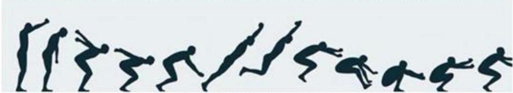

<details>
<summary>natural_image</summary>

Silhouettes of human figures in various poses, including dancing and jumping (no text or symbols)
</details>

图 1 立定跳远动作示意图 $^{[2]}$

## 1.2 问题提出

利用 AI 人体姿态识别技术定位摄像头拍摄图像中较小尺度下人体关键点的位置。基于该算法可跟踪运动者姿态，获取在运动过程当中人体关键点不同帧数的动作视频与对应的位置信息。据此，建立相应的数学模型，思考下列问题：

问题一：根据附件1中的两个立定跳远运动者的位置信息、跳远视频和相应的成绩以及附件2中运动者的33个关键点信息，确定出在跳远过程当中运动者的起跳时刻和落地时刻，并对从起跳到落地这一运动过程进行描述。

问题二：通过较短时间下的专业培训，可以较大幅度地提升跳远成绩。根据附件3部分运动者在立定跳远姿势纠正前后的视频、跳远成绩和位置信息以及附件4中的每位运动者个人体质报告情况，研究影响运动者跳远成绩的关键因素。

问题三：在前两问的模型及结果基础上，结合运动者11的相关跳远信息和个人的体质报告情况，预测出在实际中该运动员的跳远成绩。

问题四：基于问题三，提出运动者11能够在短时间内显著改善跳远成绩动作改进建议，并给出在此训练后该运动者能够在跳远项目中达到的理想成绩。

## 二、问题分析

## 2.1 数据预处理的分析

附件有 10473 条数据、1 张图片和 35 段 10 秒钟的视频数据，其可能存在缺失值、重复值或者异常值，需对该异常数据进行查找和处理。首先，可以对部分原始数据进行可视化，观察特征发现原始数据可能存在的问题。其次，由于附件数据是对视频逐帧进行提取，可能会存在较大的抖动和噪声，且在观察数据时发现了大量位置信息为 0，说明需先对异常值进行处理，然后将数据进行平滑处理。然后，由于是图像数据，因此在处理前需按照视频分辨率 $1280 \times 720$ 对 Y 轴进行翻转，得到实际坐标。最后，附件中仅有帧号而无时间，为便于后续对时刻的判断，通过参阅文献确定监控器帧率并调整时间戳。

## 2.2 问题一的分析

问题一要求在立定跳远项目中识别运动者的起跳与落地时刻，并描述出在滞空时段的运动轨迹。首先，根据附件2数据与人体结构知识，绘制人体33个关键点的示意图，如图2所示。其中，点0为鼻子，点1\~6为眼睛；点7、8为耳朵；点9、10为嘴巴；点11、12为肩膀；点13、14为手肘；点15、21和点16、22为手腕；点17\~20为手掌；点23、24为腰部；点25、26为膝盖；点27、28为脚踝；点29\~32为脚掌。据此，可将关键点分为躯干、腿部、头部和手臂四个部分，采用处理后的数据进行可视化，分析在立定跳远过程中各关键点的变化情况。其次，为更加客观地判断，考虑结合相应物理

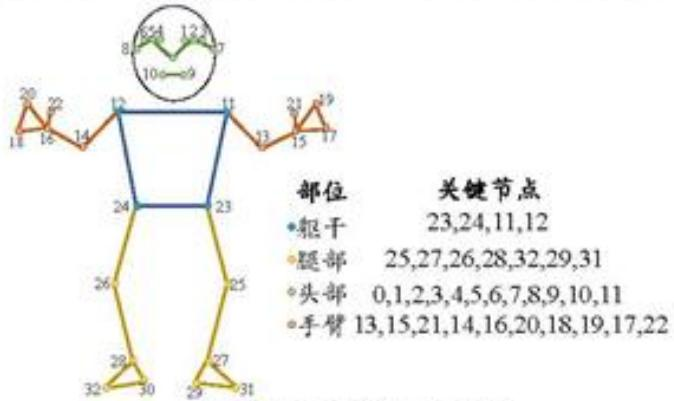

<details>
<summary>wireframe</summary>

| 部位 | 关键节点 |
| --- | --- |
| 躯干 | 23,24,11,12 |
| 腿部 | 25,27,26,28,32,29,31 |
| 头部 | 0,1,2,3,4,5,6,7,8,9,10,11 |
| 手臂 | 13,15,21,14,16,20,18,19,17,22 |
</details>

图 2 人体关键点示意图

力学知识进行分析，选取脚部关键点位并采用数值微分的方法对两个时刻进行识别。同时，引入速度突变阈值对运动者1和2的起跳时刻和滞空时间进行计算。随后，考虑采用计算比例尺的方式，对不同运动者的比例尺进行比较，若一致则说明可靠性较强，反之则说明存在偏差。然后，在滞空过程中实际数据可能存在偏离现象，可对其进行拟合。最后，考虑通过计算上下肢、下肢关节、地面与大腿的夹角和躯干倾斜角度，并结合运动者的成绩，以反映滞空过程中运动者跳远的质量。

## 2.3 问题二的分析

问题二要求分析能够对运动者的跳远成绩造成影响的关键因素。首先，结合附件3和附件4运动者相关数据，考虑从运动者的个人体质及姿态两个方面入手。其次，对于个人体质报告，考虑选取主要的体质因素与跳远成绩做相关性的检验，以便选择相关性分析方法。选择方法后通过绘制热力图进行可视化，分析相关程度选出关联系数较高的指标。然后，对于姿态方面，采用问题一同样方式对调整前后每名运动者每次立定跳远的起跳和落地时刻以及角度变化进行计算，并给出相应的比例尺验证其可靠性。此外，提取调整前后成绩最高的一次数据计算提升度，对于提升最大的运动者，可以考虑对其调整前后的角度变化进行可视化分析。与此同时还可分析姿态与关键角度存在的关系。最后，考虑到附件中有8岁和6岁儿童，对未包含儿童组数据进行相关性与含儿童组的数据进行比较，观察并分析存在的差异。

## 2.4问题三的分析

问题三要求来预测运动者11的真实跳远成绩。首先，可以利用问题2中得出的主要影响因素，来进一步建立该预测模型。其次，为了获得更为精确的预测结果，可选用多元线性回归模型与随机森林回归模型进行对比分析。其中，多元线性回归模型能够较好地解释多变量指标之间的线性关系，而随机森林回归模型则在处理结构复杂、非线性的数据方面具有更强的判别能力。最后，可通过比例尺计算的方法对模型预测结果的准

确性进行验证。

## 2.5 问题四的分析

问题四需要我们给出短时间的姿势训练建议，首先可以排除身体因素，因为身体因素需要长时间的恢复以及锻炼，因此我们可以考虑对其角度进行修正，但是在短期训练后需要给出可能达到的理想跳远成绩，所以需要用到预测模型，常规的时序模型并不能对多变量进行预测，因此需要用到多变量回归模型，题目所给数据并不和国际标准姿势一样，因此若是要预测未来可能达到的理想水平需要用到题目所给的不标准姿势数据。所以可以使用相同年龄段的姿势数据对运动者11进行调整。

## 三、模型假设

1. 假设监控画面环境不受到极端因素的影响；  
2. 假设所有视频均由同一台监控设备采集。

四、符号说明

<table><tr><td>符号</td><td>意义</td><td>单位</td></tr><tr><td>S</td><td>表示比例尺数值</td><td>/</td></tr><tr><td> $t_i$ </td><td>表示第i帧对应的时间</td><td>秒</td></tr><tr><td>h</td><td>表示髋关节的平均坐标</td><td>/</td></tr><tr><td>G</td><td>表示运动员的真实成绩</td><td>米</td></tr><tr><td>k</td><td>表示膝关节的平均坐标</td><td>/</td></tr><tr><td> $V_{foot}(t_i)$ </td><td>表示第i帧脚掌垂直速度</td><td>px/s</td></tr><tr><td> $C_i$ </td><td>第i个指标对成绩的相对贡献</td><td>/</td></tr><tr><td> $P_{i, before}$ </td><td>表示i位运动者姿势调整前的成绩</td><td>米</td></tr><tr><td> $P_{i, after}$ </td><td>表示第i位运动者姿势调整后的成绩</td><td>米</td></tr><tr><td> $R_t(x)$ </td><td>表示样本x在第t颗树种落到的叶节点</td><td>/</td></tr><tr><td> $Y_{foot}(t_i)$ </td><td>表示第i帧经过平滑处理的脚掌垂直坐标</td><td>/</td></tr></table>

[注]：其余符号均已在正文中展示。

## 五、数据预处理

附件中给出运动者1至运动者11立定跳远的相关数据信息，内容包含立定跳远的点位信息、人体关键点、跳远成绩、个人体质情况等。为保证数据的可靠性，需检测数据中存在的缺失值、异常值和重复值，并对异常数据进行补齐、修正或者剔除处理。

## 5.1原始数据可视化

为初步了解数据的大致规律和趋势，本文基于人体关键节点，将数据划分为四大部分：头部（对应关键点为0,1,2,3,4,5,6,7,8,9,10,11）；躯干（对应关键点为23,24,11,12）；手臂（对应关键点为13,15,21,14,16,20,18,19,17,22）和腿部（25,27,26,28,30,32,29,31）。

同时，在可视化前需对原始数据的坐标系进行转换，基于视频分辨率（1280×720），使用720减去各帧对应Y轴坐标值，实现Y轴翻转并得到同实际的高度一致的坐标。

以运动者1为例，对该四大部分进行可视化，其效果如图3所示。

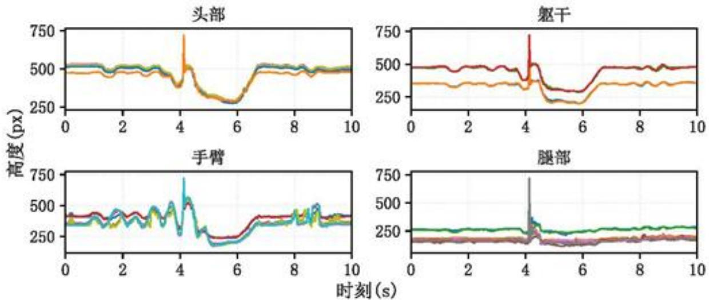  
图 3 四大部位原始数据的可视化

观察图 3 可知，四张图像中的曲线波动较大且表面粗糙，这表明原始数据中存在明显的噪声干扰。同时，在第 4\~5 秒区间出现一个峰值点，该点对应的位置信息均为 0，说明数据存在异常值。据此，需先对附件数据中的异常值进行处理，随后再对数据进行降噪处理。

## 5.2 异常值处理

观察附件中的位置信息数据可以发现，有些帧数各关键点位置信息为0。以调整前运动者3第5次跳远位置信息中帧号145\~149为例，其结果如表1所示。

表 1 部分异常数据

<table><tr><td>帧号</td><td>0_X</td><td>0_Y</td><td>1_X</td><td>1_Y</td><td>...</td><td>31_X</td><td>31_Y</td><td>32_X</td><td>32_Y</td></tr><tr><td>145</td><td>714.93</td><td>197.52</td><td>717.33</td><td>198.15</td><td>...</td><td>731.85</td><td>563.56</td><td>717.83</td><td>560.53</td></tr><tr><td>146</td><td>0</td><td>0</td><td>0</td><td>0</td><td>...</td><td>0</td><td>0</td><td>0</td><td>0</td></tr><tr><td>147</td><td>0</td><td>0</td><td>0</td><td>0</td><td>...</td><td>0</td><td>0</td><td>0</td><td>0</td></tr><tr><td>148</td><td>711.31</td><td>222.42</td><td>711.3</td><td>214.18</td><td>...</td><td>726.78</td><td>552.17</td><td>736.21</td><td>555.63</td></tr><tr><td>149</td><td>0</td><td>0</td><td>0</td><td>0</td><td>...</td><td>0</td><td>0</td><td>0</td><td>0</td></tr></table>

由表 1 可知，出现了三条帧号为 0 的情况，这种相对零散的异常数据可能是由于摄像头在拍摄过程中未能成功捕捉到该帧的数据。对该类数据本文采用线性插补法进行填补，补齐后的部分数据如表 2 所示。

表 2 补齐后的部分数据

<table><tr><td>帧号</td><td>0 X</td><td>0 Y</td><td>1 X</td><td>1 Y</td><td>...</td><td>31 X</td><td>31 Y</td><td>32 X</td><td>32 Y</td></tr><tr><td>145</td><td>714.93</td><td>197.52</td><td>717.33</td><td>198.15</td><td>...</td><td>731.85</td><td>563.56</td><td>717.83</td><td>560.53</td></tr><tr><td>146</td><td>713.12</td><td>209.97</td><td>714.32</td><td>206.17</td><td>...</td><td>729.32</td><td>557.86</td><td>727.02</td><td>558.08</td></tr><tr><td>147</td><td>712.21</td><td>216.2</td><td>712.81</td><td>210.17</td><td>...</td><td>728.05</td><td>555.02</td><td>731.62</td><td>556.86</td></tr><tr><td>148</td><td>711.31</td><td>222.42</td><td>711.3</td><td>214.18</td><td>...</td><td>726.78</td><td>552.17</td><td>736.21</td><td>555.63</td></tr><tr><td>149</td><td>709.81</td><td>222.34</td><td>709.94</td><td>216.9</td><td>...</td><td>732.06</td><td>547.62</td><td>739.7</td><td>554.8</td></tr></table>

为进一步了解异常值情况，以运动者3调整前后数据和运动者5为例，对异常值进行统计，结果如表3所示。

表 3 运动者 3 和运动者 5 的异常值统计

<table><tr><td>跳远工作表</td><td>帧号</td><td>行数</td><td>跳远工作表</td><td>帧号</td><td>行数</td></tr><tr><td>运动者3第1次</td><td>60</td><td>1</td><td>运动者3第5次</td><td>112、146、147、149、150、153</td><td>6</td></tr><tr><td>运动者3第2次</td><td>113</td><td>1</td><td>运动者3调整后第1次</td><td>124</td><td>1</td></tr><tr><td>运动者3第4次</td><td>75</td><td>1</td><td>运动者3调整后第2次</td><td>271、279~300</td><td>23</td></tr><tr><td>运动者5第1次</td><td>68</td><td>1</td><td>运动者5第2次</td><td>140~300</td><td>161</td></tr></table>

由表 3 可知，除离散异常值外，还发现存在大量连续异常值。这一现象可能源于运动者在 10 秒视频中的前几秒便已经完成了立定跳远动作并离开监测区域，从而导致后续部分数据未被采集。由于这些连续异常值均出现在动作完成之后，对研究结果不产生实质性影响，故本文不对其进行处理。

此外，还发现在调整前的运动者5第2次测试中，第207帧在前后均为大量0值的情况下突然出现了一组异常数据。通过观察视频发现，在第207帧时出现人物瞬间闪现，可能是由于识别或采集过程中出现误判情况，本文将其修正为0。

对于附件4中的运动者体检报告数据，由于“身体得分”、“肌肉控制量”、“标准体重”、“体重控制量”、“内脏脂肪”、“水分率”、“肌肉率”、“营养状态”、“体型”、“体脂率”、“性别”、“脂肪控制量”和“蛋白质率”13个指标均可通过其他指标进行计算得到，且对结果影响较小，因此对13个指标数据进行剔除。此外，利用蛋白率修正蛋白质量；根据运动者11的脂肪率，将脂肪重量的9.5kg修正为3kg；使用肌肉率将肌肉重量的15kg修正为12.1kg；随后将去脂体重由26.3kg修正为18kg。

## 5.3 数据的滤波处理

基于附件中的数据均为摄像头视频图像数据，在提取人体关键点坐标的过程中不可避免会产生抖动或噪声。对于帧率为30fps的视频，逐帧进行提取关键点数据波动明显。为降低噪声的干扰同时尽可能保留数据变化的真实趋势，本文采用Savitzky-Golay滤波方法[4]对数据进行平滑处理。

选用二阶多项式拟合，滑动窗口长度设为7帧，对33个关键点坐标进行处理，最终的数值保留两位小数。以脚部（点31和点32）运动轨迹为例，滤波处理前后的情况如图4所示。

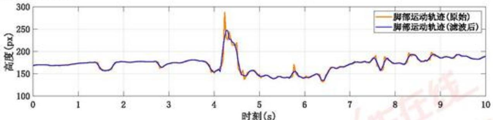

<details>
<summary>line</summary>

| 时刻 (s) | 脚部运动轨迹 (原始) (px) | 脚部运动轨迹 (滤波后) (px) |
| --- | --- | --- |
| 0 | ~170 | ~170 |
| 1 | ~175 | ~175 |
| 2 | ~175 | ~175 |
| 3 | ~175 | ~175 |
| 4 | ~160 | ~160 |
| 4.2 | ~280 | ~250 |
| 4.5 | ~140 | ~140 |
| 5 | ~145 | ~145 |
| 6 | ~145 | ~145 |
| 7 | ~175 | ~175 |
| 8 | ~180 | ~180 |
| 9 | ~190 | ~190 |
| 10 | ~190 | ~190 |
</details>

图 4 原始数据和滤波后的数据对比图

观察图 4 可知，SG 滤波平滑处理后的数据线比原始数据更加平滑，整体轮廓更加清晰，减少了噪声对数据的影响，为后续工作做准备。

## 5.4 调整时间戳

由于数据表中没有具体的时间，需要将帧数调整为时间形式。鉴于监控器的合适帧率一般在 15fps 至 30fps 之间 $^{[3]}$ ，本文假设监控器帧率为 30fps，对帧号进行时间换算与调整。以运动者 1 为例，其结果如表 4 所示。

表 4 运动者 1 视频帧号数据时间转换的部分结果

<table><tr><td>帧号</td><td>0</td><td>1</td><td>2</td><td>3</td><td>...</td><td>297</td><td>298</td><td>299</td><td>300</td></tr><tr><td>时刻(秒)</td><td>0</td><td>0.033</td><td>0.067</td><td>0.100</td><td>...</td><td>9.900</td><td>9.933</td><td>9.967</td><td>10.000</td></tr></table>

由表 4 可知，将每一帧换成以秒为单位的 10 秒时间序列，便于后续工作。

## 六、模型的建立与求解

## 6.1 问题一：立定跳远全过程的研究

通过对头部、躯干、腿部和手臂四大部位数据进行可视化，得到判断起跳与落地主要与脚部有关的结论。利用一阶微分对脚部四点数据均值及速度突变的阈值，计算出起跳和落地的具体时间和滞空时间，并使用比例尺进行验证。对于滞空数据，考虑采用拟合和角度对该阶段进行描述。

## 6.1.1 数据的初步探索性分析

立定跳远运动可以分为四个主要阶段，分别为预摆、起跳、腾空以及落地[5]。为了确定起跳时刻和落地时刻，本文将人体的关键节点按照立定跳远肢体运动特征分为头部、手臂、腿部和躯干四大部分(见图2)，并对其位置变化情况进行分析。

以运动者 1 的数据为例，将平滑后的头部、躯干、手臂和腿部数据进行可视化，其效果如图 5 所示。

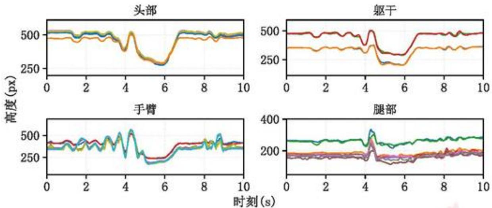  
图 5 四大部位数据平滑后的可视化

分析图 5 可知，头部中十个关键点位在 1s 前和 7s 后均处于平稳状态。在 3\~4s 之间逐步下降，可能是该名运动者在预摆时的低头动作所致；随后逐步上升至最高位置后逐渐下降，该段时间可能是运动者起跳到落地这一过程；在 6s 后曲线再次上升，推测此区间是运动者落地后由蹲姿过渡为站立的过程；最后稳定在初始状态高度，这表明该运动者已经完成了立定跳远的所有动作。躯干部位的关键节点位置变化与头部的变化趋势大致吻合。

手臂中的十个关键节点在 0\~5s 之间曲线呈现出明显的波动趋势，且波动随时间的增加而增大，说明该运动者在此期间进行摆臂动作，并在数值达到峰值时准备下蹲起跳；

随后在 5\~6s 曲线呈低谷状态，该时段运动者可能处于落地后的下蹲姿势；6s 后曲线逐渐上升恢复至初始状态；在 8\~9s 区间有些小波动是运动者跳完之后的手臂动作，不对研究有所影响。

而对于腿部的各关键点位置变化趋势，在4s前数据都较为平稳，说明此时一直处于站立状态；4\~5s曲线出现高峰，可能是由于运动者在起跳后脚部达最高位置，然后呈自由落体运动下降至初始起跳阶段的数值。综上所述，运动者做立定跳远运动这一过程类似于一条抛物线。在四大部位中，腿部数据最为直观，据此可选取脚部关键点的数据作为运动者起跳或落地的判断依据。

## 6.1.2 基于一阶微分识别起跳与落地时刻

在视频分析中，一般方法通常通过目测判断运动者的起跳与落地时刻，但该方法存在主观性与偏差。因此，本文结合实际情况与物理动力学角度考虑起跳与落地，运动者在起跳的瞬间脚掌迅速离地，垂直的坐标出现快速上升，对应的垂直速度就会负向突变。当落地时刻脚掌瞬间接触地面，坐标就会快速下降，那么所对应的垂直速度就会正向突变。这个变化是力学的现象，可以直接反应出起跳动作和落地动作，并且利用速度突变来识别，可提高识别的一致性。

因此，本文采用数值一阶微分方法 $^{[6]}$ ，对起跳与落地时刻进行自动识别，其计算公式如下：

$$
V _ {f o o t} (t _ {i}) = \frac {d Y _ {f o o t} (t _ {i})}{d t} \approx \frac {Y _ {f o o t} (t _ {i + 1}) - Y _ {f o o t} (t _ {i} - 1)}{t _ {i + 1} - t _ {i - 1}} \tag {1}
$$

式中， $V_{\mathrm{foot}}(t_i)$ 为第 $i$ 帧脚掌垂直速度； $\frac{dY}{dt}$ 使用有限差分近似法，即Python环境中的gradient()方法，其方法会根据相邻帧的坐标以及时间计算随时间变化的瞬时导数； $Y_{\mathrm{foot}}(t_i)$ 为第 $i$ 帧经过平滑处理的脚掌垂直坐标； $t_i$ 为第 $i$ 帧对应的时间。第一帧与最后一帧使用单边差分计算，以保证速度序列长度与帧数一致。

结合上述公式，考虑到在起跳与落地过程中，脚部的运动在整个过程中与地面接触较为直接，其运动轨迹对起跳与落地时刻的影响较为明显。基于在实际跳远成绩判定中，通常选取起跳前的脚尖位置与落地时的脚跟位置作为跳远距离成绩。因此，本文选取了脚部四个关键点位，即编号29、30、31以及32，并对其取平均值进行计算，以平均值作为脚掌整体的代表位置。

为了更好地自动识别出起跳与落地时刻，本文根据视频帧率以及关键点抖动情况，将速度突变阈值设定为±150px/s。同时，为了确保动作的识别合理性，当起跳点识别后，需要在1秒之内识别出落地点。最终，将数据输入到软件中，得到结果如表5所示。

表 5 运动者 1 和 2 的起跳与落地时刻

<table><tr><td>人员</td><td>起跳时刻(秒)</td><td>起跳帧号</td><td>落地时刻(秒)</td><td>落地帧号</td><td>滞空时间</td></tr><tr><td>运动者1</td><td>4.133</td><td>124</td><td>4.567</td><td>137</td><td>0.434</td></tr><tr><td>运动者2</td><td>5.467</td><td>164</td><td>5.9</td><td>177</td><td>0.433</td></tr></table>

随后，以运动者 1 数据为示例，绘制脚掌轨迹与对应的一阶微分脚掌速度示意图，其结果如图 6 所示。

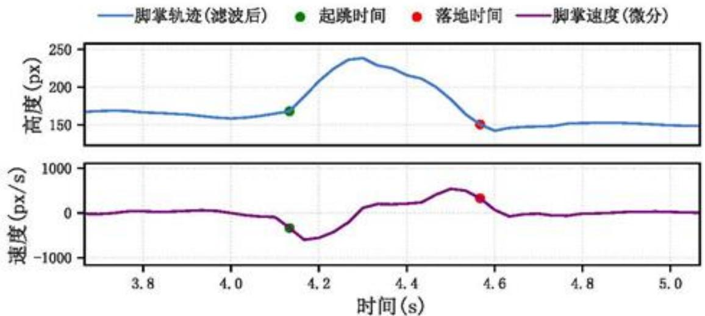

<details>
<summary>line</summary>

| 时间 (s) | 脚掌轨迹 (px) | 速度 (px/s) |
| --- | --- | --- |
| ~3.8 | ~165 | ~0 |
| ~4.0 | ~160 | ~0 |
| ~4.15 | ~170 | ~-300 |
| ~4.2 | ~200 | ~-600 |
| ~4.3 | ~240 | ~-200 |
| ~4.4 | ~220 | ~200 |
| ~4.5 | ~180 | ~500 |
| ~4.55 | ~150 | ~300 |
| ~4.6 | ~145 | ~0 |
| ~4.8 | ~150 | ~0 |
| ~5.0 | ~150 | ~0 |
</details>

图6起跳与落地时刻微分示意图

分析图 6 可知，子图 1 为立定跳远过程中，脚掌在起跳到落地过程中随时间变化而变化的运动轨迹。子图 2 为对高度与时间进行微分得到的变化曲线。在子图 1 中，绿色为起跳时刻，此时脚掌的高度曲线出现了快速上升的拐点，代表脚掌脱离地面进入腾空阶段。红色为落地时刻，对应快速下降至接近初始水平，表面已经重新接触到地面，整个运动轨迹曲线呈现了抛物线形式。在子图 2 中，起跳点附近的速度曲线出现了明显的负向突变，说明脚掌在起跳瞬间快速上抬，腾空时接近为 0，落点附近速度曲线出现了明显的正向突变，表示脚掌在快速下落并接触地面。

将人体各关键点带入到该微分公式中，算出各点在起跳和落地的位置，并将其进行可视化，最终效果如图7和图8所示。

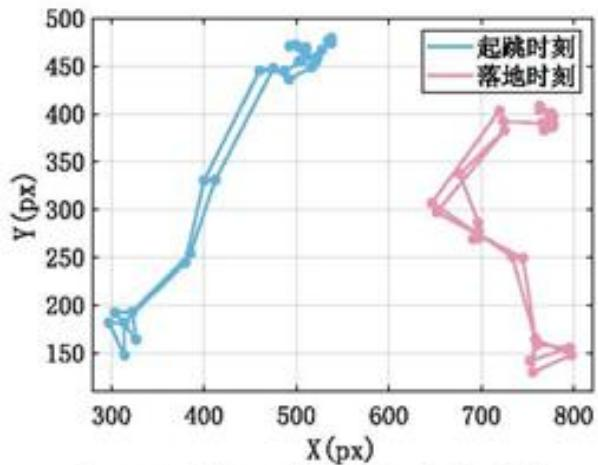

<details>
<summary>line</summary>

| X (px) | Y (px)::起跳时刻 | Y (px)::落地时刻 |
| --- | --- | --- |
| ~300 | ~185 | — |
| ~310 | ~190 | — |
| ~320 | ~150 | — |
| ~330 | ~190 | — |
| ~340 | ~165 | — |
| ~380 | ~250 | — |
| ~400 | ~330 | — |
| ~460 | ~450 | — |
| ~470 | ~440 | — |
| ~480 | ~450 | — |
| ~490 | ~440 | — |
| ~500 | ~450 | — |
| ~510 | ~460 | — |
| ~520 | ~470 | — |
| ~530 | ~480 | — |
| ~650 | — | ~305 |
| ~660 | — | ~335 |
| ~670 | — | ~385 |
| ~680 | — | ~400 |
| ~690 | — | ~275 |
| ~700 | — | ~285 |
| ~710 | — | ~270 |
| ~720 | — | ~250 |
| ~730 | — | ~165 |
| ~740 | — | ~145 |
| ~750 | — | ~135 |
| ~760 | — | ~155 |
| ~770 | — | ~145 |
| ~780 | — | ~155 |
| ~790 | — | ~155 |
| ~800 | — | ~155 |
</details>

图 7 运动者 1 的起跳与落地时刻

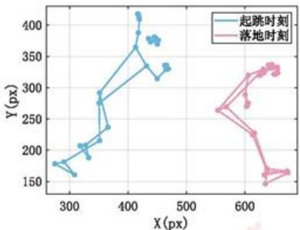

<details>
<summary>line</summary>

| Series | X (px) (range) | Y (px) (range) |
| --- | --- | --- |
| 起跳时刻 | 280~470 | 160~420 |
| 落地时刻 | 550~670 | 150~340 |
</details>

图 8 运动者 2 的起跳与落地时刻

观察图 7 和图 8 可知，两位运动者均是脚部中点 31 和 32 即将离开地面时为起跳时刻，此时运动者的姿态为手臂向上举，身体前倾，脚部呈一定弯曲姿态且与地面呈一个锐角；而点 29 和 31 与沙坑接触时为落地时刻，此时运动者处于低头状态、手臂下垂。相比而言，运动者 1 跳远的距离和身高均大于运动者 2，这说明身高对跳远距离有一定的关联。

## 6.1.3 比例尺相对标定验证

假设相机参数与拍摄环境保持不变，所以在不同的运动者中比例尺应当一致。若不同运动者的比例尺差异较大，出现了明显波动，说明起跳与落地识别时刻可能存在偏差。若比例尺结果一致，则说明识别起跳与落地时刻具有较强的可靠性。计算公式如下：

$$
S = \frac {G}{H _ {\text {land}} - H _ {\text {start}}} \tag {2}
$$

式中，S 为比例尺数值；G 为运动员的真实成绩； $H_{land}$ 与 $H_{start}$ 分别为落地与起跳时刻的水平坐标像素值，对两者做差值即为像素水平位移距离。

结合上述公式，对运动者1与运动者2的比例尺进行计算，计算结果如表6所示。

表 6 运动者 1 和 2 的比例尺

<table><tr><td>人员</td><td>真实成绩</td><td>起跳时刻像素值(px)</td><td>落地时刻像素值(px)</td><td>比例尺</td></tr><tr><td>运动者1</td><td>1.58米</td><td>301.483</td><td>774.537</td><td>0.334cm/px</td></tr><tr><td>运动者2</td><td>1.15米</td><td>306.606</td><td>650.539</td><td>0.334cm/px</td></tr></table>

由表 6 可知，两位运动者的比例尺值均为 0.334cm/px，说明识别起跳时刻与落地时刻的结果具有可靠性。

## 6.1.4 滞空点数据拟合

基于计算得到的起跳与落地时刻，可确定运动员在空中的滞空时间区间。理论上，在立定跳远过程中，人体质心的垂直位移随时间变化会近似成一条抛物线轨迹，即二次函数形式。然而，由于竖直方向受重力加速度作用，在运动者接近落地阶段，其实际运动轨迹会出现轻微偏离。基于此，本文选取人体关键节点位置的平均值，对两位运动员在滞空阶段的运动数据进行三次多项式拟合，其对应的拟合方程分别表示为：

$$
y _ {1} = - 1 1 0 6. 4 2 8 5 x _ {1} ^ {3} + 1 6 5 1 6. 9 8 4 1 x _ {1} ^ {2} - 8 0 6 6 2. 0 3 4 5 x _ {1} + 1 2 9 6 8 0. 8 5 9 4 \tag {3}
$$

$$
y _ {2} = - 4 4 6 8. 8 0 8 4 x _ {2} ^ {3} + 7 7 8 3 1. 7 0 9 2 x _ {2} ^ {2} - 4 5 1 3 6 2. 0 7 5 1 x _ {2} + 8 7 1 9 4 9. 3 9 5 2 \tag {4}
$$

其中，式（3）、式（4）分别为运动者1和2的滞空阶段运动数据的三次多项式拟合方程。同时分别绘制其拟合效果，如图9和图10所示。

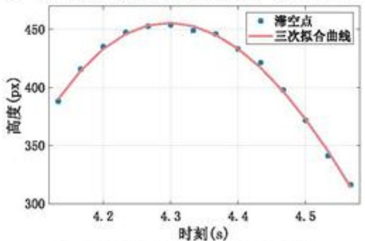

<details>
<summary>line</summary>

| 时刻 (s) | 高度 (px) |
| --- | --- |
| ~4.15 | ~388 |
| ~4.18 | ~416 |
| ~4.21 | ~435 |
| ~4.24 | ~448 |
| ~4.27 | ~452 |
| ~4.30 | ~453 |
| ~4.33 | ~449 |
| ~4.36 | ~446 |
| ~4.39 | ~433 |
| ~4.42 | ~420 |
| ~4.45 | ~398 |
| ~4.48 | ~372 |
| ~4.51 | ~341 |
| ~4.54 | ~316 |
</details>

图 9 运动者 1 滞空点拟合曲线

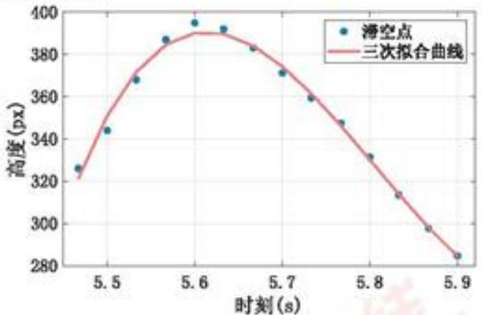

<details>
<summary>line</summary>

| 时刻 (s) | 滞空点 (px) | 三次拟合曲线 (px) |
| --- | --- | --- |
| ~5.45 | ~326 | ~322 |
| ~5.50 | ~344 | ~348 |
| ~5.53 | ~368 | ~368 |
| ~5.57 | ~387 | ~385 |
| ~5.60 | ~395 | ~390 |
| ~5.63 | ~392 | ~390 |
| ~5.67 | ~383 | ~383 |
| ~5.70 | ~371 | ~371 |
| ~5.73 | ~359 | ~359 |
| ~5.77 | ~348 | ~348 |
| ~5.80 | ~332 | ~332 |
| ~5.83 | ~313 | ~313 |
| ~5.87 | ~298 | ~298 |
| ~5.90 | ~285 | ~285 |
</details>

图 10 运动者 2 滞空点拟合曲线

观察图 9 和图 10 可知，运动者立定跳远的运动轨迹呈一条抛物线。

## 6.1.5 滞空阶段关键角度计算

在识别运动者的起跳与落地时刻后，获得的时间信息不能全面反映跳远动作的质量。因此，本文进一步对身体部位的关键角度特征进行提取。通过计算下肢、躯干及腿部与地面的角度，可以反映运动员在不同阶段的发力模式、身体姿态等，这些角度指标有助于解释成绩差异的原因。

因此，本文基于起跳时刻到落地时刻的二维关键点坐标，构建如下角度计算公式：

## 1) 下肢关节角度(髋-膝-踝)

该角度表示为髋关节-膝关节-踝关节，反应了下肢屈伸程度，起跳的时候，角度减小表示下蹲缓冲，起跳瞬间角度快速增大，表示下肢蹬腿发力过程。计算公式如下：

$$
\theta_ {l e g} = \arccos \left(\frac {(h - k) \cdot (a - k)}{\| h - k \| \cdot \| a - k \|}\right) \tag {5}
$$

式中，h 为髋关节的平均坐标即左髋关节与右髋关节的平均值；k 为膝关节的平均坐标；a 为踝关节平均坐标。

## 2）躯干倾斜角度(肩-髋)

该角度表示为肩关节-髋关节相对于竖直方向的倾斜角度, 如果运动者直立站着, 肩与髋在同一条竖线上, 则该角度则为 $0^{\circ}$ , 若角度过大会影响起跳的效率和腾空姿势。计算公式如下:

$$
\theta_ {t r u n k} = \arccos \left(\frac {(s - h) \cdot v}{\| s - h \| \cdot \| v \|}\right) \tag {6}
$$

式中，s 为肩关节的平均坐标；v 为竖直方向即当 x 为 0；y 为任意数值。

## 3) 上肢与下肢夹角(肩-髋-膝)

该角度表示为躯干与大腿之间的夹角，可以体现出运动者起跳的身体姿态情况，以及腾空状态是否有“折”这一动作。计算公式如下：

$$
\theta_ {s h k} = \arccos \left(\frac {(s - h) \cdot (k - h)}{\| s - h \| \cdot \| k - h \|}\right) \tag {7}
$$

式中，s,h,k分别为肩关节、髋关节、膝关节的平均坐标。

## 4）大腿与地面夹角(髋-踝)

该角度表示为大腿与地面的夹角，反映了其相对位置关系，可以用来判断起跳与落地过程中的腿部摆动幅度，计算公式如下：

$$
\theta_ {\text {leg - ground}} = \arccos \left(\frac {(a - h) \cdot g}{\| a - h \| \cdot \| g \|}\right) \tag {8}
$$

式中，a,h分别为髋关节、踝关节的平均坐标；g为水平方向的一条直线地面。基于此，本文对上述四个角度位置进行可视化，其效果如图11所示。

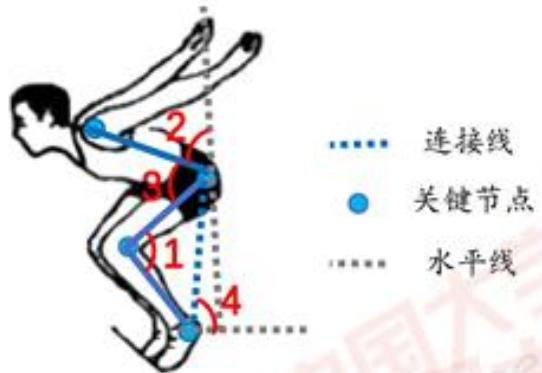

<details>
<summary>text_image</summary>

连接线
关键节点
水平线
1
2
3
4
</details>

图 11 四个角度示意图

观察图 11 可知，角 1 为下肢关节角度；角 2 为躯干倾斜角度；角 3 为上肢与下肢夹角；角 4 为大腿与地面夹角。

结合上述公式，本文对运动者1与运动者2在起跳至落地全过程中的运动数据进行关节角度计算，并将结果可视化，其效果如图12与图13所示。

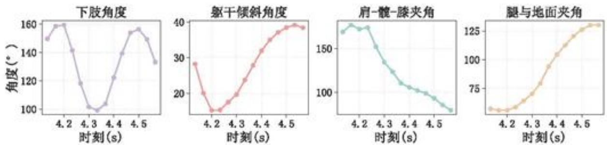  
图 12 运动者 1 的关键角度变化

观察图 12 可以发现，在起跳阶段下肢角度由 $149^{\circ}$ 变到 $99^{\circ}$ ，明显的减少，说明下肢快速屈伸后爆发伸展，躯干角度起跳时身体先前倾然后逐渐直起，肩-髋-膝夹角从 $169^{\circ}$ 变为 $110^{\circ}$ ，明显的减小，说明躯干和大腿之间夹角缩小。腾空阶段，肩-髋-膝夹角逐渐减小，有明显的收腹姿态。在落地时，下肢角度从 $99^{\circ}$ 增加到 $133^{\circ}$ ，躯干角度维持在 $38^{\circ}$ ，为缓冲做准备。

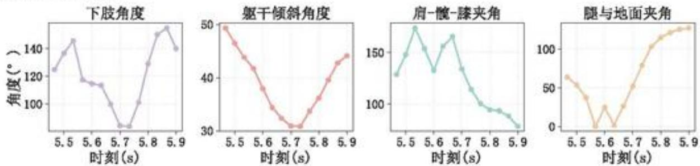  
图 13 运动者 2 的关键角度变化

分析图 13 可知, 运动者 2 的下肢角度刚开始为 $125^{\circ}$ 起跳并未展开, 屈曲幅度中等。角度为 $49^{\circ}$ 到 $32^{\circ}$ , 身体明显前倾, 肩-髋-膝夹角从 $129^{\circ}$ 到 $165^{\circ}$ 反而增大, 说明起跳时大腿与躯干之间逐渐张开, 上身前倾但是大腿没有得到充分抬起。在腾空阶段, 肩-髋-膝夹角从 $134^{\circ}$ 到 $94^{\circ}$ , 有收腹的姿势。落地前肩-髋-膝夹角降到 $78^{\circ}$ , 躯干与大腿形成锐角, 说明运动者 2 在落地前有很明显的屈髋收腹准备。

综上所述，运动者1起跳时屈曲更充分，腾空早期就进入了收腹状态，落地前较为稳定；相比之下，运动者2起跳时前倾更大但大腿上抬不足，腾空后半段才出现收腹，落地前屈躯更明显，因此，尽管两位运动者的滞空时间相近，但由于跳远姿态的差异，最终导致跳远成绩存在一定差异。

## 6.2 问题二：分析立定跳远成绩的关键影响因素

为了探究影响运动者跳远成绩的主要因素，本文分别从体质因素和姿势角度两个层面展开探究。前者决定的运动者的爆发力与运动潜能，后者则是通过动作优化直接影响成绩表现。

## 6.2.1 运动者体质因素相关性分析

本文选取剩余的13个体质因素指标与跳远成绩进行相关性检验。由于数据样本量较少，并且部分变量之间可能不满足正态分布假设，因此采用斯皮尔曼相关分析[7]，其计算公式如下：

$$
\rho = 1 - \frac {6 \sum_ {i} ^ {n} d _ {i} ^ {2}}{n (n ^ {2} - 1)} \tag {9}
$$

式中，n 为样本数量； $d_{i}$ 为第 i 个观测值在两变量秩次上的差异。将数据代入 Python 求解，得到 13 个体质因素指标的相关系数，并将结果进行可视化，其效果如图 14 所示。

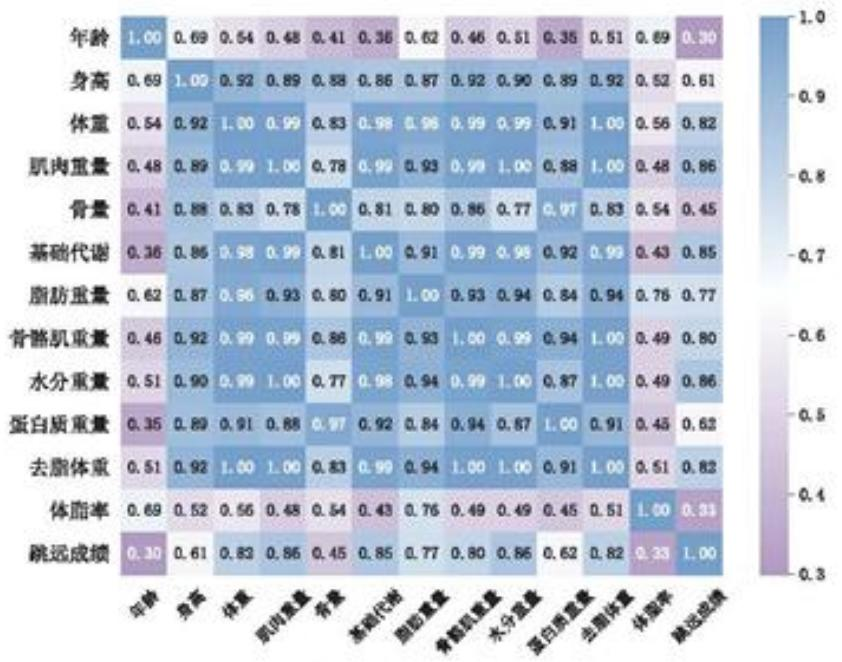

<details>
<summary>heatmap</summary>

| Variable | 年龄 | 身高 | 体重 | 肌肉重量 | 骨量 | 基础代谢 | 脂肪重量 | 骨骼肌重量 | 水分重量 | 蛋白质量量 | 去脂体重 | 体脂率 | 跳远成绩 |
| --- | --- | --- | --- | --- | --- | --- | --- | --- | --- | --- | --- | --- | --- |
| 年龄 | 1.00 | 0.69 | 0.54 | 0.48 | 0.41 | 0.36 | 0.62 | 0.46 | 0.51 | 0.35 | 0.51 | 0.69 | 0.30 |
| 身高 | 0.69 | 1.00 | 0.92 | 0.89 | 0.88 | 0.86 | 0.87 | 0.92 | 0.90 | 0.89 | 0.92 | 0.52 | 0.61 |
| 体重 | 0.54 | 0.92 | 1.00 | 0.99 | 0.83 | 0.98 | 0.96 | 0.99 | 0.99 | 0.91 | 1.00 | 0.56 | 0.82 |
| 肌肉重量 | 0.48 | 0.89 | 0.99 | 1.00 | 0.78 | 0.99 | 0.93 | 0.99 | 1.00 | 0.88 | 1.00 | 0.48 | 0.86 |
| 骨量 | 0.41 | 0.88 | 0.83 | 0.78 | 1.00 | 0.81 | 0.80 | 0.86 | 0.77 | 0.97 | 0.83 | 0.54 | 0.45 |
| 基础代谢 | 0.36 | 0.86 | 0.98 | 0.99 | 0.81 | 1.00 | 0.91 | 0.99 | 0.98 | 0.92 | 0.99 | 0.43 | 0.85 |
| 脂肪重量 | 0.62 | 0.87 | 0.86 | 0.93 | 0.80 | 0.91 | 1.00 | 0.93 | 0.94 | 0.84 | 0.94 | 0.76 | 0.77 |
| 骨骼肌重量 | 0.46 | 0.92 | 0.99 | 0.99 | 0.86 | 0.99 | 0.93 | 1.00 | 0.99 | 0.94 | 1.00 | 0.49 | 0.80 |
| 水分重量 | 0.51 | 0.90 | 0.99 | 1.00 | 0.77 | 0.98 | 0.94 | 0.99 | 1.00 | 0.87 | 1.00 | 0.49 | 0.86 |
| 蛋白质量重量 | 0.35 | 0.89 | 0.91 | 0.88 | 0.97 | 0.92 | 0.84 | 0.94 | 0.87 | 1.00 | 0.91 | 0.45 | 0.62 |
| 去脂体重 | 0.51 | 0.92 | 1.00 | 1.00 | 0.83 | 0.99 | 0.94 | 1.00 | 1.00 | 0.91 | 1.00 | 0.51 | 0.82 |
| 体脂率 | 0.69 | 0.52 | 0.56 | 0.48 | 0.54 | 0.43 | 0.76 | 0.49 | 0.49 | 0.45 | 0.51 | 1.00 | 0.31 |
</details>

图 14 体质因素相关性热力图

观察图 14 可以发现，大部分变量之间的相关系数都接近 0.9 或 0.9 以上，说明它们之间呈高度正相关。但这说明变量间并非相互独立，而是存在高度重叠的信息，表现出多重共线性问题。例如，个体的体重可视为由脂肪重量、肌肉重量和骨量等部分共同构成。

随后，基于运动学原理，立定跳远主要依靠下肢爆发力；而肌肉重量直接反映了运动者的发力潜力。体重则决定了身体所需要克服的负担；去脂体重作为去除脂肪带来负荷后的有效指标；而身高则影响起跳角度、腾空轨迹和身体形态特征。这四个指标分别代表着肌肉力量、身体质量、有效体成分和体格特征四个维度，能够较为全面地解释跳远成绩。因此，本文在充分考虑运动学原理前提下，最终筛选保留了肌肉重量、体重、去脂体重、身高四个主要因素。

## 6.2.2 运动者调整前后的姿势变化及全过程情况

基于附件3中姿势调整前后的数据，本文采用问题一的方式计算出每位运动者的起跳时刻、落地时刻以及滞空时长，且同样采用比例尺的验证方式。其结果如表7所示。

表 7 姿势调整前后各运动者立定跳远全过程情况

<table><tr><td>运动者</td><td>起跳时刻(s)</td><td>落地时刻(s)</td><td>滞空时间(s)</td><td>比例尺(cm/px)</td></tr><tr><td>运动者6第1次</td><td>0.000</td><td>10.000</td><td>10.000</td><td>0.971</td></tr><tr><td>运动者6第2次</td><td>4.867</td><td>5.167</td><td>0.300</td><td>0.361</td></tr><tr><td>运动者7第1次</td><td>2.900</td><td>3.367</td><td>0.467</td><td>0.352</td></tr><tr><td>运动者7第2次</td><td>5.367</td><td>5.800</td><td>0.433</td><td>0.335</td></tr><tr><td>运动者8第1次</td><td>3.967</td><td>4.267</td><td>0.300</td><td>0.338</td></tr><tr><td>运动者8第2次</td><td>0.167</td><td>10.000</td><td>9.833</td><td>0.157</td></tr><tr><td>运动者9第1次</td><td>4.167</td><td>4.333</td><td>0.167</td><td>-288.831</td></tr><tr><td>...</td><td>...</td><td>...</td><td>...</td><td>...</td></tr><tr><td>运动者6调整后第2次</td><td>5.033</td><td>5.433</td><td>0.400</td><td>0.327</td></tr><tr><td>运动者7调整后第1次</td><td>4.900</td><td>5.333</td><td>0.433</td><td>0.356</td></tr><tr><td>运动者7调整后第2次</td><td>5.833</td><td>6.300</td><td>0.467</td><td>0.352</td></tr><tr><td>运动者8调整后第1次</td><td>3.767</td><td>4.167</td><td>0.400</td><td>0.336</td></tr><tr><td>运动者9调整后第1次</td><td>3.067</td><td>3.533</td><td>0.467</td><td>0.357</td></tr><tr><td>运动者9调整后第2次</td><td>4.633</td><td>5.067</td><td>0.433</td><td>0.337</td></tr></table>

[注]：由于篇幅限制，其余见附录。

分析表 6 可知，大部分运动者的起跳与落地时刻均符合实际情况，滞空时间分布合理，并且比例尺波动较小。但是运动者 6 第二次、运动者 8 第 2 次、运动者 9 第 1 次这三个出现了异常，并不能很好的识别起跳点与落地点。经过查看，这些异常主要来源于视频识别中，运动者在画面中存在除立定跳远外的跳跃动作，导致识别有误。并且本文采用的是 7 帧时间窗口滤波，在个别情况下平滑不足，所以会出现异常识别，若将滤波增加到 15 帧时间窗口，便可以识别出这些运动者的起跳与落地时刻。

表 8 姿势调整前后的部分关键角度结果

<table><tr><td>运动者</td><td>起跳_下肢角度</td><td>起跳_肩-髋-膝角度</td><td>起跳_躯干角度</td><td>起跳_腿与地面夹角</td></tr><tr><td>运动者10</td><td>149.090°</td><td>163.502°</td><td>34.353°</td><td>57.169°</td></tr><tr><td>运动者10</td><td>136.414°</td><td>145.697°</td><td>41.682°</td><td>61.016°</td></tr><tr><td>运动者3</td><td>131.415°</td><td>142.609°</td><td>39.414°</td><td>63.599°</td></tr><tr><td>运动者3</td><td>125.633°</td><td>128.832°</td><td>44.654°</td><td>68.998°</td></tr><tr><td>运动者3</td><td>137.641°</td><td>159.054°</td><td>27.796°</td><td>61.070°</td></tr><tr><td>...</td><td>...</td><td>...</td><td>...</td><td>...</td></tr><tr><td>运动者7</td><td>114.367°</td><td>110.901°</td><td>67.160°</td><td>58.030°</td></tr><tr><td>运动者7</td><td>140.662°</td><td>144.249°</td><td>51.495°</td><td>54.030°</td></tr><tr><td>运动者8</td><td>146.655°</td><td>158.861°</td><td>35.836°</td><td>59.537°</td></tr><tr><td>运动者9</td><td>144.027°</td><td>155.034°</td><td>42.949°</td><td>54.370°</td></tr><tr><td>运动者9</td><td>113.298°</td><td>117.545°</td><td>63.700°</td><td>54.154°</td></tr></table>

[注]：由于篇幅太长，仅展示部分数据，其余见附录。

由表 8 可知，运动者 10 起跳时刻下肢与肩-髋-膝角度均较大，说明起跳时得到下肢伸展充分，运动者 3 多次试跳中差异较大，说明动作不一致，掌握的不熟练。运动者 7 的躯干角度和下肢角度偏小，容易照成稳定性下降。

## 6.2.3 姿势调整对跳远成绩的提升度

本文选取运动者 3 至运动者 10 姿势调整前后各自最佳的一次跳远成绩为依据，计算各运动者的成绩提升度，以此进一步量化姿势调整对运动者跳远成绩的提升效果，其计算公式为：

$$
\Delta P_{i} = \frac{P_{i,after} - P_{i,before}}{P_{i,before}}\cdot 100\% \tag{10}
$$

式中， $P_{i,after}$ 为第 i 位运动者姿势调整后的成绩； $P_{i,before}$ 为第 i 位运动者姿势调整前的成绩。相应计算结果如表 9 所示。

表 9 运动者姿势调整后的成绩提升度

<table><tr><td>运动者</td><td>调整前最好成绩(米)</td><td>调整后最好成绩(米)</td><td>提升(米)</td><td>提升度</td></tr><tr><td>运动者3</td><td>1.40</td><td>1.58</td><td>0.18</td><td>12.86%</td></tr><tr><td>运动者4</td><td>1.80</td><td>1.97</td><td>0.17</td><td>9.44%</td></tr><tr><td>运动者5</td><td>2.05</td><td>2.16</td><td>0.11</td><td>5.37%</td></tr><tr><td>运动者6</td><td>1.15</td><td>1.35</td><td>0.20</td><td>17.39%</td></tr><tr><td>运动者7</td><td>1.90</td><td>2.05</td><td>0.15</td><td>7.89%</td></tr><tr><td>运动者8</td><td>1.47</td><td>1.50</td><td>0.03</td><td>2.04%</td></tr><tr><td>运动者9</td><td>1.45</td><td>1.53</td><td>0.08</td><td>5.52%</td></tr><tr><td>运动者10</td><td>1.52</td><td>1.62</td><td>0.10</td><td>6.58%</td></tr></table>

观察表 9 可知，运动者调整后成绩的最高值均高于调整前，说明在经过短时间专业训练后，跳远成绩在一定程度上有所提升。其中，运动者 6 的提升率最大，为 17.39%；运动者 8 提升幅度最小，仅为 2.04%。据此，本文对运动者 6 调整前后的角度位置变化情况进行可视化，其效果如图 15 所示。

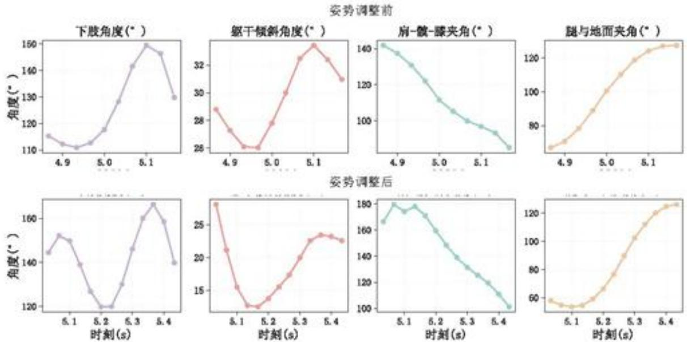

<details>
<summary>line</summary>

| 时间 (s) | 下肢角度 \(({}^{\circ})\) | 驱干倾斜角度 \(({}^{\circ})\) | 肩-髋-膝夹角 \(({}^{\circ})\) | 腿与地面夹角 \(({}^{\circ})\) | 指标1 (°) | 指标2 (°) |
| --- | --- | --- | --- | --- | --- | --- |
| 4.9 | ~115 | ~28.8 | ~143 | ~65 | ~145 | ~270 |
| 5.0 | ~117 | ~27.8 | ~105 | ~100 | ~120 | ~130 |
| 5.1 | ~149 | ~33.5 | ~95 | ~125 | ~165 | ~100 |
| 5.2 | — | ~26.0 | — | — | ~120 | — |
| 5.3 | — | ~30.0 | — | — | ~145 | — |
| 5.4 | — | ~33.5 | — | — | ~165 | — |
| 5.1 | — | — | — | — | ~270 | ~180 |
| 5.2 | — | — | — | — | ~130 | ~160 |
| 5.3 | — | — | — | — | ~170 | ~130 |
| 5.4 | — | — | — | — | ~230 | ~100 |
| 5.1 | — | — | — | — | ~235 | ~175 |
| 5.2 | — | — | — | — | ~225 | ~160 |
| 5.3 | — | — | — | — | — | ~130 |
| 5.4 | — | — | — | — | — | ~100 |
| 5.1 | — | — | — | — | — | ~60 |
| 5.2 | — | — | — | — | — | ~75 |
| 5.3 | — | — | — | — | — | ~100 |
| 5.4 | — | — | — | — | — | ~125 |
</details>

图 15 运动者 6 调整前后角度变化

基于图 15 进行比较分析可知，除腿与地面夹角变化不大，其余三个角度在调整后整体均明显增大。其中，运动者 6 在调整后做动作的下肢角度前期呈显著增大，调整前前期角度仅为 $110^{\circ}$ 至 $120^{\circ}$ 之间，而调整后角度增大到 $140^{\circ}$ 至 $160^{\circ}$ 之间。对于躯干倾斜角度在前期达到高峰，且较于后期最高点的角度有所减小，说明在初期身体倾斜程度较小。对于肩-髋-膝夹角，调整前角度逐渐减小，而调整后在前期有所波动，可能是在此区间增加了某个腿部动作。

## 6.2.4 姿势的相关性分析

为进一步探讨关键角度特征值对姿态调整的影响，本文选取运动员3至运动员10的角度特征值，采用斯皮尔曼相关性分析方法进行检验，并据此绘制相关系数热力图，其效果如图16所示。

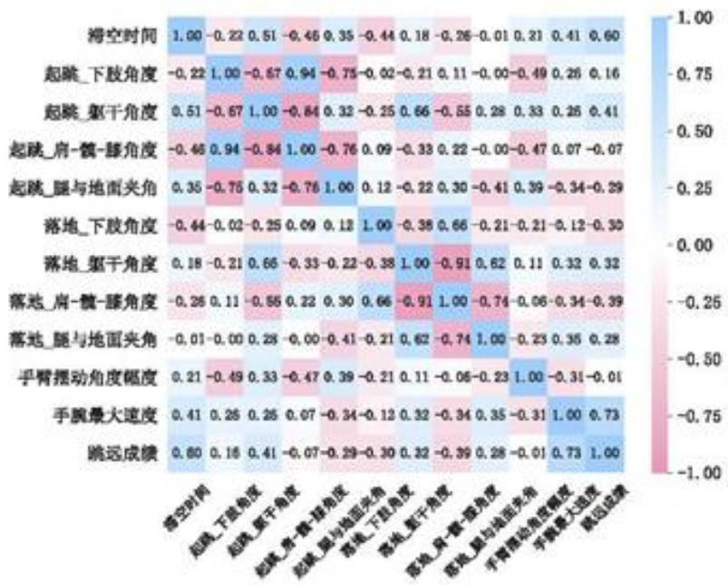

<details>
<summary>heatmap</summary>

|  | 脊空时间 | 起跳_下肢角度 | 起跳_躯干角度 | 起跳_肩-髋-膝角度 | 起跳_腿与地面夹角 | 落地_下肢角度 | 落地_躯干角度 | 落地_肩-髋-膝角度 | 落地_腿与地面夹角 | 手臂摆动角度幅度 | 手腕最大速度 | 跳远成绩 |
| --- | --- | --- | --- | --- | --- | --- | --- | --- | --- | --- | --- | --- |
| 脊空时间 | 1.00 | -0.22 | 0.51 | -0.46 | 0.35 | -0.44 | 0.18 | -0.26 | -0.01 | 0.21 | 0.41 | 0.60 |
| 起跳_下肢角度 | -0.22 | 1.00 | -0.67 | 0.94 | -0.75 | -0.02 | -0.21 | 0.11 | -0.00 | -0.49 | 0.26 | 0.16 |
| 起跳_躯干角度 | 0.51 | -0.67 | 1.00 | -0.84 | 0.32 | -0.25 | 0.66 | -0.55 | 0.28 | 0.33 | 0.26 | 0.41 |
| 起跳_肩-髋-膝角度 | -0.46 | 0.94 | -0.84 | 1.00 | -0.76 | 0.09 | -0.33 | 0.22 | -0.00 | -0.47 | 0.07 | -0.07 |
| 起跳_腿与地面夹角 | 0.35 | -0.76 | 0.32 | -0.76 | 1.00 | 0.12 | -0.22 | 0.30 | -0.41 | 0.39 | -0.34 | -0.29 |
| 落地_下肢角度 | -0.44 | -0.02 | -0.25 | 0.09 | 0.12 | 1.00 | -0.38 | 0.66 | -0.21 | -0.21 | -0.12 | -0.30 |
| 落地_躯干角度 | 0.18 | -0.21 | 0.66 | -0.33 | -0.22 | -0.38 | 1.00 | -0.91 | 0.62 | 0.11 | 0.32 | 0.32 |
| 落地_肩-髋-膝角度 | -0.26 | 0.11 | -0.56 | 0.22 | 0.30 | 0.66 | -0.91 | 1.00 | -0.74 | -0.06 | -0.34 | -0.39 |
| 落地_腿与地面夹角 | -0.01 | -0.00 | 0.28 | -0.00 | -0.41 | -0.21 | 0.62 | -0.74 | 1.00 | -0.23 | 0.35 | 0.28 |
| 手臂摆动角度幅度 | 0.21 | -0.49 | 0.33 | -0.47 | 0.39 | -0.21 | 0.11 | -0.06 | -0.23 | 1.00 | -0.31 | -0.01 |
| 手腕最大速度 | 0.41 | 0.26 | 0.26 | 0.07 | -0.34 | -0.12 | 0.32 | -0.34 | 0.35 | -0.31 | 1.00 | 0.73 |
| 跳远成绩 | 0.60 | 0.16 | 0.41 | -0.07 | -0.29 | -0.30 | 0.32 | -0.39 | 0.28 | -0.01 | 0.73 | 1, 1, 1, 1, 1, 1, 1, 1, 1, 1, 1, 1, 1, 1, 1, 1, 1, 1, 1, 1, 1, 1, 1, 1, 1, 1, 1, 1, 1, 1, 1, 1, 1, 1, |
</details>

图 16 相关性热力图

分析图 16 可知，滞空时间与跳远成绩存在较强的正相关，相关系数为 0.6。手腕的最大速度与跳远成绩同样具有显著正相关关系，相关系数为 0.73，手腕快速摆动可助力起跳瞬间爆发力，提升起跳初速度。在起跳阶段，躯干角度和腿与地面的夹角同跳远成绩间存在较强的相关关系。在落地阶段，各部位角度指标间也存在不同程度的相关性，同时与跳远成绩的相关关系呈现出复杂的分布，说明起跳时运动者在该些身体部位的角度变化具有协同性。

综上所述，认为影响运动者成绩的姿势因素主要有：起跳时刻的躯干角度、腿与地面的夹角，落地时刻的下肢角度、躯干角度、肩-髋-膝角度、腿与地面的夹角，及手腕最大速度。

## 6.2.5 进一步分析不同群体姿势因素

在实际生活中，儿童与成人的发育程度存在一定的差异，比如骨骼肌肉系统、运动控制能力等。因此人体体质的因素会影响运动者跳远的姿态，从而间接的影响跳远成绩。基于此，本文针对儿童与成人姿势的角度做进一步相关性分析，由于题目中给出儿童的样本量过少，所以对儿童数据选择剔除，随后再分析姿势角度的相关性，并与全部人群进行比较，具体结果如表10所示。

表 10 有无儿童组时各相关性系数差异情况

<table><tr><td>特征指标</td><td>排除儿童组的相关系数</td><td>包含儿童组的相关系数</td><td>变化量</td></tr><tr><td>滞空时间</td><td>0.61</td><td>0.60</td><td>0.01</td></tr><tr><td>起跳_下肢角度</td><td>0.14</td><td>0.16</td><td>-0.02</td></tr><tr><td>起跳_躯干角度</td><td>0.49</td><td>0.41</td><td>0.08</td></tr><tr><td>起跳_肩-髋-膝角度</td><td>-0.09</td><td>-0.07</td><td>-0.02</td></tr><tr><td>起跳_腿与地面夹角</td><td>-0.33</td><td>-0.29</td><td>-0.04</td></tr><tr><td>落地_下肢角度</td><td>-0.34</td><td>-0.30</td><td>-0.04</td></tr><tr><td>落地_躯干角度</td><td>0.46</td><td>0.32</td><td>0.14</td></tr><tr><td>落地_肩-髋-膝角度</td><td>-0.53</td><td>-0.39</td><td>-0.14</td></tr><tr><td>落地_腿与地面夹角</td><td>0.42</td><td>0.28</td><td>0.14</td></tr><tr><td>手臂摆动角度幅度</td><td>-0.02</td><td>-0.01</td><td>-0.01</td></tr><tr><td>手腕最大速度</td><td>0.79</td><td>0.73</td><td>0.06</td></tr></table>

对表 10 进行分析，该表分别展示了在包含与不包含儿童组的情况下，跳远成绩与姿态因素之间的相关性系数及其差异。在起跳阶段，躯干角度与跳远成绩的相关性增强了 0.08。这一结果可能源于儿童核心力量相对不足，导致其对躯干的控制能力较弱，从而在起跳过程中难以保持躯干动作的规范性，而其他姿态因素的影响相对较小。在落地阶段，躯干角度、肩-髋-膝角度以及腿与地面夹角的相关性均提升了 0.14，其中肩-髋-膝角度与成绩呈负相关，而躯干角度与腿-地面夹角则呈正相关。尤其是躯干角度的相关性进一步增强，反映出儿童在躯干控制方面的薄弱环节，说明个体体质特征对跳远姿态具有显著影响。同时，肩-髋-膝角度与腿-地面夹角在落地过程中的重要性显著提高，这可能是由于儿童在落地时难以像成人一样有效协调肩、髋、膝的联动以及腿与地面的夹角，从而导致落地动作存在一定的不规范性。

综上所述，在针对儿童的跳远训练中，应更加重视核心力量的提升与落地动作的规范化指导，从而改善对姿态的控制，并提升跳远成绩。

## 6.3 问题三：预测立定跳远运动者11的实际成绩

本文基于问题二筛选出的体质因素指标与姿势因素指标，构建了自变量集合，并以运动者11的跳远成绩(米)为因变量。分别构建了多元线性回归模型和随机森林回归模型，对运动者11的跳远成绩进行预测，并对比模型的优劣性。

## 6.3.1 随机森林预测模型建立

为了对运动者 11 的实际跳远距离进行预测，本文引入随机森林回归模型。随机森林作为一种经典的监督式集成学习算法，其核心为通过构建多颗决策树并且整合其预测结果，从而提升预测模型的准确性。以下是模型步骤。

## 1）数据准备

基于问题二中选取的 4 个体质因素和 7 个姿势因素，利用运动者 3 至运动者 10 的数据作为训练数据集，其公式为：

$$
D = \{(x _ {i}, y _ {i}) \} _ {i = 1} ^ {N} \tag {11}
$$

式中， $x_{i}\in R^{p}$ 为样本第 i 个样本的特征向量，其中，这里一共包含 11 个特征； $y_{i}\in R$ 为对应的立定跳远成绩。其中特征向量定义为：

$$
x _ {i} = \left(x _ {i, 1}, x _ {i, 2}, \dots , x _ {i, 1 1}\right) \tag {12}
$$

式中，特征向量中的定义见表11所示。

表 11 向量的定义

<table><tr><td>特征向量</td><td>定义</td><td>特征向量</td><td>定义</td></tr><tr><td> $x_{i,1}$ </td><td>起跳时躯干角度</td><td> $x_{i,2}$ </td><td>起跳时脚与地面夹角</td></tr><tr><td> $x_{i,3}$ </td><td>落地时下肢角度</td><td> $x_{i,4}$ </td><td>落地时躯干角度</td></tr><tr><td> $x_{i,5}$ </td><td>落地时肩-髋-膝角度</td><td> $x_{i,6}$ </td><td>落地时腿与地面夹角</td></tr><tr><td> $x_{i,7}$ </td><td>手腕最大速度</td><td> $x_{i,8}$ </td><td>肌肉重量</td></tr><tr><td> $x_{i,9}$ </td><td>体重</td><td> $x_{i,10}$ </td><td>去脂体重</td></tr><tr><td> $x_{i,11}$ </td><td>身高</td><td>/</td><td>/</td></tr></table>

## 2）随机森林回归模型

随机森林回归器是由多颗回归树组成的集成模型，其表达式为：

$$
\hat {f} (x) = \frac {1}{T} \sum_ {i = 1} ^ {T} h _ {i} (x) \tag {13}
$$

式中，T 为回归树的数量为 500； $h_{2}(x)$ 为每棵树，其是在随机抽取的训练样本子集，即 bootstrap 采样，以及特征子集上训练的 CART 回归树。

每棵树的叶节点输出是对应样本的均值，其计算公式为：

$$
h _ {i} (x) = \frac {1}{| R _ {i} (x) |} \sum_ {x _ {i} \in R _ {i} (x)} y _ {i} \tag {14}
$$

式中， $R_{t}(x)$ 表示为样本 x 在第 t 颗树种落到的叶节点。

## 6.3.2 多元线性回归预测模型建立

首先，本文先对自变量进行 Z-score 标准化处理，消除了不同量纲的影响，计算公式如下：

$$
x _ {i} ^ {\prime} = \frac {x _ {i} - \mu}{\sigma} \tag {15}
$$

式中， $x_{i}$ 为原始变量值； $\mu$ 为变量的均值； $\sigma$ 为变量的标准差； $x_{i}^{\prime}$ 为标准化后的变量值。

随后，设因变量为 $y$ 即跳远成绩，自变量为 $\{x_{1}, x_{2}, x_{3} \dots x_{j}\}$ ，则多元线性回归模型为：

$$
y _ {i} = \beta_ {0} + \beta_ {1} x _ {i 1} + \beta_ {2} x _ {i 2} + \beta_ {3} x _ {i 3} + \dots + \beta_ {j} x _ {i j} + \varepsilon_ {i} \tag {16}
$$

式中， $y_{i}$ 为第 i 个样本的因变量即成绩， $\beta_{0}$ 为截距项， $\beta_{j}$ 为 j 个自变量的回归系数， $\varepsilon_{i}$ 为误差项。对这个模型回归系数采用最小二乘拟合估计，公式如下：

$$
\hat {\beta} = (X ^ {T} X) ^ {- 1} X ^ {T} y \tag {17}
$$

为便于比较变量影响力，本文进行相对贡献度分析，计算公式如下：

$$
C _ {i} = \frac {\left| \beta_ {i} \right|}{\sum_ {j = 1} ^ {n} \left| \beta_ {j} \right|} \tag {18}
$$

式中， $C_i$ 为第 $i$ 个指标对成绩的相对贡献。

结合上述公式，计算出每个参数以及相对贡献度，结果如表12所示。

表 12 每个参数和相应的贡献度

<table><tr><td>指标</td><td>标准化回归系数(β)</td><td>相对贡献度</td></tr><tr><td>去脂体重</td><td>0.456198</td><td>0.332137</td></tr><tr><td>肌肉重量</td><td>0.153955</td><td>0.112087</td></tr><tr><td>落地_躯干角度(°)</td><td>0.090779</td><td>0.066092</td></tr><tr><td>手腕最大速度(px/s)</td><td>0.081758</td><td>0.059524</td></tr><tr><td>落地_肩-髋-膝角度(°)</td><td>0.079835</td><td>0.058124</td></tr><tr><td>落地_腿与地面夹角(°)</td><td>0.051393</td><td>0.037417</td></tr><tr><td>起跳_腿与地面夹角(°)</td><td>0.00796</td><td>0.005795</td></tr><tr><td>起跳_躯干角度(°)</td><td>0.004199</td><td>0.003057</td></tr><tr><td>落地_下肢角度(°)</td><td>-0.04773</td><td>0.03475</td></tr><tr><td>身高</td><td>-0.080745</td><td>0.058787</td></tr><tr><td>体重</td><td>-0.318973</td><td>0.23223</td></tr></table>

观察表 12 可以发现，去脂体重的系数为 0.456，贡献度为 33.2%，说明去脂体质越高，跳远成绩越好，体现了肌肉、骨骼等非脂肪组织在运动中的核心作用。体重的系数为 -0.319，贡献度为 23.2%，这说明体重的增加不利于成绩的上升，与去脂体重形成了鲜明的对比。肌肉与成绩成正向影响，说明肌肉重量越高，成绩越好。而动作角度的贡献度相对较低，但对成绩有一定的影响。

## 6.3.3 基于比例尺对预测结果分析

在模型构建过程中，为了探究不同年龄群体对预测结果的影响，本文在自变量不变的前提下，对训练数据进行了筛选，去除了未成年样本，仅保留成年运动者的数据来训练模型。随后，将6岁儿童运动者11的相关指标输入模型，观察其预测结果。

同时，考虑到摄像头拍摄过程中位置保持固定，因此比例尺的波动较小，因此可使用第一问中计算得到的比例尺0.334cm/px，可以大致推算出运动者11的跳远成绩。首先，计算出运动者11起跳点到落地点之间的像素距离，其次，将该像素距离乘以比例尺，转换单位为米。经过计算可得，运动者11的跳远成绩可近似为1.079米。结果如表13所示。

表 13 两种模型的预测结果表

<table><tr><td>模型</td><td>不包含儿童预测成绩</td><td>预测成绩</td><td>实际成绩</td><td>误差</td></tr><tr><td>多元线性</td><td>1.42 米</td><td>1.077 米</td><td>1.079 米</td><td>0.002 米</td></tr><tr><td>随机森林</td><td>1.392 米</td><td>1.392 米</td><td>1.079 米</td><td>0.327 米</td></tr></table>

观察表 13 可知，包含儿童数据训练的多元线性回归模型能非常准确地预测儿童成绩。去掉儿童样本训练后，无论多元线性回归还是随机森林，预测都明显高于实际成绩，说明儿童身体特征与成年人的差异对模型外推影响较大。综上所述，多元线性回归预测较为准确，而随机森林虽然能捕捉复杂关系，但在小样本中的表现不如线性模型稳定。

## 6.4 问题四：运动者11训练建议与目标

## (1) 跳跃阶段角度趋势

为了探究其跳远姿势，本文绘制了起跳点到落地点角度的变换过程，结果如图 17 所示。

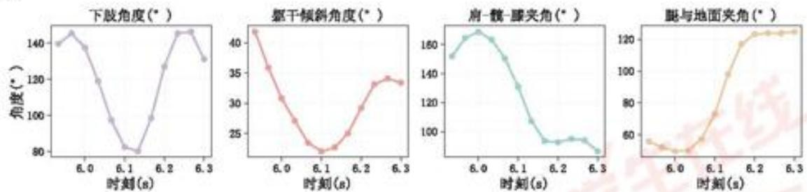  
图 17 跳跃阶段四个角度的变化趋势

如图 17 所示，起跳时刻的下肢角度已经完全接近伸展接近直腿，说明发力充分，在腾空阶段一很明显的收腿动作。起跳时躯干倾斜角度有大前倾，可能会造成起跳后身体“压低”，影响腾空。肩-髋-膝的角度为 $150^{\circ}$ ，接近伸直，说明上身和下肢配合较好。起跳时腿与地面夹角较小，导致腾空高度和距离不足。落地时的腿与地面夹角为 $125^{\circ}$ ，说明前腿伸展充分，但是如果收腿不及时，就会导致落地过早接触地面或者落地后身体

后仰。

## (2) 姿势训练建议

本文考虑了个体差异，特别是年龄因素的影响，因此选取了年龄相近且经过调整训练后的运动者9作为参照对象，对其训练后的数据取平均值。通过对比二者在起跳与落地阶段的关键角度指标，结果如表14所示。

表 14 运动者 9 和 11 关键角数值对比情况

<table><tr><td>指标</td><td>运动者11</td><td>运动者9</td><td>指标</td><td>运动者11</td><td>运动者9</td></tr><tr><td>起跳下肢角度</td><td>139.74</td><td>128.66</td><td>落地下肢角度</td><td>131.24</td><td>113.74</td></tr><tr><td>起跳肩-髋-膝角度</td><td>151.88</td><td>136.29</td><td>落地肩-髋-膝角度</td><td>86.45</td><td>36.19</td></tr><tr><td>起跳躯干角度</td><td>41.82</td><td>53.32</td><td>落地躯干角度</td><td>33.42</td><td>61.26</td></tr><tr><td>起跳腿与地面夹角</td><td>55.84</td><td>54.26</td><td>落地腿与地面夹角</td><td>124.74</td><td>143.1</td></tr></table>

观察表 14 可知，运动者 11 在起跳时下肢角度偏大，膝关节屈曲不足，导致下肢伸展爆发力被限制；同时，起跳时躯干前倾角度偏小，起跳过程中髋部发力与躯干摆动不能协同。在落地时刻，运动者 11 的下肢角度和肩-髋-膝角度均偏大，说明腾空后期身体控制与收腹不足。

## (3) 短期训练后理想成绩

若运动者 11 按照上述姿势训练的情况下，关键角度指标向运动者 9 的调整后水平靠近。其跳远成绩的预测结果为 1.201 米。这表明，通过短期的姿势调整训练，运动者 11 可以突破原有水平。

## 七、模型的评价与推广

## 7.1 模型的优点

1. 在对滞空阶段的分析中，本文引入多个特征指标进行综合描述，从而突破单一指标的局限性，更全面地反映了运动过程的本质特征。  
2. 本文所建立的起跳点与落地点识别模型能够实现对图像数据的自动化判别, 较好地体现出模型的普适性。  
3. 在探究影响跳远成绩因素时，考虑了不同人群在姿态因素上的差异，更加贴近生活实际，具有实际应用价值。

## 7.2 模型的缺点

1. 在确定起跳与落点时刻，某些跳远过程中出现了特殊情况，导致无法正常识别到突变点。  
2. 对运动者的调整角度考虑不够全面。

## 7.3 模型的推广

本文建立的基于一阶微分识别起跳与落地时刻的模型，可以推广到其他涉及人体周期性或瞬态运动的领域，比如跑跳类项目、步态分析、跌倒检测及康复训练评估等场景。

## 参考文献

[1]. 教育部. 国家学生体质健康标准[S]. 北京: 高等教育出版社, 2025.  
[2]. 图行天下. 跳远连续动作剪影图片 [EO/OL]. 2020-10-13.[2025-09-05]. https://imgb15.photophoto.cn/20201111/tiaoyuanlianxudongzuojianyingtupian-39667602\_3.jpg.  
[3]. 周海宪, 程云芳. 航空光学工程[M].: 202311..  
[4]. 朱红运, 王长龙, 王建斌, 等. 基于奇异值分解和 Savitzky-Golay 滤波器的信号降噪方法 [J]. 计算机应用, 2015, 35(10): 3004-3007+3012.  
[5]. 梁万宗. 立定跳远的动作技术分析及教学探究[J]. 河南教育(基教版)(上), 2025(6):84-85.  
[6]. Python 在导数与微分应用中的数值计算和可视化研究[J]. 淮南职业技术学院学报, 2024, 24(06): 142-145.  
[7]. 祁云嵩, 谢军. 基于 spearman 秩相关的序值决策系统约简 [J]. 计算机应用, 2009, 29(7): 1758-17591763.  
[8]. 冯大光, 冯思哲, 李兆星, 毛丽珍. 基于多元线性回归模型的日光温室温度预测方法对比 [J]. 沈阳师范大学学报 (自然科学版), 2025, 43(1): 75-81.  
[9]. DeepSeek, DeepSeek-R1-0528, 深度求索 (DeepSeek), 2025-09-05

## 附录

附录索引

<table><tr><td>序号</td><td>说明</td></tr><tr><td>附录 1</td><td>支撑材料文件列表</td></tr><tr><td>附录 2</td><td>问题一代码</td></tr><tr><td>附录 3</td><td>问题二代码</td></tr></table>

附录1支撑材料列表

<table><tr><td>文件</td><td>说明</td></tr><tr><td>code</td><td>代码[9]</td></tr><tr><td>data</td><td>数据</td></tr><tr><td>image</td><td>图</td></tr><tr><td>readme</td><td>说明</td></tr></table>

<table><tr><td colspan="2">附录2</td></tr><tr><td>软件 Python</td><td>问题1微分数值识别起跳和落地时刻</td></tr><tr><td colspan="2">#%% md导入模块与数据#%%import matplotlib.pyplot as pltimport pandas as pdimport numpy as npfrom scipy.signal import savgol_filter# 读取Excel文件# df = pd.read_excel(&#x27;../data/附件/附件1/运动者1的跳远位置信息.xlsx&#x27;)# df = pd.read_excel(&#x27;../data/附件/附件1/运动者2的跳远位置信息.xlsx&#x27;)df = pd.read_excel(&#x27;../data/附件/附件3/姿势调整前/运动者6第2次的跳远位置信息.xlsx&#x27;)# df = pd.read_excel(&#x27;../data/附件/附件3/姿势调整后/运动者6调整后第2次的跳远位置信息.xlsx&#x27;)#%% md数据处理#%%fps = 30 # 视频帧率# 时间戳df[&quot;time&quot;] = df.index/fps# 对所有关键点的X、Y做补齐和平滑for col in df.columns:if col.endswith(&quot;_X&quot;) or col.endswith(&quot;_Y&quot;):# 先把0替换为NaNdf[col] = df[col].replace(0, np.nan)</td></tr></table>

```python
# 用插值填补缺失前后方向都补
df[col] = df[col].interpolate(method='linear', limit_direction='both')
# 做 Savitzky-Golay 平滑
df[col] = savgol_filter(df[col], window_length=7, polyorder=2)
df["foot_Y_smooth"] = (df['31_Y'] + df['32_Y'] + df['30_Y'] + df['29_Y'])/4  # 双脚四个点平均
#%% md
数值微分识别起跳点以及落地点
#%%
df["foot_v_smooth"] = np.gradient(df["foot_Y_smooth"], df["time"])
# 脚掌第一次快速上升，速度负向突变，就是起跳
takeoff_candidates = df.index[df["foot_v_smooth"] <-150]
jump_start = takeoff_candidates[0] if len(takeoff_candidates) > 0 else df.index[0]
t_takeoff = df.loc[jump_start, "time"]
# 脚掌最后一次快速下降，速度正向突变，就是落地
# 把寻找落地时间控制在，起跳后 1.5 秒内
landing_candidates = df.index[
    (df["foot_v_smooth"] > 150) &
    (df["time"] >= t_takeoff) &
    (df["time"] <= t_takeoff + 1)
]
jump_end = landing_candidates[-1] if len(landing_candidates) > 0 else df.index[-1]
t_landing = df.loc[jump_end, "time"]
t_flight = t_landing - t_takeoff
features = {
    "起跳帧号": jump_start,
    "落地帧号": jump_end,
    "起跳时间(s)": t_takeoff,
    "落地时间(s)": t_landing,
    "滞空时间(s)": t_flight
}
result = pd.DataFrame([features])
result
#%% md
比例尺计算
#%%
df["foot_X_smooth"] = (df['31_X'] + df['32_X'] + df['30_X'] + df['29_X']) /4  # 双脚平均
# 运动者 1 成绩
real_distance = 1.58
# 运动者 2 成绩
# real_distance = 1.15
# 对应的水平像素差
pixel_distance = df.loc[jump_end, "foot_X_smooth"] - df.loc[jump_start,
"foot_X_smooth"]  # 腿部 X 坐标差
```

```python
# 比例尺，1 像素对应多少米
scale = real_distance / pixel_distance
print(f'起跳时刻水平像素值:{df.loc[jump_start, "foot_X_smooth"]} px')
print(f'落地时刻水平像素值:{df.loc[jump_end, "foot_X_smooth"]} px')
print(f"比例尺:{scale:.5f} m/px")
#%% md
数值微分可视化对比图
#%%
t_start = max(0, t_takeoff-0.5)
t_end = t_landing+0.5
df_clip = df[(df["time"]] >= t_start)&(df["time"] <= t_end)].copy()
plt.rcParams['font.sans-serif'] = ['SimSun']
plt.rcParams['axes.unicode_minus'] = False
fig, axes = plt.subplots(2, 1, figsize=(6, 3), dpi=300, sharex=True)
# 脚掌轨迹
ax1 = axes[0]
# 绘制滤波后的轨迹
ax1.plot(df_clip["time"], 720 - df_clip["foot_Y_smooth"], label="脚掌轨迹(滤波后)",
color="#407bd0", linewidth=1.2)
ax1.scatter(t_takeoff, 720 - df.loc[jump_start, "foot_Y_smooth"], color="green", s=20,
label="起跳时间")
ax1.scatter(t_landing, 720 - df.loc[jump_end, "foot_Y_smooth"], color="red", s=20,
label="落地时间")
ax1.set_ylabel("高度(px)", fontsize=12)
ax1.grid(True, linestyle=':', alpha=0.5)
for spine in ax1.spines.values():
    spine.set_color('black')
    spine.set_linewidth(0.6)
ax1.tick_params(left=True, axis='both', direction='out', length=4, width=0.8, color='k',
labelsize=9)
# 脚掌速度
ax2 = axes[1]
ax2.plot(df_clip["time"], df_clip["foot_v_smooth"],
        label="脚掌速度(微分)", color="purple", linewidth=1.2)
ax2.scatter(t_takeoff, df_clip.loc[jump_start, "foot_v_smooth"], color="green", s=20)
ax2.scatter(t_landing, df_clip.loc[jump_end, "foot_v_smooth"], color="red", s=20)
ax2.set_xlabel("时间(s)", fontsize=12)
ax2.set_ylabel("速度(px/s)", fontsize=12)
ax2.grid(True, linestyle=':', alpha=0.5)
for spine in ax2.spines.values():
    spine.set_color('black')
    spine.set_linewidth(0.6)
ax2.tick_params(bottom=True, left=True, right=False, top=False, axis='both',
direction='out', length=4, width=0.8, color='k', labelsize=9)
# 把两个子图的句柄和标签合并
handles1, labels1 = ax1.get_legend_handles_labels()
```

```python
handles2, labels2 = ax2.get_legend_handles_labels()
ax1.legend(handles1 + handles2, labels1 + labels2,
    loc="upper center", bbox_to_anchor=(0.488, 1.5),
    ncol=4, fontsize=10, frameon=False, handletextpad=0.1, columnspacing=0.8)
ax1.margins(x=0, y=0.2)
ax2.margins(x=0, y = 0.5)
plt.tight_layout()
# plt.savefig('./image/起跳与落地时刻微分示意图.svg', bbox_inches='tight', dpi=800,
transparent=True)
plt.show()
#%% md
关键角度计算
#%%
# 角度计算函数
def angle(p1, p2, p3):
    v1 = np.array([p1[0] - p2[0], p1[1] - p2[1]])
    v2 = np.array([p3[0] - p2[0], p3[1] - p2[1]])
    cos_theta = np.dot(v1, v2) / (np.linalg.norm(v1) * np.linalg.norm(v2) + 1e-6)
    return np.degrees(np.arccos(np.clip(cos_theta, -1.0, 1.0)))
# 手臂角度合并计算
rightAngles = []
for i in range(len(df)):
    p1 = (df.loc[i, "11_X"], df.loc[i, "11_Y"]) # 肩
    p2 = (df.loc[i, "13_X"], df.loc[i, "13_Y"]) # 肘
    p3 = (df.loc[i, "15_X"], df.loc[i, "15_Y"]) # 腕
    rightAngles.append(angle(p1, p2, p3))
df["右臂角度"] = rightAngles
leftAngles = []
for i in range(len(df)):
    p1 = (df.loc[i, "12_X"], df.loc[i, "12_Y"]) # 肩
    p2 = (df.loc[i, "14_X"], df.loc[i, "14_Y"]) # 肘
    p3 = (df.loc[i, "16_X"], df.loc[i, "16_Y"]) # 腕
    leftAngles.append(angle(p1, p2, p3))
df["左臂角度"] = leftAngles
# 先合并，逐帧取平均
df["手臂角度"] = (df["左臂角度"] + df["右臂角度"]) / 2
# 计算幅度
arm_angle_range = df["手臂角度"].max() - df["手臂角度"].min()
# 手腕速度合并计算
fps = 30
# 右手腕速度
df["右手腕_vx"] = df["15_X"].diff() * fps
df["右手腕_vy"] = df["15_Y"].diff() * fps
df["右手腕速度"] = np.sqrt(df["右手腕_vx"]**2 + df["右手腕_vy"]**2)
# 左手腕速度
```

```python
df["左手腕_vx"] = df["16_X"].diff() * fps
df["左手腕_vy"] = df["16_Y"].diff() * fps
df["左手腕速度"] = np.sqrt(df["左手腕_vx"]**2 + df["左手腕_vy"]**2)
# 先合并逐帧取平均
df["手腕速度"] = (df["左手腕速度"] + df["右手腕速度"]) / 2
# 计算最大值
max_wrist_speed = df["手腕速度"].max()
result = pd.DataFrame([\{
    "手臂摆动角度幅度(° )": arm_angle_range,
    "手腕最大速度(px/s)": max_wrist_speed
}])
result
#%%#
# 工具函数
def get_point(frame, idx):
    return (frame[f"{idx}_X"], frame[f"{idx}_Y"])
# 躯干角度肩-髋与地面竖直夹角
def trunk_angle(frame):
    hip_x = (frame["23_X"] + frame["24_X"]) / 2
    hip_y = (frame["23_Y"] + frame["24_Y"]) / 2
    shoulder_x = (frame["11_X"] + frame["12_X"]) / 2
    shoulder_y = (frame["11_Y"] + frame["12_Y"]) / 2
    v = np.array([shoulder_x - hip_x, shoulder_y - hip_y])
    vertical = np.array([0, -1])
    cos_theta = np.dot(v, vertical) / (np.linalg.norm(v) * np.linalg.norm(vertical) + 1e-6)
    return np.degrees(np.arccos(np.clip(cos_theta, -1.0, 1.0)))
# 整条腿与地面的夹角（合并左右点后）
def avg_leg_angle_with_ground(frame):
    hip = np.array([(frame["23_X"] + frame["24_X"]) / 2,
        (frame["23_Y"] + frame["24_Y"]) / 2])
    ankle = np.array([(frame["27_X"] + frame["28_X"]) / 2,
        (frame["27_Y"] + frame["28_Y"]) / 2])
    leg_vec = ankle - hip
    ground_vec = np.array([1, 0])
    cos_theta = np.dot(leg_vec, ground_vec) / (np.linalg.norm(leg_vec) *
np.linalg.norm(ground_vec) + 1e-6)
    return np.degrees(np.arccos(np.clip(cos_theta, -1.0, 1.0)))
# 构建逐时刻角度表
rows = []
for idx, row in df.loc[jump_start:jump_end].iterrows():
    time_s = idx / fps
    # 合并左右髋、膝、踝分别取平均
    hip = ((row["23_X"] + row["24_X"]) / 2, (row["23_Y"] + row["24_Y"]) / 2)
    knee = ((row["25_X"] + row["26_X"]) / 2, (row["25_Y"] + row["26_Y"]) / 2)
    ankle = ((row["27_X"] + row["28_X"]) / 2, (row["27_Y"] + row["28_Y"]) / 2)
    # 下肢角度髋-膝-踝
```

```python
lower_angle = angle(hip, knee, ankle)
# 躯干角度（平均肩/髋）
trunk = trunk_angle(row)
# 肩-髋-膝角度（左右取平均点）
shoulder = ((row["11_X"] + row["12_X"]) / 2, (row["11_Y"] + row["12_Y"]) / 2)
shk = angle(shoulder, hip, knee)
# 整条腿与地面夹角（左右合并）
leg_ground = 180 - avg_leg_angle_with_ground(row)
rows.append({
    "帧号": idx,
    "时间(s)": time_s,
    "下肢角度": lower_angle,
    "躯干倾斜角度": trunk,
    "肩-髋-膝夹角": shk,
    "腿与地面夹角": leg_ground,
})
# 输出 DataFrame
angle_df = pd.DataFrame(rows).set_index("时间(s)")
# angle_df.to_excel('./data/运动者 1 的关键角度.xlsx')
angle_df
#%% 
import matplotlib.pyplot as plt
import matplotlib.ticker as ticker
# 绘制关键角度曲线
fig, axes = plt.subplots(1, 4, figsize=(12, 3), sharex=True, dpi = 300)
plt.rcParams['font.sans-serif'] = ['SimSun']
plt.rcParams['axes.unicode_minus'] = False
# 子图 1: 下肢角度
axes[0].plot(angle_df.index, angle_df["下肢角度"], label="下肢角度", color="#c6b3d3", marker='o')
axes[0].set_title("下肢角度(°) ", fontsize=15)
axes[0].set_ylabel("角度(°) ", fontsize=15)
axes[0].grid(True)
# 子图 2: 躯干倾斜角度
axes[1].plot(angle_df.index, angle_df["躯干倾斜角度"], label="躯干倾斜角度", color="#ed9f9b", marker='o')
axes[1].set_title("躯干倾斜角度(°) ", fontsize=15)
axes[1].grid(True)
# 子图 3: 肩-髋-膝夹角
axes[2].plot(angle_df.index, angle_df["肩-髋-膝夹角"], label="肩-髋-膝夹角", color="#9cd1cb", marker='o')
axes[2].set_title("肩-髋-膝夹角(°) ", fontsize=15)
axes[2].grid(True)
# 子图 4: 腿与地面夹角
axes[3].plot(angle_df.index, angle_df["腿与地面夹角"], label="腿与地面夹角",
```

```python
color="#eec79f", marker='o')
axes[3].set_title("腿与地面夹角(°)", fontsize=15)
axes[3].grid(True)
for ax in axes:
    ax.tick_params(bottom=True, left=True, right=False, top=False,
                    axis='both', direction='out', length=4,
                    width=0.8, color='k', labelsize=12)
    for spine in ax.spines.values():
        spine.set_color('black')
        spine.set_linewidth(0.6)
    ax.set_xticks(np.arange(4.8,5.2,0.1))
    ax.grid(True, linestyle=':', alpha=0.3)
    ax.set_xlabel("时刻(s)", fontsize=15)
    ax.margins(x=0.05, y=0.05)
plt.tight_layout()
# plt.savefig("../image/运动者 1_关键角度变化.svg", bbox_inches='tight', dpi=800,
transparent=True)
plt.savefig("../image/姿势调整前运动者 6 第二次_关键角度变化.svg",
bbox_inches='tight', dpi=800, transparent=True)
plt.show()
```

<table><tr><td colspan="2">附录3</td></tr><tr><td>软件Python</td><td>问题2姿势调整前后因素分析</td></tr><tr><td colspan="2">#%%import pandas as pdimport numpy as npfrom scipy.signal import savgol_filterimport glob, osfps = 30 # 视频帧率# 真实成绩数据before = {&quot;运动者3&quot;: [1.33, 1.40, 1.32, 1.36, 1.39],&quot;运动者4&quot;: [1.80],&quot;运动者5&quot;: [2.05, 2.05],&quot;运动者6&quot;: [1.15, 1.15],&quot;运动者7&quot;: [1.82, 1.90.&quot;运动者8&quot;: [1.45, 1.47],&quot;运动者9&quot;: [1.45.&quot;&quot;运动者10&quot;: [1.50, 1.52]}after = {&quot;运动者3&quot;: [1.58, 1.40],&quot;运动者4&quot;: [1.95, 1.97},&quot;运动者5&quot;: [2.15, 2.16,</td></tr></table>

```python
"运动者 6": [1.28, 1.35],
"运动者 7": [2.05, 2.05],
"运动者 8": [1.50],
"运动者 9": [1.53, 1.45],
"运动者 10": [1.62, 1.60]
}
# 辅助函数
def angle(p1, p2, p3):
    v1 = np.array([p1[0] - p2[0], p1[1] - p2[1]])
    v2 = np.array([p3[0] - p2[0], p3[1] - p2[1]])
    cos_theta = np.dot(v1, v2) / (np.linalg.norm(v1) * np.linalg.norm(v2) + 1e-6)
    return np.degrees(np.arccos(np.clip(cos_theta, -1.0, 1.0)))
def trunk_angle(frame):
    hip_x = (frame["23_X"] + frame["24_X"]) / 2
    hip_y = (frame["23_Y"] + frame["24_Y"]) / 2
    shoulder_x = (frame["11_X"] + frame["12_X"]) / 2
    shoulder_y = (frame["11_Y"] + frame["12_Y"]) / 2
    v = np.array([shoulder_x - hip_x, shoulder_y - hip_y])
    vertical = np.array([0, -1])
    cos_theta = np.dot(v, vertical) / (np.linalg.norm(v) * np.linalg.norm(vertical) + 1e-6)
    return np.degrees(np.arccos(np.clip(cos_theta, -1.0, 1.0)))
def avg_leg_angle_with_ground(frame):
    hip = np.array([(frame["23_X"] + frame["24_X"]) / 2,
        (frame["23_Y"] + frame["24_Y"]) / 2])
    ankle = np.array([(frame["27_X"] + frame["28_X"]) / 2,
        (frame["27_Y"] + frame["28_Y"]) / 2])
    leg_vec = ankle - hip
    ground_vec = np.array([1, 0])
    cos_theta = np.dot(leg_vec, ground_vec) / (np.linalg.norm(leg_vec) *
np.linalg.norm(ground_vec) + 1e-6)
    return np.degrees(np.arccos(np.clip(cos_theta, -1.0, 1.0)))
# 主处理函数
def process_files(file_list, mode):
    all_results = []
    for file in sorted(file_list):
        df = pd.read_excel(file)
        df["time"] = df.index / fps
        # 数据预处理
        for col in df.columns:
            if col.endswith("_X") or col.endswith("_Y"):
                df[col] = df[col].replace(0, np.nan).interpolate(method='linear',
limit_direction='both')
                df[col] = savgol_filter(df[col], window_length=7, polyorder=2)
        # 脚掌运动信息
        df["foot_Y_smooth"] = (df['29_Y'] + df['30_Y'] + df['31_Y'] + df['32_Y']) / 4
        df["foot_X_smooth"] = (df['29_X'] + df['30_X'] + df['31_X'] + df['32_X']) / 4
```

```python
df["foot_v_smooth"] = np.gradient(df["foot_Y_smooth"], df["time"])
# 起跳检测
takeoff_candidates = df.index[df["foot_v_smooth"] <-150]
jump_start = takeoff_candidates[0] if len(takeoff_candidates) > 0 else df.index[0]
t_takeoff = df.loc[jump_start, "time"]
# 落地检测（起跳后 1s 内）
landing_candidates = df.index[
    (df["foot_v_smooth"] > 150) &
    (df["time"] >= t_takeoff) &
    (df["time"] <= t_takeoff + 1)
]
jump_end = landing_candidates[-1] if len(landing_candidates) > 0 else df.index[-1]
t_landing = df.loc[jump_end, "time"]
t_flight = t_landing - t_takeoff
# 手臂角度幅度
rightAngles, leftAngles = [], []
for i in range(len(df)):
    rightAngles.append(angle((df.loc[i, "11_X"], df.loc[i, "11_Y"),
                    (df.loc[i, "13_X"], df.loc[i, "13_Y"),
                    (df.loc[i, "15_X"], df.loc[i, "15_Y"])))
    leftAngles.append(angle((df.loc[i, "12_X"], df.loc[i, "12_Y"),
                    (df.loc[i, "14_X"], df.loc[i, "14_Y"),
                    (df.loc[i, "16_X"], df.loc[i, "16_Y"])))
df["手臂角度"] = (np.array(leftAngles) + np.array(rightAngles)) / 2
arm_angle_range = df["手臂角度"].max() - df["手臂角度"].min()
# 手腕最大速度
for wrist in [("15", "右"), ("16", "左")]:
    df[f"{wrist[1]}手腕_vx"] = df[f"{wrist[0]}_X".diff() * fps
    df[f"{wrist[1]}手腕_vy"] = df[f"{wrist[0]}_Y".diff() * fps
    df[f"{wrist[1]}手腕速度"] = np.sqrt(df[f"{wrist[1]}手腕_vx"]**2 + df[f"{wrist[1]}手腕_vy"]**2)
    df["手腕速度"] = (df["左手腕速度"] + df["右手腕速度"]) / 2
    max_wrist_speed = df["手腕速度"].max()
# 起跳落地帧角度
row_takeoff, row_landing = df.loc[jump_start], df.loc[jump_end]
hip_to = ((row_takeoff["23_X"] + row_takeoff["24_X")) / 2,
(row_takeoff["23_Y"] + row_takeoff["24_Y")) / 2)
    knee_to = ((row_takeoff["25_X"] + row_takeoff["26_X")) / 2,
(row_takeoff["25_Y"] + row_takeoff["26_Y")) / 2)
    ankle_to = ((row_takeoff["27_X"] + row_takeoff["28_X")) / 2,
(row_takeoff["27_Y"] + row_takeoff["28_Y")) / 2)
    shoulder_to = ((row_takeoff["11_X"] + row_takeoff["12_X")) / 2,
(row_takeoff["11_Y"] + row_takeoff["12_Y")) / 2)
    hip_ld = ((row_landing["23_X"] + row_landing["24_X")) / 2,
(row_landing["23_Y"] + row_landing["24_Y")) / 2)
```

```python
knee_ld = ((row_landing["25_X"] + row_landing["26_X"]) / 2,
(row_landing["25_Y"] + row_landing["26_Y"]) / 2)
ankle_ld = ((row_landing["27_X"] + row_landing["28_X"]) / 2,
(row_landing["27_Y"] + row_landing["28_Y"]) / 2)
shoulder_ld = ((row_landing["11_X"] + row_landing["12_X"]) / 2,
(row_landing["11_Y"] + row_landing["12_Y"]) / 2)
lower_angle_takeoff = angle(hip_to, knee_to, ankle_to)
trunk_takeoff = trunk_angle(row_takeoff)
shk_takeoff = angle(shoulder_to, hip_to, knee_to)
leg_ground_takeoff = 180 - avg_leg_angle_with_ground(row_takeoff)
lower_angle_landing = angle(hip_ld, knee_ld, ankle_ld)
trunk_landing = trunk_angle(row_landing)
shk_landing = angle(shoulder_ld, hip_ld, knee_ld)
leg_ground_landing = 180 - avg_leg_angle_with_ground(row_landing)
# 运动员编号
fname = os.path.basename(file)
athlete = [k for k in after.keys() if k in fname or k.replace("运动者", "") in
fname][0]
# 对应真实成绩
if mode == "调整前":
idx = len([f for f in file_list if athlete in f and "调整前" in f and f <= file]) -
1
real_distance = before[athlete][idx]
else:
idx = len([f for f in file_list if athlete in f and "调整后" in f and f <= file]) -
1
real_distance = after[athlete][idx]

pixel_distance = df.loc[jump_end, "foot_X_smooth"] - df.loc[jump_start,
"foot_X_smooth"]
scale = real_distance / pixel_distance
# 保存一条结果
all_results.append({
"文件名": fname,
"姓名": athlete,
"阶段": mode,
"起跳时刻(s)": t_takeoff,
"落地时刻(s)": t_landing,
"滞空时间(s)": t_flight,
"起跳_下肢角度(°)": lower_angle_takeoff,
"起跳_肩-髋-膝角度(°)": shk_takeoff,
"起跳_躯干角度(°)": trunk_takeoff,
"起跳_腿与地面夹角(°)": leg_ground_takeoff,
"落地_下肢角度(°)": lower_angle_landing,
"落地_肩-髋-膝角度(°)": shk_landing,
```

```python
"落地_躯干角度(°)": trunk_landing,
"落地_腿与地面夹角(°)": leg_ground_landing,
"手臂摆动角度幅度(°)": arm_angle_range,
"手腕最大速度(px/s)": max_wrist_speed,
"水平移动距离(px)": pixel_distance,
"跳远成绩(m)": real_distance,
"比例尺(m/px)": scale
})
return all_results
# 运行
before_files = glob.glob("../data/附件/附件 3/姿势调整前/*.xlsx")
after_files = glob.glob("../data/附件/附件 3/姿势调整后/*.xlsx")
results_before = process_files(before_files, "调整前")
results_after = process_files(after_files, "调整后")
# 合并保存
all_results = pd.DataFrame(results_before + results_after)
all_results.to_excel("../data/姿势调整前后_关键角度结果.xlsx", index=False)
single_file = PressureDataFile / 附件 5/运动者 11 的跳远位置信息.xlsx'
before["运动者 11"] = [np.nan]
after["运动者 11"] = [np.nan]
results_single = process_files(single_file, "调整前")
df_single = pd.DataFrame(results_single)
# 保存成 Excel
df_single.to_excel("../data/运动者 11_关键角度结果.xlsx", index=False)
# % md
计算提升度
# % % 
# 计算最好成绩和提升百分比
results = []
for athlete in before:
    best_before = max(before[athlete])
    best_after = max(after[athlete])
    improvement_abs = best_after - best_before # 绝对提升值
    improvement_pct = (improvement_abs / best_before) * 100 # 相对提升百分比
    results.append([athlete, best_before, best_after, improvement_abs, improvement_pct])
# 保存为 DataFrame
df = pd.DataFrame(results, columns=["运动者", "调整前最好成绩(米)", "调整后最好成绩(米)", "提升(米)", "提升度(%"])
# 格式化输出，保留两位小数
df["提升度(%)] = df["提升度(%)].round(2)
print(df)
# % md
相关性分析
# % %
```

```python
import pandas as pd
import seaborn as sns
import matplotlib.pyplot as plt
import numpy as np
from matplotlib.colors import LinearSegmentedColormap
from scipy.stats import spearmanr
plt.rcParams['font.sans-serif'] = ['SimSun']  # 设置中文显示
plt.rcParams['axes.unicode_minus'] = False
# 读取数据
df = pd.read_excel('./data/姿势调整前后_关键角度结果.xlsx')
# df = pd.read_excel('./data/姿势调整前后_关键角度结果.xlsx', sheet_name='剔除儿童数据')
# df = pd.read_excel('./data/合并表数据.xlsx')
# 删除指定文件对应的数据
exclude_files = [
    "运动者6第1次的跳远位置信息.xlsx",
    "运动者8第2次的跳远位置信息.xlsx",
    "运动者9第1次的跳远位置信息.xlsx",
    #"运动者9调整后第1次的跳远位置信息.xlsx",
    #"运动者9调整后第2次的跳远位置信息.xlsx",
]
if "文件名" in df.columns:  # 确保有文件名列
    df = df[~df["文件名"].isin(exclude_files)]
# 原始列名（带单位）
selected_cols = [
    "滞空时间(s)",
    "起跳_下肢角度(°)", "起跳_躯干角度(°)", "起跳_肩-髋-膝角度(°)", "起跳_腿与地面夹角(°)",
    "落地_下肢角度(°)", "落地_躯干角度(°)", "落地_肩-髋-膝角度(°)", "落地_腿与地面夹角(°)",
    "手臂摆动角度幅度(°)", "手腕最大速度(px/s)"
]
# 显示用的新名字
display_names = [
    "滞空时间",
    "起跳_下肢角度", "起跳_躯干角度", "起跳_肩-髋-膝角度", "起跳_腿与地面夹角",
    "落地_下肢角度", "落地_躯干角度", "落地_肩-髋-膝角度", "落地_腿与地面夹角",
    "手臂摆动角度幅度", "手腕最大速度",
    "跳远成绩"
]
x_tag = [
    "滞空时间",
    "起跳_下肢角度", "起跳_躯干角度", "起跳_肩-髋-膝角度", "起跳_腿与地面夹角",
```

```python
"落地_下肢角度","落地_躯干角度","落地_肩-髋-膝角度","落地_腿与地面夹角",
"手臂摆动角度幅度","手腕最大速度",
"跳远成绩"
]
# 计算 Spearman 相关系数
correlations = {}
p_values = {}
for col in selected_cols:
    corr, p = spearmanr(df[col], df["跳远成绩(m)"])
    correlations[col] = corr
    p_values[col] = p
corr_df = pd.DataFrame({"Spearman_r": correlations, "p_value":
p_values}).sort_values(by="Spearman_r", ascending=False)
print(corr_df)
# 5. 可视化相关矩阵
plt.figure(figsize=(7,6), dpi=300)
corr = df[selected_cols + ["跳远成绩(m)"]].corr()
# 自定义颜色渐变
custom_cmap = LinearSegmentedColormap.from_list("custom_cmap", ["#e898b7",
"white", "#a0cefd"])
ax=sns.heatmap(
    corr,
    annot=True,
    fmt=".2f",
    cmap=custom_cmap,
    vmin=-1, vmax=1, # 保证对称色标
    square=True,
    xticklabels=display_names, # 覆盖列名
    yticklabels=display_names, # 覆盖行名
    cbar_kws={
        "shrink": 0.94, # 调整颜色条大小
        "aspect": 30, # 颜色条长宽比
        "pad": 0.05 # 与图的间距
    }
)
# 获取颜色条并设置字体大小
cbar = ax.collections[0].colorbar
cbar.ax.tick_params(labelsize=12) # 设置颜色条刻度标签字体大小
# 设置行名和列名的大小
plt.xticks(np.arange(len(x_tag)) + 0.5, labels=x_tag, fontsize=10, rotation=45, ha='center')
plt.yticks(fontsize=12) # 设置 y 轴标签大小
plt.savefig('./image/调整前后姿势因素热力图.svg', bbox_inches='tight', dpi=800,
transparent=True)
plt.show()
#%%
```

```python
import pandas as pd
# 读取姿势数据
df_posture = pd.read_excel("../data/姿势调整前后_关键角度结果.xlsx")
# 读取身体报告数据
df_body = pd.read_excel("../data/人体报告回归数据.xlsx")
# 以姓名为索引对齐
df_posture.set_index('姓名', inplace=True)
df_body.set_index('姓名', inplace=True)
# 合并两张表
df_all = df_posture.join(df_body, how='left')
df_all.to_excel("../data/合并表数据.xlsx", index=False)
df_all
#%%%
import pandas as pd
import seaborn as sns
import matplotlib.pyplot as plt
from scipy.stats import spearmanr
plt.rcParams['font.sans-serif'] = ['SimSun']  # 设置中文显示
plt.rcParams['axes.unicode_minus'] = False
# 读取数据
df = pd.read_excel('../data/合并表数据.xlsx')
# 删除指定文件对应的数据
exclude_files = [
    "运动者 6 第 1 次的跳远位置信息.xlsx",
    "运动者 8 第 2 次的跳远位置信息.xlsx",
    "运动者 9 第 1 次的跳远位置信息.xlsx"
]
if "文件名" in df.columns:
    df = df[~df["文件名"].isin(exclude_files)]
# 选择自变量和因变量跳远成绩
selected_cols = [
"年龄", "身高", "体重", "肌肉重量", "骨量",
    "基础代谢", "脂肪重量", "骨骼肌重量", "水分重量",
    "蛋白质重量", "去脂体重", "体脂率"
]
# 显示用的新名字
display_names = [
"年龄", "身高", "体重", "肌肉重量", "骨量",
    "基础代谢", "脂肪重量", "骨骼肌重量", "水分重量",
    "蛋白质重量", "去脂体重", "体脂率", "跳远成绩"
]
# 计算 Spearman 相关系数
correlations = {}
p_values = {}
```

```python
for col in selected_cols:
    corr, p = spearmanr(df[col], df["跳远成绩(m)"])
    correlations[col] = corr
    p_values[col] = p
corr_df = pd.DataFrame({"Spearman_r": correlations, "p_value":
p_values}).sort_values(by="Spearman_r", ascending=False)
print(corr_df)
# 5. 可视化相关矩阵
plt.figure(figsize=(8,6), dpi = 300)
# 自定义颜色渐变：负相关→白色→正相关
custom_cmap = LinearSegmentedColormap.from_list("custom_cmap", ["#b09ac2",
"white", "#76a0cc"])
sns.heatmap(df[selected_cols + ["跳远成绩(m)"]].corr(), annot=True, fmt=".2f",
cmap=custom_cmap,   xticklabels=display_names, # 覆盖列名
    yticklabels=display_names   # 覆盖行名
)
plt.xticks(fontsize=10, rotation=45, ha='center')
plt.yticks(fontsize=12)  # 设置 y 轴标签大小
plt.savefig('./image/调整前后体质因素热力图.svg', bbox_inches='tight', dpi=800,
transparent=True)
plt.show()
```

[注]：其余见支撑材料。